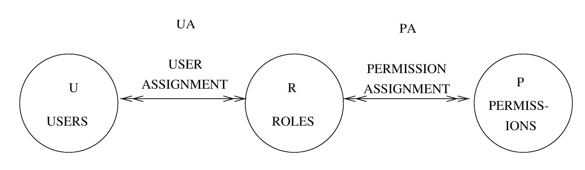
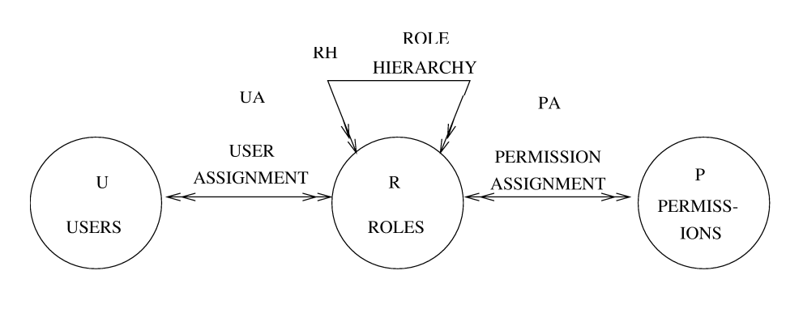
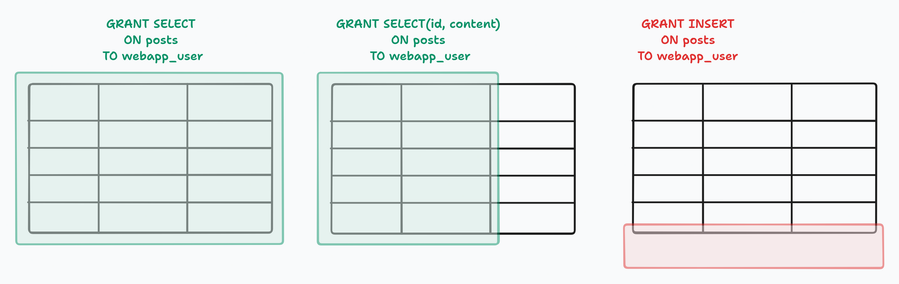
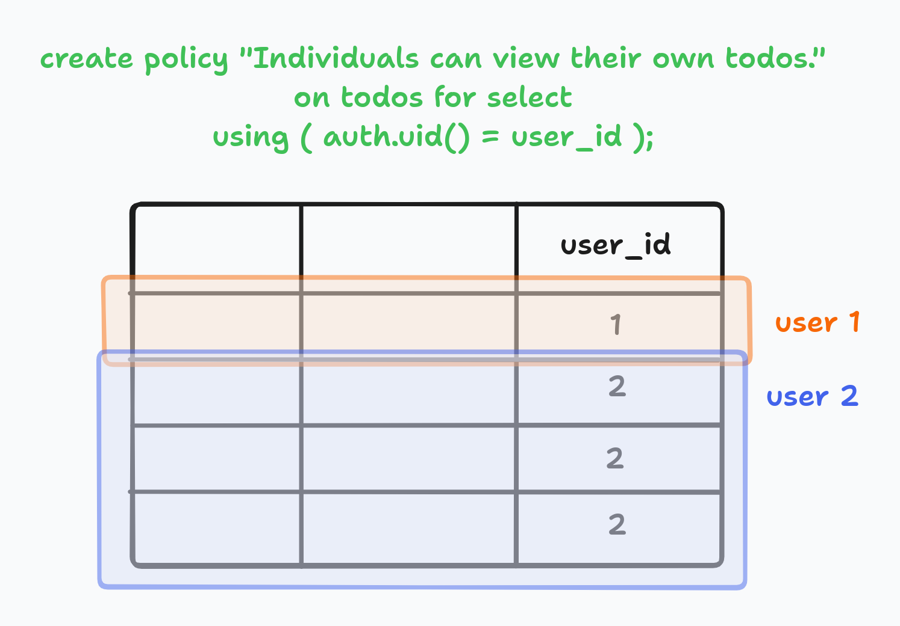
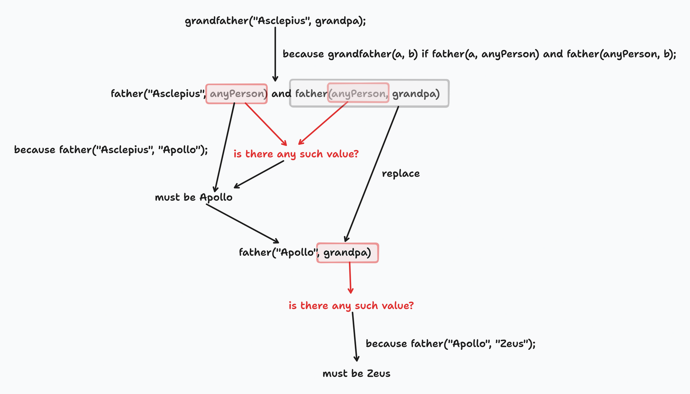
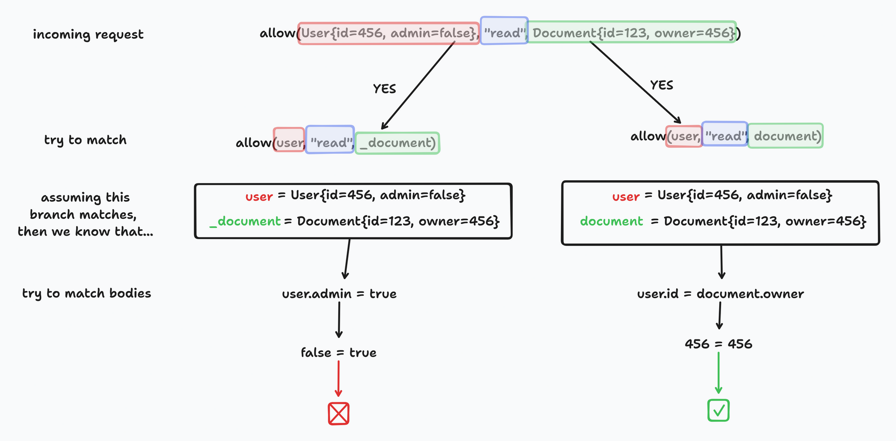
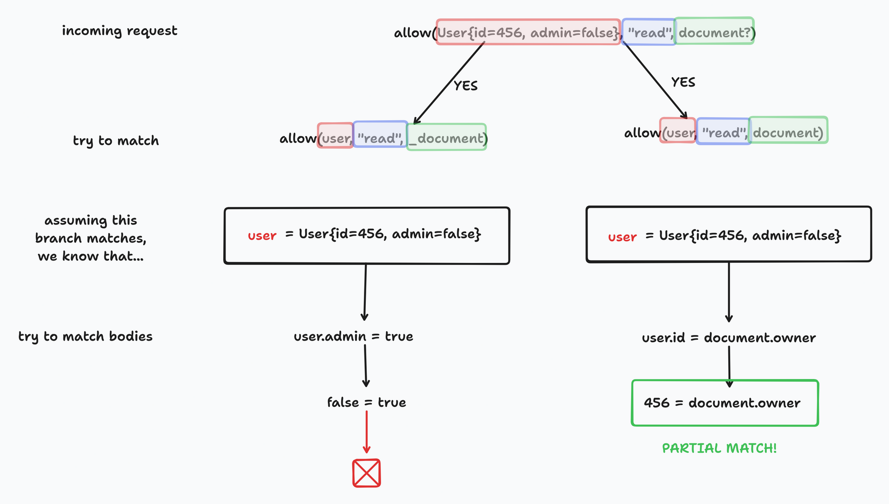

> **Author's note:** Hello! This article is split in two parts because it became too unwieldy for a single post. This is the first part, the second one [is here](/posts/advanced-authz-2).

In this article, we'll take a look at access control patterns that can be used on web applications. We'll start from the role-based system that many web frameworks showcase in their tutorials, and build up from there all the way to Google-scale systems that are inspired by the one that powers Google Drive's authorization mechanics.

## Introduction and motivation

There comes a time in the life of every web developer when he is faced with the task of implementing a feature that is tied to user identities.

Indeed, one could argue that such features are one of, if not _the_, defining feature of interactive web applications as opposed to read-only, public systems such as a blog. See [the Web 2.0 idea](https://en.wikipedia.org/wiki/Web_2.0) for more examples, fuzzy as the term may be. There are even web applications where you can't do anything without being logged in; see for example the AWS console. There's nothing there for you as an anonymous/unauthenticated user. _Everything_ happens as a specific user. Twitter has been mostly going the same way in the past few months (i.e. if you're not logged in, expect a _really bad_ experience, with login prompts in many unexpected places and a general lack of access to content).

So, you're building an application, and then it happens that you need user information to control access to data or operations. This can come in many forms, such as:

* "We want created/uploaded content to be associated to a user": every content site in existence, e.g. Youtube, Twitter, Facebook, Pinterest, TikTok, and friends. Everything where "users" upload "stuff", where every piece of "stuff" will have an author, with said author having superpowers over the piece of content, such as the ability to delete it, which no one else should have...
* ... well, except for the platform's moderation/trust&safety/whatever-they-call-themselves team, who can usually delete content or bring down the banhammer
* "We want owners of content to be able to share it with others": for example, Google Docs, where you create a document and then can provide emails of others that will have access to said document
* Different sets of actions may be available for other users: for example, Discord or Reddit moderators have access to powers and views of data that normal users don't have
* Some applications have the concept of "organizations", where having a certain role in one organization doesn't imply the same access in another: for example, as a Github user, you may belong to several organizations with differing privileges in each

All of these share a certain common pattern:

* There's users, who log into the application (aka _subjects_)
* There's pieces of data, which are stored in the application and displayed (aka _objects_)
* And there's a set of rules which govern which _subjects_ can perform which _actions_ on which _objects_ (aka _access rules_)

The entire problem of authorization boils down to finding a way to express and enforce those rules. Ideally in a way that can't be forgotten by mistake (nobody wants to find out that the `/videos/<video_id>/change_owner` endpoint doesn't verify that the calling user is the current owner before transferring the video to someone else). Ideally quickly (you don't want your authorization check to take a couple of seconds, since it should be called on every request). Ideally in a way that is easy to understand (or else no one will ever dare to change the rules, and the whole authorization system will probably be abandoned when it can't reflect the changing rules). Ideally in a flexible way (it's not fun to find out that "well, the system can allow users to read all posts or none at all. Oh, you need some posts to be readable by only some users? No, that's not possible")

## Concepts

We'll be throwing around the terms _authentication_ and _authorization_ quite liberally in this article, so let's [define them first](https://auth0.com/intro-to-iam/authentication-vs-authorization):

* Authentication (aka AuthN) is the process of _establishing_ an identity. This is the step where the application asks for a password, collects a one-time token, communicates with a [FIDO2](https://en.wikipedia.org/wiki/FIDO_Alliance#FIDO2) hardware-based key, or whatever. After this step, the application should have a secure, unforgeable way of identifying a request as coming from a certain application user. This is typically done with cookies or a header
* Authorization (aka AuthZ) is the process of verifying which resources a certain user can access, and enforcing said permissions (e.g. by denying access with a [403](https://http.cat/status/403) or [404](https://http.cat/status/404) HTTP status code, whichever makes more sense)

While I have no authoritative sources for this claim, it seems to me like you can think of authentication as a one-off process that is performed as you start using the application (or, at most, quite rarely as your session expires and needs to be refreshed), while authorization is an ongoing process that is continually performed, on every request.

## The current state of things

[Every](https://www.passportjs.org/concepts/authentication/password/) [web](https://seefnasrul.medium.com/create-your-first-go-rest-api-with-jwt-authentication-in-gin-framework-dbe5bda72817) [framework](https://docs.djangoproject.com/en/4.2/topics/auth/default/) [under](https://learn.microsoft.com/en-us/aspnet/core/security/authentication/add-user-data?view=aspnetcore-7.0&tabs=visual-studio) [the](https://laravel.com/docs/10.x/authentication) [sun](https://www.freecodecamp.org/news/how-to-add-jwt-authentication-in-fastapi/) tends to have a tutorial, either official or third-party, that shows how to add authentication to said framework. They tend to follow the same lines:

* Create (or, for some more batteries-included frameworks such as [.NET Core](https://learn.microsoft.com/en-us/aspnet/core/security/authentication/add-user-data?view=aspnetcore-7.0&tabs=visual-studio) or [Django](https://docs.djangoproject.com/en/4.2/topics/auth/default/), just enable) a User model, which creates a database table that holds information about users
* In the simplest case (user+password login, with no federated login such as Google or Github login), the table should hold the user identifier, a hash of the password, and any other user-specific information such as the display name, email, bio and so
* Create a `/signup` endpoint that takes information from a "Sign up!" form and creates a new record in that table
* Create a `/login` endpoint that receives user credentials (username+password) and tries to check them against the DB
* If there is a matching user, somehow provide the application with a way of proving which user it's acting as. The preferred methods are [cookie-based sessions](https://www.passportjs.org/concepts/authentication/login/) and [JWTs that are passed as headers](https://seefnasrul.medium.com/create-your-first-go-rest-api-with-jwt-authentication-in-gin-framework-dbe5bda72817)
* Then, on every "protected" endpoint, use said way to retrieve the user

And that's where most tutorials end: by declaring a protected endpoint, say `/profile`, which can only be called by authenticated users. This endpoint responds with a bunch of user information, such as the display name. This proves that authentication is working, since the application is now fetching the current user's information in the profile endpoint.

Honorable mentions in the frameworks linked above go to [Django, with its Groups and Permissions system](https://docs.djangoproject.com/en/4.2/topics/auth/default/#permissions-and-authorization), and [Laravel, which has Policies](https://laravel.com/docs/10.x/authorization#writing-policies). They provide the beginnings of an authorization system (and, for Laravel, it even goes all the way to ABAC, though without data filtering. More on that later). Others stop at just giving you a way to access the current user object in a controller/handler/router.

## Hand-rolled authorization checks

This is probably the first approach that people take when implementing authorization: add a check on every handler that needs one. The authorization checks are thus expressed as code that is stored on every handler that needs to be protected.

For example, [this would be a Flask example](https://medium.com/@aadilahmed0/user-authentication-in-a-flask-restful-api-8842f4ff4965), purely because Flask tends to have short, self-contained handlers that lend themselves well to discussing them in isolation:

```py
# POST /login
class Login(MethodView):
    def post(self):
        username = request.get_json()['username']
        password = request.get_json()['password']

        user = User.query.filter(User.username == username).first()
        if user and user.authenticate(password):
            session['user_id'] = user.id # Set user_id on cookie
            return user.to_dict(), 200
        else:
            return {'error': '401 Unauthorized'}, 401
			
# POST /logout
class Logout(MethodView):
    def post(self):
        session['user_id'] = None
        return {}, 204

# GET /profile
class UserProfile(MethodView):
    def get(self):
        if not session.get('user_id'):
            return {'error': '401 Resource not found'}, 401

        user = User.query.filter(User.id == session['user_id']).first()
        return user.to_dict(), 200
```

This contains the three main endpoints: `/login`, `/logout` and `/profile`. `/profile` is the protected endpoint that needs a user to be logged in, since it fetches that user's information and returns it as a JSON response. The `/login` endpoint verifies the user's credentials and, assuming that they match, [uses Flask's session](https://testdriven.io/blog/flask-sessions/) to store a cryptographically-signed user ID as a cookie.

Being a cookie, this user ID will be stored by the user's browser and then sent to the server on every request, until cleared (i.e. until the `/logout` endpoint is visited). The signature ensures that the user can't just edit the cookie in his browser to refer to another user ID, since the signature won't then be correct, as long as the signing secret is kept... well, secret.

Thus, this `user_id` will be accessible on protected endpoints. The `/profile` endpoint makes use of this ID to fetch the user object from the DB, at which point the application can do things with it. Here it merely  does a `return user.to_dict()`, but since the user is a full [SQLAlchemy ORM object](https://docs.sqlalchemy.org/en/20/orm/queryguide/select.html), it would be possible to access any fields in the object, such as `user.bio` or `user.is_admin`, if such fields existed in the User table in the DB.

This pattern (`/login` endpoint sets a cookie, then protected endpoint fetches the user by reading the user ID from the cookie) is sufficient for some usecases:

* Ensuring that all posts are created by the user that is logged in
* Fetching the user's profile
* Making comments

```py
# POST /profile (updates the user's profile)
class UserProfile(MethodView):
    def post(self):
        if not session.get('user_id'):
            return {'error': '401 Resource not found'}, 401

        user = User.query.filter(User.id == session['user_id']).first()
			
        email = request.get_json()['email']
        name = request.get_json()['name']
        bio = request.get_json()['bio']

        user.email = email
        user.name = name
        user.bio = bio
        db.session.commit()
            
        return user.to_dict(), 200

# POST /articles/<int:article_id>/comments
class Comment(View):
    def post(self, article_id):
        if not session.get('user_id'):
            return {'error': '401 Resource not found'}, 401

        content = request.get_json()['content']
        
        user = User.query.filter(User.id == session['user_id']).first()
        article = Article.query.get(article_id)

        new_comment = Comment(user=user, content=content, created_at=datetime.now(), article=article)
        db.session.add(new_comment)
        db.session.commit()

        return {}, 201
```

The profile update handler, as you can see, only receives the new (desired) data from the user: display name, email and bio. The user ID isn't set in the form, as that would let users potentially tamper with it to change another user's profile data.

Instead, the user ID (which is the entity on which the new data will be written) is extracted from the session. This lets the application identify the user that is performing the action, and the operation will be implicitly applied on _that_ user.

For the comment posting, we want every comment to belong to a user. This is achieved, once again, by fetching the user by reading the user ID from the session, and using the fetched user object when constructing the new Comment entity. Thus, whenever a comment is created, it'll be linked to the user that had a session when the creation request was made. Again, this prevents users from making comments in other users' names.

Thus, this simple pattern is enough when:

* You need to simply display some user info, which typically only happens when viewing some sort of "Profile", "Dashboard" or "About me" page
* You need to create entities that are linked to the user, as would happen on every application where entities are owned by users

However, this approach can become quite verbose and fragile once you need other requirements:

* Only users that have the Author role can create posts
* Users should only be able to edit their own comments, except for users who are Moderators, who can edit all comments
* List all the comments that this user can see
* List all the actions that this user can execute on this comment

The main reasons are that a) lacking a higher-level abstraction over users (such as groups or permissions) means that now you have to code to user properties, and b) the authorization code is spread over every handler. You can refactor it out into reusable functions, but you still have to call them at every point.

## Roles (RBAC)

Let's look at [Django's group system](https://testdriven.io/blog/django-permissions/) for an implementation, though you should be able to do RBAC on any framework.

The built-in Django User model has to-many relationships to the Group and Permission models. Also, the Group model has its own to-many relationship to Permissions.

Permissions can be identified by a string key, such as `blog.view_post` or `blog.set_published_status`. Permissions can be checked on controllers, thus providing the application with a way of enforcing access rules:

```py
from django.contrib.auth.decorators import permission_required

@permission_required("blog.view_post")
def post_list_view(request, post_id):
    # fetch post by querying the Post with ID=<post_id>
    return HttpResponse(...)
```

Django already takes care of merging "direct" permissions (i.e. those set directly on the user) and "group" permissions (i.e. those that are granted to the user via the groups that he belongs to). Controllers just check for permissions, irrespective of the way in which they were granted. Similarly, if several groups provide the same permission to a user, it all works out as expected.

By the way, RBAC is probably the only authorization scheme in the world [that has a formal NIST paper specifying it](https://csrc.nist.gov/CSRC/media/Publications/conference-paper/2000/07/26/the-nist-model-for-role-based-access-control-towards-a-unified-/documents/sandhu-ferraiolo-kuhn-00.pdf). Most systems would implement Flat or, at most, Hierarchical RBAC:





This works well for access rules that can be expressed as "only users with role X can call endpoint Y", since then you'd just add a permission check as a decorator on that controller. In other words, Django's system (and, in general, RBAC systems) is fine for `(user, action)` tuples, such as `(user:1, create_post)`, or `(user:1, launch_nukes)`. However, by itself it isn't able to express `(user, action, object)` tuples, such as `(user:1, edit_post, post: 1)` (i.e. "The user with ID 1 can edit the post with ID 1"), or rule-based conditions such as "a user can only edit the posts whose `author_id` matches the user's ID". In other words, you can't build a multi-country nuke management platform where every country can only launch its own nukes, i.e. a request to `POST /nuke/<id>/launch` is only approved if `user.country.id == nuke.country.id`. Some people can launch _all_ the nukes (those that have the NukeLauncher role), others can't launch any (those that don't have it).

From the cases that we listed at the end of the previous section, thus, RBAC can handle this one:

* Only users that have the Author role can create posts

However, it still doesn't help when trying to handle the rest:

* Users should only be able to edit their own comments, except for users who are Moderators, which can edit all comments
* List all the comments that this user can see
* List all the actions that this user can execute on this comment

For example, simple roles can't express that "users should only be able to edit their own comments". It could, however, express that "users who are Moderators can edit all comments", by adding a role check on the `POST /comments/<id>` handler. However, a `edit_comment` permission isn't enough to encode the condition that users can only edit their own comments (i.e. plain permissions are all-or-nothing).

In this respect, RBAC is similar to [database privileges](https://www.postgresql.org/docs/current/ddl-priv.html). If we mapped database tables to web application controllers, database privileges (e.g. `SELECT ON comments` or `UPDATE ON user_profiles`) would roughly correspond to Django's permissions (`read_comments` and `update_profiles` respectively), and [database roles](https://www.postgresql.org/docs/current/database-roles.html) would correspond to Django groups. Much like DDL permissions, RBAC is all-or-nothing at the entity level: you can either create comments or not, read posts or not, update documents or not. Again, this means `(user, action)` tuples. You don't get object-level permissions.

If you need object-level permissions on a RBAC system (e.g. only a post's author can edit it), you're once again stuck implementing such checks yourself, in your controller code.

Besides, RBAC doesn't let you go "in reverse", from the authorization rules to a set of entities that a certain user is authorized to see or otherwise act upon. You need to have a concrete instance of an object, at which point the application can evaluate the user's roles and determine if the action is allowed or not. In other words, while RBAC applications can answer the question "can user 1 edit post 1?" (though note that they do it by utterly ignoring the specific details of post 1), they can't answer the question "which posts can user 1 edit?" Imagine if Google Drive couldn't provide you with a list of documents that you're allowed to see.

To answer those questions, we need a more advanced form of access control. Most articles then jump in complexity from RBAC to ABAC, so we'll do that too.

## Attributes (ABAC), or the rise of logical programming

[AWS defines ABAC](https://docs.aws.amazon.com/IAM/latest/UserGuide/introduction_attribute-based-access-control.html) as "an authorization strategy that defines permissions based on attributes". Why, of course, attribute-based access control uses attributes to control access.

Seriously, though, AWS's ABAC system lets you attach _tags_, which are arbitrary attributes, to both users and resources (let's say, EC2 instances). Then, you can create a _policy_ that states that access is only allowed when the user and the resource share the same value for the tag.

In general, ABAC approaches have _some_ way of specifying logical expressions, such as `user.department == object.department`, `user.is_superuser == true` or `user.job_title.contains("Manager")`. Logical expressions would be anything that evaluates to a boolean, such as logical operators (`==`, `!=`) or boolean-returning functions (`<string>.contains(...)` or `<string>.startsWith(...)` for strings, `<array>.isEmpty()` for arrays, or whatever). Typically, these boolean expressions have access to:

* The user that is performing the request that is being authorized, sometimes called the _subject_ or _principal_
* The object that is being operated upon
* The action that is being performed by the subject on the object
* Optionally (and this is usually added to the Pros column of articles that discuss ABAC) there may be a _context_ or _environment_, which is a catch-all container of anything else that doesn't cleanly belong to the user nor the resource. Typical examples include the time of day (so you can implement rules such as "a bank teller can only authorize transactions inside of normal work hours") or source IP (so you can have rules such as "requests to add a new admin must come from inside the corporate network")

### Laravel's Policies

Laravel is the only web framework that I've seen that natively supports ABAC, [in the form of Policies](https://laravel.com/docs/10.x/authorization#writing-policies). For example, you can write a policy that determines whether a user can update a post, which for this case we assume can only happen if the user is the post's author:

```php
<?php
 
namespace App\Policies;
 
use App\Models\Post;
use App\Models\User;
 
class PostPolicy
{
    /**
     * Determine if the given post can be updated by the user.
     */
    public function update(User $user, Post $post): bool
    {
        return $user->id === $post->user_id;
    }
}
```

Pretty simple to understand. The `update()` function takes a User and an Object, both of which are plain ORM objects, and then does whatever it needs to in order to return a boolean. Here, it's a straight comparison. However, other conditions are possible:

```php
class PostPolicy
{
    public function update1(User $user, Post $post): bool
    {
        return $user->id === $post->user_id || $user->is_superuser;
    }
	
    public function update2(User $user, Post $post): bool
    {
        return $post->is_public;
    }
	
    public function update3(User $user, Post $post): bool
    {
        $current_hour = date('H')
        return $current_hour >= 9 && $current_hour < 17;
    }
}
```

`update1` has the same logic, with an escape hatch for superusers (who can update any post). `update2` ignores the User altogether, instead allowing anyone to edit Posts that have been marked as public. `update3` demonstrates some form of access to a "context", by only allowing the operation to succeed in standard US 9-to-5 work hours.

Laravel's Policies can be used when the user and object are known, such as when checking if an update of a certain Post should be allowed to proceed. However, it can't be used to guard the endpoint that lists all Posts that the user has access to. It may be possible to use [something like Dynamic Scopes](https://laravel.com/docs/10.x/eloquent#dynamic-scopes) to provide a prefiltered "view" of the data, but that is beyond the scope of Policies and thus would introduce duplication.

### Casbin

[Casbin](https://casbin.org/) is a project that implements several authorization schemes, including ABAC. It's mostly Go-based, though it implements libraries in many programming languages apart from Go, such as JS, Python, PHP, .NET, Java, Rust and Lua.

It may just be my fault, but I've found Casbin's mental model to be quite difficult to understand. The distinction between model and policy, for example, seems to be quite weird. I understand that it's what lets Casbin switch between ACL, RBAC, ABAC and other schemes, but it's yet another layer of indirection that you must understand. So keep in mind, when reading this section, that if something seems unclear it may just be my own misunderstandings showing. Go [to the docs](https://casbin.org/docs/category/the-basics) in case of any doubts. 

This model file expresses an ABAC system:

```
[request_definition]
r = sub, obj, act

[policy_definition]
p = sub_rule, obj_class, act

[policy_effect]
e = some(where (p.eft == allow))

[matchers]
m = eval(p.sub_rule) && class(r.obj) == p.obj_class && r.act == p.act
```

This states that:

* Requests, which are the authorization queries that the application will submit when running (i.e. "can user A perform action B on object C?"), will have three fields: `sub`, `obj` and `act`
* Policies, which are the actual access rules, will also have three fields: `sub_rule`, `obj` and `act`
* A policy effect, which states that if a match was found (see below) between any policy in the system and the incoming request, then the request will be allowed
* The matching expression, which has access to `p` and `r` and must return a boolean that determines whether the policy `p` applies to request `r`

Note that, since the matcher expression has an `eval()` call, the policy's `sub_rule` will be executed. This execution will also have access to `r`, from where it could access `r.sub` and `r.obj` to express whatever rules are required.

For example, the following policies could implement the "posts can only be edited by their authors" business rule:

```
p, r.sub.ID == r.obj.AuthorID, Post, update
p, r.sub.IsModerator, Post, update
```

This implements a single policy rule that is applied to Posts (as a class of objects, not as one specific Post) and states that the `update` action can only be performed if the expression is satisfied. The expression will be evaluated on-demand, whenever a request comes in. The exact way in which the evaluation happens depends on which language is being used, but it's typically a function called `Enforce()` which receives a subject, object and action.

For example, this is Casbin's Go library:

```go
sub := "alice" // the user that wants to access a resource.
obj := "data1" // the resource that is going to be accessed.
act := "read" // the operation that the user performs on the resource.

if res, _ := e.Enforce(sub, obj, act); res {
    // permit alice to read data1
} else {
    // deny the request, show an error
}
```

For example, here's that code integrated in [Fiber](https://gofiber.io/):

```go
app.Put("/post/:id", func(c *fiber.Ctx) error {
    var post Post
    db.First(&post, c.Params("id")) // Retrieve the post
    // We assume that the Post struct has an AuthorID field

    userID := sess.Get("user")
    var user User
    db.First(&user, userID) // Retrieve the user
    // We assume that the User struct has an ID field

    if res, _ := e.Enforce(user, post, "update"); res {
        // Update post by reading stuff from body
        return c.SendStatus(fiber.StatusOK)
    } else {
        return c.SendStatus(fiber.StatusForbidden)
    }
})
```

This code hydrates the Post from the DB, based on its ID (which is retrieved from the URL). The User is also hydrated in a similar manner, but its ID is fetched [from the session](https://docs.gofiber.io/api/middleware/session) instead. Then, the enforcement function is called to check whether the User can update the Post.

So, Casbin can be used to express authorization rules that have access to [a decent amount of operations](https://github.com/Knetic/govaluate). These rules can then be used when deciding whether a User should be allowed to perform an Action on a Resource.

However, AFAICT, [Casbin can't be used in the reverse direction](https://github.com/casbin/gorm-adapter/issues/12), to find which Resources can a given User perform an Action on. In other words, it's good for single-point enforcement, such as guarding the `PUT /posts/<id>` endpoint that updates a single post. It can't, however, be used on the `GET /posts` endpoint, which should return every post that the current user has read access to. Or rather, it _can_ be used for that, but not when expressing authorization rules as logical expressions.

### Honorary mention: Postgres's Row Level Security

Although it isn't a web framework, Postgres ships with a very capable system to control data access at the row level. [This is a very good introduction](https://pgdash.io/blog/exploring-row-level-security-in-postgres.html) to the subject, and [so is Supabase's article](https://supabase.com/docs/guides/auth/row-level-security); which, while geared towards Supabase's implementation of RLS, is perfectly good for understanding the underlying concepts (since Supabase is Postgres under the hood).

Most SQL databases have a way of restricting access to entire tables or columns, via `GRANT` statements:

 

However, what Postgres's RLS brings to the table is a new way of limiting access: by reading user properties and using them in conditions. These conditions are effectively `AND`ed together with whatever SQL query the application is performing, thus functioning as per-user limiters to the data that can be accessed:



For example, this RLS policy, on Supabase:

```sql
create policy "Individuals can view their own todos."
on todos for select
using ( auth.uid() = user_id );
```

would mean that, if a user runs this query:

```sql
select *
from todos
```

then what the DB would _actually_ evaluate would be the following:

```sql
select *
from todos
where auth.uid() = todos.user_id;
```

This means that the web application is kept happily unaware of authorization policies. From the point of view of the application (and, by extension, the user), the query has returned "all the todos". Behind the scenes, however, Postgres itself has redefined what "all" means so it no longer means "literally every todo in the table", but instead "every todo as long as its `user_id` matches the current user's ID".

Of course, it's trivial to add an exception so superusers can read every todo (note that this uses [Supabase's integration with JWTs](https://supabase.com/docs/guides/auth/row-level-security#authjwt) to feed user data, such as whether it is a superuser):

```sql
create policy "Superusers can see every todo" 
on todos for select
using ( auth.uid() = user_id OR (auth.jwt() -> 'is_superuser') = TRUE);
```

And since the authorization rules are added at the query level by the database engine itself, even aggregations work as you'd expect:

```sql
select count(*) 
from todos;

-- becomes

select count(*) 
from todos
where auth.uid() = todos.user_id;
```

If the application sends a query to count all the todos, the DB will return the correct count (i.e. of only those todos that the user can see). The same goes if the application tried to, say, filter only unfinished todos: it'll only get back unfinished todos _that belong to that user_. In other words, there's no escaping the rules. They follow you. If the policies don't let you see a record, it's indistinguishable from the record not existing _at all_. Not even knowing the record's ID will give you access. For example, let's say that you _know_ somehow that todo 123 exists, but you can't see it because it's not yours. Even with the ability to request arbitrary IDs (say, if you opened a todo of your own and then messed with the URL so it pointed to todo 123), the SQL query wouldn't leak the existence of that todo:

```sql
select count(*) 
from todos
where id = 123;

-- becomes

select count(*) 
from todos
where id = 123 AND auth.uid() = todos.user_id;
```

This query will only return todos with ID 123 and `user_id` equal to your ID. Since we stated before that todo 123 doesn't belong to you, there are no records where that condition holds, and the query will simply return 0 results. This is indistinguishable from running `SELECT * FROM todos WHERE id = <some_id_that_doesnt_exist>`.

### The Oso Library

Finally, a last contender in the field of ABAC. It's [the Oso Library](https://docs.osohq.com/), a product by [Oso Security](https://www.osohq.com/). Don't confuse it with [Oso Cloud](https://www.osohq.com/docs/concepts/what-is-oso-cloud), which is a hosted (SaaS) service that, while using the same language (Polar) to express policies, has an entirely different mental model. In fact, it's a Zanzibar-like system that is more akin to ReBAC. We're getting to that, by the way: the next section will be all about Zanzibar-ish systems. For now, let's just focus on the Oso Library, which is a fully-featured ABAC system.

> The Oso Library is a batteries-included framework for building authorization in your application. With Oso, you can:
> 
> * **Model:** Set up common permissions patterns like RBAC and relationships using Oso’s built-in primitives. Extend them however you need with Oso’s declarative policy language, Polar.
> * **Filter:** Go beyond yes/no authorization questions. Implement authorization over collections too - e.g., “Show me only the records that Juno can see.”
> * **Test:** Write unit tests over your authorization logic now that you have a single interface for it. Use the debugger or tracing to track down unexpected behavior.

Oso uses a domain-specific language called Polar (get it? It's probably clearer for Spanish speakers. If you missed the joke, _oso_ in Spanish means _bear_, which matches Oso's logo and the name Polar). Polar [is a declarative programming language](https://docs.osohq.com/learn/polar-foundations.html) that has syntax and semantics [inspired by Prolog](https://www.osohq.com/post/polar-adventure), which in turn is a quite old logical programming language. Polar is used to declare policies.

An advantage of using a logical programming language is that you get a few quite arcane concepts for free, which happen to be very useful when answering authorization queries. In particular, you get [unification](https://hanielb.github.io/2020.2-lp/12-prolog/unification/) and [partial evaluation](https://www.dsi.unive.it/~michele/Papers/naclp89.pdf). We'll see how useful they are soon.

For example, let's say that we had the following Polar rules:

```prolog
# knowledge base (i.e. things that we know to be true)
father("Artemis", "Zeus");
father("Apollo", "Zeus");
father("Asclepius", "Apollo");

# rules (if X is true, then Y is also true)
grandfather(a, b) if father(a, anyPerson) and father(anyPerson, b);

# now questions!
grandfather("Asclepius", grandpa);
# this binds the grandpa variable to Zeus
```

First we have a "knowledge base" (this term is [borrowed from Prolog](https://www.let.rug.nl/bos/lpn//lpnpage.php?pagetype=html&pageid=lpn-htmlse1)), which is a set of things that are simply true. Here it's a set of is-father relationships.

Then, there are inference rules. Here we have one: the grandfather of `a` is `b` if there is _any_ value for `anyPerson` that can be written such that the father of `a` is `anyPerson` and the father of `anyPerson` is `b`.

Read that again, slowly, because it's the core of everything. Unlike your standard programming languages, Prolog and friends let you declare free variables (here `anyPerson`), and the runtime takes care of trying to find a value that satisfies all the conditions.



Above is a graph showing an approximation of the rules that a logical evaluator would apply. From the original question (is there any value for `grandpa` that satisfies `grandfather("Asclepius", grandpa)`?), the evaluator expands it (via the `grandfather` rule definition) into two rules, which are joined by the common `anyPerson` variable. Since the first part of the rule is `father("Asclepius", anyPerson)` and we know, because of the knowledge base, that `father("Asclepius", "Apollo")`, we can deduce that if `anyPerson` has any value at all, it must be `"Apollo"`.

Then, that value is (tentatively) replaced into the second part of the rule, `father(anyPerson, grandpa)`. Since we have a potential value for `anyPerson`, that value is replaced and the rule becomes `father("Apollo", grandpa)`. Again, the evaluator grabs a fact from the knowledge base and deduces that setting `grandpa` to `"Zeus"` would satisfy it. At this point, there are no variables left, and the question `grandfather("Asclepius", grandpa)` can be satisfied by setting `grandpa` to `"Zeus"`. Thus, this value is returned to the user.

This example with Greek gods may not look like much, but a fairly similar process happens on authorization checks. For example, to check which Posts can a certain user read, we can ask for `has_permission(user:123, "read", post)`. Similar to the example above, `post` is an unbound variable, much like `grandpa`. If you submit that to the engine, it'll do whatever magic it can and return you all the values of `post` that satisfy the question. Those values are exactly the posts that the user can read.

Actually, that's more like the way in which Oso Cloud works, since it has an entire knowledge base. The Oso Library, which doesn't have a knowledge base in which every user and resource handled by the application exist, works in a different way, which is at least as cool as variable resolution.

#### Forward resolution (user+object to boolean)

This is a simple Oso policy, expressed in Polar:

```polar
# A user that is an administrator may read any document.
allow(user, "read", _document) if
    user.admin = true;

# A user may read any document that they own.
allow(user, "read", document) if
    user.id = document.owner;
```

Now, let's say that you're handling a request for `GET /documents/123` (i.e. a read for document 123). Let's further assume that you've detected, perhaps by looking at a cookie, that this request is being made by user 456. You've also fetched both from the DB and know the details of both user 456 and document 123. Now, you make a call to `oso.authorize(user, "read", document)`. The following cases are possible:

* If the user is an admin, then the first rule will match
* If the user is not an admin, but document 123's owner is user 123, then the second rule will match
* In any other cases, no rules will match

In the first two cases, Oso will return `true` to the application. In the last one, Oso will return `false` (actually, an exception, at least in the Python bindings). The application can then capture that value and act accordingly (proceed as normal in the first cases, or return an error code in the latter).

Execution proceeds by "pattern-matching" the incoming authorization request against _all_ the rules in the policy. It's as if the engine tried to "superimpose" the incoming request with every rule in the policy, discarding those that definitely don't fit (e.g. because they don't have the correct amount of values, or because there are two constants that are _not_ the same, so they'll never match). If two positions _may_ match because one or both of them is a variable, the engine temporarily assumes that they match and tries to dig deeper. 

Here's an example evaluation. As a reminder, we're trying to determine whether the user with ID 456, who isn't an admin, can read document 123, which is owned by user 456. We expect the user to be able to read the document, since he's the document's owner. Oso will try to match the incoming data against every rule:



First, the engine tries to pattern-match (in parallel) the incoming request against every policy. At first glance, both match, because they are both `allow()` calls that have three arguments, with the second one being `"read"` on both the rules and the incoming request.

Since both rules have a body (the part that goes after the `if`), the body must also be satisfied in order for that rule to match. Therefore, the engine temporarily binds the variables in the head of the rule to the values that came in from the request (i.e. the actual values for both the user and the document) and tries to recursively satisfy the body of the rule. If that can be done, the entire rule will be reported as a match.

For the first one, it binds `user` to the user object and `_document` (which isn't used, hence the leading underscore) to the document. Then, it tries to check if `user.admin` equals `true`, which isn't correct, because the value of `user` can be replaced, leaving us with `false = true`, which is a contradiction and never true. Thus, the given value of `user` doesn't and can never satisfy `user.admin = true`, therefore the first policy rule can't be satisfied at all. You can think of Oso as "backtracking" out of the rule's body and reporting a failure to the entire rule. That first rule is dropped altogether, since Oso has proven that there's no combination of values that can satisfy it.

For the second rule, again, it binds `user` to the user object and `document` (with no underscore, because here the value is actually used) to the document. Armed with those values, the engine tries to find values that satisfy the rule's body, which is `user.id = document.owner`. Since the engine knows the values of `user` and `document`, it can simplify that expression to `456 = 456`, which is always true, so the second rule _can_ be satisfied. Since at least one rule can be satisfied, the entire query for `allow(User{id: 456, admin: false}, "read", Document{id=123, owner=456})` is proven to be satisfiable, and therefore Oso reports an authorization success.

This is the kind of evaluation that happens when the application is authorizing access to a single resource, since then it can get access to the three values that Oso wants: a user, an operation/action and an object.

Things get cooler, however, when we're dealing with data filtering, where we _don't_ know the object (indeed, we're trying to find which objects the user can perform the action on)

#### Reverse evaluation (inferring filtering criteria)

Previously we saw what would happen when a user visited `GET /documents/123`. Now, let's look at what happens when the same user visits `GET /documents`. We expect that to list all documents, _subject to the authorization rules_. If the user is an admin, we expect that endpoint to return every document in the DB. However, if the user isn't an admin, we expect the endpoint to only return documents which belong to that user (i.e. those that _would_ satisfy the second rule in the Polar policy).

As a reminder, this is the policy that we're working with:

```polar
# A user that is an administrator may read any document.
allow(user, "read", _document) if
    user.admin = true;

# A user may read any document that they own.
allow(user, "read", document) if
    user.id = document.owner;
```

Now let's say that the endpoint for listing documents is hit by a non-admin. In this case, we know the user _but not the document_, so evaluation is different:



As before, the first rule is tested and found to be unequivocally false, since the engine can lock onto a value for `user` and said value doesn't satisfy the rule's body. Therefore, there's no possible value for `_document` in the universe that would make that rule match, and so it's ignored.

The second rule, however, is interesting. We can bind the value of `user` to the actual user object, which has ID 456. The rule's body is `user.id = document.owner`, which we can simplify to `456 = document.owner`. We can't proceed any further, since the value for `document` wasn't provided (recall that the application didn't at this point know the actual document, since we're in an endpoint that lists all documents). However, while we don't know the value of `document`, we know at least _something_ about it: no matter what happens, its `owner` must be 456. Only those documents have any hope of satisfying a rule (the first rule won't be satisfied, ever, since it merely depends on the user being an admin, which the engine can determine to be false because it has a value for `user`).

The knowledge that `document.owner = 456` can be translated into a SQL `WHERE` clause, in much the same way as Postgres's RLS policies would work. If the application then runs `SELECT * FROM documents` and somehow adds the authorization queries to it, it'll get back only the documents that user 456 can read.

In the Oso Library, this is achieved through [integrations with several ORMs](https://docs.osohq.com/reference/frameworks.html), most notably Django's ORM and SQLAlchemy, which are the two leading Python ORMs.

To recap: when you're trying to apply authorization policies to determine which objects a user is allowed to read (or, in general, operate upon), Oso tries to resolve as much as it can, while keeping the variable that represents the object/resource an unknown. Everything that is left is transformed into partial `WHERE` clauses, which can be appended to the queries that the application would normally emit. These clauses have the effect of restricting [the universe](https://en.wikipedia.org/wiki/Universe_(mathematics)) of the query to just what the user can see, with no hope of the user ever escaping said universe.

As an aside, let's think of what would happen if an admin tried to list all documents. In such a case, the first rule (`allow(user, "read", _document) if user.admin = true`) would succeed (because it'd become `true = true`), and so Oso would know that, no matter the value of `document`, at least that rule would always match. Therefore, there's no condition that needs to be applied on `document`, and Oso would emit a `WHERE true` clause, which doesn't limit the query at all.

Actually, in that case Oso would emit `WHERE true OR owner = 456`, because technically both rules match: the first one matches at all times, while the second one matches if the document's owner is 456. However, `true or X` is always true no matter the value of `X`, so it's the same as `WHERE true`.

And there you have it! The Oso Library provides a way to authorize requests on single resources, and also a very elegant way of partially evaluating the authorization rules when trying to list all resources. These partially evaluated rules (in which everything about the user has already been resolved) then become `WHERE` clauses that are appended to the SQL queries that are emitted by the application.

A final note: though Oso themselves only provide, AFAICT, integration for data filtering with the SQLAlchemy and Django ORMs, both on Python (which, to be fair, probably covers a very good proportion of all Python web devs), and a sample implementation for [TypeORM](https://github.com/osohq/oso/blob/main/languages/js/src/typeOrmAdapter.ts) on JS/TS, it's also possible to [build your own adapter](https://github.com/osohq/oso/issues/1551) to add data filtering to other ORMs. The only two third-party implementations that a cursory Google search could find were [`@bleco/oso-juggler` for the Juggler ORM](https://www.npmjs.com/package/@bleco/oso-juggler) that comes bundled with the Loopback framework in JS, and [a Python adapter that I myself built some time ago](https://github.com/jreyesr/mongo-oso) that adds a subset of Oso's data filtering capabilities to MongoDB when using `pymongo`. If your project is using another ORM or DB engine, it may be possible to write an adapter for the ORM.

The main parts of an adapter [are described in Oso's docs](https://docs.osohq.com/node/guides/data_filtering.html#implementing-an-adapter). Essentially, you need to write a function that receives (from Oso) a Filter object, which is a half-evaluated policy. Any references to User fields (e.g. `user.admin`) will have already been converted to their actual values (either `true` or `false` for example), since the user object is available when evaluating data filtering queries. However, terms that refer to resource fields (e.g. `document.owner_id`) will appear as raw, unevaluated terms, since we don't know them yet.

For example, a (very simplified) representation of a Filter could be:

```json
{
  "model": "Document",
  "conditions": [
    {"lhs": "owner_id", "cmp": "Eq", "rhs": 1}
  ]
}
```

This filter could come from a policy like this:

```polar
allow(user: User, "read", document: Document) if
    document.owner_id = user.id
````

when invoked by a user with ID 1. As you can see, in the Filter that is received by the adapter the `user.id` reference has been replaced altogether with its true value of 1, as if the Polar policy were:

```polar
allow("read", document: Document) if
    document.owner_id = 1
````

Then, the Adapter must convert that into a SQL `WHERE` string, which it does by converting the `conditions` array (technically it's an array of arrays, but I've simplified it for this example). Each condition has a left-hand side, an operation and a right-hand side, which in this case is `owner_id = 1`. This translates into SQL, of course, as `WHERE owner_id = 1`, or into Mongo as `{"$eq": ["$owner_id", 1]}` in an aggregation pipeline, or into [Kibana Query Language](https://www.elastic.co/guide/en/kibana/current/kuery-query.html) as `owner_id:1` (I think), and so on.

## A stopping point

Thus concludes the first part of this series. It's gone on for long enough.

However, we're not nearly done yet! Many more authorization systems await us in the next post. Among them are OpenFGA, Oso Cloud, OPA and Cerbos.

The second post in the series [is here](/posts/advanced-authz-2).
