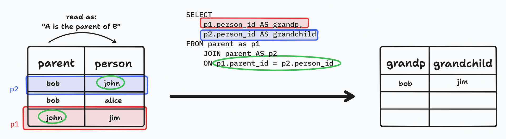
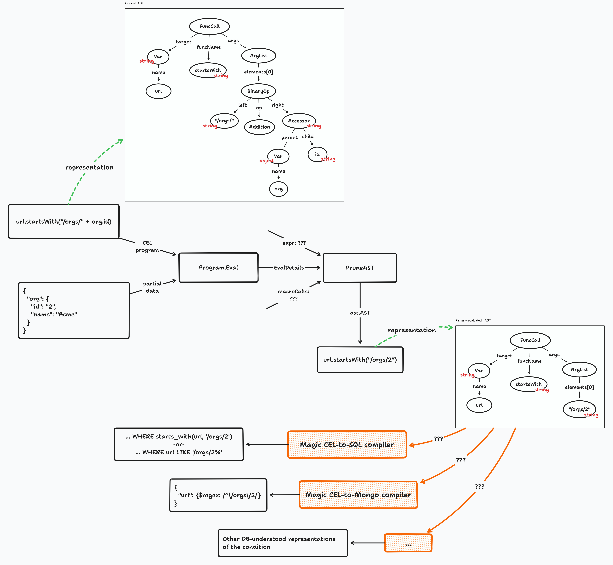

> **Author's note:** Hello again! This article became way longer than I expected, so I decided to split it. This is the second part, and you can read the first one [here](/posts/advanced-authz-1).

In this series, we're taking a look at access control patterns that can be used on web applications. We started from the role-based system that many web frameworks showcase in their tutorials, then built up from there to solutions that let us not only take into account the roles that the user has, but also properties of the _resource_ that the user is trying to access. Now we'll take a look at a class of Google-scale systems that are inspired by the one that powers Google Drive's authorization, a CNCF-blessed language and service that powers Kubernetes policies and more, and a few other solutions that don't neatly fit in boxes, some of which come from (and are used in) Amazon and Google.

## The arcane syntaxes: ReBAC

Relationship-based access control, ReBAC for its friends, is another approach to access control policies. Oso [claims that ReBAC is a subset of ABAC](https://www.osohq.com/post/ten-types-of-authorization), which we've just explored.

ReBAC, as its name implies, loves expressing _relationships_ between _things_. Just what those relationships (or things, for that matter) are is precisely what provides the access permissions: if there's a relationship between two things, access is granted. Otherwise, it is denied. This description is intentionally vague, as every system implements it in a slightly different way: the relationships and things are whatever the system is concerned with: documents, chat messages, files, reports, or whatever the system manages.

Pretty much everyone in this space takes inspiration from [Google Zanzibar](https://research.google/pubs/pub48190/). You probably haven't heard of it, and that's OK. It's a fairly obscure piece of technology, built by Google for its internal ~~dark purposes~~ needs. As far as I can tell, it has never been open sourced, and all that we have to go on is the Google paper (linked before) that outlines the system, the language that it uses and scalability considerations. Yet, for all its obscurity, Zanzibar underpins authorization across (at least some) Google products: indeed, all the examples in the paper are written in terms of Google Drive's auth model. Google being Google, everything is trillion-scale and they're _really_ concerned about latency and other problems that us mere mortals don't even care think twice about.

Despite Zanzibar's non-opensource-ness, there are several projects that implement Zanzibar-style systems, and we'll take a look at a few of them here. However, there are several more, but now you know the magic words that open the doors of knowledge: it's "zanzibar+open source" on Google.

You can identify a Zanzibar-inspired system because of a few key characteristics:

* They all tend to use something like Google Docs or Google Drive as a running example (you'll see "a document has Readers and Editors" everywhere)
* Everything is stored in `(user, relation, object)` triples. For example, `(user:1, owner, doc:auth-strategies)` indicates that the user with ID 1 is the owner of the `auth-strategies` document
* Usually, a purpose-built language is used to express rules that let the system deduce new relationships from those that already exist
	* The canonical example is "if a user is the owner of a document, then that user is also an editor on the document". This lets the system only store one triple (the one that contains the `owner` relationship), but any queries that ask "is the user an editor on the document?" will also find such a relationship, since it's computed on-the-fly
* The authorization system is a separate service (e.g. a Docker container), and the web application (or microservices, if you go that route) make network calls to it whenever it needs to answer an authorization question
* Said separate service has memory (e.g. a database), and _it stores all the relationship triples itself_. This is different from the Oso Library, where the authorization engine is a stateless system that is embedded in the application itself
* Since the authorization service stores triples, all the services that consume its verdicts must keep the authorization service's knowledge base up-to-date with fresh facts. 
	* For example, whenever a document is created (i.e. the `POST /documents` endpoint, or what have you), the service must send a write command to the auth system, so it adds the triple `(user:userid, owner, doc:docid)` to the knowledge base (this is because whoever creates a document is automatically its owner). 
	* The same happens whenever the user "invites" people to the document: a new triple has to be added with the new user's access level
* Similarly, whenever a user or resource is deleted, any facts about that entity must be retracted from the DB
* Since the authorization system has a copy of the resource IDs that the system works with (e.g. every user, every document and every folder in a Google Docs-style system), data filtering (i.e. answering the question "which documents can this user see?") is done by querying the auth system for the IDs that satisfy the required relationship with the user. This returns a set _of entity IDs_, which can then be fetched directly from the DB (e.g. `SELECT * FROM documents WHERE id IN(id_1_from_zanzibar, id_2_from_zanzibar, ...)`)
	* This is different from the Oso Library, where what Oso generates and then the application sends to the DB is _not_ a set of entity IDs that satisfy the authorization policies, but _the conditions that those entities must satisfy_. On the Oso Library, the DB itself discovered, say, the documents that the user could see, by evaluating `WHERE` clauses that expressed conditions. On a Zanzibar-style system, however, the application's DB receives a set of IDs, which is possible to do precisely because the Zanzibar-style system holds a copy of a bit of data (just the IDs)

If you see a system that satisfies all these conditions and (usually) proudly announces itself to be Zanzibar-inspired, odds are pretty good that it is Zanzibar-inspired (of course, if it announces it, then you don't really need to check the conditions, do you?)

With that out of the way, let's look at a few incarnations of ReBAC!

### Ory Keto

[Keto is a product  of Ory](https://www.ory.sh/keto/), which is a company that builds [a few auth-focused products](https://www.ory.sh/open-source/), such as an access proxy ([Oathkeeper](https://www.ory.sh/oathkeeper/)), a user management server ([Kratos](https://www.ory.sh/kratos/)) and an OIDC server ([Hydra](https://www.ory.sh/hydra/)). Plus cloud-hosted/SaaS services, but I'm only counting the open source stuff here.

Keto is deployed [as a plain Go binary or packaged in a Docker container](https://www.ory.sh/docs/keto/install). Once running, it exposes [REST](https://www.ory.sh/docs/keto/reference/rest-api) and [gRPC](https://www.ory.sh/docs/keto/reference/proto-api) APIs, which you call from your service(s) that require access control (this would be your Node/Go/Python/Java/.NET/Elixir/whatever web application or microservices or serverless/lambda functions or however you deliver your product). Keto has [SDKs for several programming languages](https://www.ory.sh/docs/keto/sdk/overview) which wrap the raw API calls into something that is more idiomatic for the programming language in use.

Also, if you're like me, you may look at Keto's docs and find them... sparse, shall we say. Like, really, [is that all](https://www.ory.sh/docs/keto/install)? Where are the guides? How do I _use_ Keto?

Fear not! They're just [somewhere else](https://www.ory.sh/docs/keto/). The docs that Keto's homepage takes you to are just the "operations"-focused stuff: how to deploy, upgrade and configure Keto. [These docs](https://www.ory.sh/docs/keto/), on the other hand, teach you how to actually use it.

You define an authorization policy in Keto by using the Ory Permission Language (OPL), [a language that is syntactically a subset of Typescript](https://www.ory.sh/docs/keto/reference/ory-permission-language). For example, here's a moderately-complex policy expressed in OPL, for a corporate-ish document management system (something like Google Docs, but it also has nosy managers who can read all the documents that their managees can read):

```ts
class User implements Namespace {
  related: {
    manager: User[]
  }
}

class Group implements Namespace {
  related: {
    members: (User | Group)[]
  }
}

class Folder implements Namespace {
  related: {
    parents: File[]
    viewers: (User | SubjectSet<Group, "members">)[]
  }

  permits = {
    view: (ctx: Context): boolean => this.related.viewers.includes(ctx.subject),
  }
}

class File implements Namespace {
  related: {
    parents: (File | Folder)[]
    viewers: (User | SubjectSet<Group, "members">)[]
    owners: (User | SubjectSet<Group, "members">)[]
    siblings: File[]
  }

  permits = {
    view: (ctx: Context): boolean =>
      this.related.parents.traverse((p) => p.related.viewers.includes(ctx.subject)) ||
      this.related.parents.traverse((p) => p.permits.view(ctx)) ||
      this.related.viewers.includes(ctx.subject) ||
      this.related.owners.includes(ctx.subject),

    edit: (ctx: Context) => this.related.owners.includes(ctx.subject),

    rename: (ctx: Context) => this.related.siblings.traverse((s) => s.permits.edit(ctx)),
  }
}
```

Let's look at that in some detail. There's plain TS classes, which represent both the users of the system and the entities that are handled by it (such as folders or documents). Each one may have the `related` and `permits` fields. `related`, as you'd expect, contains links to other objects (note that links are _always_ arrays, even if you'd expect there to only be one related object, such as the `User.manager` relationship)

`permits`, on the other hand, encodes which relationships are taken into consideration when trying to provide a certain permission. For example, take a look at the `view` permission in `Folder`: 

```ts
class Folder implements Namespace {
  related: {
    parents: File[]
    viewers: (User | SubjectSet<Group, "members">)[]
  }

  permits = {
    view: (ctx: Context): boolean => this.related.viewers.includes(ctx.subject),
  }
}
```

The `view` permission states that a certain user (which is passed to the function in `ctx.subject`, by the way) may view the document `this` if there is a relationship triple `(ctx.subject, viewers, this)`. In this case, since there's no computed groups (i.e. groups that users belong to merely by virtue of belonging to other groups), that'd require a triple with just those contents to have been inserted previously in Keto's knowledge base. Furthermore, the type of the `related.viewers` property, which is `(User | SubjectSet<Group, "members">)[]`, controls which triples could be inserted. For example, 

```
# VALID TRIPLES that are of type User
# read as "john is in viewers of folder evil-plans-2024"
# In general, read these tuples (A, B, C) as "A is in B of C" 
# or something similar that makes grammatical sense
(user:john, viewers, folder:evil-plans-2024) 
(user:jane, viewers, folder:evil-plans-2024)

# VALID TRIPLES that are of type SubjectSet<Group, "members">
# read as "people who are members of group evildoers are all in viewers of folder evil-plans-2024"
(group:evildoers#members, viewers, folder:evil-plans-2024)

# INVALID TRIPLES
# this would be invalid because the first component is not a User nor a SubjectSet<Group, "members">
(folder:evil-plans-2023, viewers, folder:evil-plans-2024)

# this would be invalid because the second component (the relation) 
# isn't "viewers" or "parents", which are the only two relations 
# that Folder has
(user:john, owners, folder:evil-plans-2024)

# this is invalid because viewers only accepts the "members" relationship for Group
(group:evildoers#auditors, viewers, folder:evil-plans-2024)
```

Now, let's say that the user `attila` (an honorary member of the Evildoers group, or so I'm told[^1]) creates a file called "Evil Kickoff meeting". As part of that `POST /files` request, apart from saving the actual DB record and whatever else is normally done, the application must [submit a relationship creation command to Keto](https://www.ory.sh/docs/keto/reference/rest-api#tag/relationship/operation/createRelationship), with the following body (if using the REST API. There's also a Protobuf/gRPC API):

```json
{
  "namespace": "File",
  "object": "evil-kickoff-meeting",
  "relation": "owners",
  "subject_id": "attila"
}
```

This creates the following triple in Keto's knowledge base:

```
(User:attila, owners, File:evil-kickoff-meeting)
```

or, in arcane original Zanzibar syntax,

```
folder:evil-kickoff-meeting#owners@user:attila
```

If instead Attila had decided to create that file in the context of the Evildoers group, rather than as a personal file of his, the inserted tuple would be different:

```
(Group:evildoers#members, owners, File:evil-kickoff-meeting)
```

This states that all members of the Evildoers group are owners of the Evil Kickoff meeting file. Or, in other words, the file belongs to the group. Stalin (another member of said group) wholeheartedly approves of such redistribution of files to the collective, BTW.

Now, let's say that Attila created that file on the Evildoers group (not for himself). And now Mr. Al Capone tries to access that file by making a request `GET /files/evil-kickoff-meeting`. Near the start of that request handler, the application issues [a request to check the permission](https://www.ory.sh/docs/keto/reference/rest-api#tag/permission/operation/postCheckPermissionOrError):

```json
{
  "namespace": "File",
  "object": "evil-kickoff-meeting",
  "relation": "view",
  "subject_id": "al-capone",
}
```

Or, in other words, "does user `al-capone` have permission `view` on file `evil-kickoff-meeting`?" Now, this is the relevant definition of the `File` namespace:

```ts
class File implements Namespace {
  related: {
    parents: (File | Folder)[]
    viewers: (User | SubjectSet<Group, "members">)[]
    owners: (User | SubjectSet<Group, "members">)[]
  }

  permits = {
    view: (ctx: Context): boolean =>
      this.related.owners.includes(ctx.subject),
  }
}
```

The definition for `permits.view` states that a user can `view` a File if the File's `owners` include the user. The check API [already resolves user-sets](https://www.ory.sh/docs/keto/concepts/api-overview#check-relationships), which is a fancy way of saying that it understands that, despite Al Capone not being explicitly named as an owner of the file (recall that the only triple currently stored in the system is `(Group:evildoers#members, owners, File:evil-kickoff-meeting)`), he should nevertheless be granted access because somewhere there's another tuple that states that `(User:al-capone, members, Group:evildoers)`. In other words, the check API that is used to enforce authorization rules can recursively drill into relationships and resolve them.

What about data filtering? What if Attila visits the homepage of the site, which would trigger a call to `GET /documents`? Now we need to fetch some information about all the documents that Attila can see.

The handler for that request should compose and fire off to Keto the following GET request, [to the Query Relationships endpoint](https://www.ory.sh/docs/keto/reference/rest-api#tag/relationship/operation/getRelationships):

```json
{
  "namespace": "File",
  "relation": "view",
  "subject_id": "attila",
}
```

Note that we express the parameters as JSON, but in actuality it's a GET request, which can't have a body, so the parameters will be provided as query params, URL encoded. However, JSON is easier to read than an encoded querystring.

This request encodes the question "which Files can Attila view?" The response of that request is a JSON document with the following structure:

```json
{
  "relation_tuples": [
    {
      "namespace": "File",
      "object": "evil-kickoff-meeting",
      "relation": "view",
      "subject_set": {
        "namespace": "Group",
        "object": "evildoers",
        "relation": "members"
      }
    },
    {
      "namespace": "File",
      "object": "asia-conquest-plan",
      "relation": "view",
      "subject_id": "attila"
    }
  ]
}
```

There are a couple of `relation_tuples` in the response. The first one is the Evil Kickoff meeting, which is viewable to Attila by virtue of being viewable by the members of the Evildoers group. The second one is an Attila-private file, which is viewable directly to him.

Armed with those file IDs (i.e. the `object` field for each item in the `relation_tuples` array), the application can then build up a `SELECT` query that includes the condition `WHERE id IN ('evil-kickoff-meeting', 'asia-conquest-plan')`. This returns all the documents that Attila can see, and no more.

And that's it! As long as the application keeps Keto fed with correct tuples (by adding them when new facts become available, and retracting old facts, such as when a file changes ownership or a user leaves a group), Keto will be able to answer both specific questions (yes-no questions such as "can user A read file B?") and general questions ("which files can user A read?")

### Oso Cloud

[Oso Cloud](https://www.osohq.com/docs) (built, of course, by the same folks that develop the Oso Library that we covered above) is a cloud-hosted-only approach to authorization. Like the Oso Library, it uses the Polar language to express rules. _Unlike_ the Oso Library, it doesn't enforce permissions by evaluating a logical programming statement (in the case of simple, yes/no enforcement such as a single resource) nor by creating `WHERE` clauses or equivalent that are appended to normal application-made queries (when scoping down data to what a user can see, such as when listing resources). Instead, it follows roughly the standard Zanzibar playbook:

* The application [has the responsibility of submitting relation tuples](https://www.osohq.com/docs/guides/data/sync-data), here called _facts_ (which more or less fulfill the same role as [facts in a Prolog knowledge base](http://www.cs.trincoll.edu/~ram/cpsc352/notes/prolog/factsrules.html)). Facts are the things that the system "knows", such as "user 1 is the creator of file 2". 
	* This is done [using the `tell` endpoint](https://www.osohq.com/docs/reference/client-apis/node#add-fact-osotellname-args), which can also receive several facts at once, [with transaction-like semantics](https://www.osohq.com/docs/reference/client-apis/node#transactionally-delete-and-add-facts-osobulkdelete-tell) (i.e. either all of the facts will be saved or none at all)
	* Unlike most Zanzibar-likes where tuples are strict triples of the form `(object:id, relation, object:id2)`, here on Oso Cloud tuples can have a variable number of arguments, and they're also written differently: for example, `has_role(User{"Alice"}, "member", Organization{"ACME"})` or `has_relation(Repository{"Anvils"}, "parent_organization", Organization{"ACME"})`
	* Again, this is similar to Prolog, where facts have the relationship first, in the same syntax as common programming language express function calls, and the objects that belong to the relationship are provided as arguments
* Oso Cloud takes on the job of storing, indexing and persisting the provided facts, until the application retracts them
* When enforcing a yes/no decision, [the application calls the `authorize` endpoint](https://www.osohq.com/docs/guides/enforce/enforce#add-enforcement), sending the user, resource and desired action. Depending on the result of that call, the application either grants access or throws an error
* When applying the policies to data filtering, [the application calls the `list` endpoint](https://www.osohq.com/docs/guides/enforce/filter-lists), giving it the user, action and type of resources (not a specific resource, just a class). Oso responds with a list of IDs of resources of that type (as is typical on Zanzibar-ish systems, IDs are treated as opaque bitstrings, so it falls to the application to treat them as integers, UUIDs, slugs or something else altogether). Those IDs are then fetched from the application's data store, since Oso merely stores IDs, not full object representations

As is typical of Zanzibar-esque systems, Oso Cloud [exposes a REST API](https://www.osohq.com/docs/reference/client-apis/api-explorer). Unlike the other systems studied in this section, Oso Cloud is cloud-only (well, there's a [fallback node](https://www.osohq.com/docs/guides/production/fallback) which you can deploy on your infrastructure or as a sidecar, but it's a last-resort solution rather than a first-class deployment scheme). Do with that what you want: it's less effort for you, and probably much better uptime than you can manage on your own, but it's also vendor lock-in, and the GDPR would really like to know your location, and so on.

Oso (and this also goes for the Oso Library, not just for Cloud) comes with an additional power: the ability to [run frontend (UI) authorization requests](https://docs.osohq.com/guides/more/ui.html). Here the aim is to show or hide bits of UI. Have you seen how Github hides the Settings tab when you view a repo that you don't own? Or imagine a data table where some items have a Delete button, yet others don't, or it appears grayed out. Those kinds of checks are what Oso calls "Frontend Authorization", though it's also half-performed in the backend (because, as we all know, the frontend can't be trusted since it runs in the user's browser).

This is Oso's example [for a Github-like application](https://github.com/osohq/gitcloud/tree/main/services/gitclub). This is the backend handler (in Flask) for the endpoint that returns the details of a single organization (which has the same meaning as it does on the real Github):

```python
def show_organization(org_id):
    # Is the current user authorized to access the resource?
    if not oso.authorize(current_user, "read", {"type": "Organization", "id": org_id}):
        raise NotFound

    org = Organization.get_from_database(org_id)
    json = org.as_json()

    # What actions can the current user take on the resource?
    actions = oso.actions(current_user, org)

    # Return the permissions along with the response payload.
    json["permissions"] = actions
    return json
```

After authorizing the request in the normal way (by calling the `authorize` endpoint), the application fetches the repo's details from the DB. At this point, it can do so safely, since Oso has already granted access for the user. Then, the application [calls the `actions` endpoint](https://www.osohq.com/docs/reference/client-apis/python#list-authorized-actions-osoactionsactor-resource), which returns an array of strings, or whatever the equivalent of an array is in the programming language used. These actions are stuck onto the JSON representation of the resource and returned to the client. Then, on the frontend (React on Oso's example), pieces of UI can be selectively rendered, depending on whether the returned actions include the one for that piece of UI:

```jsx
{
  org.permissions?.includes("create_repositories") && (
    <Button>Create new repository</Button>
  );
}
```

What isn't really covered in that example is how you'd go about bulk-checking the allowed actions on _a set_ of resources. For example, let's say that you have a table of resources, each of which has a button to, let's say, edit that record. [Something like the button to the right of this table](https://future-architect.github.io/cheetah-grid/#/). How would you decide which records should have the button and which shouldn't? You'd probably have to call the `actions` endpoint in a loop. It's a small detail, to be sure.

Oso Cloud (and this bit _is_ specific to Cloud, AFAICT) also has dedicated support in policy (Polar) files for writing tests. For example, let's say that you have the following policy file:

```polar
actor User {}

resource Organization {
  permissions = ["read"];
  roles = ["owner"];

  "read" if "owner";
}

resource Repository {
  permissions = ["push"];
  roles = ["maintainer"];
  relations = { parent: Organization };

  "maintainer" if "owner" on "parent";
  "push" if "maintainer";
}
```

On the same file, or another one, you can add tests that express things that should be true:

```polar
test "owners can read organizations" {
    setup {
        has_role(User{"bob"}, "owner", Organization{"acme"});
    }

    assert allow(User{"bob"}, "read", Organization{"acme"});
    assert_not allow(User{"bob"}, "read", Organization{"bigco"});
}
```

The tests are even structured in [the Arrange, Act, Assert (AAA) pattern that is typical of good unit tests](https://medium.com/@pjbgf/title-testing-code-ocd-and-the-aaa-pattern-df453975ab80), except there's no middle Act part because these tests are read-only and the action kinda merges into the assertion. The `setup {...}` block adds one or several facts into the knowledge base (which, again, in the spirit of unit testing, is kept isolated across, and reset between, tests, for maximum reproducibility).

Then assertions are made that check whether or not specific auth checks pass. For example, given that Bob is an owner of the Acme org, then he should be able to read it. Bob being an admin grants him the `read` permission because the policy states that `"read" if "owner"` in the `Organization` resource, or in other words, a user gets the `read` permission if he has the `owner` role. But Bob shouldn't be able to read the BigCo organization (since there are no facts in the knowledge base that refer to the BigCo org, it's assumed to have no admins and therefore no people can read it)

Being a cloud service, Oso also invest heavily in side-services such as [logging every authorization query made](https://www.osohq.com/docs/guides/develop/debug-an-unexpected-result), with its entire context and resolution (allow/deny), or [an Explain UI](https://www.osohq.com/docs/reference/explain) where you can input a query and see just how it was resolved, to verify if the correct rules are being hit.

### OpenFGA

[OpenFGA](https://openfga.dev/) is an open-source project by Okta/Auth0, [later donated to the CNCF](https://www.cncf.io/projects/openfga/). The FGA bit in the name stands for Fine-Grained Authorization. The homepage doesn't specify what coarse-grained authorization would be, but presumably it'd be the worst case of RBAC with only a handful of roles for the entire application: maybe User, Editor and Admin, for example. Fine-grained authorization would be things like per-resource permissions (you can edit a resource not when you have an Editor role, but when the resource's owner equals your ID, for example), multi-tenant applications (think Slack workspaces) and inheritable permissions (e.g. you can delegate permission to other users, but you can only delegate permissions that you yourself have).

Incidentally, Auth0 (which is now the same as Okta, BTW, so don't get confused if I randomly switch between them) is very much guilty of coarse-grained authorization (as is normal for an authentication provider that serves disparate applications: there's just no way in the world that you'll be able to model everyone's authorization policies... or can you?). Read [their doc on Roles](https://auth0.com/docs/manage-users/access-control/configure-core-rbac/roles) to see that: when you have an application registered and using Auth0 as its identity provider, you can [create roles](https://auth0.com/docs/manage-users/access-control/configure-core-rbac/roles/create-roles) which you then [grant to users](https://auth0.com/docs/manage-users/access-control/configure-core-rbac/rbac-users/assign-roles-to-users). Roles [have permissions](https://auth0.com/docs/manage-users/access-control/configure-core-rbac/roles/add-permissions-to-roles), which AFAICT are just strings. Your backend can then [receive those permissions as part of a signed-by-Auth0 JWT](https://auth0.com/docs/quickstart/backend/golang/interactive#protect-api-endpoints), and either grant or deny access to the endpoint.

However, that can just get to the level of granularity that plain RBAC can (i.e. very, _very_ coarse). It's either grant access to the endpoint or deny it altogether. Anything else, you're on your own. Presumably that's why Okta started work on OpenFGA, and now that it's fully OSS [you can just pull a Docker container and run it](https://openfga.dev/docs/getting-started/setup-openfga/docker). [Kubernetes works too](https://openfga.dev/docs/getting-started/setup-openfga/kubernetes), and it even has a Helm chart.

As Keto does, OpenFGA materializes itself as a Docker container that exposes an API, which the application then contacts for each auth check. Like Oso Cloud, [it has a REST API](https://openfga.dev/api/service) (Keto also has gRPC). Like both, it also has [libraries for several popular programming languages](https://openfga.dev/docs/getting-started/install-sdk), which wrap the raw API calls into something simpler and more idiomatic.

OpenFGA has yet another [DSL (that's Domain-Specific Language, just in case)](https://en.wikipedia.org/wiki/Domain-specific_language). Keto [has OPL](https://www.ory.sh/docs/keto/reference/ory-permission-language), Oso [has Polar](https://docs.osohq.com/learn/polar-foundations.html), and OpenFGA has... [_the_ DSL](https://openfga.dev/docs/configuration-language) (it doesn't really have a name, apparently).

This is an example of OpenFGA's DSL (remember that, since it's a Zanzibar-esque system, we're contractually obligated to write all our examples for a Google Drive-like system):

```openfga
model
  schema 1.1

type user

type document
  relations
    define editor: [user, team#member]

type team
  relations
    define member: [user]
```

This DSL reads quite similarly to Keto's language, and not quite like Polar. There's a `user` type and a `document` type. Documents can have either `user`s or `team#member`s related as `editor`s. There are also `team`s, which can have users only (no nested teams here!) as `member`s. In Keto, just for contrast, this same model would be expressed this way:

```ts
class User implements Namespace {
  related: {
    manager: User[]
  }
}

class Team implements Namespace {
  related: {
    members: User[]
  }
}

class Document implements Namespace {
  related: {
    editors: (User | SubjectSet<Group, "members">)[]
  }
}
```

Like all Zanzibars, OpenFGA has its own internal database, which must be kept updated by the application. This is done by [calling the `/write` endpoint](https://openfga.dev/docs/getting-started/update-tuples) and sending tuples to it, containing new relationships. This receives triples like this:

```json
{
  "user": "user:attila",
  "relation": "editor",
  "object": "document:evil-kickoff-meeting",
}
```

Note that, unlike Keto, there's no separate syntax for when a user is a single user and when it's a relationship. In other words, to grant the `editor` relationship to a group, you still use the `user` field. This is in contrast to Keto, where single users were passed in the `subject_id` fields whereas usersets were passed in the `subject_set` field.

[Performing a single-object check](https://openfga.dev/docs/getting-started/perform-check#02-calling-check-api) goes just as you'd expect: build the triple with the user ID, the resource ID and the action, then send it to the `/check` endpoint. Read the `allowed` field in the response, and either carry on or throw an exception/403 error.

[Same goes for list filtering](https://openfga.dev/docs/getting-started/perform-list-objects#02-calling-list-objects-api): build the triple, except that this time you don't have a resource ID, but just the name of the entire resource class (e.g. Documents as opposed to Document 1). The user is still passed as a concrete object, and so is the action. OpenFGA's API returns a list of resource IDs which the passed user has the passed permission on, and then the application must fetch only those IDs from its data store.

Something that is really cool with OpenFGA is that [its docs have specific, very well documented usecases](https://openfga.dev/docs/modeling). For example, ["how to implement blacklisting"](https://openfga.dev/docs/modeling/blocklists) or ["representing publicly accessible resources"](https://openfga.dev/docs/modeling/public-access). There's also ["Building Blocks"](https://openfga.dev/docs/modeling/building-blocks) and [reimplementations of real-world permission systems](https://openfga.dev/docs/modeling/advanced) such as Google Drive, Slack and Github.

Being a CNCF project, OpenFGA [has tracing, which integrates with the entire CNCF ecosystem for traces, namely OpenTelemetry](https://openfga.dev/docs/getting-started/setup-openfga/docker#tracing), which can be used to observe and monitor authorization requests. For example, this could be used to debug slow auth decisions. Depending on how much data it collects (I haven't tried it), it could provide some of the [same functionality](https://www.osohq.com/docs/guides/develop/debug-an-unexpected-result) that Oso Cloud provides (e.g. being able to see a specific auth query, with what data it was called and what did it return), since OpenTelemetry [supports Attributes on spans](https://opentelemetry.io/docs/concepts/signals/traces/#attributes).

## OPA, the Datalog

The [Open Policy Agent, AKA OPA](https://www.openpolicyagent.org/), is yet another CNCF project (however, unlike OpenFGA, this one is already graduated and officially supported by at least [Kubernetes](https://www.openpolicyagent.org/docs/latest/kubernetes-introduction/) and [Istio](https://www.openpolicyagent.org/docs/latest/envoy-tutorial-istio/)).

Interestingly enough, [a blog post on Styra's web page](https://www.styra.com/blog/origin-of-open-policy-agent-rego/) (Styra are OPA's original developers, before donation to the CNCF) seems to state that OPA was originally developed for use as a general-purpose application-level authorization language. Or, [as this other post states](https://blog.openpolicyagent.org/rego-design-principle-1-syntax-should-reflect-real-world-policies-e1a801ab8bfb):

> The Open Policy Agent is a general purpose policy engine, meaning that it can be used to make policy decisions for any software service. When some piece of software needs a policy decision, it gets that decision by asking OPA; in contrast, without OPA in the picture, the policy decision would be made by a hardcoded piece of logic inside the service.

In practice, though, most integrations with OPA [that are featured on its webpage](https://www.openpolicyagent.org/ecosystem/) are infrastructure/platform-level integrations, as opposed to end-user-facing applications. For example, you'll see [Kubernetes](htthttps://www.openpolicyagent.org/docs/latest/kubernetes-tutorial/) (e.g. don't let pods be created if they don't have certain tags or configuration parameters), [Terraform](https://www.openpolicyagent.org/docs/latest/terraform/) (to ensure that generated Terraform plans, which can be formatted as JSON documents, conform to certain conditions such as the plan not making any changes to IAM), [Envoy](https://www.openpolicyagent.org/docs/latest/envoy-introduction/) (to express cross-pod communication rules), [Dapr](https://docs.dapr.io/reference/components-reference/supported-middleware/middleware-opa/) (which allows or denies HTTP requests at the proxy level, before they reach the backend, with access to the request's method, URL, headers and full body), [the Kong API gateway](https://github.com/TravelNest/kong-authorization-opa) (similar to Dapr), [OpenFaaS](https://github.com/adaptant-labs/openfaas-function-auth-opa/blob/master/README.md) (which allows or denies the invocation of functions), [Traefik](https://github.com/edgeflare/traefik-opa-proxy) (same as Dapr and Kong), [Nginx](https://github.com/summerwind/opa-nginx-rbac) (same as Dapr, Kong and Traefik), or [Minio](https://github.com/minio/minio/blob/master/docs/iam/opa.md) (where you use it as an alternative to the AWS IAM language for access policies).

OPA uses [a DSL called Rego](https://www.openpolicyagent.org/docs/latest/policy-language/), whose syntax and execution semantics are inspired by Datalog. Datalog, in turn, is a really old and cool programming language that is like nothing you've seen before. Indeed, its closest relative is Prolog, which we've seen a modern incarnation of in Oso's Polar language.

### A detour onto Datalog

Like Prolog, Datalog has _facts_, and _rules_. Facts are statements, and the set of all facts is the knowledge base. Rules allow the interpreter to deduce new, "virtual" facts based on other facts, which may themselves be either real (i.e. explicitly added as facts) or virtual (i.e. themselves deduced by the interpreter). This gives Datalog and friends the power of recursion and arbitrarily deep deduction trees.

I really can't recommend [reading Wikipedia's article for an introduction to Datalog](https://en.wikipedia.org/wiki/Datalog#Semantics). Unless, that is, you can understand and enjoy this little jewel:

> A rule is called ground if all of its atoms (head and body) are ground. A ground rule R<sub>1</sub> is a ground instance of another rule R<sub>2</sub> if R<sub>1</sub> is the result of a substitution of constants for all the variables in R<sub>2</sub>. The *Herbrand base* of a Datalog program is the set of all ground atoms that can be made with the constants appearing in the program. The *Herbrand model* of a Datalog program is the smallest subset of the Herbrand base such that, for each ground instance of each rule in the program, if the atoms in the body of the rule are in the set, then so is the head. The model-theoretic semantics define the minimal Herbrand model to be the meaning of the program.

Wow. So clear. Much understanding. If you understood all that, then by all means go ahead and peruse that article.

Otherwise, if you're a mere mortal as I am, [this 1989 paper](https://www2.cs.sfu.ca/CourseCentral/721/jim/DatalogPaper.pdf) may be of more help, at least the first section. It still unleashes the equations, but it accompanies them with mortal-readable text. Then it goes off-rails with "the proof theoretic analysis of subformalisms of first-order logic" (really. Ctrl+F for that exact phrase, you'll find it). What is this, [Haskell](https://wiki.haskell.org/All_About_Monads#What_is_a_monad.3F)?

For example, this is a very small Datalog program, with both facts and rules:

```datalog
// facts
father(bob, john). // the father of Bob is John
mother(bob, alice).
father(john, jim).

// rules
// the following two are implicitly ORed together because they have the same rule name (parent)
parent(X, Y) :- father(X, Y).
parent(X, Y) :- mother(X, Y).
// this rule uses the deduced parent() rule
grandparent(Z, X) :- parent(Z, Y), parent(Y, X). 
```

We have a small knowledge base consisting of three facts. Note that `bob`, `john`, `alice` and `jim` are symbols, or in other words something like constants. In a more common programming language that'd be `father("bob", "john")`.

Variables which start with an upper-case letter, such as those seen in rules, are proper variables (i.e. they don't have a fixed value). We first declare a rule for parents (a person is a parent of another if they're either the mother or the father). Since we declare two separate rules that both define the `parent()` relationship, they're implicitly ORed together.

This may look weird, but it's actually quite natural considering how the Datalog interpreter would run this. When loading that Datalog program, the interpreter would encounter the three facts and store them raw.

Then, it'd encounter the first `parent()` rule, the one that refers to `father()`. An eager Datalog interpreter (whether or not real interpreters actually do this is an implementation detail) would then try to generate every possible `parent` fact based on all that it knows _right now_. In other words, if it can find pairs of values for `X` and `Y` such that `father(X, Y)` is a fact in the KB, it'd then build up `parent(X, Y)` facts for those same values of `X` and `Y` and insert them in said KB. And it does that exhaustively, i.e. it doesn't stop after it finds a first pair of values that satisfies the second part of the rule; instead, it finds _all_ the pairs of values that do so. After the first `parent()` rule is expanded, the KB would have two more facts: `parent(bob, john)` and `parent(john, jim)`.

Then, the interpreter would scan down to the second `parent()` rule which refers to `mother()`. It'd perform the same expansion as before, i.e. try to find pairs of `X` and `Y` values that have a fact `mother(X, Y)` in the KB, then build up `parent(X, Y)` facts and insert them. This step finds a single match and inserts `parent(bob, alice)` in the KB.

At this point, the KB looks like this (only looking at the `parent` facts, since they'll be useful on the final rule):

|   rule( | argument 1 | argument 2 | ) |
|---------|------------|------------|---|
| parent( |        bob |       john | ) |
| parent( |       john |        jim | ) |
| parent( |        bob |      alice | ) |

And then we come to the final rule, the `grandparent()` one. This rule is weirder because it introduces a `Z` variable in the rule's body (the second part, after the `:-` separator). What gives?

Well, the Datalog interpreter, upon encountering this rule, would do the same as with the previous ones: try to find triples of `(X, Y, Z)` values (i.e. all the variables in the body) that satisfy `parent(Z, Y) AND parent(Y, X)` (in Datalog the comma in rule bodies is an AND), and for each triple of values that it can find, it'll insert a new fact in the DB, `grandparent(Z, X)`. Now, this throws away the value of `Y`, since it's not preserved in the new generated fact. Its only role is as an intermediate/jump/join value that lets Datalog pair `Z` to `X`. 

In plain words, that means that Z is a grandparent of X if some person exists (a parent from X's point of view, a son or daughter for Z) such that this new, mysterious person is the parent of Y and Z is that person's parent. Pretty straightforward, but also pretty magical.

Now, in theory you could think of Datalog as making up whatever values in the entire universe it can to fill `X`, `Y` and `Z`. However, in practice there are optimizations that can be performed: for example, since Datalog sees that those variables will be used as arguments to a `parent()` rule, there's no need to conjure values that don't appear in the KB for that rule, since they'll never be able to match. So Datalog can reduce its universe of values for `X` to only values that appear as _the second argument_ to a `parent()` call (since that's the only position in which `X` appears). Looking at the table above, that's `john`, `jim` and `alice`. Same goes for `Z`, except that here we only look on the first argument, which yields the values `bob` and `john`.

`Y`, since it appears in both positions (as a first and second argument to the `parent` rule) can't be constrained in the same way, and its possible values are the union of both columns, which is `bob`, `john`, `jim` and `alice`.

Then, Datalog can start trying combinations (again, presumably real-world interpreters are smarter than this, but in principle brute force all-vs-all tests would yield the same results). Let's say that every combination of values for `X`, `Y` and `Z` is tested (the [cartesian product](https://en.wikipedia.org//wiki/Cartesian_product) of the possible values). Every combination is tested to see if it simultaneously satisfies `parent(Z, Y)` and `parent(Y, X)`. Those triples of values that do are preserved.

It turns out that the only triple of values `(X, Y, Z)` that does is `(jim, john, bob)`. Every other combination doesn't satisfy the required conditions. Then, the interpreter builds up facts `grandparent(Z, X)` for each one of those triples, here a single one `grandparent(bob, jim)`. The `Y` value, having fulfilled its purpose, is promptly discarded and forgotten, since it doesn't appear in the preserved fact (the head of the rule). 

Thus concludes evaluation of the Datalog program (here it's very easy, since rules are declared in the correct order for their dependencies to all exist before the rule, and there are no recursive or mutually recursive rules or other such shenanigans). In the end, the KB contains two `father()` facts, one `mother()` fact, three `parent()` facts and a single `grandparent()` fact. On useful programs the KB is preserved at this point and available for further querying, either directly by a user or by a larger program. There'd be very little use in just running through a bunch of rules, arriving at a nice and detailed knowledge base, and then throwing it all away and terminating the program.

On a SQL database, this would be performed via `JOIN`s. The intermediate/dummy variable fulfills more or less the same role as [a `JOIN`'s `ON` variable](https://www.neilwithdata.com/join-using), i.e. it provides the jumping point between two different records. For this specific case, since the rule body refers to `parent()` twice, that'd be a `SELECT * FROM parent JOIN parent` statement. For example, assume that you have a `parent` table in a Postgres DB which has columns `parent_id` and `person_id`, both of which are FKs to the `person` table, and that you run the following query:

```sql
SELECT p1.person_id, p2.person_id
FROM parent as p1 
    JOIN parent AS p2 
    ON p1.parent_id = p2.person_id
```

This would execute somewhat like this, ignoring DB-specific optimizations:



Note that the results are the same as the Datalog program, and even the semantics are quite similar. The `JOIN ON` variable, in green, fulfills the same role as the `Y` variable in Datalog.

In particular, the simplified Datalog algorithm that we ran through here is somewhat similar to [the fixed-point semantics of a Datalog program](https://en.wikipedia.org/wiki/Datalog#Fixed-point), as defined by the great Wikipedia: "Start with the set of ground facts in the program, then repeatedly add consequences of the rules until a fixpoint is reached". A fixpoint is a state at which trying to run the rules agains adds no new knowledge.

### Back to OPA

That was a fairly hefty detour, but now we should be better equipped to understand OPA's syntax, its weird (to the uninitiated) introduction of seemingly-arbitrary temporary variables in the middle of a rule, and its execution model.

OPA, unlike the Zanzibar-like systems that we reviewed above, which mostly take rigidly-typed data as check inputs (typically a user, action and resource, all of which are strings, with the resource further being either implicitly or explicitly divided into a namespace/class/type name and an ID), OPA [both receives and returns arbitrarily-formatted JSON documents](https://www.openpolicyagent.org/docs/latest/#overview). This opens up fairly neat usecases, since policy isn't constrained to just an object ID, and the same policy engine can be used for greatly differing applications where the shape of the input data (and output, too!) are wildly different.

Like Zanzibar-likes, OPA is deployed as a web service. [It is recommended](https://www.openpolicyagent.org/docs/latest/integration/#integrating-with-the-rest-api) to deploy it as a host-level daemon (e.g. a [Kubernetes DaemonSet](https://devopscube.com/kubernetes-daemonset/)) or as a sidecar container (e.g. one in every application pod, in the same way that you'd deploy service meshes, application security or observability).

While the OPA server has an API which can be used to [load policies](https://www.openpolicyagent.org/docs/latest/rest-api/#create-or-update-a-policy) written in the Rego language, the recommended deployment patterns for OPA (as a daemon or even a sidecar) don't really lend themselves all that well to someone (e.g. an admin) manually sending HTTP requests to update policies. Unlike the Zanzibar-inspired systems that we reviewed before, OPA is stateless, in the spirit of cloud-native applications, and expected to survive Kubernetes restarting it at any point in time for any reason whatsoever. It doesn't have a proper DB either, where it could save data across restarts. In other words, you'd have to keep configuring OPA whenever you scaled the application pods, rolled out a new version, or OPA restarted for whatever reason. That's neither desirable nor the standard way of configuring OPA.

Instead, OPA has so-called _bundles_, which are compressed (tar+gzipped) files that hold policies. You're supposed to provide another service ([called a _control plane_](https://www.openpolicyagent.org/docs/latest/management-introduction/)), which has the responsibility of controlling a set of OPAs (if daemons, one per host; or if sidecars, one per pod). This control plane isn't provided by OPA proper, though there are [a few](https://www.styra.com/) [alternatives](https://www.opal.ac/) [that provide that](https://www.permit.io/), both open source and commercial, and also commercialized open source and open-sourced commercial.

This control plane should serve bundle files (it can therefore be as simple as a static file server). When [configured to point to that bundle server](https://www.openpolicyagent.org/docs/latest/configuration/#bundles), OPA instances (which, remember, are spread across your deployment since they're daemons or sidecars, and they come and go as nodes and pods fluctuate) will [download the bundle with the current policies from that URL](https://www.openpolicyagent.org/docs/latest/management-bundles/#bundle-service-api) on boot, and then periodically refetch it. This will keep OPA instances up-to-date, modulo the refetch interval, and also ensure that any newly spawned OPAs also auto-configure themselves with no manual intervention. If configured to do so (and this requires a proper web server on the control plane, no longer merely a static file server), OPAs can also report back to the control plane: they can [ping back their aliveness and Prometheus metrics](https://www.openpolicyagent.org/docs/latest/management-status/) whenever a new bundle is downloaded and a few other events, and/or they can also [stream back all decision logs or a fraction thereof](https://www.openpolicyagent.org/docs/latest/management-decision-logs/). OPAs intelligently batch reports to reduce network traffic, have configurable buffers and sample rates, and will not slow down the very hot and critical path (i.e. responding back to the caller application with an authorization decision) for reports since those are sent asynchronously. Thus, you have several building blocks to satisfy even the most ~~hard-nosed~~ strict auditors: "yes, we have a report of every authorization decision ever made by the application, with a timestamp, its input data, the version of the policy that was used, and the actual authorization decision" should be enough to allay any compliance worries. It's also possible to [mask some data in those audit logs](https://www.openpolicyagent.org/docs/latest/management-decision-logs/#masking-sensitive-data).

Once you have an OPA instance that is up-to-date (say, a sidecar), you call it from the application that needs authorization decisions, by using [the Data API](https://www.openpolicyagent.org/docs/latest/integration/#integrating-with-the-rest-api), and feeding it with an input document (which can be arbitrary JSON). OPA will evaluate that document against its current version of the policy (recall that, if OPA has been configured to call a bundle server, it'll keep itself up to date). The Rego policy can return arbitrary JSON too, though the simplest case is a plain boolean. This is the code path that is heavily cached, indexed and optimized to respond as quickly as possible, since it'll be hit on every request, and maybe more than once.

So, now that we know how an application would interact with an OPA server, we need to look at arguably the most important part: the policies!

### The Rego language

As we discussed above, Rego is a language that is inspired by Datalog. In Rego, you write rules that will make their first part (the _head_) true if the main body of the rule is fulfilled. Like in Datalog, you can redeclare a rule with different bodies/conditions, which is treated like an OR operation (because the rule will be deemed to be true if any of its bodies is true). Like in Datalog, conditions that are inside the _same_ body are joined with AND, since they all need to match for that body to be satisfied and therefore that head/rule to be marked as true.

This is a simple Rego policy for a Todo list, like the example that we used for the Oso Library:

```rego
allow if {
  input.action == "read"
  input.user.admin
}

allow if {
  input.action == "read"
  input.user.id == input.resource.owner_id
}

allow if {
  input.action == "read"
  some reader in input.resource.readers
  reader == input.user.id
}
```

Everything that the application provides to the OPA engine (when authorizing a single request) appears to OPA in the `input` global variable. Then, there are a few `allow` rules. If at least one of them is satisfied, then the entire `allow` rule will be considered to be true and will be returned by OPA as part of the check response. Since the policy doesn't specify a value for that field, [OPA will return `true` as a default](https://www.openpolicyagent.org/docs/latest/#complete-rules).

The first rule completely ignores the document that the user is trying to read, and only looks at the user itself. The first line in the body only makes the rule activate for the `read` action; any other actions will mean that the entire body won't ever be true, since lines inside a single body are ANDed together and must thus all be true simultaneously. The second line in the body of the first rule reads the `admin` field in the user data, which for this example we're assuming to be a boolean.

The second rule grants users access to the documents that they've created. The third one introduces a temporary variable, called `reader`. [The `some` form in the second line will try to find one value](https://www.openpolicyagent.org/docs/latest/policy-language/#membership-and-iteration-in), any value, for `reader`, from among the allowed values (which here are the elements of `input.resource.readers`) that satisfies all the other rules that involve the new `reader` variable. If it can find one value among them which satisfies the third line, then both the second and the third line will be satisfied and the whole rule will match, assuming that the action was indeed `read`.

Overall, this Rego document expresses the following policy:

* Admins can read any document
* Users can always read the documents that they've created
* If a user has been added as a Reader to the document, they can read it

Of course, this is very simple, but it illustrates a few basic patterns, including unification variable introduction.

This example just used simple boolean comparisons, such as `string1 == string2`. However, OPA has [a serious amount of built-in functions](https://www.openpolicyagent.org/docs/latest/policy-reference/#built-in-functions), such as:

* All the comparison operators
* Arithmetical operations such as the big four, absolute value, floor/ceiling, round, modulo, and even random number generation
* Operations on collections (arrays or strings): count, max/min, sum, product, sort
* Array-specific operations: concatenate, reverse, take a slice
* Set-theoretical operations: union, intersection, difference
* JSON operations: JSONSchema validation, JSON Patch, general manipulation such as preserving or deleting specific keys, getting all the keys, merging two JSON documents
* String operations: concatenation, inclusion testing, prefix/suffix search, finding a character/substring, printf-style formatting, search and replacement, upper-/lower-casing, reverse, split, join
* Regex: match, search, checking if the regex is valid, replace
* Glob notation functions (such as the standard POSIX `*` and `?`)
* Bitwise AND, OR, XOR, NOT, left&right shifts
* Type checks: check if a variable is a string, array, number, boolean, null, and more. Retrieving the type of a variable as a string
* Encoding: to and from Base64, URL encoding, hex, JSON strings, URL querystring, YAML
* JWT signing and verification, which lets OPA work natively with identity providers which present the user information as a JWT
* Time: get current, time arithmetic, parsing, formatting, difference between two timestamps
* Cryptographical operations: computing and verifying HMACs, computing hashes, parsing certificates and keys
* Graph operations, where graphs are encoded in [adjacency list format](https://www.programiz.com/dsa/graph-adjacency-list): checking reachability and walking the graph
* GraphQL: parsing and verification of queries
* HTTP: [a function to send (read-only) HTTP requests](https://www.openpolicyagent.org/docs/latest/policy-reference/#http) to arbitrary URLs, which can be used [so OPA reads externally-provided data at enforcement time](https://www.openpolicyagent.org/docs/latest/external-data/#option-5-pull-data-during-evaluation). For example, there's [a blog post by Styra which uses Google Calendar to store intervals of time where someone is on-call](https://www.styra.com/blog/the-power-of-data-calendar-based-policy-enforcement/) and only allows requests that come in inside one of those intervals
* Special support for AWS, namely computing AWS's special super magical signature scheme
* Network/IP wrangling functions, such as checking whether an IP is inside a CIDR or exploding a CIDR into the IPs that it encompasses, checking CIDR intersection or the minimum encompassing CIDR
* UUID parsing and generation
* SemVer comparisons

As you can see, OPA has a ton of utility/helper functions that implement a reasonable subset of a programming language's stdlib. If embedding OPA as a library inside of Go, it's also possible to [declare custom functions](https://www.openpolicyagent.org/docs/latest/extensions/#adding-built-in-functions-to-the-opa-runtime), and then call them in policies. If using OPA as a sidecar rather than a Go library, it's also possible to do so, thoughit would most likely require recompiling the OPA Docker image.

A really cool function is [the `http.send` function](https://www.openpolicyagent.org/docs/latest/policy-reference/#http), which gives OPA the ability to reach out to an external system at evaluation time (i.e. when checking a request) and pull in absolutely-up-to-date information that can be used in decisions. For example, let's say that there's a financial application that has some sort of spending limit per day. The OPA policy that would be called to authorize the `POST /transfer` endpoint could call a specially-designed endpoint `GET /user/<user_id>/daily_transfer`, which could return the user's total transferred amount for today. OPA could then enforce that a transfer is only allowed if it wouldn't take that user over the cap. Of course, this risks race conditions where two simultaneous requests come in and get authorized because neither of them, by itself, takes the user over the cap. However, this is only an example of the kind of dynamic policies that are possible.

Of course, other similar functions exist. For example, Enterprise OPA (a product by Styra that is paid, AFAICT) can [read SQL databases](https://docs.styra.com/enterprise-opa/tutorials/querying-sql) as another data source.

### Partial evaluation, AKA data filtering

With what we've seen until now, OPA can enforce single-resource access controls, such as "is user 1 allowed to edit document 2?". Now, as has become tradition in this series, we'll see how you'd do data filtering, i.e. "which documents can user 1 edit?".

[OPA has had some level of support for data filtering since 2018](https://blog.openpolicyagent.org/write-policy-in-opa-enforce-policy-in-sql-d9d24db93bf4), though AFAICS it's still at the DIY, good-luck-have-fun-implementing-it-yourself stage of maturity. In other words, there's a couple of sample implementations, but it's not at the same level of support as OPA itself. 

[See this Medium post](https://jacky-jiang.medium.com/policy-based-data-filtering-solution-using-partial-evaluation-c8736bd089e0) for a really clear statement of the problem and the solution. Much like the Oso Library does, OPA can partially-evaluate policy rules, which typically eliminates references to user info and only leaves references to resources. This uses the [Compile API](https://www.openpolicyagent.org/docs/latest/rest-api/#compile-api), which receives a JSON object, like the Data API does, except that now this object doesn't need to contain all the values that the policy uses. For example, let's say that the Rego policy, like the one we saw above, uses `input.user`, `input.action` and `input.resource`. Then, the call to the Compile API could pass an `input` object which only contained the `user` and `action` fields, and which marked the `input.resource` field as an "unknown". This prompts OPA to keep any references to that field as they are, and only resolve references to the other two variables.

The Compile API returns a JSON object which can then, with some effort, be parsed into a SQL `WHERE` statement (or other DB systems too! See [an Elasticsearch example](https://github.com/open-policy-agent/contrib/blob/main/data_filter_elasticsearch/README.md 
))

## The others

This final section contains a few other alternatives that can't be boxed in with the others that we've seen before.

### Cedar, by AWS

[The Cedar language](https://www.cedarpolicy.com/) is "a language for defining permissions as policies", as well as "a specification for evaluating those policies". It comes from AWS, where it's used in the [Verified Permissions product](https://aws.amazon.com/verified-permissions/). It [was open sourced](https://aws.amazon.com/blogs/opensource/using-open-source-cedar-to-write-and-enforce-custom-authorization-policies/) (both the language and an evaluation engine) in 2023-05.

Cedar seems to be most similar to the Oso Library, which we reviewed [in the previous post in the series](/posts/advanced-authz-1/#the-oso-library). It's a [set of Rust crates](https://github.com/cedar-policy/cedar), and can thus only be embedded on Rust web services. This is different from the Oso Library, which is also written in Rust, but has bindings (via Rust's great FFI support) to other, more mainstream programming languages, such as JS and Python. Of course, it would be possible to write a Rust microservice which implements only policy evaluation and has a web interface that other services (the actual application) can consume, and then deploy the Cedar service as a sidecar.

Much like the Oso Library, Rust defines its own policy language, which has no special name that I could find. It specifies policies in a similar manner to Polar. For example, RBAC (where an action is allowed if the user has a certain role) and ABAC (where you can additionally refer to attributes on both the user and the resource when making the decision) are easy enough to implement:

```cedar
permit(
  principal in Role::"hr",
  action == Action::"terminate",
  resource is Employee // NOTE: This may not be available yet, https://github.com/cedar-policy/rfcs/blob/main/text/0005-is-operator.md
) when {
  principal.active == true
};
```

This only lets people with the HR role, who are currently active, terminate employees. Code somewhat like this would be used to enforce authorization (this is plain Rust code, with no reference to a particular web framework):

```rust
use cedar_policy::{Query, PolicySet, Authorizer, Entities, Context, EntityUid};

let principal = EntityUid::from_str("User::\"alice\"").expect("entity parse error");
let action = EntityUid::from_str("Action::\"terminate\"").expect("entity parse error");
let resource = EntityUid::from_str("Employee::\"bob\"").expect("entity parse error");

let context_json_val: serde_json::value::Value = serde_json::json!({});
let context = Context::from_json_value(context_json_val, None).unwrap();

let query: Query = Query::new(Some(principal), Some(action), Some(resource), context);

let policies_str = r#"THE POLICY FROM ABOVE GOES HERE"#;
let policy_set = PolicySet::from_str(policies_str).expect("policy parse error");

let entities_json = r#"[
    {
        "uid": {
            "type": "Employee",
            "id": "bob"
        },
        "attrs": {
            "dept": "slackers",
            "email": "bob@acme.com",
            "active": true
        },
        "parents": []
    },
    {
        "uid": {
            "type": "User",
            "id": "alice"
        },
        "attrs": {
            "dept": "hr",
            "email": "alice@acme.com",
            "active": true
        },
        "parents": [
            {
                "type": "Role",
                "id": "hr"
            }
        ]
    }
]"#;
let entities = Entities::from_json_str(entities_json, None).expect("entity parse error");

let authorizer = Authorizer::new();
let decision = authorizer.is_authorized(&query, &policy_set, &entities);
```

Something that exists in Cedar but not in some other systems similar systems, such as the Oso Library, is [explicit `forbid` policies](https://docs.cedarpolicy.com/auth/authorization.html#request-authorization-algorithm), which have precedence over `allow` rules. This allows you to write some very idiomatic rules:

```cedar
forbid(
    principal,
    action == Action::"viewPhoto",
    resource
)
when { resource.tags.contains("Private") }
unless { principal == resource.owner };
```

Systems that don't have this, such as Polar, instead would write something like this:

```polar
allow(user: User, "viewPhoto", resource: Photo) if
  user = resource.owner and "Private" in resource.tags;
```

It has the same effect, but there is a higher risk of another policy inadvertently granting access to other-user's private photos. Of course, that's what [unit tests are for](https://docs.osohq.com/guides/more/testing.html): if private photos exist in the system, there should be a unit test that tries to read another user's private photo and checks that it can't. Thus, any policies that by mistake add access to other user's private photos would be caught, or at least have a change to be.

Cedar, on the other hand, just lets you explicitly write a policy that ensures that such problems will never happen, no matter what the `allow` policies say.

However, Cedar isn't capable of data filtering, at least not that I could find. Thus, it couldn't be used to handle endpoints like `GET /photos`, or for our HR employee to have a page that calls `GET /terminatable_employees`.

### Topaz

[Topaz](https://www.topaz.sh/) is a combination OPA+Zanzibar system, [which claims to have some advantages over both](https://www.topaz.sh/docs/intro#why-did-we-build-topaz) since you can switch as required between ReBAC (by using the Zanzibar side) and RBAC/ABAC (by using the OPA side). It's also [fully OSS](https://github.com/aserto-dev/topaz).

Like most cloud-native authorization solutions, Topaz's recommended deployment is [as another microservice or as a sidecar](https://www.topaz.sh/docs/deployment). You interact with it [via the gRPC/REST APIs](https://www.topaz.sh/docs/authorizer-guide/is) or, if available, by [using language-specific SDKs](https://www.topaz.sh/docs/software-development-kits/overview).

Topaz, like OPA, uses Rego for policy authoring. When running ABAC-style checks, you can provide [user information](https://www.topaz.sh/docs/authorizer-guide/identity-context), called _identity context_ by Topaz, and [resource information](https://www.topaz.sh/docs/authorizer-guide/resource-context), called _resource context_. These are available in the Rego policies as `input.user` and `input.resource` respectively. As usual in Rego, they can have any shape and contents, since Rego embraces arbitrary JSON. The policies are evaluated as usual, and returned just like in OPA. This is specifically for single-resource RBAC or ABAC policy enforcement.

The Zanzibar-inspired system is called [Directory](https://www.topaz.sh/docs/directory), since unlike OPA (which stores no data, just policies that are applied just-in-time to incoming JSON documents), it does store data (like all Zanzibars do). Recall that such systems store concrete user-to-resource relationships, e.g. "user 1 is an editor on document 2", and so on for every _actual_ user and every _actual_ document.

The Topaz directory is a fully-fledged DB. Indeed, as you can see in [the Architecture page](https://www.topaz.sh/docs/architecture), it uses [BoltDB](https://github.com/boltdb/bolt), "an embedded key/value database for Go", whose goal "is to provide a simple, fast, and reliable database for projects that don't require a full database server such as Postgres or MySQL". This is nice for reducing operational work, since now you don't have to wrangle a full DB server, you just [take care to preserve one file on disk](https://github.com/etcd-io/bbolt?tab=readme-ov-file#opening-a-database), in much the same way as SQLite.

This DB stores Objects (which can in turn be either Subjects or Resources), Permissions and Relations. You can declare [your own kinds of resources](https://www.topaz.sh/docs/directory#user-defined-types), such as Folders or Documents in a Google Docs-like system. Also, unlike other Zanzibar-likes, [here every resource has space to store arbitrary properties about it](https://www.topaz.sh/docs/directory#extensible-properties), so you can store information that is useful for authorization. This introduces concerns about the staleness of this data, since now your application must keep it in sync whenever the data changes in the app's main DB, but it may be worth it for easier and more powerful policies.

To use Zanzibar-flavored Topaz, first you [write a model file](https://www.topaz.sh/docs/directory/define-domain-model), in YAML:

```yaml
model:
  version: 3

types:
  user:
    relations:
      manager: user

  group:
    relations:
      member: user | group#member

  document:
    relations:
      owner: user | group#member
      editor: user | group#member
      viewer: user | group#member

    permissions:
      can_read: viewer | editor | owner
      can_write: editor | owner
      can_delete: owner
```

Then, either as a setup step or while the application is operating, you [load entries into Directory that conform to that model](https://www.topaz.sh/docs/directory/creating-instances), by submitting JSON documents to Topaz's API. For example, you can add `objects`, each with a `type` that matches one of the keys in the YAML file (here, either `user`, `group`, or `document`), a `key` (both of these together would correspond to other Zanzibar systems that use `user:1` as an identifier), and (what is different on Topaz) an optional `properties` field that can have arbitrary data. For example:

```json
{
	"objects": [
		{
			"type": "user",
			"key": "alice",
			"properties": {
				"email": "alice@acme.com",
				"admin": true,
				"dept": "hr"
			}
		},
		{
			"type": "document",
			"key": "doc1",
			"properties": {
				"draft": true
			}
		}
	]
}
```

You also load relations, which are links between pairs of entities:

```json
{
	"relations": [
		{
			"object": {"type": "document", "key": "doc1"},
			"relation": {"object_type": "document", "name": "editor"},
			"subject": {"type": "user", "key": "alice"}
		}
	]
}
```

Once Directory is being fed with new data by the application, you can update the Rego policies so they use [the `ds.check_relation` custom function](https://www.topaz.sh/docs/directory/built-ins#dscheck_relation). For example, if you were checking whether a PUT request to `/documents/<id>` (which let's imagine updates the content of that document) should be allowed, you can write a policy like this:

```rego
allow {
  ds.check_relation({
    "subject": {
      "key": input.user.id,
      "type": "user"
    },
    "object": {
      "key": input.resource.id,
      "type": "document"
    },
    "relation": {
      "object_type": "document",
      "name": "editor"
    }
  })
}
```

As long as you pass the proper values into `input.user` and `input.resource`, Rego will use the data that has been loaded into Directory and return the proper result.

Since Topaz is based on OPA, it also inherits [the decision logs](https://www.topaz.sh/docs/decision-logs) that can be shipped asynchronously to an external service, for accounting and debugging purposes, as well as for satisfying The Nosy Auditor if a specimen dwells in the area. However, it appears as if [it just logs to a file](https://www.topaz.sh/docs/decision-logs), as opposed to OPA's decision log which can be shipped live (-ish, modulo batching behavior) to an external HTTP service. You may want to use other projects (e.g. [Fluentd](https://www.fluentd.org/)) to monitor those files and ship them out to a proper log collection system, such as an Elastic cluster or something.

As for data filtering queries, Topaz doesn't seem to support it directly, or at least the docs don't call it out. Since it uses OPA under the hood, it may be possible to employ OPA's partial evaluation features, but they don't appear to be exposed. That being said, Topaz does have something similar, which [they call _decision trees_](https://www.topaz.sh/docs/authorizer-guide/decisiontree).

Decision trees are used to implement the _Display State Map_ pattern:

> A common problem for SaaS front-ends is to conditionally display UI elements based on the set of permissions that the logged-in user possesses. For example, if a user only has "viewer" permissions, the front-end typically wants to avoid displaying UI elements that allow users to edit or update resources.

The Decision Tree API can be queried with a set of actions that we're interested in (let's say, edit, disable and delete) and a user. After calling the `decisiontree` API, you may get back something like this:

```json
{
  "GET/api/users": { "visible": true, "enabled": true },
  "POST/api/users": { "visible": true, "enabled": false },
  "DELETE/api/users": { "visible": true, "enabled": false },
  ...
}
```

Topaz's React and JS SDKs are able to parse this, and then the frontend application (which is assumed to be a SPA) can conditionally hide or disable UI elements. This is similar to [how the Oso Library can control UI components](https://docs.osohq.com/guides/more/ui.html), and much like that solution, it's limited to testing for actions on a single resource (i.e. you can't have a table that has optional Delete buttons for each record, but you _can_ have a Delete button in the detail view for a single record).

### Google CEL

In [a past article](https://jreyesr.github.io/posts/embeddable-transforms/) I covered embeddable data transformation languages, i.e. scripting-like languages that can express operations on data. These kinds of languages can be used when you're writing an application which should let users specify their own operations, filters, validations or transformations on data. An example would be if your product accepted incoming HTTP requests (webhooks) from third-party services that could come in different formats, and you thus wanted to provide your users with a way to transform those incoming JSON documents into a standard format that the application can use.

One of the languages which [we reviewed there](https://jreyesr.github.io/posts/embeddable-transforms/#cel) was [Google CEL](https://github.com/google/cel-spec/), AKA Common Expression Language. It is, in Google's words, "a non-Turing complete expression language designed to be fast, portable, and safe to execute. CEL can be used on its own, or embedded into a larger product".

CEL is used [as the language used in Google Cloud's IAM](https://cloud.google.com/iam/docs/conditions-overview#cel), as opposed to AWS which uses [data-only lists of policies](https://docs.aws.amazon.com/IAM/latest/UserGuide/access_policies_policy-summary-examples.html). From what I understand, AWS IAM policies explicitly name the users and resources that they apply to (with wildcard support, but it's still concrete rules). Google Cloud's IAM, on the other hand, employs logical rules rather than concrete enumerations.

From [Google IAM's examples](https://cloud.google.com/iam/docs/conditions-overview#cel), these are valid policies:

```ts
resource.type == "compute.googleapis.com/Instance"

resource.type == "storage.googleapis.com/Object" && 
	resource.name.startsWith("projects/_/buckets/exampleco-site-assets/")

request.time.getFullYear("Europe/Berlin") == 2020 &&
	request.time.getMonth("Europe/Berlin") < 6
```

These policies have access to some predefined vars which are populated with per-request data: for example, [`resource.service` is set to the product](https://cloud.google.com/iam/docs/conditions-attribute-reference#resource) being used (e.g. Compute), [`resource.type` is set to the resource type](https://cloud.google.com/iam/docs/conditions-attribute-reference#resource-type), such as an Instance in Compute, and [`resource.name` is set to the resource's physical name](https://cloud.google.com/iam/docs/conditions-attribute-reference#resource-name), when supported. There's also [the timestamp for the request](https://cloud.google.com/iam/docs/conditions-attribute-reference#date-time), and [the IP from where it was made](https://cloud.google.com/iam/docs/conditions-attribute-reference#ip-port). I don't see a way to access information about the user that is making the request, at least not directly.

CEL is also used [on Google's Firebase](https://firebase.google.com/docs/firestore/security/rules-conditions), where it is used to express database access rules.

To use CEL, you write statements in CEL's own language (which looks a lot like TS or Go, I'm even using TS as the language in the snippet above, and the syntax highlighting is perfect). The application should then compile the statements into an AST, which you shouldn't need to do too frequently (policies should change quite slowly compared to the rate of incoming requests). The AST is a binary blob which can be preserved (even in a DB) so it doesn't have to be recompiled. Then, whenever the application needs to check the policy, it calls [an Evaluation operation](https://github.com/google/cel-go#evaluate) passing it whatever values are involved in the CEL expressions. The result of the evaluation (which for authorization policies is possibly a boolean) is returned from CEL to the calling program, which can then proceed as required.

This works perfectly for single-request yes/no gating, which is the function that CEL fulfills at Google's IAM and at Firebase.

As for data filtering, CEL doesn't appear to natively support it. Indeed, when CEL is used as Firebase's auth language, [there's even a large warning that states that "Rules are not filters"](https://firebase.google.com/docs/firestore/security/rules-conditions#rules_are_not_filters). "You cannot write a query for all the documents in a collection and expect Cloud Firestore to return only the documents that the current client has permission to access".

I read that to mean that Firebase's CEL does _not_ internally transpile CEL rules into whatever language Firestore uses for filtering, as the Oso Library does into SQL. Therefore, when you're using CEL for Firestore, you need to repeat the filter twice: once in CEL, where it'll be used to authorize single-document reads; and once in application code, where it'll be used for multi-document reads. Firestore even errors out if you forget the application-side filtering: "Cloud Firestore security rules evaluate each query against its potential result and fails the request if it could return a document that the client does not have permission to read".

However, CEL itself has [a feature called Partial State](https://github.com/google/cel-go#partial-state), which could probably be used to implement data filtering from policies. Partial state means that CEL will evaluate everything that it can, and leave untouched everything that it can't. The output of partial state application will be _another_ CEL program, except this one will hopefully be simpler because some variables will have been converted into values.

For example, let's say that a CEL program has the following definition:

```ts
url.startsWith("/orgs/" + org.id)
```

The direct way to evaluate it is to pass it something like:

```json
{
	"org": {
		"id": "2",
		"name": "Acme"
	},
	"url": "/orgs/3/users",
	"method": "POST"
}
```

If you run the CEL program passing it the data above, it'll be able to resolve everything. The program would be:

```ts
"/orgs/3/users".startsWith("/orgs/" + "2")
```

which simplifies to `false`. However, CEL can also partially apply the program. Let's say that, instead of passing the full data above, which does contain the `org` and `url` variables, we only pass it:

```json
{
	"org": {
		"id": "2",
		"name": "Acme"
	}
}
```

It is possible to half-evaluate the CEL program, and be left with something like this:

```ts
url.startsWith("/orgs/2")
```

This is a perfectly legal CEL program, which can then be evaluated _again_. How exactly to do this partial evaluation and simplification isn't really explained [in CEL's README](https://github.com/google/cel-go#partial-state), though it is hinted that you have to use the second returned value [in the `Program.Eval` function](https://pkg.go.dev/github.com/google/cel-go@v0.18.2/cel#Program), then [call `interpreter.PruneAst`](https://pkg.go.dev/github.com/google/cel-go@v0.18.2/interpreter#PruneAst).

This yield [an instance of the `AST` type](https://pkg.go.dev/github.com/google/cel-go@v0.18.2/common/ast#AST), which encodes whatever conditions are left in the CEL program, in a structured form that can in theory be analyzed and processed at will, in code. Thus, the following flow should be possible:



The original CEL program, representing the policy, could be half-evaluated against the user data, which is available when running an endpoint that requires data filtering. This half-evaluated AST, which is now simpler and contains no reference to the `user`, could in theory be navigated by a piece of code that converted it into SQL `WHERE` expressions. Of course, that's essentially writing an (admittedly simple) compiler, so it's probably a major undertaking. Assuming such a feat could be achieved, then the application would have access to a SQL `WHERE` string, or a similarly structured AST but this time for SQL statements (there are [packages that implement a Postgres parser, for example](https://pkg.go.dev/github.com/ruiaylin/pgparser#section-readme)). Similar processes could be used to emit conditions for other DB engines, such as MongoDB, Elastic, EdgeDB, or whatever NoSQL database is in use.

So, to summarize: CEL is a language that was explicitly designed to write and safely execute conditions, even if those conditions come from untrusted users. It can efficiently evaluate conditions against multiple sets of data. It's used on Google Cloud IAM's policies and on Firebase's authorization rules. It's perfectly usable as-is for authorizing access to single resources, or when authorizing requests that make no reference to resources. Using it for data filtering doesn't appear to be supported currently, though it looks to be technically possible: it's just [a Small Matter of Programming](https://en.wikipedia.org/wiki/Small_matter_of_programming)&trade;:

> SMOP (_smop_) _n_. Something quite possible, but requiring unavailable resources to achieve. "Why isn't that function available in the program?" − "It's just a Simple Matter Of Programming". (The implication being that, given a few person-centuries, all things are possible.) Also **SMOUP** (_smoop_), a Simple Matter Of Micro-Programming (if handwritten, using a Greek mu). See also _how hard would it be_.
> 
> The IBM Jargon and General Computing Dictionary, Tenth Edition
> <https://comlay.net/ibmjarg.pdf>

### Cerbos

And now we come to our last entry in this (by no means exhaustive) review of assorted authorization engines: [Cerbos](https://cerbos.dev). It's a system that is superficially similar to OPA, even using similar terminology, but the authorization language used is quite different: rather than a new DSL, it [uses YAML](https://docs.cerbos.dev/cerbos/latest/policies/authoring_tips) (or JSON, which is a subset of YAML). Instead of a Datalog-inspired language with variable unification and predicates, it [uses CEL](https://docs.cerbos.dev/cerbos/latest/tutorial/05_adding-conditions#_conditions) to write expressions that evaluate to booleans. 

For example, this is a simple policy that only lets users update their own profiles. This YAML file controls access to the Profile resource, as you can see in the `resourcePolicy.resource` field. It encodes every action that can be taken on Profile resources, alongside which conditions allow each action to be taken:

```yaml
---
apiVersion: api.cerbos.dev/v1
resourcePolicy:
  version: "default"
  resource: "profile"
  rules:
    - actions:
        - create
        - read
      roles:
        - user
      effect: EFFECT_ALLOW

    - actions:
        - update
        - delete
      roles:
        - user
      condition:
        match:
          expr: request.resource.id == request.principal.id
      effect: EFFECT_ALLOW
```

All profiles are public (i.e you can `read` any `profile` as long as you have the `user` role, which we can imagine that the Identity Provider assigns to everyone as long as they're signed in). However, the `update` and `delete` actions are only allowed if the expression `request.resource.id == request.principal.id` is satisfied. Cerbos always provides the resource under question in `request.resource` and the user that is making the request in `request.principal`.

Something that I haven't seen on other sytems is the concept of [Derived Roles](https://docs.cerbos.dev/cerbos/latest/tutorial/06_derived-roles). These are role-like attributes (i.e. they are attached to users, and they can be used to limit access to a certain action), but they don't _really_ come from the user. Instead, they are computed on-the-fly and granted only for the duration of a single request, as long as the derivation condition is fulfilled.

For example, let's say that we have an application that manages Bank Accounts. Each account has an owner. Users won't, of course, have an Owner role since that means nothing. "This user is an owner"... of what?

However, Owner can be a derived role, which is granted for a single request. This is the definition of that derived role:

```yaml
---
apiVersion: "api.cerbos.dev/v1"
description: |-
  Common dynamic roles used within the SuperBank app
derivedRoles:
  name: superbank_derived_roles
  definitions:
    - name: owner
      parentRoles: ["user"]
      condition:
        match:
          expr: request.resource.attr.ownerId == request.principal.id
```

This indicates that the `owner` role will be granted (remember, scoped to a single incoming request) if and only if:

* The principal (fancy way of saying user) has the `user` role, which is a real role (not derived)
* AND the request is for a resource whose `ownerId` attribute matches the principal's ID

So, on the requests that satisfy those conditions, the policy will see a principal that has two roles: `owner` and `user`. Again, the difference with a real role is that, if a user has a real role, that role will appear on _every_ request that involves that principal. A derived role, on the other hand, comes and goes depending not only on the user, but also on the actual request.

As far as I can tell, this is just a nicety, since the same functionality could be achieved by just writing the `expr` that is on the derived role on the actual conditions instead. However, a derived role can be used on multiple policies and is thus a way of extracting out repeated logic.

Cerbos can also express policies that directly target one specific user, by name (well, by ID). These are called [Principal Policies](https://docs.cerbos.dev/cerbos/latest/tutorial/07_principal-policies) and they look much like normal policies, except that here the user is known at the time of writing the policy (i.e. you look up a certain user's ID, such as someone who should have some sort of superadmin privileges, and write that ID in a policy).

Like OPA, Cerbos is deployed as a microservice (container or sidecar) or as a Go binary. Like OPA, it has [several client SDKs](https://docs.cerbos.dev/cerbos/latest/api/#_client_sdks) for popular programming languages and [REST and gRPC APIs](https://docs.cerbos.dev/cerbos/latest/api/#_accessing_the_api) for everyone else. Like OPA, it is capable of [exporting audit logs of every decision made](https://docs.cerbos.dev/cerbos/latest/configuration/audit), though unlike OPA it doesn't send them to an external HTTP endpoint. Instead, Cerbos either writes logs to a file, an embedded DB, or sends them to a Kafka topic.

Cerbos also has [tracing support](https://docs.cerbos.dev/cerbos/latest/configuration/tracing) using both Jaeger and OTLP.

Also, on Cerbos (unlike the Oso Library, which is an embedded library where changes the policies requires an application redeploy), the policies [can be stored using several different "drivers"](https://docs.cerbos.dev/cerbos/latest/configuration/storage), such as local files (with file watching), [S3-like services](https://docs.cerbos.dev/cerbos/latest/configuration/storage#blob-driver) (with periodic polling for new versions, as OPA does for bundles), [Git repositories](https://docs.cerbos.dev/cerbos/latest/configuration/storage#git-driver) (which is "the preferred method of storing Cerbos policies" and also periodically polls the repo), and [several](https://docs.cerbos.dev/cerbos/latest/configuration/storage#postgres) [common](https://docs.cerbos.dev/cerbos/latest/configuration/storage#mysql) [database](https://docs.cerbos.dev/cerbos/latest/configuration/storage#sqlserver) [engines](https://docs.cerbos.dev/cerbos/latest/configuration/storage#sqlite3), which support [adding new policies by calling API endpoints on Cerbos](https://docs.cerbos.dev/cerbos/latest/api/admin_api#_addupdate_policies). This means that policies can be managed externally (say, by having them on a Git repo or a S3-compatible bucked), and having Cerbos pull from that system whenever a change is made on the store. 

The polling drivers (i.e. S3 and Git) let applications that use Cerbos decouple application deployment and policy changes. On an application that uses the Oso Library (or hardcoded authorization logic, for that matter), changes to the authorization policies require an application redeployment, since the rules are [embedded in files next to the application source](https://docs.osohq.com/getting-started/application/model.html#create-a-policy) (for Oso) or just part of the source code (for hardcoded checks). Instead, Cerbos plus a polling driver only requires the store to be updated (a file to be uploaded to a bucket or a commit to be made, respectively), and soon the application will pick up and use the new version of the policy, with no restart or redeploy required. The DB drivers, which aren't read-only but can be updated by calling an API endpoint, make it possible for the application that uses Cerbos to change the policies that it runs under, by calling the Cerbos API. This _may_ be useful for weird multitenant applications, for example, if every new tenant requires new policies for itself: the application could add rules to Cerbos as part of tenant provisioning, and from there on that tenant's requests would obey its own, freshly created policies.

As for data filtering, Cerbos [does support it](https://cerbos.dev/blog/filtering-data-using-authorization-logic) by means of [the Query Plan API](https://docs.cerbos.dev/cerbos/latest/api/#resources-query-plan). This API receives all user information, the desired action (e.g. `update`) and the kind of resources that the application wants to filter (e.g. `bank_account`). As usual, this is not the information about a specific instance of the resource, just the name of the resource kind. Cerbos uses the Partial State CEL feature to evaluate all that it can, and then [returns either `KIND_ALWAYS_ALLOWED`, `KIND_ALWAYS_DENIED` or `KIND_CONDITIONAL`](https://docs.cerbos.dev/cerbos/latest/recipes/orm/sqlalchemy/#_the_query_planner). The first two are used because sometimes it's possible to completely ignore the resource and just resolve the condition looking at the user alone: for example, if a policy rule states that a superuser can read all BankAccounts, and we provide a superuser to the Query Plan API, then Cerbos is able to return an unqualified `true`, since that request would succeed no matter the value of the resource. Similarly, if a policy rule stated that users who are inactive will be denied every request, Cerbos could just return `KIND_ALWAYS_DENIED` without taking into account the resources.

If the query plan is of kind `KIND_CONDITIONAL`, then Cerbos also returns something like this:

```json
{ 
   "expression": {
      "operator": "eq",
      "operands": [
        {"variable": "request.resource.attr.status"},
        {"value": "PENDING_APPROVAL"}
      ]
    }
}
```

This would correspond to `request.resource.attr.status == "PENDING_APPROVAL"` in CEL syntax. In addition to this API, which would be a good building block for any ORM or DB system, Cerbos also maintains two ORM integrations: [SQLAlchemy for Python applications](https://docs.cerbos.dev/cerbos/latest/recipes/orm/sqlalchemy) and [Prisma for JS/TS applications](https://docs.cerbos.dev/cerbos/latest/recipes/orm/prisma/). These integrations ease the work of applying data filtering, since now there's nearly nothing to do: the SQLAlchemy adapter [gives back a Query object](https://docs.cerbos.dev/cerbos/latest/recipes/orm/sqlalchemy/#_the_query_planner) that already has the authorization filters applied, so the application just has to apply any further filters (such as a global search, limit/offset pagination, any per-column filters, aggregations, or whatever) and run the query. The Prisma adapter instead [provides an object that has Prisma-friendly conditions](https://docs.cerbos.dev/cerbos/latest/recipes/orm/prisma/#_the_query_planner) that can be passed [to Prisma's `where` parameter](https://www.prisma.io/docs/concepts/components/prisma-client/filtering-and-sorting#filter-conditions-and-operators) in the `findMany` function. Both adapters completely hide the problem of parsing Cerbos's AST, which comes in as a JSON document, into DB-specific conditions. Of course, if your DB or ORM isn't supported by Cerbos, you can always fall back to the raw AST and do what the two official integrations do themselves.

## Wrapping up

And thus concludes our very long and meandering journey over the land of web application authorization. To recap, since it's been a lot of content:

* We started by stating the problem: many if not all web applications need a way to either accept or reject incoming requests, which come from users
* Not many web frameworks provide solutions for this, possibly since it's a very application-specific problem that is not amenable to prepackaged solutions, unlike authentication (which is the problem of establishing a user's identity from some credentials)
* One of the simplest authorization schemes is Role-Based Access Control (RBAC), in which users have roles and roles have permissions. A user has all the permissions that are granted by his roles. The application's handlers/controllers/endpoints are coded to check for certain roles and act accordingly. For example, only users with the Moderator role should be able to call `POST /users/<user_id>/ban`. Everyone else should get a error screen, a redirect somewhere else and/or a 403 error.
* However, simple RBAC can fall apart quickly because, since roles are only bound to a user, they can't express conditions such as "users can only edit their own profile": a ProfileEditor role wouldn't be of help here since it would allow edition of all profiles to whichever users had it
* In such cases, applications may fall back to writing authorization policies in code, as part of the handlers, ideally at the beginning. However, this may be undesirable for several reasons:
	* Any changes to the authorization policies have to be treated as code changes, since that's what they are, and would require application redeployment
	* Policy changes aren't too visible, since they're mixed with business code
	* Policies can't be shared across services, which may be an issue on microservice environments, especially if they're also multilanguage, where there's not even the option of sharing policy via a library/package
	* It's possible to forget to apply policies on a random endpoint
	* These in-code, imperative solutions are easy to write for single-resource authorization (i.e. given a user and a resource, can the user perform a certain action on the resource?). The reverse direction, i.e. trying to detect which resources can a user perform an action on, can't necessarily be automatically determined, necessitating another policy rule for that direction which now needs to be kept in sync with the straightforward single-resource rule
* Attribute-Based Access Control (ABAC) is another authorization scheme that not only looks at the user's roles, but also at attributes/properties of both the user and the resource. This enables rules that involve logical operations, such as "a user can only access a resource if `user.id == resource.owner`"
	* Casbin can do this, albeit (when using logical expressions) only for single-resource authorization. Data filtering (i.e. which resources are accessible for this user) doesn't seem to play well with logical rules that aren't hardcoded in the policy model
	* The Oso Library is an embeddable library (i.e. a binary dependency of the web application) that can express logical rules in a language called Polar, which is similar to Prolog. It expresses boolean rules in the form "operation A by user U on resource R is allowed if (boolean condition that may mention U and R)", repeated many times.
	* Oso is able to do both single-resource auth, by replacing U and R by their actual values and then trying to find at least one rule that succeeds
	* For most common boolean conditions, Oso can also perform data filtering by only receiving the user U and then inverting the conditions. This is provided back to the application as a data structure that can be converted into SQL conditions, such that the user only gets back records that would satisfy the single-resource conditions if they were applied to them
* Relationship-Based Access Control (ReBAC so as not to confuse it with Role-Based RBAC) is a class of systems that are more-or-less inspired by Zanzibar, a Google system that (is believed to?) power at least Google Drive, and possibly other Google services. Instead of the focus being on logical operations that are applied to `(user, resource)` pairs, here the emphasis is on relationships that exist between pairs of entities. A request is authorized if the system can find a route between the user and the resource
	* This kind of system is usually deployed as a container/sidecar alongside the actual application, and exposes a REST/gRPC API which the application calls, both to make authorization requests and to keep the authorization database up to date
	* For example, whenever a user shares a resource with another user, the application has to write a new relationship linking the shared resource with the new user. Same when a resource is created: the application has to write the relationship between the resource and its creator
	* Ory Keto expresses its policies in (a subset of) Typescript, which means that it's somewhat easier to understand than other DSLs
	* Oso Cloud uses the same Polar language that the Oso Library uses, but instead of receiving specific data on every resource it pulls from its knowledge base to determine whether a request is authorized
	* OpenFGA is a CNCF project that is quite similar in functionality to Ory Keto and what is known of Zanzibar, developed originally by Okta/Auth0 (an identity provider) to solve the problem of fine-grained authorization (since before they could only provide very coarse RBAC, and we've seen the problems that such systems may have)
* OPA is a project that is managed by the CNCF and is used to express conditions on Kubernetes, among other systems
	* Like ReBAC systems, it's also a container/sidecar that is called by the application whenever it needs to perform an authorization check
	* OPA's policies are written in Rego, a language inspired by Datalog that expresses conditions on the data that was provided to OPA on the authorization check request
	* OPA receives and can return arbitrary JSON documents, as opposed to receiving a fixed-form document and returning just a boolean. OPA can implement somewhat-arbitrary data transformations on the incoming data
	* OPA is also capable of reaching out to external systems, such as HTTP endpoints, while evaluating a policy. This has been used to implement policies that refer to quickly-changing data, so the data is only fetched at the moment at which it's needed
	* OPA is capable of inverting some policies so they become data filtering statements, though the code to do so is not a core part of OPA's offering and seems somewhat basic
* Finally, we reviewed a few systems that don't fit neatly in the the previous categories: Cedar (an AWS language), Topaz (a combination Zanzibar+OPA system that can switch between and also mix ReBAC and ABAC), CEL (a Google language that is used to express conditions on variables, and powers Google Cloud's IAM among other services), and Cerbos (a system that is mostly ABAC but uses Google CEL to express the rules, and can also cleanly implement data filtering as well as from single-resource authorization)

Hopefully these two articles have given you enough ammo to tackle many kinds of authorization problems, or at least a starting point for your own research.

[^1]: Oh, by the way, the chosen names for the members of the Evildoers group come from near the end of P. G. Wodehouse's _Thank you, Jeeves_. Go read Wodehouse. Thank me later.
