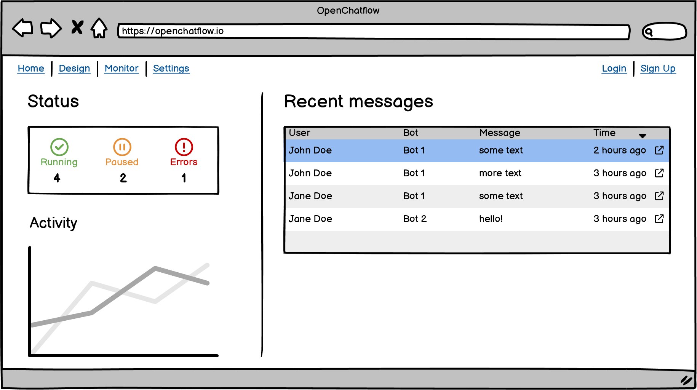
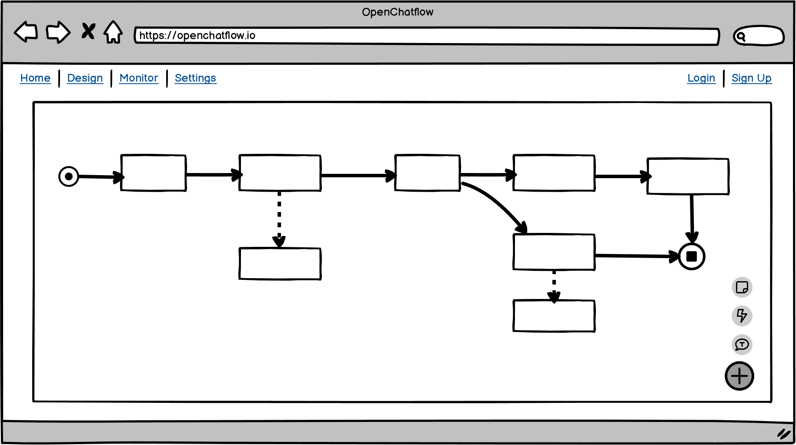
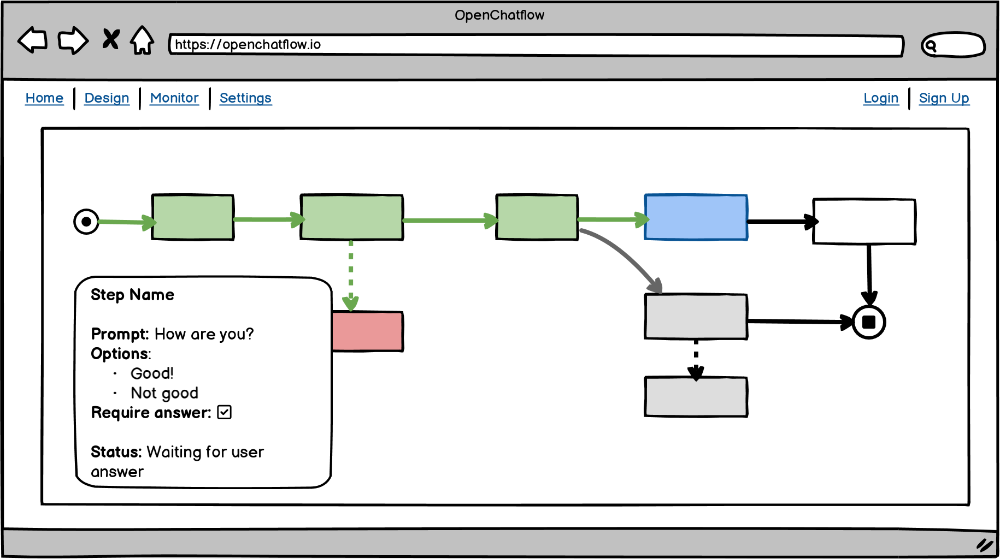

This post introduces OpenChatflow (tentative name, subject to changes, yadda yadda), a new application to design, test, run and monitor Telegram chatbots.

Also, fair warning: the application does not exist. It will, hopefully. But it doesn't yet.

Telegram has [bots](https://core.telegram.org/bots) that can perform fairly advanced tasks, up to entire web apps that can receive payments. However, this project does't focus on those, but on the more humble task of non-AI chatbots.

Here's the executive summary: it's an application in which you can graphically design Telegram chatbots, with their different conversation paths. You'll be able to drag and drop questions that will be asked to the user, and depending on his answers, the bot will take a different path. You'll also be able to save the user's responses and take actions when a certain point is reached. You'll be able to do this for multiple bots performing multiple conversations. You'll be able to see ongoing conversations. All of this will be hosted in the comfort of your own infrastructure.

_Phew_. That was 92.5&pm;2.5 words, in case you were wondering.

## Scope

The following features will be in scope for this project:

* Sending arbitrary messages to the user
* Asking the user for free-text input
* Asking the user for constrained input (e.g., text over 10 characters, only emails, only positive numbers, one from a list of choices)
* Asking the user for confirmation or a choice from a list of [inline buttons](https://core.telegram.org/bots/features#inline-keyboards)
* Navigating across bot states in response to the user's answers, with configurable conditions (e.g., ask the user "Are you sure?", then go to this state if he says "Yes", and to that other state if he says "No")
* A clean, not-clunky visual editor to design the conversations
* Management of multiple Telegram bots, each with a different conversation
* An ability to monitor ongoing "conversations" (multiple users may be talking to the bot at once, with their conversations being in different stages)
* Executing arbitrary actions (probably through HTTP requests) at any point in the conversation (i.e. when moving to a new conversational state). This would give the bot its power to actually _do_ things, as otherwise it would just be a fancy way of entertaining users

In contrast, the following capabilities are explicitly _not_ in scope:

* Any sort of AI whatsoever
* Natural language processing. The bots will only respond to their exact expected inputs, and complain otherwise
* Telegram's [web apps](https://core.telegram.org/bots/webapps)
* [Payments](https://core.telegram.org/bots/payments)

## Literature review: alternatives

* [ActiveChat](https://activechat.ai/) offers "live chat automation", which, AFAICT, means that a human and a bot collaborate to respond to the user on the other side of the chat. The bot suggests responses. Or, the bot starts all conversation and sometimes hands them off to the human ("to talk to a human, press 1").
* [Botpress](https://botpress.com/) says "Build ChatGPT chatbots,
  surprisingly fast". They appear to be leveraging the current fame of ChatGPT and associated SomethingGPT networks. They even suggest using generative AI to... build the bot conversations. Meta.

For a longer, possibly biased list, see [this link, by Botpress](https://botpress.com/features/conversation-studio). Note that, since it's compiled by a company with an interest in the matter, it may be *sliiightly* biased towards their own solution. Or not. Who knows.

Apart from that, there's a surprising lack of alternatives. There are many articles about "building your own chatbot with Python and Telegram", but those are code-only. There's no fun in that. [See Google's search results](https://www.google.com/search?q=telegram+chatbot+designer). This is especially surprising considering that Telegram is used in the IoT/home automation area, which has really vibrant open source projects such as [Node-RED](https://nodered.org/) and [Home Assistant](https://www.home-assistant.io/).

As for ready-made packages, there are a few spawning from the [ChatOps](https://docs.gitlab.com/ee/ci/chatops/) concept, which appears to have been born on Github. It was used to manage code deployments and monitoring service status, among other things. There's their tool, [hubot](https://github.com/hubotio/hubot), which amazingly is still alive and active after 10 years since its presentation. There's [Errbot](https://github.com/errbotio/errbot) and [Opsdroid](https://opsdroid.dev/). All of these tools are code-only, Python or NodeJS. Not so good for self-service chatbot creation targeted towards non-programmers.

Also, Node-RED can somewhat design chatbots, with aid of the [node-red-contrib-telegrambot](https://flows.nodered.org/node/node-red-contrib-telegrambot) package. It, however, has some shortcomings:

* Node-RED's approach to flows as data paths is not the best fit for chatbots. It's perfect for ingesting and transforming data from IoT devices and such, but chatbots are better represented as state machines (indeed, [Python's leading bot library](https://docs.python-telegram-bot.org/en/stable/examples.conversationbot2.html#conversationbot2-diagram) explicitly models a bot as a state machine and even contains a nice state diagram!)
* On stock Node-RED, you cannot monitor ongoing conversations and see the state in which they are.
* Since Node-RED is a generic flow designer, there is no way to prevent users from designing conversations that go to multiple states at once. That would become cursed quickly, with bots that think that they are in multiple conversation paths at once, answering multiple times per user message.
* I have found Node-RED's approach to, say, sending HTTP requests, to be quite counterintuitive. In other workflow designers (such as [N8N](https://n8n.io), used in this blog to automate posting to LinkedIn), you explicitly configure the URL, method, querystring and body for the request. In Node-RED, the data must already be in the payload, necessitating a Code node beforehand. I find that to be much less intuitive.

[N8N](https://n8n.io) does have a Telegram node and trigger, which should also be usable to build chatbots. However, it gets weird fast for anything beyond a simple request-response bot with a single response (yes, I have tried!). The main problem is that every message comes in through the same trigger node, so it's difficult to express the "conversation stages" concept (i.e., first ask A, then ask B, depending on that answer ask C or D, and then do something with the responses of A, B and (C or D)).

The closest ready-made tool to this project appears to be [RedBot](http://red-bot.io/), a Node-RED based project with custom Telegram nodes, NLP integration and a "Control Center" from which you can simulate conversations. However, I couldn't get the Control Center to recognize my Telegram bot. I'm probably forgetting something stupid, as it seems unlikely that such basic functionality wouldn't work. Whatever the case is, I couldn't get it to work. It also inherits the shortcomings of Node-RED mentioned above, mainly the lack of a proper state machine structure and a weird (to me) way of passing configuration to nodes, via the payload. Furthermore, while it has a message log, I couldn't see a way to monitor entire conversations in context, just message logs as a time-ordered array. Documentation is also quite sparse.

I'll definitely ~~copy~~ take inspiration from the interfaces of [Botpress](https://botpress.com/) and [RedBot](http://red-bot.io/), along with [N8N](https://n8n.io).

## Features

OpenChatflow is expected to have the following features (in decreasing order of priority):

* Visual editor for conversations
* Ability to make HTTP requests at any point in the path
* Visual monitor for ongoing conversations, each with its current state, past bot & user messages, and context
* Conditional conversational paths, based on user responses or external logic (implemented via HTTP responses)
* Multi-bot management (i.e., ability to register several Telegram bots and assign each of them to a different conversation)
* A debugger to test conversations, with the ability to teleport the execution to any state with any context, context editing and single-step execution
* Staged deployments (i.e., work on, and debug, v2.0 of a conversation while the bot keeps using v1.0)
* Multi-user/multi-tenant architecture (each user can register his own conversations and bots). Maybe extended to your usual "Teams" model, with users belonging to teams and more granular access rules
* A way of messing with ongoing conversations (see high above in the features list), to "teleport" them to a different state and/or change the context (i.e., the bot's memory of what has happened until now)

To do so, the application will need:

* A way of listening to Telegram events:
  * Message received
  * Callback (used for [inline keyboards](https://core.telegram.org/bots/features#inline-keyboards))
  * File uploaded (for file-processing bots)?
* The Telegram events should ideally be listened on via [webhooks](https://core.telegram.org/bots/api#setwebhook), for efficiency (as opposed to polling)
  * The app should also support the [local bot API server](https://core.telegram.org/bots/api#using-a-local-bot-api-server), for deployments that are behind NAT or otherwise isolated from the Internet (such as your average home that is behind CGNAT and therefore has neither a public IP nor a way to port forward across both NATs)
* A way of routing message updates to the correct conversation (if the message updates come in in a single channel)
* The code required to send messages to users
  * Simple text messages
  * Messages with file attachments
  * Messages with [custom keyboards](https://core.telegram.org/bots/features#keyboards)
  * Messages with [inline keyboards](https://core.telegram.org/bots/features#inline-keyboards)
  * ...
* A visual (node-based) editor that lets users design and edit conversations
  * The editor should include all the different triggers
  * The editor should also let the user configure the different message types that can be sent
  * The editor should play nicely with the state machine representation, if it's not part of the same library (for example, it should not let the user make a step transition to two different steps without conditions, as that would mean that the machine would be on two states at once)
* A way of representing conversations as state machines, to ensure that a single state (i.e., a stage of the conversation) can be active at a time
  * Said state machines should also support conditional transitions (e.g., to move to state A if the user chose option A, to state B if user chose option B, and to display an error message and stay in the current state if the user wrote anything else)
  * Conditional transitions should be able to operate on the user's most recent response, on the conversation's context (what has been said until now, but possibly on a previous response, not right now) and on arbitrary HTTP responses (for anything else, such as authorization logic that only lets certain users, saved on an external DB, perform an operation)
  * The state machine should also support non-blocking actions on transitions (such as sending a request to a remote server for logging the action that is about to be performed). These are different from conditions because they can't abort the transition
  * The state machine engine should support pausing and resuming the execution from where it was stopped. It's not enough to design a flow that will run from start to end and then return the final data, as these conversations may take place over days or weeks. Hence, every time the user sends a message, it will be necessary to restore the previous state and context, run one step plus any actions that it causes, wait for the state machine to stabilize in a new state, and then freeze the execution again until the user responds
* A simulator/debugger that can be executed by the user to test the execution, along with a live view of the conversation's state
* A way of saving every conversation to disk, both ongoing and finished conversations, for monitoring

## Possible tools

* A message queue, to decouple the Telegram API from the rest of the code. I don't expect to integrate other messenger apps, but it may still be useful: for example, implementing a Debugger/test chat would be simpler, as we could just write something that reads and writes to the same queues as the real Telegram data. Also useful for replicating messages, if it's ever required, to log every action taken by the app and to inject custom messages
  * RabbitMQ? ZeroMQ? NATS? Redis Streams? I don't want to use Kafka, it's way too heavy and smells of Java. What is used in the Javascript/Node world?
* Any Telegram API package, or maybe roll our own, for interacting with the Telegram API. It shouldn't be too difficult, it's Just a Bunch of API Calls (TM)
* The core engine: a state machine interpreter
  * I'm currently leaning towards [XState](https://xstate.js.org/), as it seems really clean and powerful. It claims compatibility with [State Chart XML (SCXML), a W3C Recommendation standard](https://www.w3.org/TR/scxml/) for state charts. This means that you can rest assured that it's quite comprehensive, as is everything that involves "XML" and "Standards" in the same concept, and as is everything by the W3C. Seriously, try reading the [specification for the Open Checklist Interactive Language (OCIL)](https://nvlpubs.nist.gov/nistpubs/Legacy/IR/nistir7692.pdf) by NIST, which "allows organizations to author questionnaires in a standardized format that can be processed by a variety of software products". Think Google Forms, but the definition of the questions, sections, options, conditional questions and everything else is in XML
* The graphical editor: something that can take the state machine and render it, let the users edit the nodes (add/edit states, move them around, add/edit/remove transitions, configure the states, add conditions and actions on transitions, whatever). It may also be reused for the conversation monitor, possibly in read-only mode, to show the state of currently-ongoing conversations
  * I'm looking at [React Flow](https://reactflow.dev/). It's not a fully-fledged editor (if you just want to have a button with an X that pops up when you hover over an edge, you have to [implement that yourself](https://reactflow.dev/docs/examples/edges/edge-with-button/). Same for any keyboard shortcuts). That, however, means that we can tailor its behavior to what we'd need for a chatbot designer
  * The data model is not the same as that of XState, but at a _veeery_ cursory glance it seems possible to convert one to the other. Probably React Flow's data model to XState's model, as React Flow needs more data, such as node positions for the canvas. From that, it doesn't seem impossible to convert it to the format expected by XState. We'll see. I'd prefer to be able to generate one data model from the other, as in such a case we'd be able to store, say, React Flow's data in the DB, and convert it to the XState representation on the fly whenever we needed to work with the state machine
* The framework for holding everything together
  * I'm thinking [Next.js](https://nextjs.org/), as I haven't worked much with it, I want to work with it, and it seems neat and capable of doing both the client and server parts. The bulk of my experience is on Python web servers, but since I'll need to use a JS framework for the frontend anyways, I might as well try to use a single framework for both layers
  * This will include the wrapper app that holds the editor, authentication (if we ever get around to implementing it), random data lists (such as the UI to register a new bot and link it to a conversation), the debugger, and whatever else is needed

## Please give demos

Here are some demos of the tools that I intend to use, so that you can play with them to get a feel for their interactions and capabilities:

* [XState](https://xstate.js.org/viz/)
* [Another state machine, in another visualizer](https://stately.ai/registry/editor/e13bef2b-bb13-4465-96ac-0bc25340688e?machineId=dbcfca1c-075d-4cd6-a865-efcbd7be1544&mode=Simulate). You can click on the blue pill-shaped events to simulate them happening
* [React Flow's kitchen sink example](https://reactflow.dev/docs/examples/overview/), with a minimap, custom nodes and edges, and controls inside nodes. There are more examples on the navbar to the left, such as [a node palette from which you can drag'n'drop nodes](https://reactflow.dev/docs/examples/interaction/drag-and-drop/), [validation when trying to connect nodes](https://reactflow.dev/docs/examples/interaction/validation/), and [nested flows](https://reactflow.dev/docs/examples/layout/sub-flows/)

As for the actual OpenChatflow app... well, there's no demo yet. Have some mockups instead:

Then, the main UI; the one that worries me the most. I expect it to be somewhat like N8N's UI, showing blocks/nodes/steps and lines connecting them. The blocks would be both conversational states and additional non-blocking actions such as HTTP requests.

And finally, the monitoring UI. The green nodes have already run. The red nodes have failed. The blue node is currently running (waiting for the user to provide his answer so the conversation can continue). The gray nodes will not run, since on a previous step the user has provided an answer that made the conversation take another path.

Also, just in case you're wondering: those mockups are made in [Balsamiq](https://balsamiq.com/)'s _seriously awesome_ tool of the same name. If you didn't know it and need to to UI mockups, give it a try. It's amazing. I suck at UI design, yet those mockups look somewhat decent. And the license is fairly cheap, and perpetual (it's almost the only software that I know that does that, Jetbrain's IDEs have a subscription but also come with a fallback perpetual license).

## The future of this project

I have no idea about how long this project will take. It'll probably be very long, since I can only work on it in my spare time. Similarly, there's no guarantee about the implemented features. Don't expect any given feature to be implemented soon, or at all.

This project is especially uncertain because nobody has asked for it. It's not like I have wisely identified a huge niche for Telegram chatbot designers, and am rushing to fill it with a well-researched app. If this were a startup, it would be the riskiest startup ever, since it would be starting without market demand. As of now, it's mostly for me to play and learn. If even one person in this wide world happens to find it useful, then that's one more person than what I had expected, and I'll be very happy. In fact, as of now I don't even know if more than zero (0) people will visit the project's repo.

Also, if you have managed to read up to here, then congratulations. If you know how to program, like where the project could be going and want to help, you're more than welcome. In fact, you're welcome anyways, even if you don't know how to program and just want to browse. This is open source software and intends to stay as such, including the whole collaboration/openness spirit. The code is or will be up on [Github](https://github.com/jreyesr/openchatflow) (don't be surprised if it's not active yet, I'm writing this article before starting to code).

Until then, thank you for taking the time to read this! Contributions, ideas, code, suggestions and even kind comments are all welcome.