This devlog covers up to [commit `de6ce2e`](https://github.com/jreyesr/openchatflow/commit/de6ce2e654fd40ac09097e85db75699be8c659af). This is how the UI looks at this point:

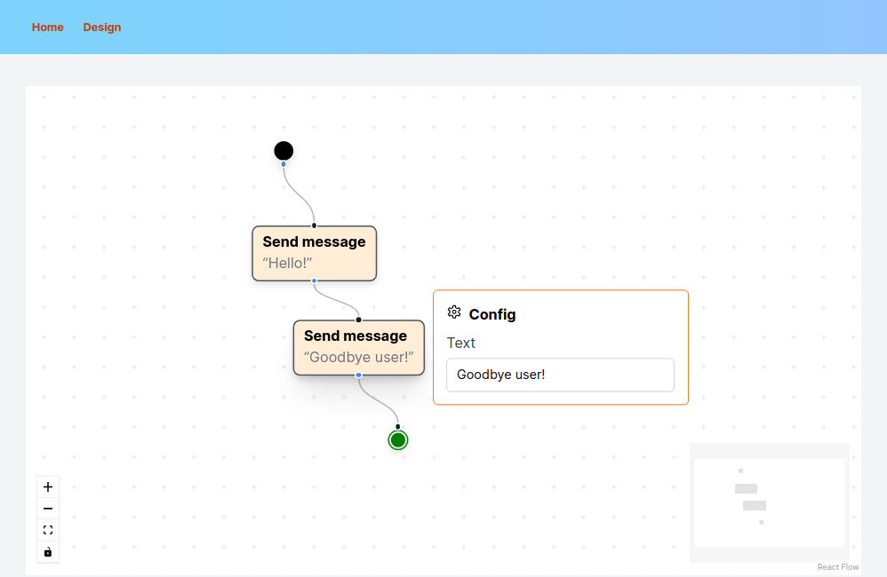

We have:

* Created the project
* Built a really basic dashboard
* Installed Reactflow and created a basic flow editor
* Created the Start node, which will be the entrypoint for all conversations
* Created a Simple Text node, which when executed will simply send a Telegram message. The text is configurable, but currently cannot be interpolated.
* Created the End node, which when reached will terminate the conversation. This node can be configured so the conversation ends successfully or with an error.
* Created some basic validation logic so that the created statecharts are (hopefully) valid (i.e., it's not possible to link one state to more than one following state)

## Project bringup: Next.JS, Tailwind, Reactflow

As usual, the first task is to create the project. I started with the Next.JS project generator, with Typescript because strong typing is nice, Tailwind because why not, and the [new, (then) beta `app/` directory](https://nextjs.org/blog/next-13#new-app-directory-beta) because it seemed nice and was suggested by the docs.

Also, for some fortuitous timing, the [`app/` directory became stable](https://nextjs.org/blog/next-13-4#nextjs-app-router) maybe four days after I started the project, thus allowing me to use it without fear and without needing to enable experimental, not-ready-for-production features. Cool.

I won't describe the installation of the framework, as I just followed the instructions. Same for installing Reactflow.

## Tailwind: atomic CSS

I decided to use Tailwind for this project, since I hadn't used it before and Bootstrap is boring. Now, I'm really bad at UI layout, so don't expect any UX miracles.

The basic idea of Tailwind is that you style your components from really basic CSS classes, barely more high-level than straight `style="..."` props. For example, here's one of the links in the top navbar:

```tsx
<Link
  className="text-sm font-bold rounded-full p-2 text-orange-700 hover:translate-y-0.5 transition duration-100"
  href="/"
>
  Home
</Link>
```

There's a class for essentially everything. Font size, weight and color, padding, corner radius, transitions, and everything is duplicated for pseudostates (such as hover, selected, disabled). It's really different from Bootstrap, where you apply really high-level classes (for instance, a card may have classes for "the entire card", "card header", "card body title", "card body text", "card body footer" and "button in card body footer"). It's a different mindset, where you get a lot more control at the expense of... well, more control.

I'm finding Tailwind to be reasonably enjoyable, considering my lack of experience when designing UIs from scratch. I still struggle with laying out components, containers, flex, grid and whatnot, but that's not the library's fault.

Here's the current state of the dashboard (as you'll remember, in the [previous post](https://jreyesr.github.io/posts/chatflow-1/#please-give-demos) we presented some mockups):

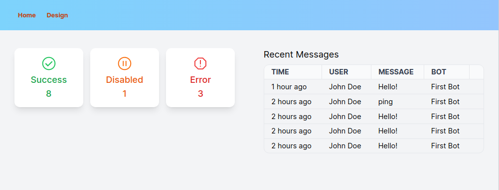

## Creating custom nodes in Reactflow: the Start node

Every state machine has a start node, denoted [in UML Activity Diagrams](https://www.visual-paradigm.com/guide/uml-unified-modeling-language/what-is-activity-diagram/) as a solid black circle. We need to create such a node, which will be the starting node for every conversation and link to the initial state.

Note that the Start node is not a conversational state in and of itself. It's just a graphical way of denoting which node will be the initial node. In XState (which we haven't even started to work on), the only thing that exists is a state marked as initial. 

Did I manage to confuse you yet? See [this machine](https://stately.ai/registry/editor/e13bef2b-bb13-4465-96ac-0bc25340688e?machineId=9630e3b7-9f8e-4dc9-8b55-661f854d28b7&mode=Design). It has two states, Paused and Playing. Paused is the initial state, and the editor helpfully adds a tiny circle and a right-angle arrow that points to it. 

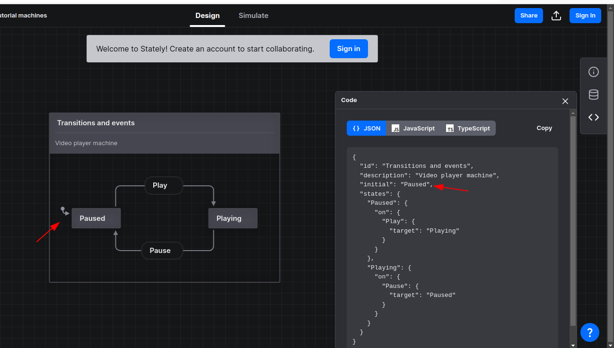

That is, in the world of the state machine interpreter, there is no discrete Start state, it just happens that one of the states is the initial one. We'll have to keep that in mind, but That Comes Later&trade;.

For the visual editor, however, we'll model the Start state as a special node. This introduces us to our first real challenge: custom nodes!

Reactflow, being an extension-focused package, helpfully provides documentation on the common task of creating your own node classes. Their default nodes are really basic, just 1-input, 1-output, and 1-input-1-output nodes. Indeed, near the end of [this page](https://reactflow.dev/docs/guides/custom-nodes/), you can read: "In most cases we recommend to use custom nodes only. The built-in ones are just basic examples." Got it. Custom nodes it is.

There are three main pages that you should use as guidance for custom nodes:

* [The Guides page](https://reactflow.dev/docs/guides/custom-nodes/), which creates a node with a text field inside. It's a step-by-step manual, which is good, since you need to configure several things for a custom node to work.
* [An Example page](https://reactflow.dev/docs/examples/nodes/custom-node/), which creates a node with a color selector that, for good measure, changes the background color of the entire flow, live. This has no steps, just the code.
* [The API docs for custom nodes](https://reactflow.dev/docs/api/nodes/custom-nodes/), which enumerates the properties that your custom node will have available. If you use Typescript, you'll get them for free, just by adding a type annotation. Neat!

Here's what's required to create the Start node (excluding imports):

```tsx
export default function StartNode(props: NodeProps) {
  return (
    <>
      <svg height="20" width="20">
        <circle cx="10" cy="10" r="8" fill="black" />
      </svg>
		  
      <Handle
        type="source"
        position={Position.Bottom}
      />
    </>
  );
}
```

You can use the node like this:

```tsx
const initialNodes: Node[] = [
  {
    id: "0",
    type: "start",
    position: { x: 65, y: 0 },
    data: {},
  },
];
const initialEdges: Edge[] = [];

export default function Editor() {
  const [nodes, setNodes, onNodesChange] = useNodesState(initialNodes);
  const [edges, setEdges, onEdgesChange] = useEdgesState(initialEdges);

  const onConnect = useCallback(
    (params: Edge | Connection) => setEdges((eds) => addEdge(params, eds)),
    [setEdges]
  );

  // Register custom node type here
  const nodeTypes = useMemo(() => ({ start: StartNode }), []);

  return (
    <div style={{ flexGrow: 1, fontSize: 12 }}>
      <ReactFlow
        nodes={nodes}
        edges={edges}
        onNodesChange={onNodesChange}
        onEdgesChange={onEdgesChange}
        onConnect={onConnect}
        nodeTypes={nodeTypes} // Remember to pass the node types here
      >
      </ReactFlow>
    </div>
  );
}

```

You register the node in an object (`nodeTypes` here). Keys are used on the nodes array, as the `type` property, and values are the custom node functions. In this case, a Start node has no useful data, but we'll make use of that later, for other nodes. The actual Telegram nodes will need to hold a lot of data, such as the node config (which action to take, the text to prompt the user, whatever) and also state machine-related information (transitions and conditions, mainly).

And here's the node, surrounded by some friends:

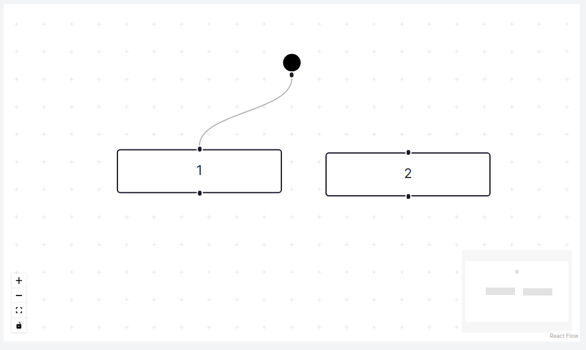

Neat, huh? Very little code, and now we have a Start node. It can already be dragged, linked, deleted (though we don't want that!). A little bit of SVG magic later, and we can have the node change its appearance when it's selected (much like default nodes get a thicker border):

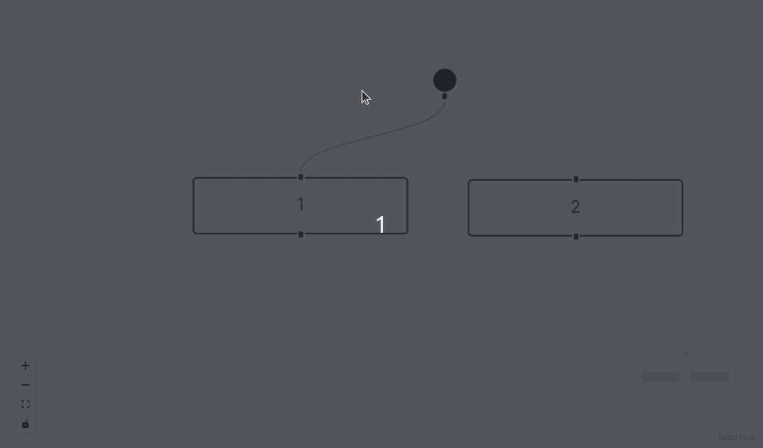

That is done by adding a `<pattern>` to the SVG element and conditionally using it: custom nodes get access to the property `selected` so we can conditionally apply a fill to the circle:

```tsx
export default function StartNode(props: NodeProps) {
  return (
    <>
      <svg height="20" width="20">
        {/* START Hatch pattern */}
        <pattern
          id="diagonalHatch"
          patternUnits="userSpaceOnUse"
          width="4"
          height="4"
        >
          <path
            d="M-1,1 l2,-2
           M0,4 l4,-4
           M3,5 l2,-2"
            style={{ stroke: "black", strokeWidth: 1 }}
          />
        </pattern>
        {/* END Hatch pattern */}
        <circle
          cx="10"
          cy="10"
          r="8"
          // Fill is either solid black (if unselected) or the hatch pattern (if selected)
          fill={props.selected ? "url(#diagonalHatch)" : "black"}
        />
      </svg>
      <Handle
        type="source"
        position={Position.Bottom}
        isValidConnection={isValidConnection}
      />
    </>
  );
}

```

## Edge validation: only allow a single transition from the start state

An important feature of a state machine is that it should only be on one state at a time (with the exception of [parallel statecharts](https://statecharts.dev/glossary/parallel-state.html), but ~~shut up~~ that's beyond the scope of this project). In the context of the chatbot engine, that means that we should always transition to a single state, i.e., there shouldn't be outgoing edges from a state to two or more states. Consider the flowchart below:

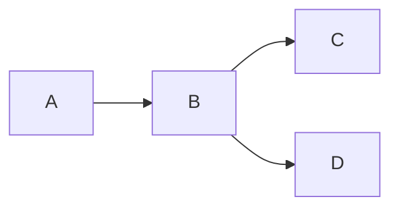

Assume that both the outgoing edges from B are triggered on the same transition (e.g., B is a node that asks the user for a text value, then proceeds). Then, when the user sends a response, to what state should we go? Going to both states at once is not feasible, as each state represents a different conversational path. If we took both, then the bot would start asking two questions at once, and trying to apply the single user response to two paths. Hilarity and confusion would ensue.

Now, the flow engine (XState) does not even allow for that. When configuring the state machine, you specify transitions on nodes, and each transition goes to a single node. Thus, B can only have a single destination node for the same transition, and the entire problem is averted.

This invariant, however, is not enforced by the visual editor (Reactflow), as it's a generic node-based editor and there are use cases that legitimately require multiple outgoing edges. Thus, we must manually enforce that, by refusing to create edges (links) if the edge is part of the main flow and there already is an edge outgoing from that same node.

Since we only have the Start node and vanilla nodes, we'll only allow the Start node to have one outgoing edge, as more edges would mean that conversations would start on multiple states.

That is (again) really easy to do, as Reactflow has considered that possibility and even provides [an example](https://reactflow.dev/docs/examples/interaction/validation/). The example has a custom node that only accepts to be connected to one specific node. In our case, we just need to accept the connection request if the node has no connections yet, and reject it otherwise. Here's the code (again, the import statements are not included):

```tsx
export default function StartNode(props: NodeProps) {
	// 1. Grab a reference to the flow
  const flow = useReactFlow();

	// 2. This will be called for each connection
  const isValidConnection = (connection: Connection) => {
	  // Grab the source node, since we only have the ID here
    const comingFrom = flow.getNode(connection.source as string)!;
	  // Get all outgoing edges from that node
    const outgoing = getOutgoers(
      comingFrom,
      flow.getNodes(),
      flow.getEdges()
    );
    // Only allow connection if there are no connections already present
    return outgoing.length == 0;
  };

  return (
    <>
      <svg height="20" width="20">
        {/* circle */}
      </svg>
      <Handle
        type="source"
        position={Position.Bottom}
        // 3. Pass the validator function to the handle
        isValidConnection={isValidConnection}
      />
    </>
  );
}

```

You have to declare a _validation function_, which takes a `Connection` object. That connection contains the IDs of the source and destination nodes. We (currently) only care about the source ID.

We use the `useReactFlow` hook to get a reference to the entire flow. Then, on the validation function, we get the node ID, then we obtain the entire node by querying the flow (`flow.getNode`), then we use a [utility function](https://reactflow.dev/docs/api/graph-util-functions/#getoutgoers) to get all outgoing nodes (`getOutgoers`), and only allow the connection to be created if there are no outgoer nodes yet.

A bit of CSS magic later, and we have a nice, subtle UI that changes some colors to show if you can create the edge or not.

```css
.react-flow .react-flow__handle-connecting {
  background: #ff6060;
}

/* This should go BELOW the __handle-connecting class, so that it overrides it when required */
.react-flow .react-flow__handle-valid {
  background: #55dd99;
}
```

That CSS was taken straight from the [validation example](https://reactflow.dev/docs/examples/interaction/validation/). Here's how it looks:

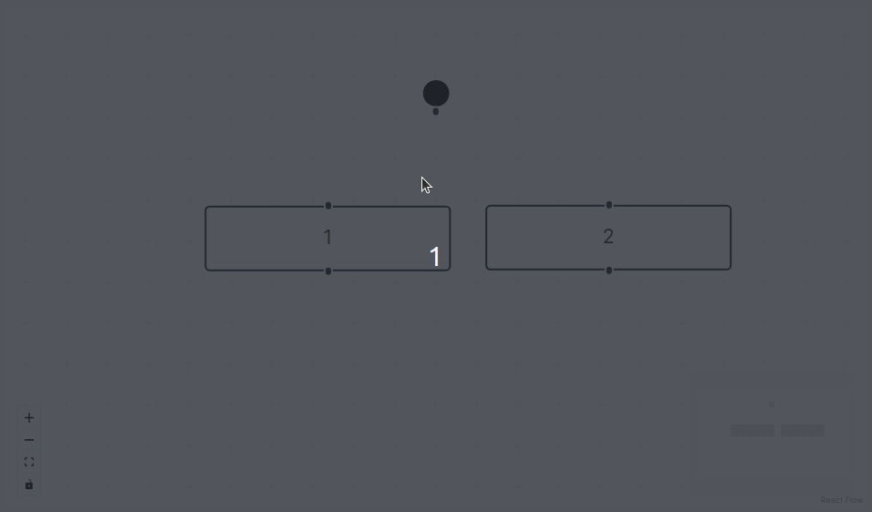

The first edge is accepted, as you can see by the green dot and the slight snapping to the destination node. Once there is an edge, the editor doesn't let you create another one, and any attempts to do so are met with an orange handle. If you delete the original edge, you can once again create it.

### Bonus: reusing Tailwind classes for the valid&invalid handles

In the CSS above, we used hardcoded colors for the valid and invalid handle states (actually,  we default to the invalid state for all "connecting" handles, then override it with the valid state if it turns out that the connection is valid). However, that presents a problem: the CSS is disconnected from Tailwind. What if we want to refer to a Tailwind class? We actually should, to ensure a consistent color palette. We'd want the invalid state to get class `bg-red-500` and the valid state to get class `bg-green-500`, or something to that effect. However, we don't want to just copy the declaration of the Tailwind classes.

Turns out that Tailwind already supports that! There's [an `@apply` directive](https://tailwindcss.com/docs/functions-and-directives#apply) that can be used inside CSS selectors, and applies the styles that you want. It's sort of like a C `#include`.

The canonical use case is, precisely, integrating with other libraries that signal states by adding and removing classes in objects. The provided example uses the [Select2 library](https://select2.org/), a really popular jQuery library to style dropdown inputs. This library applies its own classes to different DOM elements, and if you want to make them look consistent with the rest of your Tailwind-based application, you need to apply Tailwind classes to those elements. With the `@apply` directive, that's easy:

```css
.select2-dropdown {
  @apply rounded-b-lg shadow-md;
}
.select2-search {
  @apply border border-gray-300 rounded;
}
.select2-results__group {
  @apply text-lg font-bold text-gray-900;
}
```

In our case, we want to apply Tailwind classes to the valid and invalid states:

```css
.react-flow .react-flow__handle-connecting {
  @apply bg-red-500;
}

.react-flow .react-flow__handle-valid {
  @apply bg-green-500;
}
```

Done!

## Adding a new node: simple messages, no response required

We now turn our attention to the first "real" node: a node that should send a message to the user and then carry on. It could be used at the start of conversations, to greet the user and explain the bot's capabilities to him, and later to provide feedback.

The node shall have:

* One input, where all incoming transitions will be received
* One output, which should go to the next state
	* This output should also have the same validation as the start state: only allow a connection to be established if there are no connections already outgoing from the node
* A single configuration item for the text that will be shown to the user
	* For now, this text will be static. Good for generic messages ("Hello!" or "We're processing your request"), not so for personalized data ("Welcome, &lt;name&gt;" or "You've chosen option &lt;option&gt;. Is that correct?"). The project should eventually let the user interpolate data *somehow*, but that is (mostly) a backend concern, to be attacked when we reach the state flow engine

The node itself is quite simple, just a couple of text elements and two Handles. The complication comes from the configuration data, which as of now is just a text field.

```tsx
function SimpleMessage(props: NodeProps) {
  return (
    <>
      <div className="react-flow__custom drop-shadow-md px-2 py-1 rounded-md bg-orange-100 border-2 border-gray-600 relative group">
        {/* Node body */}
        <div className="font-bold">{props.data.label}</div>
        <div className="text-gray-500">&ldquo;{props.data.msg}&rdquo;</div>

        {/* Node handles */}
        <Handle type="target" position={Position.Top} />
        <Handle
          type="source"
          position={Position.Bottom}
          isValidConnection={isValidConnection}
        />
      </div>
    </>
  );
}
```

The `isValidConnection` function is almost the same as that on the Start node, but now it only takes into account nodes that are part of the main conversation flow. This is because these nodes, in addition to being part of the main conversation flow (which is the part that can only go to a single state for each transition) can also have asynchronous actions, such as sending web requests for logging. These will appear in the flow as other nodes that also come out of the outgoing transition:

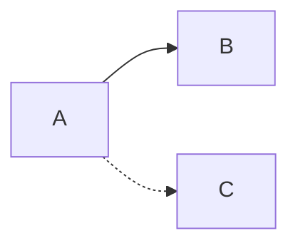

If the two arrows came out of the same Handle in A, then B would be the next conversation state, while C would be another, non-blocking action. Some examples would be a HTTP request (AKA webhook) to an external system, so that it can take action when the user crosses a certain stage in the conversation, and logging/audit actions. For instance, we could log the fact that the user has taken that path, for the purpose of measuring conversion rates.

So, for every output of a main node, you can have _one_ output that goes to another main node, and however many outputs you want that go to async actions. We haven't implemented those yet, but we'll get to that at some point. A node can have multiple async actions, since they don't block the flow, they just are executed at the engine's convenience whenever the output is taken.

Now, for the configuration of the node (which, remember, is just a text field). While we could just inline the text field in the node's UI, as is done in [the Custom Nodes guide](https://reactflow.dev/docs/guides/custom-nodes/), it will get really ugly, really fast. Anything other than one or two fields will make for big, bloated nodes. I'll instead take the path of [N8N](https://n8n.io) and make a separate dialog that pops up. N8N requires a double click on the node, but for Reactflow it's easier to create a small button that appears when hovering over the node, and pops up the config dialog besides the node. We'll use the [NodeToolbar plugin](https://reactflow.dev/docs/api/nodes/node-toolbar/#usage-example) so that the dialog is always pinned to the right side of the node.

Since that dialog will be reused across all Telegram nodes, we'll just extract it to a separate component. That's on the `components/nodes/ConfigDialog.tsx` file.

Then, on the main node, we have to add the Settings button (it's styled to only appear on hover thanks to Tailwind's [parent state styles](https://tailwindcss.com/docs/hover-focus-and-other-states#differentiating-nested-groups), so that the button only appears when its parent element has the `:hover` pseudostate). Clicking the button toggles the boolean variable that controls the dialog's visibility. Editing the text field generates an event that changes the node's `data` property, which thanks to React's reactivity system automatically updates the view of the node in the editor.

Here's how that node works. I have temporarily added a text element below the flow editor that shows the JSON representation of the nodes, so that we can see the node's data being edited in real time:

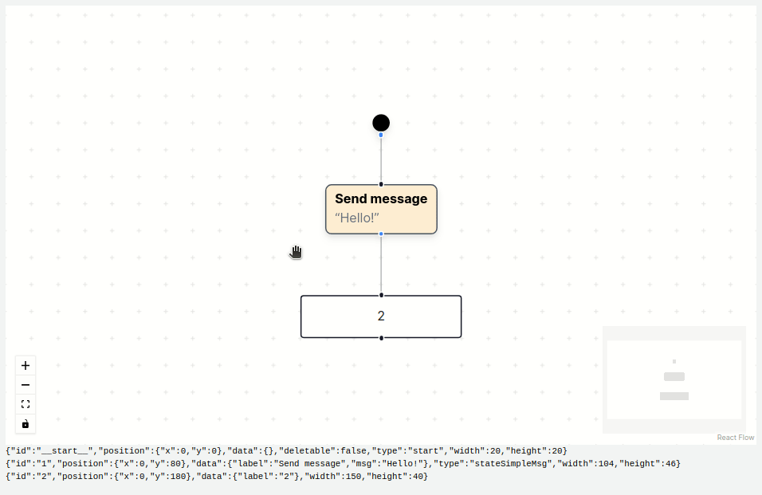

And, finally, some CSS to ensure that it wraps gracefully when the user writes a lot of text:

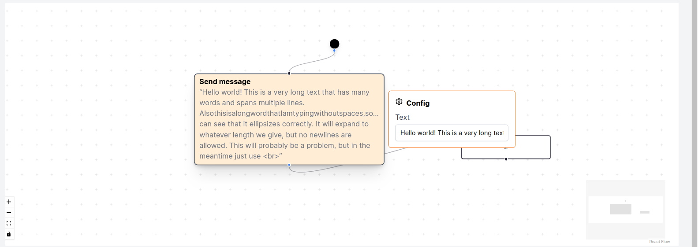

## An End node

Much like the Start node, a good statechart needs an End state. I'll make the executive decision to allow multiple of these, just to make for a cleaner chart if there are multiple exit paths (as otherwise you may have very long arrows that snake all around the chart to reach the singular End node). Also, just for fun, we'll allow the user to specify if the exit was successful or an error, for more control. You can imagine that the Error executions can be surfaced in the dashboard and maybe notified to the creator... via Telegram, of course. This is not included in the UML Activity Diagram specification, so we'll have to invent our own.

The End node's notation is a solid black circle wrapped in another circle. To express different exit codes, we'll color the circle: green for successful exits, red for errors. The exit code will be configurable with a small dialog, much like the text node. Unlike the text node, this dialog will pop up anytime the node is selected, since the node is already quite small and there's no space to add a hoverable button to open the dialog. Besides, the End node will almost never be selected (riiight?)

The node is based on the Start node, except that the SVG is more complex. It also needs to take care of two possible states, and recolor the SVG accordingly.

```tsx
function EndNode(props: NodeProps<CustomData>) {
  const flow = useReactFlow();

  const _isValidConnection = (connection: Connection): boolean => {
    // An End node only takes main state nodes as inputs, no async activities
    return (flow.getNode(connection.source!)!.type ?? "").startsWith("state");
  };

  let color;
  switch (props.data.exitCode) {
    case "success":
      color = "green";
      break;
    case "failure":
      color = "red";
      break;
  }

  const setExitCode = (newCode: ExitCode) => {
    flow.setNodes((nds) =>
      nds.map((n) => {
        // Change the data on the current node
        if (n.id === props.id) {
          // NOTE You have to set the entire data object, otherwise it doesn't refresh
          // See https://reactflow.dev/docs/examples/nodes/update-node/
          n.data = {
            ...n.data,
            exitCode: newCode,
          };
        }
        return n;
      })
    );
  };

  return (
    <>
      {/* START Config dialog */}
      <ConfigDialog display={props.selected}>
        <span className="text-gray-700">Reason for exit</span>
        <div className="inline-flex rounded-md shadow-sm" role="group">
          <label className="relative inline-flex items-center mb-4 cursor-pointer">
            <input
              type="checkbox"
              className="sr-only peer"
              checked={props.data.exitCode === "success"}
              onChange={() => setExitCode("success")}
            />
            Success
          </label>
          <label className="relative inline-flex items-center mb-4 cursor-pointer">
            <input
              type="checkbox"
              className="sr-only peer"
              checked={props.data.exitCode === "failure"}
              onChange={() => setExitCode("failure")}
            />
            Failure
          </label>
        </div>
      </ConfigDialog>
      {/* END Config dialog */}

      <div className="drop-shadow-md">
        <Handle
          type="target"
          position={Position.Top}
          isValidConnection={_isValidConnection}
        />

        {/* Actual node circle */}
        <svg height="20" width="20">
          <circle
            cx="10"
            cy="10"
            r="8"
            stroke={color}
            fill="transparent"
          />
          {/* More SVG here... */}
        </svg>
      </div>
    </>
  );
}
```

And this is how it looks like, in a bigger flow:

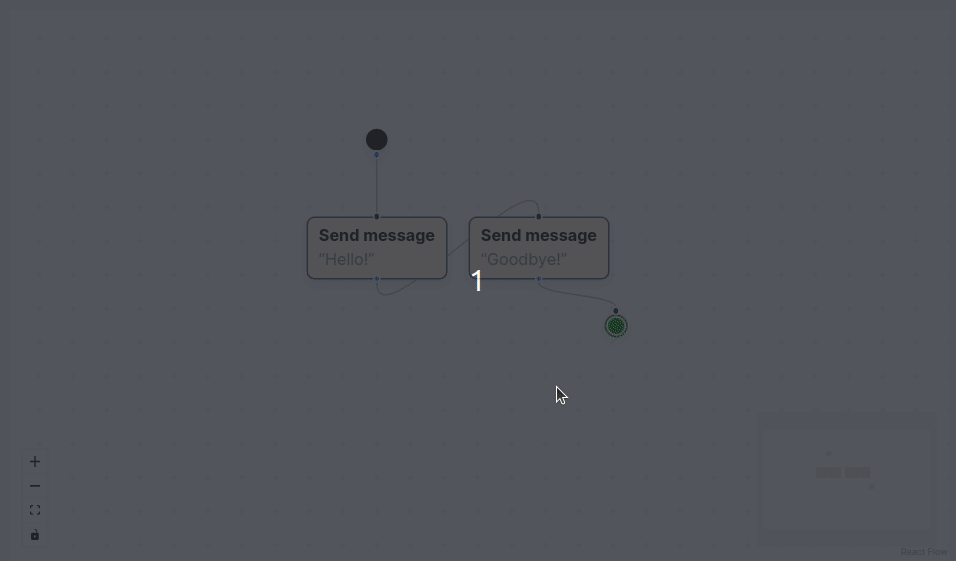

## Recap

* We've created a Next.JS project, with Tailwind and Typescript
* We've created a basic (currently static) dashboard
* We've installed Reactflow and started customizing it with custom nodes
* Currently, we have three node classes:
	* A Start node, which can't be deleted
	* An End node, which can be toggled between Successful and Failure exit modes
	* A Simple Text node, which will be used to blindly send a message to the user, without awaiting a response. This node can have its message configured
* I'm really enjoying working with Typescript. Its type model is really modern, generics are fun and useful, there are string enums that let you exhaustively enumerate them, and more. It's especially useful in this project because both Next.JS and Reactflow are fully typed, so I get a lot of editor support across the entire codebase. Neat!
* Tailwind seems quite nice. It's a really easy way to express the styles that you want, at least for me, since I already tend to think in terms of "I want a round border, colored green, some padding, ..." and those constraints map almost directly to Tailwind classes. The only problem is that you pretty much have to have a browser tab open to Tailwind's docs.
* As of now, Reactflow has handled everything that I have thrown at it. I haven't gotten into the really nasty nodes, with variable outputs and such, so we'll see. It has felt like a really nice platform for extending it and creating your own "flow-like" editors.
* What comes now? Maybe more nodes? Probably.
