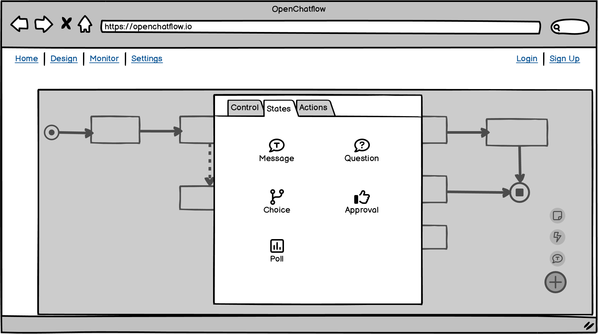

This devlog covers up to [commit `a10c123`](https://github.com/jreyesr/openchatflow/commit/a10c123d93f06d42c5338d1a80e4d3a222f50f7b). This is how the UI looks at this point:


We have:

* Created some UI for the user to add new nodes to a flow (the orange button at the bottom right)
* Implemented a drag&drop interaction so the user can place new nodes wherever he wants
* Created a Webhook node that makes an HTTP request whenever a point in the conversation is reached (the light green node)
* Created a Command node that lets the conversation take one of multiple paths, depending on the user's response to the bot (the topmost orange node)

## Creating a SpeedDial-like interface to add new nodes

Material UI v2 has a [Speed Dial component](https://m2.material.io/components/buttons-floating-action-button#types-of-transitions) as part of the Floating Action Button spec. We can use that for the buttons to add new nodes to the flow, as currently there's no way to do so.

See the image below. There's a round button at the bottom right. When you click on it (or, for desktop, just hover over it), it pops up some smaller buttons that correspond to the different node classes. Clicking on one of those buttons in turn opens a modal dialog that lists all nodes for that class. Clicking on a node adds it to the flow. That's similar to N8N, where there's a big Add node to the top right of the canvas.



I've also considered adding the nodes as a palette that appears to a side of the diagram, as [Node-RED does](https://nodered.org/). The advantage of such an UI is that a) it's quite intuitive, and b) you can drag nodes to wherever you want in the flow, while in the popup version you can't cleanly select where in the flow your new node will go, an have to resort to the node appearing, say, in the center of the diagram. Also, [Reactflow has an example of such an integration already](https://reactflow.dev/docs/examples/interaction/drag-and-drop/). I'll keep that in mind if the FAB route feels clunky. I didn't go for it at first because it's a permanent loss of space in the editor.


For now, though, I've been working on a Speed Dial-like component. Tailwind has no such component, so you have to implement it yourself. It's a really fun exercise, especially if you are determined to not use JS, and instead want to implement everything in pure CSS.

```tsx
export default function AddNodeFloatingButton(props: Props) {
  return (
    <Panel
      position="bottom-right"
      className="flex flex-col-reverse gap-3 items-center group"
    >
      {/* Main FAB button */}
      <button className="first-letter:bottom-0 right-0 p-0 w-16 h-16 bg-orange-600 rounded-full group-hover:rotate-45">
        {/* Material Design's Plus icon */}
      </button>

      <button
        className="p-0 w-12 h-12 hidden group-hover:block rounded-full"
      >
        {/* Material Design's Chat Bubble icon */}
      </button>

      <button
        className="p-0 w-12 h-12 hidden group-hover:block rounded-full"
      >
        {/* Material Design's Bolt icon */}
      </button>
    </Panel>
  );
}
```

The main container is a flex container, so we can place the buttons one after the other. It's a `flex-col-reverse` so the buttons go from the bottom up. Remember the `group` class on the main container, it'll be used soon.

The first `button` is the big Add button that is always visible. Its only gimmick is that, when the group is hovered over, it rotates 45 degrees. 

The second and third `button`s are the actual options. They are usually hidden, and appear when the group is hovered on, with the `hidden group-hover:block` classes. This is Tailwind's [styling based on parent state](https://tailwindcss.com/docs/hover-focus-and-other-states#styling-based-on-parent-state), which has already saved my bacon twice.

Here's how it looks, adding a red border to the group for clarity. When you aren't hovering over it, it looks like this:


And once you hover over the button, it looks like this:


So, to make the dial pop up you need to place your cursor over the orange button (or, more precisely, over the square that bounds it). However, once you place your cursor there, the hoverable area expands to also encompass the new buttons, and they will stay there until you move your cursor away. This is really important. I first tried to make the gray buttons appear when you hovered over the orange button, but that doesn't work: as soon as you move your cursor up to actually select an option, you leave the orange button and they disappear! In this way, they stay visible as long as you move your cursor straight up, without leaving the red area.

And also, here's a small animation. Observe how the Plus sign rotates to become an X sign when the speed dial expands:


Then, it's just a matter of adding `onClick` handlers on all buttons but the first one, and connect that to the rest of the application.

## Adding the node picker

The next step is to create a dialog when the user wants to add a new node. In accordance with the mockups above, first we'll try to display a modal dialog over the entire flow editor.

Tailwind says nothing about modals, but they aren't too difficult to create. You need a full-size gray background, semi-transparent, and over it place a panel with your content. I'm using (again) the [Reactflow panel](https://reactflow.dev/docs/api/plugin-components/panel/) component, this time positioned at the top center, since that's a reasonable location for a node palette.

```tsx
<Panel
  position="top-center"
  className="w-full h-full !m-0"
>
  {/* Backdrop */}
  <div
	  className="absolute inset-0 bg-gray-300 bg-opacity-50"
	  onClick={props.onHide}
  />
	
	{/* Actual panel */}
  <div className="absolute flex flex-col gap-6 mx-auto w-1/3 left-0 right-0 top-10 bg-white h-5/6 rounded-lg p-6 border border-gray-400">
	  <div className="font-bold text-base flex-grow-0">
	    {titles[props.type]}
	  </div>
	  <NodeList nodes={candidateNodes} />
	  
	  {/* Close button */}
	  <button
	    className="absolute top-6 right-6"
	    onClick={() => props.onHide()}
	  >
	    <Close width={20} height={20} />
	  </button>
  </div>
</Panel>
```

The backdrop (the gray background) is styled with the class `inline-0` so that it fills the entire editor. It gets a click listener so that, when clicked, it dismisses itself. There's also a Close button (at the bottom of the code) that also dismisses the panel, and we could add a keyboard shortcut for Escape, maybe.

Then, the actual node list takes its information from the same `customNodes` property that is passed to the Reactflow instance. In this way, any new nodes will be automatically registered with the palette.

And this is the `NodeList` component:

```tsx
export default function NodeList(props: Props) {
  return (
    <div className="grid grid-cols-3 gap-2 overflow-auto">
      {Object.entries(props.nodes).map(([k, v]) => ( 
        <div
          className="flex items-center justify-between flex-col p-2 bg-white rounded hover:bg-gray-100 hover:-translate-y-0.5 transition delay-100 duration-200"
          key={k}
        >
          {v.Icon({ width: 32, height: 32 })}
          <span className="font-semibold text-center">{v.FriendlyName}</span>
        </div>
      ))}
    </div>
  );
}
```

As you'll remember, this is the structure of the `customNodes` object, which is in the main Editor component:

```js
const nodeTypes = {
  [StartNode.TypeKey]: StartNode,
  [SimpleMessage.TypeKey]: SimpleMessage,
  [EndNode.TypeKey]: EndNode,
};
```

The magic part is that every custom node type _must_ have a defined structure:

```tsx
// This is the structure that ALL custom nodes must have

export interface CustomNode<T> {
  (props: NodeProps<T>): JSX.Element;
  TypeKey: string;
  Builder: (position: XYPosition, ...extras: any[]) => Node<T>;
  FriendlyName: string;
  Icon: FunctionComponent<any>;
}
```

Anything that implements the `CustomNode` interface must:

* Be a function that takes some node props and returns a React element (this is the function that actually defines the custom node)
* Have a `TypeKey` property
* Have a `Builder` function as a property that takes at least a position and returns a node JSON representation (of the form that is provided on the `initialNodes` array to the Reactflow editor)
* Have a `FriendlyName` that will be used on the palette
* Have an `Icon` property that, when called, returns a React element which is expected to contain an SVG icon. This will also be used in the palette

For instance, here's the `EndNode` custom node:

```tsx
import Stop from "@/icons/stop.svg";

type ExitCode = "success" | "failure";
type CustomData = { exitCode: ExitCode };

const EndNode: CustomNode<CustomData> = function(props) {
  const flow = useReactFlow();

  // Do magic

  return (
    <>
      {/* Whatever the node contains */}
    </>
  );
}
EndNode.TypeKey = "stateEnd";
EndNode.Builder = function (
  position: XYPosition,
  id?: string
): Node<CustomData> {
	// This is 
  return {
    id: id ?? "__end__" + uuidv4(), // If no ID provided, generate one at random
    position: position,
    data: { exitCode: "success" },
    type: EndNode.TypeKey,
  };
};
EndNode.FriendlyName = "End";
EndNode.Icon = stop;
export default EndNode;
```

The weird part here is that we are adding properties onto a function object. This is also [possible in Python](https://peps.python.org/pep-0232/#examples).

```tsx
EndNode() // Standard function invocation: Returns a React element containing the node's UI

EndNode.Builder() // Doesn't actually invoke the EndNode function, instead it calls the Builder function that is attached to it
EndNode.FriendlyName // Accesses the FriendlyName property that is attached to the EndNode function

EndNode().FriendlyName // ERROR: EndNode() becomes a React element, which doesn't have a FriendlyName property
```

This is possible because 

> In JavaScript, functions are first-class objects, because they can be passed to other functions, returned from functions, and assigned to variables and properties. They can also **have properties and methods just like any other object**. What distinguishes them from other objects is that functions can be called.
> 
> MDN, see https://developer.mozilla.org/en-US/docs/Web/JavaScript/Reference/Functions

The advantage of this pattern is that, as long as we remember to type every custom node as implementing the `CustomNode` interface, we'll get editor support for what it needs to implement. Also, if the palette declares that it takes an array of `CustomNode`s, it can simply iterate over them and access their `FriendlyName` and `Icon` properties, as you could see in the `NodeList` component above.

Here's how the palette looks like (I've replicated the few nodes that exist, so that they fill the screen):


And now, as long as all new nodes declare all the magic properties `FriendlyName` and `Icon`, they'll appear in the palette.

## Drag&drop

At this point, we could make it so that clicking on a node adds it to the flow. N8N does this, and the node is placed *somewhere* in the canvas. While that would work, it is less than ideal, and many times in my use of N8N I have found myself having to reposition the node. It's a small nuisance, but whatever.

In contrast, on Node-RED, you drag nodes from the palette into a position. Assuming the user knows that nodes have to be dragged, not clicked, it's far neater, as it gives the user an instant chance to place the node correctly. Besides, that gives us a chance to implement drag&drop on Reactflow, and there's [already an example](https://reactflow.dev/docs/examples/interaction/drag-and-drop/), sooo...

Also, [this MDN guide](https://developer.mozilla.org/en-US/docs/Web/API/HTML_Drag_and_Drop_API) covers essentially anything that you'd ever need to know about DnD, with links for further wisdom acquisition.

To implement drag&drop, you need to implement two separate parts of the puzzle:

* On the draggable object, you need to mark it as draggable and implement the [`onDragStart` event](https://developer.mozilla.org/en-US/docs/Web/API/HTMLElement/dragstart_event)
	* On that event, you need to set some data. For our usecase, we'll set the node type that corresponds to the dragged node.
* On the drag receiver (which here would be the entire Reactflow panel), you need to implement the `onDragOver` and `onDrop` events. This automatically marks the Reactflow editor as a _drop zone_ or _droppable area_.
	* The `onDragOver` event needs to accept the drop, as the default action is to disallow it (since most webpage elements don't accept drops). This event is called regularly when you move the mouse pointer while dragging an element.
	* The `onDrop` event is called once the user releases the mouse button. This event gets access to the data that was set on the `onDragStart` listener above, where in this case it can be used to instantiate a new node.

In this case, this is the code that defines a single option in the palette:

```tsx
function SingleNode(props: {
  nodeType: string;
  name: string;
  icon: (props: any) => JSX.Element;
}) {
  const onDragStart = (event: any, nodeType: string) => {
    // Set the payload, will be received by the onDrop event
    event.dataTransfer.setData("application/reactflow", nodeType);
    // Makes the mouse pointer have a "move" UI
    event.dataTransfer.effectAllowed = "move";
  };

  return (
    // Marked as draggable!
    <div
      className="flex flex-col items-center justify-between p-2 rounded cursor-move bg-white hover:bg-gray-100 hover:-translate-y-0.5 transition delay-100 duration-200"
      onDragStart={(event) => onDragStart(event, props.nodeType)}
      draggable
    >
      {props.icon({ width: 32, height: 32 })}
      <span className="font-semibold text-center">{props.name}</span>
    </div>
  );
}
```

That's it! On the receiver side (the main `Editor` component) there's more code required:

```tsx
const onDragOver = useCallback(
  (event) => {
    event.preventDefault(); // IMPORTANT
    event.dataTransfer.dropEffect = "move"; // Allow the move effect
  }, []
);
const onDrop = useCallback(
  (event) => {
    event.preventDefault(); // IMPORTANT
    // Grab the data that came from the onDragStart event
    const type = event.dataTransfer.getData("application/reactflow");

    // Transform the drop position to editor's coordinates
    const reactFlowBounds = flowWrapper.current.getBoundingClientRect();
    const position = flow!.project({
      x: event.clientX - reactFlowBounds.left,
      y: event.clientY - reactFlowBounds.top,
    });
    // Build a new node at that position
    const newNode = nodeTypes[type].Builder(position);

	  // Actually add the new node to the editor
    setNodes((nds) => nds.concat(newNode)); 
  }, [flow, setNodes]
);

<ReactFlow
  ...
  onDrop={onDrop}
  onDragOver={onDragOver}
/>
```

Note that, on the `onDrop` handler, we have to transform the event's coordinates to the Reactflow editor coordinate system. For example, say the user drops a node at the top left corner of the editor. That event will have coordinates close to (0, 0). However, that does _not_ mean that the new node must be created at position (0, 0) in the editor. For example, the editor's (0, 0) position may be at the center of the screen, or anywhere else for that matter. Thus, we have to transform the drop coordinates into Reactflow's own coordinate system. After doing so, we can find the node type that corresponds to the node key that came in the event, instantiate a node of that type in the correct coordinates, and add it to the node list. Then, as a courtesy to the user, we dismiss the modal palette so he can immediately start working on the new node.

So, to summarize:

* The draggable elements must declare themselves as such, and register a handler where they'll set some data that identifies whatever is being dragged
* The drop zone (the area that will accept the dragged elements) must accept drag events in `onDragOver` and actually receive and handle the data in `onDrop`

All in all, the interaction looks like this:


## Adding a dynamic edge

We'll now create a Webhook node, which is an async action. This is different than the nodes that we've created until now, as it runs in the background and doesn't block the execution of the conversation. It's a sort of [side effect](https://en.wikipedia.org/wiki/Side_effect_(computer_science)).

Adding this node will need changes to the edge validation logic. In [the last post](https://jreyesr.github.io/posts/chatflow-2/#edge-validation-only-allow-a-single-transition-from-the-start-state), we implemented a checker so that the conversation can only go from a state to a single new state (i.e., no forking). This works well for the main path nodes (Start, End, any Telegram nodes that get data from the user), but these side-effect nodes must run in parallel, since they don't disturb the flow of the conversation. That's fairly easy to do, just a change on the validation function so that it takes into account the types of both the source and destination nodes when determining whether the new edge must be allowed or not.

Then, the Webhook node is straightforward, just a copy of the Simple Message node with more configuration fields: a URL, HTTP method, headers and body.

That lets us create conversations that look like this:


Not bad, and the different color in the Webhook node indicates that it is a different class of node. However, for more clarity, we could make it so that the edges that go to the Webhook node are dashed, to better indicate the "backgroundness" of its actions.

Reactflow already has support for styling edges, but that gets weird when the edges are created dynamically. It's better to just create a new edge type and make it the default edge. We'll create a new edge `AutoEdge`, which looks at both its source and destination nodes, and styles itself accordingly. If the destination node is another main-path node, it'll be a solid line. If the destination node is an action node, it'll style itself as a dashed line.

Creating a custom edge type is mostly a matter of [copying Reactflow's guide to custom edges](https://reactflow.dev/docs/examples/edges/custom-edge/):

```tsx
export default function AutoEdge({
  source, target,
  sourceX, sourceY, targetX, targetY,
  sourcePosition, targetPosition,
  style = {},
  markerEnd,
}: EdgeProps) {
  const [edgePath, labelX, labelY] = getBezierPath({
    sourceX, sourceY, sourcePosition,
    targetX, targetY, targetPosition,
  });

  const flow = useReactFlow();
  const sourceNode = flow.getNode(source)!;
  const targetNode = flow.getNode(target)!;

  if (sourceNode.type!.startsWith("state")) {
    if (targetNode.type!.startsWith("state")) {
      // state -> state
      // Do nothing, default is OK
    } else {
      // state -> async action
      // Make line dashed
      style.strokeDasharray = "4";
    }
  }
  // any other combination shouldn't be possible

  return (
    <BaseEdge path={edgePath} markerEnd={markerEnd} style={style} />
  );
}
```

Then, on the main Reactflow instance, you also have to register the new edge type, much like with custom nodes. Here you can cheat: if you register the new edge type under the key `default`, it'll override Reactflow's default edge type and all edges that get created by dragging across nodes will get that type, which is just what we want:

```tsx
const edgeTypes = {
  default: AutoEdge,
};

<ReactFlow
  ...
  edgeTypes={edgeTypes}
>
```

And this is what happens now:


As you can see in the animation above, as soon as you release an edge that goes to an action node, it becomes dashed. Lines between regular state nodes stay solid.

## Detour: Adding arrowheads to edges

The default edges don't have arrows, which is less than desirable when designing a flowchart-style diagram where execution progresses in a certain direction. There [are instructions](https://reactflow.dev/docs/examples/edges/markers/) on how to add edge markers (such as arrows) to edges, but the example uses the default edge types, not our custom magical edge that becomes dashed.

It turns out that enabling markers on custom edges requires some fiddling:

* Ensure that your custom edge type captures the `markerEnd` prop and passes it directly to the `<BaseEdge>` element.
* On the main editor, set the property `defaultEdgeOptions` and pass it an object to the `markerEnd` property. Provide the arrow type and size there.
	* It's important that you provide an entire object to the `markerEnd` field here! Typescript seems to suggest that you can provide just a string, but that doesn't work for some reason...

So, on the custom edge `BaseEdge.tsx`, we do this:

```tsx
export default function AutoEdge({
  ...,
  markerEnd, // Remember to grab this prop!
}) {
  // magic code here...
	
  return (
    <BaseEdge
      path={edgePath}
      markerEnd={markerEnd} // IMPORTANT!
    />
  );
}
```

And then, on the main editor, we configure this:

```tsx
<ReactFlow
  ...
  defaultEdgeOptions={{ 
    markerEnd: { type: MarkerType.Arrow, width: 15, height: 15 },
  }}
>
```

## Nodes with a dynamic number of edges

Up until now, all nodes have had at most two handles, one input and one output. A Confirmation node would have two outputs, for the "user confirmed" and "user denied" paths. However, some nodes require a variable number of outputs: consider a Command node, which waits for a [bot command](https://manual.activechat.ai/fundamentals/messaging-channels/telegram#how-to-use-bot-commands-in-telegram) and then routes the conversation through a certain path. We'd like the user to provide however many commands he wants, and thus we need nodes that change their outputs dynamically.

In a strange turn of events, there's not a ready-made example on the Reactflow docs for this. There's a mention that 

> When you are programatically changing the number or the position of handles inside a custom node you need to notify React Flow about it with the `useUpdateNodeInternals` hook

and there's also [this unofficial CodeSandbox](https://codesandbox.io/s/8we0v), which presents a node with a button that adds a new output handle. That will have to do.

We'll implement a Command node, since that is part of a balanced chatbot's diet. The node will have a variable amount of outputs, and the user will be able to configure which commands the node will react to. The commands will be configured in the node's config dialog.

The commands can be modeled as an array of strings. For every command, we need to create a new output handle ("source" handle in Reactflow's parlance), and then alert Reactflow so it can redraw the node by firing a call to `updateNodeInternals`. The handles are set inside a flex container so that they space themselves out nicely along the bottom edge of the node.

Then, after modifying the custom edge component so that it displays a label when the edge is outbound from a command node (i.e., the edge's source `TypeKey` is equal to `Command.TypeKey`), we get the following:


We have a Command node that handles three commands: `/start`, `/sayless` and `/bye`. You can see that because the outbound edges have their corresponding labels. Also, as with the other nodes, you can connect arbitrary async actions to any command, since they don't interfere with the conversational path. In this case, you can imagine some sort of analytics server that is informed of the user's choice, regardless of the provided command.

For now, the node's configuration is quite simple: just a form where you can add, edit and delete commands. Later we may add a text field to customize the message that the user will see if he provides something that is not a valid command.


## Recap

Here's this week's progress:

* We've added some UI to add new nodes
* We've implemented drag&drop functionality so the user can place new nodes wherever he wants in the canvas
* We've added a Webhook node, which is an async action that can be connected at any point in the conversational path, and sends an HTTP request to a server
* We've added edges that change their own style (solid or dashed) depending on whenever they are part of the main conversational path (state → state) or an async path (state → async action)
* We've added a Command node that lets the conversation take one of multiple paths, depending on the user's choice
