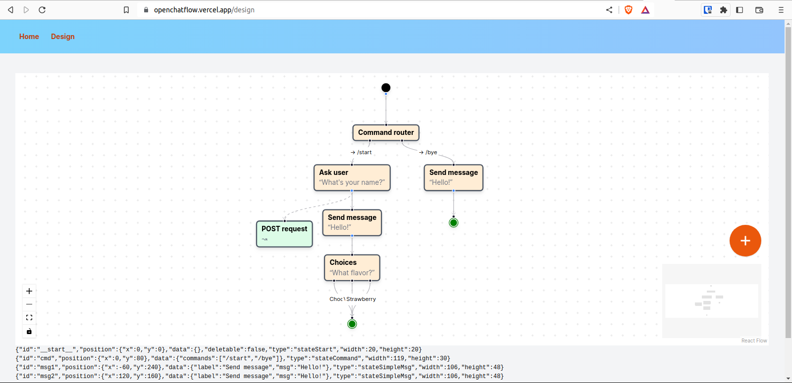
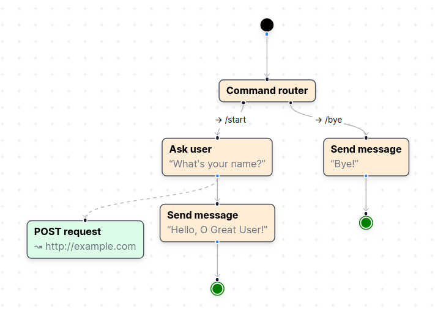
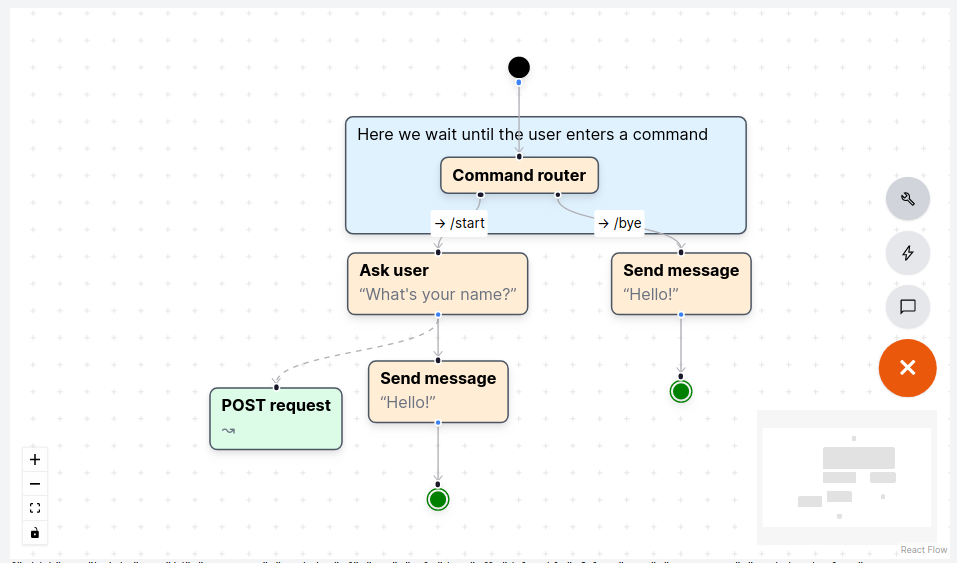
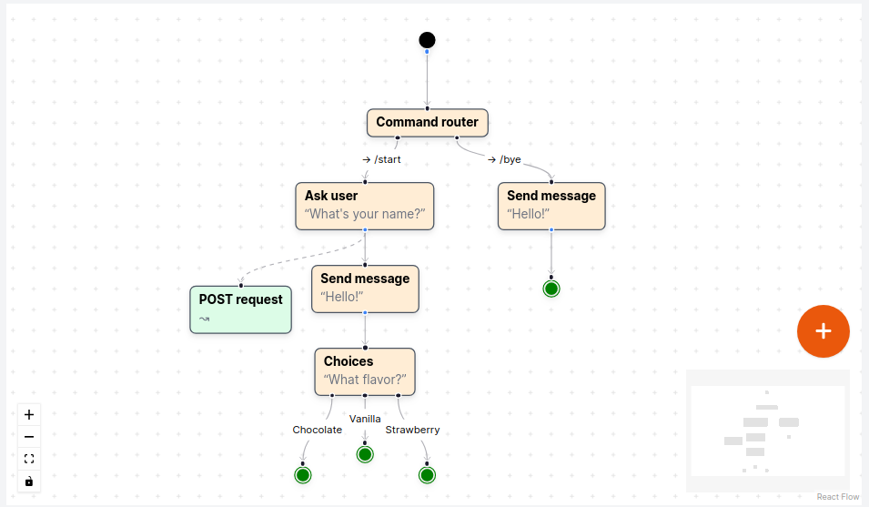
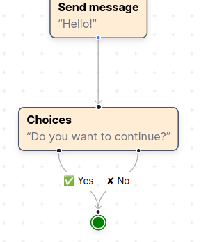
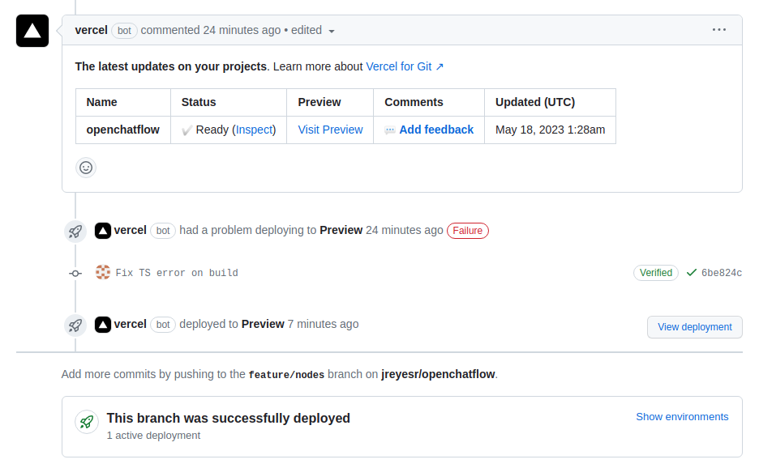
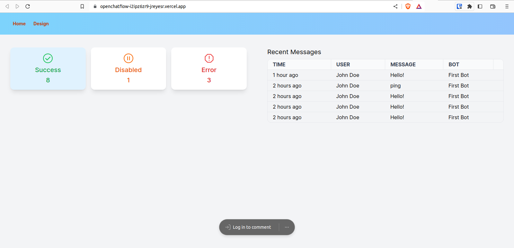
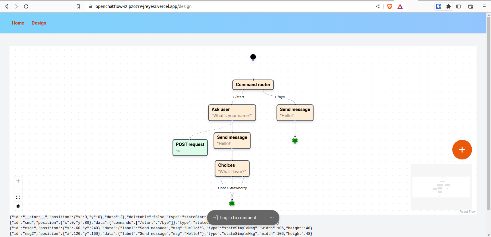
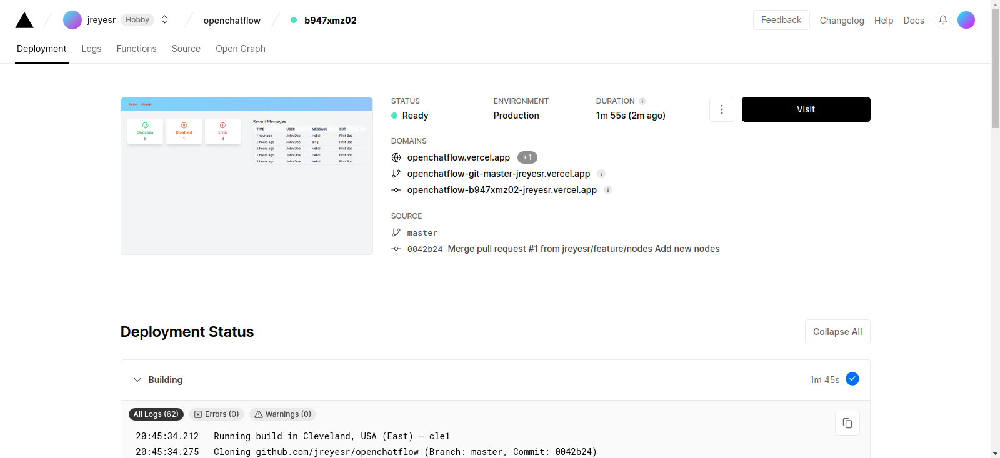

The app is now live on Vercel! Check the editor out on <https://openchatflow.vercel.app/design>

This devlog covers up to [commit `0042b24`](https://github.com/jreyesr/openchatflow/commit/0042b240c25c6c5d3dacdc3a1f48ea93826b6c77). This is how the UI looks at this point:

We have:

* Added a Question node that prompts the user for some text (such as a name) and then continues the conversation
* Added a Note node that can have arbitrary text content, has no effect in the conversation's execution and can be resized
* Added a Choice node that prompts the user for one of several options and then branches the conversation flow accordingly
* Deployed the whole project to [Vercel](https://vercel.com/) for worldwide access!

## Adding a Question node

We're still missing a basic "data entry" node. It should ask the user for some data, such as his name or a search query, that will then be used by the chatbot to do something.

That node is very simple, and it has no hidden surprises. It's just a node with a single configuration item (the prompt that will be displayed to the user).

With this new node, we can start building conversations that even *look* like they could be useful:

## The Note node

N8N provides a [Sticky Note](https://docs.n8n.io/workflows/components/sticky-notes/) node that "allow[s] you to annotate and comment on your workflows":

We'll add a similar note here. For now, it won't have Markdown rendering as N8N's notes do, just plain text. Markdown rendering should be easy(ish) to add later, as it's stored as text, just interpreted differently.

The Note node has almost nothing special, except for its `zValue` set to -1. This is used to ensure that the notes always appear "behind" other nodes, as notes in N8N do. This means that notes can be used to visually group nodes.

For notes, it's also useful to resize them. Reactflow does come with a [`NodeResizer` component](https://reactflow.dev/docs/api/nodes/node-resizer/) that helps in implementing resizable nodes. After some CSS magic so the drag handles always match the node's borders, we're left with this:

The notes are placed from a new section in the Add button to the right. The note is the light blue block behind the Command Router node, which explains something about the node.

## The Choice node

We may also want a node that prompts the user to choose something from a set of values, using [inline keyboards](https://core.telegram.org/bots/features#inline-keyboards). This is perfect for limited data entry, as then the user is not required to write anything and instead presses a button:

From the editor's point of view, this node is almost the same as the Command node, since it has multiple outgoing handles, one for each option. Indeed, writing it was a matter of copying the Command node and changing a few variable names and text, plus adding another config entry for the prompt.

With text, command, prompt and choice nodes, there's enough foundation for many conversational interfaces. The choice node can also be used as a Confirmation node, by providing it with Yes/No options (indeed, that's the default configuration that is applied to new Choice nodes dragged from the node palette)

Also, I just discovered that all nodes already support emoji, apparently!

## Deploying to Vercel

The project has now reached a point at which it could reasonably be published to the world, in a more interactive way than raw source code.

To do so, we'll use [Vercel](https://vercel.com/), for two reasons. First, they are the creators and core maintainers of NextJS itself, so we would expect best-in-class support for it. Second, it has a free plan that should more than cover the needs of the project, absent a massive spike in popularity that overflows everything, or a DDoS attack.

I'm aware of [the potential problems](https://medium.com/@sushrit.pk21/how-when-and-why-you-should-switch-from-vercel-to-a-different-hosting-provider-especially-for-8ba25e439788) that come with using a framework+platform that are built by the same company, in particular the risk of vendor lock-in and potential high prices. Neither of those seem relevant to me at the moment, since I'm not spending any money on the project anyways, nor am I using Vercel-specific functionality. Should this project balloon into a full-fledged service, I'd have to reevaluate hosting on Vercel vs. managing actual servers, but for now, at the "one-man prototype built on nights" stage, Vercel is perfectly fine.

The process to deploy the application to Vercel was quite simple:

1. Visit [Vercel's homepage](https://vercel.com/)
2. Create an account, link it to my Github account
3. Create a new Project, authorize the Vercel application to access my personal account, select the repo
4. Create [a PR](https://github.com/jreyesr/openchatflow/pull/1) for the most-recent branch
5. Fix some errors in the code (this step is optional)
6. Push again, wait for the app to be built

Once all is done, [the PR](https://github.com/jreyesr/openchatflow/pull/1) will have a comment made by the Vercel bot, which links to the "preview deployment":

Vercel creates an isolated deployment, which contains the result of building whatever code is in the branch. This deployment, thus, is its own instance of the application, and is assigned a unique URL. Two, in fact, one for the branch (which changes if you push another commit) and one that is tied to the commit and therefore never changes. The Vercel bot adds a comment that links to the branch URL.

For example, see [this link](https://openchatflow-i2ipz6zr9-jreyesr.vercel.app/):

Not bad! It's a live, interactive version of the application. From here on, other people could poke around, use the application, [make comments](https://vercel.com/docs/workflow-collaboration/comments) (which would be reflected in the comment in the PR, as a count of "total comments" and "unresolved comments") and all-around test the application.

When everything looks OK, we can merge the PR and update the main (i.e. Production) deployment:

And the app is now live [here](https://openchatflow.vercel.app/):

Have fun with it!

## Recap

As of now, I feel like I've hit the limit of what can be done in the web app itself. There is a lot of work that I haven't even started yet:

* Backend stuff, to persist the workflows. Currently there is a single workflow hardcoded in the React components. We need a way to "list all conversations", "select a conversation" (which would load the conversation's definition from a DB), and "save changes". That definitely requires a DB and a ton of extra plumbing, such as model definitions and server-only routes.
* Actually making the conversations do something. As of now, the application is nothing more than a fancy, visual JSON editor. You can move nodes around all you want, but they do nothing apart from being displayed. We need an actual state machine engine (or interpreter) to actually... _do_ stuff with the conversations. That's yet more work, since we need to add a state machine library, find a way to transform Reactflow's data into a format that the state machine can use, and define the state machines.
* Integrating with Telegram. Even if we had state machines, without a connection to Telegram they would do nothing, unless we simulated events (which we need to to anyways for testing/debugging purposes). This requires a way to react to events that happen in Telegram, maybe via webhooks, and converting them into state-machine-compatible events.

