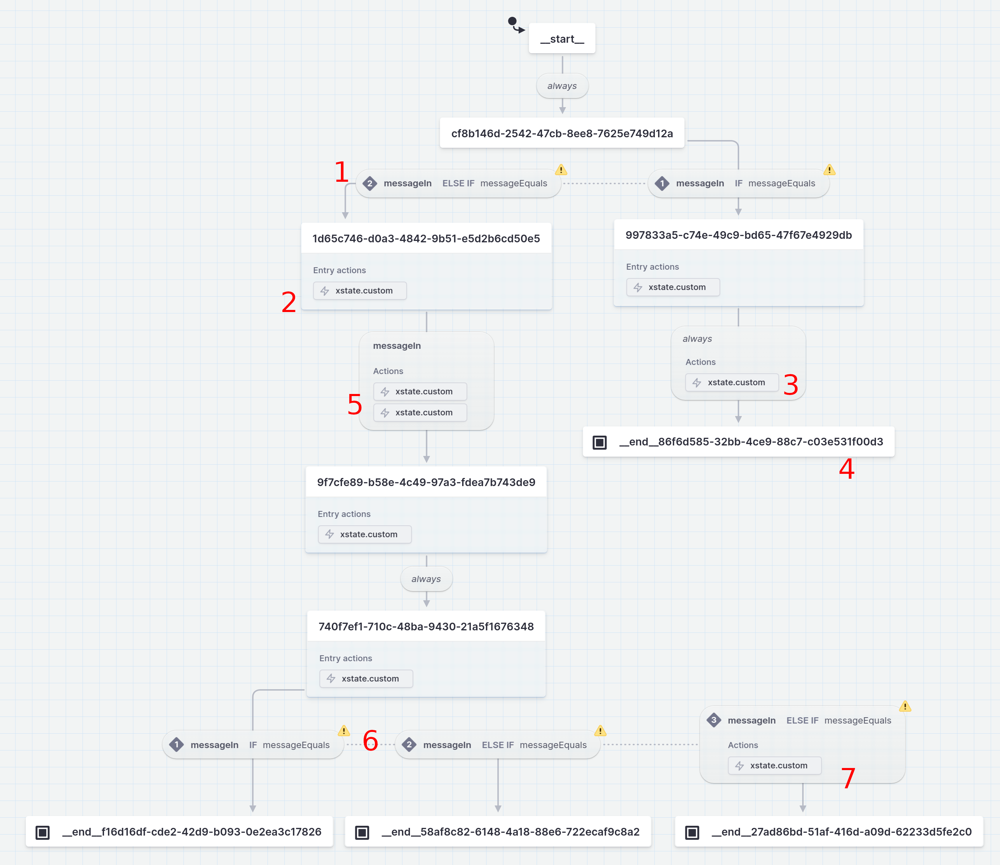

The app is now live on Vercel! Check the editor out on <https://openchatflow.vercel.app/design>

This devlog covers up to [commit `3714236`](https://github.com/jreyesr/openchatflow/commit/3714236c902f5ccb64ec2d2094aaeff045088b96). This is how the UI looks at this point:


(It's the same as last time, since we have added backend code only)

## Before we start

Hello again! The [last post about OpenChatflow](https://jreyesr.github.io/posts/chatflow-6/) was almost two months ago, and then I have been playing with other completely unrelated things, such as [N8N](https://jreyesr.github.io/posts/n8n-node-carbone-1/), [Terraform](https://jreyesr.github.io/posts/terraform-declarative-api-management-1/), [script hosting servers](https://jreyesr.github.io/posts/script-runners/) and [binary parsers](https://jreyesr.github.io/posts/kaitai/).

This is most definitely _not_ due to the fact that I was procrastinating really hard on this post. The task that we'll discuss here (translating between two entirely different conceptual models, one aimed at graphical flow editing and another designed for state machine description and execution) is quite daunting, especially writing a general solution that (hopefully) scales more or less well.

Even now, I'm not really happy with what I have. It's less than two hundred lines of code (sans comments), but it's _very_ dense. I fear what will happen if someone else wants to contribute to that code, or (more likely) what will happen when I have to make a change in a few months. However, I've exhausted my code crafting mana pool by writing a generic solution, and I have nothing left to make it understandable too. Maybe Later&trade;.

## Introduction

In the previous [posts](https://jreyesr.github.io/posts/chatflow-6/), we have been developing [a web application](https://openchatflow.vercel.app/design) to design Telegram chatbots, by visually composing "conversations" that can be followed by bots. These conversations can contain simple messages, where the bot just sends a message to the user; questions, where the bot waits for a response before proceeding; choices, where the bot waits for a response out of a set of possible choices; and other similar stages. Together, these steps can build fairly complex behaviors.

As of now, the web application is nothing but a frontend. The changes made to conversations _do_ get saved into a DB, but they are used only to be displayed to the user again. There's nothing behind the flow: no real chatbots, no logic, nothing. This is because, up until now, we have focused on the user interaction with the editor, not on actually using the designed flows to perform any actions.

Now that [the editor](https://openchatflow.vercel.app/design) has a reasonable set of features, we can turn our attention to actually _doing_ stuff with the user's lovingly crafted conversations.

Since Telegram conversations are inherently asynchronous (i.e., messages arrive and are sent at irregular, unpredictable intervals, since they depend on unreliable puny humans), we need a way to remember the state of a conversation:


Consider this: We receive a message from User A. This means that we have to start a new Conversation, taken from the Template, and run "one step", whatever that means. Maybe it's just sending a "hello" message to the user, maybe it's looking at that input and branching. Whatever the case, we now have a new, running conversation, which is completely independent from the Template that you can edit on the web application. Indeed, once a Conversation has started, any changes made to the Template won't affect it, since the Template could change in ways that make it incompatible.

Then, the same bot receives a message from User B. This should spawn a _new_ copy of the template, since conversations are per user. From there on, any messages sent by User B (as long as his conversation doesn't finish) will go to his own copy of the Conversation and advance its state, independent of what User A says.

This is all repeated for every Conversation Template, since you can have multiple "flows", corresponding to different conversation trees handled by different bots. However, the main point is that there is a difference between what you can see and edit in [the web UI](https://openchatflow.vercel.app/design) (which here we've been calling a Template) and what Telegram users interact with (which are Conversations).

This is a similar relationship to what there is between a class and its instances in OOP. For more examples, consider:

* In Google Forms, you "create a form", then [add questions to it](https://support.google.com/docs/answer/2839737?hl=en&ref_topic=6063584&sjid=4979816159083899246-NA#zippy=%2Cadd-a-question) and save the changes. You then [send your form to users](https://support.google.com/docs/answer/2839588?sjid=4979816159083899246-NA) and from there on, whatever answers they give are saved separately from the form
* In [N8N](https://n8n.io/) (and, really, every workflow automation tool, such as [Zapier](https://zapier.com/) or [Pipedream](https://pipedream.com/)) there's always the distinction between a [workflow](https://docs.n8n.io/workflows/components/nodes/) and an [execution](https://docs.n8n.io/workflows/executions/) of that workflow
* The same distinction exists between a binary executable and a process: the executable is a file on disk, a process is loaded in memory and executed by a CPU

There's always the same theme here: some sort of "template", which is static or changes slowly, and many "instantiations" of that template, generated in large(r) quantities.

The user of OpenChatflow edits templates. These are saved on the DB in the format that [Reactflow](https://reactflow.dev/) uses and wants to see: two arrays, one for "nodes" and one for "edges". Nodes are steps, edges are the connections between steps. This means that persisting the Template's state is really, _really_ easy: just get the data out of Reactflow, and save it into [a `JSON` column](https://www.postgresql.org/docs/current/datatype-json.html) in the Postgres DB. Then, when editing a Template, get that data out from the DB and use it as an initial configuration for Reactflow. Easy.

However, this data cannot be executed. We need something that can run and do things, but the data that we save is only useful to configure a visual node editor. How do we convert it to an "executable form"?

## XState, or the art of state machines

We'll start with a recap of state machines, using [XState's docs](https://stately.ai/docs/xstate-v5/state-machines-and-statecharts) as guidance.

First, we'll start with a formal definition of state machines, as brilliantly summarized by David Khourshid [in a talk](https://www.youtube.com/watch?v=VU1NKX6Qkxc) some years ago:


Well, that's enough of formal definitions. I trust everyone has understood, there are no questions, we can move on. Bye!

Seriously now, a state machine is a set of states, plus transitions between states. A state machine starts in a state, say S1, then when _something_ happens it transitions to another state, say S2, and so on.

Consider this state machine from the ever awesome [Game Programming Patterns site](https://gameprogrammingpatterns.com/state.html):


These are states for a player character in a game. You probably start in the Standing state, and user input events (such as pressing/releasing the Down arrow or the B button) cause event transitions. Notably, this state machine will probably run all the time, inside your [game loop](https://gameprogrammingpatterns.com/game-loop.html), receiving every keypress from the user. Most of those keypresses (those that aren't either Key Down or B) will always be ignored, and even Key Down or B events may be ignored: if you are in the Ducking state, B won't do anything.

This highlights an important fact of state machines: they _react to events_. They always have a way of getting input from the outside, and typically these events are what drives the machine's execution. With no events, the machine may eventually settle to a stable state[^1].

Another example: this is a state machine for a standard traffic light:


It starts in the `green` state, then (on a timer) transitions to the `yellow` state, then to `red`, then back to `green`, and so on forever. This is because this particular machine has no end states.

Or consider this more complex machine for an online store:


This state machine covers the entire flow, from starting with an empty cart, through the actual checkout process. In this case, the "events" may be caused by the user pressing specific buttons in the store's UI, which is a higher-level view of events than the raw input device events that we saw in the game example above.

So, to recap, there are states and there are transitions between states. Transitions happen on specific events, and they can have conditions attached (e.g., the `SELECT_CARD` transition in the statechart above could have a condition so it only happens if the user has provided a valid credit card number, otherwise it'll just sit there and complain). Further refinements are entry/exit actions (i.e., "when entering state S3, do action X. When leaving it, do action Y"), end states (when reaching state S5, stop accepting events, essentially terminating the execution), [parallel states](https://stately.ai/docs/xstate-v5/parallel-states), [history states](https://stately.ai/docs/xstate-v5/history-states), [nested machines](https://stately.ai/docs/xstate/states/parent-and-child-states) and more!

Hopefully, by this point you'll see the similarities between state machines and a chatbot's Conversations: they start in a certain "state" and then proceed. Here, the events would probably be the user's messages, since they are what makes the conversation "take a step" forward. The main event that our state machines will react to will, of course, be a "message received from user" event, which should carry the user's message as a payload. With this information, the newly-entered state can take action.

Actions (e.g., sending the prompt message to the user on a Question step) can be handled as [entry actions](https://stately.ai/docs/actions-and-actors/entry-and-exit-actions): when entering the state, we can send a message with the question. The state machine will then sit there until a message from the user wakes it up again and makes it advance one step.

## An example conversion

Here's a sample to review what we have discussed so far. This conversation template:


should be translated into something like this state machine:


You're free to look at those two pictures side-by-side and verify that they express the same operations.

## Tentative translation rules

This lets us define some general, high-level translation rules:

* In general, flow nodes (Question, Message, Command, ..., the ones that are orange in the web application) turn into state machine states, which are the solid white blocks, rectangular with a small corner radius
* Transitions between main flow nodes become state machine transitions, which are the arrows between states. Most transitions between states use the same event, the `messageIn` event, which would be called every time the bot receives a message from the user
	* However, some transitions are eventless (i.e., they happen automatically), for nodes that don't require a user response. For example, the Simple Message node does its thing and immediately yields control to the next node. These transitions become `always` transitions, which happen right after entering their source state
* What we called _async actions_ (such as webhooks that are called when a specific stage is crossed) are converted into [transition actions](https://stately.ai/docs/xstate/actions), which are called when that transition is executed. Note that async actions don't become states themselves, but rather become part of a transition across states
* End nodes (the circles with another circle surrounding them) become [final states](https://stately.ai/docs/states/final-states)
* Nodes that have more than one outgoing [handle](https://reactflow.dev/docs/concepts/terms-and-definitions/#handles) (such as the [Choice node](https://jreyesr.github.io/posts/chatflow-4/#the-choice-node) and [Command node](https://jreyesr.github.io/posts/chatflow-3/#nodes-with-a-dynamic-number-of-edges)) get those outgoing handles transformed into [guarded transitions](https://stately.ai/docs/transitions-and-events/guards), which check the contents of the received message. The event is the same across all guarded transitions
* The nodes that don't require waiting and can be finished immediately (such as the [Send Message](https://jreyesr.github.io/posts/chatflow-2/#adding-a-new-node-simple-messages-no-response-required) node) have [an eventless (always) transition](https://stately.ai/docs/transitions-and-events/eventless-transitions), since they don't need to wait for the user to say anything

Or, in graphical form:

|Flow editor|Description|State machine|What happens?|
|---|---|---|---|
||The first node, whatever it is||The node after the Start gets marked as the initial node|
||Message node, which sends a message to the user and carries on||Entry action on state sends the message, eventless exit transition|
||Question node, which sends a prompt and then waits for the user's answer||Entry action sends the prompt, exits state when user's response received|
||Command node, which only accepts certain commands from the user||Does nothing on entry, exits on different branch depending on user's response|
||Choice node, which only accepts certain responses from the user||Entry action sends the prompt, exits on different branch depending on user's response|
||End node||Dedicated node marked as final|
||Webhook node (async action)||Subsumed by the main (solid-line) transition out of that handle, as a transition action|
||Multiple webhook (or other async action) nodes||All become transition actions on the same main transition|

Armed with those translation rules, we should be able to mechanically translate any Conversation Template into a XState machine definition, for execution. That's the hope, anyways.

## A complete example

With these rules, the following conversation:


becomes this XState machine:



By the way, in case you want to poke around the translated machine, it's [on this link](https://stately.ai/registry/editor/b780184b-ee97-464a-866e-9241fadeeb44?machineId=3ba91d60-2285-471f-b16d-bf929fe122f6). The visualizer lets you publish machines.

I've rearranged the state machine so its layout is as similar as possible to the conversation. If you scroll up and down between them, you can see that all our translation rules above have been followed. Some salient points of the translation process include (as marked in the state machine):

1. This is the Router's decision: two `messageIn` transitions that invoke a `messageEquals` condition. The state machine can't display it, but while both transitions use the same condition, they have a different parameter, which is set to `/start` on the left guard and to `/bye` on the right guard. This is what makes the difference between taking one branch or the other. The XState visualizer can't understand that, which is why if displays a yellow exclamation mark on the guards: it's convinced that it has found two guards with the same name, and thus both would be taken simultaneously
2. This is the Ask user node. As you can see, it has an "Entry action", which fires when the node is entered. This is where the bot will actually send the user a message with the prompt that has been configured in OpenChatflow. Again, we're using a custom action and the XState visualizer only shows `xstate.custom`, but the necessary information is there
3. If we took the `/bye` branch in the Command router, after we send the user a message, we want to POST to a remote URL. This becomes an action in the transition. Since the previous node was a Simple Message node, which doesn't require waiting for the user, this is an `always` transition directly to an end node
4. Final nodes are their own entities. We could mark the nodes that precede end nodes as final nodes themselves, but that breaks down in case of multi-output nodes such as the Command and Choice nodes
5. After the Ask User node, we have two webhook calls when traversing to the next state. Again, these become actions in the transition, but this time it is not an `always` transition, but a `messageIn` one, since asking the user requires waiting for the user to respond. However, the actions are exactly the same
6. The three-branch guarded transition is the Choice node that asks for an ice cream flavor. Much like the Command router on bullet point 1, this transition fires on the `messageIn` event and calls the `messageEquals` condition, which compares the event's payload (i.e. the actual text that was just received from the user) to a parameter which varies across guards (here set to each expected choice)
7. The rightmost branch corresponds to the Chocolate choice, which in the original Conversation has a Webhook action attached to it. This is materialized in the state machine as an action on the guarded transition, which will only fire when the guard is satisfied

## The code!

The state machine that we reviewed in the previous section wasn't manually designed. I did rearrange it manually, but its contents were automatically generated.

[This commit](https://github.com/jreyesr/openchatflow/commit/3714236c902f5ccb64ec2d2094aaeff045088b96) contains the code that does so. In particular, the `convert()` function in the `converter.ts` file ([permalink](https://github.com/jreyesr/openchatflow/blob/3714236c902f5ccb64ec2d2094aaeff045088b96/src/components/nodes/converter.ts)) contains most of the translation logic.

That function receives two arrays: one of Nodes and one of Edges. Both arrays hold data in the format that Reactflow uses for its own purposes: [nodes](https://reactflow.dev/docs/api/nodes/node-options/) and [edges](https://reactflow.dev/docs/api/edges/edge-options/). For example:

* Nodes have an ID, position, type (all our nodes use custom types), whether the node is selected, visible, draggable, connectable, selectable and deletable; CSS inline styles and class names; and finally a `data` property that holds arbitrary data
* Edges have an ID, the IDs of their source and target nodes, the IDs of their source and target handles (for nodes that have [multiple handles](https://reactflow.dev/docs/concepts/terms-and-definitions/#handles)), a label, whether they are selected, selectable, animated and updatable; several style properties, configuration for the arrowheads on both sides; and finally a `data` property that holds arbitrary data

So, as you can see, there is a mix of several types of data:

* Visual data: colors, positions, styles. This is unnecessary for the state machine, which only cares about executing actions, in much the same way that indentation is not necessary for a C compiler, just the correct braces
* Topological data: by this I mean data about the connections: which node is connected to which node? In what direction? This is the concept that [graph isomorphism](https://en.wikipedia.org/wiki/Graph_isomorphism) is about: not the position of nodes in a 2D canvas, but only which node is connected to which other node
* Custom (execution) data: this is data that OpenChatflow carries inside of nodes. Almost every node (with the exception of the Start node) has some properties that define the node's behavior. The Simple Message node has a text. The Webhook action has a bunch of properties, such as the URL, HTTP method, any headers and the body. The Choice node has a prompt and a list of accepted choices. Even the End node has a property for the exit type (successful or error)

The first class of data is discarded. The second class of data is used to generate the nodes and transitions, and the third class is used to configure said nodes and transitions.

### The main loop

This is the `convert()` function:

```ts
export function convert(
  machineId: string,
  nodes: Node[],
  edges: Edge[]
): StateMachine<ConversationContext, ConversationState, ConversationEvent> {
  const stateObject: { [k in string]: any } = {};
  for (const n of nodes as CustomNode<any>[]) {
    const outgoingEdges = edges.filter((e) => e.source === n.id);
    // outgoingStates are edges that go out from the current node to state nodes
    const outgoingStates = outgoingEdges.filter((e) =>
      nodeById(nodes, e.target).type?.startsWith("state")
    );
    // outgoingActions are edges that go out from the current node to async action nodes
    const outgoingActions = outgoingEdges.filter((e) =>
      nodeById(nodes, e.target).type?.startsWith("action")
    );
    const state = nodeToState(n, outgoingStates, outgoingActions);
    if (state === undefined) continue; // Pass over nodes that don't map to states, such as action nodes
    stateObject[n.id] = state; // Stick this node in the nodes object, keyed by the node's ID
  }

  // Now create the actions:
  // * sendMessage(content) is used from some nodes
  // * One for each action node, such as Webhooks. These actions' IDs must be the node's IDs as assigned by Reactflow
  let actions: { [k: string]: ActionFunction } = {
    // NOTE: states that invoke the `sendMessage` action MUST provide it with a `content` property!
    // This will be used as the message that will be sent to the user
    sendMessage: (_context, event, { action }) => {
      console.log(event, action);
    },
  };
  for (const n of nodes as CustomNode<any>[]) {
    const asAction = nodeToAction(n);
    if (asAction === undefined) continue; // Pass over nodes that don't convert to actions, such as state nodes
    actions[n.id] = asAction; // Stick this action in the actions object, keyed by the node's ID
  }

  // Crete the guards
  // * messageEquals => {cond}.matcher must === event.text
  let guards: { [k: string]: GuardFunction } = {
    // NOTE: guards that invoke the `messageEquals` condition MUST provide it with a `matcher` property!
    // `messageEquals` MUST be called from a `messageIn` event, since only there it will have access to the message's text
    messageEquals: (_context, event, { cond }) => event.text === cond.matcher,
  };

  const userMachine = createMachine<
    ConversationContext,
    ConversationEvent,
    ConversationState
  >(
    {
      id: machineId,
      initial: findFirstNode(nodes).id,
      states: stateObject,
      predictableActionArguments: true, // This is recommended for v4-v5 consistency: https://xstate.js.org/docs/guides/actions.html#api
    },
    {
      actions,
      guards,
    }
  );

  return userMachine;
}
```

The conversion performs the following steps:

1. It runs over every node in the conversation, gets all the edges that go _out_ from that node and tries to convert it to a state node
2. If it was possible to do so, that state node is added to the object that holds states
3. Then, we create actions. These actions are called by the state nodes that were just created, by name. There is an action that will always exist, that sends a message back to the user. Async action nodes, according to our rules, also become named actions that will be triggered on transitions
4. We create guards, which are similar to actions in that they are named and used by state nodes (or, more precisely, by guarded transitions). However, unlike actions, guards return a boolean. As of now, the only guard that exists is one that checks the message that we've just received from the user and compares it to a customizable value
5. Finally, we build the state machine, with its states (which also contain ther outgoing transitions), actions and guards

### Converting a node to a State

Some conversation nodes (those that represent conversational states, such as Simple Message, Command, Choice or Prompt) must be turned into state machine States. This is done in the `nodeToState()` function, which contains a monstrous `switch` statement:

```ts
function nodeToState(
  node: CustomNode<any>,
  outgoingEdgesState: Edge[],
  outgoingEdgesActions: Edge[]
): any | undefined {
  // ONLY state nodes accepted here
  if (!node.type!.startsWith("state")) return undefined;

  // This is configuration common to all nodes. All branches of the `switch` below
  // add data to this object, and it is returned at the end
  let config: any = { meta: { nodeType: node.type } };

  let _actionsGroupedByHandle = groupBy(outgoingEdgesActions, "sourceHandle");
  // actionsGroupedByHandle is a dict. Keys are handle IDs, values are lists of target node IDs
  // For example, for a node with two handles,
  // where the first one has two async actions and the second one has one:
  // {1: ["action_id_1", "action_id_2"], 2: ["action_id_3"]}
  let actionsGroupedByHandle = Object.fromEntries(
    Object.entries(_actionsGroupedByHandle).map(([k, v]) => [
      k,
      (v as any[]).map((e) => e.target),
    ])
  );
  // allActions is a list of target node IDs, no matter the output handle
  // You can also think of it as all the VALUES of actionsGroupedByHandle, merged together in a single list
  let allActions = outgoingEdgesActions.map((e) => e.id);

  switch (node.type) {
    case "stateSimpleMsg":
      // Send the configured message on state entry
      config.entry = [{ type: "sendMessage", content: node.data.msg }];
      if (outgoingEdgesState.length > 0) {
        config.always = {
          // message nodes exit immediately, they don't wait for user input
          target: outgoingEdgesState[0].target, // message nodes should have exactly one outgoing node
          actions: allActions,
        };
      }

      break;
    // Many more node types go here...
    default:
      console.error(`Unknown node type ${node.type}!`);
      return undefined;
  }

  return config;
}
```

1. First we have a sanity check so only actual state nodes are processed
2. There's a few regrouping steps that group the outgoing edges by output handle, which is a feature used by multi-output nodes such as the Command Router and Choice nodes. Nodes that have a single output (or none) ignore it
3. The `switch` statement build up a single State, in much the same way that [it would be manually done](https://stately.ai/docs/xstate/basics/what-is-a-statechart#states). This state contains both its own information, such as the state name and type, actions to be performed when entering and exiting the state, and any transitions out of it

At this point, actions have no executable code attached to them yet. They're just objects that look like `{ type: "sendMessage", content: node.data.msg }` or merely `177c5967-2220-4824-95a7-63e488318234`. In other words, actions are just IDs here. The same goes for transition guards: they just look like `{type: "messageEquals", matcher: "/start"}`.

### Converting a node to an Action

Async action nodes (of which there's only one currently, the Webhook node) don't become states. Rather, they become actions that are taken on transitions.

Recall that, when we built up the states, actions became IDs. For example, consider this fragment of a Conversation:


The Send Message node will become a state. On its outgoing transition to wherever it goes, there will be an action with ID equal to the ID of the Webhook node. That's as far as the state is concerned. 

Thus, we transform every async action node to an Action in XState. Actions are simple: just an ID that maps to a JS function. This function can do whatever it wants to, such as calling remote APIs. This is done by the `nodeToAction()` function and the `convert()` function:

```ts
type ActionFunction = (
  context: any,
  event: any,
  actionMeta: { action: any }
) => void;

function nodeToAction(node: Node<any>): ActionFunction | undefined {
  // ONLY Action nodes are converted here
  if (!node.type!.startsWith("action")) return undefined;

  switch (node.type) {
    case "actionWebhook":
      return (_context, event, { action }) => {
        console.log("WEBHOOKING!");
        console.log(event, action, node.data);
      };
    default:
      console.error(`Unknown node type ${node.type}!`);
      return undefined;
  }
}
```

This one is quite simple. It just ensures that only action nodes pass, and then it uses a `switch` statement to retrieve and return an [arrow function](https://developer.mozilla.org/en-US/docs/Web/JavaScript/Reference/Functions/Arrow_functions).

Crucially, the lambda function (AKA closure) can "capture" the contents of the `node` argument. if you aren't familiar with the terms "closure" or "parameter capture", maybe give [this article](https://vmarchesin.medium.com/javascript-arrow-functions-and-closures-4e53aa30b774) a read. Or maybe [this article](https://go.dev/tour/moretypes/25), which is on Go, but the same ideas apply:

> A closure is a function value that references variables from outside its body. The function may access and assign to the referenced variables; in this sense the function is "bound" to the variables.

Here, we "close over"/capture the value of `node`. This means that different instance of the same Webhook node, while they will all share the returned function, will have different values for `node.data` inside of it. They'll all print `"WEBHOOKING!"`, but the next line will vary across Webhook nodes, since they'll have closed over different `node` values.

## Next steps

As of now, we have a machine's description built. Normally you'd write the state machine by hand, like normal people [following XState's tutorial](https://stately.ai/docs/xstate/basics/what-is-a-statechart) tend to do. This entire business was required because we don't control the state machines: our users do, and they don't even edit the state machines directly. Instead, they edit Reactflow flows, with custom nodes that expose Telegram-specific concepts, but XState still needs its own format to create runnable machines. So we had to write an entire translator.

Right now, we're just printing the machine's definition as JSON below the editor:


However, that's not _technically_ the entire machine's definition, just the serializable parts: the machine's structure and current state. In [XState's tutorial](https://stately.ai/docs/xstate/basics/what-is-a-statechart), that'd be the first part, the object that goes into the `createMachine` call.

After that, you'd need to [run, or _interpret_, the machine](https://stately.ai/docs/xstate/running-machines/intro). This is a call to `interpret`, which takes the already-built machine and then starts running it. 

```js
import { createMachine, interpret } from 'xstate';

const machine = createMachine({});

const actor = interpret(machine).start();
```

In our case, the `createMachine({})` call would be the converter function that we implemented. Once the "actor" is created, we can send it events:

```js
actor.send({
  type: 'messageIn',
	text: "/start"
});
```

This will make the actor receive a `messageIn` event with a payload. Hopefully, the actor is in a state that has outgoing events of type `messageIn`. If that is the case, it will gobble up the event and take the exit transition. If the actor is currently sitting in a state that doesn't care about `messageIn` events, it will just ignore it.

At any point in time, we can "freeze" the actor by [reading its current state](https://stately.ai/docs/xstate/running-machines/intro#state-api), which encodes everything about _this execution of the machine_, as opposed to other instances of the same machine. This state can be then preserved on a DB (it's a simple JS object, which encodes easily to JSON).

We can also "rehydrate" a frozen actor by retrieving its state from the DB and then [passing a state object](https://xstate.js.org/docs/guides/interpretation.html#starting-and-stopping) to the call that spawns the actor from the machine definition. This is an expected and supported usecase, which "is useful when rehydrating the service from a previously saved state".

That would look like this:

```js
const machine = convert(...); // This is our convert() function
						
// This will create a new instance of the Conversation
const actor = interpret(machine).start(); 

// Make the state machine react to a single received message
actor.send({
  type: 'messageIn',
	text: "/start"
});
// This will run any onEnter actions on the new state

// Retrieve a snapshot
const state = actor.state;

// TODO: Save the snapshot on a DB, then throw away the actor

// -----

// Once we receive a new message from the user, we can resume the actor:
const machine = convert(...); // We need to regenerate the machine again

// We now pass a previous state to the start() call,
// which starts the machine from a saved checkpoint
const actor = interpret(machine).start(state);
```

This means that OpenChatflow will do this whenever a message arrives: get the actor that is currently handling that conversation (or create a new one if either this user has never talked to the bot or his previous conversation has ended by reaching a final node), then boot up the actor, send it _one_ event (as of now, just user message events, more may be added later), let it run and do whatever actions it wants to, then retrieve the new state, save it back to the DB and destroy the actor.

Note that one single event may trigger more than one state transition, if the destination state has an `always` transition. Also, entering a state, exiting a state and taking a transition may all trigger actions that can have arbitrary side effects, such as calling external APIs. Thus, we need to be careful to let the actor "stabilize" back into a waiting mode before refreezing it.

XState also has docs on [creating your own, custom interpreter](https://xstate.js.org/docs/guides/interpretation.html#custom-interpreters). That may prove useful if the `interpret()` call has shortcomings, such as not letting us free-run an actor until it bumps into an event, where it needs to stop and wait for user input. I'm writing this down for my own future reference.

That's a matter for another post, though! I've already delayed this one long enough.

## Recap

We've written a bunch of logic that transforms Reactflow flows (which are mostly graphical-oriented and non-executable) to XState machines (which are executable by an interpreter).

We defined some generic rules that govern the transformation of all different nodes into XState states and transitions. The rules also cover async actions such as Webhook nodes.

Armed with this conversion function, we can (finally!) run machines. As of now, since we have no real connection to Telegram, we'll have to fire events manually, to make the state machine believe that it's receiving events (such as incoming user messages) from the real world.

[^1]: That may not be true in the case of eventless transitions (those that happen, for example, immediately after entering a state, or on a delay), or if you have multiple state machines that communicate with each other. However, a simple (event-driven) state machine that receives no events won't do anything
