The app is now live on Vercel! Check the editor out on <https://openchatflow.vercel.app/design>

This devlog covers up to [commit `41cc994`](https://github.com/jreyesr/openchatflow/commit/41cc9943a2158b0ac99701f66f3d262966bc306c). This is how the UI looks at this point:

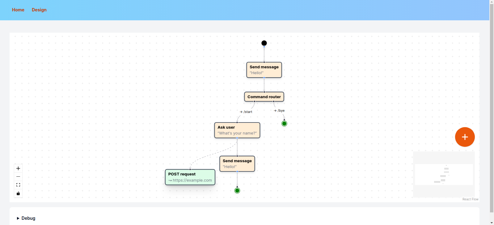

(It's the same as last time, since we have added backend code only)

## Introduction

In this devlog, we'll cover adding [OpenTelemetry](https://opentelemetry.io/) support to the OpenChatflow server part. We'll thus get visibility on all operations performed while serving an HTTP request, such as DB requests executed, along with dependency relations and times:

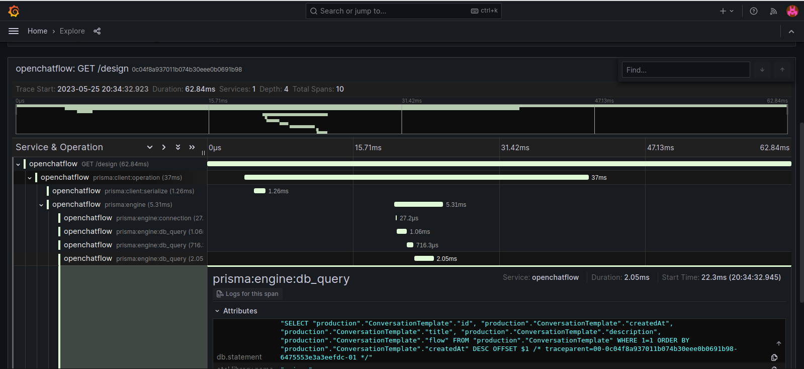

That is the trace for a GET request to the `/design` page, which lists all Conversation Templates. You can see the relative timing of different operations, mostly DB-based since that is the service that is involved in obtaining the list of all conversation templates.

## Configuring the application to send logs

NextJS happens to have [experimental support for OpenTelemetry](https://nextjs.org/docs/pages/building-your-application/optimizing/open-telemetry), which is nice, since configuring it in non-cooperating applications or frameworks is quite a chore...

### A local OpenTelemetry stack

To ensure that the OpenTelemetry integration is working before pushing code, we need to create a local OpenTelemetry stack, which Vercel also helpfully provides:

```bash
git clone https://github.com/vercel/opentelemetry-collector-dev-setup
cd opentelemetry-collector-dev-setup
docker-compose up -d
```

Review the [docker-compose.yml file here](https://github.com/vercel/opentelemetry-collector-dev-setup/blob/main/docker-compose.yaml). It creates:

* An OpenTelemetry collector, which exposes a single interface to dump logs, metrics and traces to
* Jaeger and Zipkin servers, which work as storage backends for traces, and also as query frontends for the same
* A Prometheus server, which works as a storage backend for metrics, and also as a query frontend

The main two URLs that you need are <http://localhost:4318> for the OpenTelemetry collector, and <http://localhost:16686> for the Jaeger query UI. You can see the collector's URL being used in the `.env` file, where it is used to configure the NextJS application.

Once Jaeger is working, we can proceed to the next step: instrumenting the application

### Installing the OpenTelemetry library, first attempt

If you don't need to customize the OpenTelemetry integration, Vercel (the makers of NextJS) provides a custom package that (should?) simplify things:

```bash
yarn install @vercel/otel
```

Then, on the `.env` file that is on the repo, add the following:

```
OTEL_EXPORTER_OTLP_PROTOCOL="http/protobuf"
OTEL_EXPORTER_OTLP_ENDPOINT="http://localhost:4318"
OTEL_EXPORTER_OTLP_HEADERS=""
```

Then, we need to enable OpenTelemetry instrumentation (at the time of writing this, it's still an experimental feature, so YMMV) by setting `experimental.instrumentationHook` to `true` in the `next.config.js` file. Then, we need to create an `instrumentation.js` file in the root of the project:

```js
import { registerOTel } from '@vercel/otel';
 
export function register() {
  registerOTel('openchatflow');
}
```

Note that "the root of the project" means the `src/` folder, if it exists.

The single parameter passed to the `registerOTel` function is the "service name", in OpenTelemetry parlance, AKA the name of the application. If you had a more complex architecture with several services (the canonical example is an online store with "web server", "cart" and "orders" microservices), you'd set this to the name of the specific service. Here we don't (yet?) have multiple services.

This did _not_ work for me. I have no idea why, but I couldn't get the application to export traces. I may have been doing something wrong, or the Vercel package may be broken (it's experimental, after all). Besides, I later discovered that we need more control that a single `registerOTel` call, since we'll need to instrument Prisma as well and that requires a deeper level of control. Oh well. We'll have to do things by hand.

### Installing the OpenTelemetry library, second attempt: The Hard Way

So, using the Vercel integration did not work. Thankfully, the NextJS docs also have a section on [Manual configuration](https://nextjs.org/docs/app/building-your-application/optimizing/open-telemetry#manual-opentelemetry-configuration), recommended "[if] you need to customize your setup".

First, we need to install a boatload of packages:

```bash
yarn add @opentelemetry/sdk-node @opentelemetry/resources @opentelemetry/semantic-conventions @opentelemetry/sdk-trace-base @opentelemetry/exporter-trace-otlp-http @opentelemetry/api
```

This command is almost the same as the one provided in the docs linked above, with the addition of the `@opentelemetry/api` package, which we'll use later to add custom spans. Then, we need to add the `instrumentation.ts` file, taking care to only do things if the NextJS runtime is Node (i.e., we're running in a normal web server, as opposed to Vercel's [Edge Runtime](https://vercel.com/blog/introducing-the-edge-runtime), which is a stripped down version of Node that is distributed across a CDN), or the client (which runs... well, on the user's browser). This file is copied verbatim from NextJS's docs:

```ts
// src/instrumentation.ts

export async function register() {
  if (process.env.NEXT_RUNTIME === 'nodejs') {
    await import('./instrumentation.node.ts');
  }
}
```

And then, we declare the actual instrumentation in a new file:

```ts
// src/instrumentation.node.ts

import { trace, context } from "@opentelemetry/api";
import { NodeSDK } from "@opentelemetry/sdk-node";
import { OTLPTraceExporter } from "@opentelemetry/exporter-trace-otlp-http";
import { Resource } from "@opentelemetry/resources";
import { SemanticResourceAttributes } from "@opentelemetry/semantic-conventions";
import { SimpleSpanProcessor } from "@opentelemetry/sdk-trace-node";

const sdk = new NodeSDK({
  resource: new Resource({
    [SemanticResourceAttributes.SERVICE_NAME]: "openchatflow",
  }),
  spanProcessor: new SimpleSpanProcessor(new OTLPTraceExporter()),
});

sdk.start();
```

This file is, again, a verbatim copy of the docs, but this one will get changed soon, once we integrate Prisma.

Finally, we need to add some environment variables to the `.env` file, as OpenTelemetry configures itself through environment variables, [in keeping with the "Cloud Native" ethos that it comes from](https://blogs.sap.com/2020/07/23/cloud-native-lab-1-7-ways-to-define-environment-variables/).

```sh
# .env

OTEL_EXPORTER_OTLP_PROTOCOL="http/protobuf"
OTEL_EXPORTER_OTLP_ENDPOINT="http://localhost:4318"
OTEL_EXPORTER_OTLP_HEADERS=""
```

## Exploring the data

After reloading the server and navigating through a few pages (so we generate traces), we can go to Jaeger (which should be up at <http://localhost:16686/>) and configure the search dialog like so:

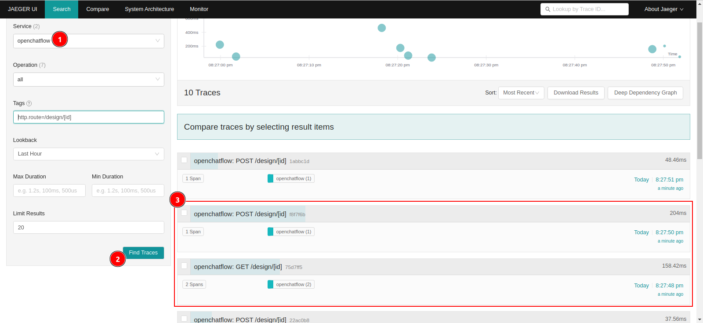

1. Select the `openchatflow` Service.
2. Click the "Find Traces" button
3. You should see several traces, for each HTTP request handled by the application. For instance, here we see GET requests to `/design/[id]`, which would be the loading of an Editor page, and POST requests to the same URL, which would happen when the editor autosaves the flow.

Clicking on one of the GET requests opens a new window:

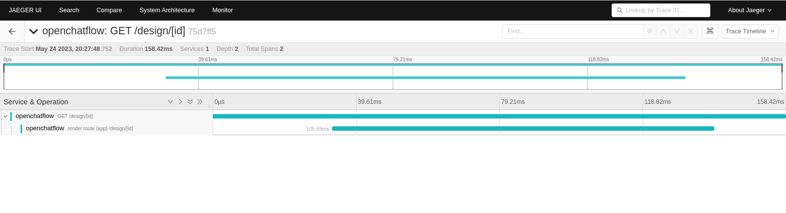

Not so much, is there? That is to be expected, since we've only instrumented the bare minimum. We can see that the entire transaction took 158 milliseconds (at the top), of which 105 milliseconds were spent "rendering the route". Clicking on the root span (one of the elements that make up the trace) reveals some more data:

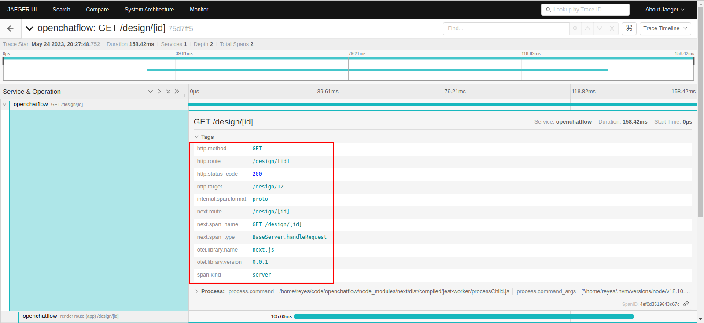

Here we can see the HTTP method (GET), the response status code (200), and the actual URL (from which we can deduce that this transaction involved the ConversationTemplate with ID 12.

In this specific transaction we don't need to know that, since all went well. However, this same information will be available on production traffic. You can easily imagine how powerful this could be to, say, debug an intermittent issue that only happens to certain users of your application. Filter for `http.status_code==500`, and you instantly have their data. The spans and tags give you a very good idea of what exactly they were doing, the data that triggers the issue, and possibly a way to replicate it.

## More traces

Our current traces are... pretty _concise_, shall we say. In other words, they're boring and they lack a lot of information. Let's fix that, shall we?

As luck would have it, [Prisma also has (experimental) support for OpenTelemetry](https://www.prisma.io/docs/concepts/components/prisma-client/opentelemetry-tracing). Adding it is a matter of a few steps:

1. Add the Prisma package for OpenTelemetry instrumentation:
   ```bash
   yarn add @prisma/instrumentation@latest
   ```
1. Enable the tracing feature in the `schema.prisma` file:
    ```
    generator client {
      provider        = "prisma-client-js"
      previewFeatures = ["tracing"]
    }
	```
1. (Undocumented, but mayyybe necessary) Regenerate the Prisma Client:
    ```bash
	yarn prisma generate client
	```
1. Activate the Prisma instrumentation in the main instrumentation file:
    ```ts
    // src/instrumentation.node.ts
    
    // Original imports...

    import { PrismaInstrumentation } from "@prisma/instrumentation";

    const sdk = new NodeSDK({
      resource: new Resource({
        [SemanticResourceAttributes.SERVICE_NAME]: "openchatflow",
        [SemanticResourceAttributes.DEPLOYMENT_ENVIRONMENT]: process.env.NODE_ENV,
      }),
      spanProcessor: new SimpleSpanProcessor(new OTLPTraceExporter()),
      instrumentations: [new PrismaInstrumentation()], // THIS IS NEW!
    });

    sdk.start();
    ```
	
We import the `PrismaInstrumentation` class, and we register it in the `instrumentations` array of the OpenTelemetry SDK.

### Aside: what's with the "instrumentations"?

One of the strengths of the OpenTelemetry project is the fact that it provides a common platform for instrumenting other libraries, without necessarily requiring said libraries to cooperate. For instance, take a look at [the JS libraries that are currently instrumented](https://www.npmjs.com/package/@opentelemetry/auto-instrumentations-node):

* Web frameworks:
	* [Express, and thus any framework that builds on top of it](https://github.com/open-telemetry/opentelemetry-js-contrib/tree/main/plugins/node/opentelemetry-instrumentation-express)
	* [The Connect framework](https://github.com/open-telemetry/opentelemetry-js-contrib/tree/main/plugins/node/opentelemetry-instrumentation-connect)
	* [Koa](https://github.com/open-telemetry/opentelemetry-js-contrib/tree/main/plugins/node/opentelemetry-instrumentation-koa)
	* [NestJS](https://github.com/open-telemetry/opentelemetry-js-contrib/tree/main/plugins/node/opentelemetry-instrumentation-nestjs-core)
	* [Restify](https://github.com/open-telemetry/opentelemetry-js-contrib/tree/main/plugins/node/opentelemetry-instrumentation-restify)
	* Of course, NextJS's own integration
* Network protocol packages:
	* [Any package that uses the `graphql` package, such as Apollo](https://github.com/open-telemetry/opentelemetry-js-contrib/tree/main/plugins/node/opentelemetry-instrumentation-graphql)
	* [The official gRPC package](https://github.com/open-telemetry/opentelemetry-js/tree/main/experimental/packages/opentelemetry-instrumentation-grpc)
	* [The Node `http` package, and thus many, _many_ packages that do API calls to third-party services](https://github.com/open-telemetry/opentelemetry-js/tree/main/experimental/packages/opentelemetry-instrumentation-http)
	* [The AMQP package](https://github.com/open-telemetry/opentelemetry-js-contrib/tree/main/plugins/node/instrumentation-amqplib)
	* [socket.io](https://github.com/open-telemetry/opentelemetry-js-contrib/tree/main/plugins/node/instrumentation-socket.io)
* Databases:
	* [Cassandra](https://github.com/open-telemetry/opentelemetry-js-contrib/tree/main/plugins/node/opentelemetry-instrumentation-cassandra)
	* [Postgres](https://github.com/open-telemetry/opentelemetry-js-contrib/tree/main/plugins/node/opentelemetry-instrumentation-pg)
	* [MySQL](https://github.com/open-telemetry/opentelemetry-js-contrib/tree/main/plugins/node/opentelemetry-instrumentation-mysql)
	* [Redis](https://github.com/open-telemetry/opentelemetry-js-contrib/tree/main/plugins/node/opentelemetry-instrumentation-redis)
	* [MongoDB](https://github.com/open-telemetry/opentelemetry-js-contrib/tree/main/plugins/node/opentelemetry-instrumentation-mongodb)
	* Prisma's own integration
* Third party services:
	* [The entire AWS SDK](https://github.com/open-telemetry/opentelemetry-js-contrib/tree/main/plugins/node/opentelemetry-instrumentation-aws-sdk)

And that's nothing compared to, say, [Python's instrumentations](https://opentelemetry-python-contrib.readthedocs.io/en/latest/index.html). See the left sidebar:

* ASGI, and thus practically every async web framework out there
* WSGI, and thus practically every sync web framework out there
* Django, just in case
* Databases: Postgres (sync and async), MySQL, Redis (sync and async), Mongo, Memcache, SQLite, SQLAlchemy
* Kafka, Celery
* Jinja
* The `requests` library, and by extension a gazillion packages that interact with APIs
* The `urllib` package, and by extension probably every other package that doesn't use `requests`

For now, we'll start simple and only instrument Prisma. Instrumentations can be added on-demand, as your application grows:

* Added a Redis cache? Add the Redis instrumentation to get visibility of Redis queries
* Your application calls an external HTTP API? Instrument the HTTP package and see if the remote API is the cause of slow response times
* Add a task queue, such as Kafka or AMQP? Instrument it and enjoy traces that span across queue push/pops, and even across time!
* Need to use a third-party SDK (say, Stripe)? If you are lucky, it uses an instrumented HTTP package to make its calls, so you get visibility on it too!

### Checking the Prisma traces

After registering Prisma with the OpenTelemetry SDK, we get additional spans in traces that involve DB activity (i.e., everything but a static page render):

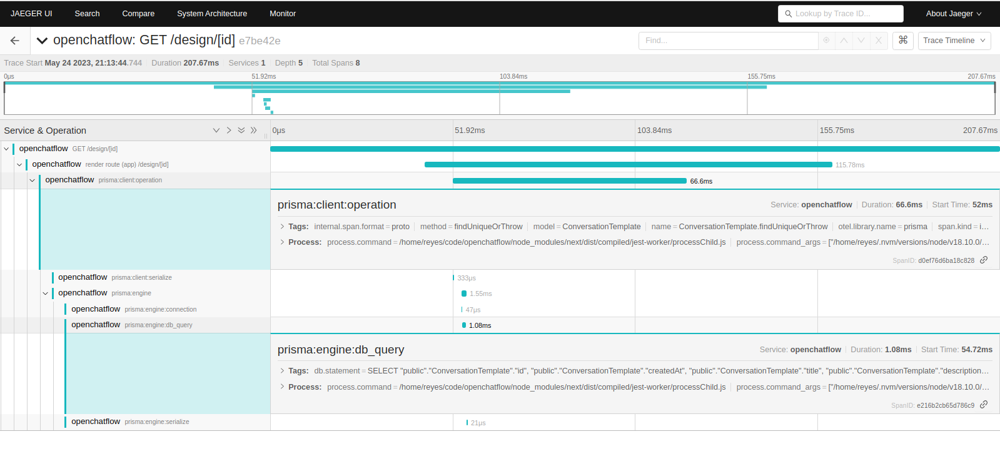

Now, apart from the two top spans, which are NextJS's doing, we get a lot of spans that record the activity of Prisma:

* A `prisma:client:operation` span that wraps everything
* A `prisma:client:serialize` span that includes the parsing of the query
* A `prisma:engine:connection` span that records the time that it took to acquire a DB connection
* A `prisma:engine:db_query` span that actually measures the query time
* A `prisma:engine:serialize` span that times the conversion of DB data into a Prisma Client object

By the way, a description of the spans is available [here](https://www.prisma.io/docs/concepts/components/prisma-client/opentelemetry-tracing#trace-output).

Armed with that data, you could diagnose many issues that otherwise would be just "the app feels slow":

* If the `serialize` span is too long, it's something with the model or the query that came from the client, or a bug in Prisma
* If the `connection` span takes too long, your DB may be overloaded, underpowered, or you may be using too many connections
* If the `db_query` is slow, the SQL query may be complex, and you may want to look at indices
* If the `serialize` span is slow, you may be returning too much data and maybe should look into limiting the returned columns

Also, you get the actual SQL statement executed as a tag in one of the spans, to help you reproduce any weird slowness or errors.

The POST request is busier:

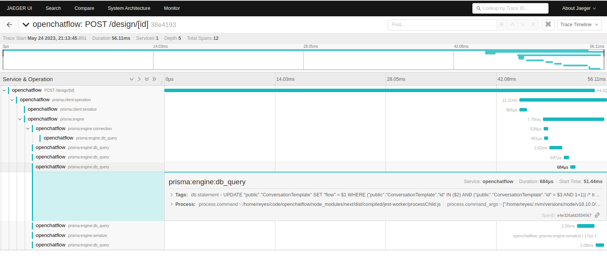

This time there are more `db_query` spans, since Prisma seems to `SELECT` some data first before firing the actual `UPDATE` request. This may help you debug extraneous SQL statements, which can be important when using an ORM that hides the actual SQL from you.

## A short OpenTelemetry infomercial

OpenTelemetry instrumentation, for example, shines a very bright light on the dreaded [N+1 problem](https://thecodingmachine.io/solving-n-plus-1-problem-in-orms). Same goes for other phantom queries that may be dragging down performance.

Similarly, when calling remote APIs as part of your own request handlers, any slowness on their part will translate to slowness on your responses. Traces make it clear where the bottlenecks are: is it your own code? Is it an external dependency? A database? An API? Which one? Does it happen all the time? Only with certain parameters? Only when you ask for 1000 records? Once your application grows to a certain size, you more or less need that data.

And we haven't even started on automatic monitoring. Most cloud providers also offer "performance monitoring" or [APM](https://en.wikipedia.org/wiki/Application_performance_management). Consider setting an expected response time on critical API endpoints: checkout for an online store, the login endpoint, anything where you really want it to respond quickly, consistently. You can also monitor errors, by (say) specifying that no more than 1% of all spans should have `http.status_code==500`, and raising alerts if this limit is breached. Said alerts can come with the trace ID for offending traces, so you can dive in and start checking if that is an indication of a massive service outage.

## Back to OpenChatflow

So now we're sure that the OpenChatflow application is instrumented and sending traces. We need to provision a service that can receive the data, and which should be reachable from Vercel's servers, since that is where the production application will live.

## Ingesting the traces: Grafana

I'll try to use [Grafana Cloud](https://grafana.com/products/cloud/) to receive, store and query the observability data generated by the application. A combination of reasons were considered while deciding to use this service:

* Decent free plan
* All-in-one tool
* Can ingest both traces and metrics (and logs)
* Advertises full compatibility with the OpenTelemetry Collector
* Github SSO
* Very well-known service, so hopefully secure, stable and mature

Other alternatives would be:

* [Datadog](https://www.datadoghq.com/) has a complex pricing structure, and you need to [provide your own OpenTelemetry Collector](https://docs.datadoghq.com/opentelemetry/otel_collector_datadog_exporter) or use [Vercel's integration](https://vercel.com/integrations/datadog), which is gated behind paid plans
* [Honeycomb](https://www.honeycomb.io/), which should also work perfectly fine, as it has [a free plan](https://www.honeycomb.io/pricing) and can receive both metrics and traces. However, you can't use Github as an SSO provider, which is a departure from all the other services that this project uses. It's a second alternative, in case Grafana does not work for some reason
* [Signoz](https://signoz.io/) may have its own OpenTelemetry collector already deployed, but it has no free plan :(
* Splunk seems to provide the [Splunk Observability](https://www.splunk.com/en_us/products/observability.html) product, but a) docs are scarce, so I can't see what they offer, b) the free trial is only for two weeks, c) it's Splunk, so corporate-focused

From a cursory investigation, Grafana seems to fit the bill better than the alternatives. There are many more observability tool vendors, but since this is not a commercial project (yet?) there's no pressure to optimize down to the last cent, nor optimize up to the most features.

There's no information about integrating a Vercel-hosted application with any OpenTelemetry service, so here goes nothing.

### Creating account and provisioning the collector

Creating a Grafana Cloud account is quite simple: go to the [Sign Up page](https://grafana.com/auth/sign-up/create-user), log in with Github, then dismiss all tutorials because I have used Grafana before, and cancel the Pro trial because I don't need it and I don't want to come to depend on any paid features.

This is the main Grafana dashboard, which is empty at the moment:

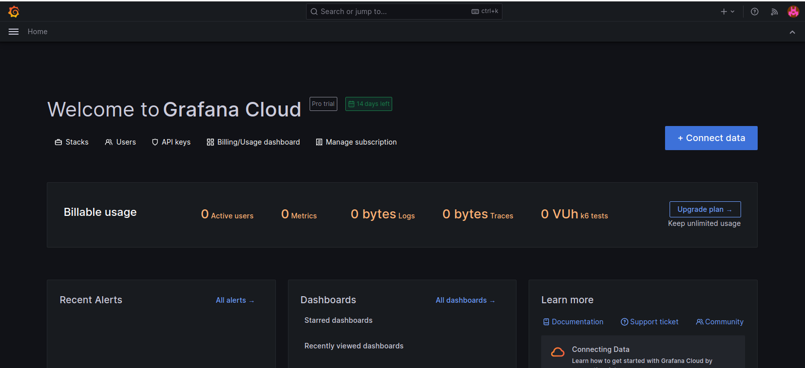

From here on, the main reference is [this article](https://grafana.com/docs/grafana-cloud/data-configuration/otlp/send-data-otlp/#before-you-begin)

Then, we need to visit the Grafana administration page, click on the Grafana instance, and then view its Details. We need the instance ID and the deployment region:

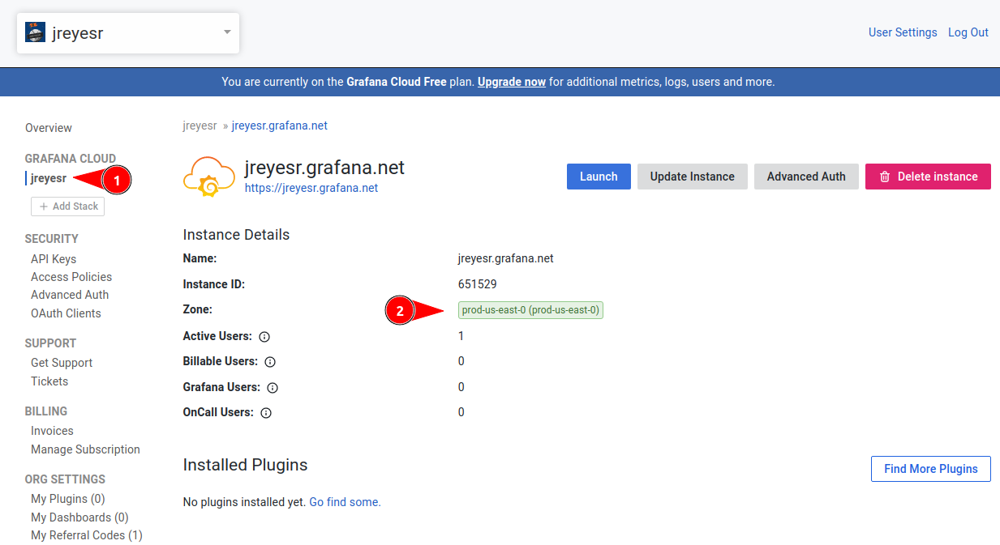

Then, we need to create a new API Key with a role of `MetricsPublisher`:

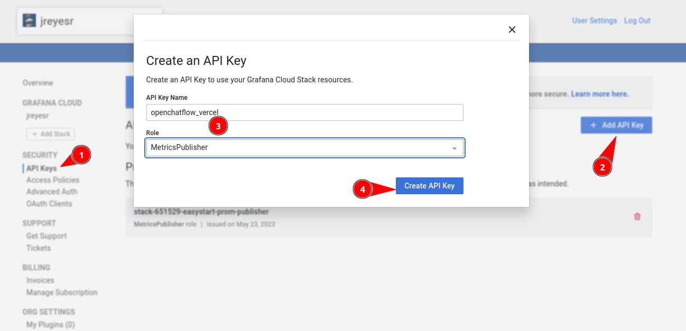

As usual, we then make a copy of the token, since it will never be displayed again. Then, we have enough information to configure the OpenTelemetry library, once we install it...

* OpenTelemetry URL: `https://otlp-gateway-<zone>.grafana.net/otlp`
* Credentials: Basic Auth, username is the `instance ID`, password is the `API Key`

We'll see below how those credentials are configured.

## Deploying code and receiving data

At this point, the OpenChatflow app is ready to start shipping observability data to Grafana. The preview deployments won't send any data, since Grafana can't easily separate across "staging" and "production" and both would consume our free plan allocation.

To configure the OpenTelemetry library, we need to set environment variables for the Production environment, in much the same way that for our local copy we set them in the `.env` file. This is done in Vercel's console:

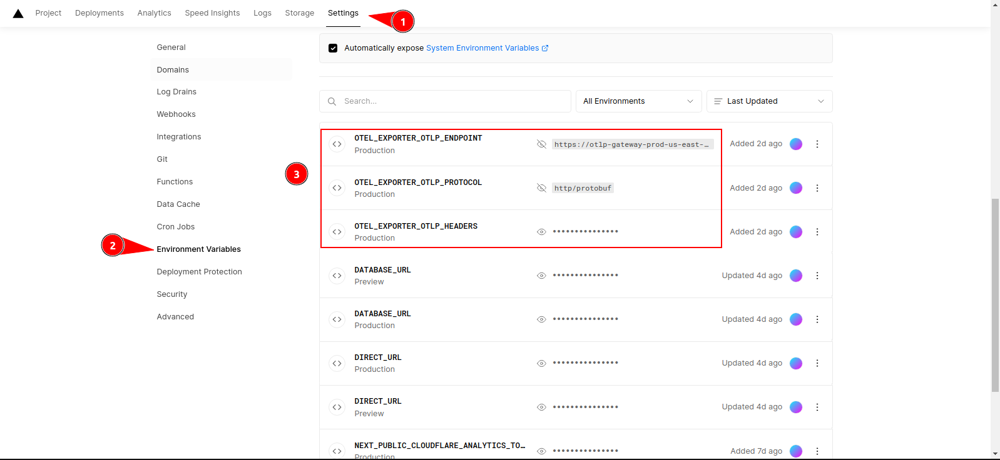

On the Environment Variables tab of the project's Settings, we create three environment variables:

* `OTEL_EXPORTER_OTLP_ENDPOINT`, set to `https://otlp-gateway-<zone>.grafana.net/otlp`
* `OTEL_EXPORTER_OTLP_PROTOCOL`, set to `http/protobuf`
* `OTEL_EXPORTER_OTLP_HEADERS`, set to `Basic <base64_encode_username_and_pass>`. The username and password are separated by a colon `:` and the whole thing is encoded using Base64. See [this link](https://gchq.github.io/CyberChef/#recipe=To_Base64('A-Za-z0-9%2B/%3D')&input=dXNlcm5hbWU6cGFzcw) for an interactive editor

Also note that the three variables should only apply to the Production environment, as otherwise the Preview deployments would also export data to Grafana. This is not the end of the world, as all traces have a `deployment.environment` tag that varies with the `NODE_ENV` envvar, but for quota reasons we won't export them here.

Once that configuration is done, we can trigger a Production deployment by merging the source code to `master`.

After visiting a few pages, we can verify that OpenTelemetry is working by looking at the Prisma logs in the deployment's logs. When instrumented, Prisma adds a comment to every SQL statement, with a `traceparent`. This is a W3C standard and it happens to be the way that [traces are propagated across HTTP services](https://www.meziantou.net/monitoring-a-dotnet-application-using-opentelemetry.htm#monitoring-multiple). Prisma appears to be setting it for consistency, and maybe in case SQL databases also support tracing?

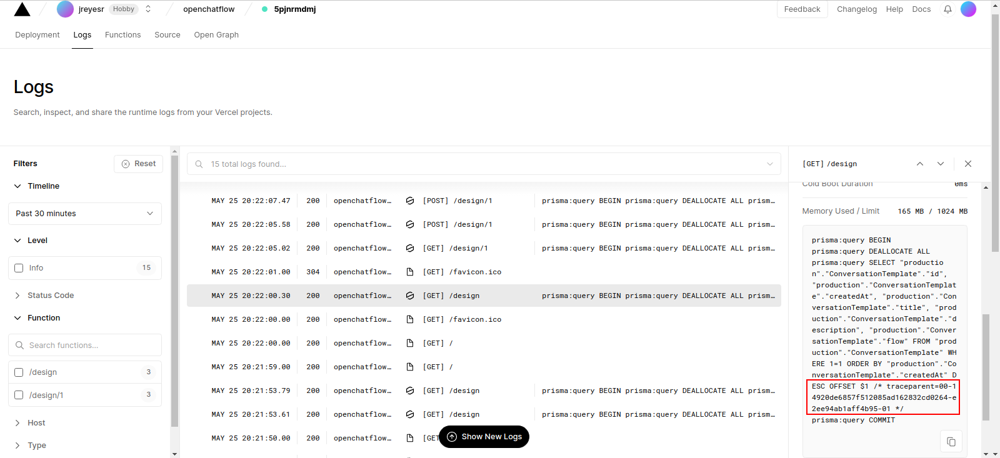

This tells us that OpenTelemetry is active and should be sending traces. The lack of error logs suggests that the environment variables are configured correctly, as otherwise OpenTelemetry tries to export logs to `http://localhost:4318`, which won't be available on Vercel, and should cause an error.

With that out of the way, we can visit our Grafana Cloud instance:

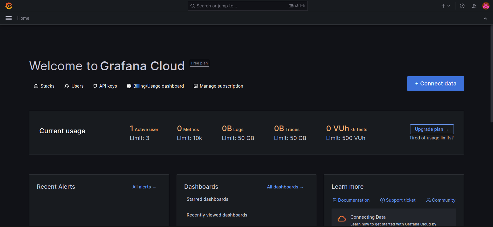

Well, that's empty. The hamburger menu at the left reveals an Explore page, which is nice for... well, exploring data. There, we have to choose the Traces datasource, which is an instance of [Grafana Tempo](https://grafana.com/oss/tempo/), Grafana's home-grown tracing backend, judging by the icon:

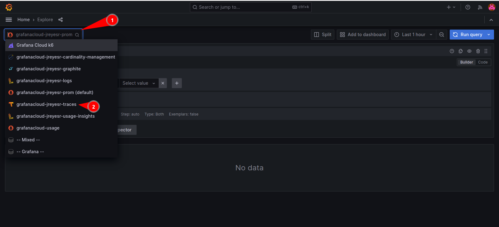

Then, we can set the Query Type to Search, choose `openchatflow` as a Service name (it should be the only one, since there are no more services sending data to that cluster), and then Run Query.

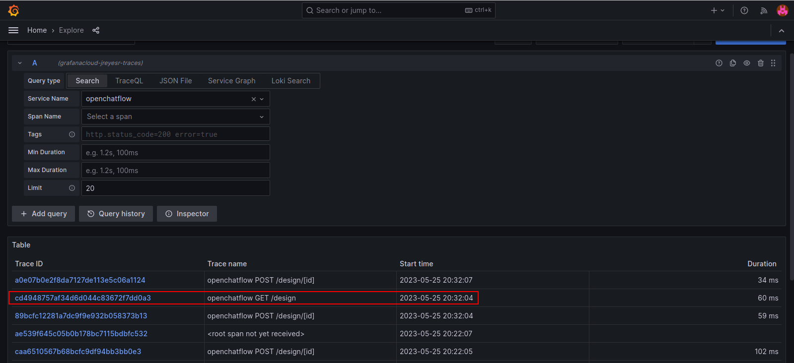

That lists all traces. If we choose a busy trace (say, a GET trace that fetches the details of a conversation), a new panel opens at the right an we can see all the spans that make up the trace:

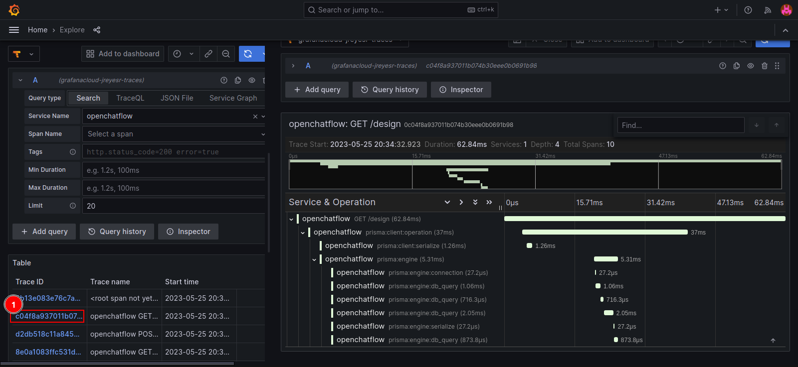

From there on, the UI is essentially the same as Jaeger's. You can drill into a specific span, see its tags, see the time taken, and so on. As of now, with everything working fine, we don't need it, but this data may be really useful if the application starts failing at some point.

## Recap

* Adding OpenTelemetry support to a NextJS project is quite easy, albeit currently experimental
* Same goes for the Prisma ORM
* Although we haven't tested it, many more libraries can be automatically instrumented. In particular, everything that interacts with a third-party REST API may be easily instrumentable if it uses Node's [`http` package](https://nodejs.org/api/http.html#http)
* This observability data can be shipped to many cloud services, such as [Grafana Cloud](https://grafana.com/products/cloud/)
* This data can be useful when debugging application failures, slow response times and similar issues, even if they are uncommon or intermittent (assuming that 100% of all traces are being captured)