The app is now live on Vercel! Check the editor out on <https://openchatflow.vercel.app/design>

This devlog covers up to [commit `98dd303`](https://github.com/jreyesr/openchatflow/commit/98dd303a2cb9f1aaee0a021178c96e656a83eb37). This is how the UI looks at this point:


(It's the same as last time, since we have added backend code only)

## Introduction

In [the last post](/posts/chatflow-6-real/), we explored converting editable, graphical-focused, non-executable representations of flows, like this one:

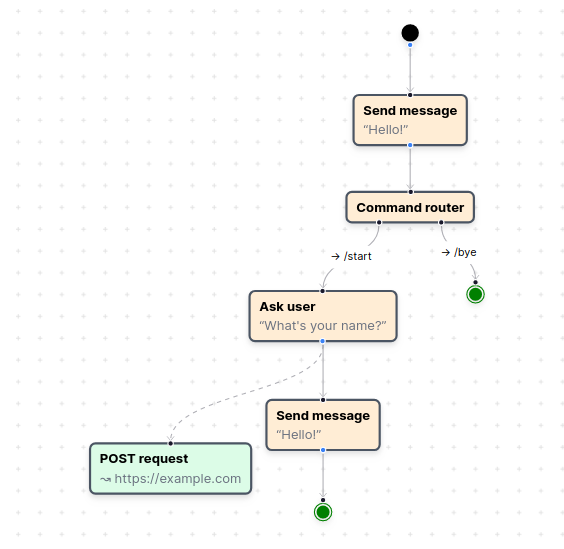

into runnable state machines like this one:

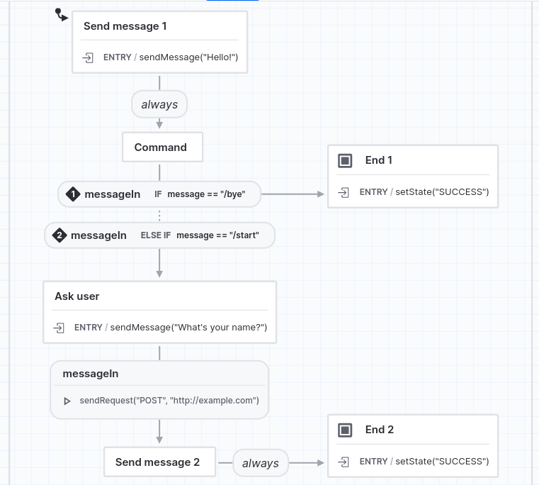

To do that, we used [the XState library](https://xstate.js.org/), which gives us a way to represent state machines, the transitions between states (usually triggered on external events) and the actions that should be performed, for example, when entering/exiting a state, or when traversing a transition. We had to develop an automatic, general way of converting flows into state machines. In this way, the users will work with high-level steps (such as Ask User) and the state machine will contain a node that

* On enter, sends a message to the Telegram account that the user is associated with
* This message contains the prompt
* Then, it blocks and waits for an incoming message from the user
* Once a message is received, it unblocks and moves forward at least one step (maybe more), plus firing any associated actions

In this post we tackle the logical next step: how do you get events _into_ the state machine? How do you notify it that a message has been received?

Furthermore, how does _Telegram_ notify our application when it receives a message? Deploying on Vercel doesn't play well with having a long-running loop that, say, polls every second for updates of every bot that we manage. Besides, that doesn't scale well: we'd have to do an entire HTTPS request per second per bot. Telegram may even get very angry.

## A very fast primer to webhooks

> Webhooks provide a way for notifications to be delivered to an external web server whenever certain events occur
>
> <https://docs.github.com/en/webhooks-and-events/webhooks/about-webhooks>


So, a webhook is a method by which some system/application/server A can notify another one B when an event occurs on A. The basic idea behind webhooks is simple: once server A is configured to emit webhooks, whenever "an event" occurs (whatever "an event" means"), it'll make an HTTP request to server B. Usually, the specific URL is configured in server A beforehand, so it knows where to make the request to.

This lets server B know that something happened on A, in a very low-coupling manner. Server A can explode and server B will still work... it'll just not receive any events. Server B can explode and server A will still work... as long as it has been configured to not crash and burn on failing requests. Server A can change almost all of its implementation, it just needs to keep the structure of the data that it includes constant and keep calling the configured URL. Server B can change almost all of its implementation, it just needs to expose a URL that correctly receives data and (usually) responds with a [2xx error code](https://developer.mozilla.org/en-US/docs/Web/HTTP/Status#successful_responses).

Webhooks are everywhere:

* Version control systems such as Github: https://docs.github.com/en/webhooks-and-events/webhooks/about-webhooks: "commit made", "repo created", "issue opened", "issue closed"
* Deployment platforms such as Vercel: https://vercel.com/docs/concepts/observability/webhooks-overview: "deployment triggered", "deployment succeeded", "deployment failed"
* Identity management solutions such as Okta: https://developer.okta.com/docs/concepts/event-hooks/: "user added to group", "user changed password", "device enrolled"
* Messaging applications such as Telegram: https://core.telegram.org/bots/webhooks: "message received", "poll answered", "message edited", "image sent"
* Many, _many_ more tools

### Before webhooks, there was polling

Usually, webhooks are contrasted with _polling_. Polling reverses the direction of control: instead of A (where things happen) notifying B (which has to act), B keeps asking A for updates. Usually, A will somehow signal that no updates exist, and B just sleeps until the next check interval. When changes have happened since the last check, A will instead respond with those changes, which B can then process.

Polling is easier to implement, as it sometimes can reuse the same Read APIs that you have to implement anyways. You just (from B) ask A for all entities, perhaps filtering by ID (if there is an ever-increasing ID, you can ask for all entities with an ID greater than the last one you have already processed) or by time (if there is a creation timestamp, you can ask for all entities created after the last one that you have already seen).

The problem with polling is that it forces you to make a tradeoff between latency and resource consumption. If you poll infrequently, you put less load on A, but you'll (on average) have to wait more for an event to be reported to you. If you poll frequently, you get fresher events, but you load A. And if A isn't controlled by you, but an external system controlled by other people, you risk angering them, and then [The Rate Limit](https://http.cat/status/429) happens:


By inverting the responsibility of initiating the communications, webhooks sidestep this entire tradeoff: A will only call B when an event has happened. You get nearly real-time event notifications on B, and the load placed on B is as low as possible[^1]: just one request per event, and no more. 

In exchange, webhooks introduce new issues:

* System B now has to expose at least one TCP port and one URL route to the Internet
	* Sometimes it's possible to mitigate by judicious use of firewalls and source IP filtering, but not always
* System B now needs to check that messages truly come from A, and not from someone else calling the same URL
* What if events are lost? What if B was down temporarily? Is it acceptable for your system to lose events or not?
* If you don't control A (as is usually the case, think Github), how do you ensure that things are working properly? What if A can't even reach B? You'll see no errors on B's logs

In general, by using webhooks you convert the system composed of A and B into a distributed system[^2], and we all know that [distributed systems are hard](https://www.youtube.com/watch?v=uTJvMRR40Ag):


Image by [Denise Yu](https://deniseyu.io/), under [CC BY-SA 4.0](https://creativecommons.org/licenses/by-sa/4.0/): <https://deniseyu.io/art/sketchnotes/topic-based/8-fallacies.png>

## Hookdeck

Several months ago (maybe a year or more?), I came across [Hookdeck](https://hookdeck.com/), and I filed it down on the "neat tools" drawer. It may be useful for OpenChatflow.

Disclaimers: None. I have no affiliation with Hookdeck, nor any payment has been offered or received. Similar tools could be used instead; Hookdeck is just the one that I happened to land on.

> Hookdeck is a prebuilt webhook infrastructure. It gives developers the tooling they need to monitor and troubleshoot all their inbound webhooks.

Hookdeck provides nice-to-haves such as:

* [Alerting](https://hookdeck.com/docs/notifications) on errors
* [Rate limiting](https://hookdeck.com/docs/set-a-rate-limit), and also drip-feeding your backend system with events
* [Automatic retries](https://hookdeck.com/docs/automatically-retry-events) in case your backend had a glitch
* [Fanout delivery](https://hookdeck.com/docs/create-a-destination), to send the same event to multiple destinations
* [Transformations](https://hookdeck.com/docs/transformations), in case neither the source or the destination let you specify the format of the data, and they use incompatible structures
* [Request inspection](https://hookdeck.com/docs/inspect-a-request#associated-event-data), by which you can see the headers and body of every request, and the status code, headers and body of every response
* [Signature verification](https://hookdeck.com/docs/signature-verification), both from System A to Hookdeck and from Hookdeck to System B
* More goodies! Check [Hookdeck's docs](https://hookdeck.com/docs/introduction) for more

Hookdeck is SaaS and [usually paid](https://hookdeck.com/pricing), but the Developer plan gives you 100K requests per month with no credit card required. That's hopefully good enough. Right?

### Hookdeck configuration

Hookdeck uses [Workspaces](https://hookdeck.com/docs/workspaces) to organize all its data. I have created a workspace for the OpenChatflow application:

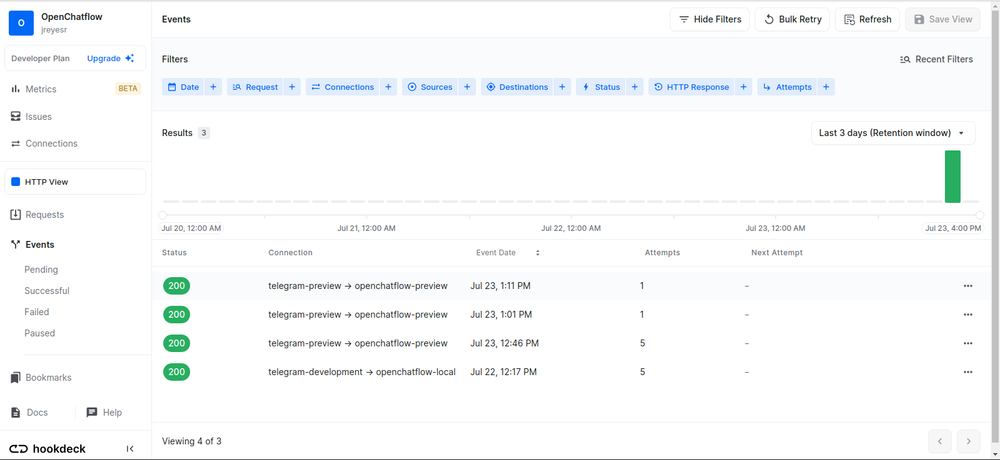

That screen lets you see the incoming requests, where they were routed to, and the status code. If there were retries, they also appear here.

The Connections page to the left is where you configure your routing:

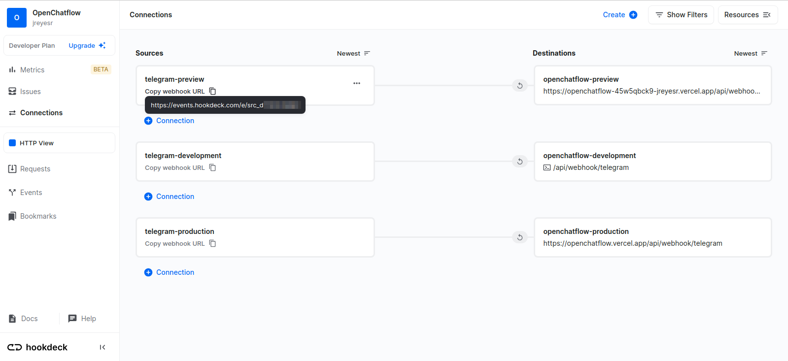

As you can see, there are Sources and Destinations. Sources are Hookdeck URLs of the form <https://events.hookdeck.com/e/src_RANDOMCHARACTERS>. I'm unsure if the actual random characters are to be treated as secrets, so I've just blurred them to be safe. These URLs are what you'd give to System A, the one that wants to call something when an event happens.

Then, every Source can be connected to one or more Destinations. Destinations are System B, in our running example: your backend systems that must be informed of events. Here, as you can see, there are three Sources, three Destinations and a one-on-one correspondence. The local (`-development`) Source and Destination, which would correspond to the [Development environment in Vercel](https://vercel.com/docs/concepts/projects/environment-variables#development-environment-variables), AKA a developer running the code in his own machine using `vercel dev`, doesn't really have a destination URL, since your device normally won't have a routable domain and open port. Instead, it uses the [Hookdeck CLI](https://hookdeck.com/cli#listen), which functions in a similar manner to [ngrok](https://ngrok.com/), [localtunnel](https://theboroer.github.io/localtunnel-www/) and other similar services: you run a command in a terminal session in you machine, and any requests that come in to the Development Source in Hookdeck are magically transported to your device's `localhost`, where they can hit your running instance of OpenChatflow. Most of the time, then, the Development Source won't work, since no one will have the CLI running to forward requests.

The Preview and Production destinations do point to actual URLs. They will be updated on every deploy done by Vercel (see below), to point to the most-recent versions of the application. 

So, to recap: Hookdeck sits between an application that wants to send webhooks and one that receives them. To the sending application, it behaves as the receiver. To the receiving application, it acts as the sender. In the meantime, it provides useful things such as automatic retries, buffering, rate limiting, alerts, queuing, request and response inspection, and more. Here (on OpenChatflow) we don't _really_ need it, I just wanted to add such a tool and since the free plan is... well, free, there's very few downsides. Worst case, it should be totally possible to just stop using Hookdeck and point Telegram directly to OpenChatflow.

## Writing a webhook handler in NextJS

So, we have seen that we can use Hookdeck to provide utilities around webhooks. Now we need to actually receive said webhooks, which means implementing an API handler in the NextJS application.

Writing API-only URLs in NextJS is done via [Route Handlers](https://nextjs.org/docs/app/building-your-application/routing/router-handlers). This not-really-descriptive name is used for routes that don't render a React component, instead returning a raw response. Previously [they were called API routes](https://nextjs.org/docs/pages/building-your-application/routing/api-routes), which is somewhat clearer.

Route Handlers require a `route.ts` file, instead of the `page.tsx` that is commonly used to define UI pages. This `route.ts` file must export one or more functions named after HTTP methods, such as GET or POST. If you use GET, you may opt in to [static evaluation](https://nextjs.org/docs/app/building-your-application/data-fetching#static-and-dynamic-data-fetching), where NextJS runs the route once while building the application and from there on just returns the same (cached) value. We use POST since that's what Telegram uses, and because we don't want our responses to be cached!

For now, we merely reply with an HTTP 200 OK status code, and a JSON object that echoes back the body, headers, querystring and cookies that the request itself had. Later we'll actually do work in that handler.

### The Edge runtime

Vercel, which is both the main author, sponsor and maintainer of NextJS; and the platform in which OpenChatflow is hosted, has what they call [Edge functions](https://vercel.com/docs/concepts/functions/edge-functions). 

> Vercel's Edge Functions enable you to deliver dynamic, personalized content with the lightweight Edge Runtime.
>
> Our Edge Runtime is more performant and cost-effective than Serverless Functions on average. Edge Functions are deployed globally on our Edge Network, and can automatically execute in the region nearest to the user who triggers them. They also have no cold boots, which means they don't need extra time to start up before executing your code.
>
> Edge Functions are useful when you need to interact with data over the network as fast as possible, such as executing OAuth callbacks, responding to webhook requests, or interacting with an API that fails if a request is not completed within a short time limit.

Some of those attributes we don't care about, but we do care about others. For instance, the way in which they are priced means that you don't pay for time in which the function is blocked while waiting for network responses. If what you need to do is dominated by the time that external APIs take to respond, it's probably better to use Edge functions. In general, you can classify tasks as [CPU-bound or IO-bound](https://www.baeldung.com/cs/cpu-io-bound): the former are number-crunching tasks, the latter call to external APIs or read files form disk. Edge Functions really like IO-bound tasks, since then you'll spend almost all of the time waiting for external responses, which aren't billed. The lack of cold boots is also attractive.

In exchange, Edge functions [have some severe limitations](https://vercel.com/docs/concepts/functions/edge-functions/limitations), such as many Node APIs being unavailable, very small memory limits, code size limits, and more.

Now, how do these Edge functions integrate with NextJS's Route Handlers? As it turns out, perfectly well. Edge functions and route handlers aren't dichotomous choices, but instead Edge functions are one way of running Route Handlers (the other is [Serverless functions](https://vercel.com/docs/concepts/functions/serverless-functions), by the way, at least on Vercel).

To make a NextJS Route Handler run on Edge Edge Functions, you export a constant `runtime` with the value `"edge"`:

```ts
export const runtime = 'edge';
```

Assuming that you are deploying your NextJS application in Vercel, the build process will detect that you are exporting that variable, and provision the function that is defined in that file to the Edge Runtime. Any other deployment platforms will presumably just ignore that export and proceed as normal.

This mitigates the risk of vendor lock-in. We could take OpenChatflow outside of Vercel and the route handlers will still work. There's nothing in them that is married to Vercel's Edge Runtime. We're just using it because it exists and it's a better choice than Serverless Functions, both due to pricing and efficiency.

## Standalone scripts on Next.JS

Classical server-side frameworks, such as [Django](https://docs.djangoproject.com/en/4.2/howto/custom-management-commands/) or [Ruby on Rails](https://guides.rubyonrails.org/v4.2/command_line.html#custom-rake-tasks), give you a way to register custom CLI commands which can be invoked, usually on-demand, from the server's shell.

These commands are used for assorted operations. In Django, for example, you can [create and apply migrations](https://docs.djangoproject.com/en/4.2/ref/django-admin/#migrate), [run tests](https://docs.djangoproject.com/en/4.2/ref/django-admin/#test) and [the server](https://docs.djangoproject.com/en/4.2/ref/django-admin/#runserver), [manage the cache](https://docs.djangoproject.com/en/4.2/ref/django-admin/#createcachetable) and [send test emails](https://docs.djangoproject.com/en/4.2/ref/django-admin/#sendtestemail). These are usually server/app maintenance tasks, not something that would be done in normal operation. Rails has similar commands, and so does [NestJS](https://docs.nestjs.com/recipes/nest-commander), which is also server-side.

Notably, the entire concept of management commands relies on the existence of "a server". You don't get management commands on a client-side Vue app, since there is no server to manage. You don't get management commands on [a serverless app](https://www.serverless.com/framework/docs/providers/cloudflare/guide/intro/), since there's no server to manage. The closer you'd get would be additional API endpoints/lambda functions that require special privileges to be called, and which do whatever the custom commands would do on a classic server-side framework.

All this possibly explains why I couldn't find a built-in way of expressing management commands on NextJS. There was an issue in the repo (which I can't find now) and (as usual) [a StackOverflow thread](https://stackoverflow.com/questions/72196364/how-to-run-a-standalone-cli-script-using-a-nextjs-project) listing the methods. You can either declare an API route and then call it via `curl` or friends, or create a completely standalone script which you run with `node scripts/my_script.js` or `node-ts scripts/my-script.ts`.

I went for the second approach (isolated scripts), since I'll want to run them as part of the build in CI, where the NextJS web application is _not_ running.

You can see a first version of the file [here](https://github.com/jreyesr/openchatflow/blob/895d4905e59487f78cd87b8c2883cbefa2cc82c9/scripts/register-webhooks.mts). It's a plain old Typescript file, which connects to the database via Prisma. Later commits added actual functionality.

The file is run via a normal entry in the `package.json` file:

```json
{
  ...,
  "scripts": {
    ...,
    "reg-webhooks": "tsx scripts/register-webhooks.mts"
  },
  ...
}
```

As for the script, here's a simplified version of it:

```ts
import { env } from "process";

import { PrismaClient } from "@prisma/client";

type VercelEnv = "development" | "preview" | "production";

console.log("Registering webhooks...");

const environ: VercelEnv = (env.VERCEL_ENV as VercelEnv) ?? "development";

const prisma = new PrismaClient();

async function main() {
  console.log(await prisma.conversationTemplate.findMany({}));
}

main()
  .then(async () => {
    await prisma.$disconnect();
  })
  .catch(async (e) => {
    console.error(e);
    await prisma.$disconnect();
    process.exit(1);
  });

console.log("Done registering webhooks! Bye...");
```

You may compare it with the script in [Prisma's Quickstart guide for relational databases](https://www.prisma.io/docs/getting-started/setup-prisma/add-to-existing-project/relational-databases/querying-the-database-typescript-postgresql): it's nearly identical. The script now has access to the database, which thanks to Vercel's Environments is different between Preview and Production. In this way, Preview deployments (those that originate from branch commits) see a different DB (and also environment variables) than Production environments (those that come from commits to `master`).

The script is configured to be run as part of Vercel's build process, after any DB migrations have been executed:

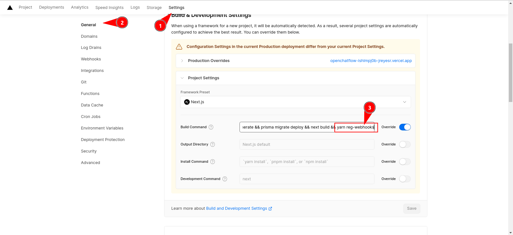

We can confirm that the script is being run by triggering a Deployment (by pushing a commit) and then looking on the build logs:

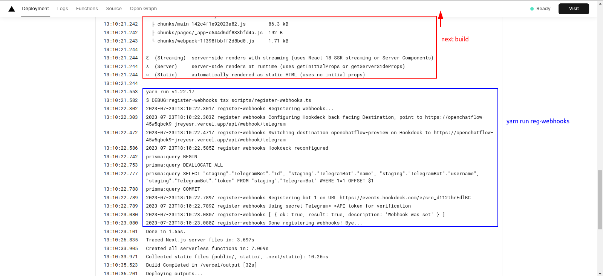

As mentioned before, later commits added more code to the script. What we need to do is to switch around any bots that the application manages, so Telegram sends updates to the correct URL. The bots that are managed by the Production application could just be hardcoded to `https://openchatflow.vercel.app`, but that doesn't work for Preview deployments.

Vercel doesn't just allocate a subdomain such as `https://preview.openchatflow.vercel.app` for Preview deployments. Indeed, there's no way that could work, even in principle: you can have multiple Preview deployments running at once.

Aside: traditional software development wisdom holds that usage of _a staging environment_ (note the singular) is [critical for ensuring software quality](https://hackernoon.com/staging-environments-are-overlooked-heres-why-they-matter-5jp2gm0). That's all well and good, but Vercel takes things further. Instead of a single "staging environment" that is the final stage that code must go through before landing on prod, there are multiple [Preview environments](https://vercel.com/docs/concepts/deployments/preview-deployments), one per feature/branch[^3]. In this way, independent features can be worked on by different people/teams, who can get feedback, play with the application as it is with the new changes applied, and then merge back to the main branch independently. Now, Vercel being [a mostly serverless-based provider](https://vercel.com/docs/concepts/functions/serverless-functions), these old deployments could (at least in theory) stick around forever. There's not an entire VM sitting around for each branch that anyone has ever opened. What exists is a bundle of compiled code that will be run on demand by serverless workers: this is why serverless applications can [scale to zero](https://aws.amazon.com/blogs/publicsector/scaling-zero-serverless-way-future-university-of-york/), since if no one uses them, they just... don't run. It's much like a binary executable on your Linux machine: if you aren't using it, it consumes no resources apart from disk space (which is quite low for a typical web application).

So, at least conceptually, when working on Vercel you can't think of "the staging env". There's no single staging env. As of now, they all share the same DB (which is isolated from prod), and they'd share other resources too. This will cause us issues if there are ever two or more active branches at once: they'd fight for resources, and imagine one of them involves a DB migration. The other branch would see a DB that doesn't have the expected structure and probably explode. For now, I've been ignoring the problem because I'm the only person that is committing to the code. The same "just ignore it" approach will be used for Telegram bots: any simultaneous branches will just fight for control of the bot, and the branch that was deployed last will win and configure Telegram so events are forwarded to _it_.

All in all, this is how the application works now. There are two phases: build-time and execution time:

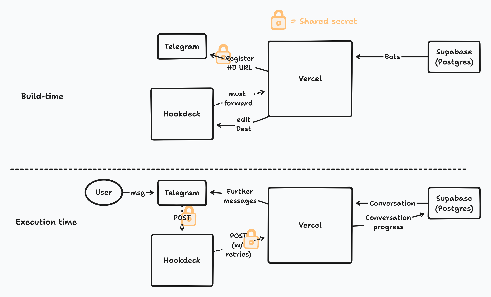

In build time, any currently registered bots are switched to the URL that the application is running on. The production application runs on <https://openchatflow.vercel.app>, but staging/preview deployments get names that depend on the Git branch that the preview deployment is based on. Thus, it is necessary to change the URL that the staging bots will notify to. We also modify the Hookdeck configuration, if it exists, to it forwards the messages to the most-recent Preview deployment. This will break if more than two people open branches at the same time, but as of now, with only me working on the application, that won't be an issue.

So, once a new version of OpenChatflow is deployed, the state of the external world will be:

* Every bot that is present on the DB will be configured so that, on any events that involve said bot, Telegram will call the appropriate Hookdeck Source. There are two, one for Preview and one for Production
* Moreover, the bots will have been configured so that all requests that originate from Telegram will have a secret in a HTTP header. This is so we can check that the request did come from Telegram, and not from someone else
* The Hookdeck Destination for the appropriate environment (again, either Preview or Production) will point to the Vercel URL for this deployment (for example, <https://openchatflow-45w5qbck9-jreyesr.vercel.app/api/webhook/telegram>)

Then, whenever a user messages one of the bots that were involved in the build-time process, the following will happen:

1. Telegram will see that said bot has been configured to listen to webhooks, and it will forward the event to a URL of the form <https://events.hookdeck.com/e/src_SOMERANDOMCHARS>
2. Hookdeck will receive that POST request, match it using the Sources, and forward it to Vercel, using a URL of the form `https://openchatflow-COMMITHASH-jreyesr.vercel.app/api/webhok/telegram`
3. The application will receive that request and verify that it comes from Telegram via reading the shared secret from a HTTP header. If it passes verification, the application will process that message: by extracting the user that received the message, it will know for which bot it was intended. By extracting the user that sent the message, it will know the conversation that this message has to be processed by, if it exists. Then, it can retrieve or create the [state machine for that conversation](https://jreyesr.github.io/posts/chatflow-6-real/), [rehydrate it](https://jreyesr.github.io/posts/chatflow-6-real/#next-steps), send it a `messageIn` event and run it until it pauses again.

## TelegramBot model

Okay, so we now can cause Telegram to send us HTTP requests when bots see action. The most important action, of course, is a user messaging a bot.

However, there's a problem. Which bots do we register for? As of now the application doesn't store any bot information. That requires a new DB table.

Over two months ago, when we were just integrating Prisma with OpenChatflow, we reviewed [a simple DB design](https://jreyesr.github.io/posts/chatflow-5/#db-design):


We already have ConversationTemplates. We now need to implement TelegramBots. These hold the bot's information, such as the name, username and token. The latter is used to simultaneously identify a bot and authorize requests. So, for example, if you need to send a message via a bot, you'd use the following URL:

```
https://api.telegram.org/bot123456:ABC-DEF1234ghIkl-zyx57W2v1u123ew11/sendMessage
```

The URL contains the bot's token. It is supposed to be guarded carefully, as posession of a bot token gives you complete control over the bot[^4]. The final part of the URL is the action: there's [a list of actions that a bot can perform](https://core.telegram.org/bots/api#available-methods) in Telegram's docs.

The TelegramBot model will also hold a relationship to a ConversationTemplate instance. This can be thought of as "when someone talks to this bot, what conversation will this bot perform?" In other words, what state machine will be spawned? Different ConversationTemplates will cause the bot to behave differently.

Later, once we add authentication, TelegramBots will also have a relationship to a User, so you can only see and manage the bots that you personally registered.

Adding this new entity is a simple matter of adding a new section to the `schema.prisma` file. As we covered in [a previous post](https://jreyesr.github.io/posts/chatflow-5/#schema-definition), the schema file holds a definition of the database's schema: the tables and columns that make up the DB. We add a new `model`, generate the migration and apply it.

```prisma
model TelegramBot {
  id       Int    @id @default(autoincrement())
  name     String
  username String

  token    String
}
```

The generated migration is perfectly normal SQL:

```sql
-- CreateTable
CREATE TABLE "TelegramBot" (
    "id" SERIAL NOT NULL,
    "name" TEXT NOT NULL,
    "username" TEXT NOT NULL,
    "token" TEXT NOT NULL,

    CONSTRAINT "TelegramBot_pkey" PRIMARY KEY ("id")
);
```

This generates a new table in the DB where bots' information will be stored:

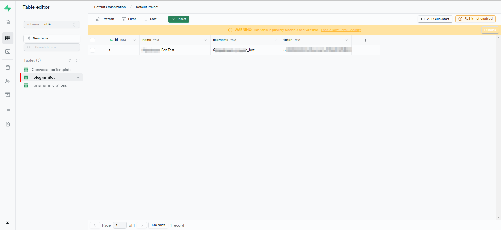

I'm using [Supabase](https://supabase.com/), which is backed by Postgres, just for the web UI. You could as well use [pgAdmin](https://www.pgadmin.org/) or whatever else.

### More security for bot tokens

There's a small problem which we haven't addressed yet: those pesky bot tokens. They are to be treated as sensitive information. As an additional protection, we would like to encrypt the column values to mitigate a few possible leaks, in particular via logs and backups. This is called [Column-Level encryption](https://supabase.com/docs/guides/database/column-encryption), is famously supported by [MS's SQL Server](https://learn.microsoft.com/en-us/sql/relational-databases/security/encryption/encrypt-a-column-of-data?view=sql-server-ver16), and the typical example usecase is [encrypting the column that holds credit card numbers](https://www.ibm.com/docs/en/informix-servers/14.10?topic=data-column-level-encryption).

This won't protect against an application-level compromise with full code execution, as then the attacker would just be able to use the same code paths that the application itself uses to read and decrypt the tokens. It does mean that data is encrypted in the DB's files on disk, which is good if you don't/can't fully encrypt the DB server's disks... and the backups... and the [WAL log](https://www.postgresql.org/docs/current/wal-intro.html)... and any logs that save a query's result set... and anywhere else the data may pop up. If done properly, the unencrypted data will only reside temporarily in the app's process memory.

As we linked above, Supabase [does support](https://supabase.com/docs/guides/database/column-encryption) column-level encryption, but it requires another part of their project, [Vault](https://supabase.com/docs/guides/database/vault). I instead opted for an application-level solution, a Prisma middleware called [`prisma-field-encryption`](https://www.npmjs.com/package/prisma-field-encryption).

Prisma supports [middleware](https://www.prisma.io/docs/concepts/components/prisma-client/middleware) (though it has been deprecated). Middleware (what's the plural? Middlewares? Middlewarii? Middlewareses? Midððłewäræ?)

> act as query-level lifecycle hooks, which allow you to perform an action before or after a query runs

This is ideal for column-level encryption: the middleware could intercept every request, decrypt data that is coming back into the application from a SELECT query, and encrypt any data that is going out to the DB from an INSERT/UPDATE query. `prisma-field-encryption` is even courteous enough to work when DB data isn't encrypted: it just passes it through. This is absolutely _amazing_ for adding encryption to a field that was previously cleartext: you can just add the encryption feature and any old contents will keep working. Of course, anything you write _back_ to the DB from now on will be encrypted, but it's important to not lose access to your old data.

Adding encryption to a field is very, _very_ easy:

```prisma
model TelegramBot {
  id       Int    @id @default(autoincrement())
  name     String
  username String

  token    String /// @encrypted
}
```

Do you see the difference?

The only difference is that the `token` field now sports a comment, `/// @encrypted`. This is all that the middleware needs to spring into action.

As a sidenote, Prisma usually employs double-slashes to indicate a command, as many C-like languages do. However, this comment has three slashes. And that is important: if you do double-slashes only, it won't work. What gives?

A concept that I haven't seen in any other languages besides Prisma's SDL is that of [AST comments](https://www.prisma.io/docs/concepts/components/prisma-schema#comments). Triple-slashed comments are special in that they persist through the parsing of the schema file. Indeed, the idea behind these is that "Tools can then use these comments to provide additional information". Triple-slashed comments get attached to "the next available node", but there's something funky going on, since "the next node" is usually located _before_ the comment. In any case, here the `@encrypted` comment is added as a tag/annotation/what-have-you to the `token String` field. This sound similar to [Python's decorators](https://realpython.com/primer-on-python-decorators/#timing-functions), or [C#'s attributes](https://learn.microsoft.com/en-us/dotnet/csharp/advanced-topics/reflection-and-attributes/#using-attributes).

### Configuring bots on Telegram

Let's assume that users are using the application, and have registered several bots. Now we want Telegram to forward any events that involve those bots (and only those, since we need the bot tokens, which we only have for the bots that people have enrolled with us) to one of OpenChatflow's API handlers. Remember webhooks? System A (Telegram) must be configured with a URL of System B (OpenChatflow), which it will call whenever events happen (e.g. messages are received for the bot).

For reasons that we have discussed above, at least for Preview environments, we need to update them continuously. Otherwise, the bots that are used for the staging env would keep triggering an old version of the application. Thus, we use the recently-created standalone script to inform Telegram of the current URL where it should report events of those bots:

```ts
async function main() {
  // 1. If the `webhookURL` that Telegram will see is Hookdeck,
  // configure Hookdeck first so it forwards to us. This is done first
  // to minimize the chances of dropped messages between configuring TG and Hookdeck
  if (webhookURL.startsWith("https://events.hookdeck.com/e/")) {
    await pointHookdeckToUs(environ, hookdeckApiToken, backendURL);
  } else {
    logger(
      `Destination URL ${webhookURL} is not Hookdeck, skipping Hookdeck config`
    );
  }

  // 2. Get all the bots
  const bots = await prisma.telegramBot.findMany({});

  // 3. Configure TG so it sends updates of all managed bots to `webhookURL`
  const tgRegistrationPromises: Array<Promise<SetTokenResponse>> = [];
  for (const bot of bots) {
    logger(`Registering bot ${bot.id} on URL ${webhookURL}`);
    tgRegistrationPromises.push(
      registerWithTelegram(bot.token, webhookURL, webhookVerificationToken)
    );
  }
  const responses = await Promise.all(tgRegistrationPromises);

  logger("Done registering webhooks! Bye...");
}
```

The script now performs three main steps:

1. If the webhook URL involves Hookdeck, we use [Hookdeck's API](https://hookdeck.com/api-ref) to reconfigure a Destination. Vercel exposes [some environment variables](https://vercel.com/docs/concepts/projects/environment-variables/system-environment-variables), one of which tells us the environment in which we are running (Preview or Production). We use that envvar (`VERCEL_ENV`), plus another one that tells us the actual URL in which the application is deployed (`VERCEL_URL`) to update a Destination in Hookdeck:
	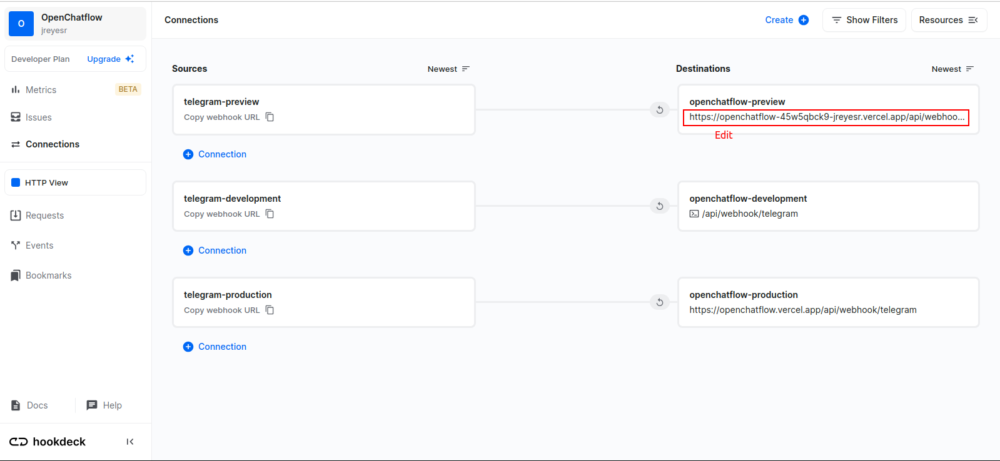
	At this point, any requests that come into that Source's URL will be redirected to our application. However, Telegram may not have been configured to send webhooks to that Source's URL yet
2. We retrieve every Bot that the application manages. Said bots will have been previously registered by users of OpenChatflow
3. For each Bot, we call [the Telegram API](https://core.telegram.org/bots/api#setwebhook) to inform Telegram of the URL that it should call. There we provide the Hookdeck URL.

So, when all is done, Telegram messages Hookdeck, and Hookdeck messages OpenChatflow. Hookdeck gives us stats, rate limiting, the ability to inspect any individual request, and maybe more if we wanted. For example, it's possible to [pause a connection](https://hookdeck.com/docs/pause-a-connection), which would enqueue any received events, so we could (for example) take the OpenChatflow application offline for maintenance. 

## Further reading

https://core.telegram.org/bots/webhooks: A guide to all things webhook

https://core.telegram.org/bots/api#getwebhookinfo: Check if a bot is registered with a webhook

https://core.telegram.org/bots/api#setwebhook: Register for a webhook, or unregister by passing an empty URL. 

## Testing: does it all work?

Okay, so we have an entire system to receive Telegram webhooks, complete with a way of configuring Telegram so it sends us those webhooks in the first place. Does it work?

First, we need to ensure that deployments make the script run. For example, consider the most recent commit as of writing this, [5a3cf7f](https://github.com/jreyesr/openchatflow/commit/5a3cf7f6df0834d4317c0fdd06bda83dfc2da8ff). We can check Vercel's build logs to ensure that it did configure Telegram to point to Hookdeck and Hookdeck to point to Vercel:

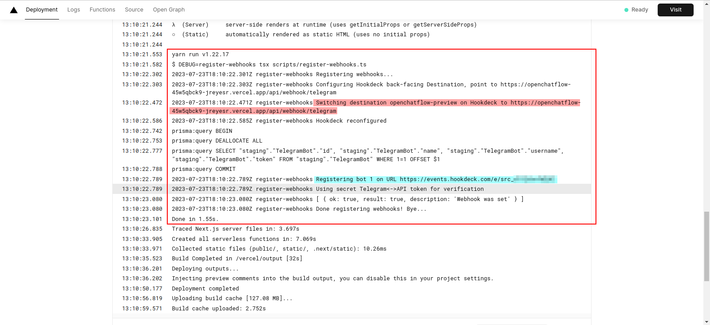

Then, on Hookdeck, we can see that it will forward messages to the correct deployment:

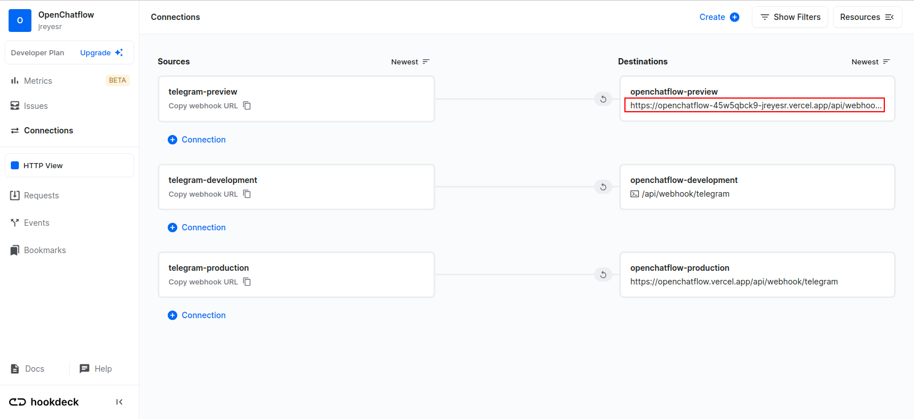

And finally, we can check one bot to see which URL it will report to:

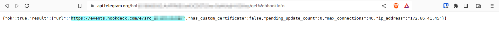

So, Telegram does know that it must message Hookdeck, Hookdeck knows that it must message OpenChatflow. Everything seems to be OK.

Now, let's send a message to the bot:

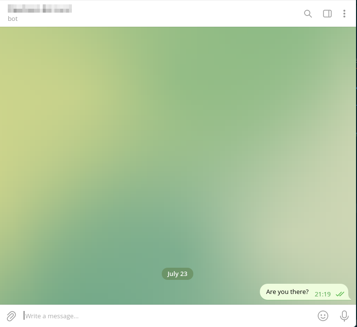

We can verify that the message was seen by Hookdeck:

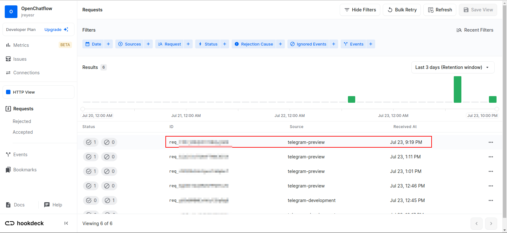

And also that Hookdeck caused OpenChatflow to run:

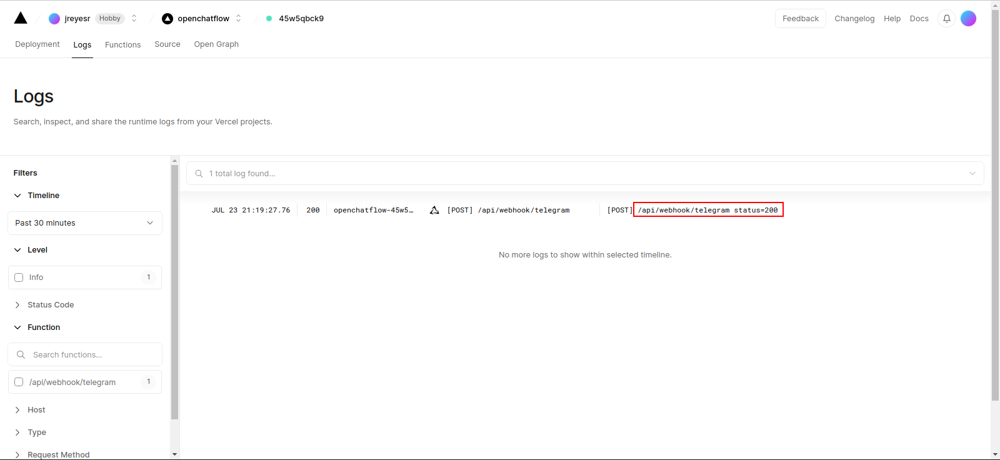

Since right now OpenChatflow does nothing with the message, there's almost no logs, just a 200 OK response. However, Hookdeck gives us some further information:

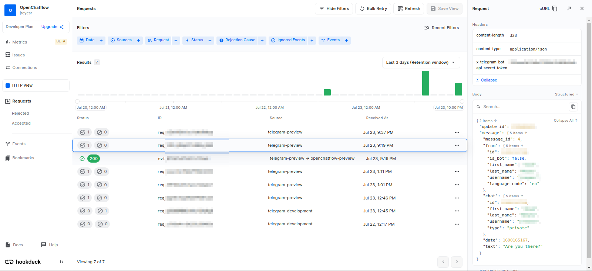

Ignore the extensive blurs, that's just me being me. We can clearly see that Telegram provides a bunch of information: who sent the message, the date, and the actual text content of the message. We can see that the sender is duplicated, in the `from` and `chat` fields, but they aren't necessarily the same: in a group chat, `chat` will be set to the actual group, while `from` will still be a person (whoever wrote the message on the group).

This also reveals a problem: no field in that message lets us distinguish to which bot was the message addressed. This is bad, since we need to know that, as OpenChatflow can handle multiple bots simultaneously. The solution (as explained in a StackOverflow answer that I can't for the life of me find again) is to provide a query parameter to Telegram when configuring the webhook. This will let us distinguish between different bots. To ease the implementation, we can just pass our DB ID for the bot:

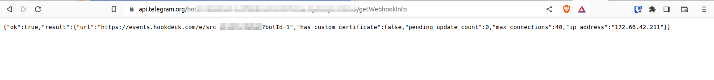

Now, any requests will include a `botId` query param that we can use to just index into our `TelegramBot` DB table and extract the bot.

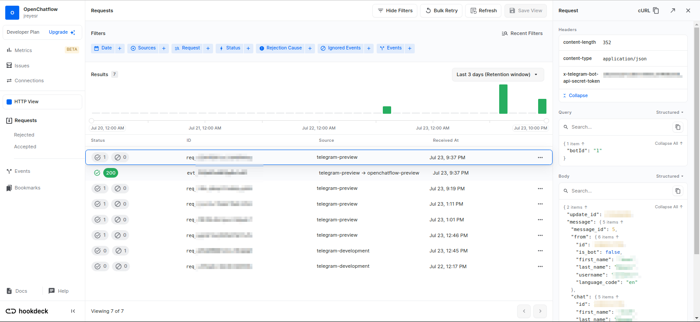

There's a new section below the Headers, called Query. There we have the bot's ID.

Just to double check, we can look at Vercel's logs:

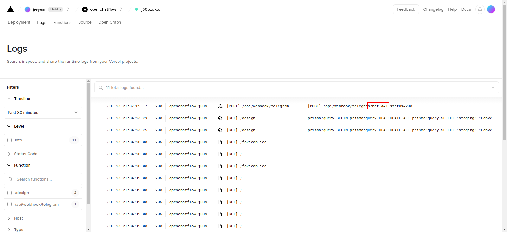

And there it is. We didn't have to change Hookdeck at all, it just forwarded query params to the Destination (which is OpenChatflow). Nice.

## Recap

* We've explored what webhooks are, why you'd want to use them (or not!)
* We've seen that Telegram provides bot owners with the ability to request that any updates involving their bot(s) are sent to a specific URL
* We've presented and explored [Hookdeck](https://hookdeck.com/), which provides infrastructure to ease the use of webhooks:
	* Queueing
	* Automatic retries, in case the backing application is down
	* All sorts of monitoring, such as error rates
	* Alerting when a previously-good endpoint starts failing
	* Inspecting any request (URL, headers, body)
	* Signature verification
* We've reviewed a way of running ad-hoc scripts in a NextJS application, in the spirit of Django's [`manage.py` commands](https://docs.djangoproject.com/en/4.2/ref/django-admin/), Flask's [custom commands](https://flask.palletsprojects.com/en/2.3.x/cli/#custom-commands), Laravel's [custom Artisan commands](https://laravel.com/docs/10.x/artisan#writing-commands) or Rail's [custom Rake tasks](https://guides.rubyonrails.org/v4.2/command_line.html#custom-rake-tasks)
* We've added a new model to the OpenChatflow DB, which contains information about Telegram bots that people want to manage with the application
* We've explored [`prisma-field-encryption`](https://github.com/47ng/prisma-field-encryption), an extension to the Prisma ORM that can transparently encrypt individual columns of data in the DB. We have applied encryption to the bot token column, since knowledge of that token gives you nearly complete control over the bot
* We've written a script that registers every bot with Telegram, so any updates for those bots are forwarded (through Hookdeck) to OpenChatflow
* We've configured Vercel so, on every deploy, all currently-existing bots are reconfigured. This is useful on Preview deployments, since those URLs are not stable
* We tested the entire flow by registering a bot directly in the DB (since right now there's no UI to do so) and then messaging it. We confirmed that the data appeared in Hookdeck and was successfully forwarded to OpenChatflow's most recent deployment (the URL of which varies per commit!). We then confirmed, in Vercel's app logs, that the correct handler is being invoked.

There are two main lines of work that must be tackled next:

* Providing users of the application with a way of registering their own bots
* Actually _doing something_ when a message is received. This requires the state machines that we worked on in [the previous post](https://jreyesr.github.io/posts/chatflow-6-real/), so we can feed a state machine with external events that come from Telegram

[^1]: Okay, it may be possible to reduce the load on B even further by batching events at the source, but that's a further refinement on the same general idea
[^2]: Or rather, a distributed-_er_ system, since it already probably employed HTTP calls. However, plain HTTP calls can be sometimes thought of as sync function calls, which aren't so bad, while webhooks tend to throw you right into async land, which is definitely distributed systems territory
[^3]: You _do_ use one branch per feature, right? No single branch for an entire release, right?
[^4]: Not _complete_ control, since the original bot creator can always rotate the token by speaking to [@BotFather](https://t.me/botfather), but until that happens you can perform actions as the bot, such as sending and receiving messages
