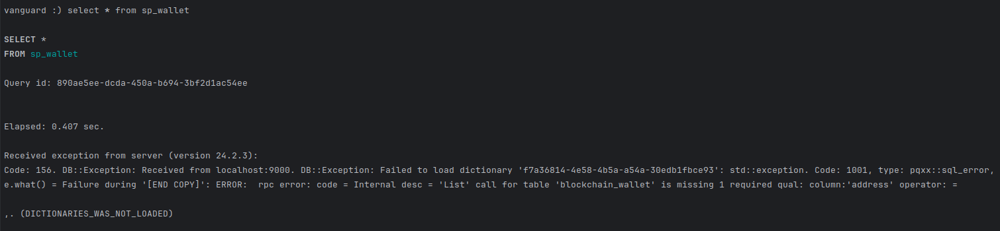

TL;DR: If you want to use [Steampipe](https://steampipe.io/) as a data source to augment data that is stored on [Clickhouse](https://clickhouse.com/), but you can't just list "the entire table" on Steampipe because the data source that you want to use _needs_ to be provided with a certain column (e.g. the `full_name` in the `github_repository` table), do the following:

1. [Install Steampipe](https://steampipe.io/downloads) and [any required plugins](https://steampipe.io/docs#install-the-aws-plugin), configure the plugins with any required credentials so the Steampipe CLI or manual queries work as expected
2. (Hopefully a temporary step!) Clone [this fork of the Steampipe FDW](https://github.com/jreyesr/steampipe-postgres-fdw) (you're welcome to [check out the diff](https://github.com/jreyesr/steampipe-postgres-fdw/commit/a42a86e699b76dad9e0ef076e1007c255b822845)), and run `make install` so it builds a patched version that understands the queries that will be issued later. [More instructions here](https://github.com/jreyesr/steampipe-postgres-fdw). Ensure that the file `~/.steampipe/db/14.2.0/postgres/lib/postgresql/steampipe_postgres_fdw.so` has changed, as this indicates that the new version of the FDW is now in use
3. Create [a Dictionary on Clickhouse](https://clickhouse.com/docs/en/sql-reference/dictionaries), with the following config (note that here we [use the DDL](https://clickhouse.com/docs/en/sql-reference/statements/create/dictionary), it's also possible to create an equivalent dictionary via XML files):
	* `PRIMARY KEY lookup_key` or `PRIMARY KEY lookup_key_1, lookup_key_2, ...`, depending on whether the Steampipe table requires a single column (e.g. the `linkedin_profile` table, which requires a `public_identifier`) or more than one column to be specified so that data is returned
	* `SOURCE(POSTGRESQL(port ... host ... user 'steampipe' password ... db 'steampipe' table 'schema.tablename'))`. Provide the necessary Steamipipe connection info (host, port, password, schema+table). Don't provide `where`, `invalidate_query` or `query`
	* `LAYOUT(COMPLEX_KEY_CACHE(SIZE_IN_CELLS 1))`. This is the magic that makes it all work; otherwise Clickhouse would try to dump the entire contents of the Steampipe table. The cache size can be 1 since Steampipe has its own query cache
	* `LIFETIME(1)`. Again, Steampipe has its own cache so no need to have double-caching on Clickhouse
4. Obtain data that comes in as normal Clickhouse data, e.g. web analytics logs. That data should have a key that you wish to search for in the Steampipe table, e.g. a Github repository name
5. To add Steampipe-provided data into the normal Clickhouse data, run a completely normal `LEFT JOIN`: `SELECT ... FROM normal_clickhouse_data a LEFT JOIN dict_name b ON a.field=b.lookup_key`
6. You should now obtain your original, normal Clickhouse data, except with some extra fields that have ben provided by Steampipe. Enjoy your dynamically augmented data!

What follows is a summary of the route that I took in order to arrive at that set of steps.

---

This article documents the interaction between Steampipe (a Postgres server that can present REST APIs and other data sources as if they were normal DB tables, which can be queried via SQL statements) and Clickhouse (a database engine that is used on analytics workloads, as opposed to transactional workloads, which can handle very large volumes of data quite fast). The purpose of this could be, for example, to add some additional Steampipe-provided data to events that are stored in Clickhous, in cases where it is not feasible to just add that data when the event is ingested into Clickhouse, such as:

* Very large volumes of data are being ingested, which would overwhelm Steampipe and/or the remote data source
* A large portion of the ingested events may never be queried for, which means that adding extra data to them would be a waste of resources and storage, and it's better to wait until the data is actually being queried for
* The remote data source has quotas or rate limits, and blindly querying it for every incoming event would blow them
* The remote data source is slow, such that adding data on ingest would slow down the pipeline far too much
* The remote data source does _not_ allow listing all of its data, so it's not feasible to just dump it all at regular intervals and then keep an in-memory cache that can be used on the incoming events
* It's not desirable to freeze the extra data to the state that it had when the event was collected, but rather to have the extra data as it is when the data is being queried (i.e. the extra data may change between when the event comes in and when the search is made, and we want the up-to-date version rather than the snapshot)

Notice that the operation that we want to perform (i.e. we have a large repository of what we have been calling "events", and we wish to append some extra data to them by asking a remote data source for it, via Steampipe) is precisely the semantics of a `LEFT JOIN` statement in plain SQL: given some "main" data (e.g. a table of `users`, each of which has a `country_id` that holds a number), we wish to append some extra data to each user (by reading a `countries` table, which has columns `id` and `name`, where the `id` is used to match the `country_id` column of the users). In the end, we'd have the same users, except that now they don't only have a country ID, but also the country's name. We have appended some data about each user's country to their information.

On Clickhouse, being an analytical database and all that, the use cases would be more along the lines of "given a table containing web analytics logs, each of which have a user ID, fetch every user's information on Salesforce so we can see metrics only for the webpage visits of our Gold Ultra Premium Max+ customers". The main structure is the same: large amount of primary data (web analytics logs), said primary data has an ID (the user ID) that points to external data, side data that lives somewhere else (here, user tier information that lives in Salesforce), and we want to bring that side data into the primary data so we can perform operations on it.

Another example: given a database of [house prices](https://clickhouse.com/docs/en/getting-started/example-datasets/uk-price-paid), each with a price and the date in which the transaction was made, we want to filter for transactions that were over a certain amount _in today's money_. Furthermore, let's say that we have a remote/API service that, when asked for the value of a certain amount of money at a certain time, will respond with the current value of that amount of money. However, being a paid API, they won't allow us to dump their entire dataset, just to ask for specific amount+time pairs (because they bill us per queries made). In such a case, a tool like Steampipe is perfectly suited to ask for values, since it can handle a query like `SELECT current_val FROM currency_exchange_rates WHERE old_val=123.45 AND at_time='2020-01-01' AND currency='GBP'`. We'd want to be able to use that information, on Clickhouse, like this:

```sql
SELECT 
   uk_price_paid.*, 
   currency_exchange_rates.current_val AS price_now
FROM 
   uk_price_paid JOIN currency_exchange_rate ON 
      uk_price_paid.price=currency_exchange_rates.old_val 
      AND uk_price_paid.date=currency_exchange_rates.at_time 
      AND currency_exchange_rates.currency='GBP'
WHERE
   price_now>1000000 -- 1M£ in today's money
```

Doing that turns out to be surprisingly convoluted! Hence this post.

## Setting the stage

### Steampipe

[Steampipe](https://steampipe.io/) is a tool that allows users to query REST APIs, files, code, and more, _as if_ it were stored in a traditional relational database (Postgres, to be precise). However, data isn't actually _stored_ anywhere: upon receiving, say, a `SELECT * FROM github_my_repository WHERE is_private=true AND name LIKE 'steampipe-%'`, Steampipe will issue a REST call to [list all the repositories for the authenticated user](https://docs.github.com/en/rest/repos/repos?apiVersion=2022-11-28#list-repositories-for-the-authenticated-user), passing it the `visibility: "private"` parameter. In turn, Github will return a list of all of the user's private repositories. Then, Steampipe will further filter that data and preserve only the repositories whose names start with `steampipe-`, and that data will be returned to the user. There are [many plugins](https://hub.steampipe.io/) for you to choose from, ranging from cloud computing providers to VCS systems to local files (e.g. JSON, YAML); infrastructure tools such as Terraform and Kubernetes; security tools like 1Password, AbuseIPDB and Shodan; utility tools like Google Sheets,  Zoom and Airtable; development tools like Algolia, Cloudflare and Auth0, AI such as OpenAI and CohereAI; all the way to more exotic data sources like treating an IMAP mailbox as a table, or Mastodon messages, or straight up sending TCP/HTTP requests, or reading RSS feeds, or Twitter, or the WHOIS information.

All of those disparate data sources are reduced to tables from which you can `SELECT ... WHERE ...`. If possible, those `WHERE` conditions are translated into the API's specific search/filter syntax, thus reducing the amount of data that needs to be transferred back to Steampipe. Any conditions that couldn't be delegated to the backing API are applied by Steampipe after the backing API has returned data, possibly more than is required, but such overhead is unavoidable if the remote API can't apply the filter itself.

There is a plugin (non-published, developed by yours truly [as an exploration of Steampipe's capabilities](https://jreyesr.github.io/posts/steampipe-part-dos-bitcoin/)), which I'll use throughout this post since I already have it installed in my Steampipe local server, and it requires no credentials. This plugin lets you send SQL queries like `SELECT balance, num_transactions FROM blockchain_wallet WHERE address='...'`, which retrieves some information about a specific Bitcoin wallet.

A natural first question may be to ask for a list of _all the wallets_. Keeping in mind the mental model of Steampipe as a(n admittedly magical) Postgres database, you may think that getting that list is just a matter of `SELECT`ing from the conveniently placed table that is called `blockchain_wallet`, like this: `SELECT * FROM blockchain_wallet`. 

However, that does not work. Instead, it fails with an error that states that the call is missing a "required qual" called `address`:

```sql
select * from blockchain_wallet
```

```
Error: rpc error: code = Internal desc = 'List' call for table 'blockchain_wallet' is missing 1 required qual: column:'address' operator: =
 (SQLSTATE HV000)

+---------+---------+---------------------+-------------------+----------------+------------+---------------+------+
| address | hash160 | number_transactions | number_unredeemed | total_received | total_sent | final_balance | _ctx |
+---------+---------+---------------------+-------------------+----------------+------------+---------------+------+
+---------+---------+---------------------+-------------------+----------------+------------+---------------+------+

```


This is precisely as expected: the Steampipe plugin uses an API that does _not_ allow you to just list _all the wallets_! In fact, for many blockchains, there isn't even a list of all the wallets, as the core of a wallet is a key pair which can be generated on demand: a wallet can be said to come into existence whenever someone generates a key pair, possession of the private key is control of the wallet, and the wallet's address is either the public key itself or a deterministic function thereof. Thus, there may be many wallets that aren't known, and thus the question of "all the wallets" is moot.

Similar scenarios happen on many Steampipe plugins. For example:

* On the Github plugin, there is [a table `github_repository`](https://hub.steampipe.io/plugins/turbot/github/tables/github_repository) that can retrieve information of any given (public or accesible to your credentials) repository. However, "You must specify the `full_name` (repository including org/user prefix) column in the `where` or `join` clause to query the table". In other words, it is not possible to just ask Github to retrieve each and every repository in the world. Doing so is possible for your own repos, but not for _all the repos_
* The IPInfo plugin [can retrieve information about a certain IP via the `ipinfo_ip` table](https://hub.steampipe.io/plugins/turbot/ipinfo/tables/ipinfo_ip), particularly the IP's geolocation. Since IPInfo is [a paid service](https://ipinfo.io/pricing) that is priced based on API requests per month, there's not an option to return every last datapoint that they use, but only to ask for a single point or a batch of them (though note that on the specific case of IPInfo they _do_ offer [downloadable DBs](https://ipinfo.io/products/free-ip-database))
*  The LinkedIn plugin can return information [about a single LinkedIn user, via `linkedin_profile`](https://hub.steampipe.io/plugins/turbot/linkedin/tables/linkedin_profile), but it requires the user to specify the `public_identifier` column. LinkedIn [utterly despises scraping](https://www.linkedin.com/blog/member/trust-and-safety/linkedin-safety-series-what-is-scraping), so they probably would never give a list of every LinkedIn member that is accesible via API calls, just a (very closely monitored) way to get a single user's information, provided that you already know their identifier
*  The OpenAI plugin can [generate text completions via ChatGPT and friends](https://hub.steampipe.io/plugins/turbot/openai/tables/openai_completion), by sending a query like `SELECT completion FROM openai_completion WHERE prompt='...'`. Of course, it's necessary to provide that `prompt`: otherwise, what is the AI model even _going_ to work with?

See [here](https://jreyesr.github.io/posts/steampipe-part-one/#predicate-pushdown-the-art-of-delegating-filtering-to-remote-servers) for another explanation of the problem. In short: Steampipe is working as expected; the plugin's data source does not allow listing of the entire data set, instead requiring that you explicitly name the items that you're interested in. As long as you do so, it'll work nicely:

```sql
select 
   * 
from blockchain.blockchain_wallet 
where address IN (
   '3QU7XaocionuZds6d6TAN8X8ADaLWkmwDn',
   '1GrwDkr33gT6LuumniYjKEGjTLhsL5kmqC',
   '17ZfgEexPj2w7oMh5AjeHSH5kLpPMgSMH4',
   '12aDyuLzgiCFC9EPVRGfHVBFa1dx713rCD',
   '1CkLcLR6uFGmXGSEexJ2i77rzfpJNu9tcf'
)
```


Thus, it is a common pattern on Steampipe that there are tables that cannot be listed in their entirety, but data can only be fetched from specific entries in them.

### Clickhouse

[Clickhouse](https://clickhouse.com/) is a really neat database engine that has a reputation for being _really fast_. Like, "so many gigabytes per second that reading from storage is the actual bottleneck, across terabytes of data". Like, "frickin' Cloudflare [throws half a gigabyte of data per second](https://blog.cloudflare.com/http-analytics-for-6m-requests-per-second-using-clickhouse) into it, forever, and it chugs along merrily". That's a petabyte in eight hours, by the way. And they keep raw data for a month, at least.

Of course, [lunches are not free](https://en.wikipedia.org/wiki/No_free_lunch_theorem) in our current universe and all that. Clickhouse's lunch payment comes in the form of it _not_ being a transactional-focused database, like Postgres or MySQL. Instead, it belongs to the family of [OLAP databases](https://en.wikipedia.org/wiki/Online_analytical_processing), which stands for "Online Analytical Processing. Dashboards and BI stuff, basically. OLAP databases are optimized for aggregate queries (e.g. `SELECT SUM(column) GROUP BY another_column`), as opposed to the point queries (e.g. `SELECT * WHERE id=3`) that are much more prevalent on "traditional" databases (by the way, the counterpart to OLAP is OLTP, Online Transactional Processing, where Postgres, MySQL and friends would live). OLAP databases tend to like denormalized, "wide" tables with tons of columns, as opposed to the standard normalized tables that contain foreign keys to other tables and are `JOIN`ed at query time. This is for performance, since as much as JOINs can be optimized, they can't really beat not JOINing at all. OLAP databases are also much more amenable to the idea of append-only databases (i.e. never `UPDATE`ing rows). OLAP databases also tend to not have transactions, so no good for those times when you need inter-record consistency.

A typical use of an OLAP database (and, indeed, the one that caused Clickhouse to be born) is holding logs of webpage requests, à la Google Analytics. Clickhouse was originally developed internally in Yandex (Russia's Google) for their Metrika product (Russia's Google Analytics), which stores... webpage events! Those are a really nice fit for OLAP:

* Website visit logs lend themselves quite well to append-only semantics: they're events that don't change once ingested, much like sensor measurements on IoT scenarios
* They can come in very large volumes, depending on how many people are visiting a page that uses the service
* Many queries will be for aggregate data (e.g. "the average of page load times")
* Very few, if any, queries, will be for a single point/event (how would you even _talk about_ a single log? Do they even have a unique ID?) This isn't an app database where you want to know about "the user with ID 1" or "the post with ID 2"

To recap: Clickhouse is a database engine, that superficially looks similar to Postgres or MySQL, since it is queried via SQL. However, its DNA is entirely different, its performance patterns are wildly different, and it's used for other things.

## Can we use Steampipe on Clickhouse?

Now we join our two concepts into a question: can we access data sources that are provided as Steampipe tables on Clickhouse?

On a "traditional" database, let's say Postgres, you would add Steampipe as a remote data source using [Postgres's Foreign Data Wrappers](https://www.crunchydata.com/blog/understanding-postgres_fdw). This would make it so new tables appeared on your database, but any query that touches them is forwarded to the Steampipe server. Once those tables exist, it would be possible to execute a `JOIN` that involves a "local" table (from the point of view of the database, i.e. a normal table that stores normal data) and a Steampipe table. For example, recall our previous Steampipe example: we've seen a plugin that can provide information about a specific Bitcoin wallet, if provided with said wallet's address. If you had a `users` table that has a `bitcoin_wallet` address, and you wanted a list of all users that have a wallet with zero balance (perhaps to remind them that they need to have some balance there to keep using your application), a query like this would provide that list:

```sql
SELECT
   u.id, u.email, u.name, u.created_at,
   w.balance
FROM
   users u 
   JOIN blockchain_wallet w 
   ON u.bitcoin_wallet=w.adress
WHERE
   w.balance=0
```

(Note that the `balance` column, by construction, will always contain zeroes, but this is just an example)

Clickhouse [is capable of JOINs](https://clickhouse.com/blog/clickhouse-fully-supports-joins-part1), which is somewhat uncommon, as we've discussed before, on OLAP databases. They usually prefer wide, denormalized data, where everything is on the same table and populated at `INSERT` time. That's part of the job of many ETL pipelines. However, this has an issue: if you want to denormalize data at insertion time, it'll be frozen at whatever state it had _at that point in time_. Sometimes that's desirable, and sometimes it isn't. Besides, the data source (e.g. the service that receives a wallet address and returns its current balance) would receive the full brunt of the incoming data, which may be a very large volume of queries if there are many incoming events (not on Bitcoin, though, since it's [famously extremely slow](https://phemex.com/blogs/what-is-transactions-per-second-tps)).

Here, let's say that we operated some sort of blockchain analysis service that provided... I don't know, perhaps tracing of criminal transactions or something. It'd track every Bitcoin transaction, store it on a Clickhouse database, and then allow users to make queries about that data.

Let's keep it simple and create a very primitive "events table" that holds imaginary blockchain data:

```sql
CREATE TABLE default.events
(
    `wallet_id` String,
    `amount` Int64,
    `ts` DateTime DEFAULT now()
)
ENGINE = MergeTree
PRIMARY KEY wallet_id
ORDER BY wallet_id
SETTINGS index_granularity = 8192
```

The beginning of that table is pretty standard SQL syntax to create a table. The final bits are Clickhouse-specific syntax. You're referred to [Clickhouse docs](https://clickhouse.com/docs/en/guides/creating-tables) on the matter for more information.

Then, let's insert some transactions on that table, to simulate data getting populated:

```sql
INSERT INTO events VALUES
    ('3QU7XaocionuZds6d6TAN8X8ADaLWkmwDn', 100),
    ('1GrwDkr33gT6LuumniYjKEGjTLhsL5kmqC', 100),
    ('3QU7XaocionuZds6d6TAN8X8ADaLWkmwDn', 200),
    ('12aDyuLzgiCFC9EPVRGfHVBFa1dx713rCD', 50),
    ('3QU7XaocionuZds6d6TAN8X8ADaLWkmwDn', 100),
    ('12aDyuLzgiCFC9EPVRGfHVBFa1dx713rCD', 150),
    ('1GrwDkr33gT6LuumniYjKEGjTLhsL5kmqC', 100)
```

A simple `select * from events` shows that the data is indeed inserted:


So we have events that live in a Clickhouse database and contain a Bitcoin wallet address. We also have a Steampipe database, that masquerades as a Postgres server, which will happily answer queries of the form `SELECT * FROM blockchain_wallet WHERE address='???'` or its variant `... WHERE address IN(...)` (which can be decomposed into several of the former). Can we merge that data together so each "transaction" is annotated with the balance of the wallet that made it?

### Attempt 1: Postgres database engine

Clickhouse can integrate with Postgres databases (and many other engines, too) by using [the Postgres database engine](https://clickhouse.com/blog/migrating-data-between-clickhouse-postgres). Much like the Postgres FDW, this engine makes it so tables that live in a remote Postgres database appear like local tables in the Clickhouse server: they can be `SELECT`ed, `INSERT`ed, `UPDATE`d and `DELETE`d. This means that an application that needs to access both databases could, in theory, control the Postgres data through Clickhouse, instead of having to connect to both databases. (For completeness, there's also [a Clickhouse FDW](https://github.com/ildus/clickhouse_fdw) for Postgres that can work in the reverse direction: make Clickhouse tables available as virtual tables in a Postgres server).

To configure the Postgres database engine in Clickhouse, all that is required is a single SQL command, to be performed on Clickhouse:

```sql
CREATE DATABASE steampipe
ENGINE = PostgreSQL('localhost:9193', 'steampipe', 'steampipe', 'mypassword', 'blockchain')
```

This command will create a database (i.e. a collection of tables, nothing more) in the Clickhouse server. That database will contain whichever tables exist in the `blockchain` schema of the `steampipe` database in the `localhost:9193` Postgres server, using a certain username and password. That is, a schema in Postgres is mapped to a Clickhouse database. It's also possible to use [the Postgres _table_ engine](https://clickhouse.com/docs/en/engines/table-engines/integrations/postgresql), which also connects to a Postgres server, but only exposes a single table, as opposed to an entire schema.

If Steampipe and Clickhouse are hosted in the same machine, as in this example, the password does not matter: Steampipe does not check the password if the connecion originates from `localhost`. The `blockchain` part at the end is the schema that will be exposed and depends on the actual Steampipe plugin that you want to use, since Steampipe exposes connections (each of which uses a specific plugin) as schemas.

What would happen if we now tried to `SELECT` all records from the `blockchain_wallet` table, via Clickhouse?


Of course, it doesn't work, since we would need to provide a wallet address. Recall that we can't just "list all the wallets". Once we provide some wallet addresses via `WHERE address IN (...)`, it works just as expected:


So far, so fine. We're now capable of accessing a Steampipe table (which, remember, doesn't really store any data, but instead dynamically makes queries to a remote API whenever a SQL query comes in) through Clickhouse.

Now, let's try a `JOIN`!

```sql
SELECT *
FROM events AS e
LEFT JOIN steampipe.blockchain_wallet AS w ON e.wallet_id = w.address
```


Aaand... it doesn't work. Attempting a simple JOIN will cause the same error as if we had never provided a wallet addres to begin with. What sorcery is this? Clickhouse could certainly have provided a list of all the addresses that appear as values in the `events.wallet_id` column, since it could _absolutely_ read that data off the `events` table prior to emitting the request to the remote table.

### A (not-so-deep) dive into Clickhouse JOIN algorithms

In fact, the problem is that Clickhouse isn't even _attempting_ to gather a list of all possible wallet addressed to forward them to the Steampipe tabe. This is a side effect of its chosen JOIN algorithm. A brief discussion of them is therefore warranted.

There is [a set](https://clickhouse.com/blog/clickhouse-fully-supports-joins-hash-joins-part2) [of three](https://clickhouse.com/blog/clickhouse-fully-supports-joins-full-sort-partial-merge-part3) [articles](https://clickhouse.com/blog/clickhouse-fully-supports-joins-direct-join-part4) in the Clickhouse blog about the implemented JOIN algorithms. There's six of them, and the chosen algorithm is what dictates the actual data access pattern whenever a JOIN statement is encountered. 

The default choice, since it's the most generic, is a Hash Join. A discussion of it [can be found here](https://clickhouse.com/blog/clickhouse-fully-supports-joins-hash-joins-part2#hash-join).  It works like this:


1. The right-hand table is read _in its entirety_. In our example, that'd be the `blockchain_wallet` table (the left-hand table is `events`)
2. Data from the right-hand table is used to build a "hash table", an in-memory structure that makes it so asking for a certain value of the join key is a very efficient operation. In our example, the hash table would make it very fast to ask for a certain `address` and get back, among other fields, the `total_balance` and `number_transactions` for that wallet
3. The left-hand table is read, and chunks of data fly across the hash table, picking up the associated information along the way. In our example, the `events` would be read in chunks (though, since we have very few, they'd most likely be in a single block), and whatever values of `wallet_id` existed in each chunk would be queried against the precomputed hash table. The returned values would be pasted alongside the original data in that block, so new columns appear in the data, and that JOINed data would be returned

The Hash algorithm is usually preferred because, once the right-hand table has been read into memory, `JOIN`ing the left side to it is stupid fast, since the hash table lives in RAM: in fact, short of stuffing the hash table into CPU cache (and good luck fitting any decent-sized hash table into a few megabytes of CPU cache), there's really nothing faster than a RAM lookup that is indexed by the join key. In practice, this means that your bottleneck will be _somewhere else_, perhaps reading from the left table or anything else, but _not_ on the JOIN itself. Which is usually good.

However, for this specific case, there's a problem: Clickhouse will attempt to read the _entire_ `blockchain_wallet` table first, on step 1. And we've established that such an operation is _not_ possible. Which means that the hash table will never be built, and thus no joining of data will take place.

In fairness to Clickhouse, this is a very niche scenario that we're covering here. For most databases, what Clickhouse does is the sensible, fast thing to do: read the data from a potentially slow storage once, build a very fast in-memory structure once, and then reuse it for all the data in the left table, thereby amortizing the cost of the read+build stages over many (now very fast) lookup operations. It's only an issue when the right table can not, under any circumstances, be read at once.

So, to recap: it is possible to provide access to Steampipe tables from Clickhouse by creating a database (in Clickhouse) that uses [the Postgres database engine](https://clickhouse.com/docs/en/engines/database-engines/postgresql). However, simply `JOIN`ing between a Clickhouse table and a Steampipe table won't work, as Clickhouse will attempt to read all Steampipe data first and there are data sources where that isn't possible, namely data sources where you must query for a specific resource, by some sort of ID, instead of listing all of them.

### Subqueries

A possible alternative would be to force Clickhouse to send a query to Steampipe where only the possible values are mentioned. In other words, why ask for "every wallet", only to throw away all the wallets that don't appear in our data?

An approach to achieve this would use subqueries to explicitly filter values on the Steampipe table:

```sql
SELECT *
FROM events AS e
LEFT JOIN
(
    SELECT *
    FROM steampipe.blockchain_wallet
    WHERE address IN (
        SELECT wallet_id
        FROM events
    )
) AS w ON e.wallet_id = w.address
```

(Yes, double-nested subqueries are ugly)

This query attempts to join the `events` table, not against the entirety of `steampipe.blockchain_wallet` as before, but against the result of `SELECT`ing only the records in `blockchain_wallet` that could possibly match the `JOIN` condition. The expected execution flow of this query would be (recall that subqueries are read from the inside out, much to the chagrin of everyone who has ever worked with them):

1. Read all the `wallet_id`s that appear on `events`
2. Send a query to the Steampipe server that looks like `SELECT * FROM blockchain_wallet WHERE address IN(...)`, where the actual values inside that `IN(...)` would be all the `wallet_id`s that appear on `events`, which we found on Step 1
3. Use only that data to build the hash table
4. Finally, use that hash table to add new columns to `events`


Sadly, that doesn't work either. In general, since SQL is a declarative language, there's no guarantee about exact execution plans. You can't infer, from a certain SQL query, the exat way in which the engine will execute it: optimizers are free to choose execution plans, and in fact that's what gives SQL a lot of its power. Clickhouse doesn't execute that query in the order that we described above, but instead short-circuits the execution and jumps directly to reading from `steampipe.blockchain_wallet`. This means that the same error happens:


So, no dice. We need another way to force Clickhouse to only query for certain rows in the remote (Steampipe) table, as opposed to trying to read all of it.

### Using a Dictionary

[Dictionaries](https://clickhouse.com/blog/faster-queries-dictionaries-clickhouse) are another Clickhouse feature that can be used to augment data, as an alternative to JOIN statements. Dictionaries, much like their real-world counterparts, are data structures where a specific "word" can be looked up, and which return some "data" about that "word". For a real-world dictionary, the word is the lookup key, and the word's definition is the returned value. For Clickhouse, lookup keys can be many things (e.g. numeric IDs, strings, IP addresses) and multiple values can be returned for a key. In that same way, a real world dictionary can return the word's type (e.g. noun, verb or adjective), its [gender](https://en.wikipedia.org/wiki/Grammatical_gender) (male/female, if there even exists such a concept in the dictionary's language. I know that it does, and it matters a lot, in Spanish), whether it's used on a specific country, its pronunciation, whether it's an archaic word, and finally an array of word definitions.

For example, Clickhouse embeds [some dictionaries](https://clickhouse.com/docs/en/sql-reference/dictionaries#embedded-dictionaries) with geographic information, such as getting a region's name in a certain language from a region ID. Other examples are, for instance, [converting a numerical ID into a currency name](https://altinity.com/blog/dictionaries-explained), or [an IP address into a country code](https://clickhouse.com/docs/en/sql-reference/dictionaries#ip_trie) for geolocation purposes.

Dictionaries are kept in memory (caveats apply), thus enabling very fast lookups. They can be consumed [using special functions](https://clickhouse.com/docs/en/sql-reference/functions/ext-dict-functions) or by JOINing to them, which is internally translated into said special functions.

Dictionary entries can be populated from [several different source types](https://clickhouse.com/docs/en/sql-reference/dictionaries#dictionary-sources). They can be filled from local files, such as CSV files, which is especially useful for slow-changing data such as country codes to names. They could [be generated by an executable](https://clickhouse.com/docs/en/sql-reference/dictionaries#executable), which can then do anything at all to generate that data, as long as it prints it to stdout in the correct format in the end. They could [be read from a HTTP server](https://clickhouse.com/docs/en/sql-reference/dictionaries#https), which could serve a different file to different users, or enforce authentication, or simply allow to update the served file without having to mess around on the Clickhouse servers. Or, the most important one from our purposes here, they [could come from an external DB](https://clickhouse.com/docs/en/sql-reference/dictionaries#dbms).

To create a dictionary that reads its data from a Postgres table, the following command can be used:

```sql
CREATE DICTIONARY sp_wallet(
    `address` String,
    `number_transactions` Int64,
    `final_balance` Int64
)
PRIMARY KEY address
SOURCE(POSTGRESQL(
    port 9193
    host 'localhost'
    user 'steampipe'
    password 'whatever, doesnt matter if connecting from localhost'
    db 'steampipe'
    schema 'blockchain'
    table 'blockchain_wallet'
))
LAYOUT(FLAT())
LIFETIME(360)
```

This creates a dictonary with the fields `address`, `number_transactions` and `final_balance`. The `address` is declared as the dictionary's `PRIMARY KEY`, which means that any queries to the dictionary must state a wallet address. Any other columns (here, `number_transactions` and `final_balance`) are the dictionary's output fields. In other words, you give an `address`, the Dictionary gives you `number_transactions` and `final_balance` back.

Also, the dictionary specifies a `SOURCE`, which is where the data comes from. Here, we provide the necessary connection information so the dictionary can extract its data from the Postgres server. Now, we can try to read the dictionary:

```sql
select * from sp_wallet
```



And it doesn't work. Again. Same error: we just can _not_ list the entire contents of the dictionary. 

In the same way, just trying to `JOIN` against that dictionary throws the same error, which indicates that the dictionary was not loaded, because the remote server returned an error, because it was missing a required qual for the `address` column.

```sql
SELECT e.*, w.final_balance
FROM events e
   LEFT JOIN sp_wallet w ON e.wallet_id=w.address
```

So, we can deduce that Clickhouse, on first use of a dictionary, tries to fill it so it can thereafter keep it in memory and thus provide very fast lookups. The way to fill a dictionary that is backed by a Postgres table is to issue a `SELECT * FROM backing_table` with no `WHERE` condition, which normal Postgres servers will handle just fine by returning everything. From there on, Clickhouse wouldn't need to contact the backing server except once every `LIFETIME` seconds, since dictionaries _do_ expire and need to be refreshed. The actual queries would be served from memory. Of course, that whole thing breaks down when there is no _all data_ to query.

### But wait! There's more

However, dictionaries have a trick up their virtual sleeve. It's on the `LAYOUT` setting, which [controls the way in which the dictionary is stored in memory](https://clickhouse.com/docs/en/sql-reference/dictionaries#ways-to-store-dictionaries-in-memory). A [flat layout](https://clickhouse.com/docs/en/sql-reference/dictionaries#flat) is the default, in which "the dictionary is completely stored in memory in the form of flat arrays." Of course, to store a dictionary you have to read it first from its source, which is where everything goes wrong.

However, there are fifteen other layouts. Hidden between them is a layout that [is called `cache`](https://clickhouse.com/docs/en/sql-reference/dictionaries#cache). Its description is as follows:

> The dictionary is stored in a cache that has a fixed number of cells. These cells contain frequently used elements.
>
> The dictionary key has the UInt64 type.
>
> When searching for a dictionary, the cache is searched first. For each block of data, all keys that are not found in the cache or are outdated are requested from the source using `SELECT attrs... FROM db.table WHERE id IN (k1, k2, ...)`. The received data is then written to the cache.

Now hang on a minute. That SQL statement at the end looks suspiciously like the one that we've been trying to generate _this entire time_! 

Clickhouse's docs state that, for `cache` Dictionaries, what is stored in memory is not the entire contents of the dictionary, but only some elements of it. The amount of elements that can be remembered is the _number of cells_. Requests for these elements will be served from RAM.

Of course, at any point, there could come in a request for an element that is _not_ currently in any cell. In that case, Clickhouse will have to forward that query to the backing store that is the Dictionary's `SOURCE` (the file, executable, HTTP server or remote database, though the description of the `cache` layout may seem to hint that it's only available for DB sources). Clickhouse will ask for information on the elements that it doesn't currently know about (the ones that weren't in an cell), the data source will return that information, and Clickhouse will store it on the cache for future reference (possible expelling some elements that lived there, if the cache is currently full). Then, the original request for information that came in to the dictionary will be fulfilled, using a mix of information that was in the cache and information that was freshly queried.

And by some amazing stroke of luck, this is _precisely_ what we need to make Steampipe happy! If we ask Steampipe for some information, and the Dictionary is empty, it'll build a `SELECT` with a `WHERE` clause that lists every last lookup key that it needs.

```sql
CREATE DICTIONARY sp_wallet(
    `address` String,
    `number_transactions` Int64,
    `final_balance` Int64
)
PRIMARY KEY address
SOURCE(POSTGRESQL(
    port 9193
    host 'localhost'
    user 'steampipe'
    password 'whatever, doesnt matter if connecting from localhost'
    db 'steampipe'
    schema 'blockchain'
    table 'blockchain_wallet'
))
LAYOUT(COMPLEX_KEY_CACHE(SIZE_IN_CELLS 1))
LIFETIME(1)
```

The only change is to switch the `LAYOUT(FLAT())` for `LAYOUT(COMPLEX_KEY_CACHE(SIZE_IN_CELLS 1))`. We could have a larger cache, but it's not _as_ necessary since Steampipe also caches results. Feel free to increase it if desired.

Notice that we don't use `LAYOUT(CACHE(...))`, but `COMPLEX_KEY_CACHE` instead. This is because, as documented in [the list of layouts](https://clickhouse.com/docs/en/sql-reference/dictionaries#cache), the plain cache layout is only available when the cache key is a single `UInt64`, i.e. a number. In other words, dictionaries with `CACHE` layouts are only useful to look up numbers, such as your standard relational DB's autoincremental integer primary keys. In theory, it would also be possible to store data about IP(v4) addresses, since they can be represented as 32-bit integers. However, no strings. If the lookup key is a string, or perhaps a combination of fields (such as in our historical currency exchange rate example above where the lookup key would be a DateTime past time + a Float amount of money), it would be necessary to use the `COMPLEX_KEY_` variant of the cache layout. In fact, I originally wrote `LAYOUT(CACHE(...))`, but Clickhouse detects such cases and automatically switches the layout for the complex variant.

Once that dictionary is created, it won't try to fill itself, since it has no reason to: it has not received any requests and thus has no information to cache. We can try again to `JOIN` against it:

```sql
SELECT e.*, w.final_balance
FROM events e
   LEFT JOIN sp_wallet w ON e.wallet_id=w.address
```


Nope. Still fails. The error is the same, too: "'List' call for table 'blockchain_wallet' is missing 1 required qual: column:'address' operator: =". In other words, Steampipe isn't receiving a value for the column `address` that has the form `address=...`. Could it be that Clickhouse is trying to list everything for some reason?

I couldn't find logs on either Steampipe or Clickhouse that stated the actual generated query that is being issued to the backing store, so I ended up breaking out the ol' reliable Breakpoints. Deep inside Clickhouse's source code, there is the `CacheDictionary` class, which is what handles both `LAYOUT(CACHE(...))` and `LAYOUT(COMPLEX_KEY_CACHE(...))`. The [generic function `CacheDictionary<T>::update`](https://github.com/ClickHouse/ClickHouse/blob/f240511bf5cbdd13eb4b5419b51e6736f61a7c79/src/Dictionaries/CacheDictionary.cpp#L581) is the function that is failing, as seen on the error message that states that "Update failed for dictionary XYZ". After some perusal of that function, we can find a call to `current_source_ptr->loadKeys`, which is inside an `if()` that triggers only if the dictionary is _not_ a "simple" dictionary, i.e. a complex dictionary, i.e. one whose layout starts with `COMPLEX_KEY_`. That function is provided with `requested_complex_key_rows`, which would be the list of keys to check for (here, our _actual_ wallet addresses).

That `loadKeys()` function is overloaded by implementations of `IDictionarySource`, one of which is `PostgreSQLDictionarySource`. You can find its implementation [here](https://github.com/ClickHouse/ClickHouse/blob/f240511bf5cbdd13eb4b5419b51e6736f61a7c79/src/Dictionaries/PostgreSQLDictionarySource.cpp#L103-L107) (it's very short). What it does first is compose the actual query that asks for whatever was passed (i.e. the lookup keys of interest) by calling `composeLoadKeysQuery`. Then, the composed query string is passed to the execution machinery that actually calls the remote Postgres server (here played by Steampipe). By setting a breakpoint just after the query is composed and before it is fired off to Postgres, we can see just _what_ Clickhouse is asking for:


```sql
SELECT "address", "number_transactions", "final_balance" FROM "blockchain"."blockchain_wallet" WHERE ("address"='12aDyuLzgiCFC9EPVRGfHVBFa1dx713rCD') OR ("address"='1GrwDkr33gT6LuumniYjKEGjTLhsL5kmqC') OR ("address"='3QU7XaocionuZds6d6TAN8X8ADaLWkmwDn');
```

Surprise! Wallet addresses _do_ appear in the query, which Clickhouse generates as `SELECT col1, col2, ... FROM source_table WHERE (lookup_col=val1) OR (lookup_col=val2) OR ...`.

This is precisely what we would expect: "search for rows where the lookup key is X, Y or Z. For each one, extract columns A, B and C, and return them". This is precisely a "dictionary"-style lookup. The only difference with a standard database is that, if you point it to a Steampipe instance instead, that data will be dynamically queried by Steampipe (say, to AWS's API) and then returned to Clickhouse _as if_ it had always been there.

While that is all well and good, that doesn't explain our _tiny_ problem: we can see that Steampipe is receiving a set of wallet addresses. A wallet address is all that Steampipe needs to fire off a query that can return that wallet's information. So what is happening?

### Deeper inside Steampipe's qual resolution logic

Let's explore deeper. What happens if we try to run the SQL statement that e extracted from Clickhouse on a simple Steampipe console, just to rule out some weird Clickhouse-Steampipe interactions?


As expected, it still fails. This indicates that Steampipe, for some reason, can't understand queries of the form `WHERE col=val1 OR col=val2 OR col=val3` as carrying a set of possible values for `col`, i.e. as equivalent to `WHERE col IN(val1, val2, val3)`. This is what is breaking stuff, since we have confirmed that Steampipe _can_ handle both `col=val` and `col IN(val1, val2, val3)`.

This is, by the way, understandable, since there's no guarantee that `OR` statements can be nicely transformed into `IN` statements. Consider, for example, `WHERE col=val1 OR another_col=val2`. That is most definitely _not_ equivalent to `col IN(val1, val2)`. However, here it's messing with our deep-seated desire to have Clickhouse read data from Steampipe. 

To understand what follows, it's useful to have a general understanding of the path that a query takes when it comes in to Steampipe, from some sort of Postgres client (here, it's Clickhouse, but as we've seen the same issue happens when using the Steampipe CLI, which is another client).


1. First, the query comes in and is processed by raw, untouched Postgres code, that is lovingly maintaned by the Postgres project. Some query rewrites happen here, but the query that we saw Clickhouse emit passes through untouched, since it's actually very simple: the optimizer is mostly concerned with nasty subqueries or JOINs, which can sometimes be reordered or modified for efficiency
2. Since the query is `FROM remote_table` (as opposed to a "normal" Postgres table, which would have storage and data managed by Postgres itself), the Postgres code forwards that query to the [FDW (Foreign Data Wrapper)](https://www.postgresql.org/docs/current/fdwhandler.html) that has declared itself as responsible for that table. In Steampipe, _every last Steampipe table_ is handled by a single FDW, called `steampipe_postgres_fdw`. [Its source code is here](https://github.com/turbot/steampipe-postgres-fdw). In fact, we can verify this with a couple of SQL commands:
    
3. The `steampipe_postgres_fdw` receives "its part" of the query (which, here, is actually the entire query since it's a very simple query that only concerns a remote table"). It analyzes it (e.g. it infers, from the `FROM` clause, for which actual Steampipe plugin it is, and determines whether that plugin is installed). Then, the FDW also analyzes the `WHERE` conditions and decides which should be forwarded to the plugin. This is because we could have written, for example, `SELECT * FROM blockchain_wallet WHERE address='...' AND current_balance>0`. However, the API that we use to get the information about a wallet can _not_ filter based on a wallet's balance. You give it a wallet ID, and it returns data about said wallet (which includes its current balance): the balance is an output parameter, not an input one. Thus, the condition `current_balance>0` is _not_ forwarded to the plugin, since it wouldn't be able to do anything with it. This condition will be applied after the data is fetched, by Postgres
4. It is at this point that the `WHERE col=... OR col=...` condition is being lost
5. The Blockchain plugin is being called _without_ a qual on the `address` column. It dutifully reports that it needs an `address` to do its thing, and raises an error. This is in turn returned to the client

So, let's dive into [the `steampipe-postgres-fdw` source code](https://github.com/turbot/steampipe-postgres-fdw)!

The code is quite convoluted, since it's a mix of C and Go code: the Turbot team seem to favor Go, but Postgres (and, hence, anything that must link with it, such as its FDWs) needs to use C. Go is capable of doing so (as are many other programming languages), [via `cgo`](https://go.dev/blog/cgo). cgo can both let Go programs use C features, and also is capable of compiling Go programs into static `.a` archive files that can then be used (as static libraries) by pure C programs. Thus, the Steampipe FDW code is split in two main directories: [the root directory](https://github.com/turbot/steampipe-postgres-fdw/tree/main) holds the Go code, while [the `fdw` directory](https://github.com/turbot/steampipe-postgres-fdw/tree/main/fdw) holds pure C code.

The Go code, converted via cgo into a `.a` static library; and the C code, compiled up to `.o` object files (one for each C file in the `fdw` directory, they're not yet linked) come together into a Postgres extension [via a magical, Postgres-provided Makefile](https://www.postgresql.org/docs/current/extend-pgxs.html) whose only job is to produce valid Postgres extensions. [Here's the Makefile that does so](https://github.com/turbot/steampipe-postgres-fdw/blob/main/fdw/Makefile). Notice how it sets the `MODULE_big`, `OBJS` and `SHLIB_LINK` variables, which [are documented by Postgres](https://www.postgresql.org/docs/current/extend-pgxs.html) to be what the Postgres build machinery will read to create a valid extension.

The output of that is a `.so` file (for Linux, that is; it's a `.dylib` for Macs). That file can be placed on a special directory on a Postgres installation, alongside a `.control` file that is [a very simple text file with some extension metadata](https://github.com/turbot/steampipe-postgres-fdw/blob/main/fdw/steampipe_postgres_fdw.control) and [a SQL file that automatically installs the extension](https://github.com/turbot/steampipe-postgres-fdw/blob/main/fdw/steampipe_postgres_fdw--1.0.sql). When placed on any plain old Postgres installation, it'll automatically become a Steampipe.

After some time looking at the Go code (I was _really_ hoping that the relevant logic was not in C code), I managed to find the code responsible. It's on `quals.go`, to be precise [on the `restrictionsToQuals` function](https://github.com/turbot/steampipe-postgres-fdw/blob/4fd1445faf72ecdaf363df00e1fd7c92828621e0/quals.go#L23). As its name implies, this function is responsible for receiving _restrictions_, i.e. `WHERE` expressions that limit what the query is about, and transform them into quals that the plugins can understand. To do so, it must process a Postgres execution plan, which in turn is a processed version of the text query that came in. For example:


We can see how different `WHERE` conditions are converted into different kinds of restrictions. For example, `col=val`, `col>val` and other similar conditions appear as `OpExpr` restrictions. `col IS (TRUE/FALSE)` appears as a `BooleanTest`. Just `col` is a `Var`. The ones that interest us, `x OR y` and `x AND y` (where, by the way, X and Y could be any kind of restriction, so recursiveness appears), are called `BoolExpr`s.

A `BoolExpr` contains two pieces of data: 

* `boolop`, i.e. the operation that the whole thing is about. It can be `AND`, `OR` or `NOT`
* `args`, which are the pieces of the condition. `NOT` conditions have a single one, since `NOT` is an unary operator. However, `AND` and `OR` will always have at least two `args`, since with a single one there's even no way to express a boolean operation. Consider: `X and Y` is clearly a conjunction, but what about `X` alone? It's no longer an `AND` operation, it's just... `X`

As we can see [here](https://github.com/turbot/steampipe-postgres-fdw/blob/4fd1445faf72ecdaf363df00e1fd7c92828621e0/quals.go#L260-L282), as of now (i.e. version 1.10.0 of the FDW), the Steampipe FDW handles only one case of `BoolExpr`: the case `NOT column`. That's it. `NOT column=1` is not handled (though the Postgres query analyzer may have normalized it previously into `column!=1`, which _is_ handled [as an `OpExpr`](https://github.com/turbot/steampipe-postgres-fdw/blob/4fd1445faf72ecdaf363df00e1fd7c92828621e0/quals.go#L118-L121)). `cond1 AND cond2` and `cond1 OR cond2` aren't handled either. This is what is tripping Steampipe up: when it receives `WHERE col=val1 OR col=val2 OR ...`, that falls straight into [the `qualFromBoolExpr` function](https://github.com/turbot/steampipe-postgres-fdw/blob/4fd1445faf72ecdaf363df00e1fd7c92828621e0/quals.go#L260-L282), is detected as not being `NOT column`, and is ignored as unhandlable by Steampipe. 

The Blockchain plugin thus receives _all other_ quals (which are none, since the only potential qual was on that WHERE condition, which was not converted), which it interprets as a command to list every possible Blockchain wallet, which is impossible, which causes it to return an error, which breaks Clickhouse's loading of the dictionary, which makes it so `JOIN`s against that dictionary fail, which means that we can't augment our events on Clickhouse with Steampipe-provided data.

That's it. That's where the fix must go.

And, of course, through the magic of open source, [anyone can fix that](https://github.com/jreyesr/steampipe-postgres-fdw/commit/a42a86e699b76dad9e0ef076e1007c255b822845). Apart from a small refactoring, the new code added is indeed [inside the `qualFromBoolExpr` function](https://github.com/jreyesr/steampipe-postgres-fdw/blob/a42a86e699b76dad9e0ef076e1007c255b822845/quals.go#L292-L340).

The newly added code:

1. Checks if the `BoolExpr` is an OR expression, since that's what we're interested in
2. Runs over every argument of the expression, which is every part that is separated by an `OR`
3. For each one of those args, it tries to convert it into a qual. For example, if the first part of the OR is `col='val1'`, that'll be converted into a qual with `Field="col"`, `Operator="="` and `Value="val1"`
4. Once every member of the OR has been converted to a qual, it checks that _all of them_ refer to the same field/column, and that _all of them_ have the Equals operator
5. If so, then we're certain that the query had the form `WHERE col=val1 OR col=val2 OR col=val3 OR ...`, i.e. a list of desired values for `col`
6. If so, then the code builds and returns a _single_ qual, which has the same column/field as all the quals that we built previously, the Equals operator like all of them, and as a Value it has a _list_ that contains every value. This is the same form that Steampipe emits when it receives a condition of the form `col IN(val1, val2, ...)`: a single qualifier whose Value is a list. This is later (at the actual plugin) converted into repeated, isolated calls to the plugin's functions

### Building the fork

With the change made, it's now necessary to compile it. There are [instructions on the FDW's repo README](https://github.com/turbot/steampipe-postgres-fdw/?tab=readme-ov-file#building-the-fdw-for-steampipe). In short:

1. Install PostgreSQL v14 (it's important that it is v14, other major versions don't work), the Go toolchain and `gcc`
2. Clone the repo with the patched code: `git clone https://github.com/jreyesr/steampipe-postgres-fdw`
3. `cd steampipe-postgres-fdw`
4. `make install`. This builds the patched FDW, and also (if you have Steampipe installed in your local machine, with you can verify by checking if the `~/.steampipe` directory exists) copies the compiled code and associated helper files into the correct directories so that the Steampipe Postgres embedded instance will pick them up
5. Ensure that Steampipe is not running by checking if any `steampipe` processes are running. Kill any that exist (this is necessary so the next Steampipe boot will definitely pick up the changes; otherwise, running Steampipe will just connect to the already-running instance and won't pick up the changes)
6. Run `steampipe query` to start the Steampipe CLI
7. Issue a query to a table that requires a certain qual, passing it a couple of qual values in `col=val1 OR col=val2` form. It should work and return data for those values, which indicates that our patch to the FDW code is working

After performing all those steps, we can try to issue the query with an `OR` condition as we did before (recall that it did fail previously):


Success at last! Now we see that we get information back, which contains information about each transaction's wallet. In fact, since we've seen the source code, this is indistinguishable from calling `WHERE col IN(val1, val2, val3)`: both forms emit the same qual value and are thus handled in the same way by the plugin.

Once that is working, it's possible to run the original Clickhouse query, which will fetch Steampipe information:

```sql
SELECT e.*, w.final_balance, w.number_transactions
FROM events e
   LEFT JOIN sp_wallet w ON e.wallet_id=w.address
```


Thus, we've achieved our original goal: to have Clickhouse augment data by consuming information that is provided by Steampipe, on-demand, without ever having to dump an entire data source. In fact, we've been able to use data sources that can't be dumped, but only queried for specific points of data.

## Conclusion

We've taken a long and winding path in order to make Clickhouse and Steampipe behave in a friendly manner. Let's now recap the main concepts introduced in this post:

* Steampipe is an application which presents a PostgreSQL server, which can be queried in the usual manner. However, unlike normal Postgres, data isn't stored on disk and retrieved when the client issues a `SELECT` statement. Instead, every (* modulo caching) `SELECT` will cause [a Steampipe plugin](https://hub.steampipe.io/#search) to fetch some data, just-in-time style, typically from a REST API (though other sources are possible). A Steampipe instance can thus present always-up-to-date information, whereas a normal Postgres DB would require some sort of external process to periodically pull the data from its source
* The data that is provided by some Steampipe datasources can be listed in its entirety. For example, [the `github_my_repository` table](https://hub.steampipe.io/plugins/turbot/github/tables/github_my_repository) of the Github plugin will, when queried in the form `SELECT * FROM github_my_repository` (with no `WHERE` clause), return every repository that the account whose credentials are being used is the owner of, either directly or by belonging to an organization
* However, other tables _need_ a `WHERE` condition and can't be freely listed. Sometimes this is due to the sheer volume of data: e.g. [the `github_commit` table](https://hub.steampipe.io/plugins/turbot/github/tables/github_commit) couldn't ever feasibly list every last commit that resides on Github, so the table requires you to specify at least the `repository_full_name`. Other times, it's because of licensing issues, or because the provider of the data doesn't want to provide access to entire data sets: [the `linkedin_profile` table](https://hub.steampipe.io/plugins/turbot/linkedin/tables/linkedin_profile) needs a `public_identifier`, so only information about a single person or a set thereof can be queried, but not the entire LinkedIn subscriber base. Other times, the data doesn't even _exist_ before it's queried for: for instance, [the `openai_completion` table](https://hub.steampipe.io/plugins/turbot/openai/tables/openai_completion) will, once queried `WHERE prompt='...'`, return a row with the `completion` column, which will have been generated, live, by an OpenAI model
* Clickhouse is a database engine that was developed by Yandex, in Russia, to support their web analytics product. It's mostly used for analytical workloads (i.e. workloads that need to read large amounts of data, operate mostly on aggregations of said data such as `SELECT sum(...) GROUP BY ...` as opposed to point queries such as `SELECT * WHERE id=...`, are mostly immutable once ingested, and are used to power dashboards and other similar tools as opposed to powering the main operation of web apps). Clickhouse has a bunch of tricks up its sleeve for those usecase, which enable it, in some cases, to have absurdly good performance, such as [being able to query tens of *peta*bytes of logs in under a minute](https://clickhouse.com/blog/building-a-logging-platform-with-clickhouse-and-saving-millions-over-datadog)
* A natural question that may arise when you have events or other similar data stored in Clickhouse is to want to add some extra information to them, that is best served by a Steampipe instance. For example, consider a very large amount of financial data that is streamed into Clickhouse and preserved for later analysis. Said data may have a timestamp and a currency amount. Furthermore, let's say that there an external system which, if provided with a currency amount and timestamp, provides an exchange rate adjusted for that time. This service may be wrapped in a Steampipe plugin and exposed as a table, such that queries to it are made in the form `SELECT * WHERE time=... AND amount=...`, _as if_ that table contained every possible combination of time and amount, even though that data is actually never stored
* The canonical SQL operation to merge two streams of data, or to augment a stream of data with information that comes from some other datasource, is `JOIN`. [Clickhouse does support JOINs](https://clickhouse.com/blog/clickhouse-fully-supports-joins-part1), but most common ways of performing them assume (for efficiency) that is's possible to fully enumerate the augmentating data source
* In Clickhouse, [Dictionaries](https://altinity.com/blog/2020-5-19-clickhouse-dictionaries-reloaded) are a way of expressing [lookup table](https://en.wikipedia.org/wiki/Lookup_table)-like logic, such as "given a user ID, retrieve information about that user", "given a two-letter country code, retrieve that country's name", "given a latitude+longitude pair, retrieve the name of the country that point belongs to", or "given an IP address, find the dictionary entry that contains the smallest subnet that contains that IP, and return the name of the network's owner". In general, like real-world dictionaries, they receive one or more lookup keys, and retrieve some arbitrary information about the entry that is identified by that key
* Using a Clickhouse dictionary, it's possible to configure it (via the `cache` layout and the Postgres source) so that it won't ever try to fill the entire dictionary, but rather defer any incoming lookups to the backing source (Postgres, AKA Steampipe). Thus, if a dictionary lookup is received for A, Clickhouse will emit a `SELECT ... WHERE lookup_key=A`
* For efficiency, Clickhouse dictionaries can batch queries. For instance, if a dictionary is queried for the values A and B, then Clickhouse will emit `SELECT ... WHERE lookup_key=A or lookup_key=B`
* As of writing this, Steampipe won't interpret queries of that shape as containing a `WHERE` condition on `lookup_key`. Thus, it'll attempt to list the entire backing data, which (as we've seen before) isn't sometimes possible
* [A small patch to Steampipe code](https://github.com/jreyesr/steampipe-postgres-fdw/commit/a42a86e699b76dad9e0ef076e1007c255b822845) can be used to make Steampipe interpret `WHERE key=A OR key=B` in the same way that it interprets `WHERE key IN(A, B)`, thereby allowing the plugin to make two individual queries, for the items identified by A and B, which most data sources _will_ allow
* Once the patched code is installed on a Steampipe instance, it'll work with an unmodified copy of Clickhouse, where dictionaries have been configured
* Data augmentation in that setup is performed in what is (to me, at least) the most intuitive way: `SELECT ... FROM data LEFT JOIN steampipe_table ON data.key=steampipe_table.key`. Clickhouse will magically convert that into `SELECT` queries only for the necessary data (by first scanning the left-side `data`), Steampipe will magically translate those queries into API calls and return them as if that data had always been known to Steampipe, Clickhouse will perform a normal (albeit slower, when compared to in-memory data) JOIN, and the augmented information will be provided to the issuer of the query that had the `JOIN`
* With this setup, we can augment as much data as the remote API/data source allows (subject to rate limits and/or quotas), and always have fresh data (subject to the caching configuration), without having to stand up a service that periodically polls for new data and preserves it somewhere where Clickhouse can find it, and _especially_ even if the remote API is not amenable to listing (i.e. it only allows single-point queries where the identifier must be known, such as `SELECT * FROM github_repository WHERE full_name='turbot/steampipe' OR full_name='clickhouse/clickhouse'`, where there's no way to list data about every repository, but instead it's necessary to provide the actual repository's name)
