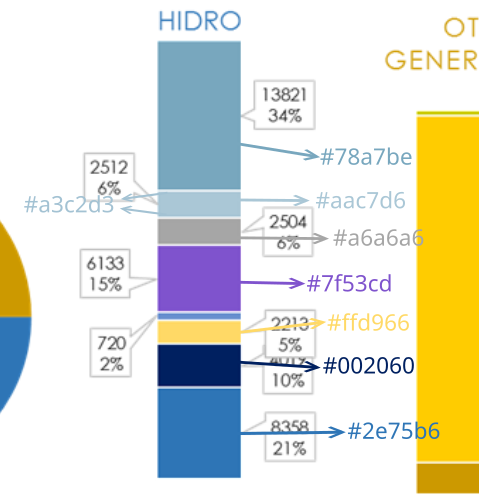

---
title: "On the extraction of information from image-based dashboards, Part 1"
date: 2024-05-07T20:23:05-0500
summary: "In this article, we explore a dashboard that provides information about Ecuador's electrical grid generation and production, in the context of current rolling blackouts. We explore different ways of extracting information from images, such as reading percentages from pie charts and stacked bar charts, and detecting the legends of charts."
toc: true
categories: ['js']
---


## Introduction

Hello again! Today we have a different post, spurred by a very fun event: [rolling blackouts](https://www.bbc.com/news/world-latin-america-68835127) in Ecuador, which are also delightfully called _rotational load shedding_. 

Here's the gist of it: last time I checked, the general consensus was that the [El Niño-Sothern Oscillation](https://en.wikipedia.org/wiki/El_Ni%C3%B1o%E2%80%93Southern_Oscillation) event is doing things to rain patterns. Said things include (but are not limited to) having no rains at all on large regions. No rains at all mean that hydroelectric generation plants don't hydroelectrically generate. And Ecuador happens to, on good times, get about 90% of its power from said hydro plants, sooo...

The result has been a few delightful weeks of chaos and darkness, as we had (that I could experience) up to _nine hours_ a day of blackouts. I seem to recall that other areas had more. Maybe ten or eleven hours. Per day.

As of publishing this, we're on a (temporary) pause of said blackouts, since there appears to be a bit more water available to do hydro things, and every tiny little thermoelectric station is being feverishly brough online. We'll see what happens later.

During the beginnings of the whole thing, when no one understood anything, there were no numbers. The only source, if at all, were whatever a government official dropped on an interview or something of the sort. And we like numbers, don't we? Things like energy generation per day, maybe split per plant. Daily energy usage, maybe over the entire day, maybe per region. Changes in said quantities over time. Stuff like that, the kind that countless people all over the world with a Raspberry Pi, a solar panel and a Grafana dashboard have built for their own internal purposes, but this time for the entire country and with official numbers.

And, as it turns out, there's no Grafana dashboards to be seen, at least that I could find. Which is sad. 

Instead, hidden deep within a page that no one seems to know, is [this dashboard](https://www.cenace.gob.ec/info-operativa/InformacionOperativa.htm):


As of writing this, some of the tabs in that dashboard still bear the logo of our _previous_ government, which has not been our government for about half a year. That's how out of sight that dashboard is.

However, it's a dashboard! It displays data! It updates every hour! That being said, it's the worst kind of dashboard to do anything with, apart from looking at it. If you'd like to, go [visit it](https://www.cenace.gob.ec/info-operativa/InformacionOperativa.htm) and experience it by yourself. Try to interact with it. 

For example, if you've used dashboards before, you may try to hover over a certain item in the bar chart and expect to have it highlighted in the legend. Or you may expect a popup with more detailed information about the item. Or to be able to zoom in to a timeseries chart by click-and-dragging a certain interval.

Well, no. Not here. The dashboard is _composed of PNG images_. That's it. Some sort of magical backend process keeps the images updated... sometimes (as I'm finishing this article, it hasn't updated in a day and a half). Some of them update every hour, some of them update every day. The page's [source code](https://www.cenace.gob.ec/info-operativa/InformacionOperativa.htm) contains some of the weirdest HTML that I've ever seen, like a bad fever dream that mixes Excel's data model and HTML:

```html
<html xmlns:v="urn:schemas-microsoft-com:vml"
xmlns:o="urn:schemas-microsoft-com:office:office"
xmlns:x="urn:schemas-microsoft-com:office:excel"
xmlns="http://www.w3.org/TR/REC-html40">

<head>
<meta name="Excel Workbook Frameset">
<meta http-equiv=Content-Type content="text/html; charset=utf-8">
<meta name=ProgId content=Excel.Sheet>
<meta name=Generator content="Microsoft Excel 15">
<link rel=File-List href="InformacionOperativa_archivos/filelist.xml">
<![if !supportTabStrip]>
<link id="shLink" href="InformacionOperativa_archivos/sheet001.htm">
<link id="shLink" href="InformacionOperativa_archivos/sheet002.htm">
<link id="shLink" href="InformacionOperativa_archivos/sheet003.htm">
<link id="shLink" href="InformacionOperativa_archivos/sheet004.htm">
<link id="shLink" href="InformacionOperativa_archivos/sheet005.htm">
<link id="shLink" href="InformacionOperativa_archivos/sheet006.htm">

<link id="shLink">

<script language="JavaScript">
// some JS-ish code here...
</script>
<![endif]><!--[if gte mso 9]><xml>
weird XML-ish code here...
</xml><![endif]-->
</head>

<frameset rows="*,39" border=0 width=0 frameborder=no framespacing=0>
 <frame src="InformacionOperativa_archivos/sheet001.htm" name="frSheet">
 <frame src="InformacionOperativa_archivos/tabstrip.htm" name="frTabs" marginwidth=0 marginheight=0>
 <noframes>
  <body>
   <p>Esta página utiliza marcos que su explorador no admite.</p>
  </body>
 </noframes>
</frameset>
</html>
```

Had you ever seen the `<frame>` element? I hadn't. Not `<iframe>`, mind you, just `<frame>`. Apparently that's a thing. Mozilla [sternly admonishes you](https://developer.mozilla.org/en-US/docs/Web/HTML/Element/frame) that "This feature is no longer recommended. Though some browsers might still support it, it may have already been removed from the relevant web standards, may be in the process of being dropped, or may only be kept for compatibility purposes. Avoid using it, and update existing code if possible".

The actual dashboard is on that `InformacionOperativa_archivos/sheet001.htm` link. And [it's not much better](view-source:https://www.cenace.gob.ec/info-operativa/InformacionOperativa_archivos/sheet001.htm):

```html
<html xmlns:v="urn:schemas-microsoft-com:vml"
xmlns:o="urn:schemas-microsoft-com:office:office"
xmlns:x="urn:schemas-microsoft-com:office:excel"
xmlns="http://www.w3.org/TR/REC-html40">

<head>
<meta http-equiv=Content-Type content="text/html; charset=utf-8">
<meta name=ProgId content=Excel.Sheet>
<meta name=Generator content="Microsoft Excel 15">
<link id=Main-File rel=Main-File href="./InformacionOperativa.htm">
<link rel=File-List href=filelist.xml>
<!--[if !mso]>
<style>
v\:* {behavior:url(#default#VML);}
o\:* {behavior:url(#default#VML);}
x\:* {behavior:url(#default#VML);}
.shape {behavior:url(#default#VML);}
</style>
<![endif]-->
<link rel=Stylesheet href=stylesheet.css>
<style>
<!--table
	{mso-displayed-decimal-separator:"\.";
	mso-displayed-thousand-separator:"\,";}
@page
	{margin:.75in .7in .75in .7in;
	mso-header-margin:.3in;
	mso-footer-margin:.3in;}
-->
</style>
<![if !supportTabStrip]><script language="JavaScript">
<!--
function fnUpdateTabs()
 {
  if (parent.window.g_iIEVer>=4) {
   if (parent.document.readyState=="complete"
    && parent.frames['frTabs'].document.readyState=="complete")
   parent.fnSetActiveSheet(0);
  else
   window.setTimeout("fnUpdateTabs();",150);
 }
}

if (window.name!="frSheet")
 window.location.replace("./InformacionOperativa.htm");
else
 fnUpdateTabs();
//-->
</script>
<![endif]>
</head>

<body link="#0563C1" vlink="#954F72" class=xl67>

<table border=0 cellpadding=0 cellspacing=0 width=1520 style='border-collapse:
 collapse;table-layout:fixed;width:1139pt'>
 <col class=xl67 width=17 style='mso-width-source:userset;mso-width-alt:621;
 width:13pt'>
 <col class=xl67 width=14 style='mso-width-source:userset;mso-width-alt:512;
 width:11pt'>
 <col class=xl67 width=16 style='mso-width-source:userset;mso-width-alt:585;
 width:12pt'>
 <col class=xl67 width=11 style='mso-width-source:userset;mso-width-alt:402;
 width:8pt'>
 <col class=xl67 width=191 style='mso-width-source:userset;mso-width-alt:6985;
 width:143pt'>
 <col class=xl67 width=103 style='mso-width-source:userset;mso-width-alt:3766;
 width:77pt'>
 <col class=xl67 width=4 style='mso-width-source:userset;mso-width-alt:146;
 width:3pt'>
 <col class=xl67 width=8 style='mso-width-source:userset;mso-width-alt:292;
 width:6pt'>
 <col class=xl67 width=15 style='mso-width-source:userset;mso-width-alt:548;
 width:11pt'>
 <col class=xl67 width=128 style='mso-width-source:userset;mso-width-alt:4681;
 width:96pt'>
 <col class=xl67 width=124 style='mso-width-source:userset;mso-width-alt:4534;
 width:93pt'>
 <col class=xl67 width=89 style='mso-width-source:userset;mso-width-alt:3254;
 width:67pt'>
 <col class=xl67 width=242 style='mso-width-source:userset;mso-width-alt:8850;
 width:182pt'>
 <col class=xl67 width=13 style='mso-width-source:userset;mso-width-alt:475;
 width:10pt'>
 <col class=xl67 width=19 style='mso-width-source:userset;mso-width-alt:694;
 width:14pt'>
 <col class=xl67 width=7 style='mso-width-source:userset;mso-width-alt:256;
 width:5pt'>
 <col class=xl67 width=95 span=5 style='mso-width-source:userset;mso-width-alt:
 3474;width:71pt'>
 <col class=xl67 width=39 style='mso-width-source:userset;mso-width-alt:1426;
 width:29pt'>
 <col class=xl67 width=5 style='mso-width-source:userset;mso-width-alt:182;
 width:4pt'>
 <tr height=5 style='mso-height-source:userset;height:3.75pt'>
  <td height=5 class=xl67 width=17 style='height:3.75pt;width:13pt'>&nbsp;</td>
  <td class=xl67 width=14 style='width:11pt'>&nbsp;</td>
  <td class=xl67 width=16 style='width:12pt'>&nbsp;</td>
  <td class=xl67 width=11 style='width:8pt'>&nbsp;</td>
  <td class=xl67 width=191 style='width:143pt'>&nbsp;</td>
  <td class=xl67 width=103 style='width:77pt'>&nbsp;</td>
  <td class=xl67 width=4 style='width:3pt'>&nbsp;</td>
  <td class=xl67 width=8 style='width:6pt'>&nbsp;</td>
  <td class=xl67 width=15 style='width:11pt'>&nbsp;</td>
  <td class=xl67 width=128 style='width:96pt'>&nbsp;</td>
  <td class=xl67 width=124 style='width:93pt'>&nbsp;</td>
  <td class=xl67 width=89 style='width:67pt'>&nbsp;</td>
  <td class=xl67 width=242 style='width:182pt'>&nbsp;</td>
  <td class=xl67 width=13 style='width:10pt'>&nbsp;</td>
  <td class=xl67 width=19 style='width:14pt'>&nbsp;</td>
  <td class=xl67 width=7 style='width:5pt'>&nbsp;</td>
  <td class=xl67 width=95 style='width:71pt'>&nbsp;</td>
  <td width=95 style='width:71pt' align=left valign=top><!--[if gte vml 1]><v:shapetype
   id="_x0000_t75" coordsize="21600,21600" o:spt="75" o:preferrelative="t"
   path="m@4@5l@4@11@9@11@9@5xe" filled="f" stroked="f">
   <v:stroke joinstyle="miter"/>
   <v:formulas>
    <v:f eqn="if lineDrawn pixelLineWidth 0"/>
    <v:f eqn="sum @0 1 0"/>
    <v:f eqn="sum 0 0 @1"/>
    <v:f eqn="prod @2 1 2"/>
    <v:f eqn="prod @3 21600 pixelWidth"/>
    <v:f eqn="prod @3 21600 pixelHeight"/>
    <v:f eqn="sum @0 0 1"/>
    <v:f eqn="prod @6 1 2"/>
    <v:f eqn="prod @7 21600 pixelWidth"/>
    <v:f eqn="sum @8 21600 0"/>
    <v:f eqn="prod @7 21600 pixelHeight"/>
    <v:f eqn="sum @10 21600 0"/>
   </v:formulas>
   <v:path o:extrusionok="f" gradientshapeok="t" o:connecttype="rect"/>
   <o:lock v:ext="edit" aspectratio="t"/>
  </v:shapetype><v:shape id="Imagen_x0020_46" o:spid="_x0000_s1054" type="#_x0000_t75"
   style='position:absolute;margin-left:49.5pt;margin-top:0;width:268.5pt;
   height:31.5pt;z-index:30;visibility:visible' o:gfxdata="UEsDBBQABgAIAAAAIQBamK3CDAEAABgCAAATAAAAW0NvbnRlbnRfVHlwZXNdLnhtbJSRwU7DMAyG
70i8Q5QralM4IITW7kDhCBMaDxAlbhvROFGcle3tSdZNgokh7Rjb3+8vyWK5tSObIJBxWPPbsuIM
UDltsK/5x/qleOCMokQtR4dQ8x0QXzbXV4v1zgOxRCPVfIjRPwpBagArqXQeMHU6F6yM6Rh64aX6
...
">
   <v:imagedata src="image001.png" o:title=""/>
   <x:ClientData ObjectType="Pict">
    <x:SizeWithCells/>
    <x:CF>Bitmap</x:CF>
    <x:AutoPict/>
   </x:ClientData>
  </v:shape><![endif]--><![if !vml]><span style='mso-ignore:vglayout;
  position:absolute;z-index:30;margin-left:66px;margin-top:0px;width:358px;
  height:42px'></span><![endif]><span
  style='mso-ignore:vglayout2'>
  <table cellpadding=0 cellspacing=0>
   <tr>
    <td height=5 class=xl67 width=95 style='height:3.75pt;width:71pt'>&nbsp;</td>
   </tr>
  </table>
  </span></td>

<!-- 6500 more lines of this same thing! --> 
</table>

</body>

</html>
```

Inside that weird HTML, there are some `` elements, that point to PNG images hosted under <https://www.cenace.gob.ec/info-operativa/InformacionOperativa_archivos/...> For example, here's one of the main elements of the first tab (the metrics that appear to the left of [this page](https://www.cenace.gob.ec/info-operativa/InformacionOperativa.htm) are on their own separate images):


Our purpose throughout this post (and the following one, or several, maybe) will be to extract usable information from that cold, impersonal, hostile PNG. In effect, we want to go _back_ to the data that existed at some point, before that data was rendered into pixels. For example, the donut chart to the left of the image above was generated from two "pure data" points: the fact that hydro sources produced 76% of the energy, and everything else generated 24%. That's it. The colors of the donut slices, their start and stop angles, the radius of the chart, everything else isn't necessary.

Similarly, for the leftmost stacked bar chart, the source data is a mapping of hydroelectric plant names to an integer number, which happens to be the count of megawatt-hours generated today (cumulative). The colors of each plant are accidental information, as are the percentages (they could be deduced again from the raw MWh numbers). Same for the bar's width and height, and any other graphical attributes.

## Donut chart: percentage of hydro-generated energy

The first panel is a [donut chart](https://www.jaspersoft.com/articles/what-is-a-donut-chart) (i.e. like a pie chart, except that the area is a circular ring as opposed to entire circle wedges) with a metric in the center. It displays the percentage of energy (actual energy in megawatt-hours, not power) generated in the current day that comes from hydroelectric plants, which are (on happy years with no droughts) the generators of easily 90% of all the country's energy. Currently they are much, _much_ lower: they have been seen to dip below 70%, and when they reach 76% everyone rejoices.

The chart and its legend are slightly left-of-center of the dashboard. The blue section is hydro generation, the golden yellow section is everything else (mostly thermoelectric plants with just _the tiniest bit_ of wind and solar, like _less than a percent_ tiny). See below:


Let's say that we want to know that percentage, which is 74% in the image above (but we know that because we are _Homo sapiens sapiens_ who can read Arabic numerals; the computer doesn't and just sees a matrix of colored pixels). Furthermore, a percentage with no decimals is imprecise. We want decimals! What if we actually read the percentage from the image? We know that angles correspond to percentages. In other words, the section that corresponds to 26% takes up slightly more than a quarter of the entire circle, per angle:


What if we somehow read the number of blue pixels (hydro-generated) and yellow pixels (other sources)?

### The Bresenham algorithm and counting pixel colors

There are several articles online that cover the Bresenham circle algorithm, but none that really clicked with me: they tend to focus on the actual code, which is fairly obscure for efficiency, and not on intuitive understanding of what exactly happens.

The Bresenham algorithm (the original one is for drawing straight lines, but there's a variation that can be used for drawing circles) is a way of rendering pure, mathematical representations into a screen that has a non-infinite resolution. For example, here's a pure, ideal line, and how it could be drawn on a screen where pixel sizes have been greatly exaggerated:


Intuitively, if we had to draw the cyan line by only using entire pixels on the grid, we'd want to paint black only "the closest pixels" to the line, or maybe the pixels that the line "goes through". The Bresenham algorithm provides a criteria of "closeness", that provides a nice enough approximation to the line, without requiring floating point calculations (good for speed), and such that no more than a single pixel on a certain axis is colored per scanline (good for line-based displays such as CRTs). For instance, for the line in the picture above, which goes down as you move right, you move one pixel right per iteration, and the algorithm determines whether to _also_ move one pixel down or to stay on the same pixel (for the specific screenshot above, there's always one move right+down followed by one move right followed by another move right+down and so on, but that varies).

The circle-based algorithm is the same, except that it starts at the top (North, circled red) and moves right until 45 degrees (what would be Northeast on a compass), moving always one pixel to the right, and sometimes (that's the point of the algorithm) also one pixel down. For example, when we're on the pixel that is circled blue, the next pixel is right and down. However, when on the pixel circled green, the next pixel is just right, without the downwards step:


That produces an eighth of the entire circle. The rest of the circle can be produced by reflections and coordinate swaps. After (or, on the original algorithm, _while_) drawing the north-to-northeast octant, we can do the following to create an entire circle:

1. Swap the X and Y coordinates, which fills the northeast-to-east octant, starting from the east and meeting the original octant in the middle
2. Negate the Y coordinate, which mirrors the image vertically and fills the south-to-east _quadrant_
3. Negate the X coordinate, which mirrors the image (again) horizontally and fills the entire west half


Here's an animation that shows the eight octants being filled at once, where only the green one is calculated:


For an interactive demo of the algorithm, see <http://0x80.pl/articles/bresenham-demo-circle.html>. Note that you can click anywhere inside the canvas to change the size of the circle. For example, here's an ideal circle and the result of using the Bresenham circle algorithm on it, which generates square pixels that approximate the shape of that ideal circle:


The actual, ideal circle is in cyan, and the pixels that should be turned on (or off, depending on your point of view) to draw that ideal circle in a real, imperfect, resolution-limited display are colored black. 

Every implementation of the Bresenham algorithm tends to end with setting pixels on some sort of display, since (of course) that's kinda the purpose of the algorithm. However, here we want it for something else: we're just interested in the pixel coordinates that the algorithm generates. Having a list of `(x, y)` coordinates, we can then sample _the original image_ on those points, retrieve the color of that pixel, and then count the colors. Since donut and pie charts represent percentages via angles, and angles are linearly related with arc length in a circle, the ratio of counts of pixel colors should be (to the precision allowed by the image's resolution) the same as the percentage that the donut chart represents.

In case that wasn't too clear, here's another image. We have the main donut chart that displays the total percentage of energy that is generated by hydro. We use the Bresenham circle algorithm to generate the set of pixels that would comprise a circle that goes more or less through the center of the donut. For each of those pixels, instead of drawing it, we sample _the original image_ and retrieve the pixel color. Except for a tiny few variations in the boundaries between colors, where some sort of anti-aliasing seems to take place, nearly all pixels are one of two colors: either blue or golden yellow. The ratio of blue to total pixels neatly coincides with the large 73% in the middle:


### Aside: sensitivity of inferred percentage to sampling radius

For a bit of fun, let's try to infer the percentage using many different "sampling circles", at different... radiuses? radii? We need to start slightly inwards from the outer edge of the donut, let's say five pixels inwards, and stop five pixels larger than the inner radius. It turns out that the actual dashboard image has a donut that is slightly less than 30 pixels wide, so we can sample between, let's say, 5 and 25 pixels:


We simply repeat the sampling procedure with circles of many different radiuses, compute the percentage of blue pixels for each different radius, and plot them all. For example, for the following dashboard:


we get the following percentages when we use different-sized circles to sample the data:


It appears that altering the radius of the circle that we use to sample the donut does not matter nearly at all. We know from the metric on the center of the donut that the real value should be around 70%, plus or minus up to 0.5% since the displayed number has no decimals. And that's exactly what we see, from slightly below 70% to a couple of tenths of a percent over it. In other words, the actual sampling radius does not matter, as long as it's roughly in the center of the donut. We'll set the offset to 15 pixels so the sampling circle lands more or less in the middle of the ring.

### Extracting a donut's chart percentage

To recap: to extract the percentage displayed by a donut chart, we can perform the following steps:

1. Use Bresenham's circle algorithm to generate the pixels that form a one-pixel-wide circle that runs along the center of the donut's ring
2. Instead of drawing those pixels somewhere, read their colors from the original image instead
3. Count the number of pixels of each color
4. Discard those colors that have only one or two pixels, since they're due to antialiasing effects at the transitions between colors
5. Compute the ratio of the largest color to the sum of the two main colors
6. That ratio matches very closely to the percentage that the donut chart represents

The code that does this, in JS, is as follows:

```js
const percentBBox = {
  x: 15, y: 111,
  width: 230, height: 230
};

function computeAndDrawPie(ctx, bbox) {
  const PADDING = 15; // This places the circle inside the donut
  const radius = bbox.width/2 - PADDING;

  // Compute the set of pixels that comprise a circle
  const circlePath = circlePixels(bbox.x+bbox.width/2, bbox.y+bbox.height/2, radius);
  const HYDRO_PIE_COLOR = "2e75b6"
  const colorsOnPie = countColorsOverPath(ctx, circlePath, [HYDRO_PIE_COLOR, "cc9900"]);
  const hydroPercent = colorsOnPie[HYDRO_PIE_COLOR] * 100 /(colorsOnPie[HYDRO_PIE_COLOR]+colorsOnPie["cc9900"]);
}

/* Slightly modified from http://0x80.pl/articles/bresenham.js
   Wojciech Muła
   4.02.2007
   public domain
*/
function circlePixels(x0, y0, r) {
  let pxs = []; 
	let d = 5 - 4*r;

	let x = 0;
	let y = r;

	let deltaA = (-2*r + 5)*4;
	let deltaB = 3*4;

	while (x <= y) {
	  pxs.push({x: x0 + x, y: y0 + y});
	  pxs.push({x: x0 - x, y: y0 + y});
	  pxs.push({x: x0 + x, y: y0 - y});
	  pxs.push({x: x0 - x, y: y0 - y});
	  pxs.push({x: x0 + y, y: y0 + x});
	  pxs.push({x: x0 - y, y: y0 + x});
	  pxs.push({x: x0 + y, y: y0 - x});
	  pxs.push({x: x0 - y, y: y0 - x});

		if (d > 0) {
			d += deltaA;
			y -= 1;
			x += 1
			deltaA += 4*4;
			deltaB += 2*2;
		}
		else {
			d += deltaB;
			x += 1;
			deltaA += 2*4;
			deltaB += 2*4;
		}
	}
	
	return pxs;
}

function countColorsOverPath(ctx, path, expectedColors, minCount=1) {
  let colorCounts = {};
  for(const px of path) {
    const pixel = ctx.getImageData(px.x, px.y, 1, 1);
    const data = pixel.data;
    const color = [...data.slice(0, 3)].map(c => ('0'+c.toString(16)).slice(-2)).join("")
    colorCounts[color] = (colorCounts[color] || 0) + 1;
  }
  if(expectedColors) { // drop unwanted colors
    for(const k in colorCounts) {
      if(!expectedColors.includes(k)) delete colorCounts[k];
    }
  }
  if(minCount > 1) { // drop too-small counts
    for(const k in colorCounts) {
      if(colorCounts[k] < minCount) delete colorCounts[k];
    }
  }
  return colorCounts;
}
```

The main function is `computeAndDrawPie`, which takes two arguments: a JS [Canvas context](https://developer.mozilla.org/en-US/docs/Web/API/Canvas_API), which is used to both draw on it and read pixel values; and also the bounding box for the donut chart. I happen to know, by inspecting the image, that the donut chart is approximately 230 pixels square, and is placed at X=15, Y=111 (bearing in mind that in the Canvas API, as in most computer graphics, the origin is the top left, X increases rightwards, and Y increases downwards):


The `computeAndDrawPie` first generates (by calling `circlePixels`) a set of pixel coordinates that would draw a circle that is centered on the donut's bounding box, and hence also centered on the donut's ring, but is 15 pixels smaller in radius (as we discussed before, this places the circle approximately in the middle of the ring). That set of 2D coordinates is then used (on `countColorsOverPath`) to index _into_ the original image, i.e. the dashboard. For each 2D coordinate, that pixel's color is extracted, and a count of all colors is kept. Only two colors (the two colors of the hydro- and non-hydro- generated energy) are kept, the others are discarded. What is returned from `countColorsOverPath` looks much like `colorsOnPie = {"2e75b6": 398, "cc9900": 170}`.

Finally, given that [the #2e75b6 count is the blue for hydro-generated energy](https://www.color-hex.com/color/2e75b6), which is what we're interested in, we compute the percentage of all pixels that are in that color. That corresponds to the percentage that is displayed inside the donut chart. Observe:


## Stacked bar charts: % of energy generated by each central

The next chart, going from left to right, is a bar chart (a couple of them, actually) that displays the percentage of energy that is produced by each hydroelectric plant. As I look right now, which is a time of weirdness and unreliable numbers (there being a severe drought an rolling blackouts in progress), there are _two_ plants that produce over half of the country's hydro power: [Coca Codo Sinclair](https://en.wikipedia.org/wiki/Coca_Codo_Sinclair_Dam) ([Spanish article](https://es.wikipedia.org/wiki/Coca_Codo_Sinclair) is much better, BTW) and [Agoyán](https://es.wikipedia.org/wiki/Central_hidroel%C3%A9ctrica_Agoy%C3%A1n). While their power output varies by hour, it's usually something like 40~45% for Coca Codo and 10~15% for Agoyán.

The next bar chart, a bit further right and in a mostly yellow palette, is a breakdown of non-hydro sources of energy: "non-conventional" (which, AFAICT, includes things like solar and wind), "quality of service" (whatever that means?) and "natural gas". I strongly suspect that, if the Quality of Service item is mapped to one generation source, it'd be liquid fuel, since I know that those are used in some plants yet they don't appear anywhere else.

Here are the locations of the two bar charts in the dashboard. Their respective legends are below them:


The bar charts are in the form of [stacked bar charts](https://developers.google.com/chart/interactive/docs/gallery/barchart#stacked-bar-charts) that always sum up to 100%. In other words, the actual heights of the bars do _not_ matter, only the relation between heights: a bar that is twice the height of another means that the value of the first one is twice that of the second one. However, that only holds true on _a single_ chart, not across them: if the next day both values are twice as high (but still keep their 2:1 ratio between them), they'll look the same as before. 

The hydro chart is always 308 pixels high, give or take a few pixels, and the chart for non-hydro power is always 271 pixels high (again, give or take a few). They're also always positioned at the same place: X=334, Y=31 for the first one (measured from the origin to the bar's top right corner); and X=519, Y=81 for the second one (same coordinate system). Their width is also fixed (59 and 66 pixels, respectively):


To read those bars, we could employ the same trick that we did for the donut chart, except on a line rather than a circle: if we place a line straight down the middle of the bars, then read pixel colors across that line, we'll get something that is close to the original data:


Thankfully, this is a lot easier than the donut: since they're vertical lines, all that we need is the X coordinate of the line and the start and stop Y coordinates. We can infer that from the bars' coordinates. Once we have them, we can do the same get-color-and-count procedure, this time ignoring colors that only appear on one pixel (which are transitions across colors rather than true colors themselves). Something that is especially bothersome is that there are thin white lines between bars, which we have to discard, and they also mess up the border pixels on the actual bars.

The code to do this is shorter, since we can reuse some code from before:

```js
const hydroBarBBox = {
  x: 334, y: 31,
  width: 59, height: 308
};

function computeAndDrawHydroBar(ctx, bbox) {
  const linePath = verticalLinePixels(Math.round(bbox.x + bbox.width/2), bbox.y, bbox.y+bbox.height);
  const colorsOnHydroBar = countColorsOverPath(ctx, linePath, null, 2);
  console.log(colorsOnHydroBar)
}

function verticalLinePixels(x, ystart, ystop) {
  return Array.from(Array(ystop + 1 - ystart).keys()).map(yoffs => ({x, y: ystart + yoffs}))
}
```

`computeAndDrawHydroBar` takes, again a Canvas context, and the bounding box for the bar chart. It generates a vertical line of pixels that runs through the bar chart's center, from top to bottom; then samples the image on those pixels and builds up a count. It discards the colors that only appear on a single pixel row, since they're not really usable and result from blending between an actual bar's color and the white line that delimits the bars. The result is something like this:

```js
colorsOnHydroBar = {
    "78a7be": 102,
    "a3c2d3": 2,
    "aac7d6": 15,
    "a6a6a6": 14,
    "7f53cd": 42,
    "ffd966": 12,
    "002060": 26,
    "2e75b6": 60
}
```

We can see that the color with the most pixels is [#78a7be](https://www.color-hex.com/color/78a7be), which happens to correspond to the color of the top bar, which is the Other option, and is indeed the entry that generated the most energy _on that specific image_. We can verify the color of the pixels of that bar by pasting the source image in GIMP and using the Color Picker tool:


Indeed, by repeatedly picking the color on each partial bar, we can verify that they all match the colors that were found by the JS code:



We can see a couple of problems: first, the script detected the color #a3c2d3, which appeared on two pixel lines. Those aren't real lines that correspond to a 2-pixel-high bar, but rather to the lines above and below the second (counting from the top) bar, as its primary color (#aac7d6) transitions into the white(ish, it's not pure white) line that delimits the different bars. Also, the fifth bar from the top, the one with the dialog bubble that says 720 - 2%, isn't even found among the script's outputs. Again, this is because it's too small, so there aren't two horizontal lines with the same color. If we zoom _very close_ to it on GIMP, we can see how the color varies across each line, so they all appear with a count of 1, and are therefore filtered out:


Apart from those... small misunderstandings, we can now extract information about the data on a stacked bar chart. We now have a map of colors to pixel counts, which can be turned into a map of colors to percentages. However, that's not enough: we need to know which color corresponds to each central.

As far as I can see, we could do that by hardcoding the mapping. For example, on all the images that I have seen (remember that the dashboard's images are rerendered every hour), Coca Codo is always #2e75b6. It's possible that the legend is also autogenerated, such that, for example, the top 7 centrals are displayed in the legend, and there's also an eight entry to catch all the others. However, the fact that the catch-all option (the one at the end) is called "OTRAS HIDRO", in Spanish, may point toward the legend being hand-made itself, which would mean that the same 7 centrals would always appear in the chart, and probably always with the same color.

However, just because it sounds fun, let's make it so the actual mapping of colors to centrals is _also_ identified from the image.

### Sliding windows, convolutions, and the art of finding patterns on images

The legend of the bar charts, which is located roughly below them, looks as follows:


It's the typical color legend that you may have seen on all sorts of statistical charts: colored squares indicate the mapping from colors to entries, and the name of each entry is besides its color. In this particular case, there are two columns of entries, each with four items. The last item in the second column is a catch-all item that groups all the rest, here, all other hydroelectric plants. In order to "read" the legend, we need to somehow locate those colored squares, read the color of each, and also read the text to the right of each square.

Let's tackle the detection of the squares first, since it's useful to have the squares identified before we go about reading text. While we could do that by identifying and hardcoding the coordinates of the center of each square (which, as far as I can tell, we could do, since those positions doesn't seem to shift at all between dashboards), we'll do something else, which is more fun. We'll scan the image for things that look like those colored squares.

Here's a (very close) closeup of part of the legend on GIMP, which shows individual pixels.


We can see that:

* The squares are 4x5, 5x4 or 5x5 pixels in size (the ones that aren't in the picture also have those sizes, by the way)
* The squares are a solid color, with no variation in the borders. This is good, since it'll be easier to identify them
* The squares are separated from their respective label by at least 2 pixels (usually three, but see the A in the Agoyán entry at the bottom of the picture: the lower left of the A has one grayish pixel that is 2 pixels away from the square)
* There's plenty of vertical space between squares, at least 14 pixels

Since we'll be looking for small(ish) patterns on an image, and we don't know where the appearances of that pattern are (well, we do, for this specific image, but run with it), we'll have to scan the entire image looking for regions that look like legend entries.

This is very similar to the operation known as [convolution](https://pyimagesearch.com/2016/07/25/convolutions-with-opencv-and-python/), which any half-decent image processing library will implement. While [the official definition](https://en.wikipedia.org/wiki/Convolution) for convolutions involves such horrifying concepts as infinite integrals, complex-valued functions and the letter τ, luckily there's a clean interpretation. In the context of image processing, convolution involves two images:

* A large one (usually), which is the image that the convolution is though as operating _on_
* A small one, usually square and of odd size (e.g. 3x3 or 5x5 pixels)

To obtain the convolution, the small image (also called the _kernel_) is "slid over" the large image, both horizontally and vertically. At every point, we grab the small piece of the large image that is covered by the kernel, we multiply the image section and the kernel, elementwise (i.e. the top right pixel of the image's section with the top right pixel of the kernel, and so on), we sum all of those elementwise products, and we place the result in the position of _the center pixel_ (by the way, that's why kernels are of odd sizes, so there's a single center pixel. If you used, say, a 4x4 window, the center would be either a 2x2 region or the 0x0 point right in the middle, neither of which are pixels).

After repeating that process over the entire source image (place window over image, multiply elements in corresponding positions, sum all, place result in center pixel), we have a new image, on which pixels contain some information that comes not just from a single pixel in the source image, but from _a neighbourhood_ of pixels (because when computing that pixel's value we summed values that came from several nearby pixels in the source image).

Convolutions are used, for example, to [implement blurring](https://www.youtube.com/watch?v=C_zFhWdM4ic), sharpening, some edge detection, and more. Their ability to look at a window, as opposed to a single point or pixel, is crucial to all of those applications. For instance, to blur an image, we essentially look at that entire window and somehow smear all those values together, e.g. by averaging them. When applied over the whole image, the result is a blur.

What we want to do here is somewhat similar to a convolution, except that, once we've laid the kernel over the large image at a certain position, we won't just multiply-and-sum everything. Instead, we'll treat the kernel (the small image) as if it were a pattern, or a set of instructions. For example, the kernel may be a 5x5 image of which the center 3x3 pixels must be the same color. We don't know which one, but they must all be the same color. The 1-pixel border must be, say, white. If the 5x5 region in the source image matches that description, we output a 1. Otherwise, we output a 0.

Once we've applied that check over the entire image, we'll have a binary image (i.e. one where all pixels are either 0's or 1's). Where there's a 1, that indicates that the original image had a 3x3 square of a single, solid color at that position, surrounded by _at least_ 1 white pixel on all sides.

In case that wasn't too clear, here's an example. Our kernel is a 2x2 image (I know, I said that kernels are of odd sizes, but the image is simpler this way). The two pixels on the left side must be green, while the top right pixel must be red and the bottom right pixel we don't care about. Our source image (a very large 4x6 image) has a couple of green patches and a red patch alongside one of the green patches:


In the center of the image above, we see the window superimposed on the image on all possible positions, from the leftmost topmost position to the rightmost bottom-most position, and everything in between. At every position, you can check for yourself whether the pattern/window/kernel matches the corresponding region of the image. In fact, it only matches on one position, circled in green.

Then, at the bottom of the image, we can see the output image (it's inverted, so black pixels are supposed to represent 1's, because I didn't want to color _all the other pixels_ and leave just that one white). We can see one active pixel, indicating that at only that point the pattern matched, and nowhere else.

Now that we've seen how pattern matching on images can be performed, we can turn back to finding legends on the generation dashboard. We want to find the colored squares that denote the colors of each entry. We can have a kernel/pattern like this:

* A 4x4 square that must be the same color
* A 1-pixel horizontal and vertical line that we don't care about (to provide tolerance for colored squares that are either 4 or 5 pixels in either width or height)
* A 1-pixel fully transparent border around the whole thing, so we only find small colored squares (if we didn't specify the transparent border, the pattern would also match the inside of large colored blocks, which we don't want)

Something like this should work for a kernel:


### Introducing: OpenCV(.js)

While we could keep going as we have done until now, using the Canvas API, now is a good time to introduce a very robust image processing library: [OpenCV](https://opencv.org/).

OpenCV was originally an Intel project, and now it's open source. It supports C++ (directly), Python and Java (via bindings), and the most important one for us, Javascript. This is done [via the OpenCV.js initiative](https://docs.opencv.org/4.x/d5/d10/tutorial_js_root.html), an officially supported way to compile OpenCV's C++ code, via LLVM, into either optimized JS or WebAssembly. It can run on browsers, on Node.JS, or on other specialized JS runtimes. It has some limitations (most notably, only a subset of the OpenCV API is translated, so it's entirely possible to find functions in the OpenCV docs that don't exist on OpenCV.js). However, when it works, it brings an extremely powerful, solid and well documented library directly to browsers, which is a really neat thing to have.

Usage of OpenCV.js is as simple as including a `<script>` tag:

```html
<script src="https://docs.opencv.org/4.x/opencv.js" type="text/javascript"></script>
```

The JS API is very similar to the C++/Python API, which is very good, since there's no dedicated JS API docs. The method names and parameters are the same. For example, to load an image from a Canvas's content:

```js
let canvas = document.getElementById("myCanvas");
let ctx = canvas.getContext('2d');
let imgData = ctx.getImageData(0, 0, canvas.width, canvas.height);

// src is now an OpenCV object
let src = cv.matFromImageData(imgData);
```

In our case, since (AFAIK) there's no special function for our brand of kind-of-convolution-but-not-really operation, we'll have to do it ourselves.

Using OpenCV APIs, the task of implementing that kind of pattern searching turns out to not be all that hard. See the code below:

```js
function searchForLegendSquares(canvas) {
  const ctx = canvas.getContext('2d');
  const imgData = ctx.getImageData(0, 0, canvas.width, canvas.height);
  const src = cv.matFromImageData(imgData);
	
  // make 3-px border so we can inspect the entire source image
  let padded = new cv.Mat();
  cv.copyMakeBorder(src, padded, 3, 3, 3, 3, cv.BORDER_DEFAULT);
	
  const colorVarMask = cv.matFromArray(7, 7, cv.CV_8UC1, [
    128, 128, 128, 128, 128, 128, 128,  
    128, 255, 255, 255, 255, 0,   128, 
    128, 255, 255, 255, 255, 0,   128, 
    128, 255, 255, 255, 255, 0,   128, 
    128, 255, 255, 255, 255, 0,   128, 
    128, 0,   0,   0,   0,   0,   128, 
    128, 128, 128, 128, 128, 128, 128,  
  ]);
  const colorPalette = {
    128: [0, 0, 0, 0], // transparent
    // since 255 isn't here, it'll be an unknown color,
    // but all the pixels with 255 must be the same color!
  };
  
  // allocate an image for the result of the matching
  let match = cv.Mat.zeros(canvas.height /* rows */, canvas.width /* cols */, cv.CV_8UC1);

  for(let i=0; i<src.rows-7; i++){
    for(let j=0; j<src.cols-7; j++) {
      // get region centered on (i, j)
      // we're reading from (i, j) to (i+7, j+7), but the padding
      // means that, on the original image, we're reading (i-3, j-3) to (i+3, j+3)
      const piece = padded.roi(new cv.Rect(j, i, 7, 7)); 
      
      // run the comparison, place 0 or 255 on destination image
      // 255 means that this region of the image matches the pattern
      match.ucharPtr(i, j)[0] = compareImages(piece, colorVarMask, colorPalette) ? 255 : 0;
    }
  }
  cv.imshow("fullOutput", match)
}

function compareImages(src, patternColorsMask, colorPalette) {
  /*
    Assumes that src, patternColorsMask have the same size
    src must be RGBA
    patternColorsMask must be single-channel u8 (0=don't care, 1...255=a certain color)
    colorPalette is a map of uint8 to [R, G, B, A]
    If an entry {X: [R, G, B, A]} appears on the palette, then 
    any pixels whose position has X on patternColorsMask
    must have color RGBA in src
    If a number in patternColorsMask doesn't have a corresponding entry in colorPalette,
    then it's treated as an unknown in an equation: all pixels with that number
    must have the same color, but which color exactly isn't specified beforehand
    Example: 
    src = [red   green], patternColorsMask = [0  1], colorPalette = {2: blue}
          [green blue ]                      [1  2]
    This function will return TRUE, since:
    * top left px is red, but we don't care since the mask has 0
    * bottom right px is blue, which matches its required value (2 in mask = blue in palette)
    * top right and bottom left pxs have the same value, which matches the 1's in the mask, 
      and green is a valid value for color 1 since it doesn't have an actual value in the palette
  */
  
  // this will hold any indices that don't appear in the palette
  // Unknown values will be frozen when their first appearance is encountered,
  // and from there on any other appearances will be compared against the first one
  let unknownColors = {}; 
  
  for(let i=0; i<src.rows; i++){
    for(let j=0; j<src.cols; j++) {
      const colorVarIndex = patternColorsMask.ucharAt(i, j)
      if(colorVarIndex != 0) {
        if(colorVarIndex in colorPalette) {
          const hardcodedColor = colorPalette[colorVarIndex];
          if(!areSame(getColorAt(src, i, j), hardcodedColor)) return false;
        }
        else if(colorVarIndex in unknownColors) { // we already know that this color var MUST be a certain color, so check this px against it
          const expectedColor = unknownColors[colorVarIndex];
          if(!areSame(getColorAt(src, i, j), expectedColor)) return false;
        } else { // this is the first pixel with an index, commit to this pixel's color for that color var
          unknownColors[colorVarIndex] = getColorAt(src, i, j)
        }
      }
    }
  }
  return true;
}

// Since JS doesn't have an elementwise array equality op, 
// we have to make it ourselves
function areSame(color1, color2) {
  return color1.length === color2.length && color1.every((element, index) => element === color2[index]);
}
```

The `searchForLegendSquares` function is the entrypoint. It receives a Canvas element, and reads its source image. It then pads it, because otherwise the sliding window wouldn't be able to go all the way to the edges of the image (since then part of the window would be "hanging off" the edge of the image, which results in the output image having a smaller size, which confuses things downstream). Padding the image means that the pattern matching can output an image with the same size as the original image.

Then, it prepares the "pattern", `colorVarMask`, a 7x7 image. This isn't your normal image, which has at least 3 channels (for the red, green and blue components), and possibly an alpha channel too, each of which are usually represented as 8-bit unsigned integers. The pattern instead has a single uint8 channel. This is the same representation that grayscale images sometimes come in, but this _isn't_ a grayscale image either. The pixel values don't represent light intensity values. Instead, they're just 8-bit numbers. They label colors. As you can see in the code, there's a ring of pixels all around the pattern, which have the label 128. Then there's a square of 4x4 pixels, nestled on the inner upper left corner of that ring, with the label 255. The remaining pixels, on the right and bottom edge of that square, are labeled 0.

The colors which those labels map to are declared in `colorPalette`. There's a single element there, a mapping from the label 128 to the fully transparent black color (not that you can see that it's black!). This means that, for a 7x7 region of the image to match the pattern, the outer ring of pixels on that region must be transparent black. No other color, not even other transparents, will satisfy the pattern.

The few pixels that have value 0 in `colorVarMask`, on the other hand, could have any value on the extracted 7x7 region, and won't ever cause the pattern to be rejected. In other words, 0 in `colorVarMask`  signals a don't-care condition for that pixel in the source image.

Finally, the 4x4 block that is tagged 255 _will_ be checked, unlike the pixels with 0. However, unlike the pixels with 128, the value that they must have in the source image _isn't_ determined beforehand. They can take any value they want, as long as they all have the same value. In other words, there must be at least a block of 4x4 pixels with a single solid color.

All of this, by the way, is implemented in the `compareImages` function, which receives a small 7x7 window to the original image (which OpenCV calls a ROI operation, short for Region of Interest), and the `colorVarMask` and `colorPalette` constants. It returns a boolean, which signals whether that small ROI fits the pattern or not, taking into account the interpretation that we've just discussed.

Then, the main function `searchForLegendSquares` simply runs over the entire source image, picking out 7x7 squares of it, and checking whether they satisfy the pattern. If they do, a 255 is placed on an output image, with the same size as the original image, on the location that corresponds to the center of the picked window. Otherwise, a 0 is placed there. In other words, if you see a white pixel on the output image, you know that the area around that pixel matched the pattern.

Applying that function to the entire source dashboard yields the following image (as with all images in this blog, you may click to zoom it, or open it on a new tab):


We can see large white regions, indicating that the pattern matched there. In particular, the entire background of the image matches the pattern.

This is as expected. Consider a large area of the background with no pixels colored, which is pure transparent black (R, G, B and A components are all 0). Recall that the pattern was:

* A ring of transparent pixels: Check, since they all are transparent
* A block of 4x4 pixels of the same color: Check, and that color is... transparent
* Two lines of pixels which we don't care about: Always check

This is why the entire background matches the pattern. We don't care about that, but it's slightly obnoxious.

However, what's more interesting is at the bottom center of the image. Here's a closeup of the original image:


and its corresponding area on the output image:


See how there's a tiny white dot on the center of each black square? They all line up with the squares of the legend items. In other words, the area around each of those white pixels, matches the pattern. In _other_ other words, there's a colored square there.

Here's an even closer closeup, showing individual pixels of the black-and-white image that was output by the pattern matching. I've marked two 7x7 regions that encircle two of the white pixels:


And here's the original image, with the same 7x7 regions marked. You can see how the 7x7 region that is centered on the white pixel happens to correctly contain the colored square on the original legend


Now that we have the centers of the legend squares identified, we need to somehow isolate them from _every other_ white pixel on the image, of which there are a lot.

Initially I intended to reuse the same code that detects patterns, which we've just used to generate this very image. It would in fact work: the pattern could be a 7x7 image such that every pixel but the center one is tagged, say, 1, and the center pixel is tagged 2. Then, the `colorPalette` would contain pure 1-channel black (i.e. `[0]`) for color index 1 and pure 1-channel white (i.e. `[255]`) for index 2. Running that through the same operation that we used for the original dashboard image would generate another binary image, except that it would only contain a white pixel where our current binary image contains a white pixel surrounded by at least three layers of black pixels, which matches only the eight locations for the legend's squares.

However, as it turns out, there's an easier and much more efficient way. Hidden deep in the [OpenCV.js tutorial about Morphological Operations](https://docs.opencv.org/4.x/d4/d76/tutorial_js_morphological_ops.html), there's a mention to a `cv.morphologyEx()` operation. This is a configurable operation, sort of the generalized version of several operators such as [erosion, dilation](https://docs.opencv.org/4.x/db/df6/tutorial_erosion_dilatation.html), [opening, closing, morphological gradient, top hat and black hat](https://docs.opencv.org/4.x/d3/dbe/tutorial_opening_closing_hats.html). In addition to all this operations, `cv.morphologyEx()` can perform one other transformation, called "Hit-and-Miss". This has [its own OpenCV tutorial](https://docs.opencv.org/4.x/db/d06/tutorial_hitOrMiss.html), though not for JS, only for C++, Python and Java.

Roughly, the hit-and-miss transform simultaneously compares regions of the input image (which must be a binary image, where all pixels are either 0 or 1) against _two_ patterns: a positive pattern, and a negative pattern. If a pixel is set to 1 on the positive pattern, then it _must_ be 1 on the input image on that position. If a pixel is 0 on the positive pattern, we don't care about it. Similarly, if a pixel is 1 on the negative pattern, then it must be 0 on the input image. Of course, if the same pixel is set to 1 on both the positive and negative patterns, then the hit-and-miss transform would never be satisfied, no matter the input image's contents, since then the same pixel would have to be set to both 0 and 1.

There's some further refinements to how the transform is computed (in terms of erosion), but the underlying operation is how we've described it. Another change is that, instead of using two patterns, a positive and a negative one, we can use a single pattern, where pixels are set to either 0, 1 or -1. If 0, we don't care about the input. If 1, that pixel must be 1 in the input. If -1, that pixel must be 0 in the input. Then there's the usual "sliding the pattern over the larger input image" game, computing the match for small pieces, and placing the output of the hit-and-miss transform (which is a boolean) on the pixel that corresponds to the center of the region that was taken out of the input image.

We can use this operation to find isolated white pixels, by using a 7x7 pattern. The center pixel is 1, which means that it should be set on the input region. All other 48 pixels are -1, which means that they must be 0. Running the hit-and-miss transform with that kernel/pattern against the binary image that we generated beforehand will only keep single white pixels surrounded by a sea of black pixels.

We can do this on the same `searchForLegendSquares()` function, after we find the image that we displayed before:

```js
function searchForLegendSquares(canvas) {
  // same code as above
  // here the `match` variable is defined
  
  // now find isolated white pixels surrounded by 3 layers of black pixels
  const SINGLE_WHITE_DETECTOR = cv.matFromArray(7, 7, cv.CV_8SC1, [
    -1, -1, -1, -1, -1, -1, -1,   
    -1, -1, -1, -1, -1, -1, -1, 
    -1, -1, -1, -1, -1, -1, -1, 
    -1, -1, -1,  1, -1, -1, -1, // Note single +1 on center!
    -1, -1, -1, -1, -1, -1, -1,   
    -1, -1, -1, -1, -1, -1, -1, 
    -1, -1, -1, -1, -1, -1, -1, 
  ]);
  let locations = cv.Mat.zeros(canvas.height /* rows */, canvas.width /* cols */, cv.CV_8UC1);
  cv.morphologyEx(match, locations, cv.MORPH_HITMISS, SINGLE_WHITE_DETECTOR);
	
  // now `locations` is defined
}
```

This applies the `cv.morphologyEx` function to the `matches` variable, which is the binary image that we displayed above, which contains the white pixels on the centers of each legend square... and also a ton of other pixels that we don't care about. The operation is set to `cv.MORPH_HITMISS`, and the kernel/structuring element/pattern is a matrix of 7x7, filled with -1s, except the center pixel which is set to 1.

Applying this operation to the binary image that we displayed above:


yields the following binary image:


Observe how now there's only _eight_ white pixels, all placed in positions where there are legend squares in the original image. We've successfully detected isolated white pixels.

For the final comparison, here's a closeup of the original image, where three 7x7 regions are selected:


then the intermediate image, with our magical pattern matching applied and the same regions selected (notice the center white pixels, but they aren't the only white pixels in the image):


and finally the result of the hit-and-miss operator:


With that data, we can just find the coordinates of every white pixel in the image (of which there are only eight), then read the original image at those coordinates, and then we have the legend's colors. This was supposed to be very easy, since OpenCV happens to have [a built-in function](https://docs.opencv.org/4.x/d2/de8/group__core__array.html#gaed7df59a3539b4cc0fe5c9c8d7586190) to do so: `cv.findNonZero()`. It should return the coordinates of every non-black pixel on a grayscale image.

Alas, it [doesn't work](https://forum.opencv.org/t/typeerror-cv-findnonzero-is-not-a-function/9126/2). It turns out that only some functions of OpenCV are exposed on OpenCV.js, and `findNonZero` isn't one of them. Therefore, we'll have to do it by hand. Thankfully, that's easy enough by just iterating over rows and columns:

```js
function searchForLegendSquares(canvas) {
  // same code as above
  // here the `locations` variable is defined
	
  const centerCoords = findNonZero(locations);
  for(const cc of centerCoords) {
    const color = src.ucharPtr(cc[1], cc[0]);
    cv.rectangle(src, new cv.Point(cc[0]-5, cc[1]-5), new cv.Point(cc[0]+5, cc[1]+5), new cv.Scalar(color[0], color[1], color[2], 255))
  }
}
```

which finds the following non-zero coordinates, with their respective colors:

```
[215, 372] => 2e75b6
[360, 372] => a6a6a6
[215, 391] => 002060
[360, 391] => aac7d6
[215, 410] => 7f53cd
[360, 410] => 6a91d0
[215, 429] => ffd966
[360, 429] => 78a7be
```

If we plot those on the original image, the one of the dashboard, we can check that they're being correctly detected:


Every legend square has been surrounded by a larger (14x14) rectangle in the same color as the center pixel of the square. Furthermore, each item now has the detected color, in hex format, printed to the left, alongside the count of pixels that were detected on that color for the bar chart. For example, we can see that the Mazar dam, the second-to-last item on the right column of the legend, has no detected pixels (it has a question mark "?" inside the parenthesis, as opposed to the pixel count of all other items). You'll recall from a previous section that one of the bar chart's sections wasn't detected at all, since it was too thin. This must be it, since all other items are present and accounted for.

## End of Part 1

Thus concludes the first post. There's much more that we may be able to do, such as:

* Using OCR (Optical Character Recognition) to read, say, the numbers or legend values
* Detecting the direction that a speech bubble's arrow points to (see the bar charts, they have speech bubbles to either side, with triangles that point to a specific section in the chart). If we can do that, we can assign absolute numbers to at least some of the hydro centrals, unlike now, when we only have percentages
* Detecting squares that have numbers inside them, so we can just read the inside of the squares so the OCR doesn't get confused by box borders (yes, for some reason it loves reading the border of a box as, say an uppercase `I` or lowercase `L`, or a pipe `|`)
* Reading a per-hour line chart by detecting corners in the line, and then taking advantage of the fact that said corners must lie on o'clock hours since that's the only point where data exists, and everything else is just linear interpolation
* Reading a horizontal bar plot by detecting the transitions between bars and using the bar's width to compute the values
* Saving all the extracted data to a database so it can be queried in a reasonable manner (no, static PNGs that are updated every hour _are not_ considered reasonable in this household)
* Exploring ways of deploying all this code so it runs _somewhere_ that doesn't get blackouts (so not on a Raspberry Pi at home)

Here's a preview of what's coming. Notice the red rectangles and the black words on top of every rectangle. Those have been obtained via OCR, and some of them are even decent! (others aren't, though):


If that sounds interesting, be sure to check out the next article when it comes out! Here's [the blog's RSS feed](/index.xml), BTW.
