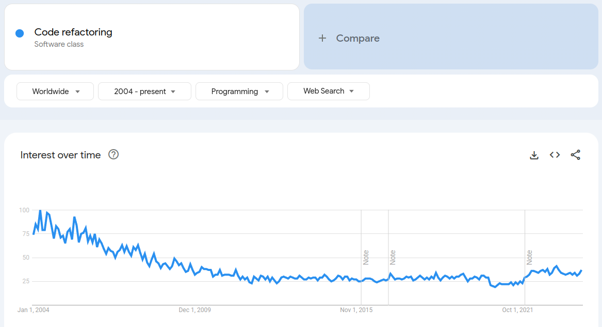
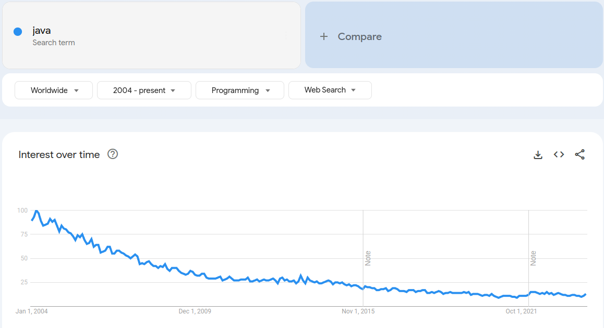
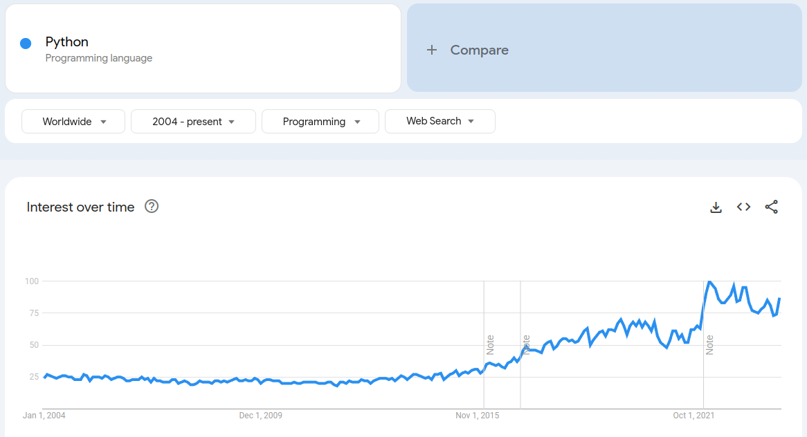
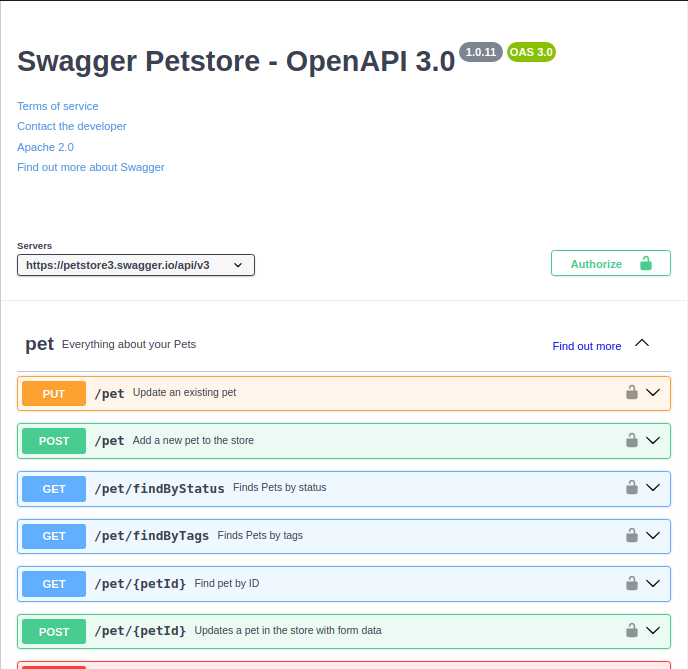

This is a bit of a different article than my usual fare. It's about a problem that I randomly got into thinking about, which has some potentially interesting applications and no clear solutions. In other words, this is just a bunch of more-or-less disjointed musings, as opposed to a clean article with a beginning, middle and end.

## Setting the stage

Everyone who studies software engineering will sooner or later find out about that Most Holy of Concepts: refactoring. Its canonical definition is "to change the appearance of code without altering its behavior". Refactoring is used to make code cleaner, without breaking it. Any decent IDE (as opposed, perhaps, to a text editor) will provide support for refactorings. It's even part of some programming practices, namely TDD, in the Red-Green-Refactor mantra (which, as far as I could tell, was first coined by [Kent Beck](https://tidyfirst.substack.com/p/canon-tdd) in the '90s). Red-Green-Refactor is a fairly... shall we say, _uncompromising_ workflow, but can be really fun if the application is amenable to it:

1. First, write a test. A unit test. "A really truly automated test, with setup & invocation & assertions". About something. Then, run the test suite. It should fail (this is the Red step), because the just-added test should make it fail
1. Then, write some application code that makes the test pass. It's usually emphasized that it doesn't matter if the code is ugly. Then, run the tests again. They should pass (Green)
1. Then, modify the application code, if possible and necessary, so it's more betterer. Many things can go here, anything from entire implementation changes, to just extracting repeated values into a constant. This is the Refactor step
1. GOTO 1

If followed faithfully, this yields:

* An application that works, by design
* where everything is covered by tests, by design
* that is probably nicely decoupled and has well-thought-out interfaces, as a side effect of being forced to implement things so that they are testable

For a nice, non-authoritative list of refactors, consider giving [https://refactoring.guru](https://refactoring.guru/refactoring/techniques) a look. It lists (currently) 66 refactorings. Some can look very trivial (e.g. [Move Method](https://refactoring.guru/move-method): "move a method into another class" or [Substitute Algorithm](https://refactoring.guru/substitute-algorithm): "just change the method's body, ya genius"). There are pairs of opposite operations: [Extract Method](https://refactoring.guru/extract-method) and [Inline Method](https://refactoring.guru/inline-method), [Extract Class](https://refactoring.guru/extract-class) and [Inline Class](https://refactoring.guru/inline-class), [Change Unidirectional Association to Bidirectional](https://refactoring.guru/change-unidirectional-association-to-bidirectional) and [Change Bidirectional Association to Unidirectional](https://refactoring.guru/change-bidirectional-association-to-unidirectional), [Parameterize Method](https://refactoring.guru/parameterize-method) and [Replace Parameter with Explicit Methods](https://refactoring.guru/replace-parameter-with-explicit-methods), [Pull Up Field](https://refactoring.guru/pull-up-field) and [Push Down Field](https://refactoring.guru/push-down-field), and more. There are refactorings with imposing names, such as the aforementioned [Change Bidirectional Association to Unidirectional](https://refactoring.guru/change-bidirectional-association-to-unidirectional) or [Replace Nested Conditional with Guard Clauses](https://refactoring.guru/replace-nested-conditional-with-guard-clauses).

IDEs provide support for a varied set of refactors, depending on the IDE. Here's a couple: [VS Code](https://code.visualstudio.com/docs/editor/refactoring#_refactoring-actions) and [the Jetbrains family](https://www.jetbrains.com/help/idea/refactoring-source-code.html). Taking a look through their list of supported refactorings shows the expected ones: Extract Method, Extract Variable, Rename Symbol, safely delete a function/class/variable, hoist fields up or push them down, flip boolean conditionals, flip if/else blocks, and more. Some of these refactors are quite closely tied to the programming language used: for example, them Java peoples will probably _love_ [Replace inheritance with delegation](https://www.jetbrains.com/help/idea/replace-inheritance-with-delegation.html#replace_inheritance_example), which makes approximately zero sense in, say, Go. 

### Aside: is refactoring a brainchild of Java?

While I have no hard data on this, the entire theory of refactoring has a decidedly Java smell to it. Examples and concepts tend to be given in Java, with a lot of emphasis placed on class-oriented patterns and transformations, which is Java's spiel. No idea why. Perhaps refactoring became popular when Java was the cool language on the block? Perhaps Java lends itself particularly well to refactoring... or perhaps it lends itself to eldritch abominations that must then be slayed by relentless refactoring? Who knows.

I've even seen design documents for a Java shop where they _explicitly_ provide a section where the software architect writes which design patterns (yes, [those Design Patterns](https://www.digitalocean.com/community/tutorials/gangs-of-four-gof-design-patterns)) and refactorings the developers will use. Before the software is even written. "Once the code is written, we'll invoke Extract Method on those unruly ~~peasants~~ methods, and then Replace Conditional with Polymorphism". Of course, an anecdote is not data. Do with that what you will.

In fact, as a bit of trivia, here's the Google Trends chart for the concept of Code refactoring, worldwide, ever since Google Trends has data (i.e. 2004). Notice that, since every chart is isolated, we can't draw any comparisons between concepts, but evolution of interest in a concept over time should be OK.



Here's the Java concept, same parameters:



Hmmm. Curious.

Just to ensure that it isn't some sort of systematic error, such as Google changing the way in which interest is measured or more people coming online and diluting the "interest" in programming concepts, here's Python:



And here's Go (the programming language, not the game), which is admittedly cheating a bit because it's a very new programming language, at least compared to Java and Python:


So, both Refactoring and Java are less interesting now that they were on 2004. This doesn't prove that they were in cahoots all along, but it's interesting nonetheless.

_Anyways_. Back to the topic at hand.

## Can data be refactored?

Everything that is commonly said about refactoring applies to _code_: machine instructions that perform actions. Not to _data_, i.e. static pieces of information[^1]. To be fair, it's much easier to refactor code than data: code can be rearranged in many ways yet still perform the same actions (consider: a set of instructions vs. a function that executes those instructions + an invocation of said function). This is what powers many refactorings: writing 3.14 usually has the same effect as declaring a constant `PI` and then using that constant elsewhere.

In contrast, data tends to _not_ have such semantics, unless explicitly added. For example, if a JSON document must have the form `{"count": 1, "id": 1}`, that is _not_ equivalent to `{"count": "CONSTANT", "id": "CONSTANT", "CONSTANT": 1}` (which could be a naïve attempt at Extracting a Constant). Whichever system receives the JSON document will just go to `count` and read its value, and the number `1` is not the same as the string `"CONSTANT"`. By constrast, in code, `print(1)` is usually the same as `const CONSTANT = 1; print(CONSTANT)`.

JSON, for example, has no concept of "references" or "pointers", which would allow a section of a document to be referenced, by name, from somewhere else. YAML does [have anchors](https://juju.is/docs/sdk/yaml-anchors-and-aliases), but they're limited in what they can express. CSVs have nothing of the sort. Neither does [TOML](https://toml.io/en/) (the M stands for Minimal, after all). Nor [the `edn` notation](https://github.com/edn-format/edn). XML is supposed to have `xs:keyref`. I'm ignoring binary-based data languages, such as Protocol Buffers, since they aren't typically edited like source code is.

Searching Google for "data refactoring" or "JSON refactoring" yields very few results, some about refactoring source code that reads or generates data (which isn't of interest here), a few libraries that can express data transformations (see, for example, [the `gulp-json-refactor` JS package](https://www.npmjs.com/package/gulp-json-refactor), which can rename, add or delete fields on a JSON document), and little more. It seems to be a fairly uncommon thing to do.

However, let's imagine for a minute that "data refactoring" was a thing. Let's imagine that we could refactor data to a similar degree that we can refactor code (whatever that means). What fun things would be possible then?

### Refactor OpenAPI specs

OpenAPI (formerly known as Swagger) is a specification that can be used to describe REST APIs. If you've done any amount of work where you integrate with third-party APIs, you've probably seen APIs that are documented using Swagger. Observe:



If that UI seems familiar, you've worked with OpenAPI specs. They're behind that neat UI, and power it. For example, a _very_ tiny snippet of that Petstore API is as follows:

```yaml
openapi: 3.0.3
info:
  title: Swagger Petstore - OpenAPI 3.0
servers:
  - url: https://petstore3.swagger.io/api/v3
paths:
  /pet:
    put:
      summary: Update an existing pet
      description: Update an existing pet by Id
      operationId: updatePet
      requestBody:
        description: Update an existent pet in the store
        content:
          application/json:
            schema:
              $ref: '#/components/schemas/Pet'
        required: true
      responses:
        '200':
          description: Successful operation
          content:
            application/json:
              schema:
                $ref: '#/components/schemas/Pet'          
        '404':
          description: Pet not found
components:
  schemas:
    Pet:
      required:
        - name
        - photoUrls
      type: object
      properties:
        id:
          type: integer
          format: int64
          example: 10
        name:
          type: string
          example: doggie
        category:
          $ref: '#/components/schemas/Category'
        photoUrls:
          type: array
          items:
            type: string
        tags:
          type: array
          xml:
            wrapped: true
          items:
            $ref: '#/components/schemas/Tag'
        status:
          type: string
          description: pet status in the store
          enum:
            - available
            - pending
            - sold
```

The `paths` field holds the actual URLs that the API exposes, each of which may have one or more methods (e.g. GET, POST, PUT or DELETE). For each URL+method combination, OpenAPI allows the writer to specify all aspects of the request and response: what must be provided to the request (either as [part of the URL](https://swagger.io/docs/specification/describing-parameters/#path-parameters), [in the querystring](https://swagger.io/docs/specification/describing-parameters/#query-parameters), [as headers](https://swagger.io/docs/specification/describing-parameters/#header-parameters), or [on the request body](https://swagger.io/docs/specification/describing-request-body/) for methods that support it), as well as [the response status code and body](https://swagger.io/docs/specification/describing-responses/), along with any possible error codes. 

OpenAPI also supports [examples](https://swagger.io/docs/specification/adding-examples/), [several authentication schemes](https://swagger.io/docs/specification/authentication/) (including [OAuth 2](https://swagger.io/docs/specification/authentication/oauth2/), which supporting tools such as the Swagger Editor automatically handle for you behind the scenes), and [multiple servers](https://swagger.io/docs/specification/api-host-and-base-path/) to support, for example, different live and staging servers or isolated US, EU and APAC instances.

More to the point of this example, take a look at the `requestBody` in the `PUT /pet` operation in the example above. In particular, notice how the JSON content (requests can have several different accepted content types, by the way) does _not_ contain a description of what a Pet looks like, but only a `$ref` (a reference) to `#/components/schemas/Pet`. That is [a JSON reference](https://datatracker.ietf.org/doc/html/draft-pbryan-zyp-json-ref-03), which is nothing more than a JSON document of the form `{"$ref": "..."}`: a single key, called `$ref`, with a string value. Furthermore, the value is supposed to be a full URL (technically a URI, but [I haven't understood the difference yet](https://www.reddit.com/r/ProgrammerHumor/comments/oa93so/ive_been_a_dev_for_15_years_and_yet/)). An URL can have a protocol (`https://`), host (`example.com:81`), path (`/schemas/petstore`) and fragment (`#something`). The Petstore JSON Reference has no protocol, host nor path, therefore it's understood to point to the same document where the reference occurs. The fragment is interpreted as [a JSON Pointer](https://datatracker.ietf.org/doc/html/draft-ietf-appsawg-json-pointer-04), a different syntax to... well, point to parts of a JSON document. It looks similar to filesystem paths in UNIXes: a set of "reference tokens", similar to folders, separated by forward slashes `/`. For example, `$ref: '#/components/schemas/Pet'` must be interpreted as a JSON Reference to the same document, using the JSON Pointer `/components/schemas/Pet`, which in turn refers to the latest part of the OpenAPI spec that this section starts with. It is here that the actual definition of a Pet lives: it's an object that has an ID, name, category (which is in turn a reference to another schema, not shown here), an array of photo URLs (which in turn are strings), an array of tags (which in turn are yet another schema), and a status (which is a string that can only take one of three values).

However, let's say that the Pet schema wasn't all nicely separated into the `/components/schemas` document, but rather embedded into the `requestBody` of the `PUT /pet` request. If this were code, it'd be plenty easy to just [extract it into a class](https://www.jetbrains.com/help/idea/extract-into-class-refactorings.html). Since this is data, it's not so easy.

This would be akin to [Extracting a Class](https://refactoring.guru/extract-class), except applied to class-like bunches of data.

### Renaming Kubernetes resources

Kubernetes employs [YAML files](https://monokle.io/learn/kubernetes-manifest-files-explained) as manifests that describe the desired state of applications. While some Kubernetes resources may happily live alone (e.g. a throwaway Pod), there are cases in which resources refer to each other.

For example, [a Secret](https://kubernetes.io/docs/concepts/configuration/secret) can be created and given a name, which lives in `meta.name` in that Secret's manifest (as it does on all resources, by the way; the `meta.name` field isn't Secret-specific). Then, a Pod can be created (either directly or via a Deployment), which uses that secret by [mounting its keys as environment variables](https://kubernetes.io/docs/tasks/inject-data-application/distribute-credentials-secure/#configure-all-key-value-pairs-in-a-secret-as-container-environment-variables). Pods can do this by using the property `spec.containers[*].envFrom.secretRef`. The only link between a Pod and a Secret is the concordance between those two strings.

So far, so good. However, what if we wanted to rename a Secret and also fix any Pods that used `envFrom.secretRef` to use it? The same could be done for `volumes` and `volumeMounts` in a Pod, or whenever Kubernetes uses names as references between resources. Taking this to the extreme, it would even be possible to rename an entire Namespace and have all other YAML manifests change their `meta.namespace` property to match. 

This would be similar to an IDE's [Rename Variable functionality](https://code.visualstudio.com/docs/editor/refactoring#_rename-symbol), except now it's applied to disjointed data fields that happen to use string equality to establish data relationships.

### Changing firewall configurations

This is the original inspiration for this post: let's say that you have a firewall (e.g. an [OPNsense](https://opnsense.org/) instance). Firewall rules (e.g. "allow traffic from X to Y on port 80") can refer to single IPs (e.g. "allow traffic from 192.168.1.1..."), multiple IPs ("allow traffic from 192.168.1.1, 192.168.1.2 and 192.168.1.3...") or [groups of addresses](https://docs.opnsense.org/manual/aliases.html) ("allow traffic from the application servers...", where "the application servers" have been defined elsewhere to be 192.168.1.1, 192.168.1.2 and 192.168.1.3). 

Furthermore, let's say that you one day notice that many policies mention the three IPs 192.168.1.1, .2 and .3 (because, being all application servers, they will always require the same set of permissions. They're supposed to be interchangeable, after all). And you know that some day there will be a new server added, 192.168.1.4, and it'll be a royal pain to edit all of them firewall rules. And even then, two will always be forgotten. Assuming that the firewall's configuration can be expressed as, say, a JSON document that can be uploaded into the firewall (which, by the way, OPNSense [seems to support](https://docs.opnsense.org/development/api/plugins/firewall.html)), it would be possible to refactor all mentions of 192.168.1.1, .2 and .3 inside policies so it became mentions to the *app servers* alias, and said alias was created inside the aliases list, containing the three IPs. This would be similar to Extracting a Constant in code.

### Refactoring code-as-data pipelines

If you don't know what [Flowpipe](https://flowpipe.io/) is, consider reading [this post](https://jreyesr.github.io/posts/flowpipe-intro/). TL;DR: it's a scripting-ish language that can express pipelines, i.e. sequences of steps. Steps can retrieve data or perform actions on external systems. Pipelines can be triggered manually, by other pipelines, on a schedule, or by receiving HTTP requests. However, despite encoding sequences of steps, Flowpipe isn't technically _code_, as HCL is a data description language more than a programming language (it has functions, though).

Let's say that you're working on a pipeline, and it's starting to get too long and unwieldy. Or perhaps some steps feel like they could benefit from being wrapped in a nice isolated package somewhere else, perhaps because they could be reused later. Flowpipe is perfectly capable of [calling pipelines from other pipelines](https://flowpipe.io/docs/flowpipe-hcl/step/pipeline), via the `pipeline` step, passing some data into the child pipeline and receiving some data back from it. The issue is to extract those steps, since it's necessary to track which data they require and which data from them is used elsewhere. This would be something like [Extract Method](https://refactoring.guru/extract-method), complete with needing to guess the new method's signature (its parameters and return value).

### Recapping the examples

We've seen several examples of data on which actions that sound like code refactorings can be performed. What I find in common between them is mostly that those refactorings operate on higher-level concepts that go above and beyond what the data language in question provides, and embodies application-specific concepts.

For example, considered by themselves, i.e. in isolation from a specific document, JSON and YAML don't have anything other than atomic/basic types (e.g. strings, numbers, booleans and the `null` value) and composite types (objects and arrays). That's it. Even though you can use JSON (and, indeed, OPNSense does so) to represent "a firewall rule", with its source/destination/port conditions and whatever else a firewall rule has, there's nothing in the JSON specification that talks about firewalls. From the point of view of a JSON-speaking system, all that exists is objects, arrays, strings and numbers. Similarly, while Kubernetes Ingresses (which represent something like reverse proxy configurations, see [the NGINX Ingress Controller](https://docs.nginx.com/nginx-ingress-controller/configuration/ingress-resources/basic-configuration/) for an example) are expressed in YAML files, nothing in the YAML spec talks about NGINX rules that match path prefixes or terminate TLS at the proxy. Any such semantics are provided by the application that uses JSON, YAML, TOML, edn, HCL or whatever other language to express its own concepts.

All those refactorings that we reviewed above operate on those higher-level concepts: request bodies on OpenAPI YAML specs, whole resources on Kubernetes YAML manifests, rules on OPNSense JSON documents, and steps on Flowpipe HCL files. Refactorings also embed application-specific knowledge. For example, the application that performs the refactors needs to _know_ that, for OpenAPI specs, writing a full object inside of a request's `content` is the same as just placing a `$ref` there and having the entire object inside the `components.schemas` YAML key: any applications that consume specs, such as the Swagger UI generator, will display it in the same way on request bodies. Or that, given the way that firewalls operate, having a set of IP addresses in a firewall rule (the source or destination IP) is the same as having said addresses in a separate group/alias/however that firewall vendor calls it, and just having that alias in the actual rule: when inspecting packets, a firewall will treat addresses that belong to aliases in the same way as directly-declared addresses. Or that, for _certain_ Kubernetes YAML resources, a certain string field is understood as the name of another resource, such as the `envFrom.secretRef` setting in a Pod's container, which refers to a Secret: the Kubernetes control loop is coded to look them up. And so on. Each time, we find that a bit of application-specific knowledge guarantees things that the data itself doesn't necessarily express.

## Why scripts are (probably) not enough

For any given refactoring, it's probably easy enough to write a quick script that can perform the required actions. It's not that difficult to read a JSON/YAML file, access a certain field, perform some computations, and write that data somewhere else. It's probably easier to use dynamic languages, e.g. JS or Python, over Go or Rust, as parsing JSON documents there is slightly more involved: compare `JSON.parse(...)` on JS versus declaring a whole `struct`, with tags, and `json.Unmarshal`ing it on Go. Once the JSON/YAML file is read, the script could perform transformations on the in-memory object, and then dump it back to the same file.

In the case of refactorings that may span multiple files (such as our example of renaming a Kubernetes resource and all references to it), the script would have to read an entire directory, probably recursively, as opposed to just a single file; then parse all files there, rewrite them, and write them back to disk.

The issue with such an approach is that it's not user friendly nor reusable, except in the case that you need the exact same transformation performed again. For instance, how would a script know which OpenAPI response body it has to extract into the `/components/schemas` field? Consider the body of the JSON request on `PUT /pet/{id}`. How would a script be passed that information? Perhaps via CLI flags? Maybe `extract-body.py --url /pet/{id} --method PUT --contenttype application/json --modelname Pet` (which would extract the body into `/components/schemas/Pet` and place a `$ref` to that new model into the request's `requestBody` field)

While that would maybe work, it's much less intuitive than code refactorings that have IDE support. Ideally, we'd want our IDE of choice to present that operation on a dropdown, such that (let's say) right-clicking a OpenAPI request body would present an option to "Extract Body", which then prompted for a model name, and performed the changes. Similarly for Kubernetes component renames, though those would be nicer if they integrated with an IDE's built-in Rename functionality (which is bound to F2 on VS Code or Shift+F6 on the Jetbrains family).

## OpenRewrite

The only project that I have been able to find that implements something like user-configurable refactors and also supports data files (as opposed to code files exclusively) is [OpenRewrite](https://github.com/openrewrite/rewrite). OpenRewrite is a tool by [Moderne](https://www.moderne.io/), which monetizes OpenRewrite by offering a SaaS product that encapsulates OpenRewrite functionality and adds things like caching, collaboration features and (because of course they would) AI-assisted analysis.

OpenRewrite is [told by travelling minstrels](https://www.moderne.io/blog/overview-of-openrewrite-and-moderne) to have been born in the depths of Netflix's engineering tools team, which (AFAICT) is supposed to help _other_ engineering teams deliver applications. Netflix's culture apparently prefers free-running teams as opposed to centrally-controlled work, which leads to difficulty enforcing things like non-usage of deprecated APIs, migrating to new versions of libraries, and such. 

> When a central team asked product teams to develop in a specific way, what they heard repeatedly was, “I do not have time to deal with this, but if you do it for me, I’ll merge.”

OpenRewrite was thus created as a tool to automatically perform code changes and open PRs to that code's owners, who then just had to review those changes and, in the best case, accept them (as opposed to having to implement the changes from scratch). OpenRewrite focuses _a lot_ on Java (you'll see tons of references to [Gradle](https://gradle.org/), [Spring Boot](https://spring.io/projects/spring-boot) and migrating to Java 17), and associated languages (namely [Kotlin](https://docs.openrewrite.org/recipes/kotlin)), but it can also handle a few programming languages to a degree: there's [five refactorings](https://docs.openrewrite.org/recipes/python) for Python, [two for SQL](https://docs.openrewrite.org/recipes/sql)... and that's mostly it for programming languages (and I even stretched the definition of "programming language" a bit to include SQL). Then there are [Github Actions](https://docs.openrewrite.org/recipes/github) refactorings, [Jenkins](https://docs.openrewrite.org/recipes/jenkins), a tiny set of [JSON](https://docs.openrewrite.org/recipes/json) changes, [some for YAML](https://docs.openrewrite.org/recipes/yaml), and some [Kubernetes](https://docs.openrewrite.org/recipes/kubernetes) operations.

The entire catalog of "recipes", as OpenRewrite calls them, [can be found on this link](https://docs.openrewrite.org/recipes).

### Usage

OpenRewrite really wants to be run as part of Java projects, using either the Gradle or Maven build tools. They're the `make` or `npm run` equivalent for Java: where on many programming languages you'd add a `rewrite` command to the Makefile or `package.json`, which would invoke OpenRewrite (if it offered such integrations) and be run as `make rewrite` or `npm run rewrite` respectively, here you [add a section to the `pom.xml` or `build.gradle` files](https://docs.openrewrite.org/running-recipes/getting-started), depending on whether the project uses Maven or Gradle. That simultaneously declares a dependency on the OpenRewrite package, and adds its commands.

Once OpenRewrite has been added as a dependency, it can be run with `mvn rewrite:run` or `gradle rewriteRun`. It's also possible to [run OpenRewrite without altering the config files](https://docs.openrewrite.org/running-recipes/running-rewrite-on-a-maven-project-without-modifying-the-build), in much the same way that [the `npx` tool](https://www.npmjs.com/package/npx) does for JS projects or `go install` can do for Go executables. Still, it assumes that either Maven or Gradle are installed, which is probably only the case if you regularly work with Java.

OpenRewrite has three main ways of using it:

* It can be provided with a list of refactorings to perform on the folder in which it's run, [through a file that must be called `rewrite.yml` plus additional configuration in the build file](https://docs.openrewrite.org/running-recipes/getting-started#step-5-run-a-recipe-with-yaml-configuration). It'll then be picked up and used. That file contains a list of settings for the used "recipes" (i.e. refactorings). For instance, [the Update Image Name recipe for Kubernetes](https://docs.openrewrite.org/recipes/kubernetes/updatecontainerimagename) needs to know the old and new image names. Those are set in the `rewrite.yml` file, while the fact that the Update Image Name recipe is to be used is either set on the Gradle/Maven file, or provided directly as a CLI flag
* Alternatively, it's possible to run a set of recipes as a one-off command, [using Maven](https://docs.openrewrite.org/running-recipes/running-rewrite-on-a-maven-project-without-modifying-the-build). This is done like so: `mvn -U org.openrewrite.maven:rewrite-maven-plugin:run -Drewrite.activeRecipes=com.org.RecipeName`. If any parameters must be passed to the action, they must be provided in the `rewrite.yml` file too
* Finally, there's [the Moderne CLI](https://docs.moderne.io/user-documentation/moderne-cli/cli-reference#mod-run), which can run a single recipe. It's [supposed to be faster](https://docs.moderne.io/user-documentation/moderne-cli/getting-started/cli-intro#differences-between-the-moderne-cli-and-the-openrewrite-build-plugins) than the above options, since it separates the parsing of the source code from the application of recipes. `mod build` parses the code and stores a processed form on disk, while `mod run` then runs a recipe on that processed data. However, that processed form is _not_ part of OpenRewrite's open source code, with the attendant problems. More on that later

What we've seen until now would have very limited utility for non-Java-or-similar-languages-such-as-Kotlin projects: the only other imperative programming language for which there are rules is Python, and even then there's only three of them. And for the bespoke data refactorings that are the matter of this article, it would probably be even worse, since many data structures are very specific to the application that uses them. The exception would be widely used data files such as Kubernetes manifests, but even then it may happen that no one has ever wanted to perform your desired transformation on a set of such files. However, what about wanting to move OPNSense IPs into an Alias? That's much less likely to have been needed by someone else.

### Custom recipes

Thus, we come to the usefulness of user-provided recipes, to express refactorings that the OpenRewrite authors didn't think about. And OpenRewrite [does indeed support custom recipes](https://docs.openrewrite.org/authoring-recipes), in three main styles:

First, there are [Declarative recipes](https://docs.openrewrite.org/authoring-recipes/types-of-recipes#declarative-recipes), which mostly pack other (pre-existing) recipes together. They're easier both to write and understand, but their expressive power is limited to what already existing recipes can do (obviously). They are used to provide "recipe packs" that are preconfigured and do more complex transformations, such as trying to automate entire Java or framework upgrades.

Then, there are [Refaster recipes](https://docs.openrewrite.org/authoring-recipes/types-of-recipes#refaster-template-recipes), which are inspired by [Google's Refaster project](https://github.com/google/Refaster), now merged into the [`error-prone` static analysis tool for Java, still by Google](https://github.com/google/error-prone). Refaster templates are Java classes, where methods contain small code snippets that must be transformed into other snippets:

```java
import com.google.errorprone.refaster.annotation.AfterTemplate;
import com.google.errorprone.refaster.annotation.AlsoNegation;
import com.google.errorprone.refaster.annotation.BeforeTemplate;
    
public class StringIsEmpty {
  @BeforeTemplate
  boolean equalsEmptyString(String string) {
    return string.equals("");
  }

  @BeforeTemplate
  boolean lengthEquals0(String string) {
    return string.length() == 0;
   

  @AfterTemplate
  @AlsoNegation
  boolean optimizedMethod(String string) {
    return string.isEmpty();
  }
}
```

Both methods that are marked with `@BeforeTemplate` will be searched for. For example, considering the first one, it'll match any `String` variables on which the `.equals("0")` method is called. Note that the name of the variable does _not_ matter, this is not regex matching. It would also match `OtherClass().method(1).getName().equals(0)`, as long as the method chain `OtherClass().method(1).getName()` returned a string. Then, it'd transform that into `<whatever_string_var_was_matched>.isEmpty()`, such as `OtherClass().method(1).getName().isEmpty()`.
	
Refaster templates are fairly intuitive to use and require no direct manipulation of syntax trees. However, their area of influence is constrained by their structure: they can only express search-and-replace operations on _expressions_ (not multi-statement constructs). This means that, for example, switching `if` statements around is not possible. Furthermore, they're a Java-only tool, by virtue of using Refaster syntax, which was and still is Java-specific.

Finally, the most complex and powerful of custom recipes are [Imperative recipes](https://docs.openrewrite.org/authoring-recipes/types-of-recipes#imperative-recipes), which are arguably the most fundamental of all, since declarative recipes eventually need to invoke imperative recipes to do the actual work. Imperative recipes are written in terms of Java classes that usually implement [the Visitor pattern](https://www.cs.wustl.edu/~cytron/cacweb/Tutorial/Visitor/) to travel over syntax trees. A visitor (and, hence, an OpenRewrite recipe) can potentially travel over entire source files, be them source code in a programming language (mostly Java and friends) or data, such as JSON, YAML, HCL and XML files. However, a visitor is probably interested in only a small subset of a file, such as only the `meta.name` field on a Kubernetes YAML manifest, or only the source and destination IP address lists on an OPNSense JSON file. A Visitor may declare the types of nodes that it's interested in, and will be called once for each node of that type on a file (for instance, once for each YAML array, or once for each _element_ in a YAML array).

There are also [Scanning Recipes](https://docs.openrewrite.org/changelog/earlier-releases/8-1-2-release#what-is-a-scanningrecipe), a subset of Imperative recipes that work in two passes (technically three, but two are required): First they scan a directory, collect information and perform no changes. Then they perform changes based on what the previous phase discovered. In theory, scanning recipes would be able to perform renames and other refactorings that require more information than what looking at a small snippet of code can provide, as they have two opportunities to gather data.

Imperative OpenRewrite recipes need to be developed on a Java development environment (complete with IDE and library dependencies), built to a JAR file like any other Java project, optionally published to a repository, and then used like built-in recipes. It's not necessary to publish a recipe to run it: it can just exist locally, as long as Java build tools (Gradle or Maven) can find it.

### Discussion

We've seen that OpenRewrite is a project, mostly aimed at Java codebases, that can perform automatic rewrites of parts of code. It has a few features that are different from IDE-based refactorings:

* Its refactorings can take arguments, such as the [Replace Runners](https://docs.openrewrite.org/recipes/github/replacerunners) recipe that alters Github Actions YAML files: it takes the name of the job to modify, and the name of the new runners that will be set on the file
* It's possible to write your own operations, called Recipes, by writing YAML files (if your desired operation can be expressed as a composition of already-existing ones) or Java code (for more flexibility and complexity)
* While it's mostly focused on source code (and Java source code, at that), it also has a respectable amount of refactorings that target _data_ formats that aren't normally used as the recipients of refactorings, such as [Github Actions](https://docs.openrewrite.org/recipes/github) files, [Kubernetes manifests](https://docs.openrewrite.org/recipes/kubernetes), [XML files](https://docs.openrewrite.org/recipes/xml), [Terraform configs](https://docs.openrewrite.org/recipes/terraform), [JSON files](https://docs.openrewrite.org/recipes/json) and [YAML files](https://docs.openrewrite.org/recipes/yaml)

However, OpenRewrite also has some limitations that may or may not be deal-breakers. Depends entirely on the desired application:

* It's quite unclear how refactorings are meant to be run by themselves, unless you pull an entire Java development environment in. Apart from adding the refactorings on the Gradle/Maven build file (which requires an actual Java project, as projects in other languages wouldn't have such files) or manually running a single recipe (which, to be fair, can actually contain other recipes), there's the [Moderne CLI](https://docs.moderne.io/user-documentation/moderne-cli/getting-started/cli-intro), which can run recipes [without depending on Maven or Gradle](https://github.com/openrewrite/rewrite-docs/issues/244#issuecomment-1806799876): `mod run /path/to/code --recipe recipeName`. However...
* The Moderne CLI is under [terms of usage](https://docs.moderne.io/administrator-documentation/licensing) that require cloud login (though code analysis is performed locally) and potentially have limited usage (if you're scanning "private repos")
* Furthermore, OpenRewrite is more of a batch tool, [in part because of its parse-the-whole-world approach](https://youtu.be/hp5G-k8L1Xo?t=1684) (which provides it much of its power, though), as opposed to a tool that performs quick changes (does your IDE take several tens of seconds to rename a variable? It probably doesn't)
* OpenRewrite is mostly, if not only, controlled from a CLI. There's no integration with IDEs. [There's an IntelliJ extension](https://docs.moderne.io/user-documentation/moderne-cli/how-to-guides/moderne-intellij-plugin), but it's not used to run refactors from the right-click menu or something to the effect. Instead, it's used to set a default recipe when developing recipes. In other words, it's for developers, not users of recipes. [This talk](https://www.youtube.com/watch?v=hp5G-k8L1Xo) showcases an IDE extension where recipes can be run via GUI, but it's very much an experiment, tightly integrated into the Spring ecosystem, and I don't think it's a standalone extension at all

## IDE integrations

If we wanted better IDE integration, such that it were possible to, let's say, open a Kubernetes manifest on an IDE, right-click on a resource's name, choose a "Rename" option, and then have every reference to that resource be renamed too, we need some sort of IDE support for that.

By far the most popular IDE, [at least as per SO's Developer Survey](https://survey.stackoverflow.co/2023/#section-most-popular-technologies-integrated-development-environment), is VS Code. Visual Studio follows, and then the JetBrains family. Both of those (I'm studiously ignoring VS here since it's Windows only) provide extension points in the form of plugins. VS Code calls them Extensions, JetBrains IDEs call them Plugins. They can provide all sorts of functionality to their host IDE, from detecting and syntax-highlighting certain files, to implementing formatting rules, adding autocompletion, providing additional UI elements, custom code fixes or actions, and more.

An option would be to write a plugin for each IDE, which would implement the requisite functions. For example, both IDES have an extension that provides support for Kubernetes (see [here](https://marketplace.visualstudio.com/items?itemName=ms-kubernetes-tools.vscode-kubernetes-tools) and [here](https://plugins.jetbrains.com/plugin/10485-kubernetes)). Neither of them appear to announce that said extensions support our renaming example (renaming both a Kubernetes resource by changing its `meta.name` and any references to it that appear on other resources).

However, both IDEs provide extension points for plugins to hook into the rename functionality (which is by default bound to F2 on VS Code and Shift+F6 on the JetBrains IDEs). VS Code extensions can do so [by declaring a `RenameProvider`](https://code.visualstudio.com/api/language-extensions/programmatic-language-features#rename-symbols), while JetBrains IDEs have [Rename Refactorings](https://plugins.jetbrains.com/docs/intellij/rename-refactoring.html) on Custom Languages. Either of these options are called by the IDE when the user tries to rename a certain symbol, and the plugin must perform whatever changes need to be made in order for _all_ references to that name to be updated. 

Other refactorings are more involved. For example, extracting a OpenAPI's request body into a standalone schema is more akin to a Refactor action in an IDE. JetBrains IDEs can [declare Intentions](https://plugins.jetbrains.com/docs/intellij/code-intentions.html#how-does-it-work), which pop up as a yellow light bulb when the cursor is placed "at the correct place". For example, if the cursor is on a `if` statement, an Intention is usually enabled to negate the statement or to swap the `then` and `else` blocks around. VS Code calls the same functionality [Code Actions](https://code.visualstudio.com/api/language-extensions/programmatic-language-features#possible-actions-on-errors-or-warnings), and it explicitly calls out "provide source code manipulation actions such as refactoring. For example, Extract Method" as a possible use of such Actions. The same approach could be taken to extract a set of steps in a Flowpipe pipeline into a sub-pipeline, in much the same way that a set of statements could be extracted into a function on any programming language.

Finally, our last running example has been extracting a set of IP addresses that appear on an OPNSense firewall's JSON config into an Alias. This could be handled similarly, assuming that an IDE extension exists that can identify a JSON file as belonging to an OPNSense firewall (since a JSON file could contain any data and there's no clear identifying extension, in much the same way that Kubernetes manifests are YAML files, but so are many other files that have nothing to do with Kubernetes).

Extensions are usually able to register interest in some specific file formats, such that (for example) a Kubernetes extension can just take control of YAML files that happen to look like Kubernetes manifest. For example, [the VS Code Kubernetes extension](https://github.com/vscode-kubernetes-tools/vscode-kubernetes-tools), which is open source, [reads the `apiVersion` and `kind` from the document](https://github.com/vscode-kubernetes-tools/vscode-kubernetes-tools/blob/7e5c5f6082112314d189a4a88dc5173a8303a5e4/src/yaml-support/yaml-schema.ts#L59-L60). If they are found and correspond to a known Kubernetes resource (such as `apiVersion=apps/v1` and `kind=Deployment`), then the extension is activated and can perform its actions. Any other YAML files aren't considered. Similar tricks could be used, employing application-specific knowledge, to identify other data files. For example, the Flowpipe refactorings could make use of the fact that Flowpipe pipeline files are HCL files, like Terraform files, but with the `.fp` extension.

A downside of going the native plugin route is that it would be necessary to have one plugin per IDE. They employ completely different architectures: VS Code extensions are written in Node.JS, while JetBrains plugins are in Java. This means that essentially nothing can be reused.

In theory, that's what [the Language Server Protocol](https://microsoft.github.io/language-server-protocol/) is supposed to solve: 

> Implementing support for features like autocomplete, goto definition, or documentation on hover for a programming language is a significant effort. Traditionally this work must be repeated for each development tool, as each provides different APIs for implementing the same features.
>
> The idea behind a Language Server is to provide the language-specific smarts inside a server that can communicate with development tooling over a protocol that enables inter-process communication.
> 
> <https://microsoft.github.io/language-server-protocol/overviews/lsp/overview/>

In short, as long as an IDE can consume LSP servers, and there exists an LSP server that provides the desired functionality, it's easy to plug them together and use the functionality of the server, such as:

* [Go to Declaration](https://microsoft.github.io/language-server-protocol/specifications/lsp/3.17/specification/#textDocument_declaration), usually triggered by Ctrl+clicking on a symbol (variable, function, class...)
* [Find References](https://microsoft.github.io/language-server-protocol/specifications/lsp/3.17/specification/#textDocument_references), which sometimes pops up a list of all references to the symbol
* [Hightlighting all references](https://microsoft.github.io/language-server-protocol/specifications/lsp/3.17/specification/#textDocument_documentHighlight) to the symbol under the cursor
* [Providing on-hover information](https://microsoft.github.io/language-server-protocol/specifications/lsp/3.17/specification/#textDocument_hover)
* [Causing values to appear after the end of each line](https://microsoft.github.io/language-server-protocol/specifications/lsp/3.17/specification/#textDocument_inlineValue), such as when debugging (all variables declared in that line appear at the end, see [an example](https://marketplace.visualstudio.com/items?itemName=TylerLeonhardt.vscode-inline-values-powershell))
* [Inlay hints](https://microsoft.github.io/language-server-protocol/specifications/lsp/3.17/specification/#textDocument_inlayHint), such as when a function is called like `func(1, 2, 3)` and the IDE adds parameter names `func(count: 1, foo: 2, bar: 3)`
* [Autocompletion proposals](https://microsoft.github.io/language-server-protocol/specifications/lsp/3.17/specification/#textDocument_completion), that are usually suggested to the user in a dropdown menu
* [Offering code actions](https://microsoft.github.io/language-server-protocol/specifications/lsp/3.17/specification/#textDocument_codeAction), that apply to the text that is currently selected or under the cursor
* [Formatting a whole document](https://microsoft.github.io/language-server-protocol/specifications/lsp/3.17/specification/#textDocument_formatting) or [a range of it](https://microsoft.github.io/language-server-protocol/specifications/lsp/3.17/specification/#textDocument_rangeFormatting)
* [Renaming a variable](https://microsoft.github.io/language-server-protocol/specifications/lsp/3.17/specification/#textDocument_rename), where the LSP server can compute and return a set of changes to be performed to any files in the current workspace
* [Indicating ranges of the file that should be edited in tandem](https://microsoft.github.io/language-server-protocol/specifications/lsp/3.17/specification/#textDocument_linkedEditingRange), used on [Linked Editing](https://ivan-lim.com/vscode-linked-editing) of HTML files, where editing the opening tag of a construct such as `<h1>...</h1>` will also edit the closing one in sync
* [Causing a message to be shown](https://microsoft.github.io/language-server-protocol/specifications/lsp/3.17/specification/#window_showMessage) to the user (this, unlike all the previous method calls, is initiated by the LSP server that sits quietly in the background, not by the IDE that consumes it)
* [Logging a message](https://microsoft.github.io/language-server-protocol/specifications/lsp/3.17/specification/#window_logMessage) somewhere
* [Causing a new document to be opened](https://microsoft.github.io/language-server-protocol/specifications/lsp/3.17/specification/#window_showDocument) on the user's UI (e.g. in a new IDE tab)
* [Creating a UI element to report the progress](https://microsoft.github.io/language-server-protocol/specifications/lsp/3.17/specification/#workDoneProgress) of a long-running operation, such as building the project, indexing source code, downloading some dependencies, scanning something, or somesuch

This means that all the smarts that concern to the actual programming language (or maybe not-so-programming language, as is the case with HTML or other declarative-er languages) is bundled with the LSP _server_, with the IDE serving as a basic client that defers any decisions to the server. For example, the IDE does no longer need to know _how_ to code-fold `if` statements, nor that C-inspired languages fold on `{...}` while Python folds on the `if:` until the indentation level matches again: it merely sends [a Folding Range Request](https://microsoft.github.io/language-server-protocol/specifications/lsp/3.17/specification/#textDocument_foldingRange) to the LSP, which should return a list of folding regions for the document (including nested regions!), which the IDE may render [as small carets or + signs](https://www.jetbrains.com/help/rider/Code_Folding.html). Similarly, the IDE needs no knowledge of what _are_ functions in the programming language of the open file: when the user leaves the mouse pointer for too long in the same place, it can [invoke the Signature Help call](https://microsoft.github.io/language-server-protocol/specifications/lsp/3.17/specification/#textDocument_signatureHelp); and if the symbol under the cursor happens to be a function (which must be determined by the LSP server), the server will return its signature (or signatures, should the programming language support function overloading).

LSP servers usually run as separate processes, which communicate with the main IDE using JSON messages over TCP sockets or stdin/stdout. This means that a) LSP servers can be written in languages that differ from that of the IDE (e.g. VS Code is written in JS/TS, but a LSP server may be written in Go or Rust or Java or something else), b) a crash of the LSP server doesn't bring down the entire IDE, and c) the same LSP can be reused by different IDEs, as long as they can talk TCP or stdin/out streams. Of course, it's not only VS Code that can call LSP servers: other editors [such as Neovim](https://neovim.io/doc/user/lsp.html) can do the same, by being configured with the TCP port to the already-running server or the executable path through which they can spawn the server as a subprocess.

On VS Code, LSP servers are integrated by writing a skeleton extension, which declares interest in certain files, typically by file extension. [See here for an example](https://symflower.com/en/company/blog/2022/lsp-in-vscode-extension/). From what I can see, the actual VS Code extension is pretty small (it mostly contains the code to spawn/connect to the LSP server, and some teardown code), and it'll transparently forward any requests that come in from the IDE to the LSP server. All the magic happens on the server proper, which could be written with the help of a framework [such as Langium](https://langium.org/), in the case of a DSL, or [the `tower-lsp` Rust package](https://github.com/ebkalderon/tower-lsp) for a more traditional, imperative server.

On paper, this is a really neat idea, with tons of potential for reusing work on both the IDE and language server sides. As it always happens, [there's the old case of ~~14~~ 15 competing standards](https://xkcd.com/927/): JetBrains IDEs, while they do offer support for LSP, [explicitly encourage](https://plugins.jetbrains.com/docs/intellij/language-server-protocol.html#supported-ides) not using it, and using their own [Custom Language Support](https://plugins.jetbrains.com/docs/intellij/custom-language-support.html) in its stead. And it only works on paid IDEs, which automatically excludes Pycharm Community, IntelliJ, and maybe a few more.

Back to our running example of refactoring data files: it should be possible to write a LSP server that understands Kubernetes manifests and, [when asked to Rename a resource](https://microsoft.github.io/language-server-protocol/specifications/lsp/3.17/specification/#textDocument_rename), not only renames it but also any references to it that are found in the workspace. Or one that can activate on Flowpipe files and can offer to [extract some steps to another pipeline](https://code.visualstudio.com/docs/editor/refactoring), and also replace the original steps with a `step "pipeline"` call to the freshly-created pipeline while taking care of inputs and outputs. Or one that activates on YAML files that look like OpenAPI specs and can offer to extract a request body to a dedicated schema, while leaving behind a reference to said schema. And so on.

## Conclusions

Time to wrap things up by trying to reduce all that we've seen in this article to a set of bullet points:

* Refactoring is the act of taking some code and rewriting it such that it performs the same function, but cleaner&trade;
* Refactoring can be done on any programming language and IDEs usually provide support for refactoring operations such as renaming variables/classes/functions (including all references to it), extracting pieces of code to functions, inlining/extracting expressions, and more
* There seems (to me) to be some kind of equivalent concept to refactoring in the realm of _data_ as opposed to _code_
* Data refactorings (for lack of a better term) may be things like:
	* Renaming a Kubernetes resource (which is expressed declaratively as a YAML file) and all references to it (e.g. renaming a Secret and all references to that secret, such as those that appear to set a Pod's environment variables)
	* Extracting a OpenAPI request/response body declaration to a separate (reusable) Schema, and leaving behind just a reference to that newly created schema
	* Taking a set of Flowpipe pipeline steps and extracting them to a separate pipeling file, while leaving in their place an invocation to that new pipeline
	* On a JSON file that represents a firewall's configuration, selecting a set of IP addresses that appear on a rule's From/To fields, extracting them to an Alias (or however that specific firewall calls a reusable set of addresses that can live outside of a particular firewall rule), and replacing them in the rule with a reference to that Alias
* For data files, it's usually a lot easier to write bespoke scripts to perform transformations than it is for code files (where it's more or less necessary to parse the actual programming language into an AST, and even then...) However, even then, the user experience is not ideal: scripts are single-purpose and the main way to run them is via the CLI
* There's a project called OpenRewrite, which is used to express and apply transformations on source code, such as [changing a method's name](https://docs.openrewrite.org/recipes/java/changemethodname) or [adding a license header to all files that don't have one](https://docs.openrewrite.org/recipes/java/addlicenseheader)
	* OpenRewrite is first and foremost a Java project, and running it outside of a Java project is... finicky
	* However, OpenRewrite also supports (some) refactorings that are applied to data files, such as [YAML files](https://docs.openrewrite.org/recipes/yaml), [JSON files](https://docs.openrewrite.org/recipes/json), [XML](https://docs.openrewrite.org/recipes/xml) files and even some [Kubernetes-specific actions](https://docs.openrewrite.org/recipes/kubernetes)
	* OpenRewrite also has support for people to [write their own actions](https://docs.openrewrite.org/authoring-recipes), all the way down to inspecting the syntax trees of the parsed files, and then modifying them to insert new constructs, delete them, swap them around, or edit their properties
	* However, OpenRewrite is still a CLI tool, and the way to apply a certain refactoring is to configure it (if necessary) on a YAML file, such as which method name will be searched for and what it will be changed to; and then to run a CLI command that runs the action. It's also reportedly somewhat slow, since it parses _everything_, which is very good for its understanding of the world, but bad for performance
* If you want to have IDE integration for refactorings (in general, and in particular for refactoring of data files such as YAML or JSON files), IDEs usually provide a facility to to so in the form of plugins/extensions. Said plugins can hook into IDE functionality such as 
	* The Rename operation (such that it is possible to rename an entity in a data file and have any references to that entity change accordingly)
	* Quick Actions (such that, when hovering the mouse cursor over a certain node in the file, the IDE will offer to transform it in some way)
	* Go to Definition (so that Ctrl+clicking on an entity will navigate to its declaration, even if it's in another file)
* Those plugins can be used to implement high-level domain-specific knowledge over files, in a way that simply treating the file as a data file (e.g. a JSON or YAML file) won't ever be able to provide. For instance, a Kubernetes-aware plugin would be able to implement an action such that, when hovering over a Pod definition (or, indeed, anything that includes a Pod, such as a [Deployment](https://kubernetes.io/docs/concepts/workloads/controllers/deployment/), [StatefulSet](https://kubernetes.io/docs/concepts/workloads/controllers/statefulset/), [DaemonSet](https://kubernetes.io/docs/concepts/workloads/controllers/daemonset/) or [CronJob](https://kubernetes.io/docs/concepts/workloads/controllers/cron-jobs/)), the IDE would offer a quick action to [add CPU and memory limits to the Pod](https://docs.openrewrite.org/recipes/kubernetes/missingcpulimits), and underline the Pod with a squiggly line otherwise
* A way to implement those plugins is as IDE-specific plugins, employing IDE-specific APIs
* Alternatively, in theory, it's possible to implement a LSP server, which runs independently from the IDE and can perform a bunch of IDE-related functions. The main value proposal of the LSP specification is to be able to reuse a language server (which could, for example, encapsulate a bunch of smarts about Kubernetes files) in different IDEs, such as VS Code, Atom ([RIP](https://github.blog/2022-06-08-sunsetting-atom/)), Vim, or online editors such as [Monaco](https://github.com/TypeFox/monaco-languageclient) or [CodeMirror](https://github.com/FurqanSoftware/codemirror-languageserver)
	* JetBrains-developed IDEs are _technically_ capable of consuming LSP servers, but only on paid versions and it's recommended against by JetBrains

[^1]: At this point, I'm legally obligated to say that, on LISP and friends, [code is data and data is code](https://www.youtube.com/watch?v=dw-y3vNDRWk). I'm unsure of how much easier doing data refactorings would be on a LISP
