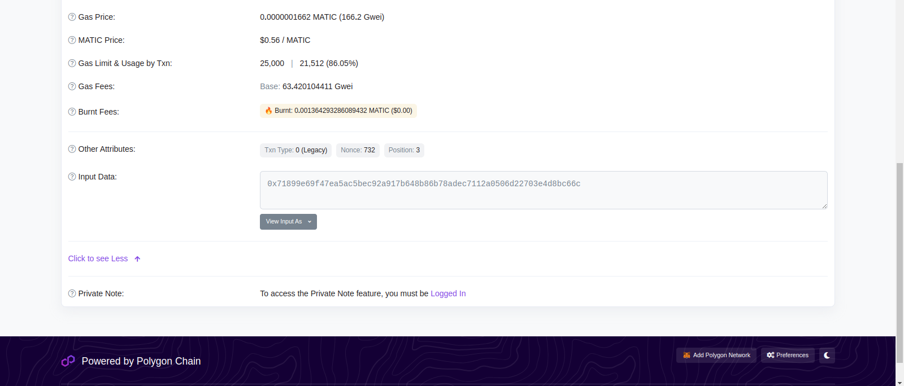

Recently, we had early presidential elections in Ecuador. I [wrote an article about the results](/posts/election-data/), too, so check its first sections if you'd like some more background.

In the run-up to the elections, we also happened to hear rumors of...

Blockchain!

Yeah. We're still on that phase, we haven't reached the "generative AI" stage yet. We'll get there, no worries.

See [here](https://www.eluniverso.com/noticias/politica/consejo-nacional-electoral-busca-nueva-tecnologia-para-la-proteccion-de-las-actas-de-escrutinio-y-la-publicacion-de-los-resultados-de-las-elecciones-del-20-de-agosto-nota/) for an example announcement. Notably, there's no official press release, announcement or blog post, at least that Google knows and that is hosted in the election authority's page (<https://cne.gob.ec>). There's only newspaper coverage of the project. Curious. Presumably they announced it on a press event? Newspapers aren't clear on that either, and they don't link to other sources.

I have also just discovered that it's not the first time that we actually use blockchain on an election. We actually used it already on February's mayor elections[^1]. See [here](https://radiocentro.com.ec/ecuador-primer-pais-en-america-latina-que-implementa-el-blockchain-en-elecciones-nacionales/), [here](https://prensa.ec/2023/02/08/la-tecnologia-de-blockchain-en-actas-electorales-se-implementa-sin-contratiempos-en-las-elecciones-de-ecuador/) and [here](https://dialoguemos.ec/2023/02/blockchain-ecuador-primer-pais-de-la-region-en-aplicar-esta-tecnologia-en-un-proceso-electoral/) (notice the dates of the articles). I didn't hear about it back then, though. From what I gather, the technology and the contractors are the same (and that's to be expected; there has been so little time to prepare since those elections that even the voter rolls were kept the same, AFAIK, so if you turned 16[^2] a month ago you didn't get to vote now). So you get the article now.

Interestingly, all three articles linked above (for the February elections) read almost like the same article. Seriously. Did they get a PR-crafted blurb and are they making it into their own articles? The wise words "said by X, CEO of Acme Corp." are the same everywhere. So is the mention to Ecuador being "a leader in the application of fourth-industrial-revolution technologies", the implementation of a blockchain-based system "strengthening Ecuador's compromise with transparency and confidence in the democratic system" and election acts "having a unique digital identity", as well as "certification, tokenization and verification of millions of data points". That certainly points to all sources taking their information from the same original source, presumably a company-provided blurb.

So, to the objective of today's post: I want to learn about that magical awesome system. You know that feeling when someone announces some sort of technological system that Will Solve A Problem, and they don't elaborate? That's what I feel now. Don't give me the definition of blockchain, I know that. Show me the algorithms, the source code, the entire specification. Let me verify the data myself using a Python script which only imports Python stdlib, if I so wish. Let me run through the cryptographic operations and convince myself that said sequence of operations guarantees no double-counting, or the inability to change the results of a station for an attacker with capabilities A, B and C, or whatever the system is supposed to protect against. Since they don't volunteer that information, we'll have to learn it by hand.

As you'll see, we aren't able to learn everything (fair warning). Very little documentation exists, so we eventually hit a brick wall. The second part of this article is a (very much not formal) exploration of alternatives that don't involve blockchains, yet (as far as I can see) provide equivalent security guarantees.

By the way, a bit of terminology first. Our election authority is called CNE, so you may see that here and there. The results of a single voting station are reported in an _election act_ (that sounds sooo bad, but there's no official translation). An act holds a count of votes per candidate, and totals for valid, blank and annulled votes. The sum of all candidate votes in an act must be equal to the valid votes. These acts are the subject of all the blockchain voodoo here: as we'll see later, they're scanned, certified, tokenized, blockchained and who-knows-what-else-ed.

## Materials: what do we have to work with?

The trigger for this investigation was [a newspaper article](https://www.eluniverso.com/noticias/politica/consejo-nacional-electoral-busca-nueva-tecnologia-para-la-proteccion-de-las-actas-de-escrutinio-y-la-publicacion-de-los-resultados-de-las-elecciones-del-20-de-agosto-nota/) breathlessly announcing that These Elections Will Have Blockchain (in all fairness, the article was completely neutral, the author merely reports the fact that these elections will have blockchain, not how that will save us. That's left for the election authority and the companies implementing the system). That's the starting point for the investigation.

Some further Googling reveals similar articles on other newspapers, as well as the fact that a similar (or maybe the same) system was in use six months ago too. Those older articles (see for example [this one](https://prensa.ec/2023/02/08/la-tecnologia-de-blockchain-en-actas-electorales-se-implementa-sin-contratiempos-en-las-elecciones-de-ecuador/)) additionally mention the names of the companies that were contracted to build the system: Eminkatech and ZEYO.

Furthermore, from those alleged-PR-blurbs-turned-articles, we [get names](https://dialoguemos.ec/2023/02/blockchain-ecuador-primer-pais-de-la-region-en-aplicar-esta-tecnologia-en-un-proceso-electoral/): Ricardo Ruano, CEO of ZEYO, and Federman Estrada, representative of Eminkatech. We also (from the same article) discover that Eminkatech is an Ecuadorian company, and ZEYO is from Chile with  presence in Ecuador.

Further Googling leads us to [a Linkedin post](https://es.linkedin.com/posts/ricardoruanoc_blockchain-en-elecciones-seccionales-de-ecuador-activity-7028011609541242880--XAX) by Ricardo R., who we can know assume with quite good certainty to be ZEYO's CEO. There, he writes (translation mine) "Dear network, I share our #blockchain project for today's Ecuador #2023elections" (yes, I translated the hashtags too!). Also, funnily enough, the picture that accompanies that post is very old (you can see the 2017 in the urns). Said Linkedin post links to [this company page](https://zeyo.io/casos-de-exito/blockchain-en-elecciones-seccionales-de-ecuador/), titled "Blockchain in Ecuador's regional elections". It's in the "Success Stories" section of their site. And now we know from where all those newspapers got their Wise Quotes from. So it provides nearly no new data, apart from this picture:


Here's a translation for you, in case you don't read Spanish:

1. **Collection** Once elections are over, votes are counted and the acts are scanned
2. **Processing** The act is sent to CNE, the data is stored by CNE and digitally signed
3. **Certero** Our system, installed at CNE, reads the acts and everything is sent to the Blockchain platform
4. **Blockchain deployment** Data are saved on a decentralized Blockchain, from where anyone can access them
5. **Verification** Once in the public Blockchain network, any user must only scan the act to verify the authenticity of its information and its traceability

Oookay, that's barely any extra information. "Digital signatures" are mentioned, so is "a public blockchain", and QR codes. Of course there are QR codes. Why wouldn't there be QR codes.

Before moving on, a brief mention to the other company, Eminkatech. The Great And Wide Internet knows essentially nothing about them. [Their website](http://www.eminkatech.com/) is a three-page static site with nearly zero information, and it isn't even completely free of its original life as a HTML template. There's no lorem ipsum text, but just barely. Instead, we get the story of Joe Moreno, a handyman with over twenty years of experience who will keep your house running smoothly throughout Scottsdale[^3]. (Scroll one screen down on the homepage for that, or search for Joe Moreno). Further [Google searches](https://www.google.com/search?q=%22My+name+is+Joe+Moreno+and+I%E2%80%99ve+been+a+handyman+for+the+last+twenty+years%22&sca_esv=562265780&filter=0&biw=1600&bih=734&dpr=1&bshm=rime/1#ip=1) uncover 103 results with precisely that text in English. Like, seriously, compare [Eminkatech's page](http://www.eminkatech.com/) with [this random page that is alive but dead](https://carmanconcrete.llc/). That's definitely some sort of HTML template, perhaps one that comes bundled with Wordpress or can be bought on [some sort of theme store](https://themeforest.net/category/wordpress/retail), but I couldn't identify the original one. As is fitting to an alive-but-dead page, Eminkatech appears no more in this story. You may now stay silent for a minute, in commemoration of its untimely demise, and then forget that they even exist. End of brief mention.

As discovered in ZEYO's infographic, there's a new name to be interested on: Certero.

## What is Certero?

Certero (which you could roughly translate as _accurate_ or _certain_, or [see here for the actual definition](https://dle.rae.es/certero)) is mentioned as the system which does the blockchain stuff. Let's now dig there. 

Also, while we didn't pay any attention to it at the moment, we've already met Certero [in our previous article about election results](/posts/election-data/#extracting-data-from-non-cooperative-web-applications). It's part of the URLs from which we extracted the time-indexed results, as we captured GET requests to `https://elecciones.cne.gob.ec/certero-cne/api/v1/total-provincias?codDignidad=11&codProvincia=0`.

Certero seems to be a system developed by ZEYO, since it appears [in their webpage](https://zeyo.io/). It has its own domain too, <https://certero.io/>. The tagline is "Generate your own certificates with maximum security and transparency using Blockchain". Sounds fun. And we still don't know how.

Also, the "Discover how we do it" button takes you to a contact form, where you submit your email and a bunch of additional data. Nope. Nope nope nope. There's close to nothing else on that page: the blog has a bunch of generic articles extolling the goodness of Digital Identity, and that's it. The actual Digital Identity page is an empty anchor and takes you nowhere. Besides, Digital Identity isn't what we're here for, that sounds more like digital ID cards (and there's also a couple of articles in the blog talking about educational certificates).

Nowhere in that page is even some sort of whitepaper explaining the actual system, much less a documentation page describing, say, a threat model. And no source code either.

So, nothing yet. Let's try again, this time through Google. `inurl:cne.gob.ec certero` shows us a CNE-owned page that is related to Certero: <https://actas.cne.gob.ec/>. That's promising:


That's Certero alright, and the page alleges to be a "Verification Portal" which you can use "to verify certificates emitted by Certero". There's a link to the CEO's mail for support (the link is incorrect, BTW, it's not a `mailto:` link), and a phone number. Below, there's a URL field for a "certificate URL" and a Verify button. You can also upload a JSON file, apparently. Entering a random URL in the field displays an error message:


Fair enough, that's not a valid credential URL. Where do you get those URLs, then? Same goes for the JSON file uploader: what kind of JSON file can I upload?

## Linking results and the validation system

Since we can't get a file to validate there, let's try again from the other side: CNE's results page.

If you visit [the results page](https://elecciones.cne.gob.ec/resultados/totales), then add filters all the way down to a single voting station (you can also see results at higher aggregation levels, but those won't work), you'll get a button to "View the act" (here's the first act of the first station of the first sector of the first province):


That opens a modal window which, in turn, has a green badge at the top which reassuringly tells you that the "Document is verified on Blockchain", and it also has a button to "View record in Blockchain". 


If you click that...


... you're taken to the Certero page, where a neat animation (here captured midway) quadruple-reassures you that everything is valid. When the nifty animation is done, you can dismiss the modal and see Certero's UI:


Fine, now we're getting somewhere. At least we can _verify_ something on the Certero page. Exactly what we're verifying remains to be seen.

## The actual verification page

By the way, [this is the link](https://actas2023.cne.gob.ec/certificates/FF4AC8DE04B87AFEE0533901A8C0613B) to that Certero page. Go visit it at your leisure. Here are the main sections:


1. A big green badge assures you that everything is OK, verified, valid, alright, no problemo
2. There's "transaction information" here. Would make sense if "transaction" is intended in the software engineering/DB sense, as "set of operations that together perform a certain action" or in the financial sense of "movement of funds from A to B", since probably every blockchain in existence intends to move (virtual) funds from A to B anyways. Without further information, we can't be sure of which meaning of "transaction" is in use there
   * Amongst that transaction information is:
   * The issue date (no time, even if you hover over the date)
   * A "document code", whatever that means, which is also present in the URL
   * The "issuer" (CNE)
   * The issuer's public key (again, whatever that means). It's `0x7d8f2A5F26D20F6C2aF2D908AA97ce03e25881Ee`. That's not clean hexadecimal, though: it has both upper and lowecase characters, which on normal hexadecimal aren't different, so there would be no reason to mix both in the same hash or whatever that blob is. [Some reading](https://github.com/ethereumbook/ethereumbook/blob/develop/04keys-addresses.asciidoc#hex-encoding-with-checksum-in-capitalization-eip-55) then provides the solution: it's most likely [Hex Encoding with Checksum in Capitalization (EIP-55)](https://github.com/Ethereum/EIPs/blob/master/EIPS/eip-55.md), an Ethereum standard that uses the upper-vs.-lowercase distinction as a way of conveying a checksum, since the hex value itself doesn't do so. This protects against (some) mistyped addresses, which result in lost funds
   * The transaction ID, here `0x3b5c166a361614346186d450f6bd83729e15ba9f7d271229000b988d1cdbd679`. This one does seem like normal hex, thankfully
3. There's a different section for "Metadata".
	* Name of the record
	* Issuer and recipient. Interestingly, the recipient is Certero. Presumably this application is intended for some sort of inter-company document transfers? That would explain the existence of a Recipient. In such a case, that would mean that the data model of Certero is being (ab)used to also work as a publicly-verifiable data store
	* Some sort of credential? (maybe what was used to submit this specific document)
	* There's the country too (not in the screenshot)
	* And, finally, there's a document hash. Here it's `QmUkz55ByYyfq4dSv1CuxK5Taf9Y2TrMi68xP4xNvFqCYw`. Note that it doesn't have the `0x` prefix, so it shouldn't be hexadecimal. Instead, it definitely looks like Base64 or one of its shorter variants, since I don't see `/`, `+` or padding with `=`. Maybe it's [Base58](https://learnmeabitcoin.com/technical/base58)? That's Bitcoin, so it hails from the same universe and there's a higher chance that it has been used
4. Here's the certified document. It's a plain, normal PDF. It's a scan of one of the (triplicated) acts that station members have to fill
5. There's a panel for "document versions". Presumably all election acts have only one version. It seems to be part of Certero's platform, so you can... I dunno, have some sort of "document version tracking"? Something like the Internet Archive?

No buttons/links of any importance are clickable in that page.

So far, we're able to select a single voting station, and open Certero's GUI for it, which displays the PDF and a few additional weird hashes. And the green badge, let's not forget the green badge. Let's say that I was manning a certain station, and presumably I have a copy of the votes that _I_ personally counted and thus know to be correct. I could go to CNE's results page, drill down to my station, then open Certero's certificate for it and verify that the scanned PDF has my actual signature and those of my colleagues, and that the numbers match what I expect. Ditto for observers sent by one of the parties, they could check the station on which they observed the counting. At least, that's how I imagine this system is _supposed_ to be used.

However, what then? Up until now, there's no blockchain there, or at least there doesn't need to be any. All of that we could check on CNE's results page (and, indeed, we can!) What's the need for the whole blockchain business? What does it protect against that CNE's UI cannot?

## The blockchain link

When you're loading Certero's page for a certain act, you first see this modal:


It loads step by step, thus ensuring Maximum Authenticity&trade;. At the bottom, there's a "View transaction link" link (repetition intended). For the particular act that we've been using here, that takes you [here](https://polygonscan.com/tx/0x3b5c166a361614346186d450f6bd83729e15ba9f7d271229000b988d1cdbd679): <https://polygonscan.com/tx/0x3b5c166a361614346186d450f6bd83729e15ba9f7d271229000b988d1cdbd679>.

Okay, now we _may_ be getting somewhere. Polygonscan is a "Polygon PoS Chain Explorer". The Chain Explorer bit I understand: it's a page where you can explore a certain blockchain. Since blockchains are public (here's your daily reminder that blockchain-based cryptocurrencies, at least those in common use, are not _anonymous_, but _pseudonymous_, and that's only if you're lucky and don't have the NSA sniffing around and performing correlation attacks or network analysis on your transactions), you can usually drill into any given transaction, wallet or whatever, and see details about it. We still need to understand the Polygon and PoS bits. If possible.

As usual when you don't know where to start, [Wikipedia](https://en.wikipedia.org/wiki/Polygon_(blockchain)) is of great help. "Polygon (formerly Matic Network) is a blockchain platform which aims to create a multi-chain blockchain system compatible with Ethereum. As with Ethereum, it uses a proof-of-stake consensus mechanism for processing transactions on-chain. Polygon's native token is named MATIC. Matic is an ERC-20 token, allowing for compatibility with other Ethereum cryptocurrencies."

in other words, something something Ethereum but not really. Presumably Bitcoin was too slow (which makes perfect sense). Ethereum may have been too slow or expensive too? (otherwise, why not use plain Ethereum instead of this weird Polygon multi-chain system). I'll admit that any further forays in the understanding of those concepts was halted by the wall of weird concepts mixed with investment advice. It's Ethereum but more betterer (as announced by the developers of Polygon)! You can develop on it! It has a 4000 million dollar market cap! It scales! You can use it for DAOs! And so on. You get the idea. If you don't, just skim [this page](https://wiki.polygon.technology/docs/supernets/get-started/what-are-supernets/).

To recap, we found out that [this](https://polygonscan.com/tx/0x3b5c166a361614346186d450f6bd83729e15ba9f7d271229000b988d1cdbd679) is supposed to be the backing transaction for that specific act (though we can't rule out that more acts are also backed by the same transaction). The link with The Blockchain. The root of trust. The last truth. ~~All hail our Lord the Doge.~~ Here's what the Polygon chain explorer has to say about that transaction:




There's also Logs, whatever those are. This transaction only has one:


A bunch of hex, that's what they are. Polygon helpfully decodes it and enlightens us: it's a `LogFeeTransfer` operation. Google has almost nothing to say about it, it appears to be related to Polygon (no surprises there) but that's it.

At this point, I stopped and proceeded to acquire some wisdom in the area of Ethereum. If you're interested in it, may I recommend [Mastering Ethereum](https://github.com/ethereumbook/ethereumbook/blob/develop/book.asciidoc)? It's a book that is surprisingly approachable without sacrificing precision. It's very good for building up the basic concepts that underpin Ethereum: addresses, transactions, contracts, value & data transactions, and more. It comes packed full of examples, which are especially useful when dealing with smart contracts.

Back to our Polygon transaction, it's a no-value (data-only) transaction, made to a contract address. Thus, it's the closest thing to a function call. Furthermore, neither the `from` nor the `to` addresses seem to be smart contracts, both look like normal wallets. So, presumably the only point of the transactions is to freeze some information into the blockchain, there doesn't appear to be any sort of smart contract shenanigans going around. A timestamping service, really, using the Polygon chain as a third-party clock provider, so you can prove the moment at which a certain file existed.

Okay, so if the transaction has no value, what's the point? On Ethereum, transactions can have an amount of Ether, or some arbitrary data, or both (or none, but that makes no sense). Your standard Ether payment carries... well, Ether. Function calls to smart contracts carry some data, and sometimes Ether too. This transaction, while it has no Ether (just the gas cost of the transaction), it does appear to have data:

```
0x71899e69f47ea5ac5bec92a917b648b86b78adec7112a0506d22703e4d8bc66c
```

(you may need to expand using the "Click to see More" link [in the transaction details page](https://polygonscan.com/tx/0x3b5c166a361614346186d450f6bd83729e15ba9f7d271229000b988d1cdbd679))

That's it. A bunch of hex. It's not text, decoding it as UTF-8 doesn't show anything readable. By extension, it's not ASCII either, since UTF-8 also encodes ASCII. Clearly it's some sort of binary string, which cannot be interpreted as a string.

Furthermore, the original input data has 66 characters. Minus the first two (`0x`), that's 64 characters. Or, in other words, 32 bytes, since a byte requires two hex digits. Or, in other words, 256 bits. SHA-256? Hmm. That's in the correct ballpark for a file hash.

Alas, that's the end. Again, if someone happens to know just what kind of magic jump happens here, feel free to drop a comment. I wasn't able to find any sort of link between the PDF and the Input Data in the Polygon transaction.

These are the hashes that I could extract from the PDF:

```
# SHA-256
0x5f61f3fd30f46edf5466f991311522756618189691fc6eb9e5b82f2c36b6f808
# SHA3
0xaaaa8f0ed76bf36e87ed394c28aab0e008d23c7f62773a2a50fdfb61e335cf78
# Keccak
0x02cc130ca2c4950544540d6e3fa88d976f0c11b401d8031f3c80a323f1cc367d
```

And, for reference, this is the data that we had on the Polygon transaction:

```
0x71899e69f47ea5ac5bec92a917b648b86b78adec7112a0506d22703e4d8bc66c
```

As you can see, none of the plausible hashes match. By the way, Keccak is "a family of cryptographic primitives", one of which is essentially only used in Ethereum and friends, and another of which has been standardized as SHA-3. Hence the two different values. I included non-standard Keccak because, since Ethereum uses it, it would be plausible that the developers of Certero tried to reuse hashing functions instead of using the normal file-hashing algorithms of the SHA families. In any case, that did nothing for us: neither SHA-3 nor Keccak match the (presumed) hash in the transaction.

And that's the end of the line. We're done here. Bye.

## Analysis and discussion

Kidding. We're not done. Now it's time to discuss things.

To recap:

* Our election authority (CNE), since a couple of elections ago, has some sort of blockchain voodoo that Ensures Election Security&trade;
* Said voodoo is provided by Certero (<https://certero.io/>)
* In [the election results page](https://elecciones.cne.gob.ec/resultados/totales), if you drill down to a single election act (i.e. a single voting station) you get a button to open the actual (scanned) results document
* which has a green "Verified in Blockchain" badge
* and also a button to view the blockchain record
* Said button takes you to Certero's web UI (see for example [here](https://actas2023.cne.gob.ec/certificates/FF4AC8DE04B87AFEE0533901A8C0613B))
* From there, you can go to [the Polygon chain explorer](https://polygonscan.com/tx/0x3b5c166a361614346186d450f6bd83729e15ba9f7d271229000b988d1cdbd679), where there is a transaction that somehow verifies that specific result for that specific voting station
* The transaction is a no-value transaction across actual wallets (no smart contracts), which has some Input Data
* Said Input Data is 32 bytes long, so it may be a hash
* However, if treating it as a hash, it doesn't math any of the expected hashes for the scanned PDF

If there's a document where the missing steps (to link the blockchain record to the PDF) are outlined, I've missed it. And so has everyone I know.

## Discussion

Since we've hit a dead-end with the actual system under exploration, it's time to recap what (little) we managed to learn, and check it against established knowledge. Let's explore what the world has to say on e-voting!

### On e-voting

A very old (1993) [paper by Michael Shamos](http://cpsr.org/prevsite/conferences/cfp93/shamos.html/) presents "The Six Commandments"[^5], which are very useful if you think you have a great idea for an electronic voting system, or know someone who does. Just test the six commandments against said great idea: if it sins against even one of them, it's not acceptable.

> I. Thou shalt keep each voter's choices an inviolable secret
> 
> II. Thou shalt allow each eligible voter to vote only once, and only for those offices for which she is authorized to cast a vote.
> 
> III. Thou shalt not permit tampering with thy voting system, nor the exchange of gold for votes.
> 
> IV. Thou shalt report all votes accurately.
> 
> V. Thy voting system shall remain operable throughout each election.
> 
> VI. Thou shalt keep an audit trail to detect sins against Commandments II-IV, but thy audit trail shall not violate Commandment I.

I quite like the commandments because they're simple and, since they're presented as an imperative, it's easier to think of attack cases.

Then, there's [ElectionGuard by Microsoft](https://www.electionguard.vote/), which is open-source code on Github. It draws on [old work by Josh Benaloh](https://www.microsoft.com/en-us/research/publication/verifiable-secret-ballot-elections/). I'll admit that the mathematics go way over my head, but open source is always good. Right? Maybe give it a go instead of rolling your own system.

A [fairly old (2006) article by Ronald Rivest](https://web.archive.org/web/20230203113756/http://people.csail.mit.edu/rivest/Rivest-TheThreeBallotVotingSystem.pdf) (yes, the R in RSA) discusses a low-tech(ish) solution involving three different ballots per person, and some cleverness that allows a voter to verify that his vote was (most likely) correctly included and counted, but doesn't allow him to prove _who_ he voted for to anyone else (this is important to prevent vote-buying, in which _someone_ pays you if you vote a certain way; and coercion, in which _that same someone_ (or a different someone) hurts you if you don't vote a certain way). This is very interesting in that it doesn't use any cryptography in the core system. 

Another, [more complex system by David Chaum](https://people.csail.mit.edu/rivest/voting/papers/Chaum-SecretBallotReceiptsTrueVoterVerifiableElections.pdf) does use cryptographic primitives, a cool two-part laminated ballot and a [one-time-pad](https://en.wikipedia.org/wiki/One-time_pad) implemented in the hardest of hardwares: two layers of transparency material have pixels that either let or don't let light through, depending on whether the two layers have the same pattern or a different pattern, thus creating the XOR operation which is at the heart of a OTP and [the reason why they are (literally) unbreakable](https://en.wikipedia.org/wiki/One-time_pad#Attempt_at_cryptanalysis) without the key.

There's a very long, detailed and quite up-to-date [report by the National Academies of Sciences, Engineering, and Medicine](https://nap.nationalacademies.org/read/25120/chapter/1) (US), written on 2018, exploring all kinds of issues related to election security. Chapter 5 in particular, "Ensuring the integrity of Elections", explores threats that pertain to electronic voting. For example, [this is what it has to say on blockchain](https://nap.nationalacademies.org/read/25120/chapter/7#103):

> Blockchains are a technology meant to achieve an unalterable, decentralized, public, append-only log of transactions, without any single authority in a position to change the log. In an election context, the “transactions” would be the casting of ballots.
>
> While the notion of using a blockchain as an immutable ballot box may seem promising, blockchain technology does little to solve the fundamental security issues of elections, and indeed, blockchains introduce additional security vulnerabilities. In particular, if malware on a voter’s device alters a vote before it ever reaches a blockchain, the immutability of the blockchain fails to provide the desired integrity, and the voter may never know of the alteration.
> 
> Blockchains are decentralized, but elections are inherently centralized. Although blockchains can be effective for decentralized applications, public elections are inherently centralized—requiring election administrators define the contents of ballots, identify the list of eligible voters, and establish the duration of voting. They are responsible for resolving balloting issues, managing vote tabulation, and announcing results. Secure voting requires that these operations be performed verifiably, not that they be performed in a decentralized manner.
> 
> While it is true that blockchains offer observability and immutability, in a centralized election scenario, observability and immutability may be achieved more simply by other means. Election officials need only, for example, post digitally signed versions of relevant election-related reports for public observation and download.
> 
> Ballots stored on a blockchain are electronic. While paper ballots are directly verifiable by voters, electronic ballots (i.e., ballots on a blockchain) can be more difficult to verify. Software is required to examine postings on blockchain. If such software is corrupted, then verifiability may be illusory. Software independence is not, therefore, achieved through posting ballots on a blockchain: as ballots are represented electronically, software independence may be more difficult to achieve.
> 
> The blockchain abstraction, once implemented, provides added points of attack for malicious actors. For example, blockchain “miners” or “stakeholders” (those who add items to the blockchain) have discretionary control over what items are added. Miners/stakeholders might collude to suppress votes from certain populations or regions. Furthermore, blockchain protocols generally yield results that are a consensus of the miners/stakeholders. This consensus may not represent the consensus of the voting public. Miners/stakeholders with sufficient power might also cause confusion and uncertainty about the state of a blockchain by raising doubts about whether a consensus has been reached.
> 
> Blockchains do not provide the anonymity often ascribed to them. In the particular context of elections, voters need to be authorized as eligible to vote and as not having cast more than one ballot in the particular election. Blockchains do not offer means for providing the necessary authorization.
> 
> Blockchains do not provide ballot secrecy. If a blockchain is used, then cast ballots must be encrypted or otherwise anonymized to prevent coercion and vote-selling. While E2E-V voting methods may provide the necessary cryptographic tools for this, ordinary blockchain methods do not.
> 
> It may be possible to employ blockchains within an election system by addressing the security issues associated with blockchains through the use of additional mechanisms (such as, for example, those provided by E2E-verifiability), but the credit for addressing such problems would lie with the additional mechanisms, not with the use of blockchains.

Ouch.

Now, admittedly all of these systems deal with fully-electronic voting (i.e. a system in which _your actual votes_ are cast in a somewhat automatic manner, and counted likewise). Our system is much more modest, only covering a secondary way of transmitting aggregated vote counts. Vote casting is still fully manual, and so is counting. Even the blockchained data is just (presumably) PDF scans of reports that were written and signed by hand and witnessed by delegates of the parties involved. This highly reduces the stakes of our blockchain system.

### On the importance of threat modeling and defining your scenarios

At some point over the course of your software-development journey, you may come across the concept of Threat Modeling. It's quite an interesting topic, and one that (as you'll see) has some relation with the election blockchain system (or rather, the lack of publicly-available threat models has).

Microsoft maintains (or maintained, at least, since AFAICT the system is not open source so I can't check its activity) a [Threat Modeling Tool](https://www.microsoft.com/en-us/securityengineering/sdl/threatmodeling). There, they define threat modeling as having five steps:

>  * Defining security requirements. 
>  * Creating an application diagram. 
>  * Identifying threats. 
>  * Mitigating threats. 
>  * Validating that threats have been mitigated. 

In general, threat modeling is treated as something to perform ideally at design-stage of a new system, much in the same way that you'd choose DB engines. This is because the uncovered threats are supposed to drive architectural decisions, so performing threat modeling after the system is already deployed is... less than ideal, shall we say. What's fun about threat modeling is that you're supposed to imagine attackers. For example, [see this CMU paper](https://resources.sei.cmu.edu/asset_files/WhitePaper/2018_019_001_524597.pdf) for a list of modeling methods. Most, if not all, of them, require you to think of threats. Some, like [Security Cards](https://securitycards.cs.washington.edu/index.html) and Persona non Grata, explicitly make you think about _attackers_ instead. Who are they? Where are they (both physically, in the world, and logically, i.e. in your infrastructure/organization)? What can they do? What do they _want_ to do? What resources do they have? Do they fear detection? Do they have money? Guns and bombs? Hitmen? Helicopters? Experienced con-men? Embarrasing emails from your sysadmin or CEO? The police on their side? Lots of volunteers to throw at you? Big computers? Time? Newspapers' goodwill? 4chan? An old, supposed-to-have-been-destroyed hard drive? Do they know where you live? Do they have insider information? Can they cause change in the world that can affect you?

Threat modeling is key to making informational statements about security mitigations, as opposed to [zero-entropy-reduction](https://en.wikipedia.org/wiki/Information_content) statements such as "product X makes our application more secure!". After threat modeling, you can instead assert that some technical/procedural measure, product or feature eliminates the risk of an attacker with up to X resources being able to exploit Y to achieve Z, assuming that W holds at all times. Furthermore, and what's arguably just as important, you know that if an attacker has X+1 resources, your new shiny feature does nothing. Also, that it adds a new attack vector, which can be exploited by its own new set of attackers. As they say, knowledge is power.

Here is where I insert a suggestion to consider doing some threat modeling when you're designing a new system. It could be quite informative. Worst case, you lose a few days, and then you throw away the threat model and continue as usual.

I bring threat modeling up because that was sorely missing from the press release and associated newspaper articles that covered our election blockchain system. Here's my own translation of some snippets from the original press release:

> Blockchain technology will be a part of the traceability and certification process of election acts, bringing a unique digital identity, thus guaranteeing greater transparency and security [...]
> 
> "The implementation of blockchain in the voting process strengthens Ecuador's compromise with transparency and trust in the democratic system [...]"

And I promise those are the most technically-oriented bits of it. There isn't a mention of what we above called X, Y, Z and W, and so on: what's this "greater security"? What attack could be performed before that now can't? How does this increase the necessary resources? Or the risk of discovery while carrying on the attack? What classes of attacks now require the entire power of a nation-state to perform? Or over 50% of Ecuador's population to agree to not review something?

Ditto for the transparency claims. We can assume that transparency has something to to with me being able to check something by myself, instead of some authority going "just trust me bro", for example. What couldn't I check that I now can? Or what could before be changed before, without me noticing, that now can't? What silent evil deeds are now loud and noisy? How do I run my new personal verifications? What do I have to trust instead? Or can I just download some Python packages (or, even better, the stdlib) and run whatever verifications? Do I instead have to trust some international entity that has no reason to collude with an attacker?

Who even _is_ an attacker? Is it the government changing votes to make its preferred candidate win[^7]? Is it one of the candidates? Is it one of the candidates _in collusion with_ the government? Is it some specific government official without wide-reaching agreement to fudge the results? Is it a single Ecuadorian citizen who wants someone to win? Maybe a large group of our people? Is it a lone international hacker? Is it a conglomerate of hackers? Is it a candidate with assistance of hackers? Is it a neighboring country? One of the big nation states? A candidate with international help? Is it random system failures? Is it aliens?

You get the idea. 

Sure, a press release is maybe not the place to provide a fully-detailed threat model, but that should be _somewhere_. And somewhere public and publicized, ideally. This is because elections have a trust component that is maybe as important as the technical aspect of counting votes correctly: people have to trust that the votes were counted correctly. So the public release of any security studies would be most welcome, as it would provide users with more reasons to trust the system.

Besides, security measures aren't supposed to depend on secrecy to work. This is [Kerckhoffs's principle](https://en.wikipedia.org/wiki/Kerckhoffs%27s_principle), originally stated as "It [the system] should not require secrecy, and it should not be a problem if it falls into enemy hands". [Per Claude Shannon](https://archive.org/details/bstj28-4-656/page/n5/mode/2up?view=theater), "we shall assume that the enemy knows the system being used." In other words, if the security of your system depends on the adversary not knowing about _that_ unsecured API endpoint, it's not secure. It doesn't matter that the endpoint is called `/api/please-dont-call-me/2faec3d3-427b-4895-b186-d6c7fa98c14d`, and that it has to be called twice in less than a second, then a pause of between two and three seconds, and then called again, at midnight in a full moon (otherwise it doesn't work and it returns 404). "They'll never guess _that_!" isn't a valid mitigation. 

Thus, taking that at its most extreme form, threat models shouldn't compromise the security of your system (you don't have unmitigated vulnerabilities in that threat model report, right?). Open source (think the Linux kernel) takes that to its logical conclusion: any and all vulnerabilities are there for everyone to find, test and then (depending on their disposition) report or abuse. For threat reports, all they should reveal is layers upon layers of hardened systems, all of which require (say) TLS certificates to work, the private keys of which are held in a hardware secure enclave which lives in the deepest darkest basement of CNE's offices in Quito, guarded by ferocious hellhounds that never sleep (programmer hellhounds, maybe?) and _really_ hate them fleshy humans (OK, they're _definitely_ programmers. They live in the dark, too!). Or something to the effect. Maybe that discourages hackers? Nobody wants to be eaten by ferocious programmer hellhounds. Because they program in Haskhell.

So, if you're developing a system that makes claims of security and solves non-trivial problems, consider a) making and b) releasing a threat model. It _shouldn't_ hurt your security (if it does, something wasn't quite right to begin with) and it may gain you some goodwill with grumpy developers that don't quite trust you. And you get to claim openness too! That should count for something, right?

### Reviewing our blockchain system

Absent a threat model, all we can do is assume things. So let's start assuming away, and see what comes out.

We've seen claims of security and transparency. Maybe "security" is being used as the catch-all term, and transparency is the specific security property that is being enhanced. We've also seen mentions of "traceability", which makes sense: all a blockchain can really do (at least when used as it is here, AFAICS) is to persist records and make it very cumbersome to change them later. That's it. It doesn't prevent rogue records from getting into the blockchain, nor does it guarantee that whatever is _in_ the blockchain is legitimate. It certainly does not automatically count votes for you and declare a winner. It isn't even inherently safe from hackers: once a record is in the blockchain, changing it is quite hard as long as the blockchain itself doesn't have some sort of catastrophic bug and you're using a blockchain which enough selfish people are using that you'd need an unrealistic amount of very expensive hardware to replace or delete said record. It doesn't prevent the pesky attacker from inserting his own records, messing with whatever system pushes data to the blockchain, or just plain prevent it from reaching the blockchain so no records appear at all.

Besides, transparency is only as useful as far as it is actually exercised. That means that Random User A needs a way to pick a record, see it in the blockchain, and somehow verify that whatever is in the blockchain is the same thing that they're looking at. This is the step that we got stuck on before, so absent more instructions on how to verify a given election act we're left with "just trust me bro"-ing Certero's UI instead of the CNE results page. Which isn't really an improvement, given that Certero's services are presumably paid for by CNE so you could be justified in treating them for the purposes of independent opinions as a not-really-independent opinion.

Again, I want to reiterate that the paragraph above hinges on the absence of correspondence between what was in the Polygon transaction's input data and any commonly (and not so commonly) used hash algorithms when run on the scanned act's PDF. If there is a link between those two binary strings (which I assume there is... somewhere), then the system as implemented _does_ provide another, independent way of verifying that election acts haven't been changed. With some caveats.

### Caveats

Let's assume an attack scenario, which seems to jive with the whole transparency purpose of the system: "the government wants to alter some results so candidate A wins"[^8].

Previously, doing so would go as follows:

1. Government sees that A isn't really winning
1. Government finds some acts where A is losing badly (these provides the best bang-for-your-buck in terms of vote gains per act messed with), and which have already been counted and entered in the results
1. Government makes entirely new result acts (which they can do since they printed the official ones to begin with), and fills them with results that are more favorable to A
1. Maybe, for extra assurance, they copy the signatures of the people who counted the original votes
1. Government patches that act's results in the DB
1. On the next 5-minute-cutoff report, the new results are replaced
1. From now on, A has more votes than before, and anyone visiting the results page would see a different PDF

Note that doing so would still entail a risk of discovery. People from the parties involved can oversee the vote counts and then request a copy of the act. These copies come directly from the actual acts (courtesy of [carbonless copy papers](https://en.wikipedia.org/wiki/Carbonless_copy_paper), actually), and presumably every party that has a candidate will be running its own counts. There's a risk of detection there. I can't recall any such incidents happening in recent elections. However, if the act isn't checked by someone with an interest in raising a fuss, the modification _may_ pass undetected.

Now, with a blockchain-based system, the modification would go as follows:

1. Government sees that A isn't really winning
1. Government finds some acts where A is losing badly (these provides the best bang-for-your-buck in terms of vote gains per act messed with), and which have already been counted and entered in the results
1. Government makes entirely new result acts (which they can do since they printed the official ones to begin with), and fills them with results that are more favorable to A
1. Government patches that act's results in the DB
1. Government uploads the hash of the new PDF to the blockchain
3. On the next 5-minute-cutoff report, the new results are replaced
4. From now on, A has more votes than before, and anyone visiting the results page would see a different PDF and a link to a new blockchain transaction

Uh oh. There's a small problem there. If all you provide are links to isolated transactions in the blockchain, there's nothing stopping you from just creating a new transaction and replacing it. Unless someone saved the ID of the old transaction, it'll just be lost in the sea of transactions. This is somewhat reminiscent of [someone "predicting" results on 2014's World Cup](https://www.sportskeeda.com/football/twitter-user-predicts-exact-results-day-before-world-cup)... by making tons of Twitter accounts, each of which tweeted a certain sequence of events, and then deleting all but the one that actually had correct information. Here, you could just upload many versions of a file to the blockchain, and just keep and present the ID of the one that furthers your interests.

In theory, a blockchain can prevent such tampering by linking every result to the previous one, so you can only append new data, not change old data. If you also required that every voting station only had a single act at the end, now you can't change results: once they're committed, you can't change them (since that invalidates the entire blockchain from that point onwards, which observers may notice) and you can't add new versions (since we've stipulated that there's only one act per station). However, that means that you must control the entire blockchain or somehow build yourself an isolated blockchain, with only your data, on top of a public one. That may be done with the sending or receiving addresses, by stipulating that they're only used to publish election results, so you have a clean filter. However, that doesn't seem to have been done here: as you can see on the transaction that we explored some time ago, both [the sending](https://polygonscan.com/address/0x7d8f2a5f26d20f6c2af2d908aa97ce03e25881ee) and [receiving](https://polygonscan.com/address/0x795e17fd1434865291835bbf4aebb1c7476094cc) addresses have continued generating transactions after election day. There may be some kind of second-level chain above that (that's what Polygon is all about, after all), but I didn't reach that level.

So, the only way that someone could detect these kinds of replacements would be by carefully watching and preserving every act as it comes in, and then expecting the act for a certain station to never change after it's been seen once. However, you can do that with no blockchain too. Having a transaction in a blockchain somewhere that contains the hash of a PDF that doesn't match the hash of the official PDF adds some value, but not much, unless you can prove that the old transaction _was_ at one point presented as the official one. And that can be done (as recommended by the National Academies of Sciences, Engineering, and Medicine) by just "post[ing] digitally signed versions of relevant election-related reports for public observation and download". A valid digital signature proves that the PDF that you possess was generated by the relevant authority. If you can produce two PDFs for the same station that are both validly signed, you've proved that there is some shenaniganry afoot. Nothing there requires blockchaining stuff.

## Alternatives

This last bit nicely ties in with the final section: alternatives. What are some (presumably simpler) alternatives?

As explained in great detail above, we're going nowhere without a threat model: who's the attacker, and what does it want? We'll restrict ourselves to the attack that we used above, since that appears to be what is expected of the blockchain system (maybe?): 

* The government wants to alter some results so candidate A wins
* These alterations are done after the results have been entered, perhaps because partial results don't look good, so as to not change results and risk detection if it isn't required
* Common people should have a way of detecting those changes, if they happen

### Git commits!

Let's try to stick to old, recognized, simple things if possible. One of those is Git. A protocol that should stop the attack above is:

* As soon as you receive an election act, you scan it and OCR it, or whatever
* Then, you append its digitized results (we assume that OCR is perfect or you have a way of detecting uncertainty, so those acts are manually input instead) to a structured file. Ideally CSV or some sort of plain-text container, so it plays nicer with Git
* The new row should contain some sort of identifier for the act, maybe the time, and then the counts for each candidate
* You also save the PDF that you've just received (whose name should contain the same ID as the CSV's row) in a directory
* You keep doing that for every act that you receive: scan, drop the file in a directory, and append a row to a file, with a way of linking every CSV row to a file
* Every 5 minutes (i.e. when the global report is updated), you `git add .`, `git commit` and `git push` the results
* That's it!

Of course, beforehand you heavily publicize the Git repo, and invite everyone who is interested to pull it. Frequently.

In the end, the repo contains a CSV file with every act's counts, which you could sum and verify to match the official results, and a bunch of PDFs. People or organizations can very easily write scripts that verify that every commit only added files and data, or that the PDFs contain the same data that is in the CSV, or that commits were made every five minutes on the clock, or that every commit is digitally signed by the expected (CNE's) key, or whatever.

This scheme has some nice properties:

* It's _very_ easy to check that no data has been changed: Git records adds and deletes separately, so it should be easy to check that all commits only add data
* At the end, everything is consistent, so anyone can just clone the repo with all the data, write his own OCR code, scan every image, cross-check with the CSV file, sum all results, and check that they match the results
* It's extremely easy to secure: Git's permission model (especially in a hosted environment, say Github) is very well studied, so the chance for horrible bugs that let anyone insert records is probably as close to zero as you can get
* Our insistence on the counted data being plain-text means that you could even `git diff` and check that the only changes are line adds, and only at the end. No such guarantees could be made for binary formats, such as an Excel or SQLite file
* Developers will trust it. And it's far easier to explain to non-developers than Polygon. Everyone can just trust their local friendly developer (right?)
* Assuming that all the involved parties are frequently `git pull`ing the repo, you can't just mess with the old commits. Sure, [you can `git push --force`](https://www.commitstrip.com/en/2019/03/11/the-force/), but everyone's local copies will start complaining. Very loudly. And all at the same time. And [you can't really (barring collisions in SHA1) change a commit without changing further commits](https://security.stackexchange.com/questions/261169/can-you-alter-a-git-repository-without-anyone-noticing-it), since [the hash of a commit includes the hash of its parent (previous) commit](https://www.mikestreety.co.uk/blog/the-git-commit-hash/), which includes the hash of _its_ parent, and so on. That's why changing a commit "forks" the history, and why everyone's Git will complain if you do.

I reiterate that this is by no means a formally-proven protocol. It just _sounds_ good. If that's enough proof for you, I have a bridge on Maldonia to sell you too. I welcome any enhancements or attacks on the system. I'll add them here too!

So, assuming that protocol is sound, now results can't be updated after being published. Of course, this doesn't prevent the government from refraining from processing some acts at all, and changing them before they enter the system at all, but that's the same for the blockchain system (and, in general, for any public results page: there's nothing to prevent a certain act from ever being registered).

Note that the naïve approach (i.e. checking the Git commit timestamps) isn't secure, as commit timestamps can be fudged before the commit is pushed. However, assuming that Github is used as the Git server, [there's events](https://github.com/orgs/community/discussions/24730#discussioncomment-3245262) so you can look [for `PushEvent`s](https://docs.github.com/en/rest/overview/github-event-types?apiVersion=2022-11-28#pushevent) and use that as your source of truth as to when a commit was made. I'd expect those events to have Github-issued timestamps, which we assume to be beyond the reach of any individual and of our or government too.

### A partnership with the Internet Archive

Here's another one. Unlike the previous approach, this one may require some money.

And now for something really cool. Did you know that _every_ contract made by one of Ecuador's public entities is public? At least it's supposed to be. When working correctly, such a system encourages transparency and whatnot. Here it'll be useful so we know how much money this blockchain system cost.

The entity that is responsible for this data is called SERCOP (something like Public Purchases Service, more or less, but in Spanish). Their page is [here](https://datosabiertos.compraspublicas.gob.ec), though for some reason I couldn't access it from my usual PC. Maybe it's my weird DNS servers or some other networking quirk. I don't know if it's geo-blocked or something else, so YMMV.

A certain nice web UI there lets you search by year, buying entity and keywords. I searched for 2023, with buying entity CNE and keyword "resultados" (i.e. "results", expecting to find something to the effect of "system for recording and transmitting results yadda yadda"). And, indeed, between a few other bids for "public cloud for hosting the results page" and so on, I found an entry for the "Contract for the immutation (?) of results acts and plain files in a distributed network and publication of election results in a contingency cloud for the anticipated presidential and legislative elections of 2023". Sounds very much like the blockchain system, even if they don't quite call it that.

[Here's the page in question](https://datosabiertos.compraspublicas.gob.ec/PLATAFORMA/ocds/ocds-5wno2w-COTS-CNE-008-2023-2546?etapa=planeacion), if you can access it and understand written Spanish. In any case, I'll provide screenshots below:


This is the first page, the one for the "Planning Stage". The first part, in big letters, is the description for the entire process, which we've translated above. Then there's a Justification, which for some reason has the same text as the title. No further reasons there. I'd expect that to contain the reasons why the system is required.

Then, there's a budget with a huge ID, no description, and a value of USD 350K[^9].

Next, there's a stage for "Licitación", which [Wikipedia tells me](https://en.wikipedia.org/wiki/Invitation_to_tender) translates as "invitation to tender" or "call for bids"). 


In that page, you find a list of offerers (well, "list" is a bit generous, as there's only one offerer). Its name is (drumroll) our old friend, Eminkatech S.A.! That settles it: this is the system. It's interesting that ZEYO doesn't appear here. Presumably Eminkatech was the local company that fronted the contract. Below, there's a couple of back-and-forth "Questions" of little interest to us. Also, the figure of USD 350K is repeated here.

Finally, there's an Adjudication page, in which the winner is revealed. Can you guess which offerer won the contract here?


Yep. It's Eminkatech! They won the contract with an amount of USD 350K. That is not necessarily the case: public bids with several offerers usually compete for the lowest price, and the amount in the first and second pages is merely the maximum amount that the prospective buyer is willing to part with. The amount that is finally adjudicated may be lower (and maybe higher? I don't know law).

So, all in all, we know that CNE allocated $350K for the blockchain system. And, from the dates of the entire process (you can see on the second screenshot that the whole process was started on July 7 this year), we can deduce that this is _only_ for the recent elections, not covering those on February. If you dig a bit, you'll probably find another contract, maybe from the end of 2022, awarded to Eminkatech too, maybe for the same amount, for the February elections. So, $350K per election is the budget that we're playing with.

Now I'm curious. What would happen if you took that money and donated it to [the Internet Archive](https://archive.org/about/) instead? Sure, [apparently they spend over $20M per year](https://projects.propublica.org/nonprofits/organizations/943242767), but $300K should mean something, right? Especially considering it'll be only used for one day.

So, contact the Internet Archive, give big check, nicely ask for permission to trigger a recrawl of a certain URL and all its outbound links every five minutes for 24 hours, starting at 5PM local time on election day.

Said URL should serve a plain HTML webpage contain an ever-growing table of results, with links to the raw PDF for each station's results. Thus, every snapshot will play the role of a Git commit. The data that is on the page should match what was on the CSV file, and the PDFs stay the same. They should be hosted somewhere public, maybe S3.

The core idea is still quite similar to the previous one, it's just another (presumably neutral) third-party.

1. Instead of making Git commits, you just update a web page that has a HTML `<table>` with every currently included act, its results, and a link to the PDF
2. You somehow convince the IA to also scan the outgoing links from that page, which will mean that it will also reindex every PDF every five minutes
3. Once everything is done (after a day or so), it's trivial to query the Wayback Machine's API [for every version of the page](https://github.com/internetarchive/wayback/tree/master/wayback-cdx-server). If the page was written to support it, you could then parse the HTML (for which it would be nice to have some stable element IDs), extract every result, and process as usual

The main idea, as before, is to rely on the fact that the Internet Archive is an external entity that can be more-or-less safely assumed to be neutral. Thus, if _they_ say that this URL looked like this at that point in time, that's how it looked like indeed. You can also use it to archive the PDFs. Once all results have been published, you can check the invariants quite easily: every row in the table has a PDF, the PDF hasn't ever changed after it was indexed, PDFs appeared no more than five minutes after their corresponding entry is claimed to have been counted, at no point did a newer snapshot alter results of an older snapshot, and so on. Holes in the record (i.e. a 5-minute interval that doesn't have its corresponding snapshot) are to be treated accordingly.

### Twitter!

Here's a simpler one... maybe. Again, the idea is to publish results to an external entity on which, once something has been published, it can't be silently changed.

This would require that every station's results, once processed, is published as a tweet. [Twitter's API](https://developer.twitter.com/en/docs/twitter-api/data-dictionary/object-model/tweet) clearly lists out the edit history of a tweet (see `edit_history_tweet_ids`), so one main point to check would be that every tweet has only one version. Maybe use a new account for that purpose, or somehow (hashtags?) isolate the results tweets so it's easier to get an unbroken stream of just results.

The body of the tweet could be a (short) structured document (JSON?) with the results of that specific act/station, or (even better) just the _hash_ of said JSON document. The actual PDFs could be published out-of-band, in any kind of file server, as long as the JSON document also contains the hash of the PDF. If the tweet only contains the hash of the JSON document, the JSON document has to be published somewhere else too. The important part is that, once tweeted, no changes can be made undetectably. That specific voting station is locked forever.

Once the tweetstorm has ended, anyone should be able to just pull all tweets, read the text, pull the JSON documents and PDFs from wherever they live, and carry on.

Compared to the previous approaches, this one doesn't intrinsically protect against the government just flat-out deleting a tweet, and then publishing a new one for that station with... _corrected_ results, shall we say. That, however, can be mitigated, or hopefully completely eliminated, by encouraging people to hook [into the Stream API](https://developer.twitter.com/en/docs/twitter-api/tweets/filtered-stream/introduction), and filtering by [whatever criteria are required](https://developer.twitter.com/en/docs/twitter-api/tweets/filtered-stream/integrate/build-a-rule#types) to only contain the correct, machine-readable tweets (for example, by source account and hashtag). That way, any deleted tweets will still be recorded by whoever is tracking the stream. Still, this isn't perfect, as others may be able to claim that they saw a previous version of a tweet (i.e. there's no way to convincingly prove or disprove that a certain [Tweet JSON](https://developer.twitter.com/en/docs/twitter-api/data-dictionary/object-model/tweet) is indeed a legitimate object). Maybe we first agree that all tweets shall come with a digital signature: if you claim that the government deleted a tweet, and you can produce a Tweet JSON with a valid DS, then it's true and _someone_ deleted it. If you can't produce said DS, then you're lying and you never saw that tweet.

So, people being able to independently hook into the Twitter Streams API provides immutability. By requiring that every tweet has a station ID+hash, and having the hash be computed over the actual counted results + the PDF file, you're forcing the government to commit to those results for that station. Twitter's API lets everyone (that pays for API access) independently verify that no tweets have been edited, and thus the timestamp is trustworthy. Releasing those tweets in a form that can be easily separated from all the other tweets in the world means that anyone can, once all results are in, pull all that data and recompute the results.

### Similarities

All the approaches above have some similarities:

*  A third-party that is beyond the reach of everyone with direct interest in our election process, which can be safely expected to not fudge with data
*  A commitment to release results incrementally, which combines with the first bullet point to mean that partial results can be computed, or you can just wait until the end and compute everything at once
*  A way for people to ensure that, once a record has been published, it doesn't change
	*  For Git, this comes for free because messing with an older commit forks off a new branch, which will then break loudly when people try to `git pull`
	*  For the IA, this can be checked afterwards by listing all snapshots of the page and comparing their digests. They should all be the same (for PDFs)
	*  For Twitter, this is done by leveraging Twitter's list of versions and requiring a single one per tweet
*  A way to prevent wholesale deletion of records
	*  For Git, this can be checked via Git diffs, and ensuring that only adds are recorded
	*  For the IA, this can be done by checking that there are no gaps in the 5-minute-interval snapshots
	*  For Twitter, the Streams API provides this, assuming that several independent (and presumably opposing) groups do indeed listen to the stream. You can still delete a tweet, but people will catch you. Twitter even provides a [Compliance Stream](https://developer.twitter.com/en/docs/twitter-api/compliance/streams/introduction) in which you can listen for tweet deletion events, but that's more expensive and also spoofable (you can claim that you saw a deletion event, and no one can disprove it)
*  With this, you have an append-only record, that is updated incrementally
*  The inability for anyone _but_ election authorities to add new records 
	*  For Git, this is implemented via the server's access controls, and ideally by requiring [GPG signatures](https://docs.github.com/en/authentication/managing-commit-signature-verification/telling-git-about-your-signing-key) on every commit
	*  For the IA, this comes naturally from the fact that the IA will go and pull the official server, so you need control over the actual HTML. We assume that the official servers aren't hacked
	*  For Twitter, this would be control of the actual account, which can be easily anchored to real-world trust by the appropriate authorities appearing on TV and saying "this specific account _is_ legit"
*  The inability for anyone to claim that they saw an older version that was then deleted
	*  Every scheme can use digital signatures to ensure that no one can forge results and claim that they existed before (but have been deleted). If you can't provide a DS with your alleged-old-but-deleted record, you have nothing. If you _can_, then you have detected fraud

Once results are complete, every scheme should provide a nice way for anyone to run a sum of all results and verify that they match the official results. More advanced users should also be able to run their own OCR on results and flag any discrepancies for checking. And since no changes can be made without _someone_ noticing, everything works somewhat like an append-only record, which is what the whole blockchain was all about, except with far less blockchain, instead using general-purpose tools. Also, assuming proper digital signatures have been used, as recommended by the National Academies of Sciences, Engineering, and Medicine, it's both impossible to falsely claim that a record has been deleted and possible to verify true claims of a record having been deleted.

## Recap

* First, we presented the fact that Ecuador's most recent elections have been Protected By Blockchain&trade;
* We tried to explore the system, starting with who exactly developed it, followed by how it looks like to an external observer
* We delved into the verification platform, and we eventually hit a wall where we couldn't link the blockchained data with what the blockchain was actually supposed to certify (PDFs with vote counts)
* In revenge, we started describing different systems that could provide a degree of transparency, by preventing results from being changed once published, that don't use blockchains
* We described an approach that leverages Git commits, one that uses the Internet Archive, and one that uses tweets to publish results
* All three systems are similar in the guarantees that they provide
* Finally, the reader is warned against using any ideas presented here in an election results platform without further testing and formal proofs of security. You've been warned

[^1]: And other regional/sectional authorities, but that's neither here nor there
[^2]: Over here, people between 16 and 18 years old can vote, but it's optional. Past 18 years old it becomes mandatory, and not voting carries with it a fine and general unpleasantness because the voting certificate is required for many random real-life formalities
[^3]: Hopefully that means "keep houses throughout Scottsdale running smoothly", not "keep houses running smoothly _through_ Scottsdale". I wouldn't want my house to run through Scottsdale, smoothly or not smoothly, thank you very much
[^5]: As a non-USian, I'm legally obligated to grumble that the extolling of the virtues of "the American[^6] character" isn't all that impressive. "Our passion for fairness and equality" is exactly the same over here, at least on election ceremony design. So are the six commandments
[^6]: Hey, I'm from America too!
[^7]: For these specific elections, there is no risk of the current government changing votes to stay in power itself: the party in power presented no candidate. So that's a relief
[^8]: None of this shall be construed as an assertion of any such actions having been performed in the past. Nor as encouragement to perform such actions. Nor as fully-informed attack instructions. In other words, I have no special knowledge. But what I list (hopefully) captures what a random citizen would consider plausible, given what we see of the system and what we know can be changed
[^9]: Yep, we run on USD over here. Makes exchange rates easier
