Welcome back! We've just [had presidential+National Assembly elections in Ecuador](https://www.eluniverso.com/temas/elecciones-generales-2025/) (again. The previous ones, which were about 16 months ago, much less than a full term, were [snap elections](https://en.wikipedia.org/wiki/Snap_election) triggered by Politics&trade;). 

To celebrate this Momentuous Day For Democracy&trade; (not really. As of writing this, ~~it's looking very likely that the two most voted candidates will go on a second round~~ we're more or less guaranteed to go on a second round, due to no candidate reaching either 50% of the total vote nor 40% plus at least 10% difference with the second most voted candidate), we'll have an election-themed article, as we did the last time, in which [we checked how quickly the vote percentages stabilized](/posts/election-data/) (spoiler: at 1.7% votes counted, about an hour and 45 minutes after the stations closed, the percentages for each candidate were essentially the same as the final results) and [we also checked the Magical Blockchain System for Ensuring The Unhackability Of Election Results](/posts/election-blockchain/) (spoiler: I couldn't understand a single thing. That was a fairly short article). This article is on a subject I've been dreaming of for years, ever since I had to vote and go on ever-lengthening journeys (or at least that's what it feels like).

During that day, many millions of Ecuadorians travel all across the country to vote (ideally a short-ish distance, but there's people that must go to other provinces. Some people even make a day of it and visit their families or whatever). Over here, you get assigned a place to vote, a single (X, Y) coordinate in the entire country that you must go to.

Probably a common question among Ecuadorians (I have no surveys that prove it, though) is just *how* people are assigned to voting centers. The method used to do so isn't too widely known, so if it's published at all it isn't all that well publicized. People just wait until locations are defined, use whichever web application the election council has made available this time to check their assigned center, and then grumble at how far it is and, if espeially unlucky, at having to man the voting stations. I'm sure that this process also fulfills an important social role as a bonding ritual, by providing a common point of complaint which all Ecuadorians of all races, ages, and political affiliations can grumble about together.

In this post (_update: and the following one, this post will be split_), we'll explore some possible alternatives to this problem. Say that you're a country's electoral authority. You're armed with a list of however many million people, each with their geographical or UTM coordinates (we'll assume that you got those from the most recent census, or by asking people directly, or whatever. The details don't matter. We'll assume that, as The State, you have access to people's home-level coordinates). You also have, because you chose them, a list of however many thousands of electoral centers, each also with their coordinates, and additionally with information on how many people could each center handle. For example, since schools, especially public schools, are typically used as centers, then the number of classrooms provides a limit on the number of voting stations that can be installed.

The question is: what is _the optimal way_ of assigning people to voting centers? What even _is_ an optimal way? How is that measured? Does an optimal solution exist? How complex is it to compute? What does such a solution guarantee? 

## Preliminaries: grabbing the data

First, we'll need everyone's location. As precise as possible (city-level statistics won't work, since a city can have multiple hundreds of voting centers), ideally pointing to the house where each person lives. If house-level coordinates aren't available, coordinates that are precise to the [block](https://en.wiktionary.org/wiki/city_block) (in the sense of "a group of buildings surrounded by streets") will do too. This is necessary because the metric which we'll try to minimize is the distance that people need to travel.

The primary candidate for this information is the 10-year census. The 10-year thing is more of an ideal than a fact: there was a Big Census (official name, "Censo de Población y Vivienda") [in 1990, 2001, 2006, 2010 and 2022](https://aplicaciones3.ecuadorencifras.gob.ec/sbi-war/). The 2022 one did have a good excuse, though: back in 2020 a certain virus was performing virus actions all across the world.

In any case, in each Big Census, the census people are supposed to go everywhere in the country, reach everyone, and ask about everything. An output of this is block-level information of people: each person that answered the census can be tracked to a specific block of buildings, and the geometry of each block in the country is available for download. Sadly, this isn't (yet?) available for the 2022 census, and judging by the filenames and modification timestamps in the 2010 information, that data was released in 2014. So maybe the 2022 data will be released in 2026? In any case, we'll have to make do with 15-year-old data. Presumably the rough distribution of people won't have changed much since, unless entirely new places where people live have sprung up (which _is_ the case, but there's no way to work with that information, so we'll just pretend said new places-of-living don't exist).

Census data (the raw CSV files with everyone's answers to the census questions) can be downloaded [in this link](https://www.ecuadorencifras.gob.ec/base-de-datos-censo-de-poblacion-y-vivienda-2010-a-nivel-de-manzana/), which is managed by the national census institute. It comes in the form of a ZIP file that holds four CSV files (there's also SPSS files, but I don't have a way to read those), for the four main sections in the census: Housing, Population, Household, and Migrants. The names may not be exact, since they're actually in Spanish. From what I gather, the hierarchy is: a "Dwelling" is a physical building, and a Household is a group of people that live in the same Dwelling and (this is the official criteria for separating Households) "share a single spending for food".

We're interested in the Housing section, since it's smaller and easier to process (the Population section is by far the largest, since it contains per-person responses, whereas the Housing section contains per-building answers and the Household section contains per-household answers, so they're naturally shorter). This is stored in the file `CPV2010M_Vivienda.csv`.

The file's columns are named quite cryptically for some reason (it's not like they need to save a few dozens of characters in the CSV header of a gigabyte-adjacent file), but luckily the ZIP file also contains a "data dictionary", an XLS file (not XLSX!) that somewhat describes each column. It's the file named `Diccionario de Datos CPV2010.xls`, and it looks like this:

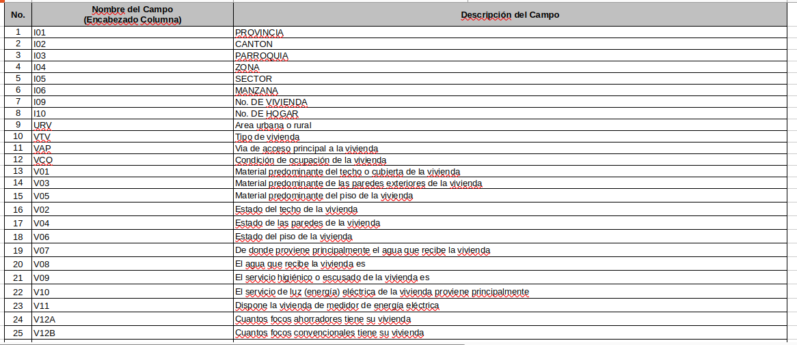

With that file we can decipher that column `I01` is the province, `VTV` is the "dwelling type" (though in practice those appear as numbers and I couldn't find a table indicating what 1 or 2 means. The Naming Classifiers ("Clasificadores Nomenclatura"), available [here](https://www.censoecuador.gob.ec/data-censo-ecuador/), don't contain that mapping), and so on. `I01` to `I10` are location codes, in a hierarchical fashion: provinces contain cantons contain parishes contain zones contain sectors contain blocks contain dwellings contain households. The field named `TOTPER`, not displayed above, is the total number of people that live in a certain household located in a certain dwelling located in a certain block located in a certain sector... you get the idea. That's our only field of interest.

LibreOffice choked while opening that file (it's a 400MB file with a few dozen columns and an unclear number of rows), so I decided to use [DuckDB](https://duckdb.org/) instead. DuckDB is an in-process (not client-server like Postgres, MySQL or Mongo) database, somewhat like SQLite, but optimized for analytical queries. Roughly, analytical queries are those that _don't_ care about a single element, but rather about all of them as a whole. `SELECT * FROM table WHERE id=...` is _not_ analytical, since it cares about a single element, the one with that ID. Those are sometimes called _point queries_ and are common in web applications. By contrast, `SELECT country, count(*) FROM table GROUP BY country` is analytical: the output isn't a subset of the records that live in the DB, but rather an aggregated value computed from them (here, the list of countries, each with the count of records that belong to it). Serious analytical queries have a habit of becoming queries over _huge_ amounts of data (like, "A terabyte? That is not large at all" huge). DuckDB is also really easy to use for ad-hoc data manipulation: it's a CLI tool [that can be easily installed](https://duckdb.org/docs/installation/index?version=stable&environment=cli&platform=linux&download_method=direct&architecture=x86_64) (contrast with Postgres, where the CLI is merely a client to a database server that must be running elsewhere, complete with config files, daemonization and more). The DuckDB CLI can directly read files as tables, such as local (or remote, [such as S3 and friends](https://duckdb.org/docs/data/data_sources)) files. It can also directly read Excel, CSV and JSON files as input, along with other more specialized formats such as Parquet and Iceberg, saving you the trouble of having to write an ingest script that parses those formats and repeatedly invokes `INSERT INTO ... VALUES ...`. DuckDB can _also_ export directly to those same formats, again saving you the trouble of having to write an exporter that runs `SELECT ... FROM ...` and then writes to a file in the desired format.

Two statements are all that is required to wrangle the input CSV data, with one record _per household_, into one record per city block (which summarizes a set of dwellings, each of which contain a set of households):

```sql
CREATE TABLE data AS (
	SELECT *, format('{}{}{}{}{}{}',I01,I02,I03,I04,I05,I06) AS code 
	FROM read_csv('./CPV2010M_Vivienda.csv')
);

COPY (
	SELECT code AS block_code, SUM(TOTPER) AS num_people 
	FROM data 
	GROUP BY code
) TO './people_by_block.csv';
```

And the final data looks like this:

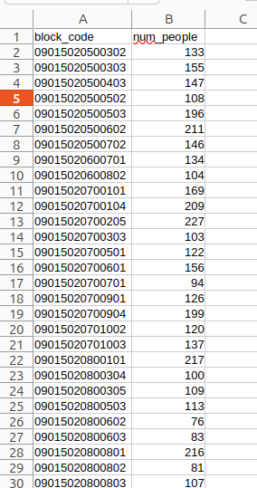

You'll notice that the `block_code`, an unique numerical code that identifies that block on the entire country, is also computed based on a set of identifiers. We'll need that later to join that information to the block's geometry, since there each block's shape (each block is represented as a polygon) also carries an attribute with that block's ID.

The actual geometry of each block comes from [the Geoportal](https://www.ecuadorencifras.gob.ec/documentos/web-inec/Geografia_Estadistica/Micrositio_geoportal/index.html), another website by the same institute that is in charge of the census, where Shapefiles can be downloaded. Shapefiles are [a geospatial file format](https://en.wikipedia.org/wiki/Shapefile) that can store vector data, such as points, lines and polygons. In this case, there's a bunch of polygons, one for each block in the country. Each polygon (or point, or line) is called a _feature_. Furthermore, features can have additional properties attached. In this shapefile, each block has its block code stored as a property, along with other information such as the block's perimeter and the encompassed area.

To view Shapefiles and work with them, a good alternative is [QGIS](https://qgis.org/), a Geographical Information System (GIS) that is open source, widely used, and actively maintained. GISs are applications where geospatial data can be viewed, created, edited and otherwise processed. Importing a shapefile is a very basic function, so there's no issues there: we just need to create a project, then add a new Vector Layer, choose the shapefile, and import.

Here's a block, which from what I can see covers Quito's old airport, laid over an OSM base layer. Note the DPA_MANZAN value on the right panel: this is that block's unique code, based on concatenating six levels of hierarchy, from provinces down to the actual block number.

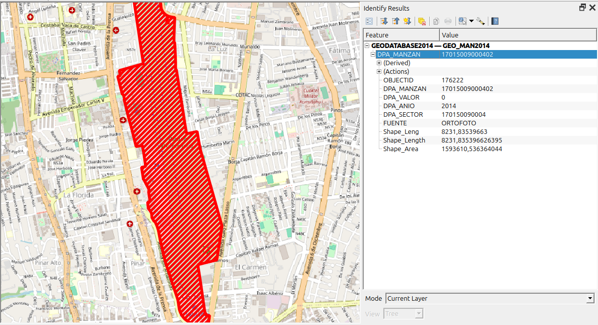

By the way, no people live in that particular block, which makes sense (it's an old airport, turned park + convention center):

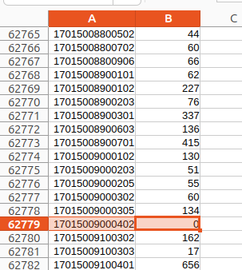

I've also point-checked my home, and it does match: that block (in the map) does include (in the census CSV) a household with the correct number of rooms, the correct number of family members at that point in time, and the correct ages and sexes for each of us, ordered by age, descending. So the mapping does appear to be correct: the block geometries use the same IDs as the 2010 census did.

Now that we know how many people live in each block (from the CSV file that we generated from DuckDB), _and_ we also have the actual physical shape of each block, we'll proceed to randomly "sprinkle" each block's inhabitants inside its polygon. We could go more pedantic and actually sprinkle, not individual people, but the households (so instead of 5 dots for 5 people we'd get a single dot containing 5 people), but that's more complicated and shouldn't alter the results much, if at all: which voting centers are closer to you shouldn't vary much depending on _where_ exactly in the block you get placed.

This random sprinkle-in-the-block is probably the best we can do with the census data, which is good: it's a bit creepy that I could find myself based on accidental data (Consider: you know the number of people in the family. Cross-check that with someone's date of birth, plus the number of cars that the family owns, plus some very rough geographic information such as the province, and it's actually quite likely that you'll narrow it down to a single datapoint). Census data is, in other words, somewhat _deanonymizable_. 

Anyways, armed with that CSV, we can import it into QGIS, as a Delimited Text Layer, taking care to mark it as No Geometry (Attribute only table), since otherwise we'd be forced to choose which columns of the CSV are the latitude and longitude, which isn't the case here. Once that layer is added, we can add a Join to the vector layer (the shapefile) by opening the Properties dialog in the vector layer and setting up a Join against the CSV layer. The form to configure the Join will prompt you to choose how the field is named in both sides (in the same vein as a SQL JOIN), and which fields you want to pull from the remote (CSV) side. Here we just have one field to pull, `num_people`.

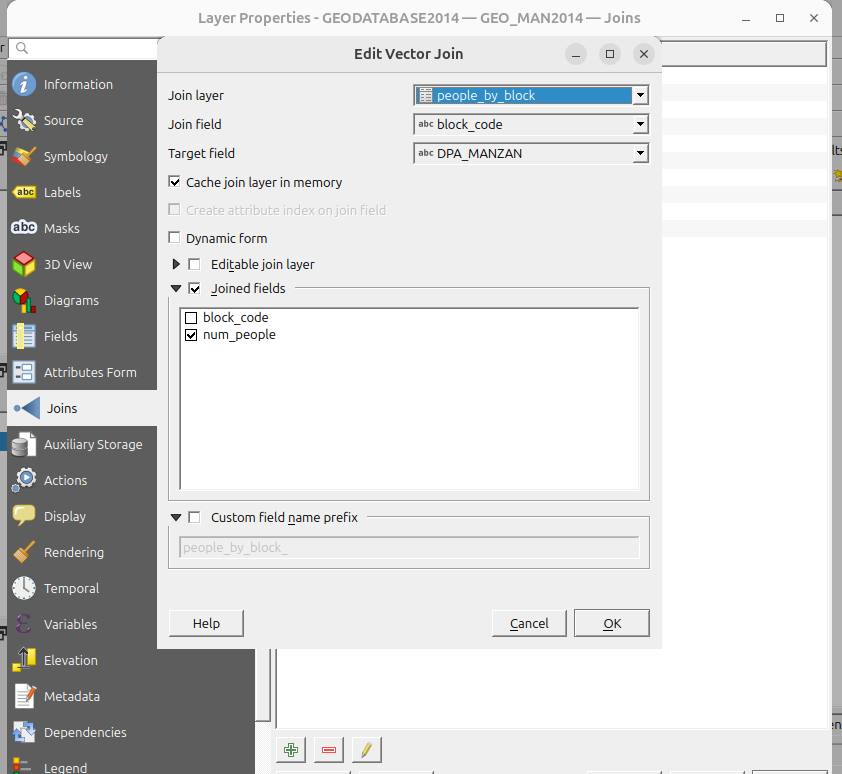

And now, that field is available on each polygon. Here's a block just besides Quito's old airport (the airport itself has 0 people and is therefore less interesting):

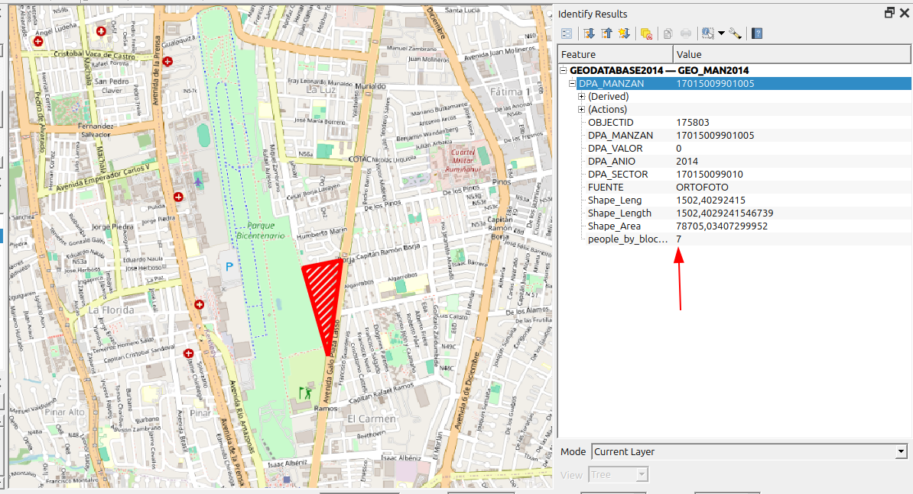

Now we want to create and "sprinkle" however many random points are appropriate for each polygon, such as 7 points inside the red triangle that we just saw (the number varies _per polygon_). At this point, I feared I'd have to write some sort of script (QGIS [supports scripting](https://docs.qgis.org/3.34/en/docs/user_manual/processing/scripts.html) via Python), but it turns out that's not necessary! In the **Vector > Research Tools** menu, there's an option called **Random Points in Polygons**, which does precisely what we want. We just have to choose the source polygon layer (of which we only have one, so no confusion is possible), and how many points we want for each "feature" (AKA polygon, here a block of houses). By default you'd set a number (such as "generate 10 random points inside each polygon in the source layer", but there's a small dropdown menu to the right where a field can be chosen, including our `num_people` field that comes from a JOIN. This makes it so the **Number of points for each feature** field is no longer a constant, but instead each polygon can have its own value:

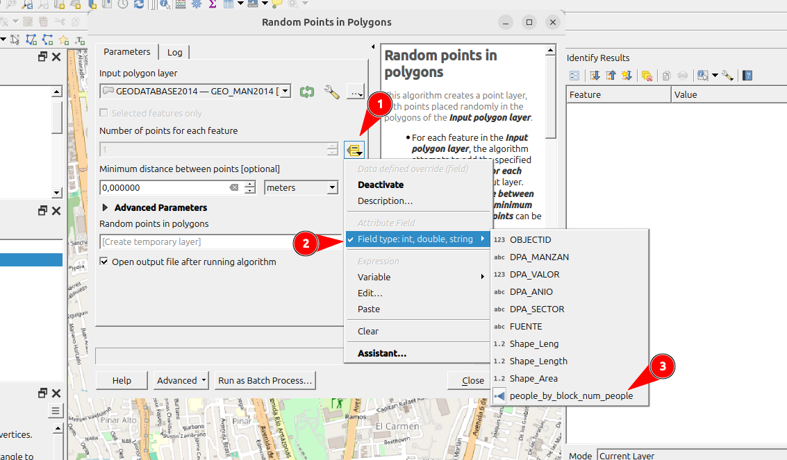

We leave the output as a Temporary Layer, then run the operation. However, before that I had to fix a bunch of misbehaving polygons, such as polygons where the border self-intersected, which causes the random points algorithm to choke. Here's, for example, the tiniest portion of a suburb of Quito:

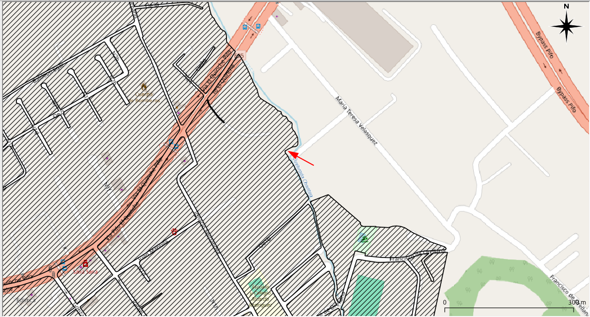

See the problem? It even has a red arrow pointing at it. No, I don't see it either. If we zoom in so single-meter features are visible (see the scale bar at the bottom right for reference; it's so zoomed in that the OpenStreetMap base layer just gives up and shows nothing), we see the problem:

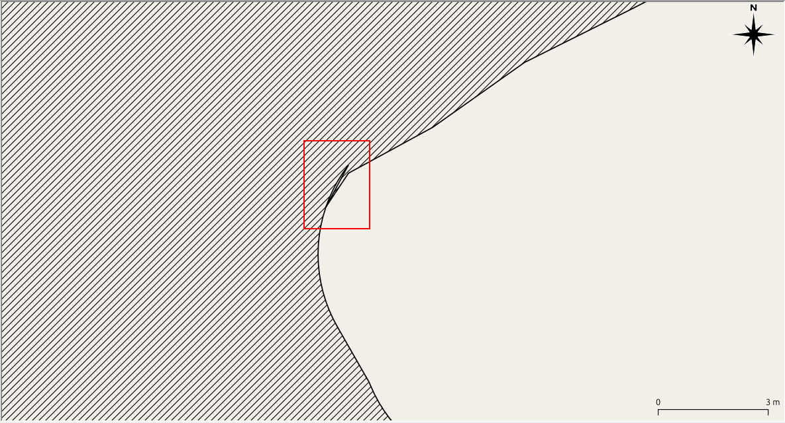

This tiny loop causes the Random Points operation to reject that polygon. Luckily, there's a simple ([and StackOverflow-approved](https://gis.stackexchange.com/a/387875)) way of fixing it: using the [Buffer tool](https://docs.qgis.org/3.34/en/docs/gentle_gis_introduction/vector_spatial_analysis_buffers.html) with zero margin. This creates polygons that are essentially identical to the original ones (one new polygon per polygon in the source layer), but for some reason generating the buffer zones drops all those tiny imperfections. With that buffer layer, we can now _actually_ generate the points. Doing so takes a little while, but when it's done we have points that respect the number of people in each polygon/block. Observe:

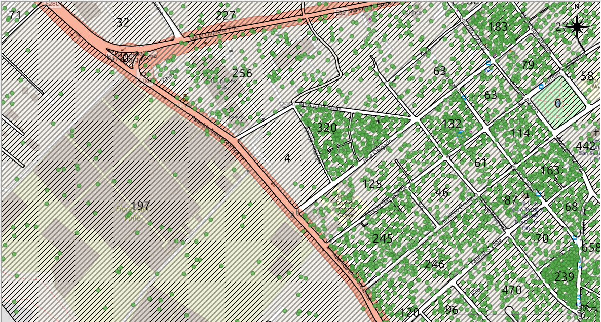

I've configured the layer that contains the polygons so each one is labeled with its count of people, which in turn comes from the CSV file and a JOIN operation. While most blocks have too many people to count, note how the block at the center of the picture, which has the label 4, does indeed contain just 4 green circles.

This other one is a small park, so it having the label 0 is correct, and it does indeed contain no green circles inside:

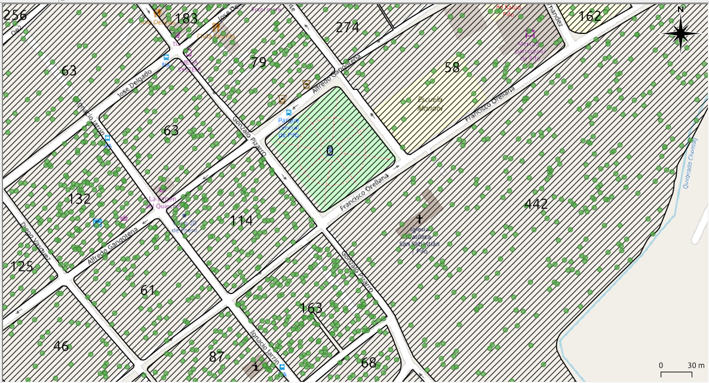

And here's some more tiny blocks with a few people each:

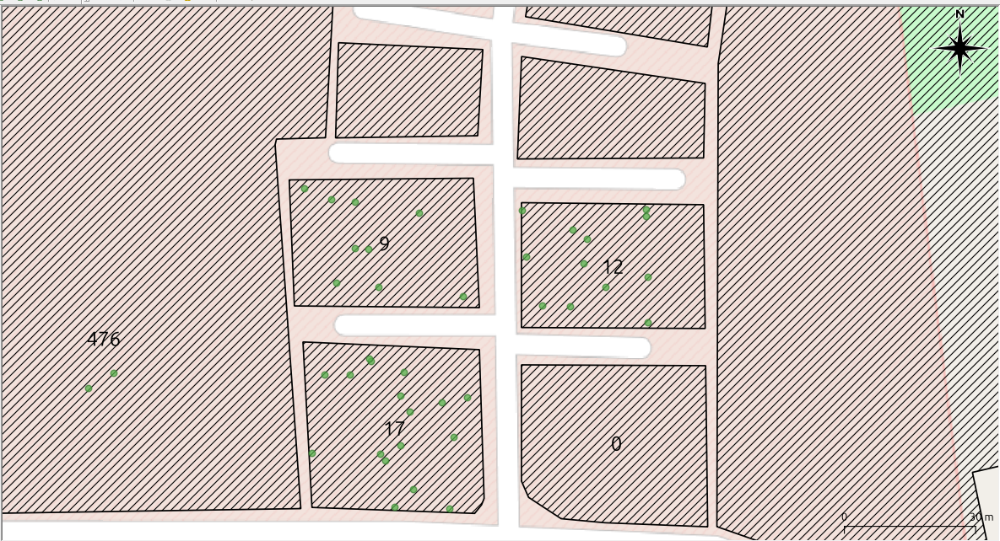

So, to recap: we've taken information about _each block of buildings_ in the entire country, namely the block's unique code and its geometry, from some census data. From another part of the same census, we got information about each household in the country, namely the number of people in each household and the code of the block in which they live. We JOINed those two datasets together in QGIS, which let us now have blocks with a geometry and a number, representing how many people live inside that geometry. We then used a QGIS built-in tool (Random Points in Polygons) to randomly generate points inside each polygon, matching the number of people of the polygon. The end result is that we now have slightly more than 10 million points, each with a latitude and longitude, which should _very closely_ match the actual living distribution of people in the country, to within a block's length of error.

Oh, and by the way, this is actual 10 million points for 10 million people. The entire country is covered in them. We're wrangling an entire country's worth of data here:

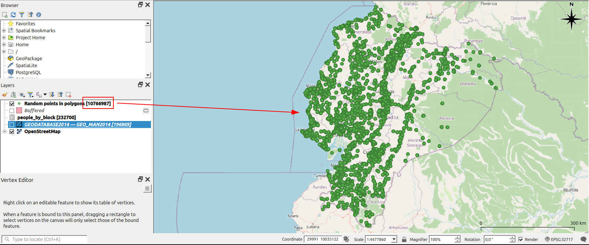

### Voting centers

Now we need the coordinates of each voting center. Luckily, those are published (otherwise I'd have absolutely no hope of obtaining them). We can go to the [website of CNE](https://www.cne.gob.ec/), our national election authority, then [visit the dedicated page for 2025's presidential elections](https://www.cne.gob.ec/elecciones-generales-2025/), and inside there there's an option labeled "Distributivo de Recintos Electorales", which roughly translates to "Distribution of Voting Centers". It's [an Excel file](https://www.cne.gob.ec/wp-content/uploads/2024/11/30oct2024_DistributivoRecintos-Coord1.xls) (actually an XLS file, _not_ XLSX. Just how old _is_ it? Does it get passed from director to director as they retire, whispered on the ear in a sacred rite of passage? Was there a cuneiform tablet before that?)

_Ahem_ Anyways. This file contains a table with about 4.3K voting centers, located all over the country. It contains information such as the province, zone **NOMBRE_ZONA**, name **NOMBRE RECINTO** and address **DIRECCION RECINTO** of the center (they're typically schools), sometimes a phone number **TELEFONO** (which presumably goes to some person responsible for the center), and the number of voting stations that it handles **NUM_JUNR**. There's a breakdown by men's **JUN_MAS** and women's **JUN_FEM** stations, which we don't care about; we're interested in the total number. 

And, finally, there's the coordinates of the voting center, expressed in two different coordinate systems. **X** and **Y**, which are fairly large integer numbers, are expressed [in the UTM coordinate system, zone 17S](https://en.wikipedia.org/wiki/Universal_Transverse_Mercator_coordinate_system#UTM_zone). The numbers themselves make no sense unless you know the zone in which they're expressed, and I happen to know that here in Ecuador we like to use zone 17S, since it covers [a decent portion of the country](https://spatialreference.org/ref/epsg/24877/). Not all of it, Ecuador is wider in longitude than the 6° that a single zone can span, plus since the equator crosses Ecuador (go figure why we have that name) we'd need the N and S zones anyway, plus the Galápagos Islands are about a thousand kilometers away which is about 10° extra, but 17S is what tends to be used when we need a single coordinate system for the country. _Technically_, you aren't supposed to use UTM coordinates outside their designated 6° width and half-world height, but sometimes you can get away with it, and by spot-checking the most extreme voting centers of the country (the northermost villages, the Galápagos islands to the west, and some points in the Amazon to the east) they seem to correspond perfectly with populated locations, so we shouldn't have issues.

Then, there's **long** and **lat**, which are your standard latitude and longitude values, referenced to Greenwich. We'll use the UTM coordinates since the QGIS project is set up to use those, but QGIS is, as far as I know, perfectly capable of mixing reference systems in a project.

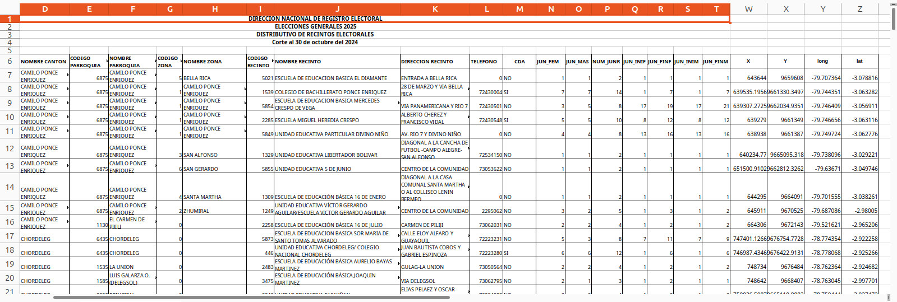

Since the XLS file has a merged-cell header and several sheets which we don't need, we need to hand-copy only the table and create a CSV file from it. Then, we can import that CSV file into the QGIS project as a new Delimited Text layer, as we did before. However, this time we _do_ want to set the Geometry Definition section, since now our points have a coordinate (previously we had an abstract data table that didn't have anchors into the map):

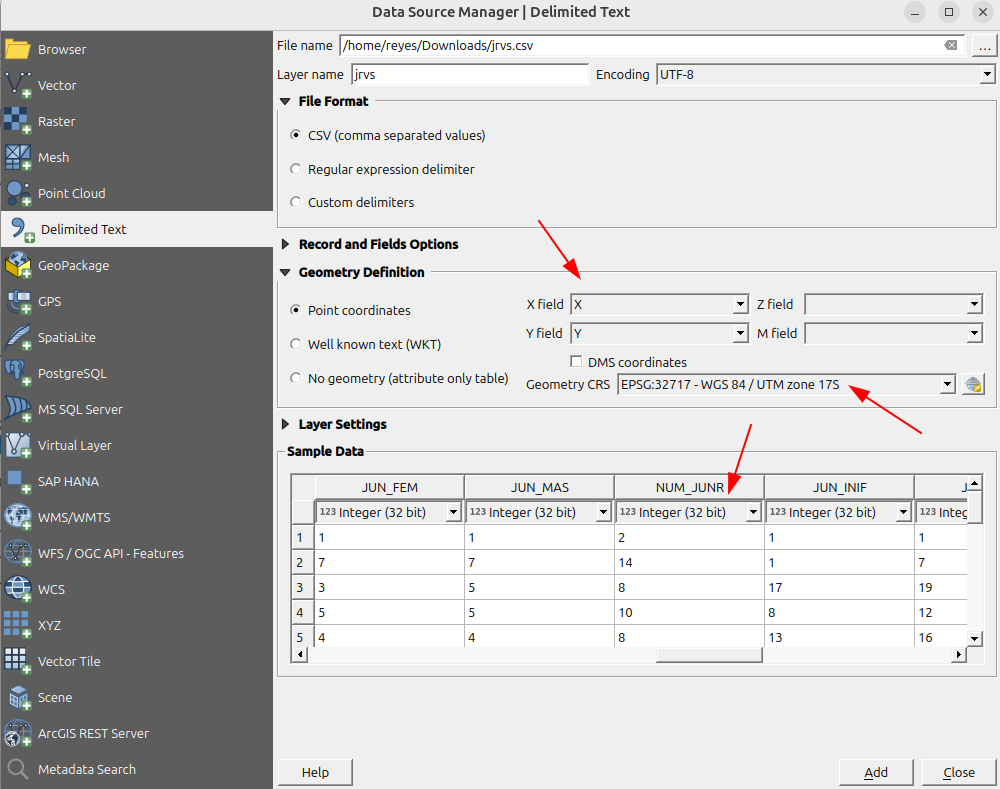

A bit of styling, and now we have all the country's voting centers in the map:

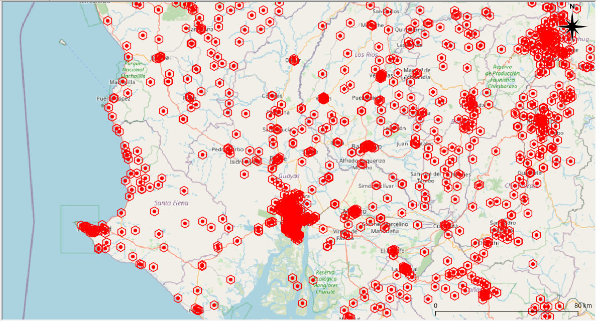

We also need to somehow know how many people can fit in a voting station. I have no idea how that is determined, presumably by the amount of space that is available in the place (e.g. how many classrooms in a school). I know, since I've been manning the stations several times, that each station gets (or at least used to get) 400 people assigned to it. I _think_ they reduced it to 350 somewhere around COVID o'clock, but we'll roll with the 400 people per station. This also expresses the fact that there is _probably_ more space available in each voting center, where a few more stations could be fitted if necessary, which I'd like to have for wiggle room when we start assigning people to stations later.

This is added as a [Virtual Field](https://docs.qgis.org/3.34/en/docs/user_manual/working_with_vector/attribute_table.html#creating-a-virtual-field) in the layer that contains the voting centers. Virtual fields are somewhat like Excel formulae or Postgres generated columns: they're an expression that can refer to other fields, and the value is calculated as needed, rather than stored in the field itself. In the screenshot below, notice the `allowed_people` field at the bottom, in blue. It contains the formula `"NUM_JUNR"*400`, i.e. 400 times the value of the field `NUM_JUNR`, which you'll recall is the number of stations that will be set up in that place. So now, each voting center contains a count of people that it can feasibly handle, plus or minus the fact that not each station is assigned _exactly_ 400 people (the last stations of each center may have less people), especially in small places with only a few stations; and that it may be possible for some voting centers to host more stations than they are hosting in the 2025 elections, but that we _definitely_ can't measure.

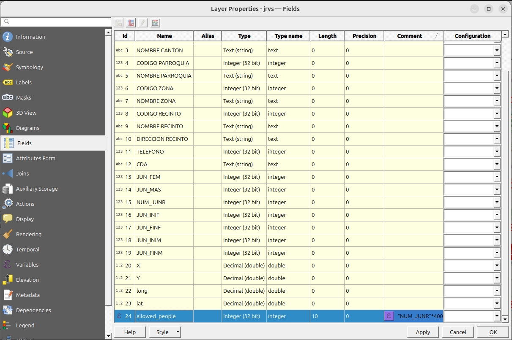

Just as a sanity check, we can see how many spaces are now available across all voting centers, which would be the sum of the `allowed_people` field for all the voting center points. This can be done by activating the Statistical Summary for that field, which looks like a purple Σ in the top toolbar. We can then choose the layer for which we want  the stats to be computed, and then the field. We're interested in the Sum. 

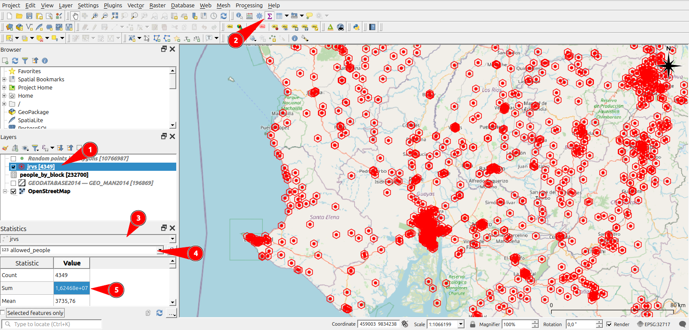

So, it turns out that, assuming that each voting _station_ can handle 400 people, the country is equipped to handle a bit over 16 million voters. That checks out, at least in regards to the order of magnitude of the quantity, with the number of eligible voters for this election. We only have data for 10 million people or so, because the census data is 15 years out of date, and people that appear in the census aren't necessarily valid voters, but at least the geographical distributions of census'ed people and voters should be similar.

Now we have a decent set of data to base our experiments on. We'll now start playing with different ways of assigning people to voting centers.

## Experiment 1: Assign to nearest center

The simplest, easiest, dumbest idea would be to assign each person-point to the voting-center-point that it (the person) is closest to. This is, in essence, a greedy rule that can be implemented quite easily and in parallel, since under this rule assignment of people to centers isn't affected by other people: given a certain arrangement of voting centers and a certain person, choosing the nearest center to that person is not affected by any other people that may live around, like ghosts that can't interact with other ghosts.

It's also wrong in many circumstances.

Consider an arrangement like in the image below: there are two voting centers, the blue squares, each with a capacity of 1 person; and two people, the red circles, which are to the right of the rightmost voting center, hence closer to the right center than to the left one. 

Blindly assigning each person to his closest center would cause both people to be assigned to the right center, which surpasses that center's capacity. 

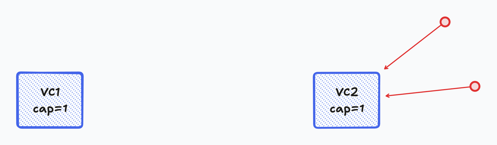

We'd need a smarter algorithm to handle such cases. Something along the lines of "this center is full, therefore some people must be sent elsewhere". And that's where the fun starts: who do we divert? Where to? There will be more voting centers around, not just the two of that example. What if the other voting centers are also full? In that case we'd need to divert people further away. Diverting people to other centers causes the capacity of those other centers to be reduced, so that may cause a cascade of people getting reassigned in turn. For example, say that we swapped one of the red dots above so it was reassigned to the left voting center. Now _that_ center is full and if there were another red dot further to the left it would in turn have to go to other center.

Nevertheless, let's try this approach, and see what happens. We will, by authorial fiat, ignore these questions, and only take into account the people that can be successfully assigned to a center in the first pass.

It turns out that the question of finding the closest X to a given point is a well-studied problem. Its proper name is Voronoi Diagrams, which are generated from a set of points. Voronoi diagrams are polygonal structures, where each polygon is born from one point. The invariant that is maintained by these diagrams is that _all points inside a polygon are closest to that polygon's source point than to any other source point_.

Or, in an image (the source points, the original points that were used to create the Voronoi diagram, are the tiny red triangles, of which there's one inside each polygon):


If you now pick an arbitrary point in that map (any point at all, not necessarily one of the red triangles), then you can very easily know which source point it's closest to: it's the red triangle that is inside that polygon. In effect, the polygons mark "areas of influence" for each source point. You could think of the polygons as isolated valleys separated by mountains (the lines), with the source red points being the lowest points in each valley: if you drop something, no matter where, it'll roll down to a certain point depending on where it was dropped. The extent of each single valley marks "the area that is closest to one source point than to any other point":

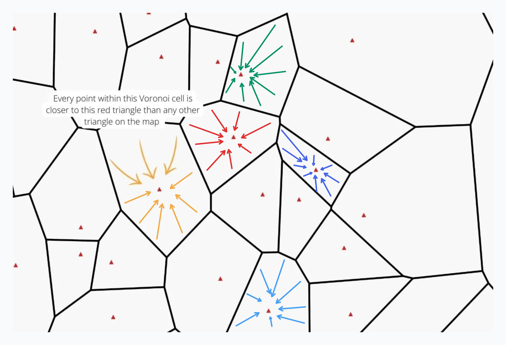

Of course, since this is a quite common operation to perform when you have a set of geographical points, QGIS already supports that operation, under Vector > Geometry Tools > Volonoi Polygons. We choose the layer that will be polygonalized (which would be the layer that contains the points for the voting centers), provide a Buffer of 10% (the meaning of this parameter is [explained here](https://gis.stackexchange.com/questions/220894/what-does-buffer-mean-in-qgis-voronoi-dialog), it's essentially some padding around the extents of the entire layer), and then run the whole thing. Apparently, computing the Voronoi polygons of 4K points is very fast:

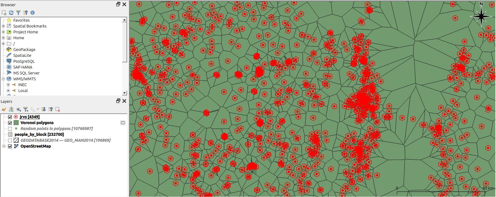

You can see that each voting center (the red hexagon+dots) is inside one green polygon. Any points that lay inside that polygon are closest to that polygon's voting center than to any other voting centers, with the black lines marking the cutoff points where it's faster for you to go to one voting center or another.

Here's a very close closeup of an area of Guayaquil, near the Guayas River. As always, green dots are people, red dots are voting centers, and black lines mark the boundaries where you're closer to one voting center vs. another:

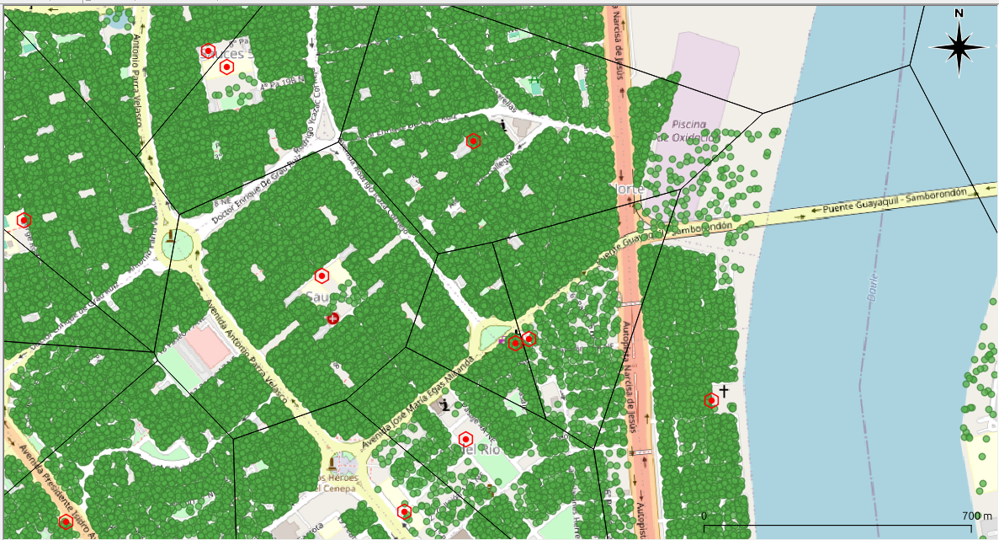

As luck would have it, QGIS [has an operation called Count Points in Polygon](https://www.qgistutorials.com/en/docs/points_in_polygon.html), under Vector > Analysis Tools. It does exactly what it says on the box: it counts the points that lie inside each polygon. You provide it with two layers: a layer of points (the people), and a layer of polygons (the Voronoi tesellation of the voting centers). By default, QGIS creates a new layer, with polygons that mirror the geometry of the input polygon layer, except that these ones have another numeric property `NUMPOINTS`, which is set to how many points laid inside of it:

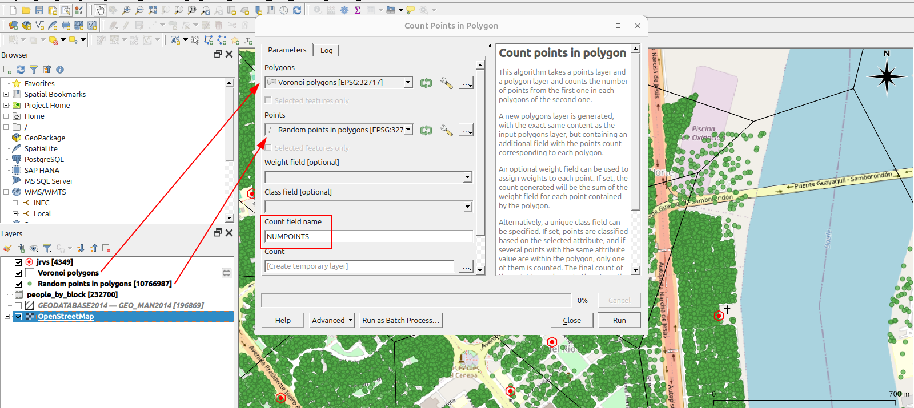

This one takes a bit more to run, since it needs to iterate over 10 million points and perform a bounds check on each. Once a new polygon layer is generated, we need to change its styling somewhat. For that, we right-click the new layer, choose Properties, and go to the Styling tab. By default, layers are colored on a single random color, but that can be changed so it takes a condition to determine the color, similarly to Excel's Conditional Formatting. Here we want to color the polygons differently depending on whether the polygon's `NUMPOINTS` field (which is the number of people for which this voting center is the closest option) is larger than the `allowed_people` field (which, remember, is set to be 400 * the number of voting stations in that center, based on the normal number of people per voting station). If that comparison returns False (i.e. `NUMPOINTS` is _not_ larger than `allowed_people`), then the voting center is OK, its capacity has not been overflowed, and we color it green. If that comparison returns True, that means that the voting center is the closest option for more people than it can handle, which spells trouble for our greedy algorithm. This is configured like so:

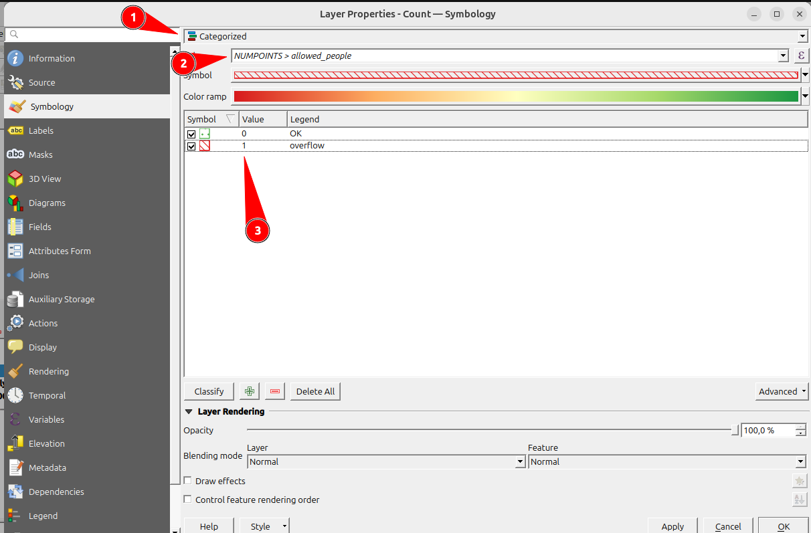

Here's most of Guayaquil, with that styling applied:

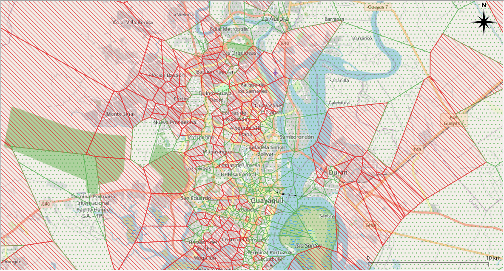

Not so good, is it? A good portion of the city is in red, which means that a good portion of the voting centers are the best choice for more people than they can support. This means that people _will_ need to be assigned to farther voting centers. This same issue happens on other large cities.

Just for fun, let's quantify the level of overflow. QGIS allows us to export a layer into a XLSX file, which we can then open elsewhere. Of course, there's also other formats that are more amenable to automatic processing, should that be required, but Excel (actually LibreOffice, because Ubuntu) is plenty good enough for this:


In fact, we can see that the polygon with the most overflow has about 48 thousand people for which that center is the closest, but the center itself can only service 8K people. This is the worst case in the entire country, and all these people would need to spill into other voting centers... promptly filling them up and causing even more spillage.

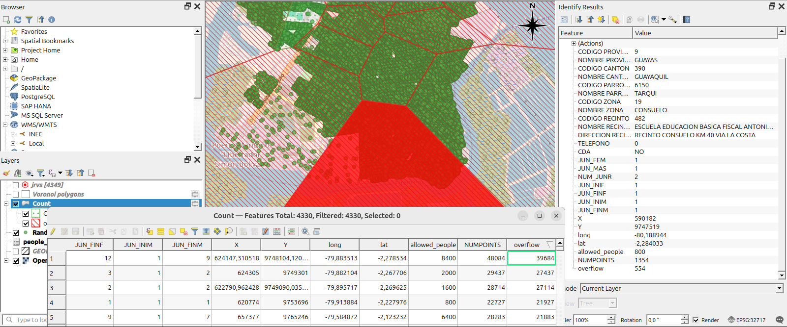

The average overflow, only taking into account voting centers that _do_ overflow, is about 3.4K people. This is very considerable if we take into account that those same centers have, on average, 3.7K people of capacity, so they're being allocated nearly twice their true capacity. In total, 2.9 _million_ people (remember that we're working with 10 million people, more or less) are overflows of their respective centers. That's not the number of people that live closest to a voting center that overflows, this is _just_ the excess people that those centers couldn't handle. And this is even with the voting centers having 16 million people of capacity, in total, so well in excess of the total number of voters.

Furthermore, 870 centers, out of a total of 4.3K, have some form of overflow. For the overflowing centers, the distribution of excess people looks like this:

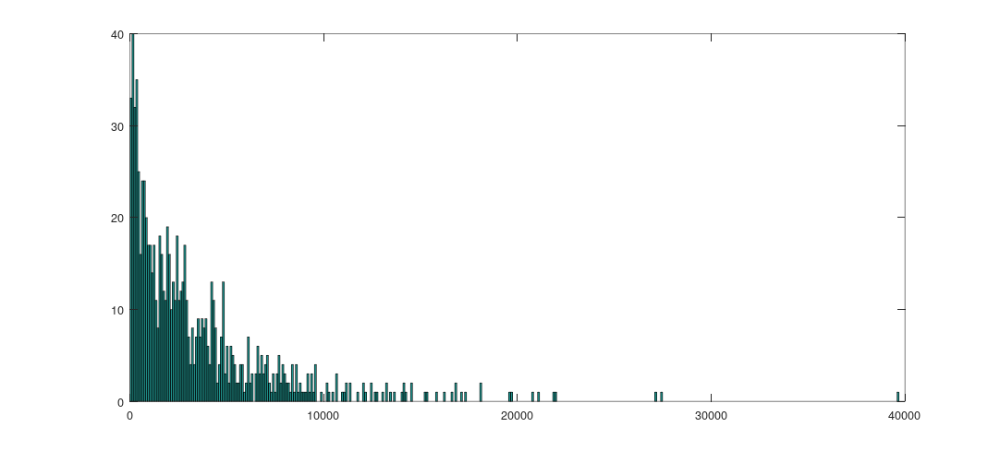

Most of the overflowing centers have somewhere between 1 and 10K people in excess, with a few tailing all the way up to 40K.

So, to recap: if we blindly assign people to their closest voting center, we end up with about 30% of the country that can't be assigned through this rule, due to their nearest voting center being full. They absolutely have to be assigned somewhere else, but on doing so our simple rule breaks down. And the act of assigning them elsewhere has knock-on effects since they'll deplete the capacity of wherever they're assigned to. And the rule gives no guidance on how to choose the people to reassign, and on where to reassign them to. We'll need a more refined approach for that.

We'd also like to know, for the people that got assigned a center, how far they are from it, on average. In fact, this is probably our single most important metric, since it should track with average happiness (or, maybe, lack of unhappines caused by long trips). Here we'll assume that, for voting centers that were assigned to more people that they can serve, only the closest people will be preserved (in other words, if a center can handle 400 people but there are 500 people inside its Voronoi polygon, only the 400 people closest to the center will be assigned to it. The remaining 100, who are near the edges of the polygon, will be left out). Since we already have the Voronoi polygon data structure, determining which people are handled by which center is a fairly simple point-in-polygon test (which does nevertheless have to be performed for 10M people). Out of that, we get each person's position, their voting center's position, and their voting center's maximum capacity, as a 10M row table.

After some judicious application of JOIN operations between the table with people's randomly-generated locations, with 10M entries, and the table with the voting center's locations, with 4K entries, we get a 10M-entry table that looks like this:

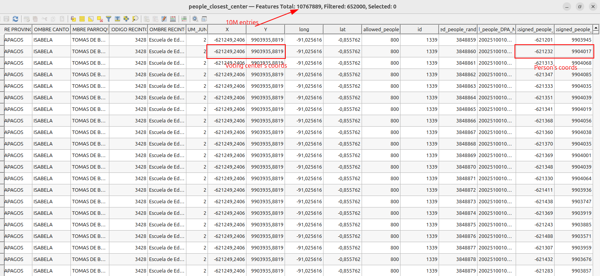

Of particular interest are the `X` and `Y` coordinates, which are the voting center's location, and the `assigned_people_x` and `assigned_people_y` coordinates, the last two columns to the right, which are the person's random-but-within-the-correct-block coordinates.

Of course, once we have both sets of coordinates, computing the distance is easy. In the end, we're left with a table with 10M entries: for each person, we know their coordinates, their voting center's coordinates, their voting center's capacity, and the distance between them and their center. We export that to an Excel file, and then we load it, again, on DuckDB, which it turns out [can read Excel files natively](https://duckdb.org/docs/guides/file_formats/excel_import.html) (since four days ago, but hey, released software is released software).

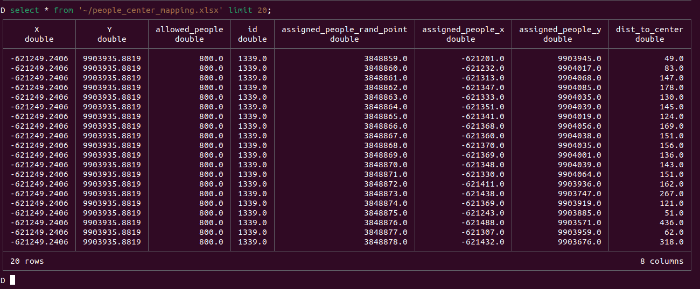

`id` is the voting center's ID, `assigned_people_rand_point` is the person's ID, `X` and `Y` are the center's coords, `allowed_people` is the center's capacity, `assigned_people_x` and `assigned_people_y` are the person's coords, and `dist_to_center` is the distance from that person to his voting center.

Now we can pick only as many people, per center, as that center supports. This is a job for SQL [window functions](https://duckdb.org/docs/sql/functions/window_functions.html), which work as follows: Declare a partition, which is somewhat like a `GROUP BY` in that it defines the key that splits groups apart. Optionally, also provide a sorting key that defines the order in which a partition's records will be processed. Within each partition, process _each row_ (this separates window functions from standard aggregations, since aggregations spit out one row/record per group, whereas window functions still preserve the amount of original rows/records). The expressions that are applied to each row can refer to that row's fields, to fields of previous or following records (via [the `lead` and `lag`](https://duckdb.org/docs/sql/functions/window_functions.html#lagexpr-offset-default-order-by-ordering-ignore-nulls) window functions), to [the first record of the partition](https://duckdb.org/docs/sql/functions/window_functions.html#first_valueexpr-order-by-ordering-ignore-nulls), and other similar functions such as percentiles.

In particular, we're interested [in the `row_number` function](https://duckdb.org/docs/sql/functions/window_functions.html#row_numberorder-by-ordering), which returns "The number of the current row within the partition, counting from 1". This means that, if we apply a window by `id` (which is the voting center's ID), order by `dist_to_center` ascending (which will make it so, within each partition/voting center, the people closest to it will come first), and then generate `row_number()`, we'll get enough information to find the cutoffs (which are the points where `row_number()`, the position of that person within his corresponding voting center, surpasses that center's capacity, AKA where the queue gets full):

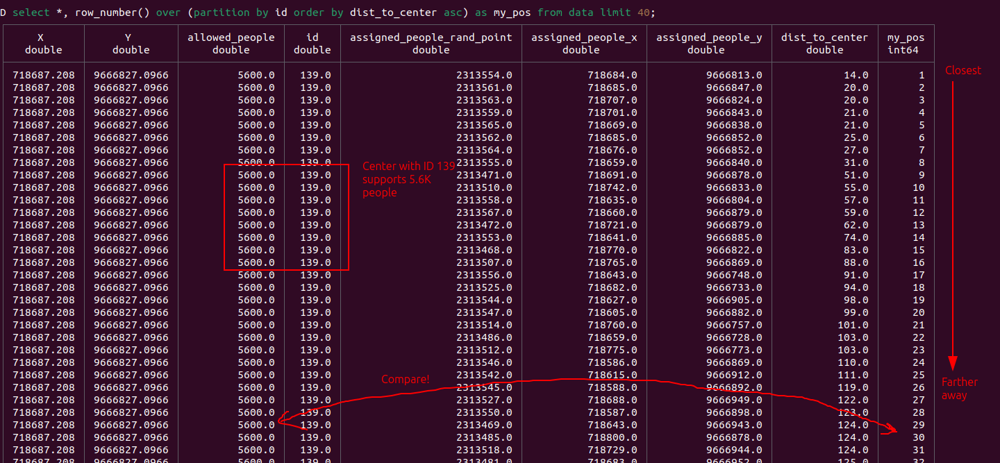

```sql
CREATE TABLE data AS (SELECT * FROM '~/people_center_mapping.xlsx');

SELECT 
	*, 
	row_number() OVER each_center AS my_pos,
	count(*) OVER each_center AS total_in_center,
	count(*) OVER each_center > allowed_people AS center_overfull
FROM data
WHERE assigned_people_rand_point IS NOT NULL
WINDOW each_center AS (
		PARTITION BY id 
		ORDER BY dist_to_center ASC 
		ROWS BETWEEN UNBOUNDED PRECEDING AND UNBOUNDED FOLLOWING)
QUALIFY
	my_pos <= allowed_people
ORDER BY id, my_pos;

-- get a preview of the data
COPY (...query above... LIMIT 10000) TO 'output.xlsx' WITH (FORMAT XLSX, HEADER TRUE);
```

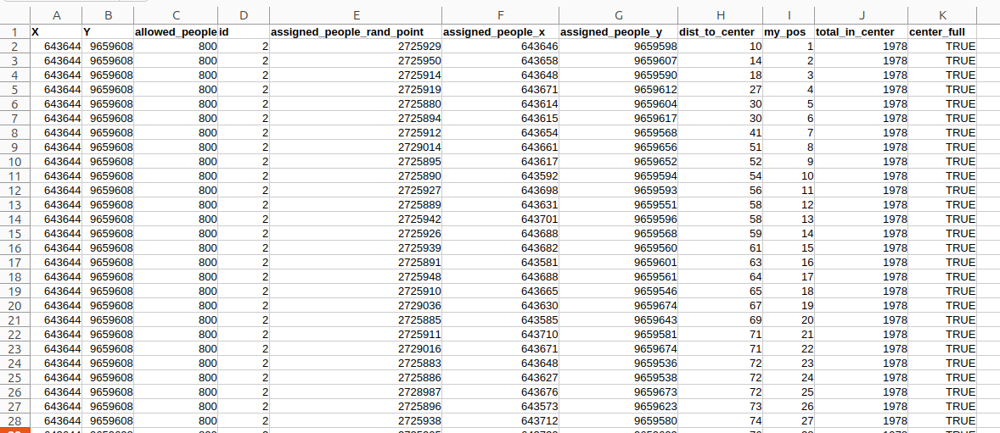

We export the first 10K rows to an Excel file for a quick look, since we can't export all the 10M records. If we attempt to do so, DuckDB will throw an error, and Excel-opening programs will also get very angry and hand in their resignation letters if asked to handle 10M rows:


Now with a query that generates the desired data, we can easily compute the average travel distance for the people that managed to fit in their nearest centers. The `QUALIFY` clause in the query above has already dropped the people that don't fit in their nearest center (i.e. those that, when ordering by distance to the center, end up in positions larger than the center's capacity, such as the 401st and any further people, if the center can handle 400 people), so we can just go and compute the average of the `dist_to_center` field:

```sql
D CREATE TABLE assigned_people AS (...query above...);

D SELECT AVG(dist_to_center) FROM assigned_people;
┌─────────────────────┐
│ avg(dist_to_center) │
│       double        │
├─────────────────────┤
│  430.6251065103924  │
└─────────────────────┘
```

This value turns out to be about 430 meters, measured in a straight line (actual walking/transportation distance will always be higher because roads). Not bad, actually, much better than the 2.3km (straight-line) that I had to move today to vote. Of course, this says nothing of the people that weren't assigned a center.

### Measuring Experiment 1

Before we move on, let's grab a few numbers that describe how well (or bad) Experiment 1 did. We'll use these metrics to compare different approaches.

* 2.9 out of 10 million people aren't assigned a center due to their closest center being full, so about 30% of the people aren't taken into account
* 870 out of 4.3K (20%) centers are assigned more people than they can handle
* The 870 overflowing centers have, on average, 3.7K people capacity and are being allocated 7.1K people each, so 3.4K average overflow per center, so they're being allocated 190% of their capacity
* On the other hand, the non-overflowing centers (which, by the way, also have 3.7K average people capacity) are being allocated 1.3K people each on average, so they're being used at 35% capacity (but note that the percentages aren't directly comparable, since the total universe of each is different, and even within a class there are smaller and larger centers)
* Out of the people that got a spot on their closest voting center, their average distance to it was 430 meters

### Possible enhancements

These are some changed that could be made to the basic rule "assign everyone to their closest voting center" so it performs better. I won't explore them here since there are other approaches that I want to cover, and that are also cooler to demonstrate.

With the simple greedy rule we have people who don't get assigned a center, and the rule says nothing about how to handle them. Currently, they're left hanging with no voting center assigned to them. It may be possible to run the assignment _again_, after the 7.1M people have already had a voting center assigned. This time, we'd run the whole thing again, trying to match the remaining people (the 2.9M who got assigned to overflowing centers) to the remaining centers (some centers with their capacity reduced according to how many people got assigned to them in the first iteration, and other centers, the ones that got full or over-capacity, removed altogether from the set of available voting centers). These people will inevitably have to travel longer, but that's unavoidable since their closest option can't host them anyways. Ideally, there is some center close enough that wasn't filled in the previous iteration and can therefore take them in. We can repeat the process as many times as necessary, each time with the people that couldn't be assigned a place in the previous round. That (should?) eventually converge into a solution with everyone assigned a center, as long as there's more spaces in the voting centers than people needing to vote.

Another possible tweaking point is the criteria for choosing who gets kicked off a voting center that is over capacity, and who is left in. Let's say that there are 500 people within the Voronoi polygon of a center with a single voting station, therefore 400 people capacity. For those 500 people, that center is their closest location. But 100 must be excluded. What is the criteria for choosing the 100 people that must be excluded? Do we randomly choose as many people as the center's capacity, preserve them, and everyone else gets kicked out? Do we preserve the 400 people that are _closest_ to the center and kick out the farthest 100, in the hopes that they'll be closer to the _neighboring_ voting centers and those centers have spare capacity to receive them? Do we preserve the farthest 400 people and kick out the nearest 100, in a reasoning similar to "the other 400 people will have to move further to come here, you can very well do some travel yourself into a neighboring region". Kind of like this:

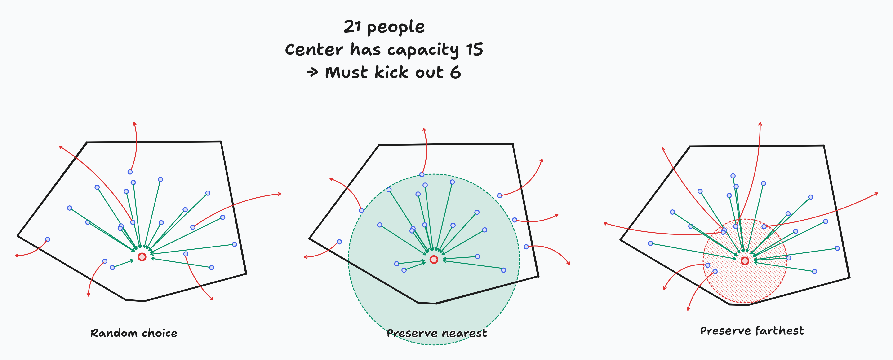

I don't know if any of those would happen to improve the average distance per person, like in caches, where the provably optimal move is to always discard [the item that would be used farthest in the future](https://courses.cs.washington.edu/courses/cse451/17au/cache_scan.pdf) whenever a cache slot is required (which of course is usually infeasible due to crystal balls not being compatible with silicon-based microprocessors), or LRU, which is used as an approximation, discarding the item that was used more in the past. Perhaps keeping only the people that are farthest from the voting center would provide a similar guarantee, or perhaps not.

## Experiment 2: Earth-mover's distance

**NOTE**

This will be covered in the next post, only an overview will be provided here. I want this post to go out close to election day, and there's still a large amount of content to cover. Other approaches (which we may also cover unless they turn out to be complete dead ends) include: 

* [The Gale-Shapley algorithm](https://en.wikipedia.org/wiki/Gale%E2%80%93Shapley_algorithm), a solution to [the "stable marriage problem"](https://en.wikipedia.org/wiki/Stable_marriage_problem), which probably gets a honorable mention for the weirdest-named problem in CS. This algorithm or variations thereof [is used in the US's National Residency Matching Program](https://www.sccs.swarthmore.edu/users/06/rshorey/math/hospitals.html) (NRMP), which matches medical students to hospitals so they perform their residency period. Students submit their list of preferred hospitals, in descending order, and hospitals submit their list of preferred students, also in descending order (perhaps based on grades or any other criteria). Then, a variation on the original Gale-Shapley algorithm can be used to match students to hospitals (keeping in mind that hospitals can accept multiple students, but students will ultimately be assigned to a single hospital). In our case, this could mean that people prefer voting centers based on increasing distance, and centers may prefer people that are closer to them, or something (centers shouldn't really care about what people they receive). I'm unsure if the Gale-Shapley algorithm fits the voters-to-centers problem (in particular, the fact that centers don't need a ranked preference list of voters may very well indicate that the algorithm makes guarantees that aren't needed)
* Some sort of algorithm where we sequentially lock in the closest person-center pair: Find the person, any person, that is closest to a voting center, any voting center, in the entire country. Commit to that assignment. Remove that person from the pool. Reduce the space in that center by 1. Repeat for the next closest person-center pair. When a center accepts its last possible person (it reaches its capacity), remove that center from the pool, which will trigger a recomputation of the Voronoi polygons since the arrangement of seed points has changed. Carry on while there are people to assign. This algorithm should be reasonably fast to compute, by virtue of never backtracking: once a person appears at the top of the list (it's the person closest to a voting center that hasn't been assigned yet), they'll be assigned to that center, they'll go off the list, and that decision will never be revised. And there are some problems where such an incrementally-constructed solution is optimal, notably those that be solved [by dynamic programming](https://en.wikipedia.org/wiki/Dynamic_programming#Dijkstra's_algorithm_for_the_shortest_path_problem), where knowledge of the solutions for sub-problems (such as the optimal assignment for N-1 people) is useful to compute the solution to the larger problem (the assignment for N people). This is formally called [optimal substructure](https://en.wikipedia.org/wiki/Optimal_substructure). However, it isn't clear if the assignment of people to voting centers has said optimal substructure and can therefore be solved in this way
* Perhaps some sort of graph algorithm would be useful, such as some sort of [maximum flow calculation](https://cp-algorithms.com/graph/edmonds_karp.html) with cost minimization. I'm not clear on that yet, but it sounds plausible. Cost would be the distance to travel, and the nodes would be the people and the voting centers. We'd want to maximize the flow, which would be the number of people that get assigned a voting center, while minimizing the total cost, which would be the sum of all traveled distances
* I've seen several suggestions to use linear programming, which despite its name is _not_ necessarily related to computer programming in the sense of writing programs that then a computer executes. Linear programming is used to "optimize" "metrics" subject to "constraints"... which is exactly what we have here. The issue, of course, is to properly define the metric to minimize (should be easy, some sort of average of the traveled distance for each person), the constraints that must be obeyed, and the variables that the optimizer has control over

**END OF NOTE**

As another approach, let's consider the Earth Mover's Distance metric and its associated algorithms, since it sounds intuitively very close to what we desire:

> The Earth Mover's Distance (EMD) is a method to evaluate dissimilarity between two multi-dimensional distributions in some feature space where a distance measure between single features, which we call the ground distance is given. The EMD "lifts" this distance from individual features to full distributions.
>
> https://homepages.inf.ed.ac.uk/rbf/CVonline/LOCAL_COPIES/RUBNER/emd.htm

Clear as mud, right?

Let's try again. If you have a set of dirt piles, each containing a certain amount of dirt (let's say, in kilograms), and a set of holes, each of which will take a certain amount of kilograms of dirt to fill; then the Earth Mover's Distance is the minimum/optimal amount of work that is required to move the dirt from the piles to the holes. Work is defined as the amount of earth moved times the distance moved (intuitively, moving more earth takes more work, and moving earth farther _also_ takes more work). This definition of work also aligns nicely with the Work quantity in physics, measured in joules and which is (for constant force over a straight line) the force times the distance.

This feels exactly like our problem: we have ten million tiny piles of dirt, the people (and yes, I'm aware that I'm calling all my fellow countrymen, and also myself, tiny piles of dirt. It's for the good of the article, fellow countrymen); and about four thousand holes, the voting centers. Each "pile" contains exactly one unit of earth, since each person just needs to occupy one slot in a voting center. The depth/size of each "hole" is the capacity of each voting center, which we've estimated as the amount of voting stations in that center multiplied by 400, which is the amount of people that a normal voting station handles. We also need an algorithm that doesn't try to move fractional units of dirt, just whole quantities.

We could also reverse the roles, so the voting centers are piles of earth, each with an amount of earth that corresponds to the center's capacity, and people are 1-sized holes. We then compute the optimal assignment of earth so that all holes are filled, and keep track of where the earth for each hole came from.

In any case, the result is that we minimize the transportation of "earth" from people to centers, or viceversa. No matter the direction, since people are always 1-unit entities, the movement of earth from a center to a person is always 1 unit, therefore the work is always 1×the distance, therefore the distance, and therefore the _total_ amount of work performed is the sum of all the distances. Minimizing this quantity means that the total amount traveled by all Ecuadorians during voting day is minimized, therefore maximizing happiness (assuming that for everyone happiness is inversely correlated with distance-from-home-to-voting-center).

Weirdly enough, the Earth Mover's Distance tends to always be defined in terms of "a measure of dissimilarity between feature distributions", which are abstract entities. It's also applied to compute similarity between two images, by first reducing the two images into abstract "signatures" that can then be treated, one as piles, the other as holes.

Here's an example of the EMD calculation in action, taken from [the paper that first introduced it](https://scholar.google.com/scholar?cluster=14364501903893061802&hl=en&as_sdt=0,5), in 1999:

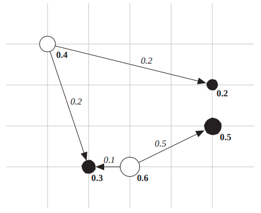

The white circles are the piles/sources, the black circles are the holes/sinks. The capacity of each pile and the demand of each hole are written below then. The arrows indicate the optimal transfers: the pile at the top left supplies half its contents to the 0.2 hole to the right and half to the 0.3 hole at the bottom left. The rest of that hole is supplied by the 0.6 pile at the bottom center, which also supplies a 0.5 hole to the right. In that example, the piles' total supply and the holes' total demand happen to be exactly matched (the piles supply 1, the holes demand 1), so everything lines up perfectly with all holes being completely filled and all piles being completely empty by the end. In our voters-to-centers assignment, that won't be the case since there are more spaces in voting centers than there are voters, but since the algorithm is a minimization, it should nevertheless converge to a minimum.

In the image above, the EMD metric itself is a number, the sum of all the arrow lengths' multiplied by the arrows' transferred amounts. For example, the small 0.1 arrow at the bottom would contribute 1×0.1=0.1 to the EMD. The sum of the values for all four arrows would be the EMD, which the paper helpfully indicates is 2.675. Notice that the EMD (the Earth Mover's Distance) is a single number that is a property of _the entire distribution_ (actually the _two_ distributions, the piles and the holes). If we move a pile or a hole, or change their sizes, then the EMD changes, and potentially the arrows too.

In order to compute the EMD, we need two sets of points: a set of piles/sources and a set of holes/sinks. Each point must have a 2D position, and a size. The algorithm takes all this and spits out a series of source→destination pairs, with a desired transfer size. In our case, we don't want fractional transfers, since that would mean that a person must go, say, half to a voting center and half to another... which makes no sense. We'll have to constrain the algorithm so it either generates transfers of size 0 (so no transfer at all, hence no arrow) or transfers of size 1 (which, since each pile _only_ has size 1, because they represent single people, means that they can't have any more arrows, since each pile gets "depleted" with the first arrow that involves it).

In the next article, we'll see how to compute the EMD for the 10M+4K point distribution, see how that assignment behaves (both in terms of computing resources required, and by comparing the resulting assignment to the greedy assignment that we did above). We'll also continue testing other approaches, as described at the start of this section.

See you then!
