## Intro

In the previous article, to celebrate the (first round of the) 2025 presidential elections in Ecuador, we introduced the problem of optimally assigning people to voting centers, so as to minimize the total distance that people have to travel. In this article, we'll try other methods, which purport to guarantee absolutely optimal assignments, such that _some metric_ is minimized. In particular, we'll be interested in minimizing the average distance between people and their assigned voting centers.

We'll explore Optimal Transport, which comes from the land of statistics and is used to compute the difference between two discrete statistical distributions. We'll explore the Stable Marriage/Stable Matching problem, which was developed to assign people (e.g. medical students or university applicants) to places (residencies and university programs, respectively) such that the respective preferences of people for places and places for people are maximized. A variant of Stable Matching is used to model the US's National Resident Matching Program. We'll also explore linear programming, which got a boost during World War II as a way to compute optimal allocation of scarce resources.

For each of these methods, we'll try to assign as large a region as possible (spoiler: turns out that all these methods are fairly resource intensive, so I could only try with a small provice with ~20K people, as opposed to either the entire country, currently with 13M voters, or the largest province, with >3M people). We'll compute some metrics for each method, mainly the average travel distance of the final assignments, and also how many people weren't assigned a center and the occupancy rate of voting centers.

As a small peek, here's what we'll end up with. This is a comparison of the three different methods on a small city. Click on the arrows to the sides of the image to change the method:




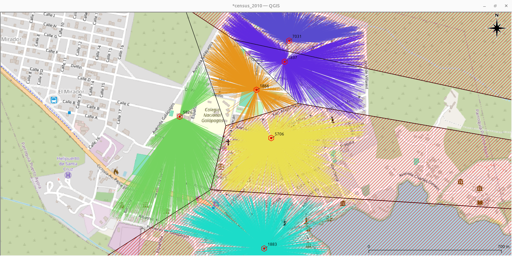


## Recap of previous post

First, [we had to gather the necessary data](/posts/election-locations-1/#preliminaries-grabbing-the-data). We simulated the positions of all people in the country by retrieving data from the 2010 census, the last census to have information about each block of buildings in the country, such as the block's geometry and information about each person in the country, including the block in which they live. Knowing the number of people that live in each block in the country, we generated as many points randomly distributed within the block's boundaries, and we used that as an approximation to each person's actual living location. For the voting centers, we were able to find fresh data for the real 2025-02-09 elections, including the location of each voting center and the number of voting stations that would be installed there, from which we derived the number of people that the center would be able to serve, by multiplying the number of stations by 400, which is the amount of people that are traditionally allocated to each station.

In the end, we could visualize (in QGIS) all the voting stations of the country:


and also all the people that appeared in the 2010 census, suitably generated by randomly "sprinkling" as many points within the polygon of each city block as there were people living there:


[Our first approach](/posts/election-locations-1/#experiment-1-assign-to-nearest-center) was to compute the closest voting center to each person in the country (or, in other words, the set of people that are closest to each center than to any other center). This was computed using Voronoi polygons, which are a very well-studied data structure to answer exactly the question of "the closest point out of a set":


Of course, blindly assigning people to the closest voting center ran into issues on densely populated areas, where there's more people that pick a center than space available in that center. In fact, in [our measurements of this method](/posts/election-locations-1/#measuring-experiment-1), we discovered that roughly 30% of the people couldn't fit in their nearest voting centers, due to them being full. For the 70% of the people that managed to get into their closest centers, however, the average distance (straight-line) between them and their center was 430 meters, which isn't too bad: that's maybe 10 or 15 minutes of walking at a not-too-fast pace. Everyone else should be assigned to neighboring centers, which would of course push up the average distance, but our simple allocation scheme just ignored those people altogether.

Then, we [started to review](/posts/election-locations-1/#experiment-2-earth-movers-distance) the Earth Mover's Distance metric, which can be explained as follows:

Let's say that there's a set of piles of dirt, each in a certain (X, Y) coordinate, and containing a certain amount of dirt. There's also a set of holes, each also in a certain (X, Y) coordinate, each of which would take a certain amount of dirt to fill. The problem solved by the Earth Mover's Distance is to determine the optimal way to transport the dirt from the piles to the holes, where "optimal" means "transporting the least amount of dirt possible the smallest distance possible". This problem is remarkably similar to our voters-and-centers problem, since we could model voters as 1-unit piles of dirt, and centers as holes that require as much dirt to be filled as people they can handle. Then, the minimized quantity would be the sum of distances traveled by all the people involved.

We cut the post there since I wanted to get it out close to election day, and if I didn't cut it there it would be a longer time until I could cleanly cut again.

Let's now pick back where we left:

> In the next article, we’ll see how to compute the EMD for the 10M+4K point distribution, see how that assignment behaves (both in terms of computing resources required, and by comparing the resulting assignment to the greedy assignment that we did above). We’ll also continue testing other approaches, as described at the start of this section.

## Experiment 2: Earth-mover’s distance

In [the previous post](/posts/election-locations-1/#experiment-2-earth-movers-distance), we already introduced the Earth Mover's Distance, and gave a physical interpretation of it (the formal definition is on distributions of variables, which isn't quite as understandable as piles of dirt and holes).

A good thing of the EMD being a known problem/metric/algorithm is that the way to compute it is well understood, and has been optimized a lot by researchers hungry for fame and papers, coming from both math and computer science.

That being said, the EMD (and Optimal Transport, which seems to be the common name for the actual problem) seems to suffer from a bad case of maths. Take, for example, the first few paragraphs of Chapter 1 on ["A user's guide to optimal transport"](https://cvgmt.sns.it/media/doc/paper/195/users_guide-final.pdf). Based on its name, you'd be excused for thinking it's a lightweight, results-focused approach to the topic, instead of a from-first-mathematical-principles review. Instead, it starts like this. Enjoy:

> Given a Polish space $(X, d)$ (i.e. a complete and separable metric space), we will denote by $\mathscr{P}(X)$ the set of Borel probability measures on $X$. By support $\mathrm{supp}(μ)$ of a measure $µ ∈ \mathscr{P}(X)$ we intend the smallest closed set on which $µ$ is concentrated.
If $X$, $Y$ are two Polish spaces, $T : X → Y$ is a Borel map, and $µ ∈ \mathscr{P}(X)$ a measure, the measure $T_{\#}µ ∈ \mathscr{P}(Y)$, called the _push forward of $µ$ through $T$_ is defined by
>
> $$
 T_\#µ(E) = µ(T^{-1}(E)), ∀E ⊂ Y, \mathrm{Borel}.
 $$
> The push forward is characterized by the fact that
> $$
 \int f \mathrm{d}T_\#µ = \int f \circ T \mathrm{d}µ,
 $$
> for every Borel function $f : Y → \mathbb{R} ∪ {±∞}$, where the above identity has to be understood in the following sense: one of the integrals exists (possibly attaining the value $±∞$) if and only if the other one exists, and in this case the values are equal.
> Now fix a Borel _cost function_ $c : X × Y → \mathbb{R} ∪ {+∞}$. The Monge version of the transport problem is the following:
>
> **Problem 1.1 (Monge’s optimal transport problem)** _Let $µ ∈ \mathscr{P}(X), ν ∈ \mathscr{P}(Y)$. Minimize_
> $$
 T \mapsto \int_X c(x, T(x)) \mathrm{d}µ(x)
 $$
> _among all_ transport maps _$T$ from $µ$ to $ν$, i.e. all maps $T$ such that $T_\#µ = ν$._
> Regardless of the choice of the cost function $c$, Monge’s problem can be ill-posed because:
> * no admissible $T$ exists (for instance if $µ$ is a Dirac delta and $ν$ is not).
> * the constraint $T_\#µ = ν$ is not weakly sequentially closed, w.r.t. any reasonable weak topology.
>
> As an example of the second phenomenon, one can consider the sequence $f_n(x) ≔ f(nx)$, where $f : \mathbb{R} → \mathbb{R}$ is $1$-periodic and equal to $1$ on $[0, 1/2)$ and to $−1$ on $[1/2, 1)$, and the measures
$µ ≔ L_{|_{[0,1]}}$ and $ν ≔ (δ_{−1} + δ_1)/2$. It is immediate to check that $(f_n)_\#µ = ν$ for every $n ∈ \mathbb{N}$, and yet $(f_n)$ weakly converges to the null function $f ≡ 0$ which satisfies $f_\#µ = δ_0 \neq ν$.

I mean, I enjoyed maths at high school. But that thing?

It scares me.

And, believe me, that's one of the easier documents. Other documents include double integrals over things that are better left untouched, and letters that I don't even know how to typeset. It's insane.

Another issue with approaching this problem as an optimal transport problem is that it's famously slow to compute. There are [tons of academic papers](https://scholar.google.com/scholar?hl=en&as_sdt=0%2C5&q=optimal+transport&btnG=) about it, each of which has its own great idea about how to marginally speed up the calculation, and they all mention (in passing, ussually as part of the Introduction, as the motivation for the paper) that computing the optimal transport is a slow process. In fact, algorithms [seem to hover](https://hal.univ-grenoble-alpes.fr/hal-00980195/document) around O(n^3), which is a fairly bad complexity. Exponential/brute force would be much worse, but O(n^3) (that is, if the size of the input doubles, the cost of running goes up by 8, more or less) isn't nothing to write home about. For example, [this paper](https://arxiv.org/pdf/2501.06578) mentions that "As is well known, the Sinkhorn algorithm alternately updates scaling variables, which includes repeated multiplication of the kernel matrix and the scaling variables and leads to O(N^2) time complexity, where N is the number of discrete points. In practical scenarios, N often greatly exceeds 10^4, thereby limiting the applicability of the Sinkhorn algorithm". And the [Sinkhorn algorithm](https://ludwigwinkler.github.io/blog/Sinkhorn/) is _already_ a heavily optimized algorithm that only provides approximate solutions, by approximating the result, so it can already "[cut corners](https://pythonot.github.io/auto_examples/others/plot_lowrank_sinkhorn.html)" and should be faster than an exact solution. And even with those cut corners and accepting that solutions won't be exact, we're told that "its applicability is limited" when dealing with more than 10K points.

That's a tiny province in Ecuador! The largest one, Guayas, has well over 3M people, so a couple of orders of magnitude more points, which thanks to the N^2 or N^3 scaling become four to six orders of magnitude slower than "limited applicability". If "limited applicability" means "10K points takes one second to compute" (and we're being extremely generous there, something taking a second wouldn't be considered "limited"), then four orders of magnitude more means three hours. If "limited applicability" means "10K points take an hour to compute", which is more reasonable, then 3M points being four orders of magnitude slower would take more than a year.

Similarly, ["Numerical Optimal Transport and its Applications"](https://mathematical-tours.github.io/book-basics-sources/ot-sources/TransportEN.pdf) states that "In the case of the Kantorovitch problem, there is indeed a simplex algorithm that has a complexity of the order of $n^3$ operations, which allows calculations to be made for large $n$, of the order several thousands." Again, way too slow for our purposes, where we'll need multiple millions of points to be matched.

And that's only the time complexity. Optimal transport also requires a map of costs for moving elements from each possible source position to each possible destination position. If the source and destinations are arbitrary 2D maps, then the map of costs is a four-dimensional table. In our case it isn't so bad, since the sources and destinations are fixed points and can thus be represented with a single dimension, the index into the array of people and voting centers, respectively, but still: doubling the number of people and centers quadruples the amount of memory required. In particular, if we wanted to run the algorithm over the entire country, we'd have to compute 10M×5K distances=50G distances (that's fifty-thousand million points, or 50 billions for you weird [short-scale users](https://en.wikipedia.org/wiki/Long_and_short_scales#Short_scale_users)). If each distance is represented as a 16-bit/2 byte unsigned integer (which can represent distances in meters up to 65 kilometers), then storing all those 50G distances would take 100 _gigabytes_ of RAM. Just for storing a matrix, let alone performing operations on it. That's well within the realm of a computing cluster, but very much outside what a normal personal computer can do.

In fact, I first tried with Guayas, but gave up when I realized that the cost matrix would require 3M×500x4=6GB of RAM, which demonstrated a disturbing tendency to crash my PC, to say nothing of the time that it took to compute all 1500M pairwise distances. So I started with Galápagos, home to 20K people and 17 voting centers, and also to birds with blue feet:


and to diving iguanas:


and to penguins, right on top of the equatorial line, that probably wouldn't know what ice is even if it hit them on the head:


End of "funny Galápagos species" section (there's more).

The 2010 census places Galápagos inhabitants in three or four clusters along the islands; there are several that don't have a stable population. Voting centers are, of course, also clustered near where people live. Here's the map. As usual, people are the green circles, voting centers are the red hexagons:

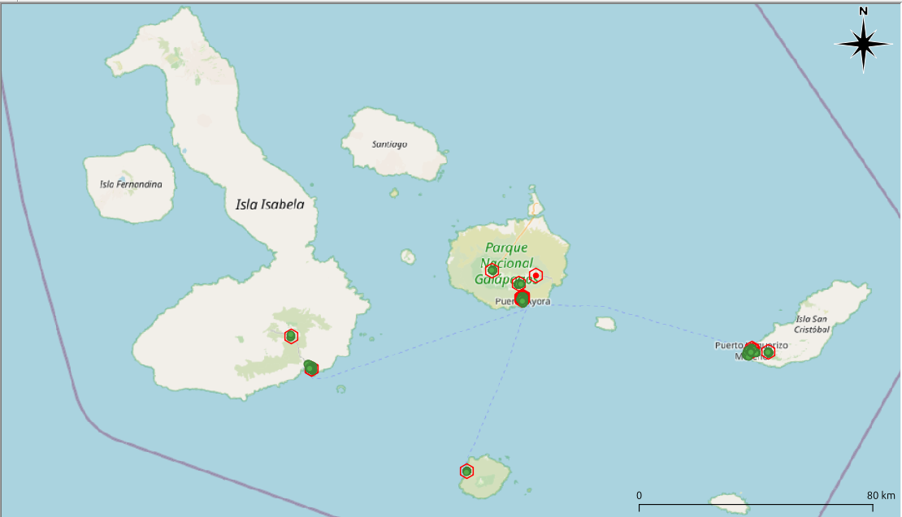

and a detail of a single island, which happens to have four voting centers in its largest city (San Cristóbal, the island to the right/west in the map above):

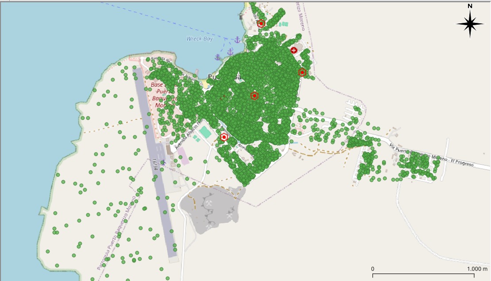

There are a few implementations of the optimal transport problem. Scipy has [a `wasserstein_distance` function](https://docs.scipy.org/doc/scipy/reference/generated/scipy.stats.wasserstein_distance.html) (the Wasserstein distance is another name for the earth-mover's distance, which is the metric that is minimized by all this thing that we want to do), but it's only implemented for 1-dimensional histograms (which are far simpler to solve than the 2D case, see [section 1.2 here](https://mathematical-tours.github.io/book-basics-sources/ot-sources/TransportEN.pdf)), and _also_ only returns the final Wasserstein distance, a single number, the sum of all the distances traveled by all people according to the final assignment. It doesn't seem to give access to the map of all assignments, which we need (that is, who exactly was assigned to each station; or alternatively, for each person, which station they were assigned to).

There's also [the `pyemd` package](https://github.com/wmayner/pyemd), a wrapper for some C++ code that implements a variant of EMD. This one does return the "flow", the details of how much "mass" (in keeping with the mover-of-piles-of-dirt analogy) must be transported, from where and where to. I can't remember why I dropped it, I must not have been able to get it to work, but when I reviewed it later it worked perfectly fine, for the toy example given in the repo.

In any case, I eventually landed on [the POT library](https://pythonot.github.io/index.html) (Python Optimal Transport), which contains multiple algorithms that are more or less variations on the same general problem. For example, have you ever wished to use [the entropic semi-relaxed Gromov-Wasserstein and the entropic semi-relaxed Fused Gromov-Wasserstein divergences](https://pythonot.github.io/auto_examples/gromov/plot_entropic_semirelaxed_fgw.html)? This library can do it. Need to compute [the debiased Sinkhorn barycenter of 1D Gaussians](https://pythonot.github.io/auto_examples/barycenters/plot_debiased_barycenter.html#debiased-barycenter-of-1d-gaussians)? Or [the regularization path for 2D unbalanced optimal transport, both for the fully relaxed case and the semi-relaxed case](https://pythonot.github.io/auto_examples/unbalanced-partial/plot_regpath.html)? [^1] This library can do it.

Oh, and it can also [compute the normal earth-mover's distance](https://pythonot.github.io/auto_examples/unbalanced-partial/plot_unbalanced_OT.html#compute-entropic-kl-regularized-uot-kl-and-l2-regularized-uot).

```python
import matplotlib.pylab as pl
import numpy as np
import ot.plot

xs = np.genfromtxt('galapagos_people.csv', delimiter=',', skip_header=1, usecols=[0, 1], max_rows=n)
xt = np.genfromtxt('galapagos_jrvs.csv', delimiter=',', skip_header=1, usecols=[4, 5])

a = np.ones(len(xs))  # array of 1s for sources, since each person produces 1 unit
b = np.genfromtxt('galapagos_jrvs.csv', delimiter=',', skip_header=1, usecols=[6])  # array of caps per JRV

# loss matrix (distance from each person to each center)
M = ot.dist(xs, xt, metric="euclidean")

# G0 contains the information on which person goes to which center
G0 = ot.partial.partial_wasserstein(a, b, M, np.sum(a), nb_dummies=10)

ot.plot.plot2D_samples_mat(xs[:], xt, G0, c=[0.5, 0.5, 1])
pl.plot(xs[:, 0], xs[:, 1], "+b", label="Source samples")
pl.plot(xt[:, 0], xt[:, 1], "xr", label="Target samples")

pl.show()
```

The actual algorithm is contained in the line `ot.partial.partial_wasserstein`. Everything before that is data wrangling to get the necessary inputs. Everything after that is for plotting the obtained information.

The computation requires three pieces of data: `a`, which are the "masses" of each source point (here, sources are people, each one containing a single unit of mass, so `a` is an array filled with as many 1s as there are people), for Galápagos a ~20K element array; `b`, which are the masses of each target point (or capacities, or demands, or the size of the hole, or here the capacity of each voting center, whose values we obtain from a CSV file exported from QGIS, where each center contains a number that is equal to 400 multiplied by the number of voting stations in that center), for Galápagos an array with 17 entries for the 17 voting centers; and `M`, what the code examples call the "loss matrix", which encodes the distance between _each_ person and _each_ voting center. And yes, it's as large as it sounds: its size is the product of the sizes of the two arrays, and each distance must be computed individually. POT contains a helper function to do that, `ot.dist`, which in turn requires two other inputs: the coordinates of each source element (stored here in `xs`) and the coordinates of each target element (stored in `xt`). The pairing between coordinates and masses is done by position: for instance, the element located at the coordinates of `xt`'s first element has the mass stored in the first element of `a`. Therefore, `xs` must be a N×2 matrix (the 2 is because each point has X and Y coordinates), `xt` must be a M×2 matrix (because each target point also has X and Y), `a` is a N×1 matrix (because each source point has a numeric capacity, which fits in a single cell) and `b` is a M×1 matrix, for the same reason. Each of the N source points gets its distance to each of the N target points computed, and the results get stuffed into a N×M matrix, which is called `M`, the "loss matrix". It looks like this:


We compute the distances by passing the coordinates of each person and voting center in meters, as if they were standard 2D coordinates in a cartesian plane. _Technically_, this isn't correct, since the Earth isn't flat[[citation needed]](https://xkcd.com/285/), and so distance calculations shouldn't use the standard Euclidean distance that you may be familiar with (the square root of the sum of the square of the horizontal distance and the square of the vertical distance), but actually should use [the great-circle distance](https://en.wikipedia.org/wiki/Great-circle_distance). However, since Galápagos is quite small relative to the world, treating it as a locally flat patch of terrain doesn't induce too large of an error, and computing standard euclidean distances is easier than spherical geometry. Furthermore, the coordinates that we have (the ones that come from QGIS and/or the census and/or the voting council data) are UTM coordinates (zone 17S, as discussed in the previous post), which are already in meters, and thus the euclidean distance corresponds neatly to meters, a real-world unit with real-world meaning.

This matrix, filled with distances-in-meters, plus the two arrays `a` and `b`, are fed into the algorithm, and out comes `G0`, another N×M matrix. This one, however, doesn't represent the distance between its row and its column. Instead, this one is filled only with zeros and ones: each cell indicates the amount of "flow" from that row/source to that column/target. For example, whichever number is in the top-left cell (first row, first column) indicates that such a number of units must flow from the first source point to the first target point. Since we made it so all our source points have a mass of 1 (because each source point represents one person, as opposed to a household or some other aggregate of people), no cells can have a value larger than 1, since that would indicate that a certain source must provide more than 1 units of mass, which no source point in our specific problem can provide. Similarly, as long as the sum of all the capacities of the target points is larger than the sum of the masses of the source points (or, in other words, there's enough space in the voting centers for everyone), then each row (corresponding to a target point) must have a 1 in one and exactly one column. No more, because that'd indicate that the person must go to two or more voting centers (i.e. provide two or more units of mass). No less, because that'd be a person that doesn't have a voting center assigned.


For example, in the image above, the first three people have been assigned to the 15th voting center (numbering starts at 0, as is customary in programming, so the column labeled 14 is actually the 15th one in the table). The fourth person goes to the 12th voting center, and then a large group of people are assigned to the 14th center. Of course, those assignments only make sense when mapped back to an actual person, with some specific coordinates or some sort of ID. Same for the voting centers: "the 15th voting center" corresponds to a certain real-world center with a position and a name. Once we map the assignments back to their corresponding points, we can plot the assignments in QGIS, here as blue lines that link the person in a certain position to the voting center in a certain position only if the corresponding cell in the `G0` matrix contains a 1:

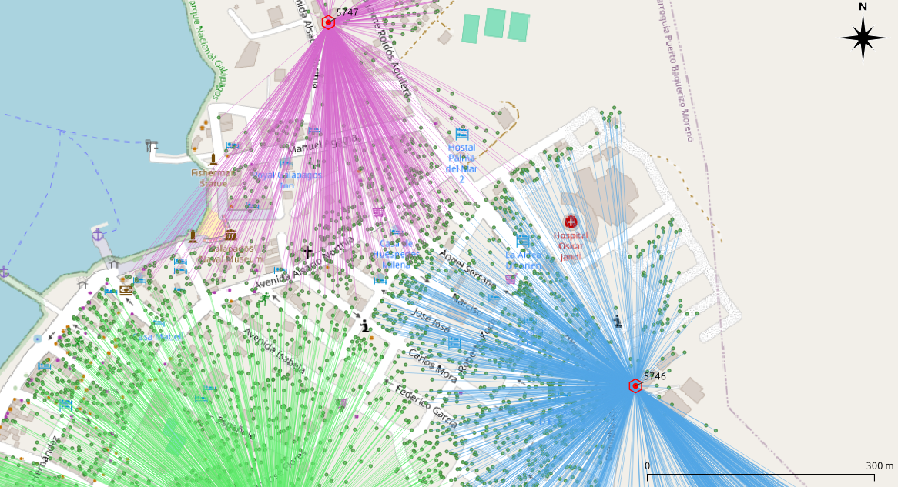

Each person is connected to their assigned "optimal" voting center via a dotted line. The line colors are arbitrary but linked to the assigned center: all lines that end in the same center have the same color, so we can more easily see the regions of people that were assigned to each place.

In the specific case of Galápagos, the assignment performed is mostly trivial: 12 of the 17 voting centers have enough capacity to handle everyone that lives in their vicinity, so the assignment obtained by solving the optimal transport problem is actually the same, or at least very close, to that obtained by our primitive greedy algorithm that assigns people to their closest center. We can verify that by overlaying our Voronoi polygons on the map. As a reminder from the previous article, Voronoi polygons indicate the areas which are "closest" to a certain voting center than to any other, and a dumb-but-simple assignment rule is to just send every person to their closest center, and do nothing when a center gets assigned more people than it can handle:

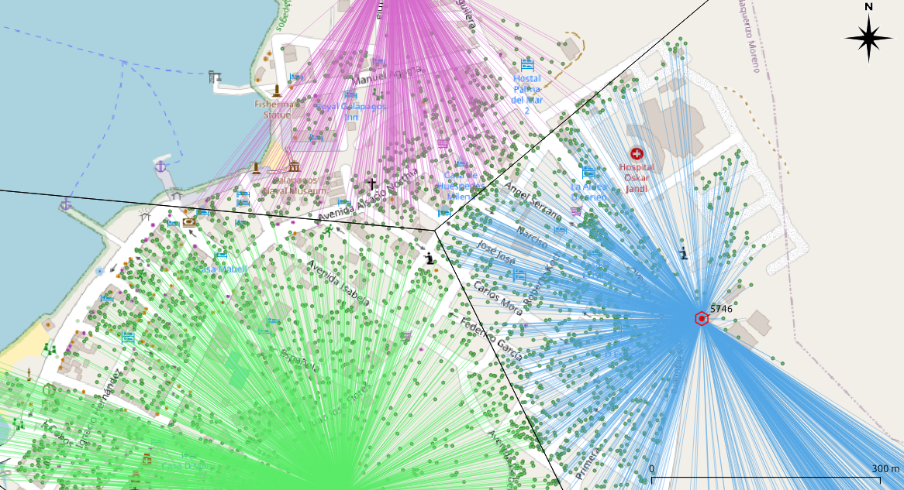

The Voronoi polygons are delimited by the black lines. Each polygon (of which we see three in the image above) contains a single voting station (a red hexagon; the polygon at the northwest doesn't have its station in view, it's slightly more to the north, as you can deduce from all the converging pink lines that go off the top of the picture). If you live inside a certain polygon, the closest voting station to you is the station that is contained inside that polygon. The Voronoi polygons and the black borders are obtained by a purely geometrical algorithm that, in fact, only takes into account the voting centers, not the people. The colored lines, on the other hand, come from our fancy optimal transport algorithm. Notice how the colored lines and the polygons match almost perfectly: almost all the people within a Voronoi polygon have colored lines that go to that polygon's voting center, and there are few lines "encouraging" people to cross polygon boundaries.

Of course, this exact correspondence between the Voronoi polygon and the optimal transport is only possible because Galápagos has relatively few people, so most voting centers were not full, in which case the two algorithms should yield the same results.

There are, however, a few (5 of 17) voting centers which _do_ overflow, such as these, located in the Santa Cruz island. You can see that the polygon to the north is shaded in red, denoting that its voting center is overflowed. Indeed, it accepts 1600 people (to be precise, it has 4 voting stations, each of which we assume to take 400 people), but it's the nearest station, and therefore the top choice, for 2558 people (that is, 2558 green dots fall within that center's Voronoi polygon):


However, if we activate the colored lines that show the assignments obtained via optimal transport, we see how it self-corrects for this case. Notice in particular the green lines that go to the center (red icon) labeled 1837, and how some of them come from the top (full) sector. These are the people where optimal transport has diverged from the simple nearest-center assignment that we used in Experiment 1:

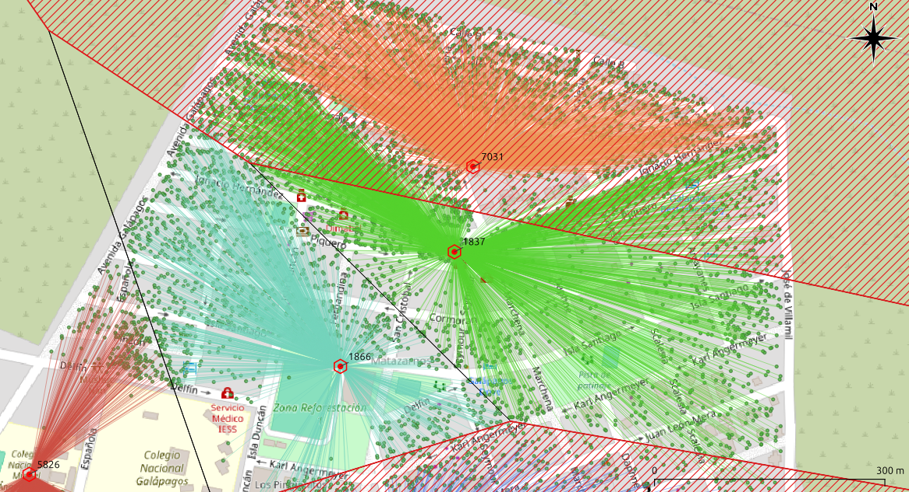

In particular, there's two areas in the overflowing polygon that have beed diverted elsewhere: you can see that the green lines in the red polygon at the top of the image point _downwards_, to the voting station near the center, rather than towards the "correct" voting center for that polygon. These are the people that get redirected in order to respect center 7031's max capacity, which is what the simple assignment in Experiment 1 couldn't handle. In effect, less-than-full centers can take up the extra work, and the optimal transport algorithm (that's why it's called _optimal_, after all) still guarantees that, overall, the assignment is the best possible one. In other words, there are no other choices for people to redirect that would yield, in this case, a lower average distance when computed over _everyone_. Here, it chose to keep the northernmost people on the center 7031, the full one, while redirecting people more to the south to the second center downwards, number 1837.

Below is another example, in San Cristóbal Island this time. The center to the bottom and left (1663) is overfull, the one to the top right (468) isn't. And, as expected, some of the people near the border on the bottom side get assigned to the top center. This makes sense since those people are the most ambivalent as to which center they get assigned to; someone who lives right on the dividing line of a Voronoi tessellation is at exactly the same distance from either voting center, so people who live near the border pay the smallest penalty (in terms of additional distance, and hopefully time traveled too) for being assigned to "the other side". While it's harder to see (as always, you can click on an image to zoom in, or right click to open in a new tab), look at the dividing line: there are some green lines that come from below the line (from the shaded red area) yet are assigned to the top center, the one tagged 468:

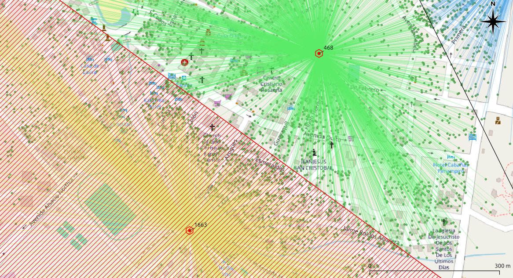

So, we've now verified that, in the simplest case, this approach gives sensible results: when all voting centers can support it, the optimal thing to do is of course to assign people to their nearest center. There's no reason to make people travel farther, and it'd only increase the total distance traveled. Both our greedy algorithm and optimal transport would give the same results in such a case.

The beauty of optimal transport, however, is that it can also gracefully deal with the case in which voting centers can _not_ handle all the people that live closest to them, or when people need to be reassigned to centers that are farther away. In such cases, the optimal transport procedure would still guarantee that the total distance traveled (by everyone as a whole, and therefore, since the number of people considered is constant, also the average distance traveled) will be the smallest value possible, while still respecting the problem's constraints, most notably the capacity of each center.

That being said, its computational requirements shouldn't be underestimated. It's _considerably_ more memory-, time- and CPU-hungry than the simple Voronoi polygon method. In fact, I couldn't get it to run on my PC (which, admittedly, isn't anything out of the ordinary, with 8GB of RAM) for the largest canton in the country, not even when assigning entire households to centers instead of people (which cuts the number of points to assign by a lot[^9]). That was ~300K groups of people being assigned to ~350 centers, and it never terminated. It eats 8GB of RAM and 8BG of swap, and keeps going (well, not really, since the PC freezes at this point and must be hard-rebooted. But it would keep going if it could!). I wanted to process the entire country so we could compare the metrics for this method (such as how many people it assigned and how many it couldn't assign, and the average distance under this method) to the simpler go-to-nearest-center-if-possible method that we explored in the previous post (which, remember, happily ran on that same PC for several million people-points and over 8K voting center-points). Since I couldn't get the EMD method to work for the whole country, I instead took Galápagos's metrics for the previous method and this one, and hand-waved any concerns about applicability to other, more crowded, environments.

As a reminder, under the simple Voronoi assignment that we explored previously, Galápagos comes out like this:

* 19.5K of the 21.8K people that live there were assigned to their nearest center, so about 90%. The remaining 10% couldn't fit and weren't assigned anywhere (which is the main weakness of this simple scheme, it doesn't cope with centers that are the closest to more people than the center has capacity)
* Five of the 17 voting centers in the islands are assigned more people than they can handle, and thus overflow
* The overflowing centers have, on average, ~1.9K capacity, yet are being assigned ~2.4K people, so they're being allocated 125% of their capacity
* The non-overflowing centers, on the other hand, have on average 1.6K capacity and are being allocated an average of 900 people, which means they're working at ~55% capacity
* Of the people that got a place in their closest center, the average straight-line distance was ~270 meters

Under the new, "smarter" scheme that uses the Earth-Mover's Distance and the fancy algorithms to optimize for the global _minimum_ average distance traveled (only run for Galápagos), we get the following metrics:

* _Everyone_ gets assigned a center, all 21,837 people in the province. Which is just as well, seeing as how the 17 voting centers combined have over 27K spots available, so everyone had better have a place, it's not like we're short on them
* Five of the centers had every last possible spot assigned, i.e. they're operating at 100% capacity. They seem to correspond to the centers that overflowed under the previous assignment
* There's no longer a "125% capacity assigned" metric for the overflowing centers, as the algorithm ensures that no capacity is assigned if the center can't handle it (in other words, it respects the max capacity of centers, so the highest utilization that you'll see is 100%)
* For the non-overflowing centers, we see ~1.5K average capacity and ~900 people assigned, which is fairly similar to the previous case. This is because not too many people were reassigned (only 10% of the total population)
* The average distance between person and assigned center has now gone up to ~295 meters. This makes sense, since we would expect at least _some_ increase over the simple method: that one took _literally_ all the best possible case by attempting to assign each person to their nearest center, and in case of overflows, leaving only the closest people and dropping the rest. So in a sense the simple Voronoi algorithm was behaving somewhat like a student taking only classes that he knows he'd do well in, dropping courses at the first sign of trouble, and then being proud of his high GPA. This second scheme, on the other hand, handles _everyone_, whether they're easy to assign or not. Still, going from 270 meters to 295 meters, on average, is not too brutal

So, to recap: At least when using Galápagos as a guinea pig (which is, to be fair, one of the simplest provinces: it's very small, has very few people, and they're concentrated in only three or four clusters), an assignment based on the Earth-Mover's Algorithm (AKA Optimal Transport) successfully assigns _everyone_ to a voting center. Furthermore, due to the algorithm used, we're guaranteed (I think?) that the found assignment is _optimal_ in the sense that it minimizes the total distance traveled, which in turn means that it also minimizes the average distance traveled by everyone on Election Day.

Those are the good parts. The bad part is that it's much more computationally complex than simple geometric assignment. Running it on the entire country at once is probably... not recommended. Thankfully, there are some natural boundaries that must be respected anyways: assignments of people to centers can't cross province boundaries, since some authorities in some elections are elected per-province; and there may be even another layer of division below provinces for mayor elections, I'm not sure (though not for presidential ones, but we may as well keep the same assignments). Even then, my PC just didn't have the memory to run on the largest partitions of the data. Arguably, that should be a lot less of an issue for a government dependency with a far larger budget than mine (multiple millions of dollars are allocated per election, vs. the $0.00 that I was willing to spend on this) and a lot of time to run things offline (under normal circumstances, there's one election every two years).

In other words: this is the Deluxe Platinum Plus option, lifelong guarantee. If you can afford it, it'll give you the Optimal Result, every time, guaranteed (or, should a pathological case arise in which there's fewer places in voting centers than people that need to vote, it'll loudly and clearly complain since the Optimal Transport solver won't find a feasible solution).

## Experiment 3: The Gale-Shapley algorithm (AKA Stable Marriage)

### The Stable Marriage problem

The Gale-Shapley algorithm is an algorithm that solves what is sometimes called the Stable Marriage problem. For a fairly down-to-earth statement of the problem, including concrete worked-through examples, see [these notes](https://web.ece.ucsb.edu/~jrmarden/ewExternalFiles/lecture04-notes.pdf).

The traditional formulation (which, thankfully, isn't used anywhere for its stated purpose, as far as I'm aware[^4]. There's room there for some sort of dystopic novel where Big Brother arranges marriages according to this algorithm) involves N "men" and N "women" (same numbers of each). Each man has a list of women in order of preference, and each woman has a list of men in order of preference. That's the inputs.

The problem is to find a _matching_, a way of pairing men and women, one-to-one (that's why there have to be equal amounts of each), such that the matching is _stable_, which means that there mustn't be any man and woman that haven't been matched by the algorithm, yet both would prefer each other to their matched partners.

The reason why _stable_ matchings are interesting is that, in an _unstable_ matching (which is just the opposite of stable, meaning that there is a man and a woman that aren't matched but prefer each other to their matched partners), there would be an incentive for the two entities involved to leave the whole scheme: since they both have a more desirable choice (each other) than what the algorithm gave them, they're better off running away together. Unless, of course, Big Brother takes care of that small issue. In other formulations of the problem, such as those that involve medical students and hospitals offering spots in residence programs (as is famously the case in the US's National Residency Match Program), that would mean hospitals preferring to not participate in the system, and students not engaging in it, so a "black market" of residency spots and applicants could emerge.

Thus, if an algorithm can guarantee a _stable_ matching, that means that there's no reason for entities to leave it: there won't be any "better" deals outside of the program. To be certain, someone may be matched with not-their-first-choice from the other side, but the algorithm guarantees that, even if that entity (for the sake of exposition, let's say a man) went around to all the women that he prefers more than the woman he was assigned, and asked if they're interested in running away together, they won't. None of the asked women will prefer the asker to their assigned partner. So there shouldn't[^2] be any reason for actors to collude and leave the system.

If you squint your eyes _a lot_, the stable marriage problem looks a bit like our people-to-centers problem: there's two categories of entities (people and voters, like men and women, or med students and hospitals), they need to be matched, and we could imagine a way for people to rank voting centers in order of preference: nearest centers go first, farthest centers go later. As for voting centers, arguably those wouldn't care about the people that they receive (as opposed to, for example, the case of hospitals that would perhaps prefer med students with higher grades or more compelling request letters or whatever), so perhaps we could make voting centers submit a list of preferred voters in order of distance, so voting centers "prefer" the people closest to them too.

However, the two problems don't match quite as well as the Earth-Mover's Distance problem. For instance, while the priority that people assign to voting centers is obvious (less distance=more betterer), the reverse isn't necessarily clear (voting centers don't need to prefer closer people). Furthermore, the traditional formulation of the stable marriage problem requires that each entity ranks all the entities from the other side, while here we may not necessarily want to have every person rank every voting center in order of preference. The first 10 or 20 should be enough&trade;. Also, the whole motivation for the problem, that of finding a "stable" arrangement where people aren't incentivized to leave the system and do their own thing, isn't an issue here: it's not like, if you get assigned to a voting center that is far away from where you live, you'll go talk to a closer voting center and convince it to elope with you. We'll try this method anyways and see what happens.

In addition to its famous usage to match med students to residency programs in the US, the Gale-Shapley algorithm is also used (per [this paper](https://web.mit.edu/6.829/www/currentsemester/papers/cdnalg.pdf), apparently written by two people from Akamai) in Akamai's CDN, in order to determine which _map units_ (a map unit consists of an IP prefix, such as 1.2.3.0/24, plus a "content class", such as _video_) are assigned to which _clusters_ (bunches of colocated servers and associated equipment, of which the authors indicate there are thousands in the world). Map units are partitions of the IP address space such that the IPs that share a map unit are geographically and connectively close and should experience similar performance in regards to which clusters they perceive as "fast" and "slow". Each map unit has a demand, and each cluster has a capacity. The global load balancing algorithm is supposed to be a variant on stable matching that determines which map units go to which clusters.

There's also [another presentation](https://u-abramchuk.github.io/presentations/stable-marriage-tauconf-2016/index.html?full#23) available online, by Uladzimir Abramchuk, in which the same algorithm was used in a lead management system ("leads" as in "prospective customers"[^3]) where leads that must be followed-up on are matched to offices that have a limited capacity for leads to pursue (perhaps tied to the number of people that work on that office and the work that a single person can do in a day, or whatever). Offices have a maximum geographical range (you can't travel for a week to talk with a prospective customer for half an hour, after all). Offices rank leads, if I'm reading that slide correctly, by the number of offices nearby (maybe in order to prioritize leads that have no more alternatives), and leads rank offices by the number of leads that they're already processing (presumably leads prefer offices that are less busy? This may be to provide automatic "load balancing" between offices: if leads preferred busier offices instead of less-busy ones, then as soon as an office started getting busier, it'd just attract more and more leads until its capacity was exhausted, while other offices would just sit idle).

And there's also [this paper](https://arxiv.org/pdf/2110.08796), even though it seems quite light on the details, that applies stable matching to the problem of assigning UAVs (as in, drones) to HAPs (High Altitude Platforms, so essentially big beefy flying things, they look like blimps in the image). The idea is that users, down on the ground, connect to UAVs (small-ish drones) that are hovering somewhat nearby (the paper casually drops the figure "50 to 350 m above the ground"). UAVs connect to HAPs "operating at an altitude of 18 to 22 km in an urban area". HAPs connect to a satellite or a network thereof. Satellites provide network access (presumably Internet connectivity) to the users, via the HAPs, via the UAVs. See the diagram below, which can be found on Page 2 of the paper:


The paper uses stable matching to match HAPs to UAVs (technically, antennae on each, since each HAP may be able to serve multiple UAVs, one UAV per antenna). Here, each HAP ranks UAVs on two criteria: "path loss" (a measure of signal lost on communications, which is correlated with the distance between the two endpoints, the condition of the atmosphere between then, and any interference present) and the number of users/end devices that the UAV in question can serve (the idea being to maximize the number of end users served by the whole thing). The usage of Gale-Shapley seems quite handwavy (the loop over preferences isn't clear on which is the proposing and the accepting party, and there's no clear distinction on which criteria are used by _both sides_ to generate the preference lists), and the net effect seems quite small (see the two lines in Figure 3. While I'm not an expert in designing allocation algorithms for multi-tier wireless networks, the two lines seem fairly close to one another. There's a difference, for sure, but how important is it?), but it's still a fun example of a weird place in which people have used Gale-Shapley.

### Application to voting

For this case, we'll take inspiration from Akamai's presentation. In their case, users (well, groups of nearby IP addresses) are matched to CDN clusters. The preferences of map units for clusters are dictated by the latency, packet loss, link throughput and other network metrics. The preferences of clusters for map units are given, for example, by contractual terms and network locality (e.g. avoiding cross-AS traffic if possible or having a cluster prefer to serve the network "downstream" of where it's installed, such as smaller ISPs that are only served by the ISP where the cluster lives).

In our case, the preference of people for voting centers is clear: more nearer is more betterer. That's it. The beauty of this algorithm is that, conceivably, we could give people a nice little web UI so they can _personally_ modify their preferences by drag-and-dropping, say, their top 10 preferred voting centers. The Gale-Shapley algorithm is explicitly designed to deal with user-provided preference rankings.

As for the preference of voting centers for people, that's much less clear. In fact, I can't think of a single criteria other than the same, but in reverse: voting centers should prefer the people that live closest to them. Ideally voting centers should be entirely neutral receivers-of-people, so they shouldn't care about which people they take in.

As indicated in the Akamai paper (bullet point 2 of Section 2.1), it's "unnecessarily expensive to measure and rank every cluster for each map unit". Or, here, we shouldn't necessarily compute a ranking of each of 300K households to each of 350 voting centers (for the largest cantons in the country). Each person/household may, for example, list its top, say, 5 closest centers (in the hopes that one of those 5 will be able to handle them), and each voting center would list every person/household that listed that center. Those numbers were defined by a very scientific process that is known in the industry as I Just Made Them Up, which is the source of 83.48% of all data. They can be tweaked later, if I feel like it. We can't just have each household express a single voting center as a preference, since if that one fills up, they will be left with nowhere to go, as far as the algorithm is concerned: partial preference lists in the Gale-Shapley algorithm are interpreted as "I'd rather stay single than marry people not in the list", which here would translate to people left with no place to go. By having each household rank its top five or ten centers, they get a buffer in case their top choices are full.

In fact, the specific problem of voters is more reminiscent of [the Hospitals-Residents problem](https://eprints.gla.ac.uk/115765/1/115765.pdf) than of the original stable marriage formulation. Hospitals can have a quota of residents, much like voting centers, whereas residents can only be assigned to one hospital (though they can apply to many), much like voters. Stable marriage, on the other hand, is one-to-one in both directions, which doesn't map as cleanly to our problem: in fact, many-to-one variants of stable marriage sometimes fake it by "exploding" the entity that can take many of the other side (say, hospitals) into multiple "slots", each of which can only be paired one-to-one (to, say, one resident per slot). The HR problem, on the other hand, already includes in its formulation the idea of hospitals having a _capacity_.

Fun fact: For ~35K residents (with ~10 top hospital choices each) applying to 4.5K hospitals (with ~60 top student choices each) with 30K total positions, [the algorithm takes an average of 17 seconds to run](https://vishnuravi.medium.com/how-long-does-the-residency-match-algorithm-take-to-run-c38c06cd4d57). This is... surprisingly short? And on a 2 CPU, 16GB of RAM EC2 instance, so nothing magical either. That's on the ballpark of the amount of people in Galápagos, which will be (as is tradition) our small-sized Guinea pig.

Getting QGIS to spit out preference lists for each person (top 5 nearest voting centers) and each voting center (everyone who included that center in their lists, ranked by ascending distance) seemed to be more trouble than it would be worth, so instead I reached (again) for DuckDB. Turns out that DuckDB's [geospatial extension](https://github.com/duckdb/duckdb-spatial/blob/main/docs/functions.md) is very powerful. In particular, since DuckDB eats many file formats for breakfast, we can do such fun things as:

```sql
create table jrvs as (
    select
        *,
        ST_POINT(x, y) as geom
    from 'jrvs.csv'
    where "CODIGO PROVINCIA" = 20
);
```

This reads the CSV file that holds all the country's voting centers, filters those from province 20 (which happens to be Galápagos), and creates a table `jrvs` containing all data from that CSV file, plus another column `geom` that [contains a geospatial Point](https://github.com/duckdb/duckdb-spatial/blob/main/docs/functions.md#st_point) based on the X and Y columns (which are UTM zone 17S coordinates). This dedicated column containing a real Point will be useful later when we express distance calculations.

Notice how we ingest _directly_ from a CSV file. No weird function calls (there is one under the hood, but for simple all-defaults ingestion it isn't needed, DuckDB infers that is must call it from the extension of the string passed to the `FROM` clause). It gets even better, though:

```sql
create table people as (select * from 'gal_people.shp');
```

Now we read from a Shapefile... file. It's a vector file format commonly used for geospatial data. This particular one contains points (Shapefiles can also contain lines, such as paths/routes traveled, or polygons such as administrative or geographical boundaries). Each point represents one person. Each point also has other attributes attached, though in this case they aren't important since this particular Shapefile just contains the randomly-sprinkled points inside the blocks of buildings that come from the 2010 census. Nevertheless, since this data comes from a Shapefile, a geospatial file, it natively includes a `geom` column with a true Point, much like the voting centers table `jrvs`. The difference is that in that one we had to manually create the Point from two numeric columns.

Now that we have tables `jrvs` (18 records) and `people` (~21K records), we can express the question "for each person, find the top 5 closest voting centers" in Just One Simple SQL Query (for certain values of _simple_, that is...):

```sql
create table person_prefs as (
select
    p.rand_point,
    j."CODIGO RECINTO",
    ST_DISTANCE(p.geom, j.geom) as dist,
    ROW_NUMBER() over each_person as rank
from people as p
inner join jrvs as j on (true)
window each_person as (
    partition by p.rand_point
    order by dist
)
qualify
    ROW_NUMBER() over each_person <= 5
order by p.rand_point, dist);
```

This query is fairly complex, as is sometimes the case with SQL, especially due to the convoluted order of operations. The main building blocks, roughly in order of execution, are:

* The `FROM people JOIN jrvs ON (true)` is an all-against-all join, AKA a cartesian product: joins have a condition that determines which pairs of records are kept, and `ON (true)` will always be true (duh), thereby keeping every possible pair. At this point, we have 393,066 records, the result of mixing every person with every voting center
* In the `SELECT` clause near the start, we keep, for each of those ~400K pairs of person+voting center, the person's random ID, the voting center's unique code, and we call [the `ST_Distance` function](https://github.com/duckdb/duckdb-spatial/blob/main/docs/functions.md#st_distance) from DuckDB's `spatial` extension. We pass to it, as arguments, the person's `geom` (a Point) and the center's `geom` (also a point). This returns a number, the distance between those two points. Since UTM coordinates are in meters, this distance is also in meters. We call this new column `dist`
* The `WINDOW` clause is used a couple of times, so it gets declared more or less at this point. It specifies the fact that each person's rows (18 of them at this point, one matching that person with each of the 18 voting centers) should be considered in isolation from the rows of everyone else (that's the `PARTITION BY p.rand_point` part), and that within each person's tiny 18-record world, the rows should come in the order of nearest-to-farthest centers (`ORDER BY dist`)
* Still in the `SELECT` clause, we have a fourth column, `ROW_NUMBER() over each_person`. `ROW_NUMBER()` returns an ever-increasing number, 1 for the first record, 2 for the second, and so on, while `over each_person` (which refers to the window clause above) makes it so the numbering is only _within_ each person's partition. So there are many rows with number 1, it's just that _each particular person_ only has a row 1. In fact, since at this point we haven't filtered anything out (at least logically. Who knows how DuckDB actually executes this query), there are exactly the same number of rows with 1, with 2, with 3 and so on until 18: one per person in Galápagos
* The `QUALIFY` clause runs at this point, and it leaves only rows that happened to be first to fifth within their own domains (each person). At this point we have the top 5 nearest centers per person: since we sorted in the `WINDOW` clause by `dist`, each person's #1 is their closest center, #2 is the second closest, and #18 is the farthest. So keeping only rows where `ROW_NUMBER() <= 5` means keeping the five nearest centers
* Finally, just for visualization, we `ORDER BY` each person (so each person's records are kept together), and within each person, we order by distance

The end result looks like this:

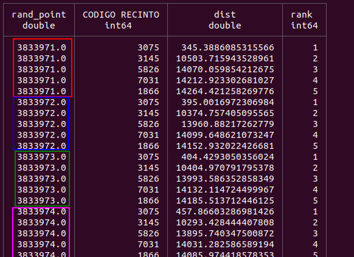

This is precisely the preference list for people: the person with ID 3833971, the first in the table, prefers voting center 3075 (since he lives 345 meters from it), followed by 3145 (10 km away), followed by 5826, 7031 and 1866 (about 14 km away, presumably on another island, or at least in another village). Same goes for each other person in the islands.

Of course, getting the voting center's preference lists is simply a matter of regrouping the same data:

```sql
select
    "CODIGO RECINTO",
    json_group_array(rand_point::int) as people,
    json_array_length(people)
from (
    select * from person_prefs order by dist asc
) as x
group by "CODIGO RECINTO";
```

A potential complication of the Gale-Shapey algorithm is that, for a match to happen (say, between a man and a woman, or a resident and a hospital, or a voter and a voting center), each of the two sides must have included the other in the preference list. If a voter hasn't even included a center in their rankings, it doesn't matter if the center has included the voter: they'll never be matched. Initially I made voting centers submit a preference list composed of their closest people, up to twice that center's capacity. However, that risks not including some people that did include that center in their personal preference lists. Furthermore, even if a person lists five centers as their top preferences, those may be "wasted" if the centers in question haven't, in turn, listed that person in their lists. This is why now the center's preference lists are just the same as for voters, except viewed from "the other side".

Surprisingly, there aren't too many ready-made libraries that implement Stable Matching on mainstream programming languages. There's [this package](https://github.com/vishnuravi/stablematch), which is the one that was developed for [the article above](https://vishnuravi.medium.com/how-long-does-the-residency-match-algorithm-take-to-run-c38c06cd4d57) that found out that matching ~35K residents to 4.5K hospitals for 30K open positions takes 17 seconds in completely average hardware. It's written [in Ada](https://ada-lang.io/), a language that (at least [according to the latest SO Developer Survey](https://survey.stackoverflow.co/2024/technology#most-popular-technologies-language), ranks in popularity lower than Julia, Fortran and Solidity, but higher than Erlang, Prolog, OCaml and Cobol). This means that, for pretty much anyone wanting to use it (it certainly was the case for me), the first thing you need to do is to install an Ada toolchain (namely, a compiler). The AdaCore GNAT Compiler that the README links to is already deprecated (its latest version is from 2021), and doesn't work with the newest Ubuntu LTS release (24.04). The current toolchain is [Alire](https://alire.ada.dev/docs/#installation), after which you can clone the repo, `cd` into it, run `alr init --in-place --bin stablematch`, answer the questions with whichever data you prefer, run `alr build`, then run `./bin/stablematch < ./data/sample_data` for testing (it should exit in a few seconds _at most_, having printed assigments, both applicant-optimal and hospital-optimal). It reads from [a plain text file](https://github.com/vishnuravi/stablematch/blob/master/data/sample_data) in [a very simple format](https://github.com/vishnuravi/stablematch?tab=readme-ov-file#input), containing the number of applicants and hospitals, the preference list for each applicant, and the number of spots and preference list for each hospital. I did install the Ada toolchain and got this to run on the included sample of 100 residents applying to 100 hospitals, but I'm very much out of my depth with Ada. Furthermore, when testing it with 20K people and 18 voting centers, the program exploded with a weird `STORAGE_ERROR : stack overflow or erroneous memory access` error. Some cursory Internet search seems to suggest that the program may be allocating a large table in the stack, which would make sense considering that it must have to keep, in memory, some sort of matching table containing which voters are assigned to which centers. In any case, I couldn't get this to work for Galápagos.

An alternative is [the `matching` Python package](https://daffidwilde.github.io/matching/), which "is all about solving matching games in Python. Matching games allow for the allocation of resources and partnerships in a fair way." Here, "games" is used in the game-theoretical sense of the term, not on the fun-and-games sense. They even [have a guide](https://daffidwilde.github.io/matching/docs/tutorials/hospital_resident.html)[^5] for the residents-to-hospitals case, many-to-one. This takes three JSON files, one indexed by residents (each with his list of desired hospitals), one indexed by hospitals (each with its list of desired residents) and another one indexed by hospitals (each with its capacity). The actual execution of the algorithm is only a few lines of code:

```python
# load the data
game = HospitalResident.create_from_dictionaries(
    people_prefs, center_prefs, capacities
)

# run the algorithm
solution = game.solve(optimal="resident")

# display the solution
for hospital, residents in solution.items():
    print(f"{hospital} ({len(residents)} / {hospital.capacity}): {residents}")
matched_residents = []
for _, residents in solution.items():
    for resident in residents:
        matched_residents.append(resident.name)

unmatched_residents = set(people_prefs.keys()).difference(
    matched_residents
)
print(unmatched_residents)
```

(There are no unmatched voters, by the way, that's what the last block of code confirms. Which is as expected, there is plenty of space in voting centers, it'd better not leave anyone hanging)

Using a single CPU core (this is CPU-bound Python, so the GIL precludes usage of multiple cores) on a fairly old processor (4th gen i5, from circa 2013), the assignment of 21K people to 17 voting centers took 8 minutes. Not too good, especially since Galápagos is fairly small. The largest cantons can have 15× more people and 20× more voting centers, and the algorithm is O(N²) on the combined sizes, though I think that it's not so bad since the length of the preference list for each person won't increase, since each one will have just 5 preferred centers, so... In any case, there _may_ be opportunity for optimization here. And for the judicious application of money towards the acquisition (or rental, y' know. AWS exists and it's totally feasible to rent a powerful machine for an hour or two, compute everything, and then tear the machine down) of hardware to speed things up.

The result of that script is a list of people that have been definitively assigned to each voting center, that looks like this:

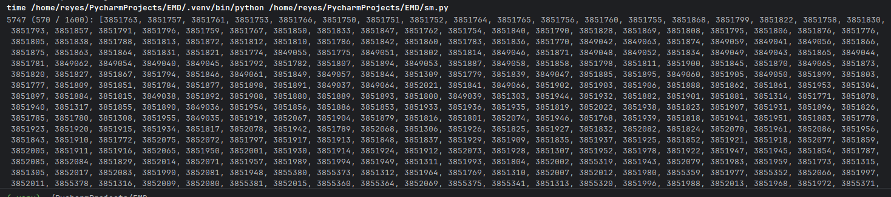

The first number is the ID of the center. The two numbers between brackets, that look like (570 / 1600), indicate that this particular center has been assigned 570 people out of its total capacity of 1600. Other centers are indeed full. Then comes a huge list of numbers, this time people IDs, of everyone that was assigned to that center. The same pattern is repeated for every other voting center.

Some more wrangling of data in order to get it back into QGIS is in order, and then we can visualize the information. I've plotted lines linking each person (small green circles) to their assigned voting center (red dotted hexagons). The lines are colored according to the voting center to which they go, so we can more easily see clusters. This is Puerto Baquerizo Moreno, in San Cristóbal Island:

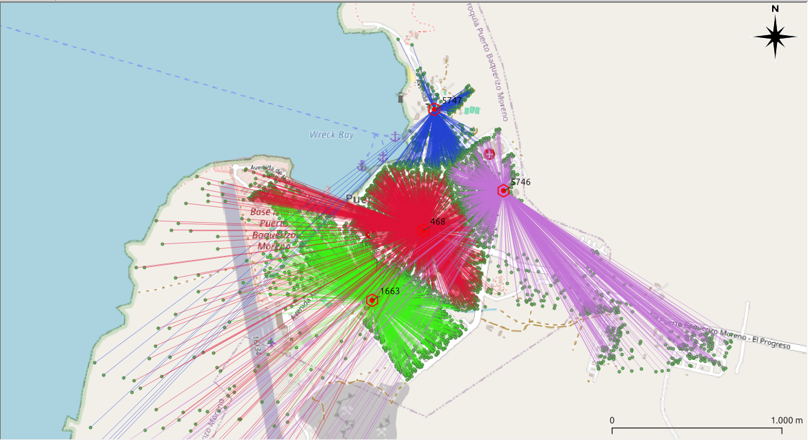

and this is Puerto Ayora, in Santa Cruz:

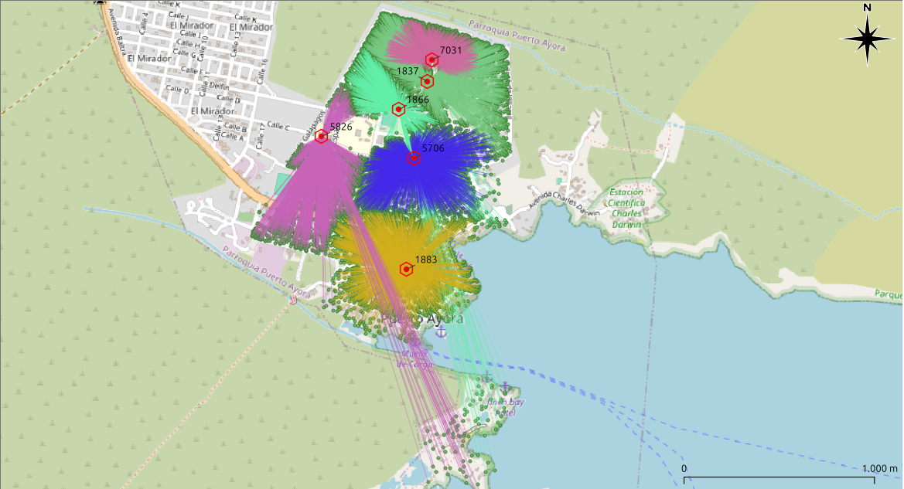

Those two are the largest inhabited places, everything else contains one or at most two voting centers, so they're uninteresting. Here's, for example, [a tiny village](https://www.google.com/maps/@-0.8544326,-91.0255281,694m/data=!3m1!1e3!5m2!1e1!1e4?entry=ttu&g_ep=EgoyMDI1MDQwMi4xIKXMDSoASAFQAw%3D%3D), with only 35 people in the 2010 census, Santo Tomás in Isabela:

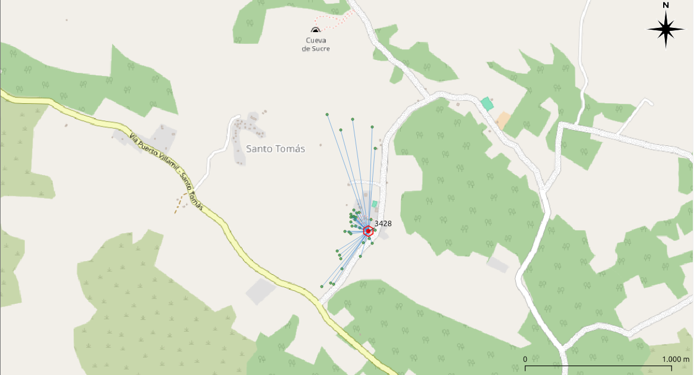

Everyone who lives there was (very reasonably!) assigned to the single voting center in the village, since we don't see any lines starting in those people and shooting off to the distance, as would happen if some unfortunate soul were to be assigned to, say, a voting center in another island. Nor do we see lines coming from offscreen to land in the voting center, since that would indicate that someone now has to make the trip to a tiny village in the slopes of the Sierra Negra (AKA Santo Tomás, at least per Google Maps) volcano, just to cast a vote.

So, the Stable Marriage algorithm appears to be behaving reasonably, on a cursory examination. Once again, let's run our usual metrics:

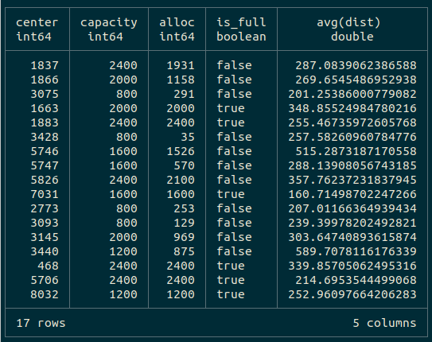

* As with the Earth-Mover's Distance approach, everyone was assigned a center, so 100% success rate
* Six centers were completely full and operated at 100% capacity
* By design, no centers operated at >100% capacity, since the algorithm won't ever assign more than the declared number of spots to each center
* For the non-overflowing centers, we see ~1.5K average capacity and ~900 people assigned, very similar to the Earth-Mover's Distance approach
* The average distance between person and assigned center is now ~320 meters

This last figure is the most interesting. The EMD scheme managed to also assign everyone, and the average distance traveled was 295 meters. It appears that the Stable marriage approach, at least for this specific case, found a less-optimal assignment of people to centers. This, at least, indicates that both algorithms are operating differently: one of my worries was that it would be making exactly the same choices, such as assigning people to their closest centers if at all possible, and the spillover being assigned to their second-closest choice. However, the two algorithms perform differently, which we can see when we look at the busy places with multiple voting centers, some of which overflow. Isolated villages with a single center aren't as useful, since they simply handle the entire village and that's it.

Here's Puerto Baquerizo Moreno under the EMD method (left) and Stable Marriage (right). Drag on the divider to compare the two images:


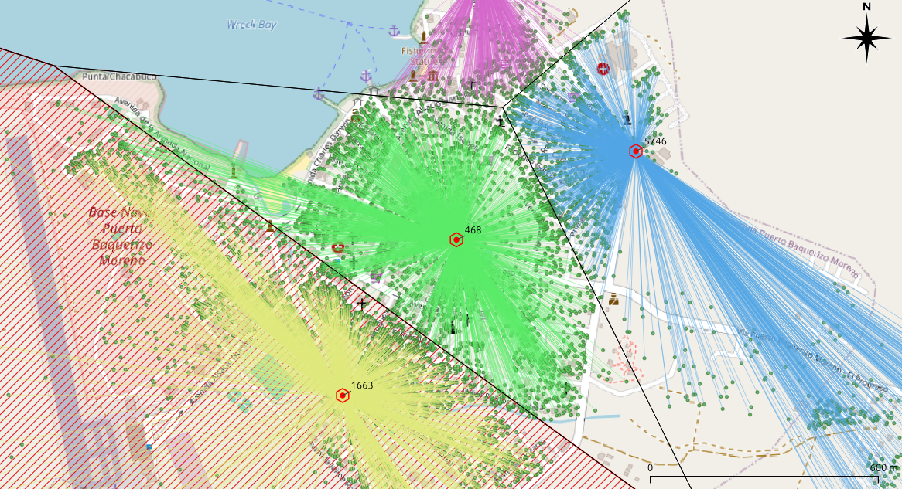

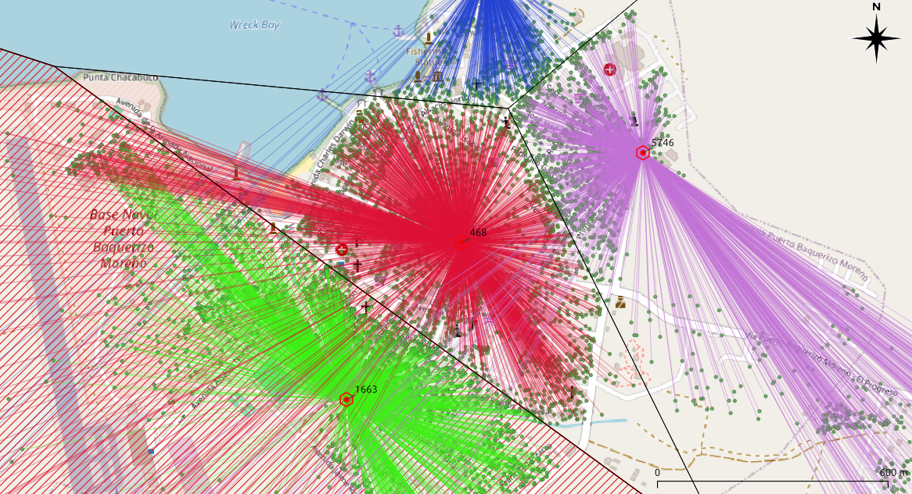


The largest difference that I can see is that EMD respects the Voronoi polygons much more, as you'd expect, since it's aware of distances. Stable Marriage, on the other hand, has some fairly long lines for no particular reason. See the red lines that start at the left side, and then cross half the screen to get to voting center 468. Those are for people that should have been assigned to the region at the bottom left corner, to voting center 1663. However, since 1663 is full, some people are diverted elsewhere. However, here's the issue: for _everyone_ in the region controlled by 1663, their second choice is 468. So there's no way for the algorithm to pick which of the people near 1663 should be diverted to 468: as far as it's concerned, it could downgrade anyone to their second choice, and they'll all be equally (dis)pleased. This is why it doesn't try to divert the people near the border, which would be the prime candidates for reassignation: since they live near the equal-distance line anyways, swapping them from 1663 to 468 is just a small increase in their traveled distance. Stable Marriage, on the other hand, picks people that must travel much larger distances: it'd be better for people near the border to be moved from 1663 to 468, and those empty slots in 1663 would be used to receive those people beyond the left edge of the map. The people near the border wouldn't care too much, and the people beyond the left edge would see their travel distance much reduced.

Here's Puerto Ayora, the other place with multiple voting centers, some of them full. EMD to the left, SM to the right:


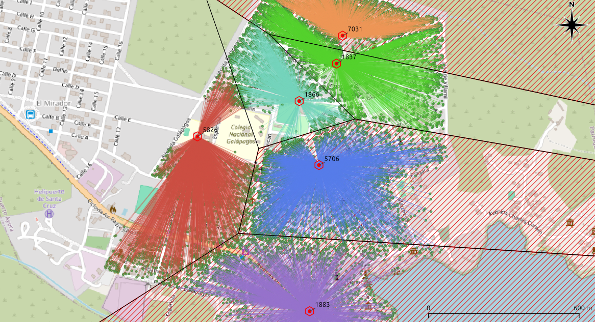

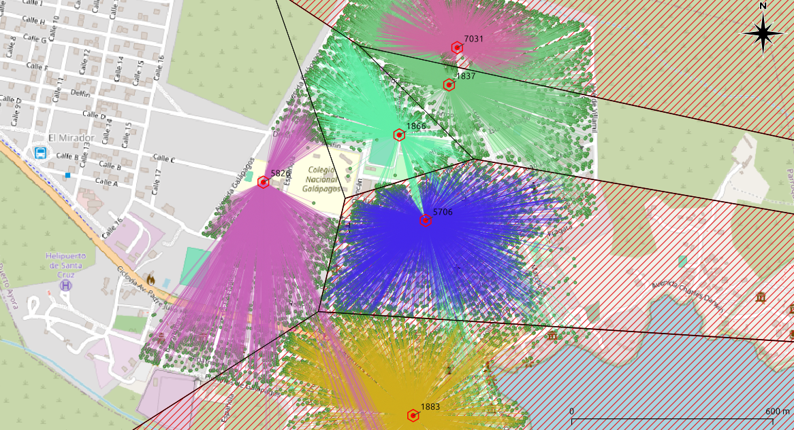


Again, we see a similar pattern. EMD tries very hard to minimize the length of the lines, whereas SM doesn't. See the cyan lines that cross the whole screen upwards and go to 1886, they come from under the bottom of the image. Same for some of the dark pink lines that go to 5826. Those are the overflow from 1883 at the bottom, which is full as shown by its hatched red polygon. However, picking the southernmost people and making them cross all that distance isn't optimal! Here's a more zoomed-out view of the city:

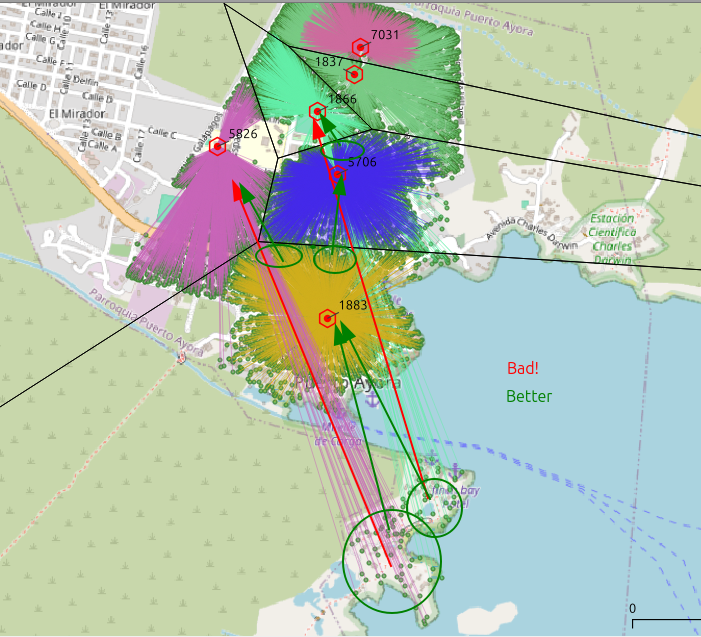

There's a small cape to the south, where some people live. Stable marriage takes those people and assigns them way to the north, following the red arrows. They skip over a voting center, 1883, that could just as well take them in. By contrast, EMD really tries to assign those people to the southernmost center 1883. In order to do so, it needs to kick some people off 1883, but that is done by "volunteering" people that live near the crossover to another center. These people spill over into 5826 and 5706, further north. Since 5706 is also at capacity, it _also_ spills over some people to 1886 and 1837. In effect, the "transfer of mass" between the southern cape and 5826 and 1886 still happens, except now it's done in stages, none of which add as much distance to the average as doing the one big jump.

So, in conclusion: using the solution to the Stable Marriage problem, in its variant of Hospitals and Residents (each has a list of multiple preferred options from the other side in descending order of preference, residents can only go to a single hospital, but hospitals can accept multiple residents), provides another way to solve the problem. This solution seems to be much more reliant on CPU than on memory (at least for the 1:2 CPU:RAM proportion that is also common on, say, EC2 machines). It favors another pattern of distributions than the Earth Mover's Distance solution, since SM does not take into account the precise distances, just the ordering of the list (that is, if a person's second choice is a certain center, it doesn't matter whether that center is 100 meters or 100 kilometers away, just its position in the ranked list).

At least in the case of Galápagos, it returned a less optimal solution than EMD (which makes sense, EMD is supposed to return the absolute optimum among all possible assignments of people to centers that respect the centers' capacities). In exchange for this suboptimality, there seems to be some precedent for running the SM algorithm fairly frequently (an Akamai paper says that the algorithm must be recomputed every 10 to 30 seconds for tens of millions of "voters" against thousands of "centers"), which would be an indicator that it can be made to run fairly fast, and therefore cheaply. That is, rather than being this big event that must run over a day or two a few months before each election, it could conceivably be as fast as to be a non-event that just runs routinely. This is in contrast to EMD, where everyone seems to agree that getting it to run for very large inputs is a lot of work.

In short: potentially less expensive and faster to run than EMD, returns less optimal results, shouldn't ever return _incorrect_ results (that is, assigning too much people to a center or silently leaving people unpaired).

## Experiment 4: DIY linear programming

While researching the Earth-Mover's Distance algorithm, it's possible to come across casual mentions of "Linear Programming", which, despite its name, doesn't necessarily have anything to do with computer programming, although sometimes it does (since most "real" linear programming problems will likely be solved by a computer, so you can program linear programming solvers). Linear Programming is kind of a weird subject. At least in Ecuador, it [drops from the sky](https://educacion.gob.ec/wp-content/uploads/downloads/2019/09/EGB-Media.pdf#page=368) in high-school Maths classes, if I remember correctly around what would be 9th grade in the US K-12 numbering scheme (that is, when students are around 14-15 years old. Substitute your local equivalent if desired). Linear Programming pops out like a spontaneous particle-antiparticle pair somewhere around the middle of the year, students need to learn it and solve problems that loosely talk in terms of production or transport optimization, then the whole concept winks out of existence just as it came, and we never talk about it again. Maybe on some university programs, such as those related to logistics and planning and industrial stuff? Otherwise, you'll likely never think about Linear Programming again... until you have children and said children get to the US-9th-grade equivalent and _they_ need to learn Linear Programming and you need to help them with their homework[^6]. Such is the circle of life.

Linear programming, [Wikipedia tells us](https://en.wikipedia.org/wiki/Linear_programming), is

> a method to achieve the best outcome (such as maximum profit or lowest cost) in a mathematical model whose requirements and objective are represented by linear relationships. Linear programming is a special case of mathematical programming (also known as mathematical optimization).

The "programming" name is an unfortunate collision with the discipline of computer whispering. It may as well be called "optimization of a linear cost function subject to linear constraints", but that is much less catchy.

A problem that can be solved by linear programming requires:

* One or more variables, which can be independently tweaked. These are sometimes called "decision variables". They can be real numbers (including decimals), perhaps just integers (such as when decision variables represent counts of non-dividable things), perhaps just 0 or 1 (as when choosing whether things should be "included" or "not included")
* One or more constraints, that is, expressions that refer to those variables, which must always be satisfied. They are equalities or inequalities, or things that can at any point be said to be "true" or "false" (for a given combination of values of the decision variables). This may be things like "no more than three decision variables may be 1 at the same time" or $2x_1+3x_2≤20$: for any set of values for the decision variables, you can evaluate the constraints and see if they're satisfied or not
* Typically one other expression that refers to the variables. This one isn't an equality/inequality/true-false expression, just a loose expression on the variables (for instance, just $2x_1+3x_2$. Notice the lack of the $≤20$ half). This is sometimes called a "cost function" or "objective function". It typically returns a real number, which is somehow tied to how desirable a solution is: for example, if you're trying to minimize the total cost, the objetive function may be the sum of all individual costs, and we wish to have as small a value as possible

For a problem to be linear programming, both the constraints and the objective function must be linear. That roughly means that sums, substractions, and multiplications of variables with constants are allowed. $2x_1$ is valid, so is $2x_1+3x_2$. Things that, if plotted in a Cartesian plane, would resolve to lines or planes or other non-curved things. However, $x_1x_2$ isn't allowed (it's a multiplication of two variables, and it is [a curved surface](https://www.wolframalpha.com/input?i=z%3Dxy)), nor is $x^2+2x+1$ (that's a parabola), nor $\sqrt x$, nor logarithms or other fancy operations.

Thankfully, purely linear operations can model a bunch of real-world situations. For example, ideally, the cost of manufacturing a set of identical things can be modeled by a constant "setup" cost, plus a "marginal" cost for each unit. This means $A + Bx$, where $x$ is the number of manufactured items. Similarly for selling, if you sell a set of things, then the income is the number of items times the unit price. As long as problems can be fit into simple conditions, they are tractable by linear programming.

As long as the decision variables are real numbers (that is, it's possible to assign any arbitrary number to them, even including decimals/fractions), then it's possible to efficiently find a solution. However, unlike what you may expect, if the decision variables must be constrained to whole numbers/integers, then [finding the optimum is known to be NP-hard](https://en.wikipedia.org/wiki/Integer_programming#Proof_of_NP-hardness), which means that it's on the same complexity class as some [very respectably hard problems](https://en.wikipedia.org/wiki/List_of_NP-complete_problems) (though, interestingly, nobody knows if that set includes those whose difficulty the Internet relies on for security, such as discrete logarithms and prime factorization). There are some problem structures that are known to escape the curse of NP-hardness, but with integer linear programming in general, you need to keep in mind the possibility of encountering the NP-hard wall, upon which the only thing to do is to execute a valiant retreat.

Solving a linear programming problem means finding the values for each decision variable, that still respect all the constraints, that make the objective function have its highest/lowest value (the two variants are essentially identical; worst case, if you just had a method for maximizing it and you wanted a minimum, you could just multiply the values returned by the objective function by -1, let the function find the "maximum", such as the "least negative" value possible, then you'd know that point is, actually, the most negative value possible, hence the minimum).

In fact, probably the most widely available (though not necessarily used) deployment of linear programming is [Excel's Solver feature](https://support.microsoft.com/en-us/office/using-solver-to-determine-the-optimal-product-mix-c057e214-962f-4339-8207-e593e340491f). The docs seem to hint that Solver isn't just for linear functions, but it can also solve non-linear functions (at the cost of much slower solving, and potentially not finding a solution).

There's another library, [OR-Tools](https://developers.google.com/optimization) by Google. I'm unsure what OR stands for; perhaps it's "Operations Research", which is the umbrella term for [all sorts of problems](https://en.wikipedia.org/wiki/Operations_research#Problems_addressed) roughly related to allocating resources, maximizing the effect of a certain action, or determining optimal parameters for a process; such as on industrial or manufacturing settings.

> OR-Tools is open source software for combinatorial optimization, which seeks to find the best solution to a problem out of a very large set of possible solutions. Here are some examples of problems that OR-Tools solves:
>
> * Vehicle routing: Find optimal routes for vehicle fleets that pick up and deliver packages given constraints (e.g., "this truck can't hold more than 20,000 pounds" or "all deliveries must be made within a two-hour window").
> * Scheduling: Find the optimal schedule for a complex set of tasks, some of which need to be performed before others, on a fixed set of machines, or other resources.
> * Bin packing: Pack as many objects of various sizes as possible into a fixed number of bins with maximum capacities.
>
> In most cases, problems like these have a vast number of possible solutions—too many for a computer to search them all. To overcome this, OR-Tools uses state-of-the-art algorithms to narrow down the search set, in order to find an optimal (or close to optimal) solution.
>
> https://developers.google.com/optimization/introduction

OR-Tools contains a loose assortment of algorithms and solvers that can be used to solve multiple kinds of problems, by adjusting the way in which constraints, objectives and variables are created. This means that, sometimes, OR-Tools can in theory solve a problem using multiple approaches. For example, some kinds of assignment problems (in which the issue is, for example, to decide which "worker" must perform each "task", or more generally, to determine a one-to-one mapping between two classes of objects) can either be solved [by computing the min-flow of a graph](https://developers.google.com/optimization/flow/assignment_min_cost_flow#how_a_min_cost_flow_problem_represents_an_assignment_problem) or [via integer optimization](https://developers.google.com/optimization/assignment/assignment_example), both of which OR-Tools supports.

In our case, we'll use Python (because it's easier, at least for me, to use OR-Tools in Python than in, say, C++) and integer optimization (using [the CP-SAT solver](https://developers.google.com/optimization/cp/cp_solver), which apparently [actually uses multiple algorithms/strategies](https://d-krupke.github.io/cpsat-primer/07_under_the_hood.html) so that hopefully, if a strategy finds a better solution or a tighter constraint on a variable, other strategies can be notified so their search spaces are collaboratively reduced. That's called a _portfolio solver_). I don't remember why I went with CP-SAT instead of MIP (both solvers are [documented in the same page](https://developers.google.com/optimization/assignment/assignment_example) for the Assignment Problem).

```python
import pandas as pd
import scipy

from ortools.sat.python import cp_model
model = cp_model.CpModel()

# 1.
people = pd.read_csv("./galapagos_people.csv", index_col="rand_point")
jrvs = pd.read_csv("./galapagos_jrvs.csv", index_col="CODIGO RECINTO")

print("Computing distances")
# 2.
distances = scipy.spatial.distance.cdist(people[["X", "Y"]], jrvs[["X", "Y"]], metric="euclidean")
print("Pivoting to long-form")
data = pd.melt(pd.DataFrame(data=distances, index=people.index.copy(), columns=jrvs.index.copy()),
               ignore_index=False).set_index("CODIGO RECINTO", append=True, verify_integrity=True)

print("Creating assignment vars")
# 3.
x = model.new_bool_var_series(name="x", index=data.index)

print("each person == 1 center")
# 4.
for _, centers in data.groupby("rand_point"):
    model.add_exactly_one(x[centers.index])

print("each center <= center cap")
# 5.
for center, p in data.groupby("CODIGO RECINTO"):
    model.add(sum(x[p.index]) <= jrvs.loc[center]["allowed_people"].item())

print("Preparing objective function")
objective_terms = []
# 6.
for person in people.index:
    for center in jrvs.index:
        objective_terms.append(data.loc[person, center]["value"].item() * x.loc[person, center])

# 7.
model.minimize(sum(objective_terms))

# 8.
solver = cp_model.CpSolver()
status = solver.solve(model)

final_mappings = []
# 9.
if status == cp_model.OPTIMAL or status == cp_model.FEASIBLE:
    print(f"Total cost = {solver.objective_value}")
    print(f"Avg cost = {solver.objective_value / len(people):.1f}\n")
    for center_id in jrvs.index:
        assigned_people = []
        for person_id in people.index:
            if solver.boolean_value(x[person_id, center_id]):
                assigned_people.append(person_id)
                person = people.loc[person_id]
                center = jrvs.loc[center_id]
                wkt = f"LINESTRING({person["X"]} {person["Y"]}, {center["X"]} {center["Y"]})"
                final_mappings.append({"center_id": center_id, "person_id": person_id, "dist": data.loc[person_id, center_id]["value"], "geom": wkt})
        print(f"{center_id} -> ({len(assigned_people)}) {assigned_people}")
else:
    print("No solution found.")
```

The main steps are as follows:

1. We read two CSVs, one with the information of the voting centers and one with the information of each person. For people, we only care about their unique IDs, and their coordinates (latitude&longitude, or actually X&Y in UTM zone 17S). For voting centers, we additionally need to know how many people they can handle. These both go into Pandas DataFrames, which OR-Tools can handle natively in some places
2. First, we need to compute the distance between _each_ person and _each_ voting center. This is a really weak point of this method (as it is, to be fair, for the EMD and Stable Marriage approaches that we've tried previously), since it means that larger sectors with more people and more voting centers have considerably more possible distances to account for. This yields a N×M matrix, where N is the number of people and M is the number of centers, where each cell contains a distance. We then need to unpivot that table into a (NM)×3 table, with only three columns: the person ID, the voting center ID, and the distance. That table contains one entry for each unique combination of person and center
3. Then, we create "assignment variables", a set of Boolean-valued variables (that is, they can only take the values 0 or 1). We need as many variables as there are combinations of people and centers (therefore NM variables). If a certain variable has the value 1, that means that the corresponding (person, center) pair is "active", and therefore the person in question has been assigned to the center in question. Of course, at this point the solver could theoretically "turn on" every last assignment variable and smugly declare that each person must go to all the voting centers
4. To remedy that, we then add a set of "constraints", one per person, indicating that the assignment variables that belong to one person must have one, exactly one, and only one, turned on. This means that each person must always be assigned a center (no cheating by not assigning people, so the average distance becomes 0!) and only one center (why would people want to go to two centers to vote?)
5. We also need a constraint on the capacity of centers. For each center, we specify that the number of assignment variables that belong to that center _and_ are turned on must be less than or equal to the center's capacity. Otherwise the solver would just assign everyone to their closest centers, possibly overflowing them in the process, and proclaim that as the optimal (smallest distance possible) solution, which while true isn't useful
6. With the problem constraints complete (everyone must be assigned a center, no one must be assigned more than one center, each center must be assigned less people than it can handle), we define the optimization function. We specify it as the sum-product of each (person, center) distance times that (person, center)'s assignment variable. Since assignment variables are either 0 or 1, this is effectively the same as "the sum of all the distances of the assignments which are currently active"
7. We then need to specify that the solver must attempt to _minimize_ the objective function (if we set this to "maximize", it'd instead attempt to give people _their longest possible distances!_)
8. This is where the solving is done. It takes a while and eats as much CPU as you can give it
9. Finally, this block is to print the solution. It checks if the model actually found a solution (it could have concluded that there's no solution that satisfies all the constraints). Solutions can be optimal (if they are absolutely, 100%, definitely the global optimum) or feasible (solvers can be configured with a time limit such that, if exceeded, they'll just report the best solution to date, even if there may possibly be an undiscovered solution that is actually better). The set of assignment variables that have the value 1 indicate who must go where. This is printed to stdout and also (not shown) to a CSV file that is then re-imported into QGIS for visualization (that's what the WKT bit does, it defines the line segment that joins each person to his assigned voting center. QGIS can natively read WKT into lines)

We'll try this, once again, on Galápagos (21K people, 17 voting centers). On my Certified Standard Computer, this takes perhaps a couple of minutes, 2-3GB of RAM, and can sometimes (on the solving phase, which is CP-SAT proper) make use of all available CPU cores (though not while running ③, which I assume is due to it being native Python code and therefore inherently limited by the GIL):

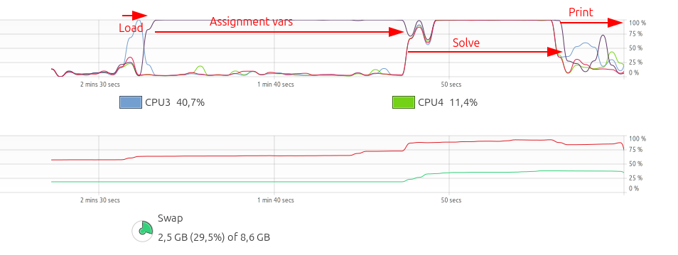

①-② take a few seconds at most. ③ takes maybe 70 seconds. ④-⑦ take a few seconds again. We can see where ⑧ starts because all CPU cores suddenly light up and stay up until a solution is found, which takes about 50 seconds. Finally, ⑨ takes ~20 seconds, probably because it need to run over N×M assignment vars to find the N which are on. That's what the examples in OR-Tools docs do; there may be a more efficient way to query the model for all its variables that have a certain value, instead of manually running over each one.

The absolute numbers don't matter (they'll vary on each machine), but their relative values may be useful. A beefier machine with more modern and/or numerous CPU cores would likely speed up ⑧. I wouldn't expect ③ to gain as much from more CPU cores, since that's probably capped to a single CPU. Perhaps that'd benefit from porting the problem to C++, which is feasible since OR-Tools supports it (though you'd lose Pandas, and therefore the CSV and table bits, of which there's a non-trivial amount).

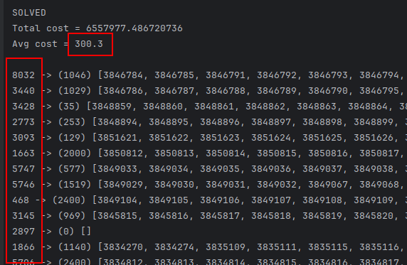

The script's output indicates that the average distance is 300 meters. It then prints the people assigned to each center (for instance, in the first line, center 8032 was assigned 1046 people, with IDs 3846784, 3846785, and many more). In fact, in the image above, we can spot the centers that are full because they're the ones with the round numbers. For instance, center 1663, the sixth one in the list, is full because it's been assigned precisely 2000 people. That's definitely a full center with 5 voting stations, each with 400 people.

After importing the line segments in QGIS, we can see, as usual, Puerto Baquerizo Moreno:


and Puerto Ayora:

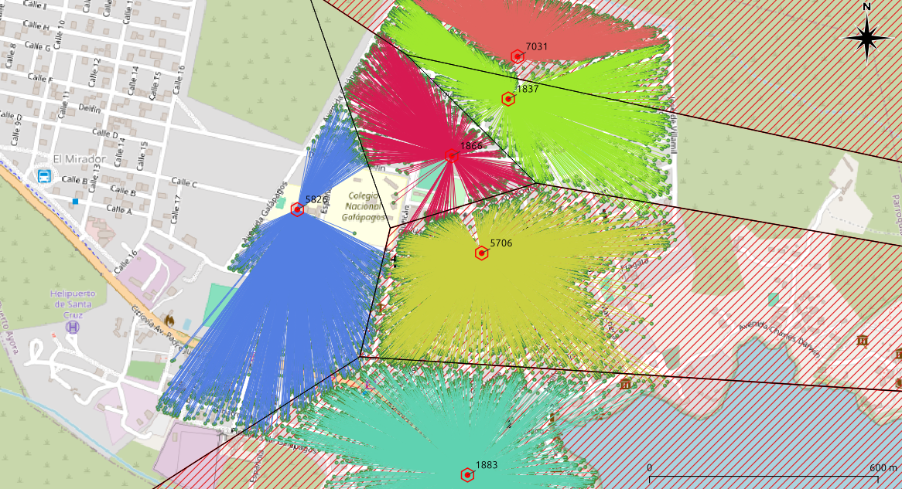

The usual stats:

* Everyone was again assigned a center, so 100% success rate
* Five centers were completely full and operated at 100% capacity
* No centers operated at >100% capacity, thanks to the constraints on the max amount of decision variables that could be set to 1 per center
* The non-overflowing centers have ~1.5K average capacity and ~900 people assigned, very similar to both previous approaches
* The average distance between person and assigned center is very nearly 300 meters

The assignment obtained by linear programming seems to be very close to the one found by EMD. That makes sense, after all they're optimizing the same quantity (the sum of distances). You can see the tell-tale signs of both algorithms pulling people from near the edges of the Voronoi polygons, rather than the pulling from very far away that was preferred by Stable Marriage.

There's actually a small mistery there. The average distances of the EMD and LP approaches are _not_ the same, despite both, as far as I can see, optimizing for the exact same metric (sum of distances). They both yield "optimal" solutions, but the one found by LP is obviously _not_ optimal, since EMD found a better one! There's material there for some research, but this article is already long enough as it is.

## Conclusions

In this second post, we've explored three additional ways to assign people to voting centers: by using Optimal Transport and the Earth Mover's Distance; by using the Stable Marriage algorithm; and by manually running a Linear Programming solver over an assignment problem.

We weren't able to run these mechanisms on the entire country, not even on the largest counties: all of these algorithms require a N×M matrix, where N is the number of people and M is the number of voting centers, and thus their resource requirements grow quite fast as larger regions are considered. It's feasible to run them, on a personal computer, on problems of the order of 10K people and tens of voting centers, but they should ideally support a few millions of people and hundreds of voting centers. That may be doable by throwing more RAM at the problem, or by clever optimizations such as sparse matrices.

Optimal Transport was the best approach in terms of finding the smallest average distance. Linear Programming was a very close second, though it should in theory be exactly equal. Stable Marriage was less optimal, owing to it choosing more distant centers in cases where that person's preferred (nearest) center was full.

Here's a direct comparison between all three approaches for the two largest and most interesting cities in Galápagos. You can cycle between all of them to compare:









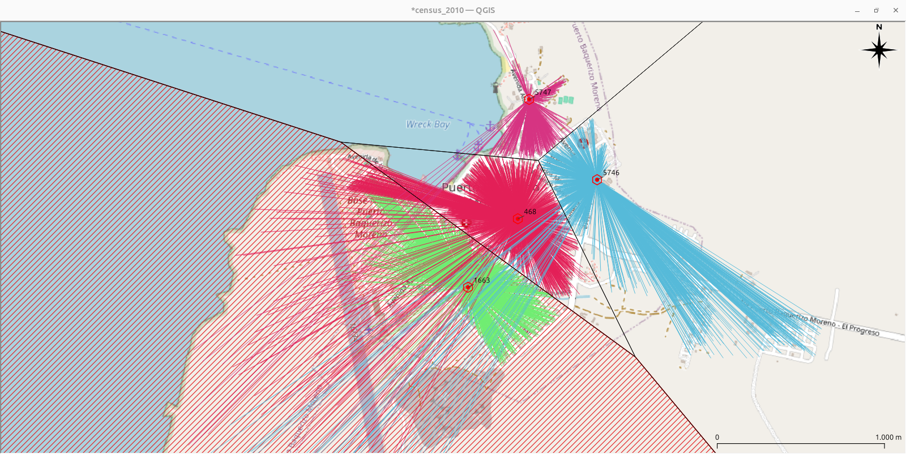

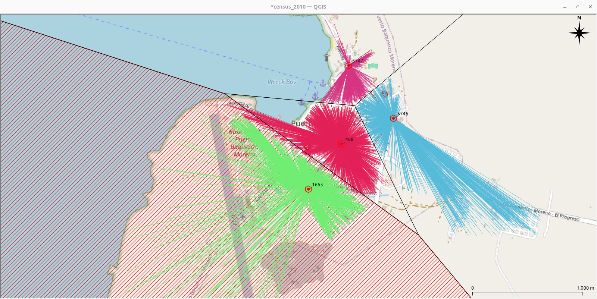


If this were an officially commisioned study (I wish! In such case, it'd ideally come with an equally official and juicy sum of dobloons attached[^8]), we'd finish with something like "In light of the performed tests, we recommend using the Optimal Transport solution to assign people to centers, as well as documenting that fact in public official channels". Since this _isn't_ an officially commisioned study, we'll stop here instead.

The end.

[^1]: Yes, I chose operations with delicious-sounding names on purpose
[^2]: Under, of course, the standard and _totally realistic_ market assumption of entirely rational actors armed with full information and perfect understanding working to maximize their expected gains or whatever
[^3]: Or "poor saps"?
[^4]: Well, there's [this delightful post](https://daffidwilde.github.io/matching/docs/tutorials/stable_marriage.html) by the people that develop the `matching` Python library, used later. It pairs the men and the women that appear in Pride and Prejudice. And they've (of course) taken care that the preference lists are such that the final allocations are as is proper. I especially love the very serious _References_ section at the bottom with a single entry: "Austen, Jane. 1813. _Pride and Prejudice_. Whitehall, London, UK: T. Egerton, Military Library."
[^5]: Sidenote: That site, with its "Tutorials", "How-to Guides" and "Reference" sections, conforms to [the Diátaxis philosophy/approach](https://diataxis.fr/). Diátaxis proposes that documentation can be split/classified in four categories: tutorials, how-to guides, reference and explanation. These come from [two independent categories](https://diataxis.fr/foundations/#two-dimensions-of-craft) (which they call "dimensions") with two values each: whether the doc is intented to support _action_ AKA how to do vs. _cognition_ AKA the thing itself; and whether it supports uses that are _acquiring_ the craft vs. _applying_ it. It's a really fun thing, and potentially helpful to avoid, for example, having the authoritative list of functions that can be called on a class just mentioned in passing in a Getting Started tutorial. Diátaxis provides the mental framework to realize that the list of functions is Reference, whereas Getting Started is a tutorial
[^6]: Unless, of course, the curriculum has changed in the meantime[^7] and Linear Programming is no longer in the horizon
[^7]: Apparently, [the average age when women have their first child is 28 years](https://www.elcomercio.com/actualidad/ecuador/mujeres-ecuador-tiene-educacion-universitaria.html). Men, I'll assume with absolutely no information, have that same value (it simplifies numbers). If you study Linear Programming at the average age of 14 years old, then have an average child at the average age of 28, then that child averagely grows and encounters Linear Programming at 14, that's a lag of 28 years between generations encountering the concept. In that time, many governments, Education Ministries, curricular plans and philosophies of education will most likely have come and gone. So I guess there's no guarantee that the Linear Programming that you studied as a youngster will be even useful for your descendants
[^8]: Or maybe not. Gov is notoriously bad at paying up. So maybe they'd pay with a sheet of paper with a coin drawn on it and a note below saying "worth $500,000"
[^9]: It turns out that the average household size in Ecuador, as of the most recent census, is 3.85 people per household. Who knew. So assigning entire households instead of individual people would cut the memory (and, hopefully, also time) required to assign down to about a quarter of the original requirements
