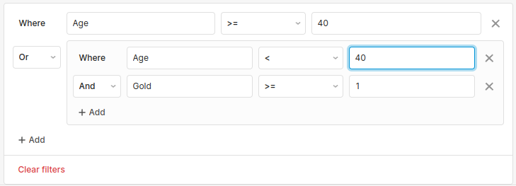
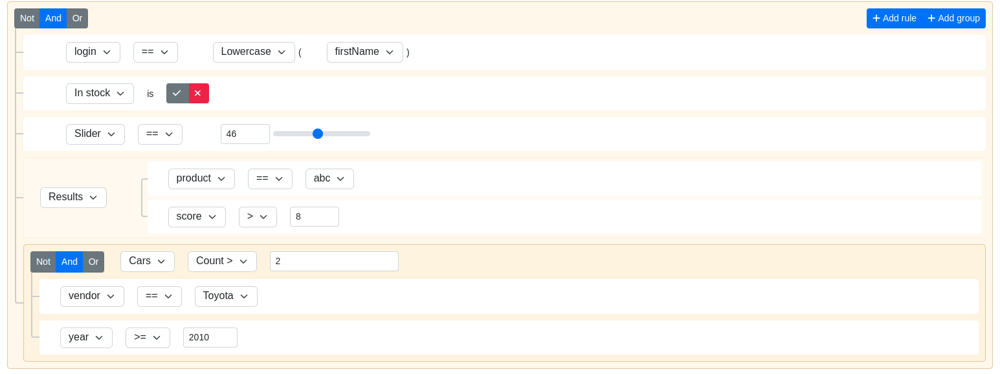
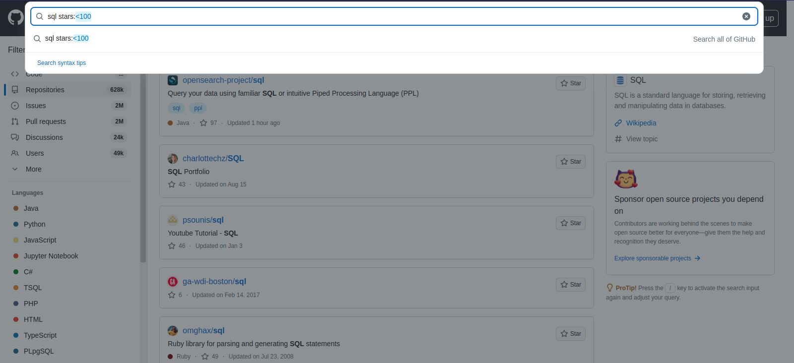
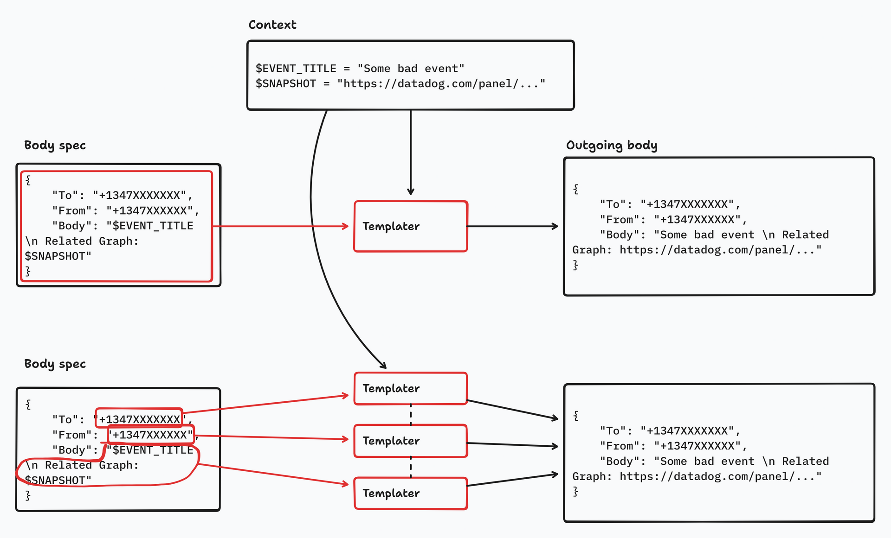
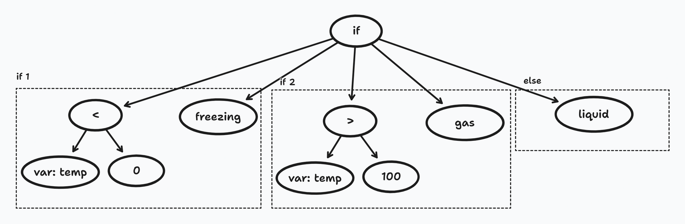
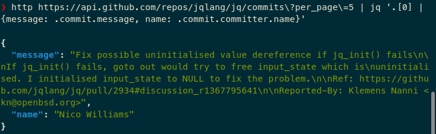

## Introduction

Hello again! In this post we'll take a look at some embeddable data transformation languages, starting from the beginning: what even is that? Then, we'll see some cases which could warrant one of those, and some alternatives that could be used in such cases.

## Defining terms first

There's an old tradition (Middle-Ages philosophical practice, in fact) of defining your terms _before_ arguing. And I can't for the life of me find the Latin term for that, but the idea is that you start by making sure you're talking about the same thing. We'll do that here, even though we're not arguing.

By _language_ I mean a programming(ish) language, i.e. a [formal grammar](https://medium.com/@mikhail.barash.mikbar/grammars-for-programming-languages-fae3a72a22c6) and set of tools that defines valid _programs_. It doesn't have to be [Turing-complete](https://www.cs.odu.edu/~zeil/cs390/latest/Public/turing-complete/index.html) (indeed, as we'll discuss later, Turing completeness can be bad. Like, _really_ bad). We don't mean natural/human languages.

_Embeddable_ denotes that you can somehow use said language _inside_ a larger whole (i.e. another application). We'll see later that there are some situations in which you'd want to run small (or not) pieces of logic inside your application, where said pieces of logic aren't hardcoded as part of your app (they may even come from your users, where you can't even know what they'll want to run when you wrote the larger code).

Finally, by _data transformation_ we emphasize that the main aim of the languages that we'll cover here is to do stuff with data. We don't particularly care about [side effects](https://www.yld.io/blog/the-not-so-scary-guide-to-functional-programming/) (such as causing network I/O, writing to disk or disabling CPU cores), just about the data that comes in and out of the program. If you want side effects, go write some Arduino code or something, which is all about side effects.

Close siblings of data transformation are simple _filtering_ (which you can think of as a data transformation program that just outputs a boolean `true` or `false`, whereby you either drop the input altogether or let it through) and what, for lack of a better term, we'll call _expansion_ or _generation_ (which is data transformation that starts from an empty input, or a very small input, and blows it up into more, probably more complex, data). Pure functions, in other words, if you know your Haskell, or Clojure, or whatever.

## Why would you care?

Sometimes, when building an application, you may come across a situation that calls for _something like_ a programming language, but you need the actual code to be defined _after_ you've deployed the application.

That's way too generic to be of any use, so let's see some examples:

* You need complex filters for complex data models
* Users need a way to define data transformations, such as transforming JSON documents that are somehow flowing through the system
* You'd like to express conditionals, such as when to raise an alert
* You want your users to be able to write authorization policies, as opposed to having the classical User, Admin, Owner triad of roles

All of these have in common that the actual logic that should be executed can't be known at development time, but instead will only be defined while the application is running. Thus, the source code that lives on Github or whatever can't contain the actual conditions. For example, for the filtering case, you won't be able to write "if widget is over $200 and red, then preserve it" in the application's source code. All you'll be able to write is "if widget satisfies user-provided condition, then preserve it". As another example, if you were writing JSON transformation code, the application won't contain code that states "pick the `user` field from the input JSON, then concatenate with the `domain` field, store that in the `email` field and send to remote URL". It'll contain "grab the input JSON, pass to user-provided function, then capture the output and send it to the remote URL". See the difference?

So, if you can think of an application that would have those requirements, then read on!

### Data table filtering

For example, every application that has data tables starts looking like this (this is [AG Grid](https://ag-grid.com/), but there are many other libraries like it):


Then someone comes in wanting to search that data, so you add a search field:


Soon that's not enough (people want to filter for athletes that have more than 40 years), so you need to add per-column filters too:


or maybe the filters are all grouped to the side or the table, or maybe [they also appear as chips above the table](https://www.smashingmagazine.com/2021/07/frustrating-design-patterns-broken-frozen-filters/#display-filters-above-the-results):


And then people want more, such as nested filters, or "every athlete above 40 years, plus those younger that have a gold medal or more". You can't do that with per-column filters alone, since you need a global OR. So maybe you start building an arbitrary filter component such as that [provided by Retool](https://retool.com/components/filter):



And then someone comes in saying that they need athletes that have the same number of gold and silver medals, and you suddenly realize that the right hand of the filters is no longer a constant, but may also be a reference. So you reach for [a full fledged query builder such as this one](https://ukrbublik.github.io/react-awesome-query-builder/):



At this point, your search component takes up an entire screen worth of content, and you still need to transfer all those (remember, arbitrarily nested) conditions to your backend for searching. Same if users want to export the data.

You know, however, _who_ have more-or-less arbitrary filtering capabilities? DB management tools, such as Compass for MongoDB, where you input a JSON document that contains filter criteria:


Or, perhaps even better, the Greatest Of All Filtering Languages. All hail SQL, Deliverer of Data In Usually Very Short Times, As Long As Your Indices Are Well Maintained[^1]:


Or Github, which uses its own [homegrown search syntax](https://docs.github.com/en/search-github/getting-started-with-searching-on-github/understanding-the-search-syntax):



So, if you have weird search requirements, you may be interested in an embeddable data transformation language (here used to express Boolean conditions, most likely). Maybe you'd hide that text field behind an "Advanced" button, and the "Simple" search would be one of the options above.

### Transforming incoming/outgoing JSON

You may have worked with [webhooks](https://www.mailgun.com/blog/email/your-guide-to-webhooks/) before. They're quite popular with SaaS vendors as a way of notifying external systems that _something_ happened. For example:

* Email services such as Mailchimp or Mailgun can send webhooks when an email bounces or the recipient opens the message
* Github or other VCSs can send webhooks when a commit is pushed or a PR is closed
* Telegram bots can call webhooks whenever someone talks to them
* Google Drive can call a URL whenever a file in a drive changes
* ... you get the idea. Many systems have a way for you to provide a URL, and then the system calls it when something interesting happens

When using webhooks, you don't have to constantly query the system of interest for its changes, which is a) inefficient, b) slow(er), c) prone to missed events, and d) sometimes very difficult, if the system doesn't let you easily distinguish things that have changed since the last time you checked, and thus you need to keep a local copy and manually compare.

Now, many systems send you a JSON document in a fixed format. See [Github](https://docs.github.com/en/rest/overview/github-event-types?apiVersion=2022-11-28) for an example. So, in your receiving system, you need to understand that format and act accordingly.

Let's say that you're building a system that can emit webhooks, but you want to let your users configure the precise content of the webhooks that they'll receive. For example, consider [this thread in the Grafana forums](https://community.grafana.com/t/customize-body-of-webhook-contact-point-in-alerting/71150/6):

> With the webhook contact point of Grafana alerting I want to trigger a Twilio flow. For this I need to add a ‘To’ and ‘From’ parameter (example in curl can be found below)
> Where can I add these parameters? I’m tried it with a template but I’m unable to add a template to a webhook.

For the specific case of Grafana, that's not possible yet. Grafana will _always_ send its JSON payload with a specific structure, which may not be what the other service expects. So you'd have to deploy a little piece of code whose only job is to receive the system's webhooks, transform them somehow, and then forward to the actual destination. This is probably a good use case for [a lambda function/FaaS](https://www.cloudflare.com/learning/serverless/glossary/function-as-a-service-faas/), since it's an isolated piece of code.

[Datadog](https://docs.datadoghq.com/integrations/webhooks/) does let you specify the content of the requests that will be sent when metrics go over predefined values, by using variables that start with a dollar sign and are replaced by the actual event's data just before being sent. See [the examples](https://docs.datadoghq.com/integrations/webhooks/#examples) for Twilio:

```json
{
    "To": "+1347XXXXXXX",
    "From": "+1347XXXXXX",
    "Body": "$EVENT_TITLE \n Related Graph: $SNAPSHOT"
}
```

and Jira:

```json
{
    "fields": {
        "project": {
            "key": "PROJ"
        },
        "issuetype": {
            "name": "Task"
        },
        "description": "There's an issue. See the graph: $SNAPSHOT and event: $LINK",
        "summary": "$EVENT_TITLE"
    }
}
```

Let's say that you want to do something like that, so your users can plug your system directly into arbitrary APIs, without needing to have an intermediate system to wrangle the data into the format that is expected by the target system. This is especially annoying when people try to connect two prebuilt systems. If you're developing the destination, it's not so bad: just assume that your input data will have a certain shape and roll with it. However, when integrating two systems, you don't have that luxury. In other words, if you're writing an application that will receive Grafana events, you can just develop to the Grafana schema. However, if you want to connect Grafana to Pagerduty, you need the data to conform to Pagerduty's schema. And if you're developing Grafana and you suspect that users will want to connect it to Pagerduty, Twilio and their own internal homegrown platforms, then you need to give them a way to customize their outgoing requests. Or force them to have conversion steps in the middle, that also works.

So, to summarize: you have a system which generates webhooks, which have JSON bodies with a specific structure. You foresee your users wanting to connect your webhooks to other systems that have their own expected structures, and you'd like your users to be able to connect both directly, without needing to deploy a component in the middle whose only job is to convert one structure to the other.

The approach taken by Datadog, as we saw above (and other systems that do the same, such as [UptimeKuma](https://github.com/louislam/uptime-kuma/blob/master/server/notification-providers/webhook.js), [Kibana](https://www.elastic.co/guide/en/kibana/current/webhook-action-type.html) or [Jetbrains Space](https://www.jetbrains.com/help/space/add-webhooks.html#customize-webhook-payload)) is to provide you with a text templating engine. [Port](https://docs.getport.io/build-your-software-catalog/sync-data-to-catalog/webhook/) is different, in that it lets you actually pick fields from the incoming data to fill Port's own entities via [`jq` expressions](https://jqlang.github.io/jq/manual/). However, that's the only tool that I've seen that does so, so we'll set it aside for now. Let's focus on text-templating services.

Those tools treat the outgoing webhook body as plain text (or maybe each of its properties), and then apply templating logic over it. For example, here's a valid Datadog body spec:

```json
{
    "To": "+1347XXXXXXX",
    "From": "+1347XXXXXX",
    "Body": "$EVENT_TITLE \n Related Graph: $SNAPSHOT"
}
```

There's no information on whether the template is applied over the entire body or over every individual value. In other words, we don't know which of these two is correct:



The first option would let you, for example, embed variables in JSON keys, or maybe (if the underlying template language supported it) repeat keys by looping over them. The second option wouldn't let you do such things, since your templating powers in such case are constrained to the insides of every value (i.e. you can't escape into the world of the JSON document's structure, just play inside of each one).

Absent any information to that regard, it's probably safe to assume that the top option is used (i.e. the entire JSON document, as a string, is treated as the template and rendered against the context, which varies per webhook). This is because it's simpler (to implement, that is): you just take the user-provided spec/template (which you're probably saving in your DB as a string, anyways), then chuck it into the magical template engine alongside the context, and out comes another string. You set that as a HTTP request body, add a `Content-Type: application/json` header, and away it goes.

The second approach (the bottom one), by contrast, would require you to actually interpret the contents of the user template as JSON. For example, in Python (because that's the language that I'm more comfortable writing off the cuff):

```py
import json

context = {...} # This is whatever you make available to your user
spec = read_from_db(webhook_id) # We assume that this outputs a string from your DB or whatever

data = json.loads(spec)
for k, v in data.items():
  data[k] = template_render(data[k], context)
  
send_http_request(
  USER_PROVIDED_URL, # This also comes from the DB, probably
  method="POST", 
  headers={"content-type": "application/json"},
  body=json.dumps(data)
)
```

However, this simple code is fragile: for example, it breaks if some user provided this JSON spec for his webhooks:

```json
{
	"data": {
		"id": "$EVENT_ID",
		"text": "Event $EVENT_NAME has been triggered!"
	}
}
```

See the difference? All we did was to wrap the actual body fields in a `data` key. Our naïve code only takes into account the first nesting level, and would break here. You'd have to break out the recursive code and navigate into arbitrary nesting levels, only rendering when you find strings.

Besides, neither of those approaches handle an important detail: by treating the body spec as a plain-text template, we lose all semantic content of the JSON document. It's just a bunch of bytes. When we're operating at that level of abstraction, there's no understanding at all of JSON's specific structure. For example, this isn't valid JSON:

```json
{
	"data": 1{
		"foo": "bar"",
	}
}
```

However, a text templating engine wouldn't understand that. It just pushes bytes around.

_So how would that affect me? I'll just write valid templates._ Yes, you will, until someone wants to do this:

```js
// context
{
	"$USERNAME": "John \"Big Boss\" Doe"
}

// template
{
    "To": "+1347XXXXXXX",
    "From": "+1347XXXXXX",
    "Body": "Welcome, $USERNAME!"
}
```

And suddenly your templater spits this out:

```json
{
    "To": "+1347XXXXXXX",
    "From": "+1347XXXXXX",
    "Body": "Welcome, John "Big Boss" Doe!"
}
```

which (as you can see from the syntax highlighting freaking out) is _not_ valid JSON. All it took was a user signing up with a name that contains double quotes, which terminates the JSON string and escapes into the actual JSON document.

Now, you can certainly [escape every variable](https://stackoverflow.com/questions/3020094/how-should-i-escape-strings-in-json) first, but that's a symptom of the problem: by interpreting the user's spec (i.e. the JSON object that has `$VARNAME` bits) as plaintext (which, to be fair, most if not all general purpose templating engines require), you've given up JSON semantics. It's no longer JSON, it's a bunch of bytes. `{foo: 1,,,}` is not valid JSON, but it _is_ a valid bunch of bytes, so a templating engine will happily generate it. 

People who have dabbled in web security may recognize [XSS](https://www.acunetix.com/blog/articles/dom-xss-explained/), [SQL injection](https://portswigger.net/web-security/sql-injection), [format string injection](https://ctf101.org/binary-exploitation/what-is-a-format-string-vulnerability/) and [command injection](https://book.hacktricks.xyz/pentesting-web/command-injection#what-is-command-injection), which are just different incarnations of the same thing: you're writing something (a value, for example, in SQL injection) and then suddenly the input causes the execution engine to switch into another mode (for SQLi, a closing single quote is the typical example, since it terminates the string and gives you access to the SQL stream). The [best explanation that I've seen](https://megankaczanowski.com/what-is-sql-injection/) is that these kinds of attacks occur when the data plane can escape back into the control plane, thus allowing for unexpected behavior. So let's say that you don't really want your users to have to deal with that; instead, you want something that is aware of JSON semantics. For example, if you're inside a string and you want to interpolate `$USERNAME`, it should correctly embed the value of `$USERNAME` inside of that string, no matter what the string contains (especially double quotes)

### Expressing conditions

Perhaps similar to the case above, although it may also appear on its own; let's say that you want to write conditions. Let's say, for example, that you want to conditionally route incoming requests based on their JSON body. I don't know why you'd want to do that, but maybe someone does. Traditional reverse proxies such as Nginx, Apache, Traefik or Caddy don't allow that: they only route based on HTTP/TCP/IP metadata, but not on the actual body of the request. [The Kong proxy](https://docs.konghq.com/hub/kong-inc/request-transformer/#main) and [Tyk](https://tyk.io/docs/advanced-configuration/transform-traffic/jq-transformations/) do provide JSON-level conditions, and also transformations (with the aim of relieving your application of that job).	[Kong uses Lua](https://docs.konghq.com/hub/kong-inc/request-transformer/how-to/templates/), while [Tyk can use `jq`](https://tyk.io/docs/advanced-configuration/transform-traffic/jq-transformations/).

This has a similar setup and aim to the case above, since (as we discussed before) conditions can be thought of as transformations that return only a boolean value.

### Policy enforcement

As a subset of conditions, let's think of [authorization (as opposed to authentication)](https://auth0.com/docs/get-started/identity-fundamentals/authentication-and-authorization). You want only some users of your application to be able to perform an operation. The classical example is a blog, where only users that have the role `AUTHOR` can create and edit posts (readers can read them and write comments, though). Admittedly, this is a very simple example, but many applications have some sort of "roles" system, which grant privileges to those who have them.

A more complex problem is the following: on Github, absent any special configuration, only the owner of a repo can change its description. Note that this isn't a global permission to just "change the descriptions of all repos" that is held only by Github staff, like on our blog example. In this case, the capability to change a repo's description is granted on a per-repo and per-user basis (or, in other words, the fact that you can change some repo's description doesn't mean that you can change another one's). When implementing a way of deciding whether a request to `POST /api/repos/<repo_id>` should succeed or not, it's necessary to look at _both_ the user making the request and the actual repo that is referenced in the URL.

I intend to write a more detailed article about authorization patterns eventually. For now, let's leave it at "wanting to determine whether a user should be allowed to perform a request or not". When making that decision, let's say that we have access to a) the actual user (we assume that the application can somehow get the user ID, perhaps via cookies, and then make a DB lookup to retrieve all of the user's data, such as permissions and teams that he belongs to), b) the object that is being operated on, if such a concept exists, and c) the request data.

Furthermore, let's say that you want users of your application to be able to provide those permissions themselves. Many applications come with a predefined set of roles, and allow users to assign others to said roles. Think, for example, of Google Docs, where you can share a document with other people, who can be assigned Viewer, Editor and Owner roles (I think. I haven't used Docs in a while). However, maybe you're building SaaS stuff where it makes sense for users to provide their own policies, and fixed roles won't cut it. For instance, some users may want to make all documents public for reading, yet only allow users to edit documents if the user's `department` is the same as the document's Department tag, _or_ the user belongs to the Auditing department (this would be for some sort of document management/wiki platform aimed at corporate users).

This is a version of data filtering, only applied to the specific problem of authorization.

### Recap

We've reviewed a few usecases that you may come across:

* Advanced filtering, where criteria go beyond `[column] [operator] [constant value]`
* Data transformation, typically JSON to JSON
* Filtering data, which is a subset of data transformation that only outputs a boolean value, as opposed to a free-form document
* Authorization with custom (user-defined) policies, which is a subset of filtering that is applied to determine access rights and typically takes as inputs the current user's information and the current object's information (i.e _who_ is attempting to operate on _what_)

All of these cases have a couple of things in common. First, they involve data manipulation, typically of JSON documents or things that can be expressed as such. Second, they involve _users_ of the application specifying the criteria (if you as the developer were the author of the criteria, you could just as well hardcode the operations in whatever programming language you're writing the application in)

## Embeddable languages

So, if you can't write the transformations/criteria/authorization policies/whatever ahead of time, what can you do?

If it's not code (because it can't be, as the actual operations aren't known when writing the application), then it has to be data. In other words, since  the operations can't be placed in the actual source code, from where they'd be deployed alongside the rest of the application, they must be placed in the database or whatever persistence system is in use. This is especially true if _users_ of the application will be the ones writing the operations, as in the custom webhooks that we explored above. From there, the application will retrieve them and somehow execute them, providing them with whatever data they need. The output of the operation will be captured and acted upon: for webhooks, the output will be sent to the remote server. For authorization policies, the `true`/`false` value will be used to either allow or deny access.

### Your programming language of choice

A way of providing users with configurable logic is to just let them write snippets of code in whatever programming language the application uses, and then run those snippets in the application server, hopefully with some sort of sandboxing so they can't just `cat /etc/shadow` or whatever else it is that naughty people do.

Of course, this is heavily dependent on language support, and requires _a ton_ of work to secure. Without that, [this happens](https://developer.mozilla.org/en-US/docs/Web/JavaScript/Reference/Global_Objects/eval#never_use_eval!). This approach also favors interpreted languages or those that can dynamically load code (i.e. not C, not C++, not Rust). [Python](https://wiki.python.org/moin/SandboxedPython) is easy (though hard to do securely), [Javascript](https://github.com/laverdet/isolated-vm) is easy and perhaps even secure, Java has [Groovy](https://www.groovy-lang.org/), even Go (which is compiled) has [Yaegi](https://github.com/traefik/yaegi). I have no idea about C#.

This approach would provide users with some sort of text editor/[IDE window](https://microsoft.github.io/monaco-editor/), maybe even with autocompletion if you're feeling fancy. The application would need to tell users _where_ the incoming data can be found, perhaps on global-scoped variables that they can just use in their code. Some way of getting data out of the user-provided code should also exist. Some sandboxes use the language's `return` syntax (i.e. the code that is provided by the user runs as if it were inside an invisible function, so the `return` statement sends data out of the user code). Others require you to send the data to standard output (through whatever the language uses for that, usually some sort of `println()` function).

For example, here's [`vm2`](https://github.com/patriksimek/vm2), a (now deprecated!) JS sandboxing library:

```js
const { VM } = require('vm2');

const vm = new VM({
    sandbox: {
        foo: "bar",
        count: 1,
        items: ["A", "B", "C"],
    }
});

const isAllowed = vm.run('return items.length == count');
console.log(isAllowed);
```

The actual code that would be user-provided is on the second-to-last line (it's the string that is provided as an argument to `vm.run()`). Before that, you can see that when creating the `vm` object, we provided a value to the `sandbox` property. Anything that is provided on the `sandbox` will be available to the sandboxed code as top-level (AKA global) variables. That code may be some sort of user-provided validation, which checks that the provided input conforms to certain business rules. Here, it checks that the `count` is consistent with the actual items.

Also, you can run a `return` statement in the sandboxed code. Its value (provided that it's a _transferable_ value, or in other words, just return primitives. No function pointers or anything funny) is returned to the calling (host) code, i.e. your application. This example is set up to do some kind of validation (yes/no) or authorization check, since it compares stuff and then returns a boolean. You can imagine then checking said boolean (i.e. `isAllowed` and either performing or skipping an operation.

Other tools, such as Yaegi, do similar things: there's a way to initialize the sandbox, preload it with global values, and then pass it a script (as a string) and make it run. Then there's usually a way to collect the values that the script returns, and make them available to the larger application.

Advantages of this approach include:

* As long as your programming language of choice has a robust tool to do this, it should be fairly easy to implement. Otherwise, don't even try. As [the author of `isolated-vm` writes](https://www.npmjs.com/package/isolated-vm#security), "Running untrusted code is an extraordinarily difficult problem which must be approached with great care. Use of `isolated-vm` to run untrusted code does not automatically make your application safe. Through carelessness or misuse of the library it can be possible to leak sensitive data or grant undesired privileges to an isolate."
* By using a well established programming language to encode the logic/transformation/checks/whatever, you can probably pull from very solid editors. For example, if you were using [the Monaco IDE](https://microsoft.github.io/monaco-editor/playground.html?source=v0.44.0#example-creating-the-editor-editor-basic-options) as a code editor and JS as the language, you get automatic Intellisense/autocompletion that is, AFAICT, as good as that of VS Code, AKA very good
* Assuming your audience is at least somewhat familiar with programming, it should be fairly easy to pick up. Again, this is audience dependent

However, this approach has drawbacks too:

* The aforementioned difficulty of completely sandboxing user code
* Even those sandboxes that don't have known escapes may be vulnerable to resource exhaustion (e.g. a user process going `while(true){}`)
* What if your audience isn't technical?
* Taking a general-purpose programming language and then trying to constrain it to operate in a sandbox, by taking away all the sharp tools, feels... somewhat wrong. Using something that never had general-purpose capabilities may leave less room for bugs (because, say, the ability to `import` other packages or run HTTP requests was never there, as opposed to it being there but inaccessible)
* You need to take into account the resources required to run the sandbox/interpreter, especially if you'll be running multiple sandboxes concurrently

### JsonLogic

This project has no similar projects, as far as I'm aware. It's called [JsonLogic](https://jsonlogic.com/) and it describes itself as "If you’re looking for a way to share logic between front-end and back-end code, and even store it in a database, JsonLogic might be a fit for you."

> It’s a small, safe way to delegate one decision. You could store a rule in a database to decide later. You could send that rule from back-end to front-end so the decision is made immediately from user input.

Although it may seem so, JsonLogic isn't specifically constrained to true/false decisions. It is also posible (to some extent) to transform data, apart from reducing it to a boolean. The set of available operations is also restricted.

For example, there's this logic rule:

```json
{"if" : [
  {"<": [{"var":"temp"}, 0] }, "freezing",
  {"<": [{"var":"temp"}, 100] }, "liquid",
  "gas"
]}
```

When applied to this data:

```json
{"temp":55}
```

it yields the following result:

```json
"liquid"
```

In fact, the JsonLogic document is an expression of the following tree:



This can be used to implement certain checks, perhaps advanced table filters or conditions for events that are generated by your application (think configurable email notifications, where you don't just opt in or out of all messages, but get a chance to inspect every message and decide whether it should be sent to you or not. I don't know if such a thing would be useful at all, but it sounds like the ultimate in email notification control)

Some pros of JsonLogic:

* It explicitly promises data isolation. User-provided functions get access to whatever you give them access to, and no more
* It has several interpreters: JS, PHP, Python, Ruby, Go, Java, .NET and even C++
* It's extremely easy to save in a DB. Every rule is a valid JSON document
* Since it's JSON with a defined structure, it could even be validated

As for disadvantages:

* Some people hate it. Take a stroll through [these two](https://news.ycombinator.com/item?id=12784121) [HN threads](https://news.ycombinator.com/item?id=27306263) for a peek. Apparently expressing ASTs in JSON is a bad idea, and why don't you just use LISP
* It's not that easy to write
* Being a bespoke language, there's very little support for it (in the form of editors and such). Sure, you can configure the editor for JSON, but that doesn't help with JsonLogic's custom constructs. There's [this editor](https://katirasole.github.io/JSONLogic-Editor/), which uses Blockly, the block-programming environment that you may have seen on Scratch
* You may find yourself needing _just a bit more_ than what JsonLogic offers, and I couldn't find a way to extend it. For example, let's say that you need the count of distinct elements in a list. You may be able to cobble something together with [the `map`, `reduce` and `filter` holy triad](https://jsonlogic.com/operations.html#map-reduce-and-filter), but my Haskell-fu isn't strong enough. Or you may receive a string that contains a JSON document inside, and JsonLogic can't parse that, AFAICT

### JQ

[`jq`](https://jqlang.github.io/jq/) (presumably short for JSON Query?) is "a lightweight and flexible command-line JSON processor". It's a CLI utility that reads a JSON object from stdin, then applies a series of transformations to it (one after the other, and each transformation receives as input the output of the previous one), and then outputs the result of the final transformation. It's very much in the spirit of standard Unix tools (AKA `cat`, `grep`, `sed`, `awk`): it does one job and composes very well with other tools, through the power of Bash pipes.

You may have seen `jq` as part of the documentation of many tools that involve doing HTTP requests via shell (using `curl`, for example). The output of `curl` can be piped to `jq`, where a set of transformations will be applied on the response body.

For example, this comes from `jq`'s docs:

```bash
curl 'https://api.github.com/repos/jqlang/jq/commits?per_page=5' | jq '.[0] | {message: .commit.message, name: .commit.committer.name}'
```



Here, we're extracting just the author name and commit message for the most recent commit to the `jq` project. The `jq` program/pipeline has two stages: the first one (`.[0]`) picks only the first commit, which on the Github API is the most recent one (absent any other ordering commands), and the second one builds up a separate JSON document with the fields `message` and `name`. Each of those fields is populated with a value taken from the input of that stage, which is the most recent commit.

If you're interested, chech [the manual](https://jqlang.github.io/jq/manual/#conditionals-and-comparisons). `jq` can perform basic arithmetic and string operations, comparisons, regex matching, even string escaping, it has [a ternary operator](https://jqlang.github.io/jq/manual/#if-then-else-end), and much more. Some of the most exotic operators that I've found are [a recursive operation](https://jqlang.github.io/jq/manual/#recurse), [explicit binary searching](https://jqlang.github.io/jq/manual/#bsearch), and [a functional-style reduction operation](https://jqlang.github.io/jq/manual/#reduce).

Features of `jq` include:

* It's naturally suited to performing data transformation tasks, as every `jq` program is a pipeline composed of stages that transform a document. If your transformation can be neatly expressed as a series of stages, where each one can work just with the input of the previous one, `jq` gives you a clean way to express those operations
* It can also be used to pick a single field out of a document, if your usecase requires that. For example, if you're writing something that creates "entities" in your system, [like Port does](https://docs.getport.io/build-your-software-catalog/sync-data-to-catalog/webhook/), you can specify that "the title of the entity should come from the `data[0].meta.name` field"
* It seems to have [a C library](https://github.com/jqlang/jq/wiki/C-API:-jq-program-invocation) that can also be used (i.e. it's not only a binary that you need to shell out to). Since C is effectively the lowest common denominator for many programming languages' FFIs, it's quite possible that there's a library for your programming language of choice that provides `jq` evaluation. Therefore, `jq` shouldn't force you to use a certain language. Usage of the C bindings is not really documented, though

Disadvantages:

* It requires a mindset shift when compared to typical programming languages, since you need to think in terms of pipelines. You can't just reach into the object and take out a value, do stuff with it and write it back on the same place, as you could with an imperative language
* If your required transformations aren't a series of steps, `jq` may struggle to represent it. I'm not sure, as I haven't really worked with it apart from simple(ish) filters in Bash to postprocess API responses taken from [HTTPie](https://httpie.io/)

### JSONata

There's also [JSONata](https://jsonata.org/), a "JSON query and transformation language". It feels somewhat similar to a single pipeline stage of `jq`, because it doesn't have connected stages. Instead, you have a JSON object (the input) available in your expression, from which you'll be able to [pick fields](https://docs.jsonata.org/simple#navigating-json-objects), [navigate into arrays](https://docs.jsonata.org/simple#navigating-json-arrays), [filter](https://docs.jsonata.org/predicate), [sort](https://docs.jsonata.org/sorting-grouping#sorting) and all-around [transform data](https://docs.jsonata.org/string-functions). For example, if you had a JSON object representing a user, this could be a valid JSONata expression:

```
Phone[type='office'].number
```

which would return an array of phone numbers

```json
[ "01962 001234",  "01962 001235" ]
```

Note that, although it doesn't look like it, this has already filtered the results. First, we navigate into the `Phone` field, which is an array of objects, each with `type` and `number` properties. Then, the `[type='office']` part filters the array down to those objects that satisfy that condition. The `.number` part is implicitly applied to each one of those objects, and preserves only the phone number.

JSONata is capable of transforming data into arbitrary structures, which implies that it can also be used for filtering (i.e. returning a boolean).

The good things:

* It's also a fully hermetic language (i.e. JSONata expressions are designed to only have access to whatever data is provided to them, not to general system functionality)
* It's possible to [register custom functions](https://docs.jsonata.org/embedding-extending#expressionregisterfunctionname-implementation-signature), which expose functionality that JSONata itself doesn't provide

The bad things:

* Javascript-only (though it runs both [on Node](https://docs.jsonata.org/using-nodejs) and [client-side](https://docs.jsonata.org/using-browser))
* Some other tools (looking at you, Jsonnet!) would say that [having a function that evaluates to the current time](https://docs.jsonata.org/date-time) is not good, as it makes the entire language non-reproducible/non-deterministic. In other words, now it isn't possible to look at a JSONata expression and be sure of which output it'll generate. If the expression involves `$now()`, repeated evaluations of the same expression may yield different results. This precludes caching and other desirable properties

JSONata also explicitly states that [it is "a Turing complete, functional programming language"](https://docs.jsonata.org/programming). It has [tail recursion](https://docs.jsonata.org/programming#tail-call-optimization-tail-recursion), [HOFs](https://docs.jsonata.org/programming#higher-order-functions), [currying/partial function application](https://docs.jsonata.org/programming#partial-function-application) and even has an example of implementing [the Y combinator](https://docs.jsonata.org/programming#advanced-example---the-y-combinator). Which takes us nicely to the next alternatives.

### "Configuration languages": Jsonnet, Dhall, CUE

And now for something completely different. There's a family of languages that are sometimes collectively called "configuration languages". [Jsonnet](https://jsonnet.org/) is the least exotic of the three that are listed here, [Dhall](https://dhall-lang.org/) and [CUE](https://cuelang.org/) are like Haskell to Python. Seriously, Dhall [calls its stdlib "the Prelude"](https://docs.dhall-lang.org/tutorials/Language-Tour.html#prelude), [just like Haskell](https://www.haskell.org/onlinereport/standard-prelude.html). CUE does not, but [diving into its documentation](https://cuelang.org/docs/concepts/logic/) feels much like [trying to understand Haskell monads](http://learnyouahaskell.com/a-fistful-of-monads) (like, seriously: "Every value in CUE, including what would in most programming languages be considered types, is partially ordered in a single hierarchy (a lattice, to be precise). A lattice is a partially ordered set, in which every two elements have a unique least upper bound (join) and greatest lower bound (meet)").

The main usecase of these languages is to generate... you guessed it, configuration files. For example, Jsonnet has tutorials for generating [Kubernetes manifests](https://jsonnet.org/articles/kubernetes.html) and [assorted multi-language deployment files, including Packer and Terraform config files](https://jsonnet.org/articles/fractal.1.html). 

The main pain point that they aim to solve is that configuration files are sometimes:

* very long, and
* very interconnected

For example, here's a simple Kubernetes Deployment, plus a Service:

```yaml
apiVersion: apps/v1
kind: Deployment
metadata:
  name: nginx-deployment
  labels:
    app: nginx
spec:
  replicas: 3
  selector:
    matchLabels:
      app: nginx
  template:
    metadata:
      labels:
        app: nginx
    spec:
      containers:
      - name: nginx
        image: nginx:1.14.2
        ports:
        - containerPort: 80
---
apiVersion: v1
kind: Service
metadata:
  name: my-service
spec:
  selector:
    app: nginx
  ports:
    - protocol: TCP
      port: 80
      targetPort: 80
```

That's a bunch of lines, for something that is one of the most basic functions that you may want to perform on a Kubernetes cluster. Besides, there's data that _must_ be the same in several places, or else everything breaks: two selectors must match the labels applied to the Pods (the Deployment selector and the Service selector), and the container port must be the same between the Pod declaration and the Service.

Jsonnet would let you do this:

```jsonnet
local nginxDeployment(name, version, numReplicas=1) = {
  apiVersion: "apps/v1",
  kind: "Deployment",
  metadata: {
    name: "%s-deployment" % [name],
    labels: {
      app: name
    }
  },
  spec: {
    replicas: numReplicas,
    selector: {
      matchLabels: {
        app: name
      }
    },
    template: {
      metadata: {
        labels: {
          app: name
        }
      },
      spec: {
        containers: [{
            name: name, 
            image: "nginx:%s" % [version],
            ports: [{containerPort: 80}]
        }]
      }
    }
  }
};

nginxDeployment("nginx", "1.14.2", 3)
```

Sure, it isn't _that_ much shorter, but now the structure of a Nginx Deployment is reusable. Plain Kubernetes manifests aren't. This enables other projects, such as [Grafana Tanka](https://jsonnet-libs.github.io/k8s-alpha/#what-is-this), which already abstract the entire business of, for example, generating a Deployment, and give you a simpler interface where you only specify a few fields (such as the Deployment's name, image, version and number of replicas), with the Jsonnet library taking on the responsibility of ensuring that fields that must have the same value _do_ have the same value. It's somewhat similar in purpose to [Helm](https://helm.sh/docs/chart_template_guide/getting_started/), except that it doesn't use actual text templates as building blocks, but actual data values.

As for Dhall and CUE, they announce somewhat similar aims (i.e. a more powerful, and also programmable, alternative to JSON). However, they're a lot more complex to explain in few words, so I encourage you to [peruse their](https://learnxinyminutes.com/docs/dhall/) [respective docs](https://cuelang.org/docs/about/). I'll cheer you from here.

Pros:

* They tend to [explicitly make guarantees](https://docs.dhall-lang.org/discussions/Safety-guarantees.html) about hermeticity (output depends only on input), [termination](https://docs.dhall-lang.org/discussions/Safety-guarantees.html#turing-completeness) and more
* The ability to "expand" a short input into a long output is sometimes really useful (looking at you, Kubernetes manifests!)
* Being inspired by functional languages, these configuration languages (at least the three reviewed here) have a really solid theoretical foundation. No language bodges here
* They have a way to "import" code, which could be useful to package data and provide pre-built functions to users
* At least [Jsonnet](https://jsonnet.org/ref/bindings.html) and [Dhall](https://docs.dhall-lang.org/howtos/How-to-integrate-Dhall.html) can be integrated into several programming languages ([CUE](https://pkg.go.dev/cuelang.org/go/cue) is Go-specific, apparently)
* Although their original purpose is to take hand-written programs and expand them into "dumb" JSON, there's nothing precluding these languages from being used as data transformation engines. For example, Jsonnet has [Top-Level Arguments](https://jsonnet.org/learning/tutorial.html#parameterize-entire-config), which mean that the entire Jsonnet program is _a function_ that receives data and does stuff. This function can then be loaded in the Jsonnet VM (by the host application) and run repeatedly on different input data, giving us a way of declaring data transformers or filters

Cons

* The programming model is somewhat alien. Jsonnet is probably the closest to a "normal" programming language, since its syntax is quite similar to that of Python, but even it is not imperative, so users may trip on the fact that evaluation order isn't well defined, or that expressions are only evaluated once, or that filtering can't be done by `for x in array`ing and `append()`ing the entries that satisfy the condition into a previously declared list. Dhall and CUE make very heavy use of fairly advanced programming concepts, which goes somewhat counter to our entire goal of these being exposed to end-users
* (This is for Jsonnet, I'm unsure of the other two) Being configuration languages, whose main purpose is to run on-demand and generate a bunch of files, they [tend to be somewhat slow](https://www.databricks.com/blog/2018/10/12/writing-a-faster-jsonnet-compiler.html). It's like they're more compilers than data transformation packages. Indeed, they _are_ somewhat like compilers, in that they transform one language into another (typically JSON). For example, it isn't unheard of for a Jsonnet program to take ten minutes to run

### CEL

[CEL (Common Expression Language)](https://github.com/google/cel-spec/) is a Google product (though not official, as the Disclaimer in that repo indicates). It " is a non-Turing complete expression language designed to be fast, portable, and safe to execute. CEL can be used on its own, or embedded into a larger product." It's used on [Google's IAM solution](https://cloud.google.com/iam/docs/conditions-overview#cel), and most famously to authorize [Firebase database requests](https://firebase.google.com/docs/firestore/security/rules-conditions). [Kubernetes can also evaluate CEL expressions](https://kubernetes.io/docs/reference/using-api/cel/) when running validation or policy rules. 

> CEL was designed as a language in which it is safe to execute user code. While it's dangerous to blindly call `eval()` on a user's python code, you can safely execute a user's CEL code. And because CEL prevents behavior that would make it less performant, it evaluates safely on the order of nanoseconds to microseconds ; it's ideal for performance-critical applications.
> 
> CEL evaluates expressions, which are similar to single line functions or lambda expressions. While CEL is commonly used for boolean decisions, it can also be used to construct more complex objects like JSON or protobuf messages.
>
> [...]
> 
> Because CEL evaluates an expression from the AST in nanoseconds to microseconds, the ideal use cased for CEL are applications with performance-critical paths. Compilation of CEL code into the AST should not be done in critical paths; ideal applications are ones in which the configuration is executed often and modified relatively infrequently.
>
>For example, executing a security policy with each HTTP request to a service is an ideal use case for CEL because the security policy changes rarely, and CEL will have a negligible impact on the response time. In this case, CEL returns a boolean, if the request should be allowed or not, but it could return a more complex message.
>
> <https://codelabs.developers.google.com/codelabs/cel-go#0>

That does sound quite similar to what we want. In short, CEL is an "expression language". What's an _expression_?

In commonly-used languages, like the C family, or Java, or Python, or Go, code can either be a _statement_ or an _expression_. See [this article](https://www.joshwcomeau.com/javascript/statements-vs-expressions/) for a really clean explanation. Or [this one for Go](https://go101.org/article/expressions-and-statements.html). Briefly, "an expression is a bit of code that produces a value", while a "statement is an instruction for the computer to do something".

For example, in Python:

```py
# This is a statement
x = 1

# This is an expression
"even" if x % 2 == 0 else "odd"
```

The `a if condition else b` form [is an expression](https://stackoverflow.com/a/394814), because once evaluated it collapses into a single value (either `a` or `b`). Incidentally, the `"even" if x % 2 == 0 else "odd"` example above looks weird when it's on a single line all by itself, precisely _because_ it simply evaluates to a value, which will be immediately discarded. It's the same as writing

```py
"even"
```

in a single line. Not that useful by itself. In contrast, the statement `x = 1` _is_ useful by itself: as you'd expect, it assigns 1 to the variable `x`. Incidentally, in C the assignment operator `=` [is an expression](https://stackoverflow.com/a/9514595), which lets you write stuff such as this:

```c
while((ch = fgetc(fp)) != EOF)
    printf("%c", ch);
```

The whole `ch = fgetc(fp)` expression is replaced by the return value of `fgetc(fp)`, which is then compared to `EOF`.

Back to CEL then. We've read that it's "an expression language", and we've learned that expressions are... combinations of stuff that evaluates down to a single final result. 

For example, this CEL expression

```ts
name.startsWith("/groups/" + group)
```

when run against the data `{"name": "John", "group": "admins"}`, would return `false`, because John doesn't start with `/groups/admins`. 

Or, if you were using it for authorization policies,

```ts
resource.author == user || user.superuser
```

would let you (a user) perform an operation on a resource if either a) you were that resource's author, whatever that means, or b) you're a superuser. Note that this expression involves two variables, `resource` and `author`.

This same idea could be used for filtering tables: just tell your user that `item` contains every row in the column, and to write an expression that only matches the rows that he's interested in. Looking back to our Olympic athletes example, a user could fairly easily write this as a filtering expression:

```ts
item.age > 40 || item.gold == item.silver
```

Then you compile that expression and apply it repeatedly, once for each athlete. That's supposed to be very fast, so it shouldn't take all that long to filter the athletes down to those more than 40 years old, plus those that have the same amount of gold and silver medals. Of course, similar expressions can be used to express pretty much any condition that you could dream of, as long as it's a [predicate](https://en.wikipedia.org/wiki/Predicate_(mathematical_logic)) of only a single item.

If you want to learn more about CEL, give [this blog post a read](https://flavio.castelli.me/2022/07/21/playing-with-common-expression-language/). It dives deep into integrating CEL into your own application, braving the lack of docs. [The Google codelab](https://codelabs.developers.google.com/codelabs/cel-go#1) is also quite useful, since it goes into detail about the usecases of CEL, something that I couldn't find in the CEL repo, which is more concerned with specifying the language's syntax.

Pros:

* Also promises entire isolation from the system
* It's supposed to be very fast, once the program has been compiled
* Can be embedded in [C++](https://github.com/google/cel-cpp), [Go](https://github.com/google/cel-go), [Python](https://github.com/cloud-custodian/cel-python), [Rust](https://github.com/clarkmcc/cel-rust), [Ruby](https://gitlab.com/os85/cel-ruby) and [maybe even JS, in-browser (not official at all)](https://fleker.medium.com/supercharging-operations-with-common-expression-language-in-the-browser-8509854be77e)
* The syntax is very similar to mainstream programming languages, like Typescript, Go or Java, which should make it slightly easier to pick up than an arcane syntax like those of Dhall or CUE

Cons:

* Its main purpose is routing rules or security policies, i.e. things in which you can precompile the rule once and then repeatedly apply it to different sets of data. For routing rules, it'd be incoming requests. For security policies, it'd be user+object pairs, or user+operation+object triads.  If you aren't doing that (e.g. you're asking a user for a filter expression and then applying it to a table) you lose that benefit, since you need to recompile the expression every time the user changes it
* It _really_ wants to work with [Protocol Buffers](https://protobuf.dev/) (you could have guessed it, it's Google after all). If your application doesn't use them, it's still possible to pass raw JSON documents to CEL... after converting them to a protobuf

### Starlark

[Starlark](https://github.com/bazelbuild/starlark) is yet another Google product. As observer [by a Hackernews user](https://news.ycombinator.com/item?id=25379075), "Google seem to like these executable config languages". They have built Jsonnet, CUE, CEL and now Starlark, and there's probably more. 

Starlark differs from all the above languages in that it's inspired by Python, as opposed to the C syntax of Jsonnet and CEL, or the Haskell syntax of CUE and Dhall. It was originally build for [Bazel](https://bazel.build/about), which AFAICT is a build tool like Make, but on very large steroids. Starlark defines the operations that are performed when, say, converting `main.go` to a binary.

Its execution model and underlying concepts seem to be quite similar to those of CEL, with the main user-facing change being that you're no longer writing C-ish code, but Python-ish code. For example, here are the CEL examples that we reviewed in the previous section, translated to Starlark:

```python
name.startswith("/groups/" + group)

resource.author == user or user.superuser

item.age > 40 or item.gold == item.silver
```

For each of those expressions, you would build a Starlark environment (called a Thread, at least [in the Go implementation](https://pkg.go.dev/go.starlark.net/starlark#example-ExecFile)), predeclare any global variables (such as `resource` and `user` in the second example above), and then trigger the evaluation of the actual expression (say, `resource.author == user or user.superuser`). The result would be returned to your greater program, from where you could use it for whatever you needed. For example, to transform a JSON document, you'd pass it as a global variable. Your user should write Python-ish code that performs whichever operations you need, and then probably set another global variable with an agreed-upon name to the desired result. Back in your host application, you could inspect the globals object and extract said variable.

The same goes for yes/no decisions: pass the object under test as a global, user writes program that reads said object, user writes a boolean to another global, then host program reads the latter global.

Pros:

* It's (yet again) hermetic and safe against evil code
* It has [bindings on several languages](https://github.com/bazelbuild/starlark/blob/master/users.md), and even integrates well with IDEs (or, failing everything else, you can set an IDE to Python and have fairly decent syntax highlighting and autocompletion)
* Since its syntax is based on Python, there may be audiences that have a much easier time picking it up
* Unlike CEL, I can't find a reference to the language preferring to be compiled once and then run many times. That's probably not of much consequence in a build language. This would mean that "interactive" sessions, in which the expression changes, say, with each user keypress, may be more natural than CEL, which would have to trigger an expensive recompilation

Cons:

* It was originally designed as a build tool programming language, which _may_ mean that it's not the proper tool for some jobs?

## Conclusion

We've taken a look at several languages that can be used to transform and filter data, in the context of a larger application.

First, we reviewed some cases in which you may want to do that:

* An application requires complex data filtering that goes beyond `[column] [operation] [value]` expressions, perhaps joined via AND/OR
* You're writing an application where it would make sense for users to define custom transformations of JSON data, such as tools that either receive incoming webhooks with a fixed format, or need to send outbound webhooks into tools that expect a fixed format (fixed-output into fixed-input would require users to deploy an intermediate component that performed the transformation)
* Users should be able to express conditionals over application objects
* The application requires users to write custom access policies, such as SaaS products with customizable permissions

Then, we reviewed several classes of languages that may be of use:

* The simplest one, using a text templating engine. There's now the possibility of generating syntactically invalid JSON, such as `{"name": "name with "quotes""}`
* Letting the user specify snippets of code in the same language that the application is written in and somehow evaluating them, which usually has very large risks with regards to arbitrary code execution and denial of service
* JsonLogic, which is a way of expression conditions as a JSON object. It tends to produce fairly large objects since it's essentially expressing an AST as JSON, which isn't the most concise language to begin with
* JQ and JSONata, which are fairly simple as long as your desired transformation can be expressed in them
* Configuration languages such as Jsonnet, Dhall and CUE, which are commonly used to generate, for example, Kubernetes YAML manifests, but can also be pressed into service transforming or filtering arbitrary JSON data
* CEL, a language for evaluating expressions with a C-like syntax. It was born and is used to express authorization policies, for example in Google's IAM, on Firebase and on Kubernetes admission webhooks
* Starlark, a language that can also evaluate expressions (or run statements too) with a Python-like syntax. It's used to express operations in build tools and CI/CD products, but can also be used to transform and filter data by providing it as globals to Starlark

[^1]: Official titles may vary per region. Consult your local ~~friendly~~ DBA for the current proper honorifics for SQL
