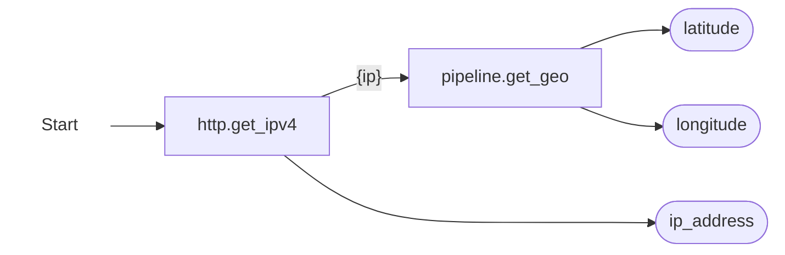
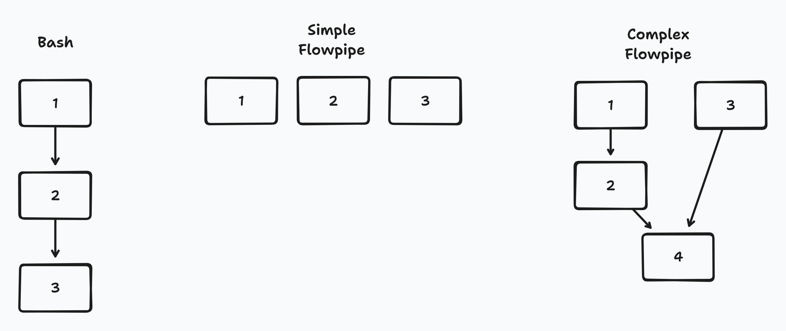
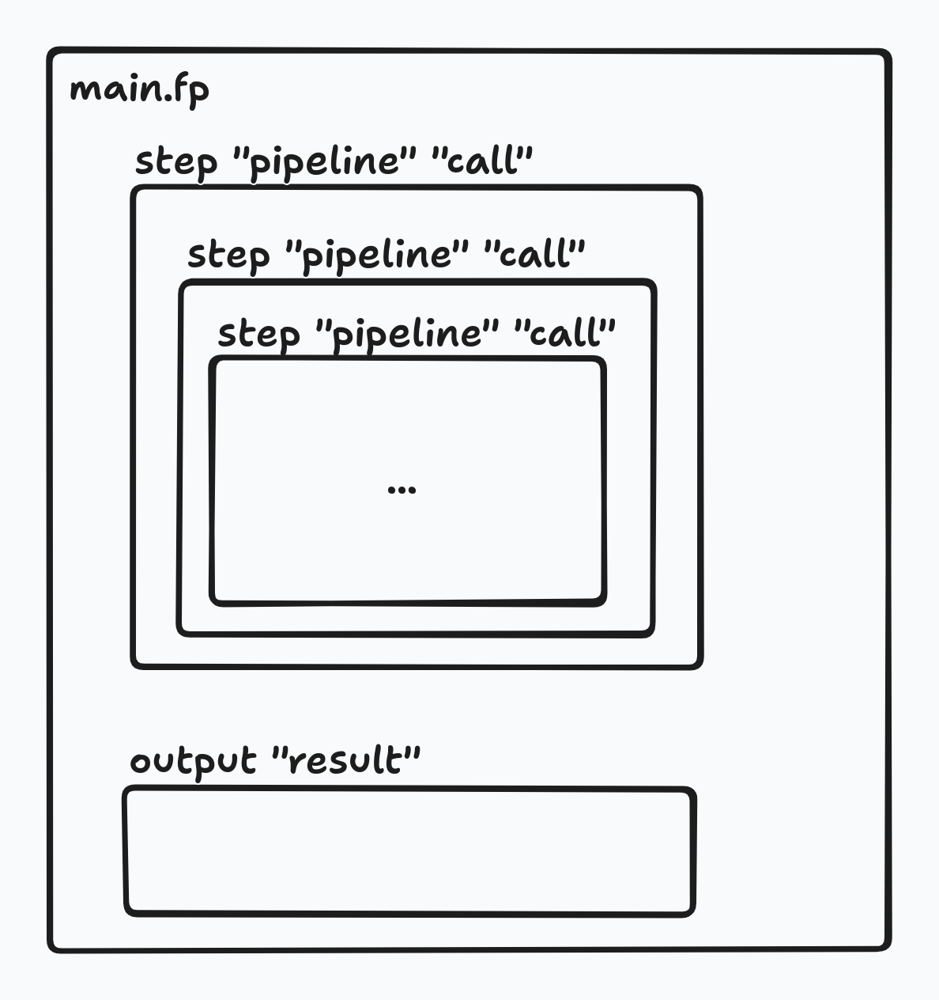
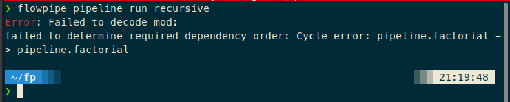
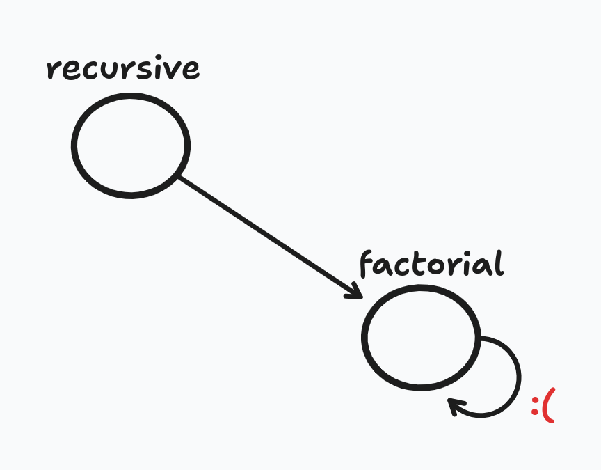
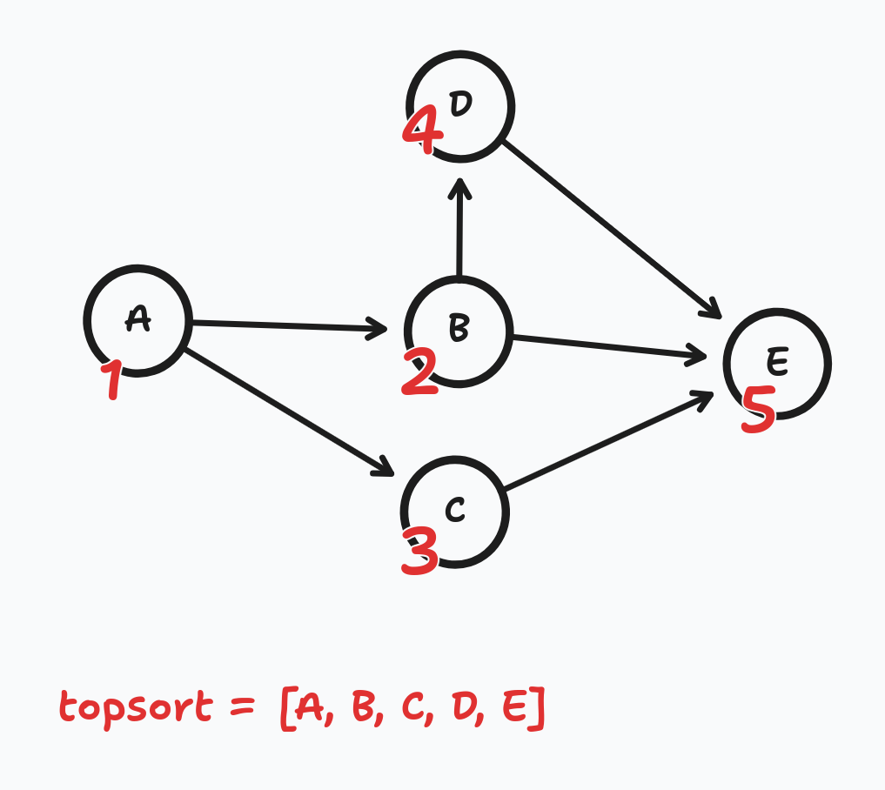
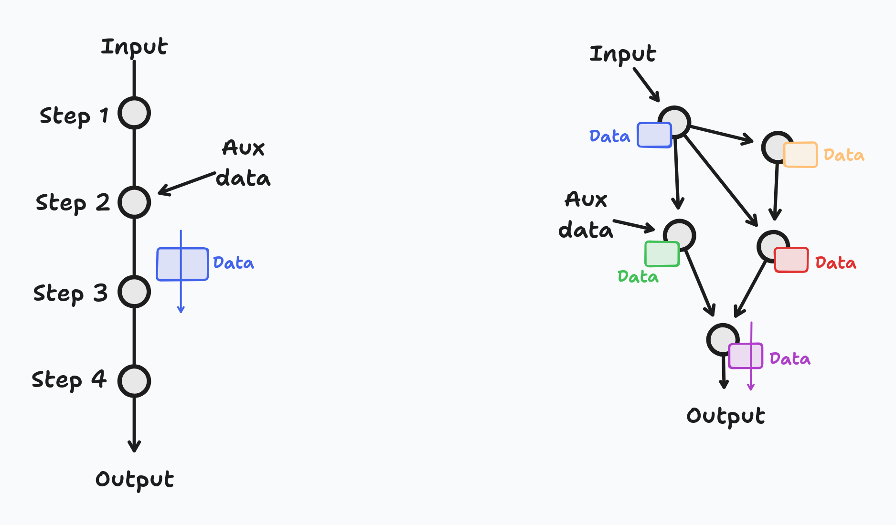

TL;DR: Go visit <https://flowpipe.io>. Take [a look at the language](https://flowpipe.io/docs), then see if it does things that you may want. 

Recently ([on December 13, 2023](https://flowpipe.io/blog/introducing-flowpipe), to be precise), the folks at [Turbot](https://turbot.com/) (the makers of the _extremely awesome_ [Steampipe](https://steampipe.io/) open-source project) released [Flowpipe](https://flowpipe.io/), "The cloud scripting engine." Let's take a look at it, so that we may see what nice things it offers.

Also, for another perspective, consider giving [this article by Nicholas M. Hughes](https://www.eitr.tech/blog/2023/12/21/exploring-the-fluidity-of-flowpipe) a read. It's quite short, and the only third-party article that I've been able to find that talks about Flowpipe. There's also [this InfoWorld post](https://www.infoworld.com/article/3712125/flowpipe-a-workflow-engine-for-devops-scripters.html) by Jon Udell, community lead at Turbot, which doesn't technically qualify as third-party for that reason. That article is very useful too, since it provides an inside view of what Flowpipe's authors think of it. This paragraph near the end neatly summarizes their vision for Flowpipe: 

> Flowpipe occupies a middle ground between tools like Zapier or IFTTT, which require little or no code for simple things, and tools like N8N or Windmill, which can do complex things but require a lot of code. You express pipelines, steps, and triggers in the standard devops configuration language: HCL. As needed you augment that code with SQL, or Python, or JavaScript, or bash, or anything you can package into a container.
> 
> https://www.infoworld.com/article/3712125/flowpipe-a-workflow-engine-for-devops-scripters.html

In this article we'll explore Flowpipe and see what it's all about. We'll start with the language, then see the available operations, compare it with similar (for a very loose definition of _similar_) tools, and a few potential use cases for it.

**Note:** For the record, this article has been written when Flowpipe was in versions 0.1.0 and 0.1.1 (there are [very few changes](https://github.com/turbot/flowpipe/releases/tag/v0.1.1) between them). Keep that in mind if you read this article a long time after it's published: things may have changed, features that don't exist now may have been added, and so on.

## Flowpipe crash course

This is a simple Flowpipe program, taken from [their docs](https://flowpipe.io/docs):

```hcl
pipeline "learn_flowpipe" {
  step "http" "get_ipv4" {
    url = "https://api.ipify.org?format=json"
  }

  step "pipeline" "get_geo" {
    pipeline = reallyfreegeoip.pipeline.get_ip_geolocation
    args = {
      ip_address = step.http.get_ipv4.response_body.ip
    }
  }

  output "ip_address" {
    value = step.http.get_ipv4.response_body.ip
  }

  output "latitude" {
    value = step.pipeline.get_geo.output.geolocation.latitude
  }

  output "longitude" {
    value = step.pipeline.get_geo.output.geolocation.longitude
  }
}
```

It encodes the following set of steps:



Square boxes are `step`s, and pill-shaped boxes are `output`s. Steps can (as the `pipeline.get_geo` step does by referring to `step.http.get_ipv4.response_body.ip` as the `ip_address` arg) refer to the outputs of other steps. Doing so will automatically insert a dependency between them: in other words, if a step B refers to the output of another step A, then Flowpipe can be sure that B cannot run until A has completed, and will execute them accordingly. Otherwise, unless [dependencies are explicitly declared](https://flowpipe.io/docs/flowpipe-hcl/step/index#depends_on), Flowpipe will run things in parallel, which is usually what you want anyways. Who doesn't like things running fast? 

Pipelines can [have inputs](https://flowpipe.io/docs/build/write-pipelines/inputs-outputs), which must be provided when running the pipeline (or when invoking it from another one: see how the `pipeline.get_geo` step is actually an invocation of the `reallyfreegeoip.pipeline.get_ip_geolocation` pipeline, which is [published online](https://hub.flowpipe.io/mods/turbot/reallyfreegeoip/pipelines/reallyfreegeoip.pipeline.get_ip_geolocation)). They can also have outputs, which are either a) shown as the output of the entire pipeline, if it's the top-level pipeline (i.e. not invoked from another pipeline), or b) presented to whichever pipeline was invoking this one, if the pipeline was nested inside another one.

Flowpipe's second-level heading is "Automation and workflow to connect your clouds to the people, systems and data that matters." This gives us an idea already: it's used to move data around and act on it, with a particular focus (as you'd expect from Turbot, who [really like cloud management](https://turbot.com/guardrails)) on cloud infrastructure (consider: "which EC2 instances are currently Running and use an AMI that was released more than two years ago, _and also_ are on a security group with a rule that allows Internet-wide access to port 22? We need something that, once every day at 9AM, fetches a list of all those instances and sends it to the Slack workspace"). This data can come from many sources: HTTP requests from APIs, relational DBs, files or magical processes that generate data. Several sources of data may be called, and their respective results combined together. Similarly, actions can be performed, such as sending an email, making an HTTP request or running a Docker image or Lambda-compatible function (in Docker too), which can therefore do many other things.

In particular, Flowpipe's sweet spot seems to be short(ish) scheduled code runs that pull data from disparate sources, merge it and then do _stuff_. Said _stuff_ may be informational actions, such as posting a Slack message. Or it may be actions that actually enact change in the world, such as shutting down EC2 instances or creating a Github issue. Flowpipe can also have URL listeners that receive requests, and then proceed as with a scheduled run. This could be used, for example, to do things not on a schedule, but when an external system needs to run something. Webhooks can even [return data](https://flowpipe.io/docs/flowpipe-hcl/trigger/http#webhook-response) (i.e. they don't have to return immediately with just an execution ID, but can instead delay their response, as long as the calling system can tolerate the delay, so the response to the calling system contains some useful data).

We'll take a look at projects that have some similarities in a future section, but for now, here's a rapid-fire list. It reminds me a bit of low-code tools like [Zapier](https://zapier.com/), in that it runs sequentially (if you want it to!) and does _things_. It's also a bit like [Fluentd](https://www.fluentd.org/) or [Logstash](https://www.elastic.co/logstash/) in that it can be used to express data transformation pipelines. The language is HCL, of [Terraform](https://www.terraform.io/)/[OpenTofu](https://opentofu.org/) fame. Expressing pipelines as a DSL instead of fully-fledged programs is also done by [Benthos](https://www.benthos.dev/) and Logstash.

## The language

Flowpipe's language is HCL, which is most famously used on Terraform and its Linux Foundation-managed Actual Open Source&trade; fork, [OpenTofu](https://opentofu.org/)[^1]. HCL is a "configuration language", intended to write configuration files for services. For example, this is a simple [Nomad](https://www.nomadproject.io/) configuration file, Hashicorp's application orchestrator, which does (AFAICT) something similar to Kubernetes (_gasp! the nerve on these people_), but uses HCL as a configuration language. This file is mostly taken from [a tutorial](https://developer.hashicorp.com/nomad/tutorials/get-started/gs-deploy-job#pytechco-web-nomad-hcl), and declares a single container (a Pod, for you Kubernetes people) which exposes a port (aka Service):

```hcl
job "app-web" {
  type = "service"

  group "app-web" {
    count = 1
    network {
      port "web" {
        static = 5000
      }
    }

    service {
      name     = "app-web-svc"
      port     = "web"
      provider = "nomad"
    }

    task "app-web-task" {
      template {
        data        = <<EOH
{{ range nomadService "redis-svc" }}
REDIS_HOST={{ .Address }}
REDIS_PORT={{ .Port }}
FLASK_HOST=0.0.0.0
{{ end }}
EOH
        destination = "local/env.txt"
        env         = true
      }

      driver = "docker"

      config {
        image = "registry.com/org/image:1.0"
        ports = ["web"]
      }
    }
  }
}
```

A similar configuration in YAML may look as follows:

```yaml
job:
  name: app-web
  type: service
  groups:
    - name: app-web
      count: 1
      network:
        ports:
          - name: web
            static: 5000
      service:
        name: app-web-svc
        port: web
        provider: nomad
      tasks:
        - name: app-web-task
          template:
            data: "..."
            destination: local/env.txt
            env: true
          driver: docker
          config:
            image: registry.com/org/image:1.0
            ports: ["web"]
```

The semantics of the two files aren't exactly the same (for example, the `template` field in the task is probably an array in HCL), but they should be close enough for this discussion. 

By reading those two files, it's possible to see that they encode the same information, albeit in slightly different forms. For example, where HCL can have a special `job "job-name" {...}` block, which _definitely_ encodes a Job, YAML would have a dictionary key `job:`. The fact that this is a job (as opposed to, say, a service) resides in the key, but the data structure itself is a dictionary.

Or, stated otherwise, HCL provides a way to have a syntax that is much closer to the application's concepts. In YAML, you declare "dictionaries" and "arrays", both of which are fully abstract concepts that don't indicate anything about the business domain. In HCL, every application declares its own data model, so (for example) Terraform has "inputs", "outputs", "resources" and "data sources", Nomad has "jobs", "services" or "config items"... and Flowpipe has "pipelines", "steps" and "outputs". All of these as first-order concepts. HCL-based config files express themselves in terms of entities that belong to the business domain. This (in theory) results in cleaner config files that can have more meaningful syntax checking and errors, and can also be read with more ease.

The HCL official repo [has a section aptly titled "Why?"](https://github.com/hashicorp/hcl?tab=readme-ov-file#why), where they explicitly contrast HCL to serialization/marshalling languages such as JSON and YAML. To quote from there:

> Whereas JSON and YAML are formats for serializing data structures, HCL is a syntax and API specifically designed for building structured configuration formats.
>
> HCL attempts to strike a compromise between generic serialization formats such as JSON and configuration formats built around full programming languages such as Ruby. HCL syntax is designed to be easily read and written by humans, and allows declarative logic to permit its use in more complex applications.
>
> HCL is intended as a base syntax for configuration formats built around key-value pairs and hierarchical blocks whose structure is well-defined by the calling application, and this definition of the configuration structure allows for better error messages and more convenient definition within the calling application.

In other words: JSON and YAML are mostly aimed at pure _data_, i.e. sets of values, i.e. strings, numbers, arrays and objects (that's actually the entirety of JSON, if you add `null`. YAML has some more ideas, such as [anchors](https://support.atlassian.com/bitbucket-cloud/docs/yaml-anchors/) and [custom tags](https://github.com/eemeli/yaml/blob/main/docs/06_custom_tags.md)). You aren't supposed to encode other things in JSON or YAML, such as operations on data (e.g. "this string, but uppercased") or pointers across sections (i.e. "this field has the same value as that other field", or even worse, "this field has the value of that other field plus one"). Also, in JSON/YAML you don't declare "a user", you write "a dictionary that has a key `type: user` and fields `name`, `email` and `is_active`". A certain program that wanted "users" to exist in its config files and used HCL could configure its data model so config files can contain something like

```hcl
user "user_name" {
  email = "..."
  is_active = true
}
```

Applications that need more than simple, static data sometimes resort to other means. For example, Kubernetes manifests are YAML files, which is amazing most of the time... until you need to, say, conditionally include a section in a manifest. Since a YAML file is pure data, it has no way to cleanly encode the fact that "this section should only appear if this other value is set to `true`". [Helm charts](https://helm.sh/docs/chart_template_guide/functions_and_pipelines/) appeared as a solution to that, which (I think) passes the chart files through [the Go text templater](https://pkg.go.dev/text/template) so it generates (hopefully) valid YAML, which is then submitted to Kubernetes. Vagrant, on the other hand, just [goes full Ruby](https://developer.hashicorp.com/vagrant/docs/vagrantfile/tips), giving the user access to variable declarations, `if` statements or loops, at the cost of giving users the possiblity of writing Turing-complete abominations that never exit, or something equally as horrifying.

HCL seems to be somewhat of a middle ground between pure data declaration, which is static/passive in nature (i.e. "here's your bunch of fields with values") and fully active, programming-language-backed expressions that could do anything at all. As we'll see, HCL (and, hence, Flowpipe) has some constructs that will seem familiar to anyone who has used any programming language before, but it isn't a Turing-complete, fully-fledged execution engine. Whether that's good or bad, only you can determine.

Terraform, for example, uses HCL to declare _cloud resources_, such as EC2 instances or Lambda functions. The set of declared resources is the desired state, which is then compared to the real world (or, to be precise, to Terraform's snapshot of the real world that is stored in the state file), and any deviations are converted into actions that are then executed by Terraform, thereby (hopefully) bringing the world into harmony with the desired state. This could also be done in YAML or JSON, but things like multiple EC2 instances that are very similar except for a name or tag would be painfully difficult, requiring copy-paste (recall that YAML and JSON, being passive data languages, don't really have things like data references[^2]).

Flowpipe, by contrast, uses HCL to declare _stages_ in a _pipeline_. Despipe its name, a (Flowpipe) pipeline isn't necessarily like [a Bash pipeline](https://www.gnu.org/software/bash/manual/html_node/Pipelines.html), whereupon a set of steps are run in strict sequential order with the output of each step being passed to the next one. Indeed, with no data dependencies in place, a Flowpipe pipeline would run everything in parallel, not in series. If some steps depended on others, those steps would be pipelined:



So, Flowpipe's data model is _not_ an array. It's more like a [directed graph](https://mathworld.wolfram.com/DirectedGraph.html). A Bash pipeline could be modeled as an array, with each command being an element. Flowpipe is instead a graph: each step is a node, and they are just loose items until connected, either via a step using another step's output or by explicit `depends_on` settings. Either of those generates an edge that connects the two steps.

Flowpipe's execution engine will repeatedly [try to find steps that can be run](https://github.com/turbot/flowpipe/blob/15e6b50ab054582df091a6c1858483bdfe48de89/internal/es/handler/step_for_each_planned.go#L47-L50) and enqueue them. Once a step runs, other steps (the ones that depended on it) may become available to be run. Assuming that the pipeline's topology is runnable at all, it'll eventually be completed (unless errors happen).

### Inputs and outputs

As we've discussed before, pipelines [can have inputs and outputs](https://flowpipe.io/docs/build/write-pipelines/inputs-outputs). They are the means by which pipelines communicate with the calling environment and with each other (since pipelines can call each other, they pass data via inputs and get it back via outputs).

Inputs are declared in `param` blocks, are available to every step in the pipeline (as `param.param_name`) and must be provided for the pipeline to run (they may have a default, which will satisfy this need). Input values may come from:

* Default values, if one was specified
* The CLI, if the pipeline is being run directly
* The pipeline that called this one, if it's being invoked from another one

Similarly, output params are declared in `output` blocks, can refer to any step's output values, and will be either:

* Printed to stdout, if the pipeline is being run directly
* Be available to the pipeline that called this one, if it's being invoked from another one

In this way, input and outputs are Flowpipe's analogue to a programming language's function parameters and return values. If a pipeline is a function, then inputs are the function's params and outputs are the function's return values.

Much like normal functions in a standard programming language, Flowpipe's pipelines are _composable_, i.e. they can be combined together to arbitrary depths to build up more complex functionality. Flowpipe pipelines can be published in [mods](https://flowpipe.io/docs/build/mod-dependencies), which are "portable, versioned collection[s] of Flowpipe pipelines and triggers". The closest comparison would be, for example, Go modules, or NPM or Python packages. They represent the way by which Flowpipe users can reuse, share and organize pipelines, that hopefully do small, useful, self contained things. As of right now, I couldn't find a way for people to contribute mods to the Flowpipe Hub, but that will most likely change soon.

### Available step types

Now that we've reviewed inputs and outputs, we can take a look at _steps_. Steps form the bulk of a pipeline (the operations that it'll perform), and each one has a type.

Step types are [documented here](https://flowpipe.io/docs/flowpipe-hcl/step/index). As of writing this article, there are just 8 step types, but don't be fooled. At least four of those steps (`container`, `function`, `http` and `query`) are escape hatches to external systems, that can have a _lot_ more expressive power than Flowpipe itself.

For example, this step makes a HTTP request:

```hcl
step "http" "whos_in_space" {
  url    = "http://api.open-notify.org/astros"
  method = "get"
}
```

The [docs for the `http` step](https://flowpipe.io/docs/flowpipe-hcl/step/http) tell us that (assuming that the called URL returns `Content-Type: application/json`, as <http://api.open-notify.org/astros> does), the `step.http.whos_in_space.response_body` variable (i.e. the `response_body` property of the `step.http.whos_in_space` step) will contain an object. From there, another step could (say) use `step.http.whos_in_space.response_body.number` (which is currently 7, by the way).

The HTTP step could be used in this way to get data "into" a Flowpipe pipeline (using standard REST semantics, which dictate that GET requests are supposed to be for reading data). Of course, since the `method` can be changed, POST requests could be sent too, which (again, assuming REST or good old browser-y semantics) would indicate that the request will cause a change in the server, such as opening a ticket or posting a Slack message.

This step type alone means that Flowpipe is capable of interfacing with anything that speaks HTTP. Form-based submissions, REST, GraphQL, SOAP, or other stuff. Flowpipe will happily send data to the system and get data back from it. And, these times, that is a lot of systems. Especially in the cloud automation scene, which Flowpipe comes from.

Of course, if Flowpipe can speak HTTP, then it can interface with some very powerful systems. Have [a ML model that is served via REST](https://docs.jina.ai/concepts/orchestration/deployment/#http-protocol)? Flowpipe can now consume it. Using [Kubernetes](https://kubernetes.io/docs/reference/command-line-tools-reference/kube-apiserver/)? Flowpipe can control it. Want to [turn on a light](https://www.home-assistant.io/)? Same. And so on: as long as it has an HTTP API, Flowpipe is (or should be) able to interface with it.

If something can't be served from behind a HTTP API, then Flowpipe has a couple of other ways of running it: `container` and `function`.

`container` steps [run a Docker container](https://flowpipe.io/docs/flowpipe-hcl/step/container), in much the same way as if you were to run `docker run --rm -e ENV_VAR=val -e ENV_VAR2=val2 org/image_name:v1.0 command arg1 arg2`. From what I can see, this step requires access to [the Docker Unix socket](https://stackoverflow.com/a/35110344), which is the same way that the Docker CLI uses to communicate with the Docker daemon, and it uses [Docker's official Go client](https://pkg.go.dev/github.com/docker/docker/client). It commands [the creation of a container](https://pkg.go.dev/github.com/docker/docker/client#Client.ContainerCreate), i.e. a running instance of an image, and [starts it](https://github.com/turbot/flowpipe/blob/3cb939506967ff2142b70e2880116114ad8315f1/internal/container/container.go#L344). Then, it [waits for the container to stop running](https://pkg.go.dev/github.com/docker/docker/client#Client.ContainerWait) ([here](https://github.com/turbot/flowpipe/blob/3cb939506967ff2142b70e2880116114ad8315f1/internal/container/container.go#L357)) and gathers some data about the (now defunct) container. In particular, it grabs [the container's exit code](https://github.com/turbot/flowpipe/blob/3cb939506967ff2142b70e2880116114ad8315f1/internal/container/container.go#L365), which is set by the containerized process, as well as [grabbing all the container's logs](https://github.com/turbot/flowpipe/blob/3cb939506967ff2142b70e2880116114ad8315f1/internal/container/container.go#L384) (which are divided into stdout and stderr). Finally, it (optionally) [cleans up the container](https://github.com/turbot/flowpipe/blob/3cb939506967ff2142b70e2880116114ad8315f1/internal/container/container.go#L409-L420) (by doing something similar to `docker rm <container_id>`).

In other words, the `container` step will fetch a Docker image into the local Docker daemon, spawn and start a container with that image (plus a bunch of configuration, such as memory/CPU limits, envvars or a custom entrypoint), will wait for said container to stop, and then fetch its status code and output logs. Those will be [the output from the step](https://flowpipe.io/docs/flowpipe-hcl/step/container#attributes-read-only), which future steps will have available.

Thus, to invoke a container from Flowpipe, you'd need to have a Docker image that does... whatever needs to be done. If it needed some data to run, it'd have to receive it via envvars or via the container's `command` or `entrypoint`. Notably, there are no volume mappings (at least, not yet), and no way to control the container's stdin either. This means that the amount of data that can be passed _into_ a container is probably limited, since neither envvars nor the command line are suited for large amounts of data (that would be better served by saving the data into a file and then launching the container with the file mounted, but that isn't possible).

This would point towards containers being supposed to be "generators" of data, rather than "transformers" of data. Of course, they can also be used as "doers-of-actions", i.e. have them execute actions that require little or no input (perhaps some credentials and some sort of ID) and then perform actions that cause some change in the world.

For example, a container would be useful to pull some data from a system that only exposes a gRPC interface. Flowpipe can't natively talk gRPC, but a Docker container with the appropriate dependencies can. The container would have to print the obtained data on its stdout, ideally using a structured format such as JSON or YAML, from where the Flowpipe process could extract and parse it.

Something of note is that Flowpipe-friendly containers aren't long-running/never-ending containers, such as web servers. Rather, they are supposed to boot up, do something and then exit normally. If you come from Kubernetes, think [Jobs](https://kubernetes.io/docs/concepts/workloads/controllers/job/) rather than [Deployments](https://kubernetes.io/docs/concepts/workloads/controllers/deployment/) or [StatefulSets](https://kubernetes.io/docs/concepts/workloads/controllers/statefulset/).

Once a container has done its thing, it should provide any output data by printing it to stdout. Flowpipe will capture it and make it available to any future steps in the `stdout` variable. This is similar to shell scripting, in which the available outputs are the process's return code, its stdout/stderr streams, and any effects that it may have caused in the world (e.g. a database entry was updated or a remote server now holds a new value).

[The `function` step](https://flowpipe.io/docs/flowpipe-hcl/step/function) is really nice. It's also powered by Docker, but it doesn't require a Docker image to exist in a registry somewhere. Instead, it goes the serverless route: you provide the step with the path to a directory which contains, from what I understand, [a Lambda-compatible ZIP archive](https://docs.aws.amazon.com/lambda/latest/dg/configuration-function-zip.html) (again, this isn't quite clear, but the docs do say "the function's deployment package", and AWS Lambda's two supported deployment methods are [ZIP files and Docker images](https://docs.aws.amazon.com/lambda/latest/dg/lambda-deploy-functions.html)).

As outlined [in Lambda's docs](https://docs.aws.amazon.com/lambda/latest/dg/foundation-progmodel.html), the programming model of a Lambda function is as follows:

* A Lambda function is a single function (i.e. a `func` in Go, a `function` in JS/Ts, or a `def` in Python). It can, of course, call other functions, but there's always one that is "the main entrypoint"
* This main entrypoint is also called the "handler"
* _Someone_ (e.g. AWS Lambda if you were to deploy there) will call your handler function whenever something needs to happen. Traditionally, this happens whenever a HTTP request is received: the handler function receives an _event_ that contains information about the incoming request, such as its URL, source IP, HTTP method, and headers
* The handler function should do whatever it needs to, such as accessing a DB or making API calls to external systems
* Then, the handler function should return a value, which the same _someone_ that called the function will then use as needed
* Having done its job, the handler function will cease working until another event needs to be handled

The primary advantage of this model is that, by thinking in terms of single requests, the function can (in theory) be scaled to handle very large volumes of requests. There's nothing in the definition of a Lambda function that controls the amount of concurrent copies of the function that are active and handling events at a given time. That's the responsiblity of the runtime, let's say AWS Lambda, and it'll work well as long as the function is written keeping in mind that a) other copies of it may be running somewhere at the same time, and b) _this specific copy_ of the function may be killed at any point and for any reason, so it doesn't serve any more requests.

Lambda functions can scale very quickly to meet huge demands, since all that is needed is to spin up new copies of the function, which is a matter of, at worst, hundreds of milliseconds, as opposed to several minutes to spin up a new VM and then minutes, hours or even days to fully configure it. Likewise, Lambda functions can "scale down" if they aren't handling any traffic: since instances of the function must have been written assuming that they can be killed, it's easy to just destroy them all. They'll be spawned again if necessary, after all. In this way, providers of Lambda functions bill users by usage (e.g. number of CPU-seconds that a function was working), and it can provide cost savings if usage patterns are very bursty (i.e. most of the time nothing happens, then at some point huge spikes of traffic need to be handled in a very short amount of time, shorter than the time it'd take to spin up new replicas of a web server). If using an always-on, traditional web server, the huge peaks would necessitate large servers, which are expensive and would sit idle most of the time.

Thus, Lambda functions offer an event-based way of writing processing steps: event comes in, Lambda function wakes up, magic happens, response comes out, Lambda function goes back to sleep. Repeat, perhaps in parallel, for every event. Lambda functions are great when the application only works in response to events (such as web servers, where things are run to handle incoming requests). For example, see [the triggers for the Spin framework](https://developer.fermyon.com/spin/v2/triggers): they have an [HTTP trigger](https://developer.fermyon.com/spin/v2/http-trigger) (which invokes its handler function when an incoming HTTP request is received) and a [Redis trigger](https://developer.fermyon.com/spin/v2/redis-trigger) (which invokes its handler function when a message appears on a [Redis pub/sub channel](https://redis.io/docs/interact/pubsub/)). Other triggers could be messages being received on a messaging system, [such as MQTT](https://docs.openfaas.com/reference/triggers/#mqtt-connector) or [NATS](https://docs.openfaas.com/reference/triggers/#nats-pubsub), [a cron schedule](https://docs.openfaas.com/reference/triggers/#cron-connector) or [a record being inserted on a DB](https://docs.openfaas.com/reference/triggers/#postgres).

As long as an application can model all its logic as "when X happens, then do Y", Lambda functions can be a very nice way of organizing the application as a loose collection of functions, one for each event.

Flowpipe can become a Lambda runtime (that is, the _thing_ that calls Lambda functions), and it'll run the handler with a configurable event. Whatever the handler returns [will be available to any further steps](https://flowpipe.io/docs/flowpipe-hcl/step/function#attributes-read-only). The event is passed into the called function as a plain object, like a JSON document (i.e. it has keys and values. Keys are string, values are either primitive values, arrays or nested documents). Whatever the Lambda function returns will eventually be translated into another object, with the same data types.

[`pipeline` steps](https://flowpipe.io/docs/flowpipe-hcl/step/pipeline) provide composability to Flowpipe by letting a pipeline call another one. The [Flowpipe Hub](https://hub.flowpipe.io/) is a repository of pipelines that can be called. For example, consider [the `turbot/aws` mod](https://hub.flowpipe.io/mods/turbot/aws). As of writing this, it has [77 pipelines](https://hub.flowpipe.io/mods/turbot/aws/pipelines), among which are [Launch EC2 instance](https://hub.flowpipe.io/mods/turbot/aws/pipelines/aws.pipeline.run_ec2_instances) (to which you provide an instance type, image ID and region, plus [a couple of other params](https://hub.flowpipe.io/mods/turbot/aws/pipelines/aws.pipeline.run_ec2_instances#params)), and which does exactly what it says: it creates EC2 instances.

Under the hood, that specific pipeline [uses a `container` step](https://github.com/turbot/flowpipe-mod-aws/blob/f9445c88617502c033f914b3c15dd9c31ddf28ad/pipelines/ec2/run_ec2_instances.fp#L36-L47), which uses the `public.ecr.aws/aws-cli/aws-cli` Docker image. This image is an official Amazon image, which provides the `aws` CLI. The Flowpipe pipeline sends a command like `aws ec2 run-instances --instance-type ... --image-id ... --count ...`. This, as we have discussed before, causes a change in the world (i.e. one or more EC2 instances get created). This highlights a property of `pipeline` steps: they have no magic properties. It's always possible to do anything that a nested pipeline does in your own code, as they get no special super-secret commands. This also means that they're very easy to understand, using the same concepts that you had to learn anyways to call them in the first place.

For another example, consider [the OpenAI mod](https://hub.flowpipe.io/mods/turbot/openai). It has [a single pipeline](https://hub.flowpipe.io/mods/turbot/openai/pipelines/openai.pipeline.create_chat_completion), "Create Chat Completion", which submits a prompt to ChatGPT and outputs its response. It uses [a `http` step](https://github.com/turbot/flowpipe-mod-openai/blob/b4135d2c43f1938331d5aceaa15f3ada475628f6/pipelines/chat/create_chat_completion.fp#L43-L67) to call the OpenAI API. Maybe that could be used to summarize commits or something, before sending them to Slack?

Finally, [the `query` step](https://flowpipe.io/docs/flowpipe-hcl/step/query) can call a relational DB (currently only Postgres, though other DBMSs are in the works), send a SQL statement and capture the response. This covers both `SELECT` queries, through which data can come into the pipeline from a data store; and `INSERT` or `UPDATE` statements, through which the pipeline can cause changes to happen somewhere else: the `query` step just wants a string that it'll send to the remote DB.

Of course, this being a Turbot product, here's your PSA of the day. In case you don't know, Turbot also develops [Steampipe](https://steampipe.io/), an amazing tool that takes REST APIs, such as the AWS API, and presents it as if it were Postgres tables. This means that, instead of running `GET https://api.aws.com/ec2/instances?status=running` (and needing to handle such pesky details as authentication, rate limiting, needing to learn the actual formats of input and output data, and merging that data with other data sources), you do `SELECT * FROM aws.ec2_instance WHERE status='running'`. It's sometimes much cleaner, plus you get to [merge completely disparate sets of data](https://steampipe.io/blog/use-shodan-to-test-aws-public-ip) if you need to, and SQL is just... a good language for Structuredly Querying Data. Go figure. If that sounds fun, I have [a series of posts that covers Steampipe](/tags/steampipe/), which you may be interested in.

In any case, since Steampipe is a legitimate Postgres server (except that it doesn't typically save any data, but instead computes it on the fly when asked for it, via [a magical Postgres Foreign Data Wrapper](https://github.com/turbot/steampipe-postgres-fdw) and its associated plugins), Flowpipe can connect to Steampipe using a `query` step. This means that you get to reuse [all of the cool 140+ plugins that Steampipe already has](https://hub.steampipe.io/plugins), with Flowpipe just doing something like `SELECT * FROM data_source WHERE field='value'`. Steampipe is read-only (no INSERTs!), so this would be used to bring data into a Flowpipe pipeline, instead of using probably `http` steps.

## Extending Flowpipe

From what I can see, right now the only (officially supported) extension point for Flowpipe is [building mods](https://flowpipe.io/docs/build/index), which are pipelines that can be shared and reused. This means, in particular, that all the power of Flowpipe is [contained within these steps](https://flowpipe.io/docs/flowpipe-hcl/step/index#step-types). No escaping. For example, there's no step that does [gRPC](https://grpc.io/), so if you wanted to consume a gRPC-based API, then no amount of wrapping pipelines inside pipelines will help you. You'd have to eventually escape to either a [container](https://flowpipe.io/docs/flowpipe-hcl/step/container) or a [Lambda function](https://flowpipe.io/docs/flowpipe-hcl/step/function), which bring in a completely new execution environment. Or wrap the gRPC endpoint inside an HTTP endpoint, or write a Steampipe plugin that wraps it, or something, but the point stands: Flowpipe can't talk gRPC. And no amount of mods will help you.

That being said, it's perfectly possible that support for custom plugins will be added later. Steampipe, for example, by the same developers, [supports plugins](https://steampipe.io/docs/develop/overview) that are called whenever a `SELECT` statement is fired off at a table. In Flowpipe's case, it'd probably be plugins that are executed on `step` blocks, receive any parameters that have been provided to the step, and return whatever they need to.

In the meantime, Flowpipe's extensibility is achieved via [mods](https://hub.flowpipe.io/). While it would be easy to dismiss them because "they're no more powerful than vanilla Flowpipe", which is _technically_ true (in the sense that anything that mods do you could do in your own top-level pipeline), mods are still very useful. For example, a considerable amount of operations can be done nowadays (thankfully) via REST or similar APIs, over HTTP. Gone (somewhat) are the days of UI-only or CLI-only operations. This means that [the `http` step](https://flowpipe.io/docs/flowpipe-hcl/step/http) is already very powerful.

Thus, all that a mod needs to do to be quite useful is to wrap `http` steps to expose a cleaner interface. For example, instead of the user having to think in terms of "POSTing to `https://api.github.com/repos/OWNER/REPO/issues/ISSUE_NUMBER` with [the correct headers](https://docs.github.com/en/rest/using-the-rest-api/getting-started-with-the-rest-api?apiVersion=2022-11-28#headers) and [authentication](https://docs.github.com/en/rest/using-the-rest-api/getting-started-with-the-rest-api?apiVersion=2022-11-28#authentication)", the [Github mod](https://hub.flowpipe.io/mods/turbot/github/pipelines/github.pipeline.close_issue) provides the way for the user to think in terms of "a step that closes an issue":

```hcl
step "pipeline" "close_it" {
  pipeline = github.pipeline.close_issue
  args = {
    repository_owner = <string>
    repository_name = <string>
    issue_number = <number>
    state_reason = <string>
    cred = <string>
  }
}
```

In other words, mods can raise the level of abstraction from "make HTTP call" to "close Github issue". Github issues _are_ closed by making HTTP calls, but sometimes it's useful to not have to think about the specific mechanism.

Of course, what we've discussed here for closing Github issues works for many other things: [opening them](https://hub.flowpipe.io/mods/turbot/github/pipelines/github.pipeline.create_issue), [updating a PR](https://hub.flowpipe.io/mods/turbot/github/pipelines/github.pipeline.update_pull_request), [creating a repo](https://hub.flowpipe.io/mods/turbot/github/pipelines/github.pipeline.create_repository)... and that's just [the Github mod](https://hub.flowpipe.io/mods/turbot/github). How about [the Discord mod](https://hub.flowpipe.io/mods/turbot/discord/pipelines/discord.pipeline.create_message) and its pipeline that posts messages? Or [the equivalent Slack mod](https://hub.flowpipe.io/mods/turbot/slack/pipelines/slack.pipeline.post_message)? The three big clouds [have](https://hub.flowpipe.io/mods/turbot/aws/pipelines) [many](https://hub.flowpipe.io/mods/turbot/azure) [pipelines](https://hub.flowpipe.io/mods/turbot/gcp) each. [Channels can be created](https://hub.flowpipe.io/mods/turbot/teams/pipelines/teams.pipeline.create_channel) on MS Teams. [Users can be added](https://hub.flowpipe.io/mods/turbot/okta/pipelines/okta.pipeline.activate_user) on Okta. Sendgrid can be used to [send emails](https://hub.flowpipe.io/mods/turbot/sendgrid/pipelines/sendgrid.pipeline.send_mail). A ticket can [be opened](https://hub.flowpipe.io/mods/turbot/zendesk/pipelines/zendesk.pipeline.create_ticket) on Zendesk. Since it's ~~2023~~ 2024, we have to mention [generating responses to prompts via OpenAI](https://hub.flowpipe.io/mods/turbot/openai/pipelines/openai.pipeline.create_chat_completion)/ChatGPT. And while I haven't really checked the source code of any of those mods, I'm like 99% sure that they all use `http` steps under the hood (except the big clouds. They use the official CLIs wrapped inside aa Docker container, which in turns calls the APIs). However, now users don't have to think about the low-level details of the APIs themselves; instead they just have to provide the correct params.

And, of course, let's not forget that all mods (or, at least, all that I've seen) are [properly open sourced](https://github.com/turbot/flowpipe-mod-aws/blob/main/LICENSE) under Apache 2.0. This means that you're more than free to read the source of every mod, tinker with them, contribute changes back, and many other fun activities. Being able to read mods can be very useful, both to understand how they work, to diagnose the inevitable bugs, and to extend them if, for example, a mod doesn't expose a certain API parameter that you happen to need.

So, to recap: Flowpipe isn't (currently!) extensible in the sense of being able to add new step types. However, it has several powerful escape hatches (`container`, `function`, and technically `http` and maybe even `query` too, since they can provide access to external systems that may have other capabilities). Besides, it has mods: third-party pipelines that can be imported and used. Mods don't add anything new to the language itself, but they are still very useful in adding higher-level abstractions that can be programmed against with ease. This is more or less the same thing as with programming language libraries: they won't add new functions to the core language[^3], but that doesn't at all mean that they're useless. They're still useful in wrapping potentially complex operations so the user of the library doesn't have to deal with them directly. Same goes for Flowpipe mods.

## RRP, aka RRP's Recursive Pipelines

We've already accidentally seen a few pipelines, and [Flowpipe's docs](https://flowpipe.io/docs) have many more. Now, let's try a strange pipeline, so we can test the limits of Flowpipe.

Something that every CS student learns quite early is to implement the factorial operation (`n! = n * n-1 * n-2 * ... * 3 * 2 * 1`) as a recursive algorithm. Can Flowpipe do it?

To do so, we require a pipeline that calls itself via a `pipeline` step, while also checking the base case (i.e. whether the incoming param is 1, at which point it should stop and return 1). Once hit, this will cause the parent invocation to collapse, which will in turn cause _its_ parent execution to collapse, and so on until the topmost one receives a value:



A tentative implementation would look as follows:

```hcl
pipeline "recursive" {
  param "n" {
    type    = "number"
  }

  step "pipeline" "rec_call" {
    args = {
      n = param.n
    }
  }
  
  output "result" {
    value = step.pipeline.rec_call.output.ret
  }
}

pipeline "factorial" {
  param "n" {
    type    = number
  }
  
  step "pipeline" "call" {
    pipeline = pipeline.factorial
    if = param.n > 1
    args = {
      n = param.n - 1
    }
  }
  
  output "ret" {
    value = param.n <= 1 ? 1 : param.n * step.pipeline.call.output.ret  
  }
}
```

Notice the two `pipeline`s. It'd be possible to use just one, but I split the code in two because it looks neater. The top pipeline, `recursive`, is the top-level user-facing code. It receives the `n` parameter and then invokes the `factorial` pipeline via the `step "pipeline" "rec_call"` block, which kicks off the recursive chain.

The `factorial` pipeline is somewhat equivalent to a function `factorial(int n) int` (in Go syntax). It receives `n` via a `param`, then calls itself with the value `param.n - 1`. However, note that this recursive call _only_ happens if `param.n > 1` (that's the `if = ...` argument to the `pipeline` step). This gives us the value of `factorial(n-1)`, and if `n` happened to not be greater than 1, it'd be unset.

Finally, the `ret` output (which is somewhat like a function's return value) returns 1, if the given parameter `n` is less than or equal to 1 (which is a factorial's base case), or `n * factorial(n-1)` otherwise. For this to work, we're relying on the fact that the ternary operator (that's the `a ? b : c` bit, by the way) will not evaluate its second argument if the condition is `true`, since if it did so it'd try to access a step that doesn't exist when it hits the base case `factorial(1)`. That property is called [short-circuiting evaluation](https://users.cs.utah.edu/~germain/PPS/Topics/shortcut_evaluation.html) and is commonly seen on boolean operators such as `a || b`: if `a` is true, then `b` doesn't need to be evaluated and the engine can return `true` straight away since `X OR Y` is true if any of its sides are true. Thankfully, this [seems to be the case](https://www.hashicorp.com/blog/terraform-0-12-conditional-operator-improvements), since Flowpipe appears to reuse Terraform's expression evaluator and that engine has had short-circuiting ternary operators since 2018.
 
That seems like it should work, right? Let's write that to a file and run it:

```bash
flowpipe pipeline run recursive
```

Aaand... it doesn't work:



```
❯ flowpipe pipeline run recursive
Error: Failed to decode mod:
failed to determine required dependency order: Cycle error: pipeline.factorial -> pipeline.factorial
```

Okay, fair enough. Flowpipe seems to run a parsing step in which it tries to build a dependency graph (i.e. which pipelines depend on which pipelines), and it gets very confused since it sees a pipeline that depends on itself:



And now, for a bit of trivia. The only mention that I could find, on all of Github, of the words "failed to determine required dependency order" is [on Steampipe's config parser](https://github.com/turbot/steampipe/blob/2bbcc350219cd87bc8c5aaa6c7d4a8cb3a9fdf69/pkg/steampipeconfig/parse/workspace_profile.go#L105). It wouldn't be too strange for Flowpipe to have some reused code from Steampipe. I could not find a single reference to the words "Cycle error" inside of Flowpipe's code, either. The [only reference](https://github.com/search?q=org%3Aturbot+%22cycle+error%22&type=code) ever made by Turbot (in their entire Github org) to those words is, strangely, on [the `steampipe-plugin-sdk` repo](https://github.com/turbot/steampipe-plugin-sdk), and it's [just in passing](https://github.com/turbot/steampipe-plugin-sdk/blob/d350ee802a58b88b91625cb488e15a2ee291ad3a/plugin/table_validate.go#L158). However, that line gives us the clue: it's calling a function called `TopSort` on a variable `dependencyGraph`, which [some lines above](https://github.com/turbot/steampipe-plugin-sdk/blob/d350ee802a58b88b91625cb488e15a2ee291ad3a/plugin/table_validate.go#L135) we can see to be the return value of `topsort.NewGraph()`. In turn, that `topsort` name refers (as we can see [on that file's imports](https://github.com/turbot/steampipe-plugin-sdk/blob/d350ee802a58b88b91625cb488e15a2ee291ad3a/plugin/table_validate.go#L5)) to [the `github.com/stevenle/topsort` Go package](https://github.com/stevenle/topsort), a fairly small (about 150 lines of code in a single file) package that implements topological sorting for graphs.

A topological sorting of a graph (in the CS sense of the word, i.e. a set of nodes and edges that connect pairs of nodes) is a way to order the graph's nodes so that, if a node A has a link to another node B, then A comes before B in the ordering. That is, a topological sorting is the list of nodes, but ordered such that any pair of nodes respects that condition. For example:



The red numbers represent one possible ordering of the nodes, that always respects the constraint that if A depends on B (or, in other words, A needs B to be done before A can execute), then B comes before A in the order. For example, consider nodes B and E. E depends on B (as the arrows indicate), so B goes before E in the red array at the bottom.

Notice that, in this case (and this is usually the case for larger-than-trivial graphs), there are more possible orderings. For example, nodes C and D don't depend on each other: as long as they both run before E, everyting is fine. This means that another ordering would swap D and D in the array to give `[A, B, D, C, E]`. However, this is only possible if swapping them won't cause D to land before B.

You can find more detail about topological sorts [in this article](https://cp-algorithms.com/graph/topological-sort.html). Back to the Go package that implements it, a quick search does indeed [find the line that is responsible for the "Cycle error"](https://github.com/stevenle/topsort/blob/cbb1bebc3b5e1be49b29dcfb6b4ef4c7e4fa450b/topsort.go#L81). In fact, that same line goes on to provide a list of all the nodes that caused the cycle, joined by ` -> `. This is exactly what we saw in the Flowpipe error message (remember: `failed to determine required dependency order: Cycle error: pipeline.factorial -> pipeline.factorial`), and we've thus essentially confirmed that this package is used to analyze the Flowpipe execution graph and come up with a proper order, which isn't possible if recursive invocations exist.

End of trivia, by the way.

So, now we've learned that a) Flowpipe doesn't like recursive pipelines, i.e. pipelines that call themselves, and b) this is because Flowpipe (or, to be precise, Steampipe's config parser code, which seems to be used in Flowpipe to parse the pipeline's HCL) determines a topological sort of inter-block dependencies. Blocks that refer to themselves cannot be topologically sorted, ever, and thus Flowpipe errors out.

I'm uncertain of the significance of this. Someone with a PhD on programming language theory could probably explain if this implies non-Turing-completeness or something. Perhaps Flowpipe will never be able to solve [the P=NP problem](https://en.wikipedia.org/wiki/P_versus_NP_problem). Oh well. We'll live without it, I'm sure.

## Similar tools

And now for another section: tools that are similar, in one way or another, to Flowpipe. This may be of help to people who have found out about Flowpipe but need something _just slightly_ different, or viceversa.

### OpenTofu/Terraform

The language used by Flowpipe (HCL) is the same one as used by [Terraform](https://www.terraform.io/) and its new, open-source cousin, [OpenTofu](https://opentofu.org/). Those tools use HCL to declare cloud infrastructure resources. For example, the code snippet below will declare two AWS resources: a VPC and a subnet that belongs to that VPC.

```hcl
resource "aws_vpc" "main" {
  cidr_block = var.base_cidr_block
}

resource "aws_subnet" "az" {
  count = length(var.availability_zones)

  availability_zone = var.availability_zones[count.index]

  vpc_id = aws_vpc.main.id

  cidr_block = cidrsubnet(aws_vpc.main.cidr_block, 4, count.index+1)
}
```

Upon running `tofu apply` (or the corresponding Terraform command), those two resources will be parsed into a graph of resources. Here the graph is quite simple: just two nodes and an edge (which is caused by the `aws_subnet.az` resource referring to the `aws_vpc.main` resource in the `vpc_id` and `cidr_block` fields). This will be compared with the tool's _state_, which ideally matches the real world (i.e. the state in AWS's real infrastructure). Any differences (for example, a node not existing in the real world or having a field with a different value, such as the `availability_zone` in a `aws_subnet`) will be reconciled by creating, updating or deleting real-world objects to match the expectations set by the resources that the user wrote, in HCL.

By contrast, Flowpipe doesn't express cloud resources that can be created or edited using the APIs that a cloud provider offers. Instead, Flowpipe HCL documents encode processing pipelines, series of steps that are run by a process. By using HCL, Flowpipe has inherited a few very useful steps: for example, HCL has first-class support for [expressions](https://github.com/hashicorp/hcl/blob/main/spec.md#expressions), short snippets of code that are evaluated at parse time. This is what, for example, lets users write `cidrsubnet(aws_vpc.main.cidr_block, 4, count.index+1)` as the value for the `aws_subnet.az.cidr_block` field. This line contains a function invocation (`cidrsubnet(...)`), arithmetical expressions (`count.index + 1`) and variable access (`aws_vpc.main.cidr_block`). Flowpipe ships with [a host of functions](https://flowpipe.io/docs/flowpipe-hcl/functions), for such varied purposes as number operations, manipulating strings, list handling, encoding and decoding, reading files from disk, getting and operating on timestamps, hashes, cryptographical functions, IP functions and more.

### Ansible

Another tool that is slightly similar to Flowpipe, in a few respects, is [Ansible](https://www.ansible.com/). Ansible is a tool that is used for server configuration and network automation, among other similar purposes. It employs YAML files, [called _playbooks_](https://docs.ansible.com/ansible/latest/getting_started/get_started_playbook.html), that contain series of _tasks_. Each task is a small command that does _something_ on a target (usually a server or network device). For example, a task may be to ensure that a certain package is installed, to copy a file to the target device, or to simply run a shell command. Originally, tasks connected to the target device over SSH or a similar connection, but with the rise of APIs there's now [Httpapi plugins](https://docs.ansible.com/ansible/latest/plugins/httpapi.html) that instead issue HTTP requests to the target.

This is an excerpt from an Ansible playbook that I developed a while back, which configures a Raspberry Pi from its just-installed state so it captures some weather data:

```yaml
---
- name: Set up Raspberry
  hosts: raspi
  remote_user: pi

  tasks:
  - name: Install some OS packages
    ansible.builtin.package:
      name: "{{ item }}" # item will take every value in the `loop` array in turn
      state: present # if an item doesn't exist, it'll install it
    become: true # sudo
    loop: [python3-pip, influxdb, influxdb-client, i2c-tools]
    
  - name: Ensure that Influx service is enabled
    ansible.builtin.service:
      name: influxdb
      state: started
      enabled: yes
    become: true # sudo

  - name: Disable swap
    ansible.builtin.replace:
      path: /etc/dphys-swapfile
      regexp: 'CONF_SWAPSIZE=1'
      replace: 'CONF_SWAPSIZE=0'
    become: true

  - name: Enable I2C device 
    ansible.builtin.command: raspi-config nonint do_i2c 0
    become: true
```

From this very short snippet (that's about 30 lines, the entire playbook to setup a Raspberry is maybe five times longer for context), we can already see a few things that are similar:

* There's a set of discrete steps. Ansible, which is a _much_ older project, has many more step types, but the general idea is the same: there's steps, which have fields that can be configured, and when run perform discrete reusable actions
* Steps have a return value, which can be a complex object. In Ansible, it's necessary to explicitly assign a name to a step's output so it's available later, using the `register` keyword, while on Flowpipe it's always available by using `step.<type>.<step_name>`
* Ansible's `loop` directive is similar to Flowpipe's `for_each`. Ansible calls the loop variable `item`, while Flowpipe calls it `each`. In both cases, the loop variable is available inside of the step's definition
* [The `is_error` Flowpipe function](https://flowpipe.io/docs/flowpipe-hcl/functions#is_error) (which, when provided with a reference to a step, will determine whether that step finished with an error, such as `is_error(step.http.my_request)`) is similar to Ansible's [`failed` test](https://docs.ansible.com/ansible/latest/playbook_guide/playbooks_tests.html#testing-task-results) (which can determine whether a previous step finished with an error or not, such as `result is failed`)
* There's a way to conditionally skip a step: `when` in Ansible, `if` in Flowpipe. In both cases, the value doesn't need to be a constant
* Both projects have a way to encode expressions. Ansible uses [Jinja](https://jinja.palletsprojects.com/en/3.1.x/), a Python text templating engine that can also, by virtue of being a template engine, encode a fair amount of Python-ish operations. Flowpipe uses the HCL built-in evaluation engine and a set of functions that have been taken from Terraform
* They offer a way to reuse code: `import_playbook` in Ansible, the `pipeline` step type in Flowpipe

Ansible playbooks are run somewhat like Flowpipe pipelines [that don't have a trigger](https://flowpipe.io/docs/flowpipe-hcl/trigger/index): they're spawned by running a command line argument, then do their thing and exit. Flowpipe's triggers (such as the HTTP trigger) have their counterpart in [Event-driven Ansible](https://www.ansible.com/blog/event-driven-ansible-is-here), which from what I understand is not as popular as Ansible proper. I'm not even sure if it's open source or just a part of Red Hat's hosted solution, Ansible Automation Platform.

Perhaps the largest difference between Ansible and Flowpipe is the execution model. Ansible is designed and optimized to run one series of steps against a set of targets (think updating the OS on a bunch of servers at once). This gives rise to the concept of [an inventory](https://docs.ansible.com/ansible/latest/inventory_guide/intro_inventory.html), a list of managed nodes. Typically, nodes will have an IP address, and perhaps a user or other login credentials. Ansible excels at parallelizing work across all of those machines. However, with no further configuration, Ansible playbooks are run sequentially: one step after the other, optionally skipping some steps if the `when` condition indicates so, until the end of the playbook is reached.

Flowpipe, on the other hand, is less of a linear sequence of steps and more of a graph. As we've discussed before, the Flowpipe engine computes a graph of each step, introducing dependencies as required, and then runs every step taking care of respecting said dependencies. Ansible does nothing of the sort: if you were to refer to the results of a step in a previous step, you'd find that the variable is not defined yet (exactly as expected). Flowpipe, on the other hand, would understand that the step that comes first in the HCL code (and has a reference to the results of a step that comes later in the code) must nevertheless come later in the execution. 

Both tools seem to differ in their aims too. Ansible's main job is to do _things_ on _nodes_. Or run command on servers, in other words. It was born to run shell commands on servers, and now it does many more things, but that's still the main idea. Ansible _performs actions_. It copies files. It configures packages. It enables services. And so on.

Flowpipe, by contrast, is focused on "connect[ing] your cloud data to people and systems". It pulls data out of sources, transforms it, and sends it to other places. There's a much greater emphasis on the _data_ that flows through the pipeline. Flowpipe is still capable of doing _things_: it can still create EC2 instances, send Slack messages or open Github issues, for example. Similarly, Ansible is perfectly capable of calling REST APIs or a database to extract data and then process it using Jinja functions.

To recap: Ansible and Flowpipe both use languages that aren't fully-fledged programming languages (YAML for Ansible, HCL for Flowpipe) to express operations. Ansible executes linear sequences of steps across multiple servers (in parallel across servers, but sequentially inside a single server), while Flowpipe runs a single graph (nodes are steps, edges are inter-step dependencies) and intelligently schedules steps so data dependencies are preserved.

### Low-code automation platforms

Flowpipe's intended job is to be a platform where short(ish) pipelines of actions can be run. We call it a _platform_ in the literal sense of the word: a solid base where other things can be built. Everything that Flowpipe can do, you could also do yourself using your programming language of choice, but for some things it may be easier, quicker, more efficient or clearer to do so in Flowpipe. It's supposed to provide some common functions (e.g. the ability to call HTTP APIs, intelligent parallelization of independent steps, webhooks, cron-style scheduling, and more).

In this respect, Flowpipe's aim is similar to that of no-/low-code automation platforms such as [Zapier](https://zapier.com/), [Make](https://www.make.com/en) (formerly Integromat) and [N8N](https://n8n.io/). There are more, which can be found by searching for alternatives/competitors to the tools above. 

These tools tend to share Flowpipe's aim: to be a platform where not-too-complex automations can be hosted. The tool in question provides some sort of "development environment" where automations can be created and edited (for the three tools mentioned, it's a web application). Once developed, automations are "deployed", which enables whichever trigger they had (e.g. a cron schedule, a webhook listener, or some sort of event handler that reacts to events on another application). The platform is responsible for running the deployed automations, provide logs of their execution, access control, and more.

Flowpipe is simpler than most such tools, since it doesn't have a web interface (yet?). Automations are declared in text files, which means that the development environment is a perfectly normal text editor or IDE, ideally with HCL support. However, once an automation is built, then Flowpipe takes over the responsiblity of running it as those other platforms do. Again, since it doesn't have a web UI, Flowpipe doesn't provide a view of past executions or access control. There appears to be [a way to view the logs and events of a certain pipeline execution via CLI](https://flowpipe.io/docs/reference/cli/process), if you happen to have that execution's ID.

So: Flowpipe is similar to low-code automation tools such as Zapier, Make or N8N in that it's the "shell" on which user-defined "automations" run. It's different in that it's code-driven rather than UI-driven as those other three tools (and more that are similar), which means that users interact with Flowpipe differently.

### Data pipelines

This is a rather tenuous family of similar tools, but it's still here for completeness. Flowpipe's main idea (it's in the name) is to be a _pipeline_ through which data _flows_. In other words, data comes in via the input, gets processed via steps (and perhaps it causes things to happen in the real world, such as a message being sent to Slack) and then leaves via outputs. Perhaps the clearest example of this structure would be a pipeline with [a `http` trigger](https://flowpipe.io/docs/flowpipe-hcl/trigger/http), configured to be synchronous, which processes the request data somehow and then [returns some other data](https://flowpipe.io/docs/flowpipe-hcl/trigger/http#webhook-response). Such a Flowpipe pipeline would be a data transformation pipeline, especially if it refrained from executing _actions_ in the outside world (i.e. no Slack messages!), but only pulled in auxiliary data (read-only, perhaps via `http` or `query` steps) and transformed its input data.

As it turns out, this is the purpose of tools that encode data pipelines, such as [Fluentd](https://www.fluentd.org/), [Logstash](https://www.elastic.co/logstash/) (of Elasticsearch fame) and [Benthos](https://www.benthos.dev/). They all have a few things in common: a way to describe the sequence of steps that data goes through (the three tools listed here use DSLs), ways to get data _into_ the pipeline, and ways to get data _out of_ it.

For example, Fluentd has [data sources](https://www.fluentd.org/datasources) and [data outputs](https://www.fluentd.org/dataoutputs). [Logstash](https://www.elastic.co/guide/en/logstash/current/input-plugins.html) and [Benthos](https://www.benthos.dev/docs/components/inputs/about) also have nearly identical concepts. A pipeline is composed of one or more inputs (whether several inputs are allowed or not depends on the specific tool), and one or more outputs. Between these, there is a series of steps (called _filters_ on Fluentd and Logstash, and _processors_ in Benthos) which both receive and output data. They can be used to transform data (e.g. [split a text field which contains a raw log line into more structured data](https://www.benthos.dev/docs/components/processors/grok)), filter it (e.g. [drop messages](https://www.benthos.dev/docs/guides/bloblang/about#filtering) that lack a certain field), merge them together (e.g. by [buffering some messages and batching them by a key](https://www.benthos.dev/docs/components/processors/group_by)) or split them apart (e.g. [converting a single message](https://www.benthos.dev/docs/components/processors/unarchive) that contains a JSON array into one message per element in the array), pull new auxiliary data into the pipeline (e.g. by making [outbound SQL `SELECT` statements](https://www.benthos.dev/docs/components/processors/sql_select), [HTTP calls](https://www.benthos.dev/docs/components/processors/http), [reading a local file](https://www.benthos.dev/docs/guides/bloblang/functions/#file_rel) or other similar operations), and more.

You may have noticed a similarity between Flowpipe and these tools here: there's inputs, steps and outputs. There's data that is shared between steps, and can be transformed.

However, the main difference is in the mental model. The data pipeline tools mentioned here tend to treat a packet of data (a message) as the first-class citizen. It's handed off between steps, which may transform it, generate many messages or combine them, but the main focus is on data that flows in a single line.

On Flowpipe, by contrast, there is no "single route" for data to take. Indeed, on Flowpipe data isn't a single packet that traverses the pipeline from beginning to end. Instead, every step generates its very own packet of data, which can be referenced from other steps. The order of execution isn't linear and fixed either: every step is run after any steps whose data it references.

See below for a comparison. To the left, a data pipeline such as those of Logstash and Benthos. The main flow of data is a single line, and there can be many packets of data in flight at any given moment, on different stages of the pipeline. Steps may pull data from other places (such as databases or API endpoints), but the main pipeline is always one.

To the left, the execution model of Flowpipe. Instead of one single line, there's an interconnected network of steps. Instead of data packets that flow through the single line, being transformed along the way, on Flowpipe every step generates its own packet of output data, and it doesn't technically _flow_ across the network: there is no packet that moves across steps. Instead, every step may reach out and pull the output packets of other steps (that's what the arrows indicate), by referencing them in the HCL file.



Since data pipelining tools may need to handle very large amounts of data, they tend to worry a bunch about performance, tuning and benchmarks. For example, [Fluentd states that it can comfortably handle up to 5K messages per second](https://docs.fluentd.org/deployment/performance-tuning-single-process). Benthos doesn't provide numbers, but they do [provide pointers](https://www.benthos.dev/docs/guides/performance_tuning/) for tuning the application. There are also [comparisons between Fluentd and Logstash](https://medium.com/flowfactor/logstash-vs-fluentd-a-drag-race-d4df351ef3f6) (Fluentd seems to be a bit easier on resources). Flowpipe does not care as much about resources: it isn't supposed to receive every container log in a large microservices application, for example. Its pipelines run at much slower paces, which means that it can afford to just _not care_.

In other words, using Flowpipe as a high-throughput data transformation engine probably wouldn't work (right? There may be a nice experiment there). It's just not a focus of the tool. Similarly, trying to use a stream processing tool for Flowpipe-like pipelines may not work as expected: the rigid linear processing and one-execution-per-message semantics may cause some weirdness that just doesn't happen in Flowpipe. For example, let's say that you have a Flowpipe pipeline that runs every hour, and sends a Slack message. That's it. On a stream processing tool, there would have to be _something_ that, every hour, created and injected a data packet to kick off the pipeline. For example, Benthos fakes this [by using a synthetic/generated message](https://www.benthos.dev/docs/components/processors/command/#examples).

To recap: like data pipelining languages, Flowpipe encodes sets of steps that can move data around and transform it. Unlike those languages, Flowpipe isn't constrained to a linear sequence of transformation steps, but can instead have arbitrary directed acyclic graphs of computations.

## Possible uses

For our second-to-last section, we'll look at a few possible uses for Flowpipe.

Disclaimer: this section is just what I could imagine. I'm completely sure there are _tons_ of other uses that I haven't ever encountered. Don't let this list hold you back!

### Cloud monitoring and remediation

Given Flowpipe's lineage as [a Turbot product](https://turbot.com/), it's probably the case that its main usecases work with cloud infrastructure and associated processes. For example, periodically querying a cloud configuration database (_cough_ Steampipe) and sending an alert whenever a record is found (say, an EC2 instance which has an attached volume that is not encrypted at-rest). Previously, this would have to be built manually, and from lurking around on Steampipe's Slack workspace I can remember several instances of people wanting to do just that.

Besides, cloud computing doesn't happen in a vacuum. Applications are deployed on those servers, which means that Github repos are involved. Those applications need authentication, which means Okta is used. People want to be informed, so in comes Slack. Applications need credentials, so Vault is also used. Clients submit issues, so Zendesk is involved too. And so on: a company with a cloud-delivered/SaaS product will usually have a plethora of associated products that are required to keep the application running smoothly, and also need monitoring, care and configuration. And moving data from platform to platform will require yet another tool, since most (if not all) REST APIs are passive: they expose data for users to consume, but they don't move data themselves. An exception is platforms where webhooks can be configured (for example, Github can be configured so a certain, user-provided, URL can be called whenever a commit is made to a repo).

Flowpipe can help connect those passive tools that would otherwise sit around exposing data and doing nothing themselves. Of course, all of this could be done using anything from Bash scripts that live on _the_ server and are triggered via cron entries, to a Go microservice hosted on a Kubernetes cluster that spans two cloud providers and six AZs (three on each). Flowpipe is another alternative here.

### Periodic jobs/cronjobs

This is a much more generic term, and I really can't think of a way to narrow it down any further. By "cronjobs" I mean things that, in Ye Olde Days, would have been done with a shell script and a crontab entry in The Server: periodically reading a file or running some commands, mangling the output data in some ways, then mailing the output somewhere or writing it on another file... from where another cronjob would pick it up and do something else with it. The difference between this section and the previous one is that this one isn't tied to cloud infrastructure management.

Flowpipe offers a different way of writing those cronjobs. Instead of Bash syntax or whatever shell is used, it uses HCL. By moving things towards the declarative side of the spectrum, it gets a few extra tricks for free. For example, consider [a `for` loop in Bash](https://linuxize.com/post/bash-for-loop/): it'll always run sequentially because... well, that's what Bash does. If you want to send a GET request for each element in an array, Bash will send them one by one. Even if those requests _could_ be parallelized (i.e. each read doesn't depend on the others). To make parallel requests, you'd have to [make them yourself](https://unix.stackexchange.com/a/216475) with solutions that range in complexity from "backgrounding every iteration" to "create a FIFO queue with a semaphore and make all tasks communicate between themselves".

On Flowpipe, instead, you just [write an `http` step](https://flowpipe.io/docs/flowpipe-hcl/step/http) and [use the `for_each` parameter](https://flowpipe.io/docs/build/write-pipelines/iteration#for_each). Flowpipe's execution engine will (should?) automatically parallelize requests.

That is just an example, but it serves to get the point across: Bash (and, in general, scripting languages: Python or Perl would behave similarly) is _imperative_, i.e. you directly control the operations that will be performed. By contrast, Flowpipe, much like Terraform, leans towards the _declarative_ side: the "program" is now a passive description of the operations, and the actual engine (here, the `flowpipe` binary) is free to choose execution paths.

This is similar to what gives SQL much of its power. Compare the following two code snippets:

```py
filtered_users = []
for u in users: # we assume that `users` already exists
  if u.first_name.startswith("John"):
    filtered_users.append(u)
return filtered_users
```

and

```sql
SELECT *
FROM users
WHERE first_name LIKE 'John%'
```

The first one is imperative Python, while the second is declarative SQL. They do the same thing (filter users whose name starts with John), but they do so in different ways.

In particular, Python's representation is very tightly coupled to the execution model: it's an in-order sequential loop across the `users` array. SQL has no such coupling: the database engine is free to do _anything_ as long as the answer is correct. For example, it may:

* [Traverse the entire `users` table](https://severalnines.com/blog/overview-various-scan-methods-postgresql), much like Python
* Traverse the entire table, but split the work across threads/processes/servers, à la [MapReduce](https://www.ibm.com/topics/mapreduce), and then join them all back up
* Serve results in a random order (which may happen anyways as a side effect of splitting work across executors)
* Leverage some sort of index that can efficiently determine which records are even _capable_ of starting with "John" (on Postgres, this could be [a B-Tree index](https://www.postgresql.org/docs/current/indexes-types.html#INDEXES-TYPES-BTREE), which is the default index type)
* Not even evaluate the query, instead serving the result from a cache
* Literally anything else that may provide some sort of speedup, reduce disk reads, or whatever

Again, the key takeaway here is that SQL doesn't encode an execution plan in the query. That's the responsibility of the database engine. The query is merely a _description_ of the desired results.

In a similar manner, Flowpipe is less tightly bound to execution details than a standard scripting language. This is required by the fact that pipelines are expressed in HCL, which isn't a _programming language_ that expresses _instructions_, but a _configuration language_ that expresses _things_ (steps). By using, let's call it, _nouns_ instead of _verbs_, Flowpipe forces users to not care (because they can't) about certain low-level details such as parallelism and data passing between steps.

### ETL

Up until now, we've been looking at Flowpipe as an executor-of-code, i.e. a way of encoding actions. However, it's also possible to use it as a transformer-of-data, putting the focus on the data that flows through the tool rather than on the actions that it performs.

For example, let's say that there's a DB where every new signup to a site is registered. This could be a table called `accounts`, where every signup creates a new record, which has a column `creation_date` that is set to the current timestamp on insertion and never updated again. Furthermore, let's say that someone, somewhere, needs that data inserted into another system. A Google Sheets spreadsheet would do nicely. As for the why, don't ask me. Perhaps the Sales team wants to have every user on a Google Sheet?

Flowpipe can serve this quite nicely. By using a scheduled trigger, it can run at certain intervals. Its first action would be to run a `SELECT` against the site's database, with a `WHERE` condition to only catch the new records (since the last time it ran). Then, it may have to keep only certain fields. Finally, it'd make an HTTP request to the Google Docs API, identifying the target document, and append one or several new rows to it.

Or, consider the following: per-day summaries of transactions need to be pulled every midnight, then processed (to generate the actual summary) and then saved into a S3 bucket. Perhaps there's some sort of magical ML process that can detect suspicious transactions, but it needs an entire day's worth of data so it can establish a baseline. Again, this is ETL: Extract from the database where all purchases are stored, Transform it into a summary, then Load that data into the S3 bucket from where the ML script reads it.

There are many tools that do ETL, starting (again) from the humble Bash script, all the way up to [cloud managed services](https://aws.amazon.com/glue/). On the open-source side, there's for example [Hadoop](https://hadoop.apache.org/) and [Airflow](https://airflow.apache.org/), along with oodles of other tools in the Apache ecosystem (consider: Spark. Spark Streams. Flink. Samza. NiFi. And probably many more that can do ETL-ish things). They have wildly different programming models. Some are in Python. Some are in Java. Some have UIs. Some require entire clusters to be deployed before they even accept a job. None of them use HCL as a language.

Thus, Flowpipe's main advantage here seems to be:

* Fairly simple to deploy (single binary)
* If people already know and use HCL, it's probably easier than learning very powerful (hence complex) Java frameworks

As for disadvantages, there is a possibility (I haven't tested it) that Flowpipe isn't really intended to handle large volumes of data. Perhaps it dies while trying to handle thousands of incoming requests per second (or maybe Go's concurrency model means that it doesn't even notice). Perhaps, if a step generates millions of records that then need to be summarized, it can't pass them between steps, or the Terraform expression engine doesn't want to work with so much data. Who knows.

### Simple webhook handlers

Flowpipe's `http` trigger means that it can execute actions in response to incoming HTTP requests. This opens up a large amount of possible integrations with other tools.

There would be two main usages here:

* Flowpipe as a receiver of events: when some external system has an interesting event, it forwards it to Flowpipe. Flowpipe immediately responds to the source system, indicating that it's processing the event. From now on, the external system doesn't get any more updates. From here, Flowpipe may kick off other processes that depend on the event happening, or just record it somewhere
* Flowpipe as a question-answer machine: in this scheme, when Flowpipe receives an incoming request, it doesn't immediately respond. Instead, it reads the request body, perhaps queries some data store, and then composes and sends back a response. This could be used for lookup-style queries (e.g. "where is this IP?"), to provide a HTTP interface over other systems that don't have it (consider a HTTP endpoint that internally calls a DB, but doesn't provide raw access to the DB connection) or even to build an entire web server

In fact, Flowpipe could even work as a data aggregator. For example, on receiving a HTTP request that contains just an IP address, Flowpipe could (in parallel):

* Check it on [AbuseIPDB](https://hub.flowpipe.io/mods/turbot/abuseipdb)
* See if that IP is [attached to an EC2 instance](https://hub.flowpipe.io/mods/turbot/aws)
* Detect [the IP's location](https://hub.flowpipe.io/mods/turbot/ip2locationio)
* Look for the IP on [VirusTotal](https://hub.flowpipe.io/mods/turbot/virustotal)
* Query [an internal database](https://flowpipe.io/docs/flowpipe-hcl/step/query) that holds IP assignments to applications

Then, the results of all those queries could be merged into a single JSON document and returned back to whoever sent the original request to Flowpipe. This has a few advantages: it can be reused by many consumers, assuming that such thorough checking of IPs is a common thing to want, and it centralizes the credentials for all those services on a single place. Any access control rules, logging, usage monitoring and such can be enforced centrally.

This usage of Flowpipe would be similar to [the Aggregation functionality of the KrakenD API gateway](https://www.krakend.io/docs/endpoints/response-manipulation/):


This kind of small data merges could also be served by serverless/lambda functions, but that would require either a) hosting them on cloud infrastructure, which could be quite far from the systems that provide the data, or b) standing up [some sort of platform](https://www.openfaas.com/) that can host serverless functions. Flowpipe, when compared to these alternatives, is quite simple to deploy and manage (single binary + plaintext files for the pipelines).

## Potential downsides

Before we start: I have no special qualifications here. You're not reading the well-thought worries of an expert in the field of programmable HCL-based pipelines (do those even exist?), but the random thoughts of a guy on the Internet. Alright?

The choice of HCL to implement code-like features in Flowpipe is... innnovative. And no, that's not a euphemism for "I have nothing nicer to say", it's literally the first case that I'm aware of. And, HackerNews commenters assure me, HCL is weird because it was originally supposed to be a configuration language, i.e. a way to statically define declare configuration keys, but over time has grown functions that make it closer to a programming language (e.g. `for_each`, `count`, imports, and so on) but it still isn't a proper programming language. See [here](https://news.ycombinator.com/item?id=15487270), [here](https://news.ycombinator.com/item?id=27436605), [here](https://news.ycombinator.com/item?id=27434363), [here](https://news.ycombinator.com/item?id=36868497), [here](https://news.ycombinator.com/item?id=29076454) and [here](https://news.ycombinator.com/item?id=28584359) for discussions.

The main point of contention, to reiterate, is that HCL is somewhat like a programming language, but not really. Many things can be done, but there are some that can't and then migrating is painful. A recurring theme on those comments is "just use a proper programming language!". And that idea even has a name now: [Pulumi](https://www.pulumi.com/), where you build Terraform-like resource graphs in one of several programming languages: JS, Python, Go, C# or Java. This means that, for example, for-loops are fully fledged, and shouldn't come with the quirks that Terraform has on its `for_each` attribute. For example, did you know that [`for_each` cannot be applied to dynamically create providers](https://github.com/hashicorp/terraform/issues/24476)? Most people don't need this (you'll usually have either one or a known set of AWS credentials, for example), but when you do... 

To summarize: using HCL for code-like pipelines is a new idea. Let's see how it plays out.

Another thing that Flowpipe doesn't (currently) seem to have is monitoring of the currently running pipelines, which may become critical if the pipelines that run inside the Flowpipe server provide important services. For example, what if a pipeline is silently failing because it needs to contact the Github API and its credential has expired? Short of someone watching the logs, no one will notice. Similarly, there's currently no metrics (e.g. counts of successful and failed steps over time or the execution time of pipelines), or traces (which would provide per-step dependency information and timings, as well as detailed fields such as the input and output values for each step). Those three signals (logs, metrics and traces) compose [observability](https://www.datadoghq.com/three-pillars-of-observability/).

That being said, the fact that Flowpipe is a platform over which pipelines are deployed means that if/when such observability tooling is added to it, then every pipeline gets it. For free. No need to [add tooling to every pipeline](https://opentelemetry.io/docs/instrumentation/go/getting-started/#add-opentelemetry-instrumentation). 

Flowpipe's dependency list [does include OpenTelemetry](https://github.com/search?q=repo%3Aturbot%2Fflowpipe%20opentelemetry&type=code) as an indirect dependency, so there may already be plans to implement it.

Finally, something else that is potentially planned (I have no idea on how difficult it'd be to implement. Probably a lot) is user-contributed plugins that add new step types. Right now, it's possible for users of Flowpipe to create and share [mods in the Flowpipe Hub](https://hub.flowpipe.io/). Mods are pipelines like those that you can create yourself, but they "just" wrap the basic Flowpipe operations (such as `http` and `container`) with higher-level abstractions.

For example, the AWS mod [uses a Docker image](https://github.com/turbot/flowpipe-mod-aws/blob/main/pipelines/ec2/start_ec2_instances.fp) where the `aws` CLI is installed. Commands to, say, create EC2 instances, are delegated to the Docker image by overriding the `cmd` property. This is probably done because, for the three big clouds, their respective CLIs are the _de facto_ standards to interface with them, unless you're using the web UIs like a caveman. There are APIs too (in fact, the CLI tools make API calls), but developers probably interface more with the CLIs. In contrast, the [Github mod](https://github.com/turbot/flowpipe-mod-gcp/blob/main/pipelines/compute/start_compute_instance.fp) (to take just one example) makes direct API calls, since the Github CLI (yes, [it _does_ exist!](https://cli.github.com/)) doesn't seem to be as popular as the Github web UI.

However, as we've discussed in a previous section, mods (being actual pipelines) have the same limitations as every other pipeline. While the Docker containers can probably cover many other usecases, it may be useful to have native integrations for things that have solid Go libraries. I have to admit, I've mostly thought of this because Steampipe, by the same developers, also has plugins (written in Go) _in addition to_ mods, which are written in Steampipe's own dashboarding language (based on HCL too!).

If implemented, custom plugins would probably appear as [custom step types](https://flowpipe.io/docs/flowpipe-hcl/step/index): `step "my_own_type" "step_name" { ... }`. Every step type (provided by a plugin) would have to declare the arguments that it accepts, and its return type.

## Conclusions

In this article, we've explored Flowpipe, a new project to define workflows (i.e. sequences of steps). It uses HCL (the same base language that Terraform uses) to declare the steps, as opposed to using graphical UIs as those that low-code automation platforms (e.g. Zapier, Make, N8N) use, or fully-fledged programming languages.

* Flowpipe's _pipelines_ (i.e. workflows) are declared in HCL. While on Terraform you declare _resources_ (e.g. an EC2 instance), on Flowpipe the unit is a _step_ (a small unit of work). Steps are roughly equivalent to a single function call in a programming language
* Like Terraform, where resources have arguments, on Flowpipe steps have parameters that control their behavior. These are similar to a function's arguments
* On Terraform, every resource also has read-only/output parameters that can be referenced by other resources. Flowpipe has these too, and they play a role like that of a function's return values
* Unlike a normal programming language, where execution is sequential (every line after the previous one, save for control flow statements), Flowpipe is implicitly parallel (if there are no dependencies between steps, they'll all run at the same time)
* Dependency detection is automatic: if a step refers to another step's return values, then Flowpipe inserts a dependency between them and runs them sequentially, since the former step cannot run until the latter has completed
* It's also possible to force a dependency between steps using a keyword
* Flowpipe pipelines are _composable_ (i.e. they can be reused from within other pipelines to compose/build up larger pipelines). Thus, they can also be shared with other people
* The Flowpipe Hub is the place where pipelines go to be shared
* Steps can call a variety of external systems, such as REST APIs and relational databases
* For anything else, it's possible to run Lambda-compatible functions or full Docker containers, which can use many more runtimes, dependencies and programming languages
* Flowpipe is still a very young project, so it's possible that all the conclusions above are no longer relevant by the time you read this

If Flowpipe seems useful at all, go give it a try. And then [share your experiences](https://turbot.com/community/join) (not necessarily with me, I'm nobody here). I'll be very interested in seeing where Flowpipe goes.

[^1]: What, advertising for OpenTofu? Me? I'm sure I have no idea what you're talking about.
[^2]: I'm shamelessly ignoring YAML anchors here, since they don't support the discourse :)
[^3]: That is, until [a wild LISP appears](https://stackoverflow.com/questions/267862/what-makes-lisp-macros-so-special) and you realize that macros exist, sooo... Oh, and also [Rust macros](https://doc.rust-lang.org/book/ch19-06-macros.html). And [the C preprocessor too, I guess](https://www.math.utah.edu/docs/info/cpp_1.html)
