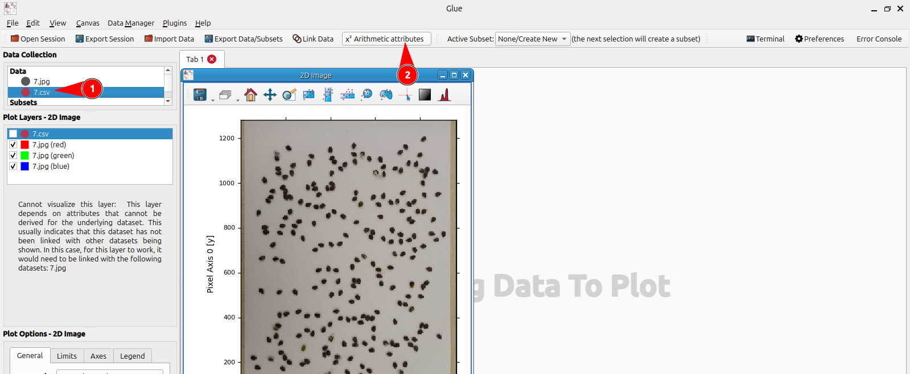
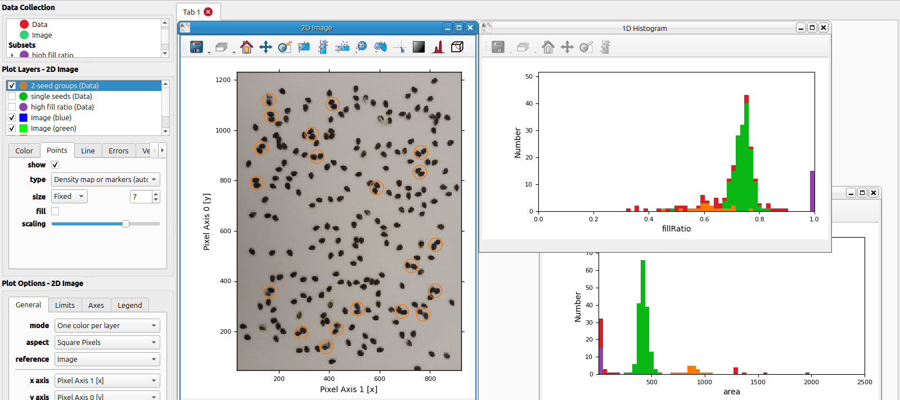

Hello again! I've been out of the picture for several months, due to a very... ummm... _exciting_ period of [energy crisis and rolling blackouts](https://en.wikipedia.org/wiki/2023-2024_Ecuador_electricity_crisis) that we've had over here. We've had between two and three months of (at best) 2 hours and (at worst) 14 hours per day with no electricity. And that _seriously_ messes with your routines, especially when the couple of hours per day that you could dedicate to side projects and writing the associated blog posts happen to coincide with power cuts.

That's been over for a couple of weeks now, and (hopefully?) won't happen again... at least for a while. So blog articles should resume now, at their usual irregular unreliable intervals.

In this post we'll review [Glue](https://glueviz.org/), a tool for interactive data visualization and exploration using linked views:

> Glue is an open-source Python library to explore relationships within and between related datasets

First we'll see what's the deal with linked views, and some cases in which they're useful. Then we'll explore Glue, play around with it a bit, and explore some of its features.

From what I've seen, Glue seems to be most useful on science/research/academia environments, where data analysis is done as part of research projects. However, knowing that it exists may be useful elsewhere too. And the graphs that it makes can be quite pretty too. Which is important.

## The brushing-and-linking paradigm

First, some theory. [Brushing-and-linking](https://people.ischool.berkeley.edu/~hearst/irbook/10/node3.html#SECTION00122000000000000000) is a name that is applied to some graphs, AKA charts, AKA plots. Your standard plots are static: they are mostly images that display some data. For an example, see [Matplotlib](https://matplotlib.org/stable/gallery/lines_bars_and_markers/bar_stacked.html#sphx-glr-gallery-lines-bars-and-markers-bar-stacked-py)'s charts. Then, there's interactive plots, in which you can (say) hover over a data point, and it will pop up a small dialog with some information about said data point. See, for example, [Google Charts](https://developers.google.com/chart/interactive/docs/gallery/scatterchart#example) (hover over any point in the chart and you'll see a popup with that point's data), though many other libraries do the same (typically these kinds of libraries use Javascript, because it lends itself well to interactivity, rather than generating static images such as PNGs where interactivity would be much harder or impossible).

And then, there's linked charts. In these kinds of charts, you don't only have a single plot (say, a scatter plot or a bar chart) with which you can interact. Instead, there's _several_ plots (say, multiple scatter plots, or a scatter plot and a histogram, or a map and a time series). Furthermore (and this is what gives this approach its _brushing-and-linking_ name to begin with), the charts are _linked_; or, to be more precise, the _selections_ that are made on each chart are. In other words, when you select a subset of the data on a certain plot (i.e. you "brush" over it), you immediately see that same selection on the _other_ plots (they're "linked").

Or, in the words of [_Modern Information Retrieval_, Chapter 10, _User Interfaces and Visualization_, by Marti Hearst](https://people.ischool.berkeley.edu/~hearst/irbook/10/node3.html#SECTION00122000000000000000) (for certain values of _modern_, that is: the book is dated 1999):

> Brushing and linking refers to the connecting of two or more views of the same data, such that a change to the representation in one view affects the representation in the other views as well. For example, say a display consists of two parts: a histogram and a list of titles. The histogram shows, for a set of documents, how many documents were published each year. The title list shows the titles for the corresponding documents. Brushing and linking would allow the user to assign a color, say red, to one bar of the histogram, thus causing the titles in the list display that were published during the corresponding year to also be highlighted in red.


[This article](http://adrienneslaughter.com/2016/01/29/brushing-and-linking-to-understand-prediction-performance/) is really good too, full of examples. The first example is even interactive, so you can experience linked charts directly.

The magic of a brushing-and-linking system is that, by synchronizing selections across different views of the data, they can show relations that weren't previously visible. For example, consider a set of monetary transactions, each of which has a latitude+longitude, and an amount. You want to know whether large transactions come from a certain region. A way to do so would be to use [the area of each point](https://developers.google.com/chart/interactive/docs/gallery/geochart#displaying-proportional-markers) as an indicator of the metric (here, the transaction amount):


Another option, if there were too many transactions, would be to use a heatmap/density plot, such as [a hexbin map](https://plotly.com/python/hexbin-mapbox/#display-the-underlying-data), which groups all the data points into a grid (a hexagonal grid) and only displays one metric (e.g. the average amount) per grid cell. here, for example, each hex's color is controlled by the amount of points that fall within it:


Another option would be to display two linked plots, side by side: the map would contain the raw points (i.e. there's no need to use point size to indicate transaction amount)


and, to the side, a histogram of transaction values like this:


In this way, highlighting the largest transactions is easy: just select (usually by dragging) the rightmost bars on the histogram...


... which would automatically highlight the points (on the map) that correspond to those transactions:


Of course, properly linked data also works _in reverse_: it would be possible to select a rectangular section on the map, which would highlight a subset of the histogram. This could, for example, be used to see if a certain region has weirdly-valued transactions:


All of this could be extended to more than two plots, and ideally all of them would be kept in sync with one another.

BI (AKA Business Intelligence, AKA Dashboards For Execs That Don't Look At Them, but DFETDLAT wasn't as catchy of an acronym as BI) tools tend to have something similar, in the form of [linked filters](https://help.tableau.com/current/pro/desktop/en-us/actions_filter.htm) (each tool calls them differently), in which clicking on a plot (e.g. a bar in a bar chart that display the count of items for each category) will activate a filter (e.g. a filter for only that specific category), that is applied to other panels in the same dashboard.  Here's [Superset](https://preset.io/blog/drill-down-and-drill-by/) and [Metabase](https://www.metabase.com/learn/metabase-basics/querying-and-dashboards/questions/drill-through) for examples.

So, to recap: brushing-and-linking is a mechanism to interact with data visualizations such as bar or scatter plots, data tables, or maps. It requires two or more visualizations of the same underlying data. Its distinctive characteristic is that, when a subset of the data is somehow selected on one of the visualizations (say, via drawing a region on a map, clicking on a bar in a histogram, or selecting a slice of time in a timechart), the other visualizations change somehow to reflect the selected data (such as coloring the parts that correspond to the selected data and making everything else gray). It helps to discover relationships between different dimensions of the data that may not be visible otherwise, or require Yet Another Dimension (e.g. using size, radius or color as an additional dimension on a 2D plot, such as a scatter plot or a map). Brushing-and-linking is eminently interactive (i.e. it's expected that _someone_ will play around with the charts to highlight different subsets), rather than being a configuration that is applied when building the chart, as would be the case with using point radius in a scatter plot.

## Glue

Probably most charting frameworks that are capable of interactive charts support some sort of brushing-and-linking. For example, there's [Plotly](https://plotly.github.io/plotly.js-crossfilter.js/) and [Altair](https://altair-viz.github.io/gallery/scatter_linked_brush.html). There's also [Tableau](http://adrienneslaughter.com/2016/01/29/brushing-and-linking-to-understand-prediction-performance) and [Google Looker](https://cloud.google.com/looker/docs/cross-filtering-dashboards), which are entire BI tools. [PowerBI can do something similar](https://www.youtube.com/watch?v=N_xYsCbyHPw&t=52s) too. All you need is some way of being informed when a selection is made in a chart (i.e. [some sort of "selection changed in chart" event](https://plotly.com/javascript/plotlyjs-events/#select-event)), and then a way to programmatically change the data that is displayed in the other charts. If you're lucky, there's even a "linked charts" or "crossfilter" plugin or setting that does that automatically.

And then there's [Glue](https://glueviz.org/), "an open-source Python library to explore relationships within and between related datasets".

Glue was born on the astrophysics community, and it still shows. Its examples are usually written in terms of "Say you want to plot stars from the XYZ star catalog". Rather than latitude and longitude, or abstract X and Y coordinates, they much prefer to plot two-dimensional charts that use [right ascension and declination](https://en.wikipedia.org/wiki/Equatorial_coordinate_system#Declination), which are used to localize celestial objects such as stars and planets. Glue bundles several conversion functions to convert different astronomical coordinate systems. [It provides out-of-the-box support for several astronomy file formats](https://docs.glueviz.org/en/stable/faq.html#what-data-formats-does-glue-understand), for things like lists of stars and radiotelescope images (which are somewhat like [piles of grayscale images](https://en.wikipedia.org/wiki/Hyperspectral_imaging), where the third dimension is used for different frequencies, in an extreme version of a RGB color image being a stack of three grayscale images). Even [Glue's logo](https://docs.glueviz.org/en/stable/index.html) contains a galaxy (see the upper right quadrant, it's a galaxy with a center and two arms, where one of the arms is selected. The other three quadrants of the logo are other representations of the same data, all linked, as you can see by the subsets of each data that are colored red). And, interestingly enough, [it was born via funding from NASA, specifically to support the JWST](https://10qviz.org/glue-how-did-they-meet/) (AKA the James Webb Space Telescope, the one that is currently looking away from the sun and into the depths of space).

Glue's special party trick is the brushing-and-linking paradigm. You're encouraged to plot either several views of the same data, or different-but-related datasets. For example, you may have an image of the galaxy, and a list of points (namely stars), each with a set of coordinates that map into the same coordinate system as the galaxy image, plus a number (let's say, the star's brighness, or dominant wavelength, or the star's mass, or its rotation speed, or whatever else it is that astronomers measure on stars). Glue can plot all of these together, and propagate selections across plots. We'll see examples of that later.

Glue is a Python package and is [installed as such](https://docs.glueviz.org/en/stable/installation/pip.html), via `pip install glueviz[all,qt]` or similar commands. However, unlike your average Python package, it isn't then necessarily `import`ed on Python files. Instead, it registers a binary on the system path, `glue`, which when executed opens a graphical UI.


From there on, the main usage loop of Glue is as follows:

1. Locate, download, borrow, fabricate, acquire, generate, inherit, buy, reduce, reuse, recycle, steal, find, dig out, get revealed, see in a dream or otherwise come into possession of some data that you want imported in Glue, such as images, CSV files or Pandas dataframe files
2. Load said data into Glue, via drag-and-dropping or by using the appropriate menu option (it's the Import Data button on the top toolbar in the screenshot above)
3. Create visualizations with that data, by dragging it to the main (left-hand) panel. For instance:
    * Images will usually be plotted as themselves (as images, that is)
    * But it's also possible to compute stats such as image histograms, or maybe one-dimensional slices of the image. For example, the image below displays two "horizontal slices" taken across the picture. Observe how there's a red line that cuts across the image, about a third of the way down. The brightness of that line, all the way across, is plotted as a line plot. The same thing is done by the blue slice, which is taken further down the image. Observe how the dips in the line chart correspond to points where the slice crosses dark portions of the image:

    * CSV/Pandas files may be displayed as scatter plots, histograms, plain tables, or similar, depending on the data that they contain
4. If necessary, set up links between different datasets. For example, you may have an image (which implicitly has X and Y dimensions), and also a CSV file containing the coordinates of objects in the image. You can set up a link between the X coordinate of the image and whichever column of the CSV contains the X coordinate, AKA the left-to-right position. Same for the height
5. Once links have been established, once a subset of data is selected on a certain chart, it'll be propagated to any other charts that also display that data. For example, if you select a rectangular subset of a scatter plot, that selection will also be shown on other charts that involve the data of the scatter plot
6. Explore the data!

Glue sees itself as a tool to build [hackable user interfaces](https://articles.adsabs.harvard.edu/pdf/2015ASPC..495..101B), in the sense that it doesn't provide a fixed UI, but rather a way for users to compose certain UIs. For example, Glue has _windows inside the window_, each with its own buttons to maximize, minimize and close, a way to move them by click-and-dragging the title bar, and resizing by click-and-dragging the window's corners. All of these are standard interactions for OS-level windows, which Glue replicates inside itself. Thus, a user of Glue can customize it for the best analysis of certain data.

Also, the authors of Glue have been quite concerned with reproducibility (which is nice, since Glue comes from science/research backgrounds, where it's really nice to be able to reproduce other people's work). Code-based tools (say, Jupyter notebooks) can be version-controlled (though that says nothing about the order of execution of notebook cells). GUI tools aren't nearly as reproducible: to obtain the same results as some hypothetical researcher, you'd have to have the same source data as they did, and then _use the application in the same way!_ You'd have to start from an empty "project" or however it's called in the application, then click the same buttons, fill the same dialogs with the same options, and run the same tools. Even if the original author outlined the steps that he took in the paper, it's still probably not every last interaction. If you're lucky, the application provides a way to "export a project", and the paper's author has provided it.

Glue, on the other hand, provides a way to [save the session](https://docs.glueviz.org/en/stable/getting_started/index.html#saving-your-work), which is a `.glu` file (it's actually a JSON file, but not intended for human consumption). If you (or someone else) later load that `.glu` file in a fresh Glue session, then the application state would be restored. That includes the loaded data (e.g. CSV files or images), the open plots or charts, the configuration of each, the positions of the chart windows, the links between data, any custom columns (what Glue calls [Arithmetic Attributes](https://docs.glueviz.org/en/stable/gui_guide/components.html)), and so on. It's even possible to embed the source data (e.g. CSVs or images) _inside_ the `.glu` file (normally only references are kept, in the form of the paths to the files). Using that option would make the `.glu` file all that is needed (in theory) to reconstruct any results (and, incidentally, also make the `.glu` file that much larger, since now it needs to embed source data too).

## Basic usage

I initially wanted to use Glue in the course of [developing an application to count fruit seeds](/posts/seedcounter/), using OpenCV. As a reminder, or in case you haven't read that post, there we took images like this, which contains about 400 fruit seeds on a sheet of ordinary printer paper:


and after a bunch of OpenCV magic, we got this:


If that sounds interesting, feel free to read [the previous article in the blog](/posts/seedcounter/). It contains many more nice pictures and an overview of some useful computer vision techniques.

As part of that, we had to [reject detected regions that were too small, or too wide or tall, or too empty to be actual seeds](/posts/seedcounter/#the-code). For instance, a 1x1 pixel region isn't a seed, since most seeds occupy maybe about 600 pixels. A region that is 20 times as wide as it is tall isn't a seed either, since seeds are mostly square (it could technically be a set of 20 seeds all laid perfectly in a horizontal row, but what are the odds of that?)

Back then, I just plotted some histograms in Octave, and decided cutoff points based on them. For example, the image below shows the count of detected regions (in the Y/vertical axis) that have a certain area, or number of pixels (in the X/horizontal axis). Regions with more pixels (larger rectangles) fall more to the right, and a tall bar indicates that there are many detected regions that have about that number of pixels:


As we can see, there's a very large amount of detected regions with a very small area, which is the spike to the left edge of the histogram. Those are very small, usually 1x1 pixel regions, that were left behind while processing the image. Then there's a large horizontal span with no regions in it (in other words, there were no regions which had for example 200 pixels). There's a large bell-shaped curve at about, let's say, 500/600 to 800/900 pixels, which contains the regions that have a single seed in them. A much smaller area starts at about 1200 pixels and goes up to 1500 or 1600. This contains the regions that had two seeds. Then two tiny bars around X=2000 are three-seed groups, and another one much further right (at about X=3500) is a clump of, perhaps, five seeds (assuming that a single seed occupies 700 pixels, which is reasonable):


Using that chart, I arbitrarily determined a cutoff point of 16 pixels, and anything smaller than that was discarded. That dropped all the tiny regions and left all the seeds, which are larger.

However, that was mostly done by eye. It'd be nice to be able to interactively explore that data, such that we could, for example, select only the large peak at the left of the histogram (the one that contains all the tiny regions), and visually confirm (over the source image) that it came from, let's say, noise pixels at the edges of the image. Or to select the region (between 600 to 800 pixels or so) and confirm that it only contains one-seed groups.

Well, as it turns out, with Glue we can!

### Source data

I had to lightly modify the JS code that I used in the previous article, the one that does the entire OpenCV magic and detects the seeds. Almost at the end, we have an array of objects, each of which looks like this:

```js
{
  i: 1,
  corner: {x0: 120, y0: 234},
  center: {
    x: 140,
    y: 245
  },
  size: {w: 40, h: 22},
  area: 590,
  fillRatio: 0.67
}
```

* `i` is an index, starting at 1. It's not used anywhere that I remember
* `corner` contains the coordinates of the top-left corner of the rectangle that encloses that region
* `center` contains the coordinates of the center of the rectangle
* `size` contains the width and height of the rectangle. Note that `corner`, `center` and `size` are technically redundant, as you could calculate any one of them from the other two (for example, the center could be computed, since it is the top left corner _plus_ half the width and half the height), but it's useful to have them all
* `area` is _not_ the width multiplied by the height, but instead the amount of white pixels inside the rectangle, counted on a binarized version of the source image. Long story short, it counts how many pixels inside the rectangle actually belong to the seed, and not to the background (even if the rectangle perfectly encloses the seed, with no padding, there'll be some background peeking out at the corners since the seeds are round-ish)
* `fillRatio` is the ratio between the `area` (the area of the real seed, in pixels) and the rectangle's area (its width times its height). It's useful to detect things that aren't seeds, since those are mostly circular and should have a mostly constant fill ratio

Now, that array of objects can also be cleanly represented as a CSV document, like this one:

```csv
i,corner_x0,corner_y0,center_x,center_y,size_w,size_h,area,fillRatio
1,120,234,140,245,40,22,590,0.67
2,...
```

|i|corner_x0|corner_y0|center_x|center_y|size_w|size_h|area|fillRatio
|---|---|---|---|---|---|---|---|---|
|1|120|234|140|245|40|22|590|0.67|
|2|...||||||||
|...|||||||||


Here, every object in the array (which corresponds to a region that has been detected to contain, perhaps one seed, or perhaps several that are close together) is mapped into a line in the CSV document. Each one contains the same information as the object, suitably flattened for inclusion in a 2D data structure (for example, the `{size: {w: 40, h: 22}}` subobject becomes _two_ columns, `size_w` and `size_h`, thereby losing their nestedness).

I had to do that because Glue doesn't seem to be able to read JSON documents as data sources. Which makes sense, sort of: when reading an array of JSON documents, there's no guarantee that they'll all have the same fields, and thus represent a uniform dataset. In theory, each object in the array could have its own fields. Compare that to a CSV file, or a well-formatted Excel sheet, or a Pandas dataframe that has been serialized to a file, or a table in a relational database. Glue can read datasets from CSV files, though, so that's nice.

I also imported the original image (the one that the detection code was run on). Glue can natively read common image formats (namely, JPEG).

Aside: An ordinary color image, such as one taken from a digital camera, would become a 3-dimensional dataset: the rows and columns of the image are two dimensions, and the third one is the color. Seen on the color dimension, ordinary photos have three "layers" of data: red, green and blue. However, there are plenty of images that are used on several fields (e.g. agriculture and astronomy) that have more, or different, colors. For example, several years ago I used to work with a [Micasense RedEdge M](https://ageagle.com/drone-sensors/rededge-p-high-res-multispectral-camera/) camera, that captures five bands: red, green and blue; plus two different bands of infrared (842 nm near-infrared and 717 nm red edge). Satellite images sometimes have more: for instance, [the Landsat satellites](https://www.usgs.gov/faqs/what-are-band-designations-landsat-satellites) took images in up to 11 different bands, and [the Landsat Next satellites, scheduled for 2030, are supposed to capture 26 bands at once](https://www.usgs.gov/media/images/spectral-bandpasses-all-landsat-sensors). Since Glue was born on astronomy, where multispectral images are common, it doesn't expect that images are three-band RGB, instead letting the user choose either one band (for grayscale images) or three, _any_ three from the source image, that are assigned to the red, green and blue channel for display purposes. In other words, it already supports [false color images](https://en.wikipedia.org/wiki/False_color), where the user has control over both the source bands and the color mapping/palette.

End of aside.

That being said, for this post images are normal color images with red, green and blue channels, so we'll treat them as such.

### Viewing images

The first visualization that we'll build is an overlay of the detected boxes that contain seeds, over the source image. We know that detection works (that's the whole point of the previous post), so it's just a sanity check and to learn Glue.

On a new Glue session, we can use the **Import Data** button at the top to add new data:


We then select the JPEG picture that we'll use, and the CSV file that contains information about the regions that have been detected as containing seeds in that picture. Those two files are added in the **Data** section on the **Data Collection** pane at the top left. It's possible to double-click a data item, which pops up a window that can be used to give the data a name, and change its color:


Now, those two data files are available and can be added to visualizations. As indicated by Glue on the large right panel, you can drag a dataset to the blank window to add a visualization:


Releasing the dragged dataset on the right panel pops up a dialog for you to choose what kind of visualization you want (what Glue calls Data Viewers). If you dragged something that looks like an image, it'll autosuggest a "2D Image":


But there are many more data viewer types (for some reason, on my installation it autosuggests each type twice...). More data viewers can be developed by other people, or by you personally, and then made available to Glue. More on that in [a later section](#extensibility-custom-viewers). After confirming, a new window is added to the right-hand panel, displaying the selected image. Note that Glue reimplements the idea of "desktops" with "windows" _inside_ of itself, with each window having its own Maximize, Minimize and Close buttons. Windows can be resized and moved, as if they were native windows. However, they aren't: they're virtual windows inside _a tab_ (notice the Tab 1 near the top of the image above, with a red X button), which is in turn inside the actual Glue window. I resized the window so it better fits the image's aspect ratio, which is 1280x960 pixels, AKA 4:3 (yes, not 16:9, and it's also vertical)


Something that becomes a problem later is the coordinate system. Computer graphics and image processing tend to favor using the top left of the image as the (0, 0) or origin point, with X increasing towards the right and Y increasing downwards, much like the direction of written text in Western languages that use the Latin script such as English. However, the mathematical convention of cartesian planes, which then bleeds into computing via scientific charts and libraries like Matplotlib, is to have either (0, 0) in the center with X increasing rightwards and Y increasing upwards; or if everything is positive, as is the case for image coordinates, to have (0, 0) in the _bottom_ left corner and Y increasing _upwards_. Glue favors the mathematics convention, as you can see in the image above, where the (0, 0) coordinates are on the bottom left. Glue has already taken care of displaying the image in the correct direction, i.e. it's not flipped around, but the coordinates that are stored in our CSV file (e.g. the center and corner coordinates of the bounding boxes) _are_ stored in computer graphics convention, with Y increasing downwards.

Not only that, but for some reason Glue assigns axis 0 (the first one, in standard computing fashion that counts things from 0 as opposed to from 1) to the Y axis, _not_ to the X axis. There's probably a long-standing tradition somewhere that explains that. It's not an issue, we just have to be careful with that. We have to remember that axis 0 is the one that goes up to 1280 (so Y, vertical, the long side of the image), while axis 1 (X, horizontal, short side) goes up to 960 only.

While it isn't too obvious in the screenshot above, the image is currently displayed on grayscale. It isn't too different from the source image, which mostly consists of white paper and black seeds, but it's there. We can also see that because:

1. There's a single entry in the **Plot Layers** panel to the left, and it states that the single layer in that plot (the 2D image viewer) reads from the red channel in the `7.jpg` file
2. On the configuration for that layer, which appears below the list of plot layers, we can see that its attribute is indeed the `red` channel. Furthermore, we can see (on the **color/opacity** field) that it's set to the grayscale colormap. There are more (see below)
3. On the **Plot Options - 2D Image** panel at the bottom, we can see that its **mode** is set to Colormaps, which indicates that it'll use a single layer as its source of data, and it'll convert it to false-color


### Aside: colormaps

The Colormaps mode is intended to be used when you have only one layer or channel of data, and you want to display it as an image, usually in false-color (say, red for low values, and then smoothly transition to green for large values). Glue includes several common colormaps for that purpose. [Colormaps, AKA palettes](https://matplotlib.org/stable/users/explain/colors/colormaps.html), are a specification of how numbers (typically 0 to 255, since that's the range of a pixel in a single-channel 8-bit image) maps to an actual color.


For instance, Viridis is the standard colormap in Matplotlib; it goes from purple for 0 to yellow for 255, via purple-blue-green-yellow. It's officially called Viridis [because of _Dendroaspis viridis_, a snake](https://youtu.be/xAoljeRJ3lU?si=tq5oF6oQpN8mlBbx&t=1044) (AKA [western green mamba](https://en.wikipedia.org/wiki/Western_green_mamba), which has a similar color), because Python and snakes, and it was built for Matplotlib, so snakes it is. However, we're also officially allowed to pretend it got its name from [_Chromis viridis_, AKA green chromis, a species of fish](https://en.wikipedia.org/wiki/Chromis_viridis), or [_Tersina viridis_, AKA swallow tanager, a species of bird](https://en.wikipedia.org/wiki/Swallow_tanager). That one is especially fun because, technically, no bird _has_ the entire color of the palette. Instead, males are blue and females are green, and so you have two points in the color series:


Viridis is supposed to be a nice colormap for several reasons. One, it's open source, as opposed to Matlab's Parula colormap, on which there's some talk of it being copyrighted (what "being copyrighted" means for a colormap isn't that clear. Can you not print the colorbar to the side of your plots that use the colormap? Are all plots that you make that use it automatically property of MathWorks? Is it that only Matlab is allowed to use that colormap, and other tools such as Matplotlib, Plotly or BI tools can't? Something else entirely?). Two, Viridis is [_perceptually uniform_](https://colorcet.com/), which means (roughly) that the chosen colors don't introduce false artifacts in the data (such as some color transitions looking like important transitions when they aren't) nor lose important features (such as very different numbers being mapped to quite similar colors). Three, it's [mostly nice for color-blind users](https://cran.r-project.org/web/packages/viridis/vignettes/intro-to-viridis.html), i.e. if you drop either the green or red channels, as happens to people with green-blindness or red-blindness, they are still distinguishable:

> The “viridis” and “magma” scales do better - they cover a wide perceptual range in brightness in brightness and blue-yellow, and do not rely as much on red-green contrast. They do less well under tritanopia (blue-blindness), but this is an extrememly rare form of colorblindness.
>
> https://cran.r-project.org/web/packages/viridis/vignettes/intro-to-viridis.html

That being said, we won't use colormaps, at least for the image. We have three perfectly good real-color channels, and it'd be a shame not to use them.

### Color images in Glue

To view a color image in Glue, you have to:

1. Create a 2D image viewer as discussed above
2. Change the image's **mode**, on the 2D Image Plot Options, to **One color per layer**:
    
3. Drag the same source image _twice more_ to the viewer. Each time, one new Layer will be added to the **Plot layers** list:
    
4. Run over each one of the three layers, and reconfigure it so:
	1. The **attribute** is changed accordingly (one to Red, one to Green, one to Blue)
	2. The **limits** are set to 0 to 255 (by default Glue uses the min and max values that actually occur in the image as the limits, which may compress the color scale)
	3. The **color** is set to either pure red, pure green or pure blue, respectively. At least in Ubuntu, that uses Gnome's native color picker, in which you want to go to the Custom Colors option and manually input a HTML color (`#f00`, `#0f0` and `#00f`, respectively), since the default color palette, while visually nice, doesn't contain the pure colors that are required for raw color mixing
	4. The slider to the right of the **color** is all the way to the right. That's ostensibly the opacity of that layer, and you usually want all layers to be completely opaque, at least if you're viewing real-world images taken with a camera. At least where I'm from, the world doesn't contain an alpha channel to remove the background
	5. The **contrast/bias** sliders are in their center/neutral positions, which can be done by pressing the Reset button
5. A screenshot of how things should look when you're done:
    

Once that's all done, we have a proper color image. Here it isn't all that important, since the image is mostly monochrome itself, but if you were viewing other images with more color it'd be more important.

### Overlays on images

Now for the fun part: we want to overlay data from the CSV file _on top of_ the image. That's doable with Matplotlib, or with OpenCV itself (in fact, [the web application that detects seeds](https://seedcount.jreyesr.com/) does so), but we can do it with Glue itself, and the resulting chart will be interactive. We'll see that soon.

To overlay another dataset on top of an image, we drag it again from the Data Collection panel on the top, over the 2D Image viewer. That adds the CSV file as another layer in addition to the three that provide the image's color.


And... it doesn't work. The data is indeed added as a layer, but it isn't selected, and it _can't_ be selected at all. An error message states that "This layer depends on attributes that can't be derived for the underlying dataset. This usually indicates that this dataset hasn't been linked with other datasets being shown". That indicates the issue: we have two disparate datasets (an image, which implicitly has X and Y coordinates; and a CSV file, which has explicit X and Y coordinates for each rectangle that it talks about). However, Glue hasn't been told about that relationship, i.e. that X and Y coordinates of the image are in the same units and space as the X and Y coordinates for the center and corner of regions in the CSV file. Thus, it doesn't allow us to plot both on the same axes.

So, we first have to link the two datasets. This is a core operation of Glue (indeed, it's the operation that gives Glue its name, since you're "gluing together" data by stitching related attributes)

### Linking datasets

The linking operation has its own dedicated button, "Link Data", at the top of Glue's main toolbar:


When clicking on it, a dialog pops up, that shows all the datasets (here, only two: the image, with its XY coordinates and color at each coordinate; and the CSV file that contains _some_ XY coordinates and some information on each of those) and provides a way to establish _links_ between two of them. Links are supposed to be established when two datasets have data (e.g. a column on each one) that is on the same units and talks about the same kind of _thing_. Typical columns to link on are geographical coordinates, either terrestrial (i.e. latitude+longitude) or celestial (e.g. declination+right ascension, AKA latitude and longitude in the sky, or something).

The Glue documentation is quite explicit that [linking isn't the same as a SQL `JOIN`](https://docs.glueviz.org/en/stable/gui_guide/link_tutorial.html). I can't grasp the difference fully yet, as in my mind linking could be used in the same manner as `a JOIN b ON a.col_1=b.col_2`. In this case, thankfully, the links are quite natural: we want to join the centers of regions to the image's coordinates.

This is where Glue's convention for axes and directions becomes slightly annoying. On the CSV file, which was generated using data from OpenCV, Y starts at the top and increases downwards (therefore, a record with a small Y value is towards the top of the image), whereas on the image, Y starts at the bottom and increases upwards (therefore, if you try to plot a point with a small Y value, it'll appear near the bottom of the image). To fix that, we have to create a new _attribute_ on the CSV dataset, one that inverts the Y axis. This is done by creating a new Arithmetic Attribute, which has its own button on the top toolbar:



With the CSV dataset selected on the top (Data Collection) panel, we click the **Arithmetic attributes** button on the top toolbar. This opens a (currently empty) list of custom attributes for that dataset.

Arithmetic attributes are somewhat similar to Excel columns with a formula, such as having column C, Total Price, being `=A1*B1`, AKA column A, Unit Price, multiplied by Column B, Number of Units. They're also similar to [`GENERATED` columns in PostgreSQL](https://www.postgresql.org/docs/current/ddl-generated-columns.html), on which Postgres docs say: "A generated column is a special column that is always computed from other columns. Thus, it is for columns what a view is for tables." They're "just" a formula, that indicates how to compute that new attribute from other attributes. They can be used afterwards _as if_ those new attributes already existed in the source data. For example, our `width`, `height` and `fillRatio` attributes in the CSV file could technically be computed as Arithmetic attributes, since they're derivable from other attributes.

To add an arithmetic attribute, you click the appropriate button and provide a name and formula for the attribute. Formulas use a very small dedicated language, that supports arithmetic expressions such as addition and substraction. Furthermore, Numpy is available as `np`, which enables a ton of fun expressions. Other attributes are referenced between curly brackets, and the editor bolds any references to attributes and colors them blue, for visual feedback.


We create two new attributes, `x_viz` and `y_viz`, which will be used for visualization. `x_viz` is the inversion of the CSV's X axis, AKA 960 minus the original X axis. For Y, it's 1280 minus the Y axis. This has the geometric effect of reflecting both the X and Y coordinates, so they match the graph.

Now that we have coordinates in the same convention, we can link the datasets by clicking the Link Data button. This opens a dialog where links between datasets can be specified, by choosing which column should be considered in each of the datasets:


We link the image's "Pixel Axis 0", which is Y as discussed above, to the `y_viz` column. We do the same for "Pixel Axis 1", X, to the computed (reflected/inverted) X column in the CSV. For each one, we click the desired attribute on the first dataset (1), then we click the corresponding attribute on the second dataset (2), and finally we click the **Glue attributes** button (3), which adds the new link to the list of links to the right.

Default links are _identity_ links, which are simple equality links (i.e. "this column in Dataset A represents the same quantity/metric in the same units as that column in Dataset B"). There are more complicated links, mainly astronomy coordinate conversions, but we don't need them here. It's also possible to [write new linking functions](https://docs.glueviz.org/en/stable/customizing_guide/customization.html#custom-link-functions), thereby extending Glue.

Then, we save the links, return to Glue's main window, and try to add the CSV into the 2D Image viewer (as a new layer) again. This time it succeeds, since the two datasets can be plotted in the same graph now: the image is plotted against its X and Y coordinates, and there's now an equality link across those coordinates and the CSV file. Therefore, Glue can now display both datasets in the same coordinates:


By default, Glue displays the new dataset as points on top of the image. We can control some aspects of the points, such as the point's color and opacity, size (can be fixed or vary according to some column of the dataset), and other more niche settings such as displaying "vectors" (in the Physics sense, i.e. arrows) over each point. This may be useful to plot fields of moving particles, e.g. for some sort of image tracking visualization, or for star charts where the velocity of each star is known:


It's also possible to plot "error bars" in both X and Y. This is more useful in this case, since error bars (which spread out from the point to indicate an amount of uncertainty in that position) can be used to display the size of the "bounding box", by setting the error to computed properties which are half the width and half the height, respectively:


## Displaying linked plots

So far, we've displayed two different datasets, after linking, in a single chart. We can also display linked data in different charts.

To do so, we create a new visualization by once again dragging a dataset (the CSV dataset) to the canvas in the right side:


When we drop it, it asks for a visualization type. We choose a 1D Histogram:


And then we update its settings so it displays the `fillRatio` in the X axis, spanning from 0 to 1 (by default it autosets those limits to the minimum and maximum of the data), with 63 bins (for no particular reason other than it seems appropriately mysterious. 2^N-1 looks like could be some sort of optimal bound for the number of buckets in a histogram)


Now we can see the distribution for the fill ratios of each detected region, which is a point+cross in the left image. As a reminder, the "fill ratio" is computed as the number of pixels inside that box that were detected as belonging to a seed, divided by the total area of the box (its width multiplied by its height).

We can see that most regions have a fill ratio that is around 0.75 or so, going from about 0.6 to about 0.8. There are a few stragglers that have fill ratios below that, down to 0.33. There's also a reasonable quantity of regions that have a very large (as far as the histogram is concerned, very close to 1) fill ratio. That's the medium-height bar all the way to the right of the histogram.

Let's add another histogram, this time for the area:


In the bottom histogram, we can see the tiny clusters that are noise (those that are grouped towards the left, near X=0), the 1-seed regions (which compose the large peak at slightly below X=500), 2-seed regions (the small peak at about X=800), and so on.

Let's say that we suspect that the regions that have precisely 1.0 fill ratios are tiny 1-pixel regions that aren't seeds. To verify that, we can activate the Range tool in the top histogram, and then drag to select only the rightmost red bar:


This automatically creates a "Subset", with a random color (purple here). This subset (as its name implies, it's a portion of the entire data, here selected by having the fill ratio over 0.95 or so) is automatically added to other visualizations that support it, which in this case is the other histogram and the image. Here's a still image of the result:


You can see that, on the lower histogram, the purple entities (that is, the regions that have a fill ratio close to 1) are indeed all on the first bar, that of area close to 0. This confirms our suspicion that those regions with a very high fill ratio are very small regions that contain no seeds and can therefore be excluded from processing.

In the image, they're displayed as purple points that are all near the left edge of the image, plus a single purple point near the middle. I happen to know that the edges of the image (that aren't covered by the white sheet of paper) were places where a lot of tiny white regions appeared. That matches nicely with what we see in the plot: tiny white regions have fill ratios close to 1, so they can be discarded without losing any actual seeds.

We can create another Subset on the bottom histogram. Let's say that we want to focus on the single-seed clusters. We've assumed that those are, in the bottom histogram, in the large peak with 200<=X<=600. We can check that by creating a new Subset, but this time on the lower histogram, and selecting only that peak:


This adds another Subset, which we can rename (so we can see later that the subset is for "regions that have a single seed"), recolor and configure on the image. I configured the subset so it was displayed, on the image, as circles with 11 pixel size, but not filled (so only the outlines are drawn, which clutters the image less)


We create a green Subset that comprises the regions that have areas between about 200 and 600, and that same green Subset is propagated to the top histogram (where we can see that those single-seed clusters have fill ratios in the vicinity of 0.7 to 0.8, with a few outliers). The subset is also propagated into the image, where we can visually confirm that each circle is correctly placed over a single isolated seed.

We can do the same for two-seed groups (in orange). Again, all that we're doing is to drag a section in the lower histogram. Glue automatically computes the corresponding selections in the other histogram and on the image:



and for three-seed groups (in blue):


Or we could choose to see the regions that were too small to be even a single seed, by selecting the leftmost area of the bottom histogram, here in yellow:


Or, finally, we could select a part of the image:


and the selection will be reflected on the histograms:


which allows us to see, for example, that the seeds in that area are "normal", at least when considering their fill ratios: the orange sub-histogram for the fill ratio just looks like a smaller version of the complete histogram in red, which indicates that the distribution of fill ratios for the entire image and the distribution for the orange region is quite similar. Of course, if it happened that the orange area were atypical, that would appear quite clearly in the histogram.

## Extensibility: Custom viewers

So far we've used Glue's custom visualizations, such as the image viewer and histograms. However, you may want to have more specialized visualizations for other purposes.

For example, [the Glue docs](https://docs.glueviz.org/en/stable/customizing_guide/custom_viewer.html) demonstrate the creation of a basketball shots chart that displays the grouping of shots taken, complete with a small sketch of the area near the basket. This allows for some nice insights, such as seeing the clumps of shots taken _just outside_ of the 3-point semicircle:


Custom Matplotlib-based visualizations are easier to build, since less code is required, and the required code mostly uses the Matplotlib API, and therefore we can use Matplotlib tutorials and other resources to build the chart. There's also [raw Qt-based viewers](https://docs.glueviz.org/en/stable/customizing_guide/qt_viewer.html), which use [the Qt framework](https://wiki.qt.io/About_Qt), a general-purpose multiplatform (i.e. Windows, Linux, macOS, Android, iOS, other OSs, [as a bootable application on embedded Linux](https://doc.qt.io/Boot2Qt/), [for microcontrollers](https://doc.qt.io/QtForMCUs-2.9/), and [for Android Auto](https://doc.qt.io/QtAndroidAutomotive-6.8/), among others). This means that more custom visualizations can be written, without using Matplotlib, which is limited to stats-ish charts (for example, the image above is technically just a hexbin chart, plus some static lines, but more complex visualizations such as interactive maps may not be possible, whereas [Qt already has a MapView component](https://doc.qt.io/qt-6/qtlocation-mapviewer-example.html)).

Here I planned to build a specialized histogram that can also plot evenly-spaced "breakpoints", in a form like the sketch below (see the orange lines):


This would be useful to interactively determine appropriate ranges to treat as "containing a single seed" vs. "containing two seeds" and so on. Or, in general, it would be useful whenever measurements are made that may contain multiples of a certain "base" value, but the exact base value isn't known and/or the measurement includes noise.

Alas, I wasn't able to easily write a custom viewer. I got tangled in details that felt like they should be easy, such as being unable to automatically zoom out the histogram's X axis to fit the actual range of the data (it seemed to default to approximately 0 to 250, or maybe that's the range of the default data), and I couldn't get [the Matplotlib+Qt example to work](https://docs.glueviz.org/en/stable/customizing_guide/matplotlib_qt_viewer.html) because `__file__` wasn't defined, I couldn't see an easy way to get the axes object on [the `update_settings` callback](https://glue-core.readthedocs.io/en/latest/api/glue.custom_viewer.html#glue.custom_viewer), which is called when the visualization's settings are changed (this is where I'd be able to change the histogram's X range), that sort of thing.

Since this post is already fairly long and I really want to get it out, as it's been long enough already, I'll ignore this for the time being. Maybe I'll revisit this in the future and actually write a custom viewer, they seem very interesting.

## Extensibility: Custom loaders

Another extension point for Glue are [loaders](https://docs.glueviz.org/en/stable/customizing_guide/customization.html#custom-data-loaders), pieces of code that can read a file and return an object that Glue can work with. For example, there are loaders for PNG images, loaders for Pandas files, loaders for specialized astronomical images, a loader for CSV files, and so on.

However, as we've discovered previously, there isn't a loader for JSON files. Attempting to load a JSON file results in an error:

```
Could not load X.json (wrong load method?)
File load method: Auto
```

Presumably, this is because a JSON file may contain unstructured data that doesn't neatly fit Glue's data model. However, some JSON files may:

```json
[
	{"id": 1, "name": "Widget", "size": 3, "weight": 5},
	{"id": 2, "name": "Another Widget", "size": 5, "weight": 2},
	{"id": 3, "name": "Widget Pro Plus Ultra-Lite", "size": 3, "weight": 4.98}
]
```

That JSON array contains objects that all have the same keys, and therefore may be thought of as a table. Such files could be reasonably loaded into Glue as tables, in much the same way as CSV files.

The fastest way to add a custom loader to Glue (there are more elaborate ways, such as creating dedicated Python packages that can even be published on PyPI so other people can `pip install` them) is to create a file called `setup.py`, save it somewhere and launch the `glue` binary from that directory. Glue will automatically discover the setup file and load its contents. This is Glue's strategy for [customizing the launch](https://docs.glueviz.org/en/stable/customizing_guide/configuration.html).

```py
import json
from glue.config import data_factory
from glue.core import Data

def is_json(filename, **kwargs):
    if not filename.endswith(".json"):
        return False
    try:
        with open(filename) as f:
            data = json.load(f)
        return type(data) == list # we only understand arrays of objects
    except:
        return False

@data_factory('JSON file', is_json)
def read_json(filename):
    with open(filename) as f:
        data = json.load(f)
    keys = data[0].keys()
    columns = {k: [row[k] for row in data] for k in keys if type(data[0][k]) in (str, int, float, bool, type(None))}

    return Data(**columns)
```

A custom loader requires two functions: an "identifier function", which receives a filename and returns whether or not the file with that filename can be handled by the associated loader; and then the actual loading function that should read the file and returns the data inside. The identifier function is used by Glue because, when you pick a file to load, by default you don't have to choose _how_ the file will be interpreted; instead, Glue tries loaders in sequence until one actually handles the file.

Therefore, it may be nice to have identifier functions be lightweight, such as initially checking just the filename's extension (which is a simple string comparison), at least as an initial quick check, rather than trying to load potentially very large files. I couldn't find official guidance on the matter, just the fact that the example loader (for JPEG files) doesn't try to perform complicated JPEG decoding or reading of EXIF headers or anything, it just checks that the filename ends with `.jpg`. In this JSON loader we start the `is_json` identifier function with an extension check, and then (only if the file's name does end with the appropriate JSON extension) we blindly try to parse it. Any exceptions mean that our loader isn't interested in parsing the file, which is signaled to Glue by returning `False` from the identifier function. Only if Python could successfully parse the JSON file will the identifier function return `True`.

And then, the actual loading function `read_json` will be called. Once again, it'll receive the filename as an input. The function reads the JSON file from disk, parses it (here we don't bother with handling exceptions because we assume that Glue will have called the `is_json` function just before, which just ran and didn't find any exceptions, so there shouldn't be any), and then converts it into Glue's format. This is done by reading the keys of the first item in the array, and then converting the array-of-objects format into a dictionary-of-keys. Our example above would be transformed into this:

```python
columns = {
	"id": [1, 2, 3],
	"name": ["Widget", "Another Widget", "Widget Pro Plus Ultra-Lite"],
	"size": [3, 5, 3],
	"weight": [5, 2, 4.98]
}
```

This is necessary because Glue internally stores, transports and processes data as [`Data` objects](https://glue-core.readthedocs.io/en/latest/api/glue.core.data.Data.html#glue.core.data.Data), which are containers of one-dimensional `Component` objects. Here, the `Data` object maps to the entire JSON file, and each `Component` is a "column" of the table, or a key of each object. All `Component`s have the same number of elements, or "rows" (Glue imposes a rectangular shape on the data).

Once the Python file above has been saved as `setup.py`, we can launch Glue from that directory, and then import a new dataset. When we choose and open a JSON file, it'll load as expected, rather than throwing an error as it did before.

For example, we may have a file that looks like this:


We can then plot the data as normal, such as using the Table Viewer:


or a Histogram:


or anything else, really. The point is that the JSON file has been read and converted into tabular data that can be used by Glue.

Of course, the JSON loader is very primitive. In particular, it lacks the ability to automatically detect and flatten nested documents. In the example above, a lot of data is lost because it's nested one level deeper, rather than being top-level fields. Observe, for example, that the center's coordinates are `"center": {"x": ..., "y": ...}`, instead of `"center.x": ..., "center.y": ...` or something to that effect, and therefore the entire `center` field, and its two sub-fields, is discarded while loading. A more complete implementation of the JSON loader would ideally detect those nested documents and flatten them out, recursively, so no data is lost. Another nice enhancement would be to use more than just the first record to infer the columns: as it is the loader just reads the keys from the first element in the array and then assumes that no more keys will appear in later documents. Ideally we'd scan more records, perhaps the first N records, or a random sample of them, or maybe even *all* of the records, and keep a list of keys that are seen.

However, this example is enough to get the point across: It's possible to register "loader" functions in Glue that add the ability to read other file formats. As long as data can be modeled as a group of equally-sized "components", then it should be loadable into Glue. For example, while Glue originally came from the astrophysics community, there's [the `glue-medical` package](https://github.com/glue-viz/glue-medical), which adds support for [DICOM files](https://en.wikipedia.org/wiki/DICOM), which are more-or-less the standard for storage of medical images. For example, if you get a MRI or a tomography done, you may get the results in DICOM format. The ones that I've seen come in a CD that contains both the actual files and also a click-to-run executable that can read and display them. But it's always possible to ignore the bundled viewer and load the images in another viewer, such as when the machine that wrote the CD only included an EXE viewer but you're running Linux or macOS. Once the `glue-medical` package is installed, Glue also becomes another viewer.

It's also possible to write [a custom "importer"](https://docs.glueviz.org/en/stable/customizing_guide/customization.html#custom-importers), which in Glue parlance is distinct from a "data loader". Importers can display custom UIs for the user to control what data will be imported, as opposed to data loaders where the UI is always fixed (namely, the OS's native Open File dialog). Importers can, for example, be used to browse some sort of online data repository, to choose a file that will be downloaded. Or to preview data before import, such as to check data sizes, headers, or such. Or to generate some form of sample data, fixed test patterns, dummy data, or similar stuff that can be generated from just a few knobs.

## Extensibility: Custom fitting functions

As a final example of Glue's extension points (there are more!), we'll look at [fitting plugins](https://docs.glueviz.org/en/stable/customizing_guide/fitting.html). "Fitting" here is used in the sense of "least squares line fitting" or other, i.e. trying to come up with a set of "parameters" (say, a slope+intercept for a line, or the three parameters of a quadratic function, or the frequency+phase of a periodic sine/cosine) that best approximate a set of data, for a certain value of "best".

Glue has [support for "profile views"](https://docs.glueviz.org/en/stable/gui_guide/spectrum.html#profile-fitting), which collapse all but one of the dimensions of their source data. For example, observe the following image. Note the thin purple line that goes from left to right of the image, about two thirds of the way down:


If we plot that purple slice's X coordinate vs. the intensity of the pixels in that coordinate, we get a plot like this:


Notice the four distinct dips in the purple curve. They correspond to places where a seed crosses the purple region in the image. For example, the first dip, going from left to right, is at X=400, which you can check in the image is barely grazing a seed. There's another dip at maybe X=500, which is a seed that gets crossed at its middle by the purple slice. And there's other two dips further right.

Glue can, by default, fit two families of functions to that data: either a polynomial function (cubic or above, linear or quadratic don't work, even though they're also technically polynomials) or a gaussian function. Fitting requires choosing a section of the data where fitting will be performed. For example, here's a cubic function fitted to a section of the data that happens to be mostly a straight line (notice the two thick vertical blue lines that denote the start and end of the range that is taken into account for the fitting):


Glue prints the coefficients of the fitted data (while it's not explicit, I assume that the first coefficient is that of X³, the second one is that of X², the third is that of X and the fourth is the constant in the function `f(x) = A*x^3 + B*X^2 + C*X + D`). The actual fitted function is also overlaid on the profile, as a thinner line of the same color as the actual profile, which in turn takes its color from the Subset used.

However, a polynomial fit isn't that interesting for a profile of the shape of the one that we're studying above. We're probably more interested in something like a "peak detector" (or, in this case, more like a "dip detector"), i.e. something that detects when the signal dips below what would be normal and emits _something_ at those points:


Adding a custom fitter to Glue [requires creating a class and registering it with the `@fit_plugin` decorator](https://docs.glueviz.org/en/stable/customizing_guide/fitting.html#). The class should at least declare two functions, `fit()` and `predict()`, plus a property `label`. The label is used in the dropdown in Glue's UI. The `fit()` function is called when the user clicks the Fit button, and it receives two arrays (for the X and Y coordinates in the points within the user-selected region between the two vertical blue lines), plus any constraints that may be set on the model (such as specifying that the slope of a line should not be larger than 10, or setting an initial value to guide the search for the optimal parameters). The `fit()` function may return anything, as far as I can see (a simple number, a list of values, a complex object, a dictionary, whatever). Glue will just keep that returned value, which should contain whichever _parameters_ represent the fitted model (such as coefficients when fitting functions).

Then, the `predict()` function will be called and will receive that same mystery object, and also an array of X coordinates. The function should evaluate the function, using the parameters, and return an array of Y coordinates. Fitter classes can override some other functions, such [as `summarize()`](https://glue-core.readthedocs.io/en/latest/api/glue.core.fitters.BaseFitter1D.html#glue.core.fitters.BaseFitter1D.summarize), which returns a text description of the fitted model (this is displayed in the text area to the right of the profile viewer); [or `plot()`](https://glue-core.readthedocs.io/en/latest/api/glue.core.fitters.BaseFitter1D.html#glue.core.fitters.BaseFitter1D.plot), which controls how the fitted model is drawn over the source data (Glue's built-in fitters simply [draw a thin line](https://github.com/glue-viz/glue/blob/0c8f5e88c66c513b2132a123b11fc6bbc72b7f1d/glue/core/fitters.py#L54-L56) representing the model evaluated at many points).

SciPy, which is already used by Glue so shouldn't cause another dependency, [contains a `find_peaks` function](https://docs.scipy.org/doc/scipy/reference/generated/scipy.signal.find_peaks.html) that can be used to... well, find peaks in the data. We could (ab)use it to find dips by previously multiplying the data by -1, which would flip it vertically so the dips became peaks.

The `find_peaks` function has several tunable knobs, namely "distance", "threshold", "width" and "prominence". These all control which peaks will be considered and which will be discarded.

Glue provides a way for fitter plugins to declare user-configurable parameters (for example, the polynomial fitter's degree is user-controlled and defaults to 3). Here, we'd need a parameter to control whether the fitter would try to find peaks (local maxima) or dips (local minima), which would be a simple checkbox. Additionally, we'd want a way to control the ranges for the different parameters, particularly the "Prominence". Its definition is slightly complex and [inherited from mountaineering](https://en.wikipedia.org/wiki/Topographic_prominence) (like, actual mountain-climbing), but it roughly matches the intuition of "tall peak, separated from others". These parameters are passed [to the `find_peaks` function](https://docs.scipy.org/doc/scipy/reference/generated/scipy.signal.find_peaks.html), and appear in Glue as part of the fitter's Settings:


This code implements a fitter plugin that detects peaks (or dips, as the case may be) in a profile and draws them over the image:

```py
from glue.core.fitters import BaseFitter1D
from glue.core.simpleforms import BoolOption
from glue.config import fit_plugin
import numpy as np
from scipy.signal import find_peaks

@fit_plugin
class PeakFindFitter(BaseFitter1D):
    label = "Peak Find"
    reverse = BoolOption(label="Find Dips", default=True)
    param_names = ["prominence", "distance", "width"]

    def fit(self, x, y, dy, constraints, reverse):
        if reverse:
            y *= -1

        kwargs = {}
        if constraints["distance"]["value"]:
            kwargs["distance"]=constraints["distance"]["value"]
        else:
            kwargs["distance"]=200

        peaks, properties = find_peaks(y,
            prominence=constraints["prominence"]["value"] or 20,
            width=constraints["width"]["value"] or 1,
            **kwargs)

        # left_ips and right_ips are _interpolated_ indices into array, we need to cast to nearest int and
        # then retrieve the actual X coords that correspond to those indices
        properties["left_ips"] = x[properties["left_ips"].astype(int)]
        properties["right_ips"] = x[properties["right_ips"].astype(int)]

        # NOTE: If reversing was requested, flip the Y peaks around again before returning
        return x[peaks], properties, y[peaks]*(-1 if reverse else 1)

    def predict(self, fit_result, x):
        peaks = fit_result[0]

        peak_indices = np.nonzero(np.where(np.isin(x, peaks), 1, 0))
        msk = np.zeros(x.shape, dtype=bool)
        msk[peak_indices] = True

        return msk

    def summarize(self, fit_result, x, y, dy=None):
        return "List of peaks:\n" + "\n".join(f" * X={peak}" for peak in fit_result[0])
        # return str(fit_result)

    def plot(self, fit_result, axes, x, linewidth=None, alpha=None, color=None, normalize=None):
        peak_xs, properties, peak_ys = fit_result

        # Plot the X's on each extremal point
        result = axes.plot(peak_xs, peak_ys, 'x', color='C1')

        # Draw vertical regions that encompass the peak's left and right borders
        for xmin, xmax in np.column_stack((properties["left_ips"], properties["right_ips"])):
            result.append(axes.fill_between(x, 0, 1, where=(xmin<=x) & (x<=xmax),
                            color='C1', alpha=0.3, transform=axes.get_xaxis_transform()))

        return result
```

At the beginning of the class, there's a few config values such as the fitter's name (which is displayed in Glue's UI), and any configurable parameters. Then, there's a few functions:

* `fit`, which contains the actual call to `find_peaks`. If the user wanted to find dips, we first flip the profile around by multiplying it by -1. Then, we call the peak-finding function from SciPy, passing any parameters that were passed by the user. Then, we need to mangle around some values that are returned as indices, which isn't what we want: for each detected peak, SciPy returns the _indices_ of the left and right sides of the peak, such that if a peak were to start at the leftmost point in the profile it'd have index 0. However, said leftmost point isn't necessarily at coordinate X=0, since the whole profile may have started somewhere else. Thus, we need to retrieve real X coordinates by indexing into the `x` array that is passed to `fit`. We then return a tuple of values: the X coordinates of the peaks, some metadata about the peaks, and the Y coordinates (AKA heights) of the peaks
* `predict` receives the tuple that was returned by `fit`, plus an array of X coordinates, and should return an array with one value per passed X coordinate. Normally, this is a Y coordinate/height for some sort of regression function, but here it's easier: if the Y coordinate is one of the peaks, then it returns True. Otherwise, it returns False
* `summarize` needs to return a string, which here is a list of the X coordinates of the peaks. This is displayed in a text box in Glue's UI
* Finally, `plot` is called with a set of X values, and an `axes` object that is a handle to a Matplotlib chart, and should draw _things_ on that chart representing the fitted model. Normally that's some sort of function composed of many XY pairs, but here it's small Xs denoting the peaks, and also vertical shaded regions that indicate the span of each peak (SciPy's peak detection not only returns a point for each peak, but it can also return minimum and maximum X values for each peak)

After running the fitter plugin, it looks like this:


Notice how:

* The output of `summarize()` has been displayed in the textbox that occupies the bottom right corner of the window
* Each of the dips has a tiny orange X that marks its lowest point (it'd be the highest point if we were detecting peaks instead)
* There are vertical orange regions that mark the extent of each peak

By clicking on the Settings button that is above the text field, we get a dialog that looks like this:


There seems to be a bug in Glue when checkboxes are used in this dialog, but the idea is that Glue provides a UI to manually configure parameters for the fitter.

## Recap

In this article we've explored Glue, which is a Python-based application that can be used for interactive data exploration, particularly involving multiple visualizations of data that can react to changes made in each other. For example, selecting a subset of data in a certain chart causes that same subset to be highlighted in other charts.

Glue can load data from CSV files, images, Pandas dataframes, and more specialized file formats, mainly from astronomy. Data can be plotted as various charts (e.g. line charts, scatter plots, and such), as images, histograms, profiles, 3D volume visualizations, and other more specialized visualizations such as [dendrograms](https://dendrograms.readthedocs.io/en/stable/).

Glue features [multiple extension points](https://docs.glueviz.org/en/stable/customizing_guide/customization.html#complete-list-of-registries) for things such as new data formats (for both import and export), colormaps, fitting plugins, overriding the appearance of charts, adding menubar actions, and more.
