Hello! In this article, we'll review graph databases, see a few completely non-scientifically-chosen examples of projects that use graph databases, and hopefully find some possible use cases for them.

I write this because I've known about graph databases for years now, yet almost never found one in the wild. They are a wildly different alternative to standard SQL-based databases that store data in rectangular tables, and even different to MongoDB and other document stores that store JSON-like objects. Plus I really like graphs as a data structure, yet for some reason they don't seem to see that much use as a data storage and querying method.

## Introduction

First, a couple of definitions.

In Computer Science, [a Graph](https://en.wikipedia.org/wiki/Graph_%28abstract_data_type%29 "https://en.wikipedia.org/wiki/Graph_(abstract_data_type)") is a set of "nodes", also called Vertices (like the vertices in a geometric shape, i.e. the corners), and a set of links between pairs of nodes, also called Edges. Nodes tend to be "things", edges tend to be "relations" between pairs of things. I'm unaware of any data structures where a single edge can join three or more vertices, they always link pairs of vertices.

The canonical example of a graph is a group of cities (the nodes) and distances between them (the edges). Edges may just indicate the presence of a road between the two cities, they may be actual physical distances, or maybe distances-as-measured-over-the-road-which-may-be-longer-than-the-actual-straigh-line-distance, or time to travel, or even more abstract quantities like the cost to travel between two cities, or the "capacity" of the link, here a road, or a "preference score" indicating which trips are preferred). When an edge holds "a number", it's commonly called the edge's "weight". Some algorithms use that weight, such as to find the path between A and B that goes through the edges that together have the smallest weight possible.

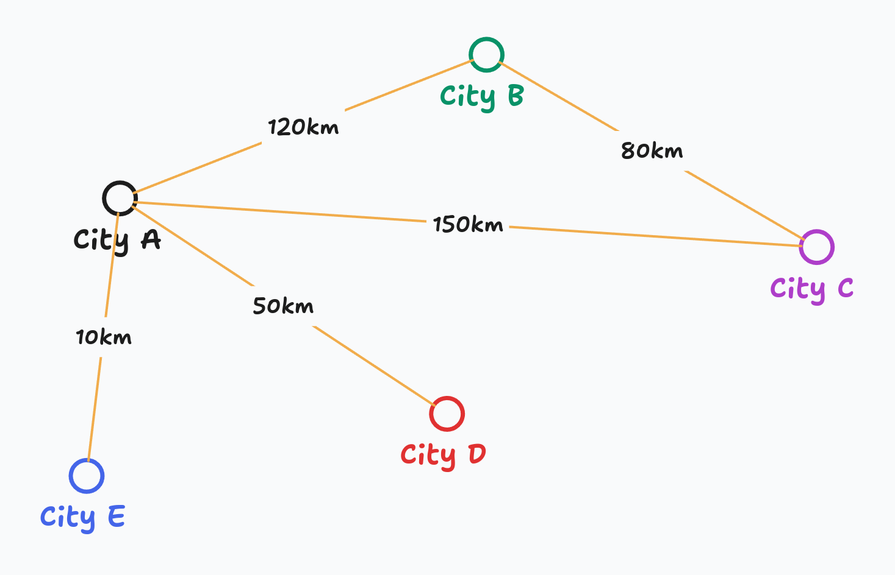

The graph in the picture above contains five nodes, and also five edges. Each node contains a single property, its name, which is a string (though if the actual position in which they're arranged is also relevant, two other properties for the X and Y coordinates, or perhaps for the latitute+longitude of each city, would also be stored for each node). Nodes may also have some sort of internal ID (such as if the city name were liable to change).

Edges in this graph have one explicit property (the distance), two implicit properties for the two nodes that they join (e.g. the fact that the 120km edge joins City A and City B), and maybe also an internal ID.

That's essentially it! Again, a graph is a set of nodes and a set of edges that link pairs of nodes.

Note that when you study graphs in [Discrete Mathematics](https://en.wikipedia.org/wiki/Graph_%28discrete_mathematics%29 "https://en.wikipedia.org/wiki/Graph_(discrete_mathematics)") or [Data Structures](https://en.wikipedia.org/wiki/Graph_%28abstract_data_type%29 "https://en.wikipedia.org/wiki/Graph_(abstract_data_type)") courses, typically the positions of the vertices in a screen or paper isn't important. For example, the three graphs in the image below are to be treated as equivalent. This is because they have the same number of nodes and you could label them so the connectivity between them is the same in the three graphs. Alternatively, you could think of the three graphs as being the same, except that the nodes have been dragged around, but no links have been added or cut so the connectivity is actually the same:

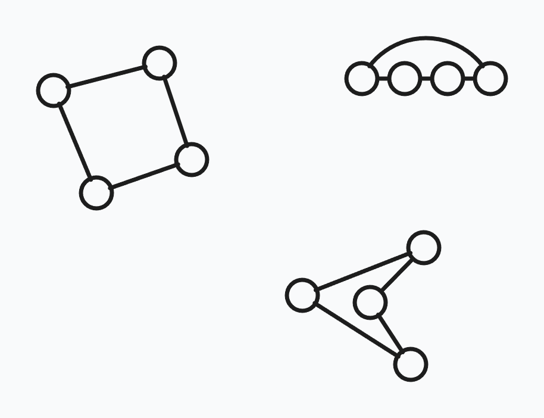

In fact, where the mathematical side is concerned, you're less likely to find an interest in what the "nodes" are, exactly. Mathematical properties of graphs work just as well when nodes and edges are purely abstract entities. On the software development side of things, what the vertices and edges model is more important, because... well, that's *why* the development is being done, ideally: to capture some real-world data and be able to store and operate on it.

There are also directed graphs, AKA digraphs, where edges have a direction (i.e. an edge from A to B doesn't imply that it's possible to go from B to A). This allows for traversals from A to B to have different distances/weights/costs/preferences than traversals from B to A. This may indicate, for example, single-direction roads between places, reachability between devices in a network, flights between airports, "Y must have finished before X can start" in task planning or execution engines, hierarchical relationships where a node logically contains/owns another, and such. The non-directed edges of plain graphs are more suited for when the edges represent such things as capacity/throughput of a link (e.g. the throughput of a pipe, a conveyor belt, or a road), friendship relations (ideally, X is a friend of Y implies that Y is also a friend of X), or simple relations such as "X1, X2 and X3 belong to the same category" or "X1 and X2 actually represent the same real-world entity".

Once a problem can be identified as "hey, this can be modeled as a graph!", there are [plenty of premade algorithms](https://jeffe.cs.illinois.edu/teaching/algorithms/book/05-graphs.pdf) that can be applied to it. For example, optimizations problems (such as thos of the form "find the shortest path..." or "the cheapest path...") may use [Dijkstra's algorithm](https://en.wikipedia.org/wiki/Dijkstra%27s_algorithm) or some refinement thereof, e.g. [A\*](https://en.wikipedia.org/wiki/A*_search_algorithm) (pronounced A-star, unless you can somehow pronounce \*. You're welcome!). There are other algorithms for [finding *maximal flow*](https://en.wikipedia.org/wiki/Ford%E2%80%93Fulkerson_algorithm), finding [approximate solutions to *the traveling salesman problem*](https://en.wikipedia.org/wiki/Christofides_algorithm) (a full solution isn't known and [may very well never be](https://en.wikipedia.org/wiki/NP-hardness)), [detecting *communities*](https://en.wikipedia.org/wiki/Girvan%E2%80%93Newman_algorithm), determining [which vertices are critical](https://en.wikipedia.org/wiki/LASCNN_algorithm) for network connectivity (i.e. nodes such that if they are deleted along with the edges that involve them, the entire graph gets split into two or more), or [finding a linear list of nodes that never places one node B before another A if there is an edge from A to B](https://en.wikipedia.org/wiki/Topological_sorting). Real-world questions hopefully translate into one of these abstract concepts, such that already developed, optimized (and sometimes proven to be optimal) algorithms (perhaps even with a prepackaged implementation in some library in some programming language) can be reused with a much larger confidence in the correctness and speed of the result.

### Random usages of graphs in computer projects

- [Makefiles](https://www.gnu.org/software/make/) and other build/CI tools (e.g. Github Actions) allow the definition of steps/stages/targets which are one or a few commands. There are dependencies between steps, meaning that a certain step must have finished before another can start, perhaps because the earlier step produces a file that is used in the latter. This may be modeled as a graph, and processed accordingly, so no dependency relations are violated by running a stage before all its previous steps are done
- Tools like [Apache Airflow](https://airflow.apache.org/docs/apache-airflow/stable/index.html), [Prefect](https://docs.prefect.io/v3/get-started/index) or [Flowpipe](https://flowpipe.io/docs) are used to describe workflows composed of separate stages. Again, like with Makefiles, there may be dependencies between jobs (either explicit, in the form of "step B refers to the data output by step A", as is the case with Flowpipe or Airflow's [XCom facility](https://airflow.apache.org/docs/apache-airflow/stable/best-practices.html#communication), or implicit, as with Airflow's recommended method which is placing the data generated by the earlier step *somewhere*, such as an S3 bucket, where the latter step can read it). In any cases, the workflow engine must also ensure that steps are executed in some order (there may be more than one) that respects such dependencies. In fact, Airflow [explicitly models execution as a graph](https://airflow.apache.org/docs/apache-airflow/stable/ui.html#graph-view), and even displays it as such on the web UI so a job's progress can be monitored
- Game engines (see [Unity](https://dev.epicgames.com/documentation/en-us/unreal-engine/graphs?application_version=4.27), and by extension others; here's [Godot's build-it-yourself implementation](https://gdscript.com/solutions/godot-graphnode-and-graphedit-tutorial/)) sometimes use graphs to represent "scripts", such as the internal logic of objects in the environment
- There are probably tons of bespoke graph algorithm implementations buried in dedicated, say, factory management software, or project planning, or vehicle route planning, or network management
- Graph databases fit quite nicely into "asset inventory" or cloud visibility use cases, used when it's desired to have a central view of all cloud resources (e.g VMs, storage volumes, virtual networks, load balancer/ingress/entrypoints, and all the different resources that your traditional cloud provider requires). See for example [Resoto](https://fixinventory.org/), which [appears to use ArangoDB under the hood](https://arangodb.com/solutions/case-studies/resoto-graph-powered-cloud-asset-inventory/), and [Cartography](https://cartography-cncf.github.io/cartography/) (originally from Lyft, now under the CNCF), which uses Neo4j. Modeling cloud resources as graphs (e.g. there may be VMInstance nodes, such as EC2 instances on AWS, and also Subnet nodes, and also "part-of" relationships between VM instances and Subnets) makes questions like ["What instances of X managed service are installed on each cloud account?"](https://cartography-cncf.github.io/cartography/usage/tutorial.html#what-rds-instances-are-installed-in-my-aws-accounts) or ["Which monitored Github repositories depend on this package"](https://cartography-cncf.github.io/cartography/usage/samplequeries.html#given-a-dependency-which-github-repos-depend-on-it) fairly simple to execute. More complicated questions that require backwards-and-forwards traversals, e.g. "What VMs share a subnet with this specific VM?" (say, in case that specific VM has been compromised or is behaving strangely) aren't that much more difficult

Graph databases have been there for a long while yet never seem to take off. Here's for example a Google Trends comparison between Neo4j (blue, a graph database), MongoBD (red, the stereotypical document DB), and Postgres (yellow, a stereotypical SQL/relational database):

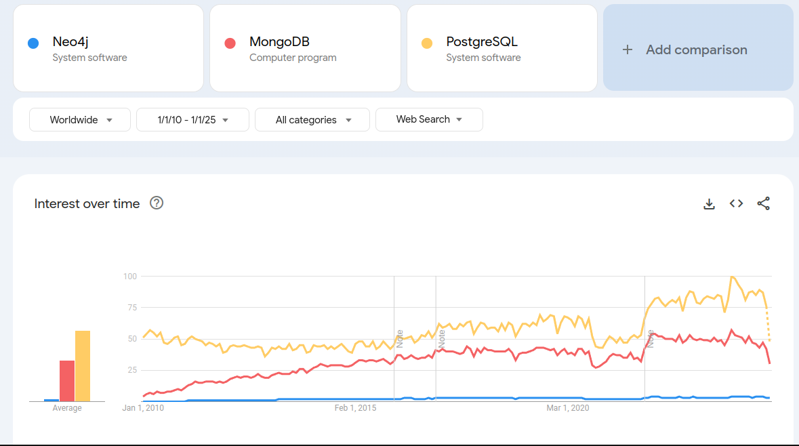

As far as Google is concerned, MongoDB and Postgres are easily ten or twenty times more "popular" (that is, many more people searched for terms that match those databases) than Neo4j. While I chose those three just as samples of their classes (there's plenty more graph databases, document databases and relational databases), results shouldn't vary much if you were to choose, say, MySQL instead of Postgres, or ArangoDB instead of Neo4j. The main idea is that Google interest in graph DBs is dwarfed by them other databases, always has been, and doesn't seem to have any interest in changing.

The explosion of graph DBs has been announced by your standard tech prophets (Gartner and friends) for multiple years now: [2019: adoption will grow by 100% every year through 2022](https://www.eweek.com/database/why-experts-see-graph-databases-headed-to-mainstream-use/), [2021: 80% of data and analytics innovations will be made with graph DBs by 2025](https://www.techtarget.com/searchbusinessanalytics/news/252507769/Gartner-predicts-exponential-growth-of-graph-technology), and there's probably more. Determining whether those claims have indeed become true is left as an exercise for the reader. For now, we're already 2025, so it's already time for 80% of data innovations to be made with graph DBs. You'd better hurry and do your part for The Cause; we wouldn't want Gartner to miss a prediction, right?

## Anatomy of data in a graph DB

Dedicated graph databases tend to store data in something like the following:

- There's a concept of Nodes, which are the "things"/entities. They'd roughly correspond to the main tables in a relational database, the tables that hold the actual information for the things of interest for the application
- Nodes are usually required to have a "label", which roughly corresponds to the class of the object in an OO programming language, or to the table name in a relational DB. Whether a node can only have one label or several depends on the specific DB used. One-label-per-node would be equivalent to a relational DB, where each row is only on one table; while multiple-labels-per-node may be something like multiple inheritance, where a single entity can act like different kinds of objects at once
- Nodes can also have other properties, which would correspond to the columns that table has in a relational DB. For example, nodes with type=User may have properties for the username, password, email, signup_date, email_verified and so on. Depending on the DB used, it may be possible to set constraints such that all nodes with label User _must_ have certain fields, similar to SQL tables where all records must have the same columns; or it may be possible to leave the fields unspecified such that any fields are accepted, like in Mongo and other document stores (unless you use [some kind of schema validation](https://www.mongodb.com/docs/manual/core/schema-validation/))
- Then, there are Relationships/edges, which also tend to require a type
- Relationships can also have properties, but they don't have to
    - Relationships without properties would merely establish the existence of a connection between two nodes. For instance, in a relational DB for a blogging system like this one, there may be a Post table that has a `written_by` column, which should be a foreign key to a User table, such that each Post contains *the ID* of the User (that's another table) who wrote each post. By contrast, in a graph DB, the link between a Post and its writing User would be expressed by having edges with type=`written_by` that start on specific Nodes of type Post and go to specific Nodes of type User (or maybe the reverse, you may as well have edges with type `writer_of` that start at Users and go to Posts. Graph DBs are usually equally as happy traversing relationships in either direction, so choosing which side points to which side isn't that important, unlike in SQL where, if you want to be nice and normalized, there's usually The Right Choice and The Wrong Choice of sides)
    - In this sense, property-less relationships are somewhat equivalent to simple foreign keys in SQL, and also to many-to-many relationships that use the simplest form of [a bridge table](https://www.ibm.com/docs/en/cognos-analytics/12.0.0?topic=relationships-bridge-tables), which just contains two foreign keys to the two linked tables
    - Relationships with extra properties are the graph DB equivalent of intermediate/bridge tables with extra columns in SQL databases. For example, you could model votes on comments (as is the case in Reddit) as a relationship `voted_on` that links a User to a Comment. The relationship should also have properties for the vote type (upvote or downvote), and for the timestamp at which the vote was casted. In a SQL database that would need to be a separate table, `votes`, with columns `user_id`, `comment_id` (these two are FKs to the corresponding tables), `kind` and `made_on`
- Depending on the specifics of the database, it may or may not be possible to have multiple relationships of the same type between the same two nodes (for example, two `follows` relationships between A and B in something like Twitter). Sometimes that may not make any sense (Post `written_by` User, for example: there's no reason to have the fact that User A wrote Post 1 repeated), but other times it may (for example, you would be able to capture the history of users subscribing and unsubscribing from Youtube channels by creating a User `subscribes_to` Channel relationship with a `started_on` property, and if the user unsubscribes the relationship is *not* deleted. Instead a `finished_on` property is set. If the user then resubscribes, *another* relationship with the same type, User and Channel is created with another `started_on` but `finished_on` empty, and the cycle continues). Things like repeated transactions between bank accounts may also benefit from being able to have duplicate source+target+type relationships (Account `sends_to` Account, where each relationship has a time and amount)

### Query languages

While relational databases are most commonly interacted with using SQL (both for data querying with `SELECT`, for mutating the data with `INSERT`, `UPDATE` and `DELETE`, and for modifying the schema with DDL statements like `CREATE TABLE` and such), there's no such standard in graph databases. Also, the SQL language isn't *that* standard either, since each DB engine implements its own dialect and extensions, with varying degrees of compliance with the various SQL standard editions, and random quirks. But graph databases have even less of an agreement.

From what I've seen, some common choices are:

- Cypher or openCypher: Cypher was originally developed for [Neo4j](https://neo4j.com/), it was just "the language that Neo4j uses". It's still used by Neo4j, by the way. [openCypher](https://opencypher.org/) is an open (not just Neo4j-driven) effort to formally specify Cypher, and also to help that language get adopted by other database engines. For example, [Neptune](https://aws.amazon.com/neptune/) (an AWS managed service) supports [querying via openCypher](https://docs.aws.amazon.com/neptune/latest/userguide/access-graph-opencypher-overview-getting-started.html). Cypher can be used for data retrieval via "pattern matching", where the query specifies the shape of the data to return. For example, "find all the airports that have a flight to Neverland" may be represented like `MATCH (n:Airport)-[:flight_to]->(:Airport {name:"Neverland"}) RETURN n)`. This finds all Airports (named `n`) that have an edge of type `flight_to` towards an Airport that satisfies the condition `name=Neverland`. It's ASCII art, in fact: nodes are stylized circles (note the round parentheses around nodes) `(text)`, you can see the arrow that goes from the first Airport to the second `-->`, and the relationship is sort of like a label (surrounded by square brackets) on top of the arrow `-[text]->`. Cypher can also perform data mutations, since there's statements like [CREATE](https://neo4j.com/docs/cypher-manual/current/clauses/create/), [SET](https://neo4j.com/docs/cypher-manual/current/clauses/set/) and [DELETE](https://neo4j.com/docs/cypher-manual/current/clauses/delete/)
- [SPARQL](https://www.w3.org/TR/sparql11-query/) is a project by the W3C, the entity that standardized the Web of all things, as part of [the Semantic Web project](https://www.w3.org/RDF/) (is that going anywhere?). It reads a bit like Prolog or Datalog in the way in which it declares "floating" variables that are "bound" (given values) by the query engine and then reused in other clauses. For example, `select ?person where {?person :liked post:123} limit 10` declares a variable `?person`. The query engine then tries to find *all* the values that `?person` can take such that `?person :liked post:123` holds true (much like solving `x^2+2x+1=0` means finding all the values of `x` that satisfy the equality), and returns all those values for `?person` as a table. More complicated conditions, such as multiple relationship hops, are expressed in the same way; by inserting additional variables, and leaving the query engine to sort out the best way of finding all the possible values that satisfy all the conditions at once. From what I can see, SPARQL proper has no provision for mutating data, though there's [SPARQL Update](https://www.w3.org/TR/sparql11-update/#load), an extension to SPARQL that provides [INSERT DATA](https://www.w3.org/TR/sparql11-update/#insertData) and the respective commands for updating and deleting. SPARQL is used by [AWS Neptune](https://docs.aws.amazon.com/neptune/latest/userguide/access-graph-sparql.html) and [a bunch of other projects](https://en.wikipedia.org/wiki/List_of_SPARQL_implementations) that I haven't heard about
- [TinkerPop Gremlin](https://tinkerpop.apache.org/gremlin.html) is the language of Apache Tinkerpop, and also used elsewhere (see [AWS Neptune](https://docs.aws.amazon.com/neptune/latest/userguide/access-graph-gremlin-rest.html) and [Azure CosmosDB](https://learn.microsoft.com/en-us/azure/cosmos-db/gremlin/support)). Gremlin as a language reads much more like fluent query builders such as [LINQ](https://learn.microsoft.com/en-us/dotnet/csharp/linq/) in C# and friends, with tons of chained method calls: `g.V().has("name","gremlin").out("knows").out("knows").values("name")`. In fact, Gremlin is "embedded" into the host language of the application: "traversals can be written in any programming language that supports function composition and nesting", therefore providing aids such as IDE-assisted completion, typechecking and refactoring at a much higher level than a language that runs `rows = driver.execute("SELECT * FROM ... WHERE ...").all()`, where the actual SQL statement is merely "a string". Gremlin operates in terms of "traversals", which are conceptually like pointing a finger to one or many nodes in the graph, and then repeatedly moving the fingers, potentially spawning more fingers or removing them, according to instructions. When the end of the instructions is reached, whatever is currently pointed to is returned. For example, there are instructions to follow a certain relationship out of the currently-pointed-to nodes, or to only keep some of the currently-pointed-to nodes. In `g.V().has("name","gremlin").out("knows").out("knows").values("name")`, `g.V()` would theoretically place a finger on every node (vertex) in the graph. Then, `.has("name","gremlin")` would remove many fingers, all except those that happened to be on nodes where name=gremlin. `.out("knows")` would follow outgoing `knows` arrows from that node or nodes, repeated twice, leaving the fingers pointing to any nodes that can be reachable from users named `gremlin` in exactly two hops. And, finally, `.values("name")` would focus the fingers not on the entire nodes, but just on their `name` property, and since there are no more instructions, those values would be returned. Of course, each execution engine may choose to run the query in a more efficient way than starting from *each node* in the graph, but the results should be the same as if that step-by-step computation was performed
- [GQL](https://en.wikipedia.org/wiki/Graph_Query_Language) (Graph Query Language) is a very new (sub-1 year old as of writing this) standard by ISO, which also standardizes SQL (to the degree that SQL can be called *standard*). It's syntactically fairly close to openCypher, and in fact the people at Neo4j were involved in the specification. A very strange effect of it being an ISO standard is that... [it costs money](https://www.iso.org/standard/76120.html) to read. Real money. Actually a considerable amount of money, over two hundred dollars. For a standard. In computing. After seeing, for example, [the W3C work](https://www.w3.org/TR/sparql11-query/#basicpatterns), all *explicitly* open, having the definition of a database query language be paywalled feels really weird. (Sidenote: SQL, even though it's also an ISO standard, [is actually free](https://www.iso.org/standard/76583.html), though behind a login wall)

There are other languages, but these three have the nice property that they aren't tied to a single DB engine, as is the case for example with [Datomic's query language](https://docs.datomic.com/query/query-data-reference.html) or [Dgraph's DQL](https://dgraph.io/docs/dql/dql-syntax/dql-query/) (or, for that matter, MongoDB's aggregation pipelines).

## Example: Modeling cloud configuration as a graph DB

The configuration of cloud environments (say, an AWS account and all the associated resources that live within) is one of the scenarios that lends itself nicely to being modeled as a graph, since there are many kinds of resources that are linked in many different ways. For example, below is a very simplified, completely incomplete, and probably not-quite-accurate diagram with some of the entities that a single AWS account can contain:

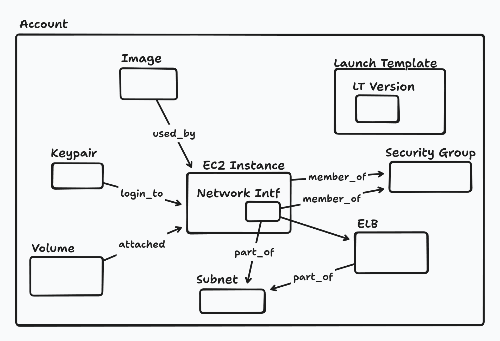

Note that the picture above is actually a conceptual model of the relationships between data, rather than a view of any *particular* AWS account. For example, in the picture above we see that Images are `used_by` EC2 instances. This is true, in a sense, since EC2 instances require an AMI to boot, but it isn't the entire picture. In any real AWS account, there may be multiple EC2 instances (hence multiple nodes with the EC2Instance tag), multiple Images (same, multiple nodes with the Image tag), and multiple links between instances and images. There won't necessarily be the single arrow depicted above joining the single Image node to the single EC2Instance node.

Similarly, while it's true that Keypairs are used to `login_to` EC2 instances, there isn't necessarily a single Keypair that points to a single EC2 instance. There may be multiple Keypairs and multiple EC2 instances, there may be a single Keypair that is used to `login_to` many instances, there may be as many keypairs as instances in a 1:1 mapping, there may be unused keypairs, there may be EC2 instances that aren't linked to a keypair (maybe? Does AWS allow an EC2 instance to exist without a keypair?), and so on.

In this sense, the picture above is more like a "schema" of the data than a representation of any real data. Real data extracted from a real AWS account will have roughly that same structure, in terms of what node labels exist, what relationship labels exist, and what kinds of nodes are connected using which relationships to what kinds of nodes; but each node type can appear many times.

[Cartography](https://cartography-cncf.github.io/cartography/) (originally by Lyft, now donated to the CNCF) is

> a Python tool that consolidates infrastructure assets and the relationships between them in an intuitive graph view powered by a Neo4j database.

Cartography uses [Python code](https://github.com/cartography-cncf/cartography/blob/master/cartography/intel/lastpass/users.py) (for example, [AWS's official Python SDK, `boto3`](https://github.com/boto/boto3), for AWS; the official Google Cloud client for GCP; or plain HTTP requests when there's no officially maintained package/SDK to wrap the service's API) to gather information about entities. For example, Lastpass (a password manager) [presents two kinds of nodes](https://cartography-cncf.github.io/cartography/modules/lastpass/schema.html), Humans and LastpassUsers. LastpassUsers are what [the Lastpass API](https://support.lastpass.com/s/document-item?language=en_US&bundleId=lastpass&topicId=LastPass/api_get_user_data.html&_LANG=enus) reports, that is accounts that are enrolled into Lastpass. However, the mapping between real people and accounts may not be one-to-one: Lastpass accounts may be shared, or belong to automatic processes in which case they don't properly belong to any person, or a person may have several accounts or no accounts at all. All these relationships can be expressed by having Human `uses_account` LastpassUser, or maybe the reverse: LastpassUser `belongs_to` Human.

Larger services may have many more kinds of entities than Lastpass's 2, see for example [Azure](https://cartography-cncf.github.io/cartography/modules/azure/schema.html) and especially [AWS](https://cartography-cncf.github.io/cartography/modules/aws/schema.html).

Cartography is coded such that each "intel module" (which corresponds to one cloud computing service or similar, such as a user identity platform) can just add and modify its own little section of the graph. The [DigitalOcean module](https://cartography-cncf.github.io/cartography/modules/digitalocean/schema.html), for example, need only be concerned with keeping DOAccount, DOProject and DODroplet objects up to date. The fact that, for example, DODroplets may be mapped to LastpassUsers (say, via a custom DODroplet `owned_by` LastpassUser relationship, fed from some sort of company-internal Excel file where all the droplets must be registered with the name of who owns them) doesn't affect the sync operations performed by the DigitalOcean intel module:

- If the DO intel module sees a new DODroplet (which is identified by the DigitalOcean API call returning a droplet whose `id` doesn't match any DODroplet in the graph), it'll create it. No `owned_by` relationships to LastpassUsers will exist for that droplet, so who owns that droplet won't be recorded. That should be handled elsewhere, perhaps via another intel module or by manually adding the link (say, via a Slack message that says "Unclaimed droplet detected!" and then someone goes into the DB and adds the appropriate link)
- If the DO intel module detects changes in a DODroplet (each droplet [has a stable ID]() that can be used to determine whether a droplet is brand new or already exists in the graph), it'll just update whichever fields it has available. For example, [the DigitalOcean API endpoint for listing droplets](https://docs.digitalocean.com/reference/api/api-try-it-now/#/Droplets/droplets_list) will return the name; the allocated memory, CPU and disk; the droplet's status (active, off, archived); whether the droplet is locked (DO does that, by example, if a droplet is detected as sending DoS traffic); the OS image used by the droplet; IP addresses allocated to the droplet; GPU information if available, and more. These are all logically "properties" of the DODroplet node, so they can be updated there directly. Other properties are better represented as arrows that go to/from other nodes. For example, the Droplet API contains a property `snapshot_ids`, which is a list of IDs of the [snapshots](https://docs.digitalocean.com/products/snapshots/) taken of that droplet. Snapshots are better represented as separate nodes, [with their own properties](https://docs.digitalocean.com/reference/api/api-try-it-now/#/Snapshots/snapshots_list), which link back to DODroplets via relationships (arrows)
- Finally, if the DO intel module were to find a DODroplet that has been deleted (which would be detected as a droplet that appears on Cartography but isn't in the API response from DigitalOcean), that DODroplet would need to be deleted, or perhaps marked as nonexistent. If the DODroplet were to be hard-deleted, as opposed to just have a field set to indicate inactivity, then any relationships that come into or go out of it would also be dropped, [using the `DETACH DELETE` Cypher command](https://neo4j.com/docs/cypher-manual/current/clauses/delete/#delete-a-node-with-all-its-relationships), which is similar in functionality to [SQL's `ON DELETE CASCADE`](https://geshan.com.np/blog/2023/04/delete-cascade-postgres/): the arrows would be deleted as required so there weren't any arrows that appear out of thin air or end in the air

Thus, part of Cartography's appeal is that:

- Intel modules can be largely independent of each other, with each one contributing to its own part of the larger graph. They don't need to know about each other's existence, which is nice because then it's possible to pick-and-choose which modules you install and use, which in turn is nice because not every occasion will have the same sources of data
- The job of bridging intel providers can be neatly expressed as jobs that run over the graph after it's been updated. For example, you may know that if a LastpassUser has the same email as a GSuiteUser, then they are the same actual person. Cartography has [analysis jobs](https://github.com/cartography-cncf/cartography/blob/master/cartography/data/jobs/analysis/gsuite_human_link.json) that run after every sync and can further modify the graph. In this way, the intel modules are kept neatly in their own little worlds, and the messy cross-domain work is done separately, in the form of business rules that have access to the entire graph and can add extra links as desired
- Many different entities can be linked with more flexibility than a relational database would allow. For example, a foreign key (for many-to-one relationships) or a join/bridge table in a relational database (which is the proper normalized way of expressing many-to-many relationships) can only express a relationship from a single kind of node towards a single kind of node, which is dictated by the `FOREIGN KEY ... REFERENCES table_name(...)` constraints. If the same relationship is used for multiple kinds of objects (for example, some kind of object that could be shared to Users and/or Teams), then two different tables are required, whereas on a graph database the same relationship can be used for both

## Relationships as structure vs. relationships as data

The last point above is, for me, a considerable difference between graph DBs and relational/SQL DBs. Here goes:

In relational databases, relationships between entities come from the structure (DML). In graph databases, relationships between entities appear solely as a result of the data.

Here's an example of that. There may be a Human node, which represents actual people. However, there may be many different resources that could reasonably link to Humans: [LastpassUsers](https://cartography-cncf.github.io/cartography/modules/lastpass/schema.html#lastpassuser), [GSuiteUsers](https://cartography-cncf.github.io/cartography/modules/gsuite/schema.html#gsuiteuser), [GithubUsers](https://cartography-cncf.github.io/cartography/modules/github/schema.html#githubuser), [AWSUsers](https://cartography-cncf.github.io/cartography/modules/aws/schema.html#awsprincipal-awsuser), and maybe more. Each of these represents a person, as known by some service, but not actually that person itself.

Furthermore, not all of those links will necessarily exist: if you or your company don't use Github, then there won't be any GithubUsers at all in the database. If you were using SQL, that means there wouldn't be a table `github_users` at all. In a graph DB, that would mean that no GithubUser nodes exist, and obviously no relationships coming into/out of GithubUser nodes either.

Or, if you have Github, you don't necessarily have Human nodes, perhaps because you don't use any other services that have a notion of "users", and therefore don't need to merge different service's notions of real-world people.

In SQL, a way to model the relationship between GSuiteUsers, GithubUsers and Humans may be like this:

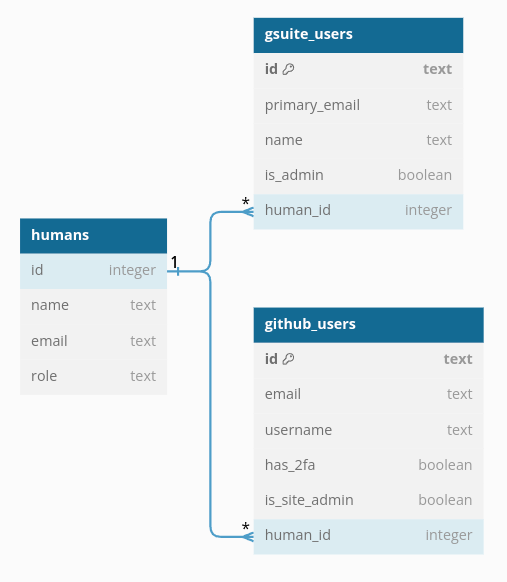

Let's ignore for now the question of whether the relation between humans and ServiceUsers, for whatever value of Service, is truly one-to-many (as it is now, with a FK in the service tables leading back to Humans), should be reversed (with the FKs in the Humans table, pointing to both services' tables), could be many-to-many (which would necessitate the introduction of join tables), or should be one-to-one (which is as depicted, but with the addition of a `UNIQUE` constraint to prevent the to-many side from ever existing). We'll take the simplest (from the DB design point of view) case, which is one-to-many for everything.

However, the model pictured above puts the responsibility of knowing about Human on whichever piece of code is responsible for handling `gsuite_users` (which would be the GSuite intel module) and `github_users` (the Github intel module). They're now responsible to add the `human_id` column such that relationships to Human can be expressed, and to know that there should be a `humans` table that they must link to. And Human may not even exist, as discussed above. This means that now modules are interdependent and need to care about whether other modules are installed, which isn't ideal. The best thing would be for each module to care about its own things (tables or node types) and nothing else, and to work no matter which other combination of modules happens to be installed or not alongside it.

An alternative would be to have whichever module installs the `humans` table also reach out and install foreign keys on the tables of other modules, which in turn means that now a table (e.g. `github_users`) isn't the sole property of its module (the Github intel module), but now other modules are also expected to mess with it, which has the same issue of tangling modules together that should probably be kept apart. Even if we flipped things around, such that the `humans` table contained foreign keys `gsuite_user_id` and `github_user_id`, we'd have the same problem, but in reverse. Now whichever piece of code manages Humans needs to take into account *every possible other intel module* that may have some sort of person-like entity that users may wish to link to Humans. Furthermore, humans may contain links to other things apart from their personas in different services: they may belong to teams, for example. That would be even more foreign keys in the `humans` table.

This is what I mean by "in SQL, relationships come from the structure". Relationships *can* exist between a specific Human and a specific GithubUser only because, in the abstract world of Platonic Forms where there is only two entities, *the Humans table* and *the GithubUsers table*, there is also a corresponding foreign key that links the two tables. If the definition of `github_users` didn't have a foreign key to `humans`, then the application wouldn't be able to express the fact that any Human is linked to any GithubUser. Furthermore, in such a case, adding the ability to express those relationships would require a DDL change, something like `ALTER TABLE ADD COLUMN ... REFERENCES ...`, which isn't something that is normally done by the application or on the course of normal operation (these kinds of statements are usually handled via migrations and run separately, maybe during application downtime, maybe with different higher-privilege users)

By contrast, in graph databases, "relationships appear on the data". The fact that a certain Human is linked to a certain GithubUser is given by the existence of a relationship/arrow between the respective nodes. There's no separate realm where the relationship between the Human-concept and the GithubUser-concept must be declared beforehand. Relationships can be added at any time, by the application, with exactly the same commands that are used to add nodes. Relationships are just as real and as first-class as the entities which they link: they can be queried in the same way, they can be added and deleted, they can have properties.

## Example: Processing network configurations

We've seen how Cartography uses a graph database to store data about infrastructure assets (e.g. virtual machines and their attending resources) and other similar entities, and to allow for queries over that data that take into account the topology of the data, such as traversing arrows to find paths that satisfy a certain condition, or finding small pieces of the graph that have a certain shape. We'll now play with a similar situation, but from scratch.

### Setting the scene

For a case that seems like it may benefit from being modeled as a graph, we'll try to dump the configuration status of a router+firewall combo. In particular, we'll work with [pfSense](https://www.pfsense.org/), which is actually the name for an OS that is specifically configured to perform the duties of a router (namely, routing packages across networks, and also typically to provide outbound access to the wider Internet) and firewall (namely, to examine packets and determine whether they should be allowed or blocked, based on user-configured rules). pfSense can be installed on commodity hardware, AKA normal computers[^1], though there are also ["pfSense Security Gateway Appliances"](https://www.pfsense.org/products/) sold by Netgate, the company that is behind pfSense (and sells said appliances, support packages, the pfSense Enterprise edition, and performs other money-making activities). These Appliances are preconfigured physical devices that you can buy and deploy somewhere. In our case, we'll just use the pfSense Community Edition's ISO image, which can be run on VirtualBox.

pfSense stores *all* its config in [a single file called `/conf/config.xml`](https://docs.netgate.com/pfsense/en/latest/config/xml-configuration-file.html). Since pfSense is actually a normal OS (some version of OpenBSD) plus all sorts of [packages](https://docs.netgate.com/pfsense/en/latest/packages/list.html) that perform different functions (for example, the actual packet firewall is [`pf`, the standard OpenBSD firewall](https://www.openbsd.org/faq/pf/), which gives pfSense its name), the configuration files for all those packages are dynamically created based on the main pfSense config file. Here, we'll just extract data from the main pfSense config file, because it's easier than having to deal with many files in many different bespoke formats.

### pfSense configuration

After installing pfSense in a VM, we can access its web UI. If using the default VirtualBox configs, the VM will be installed with a single network adapter in NAT mode, which means that it can't usually be accessed from the host. This can be fixed by adding a port forwarding rule that exposes Guest Port 443 on the Guest IP that is printed on the VM's console:

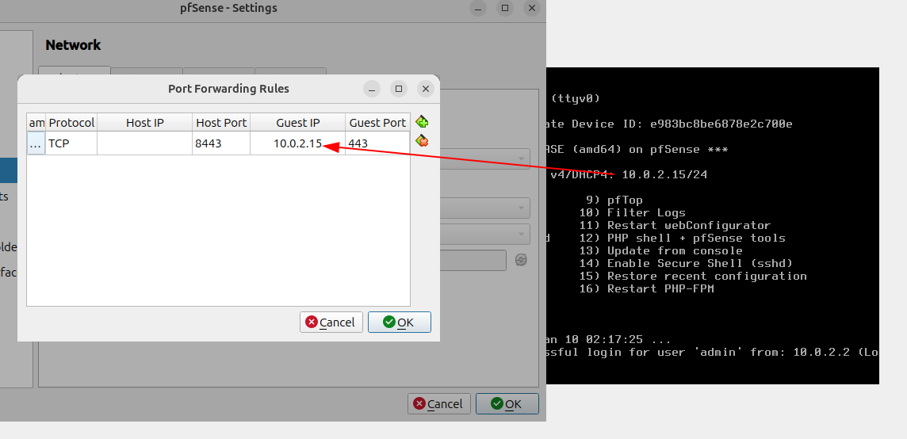

Once the port is exposed on the host, it can be accessed via any browser, on whichever port was provided as the Host Port. First I lightly configured the device so there were at least a few data points to parse later: some [aliases](https://docs.netgate.com/pfsense/en/latest/firewall/aliases.html) were added, along with [firewall rules](https://docs.netgate.com/pfsense/en/latest/firewall/rule-list-intro.html#adding-a-firewall-rule), [a schedule](https://docs.netgate.com/pfsense/en/latest/firewall/time-based-rules.html) and [a traffic shaping policy](https://docs.netgate.com/pfsense/en/latest/trafficshaper/index.html).

Once that's done, we're interested in the **Backup & Restore** option that is under the **Diagnostics** menu, where there'll be a button to download the XML config file:

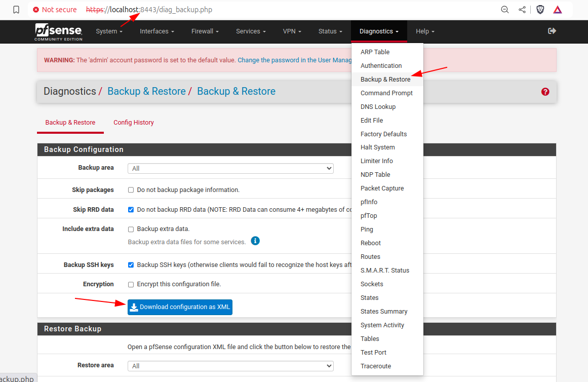

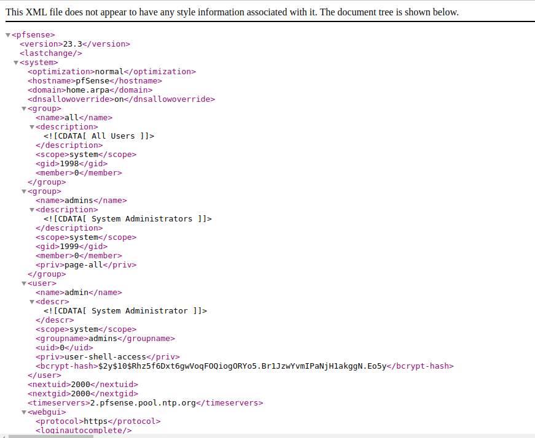

This XML file, just by virtue of being an XML file, actually forces the data to be structured as a tree: it has a root, the `<pfsense>` element, and child elements under it. Said child elements can in turn have other child elements, like the `<optimization>` element that is stored under `<system>` that is stored under `<pfsense>`. Trees are actually a subset of graphs, without cycles, so technically the data is on a graph already.

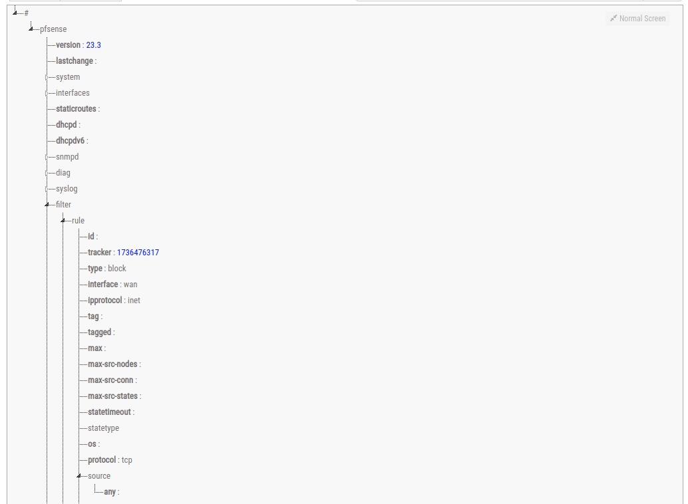

However, the tree representation hides some links across data. For example, [IP aliases can be used](https://docs.netgate.com/pfsense/en/latest/firewall/aliases.html#using-aliases) on firewall policies (IP aliases are a set of IP addresses or other aliases, plus a name). This allows a firewall rule to, say, allow traffic from some origins to "the database servers", which may *currently* be only one IP, but maybe later it'll be three IPs because two more replica servers will be added. Rather than adding the two new IPs on every firewall policy that involves the database servers, it can be added just once, on the alias, and every policy that refers to it will be automatically updated.

Aliases' definitions, mainly the IPs/ports/networks that compose them, are stored under `/pfsense/aliases`:

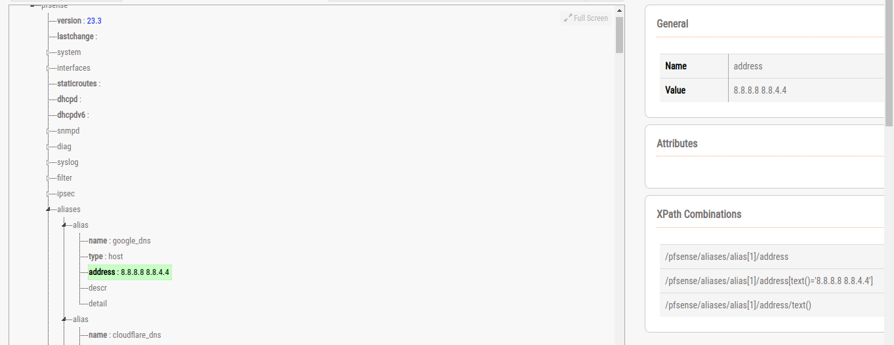

However, aliases are *used*, among other places, in the firewall policies, which are under `/pfsense/filter/rule`:

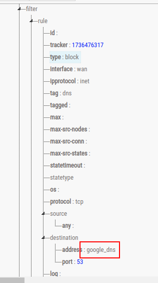

In that rule, the `google_dns` that is on `destination/address` is the *name* of an Alias which was previously configured on the web UI:

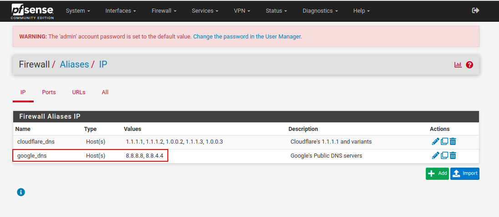

This means that, purely looking at the structure that is provided by the XML file, this relationship between an Alias's IPs and the firewall rules in which they're used has been lost. Which makes sense, since after all serializing a configuration for storage into a file, be it XML, [some sort of custom text format](https://gist.github.com/karnauskas/c05f61580c2b9324b14e), JSON, YAML or whatever else, forces the file to be flattened into a linear form. In the case of XML, a tree structure is maintained, but any cross-branch relationships are lost. In the case of custom text files such as those used by Cisco, [Fortinet](https://github.com/Azure/Azure-vpn-config-samples/blob/master/Fortinet/Current/fortigate_show%20full-configuration.txt) or [Juniper](https://www.juniper.net/documentation/us/en/software/junos/cli/topics/topic-map/junos-config-files-loading.html#loading-a-configuration-from-a-file) firewalls, hierarchy tends to be denoted via some combination of indentation and bracketing. For example, Fortigates use indentation (though I don't know if that is significant) and marker words: the main system configuration starts at `config system global` with no indentation, and ends once an `end` with no indentation after that is encountered. It's somewhat similar to [Bash's `if-fi`](https://www.gnu.org/software/bash/manual/bash.html#Conditional-Constructs), `case-esac`, `while-done` and so, where blocks of code are terminated with explicit keywords. Juniper's files are more like C-style programming languages, where blocks are delimited with `{ ... }`. These achieve the same purpose as pfSense's XML format, where blocks are delimited by `<tag> ... </tag>` as is The XML Way. All these approaches lack the cross-tree links, such as:

- Local users (those that can log in to the firewall's management interfaces) live on one part of the three, whereas many types of objects elsewhere (for example, aliases, traffic rules, and even users themselves) may be interested in holding a pointer to the user that last updated them
- Host/IP/address aliases are referenced by traffic policies
- Traffic policies may be linked to NAT rules
- Traffic policies may be linked to traffic shaping policies, which can set a cap on the bandwith that can be used on a certain rule, either globally or per IP
- Groups and users may be defined at the same level (with a common parent), yet users and groups are naturally linked: users belong to groups, and groups contain users

### Inserting data

The XML can be parsed in your programming language of choice, and then inserted into your graph database of choice. I chose Neo4j because it's fairly well known, bringup of a database [is easy enough](https://neo4j.com/docs/operations-manual/current/installation/linux/debian/), it uses Cypher which is somewhat common and should become more so if/when the ISO graph query language based on Cypher actually becomes common, and since this is just a test I don't really care much about [the differences](https://neo4j.com/licensing/) between the open-source Community Edition and the not-open-source Enterprise Edition (which includes things like replication/sharding and finer-grained authorization). These differences would be more important if this were A Real Project™.

Parsing and inserting is just a [Small Matter Of Programming™](http://www.catb.org/jargon/html/S/SMOP.html). We just have to take care to insert the resources/nodes (e.g. the firewall rules and the nodes for the interfaces) *before* we insert the relationships between them (e.g. the fact that a certain firewall rule applies to packets that come *from* a certain interface requires both the node for the rule and the node for the interface to exist before the link between them can be added).

A typical create-or-update statement (this specific one is for creating the Interface nodes, which model the network interfaces in the firewall) is as follows:

```cypher
MERGE (i:Interface {device: $dev, name: $descr, id:$key})
ON CREATE SET i.if=$if, i.ipaddr=$ipaddr
ON MATCH SET i.if=$if, i.ipaddr=$ipaddr
RETURN i
```

The pieces that start with dollar signs, such as `$dev` and `$descr`, are Cypher [variables](https://neo4j.com/docs/cypher-manual/current/syntax/variables/), similar to the variables in SQL's [prepared statements](https://www.postgresql.org/docs/current/sql-prepare.html#SQL-PREPARE-EXAMPLES): they mark places where variable values will be inserted.

The `MERGE` command is Cypher's "upsert" operator (i.e. update or insert). It tries to find a node that matches the passed conditions, and creates one if it doesn't already exist (we know that it's a node because it's surrounded by round parentheses, `MERGE (...)`. If it were a relation it would have square brackets). Here, the query will attempt to find a node of type Interface with the passed `device`, `name` and `id` properties. `device` is a property that is present on all nodes of all types, so that the same graph can host data about multiple firewalls (think of some sort of "centralized information system" that consolidates the information of multiple pfSense firewalls).

If no nodes are found that match the conditions, one will be created. It'll be set so it matches the conditions, which here means that its label will be set to Interface, and the `device`, `name` and `id` properties will also be filled. Additionally, whatever is specified on the `ON CREATE SET` clause will also run: here, the `if` and `ipaddr` properties will be set too. `if` is the FreeBSD-style interface name (e.g. `em0` or `em1` indicate [wired networks that use the `em` driver](https://docs.freebsd.org/en/books/handbook/network/#config-network-connection)), and `ipaddr` is the assignment method for the IP address of that interface (DHCP or static).

If, however, a node *was* found matching the conditions, then the `ON MATCH SET` clause will run, instead of `ON CREATE SET`. In this specific case, it'll set the same properties as when the node was created from scratch, but that isn't necessarily the case. For example, the `ON MATCH` clause could be configured so it touches a `last_updated` property.

The properties are fed from the information of *each* interface in the XML file, so the statement above runs once per interface. There are similar statements that create-or-update firewall rules, users, groups, schedules, aliases and several other entity types, all based on the XML file. All these statements have a similar structure: `MERGE (x:SomeEntityType {device:$dev, someid:$id}) ON CREATE SET x.prop1=$prop1, ... ON MATCH SET x.prop1=$prop1, ... RETURN x`.

When all these statements have run, we have a set of isolated nodes stored in the DB. Notice that in the image below the node types (labels) are denoted by the colors. The mapping of labels to colors can be found on the sidebar to the right:

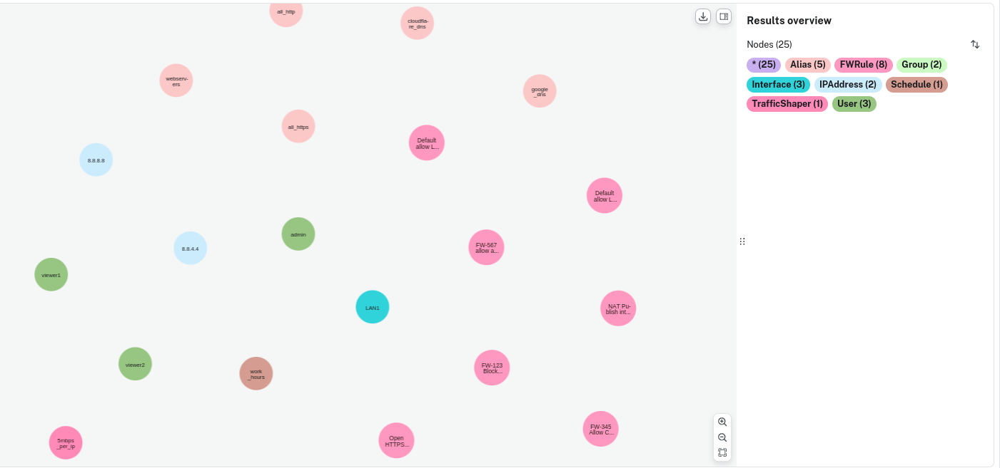

For example, the green circles are users, the light blue circles are IPs, and the peach circles are aliases.

Then, it's time to create the relationships between entities, by using statements like the one below, which adds links between firewall rules and aliases, for rules where the destination IP is defined to be an alias instead of a hardcoded IP:

```cypher
MATCH (r:FWRule {device: $dev, id: $tracker}), (a:Alias {device:$dev, name:$dst_addr, type:"host"})
MERGE (a)-[:USED_ON {type:"destination"}]->(r)
```

These statements start with `MATCH`, which won't ever create new nodes, unlike `MERGE`. It'll just find nodes that already exist. In the rule above, for example, we locate a firewall rule, and we name it `r`. Said firewall rule must have certain values for the `device` and `id` properties, which all FWRule nodes have (that's taken care of by the `MERGE` statement that inserted the FWRule nodes):

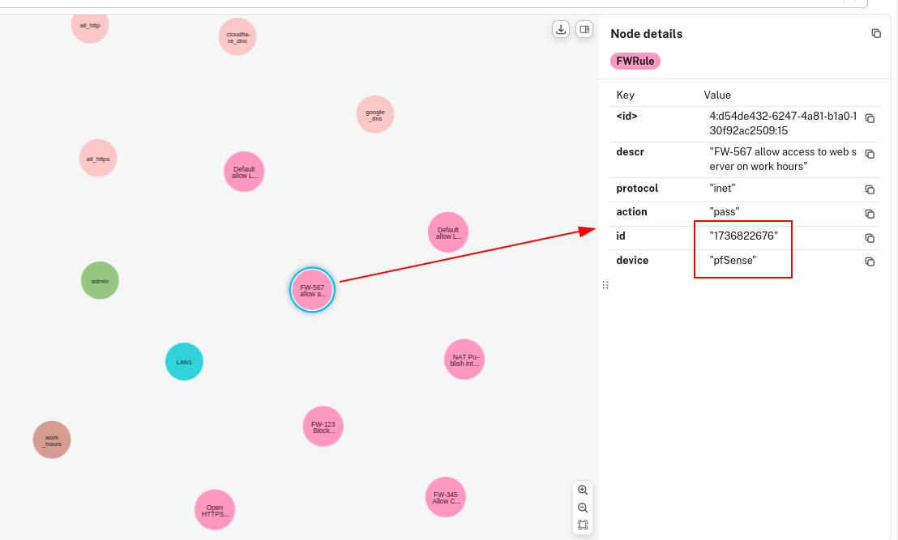

Similarly, an Alias node is found, which should have the same `device` property, `type` set to `host` and a certain `name`. It gets bound to the variable `a`. Since we used `MATCH` here, both must exist beforehand, hence why we have to run the code that creates the entities before we create the links between them.

Then, the `MERGE` statement ensures that there's a relationship (an arrow) with label `USED_ON` and `type` set to `destination` linking the alias and the firewall rule, in that direction (alias USED_ON firewall rule). If it doesn't exist, it gets created. If there is a relationship with the correct label USED_ON but another `type`, it won't considered as a match, and another one will created anyways.

Again, the statement above runs multiple times, one for each case in which a firewall rule uses an alias as its destination. After all those statements run, we'll get some arrows that link some Aliases to some FWRules:

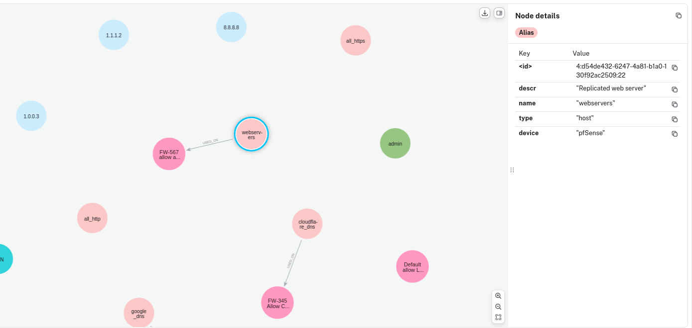

Of course, that's just one kind of relationships. There are many more: aliases can be used as sources too, there are also port aliases that can be used as source and destination ports, rules may not be linked to aliases but to explicit IPs, there are other entities that are also linked to firewall rules (for example, schedules that determine when a rule is active), and other entities are also linked. For example, IP aliases are linked to the actual IPs that they contain, while port aliases are linked to a set of Port nodes. Users are linked to Groups, to represent the group memberships. FWRules are linked to the Interface in which the rule is defined (on pfSense, rules are only applied to incoming traffic on a single interface). And so on.

In fact, once we've stored all the links, the graph looks a lot more interconnected:

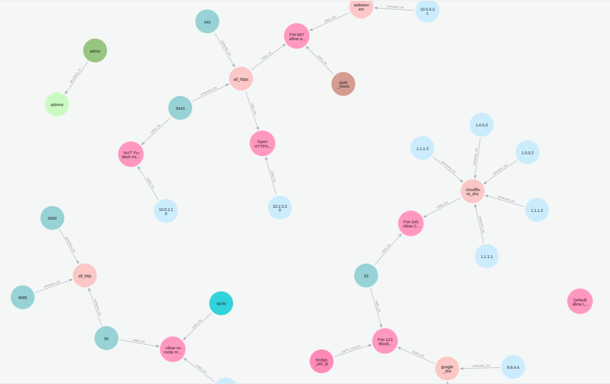

This graph contains all the traditional relationships that you'd expect from a firewall, such as the fact that IPs are linked to the aliases that mention them. For example, below is an Alias that groups the IPs of the Cloudflare DNS server, `1.1.1.1` and other similar IPs. Note how all the IPs (in light blue) are linked via arrows to the Alias node, in peach/light orange:

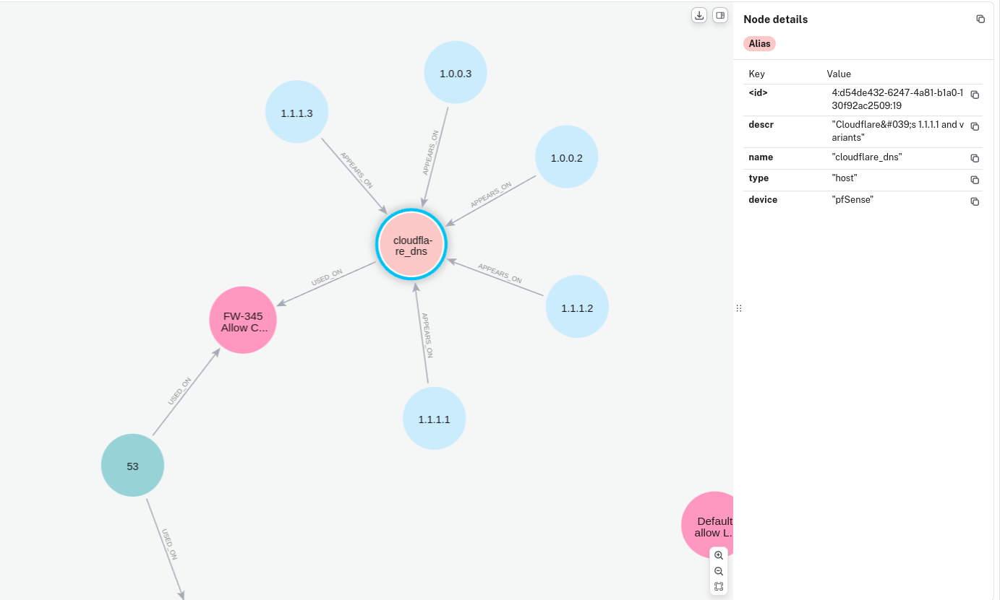

Furthermore, the Alias node is linked to a FWRule node, in red, since that firewall rule mentions the Alias as its destination. The FWRule is also linked to a Port node, in blue-green, because that particular firewall rule has port 53 as its destination port.

In fact, it's even possible for a node to be linked to different kinds of nodes, like below. Here we have the node for Port 80 used in two different contexts: it's linked to the Alias node in peach, `all_http`, since that alias contains ports 80, 8000 and 8080. However, that same Port 80 node is also linked to a FWRule node, in red, because that firewall rule mentions port 80 directly as its destination port. This expresses the fact that the same "port 80" entity may be reasonably used in multiple contexts: it can be part of an alias, or it can be the destination port in a firewall rule.

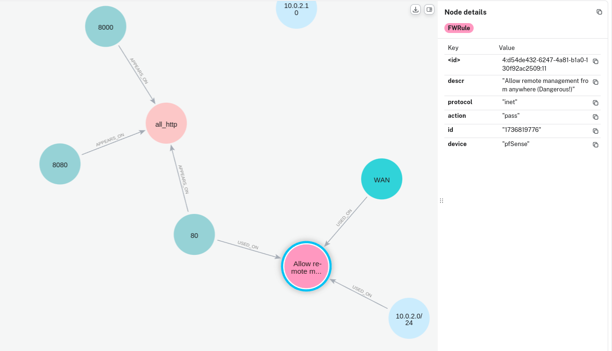

### Querying the graph

With the graph now populated, we can start asking questions, usually using `MATCH` statements, which in SQL would correspond to `SELECT` statements. We'll start simple and work our way upwards, comparing the Cypher queries with similar SQL queries, in order to highlight the differences between the two languages (and data modeling approaches too).

Listing all the policies that allow inbound access (from the Internet to some local service, maybe to the mail servers or web servers) is easy, since those are the policies where the source interface is the WAN interface. We may be interested in this to ensure that no sensitive internal services are exposed to the Internet (say, direct databases, or industrial control systems, or SSH, or such):

```cypher
MATCH p=(i:Interface)-[u:USED_ON {type:"source"}]->(r:FWRule)
WHERE toLower(i.name)="wan" or toLower(i.id)="wan"
RETURN p
```

This finds, as expected, all the firewall rules that are applied to packets that come in via the WAN interface. Notice that in this query we assigned the name `p` (via `MATCH p=...`) to the _entire_ matched path (that is, to the source Interface, the arrow, and the FWRule, all as a single object, not like the names `i`, `u` and `r`, which are assigned to the individual nodes and edges). Since we then `RETURN p`, that is, we return whole paths, then the plot below shows a subset of the graph, not a table with values. It doesn't matter that all the paths below share the same `i` (the source interface), the visualizer just shows it once, because it's the same node (it has the same internal node ID):

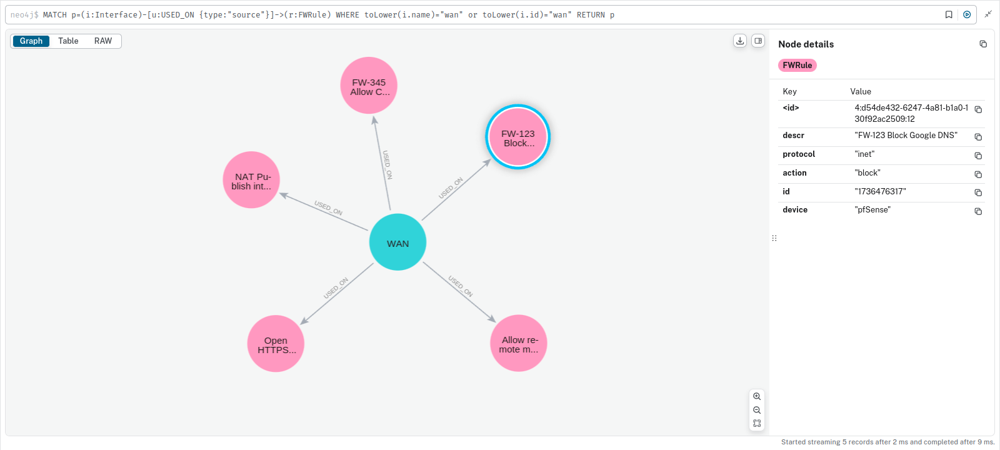

In this query we've used [Cypher's "stdlib"](https://neo4j.com/docs/cypher-manual/current/functions/string/#functions-tolower) to lowercase some strings. This is a somewhat brittle way of identifying WAN interfaces that face the public Internet, but pfSense doesn't seem to provide a way to clearly label interfaces. This is unlike, for example, [Fortigate firewalls](https://www.reddit.com/r/fortinet/comments/1drn4bh/what_do_fortigate_interface_roles_eg_wan_lan_dmz/?rdt=43802), where each interface must be tagged as either WAN (Internet-facing), LAN (internally-facing) or DMZ (in between), and this distinction is enforced and exposed at the API level and can therefore be reliably queried. For the pfSense firewall we rely on the word "wan" appearing on the name or ID of the interface, with some lowercasing to ensure that Wan or WAN are also matched.

If this were SQL, we'd have tables `fw_rules` and `interfaces`, with the `fw_rules.src_intf` column being a `FOREIGN KEY` pointing to `interfaces`, and the query would be something like this:

```sql
SELECT r.*
FROM fw_rules r
	JOIN interfaces i on r.src_intf=i.id
WHERE i.name ILIKE '%wan%' or i.description ILIKE '%wan%'
```

Quite simple, we just need a JOIN because we want information about firewall rules, yet the WAN-ness of the interface is stored in the interfaces table. At this point, SQL and Cypher have comparable complexity.

Next, let's ask for the destination IPs that are exposed via a certain rule (say, that with ID 1736562292), keeping in mind that it's possible for IPs to be listed directly, or also through an alias. You may imagine this as being part of a "trace" function provided by a "network configuration manager" application, where you click on a firewall policy and get information about it, such as which IPs it exposes:

```cypher
MATCH (:FWRule {id:"1736562292"})<-[:USED_ON {type:"destination"}]-(ip:IPAddress)
RETURN ip.addr
UNION
MATCH (:FWRule {id:"1736562292"})<-[:USED_ON {type:"destination"}]-(:Alias)<-[:APPEARS_ON]-(ip:IPAddress)
RETURN ip.addr
```

I'm sure there are more elegant ways of doing this, something like conditionally matching structural patterns. This simply tries both possible patterns all the time (either there's an IPAddress directly connected to the FWRule, in which case that IP was directly specified, or there's an intermediate Alias). We return all the addresses that match either pattern.

If we then run the query against the ID of a FWRule that looks like this (it's connected to an Alias which is in turn connected to five IPAddresses):

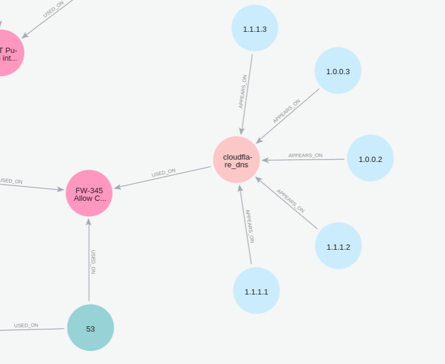

we get a table of results like this:

|ip.addr|
|---|
|"1.0.0.3"|
|"1.1.1.3"|
|"1.0.0.2"|
|"1.1.1.2"|
|"1.1.1.1"|

As expected, this returns the IPs that are on the alias that is configured on the rule, even though the IPs aren't directly linked to the firewall rule.

Of course, now running the query for all rules (so we get all the destination IPs for all the firewall rules) is a simple matter of removing the `id` condition that limits the data to a single FWRule:

```cypher
MATCH (r:FWRule)<-[:USED_ON {type:"destination"}]-(ip:IPAddress)
RETURN r.descr, ip.addr
UNION
MATCH (r:FWRule)<-[:USED_ON {type:"destination"}]-(:Alias)<-[:APPEARS_ON]-(ip:IPAddress)
RETURN r.descr, ip.addr
```

|r.descr|ip.addr|
|---|---|
|"Open HTTPS ports on internal server"|"10.2.3.20"|
|"NAT Publish internal server"|"10.0.2.10"|
|"FW-123 Block Google DNS"|"8.8.4.4"|
|"FW-123 Block Google DNS"|"8.8.8.8"|
|"FW-345 Allow Cloudflare DNS"|"1.0.0.3"|
|"FW-345 Allow Cloudflare DNS"|"1.1.1.3"|
|"FW-345 Allow Cloudflare DNS"|"1.0.0.2"|
|"FW-345 Allow Cloudflare DNS"|"1.1.1.2"|
|"FW-345 Allow Cloudflare DNS"|"1.1.1.1"|
|"FW-567 allow access to web server on work hours"|"10.0.4.22"|
|"FW-567 allow access to web server on work hours"|"10.0.4.21"|

In SQL, doing this can prove to be harder. The main issue is that the relation between FWRules and IPAddresses is polymorphic: there may be directly-linked IPs, or IPs that are linked through Aliases. Furthermore, it's a _polymorphic (partial) many-to-many_[^3] relationship: many-to-many because each IP may be linked to multiple firewall rules, and each firewall rule, if using an Alias, may be linked to many IP addresses. Partial because the other alternative, that of an IP address that is directly connected to the FW rule, isn't many-to-many, but the standard many-to-one that is induced by a foreign key: a FWRule can only have one direct IP address configured, but there's nothing preventing the same IP address from being referred to from multiple rules. Polymorphic because there are two possible ways for an IP to be linked to a FWRule: directly or through an Alias. We'll ignore (for now) the existence of nested aliases, i.e. aliases that contain other aliases. We'll come back to those soon.

A possible way to model this would be as follows, using multiple tables as is Good And Proper And Pleasing To Codd, The Great Normalizer (Foreign Keys Be Upon Him):

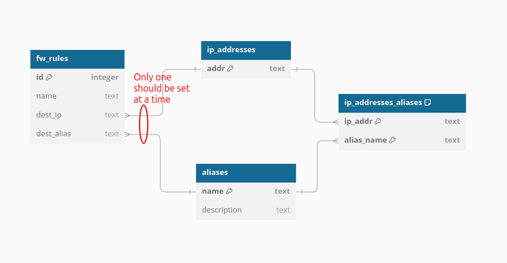

(Although, since the `ip_addresses` table contains just one column for the actual value of the IP, it may be possible to just nuke that table and leave the columns that used to be foreign keys to it as simple text columns).

In any case, the issue with this data model is that, as [discussed above](#relationships-as-structure-vs-relationships-as-data), since on relational databases the relationships are expressed in the table schemas, then the `fw_rules` table _must_ contain both possible relationships, even though logically no single real-world firewall rule can use both at the same time. This is impossible, since the same text field is used in the pfSense UI to enter either the IP or the alias: if you've written an IP there, you can't write an alias, and viceversa! However, this is lost on the database. It may be possible to whip something up using [`CHECK` constraints](https://www.postgresql.org/docs/current/ddl-constraints.html#DDL-CONSTRAINTS-CHECK-CONSTRAINTS) on the table, but the data model will still show both relationships. In a graph database, by contrast, each specific FWRule is its own special little snowflake that may or may not be connected via :USED_ON to an Alias, or to an IPAddress[^4].

Using the data model above, a query that given a FWRule's ID returns all the IPs that link to it may look like the following:

```sql
select * from (
	select fr."name", fr.dest_ip
	from fw_rules fr
	where dest_ip is not null
	union
	select fr2."name", iaa.ip_addr
	from fw_rules fr2
		join aliases a on fr2.dest_alias=a.name
		join ip_addresses_aliases iaa on a.name=iaa.alias_name
	where dest_alias is not null
)
order by 1 asc
```

|name|dest_ip|
|---|---|
|Default allow LAN to any rule|0.0.0.0/0|
|FW-123 Block Google DNS|8.8.4.4|
|FW-123 Block Google DNS|8.8.8.8|
|FW-345 Allow Cloudflare DNS|1.0.0.2|
|FW-345 Allow Cloudflare DNS|1.0.0.3|
|FW-345 Allow Cloudflare DNS|1.1.1.1|
|FW-345 Allow Cloudflare DNS|1.1.1.2|
|FW-345 Allow Cloudflare DNS|1.1.1.3|
|FW-567 allow access to web server on work hours|10.0.4.21|
|FW-567 allow access to web server on work hours|10.0.4.22|
|NAT Publish internal server|10.0.2.10|
|Open HTTPS ports on internal server|10.2.3.20|

We employ the same `UNION` trick to merge the two possible paths, and then return a table with two columns, one for the rule name and another for the IPs that are destinations on each.

Of course, there are multiple possible kinds of "destinations" on firewall rules: firewall rules can have destination ports (both directly specified or a Port alias), destination IP addresses (both directly specified or an IP alias), and even destination interfaces that match whichever IP address a certain interface has. See below; red circles are the policies, and all kinds of destinations (direct IP addresses in light blue, aliases in orange/peach, direct ports in green-ish, and interfaces in cyan) are linked to the policies:

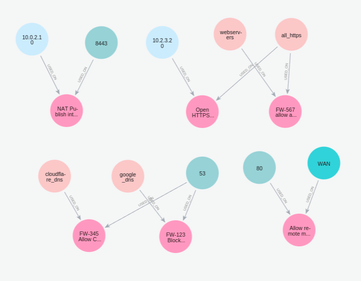

Even more fun, what if pfSense allowed multiple destinations? For example, multiple IPs as destinations, directly in the policy. [That isn't currently supported](https://redmine.pfsense.org/issues/3687), and the official way to do so is to create an alias that provides a single entity to use in the rule. Since aliases can contain other aliases, this doesn't cause any loss of expresivity, it just makes it necessary to create an Alias every time. However, other firewalls (see [here](https://docs.sophos.com/nsg/sophos-firewall/21.0/help/en-us/webhelp/onlinehelp/images/FirewallSecurityRuleAdd.png) for the Sophos firewall, where both the Source and Destination boxes can have several items; and I know that Fortigates also support it) _do_ support multiple sources and destinations, even allowing users to mix direct IP addresses and aliases, which may in turn contain IP addresses or other Aliases, which may in turn contain IP addresses or Aliases, and so on, potentially forever (though hopefully the sequence of Aliases eventually bottoms out on direct IPs...)

In SQL, modeling this (Aliases that can contain other Aliases, and FWRules that can have multiple destinations, even a mix of IP addresses and aliases) suddenly becomes a lot more involved:

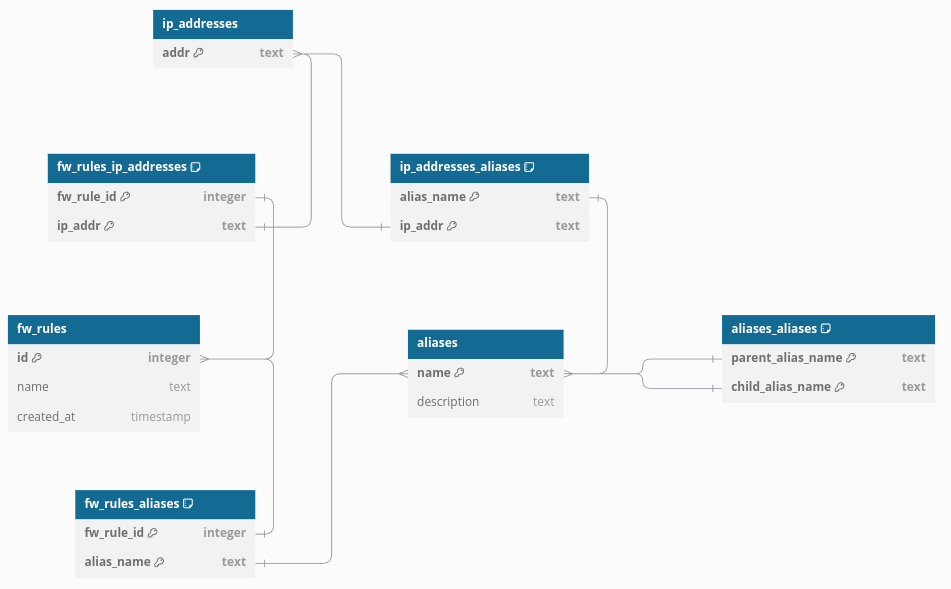

Notice in particular the multiple join tables (they're the tables that have two primary key/bolded columns, which are at the same time foreign keys to other tables' primary keys). These are necessary to allow, for example, aliases and rules to have a many-to-many relationship (that is, an Alias can be referred to by multiple FWRules, and a FWRule can link to multiple Aliases). In fact, now the join tables outnumber the main/important/data tables! And I haven't added the fact that source IPs, source ports _and_ destination ports could also have multiple values (again, not on pfSense, but on other, commercial firewalls it's definitely possible). Each of these would add its own set of foreign keys and sometimes tables too.

Queries also become nastier, with more JOINs and even the odd dreaded [recursive CTE](https://neon.tech/postgresql/postgresql-tutorial/postgresql-recursive-query) to handle aliases-within-aliases, which can nest to however many levels you care to configure. For example, below we have a query that allows us to know all the IPs that are included in each alias, either directly or through another alias. For this query, I configured a hierarchy of aliases for DNS servers: there's an alias for the Cloudflare DNS servers, to reflect the fact that [Cloudflare's 1.1.1.1 service](https://developers.cloudflare.com/1.1.1.1/ip-addresses/) offers several different versions of the DNS resolver. 1.1.1.1 is the normal one, and there's also separate resolvers that block malware (1.1.1.2 and a backup) and malware plus adult content (1.1.1.3 and a backup):

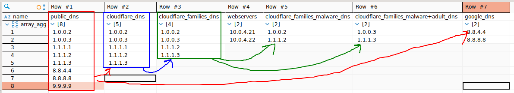

However, to do that was fairly difficult (I'll also conveniently forget to indicate the number of hours that it took me to get to a working query):

```sql
with recursive children as (
	select parent_alias_name as id, child_alias_name as child_id
	from aliases_aliases
	where parent_alias_name is not null
	union
	select children.id, h.child_alias_name
	from children
		join aliases_aliases h on h.parent_alias_name = children.child_id
), ips_per_alias as (
	select aliases.name, iaa.ip_addr
	from aliases
		left join children on aliases.name = children.id
		left join ip_addresses_aliases iaa on children.child_id = iaa.alias_name
	where ip_addr is not null
	union
	select alias_name, ip_addr
	from ip_addresses_aliases
	order by 1, 2
)
select name, array_agg(ip_addr)
from ips_per_alias
group by name
order by cardinality(array_agg(ip_addr)) desc
```

Good luck getting an ORM to generate that query, too. I'd expect that running this kind of query pretty much requires going to raw SQL mode. Note the recursive CTE, the abundant JOINs on seemingly arbitrary fields (like, why do I have to `JOIN ON parent_alias_name = children.child_id` in the CTE? Why not `JOIN ON child_alias_name = children.child_id`? Because it doesn't work if you do, that's why), and the two UNIONs.

By contrast, on a graph database the data model is kept exactly the same under these more complex conditions, the only difference being that now there will be more arrows linking nodes.

For example, previously there was _either_ a :USED_ON arrow with type=destination going from an IPAddress node to a FWRule node, _or_ an arrow with the same characteristics but starting from a Alias node, but never _both_. This modeled the fact that, in the pfSense web console, there is a single text field where you either enter an IP address (actually a network, as it can have a mask) or the name of an alias. If pfSense added FWRules that can have multiple destinations, that's easy: now there can be several :USED_ON arrows with type=destination that end in the same FWRule. If pfSense further added support for a mix of addresses and aliases as destinations, that's still easy: now those arrows can come from both IPAddress and Alias nodes into the same FWRule. If we want to model the fact that pfSense already supports aliases that contain aliases, that's still easy: we can have :APPEARS_ON arrows that go from an Alias node to another Alias node, in the same way that now there are :APPEARS_ON arrows that go from an IPAddress to an Alias.

None of these cases add any substantial complexity to the querying, not even the recursive and potentially infinite query to retrieve the actual IP addresses that are mentioned in aliases-containing-aliases. Contrast with SQL, where even in this perfectly normal and not contrived case (again, this is something that other more expensive FW vendors support, and I have used it. It's quite handy actually to have multiple destinations on a rule and a mix of direct addresses and aliases, even if it encourages people to just chuck a bunch of IPs in the rule and not bother creating an alias, even if said IPs should actually be on an alias) we've already been forced to add multiple intermediate tables, more JOINs, deeper nesting on queries to account for those JOINs, and even a recursive CTE.

By way of illustration, the large SQL query above (the one with the recursive CTE that obtains all the IP addresses that belong to each alias, taking into account nested aliases) would be equivalent to the following Cypher query:

```cypher
MATCH p=(n: Alias {type: "host"})<-[:APPEARS_ON]-{,}(:Alias)<-[:APPEARS_ON]-(i:IPAddress)
RETURN n.name,collect(i.addr) AS ips
ORDER BY size(ips) DESC
```

This query hits the following subset of the graph (note that this _isn't_ the result of the query! It's just a visualization of what the first `MATCH` statement will match):

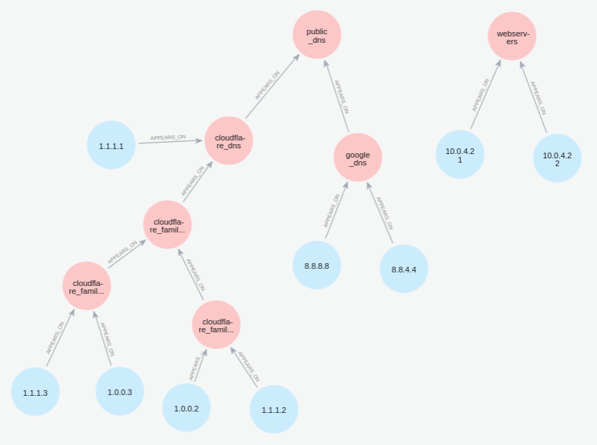

and returns the following results (directly as written above. There's no post-massaging of the data, the table below is _literally_ what the query outputs):

|n.name|collect(i.addr)|
|---|---|
|"public_dns"|["8.8.4.4", "8.8.8.8", "1.1.1.1", "1.0.0.2", "1.1.1.2", "1.0.0.3", "1.1.1.3"]|
|"cloudflare_dns"|["1.1.1.1", "1.0.0.2", "1.1.1.2", "1.0.0.3", "1.1.1.3"]|
|"cloudflare_families_dns"|["1.0.0.2", "1.1.1.2", "1.0.0.3", "1.1.1.3"]|
|"google_dns"|["8.8.4.4", "8.8.8.8"]
|"webservers"|["10.0.4.22", "10.0.4.21"]|
|"cloudflare_families_malware_dns"|["1.0.0.2", "1.1.1.2"]
|"cloudflare_families_malware+adult_dns"|["1.0.0.3", "1.1.1.3"]|

The entirety of the work of traversing the graph is handled in a single `MATCH` statement. It uses Cypher's [quantified relationships](https://neo4j.com/docs/cypher-manual/current/patterns/variable-length-patterns/#quantified-relationships) to express a variable-length pattern. In particular, this one _must_ start on an Alias. Then, there must come any number (between zero and infinite, both inclusive) of :APPEARS_ON links that jump to another Alias. Finally, another :APPEARS_ON link from the last Alias node in that repeated chain must go to an IPAddress node. In this way, the query succintly expresses the notion of "all the IP addresses that are reachable from each Alias, either directly or by traversing a chain of Aliases". See the diagram below:

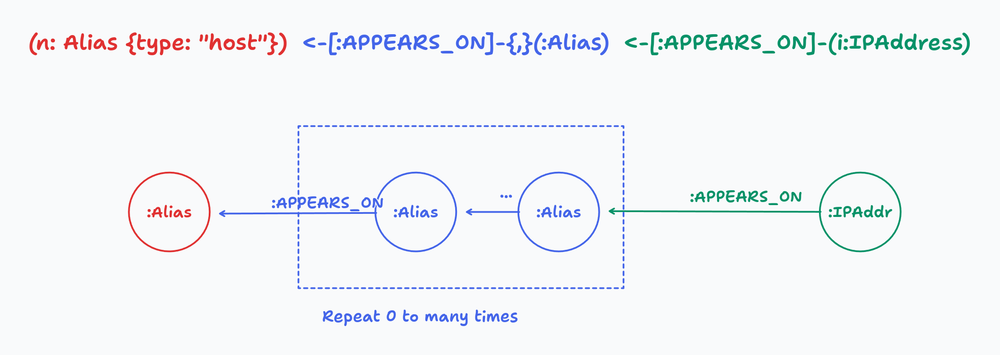

Each of those paths (starting on an Alias, followed by zero or more :APPEARS_ON arrows going to Alias nodes, and finally another :APPEARS_ON arrow going to an IPAddress node) is assigned the name `p`, and for each of those paths, the query returns `n.name` (the name of the Alias node that started the whole path) and `collect(i.addr)` (an array that contains all the `addr` fields of all the IPAddr nodes that finalize paths with that same `n.name`). By using `collect(...)`, this query automatically triggers grouping mode (in this case, it isn't necessary to have a `GROUP BY` statement as in SQL). Any columns that aren't wrapped in aggregation functions (here, `n.name`) are used as group keys. In this sense, `RETURN n.name, collect(i.addr) as ips` in Cypher has the same effect as `SELECT n.name, arrayAgg(i.addr) AS ips FROM ... GROUP BY n.name` would in SQL: the `GROUP BY` columns are included as-is, and any other columns _must_ be wrapped in aggregation functions. In Cypher, it's the reverse: any columns that are wrapped in aggregation functions _aren't_ part of the (invisible) `GROUP BY`, and any other columns are the group key.

Thus, there are values of `p` for each starting Alias and each reachable IPAddress. Using `collect(...)` groups all the paths that started at the same Alias into a single bunch, like a nice bouquet of flowers, and keeps only the IPAddresses that are at the end of all those paths. The result is, as desired, "all the IP addresses that are included in each Alias".

Queries like "which IP addresses are granted access by this specific firewall rule?" (which traverse the graph in the reverse direction to the query above) are essentially the same level of complexity when adding support for nested aliases:

```cypher
MATCH (r:FWRule {descr: "FW-345 Allow Cloudflare DNS"})<-[:USED_ON {type: "destination"}]-()(()<-[:APPEARS_ON]-()){,}(i:IPAddress)
RETURN r.descr, collect(i.addr)
```

|r.descr|collect(i.addr)|
|---|---|
|"FW-345 Allow Cloudflare DNS"|["1.1.1.1", "1.1.1.2", "1.0.0.2", "1.1.1.3", "1.0.0.3"]|

Again, it's the same query pattern. We start at the desired firewall rule, then jump across any :USED_ON arrows of type Destination. This will put us on (maybe) an Alias for the destination IP, (maybe) an Alias for the destination port, and (maybe) an IPAddress. Note that the IP Alias and the direct IPAddress relationships are mutually exclusive (a FWRule can't have both an Alias and a direct IP), but the destination port Alias can coexist with either of those. From there we jump zero to many :APPEARS_ON links, as long as at the end of the chain there is an IPAddress node. This implicitly drops the potential Alias for the destination port, since that Alias will never be the start of a chain that ends in IPAddresses, only in Ports. This also neatly covers the case in which the rule doesn't have an Alias configured but an IPAddress directly, since that simply means that zero jumps across :APPEARS_ON are taken, and the :USED_ON arrow at the start links directly to the IPAddress node at the end.

## Potential strong points of graph databases

* First, the official talking points: "they're good for social networks, recommendations engines, fraud analytics, network configuration databases", yadda, yadda. This is what everyone who talks about graph databases tends to mention as use cases, and also what graph DB vendors mention in their homepages. See [Neo4j](https://neo4j.com/use-cases/), [NebulaGraph](https://docs.nebula-graph.io/3.8.0/1.introduction/1.what-is-nebula-graph/#use_cases), [ArangoDB](https://arangodb.com/the-rise-of-graph/), [Dgraph](https://dgraph.io/#w-node-a2cfc67e-2dc2-a171-a185-38e3f0ef0c9e-3cc10e4c), and [AWS's article](https://aws.amazon.com/nosql/graph/). Note the repeated usecases. What they have in common is that they are pretty much designed to showcase the strengths of a database that has a graph as its native data structure: they're interconnected data models where queries are most commonly on paths of data, rather than on a single point/node/record as may be more common in your standard CRUD web app. For recommendation engines, for example, the main idea is to suggest items that have maximal overlap with other people's choices (i.e. find the people that have the largest overlap with your choices, then traverse back to _their_ other choices and offer them to you). For fraud detection, [here's a neat example](https://neo4j.com/developer-blog/exploring-fraud-detection-neo4j-graph-data-science-part-1/) where the user accounts are grouped into "communities", which are clusters obtained Using Magical Data Science Through Maximization Of A Metric. If a community contains a user that has for sure been flagged as fraudulent (i.e. via a chargeback on a used credit card), and there are other suspicious patterns (for example, the article shows a for-sure-fraud user that shares a credit card with other not-flagged users, and has made a bunch of transactions _towards_ the clean users. This suggests that it's the same actor, funneling the money towards clean users before his original account gets the axe), then more previously-clean accounts can be flagged as suspicious too, merely by their tight relationship to a known-bad node. Again, this is a line of thinking that comes naturally when the data is modeled as a graph, with arrows connecting dots, and when a certain dot is evil it's very natural to think about propagating that evilness to related nodes
* The graph world is the first place where I've found the concept of [Entity Resolution](https://neo4j.com/developer-blog/exploring-supervised-entity-resolution-in-neo4j/) to have a name and be standard fare. Entity Resolution, by the way, is "the process of disambiguating data to determine if multiple records actually represent the same real world entity such as a person, organization, place, or other type of object". In other words, whenever you have multiple systems feeding the same database, providing different "points of view" of the same entities, it's possible for said different points of view to be slightly different. Internal IDs (database IDs, UUIDs, or whatever) will most likely not match, therefore can't be used for pairing. You have to rely on the object's properties (e.g. a user's real name, since even emails may be different across platforms; or the fact that Entity A from System A shares a lot of links with Entity 1 from System B) to deduce that they may refer to the same real-world entity. This may be a suggestion that, when dealing with multi-source views of the same data with disparate identifiers, the graph database world is better equipped to deal with it than relational DBs, where I haven't ever heard of a name given to the issue of multi-source data consolidation, which would indicate that it isn't common, since no one has bothered to name it
* As we've seen before, some queries can be much shorter than SQL, hence easier to write, understand and debug, especially when trying to traverse relationships, materialized in SQL as join tables
* This goes especially for either recursive relationships (consider: folders within folders, comments that are responses to other comments, projects and subprojects, and such), or relationships with an unknown number of links (consider: finding a path between two nodes that may be arbitrarily apart, trying to navigate tree structures up to whatever depth, such as when finding all the files that are in a folder and all its subfolders), where SQL pretty much needs a recursive CTE. I, at least, find those particular CTEs to be quite unintuitive, whereas Cypher happens to express those same queries very succintly
* If your API (say, for a frontend application/SPA, or a mobile application, or for automated systems to use) happens to use [GraphQL](https://graphql.org/) rather than the more common REST style, then saving data as a graph is probably a better fit that should allow an easier mapping between database entities and API entities. For example, Neo4j [provides a JS library](https://neo4j.com/docs/graphql/current/#_how_it_works) that should make it quite easy to implement a JS web server that connects to a Neo4j database and presents a GraphQL API. Dgraph, another graph database, [also embeds a GraphQL API](https://dgraph.io/docs/graphql/) that is automatically generated and can be used to query the data store. Then again, there are also projects that do so for relational databases, such as [Hasura 2.0](https://hasura.io/docs/2.0/schema/postgres/tables/) (warning: licensing unclear), [Postgraphile](https://www.graphile.org/postgraphile/introduction/), [Supabase](https://supabase.com/docs/guides/graphql) and [Directus](https://docs.directus.io/reference/introduction.html#rest-vs-graphql); which can take an existing Postgres database and automatically spin up a GraphQL API that provides access to said database, usually with extension points for custom directives, filters, mutations that don't cleanly map to `INSERT`s, and such
* In general, graph databases are supposed to outperform relational DBs for "join-heavy" queries, whatever that means. Is two JOINs heavy? Is ten JOINs heavy? Are there even any real-world workloads that require ten JOINs? In any case, once sufficient heaviness is achieved, graph DBs are supposed to be better than relational DBs
* As we've seen, "nested" data models, such as the configuration of a cloud computing account, may also benefit from a graph DB where links other than parent-child relationships can be kept explicit. This was the case when modeling a firewall's configuration, or for Cartography, which models entire cloud accounts with all the accompaying resources
* As for not-nested-but-still-heavily-connected data, perhaps things like process planning (say, in production lines, either physical lines churning out physical products or imaginary lines such as processes with dependencies) would also benefit from storage in a graph database, especially if questions are routinely made that treat the stored data as connected points (i.e. "How many production stations in the drilling-and-bolting stage are currently active?" isn't treating the data as a graph, it would be just as easily answered by `SELECT count(*) FROM stations WHERE stage='Drilling&Bolting' AND status='ACTIVE'`, whereas "How many items per hour could be processed starting from Raw Metal 1 and ending at Spoons, assuming infinite supplies of Raw Metal 1?" is, since that is neatly modeled by [the max flow algorithm](https://en.wikipedia.org/wiki/Maximum_flow_problem), which is graph-based in nature)

## Potential weak points of graph databases

* For some reason (perhaps because they're a newer technology born in the era of cloud providers that... ummm... _host_ open source projects, to put it charitably. See the [Redis](https://www.theregister.com/2024/03/22/redis_changes_license/), [Mongo](https://www.mongodb.com/company/newsroom/press-releases/mongodb-issues-new-server-side-public-license-for-mongodb-community-server), [MariaDB](https://mariadb.com/bsl-faq-adopting/), [Elasticsearch](https://www.elastic.co/blog/why-license-change-aws) dramas for background), the graph database ecosystem doesn't seem to have a _de facto_ standard truly-seriously-open-source option. In the relational database world, if worst comes to worst, you can always rely on Postgres (not that Postgres is the worst, far from it. You know what I mean) being there, all open source, no strings attached. Not so for graph DBs. Maybe Apache Tinkerpop, because it's from Apache? But many others, including all the big players, have the proverbial Enterprise version (price: "Contact Us"), which monopolizes some features. For example, in Neo4j, fine-grained authorization (the equivalent to Postgres's [Row Level Security](https://supabase.com/docs/guides/database/postgres/row-level-security)) is gated behind the Enterprise subscription. So is the ability to create more than one database on a single server. So are, I believe, clustering/High Availability options. And so on. Other graph databases have similar tiers. That may not be a deal breaker... or it may. Who knows. Even in the free version, depending on the specific DB engine, you may find that it's specifically not allowed to use it for commercial purposes, or something
* There is data that points to [graph databases having quite poor time complexity for perfectly normal and expected operations](https://cmps-people.ok.ubc.ca/rlawrenc/research/Students/MS_20_Thesis.pdf) (for example, [inserts growing faster than linearly](https://courses.cs.washington.edu/courses/csed516/20au/projects/p06.pdf), which is nasty; or data-on-disk being far larger (like, 10× larger than Postgres)). This may not be an issue if data is small-ish, or it may be very bad. Again, YMMV
* Graph databases don't quite have a standard query language. Some databases provide some dialect of Cypher, and there's already supposed to be an ISO-blessed language, but I'm not sure who implements it, if anyone. To be fair, SQL databases suffer some of the same problem, what with the different SQL dialects and such
* I haven't quite been able to understand where a graph database wants to live in your application stack. Is it supposed to entirely replace the relational database? Or should it live alongside the relational DB, while having changes in the system of record somehow streamed to the graph DB? If so, what about data consistency? This is the model that DBs like Elasticsearch (for searches) or Clickhouse and friends (for analytics) take. Are graph DBs supposed to be the main/only store, or a side store? I haven't been able to clear that up, and I haven't seen that on very big letters on any docs, so you're on your own trying to guess that. On relational DBs, at least we all agree on their position on the stack
* If the graph database is supposed to replace the relational database as the system of record of the application's data, then concerns like transactionality or proper ACID support become important. And non-SQL databases seem to have historical problems with supporting transactionality at the same level as SQL databases (for example, back in 2020 MongoDB ["even at the strongest levels of read and write concern, it failed to preserve snapshot isolation"](https://jepsen.io/analyses/mongodb-4.2.6)). I couldn't find any graph DBs that have undergone [a Jepsen analysis](https://jepsen.io/analyses), apart from Dgraph [in 2018](https://jepsen.io/analyses/dgraph-1-0-2) [and 2020](https://jepsen.io/analyses/dgraph-1.1.1). Jepsen "pushes vendors to make accurate claims and test their software rigorously, helps users choose databases and queues that fit their needs" and is all-around known for discovering the weirdest DB bugs. By contrast, in the relational world, both Postgres and MariaDB have been tested by Jepsen, which gives some assurance that they don't contain terribly catastrophic bugs and you will wake up one day to find all the values in your database set to `null`. Plus relational databases are in general much more widely used, so any such `null`-creating bugs will most likely already have happened to some unfortunate soul in a country far away from you, who will have reported it already, and it will have been fixed by industrious developers before your project is even a scribble in the back side of a printed sheet of paper

## Closing words

Thus concludes our trip through the world of graph databases, which are a category of databases that model data, not as tables with columns like relational databases; not as stores of JSON blobs like document stores; but as nodes with labels and properties, joined (in pairs) by edges/relationships with labels and properties. Graph databases focus on querying data like nodes joined by edges, such as by providing the desired structure for the data ("a User node with an outgoing arrow pointing to a Message node, and return the User's name and the Message's timestamp").

There are some query classes in which storing data as a graph and querying it as such is much easier (to write, and to understand) than storing data as tables in a relational DB. This is especially the case for queries where the number of jumps across nodes is not known in advance, such as when traversing items that are linked to other items that are linked to other items that are linked... One such example may be people who know other people: you could in principle keep jumping across Persons, following "A knows B" links, forever. SQL's statements don't quite like to work with that (there are, for example, recursive CTEs in Postgres, but they aren't exactly intuitive nor easy to debug). Graph databases, by contrast, tend to allow such queries in a very compact syntax, such as "start at node A, then follow however many links of type X, as long as the final node is of type B". The DB will then take care of the traversal and applying optimizations as available.

As examples of the application of graph databases, in this post we reviewed Cartography, a project to gather information about cloud accounts and their associated resources (e.g. VMs, load balancers, storage volumes), from multiple sources, and then query across all that data. We also used Neo4j to store graph-shaped information about a pfSense router+firewall's configuration, we wrote some queries to extract information about that configuration, and contrasted those queries with similar queries in SQL, in order to see cases in which graph query languages (such as Neo4j's Cypher) can express complex conditions in a very succint manner.

[^1]: Though you'll probably want at least multiple network ports, if you want to do a router that... well, _routes_ across networks[^2]
[^2]: Though [VLANs](https://www.practicalnetworking.net/stand-alone/vlans/) exist, so you may be able to use a single cable to do the thing. I wouldn't know, my only networking class at university was "Introduction to Data Networks" or something of the kind, and the most advanced thing that we did was the OSI model, I believe
[^3]: Not an official name. I just made it up. Sounds like a real category, though, doesn't it? Kind of like [Strong Session Snapshot Isolation](https://www.vldb.org/conf/2006/p715-daudjee.pdf)
[^4]: Although graph DBs sort of circumvent the problem of data schemas not being able to express some constraints (here, that no record can have both foreign keys set at the same time)... by doing away with a data schema at all! We'll pretend we didn't notice that.
