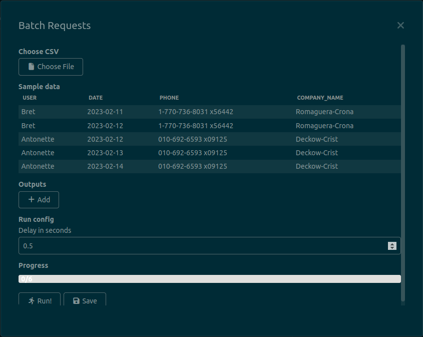

Hello! This is a quick post to announce that a new version of my [Insomnia plugin that sends repeated requests](https://github.com/jreyesr/insomnia-plugin-batch-requests) has been released: `v1.1.0` is now [available for download](https://github.com/jreyesr/insomnia-plugin-batch-requests/releases/tag/v1.1.0). It adds a way to control the delay between requests, to prevent rate-limited or slow APIs from getting nervous.

<!--more-->

## What's Changed

- Add config for delay between requests
  
  There's now a new configuration field that lets you set a delay, in 0.1 second increments. It defaults to 0, for as-fast-as-possible requests.

Many thanks to Jason Young ([@dotJson](https://github.com/dotJson) on Github) for taking the time to use the plugin and request the new feature!

Also, `v1.2.0` is being worked on.
