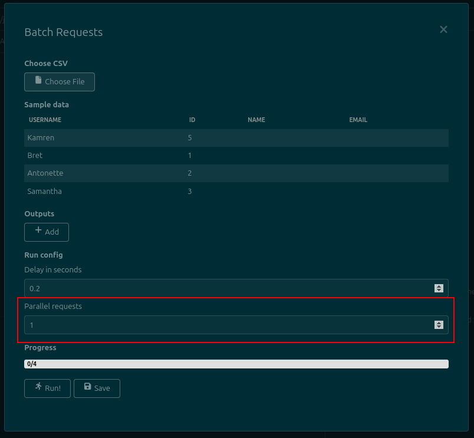

Hello! This is a quick post to announce that a new version of my [Insomnia plugin that sends repeated requests](https://github.com/jreyesr/insomnia-plugin-batch-requests) has been released: `v1.3.0` is now [available for download](https://github.com/jreyesr/insomnia-plugin-batch-requests/releases/tag/v1.3.0). It adds a way to send requests in parallel, useful to speed up large batches of requests as long as the remote API can handle it.

<!--more-->

## What's Changed

- Add option to send (up to) a certain number of batch requests in parallel
  

See two videos for a comparison: [only one request at a time](./images/1way.mp4) and [two requests at once](./images/2way.mp4). Notice how, on the parallel request video, the progress bar advances in jumps of 2 and data is also filled two-at-a-time on the Name column. 
