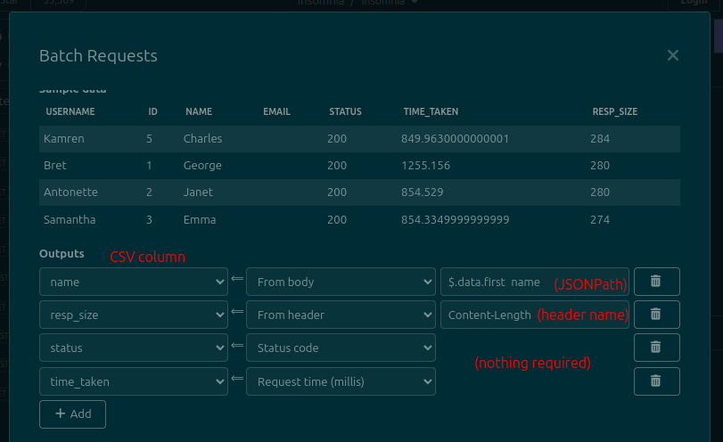

Hello! This is a quick post to announce that a new version of my [Insomnia plugin that sends repeated requests](https://github.com/jreyesr/insomnia-plugin-batch-requests) has been released: `v1.4.0` is now [available for download](https://github.com/jreyesr/insomnia-plugin-batch-requests/releases/tag/v1.4.0). This version adds the ability for users to extract output data (the fields that will be written _back_ to the CSV file) from the response headers, status code, and request elapsed time, in addition to the response body.

<!--more-->

## What's Changed

- Add a way to extract data that will be written back to the CSV from additional data sources: response headers, status code, and request elapsed time.
  

This version adds another dropdown to the Outputs section. Previously, each Output had just two fields: a dropdown to select which CSV column the data would be written to, and a text field that received a JSONPath expression, such as `$.data.id`, which was evaluated against the response body, which had to be a JSON document.

However, some users of the plugin (see [#3](https://github.com/jreyesr/insomnia-plugin-batch-requests/discussions/3#discussion-4980083) and [#12](https://github.com/jreyesr/insomnia-plugin-batch-requests/issues/12#issue-2307848829)) wanted to have a way to extract data from other places, such as the response's status code. This wasn't possible before, because all JSONPath expressions are scoped to the response body (i.e., `$` is the entire response body, and there's no way to refer to things outside of that body). Thus, we added a new dropdown in the middle.

Its default value is "From body", which works as before: the right-hand text field is a JSONPath expression and is evaluated against the response body. However, there are three other options:

- "From header" reads a response header. The right-hand text field is no longer a JSONPath expression, but just a header name
- "Status code" returns the numerical status code. It has no text field, because the status code is a singular number that needs no further configuration
- "Request time" returns the time taken by the entire request-response cycle, in milliseconds. It has no text field, for the same reason

You can install the plugin [from the Insomnia Plugin Hub](https://insomnia.rest/plugins/insomnia-plugin-batch-requests), or [manually on Insomnia](https://docs.insomnia.rest/insomnia/introduction-to-plugins#add-a-plugin). The plugin name is `insomnia-plugin-batch-requests`. If you have it installed, you should be able to update it too.
