Hello again! I've been out of social life for a few months. As I've (re)discovered, it appears that in-office work is _just perfect_ for draining all kinds of time and energy, thereby reducing the amount of resources that can be allocated to blogging to very close to zero[^7]. I also got tangled with multiple personal projects, namely: 

* Helping some friends set up a bunch of [Google Apps Script](https://developers.google.com/apps-script)s that allowed them to administer some sort of psychological survey to 500 people, across two countries, from about twelve different sources, with over 30 different surveys _per person_ over the course of two weeks, and with close to zero additional work per person because all the initial and final interactions were almost entirely automatic
* Cobbling together, from whatever was lying around, everything necessary to keep warm three hundred of the _tiniest fluffiest cutest chickens_ I've ever seen in a coop, complete with 1.5kW electric heater under computer control, ambient temperature sensing, logging of all said data to the cloud, nice Grafana dashboards, and remote control of the system if desired. We ran out of time and resources to add external (out-of-coop) temperature monitoring, using some sort of PID loop rather than bang-bang control for the heater (for the utmost in chicken comfort!), correlating measured temperatures to weather forecasts so appropriate insulation measures can be taken if necessary, speakers to wake up the chickens every morning with the national anthem or other appropriate avian wake-up sounds, 3D temperature tracking (across the whole volume of the coop) by stringing multiple temperature sensors hanging from a cable at each point in a grid like hydrophones, adding a huge dial in the style of [aneroid barometers](https://en.wikipedia.org/wiki/Barometer#Aneroid_barometers) that displays the current temperature like an analog wall clock so everyone entering the coop can see it, and using computer vision to track the activity of the chickens and detect huddling, which usually indicates they're cold. Not that we could do anything about it, since the heater already completely loads the 15 amp circuit that is available in the coop
* Setting up a system to regularly pull information about concerts happening in a couple of theaters in my city, namely the still available seats, so we can track if there are seats left, which events are more popular, which seats fill first and other such seating patterns, who no one ever asked for
* Learning [Minizinc](https://www.minizinc.org/) ([here's Ken Shirrif](https://www.righto.com/2025/10/solve-nyt-pips-with-constraints.html) using it to solve the NYT's [Pips puzzle](https://www.nytimes.com/games/pips)) and using it to find the optimal set of university courses that a student should take, subject to the ones that can actually be taken, avoiding schedule collisions, and optionally avoiding or forcing some teachers or subjects, while at the same time minimizing the amount of time spent on campus (intuitively, "packing in" the classes as tightly as possible so there's as little downtime as possible, so you can just go in, have classes, and go back home)
* And probably more things I forget now

Some of those (particularly the Minizinc part, and maybe the chicken coop thing, just because I want to post a couple of pictures of the chickens) may eventually become posts here, but as previously discussed[^7a] that may take arbitrarily long.

---

After that part, here begins today's post.

## Today's post

Below is a staircase, AKA step function, which increases at very few points and stays constant otherwise:



> To give some context: that's the interest rates that the bank that I conduct most of my business with will pay, if you invest the amount of money in the X axis (which is logarithmic by the way) on a fixed-term investment plan of 361 days, as measured at some point on 2025-11. The annual interest rate, as a percentage, is on the Y axis. 
> 
> The motivation for this post is that, no more than two or three years ago, they were paying interest rates over 8% for similar amounts of money, whereas now you can hardly get 5%. I believe that's somehow connected to _something something macroeconomic indicators_, such that (ironically) when Ecuador is doing badly internationally (e.g. when the [country risk](https://en.wikipedia.org/wiki/Country_risk), typically expressed as the EMBI, is higher, usually associated with things like government changes, loss of oil/petroleum production, insecurity, pandemics, internal _spirited sociopolitical debate_ and such), then banks have issues finding cash elsewhere for doing bank stuff. So they raise interest rates on fixed-term investments to entice people to lock their money away for comparatively long periods of time, during which they can do bank stuff with that money. By contrast, when Ecuador is doing well (by that same measure) and investors see it as stable (e.g. politically) or otherwise doing things that make investors happy, then banks can more easily get cash elsewhere and have no need to convince us to give them money, so [passive interest rates](https://countryeconomy.com/dictionary/passive-interest-rate) go down because why wouldn't they.
>
> In any case, that means that where two or three years ago I could get over 8% per year on my money, now I'm lucky to get 5% or so. And, you know, getting \\$29.87 instead of \\$30.54 each year sucks[^2]! So I finally decided to track them rates, see how frequently they change and how. 
> 
> Thus concludes the sidebar.

The problem is that initially you don't know the shape of that function (where in X the steps are, and the Y levels between steps). All you can do is query/evaluate/sample the function _at particular X values_ (that is, the very thing that you can do with a function).

What is an optimal way to choose points to sample the function at, such that we can find out its entire shape in the minimum number of samples? Each sampling operation would theoretically only give us a single point on that dotted gray line, so at first glance it'd appear that we need as many samples as numbers in the X axis (the line function above covers the range between \\$100 and \\$1M, and if we restrict ourselves to whole dollar values that'd be 999,900 values to sample). You could visualize that as (very slowly) drawing the staircase from left to right, by querying its value at 1, 2, 3, 4, 5, ..., 999998, 999999 and finally 1000000.

Clearly, there must be an easier, more efficient way. For example, on the chart above you can see that after X=100K there are no more steps. It's just a flat line all the way to X=1M. An arbitrary function could change in any way inside that range, but this is a staircase function, which can only ever increase or stay constant. Since it has the same Y value at X=100K and X=1M, then Y must be constant in all that interval, because if it ever went up then it wouldn't be able to come back down again. So, if we somehow managed to guess the two values 100K and 1M and sample both of them, we'd instantly know all the intermediate 900K values and we'd no longer need to sample all (indeed, any) of them.

Of course, we can't just magically choose X=100K as a sample point, since at the start we know nothing about the function. This article describes a way to blindly, yet somewhat optimally, choosing points that can give us that kind of information (X=A has a value, X=B has the same value, so the whole range X=A-B must have that same value). This would be like if, instead of drawing the staircase by tiny points from left to right, we instead expressed it by horizontal lines (e.g. there's a line between 100K and 1M, at the Y=5.4 level).

## Prior art

(which won't be used ever again after this section is done. It's a decoy section for confusing my enemies[^5])

There's probably multiple "academic" libraries that deal with optimal sampling of unknown functions. One of them, which is interesting because it's not just "that Python library that a group of researchers published as supporting material for their paper" is [Facebook's Ax](https://ax.dev/) (so named not for the tree-felling implement, but for the words "Adaptive eXperimentation"). It [does have a paper](https://openreview.net/forum?id=U1f6wHtG1g#discussion), and they don't shy away from very paper-y language. Observe:

> Because the objective function is a black-box process, we treat it as a random function and place a prior over it. This prior captures beliefs about the objective, and it is updated as data is observed to form the posterior.
>
> This is typically done using a Gaussian process (GP), a probabilistic model that defines a probability distribution over possible functions that fit a set of points. Importantly for Bayesian Optimization, GPs can be used to map points in input space (the parameters we wish to tune) to distributions in output space (the objectives we wish to optimize).
>
> In the one-dimensional example below, a surrogate model is fit to five noisy observations using a GP to predict the objective, depicted by the solid line, and uncertainty estimates, illustrated by the width of the shaded bands. This objective is predicted for the entire range of possible parameter values, corresponding to the full x-axis. Importantly, the model is able to predict the outcome and quantify the uncertainty of configurations that have not yet been tested. Intuitively, the uncertainty bands are tight in regions that are well-explored and become wider as we move away from them.
>
> Expected Improvement is a popular acquisition function owing to well balanced exploitation vs exploration, a straighforward analytic form, and overall good practical performance. As the name suggests, it rewards evaluation of the objective $f$ based on the expected improvement relative to the current best. If $f^∗ = \mathrm{max}_i y_i$ is the current best observed outcome and our goal is to maximize $f$, then EI is defined as the following:
>
> $$ EI(x) = \mathbb{E}\left[\mathrm{max} \left(f(x)-f^*, 0\right) \right]$$
> 
> A visualization of the expected improvement based on the surrogate model predictions is shown below, where the next suggestion is where the expected improvement is at its maximum.
> 
>
> _— Signed: Not a paper, but it reads like one: <https://ax.dev/docs/intro-to-bo>_

You can observe the academic-ish roots of this paper by the casual throwing around of Gaussian processes, priors, posteriors, and the expected value of the substraction of a function and a maximum.

Ax intends to be used for 

> Complex optimization problems where we wish to tune multiple parameters to improve metric performance, but the inter-parameter interactions are not fully understood, are common across various fields including machine learning, robotics, materials science, and chemistry. This category of problem is known as "black-box" optimization. The complexity of black-box optimization problems further increases if evaluations are expensive to conduct, time-consuming, or noisy.
>
> We can use Ax to efficiently conduct an experiment in which we "ask" for candidate points to evaluate, "tell" Ax the results, and repeat.

The workflow of Ax, thus, is to:

1) Inform it of what "parameters" it's allowed to tweak. If searching for a new material or recipe, these may be the amounts of each of five or six ingredients, or times or temperatures that the mix may spend cooking, mixing and cooling for. Each parameter has a range of allowed values, which may be a normal range from X to Y for numbers, or a list of allowed values, or a boolean (such as whether to perform or skip a step)
2) Define an "objective" metric, the thing to optimize for (either maximize or minimize). It's possible to set multiple metrics here, though in that case the optimization is more complex (because it's perfectly possible to find a combination of parameters that enhances one of the metrics while worsening others, so it isn't a clear "improvement"). Additionally, numerical parameters can have linear constraints applied on them (i.e. things of the form $N_1x_1 \pm N_2x_2 \pm ... \geq N$ where all $N$s are fixed numbers and the $x$ are the tweakable variables, i.e. weighted sums of variables, but not $x_1\times x_2$ or other operations that aren't weighted sums)
3) Start the optimization loop. Unlike numerical optimization libraries, where the thing to optimize is usually a function in the same programming language, or something that can otherwise be automatically computed, Ax is specifically aimed at optimizing things that go out of the machine and into the real world. In other words, it's perfectly normal to have to pause the program here, have a person go somewhere and do things a certain way (e.g. prepare a new batch of the material with the parameters that Ax has output), then wait for however long it may take for that experiment (or batch therof; Ax can output multiple candidate points at once precisely because real-world experiments may have a latency measured in days or weeks rather than the microseconds that a function evaluation may take), then measure the objective metric(s) on said experiment(s) (e.g. measure the thermal conductivity of the material that was just prepared according to the instructions), and finally come back to Ax and feed that information back
4) Repeat the optimization loop (get new instructions, run the experiment, measure the metrics, report back) until Ax is satisfied or the maximum amount of experiments is reached, whichever happens first
5) At the end, Ax outputs the combination of parameters that, as far as has been explored, optimizes the metric(s)

In this sense, Ax works by dropping points on a N-dimensional space (with the number of dimensions depending on the number of tweakable parameters), measuring the function's value at those points (or, rather, _receiving the measurement_ of the function's value, as many times the function will be a noisy real-world process that just can't be packaged in a Python function, but instead run by someone and reported back to the system), and then using all the information acquired until now to determine where to search next. This can help greatly reduce the number of points that must be measured in order to confidently find the function's optimal value. Without some kind of Adaptive experimentation (so called because it adapts to the values as they become known), the alternative would be either to sample blindly (e.g. by dropping entirely random points on the N-dimensional space and hoping to find the optimal value, which becomes [more and more unlikely](https://en.wikipedia.org/wiki/Curse_of_dimensionality) as the number of dimensions increases, and also wastes resources when a random point, in exercise of its fundamental right to be random, happens to randomly fall near another one that has already been sampled) or sample regularly (by sampling at a N-dimensional grid of regularly-spaced points, which becomes more and more expensive as the number of dimensions grows, or more precision is desired hence the grid becomes denser, or the domain of possible values expands hence the grid becomes larger).

Unlike these simpler methods, Ax starts in kinda-random mode (Sobol, actually, which is [a family of sequences](https://en.wikipedia.org/wiki/Sobol_sequence) that are somewhat random, yet cover an interval in a uniform-ish manner, whereas purely random sampling, being random sampling, is liable to leave arbitrarily large uncovered gaps). This is the stage at which Ax does some quick "blind" exploration of the function parameter space, which gives a starting point.

Once enough data has been collected, Ax transitions to choosing the next samples via some sort of Bayesian criteria, the name coming from Bayes, known for the Bayes theorem, which states the formula for the probability of A being true, _given that we know_ B to be true (which may alter the former, if A and B are somehow related, or it may not if A and B are completely independent). In particular, the bayesian criteria here is, _given the samples that have already been taken_, what is the most likely value for the (unknown) function at all points $x$? This makes assumptions about the shape of the underlying function that is being sampled, of course (since if it were known there would be no need for Ax). Furthermore, this should output not just a value for each $x$, but also an "uncertainty" (which roughly maps to the "spread" of values that may happen at that point), which should be low near points that are already known/sampled and grow as we get farther from the known areas. Then, the next point to sample becomes that one with the highest possible value (roughly, the point which, according to said Bayesian-imagined function, may have the largest value over the highest one that is currently known for certain). That point is sampled, it returns a value, that value is used to re-imagine the Bayesian function (which is conditional on the currently-known points, and since those have now changed by receiving a new member, the Bayesian function must be recomputed too), and the whole thing repeats again. Eventually, all possible places where the "highest value" could hide are explored and the highest value (or a close relative thereof) is found.

Below is an image carousel showing the process (click on the arrows to the left and right to see other steps). At the top is the real (unknown) function (line with very light gray dots), the samples that have been taken of that funcion (as black dots, complete with error bars because real-world experiments always drag in some uncertainty of their own), the Bayesian-imagined function (as a solid blue line) and its uncertainty/spread (in light blue, as an area). The tiny grey star is the function's true maximum, the thing that is being searched for.

The black line below is the "expected improvement", which indicates the best possible increase over the currently-known maximum that is likely to happen if we sample at that point. Notice how the spread starts very wide (the blue area is wide), and how it tightens up around the black points that have been sampled for real (because we know the actual value of the actual funcion at those points, so there's no room for imagining values there, whereas if there's a large span where no samples have been taken, the uncertainty spreads out to denote the fact that this region is far away from any known values, and so whatever prediction is made of those regions must be taken with a larger grain of salt)


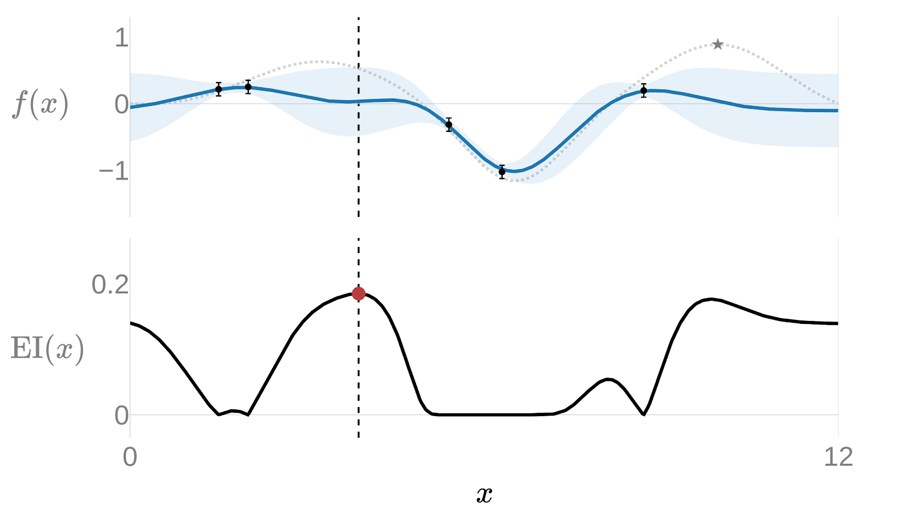
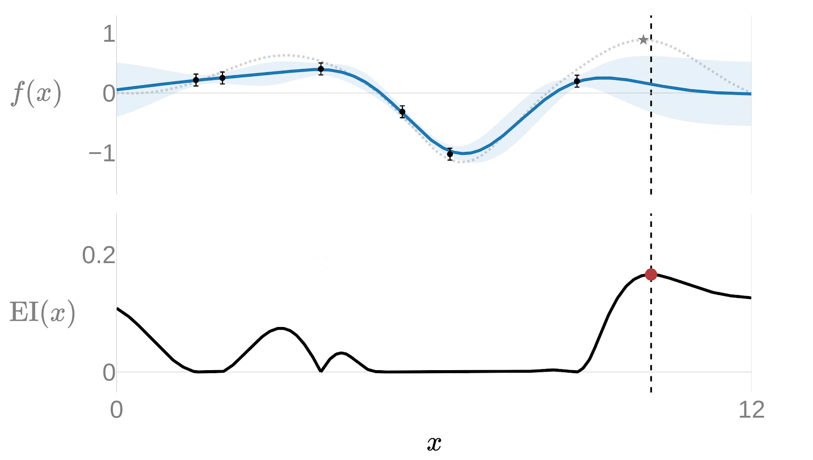
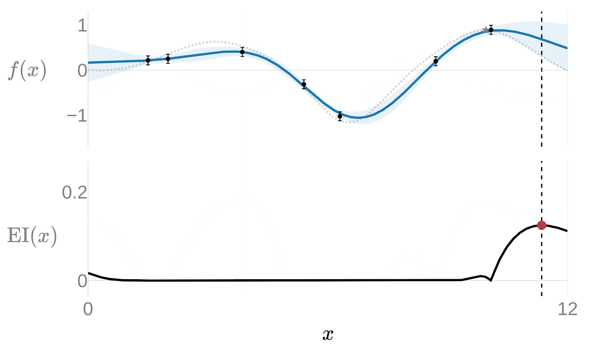
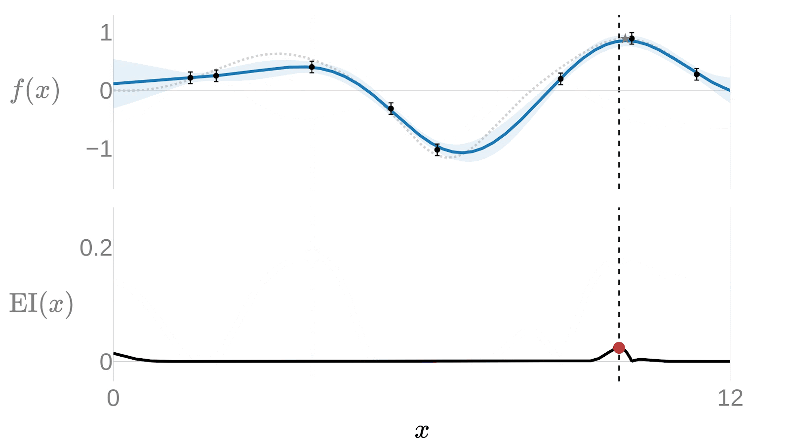
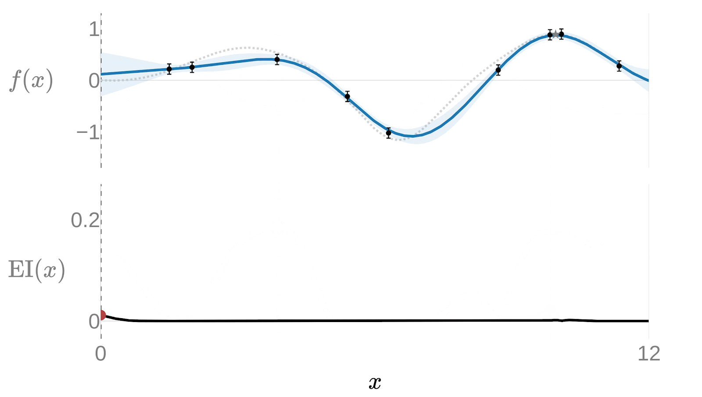



In the end, the whole function space has been explored to the satisfaction of the Bayesian model (as denoted by the fact that the blue uncertainty region has all but disappeared, which indicates that this model is essentially sure of its predictions everywhere). Once this blue function is well-known, the optimal value can be found easily, and as long as the real-world function that underlies the measurements can be approximated as the Bayesian surrogate model, then whichever maximum has been predicted should closely map reality.

As a concept, Ax is really cool, and I'd really like to find somewhere to use it. However, as far as I can see (as a complete non-user of Ax), it's not a good fit for the problem of extracting bank interest rates via repeated sampling. It's a similar setup (there's a couple of tweakable parameters, here the number of days and the capital), the underlying function isn't known, and we want to sample efficiently (here not because it's too slow, as it can be done fully automatically in a couple of minutes, but because it's polite to the bank and also more interesting this way, plus sampling blindly would indeed be too slow). We don't, unlike Ax's main objective, need to find the function's maximum (I can tell you right now that the maximum interest rate is found when investing as much money as you possibly can over the maximum amount of time that the bank will take it), we're just interested in fully mapping the parameter space. And, unlike in Ax, a Gaussian process isn't a good surrogate model for the actual function. We know the family of function that we're sampling (it's a stepwise function), and modeling it as a Gaussian process would simply throw away that valuable piece of information and maybe (just maybe) eventually capture it via pure brute force (in much the same way that using a neural network as a universal function approximator[^6] may eventually approximate every function, even stupidly simple ones that can be expressed just fine with an equation)

## (Somewhat) formal formulation, and The Algorithm

With that detour out of the way (and our enemies thoroughly confused), let's come back to the plan for sampling a bank's entire interest table.

Interest rates are, to be precise, a 2D ($f: \mathbb{N}^2 \mapsto \mathbb{R}$) function $\mathrm{interest\_rate} = f(\mathrm{capital}, \mathrm{time})$. Actually, a stepwise monotonically increasing 2D function (even though "monotonically increasing" isn't as well defined in 2D as it is in 1D, because there's no single "increasing" direction, in much the same way that the greater-than and less-than operators don't work for pairs of $(x, y)$ points in 2D, as they do for plain numbers in 1D). This is because (hopefully!) interest rates never go down as you lock more money into a deposit, because then why would you give them more money for less interest. You may as well start two separate deposits and get the higher interest rate in both. Similarly, hopefully interest rates don't go down for longer deposits, because then why would you lock away your money for more time if you get less interest out of it. 

Here, I'm interested in automatically extracting all the data that can be obtained about said interest rates, for a particular bank. Initially we'll proceed assuming a 1D function, by fixing the number of days to 361 (in the particular ~~victim~~ bank under experimentation, you're allowed to make a fixed-term deposit for anything between 31 and 720 days, and I've always seen the range from 361 to 720 days offering the highest interest rates, so 361 is a good choice for the best case), so now it's just a function $\mathrm{interest\_rate} = f'(\mathrm{capital}) = f(\mathrm{capital}, 361)$. Turns out that extending what we'll see below to two independent dimensions isn't trivial at all, and it's also more complicated to visualize because we can't have a normal XY plot, we'd need a 3D plot or to use color or something else. So for now we'll casually ignore the existence of a second dimension.

Of course, we could just go the very rude, loud, primitive and brute-force way, and just ask for the interest rates at each possible capital value. My bank only allows fixed-term investments starting at \\$100, so that'd be the starting point, and we could then go all the way up to, say, \\$1M[^1]. That'd be 999,900 API calls, and something tells me the bank may not take kindly to that. And it'd take a while, and it isn't elegant, and there's no blog post in that. And it's boring. Plus, those 999,900 API calls are just for a single value of the duration. There's 720-30=690 possible durations (plus one, actually, because off-by-one is a thing), and the caveman way would be to repeat the 999,900 calls for each one ([cartesian products](https://www.ucl.ac.uk/~ucahmto/0005_2021/Ch2.S5.html)! Combinatorial explosions! Yay!), for a very reasonable total of 690,930,900 calls. At a call every 10ms, that'd take almost eighty days, in which time the bank could easily have changed interest rates around a couple of times. Clearly, a smarter way is required.

Another method, and the one that I started with, is to just sample at a coarser interval (not every day and for every possible dollar, but just, say, every \\$1000 and every 30 days). That'd be a "grid" of samples taken across the whole space, and if you need the scan to take less time or can tolerate less samples taken, you just coarsen the grid. This works, to a degree, but a) you still risk losing some data, especially at the lower ends, for example I now know that there's a breakpoint at \\$2500, which sampling every \\$1000 would miss, because we'd just have datapoints for \\$2K and \\$3K, b) it will definitely waste some samples, e.g. the interest rates don't change at all between \\$100K and \\$1M for any fixed duration, and sampling every \\$1000 would thus just waste 900 samples in that region, but we can't know that beforehand, that's the fun part, and c) it's still boring.

For example, here's the current interest rates, sampled on a grid every 90 days and \\$3K. Days are on the X axis (note that they don't start at zero) and the amount of invested money on the Y axis, going up to \\$30K. The plot is interactive, by the way, so feel free to hover the mouse over it to see the interest at a certain $(days, capital)$ point:



Interest rates go from 4.85% per year, in black, at the lower left corner to 5.50% per year, in red, at the upper right corner. Different colors indicate the progression. It goes much as you'd expect, increasing as you go up (more money locked in) and to the right (for a larger duration). But there's still that nagging feeling of missing data, as we just don't know what is going on between those sampled points.

Knowing that it's a stepwise and monotonic function, however, allows us to perform some simplifications without losing any data. For example, as hinted at the start, should we for any reason happen to sample two points and find that they have the same output value, like this (this is in 1D. The 2D equivalent would be a rectangle where the four corners have the same value, but that is much more difficult to sketch):

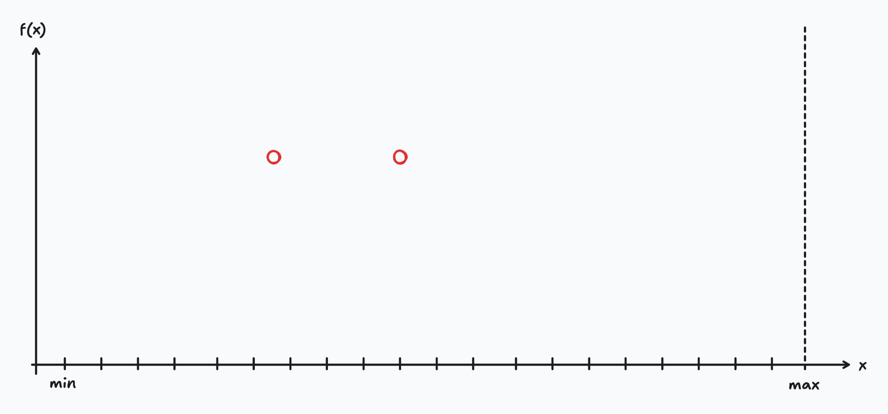

then we can be sure that said two points must be joined by a straight, horizontal line (i.e. between those two points the function is constant), because that's just the only way that a stepwise increasing function can fit those two observations:

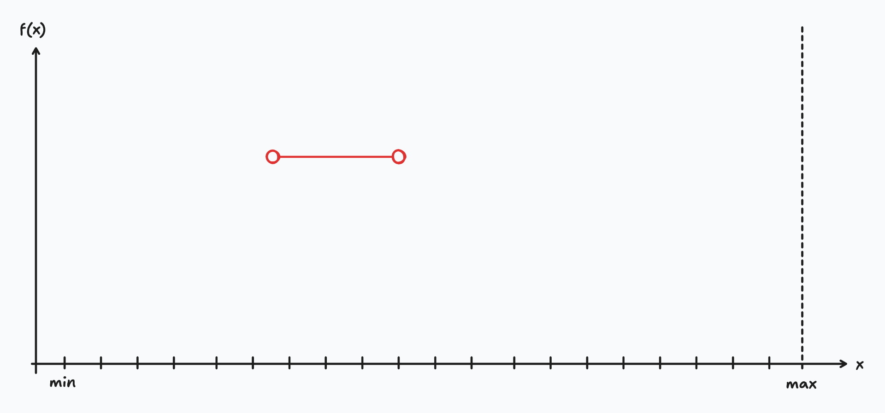

(Of course, whatever happens outside of that range is anyone's guess, as far as those two points are concerned). If two samples do _not_ have the same value, then anything could happen between them, and those two points don't give enough information to place the step between them. We know that there must be a step _somewhere_, or possibly several, but that's it:

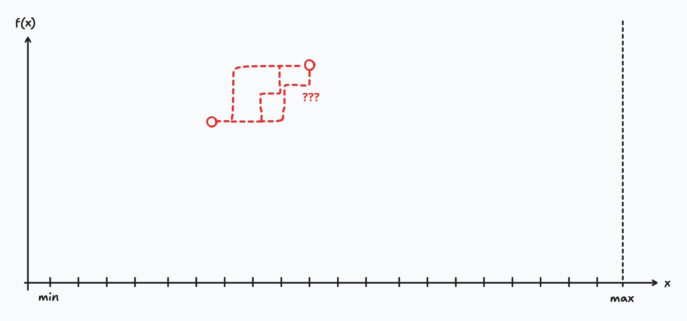

Of course, if we find this situation, the logical next step is to cleave that interval in twain, whereupon there must be a step somewhere inside (or possibly several!), and then repeat the whole thing. Each of those two subintervals will either have the same value at its start and end (in which case we can declare it's constant) or not (in which case we just repeat the cleaving-in-twaineth until 10,000 kilometers or morale improves, whichever comes first).

Students, former or present, of Computer Sciences may recognize something like binary sorting or the merge part of mergesort here, in the repeated splitting until each piece becomes trivial to solve (here, until everything is a constant), and then all those trivial pieces are trivially merged back into a non-trivial solution.

We start out with just two data points, our start and end points (\\$100 and \\$1M):

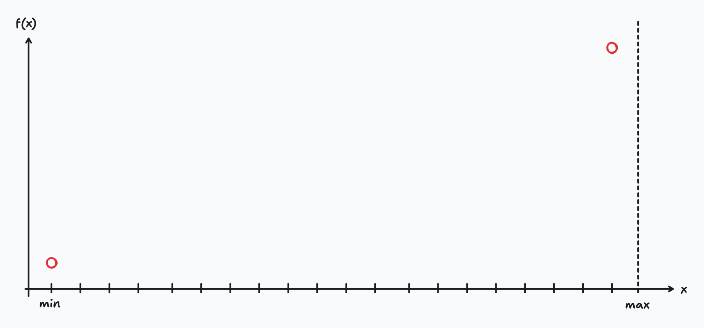

In the unlikely case that they come back with the same value, then we're done, and we also have gained the new and possibly useful knowledge that people at the bank have gone mad and are only offering a flat interest rate for investments.

If they, on the other hand, come back with different values, as they should, then we need to locate the breakpoint(s). To do that, we decide on another point between the two, and sample it. For lack of a better alternative, let's split the interval in the middle. It has three options: it either has the same value as the lower end, or as the higher end, or something in between:

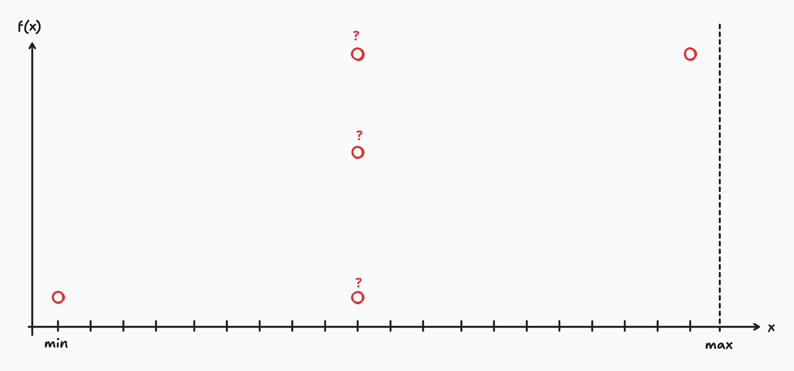

If it's the same value as either end, then we can draw a line between that end and the middle point, like this:

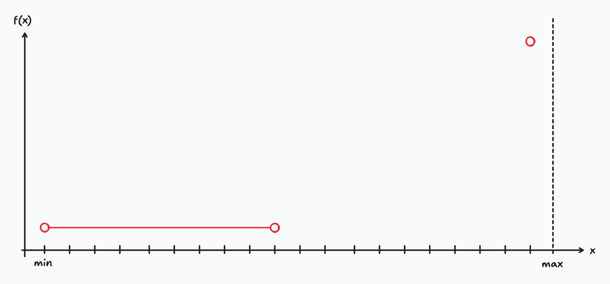

And now, crucially, for the other interval, we're back at the start: we know the start and end points, we don't know anything that goes on in the middle, and we can split again and start over. In a sense, that smaller interval looks "just like" the original situation:

This works both if the midpoint comes back as equal to the lower end, or to the upper end (we just work with the other one, where the step(s) must lie). If the midpoint comes back with an intermediate value, we just split both intervals in the same manner, except that this time the search tree widens because first we had one unknown interval, and now we have two to take care of, but the main idea is the same: each half-interval is one where we know the start and end values and know that there's at least one step somewhere in the middle:

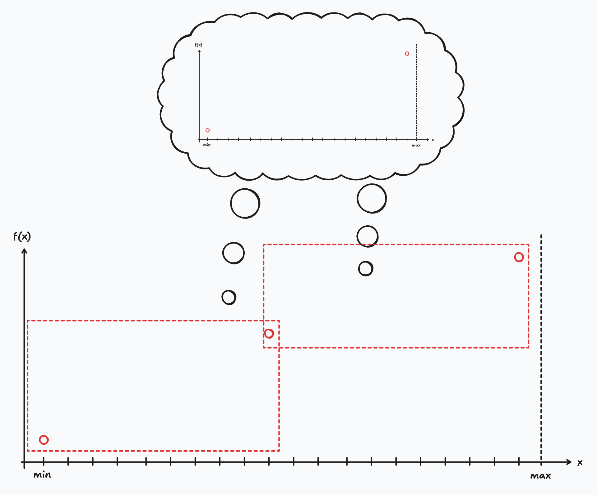

Another way of visualizing this is as a tree, where each node is a sampling operation (that is, the act of querying the bank for the interest rate at a single capital and duration, AKA choosing a particular value for X and then evaluating the function there and getting a value Y). Each sampling happens inside an interval, splitting it in two, and has three possible outcomes: either the lower half of the interval is now known to be constant, or the upper half is known to be so, or neither are. In the first two cases, we must repeat the whole thing with the interval that is _not_ known to be constant, and in the third case, we must do it with both, in parallel.

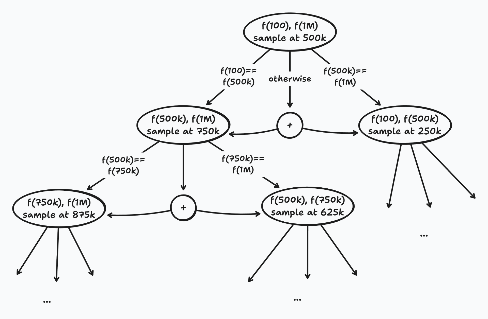

Implementation-wise, I went with keeping a stack (in the CS sense of the word: a pile where things are added and removed from the same end, in FIFO order) of intervals whose values we don't know yet. Intervals whose values are known are kept elsewhere. Initially, the known pile is empty (because we know nothing), and the unknown pile has a single interval covering the whole 100-1M range. Then, we pick three points (the start, the end, and the middle), and we sample at 100, 1M and 500k. Now the unknown pile has two intervals 101-49,999 and 50,001-999,999. Depending on the values for the sampled points, one of those intervals may be moved to the known pile (if we're lucky) or the two intervals stay in the unknown pile. Then, we repeat: pick an interval from the unknown pile, sample at start, middle and end (creating two half-intervals), and add to the known or unknown piles depending on the results. 

The stack is a natural fit to an algorithm that is recursive in spirit, if not in the details (in fact, a stack is how a true recursive algorithm would work in hardware, via the call stack, and you can also simulate a recursive algorithm with an iterative one, via a `for` loop or such, and keeping a stack of next-places-to-search yourself). And this algorithm is clearly recursive: after splitting, the unknown half-intervals "look like" the original case, and that's a clear marker for recursion. The base case is the case where the start and end of the interval are equal, which also neatly gives us our stop-and-back-out condition. Even the modeling of the thing as a graph is equivalent to this, as my final implementation came out behaving just like DFS (stack == DFS == recursion, more or less, at least for this algorithm)

## Results

Here's a search procedure on the range 100-1M. Pay attention to how the cyan line changes. Where the line is straight (either horizontal or a vertical step), then that section is known. If the line is diagonal, then that section isn't yet known, and the line is just linearly interpolating between the beginning of that interval and the end of that interval. Initially, the whole range is unknown (as we just know the diagonal line that joins the start and end points):


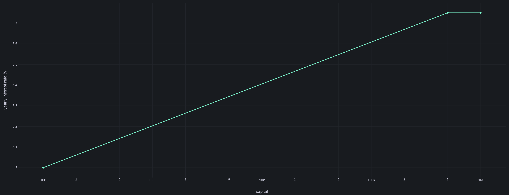
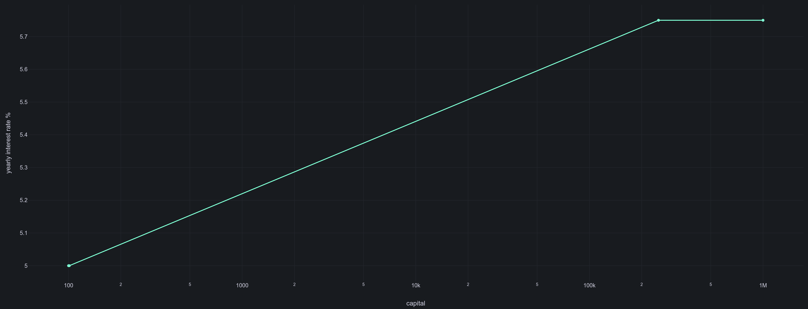
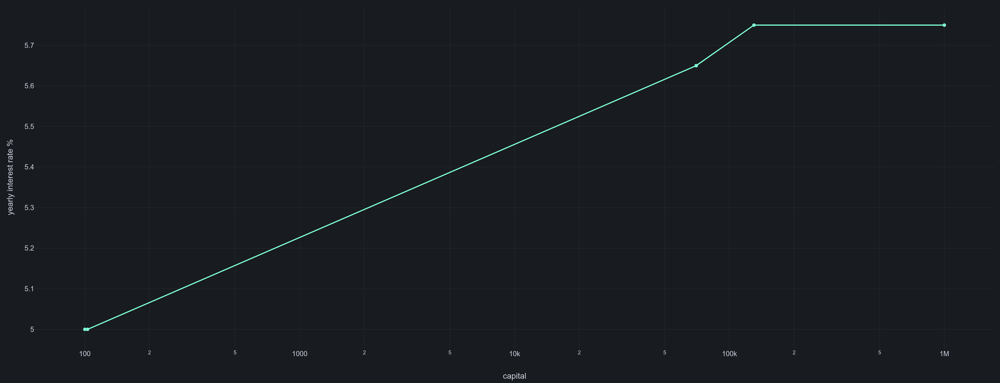
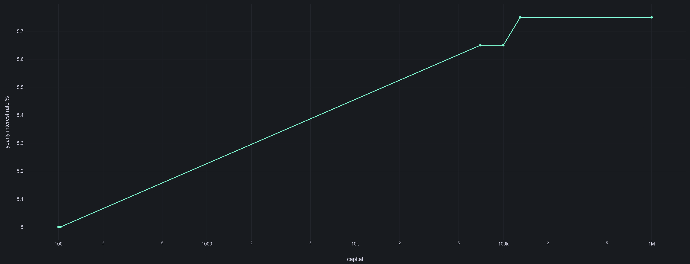

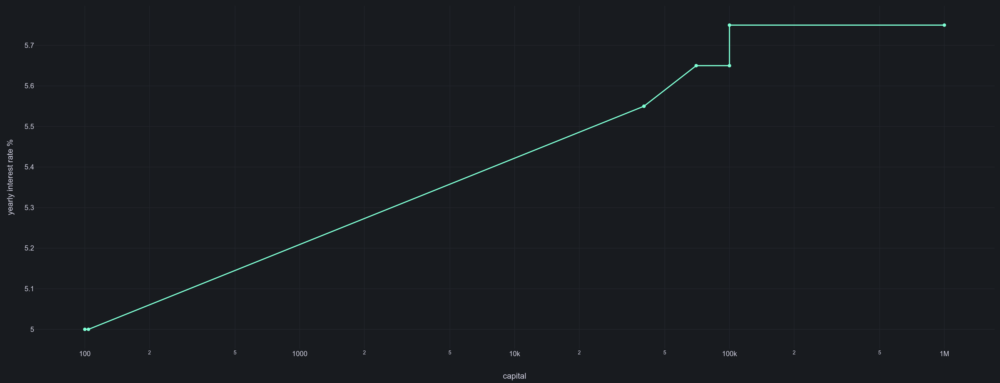


And so on. The particular way I wrote the search function means that it favors starting from the upper side (the right) and then moving to lower values, towards the left of the screen. That makes no difference in the end, since the entire range is eventually explored, it just means that when you're looking at animations you should generally look to the right, which is where the action is usually happening.

Here's a video showing the entire search. Focus on the right of the screen at the start. Areas shaded in green are already known, so they won't be searched any further. The red vertical lines are the points (the money values) that were just sampled. The dotted gray staircase is the true function, the real interest values with their real breakpoints, which are (of course) not known when we start. The thick cyan line is what we know, plus what we've inferred. As expected, it starts very unclear (just a couple of points are known) and is gradually refined by successive samplings of the real (underlying) function:



Here's an interactive animation of the same search:



With that, I can sample the entire range (\\$100 to \\$1M, so 999,900 possible values) by asking for just 96 values. And there's room to shave off a few more, but not needing to sample 99.990399% of the entries is probably Good Enough for most applications.

## Step optimization via likely round numbers

So far, what we've described involves always picking the exact midpoint of an interval when we need to break it down (that is, when the start and end points of an interval don't have the same value). However, there are cases (such as this one) when always choosing half is not optimal, because those numbers would quickly devolve into nonsensical numbers that are certainly not near a breakpoint.

For instance: We start with the range 100-1M. They don't have the same value, so there's a step somewhere in between (or several). Halfway between the two edges is exactly 499,950. At least it's still an integer, but it's very unlikely that that value (or that value ± 1) is exactly the point where the interest rate switches values. We'd expect banks to change at nice round numbers, perhaps 500K (either "up to 500K you get X%, starting at 500K+\\$1 you get Y%", or "up to 500K-\\$1 you get X%, from 500K upwards you get Y%", depending on how they felt like wording their rates and how our national bank control authority likes things done). In other words, we'd expect the stepovers to be on somewhat round numbers, maybe something like the ranges 100-1K, 1K-2K, 2K-7K, 7K-15K, 15K-25K, and 25K-1M.

We could formalize that like "when computing the midpoint of an interval, round it to the nearest thousand" but that may not always be optimal. For one, maybe at the very low edge of the interval (a few hundreds of dollars), the bank has decided to change interest rates quite rapidly (say 100-250, 250-500, 500-1K, and then onwards). At the same time, once numbers get very large, using 1K to round is way too granular. If for some reason we're scanning the interval 624K-1M, the bank is quite unlikely to have placed a change of interest rates at exactly \\$812K; at those amounts of money, we'd expect to see the changes happen on multiples of 50K or 100K (having a breakpoint at \\$750K makes intuitive sense and would look good on the bank's interest rate table, whereas \\$812K is just weird).

The choice of appropriate candidate breakpoints also affects the time that the search procedure takes to find the exact point where the interest rate changes. For example, say there's a breakpoint at \\$750K (which we, at this point, don't know the exact location of; that's the whole issue here), and we're searching the 624K-1M interval. By doing exact halves, we'd first choose 812K as the midpoint. We'd then discover that the breakpoint is below that (because the value at 812K would be the same as 1M, and larger than that at 624K, indicating that the function stepped up somewhere in that lower half). We split the lower half 624K-812K in two again, this time at 718K. Now the breakpoint is in the high interval, 718K-812K, and the split is at 765K. Breakpoint is on the low interval 718K-765K, split at 741.5K (let's say that we're being reasonable and rounding to nearest thousand, so 742K). Breakpoint is on 742K-765K, split at 753.5K, round to 754K. Breakpoint is on 742K-754K, split at 748K. Breakpoint is on 748K-754K, split at 751K. Breakpoint on 748K-751K, split at 749.5K, round to 750K. At some point around here, we'd find the boundary case between either 750,000 and 750,001 or 749,999 and 750,000, and finalize the search for that interval. That was eight splits or thereabouts, and for each one there were three samples taken (the exact start of the interval, the exact end, and the midpoint). In a table:

|Interval|Midpoint|Rounding|Rounded midpoint|Upper or lower?|
|---|---|---|---|---|
|624K-1M|812K|1K|(same)|Lower|
|624K-812K|718K|1K|(same)|Upper|
|718K-812K|765K|1K|(same)|Lower|
|718K-765K|741.5K|1K|742K|Upper|
|742K-765K|753.5K|1K|754K|Lower|
|742K-754K|748K|1K|(same)|Upper|
|748K-754K|751K|1K|(same)|Lower|
|748K-751K|749.5K|1K|750K|Found|

If, on the other hand, we were rounding to 50K, because we're operating on the $10^5$ order of magnitude so breakpoints should also be around that magnitude, we'd again start at the 624K-1M interval. Midpoint is 812K, round to 800K (the nearest multiples of 50K are 800K and 850K, and 800K is closer so we choose it). Breakpoint is below, so now the interval is 624K-800K, split at 712K, round 700K. Interval becomes 700K-800K, split at 750K. At about this point we find the exact breakover point, like above, except that this time it only took us three or four splits, depending on how you count, so half the comparisons needed and half the requests made to the bank's unofficial undocumented possibly fragile API-but-not-really-an-API-because-it's-not-for-external-usage that furnishes us with the interest rates. As a table again, just for comparison:

|Interval|Midpoint|Rounding|Rounded midpoint|Upper or lower?|
|---|---|---|---|---|
|624K-1M|812K|50K|800K|Lower|
|624K-800K|712K|50K|700K|Upper|
|700K-800K|750K|50K|(same)|Found|

However, just decreeing that breakpoints will be on multiples of 50K, while useful at the high ranges, is not useful for low dollar values. There are definitely breakpoints happening at the low thousands of dollars, and those would be entirely missed if our lowest possible breakpoint ever were 50K. To also cover low values, I fall back to lower and lower multiples if there's no viable alternative.

For example, let's say that for some reason we've managed to narrow things down to the interval 812K-821K, and our very sick bank has decided to place a breakpoint in the interest rates at 817K. We know there's a breakpoint in there because the interest rate at 812K is lower than that at 821K, so we need to split and keep looking closer. Again, as a table:

|Interval|Midpoint|Rounding|Rounded midpoint|Upper or lower?|
|---|---|---|---|---|
|812K-821K|816.5K|50K 10K|800K (not viable) 820K|Lower|
|812K-820K|816K|10K 5K|820K (not viable) 815K|Upper|
|815K-820K|817.5K|5K 1K|820K (not viable) 818K|Lower|
|815K-818K|816.5K|1K|817K|Found|

In effect, this scheme gives us a way to, at the start, quickly step over large areas of the search space (doing the binary search already does this, that why binary search is $\mathcal{O}(\log N)$, after all). Proposing, say, multiples of 50K as possible breakpoints early gives us a good change of quickly, "by accident", finding the real breakpoints at large capital values (as we've said before, we expect breakpoints to be at \\$750K rather than at \\$728,430, so we'd like to propose the former as a midpoint quickly, rather than waste time inching closer to it by a series of divisions by two).

In fact, implementing this (with the steps 10K, 5K, 1K, 500 and 1, in that order) allowed me to shave off a third of the process. Previously I just rounded to 1K, and it took a bit more than 40 steps to scan the entire range 100-1M. After adding rounding to larger values if possible, it took 30 steps to do the same. For example, the highest interest tier covers 100K-1M. Just rounding to 1K, it takes 9 splits to close to that point: 500K, 250K, 125K, 63K, 94K, 109K, 102K, 98K, 100K. You can see that a lot of time is spent dancing near the 100K point, but the algorithm is just methodically crossing off halves of the interval so it can take a while. Rounding to 10K at the start, on the other hand, finds it in just five: 500K, 250K, 130K, 70K, 100K. This is because the midpoints are nudged closer to the likely points where the breakpoint may be, so we don't just go 63K→94K→109K→102K→98K→100K but just 70K→100K.

Visually, if every tick mark is allowed, we may have the search procedure jump like this to find the green tick:

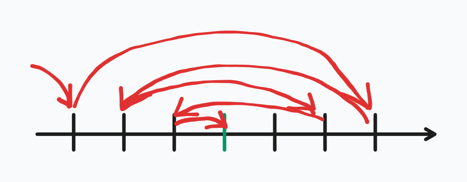

Whereas if we only allow each fourth tick mark, then the search is quickly forced into the correct value, because the intermediate ones just aren't allowed:

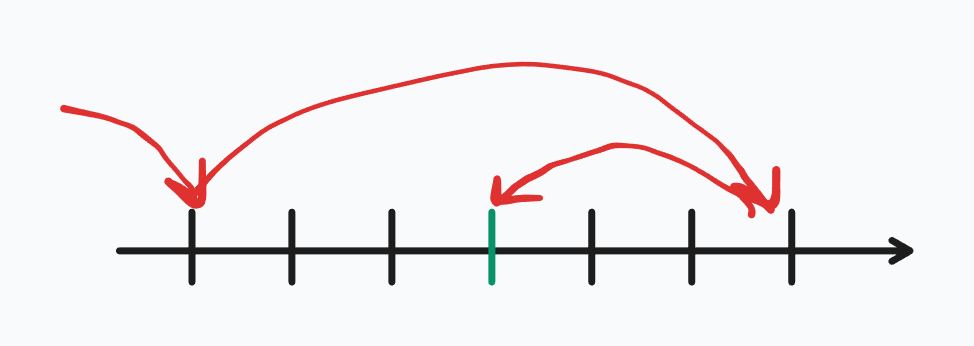

## Extending to 2D

So far, we've been assuming that there isn't also a time component to interest rates, which there is: interest rates also depend on the time that the money is locked into the investment. My particular bank allows such investments to be between 31 and 720 days, which is apparently precisely equal to 2 years in bank-speak, never mind the 10 (or 11, if one of those years is a leap year) additional days.

Involving another variable into the equation now means that there's no clear way to "split the interval in half". Intervals aren't even two numbers anymore, defined by a start and end value, but maybe something like a rectangle that covers from A to B in a variable, and from C to D in the other (so, a pair of start and end values, one per dimension). The closest to halving an interval would be... breaking the rectangle in four, doing something like a cross? Actually, it'd involve nine rectangles, because in 1D we split the interval in three: from the start to X-1, the single-item interval between X and X, and from X+1 to the end. In 2D there'd therefore be 9 sub-intervals, some actual rectangles (with a width and a height larger than 1 item), some "lines" (a dimension would be between X and Y and the other would be between X and X, so the smallest possible "width" or "height") and a single "point" interval (from X to X in both dimensions). Like this:

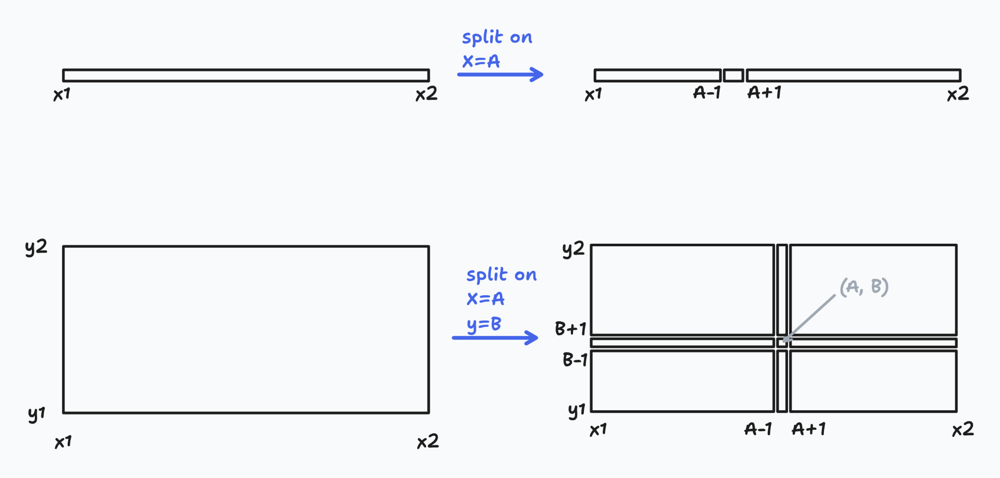

The staircase function would now be a 2D staircase, composed of rectangular steps at different heights. Something like a Minecraft world's ground, if it only ever increased as you moved in X and Y:

We could also exploit the fact that, at the end of a run as described above (say, fixed on the 361 day interval), we know the entire shape of the function at that value (which would be a slice across the 2D staircase), including the exact points where the function changes (for example, right now the breakpoints for 361 days are at \\$1K, \\$2.5K, \\$4.5K, \\$7.5K, \\$12K, \\$20K, \\$35K, \\$50K and \\$100K). It stands to reason that those breakpoints may be the same at other durations (that is, investments on a 60-day length may have their interest rates change on the same points, just with different, generally lower values). Thus, maybe we can "recycle" those breakpoints that we learned in the first run, and on the second run (for a different duration) we just start sampling around those points. If we're lucky, those same breakpoints are used for this second duration, and we're just going straight to the correct points. Otherwise, there'll be some intervals where the start and end interest rates don't match, indicating that there are some steps inside that interval, in which case we can just proceed like the first time (split, sample, repeat), but at least part of the time will be saved.

It _should_ be possible to apply this algorithm to two dimensions at once, but I really can't see a clean way to do it. As discussed above, with two dimensions things get weird, as now there's not a "greater than" and "less than" relation, there's not just a left and a right, and the splits explode much faster (previously, at worst an interval would split into two more, whereas now it may split into eight). So I ended up hard-coding the search points in the time dimension, the rationale being that the time ranges, like "between 31 and 60 days" should be less likely to change than the ranges like "between \\$4500 and \\$7500". 

Currently, the time breakpoints are at 60, 90, 120, 180, 270 and 360 days, which nicely lines up with 2, 3, 4, 6, 9 and 12 months, and therefore gives credence to the idea that those breakpoints shouldn't change (the bank is, hopefully, not likely to move the 6-month breakpoint to 7 months, because that is not a nice round number, whereas I don't feel as strongly about the \\$12K breakpoint. It's a multiple of 1K, sure, but if they're now placing it at \\$12K they may very well then start placing it at \\$13K, and it'd feel just as round of a number). 

With this arrangement, the 2D space isn't explored all at once, as a sheet of paper, but rather in lines, much like the electron beam in a CRT scans images (ignoring interlacing). First we run the search fixing the number of days to 31 (the minimum value). Since at this point we don't have any previous data to guide the search, this runs the full search, which takes about 90-95 samples on the range between \\$100 and \\$1M. Then, we change to the next duration breakpoint (60 days) and rerun the search, except that this time we don't start blindly, but first we sample at the money breakpoints just found on the 31-day search. If they're the same, then we're done much quicker than before, on just about 15 to 20 samples rather than 95, and even if some of the breakpoints were to change (I haven't seen them to), the previous breakpoints may still be useful in removing the bulk of the binary search by guiding the initial search closer to the actual breakpoints. The same is done for 61 days (the start of the second duration tier of interest rates), 90 (the end thereof), and so on until 720 days (the maximum duration at which you can take out a fixed interest investment in this particular bank).

Once this is all done, we have a full view of the entire interest function, across the entire X domain (capital invested) and Y domain (days). It comes out like this (color denotes interest. Hover over the chart to see the sampled point that is nearest to the current mouse position):



## In conclusion...

By following these Four[^3] Easy Steps, you too can efficiently extract the shape of an entire function, as long as:

1. It's stepwise (increasing or decreasing, doesn't matter), since the whole procedure relies upon the fact that if $f(x_1)$ and $f(x_2)$ are equal, then the function is constant between $x_1$ and $x_2$, which may not be the case if the function is allowed to decrease too
2. It's defined only for integers (that is, $f(1)$ exists and $f(2)$ too, but $f(1.5)$ doesn't make sense), since the bisection procedure to split a range in two is only guaranteed to terminate in such cases (because if any real number is allowed, then any interval can be infinitely subdivided to arbitrary precision and it may never be possible to identify the real breakpoint, whereas for integer domains we can always eventually find the $x$ such that that $f(x)$ has a value and $f(x+1)$ has another value, therefore the breakpoint is exactly between $x$ and $x+1$)
3. It can be sampled at arbitrary points, that is, there is some sort of magic oracle (as here it was an undocumented API endpoint) that can be asked for the value of $f$ at $x$ and always returns a value (subject to the domain constraints)
4. The function's $x$ variable (the thing that can be varied at will) has a defined domain (that is, a start and end points) and those are finite, since the bisection naturally requires finite start and end points to compute the midpoint between them (the range $(100, \infty)$ does _not_ have a finite midpoint and so can't reasonably be split in half)
5. If the function has two or more variables, they are independent of each other (that is, the breakpoints in each variable don't vary as another variable varies[^4]). Otherwise it isn't possible to reuse information across variables and it becomes necessary to sample the entire 2D (or 3D, or whatever) space in a much more involved manner

As for how many real-world functions satisfy these constraints, I don't know. Maybe other kinds of cost functions that have bulk discounts? For example, [here's the most expensive 1kΩ SMD resistor that Mouser has to offer](https://www.mouser.com/ProductDetail/Vishay-Dale/M55342K06B1E00TWLT?qs=CZ6xfwOSLTW94m14LqLNWw%3D%3D). There's a pricing table on that page, which contains the unit price as you buy increasing quantities of the resistor. A single one will set you back over _sixty_ dollars, whereas 10 _only_ cost \\$45 each, and 250 resistors, which is the maximum amount listed, cost \\$39 per unit. This is also a stepwise function, $\mathrm{unit\_cost} = f(\mathrm{quantity})$ (with the total price being $\mathrm{price}(\mathrm{quantity}) = \mathrm{quantity} \times f(\mathrm{quantity})$), except that this time the staircase goes down as $\mathrm{quantity}$ increases. Then again, in that particular case there's no point in trying to carefully extract the pricing steps, since they're very much public in the resistor's detail page. But there may be other things (e.g. SaaS pricing) where you don't know the true cost function (for example, I've seen sites where you get a slider for the "number of active users" or "number of runs per month" or "number of emails sent" or whatever), and you're only able to play around with the sliders and see prices. In those cases, it may be useful to get a full view of the underlying price function, e.g. to track changes done to it or price increases or to find an optimal pricing point or to compute the cost of that that is incurred by your own SaaS (e.g. you use a mailing service, then those costs should be somehow accounted for in the payments that users make, at least for a healthy business that isn't just taking new venture capital or debt or financing rounds or fudging the books or moving money around in creative ways or paying the engineers in Imaginary Stocks That Can't Be Redeemed Because This Company Isn't In The Stock Market And You Need To Stay Here For Ten Years Anyways or selling user data under the table or selling privileged access to datasets to them AI companies just to keep paying for its operation).

I'm not satisfied with the way in which the second variable (time) was handled. It needs a list of hardcoded values to explore, and that just feels hacky. Perhaps a better way would be to first explore the two axes (one of them we already explore, since the first thing we do is to run the full search over the Capital dimension, while fixing the Time dimension to 31 days, which is its minimum possible value. It would be possible to then run again, this time fixing the Capital dimension to \\$100, which is _its_ minimum possible value, and searching over the Time dimension). This would give us a set of breakpoints in both axes, and since the two dimensions are independent, then the final 2D breakpoints are just the cartesian product of both axes. 

Oh, and finally, just in case someone has been reading over eight thousand words while thinking "But wouldn't banks publish a PDF with all their interest rates?": well, yes they do! You go to the Transparency page, and there find a Fees PDF. It claims to be from November (doesn't say the year), and it has been created less than a month ago, so it should be very much up-to-date. Here's the table that, as far as I understand it, covers fixed-interest investments (it's right on the first page, under the [Passive Interest Rates](https://countryeconomy.com/dictionary/passive-interest-rate) heading, which is consistent with what these investments are):

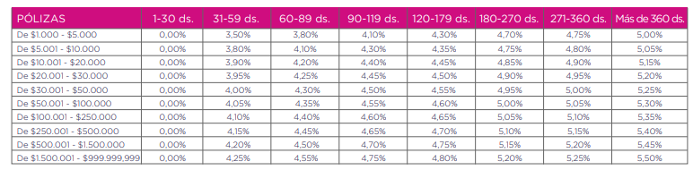

Capital ranges are in the first column, and time intervals change towards the right. 

There's a lot of numbers, but they have one thing in common: they are _not_ correct. Or something (I mean, it's the bank's own page and official fee document, it's probably correct by definition). At least, they don't match what you get on their web application. And they're wildly different too, as both the capital ranges and the actual interest rates vary. For example, the table starts at \\$1K, whereas you can definitely make a \\$300 investment. The capital breakpoints are all over the place too, since this table has breakpoints at \\$100K, \\$250K and \\$500K before reaching \\$1M (and there isn't a breakpoint there, the next one is at \\$1.5M), whereas the web application is missing the \\$250K and \\$500K breakpoints. They do announce a "Preferential interest rate" when you're in the web application, which may explain the difference, but it isn't like users of the web app just get a flat 0.25% extra on all rates or something, since in that case at least the breakpoints would be the same. Furthermore, the difference between the table and our sampled function isn't even constant.

If the PDF won't match what you will actually get when taking out such an investment, then the PDF is worthless for this purpose (leaving aside the fact that reading out a table _as a table_ from a PDF isn't trivial anyways). I don't care that the "real" interest rates are what the PDF says because that's what was sent to and approved by the Bank Control Superintendence or whatever, I care about the rates that I will get when I use the web application. And if they won't publish them, then we will extract them, even resorting to recursivity if we're forced to (as we were, indeed).

So, it turns out, this entire thing wasn't a joke after all! It fulfills a very important need of _probably one person in the country_!

[^7]: Consider: I used to have two to three hours each day that could be spent learning things and then writing blog posts as a side-effect and way to crystallize cool things into something tangible. Call it 2.5 hours per day on average. When I have to go to the office, that kills the entire day between about 08:00 and 18:30 for anything else. Since in this country we obey the 8-hour workday (sort of), that means there's a 2.5 hour overhead that is unaccounted for (as in, I certainly don't get paid overtime for 2.5 hours per day every day!). But it's still overhead and can't be used for anything else. And, as things are now, when [a 1201 happens in my life](https://www.nasa.gov/history/alsj/a11/a11.1201-pa.html) one of the first things to be kicked off the execution queue is the blogging. At the current overhead levels, the time left for blogging things is $2.5 - 2.5 =$ more or less zero! Where before I could get out a post every two to four weeks, more or less, now at zero hours available per day that takes precisely $\infty$ days per post[^7a]. The precise numbers may vary, but the point stands: office make ~~ape~~ jreyesr tired and without time, and ~~ape~~ jreyesr tired and without time does no blog
[^7a]: Which means that this post is actually early (infinitely early, in fact) and you should be grateful
[^2]: Joking, in case it wasn't clear. The actual numbers don't come out exactly that way, but they sure feel like it sometimes
[^1]: Because, let's be honest, more than that is just... not happening for almost anyone, save some company owners, maybe some doctors, some politicians, and likely drug traffickers and people in other such occupations. Us common people with common bank accounts, nah.
[^3]: Not necessarily four
[^4]: Yes, alliteration completely intentional
[^5]: AKA LLMs
[^6]: In the limit, for a neural network with infinite elements and infinite connections and infinite precision and infinite computing power and infinite everything, but hey, I could also do many fun things with infinite resources
