This is [a SQLite database](https://github.com/lerocha/chinook-database):


This is the same SQLite database:

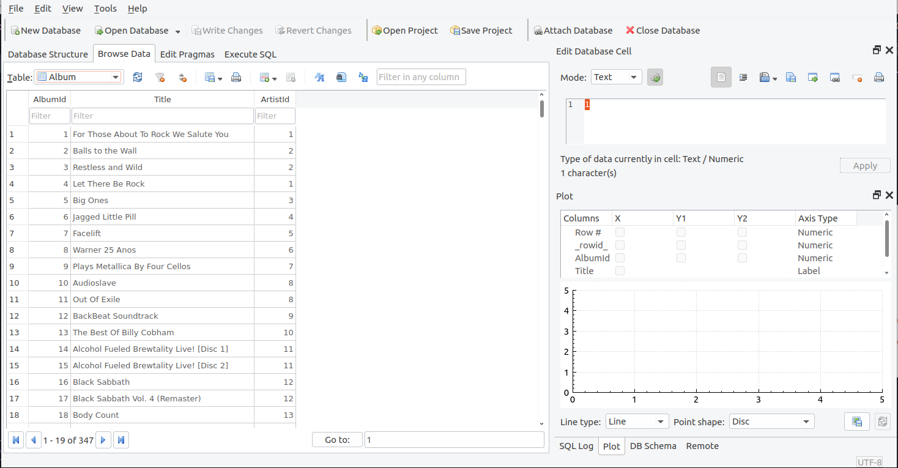

And _this_ is still the same SQLite database:

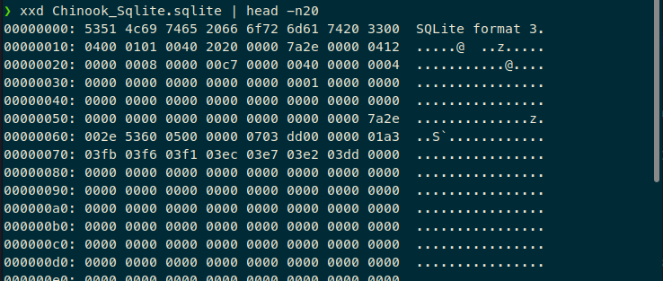

Now, assume you don't have the [nice GUI](https://sqlitebrowser.org/) to open the file, nor [a library in your programming language of choice](https://docs.python.org/3/library/sqlite3.html), but only a binary file and [the spec of the file format](https://www.sqlite.org/fileformat.html) (without the latter[^1], you're kinda dead, and good luck reversing anything that is even remotely complex). How do you process the file, in a repeatable manner? In other words, how do you parse a bunch of bytes into something that resembles usable data?

This post presents one solution to the problem. It was suggested to me, I think, by the Github suggestions, and I'm posting it because it's a really neat tool and, should you ever need something like it, you'll really suffer if you don't at least know that it exists.

In other words: new tool shiny.

## Introduction

[Kaitai Struct](https://kaitai.io/) is a way of developing parsers for binary file formats. In other words, if you have a binary file format, you describe how files that conform to it look like, and Kaitai generates code (in several programming languages) that can parse files of that format, exposing the interesting bits of them to users of said code.

So, it's not technically a parser. It's a tool to generate parsers. 

You interact with Kaitai by describing the format that you want to parse in a declarative file (YAML, actually). Then a CLI utility generates source code in several programming languages.

If you have used [ANTLR](https://www.antlr.org/), the workflow is similar. Substitute the `.g4` files for `.yml`, and `andtlr4` for `ksc`, and the overall workflow is quite similar. However (at least to me) Kaitai's YAML files are _faaar_ more readable that ANTLR's syntax. Besides, the tools are not really comparable: ANTLR works well when parsing text-based formats, while Kaitai is used for binary formats.

Kaitai's [user guide](https://doc.kaitai.io/user_guide.html) is essential if you want to design a new parser. A condensed version of the guide follows:

The main entry point is a YAML file, which encodes a file format:

```yml
meta:
  id: file_format
  doc: A proprietary format used by Dino Corp to store and transmit asteroid trajectory data
  endian: be
  
seq:
  - id: magic
    contents: "DINO"
  - id: version
    type: u1
    enum: version
    doc: File version. V2 is the most common, V1 wasn't too popular and had several shortcomings
  - id: timestamp
    type: s8
    doc: Unix epoch time, in seconds (dinosaurs already knew Unix time)
    if: version == version::v2
  - id: filename
    type: str
    terminator: 0
    encoding: UTF-8
  - id: count_asteroids
    type: u1
  - id: asteroids
    type: asteroid_data
    repeat: expr
    repeat-expr: count_asteroids
  - id: signature
    size: 16
    doc: Signature of the entire file, computed with HMAC-SHA5-128
    
enums:
  version:
    1: v1
    2: v2
    0: reserved

types:
  asteroid_data:
    seq:
      - id: name
        type: str
        terminator: 0
        encoding: UTF-8
        doc: Dinosaur-readable name for the object
      - id: diameter
        type: u4
        doc: Diameter of the asteroid, in meters
      - id: right_ascension
        type: s4
        doc: Right ascension of the asteroid, as of the time of the measurement, expressed in multiples of 10^-6
      - id: declination
        type: s4
        doc: Declination of the asteroid, as of the time of the measurement, expressed in multiples of 10^-6
      - id: distance
        type: u4
        doc: Distance to Earth, in kilometers
      - id: speed
        type: s4
        doc: Closing speed of the asteroid, in meters per second. Can be negative if the asteroid is moving away
      - id: probability_collision
        type: u8
        doc: Probability of collision, expressed in multiples of 10^-12 (for example, 100 here would be 10^-10). A value of 10^12 here means a probability of 1=100%. It's an integer to prevent floating-point shenanigans
      - id: threat_rating
        type: u1
        doc: Rating of the asteroid in the Torino scale
        doc-ref: https://web.archive.org/web/20070224184143/http://impact.arc.nasa.gov/torino.cfm
```

In that (completely imaginary) file format we see some things:

* Support for [magic strings](https://en.wikipedia.org/wiki/Magic_number_(programming)), like [ELF has](https://en.wikipedia.org/wiki/Executable_and_Linkable_Format#File_header) (and many other formats)
* [Endianness](https://en.wikipedia.org/wiki/Endianness) control, important because otherwise numbers greater than 1 byte in size can get mangled up
* Conditional fields (fields that only exist depending on the values of other fields). Here we imagine that only V2 of the format has a timestamp
* Enumerators
* Null-terminated strings (AKA C-style). There's also fixed-size strings
* Repeated fields
* You can extract subtypes into their own definitions, so that you don't have to bunh everything together
* Arbitrary byte arrays, for things that are better captured as raw binary contents (here, a digital signature)

## Testing the ICO format

Windows icons are distributed in ICO format. It's a BPM/PNG file, but with an extra header and a weird layout, so it's not so easy to view.

ICO files also survive in the Web era because they are used as [favicons](https://en.wikipedia.org/wiki/Favicon):


Let's parse one!

As it turns out, there [already exists a Kaitai spec for the ICO format](https://formats.kaitai.io/ico/). Nice. We can just [open the web IDE](https://ide.kaitai.io/), select the `formats/image/ico.ksy` file, load an ICO file in the hex viewer, and start looking.

We'll cross reference the Kaitai file with [Wikipedia's article about the ICO format](https://en.wikipedia.org/wiki/ICO_(file_format)), just so we can see how every part of the ICO format is expressed.

> An ICO or CUR file is made up of an ICONDIR ("Icon directory") structure, containing an ICONDIRENTRY structure for each image in the file, followed by a contiguous block of all image bitmap data (which may be in either Windows BMP format, excluding the BITMAPFILEHEADER structure, or in PNG format, stored in its entirety).

Here's the ICONDIR structure, from the great Wikipedia:

|Offset#|Size|Purpose|
|---|---|---|
|0|2|	Reserved. Must always be 0.|
|2|	2|	Specifies image type: 1 for icon (.ICO) image, 2 for cursor (.CUR) image. Other values are invalid.|
|4|	2|	Specifies number of images in the file.|

Then, it's supposed to have ICONDIR entries for each result:

|Offset#|Size|	Purpose|
|---|---|---|
|0|	1|	Specifies image width in pixels. Can be any number between 0 and 255. Value 0 means image width is 256 pixels or more.|
|1|	1|	Specifies image height in pixels. Can be any number between 0 and 255. Value 0 means image height is 256 pixels or more.|
|2|	1|	Specifies number of colors in the color palette. Should be 0 if the image does not use a color palette.|
|3|	1|	Reserved. Should be 0.|
|4|	2|	In ICO format: Specifies color planes. Should be 0 or 1.<br> In CUR format: Specifies the horizontal coordinates of the hotspot in number of pixels from the left.|
|6|	2| In ICO format: Specifies bits per pixel. <br>In CUR format: Specifies the vertical coordinates of the hotspot in number of pixels from the top.|
|8|	4|	Specifies the size of the image's data in bytes|
|12|4|	Specifies the offset of BMP or PNG data from the beginning of the ICO/CUR file|

Then come the actual images:

> All image data referenced by entries in the image directory proceed directly after the image directory. It is customary practice to store them in the same order as defined in the image directory.
>
> Recall that if an image is stored in BMP format, it must exclude the opening BITMAPFILEHEADER structure, whereas if it is stored in PNG format, it must be stored in its entirety.

That's all well and good. However, when you read an ICO file (let's assume that there are no libraries that can parse ICO files), you'd just get this:

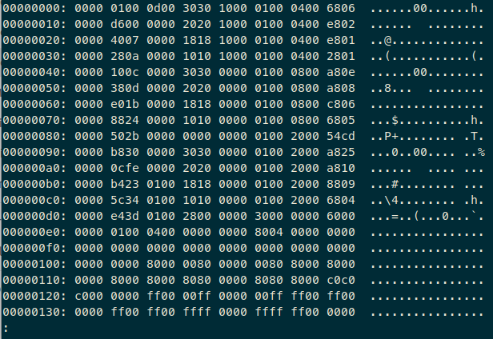

Okay, great. Not so helpful, is it? You may be able to extract a few data points from that, such as the fact that it's an ICO file (not a CUR file), because the third and fourth bytes are `0x0100`, which is 1 in little endian.

Instead, we can use Kaitai to extract said data:

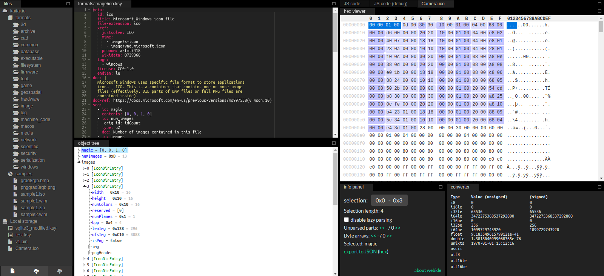

That's much better! We have an interactive explorer for the fields: if you click on a field in the object tree (lower left quadrant), the corresponding bytes are highlighted in the hex viewer (upper right quadrant). That interaction is similar to Wireshark, where you can jump from bytes to dissected data and back, except that here you get to edit the actual dissector live.

Kaitai separates an ICO file in the following sequence of data:

* 4 magic bytes, for the Reserved and Image Type fields in the table
* The number of images
* A repeated structure for the ICONDIRENTRY elements, which are headers for the images

Directory entries are extracted to a separate type, which has these fields:

* Width
* Height
* Number of colors
* A reserved byte, supposed to be 0
* Number of color planes
* Bits per pixel
* Size of image data
* Offset of image data

Then, every ICONDIRENTRY has [an instance](https://doc.kaitai.io/user_guide.html#_instances_data_beyond_the_sequence), which, in the words of the Kaitai documentation:

> So far we’ve done all the data specifications in seq — thus they’ll get parsed immediately from the beginning of the stream, one-by-one, in strict sequence. But what if the data you want is located at some other position in the file, or comes not in sequence?
>
> "Instances" are Kaitai Struct’s answer for that. They’re specified in a key `instances` on the same level as seq.

So, an instance lets you jump to an absolute position in the file (by default, things come in a sequence, which means that they are read from the beginning of the file). Thus, every ICONDIRENTRY will have its own, absolutely-addressed instance, which points to the actual image data. The offset of said data, however, must come in a sequence (as otherwise you wouldn't know where to look for the pointer to the data!)

The instance merely reads as many bytes as the ICONDIRENTRY specifies, starting at the offset that the ICONDIRENTRY specifies. There is no further attempt to parse said data, since ICO files can have either BMP images with their head chopped off, or PNG files. Should you need to process data further, you can always use [the](https://formats.kaitai.io/png/) [corresponding](https://formats.kaitai.io/bmp/) parsers and only pass them the data that is held in the "raw data" field of the ICO file.

## Using the parser

OK, so we have a `.ksy` file that describes a file format. Now we want to actually use it.

Kaitai lets you generate code in several languages: C++, C#, Java, JS, perl, PHP, Python, and Ruby. For each language, it generates some sort of _module_, as understood by the target language, which encapsulates a bunch of file-parsing code. Said module presents an easy-to-use interface, from which you can parse a raw binary string, and then access every field that was described in the KSY file. For example:

```bash
./kaitai-struct-compiler -t python ../formats/image/ico.ksy
```

This generates a file called `ico.py`, which looks like this:

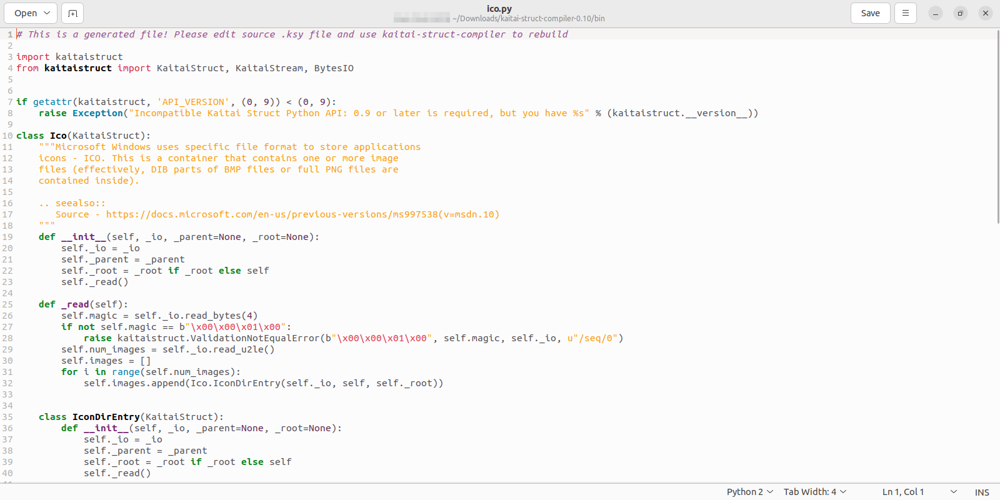

Again, I did not write that file. it was generated automatically based on the KSY file. However, you can see traces of the original file in there: there's a check for the magic number that rejects parsing if it doesn't match, and further down the file there are descriptions for each ICONDIRENTRY.

If you have used [ANTLR](https://www.antlr.org/), the workflow is similar yet again: you generate a lexer, parser, listener and/or visitor, which you then integrate with your application. After any changes in the source file (`.g4` in ANTLR, `.ksy` in Kaitai), you regenerate the code files and then update your consumer application if any changes have happened.

Our consumer application can be as simple as this:

```py
from ico import Ico

f = Ico.from_file("Camera.ico")

print("NUM IMAGES:", f.num_images)
for i, image in enumerate(f.images):
    print("IMAGE #", i + 1)
    print("IMG SIZE (WxH):", image.width, image.height)
    print("IMG NUM COLORS:", image.num_colors)
    print("IMG IS PNG?", image.is_png)
```

After running that code, we get this output (truncated):

```
❯ python main.py
NUM IMAGES: 13
IMAGE # 1
IMG SIZE (WxH): 48 48
IMG NUM COLORS: 16
IMG IS PNG? False
IMAGE # 2
IMG SIZE (WxH): 32 32
IMG NUM COLORS: 16
IMG IS PNG? False
IMAGE # 3
IMG SIZE (WxH): 24 24
IMG NUM COLORS: 16
IMG IS PNG? False
...
```

So, as you can see, we now get access to any fields declared in the file, as class properties. Java, JS, Ruby, C# o Go would get similar constructs: a class with fields, which can be instances of other classes. Optional fields are marked as such. Repeated fields become arrays/lists.

Not only that, but you get a measure of autocompletion/IDE support too! See the screenshot below:

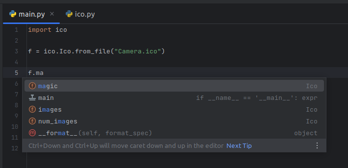

I'm typing `f.ma`, and the IDE suggests the `magic` property, which does indeed exist. Other types of autocompletion also exist, such as the knowledge that `f.images` is an array of `Ico.IconDirEntry` elements:

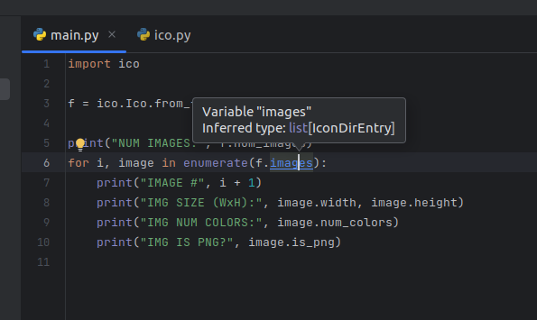

However, at least on Python, this is as far as it gets. There's no clean typing on properties (for instance, there's no concept that `f.images[0].width` is an int). On Python that's not so important, because [duck typing](https://arvinf07.medium.com/duck-typing-7f93896dc893) exists (linked here just because of the picture of ducks typing on a keyboard). Let's test a more strongly-typed language such as Go here.

I don't have the infrastructure set up to create an entire Go program, so I'll just generate Go source code and inspect it.

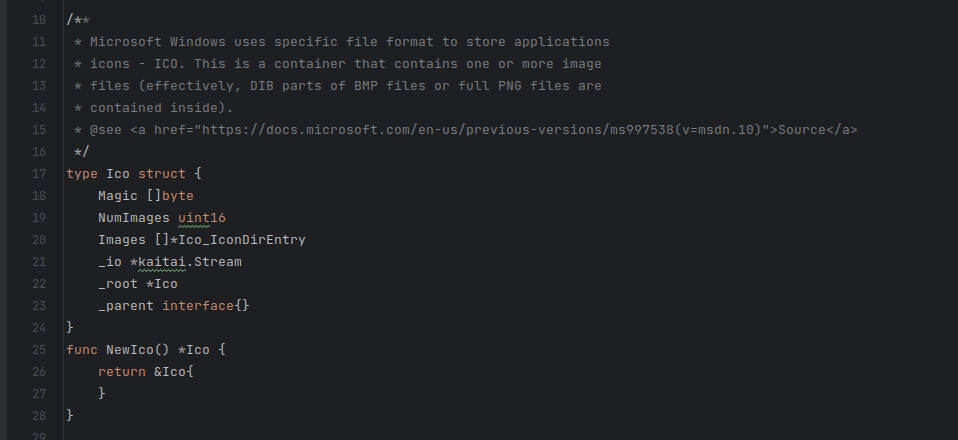

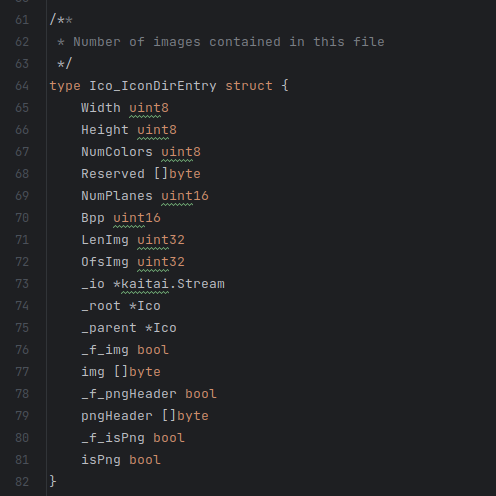

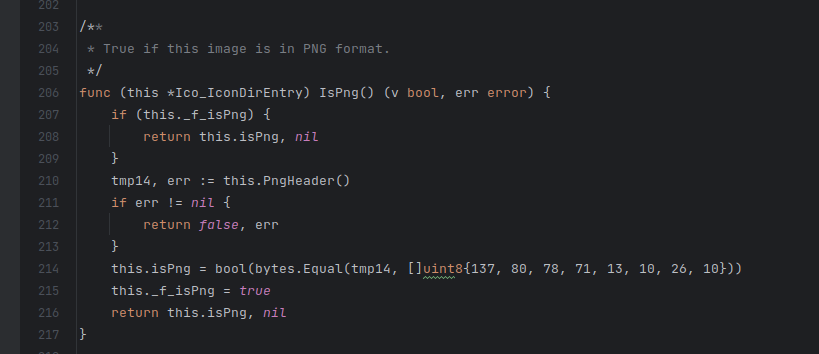

Okay, that's much neater. As you can see, the struct definitions have their fields correctly typed: `Ico.Magic` is an array of bytes, while `Ico.NumImages` is an `uint16`, as it was specified in the KSY files. The best part are references to submodels: `Ico.Images` is correctly typed to be an array of pointers to `Ico_IconDirEntry` entities.

In turn, the `Ico_IconDirEntry` struct has width and height fields typed as `uint8`, `isPng` is a boolean, and `img` (which holds the raw image data) is a byte array.

There are even methods defined on the structs, such as `IsPng()` in the `Ico_IconDirEntry` type, which returns a boolean. As you can see in the last screenshot above, this embeds an actual computation that checks the `PngHeader` to see if it's actually a PNG magic header.

Now, this is interesting because we never wrote actual Go code in the KSY file. Here's the relevant section:

```yml
png_header:
	pos: ofs_img
	size: 8
	doc: |
	  Pre-reads first 8 bytes of the image to determine if it's an
	  embedded PNG file.
is_png:
	value: png_header == [137, 80, 78, 71, 13, 10, 26, 10]
	doc: True if this image is in PNG format.
```

While the `is_png.value` field in YAML looks similar to what is written in the Go file, it's not the same. The expression in the YAML file is [Kaitai's Expression Language](https://doc.kaitai.io/user_guide.html#_expression_language), "a simple object-oriented, statically-typed language that gets translated/compiled (AKA "transpiled") into any supported target programming language". It is used to express simple (and not-so-simple) conditions such as the one above, that implements an array comparison. It has [operators](https://doc.kaitai.io/user_guide.html#_operators) (arithmetic, logical, bitwise, and the ternary operator) and [some methods](https://doc.kaitai.io/user_guide.html#methods). Kaitai embeds a way of converting any such expression into any of the target languages. For example, the above condition looks like this in Python:

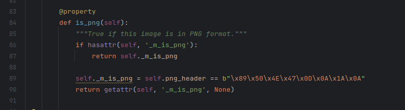

This time there's no error handling (since that's typical of Go) and the comparison is a direct [b-string](https://docs.python.org/3/library/stdtypes.html#bytes) comparison, which is Python-specific.

To show the level of integration available, check this code out:

```py
import ico

f = ico.Ico.from_file("vercel.ico")

for i, image in enumerate(f.images):
    if image.is_png:
        open("out.png", "wb").write(image.img)
```

Here we read any ICONDIRENTRYes in the file and, if they are PNG files, they are written to disk. And, indeed, they are properly extracted (here I use [Vercel's favicon](https://vercel.com/favicon.ico), since it embeds PNGs):

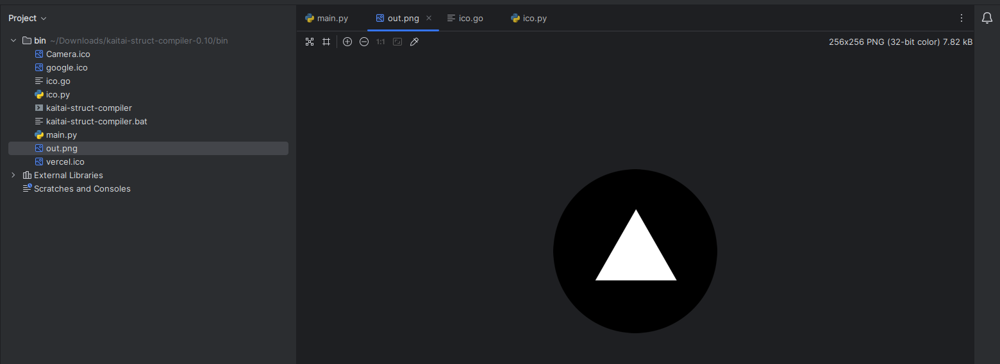

As far as Kaitai was concerned, the raw PNG image was merely a raw array of bytes. This points us to another usecase of Kaitai: you could chain decoders in case of nested file formats, such as a ZIP file that contains a PNG file. The ZIP parser could be written without regard to its content's format, and another parser would then be used to parse said content. In this way, Kaitai parsers are _composable_, which could prove useful.

## Back to SQLite

Now let's go back to the original usecase: we want to parse a SQLite file.

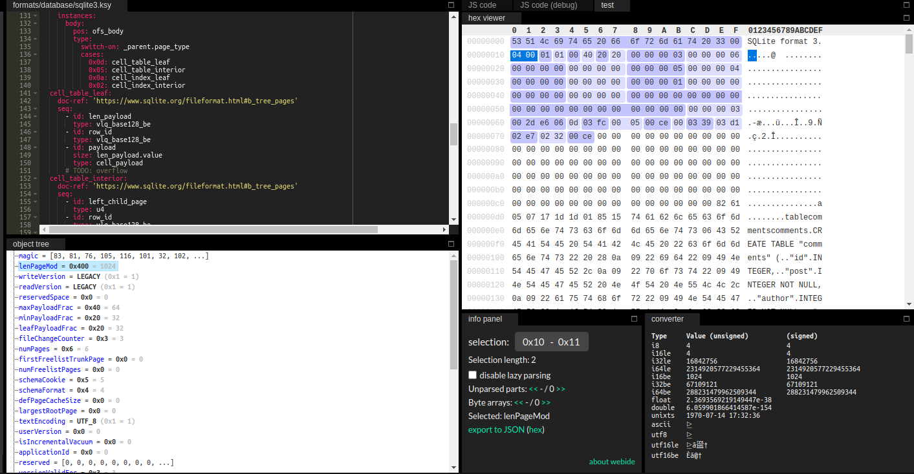

Kaitai already has a [parser for SQLite v3](https://formats.kaitai.io/sqlite3/), which we can use. And, indeed, it does parse at least [DB-wide information](https://www.sqlite.org/fileformat.html#the_database_header): the file version, number of pages, text encoding, several application-level versions, and more.

It does also provide access to the actual data, which on SQLite is stored on [B-tree pages](https://www.sqlite.org/fileformat.html#b_tree_pages). Following such data structures would no doubt be quite involved, but what's important for us here is that it _can_ be read, since the Kaitai parser gives us the offset to the page:

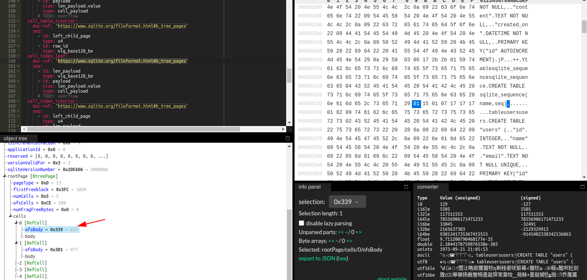

And the actual raw data is on `body`, just below the offset.

## Serialization

This I haven't tried, but it seems cool.

Kaitai has a level of support for [serialization](https://doc.kaitai.io/serialization.html), which is the inverse operation to that which we have been using until now. Usually, Kaitai takes a binary blob with no structure, parses it and gives you a data structure in your programming language of choice, usually a hierarchy of class instances.

Serialization is the opposite: you build a hierarchy of objects however you can, and then you dump it out to a binary blob which can be written to disk. Kaitai ensures that the written file will still conform to the format and thus it should be interoperable with other tools that consume said format.

So, in other words, it takes you from a read-only user to having write privileges. Nice.

The docs give the following two use cases:

> 1. Editing an existing file. You can parse a file to get the initial data, change the data programmatically and write them back to the same file or another file.
> 2. Creating a new file from scratch. It’s also possible to start by creating empty objects, then fill them with all the necessary information and finally tell Kaitai Struct to write the object to the provided stream.

Option 2 would be easier with not-so-large formats, since if a file format is really complex, you'll have to initialize every field and keep track of related/dependent fields. Option 1 could be really useful when trying to make a program fail or behave badly: since you get total control over the files that are generated, you can create malformed files that may trigger bugs, vulnerabilities or all-around fun.

Option 1 seems similar to [Scapy](https://scapy.net/), which is "a powerful interactive packet manipulation libary [sic] written in Python. Scapy is able to forge or decode packets of a wide number of protocols, send them on the wire, capture them, match requests and replies, and much more." Scapy is specifically aimed at network protocols, while Kaitai works with files on disk. One of [the main selling points of Scapy](https://scapy.readthedocs.io/en/latest/introduction.html#what-makes-scapy-so-special) is that it lets you build weird, malformed, unexpected packets: "For example, an ARP cache poisoning program won’t let you use double 802.1q encapsulation. Or try to find a program that can send, say, an ICMP packet with padding (I said padding, not payload, see?)". This is really useful to expose weird edge cases that only happen when sending unexpected combinations of data.

The Kaitai serializer library would bring the same power to anything that reads a file (which, really, is essentially every executable in the observable universe). You can mess with a program's proprietary database and make it really confused, since it doesn't expect its header to state "zero length" yet still have a pointer to the data. For example.

As for limitations:

* It's only for Java and Python, for now
* Building files from scratch could get nasty really fast: you'd need to specify every last field, and let's not even start on dependent fields (such as ensuring that, for an image file format, the `width` and `height` fields match the total size of the pixel data)
* Somewhat related, even if you are starting by editing an already-existing file, Kaitai won't help you if you need to do anything other than pinpoint edits. For instance, if the file has a checksum in another field, you'll have to edit it by yourself
	* This isn't a limitation on Kaitai _per se_, since it can't embed format-specific knowledge, but you still have to keep it in mind

## Recap

* If you ever need to parse binary file formats that don't already have prebuilt libraries in your programming language of choice, give [Kaitai](https://kaitai.io/) a try
* Kaitai lets you declaratively define the _structure_ of files, and then automatically generates libraries in several programming languages that can parse files that conform to that format
* Kaitai has an [extensive Gallery](https://formats.kaitai.io/) of file formats, which you can use directly or as inspiration
* Kaitai can generate programs in C++, C#, Go, JS, Java, Lua, Perl, PHP, Python and Ruby
* Said programs can read files and then expose the contents of the files in a neat data structure, such as class instances whose fields are further class instances, or arrays thereof. Thus, navigating the data in the file turns into accessing class fields. You also get autocompletion, assuming your language supports it
* Kaitai even has [ways to escape to the host programming language](https://doc.kaitai.io/user_guide.html#custom-process), in case parts of a file use, for example, a compression algorithm that Kaitai doesn't support
* The [Serialization functionality](https://doc.kaitai.io/serialization.html) makes Kaitai work in reverse, writing files in the format specified. This can be used to generate completely new files, or to take a file, parse it, change it slightly and write it back, hopefully preserving the file's structure
* The bottom line: if your job usually finds you with a hex editor open, counting bytes, looking at format specifications and wondering "what went on bytes 32-26 again?", give Kaitai a test. It may help you!

[^1]: In case of emergencies, you can try to use anything that Google provides in lieu of official documentation, especially in the case of our beloved proprietary & undocumented file formats
