In this article we'll review [Langium](https://langium.org/), "an open source language engineering tool with first-class support for the Language Server Protocol, written in TypeScript and running in Node.js."

We'll start by reviewing some basic concepts about language engineering, such as what it _is_, and where it pops up. We'll learn a bit about language design, DSLs, parsing and interpreting. Then, we'll meet Langium itself, see the class of tools that it belongs to, and some other similar(ish) projects. Then, we'll review a couple of sample languages,  a simple (one-line) language and a larger, more complex one. Along the way, we'll discover some of Langium's capabilities, though be aware that there may many more, which you're more than welcome to check out on [Langium's documentation](https://langium.org/docs/).

## An introduction to language design

First things first: what _is_ Langium? As in, "to what category of entities does it belong to?"

Langium presents itself as "an open source language engineering tool with first-class support for the Language Server Protocol, written in TypeScript and running in Node.js". The main noun there is "language engineering tool". Langium is used to design programming languages.

Now, usually _programming language_ is taken to mean a general-purpose programming language. Things like C, Go, Python, JS or C#. General-purpose programming languages (you'll usually find them under the abbreviation GPL, not to be confused with the [GNU General Public License](https://www.gnu.org/licenses/gpl-3.0.en.html), though there are [some general-purpose programming languages that are licensed under the GPL](https://www.r-project.org/Licenses/)) are... well, general-purpose, in that they're intended to serve a wide range of uses. Of course, much like the high-level/low-level distinction, there may be some wiggle room: is R general-purpose? It's essentially only used for statistics stuff, and not many people are building web applications on R. Is SQL general-purpose? Probably not... until someone [writes `plv8`](https://plv8.github.io/) and suddenly SQL can call arbitrary JS functions. And so on. 

The counterpart to general-purpose languages is domain-specific languages, also known as DSLs. A DSL is only _capable_ of expressing a narrower range of concepts and operations, and that's usually a good thing, as opposed to GPLs which tend to favor (they're _general_, after all) expressiveness. DSLs, on the other hand, can use the inability to express certain concepts as a useful tool to reduce the possibility of bugs and the amount of learning that people must perform. On GPLs, all of the [most popular ones](https://survey.stackoverflow.co/2023/#most-popular-technologies-language) (except for SQL, if you count it as a GPL) are imperative (i.e. the main mental model is a sequence of operations that are run by default sequentially, except for loops, conditionals, function calls and such). While there are DSLs that are also imperative (see [the MiniLogo example that Langium uses](https://langium.org/tutorials/writing_a_grammar/), for example), there are also declarative DSLs, which don't encode sequences of instructions but data-like structures. We'll see an example near the end, when we explore the language used by the Bruno API client, an alternative to Postman and Insomnia.

DSLs can also be handled by Langium, and they're probably even more of a focus than GPLs: the sheer work of implementing a good GPL means that there's way less of them. They're not something to be done lightly, especially not if they won't be widely used. DSLs are much less of an undertaking (though by no means easy), and Langium aims to make it a bit easier.

Note that we're focusing on text-based languages almost exclusively here. There _are_ graphical-based languages ([UML](https://www.lucidchart.com/pages/what-is-UML-unified-modeling-language?usecase=uml#discovery__top) comes to mind), but those are an entirely different beast. Langium parses text-based languages, so that's what we'll see throughout this post.

A language must have a _grammar_, i.e. a set of rules that determine the words (and combinations thereof) that are valid. It is a language's grammar that determines that, say, `const x=1` is valid JS, but not valid Python. `x=1` is valid on both languages, but it may cause an error on JS if the variable `x` is not in scope when that statement is executed. That's usually _not_ a concern of the grammar, though. Considered by itself, that's a valid line of code.

A grammar can be used to take a string of characters (or, say, the result of reading a file), verify that they conform to the grammar, or reject them otherwise, ideally with nice and readable error messages that point to appropriate locations. Then, it will transform the input string into a representation that can be further manipulated. This is called _parsing_, and its outcome is usually (at least on Langium it is) an Abstract Syntax Tree (AST), which is an in-memory structure that contains the important information of the original source document. For example, an AST may have already discarded comments, non-significant whitespace and extraneous newlines, and even casing information for languages such as SQL where casing may not be significant.

On Langium, an AST is simply an instance of a class. Or, more precisely, since Langium uses Typescript, it's an object that implements an interface. The T in AST means Tree: it's a data structure that has a single entry point (the root) from which it may be possible to navigate to other nodes (branches and leaves). The root represents the entire program that was parsed, and child nodes represent smaller subdivisions of the code, such as functions, single statements/lines, and their constituent parts. Having an AST, code can now be written to access certain parts of the tree, make decisions, perform actions and even change the tree. In fact, some frameworks (not Langium, [at least for now](https://github.com/eclipse-langium/langium/discussions/683), though [there are formatters](https://langium.org/guides/formatting/)) can even go the reverse way: given an AST, they can convert it back into a valid document in the source grammar. This is useful to perform programmatic manipulation of source code, such as [refactorings](https://refactor.readthedocs.io/en/latest/): parse the source file into an AST, apply any desired transformations to the AST (which is much more robust than expressing, say, text manipulation expressions on the original source), and then save the changed AST back into the source file.

Some of the operations that can be performed on an AST are:

* Apply transformations on it, which yields another AST. These can be, for example, optimizations on source code, such as those that any half-decent optimizer compiler perform
* Transpile it into another language, like Typescript does for JS or [PRQL](https://prql-lang.org/) does for SQL
* Compile it into a binary form, like Rust or Go would do
* Interpret it live, like Python does or some data transformation languages, like [Google CEL](https://github.com/google/cel-spec)
* Just dump it into a source document. Some code formatters do this: parse the original source code into the AST, which drops extraneous information such as the exact spacing used; and then re-dump the AST into the original language, with a fixed/canonical formatting style. Of course, care must be taken here to preserve _everything_: for example, some lexers may just drop comments, since they're not useful when interpreting/compiling the code, but they must be preserved while formatting, unless the formatter is expected to make all comments disappear
* Just inspect the AST, such as to find dangerous/deprecated/unsafe code patterns

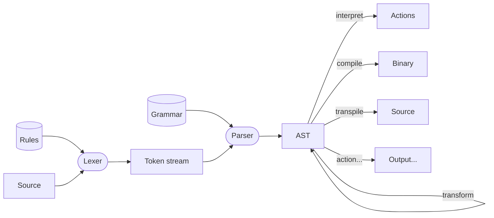

Now that we have a few basic concepts out of the way, let's look at what Langium can provide in these areas.

## Langium

Langium provides:

* A language in which to declare both lexical and grammatical rules (which feeds both the lexer and the parser)
* A way to automatically generate Typescript code (interfaces and functions) that can parse source code in that language, and is kept up-to-date with the grammar by running a command to regenerate the TS files
* Perhaps Langium's star feature: very tight [integration with VS Code](https://langium.org/tutorials/building_an_extension/), such that it's possible to very easily build a VS Code extension that can understand a new language
* The ability to express [validation rules](https://langium.org/tutorials/validation/)
* Facilities to [generate code](https://langium.org/tutorials/generation/) from an AST: transpilation, compilation, and more
* A very configurable LSP (Language Server Protocol) implementation, which, when used on supported IDEs (most of the big ones), provides goodies such as [autocompletion](https://langium.org/docs/configuration-services/#completionprovider), [docs on hover](https://langium.org/docs/configuration-services/#hoverprovider), [rename/refactor](https://langium.org/docs/configuration-services/#renamehandler) (complete with renaming references to that value), and more. In other words, many things that convert a simple text editor, maybe with some syntax highlighting, into a more intelligent IDE that can _understand_, to a degree, the language itself
* Syntax highlighting, in [TextMate](https://macromates.com/manual/en/language_grammars) and [Monaco](https://microsoft.github.io/monaco-editor/monarch.html) formats
* Probably much more that I'm missing

At the heart of every Langium project is the _grammar file_ (or files), a file with the extension `.langium` that contains the structure of the language. This file encodes the language's structure. From this file, Langium generates a set of Typescript files that reflect it, and can be used from Typescript code to parse source documents and manipulate them.

It would probably be possible to package those TS files and publish them on NPM as a standalone parser library for that language. However, Langium also provides more high-level integrations, such as a LSP server an a VS Code extension. These directly consume the language's parser.

Getting started with Langium is very simple, since it's a Typescript project (therefore it uses the JS/NPM ecosystem). Langium integrates with [Yeoman](https://yeoman.io/), which is a tool that can quickly generate a sample project. For example, all Langium projects are only a couple of commands away from becoming a fully-functioning and installed VS Code extension, as opposed to [having to build the appropriate directory structure by hand](https://code.visualstudio.com/api/get-started/extension-anatomy).

Assuming that you already have NPM installed, a single command installs Langium itself (or, to be precise, the Yeoman generator that can generate Langium-enabled projects):

```sh
npm install -g yo generator-langium
```

And then, another command initializes a Langium project, after asking a few questions such as the name of the language and whether or not it should have a VS Code extension:

```sh
yo langium
```

Once that's done, a new directory is created, which contains everything that makes a Langium project tick:

```sh
❯ ls -al
drwxrwxr-x reyes reyes     4 KB Mon Feb  5 20:04:09 2024  .                          
drwxrwxr-x reyes reyes     4 KB Mon Feb  5 20:03:37 2024  ..                         
.rw-rw-r-- reyes reyes   226 B  Mon Feb  5 20:03:37 2024  .eslintrc.json             
.rw-rw-r-- reyes reyes   189 B  Mon Feb  5 20:03:37 2024  .gitignore                 
drwxrwxr-x reyes reyes     4 KB Mon Feb  5 20:03:37 2024  .vscode                    
drwxrwxr-x reyes reyes     4 KB Mon Feb  5 20:03:37 2024  bin                        
.rw-rw-r-- reyes reyes   654 B  Mon Feb  5 20:03:37 2024  index.html                 
.rw-rw-r-- reyes reyes   385 B  Mon Feb  5 20:03:37 2024  langium-config.json        
.rw-rw-r-- reyes reyes   2.6 KB Mon Feb  5 20:03:37 2024  langium-quickstart.md      
.rw-rw-r-- reyes reyes   824 B  Mon Feb  5 20:03:37 2024  language-configuration.json
drwxrwxr-x reyes reyes     4 KB Mon Feb  5 20:04:02 2024  node_modules               
drwxrwxr-x reyes reyes     4 KB Mon Feb  5 20:04:05 2024  out                        
.rw-rw-r-- reyes reyes 111.3 KB Mon Feb  5 20:04:02 2024  package-lock.json          
.rw-rw-r-- reyes reyes   1.8 KB Mon Feb  5 20:03:37 2024  package.json               
drwxrwxr-x reyes reyes     4 KB Mon Feb  5 20:03:37 2024  scripts                    
drwxrwxr-x reyes reyes     4 KB Mon Feb  5 20:03:37 2024  src                        
drwxrwxr-x reyes reyes     4 KB Mon Feb  5 20:04:07 2024  static                     
drwxrwxr-x reyes reyes     4 KB Mon Feb  5 20:04:08 2024  syntaxes                   
.rw-rw-r-- reyes reyes   512 B  Mon Feb  5 20:03:37 2024  tsconfig.json              
.rw-rw-r-- reyes reyes   527 B  Mon Feb  5 20:03:37 2024  tsconfig.monarch.json      
.rw-rw-r-- reyes reyes   720 B  Mon Feb  5 20:03:37 2024  vite.bundle.config.ts      
```

Most important things are in the `src` folder.

### Grammar file

The grammar file (or files, for there may be more than one if the language warrants it or the project is better served by several distinct grammars) are expressed in Langium's grammar (which is itself [expressed in Langium](https://github.com/eclipse-langium/langium/blob/main/packages/langium/src/grammar/langium-grammar.langium), go figure). The example grammar, which every Langium project starts with (it appears on `src/language/<langname>.langium`), is as follows:

```langium
grammar LangName

entry Model:
    (persons+=Person | greetings+=Greeting)*;

Person:
    'person' name=ID;

Greeting:
    'Hello' person=[Person:ID] '!';

hidden terminal WS: /\s+/;
terminal ID: /[_a-zA-Z][\w_]*/;
terminal INT returns number: /[0-9]+/;
terminal STRING: /"(\\.|[^"\\])*"|'(\\.|[^'\\])*'/;

hidden terminal ML_COMMENT: /\/\*[\s\S]*?\*\//;
hidden terminal SL_COMMENT: /\/\/[^\n\r]*/;
```

This grammar can parse files like the following:

```
person Alice
person Bob // another person

Hello Alice!
Hello Bob!
// Hello Charlie! // FIXME: Add Charlie as a person
```

Let's go through the grammar rule by rule (though not in order):

```langium
hidden terminal WS: /\s+/;
terminal ID: /[_a-zA-Z][\w_]*/;
terminal INT returns number: /[0-9]+/;
terminal STRING: /"(\\.|[^"\\])*"|'(\\.|[^'\\])*'/;

hidden terminal ML_COMMENT: /\/\*[\s\S]*?\*\//;
hidden terminal SL_COMMENT: /\/\/[^\n\r]*/;
```

_Terminals_ are lexer rules: they define the extent of a certain word. For example, consider the `Hello Alice!` line in a file. Let's say that we're parsing the `Alice!` part. Is the exclamation mark part of Alice's name or not? For this particular grammar, since (as we'll see later) the name of a person is of type `ID`, and IDs must comply with the regex `/[_a-zA-Z][\w_]*/` (i.e. they must start with a letter or an underscore, and then the rest is letters, numbers or underscores), then we can know that the name of the person ends in the `e`, and the exclamation mark is not part of it.

Similarly, comments are implemented as lexer rules. Whenever two forward slashes are found (`//`), then everything until the end of the line (i.e. until a carriage return or a line feed are found) is gobbled as part of a `SL_COMMENT` token (that's a Single Line Comment, by the way). Multiline comments are the same, except that they eat everything until the closing sequence `*/` is found. Since those tokens are marked as `hidden`, they aren't even visible to the next stage (the grammar/parser). This means that the grammar doesn't need to concern itself about _where_ comments may appear: from its point of view, comments don't exist. If they did, they're gone by the time data reaches the parser.

The rest of the `.langium` file are grammar rules.

```langium
entry Model:
    (persons+=Person | greetings+=Greeting)*;
```

Langium rules have the form `Name: Body`. One rule in the entire file must be tagged as the topmost rule, and it'll have the form `entry Name: Body` (the `entry` is literal). The parser will start on that rule. It typically represents "the whole document", whatever that means. Here, the rule states that the document is a sequence of zero or more (`(...)*`) `Person`s and `Greeting`s (`Person | Greeting`). Not only that, the rule also states that, whenever a `Person` is found, it should be added to the `persons` property of the `Model` (the top-level document), and any found `Greeting`s should be added to the `greetings` property.

This means that, once parsed, a file with persons and greetings will conform to the following TS interface:

```ts
interface Model {
	persons: Array<Person>
	greetings: Array<Greeting>
}
```

which means, in turn, that it's possible to write code as the following:

```ts
function countPeople(model: Model): int {
	return model.persons.length
}

function getMostGreeted(model: Model): string {
	const counts = Object.groupBy(model.greetings, greeting => greeting.person.name)
	
	let maxCount = 0
	let maxName = ""
	
	for(const [person, count] of Object.entries(counts)) {
		if(count >= maxCount) {
			maxName = person
		}
	}
	
	return maxName
}
```

Object that conform to the `Model` interface are now instances of the AST. They all have properties `persons` and `greetings`, which also conform to interfaces as we'll see soon. Once a raw text file has been parsed into a `Model`, it can be programmatically inspected and modified.

Let's now look at the rule that defines a `Person`:

```langium
Person:
    'person' name=ID;
```

This is a very simple rule: it declares that a `Person` looks like the literal string  `person` followed by an ID (that's a terminal, which we already saw). That ID is saved on the `name` property of the Person. Thus, Persons conform to this interface:

```ts
interface Person {
	name: string
}
```

If you get a reference to a `Person`, e.g. by having a reference to a `Model` and then running `modelRef.persons[0]`, then that object will have the `name` property. Nothing more can be deduced from the grammar, so that's all that the TS interface contains.

Finally, the `Greeting` rule:

```langium
Greeting:
    'Hello' person=[Person:ID] '!';
```

This states that a `Greeting` is composed of the `Hello` string, followed by a _cross-reference_ to a `Person` (that's what the square brackets mean), followed by a literal closing exclamation mark. The cross-reference is the interesting part here: it means that, between `Hello` and `!`, there should be _something_ that corresponds to the `name` property of a particular `Person` (the fact that it'll look on the `name` of the cross-referenced objects is by convention). For example, this is valid:

```
person Alice

Hello Alice!
```

The single Person in that file has `Alice` as its `name` property, so when the greeting is parsed it _can_ find a Person which matches that cross-reference. This can be used by languages to ensure that, for example, only existing functions are called, or only existing variables are mentioned. Cross-references are vital when a certain construct that lives on a certain part of the code is mentioned somewhere else.

Langium's grammar reference is [on this page](https://langium.org/docs/grammar-language/). There are things such as [fragments](https://langium.org/docs/grammar-language/#rule-fragments) (which don't generate extra entities, but are instead embedded where they're called, much like inline functions), [guard conditions](https://langium.org/docs/grammar-language/#guard-conditions), [tree-rewriting actions](https://langium.org/docs/grammar-language/#tree-rewriting-actions) and [imports](https://langium.org/docs/grammar-language/#import-of-other-grammar-languages).

Whenever the grammar file is edited, it must be regenerated so the Typescript files are updated. This is done by running `npm run langium:generate` (this command was set up by the Yeoman generator). This writes a bunch of TS files to the `src/language/generated` subdirectory (as its name indicates, it's full of autogenerated files that are to be treated as read-only, since any changes would be overwritten by Langium on the next generation anyways). In fact, every such file starts with the following header:

```ts
/******************************************************************************
 * This file was generated by langium-cli 2.1.0.
 * DO NOT EDIT MANUALLY!
 ******************************************************************************/
```

Additionally, running the generation command updates two files: `syntaxes/<langname>.tmLanguage.json` and `syntaxes/<langname>.monarch.ts`. These are the TextMate and Monarch grammars, respectively, which can be used to add syntax highlighting to different code editors: the Monaco editor (and, by extension, VS Code, Theia, the Github web IDE and others) understand the Monarch grammar, while CodeMirror can use the TextMate grammar).

### Generated files

In particular, the `src/language/generated/ast.ts` file contains the TS interfaces and helper functions that correspond to the `.langium` file. For the grammar above, the following snippets are all part of the file:

```ts
export const MyLangTerminals = {
    WS: /\s+/,
    ID: /[_a-zA-Z][\w_]*/,
    ML_COMMENT: /\/\*[\s\S]*?\*\//,
    SL_COMMENT: /\/\/[^\n\r]*/,
};
```

Nothing too surprising here, these are the terminals, expressed as [JS `RegExp` objects](https://developer.mozilla.org/en-US/docs/Web/JavaScript/Guide/Regular_expressions).

```ts
export interface Model extends AstNode {
    readonly $type: 'Model';
    greetings: Array<Greeting>
    persons: Array<Person>
}

export const Model = 'Model';

export function isModel(item: unknown): item is Model {
    return reflection.isInstance(item, Model);
}
```

This is the top-level interface, with its `greetings` and `persons` properties. There's also a function `isModel`, which takes in _anything at all_ and returns whether or not it indeed _was_ an instance of `Model`. Not only that, it's also [a valid TS type guard](https://www.typescriptlang.org/docs/handbook/2/narrowing.html#using-type-predicates), a really cool feature that can be used to provide much nicer type inference:

```ts
// we have a variable x of type `any`
console.log(x.greetings) // TS will underline this in red, since it can't guarantee that x has a greetings property

if(isModel(x)) {
	console.log(x.greetings) // TS is now happy: since this is protected by a type guard, it knows that inside the if() statement x is most definitely a Model
}
```

Then, the `ast.ts` file contains the declarations for Persons and Greetings, each with its own type guard too:

```ts
export interface Person extends AstNode {
    readonly $container: Model;
    readonly $type: 'Person';
    name: string
}

export const Person = 'Person';

export function isPerson(item: unknown): item is Person {
    return reflection.isInstance(item, Person);
}

export interface Greeting extends AstNode {
    readonly $container: Model;
    readonly $type: 'Greeting';
    person: Reference<Person>
}

export const Greeting = 'Greeting';

export function isGreeting(item: unknown): item is Greeting {
    return reflection.isInstance(item, Greeting);
}
```

Note that these objects, in addition to having their own properties (a `name` for a Person, and a `person` reference for a Greeting) also have a `$container` property that points to an entire `Model`. This means that now you can travel from a Model down to its Persons, such as `model.persons`, and also back up from a Person to its Model via `person.$container`. Of course, it's also possible to travel sideways from a Greeting to a Person by following `greeting.person`.

Then there's a bunch of reflection functions that can be used, for example, to detect the type that a reference points to, or the metadata of a type (e.g. which properties of a type are mandatory, and what type they have, such as both `persons` and `greetings` being mandatory and of type `array` for Models).

### Service files: Validator

Up until now, Langium has behaved mostly as a parser generator: it reads a `.langium` file, and spits out a bunch of TS code that has been automatically generated to parse files that conform to the grammar in the `.langium` file. This could be packaged as a NPM package that provides programmatic access to information contained in files written in whatever DSL the project understands. Things like detecting which tables are mentioned on a SQL query, for example. However, Langium has more.

Langium projects come with a file called `src/language/<langname>-validator.ts`. This file contains custom (i.e. language-specific) validation rules. These are registered in a function called `registerValidationChecks`, which hooks validation functions into specific AST nodes. For example, if we wanted to ensure that something is always (or never) true for Persons, we could register a validation rule on the `Person` node:

```ts
export function registerValidationChecks(services: MyLangServices) {
    const registry = services.validation.ValidationRegistry;
    const validator = services.validation.MyLangValidator;
    const checks: ValidationChecks<MyLangAstType> = {
        Person: validator.checkPersonIsNotBill
    };
    registry.register(checks, validator);
}
```

By calling `registry.register(checks, ...)`, this function has declared its intent to run every validation found in `checks`. `checks` is a JS object, where keys are the nodes on which the validation runs, and values are either single function references or arrays of function references. The actual validation function, by convention, is implemented on a separate object of class `MyLangValidator`:

```ts
export class MyLangValidator {
    checkPersonIsNotBill(person: Person, accept: ValidationAcceptor): void {
        if (person.name && person.name === "Bill") {
            accept('warning', 'We don\'t know any Bills here!', { node: person, property: 'name' });
        }
    }
}
```

This validation function will always be called with a parameter of type `Person`, and also a `ValidationAcceptor` that it can use to report back any errors. Here, since we have a parameter that complies to the interface `Person` (recall that `Person`s will have a `name` property of type `string`), the validator checks the person's name and rejects if it has a certain value. Of course, more advanced validations are possible. Since the error is thrown with a severity of `warning`, that means that most IDEs will render it in yellow, slightly less prominently than full-fledged `error`s:

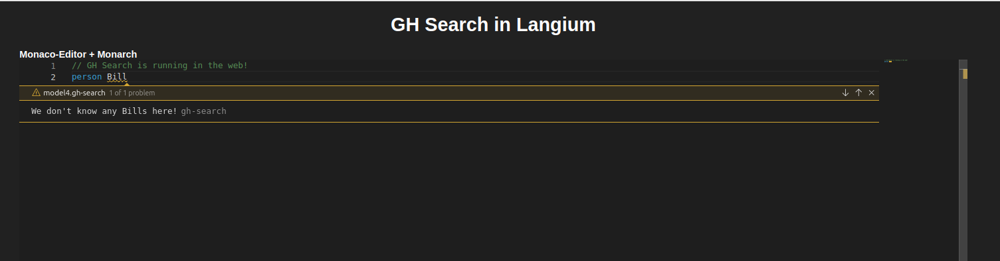

Not only that, it's also possible to control the diagnostic message. For example, it's possible to command that it covers the entire node (here, the entire Person), as opposed to just the name. It's also possible to give the diagnostic an ID (this is common on code-quality tools such as [Semgrep](/posts/semgrep-blog-rules/) and [Snyk](https://docs.snyk.io/integrate-with-snyk/ide-tools/visual-studio-code-extension/view-analysis-results-from-visual-studio-code-extension/analysis-results-snyk-code), where this custom ID usually points to the ID of the rule that caused this warning to appear, such as "HTTP requests should not have TLS validation disabled"). Here, the rule is called `no-billz`. While that isn't shown here, it's also possible for a validation to mark its node as deprecated. This can be used by code analysis tools to mark deprecated functions that should be migrated away from.

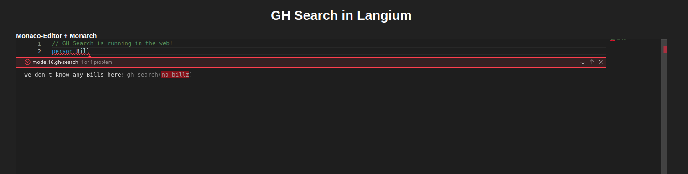

Furthermore, it's not necessary for validations to constrain themselves to a single node. Here, the decision to accept or reject a `Person` is simple: just look at its name. However, decisions may require more context: for example, let's say that a validation needs to check whether there are duplicate person names. This can't be done by looking at individual Persons, since (by itself) every Person is valid.

To do this, we can hook a validator to the entire Model instead, rather than to individual Persons. Then, the validator will receive a `Model` as its first parameter (the `ValidationAcceptor` will still be the second one). The validator can access `model.persons` (which, remember, is an array of Persons), iterate over it, and mark any repeated Persons as invalid. To do so, it can use the `accept(..., ..., {config})` parameter: it takes a `node` property that points to the node that will be highlighted as invalid, which could be the individual person (as opposed to highlighting the entire Model as invalid).

### Testing the model

In keeping with the spirit of easing the development of custom languages, Langium generates all the tooling that is necessary to integrate the freshly-developed language with [the Monaco editor](https://microsoft.github.io/monaco-editor/). This is the editor that powers VS Code, [Eclipse Theia](https://theia-ide.org/) (which, in turn, powers the new Arduino IDE and the [Google Cloud Shell](https://cloud.google.com/blog/products/application-development/introducing-cloud-shell-editor), among others), and probably countless other small-ish code editors in many places. If you're unsure whether you're currently on a Monaco window, press Ctrl+Shift+P. If the following dialog (the command palette on the top center) appears, then it's indeed Monaco:

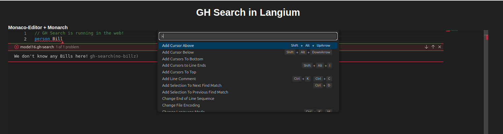

Getting from the `.langium` file (and ancillary TS files, such as the validator that we've just reviewed) to a working code editor requires two commands:

```sh
npm run build:bundle
npm run dev
```

The first command compiles everything and places it in the correct folders. The second one spawns a simple web server, which serves HTML, CSS and JS files. It also prints out a HTTP address, which for me was <http://localhost:5173/>. Visiting that page on a browser reveals a very simple page, with two links. They lead to different pages, both of which contain a Monaco editor, except configured to use two different grammars, the native Monaco grammar and the TextMate grammar:

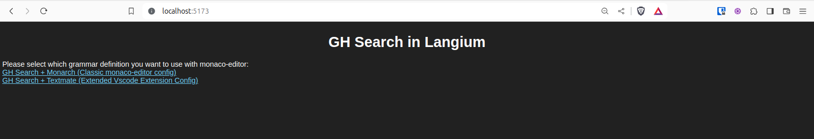

Both look almost the same, so we'll click the Monaco grammar:

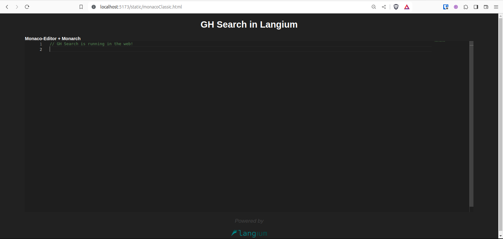

It opens a complete Monaco editor, which is already configured so it understands our new language. Syntax highlighting works, courtesy of the Monaco/TextMate grammar. Simple (and not-so-simple) editing commands (e.g. search and replace, multiple carets, a minimap at the side, and so on) are provided by Monaco proper. Code completion, error messages and more are provided by our custom modules, such as the Validator module, which are also compiled into JS, bundled into a Language Server, and shipped to the client. The Language Server for our custom language runs in [a Web Worker](https://developer.mozilla.org/en-US/docs/Web/API/Web_Workers_API/Using_web_workers) and contains a _serious_ amount of logic, all on the client's browser:

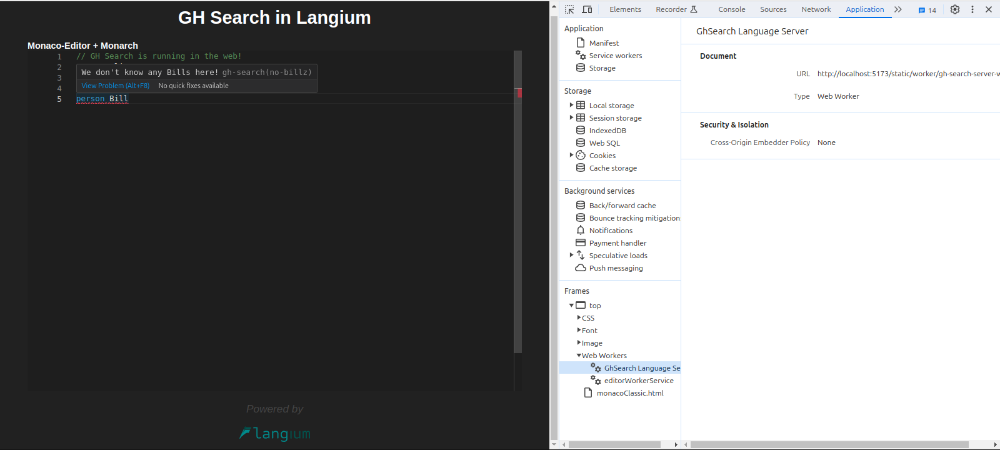

From here on, whenever changes are made to the TS files that support the grammar, the two commands above should be run to regenerate the JS files. Furthermore, if changes were made to the actual grammar(s) file(s) (i.e. the one with extension `.langium`), it's necessary to, first of all, run `npm run langium:generate`, since this is the command that converts that file into TS interfaces and functions. Otherwise, the entirety of the TS code would continue working with the old language definition.

Langium also ships with commands that can directly create and compile a VS Code extension, and even launch a VS Code instance that is already configured to have that extension installed. However, since we're not building VS Code extensions in this post, we'll ignore that one.

## Writing grammars

Now we'll run through a couple of Domain-Specific Languages, in order to provide an idea of where DSLs appear, which in turn means places where Langium can be useful.

### Github's search language

Github has a search bar at the top, from which many results can be found: repositories, people, organizations, issues, PRs, even specific code lines inside repos. Some examples, taken [from Github's docs](https://docs.github.com/en/search-github/searching-on-github/searching-for-repositories):

* `repo:octocat/hello-world` matches a specific repository name
* `forks:200..300` matches repositories with between 200 and 300 forks
* `committer-date:>2016-01-01` matches commits committed after 2016-01-01
* `github commenter:defunkt type:issue` matches issues that contain the word "github," and have a comment by @defunkt
* `broken in:body -label:bug label:priority` matches issues with the word "broken" in the body, that lack the label "bug", but do have the label "priority"
* `mike in:name created:<2011-01-01 type:user` matches personal accounts named "mike" that were created before 2011
* `created:2010-01-01..2011-01-01 john in:login` matches users that joined between 2010 and 2011 with the word "john" in their username
* `is:issue assignee:@me` matches issues assigned to the person viewing the results
* `org:github sort:interactions` matches issues in repositories owned by GitHub, sorted by the highest combined number of reactions and comments

There are several points of interest here:

* Search strings are a set of "words", separated by spaces
* Some parts of the query look like `property:value`. These indicate, for example, which property of the entity (e.g. the repo, issue or commit) will be checked for the `value`
* It's possible to express not only equality comparisons, but also greater-/less-than operations with `property:>value`
* Similarly, it's possible to express ranges with `property:lower..upper`
* A condition can be negated, thereby excluding all results that match it, by prefixing it with a minus sign/hyphen: `-label:bug`
* From what I can see, there's no way to group conditions, at least on the global search language. The similar (but not identical) [Code Search language](https://docs.github.com/en/search-github/github-code-search/about-github-code-search) is able to express [boolean operations and groupings](https://docs.github.com/en/search-github/github-code-search/understanding-github-code-search-syntax#using-boolean-operations)
* There is a magical variable, `@me`, which can be used whenever a username should be provided. This magical variable is replaced at search time with the username of whoever is searching
* To round things off, there's a special `property`, i.e. `sort`, which doesn't transform into a seach condition. Instead, it transforms the results (i.e. it reshuffles them)

I originally tried to do a really fancy grammar, which could understand that, say, ranges such as `stars:100..200` need to have integers on both sides of the `..`, or that `field:>X` conditions must have X be an integer. Something like this:

```langium
grammar GhSearch

entry Query:
    (conditions+=Qualifier (SPACE conditions+=Qualifier)* sort?=SortQualifier?)?;

Qualifier:
    SimpleTextQualifier | NegatedTextQualifier | KeyValueQualifier | NegatedKeyValueQualifier;

NegatedTextQualifier:
    'NOT' SPACE SimpleTextQualifier;
NegatedKeyValueQualifier:
    '-' KeyValueQualifier;

SimpleTextQualifier:
    word=(WORD | STRING);

KeyValueQualifier:
    {infer RelationKVInt} field=IntField ':' op=('>' | '<' | '>=' | '<=') val=INT
    | {infer RelationKVDate} field=IntField ':' op=('>' | '<' | '>=' | '<=') val=DATE
    | {infer RangeKVInt} field=IntField ':' val1=INT '..' val2=INT
    | {infer RangeKVDate} field=DateField ':' val1=DATE '..' val2=DATE
    | {infer EqualsKVString} field=(StringField | BooleanField) ':' val=(WORD | STRING | '@me')
    | {infer EqualsKVInt} field=IntField ':' val=INT
    | {infer EqualsKVDate} field=DateField ':' val=DATE;

SortQualifier:
    'sort:' field=(StringField | BooleanField | IntField | DateField) ('-' reactionType?=('+1' | '-1' | 'smile' | 'tada' | 'heart'))? ('-' order=('asc' | 'desc'))?;

StringField returns string:
    'in' | 'repo' | 'user' | 'org' | 'language' | 'fork' | 'topic' | 'license' | 'is' | 'has'
    |'author' | 'committer' | 'author-name' | 'committer-name' | 'author-email' | 'committer-email' // commits
    | 'hash' | 'parent' | 'tree' // commits
    | 'type' | 'state' | 'reason' | 'assignee' | 'mentions' | 'team' | 'commenter' | 'involves' | 'linked' | 'label' | 'milestone' | 'project' // issues
    | 'status' | 'head' | 'base' | 'review' | 'reviewed-by' | 'review-requested' | 'user-review-requested' | 'team-review-requested' // PRs
    | 'no' | 'answered-by' | 'involves' | 'category' | 'location';

BooleanField returns string:
    'mirror' | 'template' | 'archived' | 'merge' | 'draft';

IntField returns string:
    'size' | 'followers' | 'forks' | 'stars' | 'topics' |'good-first-issues'|'help-wanted-issues'|'repositories' | 'comments' | 'interactions' | 'reactions'
    | 'repos';

DateField returns string:
    'created' | 'pushed' | 'author-date' | 'committer-date' | 'updated' | 'closed' | 'merged';

terminal SPACE: ' ';
terminal INT returns number: /[0-9]+/;
terminal DATE: /\d{4}-(0[1-9]|1[012])-(0[1-9]|[12]\d|3[01])/;
terminal STRING: /"(\\.|[^"\\])*"/;
terminal WORD: /[^\s:]+/;
```

Alas, that doesn't work. Some problems that I encountered was that Langium grammars seem to want tokens to be separated by spaces (though not all of them), while the Github search language may easily have `field:>100..200`, which should be tokenized as `[field] [:] [>] [100] [..] [200]`. I also encountered problems with the precedence of terminals: for example, consider `-is:fork`. I'd expect that to be lexed into `[-] [is] [:] [fork]`, which would in turn be parsed via the `NegatedKeyValueQualifier` rule (since it's `-` plus a valid `KeyValueQualifier`), which should in turn be parsed as a `EqualsKVString` with `field=is` and `value=fork`. However, Langium wanted to parse `-is` as a single `SimpleQual` (which _does_ make sense, it matches the regex after all), after which should be a space, not `:fork`.

That's probably due to my own unfamiliarity with Langium's quirks more than anything else. As an aside, even Github's own search bar (which syntax-highlights search terms) can be tricked into accepting wrong input. For example, `is:fork` is a valid search term, but the search bar also accepts `is:>100`, which makes no sense. Similarly, `stars:>100` is valid, but the search bar will happily highlight `stars:>a`:

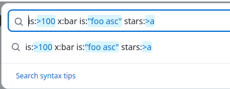

### Bruno config files

[Bruno](https://www.usebruno.com/) is a relatively new, [open source](https://github.com/usebruno/bruno/blob/main/license.md), offline-only API client. The most well-known alternatives would probably be Postman and Insomnia. The key difference between Postman/Insomnia and Bruno is best explained by looking at [Bruno's star history](https://star-history.com/#usebruno/bruno&Date):


See the _very conspicuous_ increase about October 2023? That took Bruno from 700 stars, slowly accrued over very nearly a year, to 6K stars in two weeks. Did something else happen about that time, I wonder?

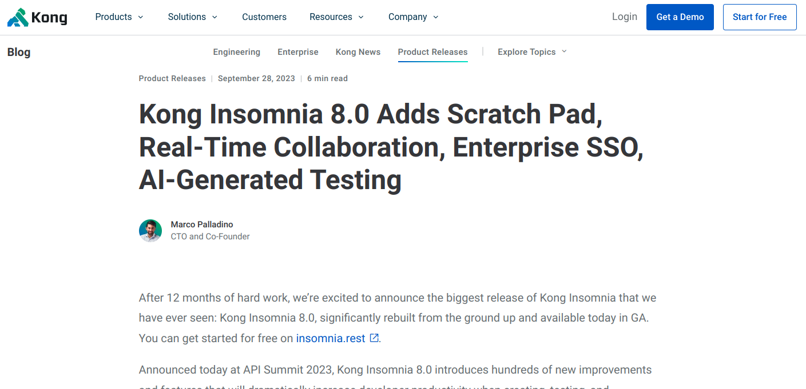

Well, [yes, it did](https://konghq.com/blog/product-releases/insomnia-8-0). On September 28, 2023, ~~at 3:14 in the afternoon~~ (kidding, I don't know the hour), Insomnia announced the release of version 8.0. It added collaboration features, a Scratch Pad mode, and other stuff.

Almost instantly, [people](https://github.com/Kong/insomnia/discussions/6590) [went](https://github.com/Kong/insomnia/discussions/6626) [ballistic](https://github.com/Kong/insomnia/issues/6624). [More](https://tomaszs2.medium.com/insomnia-8-users-are-furious-after-the-new-release-99d05fc80a22). [And the obligatory HN thread](https://news.ycombinator.com/item?id=37680126). The reason was that, upon updating to v8.0 (which I don't think Insomnia did by itself, to be fair), you were greeted with a nice big "Sign In" button. And another one that took you to the shiny new "Local Scratch Pad"... which was empty. In other words, either Sign In (or create a cloud account), which would move all your requests to their cloud, or lose everything.

For a while, some people were desperately looking for ways to recover their precious request collections _without_ creating an account, which would have triggered a cloud sync of said collections. And, while there's no hard data to back this up, it's possible that a certain amount of Insomnia users are Postman exilees, who left Postman [when it went cloud-sync-only, more or less](https://blog.postman.com/announcing-new-lightweight-postman-api-client/). (Full disclosure: I'm one of them). So there's _possibly_ a certain amount of... strongly-held opinions there.

Less than three weeks later, [Insomnia v8.3 was released](https://konghq.com/blog/product-releases/insomnia-8-3). Its main feature was bringing back fully-local storage (dubbed Local Vault). So this particular story ended well. In any case, I'm still on 2023.5.8 myself. That's the latest version before 8.0 (they also changed versioning scheme). Just in case someone gets any funny ideas again.

In the middle of that, a tiny project called Bruno was racking up Github stars and, presumably, attention, [code and features](https://github.com/usebruno/bruno/graphs/commit-activity).

So, in other words: Bruno is local-only. They've promised. No cloud-sync pivot to monetize the company once enough people use it.

To aid with that, Bruno stores its requests as plain-text files. Those files are treated as readable by you, not as some arcane format that only Bruno shall be allowed to touch. Versioning a request collection is as easy as `git init`ing that folder and committing.

Here are the data directories of Bruno, on the left; and Insomnia, on the right:

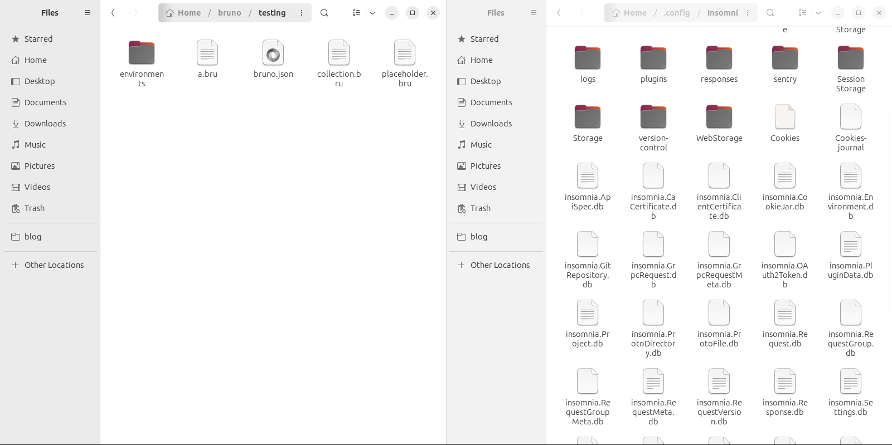

Which of those, on the Insomnia side, stores your requests? Can you read it? Can you back it up or quickly diff it to see what has changed against another version?

It turns out that Insomnia requests live on the file `insomnia.Request.db`, which (despite its name) is a JSON file. One line per request. So you _can_ read it. Whether you should or not is another matter. I won't even try to paste an example here. It's ugly, minified JSON (since it's not intended to be read by people). Minified JSON doesn't diff well: you'd find yourself scrolling over very long lines to find a small change.

By contrast, here's the file called `a.bru`. It contains the information of a single request:

```bruno
meta {
  name: A Request
  type: http
  seq: 1
}

post {
  url: https://example.com?param=a
  body: json
  auth: bearer
}

query {
  param: a
}

headers {
  See: no-evil
}

auth:bearer {
  token: s3cr3t
}

body:json {
  {
    "x": 1,
    "y": [2, "3"]
  }
}

assert {
  $status: eq 200
}

docs {
  This is a sample request
}
```

One can imagine how `git diff`ing this file would be a much more pleasant experience than the massive Insomnia file.

Also, after this (rather long) detour into the internal politics of the Country of API Clients, let's go back to Langium and DSLs. As you can see, Bruno uses a custom language to encode requests. The main author of Bruno [even started a Conversation](https://github.com/usebruno/bruno/discussions/360) where he covers reasons for using a brand-new DSL, as opposed to just using JSON or YAML to encode requests. There's talk of [another version of the language](https://github.com/usebruno/bruno/discussions/1290) and [support for TOML is now in the works](https://github.com/usebruno/bruno/issues/1303), but for now there's the Bru language V2.

In fact, [here's its parser](https://github.com/usebruno/bruno/blob/main/packages/bruno-lang/v2/src/bruToJson.js#L24-L100). Bruno uses [Ohm](https://ohmjs.org/), a JS package to write parsers and associated tooling. Bruno's grammar is about 75 lines long, i.e. not much. Then there's a lot of JS code that transforms a Bru file into JSON, which the rest of the application uses, [and also back](https://github.com/usebruno/bruno/blob/main/packages/bruno-lang/v2/src/jsonToBru.js) (for storage).

Again, however, I quickly found myself stuck. This is the start of a Bruno file, which contains some general information about the request:

```
meta {
  name: echo json
  type: http
  seq: 1
}
```

Which tokens would we have here? As a reminder, tokens are just sequences of characters, read from start to end of the file. We'd want something like this:

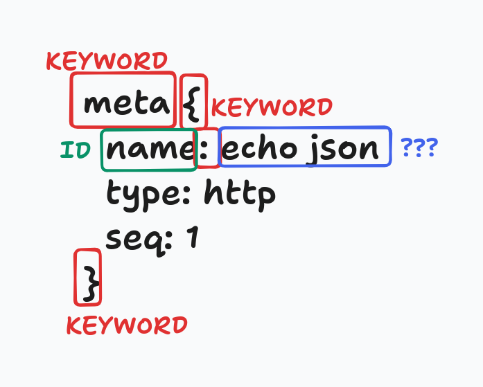

* `meta` is definitely a keyword, since it can be known beforehand
* Same goes for the opening brace, which starts the `meta` block
* Inside the block, there's a set of arbitrary key-value pairs. The first key happens to be `name`. Its constraints are that it can't contain whitespace characers, nor a colon `:` (since that's what determines the end of the key) 
* Then, there's a literal colon `:`, which is another keyword
* And then, there's a value, which spans from after the colon to the end of the line, without including it

One would imagine that the following Langium grammar would implement just what we've reviewed:

```langium
grammar Bruno

entry Request:
    (meta=Meta | http=Http | headers=Headers | ...)*;

Meta:
    'meta' data=Dictionary;

Dictionary:
   '{' (pairs+=Pair)* '}';

Pair:
    k=KEY ':' v=VALUE;

terminal KEY: /[^\s:]+/;
terminal VALUE: /[^\n]+/;
```

However, it doesn't. Plugging that grammar into [the Langium Playground](https://langium.org/playground/) makes it display an error "Your grammar contains errors", and opening the DevTools console with F12 reveals the following error:

```
Request initialize failed with message: Errors detected in definition of Lexer:
Token: ->meta<- can never be matched.
Because it appears AFTER the Token Type ->VALUE<-in the lexer's definition.
See https://chevrotain.io/docs/guide/resolving_lexer_errors.html#UNREACHABLE-----------------------
Token: ->{<- can never be matched.
Because it appears AFTER the Token Type ->VALUE<-in the lexer's definition.
See https://chevrotain.io/docs/guide/resolving_lexer_errors.html#UNREACHABLE-----------------------
Token: ->}<- can never be matched.
Because it appears AFTER the Token Type ->VALUE<-in the lexer's definition.
See https://chevrotain.io/docs/guide/resolving_lexer_errors.html#UNREACHABLE-----------------------
Token: ->:<- can never be matched.
Because it appears AFTER the Token Type ->VALUE<-in the lexer's definition.
See https://chevrotain.io/docs/guide/resolving_lexer_errors.html#UNREACHABLE
```

As far as I can understand it, that means that several tokens (namely, `meta`, `{`, `:` and `}`) are being "shadowed" by the `VALUE` terminal. Which makes sense, in a way: the character sequence `meta` _does_ match the regex that we supplied for `VALUE`. In other words, this means that the snippet of Bruno code could actually be tokenized like this:

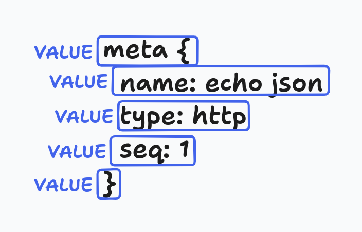

Not so useful now, right? Again, I'm not quite sure, but it seems like Langium's lexer chooses the token that provides the longest match. For example, at the first character, both the `meta` token and the `VALUE` terminal would start matching (and, actually, `KEY` would too). However, if Langium chose the `meta` token, it'd have to stop its match after the fourth character, while using the `VALUE` terminal would continue matching until the end of the line. Which is "preferable" to Langium, but useless to us.

Even if that could be somehow fixed, how about this Bruno code?

```
meta {
  name: meta
}
```

Is the `meta` in the name parsed as a `VALUE` or as the `meta` token? It's the same sequence of characters, after all.

Notice that this would never be an issue in a general-purpose programming language, since they would just declare `meta` a reserved keyword: you can't, for example, declare a variable called `if`. 

Ideally, what we'd want would be for the lexer and the parser to be aware of each other, such that (for example) inside of a `meta {...}` block, `meta` shouldn't be a keyword but parsed as a normal `VALUE`. Similarly, the `VALUE` terminal should only be active when inside a `{...}` block, and at the start of a file only the block starts, such as `meta {...}`, `http {...}` and so on, should be enabled. That, however, isn't possible on Langium, as far as I can tell, since lexing and parsing happen one after the other, and such kinds of conditionally-active lexing rules would require some sort of knowledge of the currently-active parser rule. I don't even know if that is possible to begin with, or if that would be some sort of "you must know the parse tree to determine the parse tree" conundrum. There is [scannerless parsing](https://en.wikipedia.org/wiki/Scannerless_parsing), but I can't tell if that would enable such kinds of conditional rules. It looks like it may: [this SO answer](https://stackoverflow.com/a/45225490) indicates that "PEG parsers don't use a separate lexer because they don't need one" and Ohm (which the original Bruno parser uses, and which can express those "conditional tokens", for lack of a better term) is indeed [a PEG parser](https://ohmjs.org/).

## Conclusions

* Langium is a tool that provides a lot of facilities when designing a language, such as a LSP server, which in turn provides syntax highlighting, autocompletion, validations, docs on hover and more
* Langium-developed languages can be quite easily packaged into a VS Code extension, which adds support to that language
* Langium's languages can also be integrated into Monaco-based editors, and (with some more effort) with other code editors, as long as they have an LSP integration
* I'd need to learn a lot more about language engineering
* Parsers are _very_ different from one another: the fact that a language has a formal grammar written for one parser does not mean that rewriting that grammar for another language is even _close_ to reasonably easy. For an example, see the Bruno grammar
* For example, Langium uses the traditional two-pass lexer+parser system. While that works plenty fine for, say, programming languages, there are custom languages where using that scheme is strange, forcing terminals to be overly generic or flat-out impossible to use. Other frameworks, such as Ohm, don't seem to have such distinctions and can therefore parse the same sequence of characters as different rules depending on what rule is currently active
