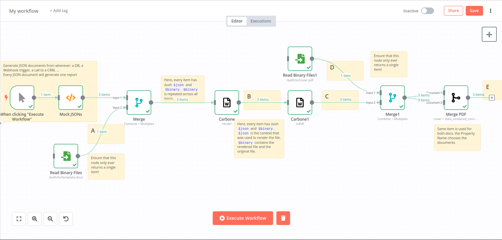
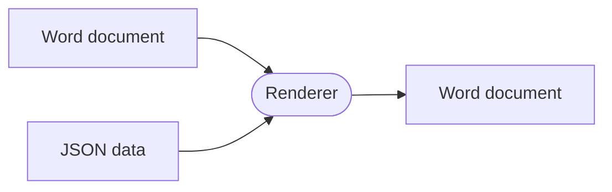
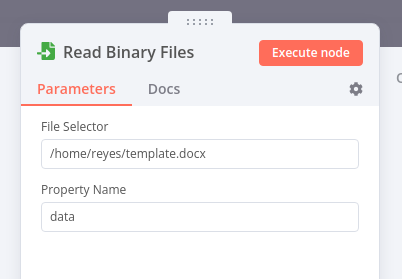
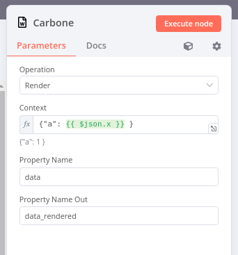
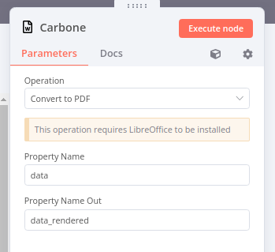
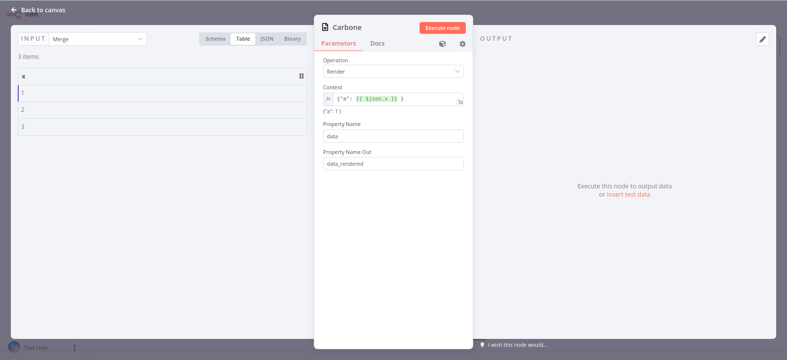

TL;DR: We've developed and published a custom node (two, actually) for the [N8N](https://n8n.io/) workflow automation tool, which adds the capability to generate DOCX documents from a template and some variable data:



This lets you use N8N to generate custom reports, invoices, and such documents with a fixed structure and variable contents.

The node is published at <https://github.com/jreyesr/n8n-nodes-carbonejs>, and you can install it on your N8N instance by going to the `Settings>Community Nodes` tab and installing `n8n-nodes-carbonejs`.

---

Hello! Today we'll take a break from [the OpenChatflow chatbot designer](https://jreyesr.github.io/posts/chatflow-6/) that we've been working on to work on something completely different: a new custom node for the [N8N](https://n8n.io/) workflow automation tool, which lets you generate Word documents from a Word template, combined with some JSON data. This is a really common enterprise-y requirement, and it's quite strange that there seem to be no such integrations in N8N. We'll use the [Carbone project](https://carbone.io/)'s JS library to do so.

To be clear, this is what we need:



We'll use the [Carbone JS library](), since 

* It's open source(ish, though the [FSF](https://www.fsf.org/) will probably not think so)
* It's written on Javascript, hence should be compatible with N8N
* At least for me, the templating language is really intuitive
* The open-source library has mostly all templating features, except for dynamic images, native charts, hyperlinks, ToCs, forms and QR codes.

## An introduction to DOCX templating and Carbone

Here's how Carbone works, taken from their own docs:


Here you can see a sample document (again, taken from Carbone's page):


If you have used an HTML templating library, such as [Django](https://docs.djangoproject.com/en/4.2/ref/templates/language/#templates), [Jinja](https://jinja.palletsprojects.com/en/3.1.x/templates/#synopsis), [Handlebars](https://handlebarsjs.com/guide/#what-is-handlebars), [Twig](https://twig.symfony.com/doc/3.x/templates.html#synopsis) or [Vue's templates](https://vuejs.org/guide/essentials/template-syntax.html#text-interpolation), you should find Carbone to be quite similar. Variable placeholders are placed inside single curly braces `{ var.name }`, and when rendering the template they are replaced by whatever corresponding values are in the JSON file. In this way, the same template can be used to generate many similar documents: invoices, diplomas, letters, any sort of business-y document that would otherwise require some poor soul to copy an old document and then change every variable part to a new value.

Other specialized bits of syntax are used to mark conditional blocks and loops.

Carbone has two main ways of usage: a Javascript library, which is [open source](https://github.com/carboneio/carbone), and [Carbone Cloud](https://carbone.io/pricing.html), which you access via a REST API. There's also Carbone On-Premise, but that's an enterprise-targeted version whose price is "Contact Us", sooo...

There's already a [N8N node that interfaces with the Carbone Cloud REST API](https://github.com/SpaghettiBridge/n8n-nodes-carbone), but that's only for the REST API. The amount of documents that you can render there for free is limited, and any further documents may cost you up to €0.05 per document. Not too much, but we're cheap here. Besides, using the Carbone Cloud requires that you send your data to a cloud service, which may make some people queasy. That being said, there's nothing wrong with the Carbone Cloud service, but there would be no blog post if we just stopped here, right?

There's also [a thread in N8N's discussion forums](https://community.n8n.io/t/installing-the-external-module-carbone-io/14517/4) asking for guidance with using the Carbone library inside N8N. N8N does allow you to install any NPM package on it, with more or less ease depending on whether you are using Docker or a native install. The asker used a generic Code node, in which you can run any JS code, to import and use the library. Again, nothing wrong with that. The next level of integration is adding a dedicated node, which receives a DOCX document and a JSON document, mashes them together and outputs another DOCX document. That would be another little square inside your awesome flow that, say, pulls transaction data from Stripe, user data from a SQL database, makes invoices for everyone and then mails them out, and finally sends a Slack message with the amount of invoices sent.

## Creating an N8N node

### Development environment setup

For this part, I just [followed N8N's documentation page on the matter](https://docs.n8n.io/integrations/creating-nodes/build/node-development-environment/). They have done a very good job of providing a really fluid development experience, which encourages fast iteration loops. For instance, you can link your in-development node to a local N8N instance, and any changes get live-recompiled with the `npm run dev` command.

### Creating a base repo

N8N provides [a starter repo](https://github.com/n8n-io/n8n-nodes-starter/) loaded with sample code. It leverages Github's [template repositories](https://docs.github.com/en/repositories/creating-and-managing-repositories/creating-a-repository-from-a-template) so that creating a new repo from that is a low-click-count operation (maybe three clicks?)

The starter template will create a repository in your account, with some sample nodes. A good place to start changes would be the `package.json` file, where you'll need to change the package name, maintainer, repo URL, description and everything else that you need.

## Building the nodes: Carbone node

The main attraction of the package will be a node that provides access to the [Carbone JS library](https://carbone.io/api-reference.html), specifically to [the document rendering function](https://carbone.io/api-reference.html#carbone-render). From Carbone's docs, this is a sample call:

```js
const fs = require('fs');
const carbone = require('carbone');

// Data to inject
var data = {
  firstname : 'John',
  lastname : 'Doe'
};

// Generate a report using the sample template provided by carbone module
// This LibreOffice template contains "Hello {d.firstname} {d.lastname} !"
// Of course, you can create your own templates!
carbone.render('./node_modules/carbone/examples/simple.odt', data, function(err, result){
  if (err) {
    return console.log(err);
  }
  // write the result
  fs.writeFileSync('result.odt', result);
});
```

The heart of the code is the `carbone.render` global function, which you must call with:

*  The path to a _template file_, which would be a Word/LibreOffice document with [special tags](https://carbone.io/documentation.html#substitutions), which on render will be replaced with data from...
*  The _context_, which is a JS object or JSON document that holds data. If you were building an invoice, it would hold data about every item bought. For a "monthly user report", whatever that was, it would contain a list of users. And so on.
*  (Optionally) A [set of options](https://carbone.io/api-reference.html#carbone-render), such as the desired output format (defaults to the same format as the input template).
*  A _callback function_ that will be called when the render is completed, whether successfully or with an error. This is [fairly common in Node.JS](https://www.freecodecamp.org/news/nodejs-callbacks/), from before [promises became commonly used](https://blog.jcoglan.com/2013/03/30/callbacks-are-imperative-promises-are-functional-nodes-biggest-missed-opportunity/), and it can lead to weird code, but that's what we have. Inside the callback function, we get two new parameters: `err`, which will be set if the render encountered any error, and `result`, which is a Buffer holding the binary contents of the rendered file. The example code immediately writes that back to disk, but we won't, since we want to pass it around a workflow instead.

That's almost all that you need to know about Carbone! Everything else happens in the N8N node file.

N8N already provides a ton of scaffolding for creating custom nodes. Your node has to implement the `INodeType` interface, which in turn means that you have to declare a `description` field and (probably) implement an `execute()` function. The `description` field will hold node metadata, such as the actions that the node can perform, and configuration values for each action. The `execute()` function will get called by the N8N machinery whenever your node has to do work.

### The node description field

Every node is declared in a file, located in `nodes/<NodeName>/<NodeName>.node.ts`, as an exported class that `implements INodeType`. Every node must have a `description` field, which holds:

* The node names: an internal name, used in the JSON representation of a workflow; a display name, used when searching for nodes in the sidebar; and a default name, which is used for newly-added nodes of that type
* An icon for the node, which must be an SVG file placed right besides the `.node.ts` file
* A description, which also appears in the sidebar when browsing the nodes
* A declaration of the inputs and outputs, called [ports](https://reaflow.dev/?path=/story/demos-ports--complex-ports) or [handles](https://reactflow.dev/docs/concepts/terms-and-definitions/#handles) on other flow editors. Most nodes will have a single input and a single output, but others may have odder combinations:
	* The [Merge Node](https://n8n.io/workflows/1862-openai-gpt-3-company-enrichment-from-website-content/) has two inputs and one output, and combines them in several ways: it can just stick them together and output them, or join them pairwise (first with first, second with second, ...), or do [a SQL-like JOIN operation](https://www.dofactory.com/sql/join), or even [the cartesian product](https://en.wikipedia.org/wiki/Cartesian_product) of both inputs
	* The [If Node](https://docs.n8n.io/integrations/builtin/core-nodes/n8n-nodes-base.if/#example-usage) is your basic conditional node, and it has one input and two outputs. Data that appears on the input is shunted to one of the two outputs
	* A bigger version of the same, the [Switch node](https://docs.n8n.io/integrations/builtin/core-nodes/n8n-nodes-base.switch/#example-usage) has four outputs
	* The [Split in Batches Node](https://docs.n8n.io/integrations/builtin/core-nodes/n8n-nodes-base.splitinbatches/#example-usage-read-rss-feed-from-two-different-sources) also has two outputs, but they are conceptually different, unlike the If and Switch nodes
* A set of "properties", which are the fields that appear when you are configuring a node. For instance, here's the configuration of a node that reads files from disk:
    
	
These properties deserve a deeper dive, since they control the node's UI. Properties are input fields (text fields, number fields, dropdowns, checkboxes or switches, and so on), each with a title, optional description and hint, type and default value. By default, every field would appear on every operation, but every property can have visibility conditions to make fields appear and disappear dynamically, depending on the values of other fields.

For instance, the Carbone node has two operations: Render and Convert to PDF. The configuration dialogs for each operation look as follows:





As you can see, the Operation is always shown, as are the Property Name and Property Name Out fields. However, the Context is only shown on the Render operation (as that's the only operation where we need a JSON document as an input) and the Convert to PDF operation has a yellow "alert" dialog. This is implemented as follows:

```ts
[
	{
		displayName: 'Operation',
		name: 'operation',
		type: 'options', // Dropdown!
		noDataExpression: true,
		options: nodeOperations,
		default: 'render',
	},
	{
		displayName: 'This operation requires LibreOffice to be installed',
		name: 'notice',
		type: 'notice',
		default: '',
		displayOptions: { // only when the Convert to PDF operation selected
			show: { operation: ['toPdf'] },
		},
	},
	{
		displayName: 'Context',
		name: 'context',
		type: 'json',
		default: '{}',
		description: 'This data will be used to fill the template',
		displayOptions: { // only when the Render operation selected
			show: { operation: ['render'] },
		},
	},
	{
		displayName: 'Property Name',
		name: 'dataPropertyName',
		type: 'string',
		default: 'data',
		description: 'Name of the binary property which holds the document to be used',
		displayOptions: { // Always show
			show: { operation: ['render', 'toPdf'] },
		},
	},
	{
		displayName: 'Property Name Out',
		name: 'dataPropertyNameOut',
		type: 'string',
		default: 'data',
		description: 'Name of the binary property which will hold the converted document',
		displayOptions: { // Always show
			show: { operation: ['render', 'toPdf'] },
		},
	}
]
```
	
So, you don't really design multiple configuration UIs, one for each operation. You design a single form, and show and hide fields depending on the operation (and, probably, based on other fields). This may take some getting used to, but it supports 

One thing of note is the `notice` element, which is converted into the yellow alert box. It is handled as an ordinary UI element, even though it will not cause an input into the node.

The list of all available UI controls is [here](https://docs.n8n.io/integrations/creating-nodes/build/reference/ui-elements/): text and password fields, numeric fields, calendar, toggle switches, a color picker, dropdowns and a multi-select dropdown, an HTML editor, and grouping utilities that let the user create multiple instances of a child input.

### The node's `execute()` function

Most nodes also have an `execute()` function, which will be called when the N8N application needs the node to do something. This function will be passed a `this` object of type `IExecuteFunctions`, which contains facilities to:

* Get the input data to the node
* Get "node parameters", i.e. the properties or the node configuration
* Get node credentials, which may hold API keys or some such sensitive data

The node's output is returned with a normal `return` statement, even if the node has more than one output (in this case you'd return an array instead of a single object, though).

Inside the `execute()` function, you are free to do mostly whatever you want. It's a Node environment, after all. You can call APIs (though note that nodes that just expose REST APIs could benefit from a so-called [declarative node style](https://docs.n8n.io/integrations/creating-nodes/build/declarative-style-node/)). You can call Node libraries (which is what we'll do here). You can implement weird logic. You can call non-REST services: LDAP? FTP? AMQP? Maybe plain TCP/UDP? You can probably read and write to/from disk (though note that your node may be installed on many different environments, such as Docker containers, where disks may be nuked on every container redeploy)

This is perfect for our Carbone node, where we need to call a Node library.

### Inside the `execute()` function

Many `execute()` functions will probably have the same general structure:

1. Read the node's input data with `this.getInputData()`
1. Enter a For loop for every item, since by default N8N runs your node _once_ with the data of every item. There's a way to make your node declare that it wants to receive the data of a single item per execution, and N8N will then call the execution function repeatedly.
1. Get node parameters (configuration fields). It's usually a good idea to fetch them once per input item (i.e. inside the For loop), as opposed to fetching them once and reusing them, since configuration fields may be templated.
1. Read the current input's data fields, either JSON data or binary data.
1. Do whatever you have to do with said data
1. Edit the current input (which is just a JS object) to set, change or delete whatever fields you have to
1. Return the changed inputs from the `execute()` function

For instance, consider the Carbone node's (simplified) code:

```ts
export class CarboneNode implements INodeType {
	async execute(this: IExecuteFunctions): Promise<INodeExecutionData[][]> {
		// 1. Get all input data
		const items = this.getInputData();

		// 2. Iterate over each input
		for (let itemIndex = 0; itemIndex < items.length; itemIndex++) {
			try {
				// 3. Get the node's configuration
				const operation = this.getNodeParameter('operation', itemIndex);
				const dataPropertyName = this.getNodeParameter('dataPropertyName', itemIndex) as string;
				const dataPropertyNameOut = this.getNodeParameter(
					'dataPropertyNameOut',
					itemIndex,
				) as string;
				const item = items[itemIndex];

				// 4a. Get input data (context)
				const context = JSON.parse(this.getNodeParameter('context', itemIndex, '') as string);

				// 4b. Get input data (template file)
				const binaryData = this.helpers.assertBinaryData(itemIndex, dataPropertyName);

				// 4c. Read input
				let fileContent: Buffer | Readable;
				fileContent = Buffer.from(binaryData.data, BINARY_ENCODING);

				// 5. THIS IS THE ACTUAL NODE CODE! :)
				const rendered = await renderDocument(fileContent, context);

				// 6a. Overwrite the item's JSON data with the used context
				item.json = context; 
				// 6b. Add the rendered file in a new property
				item.binary![dataPropertyNameOut] = await this.helpers.prepareBinaryData(
					rendered,
					item.binary![dataPropertyName].fileName,
					item.binary![dataPropertyName].mimeType,
				);
			} catch (error) {
				throw new NodeOperationError(this.getNode(), error, {
					itemIndex,
				});
			}
		}

		// 7. Return data, which will contain new fields
		return this.prepareOutputData(items);
	}
```

I've elided a bunch of error-checking code and only left one operation (that same node has another operation that converts one DOCX document into a PDF document)

Here's the node's configuration dialog:



The Operation is set to Render, which triggers the code path show above. The Context must be a JSON document, which you can configure with whatever data you like. Here, we take some data from previous nodes, and we manually compose a JSON document. We could just as well provide the entire `$json` variable as a context. We also need to provide a "Property Name", which is the name of the binary property where the template lives.

Finally, we also have to provide a "Property Name Out", which is the name of the binary property where the rendered document will be placed. This could be the same as the Property Name, at the cost of losing the template after this step.

## Building the nodes: Merge PDF node

The Merge PDF node is isolated, since it cannot be another Operation of the Carbone node: since it has two inputs, it can't share node configuration and thus must be an entirely new node.

This means that it has a different `description` in the node class, where the `inputs` field is an array instead of a string. Also, in the `execute()` function, you need to specify from which input you want to get the data, by passing an index to the `getInputData` function:

```ts
export class PdfMerge implements INodeType {
	description: INodeTypeDescription = {
		// ...
		inputs: ['main', 'main'],
		inputNames: ['Document 1', 'Document 2'],
		outputs: ['main'],
	}
	
	async execute(this: IExecuteFunctions): Promise<INodeExecutionData[][]> {
		// Different: getInputData() now requires an index
		const items1 = this.getInputData(0); // Gets all input from first port
		const items2 = this.getInputData(1); // Gets all input from second port
		
		// The rest of the code can proceed as before
	}
}
```

Apart from that, the rest of the `execute()` function is similar to the one above. This particular node required `items1` and `items2` to have the same number of elements, since the PDFs get merged by position: the first element of Input 1 to the first element of Input 2, the second to the second, and so on.

## Results!

Here's a workflow that uses all the functionality of the new nodes:


1. For demonstration purposes, the "contexts" are generated by a Code node. In a real workflow, they would probably come from somewhere else: a DB, from the payload of a Webhook trigger, from a call to some external service such as a CRM or a billing API, ...
2. In parallel, we read the template from disk. You could also take it from, say, Google Docs, an online storage service (think Dropbox), an NFS or FTP server, or somewhere else. This would let you do collaborative template edition: if the template were hosted in Google Drive, people could come and edit it, and any changes would automatically be applied to any documents generated from that point on!
3. Both data streams (the potentially multiple JSON documents, and the single template) converge in a Merge node. The reason for this is simple: we want to generate multiple documents, one per context, but the template is not repeated. A Merge node can be configured in [Multiplex mode](https://docs.n8n.io/integrations/builtin/core-nodes/n8n-nodes-base.merge/#multiplex), which "output[s] all possible item combinations". Here, since one of the inputs will only have one item, multiplexing will simply output each of the JSON documents while repeating the same template on each. In this way, we repeat the template and "spread" it over all the JSON contexts
4. The Carbone Render node receives a stream of items, all of which have both JSON and binary data. The Render node is configured so that the context refers to some of the JSON data in the context, while the template is read from a binary property. The output of the Render node (tagged as B) is a set of items that also have JSON and binary data: the JSON data is the context that was used while rendering the document, and a binary property (which one is configurable) holds the actual document
5. We pipe all the rendered documents into a Carbone Convert to PDF node, which only requires a binary document and no context. The output of this node (tagged C) is another set of items with binary content, but this time it's a PDF document.
6. Here we introduce a new data source: a "cover page" that is another PDF. You can imagine this as a static page, maybe with your company's logo or somesuch. let's say that you want to preface all your generated documents with this page. This document is in D
7. We do the same trick that we did at the beginning, to "spread" the cover page across all the rendered PDF documents
8. We use the Merge PDFs node to stitch the cover page with every rendered document. These prefaced documents appear at E
9. Here you could do things with those documents: email them? Upload them somewhere? Save them to disk? All of the above?
