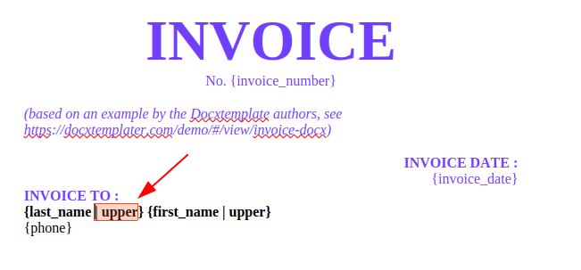
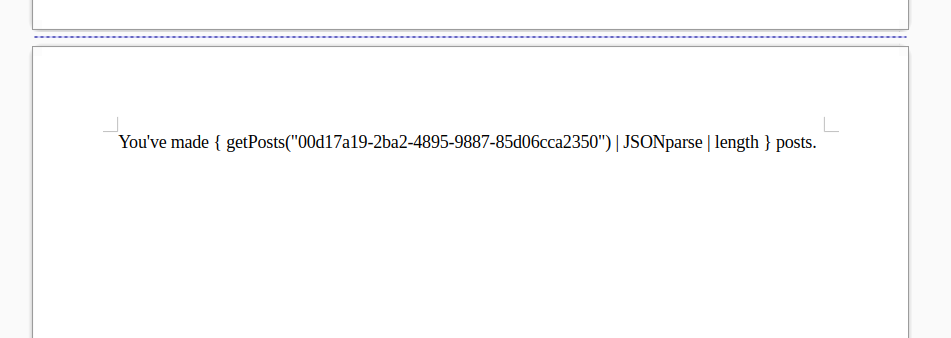

TL;DR: Are you using [N8N](https://n8n.io/) and/or need to generate Word documents from templates? Take a look at [this node](https://www.npmjs.com/package/n8n-nodes-docxtemplater), which can receive a Word document with special syntax, a JSON document with data, and generate another Word document where the JSON data has been placed into the document. Much like HTML templating, but for Word. Pretty useful for automatic document generation, such as invoices, reports or letters, where the canonical template is in Word and shouldn't be changed, such as when you want non-technical people to be able to change the templates.

---

Hello again! Over the past couple of weeks I've been developing [a custom node](https://github.com/jreyesr/n8n-nodes-docxtemplater) for [the N8N low-code tool](https://n8n.io/), which [wraps the Docxtemplater document templating library](https://docxtemplater.com/). It allows you to write a Word document (or Excel, or Powerpoint, though I'm unsure if those are possible without buying additional modules) that looks like this and is called a "template":


Notice the abundant placeholders in the document, such as `No. {invoice_number}` below the main purple INVOICE title. Those are tags, they're there to be replaced by actual values whenever the template is rendered. Also, in the "Invoice To" section, notice how there's, in bold, `{last_name | upper}`. That `| upper` is similar to a shell pipe: it "receives in" the data from the left, here `last_name`, processes it somehow (based on the name, we can surmise that it converts it to all uppercases) and outputs a transformed version.

That template is built once (ideally), and shouldn't change or change rarely. At least, it should change much less frequently than the rate at which documents are generated based on it (otherwise, it's not really a template, is it?) In this example, it's "the invoice template" for your business, or something along those lines. When we wish to generate an _actual_ invoice for an actual purchase by an actual client, we "render" the template by combining it with some data (the "context"), such as:

```json
{
	"first_name": "John",
	"last_name": "Doe",
	"phone": "0652XXXX42",
	"invoice_number": "318",
	"invoice_date": "8 May 2025",
	"items": [
		{
			"description": "Docxtemplater Pro Plan",
			"price": "950"
		}
	],
	"total_price": "950",
	"price": "950",
	"tax": "190",
	"final_price": "1140"
}
```

and out comes a document looking like this:


In this document, all placeholders have been replaced by pieces of data picked from the context, and sometimes further processed (for instance, the `last_name` that is on the context is `Doe`, with only the D uppercased, but since the template says `{last_name | upper}`, the output document says `DOE`, all uppercased).

## The reasoning (or, why do this when there's already Carbone)

A few years ago, I built [another N8N node](/posts/n8n-node-carbone-1/) that performed a similar function: it receives a DOCX template (which should be more or less fixed) and a JSON document to act as the context (which will probably vary per execution), and generates another Word document where tags have been replaced by context data. That node uses [the Carbone library](https://carbone.io/), another document generator with a fairly similar philosophy and user experience: you write a Word template that uses placeholders and the magical syntax for features such as content that may or may not appear, or repeated runs of elements such as table rows or bullt points. Then you combine that template with JSON data and receive another Word document.

While the Carbone node works, as far as I know, perfectly fine (and it is, in fact, my [highest-starred repo](https://github.com/jreyesr?tab=repositories&q=&type=&language=&sort=stargazers) as of writing this), it has a couple of shortcomings that I found after trying to use it for, admittedly, very complex documents with tons of ad-hoc preexisting business rules (so less "here's the template that you'll use from now on" and more "we have these twenty _slightly different_ templates that we use for sending the same report to twenty different clients. No, changing the structure isn't possible. We need to automate it. Go do your thing."):

* The block-type structures (e.g. [conditionals](https://carbone.io/documentation/design/conditions/conditional-blocks.html) and [loops](https://carbone.io/documentation/design/repetitions/with-arrays.html)) sometimes leave extra blank lines that look quite jarring. For example, this is [the example that Docxtemplater gives](https://docxtemplater.com/docs/configuration/#how-to-use-it) of the issue (Docxtemplater has a setting to supress those). Say that you have a template like this, which runs over a list of users and prints each in a line:
    ```plaintext
	The users list is:
	{#users}
	‣ {name}
	{/users}
	End of users list
	```
	You'd probably expect the output to be like below, with the `{#users}` and `{/users}` lines completely gone, because they're, after all, lines with control structures that shouldn't appear in the output:
	```plaintext
	The users list is:
	‣ John
	‣ Jane
	‣ Mary
	End of users list
	```
	But Carbone, at least as far as I could get it to work, outputs something like this, with additional newlines:
	```plaintext
	The users list is:

	‣ John

	‣ Jane

	‣ Mary

	End of users list
	```
	This is especially bad when there are multiple conditional blocks, one after the other. This is a set of three blocks, preceded by some text that always appears, and followed by some text that always appears. The three middle blocks may appear or not, depending on a set of conditions:
	```plaintext
	Text that always appears
	{d.condition1:ifEQ(true):showBegin}
	Text when condition 1 is true
	{d.condition1:showEnd}
	{d.condition2:ifEQ(true):showBegin}
	Text when condition 2 is true
	{d.condition2:showEnd}
	{d.condition3:ifEQ(true):showBegin}
	Text when condition 3 is true
	{d.condition3:showEnd}
	Final text
	```
	And if only `condition3` is true, we get this, with two extraneous newlines that are the lingering ghosts of the conditions that didn't display:
	```plaintext
	Text that always appears


	Text when condition 3 is true
	Final text
	```
	This can look really unpolished, especially since depending on which conditions are active the empty lines will "jump around". Carbone seems to lack *whitespace control*, which some HTML templating engines do have, which allow you to choose to supress some whitespace to the left or to the right of some tags. See, for example, [Jinja](https://jinja.palletsprojects.com/en/stable/templates/#whitespace-control) and [Handlebars](https://handlebarsjs.com/guide/expressions.html#whitespace-control)
* The only extension point available to consumers of the JS library (the Community one, which is what the N8N node uses, not the cloud version) is [adding custom formatters](https://carbone.io/documentation/developer/embedding/embedding-in-node.html#add-custom-formatters), which are Carbone's "shell pipe"-like feature: `{d.firstName:upperCase}`, for example, [uppercases `d.firstName`](https://carbone.io/documentation/design/formatters/text.html#uppercase). There are [plenty of formatters](https://carbone.io/documentation/design/formatters/overview.html) built-in, but they're limited in what they can perform: conceptually, a formatter is restricted to receiving a single piece of data (the thing before the `:`), optionally some args, and it must return a single piece of data. Said piece of data will be inserted in the exact place in which the tag was written. That's it. For most common uses, this is enough, but if you need something else, you're getting in trouble. Consider a formatter that must return an ever-increasing number, such as for "Figure 1", "Figure 2" and so on (yes, Word does that already, let's imagine it didn't). A formatter _shouldn't_ be able to do this, since there's nothing in the concept of a formatter that corresponds to a "long-term memory" beyond a single invocation. It's probably doable by stashing some data in the `this` object, which is a global object, but it isn't documented
* In the same vein, formatters are second-class citizens to the data that they transform: a formatter can't ever appear on its own, only as part of a chain of transformations that starts on real data: `{d.firstName:upperCase}` is valid, but `{:upperCase}` is not. This means that all data must ultimately come from `d` (or [from `c`, actually](https://carbone.io/documentation/design/overview/getting-started.html#essential-knowledge)), there's no way to write a "generating" formatter that can produce data. They can only transform what is already there. And having "generators", pieces of custom code that can produce data, can be useful. We'll talk more about that [later](#data-sources)
* The language/syntax of what goes inside `{}` seems to be a bespoke language that is less powerful than, for example, Jinja or Handlebars (which are, in turn, less powerful than their host languages Python and JS, respectively). For example, in the documentation for [custom formatters](https://carbone.io/documentation/developer/embedding/embedding-in-node.html#add-custom-formatters), we read that
    > It is not possible to pass tags or variables to formatters as parameter.

	In other words, you can't just do `{d.fieldA:customFormatter(d.fieldB)}`, since that's "passing a variable to a formatter as a parameter"? I think? I'm fairly sure that I've seen the built-in formatters, such [as `:add()`](https://carbone.io/documentation/design/formatters/number.html#add-value), receiving another variable as an argument. But, for example, the simplest mathematical operations aren't possible: `{d.totalPrice * d.tax}` isn't possible. You'd need to use [the `:mul()` formatter](https://carbone.io/documentation/design/formatters/number.html#mul-value), such as `{d.totalPrice:mul(d.tax)}`. And that breaks down for anything more complex or that can't be expressed as a chain of sequential operations: `{(d.totalPrice * d.tax) - (d.totalPrice * d.discountRate)}` would have to be something like `{d.totalPrice:mul(d.tax):sub(d.totalPrice:mul(d.discountRate))}`, or using [the implementation for simple mathematical formulae](https://carbone.io/documentation/design/computation/simple-mathematics.html#mathematical-formula), which doesn't support parenthesis
* There are a few other papercuts such as, at least as far as I saw, not being able to invoke a formatter on the entire `d` object: I couldn't get `{d:someFormatter}` to do anything. It was always necessary to do `{d.someField:someFormatter}`. That may have been me, though, I was mostly trying that as a way to work around the lack of "generating" formatters described above: if you can't do `{:generate()}`, maybe `{d:generate()}` where `generate()` completely ignores its input arg would would (it doesn't)
* Carbone doesn't support `async` or promises. It uses [the Node.js style of callbacks](https://carbone.io/documentation/developer/embedding/embedding-in-node.html#generate-a-report), but as far as I could see the core engine is fully synchronous. And sync Node.js doesn't talk to async. Like, at all. Callback-style code and Promise-style code can talk to each other, there's even [Node.js util functions to do so](https://nodejs.org/api/util.html#utilpromisifyoriginal). But sync code, the one that runs with no `await`s or callbacks, can't (in the direction of sync code calling async code, that is. Async code invoking sync functions is perfectly normal). There are [multiple SO questions asking for a way to do so](https://stackoverflow.com/a/58843706), and... it just can't. At least not normally. And you shouldn't, anyways. There is, for example, [the `deasync` package](https://www.npmjs.com/package/deasync), that uses much C++ trickery to (sometimes) allow sync functions to not block everything else. Or you could try [something with worker threads and Atomics](https://samthor.au/2021/block-nodejs-main-thread/) to shove the sync work to another thread and wait in the main thread until an Atomic, which can cross thread barriers, signals that the work is done. None of those worked with Carbone: it either never waited for promises to be resolved, printing `[object Promise]` instead of the actual result; or alternatively it froze the entire N8N application. This isn't an issue in itself, Carbone does well enough, thank you, with all-sync formatters, but (as we'll explain in more detail below below) I started this whole thing by wanting to use [N8N's Tools](https://docs.n8n.io/advanced-ai/examples/understand-tools/) as formatters, and N8N's tools are all async, all the time, and therefore they couldn't work with Carbone

None of these are killer issues, but _they could be better_. Right?

## The Docxtemplater node

As we saw at the start of this post, [Docxtemplater](https://docxtemplater.com/) is a library (for Javascript, or actually Typescript) to generate Word, Excel and Powerpoint documents (though at least Excel [seems to be paid](https://docxtemplater.com/modules/xlsx/), as a Module: [500€ per year for any single module, or 1250€ for four modules of your choice](https://docxtemplater.com/pricing/). Word doesn't require additional modules, and I'm unclear on Powerpoint).

Much like Carbone, Docxtemplater takes in a template and a JSON context, and generates another Office document as an output. Unlike Carbone, it can run both on a Node.js server application and [also on web browsers](https://docxtemplater.com/docs/get-started-browser/) (I believe that Carbone is tied at least to the Node.JS Filesystem API which it uses to write files to disk, which naturally doesn't exist on browsers).

The tag/placeholder syntax is similar to Carbone's, as it uses single curly braces `{}` to delimit the tags (it [can be changed](https://docxtemplater.com/docs/configuration/#custom-delimiters), though). It also has the same concept of a "formatter" as a small piece of code that receives some data and outputs a transformed version of said data (those are called [Filters](https://docxtemplater.com/docs/angular-parse/#filters) in the [Angular parser](https://docxtemplater.com/docs/angular-parse/#angular-parser) that comes bundled with Docxtemplater and is actually the recommended parser).

Where Docxtemplater excels is in the extension points that are provided to users of the library. Together, they form a really powerful and flexible solution:

First, the simplest thing: custom filters. The Angular parser, as indicated above, supports filters that use the pipe syntax `{inputData | filterA | filterB(param)}`. This comes from [the `angular-expressions` library](https://github.com/peerigon/angular-expressions), which in turn is a repackaging of [the expressions of Angular.JS](https://docs.angularjs.org/guide/expression) (the _old_ Angular, which [has been dead](https://docs.angularjs.org/misc/version-support-status) for a few years already). Custom filters can be registered [as indicated in the docs](https://docxtemplater.com/docs/angular-parse/#filters), by updating the `filters` property of the parser instance.

For instance, the code below would register a filter that could be called like `{ someVar | toUpperCase }`:

```js
const expressionParser = require("docxtemplater/expressions.js");

// CUSTOM FILTER. USE LIKE { someVar | toUpperCase }
expressionParser.filters.toUpperCase = function (input) {
    /*
     * Make sure that if your input is undefined, your
     * output will be undefined as well and will not
     * throw an error
     */
    if (!input) {
        return input;
    }
    return input.toUpperCase();
};

new Docxtemplater(zip, { parser: expressionParser });
```

More filters can be registered, including those that receive additional parameters, such as `{ someVar | where:'age > 15' }`:

```js
const whereCache = {};
expressionParser.filters.where = function (input, query) {
    let get;
    if (whereCache[query]) {
        get = whereCache[query];
    } else {
        get = expressionParser.compile(query);
        whereCache[query] = get;
    }
    return input.filter(function (item) {
        return get(item);
    });
};
```

This provides us with a similar level of functionality to Carbone's custom formatters: small pieces of code that perform a tightly scoped function and are called against a piece of data.

Second, there's [Modules](https://docxtemplater.com/faq/#attaching-modules-for-extra-functionality). They are the vehicle for the authors of Docxtemplater to deliver the paid functionality that supports Docxtemplater. While there isn't any documentation (that I could find) on how to develop custom modules, the available functionality is All There&trade;. And [the Typescript type definitions](https://github.com/open-xml-templating/docxtemplater/blob/master/es6/docxtemplater.d.ts#L45) do give us a hint of what is available to modules: they can hook to many stages of the document generation, such as "render", "optionsTransformer", "preparse", "postparse" and more. I have no idea what those mean, but _someone_ may. Modules have a lot more control over the entire rendering process, unlike the tiny box in which filters get to play in. In fact, we can get an idea of what Modules can do by looking at [the paid Modules](https://docxtemplater.com/modules/): they can [insert images](https://docxtemplater.com/modules/image/). They can [convert HTML into Word-specific elements](https://docxtemplater.com/modules/html/). They can [mess with Word's built-in charts](https://docxtemplater.com/modules/chart/). They can [embed a Word template into another](https://docxtemplater.com/modules/subtemplate/). They can [insert footnotes](https://docxtemplater.com/modules/footnotes/). They can even alter properties of the Word document that aren't strictly part of the content, such as [setting a watermark, marking as read-only or updating the margins](https://docxtemplater.com/modules/meta/). All that is (theoretically) also available to you, you just&trade; need to type the correct characters into a text file. Easy, no?

Thirdly[^1], there's [Data Resolvers](https://docxtemplater.com/docs/async/). Since Docxtemplater fully supports async (either via `async`/`await` or with Promises, they're actually equivalent), it can gracefully handle being passed Promises as part of the context:

```js
const doc = new Docxtemplater(zip);
const rendered = await doc.renderAsync({
    date: "2025-03-09", // this is a normal datapoint
    user: async () => {
        // NOTE: await can be used here!
        return "John";
    }(),
});
```

In the template, both `{ date }` (prints 2025-03-09 to the output document) and `{ user }` (prints John to the output document) can be used. Notice how `user`, despite actually being _a promise that eventually resolves to a String_ instead of a String proper, can be handled as if it were a String to begin with. Docxtemplater transparently `await`s the resolution of that promise and then continues as normal.

This means that now we can somewhat "invert" the flow of control, and place the template in control of data fetching. Traditional wisdom in the area of templating engines, ever since monolithic server-side frameworks in the pre-SPA era, has been to 1) first fetch data, in the Controller or its local equivalent, 2) pass said fetched data to the template, HTML, Jinja, Twig or whatever, and 3) render that data into HTML.

This tends to work perfectly fine, especially when the same person is in charge of developing the Controllers that fetch data and the templates that display it, as is the case in web apps. However, this means that the template is "passive" in the sense that it can't influence what data is fetched: the data is fetched before the template comes into play, and the data just drops on the template's head to be rendered. However, sometimes, such as when the Word templates are being written by business users (not the developer), we may want to give additional control to the writer of the template, such that only things that are _actually mentioned_ in the template get fetched. This is what Data Resolvers give us: a way for templates to dynamically request data, without having to prefetch _all the possible data_!

Fourthly, and perhaps the most influential, Docxtemplater supports [custom parsers](https://docxtemplater.com/docs/deep-dive-into-the-parser-option/). Parsers are the piece of code that receives the _content_ of each tag, that is, whatever is inside each `{...}` (or inside whatever the delimiters are, since you can alter the delimiters to, say, `[[...]]` or something)

In fact, the Docxtemplater default parser is very simple: it just accepts `{propName}` tags. That's it. Even `{some.prop}` is interpreted as a single prop name, that happens to have a period in it (that is, `context["prop.name"]`); rather than as a nested access to `prop` inside `some` (that is, `context["prop"]["name"]`). No filters. No nothing else.

That's why Docxtemplater also bundles the Angular parser, which we've already met. In fact, the docs do suggest to enable the Angular parser whenever possible, since the built-in parser is quite limited for anything more than simple tests of Docxtemplater. The Angular parser takes whatever is inside the curly braces, and passes it to the Angular expression parser from Ye Olde Angular. That means that it automatically supports [some maths operations](https://docxtemplater.com/docs/angular-parse/#operators), [nested property access](https://docxtemplater.com/docs/angular-parse/#nested-property-access), [array indexing](https://docxtemplater.com/docs/angular-parse/#conditions), and conditions such as ==, >, < and so on. It's also possible (and the docs give code examples) to implement [filtering based on conditions](https://docxtemplater.com/docs/angular-parse/#data-filtering) (implemented as a filter that receives a string that gets parsed with the same parser that parses the entire tag), [sorting](https://docxtemplater.com/docs/angular-parse/#data-sorting) (again, a custom filter), [aggregations](https://docxtemplater.com/docs/angular-parse/#data-aggregation) such as summing a certain property of each object in an array, [number formatting](https://docxtemplater.com/docs/angular-parse/#data-formatting) and more. With a bit of work, it should be possible to replicate most, if not all of, [Carbone's formatters](https://carbone.io/documentation/design/formatters/overview.html).

All these four extension points can be used, or not. For this N8N node, we'll choose _all of the above_, in order to provide a node that is as powerful as possible. We'll make sure to expose each extension point to users of the node, and they can use whatever they need.

## Adding a new parser

The Angular parser is quite full-featured, and in fact I fully intended to use it in this node. However, when trying to implement user-provided filters (we'll look more at those [later](#custom-transforms-via-n8ns-ai-tools)), I found out that the Angular parser is sync only, much like Carbone. And that's not likely to change, seeing as how the library that powers it is a packaging of Old Angular, which is now dead. That turns out to be a complete showstopper, since without a parser that is async-aware we can't provide async filters, and without async filters we can't allow users to configure their own filters from N8N's UI (N8N is async throughout, as it very well should be).

Therefore, if using the Angular parser, we'd only be able to add new filters by editing the node's source code, or resorting to other shenaniganry such as asking the user to provide a JS file in a well-known location and loading it. Which is ugly, arguably unsafe (since we can't then sandbox it, though then again it wouldn't be as important since now only N8N's admins can control that, not every user, so whatever), and most importantly, not exciting.

So I wrote a new parser.

(Okay, more like "I copied the Angular parser, changed the lines that interacted with `angular-expressions` and fixed all the red squiggles until it worked")

The workhorse behind this new parser is [Jexl](https://github.com/TomFrost/Jexl?tab=readme-ov-file#transforms), the Javascript Expression Language. Please don't confuse it with [Apache JEXL](https://commons.apache.org/proper/commons-jexl/), "a library intended to facilitate the implementation of dynamic and scripting features in applications and frameworks written in Java". We don't do Java here. Das ist fürbidden.

Jexl runs under a Javascript environment, both server-side (Node.js) and client-side (browsers), though we're only interested in server-side here, much like with Docxtemplater. It also [has Typescript typings](https://www.npmjs.com/package/@types/jexl), which is very convenient when developing N8N nodes, which use Typescript. Autocomplete is fun.

Jexl is an "expression parser", similar to [N8N's Tournament](https://github.com/n8n-io/tournament), which is used in Expressions (the ones between double curly braces that use `$json` and are highlighted in green, such as `{{ $json.some_field }}` and such). It works on _expressions_, i.e. things that resolve to a value. You do whatever you want in an expression, but it must resolve to a value. For example, `"abc"` is an expression, resolving to a constant string. So is `1 + 2`, resolving to the integer 3. So is, at least in Javascript, `"abc".toUpperCase()`, resolving to the string ABC. Same for `someArray.length > 0 ? "array has elements" : "array is empty"`, resolving to either one or another string (though this one requires that `someArray` is somehow made available to the expression).

A useful test for whether something is an expression is whether it makes sense to assign it to a variable:

```js
const a = "abc"; // ✅
const b = 1 + 2; // ✅
const c = "abc".toUpperCase(); // ✅
const d = someArray.length > 0 ? "array has elements" : "array is empty"; // ✅ (as long as some_array is available)
const e = someArray.map(user => user.name); // ✅

// ❌ not valid JS syntax
const d_invalid = if(someArray.length > 0) {
	"array has elements"
} else {
	"array is empty"
}

// ❌ not valid JS syntax
const e_invalid = for(let user of someArray) {
	user.name
}
```

The fact that everything must be an expression, which ultimately boils down to a value, makes sense when writing tags in a Office document: we want tags to become pieces of text, or other content, in the document, so we naturally want tags to be "things that become values", AKA expressions. By contrast, a for loop doesn't _become_ a value; it'll perform _some actions_ repeatedly, but it doesn't "return" anything. At least in C-based languages, Javascript, Python, Go or Rust. Functional programming language have, no doubt, very different ideas about what a for-loop _is_ and what it returns, and it wouldn't surprise me if it's possible to sum two for-each loops or weird operations like that.

Initially I tried to use [mozJexl](https://github.com/mozilla/mozjexl), a fork (two steps removed) of the original Jexl by Tom Frost. mozJexl was a fork by Mozilla, to be used in [Normandy](https://mozilla.github.io/normandy/), a piece of Mozilla to run "experiments" (testing new features by shipping them to only some users, running user surveys, testing addons, and so on). mozJexl was used by Mozilla people to write sets of conditions that target users (e.g. "users in India that use Firefox in English" would be `normandy.locale == 'en-US' && normandy.country == 'IN'`), so that only said users would receive a certain [action](https://mozilla.github.io/normandy/user/actions/index.html) such as having a preference flag changed. I tried mozJexl first on the assumption that it'd have had more care given to it, because Mozilla used it.

However, it later turned out that mozJexl doesn't support custom top-level functions, such as `{ someFunction() }`, that is, functions that appear as the first step in a filter chain. It's absolutely possible to invoke custom functions as filters, that is, `{ someVar | someFunction() }`, as long as the initial step is a plain value (or a Promise resolving to one), And I really wanted to have the ability to call functions as the first or only step in an expression, so I went back to original Jexl which [does have `.addFunction`](https://github.com/TomFrost/Jexl?tab=readme-ov-file#functions), which allows you to register a top-level function.

A Docxtemplater Parser is a function that returns objects that contain a function that returns values. Yes, that's not a typo, it's a object-returning-function-returning function. Docxtemplater calls the parser's main function (the one that returns objects) for each distinct tag in the document (that is, each different content of `{...}`), or at least I think so. The contents of the tag, the text between the open and close delimiters, is passed as the single argument to the function. It's the parser's responsibility to process this string into _something_, but not to evaluate the expression at this point. I'm unsure on the reasoning behind this, but it may be for caching purposes: if the same expression appears at many points in the document, perhaps inside a loop, then a single call to the parser is made, and then the inner function is called repeatedly, with different values for the context.

For example, let's say that we have a Word template that contains the tag `{ firstName }`, one of the simplest possible tags that simply replaces a value from the JSON context into the output document. Docxtemplater will call our Parser function, passing it the single string argument `"firstName"`. No delimiters `{ }` here; those are handled in Docxtemplater itself, and in this way parsers needn't be concerned with the delimiters chosen by the user.

The parser must then return an object conforming [to the `DXT.Parser` interface](https://github.com/open-xml-templating/docxtemplater/blob/4d2af3956260c12573de1c40d62de214f5132ce8/es6/docxtemplater.d.ts#L79). This interface is satisfied by objects that have a function like this: `get(scope: any, context: ParserContext): any`. This function, in other words, actually receives a concrete "context", or a set of JSON data (actually a JS object), and must then use the provided context plus the tag that its creation function received at application load, and return a value of any kind (though, in practice, they usually end up as strings so they can be inserted into the Word document). Thus, each tag's parser object will be called either once or multiple times, passing different contexts each time, which should cause different output values:


In our specific case, we use Jexl as the interpreter of the contents of `{}`. As an extra aid to the user (which also comes from the Angular parser), the actual context that is provided to the Jexl engine (that is, the thing where the variables that will be available, such as when executing `{ firstName + " " +  lastName }`) isn't a plain JS object. Instead, it's [a Proxy object](https://developer.mozilla.org/en-US/docs/Web/JavaScript/Reference/Global_Objects/Proxy). Proxies behave like normal objects, in which you can request a key and get a value back, but the fundamental operations (getting or setting a property, or checking whether a property exists in the object) can be intercepted and run arbitrary code. For example, this Proxy traps _all_ property accesses and always returns the same value, `"world"`, no matter which key was requested and whether it actually exists in the object:

```js
const target = {
  message1: "hello",
  message2: "everyone",
};

const handler = {
  get(target, prop, receiver) {
    return "world";
  },
};

const proxy = new Proxy(target, handler);

console.log(proxy.message1); // prints "world"
console.log(proxy.message2); // prints "world"
console.log(proxy.foo); // prints "world"
```

In Docxtemplater, this is used to provide some magical properties that always exist, without having been explicitly passed as JSON context. For example, sometimes it's convenient to be able to refer to "the current context", whatever it happens to be, especially when inside multiple nested loops. This current context is exposed under the keywords `.`, `$`, `this` and `$this`, for more flexibility. For example, the two loops below are equivalent:

```plaintext
{#users}
{firstName}
{/}

{#users}
{$this.firstName}
{/}
```

This is similar to Unix-style paths like `./file.txt`, where the `.` at the start explicitly states that the path is relative to the current working directory, whatever that happens to be. Of course, then it's reasonable to provide the complementary keyword to explicitly access the root object, which is exposed under `$$` and `$root`:

```plaintext
{#users}
{$this.firstName} {firstName} {$$.firstName}
{/}
```

In the example above, the first and second `firstName` tags refer to the `firstName` property of each item in the `users` array, over which we're looping. The final tag, `$$.firstName`, explicitly refers to the `firstName` property at the root of the JSON context. Again, this is similar to a path like `/file.txt`, which indicates, since it starts with `/`, that it's an absolute path.

Finally, we also provide [a magical variable](https://docxtemplater.com/faq/#angular-parser-custom-value) called `$index`. This [also comes from the Angular parser](https://docxtemplater.com/docs/angular-parse/#retrieving-index-as-part-of-an-expression), and it's an integer that increments with each iteration of loops, like the `i` in `for(let i=0; i<array.length; i++)`.

Apart from that, most of the interpretation of the tag's content is left to Jexl: [mathematical operations](https://github.com/TomFrost/Jexl?tab=readme-ov-file#binary-operators), [comparisons](https://github.com/TomFrost/Jexl?tab=readme-ov-file#comparisons), [the ternary operator](https://github.com/TomFrost/Jexl?tab=readme-ov-file#ternary-operator) (which can also be used to implement something like [nullish coalescing](https://developer.mozilla.org/en-US/docs/Web/JavaScript/Reference/Operators/Nullish_coalescing)), parsing of [strings, numbers, booleans, arrays and objects](https://github.com/TomFrost/Jexl?tab=readme-ov-file#native-types), [arbitrary parenthesis nesting](https://github.com/TomFrost/Jexl?tab=readme-ov-file#groups), [property indexing via `container.prop`, `container["prop"]` or `array[0]`](https://github.com/TomFrost/Jexl?tab=readme-ov-file#identifiers), [a really nifty filtering language](https://github.com/TomFrost/Jexl?tab=readme-ov-file#collections) that looks like `array[.prop == "abc"]` to return all elements of `array` that have `prop` equal to `abc` (which reads somewhat similar to [JSONPath's filter selectors](https://www.rfc-editor.org/rfc/rfc9535#section-2.3.5.3-9), but with less syntax), [transforms](https://github.com/TomFrost/Jexl?tab=readme-ov-file#transforms) that use the pipe syntax such as `"bob" | upperCase` to return BOB, and [functions](https://github.com/TomFrost/Jexl?tab=readme-ov-file#functions) that can be called as the first element in a filter chain, or standalone. All of these different elements can be freely nested and composed: for example, you can [invoke transforms inside filter expressions](https://czosel.github.io/jexl-playground/#/?context=%7B%0A%20%20%22assoc%22%3A%20%5B%0A%20%20%20%20%7B%0A%20%20%20%20%20%20%22first%22%3A%20%22Lana%22%2C%0A%20%20%20%20%20%20%22last%22%3A%20%22Kane%22%0A%20%20%20%20%7D%2C%0A%20%20%20%20%7B%0A%20%20%20%20%20%20%22first%22%3A%20%22Cyril%22%2C%0A%20%20%20%20%20%20%22last%22%3A%20%22Figgis%22%0A%20%20%20%20%7D%2C%0A%20%20%20%20%7B%0A%20%20%20%20%20%20%22first%22%3A%20%22Pam%22%2C%0A%20%20%20%20%20%20%22last%22%3A%20%22Poovey%22%0A%20%20%20%20%7D%0A%20%20%5D%0A%7D&input=assoc%5B.first%7Clower%20%3D%3D%20%22lana%22%5D&transforms=%7B%0A%20%20lower%3A%20x%20%3D%3E%20x.toLowerCase()%0A%7D) such as  `array[.property|transform == "value"]`; [call transforms inside the arguments of another transform](https://czosel.github.io/jexl-playground/#/?context=%7B%0A%20%20%22title%22%3A%20%22Introduction%20to%20Jexl%22%0A%7D&input=title%20%7C%20surroundBy(%22%3D%22%20%7C%20repeat(3))&transforms=%7B%0A%20%20surroundBy%3A%20(input%2C%20text)%20%3D%3E%20text%20%2B%20input%20%2B%20text%2C%0A%20%20repeat%3A%20(input%2C%20num)%20%3D%3E%20Array(num).fill().map(()%3D%3Einput).join(%22%22)%0A%7D) such as `title | surroundBy("=" | repeat(3))`; [run mathematical operations on the results of transforms](https://czosel.github.io/jexl-playground/#/?context=%7B%7D&input=%22A%22%20%7C%20repeat(3)%20%2B%20%22B%22%20%7C%20repeat(2)&transforms=%7B%0A%20%20repeat%3A%20(input%2C%20num)%20%3D%3E%20Array(num).fill().map(()%3D%3Einput).join(%22%22)%0A%7D) or [transforms on the result of mathematical operations](https://czosel.github.io/jexl-playground/#/?context=%7B%7D&input=(%22A%22%20%2B%20%22B%22)%20%7C%20repeat(3)&transforms=%7B%0A%20%20repeat%3A%20(input%2C%20num)%20%3D%3E%20Array(num).fill().map(()%3D%3Einput).join(%22%22)%0A%7D), and so on. These all seem to work with no surprises, which is very valuable.

With the Jexl parser, as-is, we get the base framework to navigate around JSON objects and perform mathematical operations and comparisons. However, by default, we don't get any transforms that we can call. Those are the responsibility of the calling application, and are normally registered in code, [by calling the `addTransform()` function](https://github.com/TomFrost/Jexl?tab=readme-ov-file#jexladdtransformstring-name-function-transform) on the Jexl object.

However, in this case, us as developers of the N8N node that embeds Jexl aren't the people writing the transforms that Jexl should use. Those are the users of N8N that will install the Docxtemplater node in _their own_ N8N instances. We need a way to defer the registration of transforms to a later stage, so that N8N users can provide their own `| transform` implementations.

## Custom transforms via N8N's AI Tools

It's 2025. AI is _everywhere_. Even where it shouldn't. N8N invested really early and really hard in AI integrations, via a set of features called [Advanced AI](https://docs.n8n.io/advanced-ai/). A result of that was a set of so-called [Agent Nodes](https://docs.n8n.io/integrations/builtin/cluster-nodes/root-nodes/n8n-nodes-langchain.agent/).

N8N's Agent Nodes (and other "root nodes") are rectangular rather than square, and wider than the standard nodes. In addition to the traditional inputs to the left and outputs to the right, they also have connection ports in the bottom edge, to which different sub-nodes are connected. For example, a typical LLM Agent node would need, of course, an LLM to generate the text. N8N provides [several Chat Models](https://docs.n8n.io/integrations/builtin/cluster-nodes/sub-nodes/n8n-nodes-langchain.lmchatanthropic/), such as Anthropic, Google Gemini, Ollama, OpenAI, and several other models. They all expose a common interface, as things-that-receive-text-and-return-other-text, such that they can be (to a degree) freely swapped in a certain agent. Other swappable mini-components are [embeddings generators](https://docs.n8n.io/integrations/builtin/cluster-nodes/sub-nodes/n8n-nodes-langchain.embeddingsawsbedrock/) (for workflows [such as RAG](https://n8n.io/workflows/1960-ask-questions-about-a-pdf-using-ai/)), [chat memories](https://docs.n8n.io/integrations/builtin/cluster-nodes/sub-nodes/n8n-nodes-langchain.memoryredischat/) (either in-memory, backed by Redis, or backed by Postgres), and [vector stores](https://docs.n8n.io/integrations/builtin/cluster-nodes/sub-nodes/n8n-nodes-langchain.retrievervectorstore/) for fast nearest-neighbor queries of high-dimensional data.


And, of course, [there's Tools](https://docs.n8n.io/integrations/builtin/cluster-nodes/sub-nodes/n8n-nodes-langchain.toolcode/). These are used in what [OpenAI](https://platform.openai.com/docs/guides/function-calling), [Anthropic](https://docs.anthropic.com/en/docs/build-with-claude/tool-use/overview) and [Google](https://ai.google.dev/gemini-api/docs/function-calling) all call "Function Calling". These are supposed to be key in the rise of "Agentic AI", in which text generated by a LLM is allowed to take action upon the real world (or, more commonly, the virtual world of emails, databases and other APIs, but with more real-world implications in any case than the text-only interface to LLMs). Per the Google Gemini docs:

> Function calling empowers users to interact with real-time information and services like databases, customer relationship management systems, and document repositories. The feature also enhances the model's ability to provide relevant and contextual answers. Function calling is best for interacting with external systems.

In any case, my interest on Tool nodes here isn't their AI implications, but instead the fact that they're tiny pieces of code that can be "hung off" a larger node, and will just stay there and be available. The main node, what N8N calls the Root node, will then be able to call said pieces of code on-demand. In AI nodes that is driven by the generation of a piece of text that looks like [a function call](https://platform.openai.com/docs/guides/function-calling#function-calling-steps), typically in JSON format. Here, it'll be driven by the parser encountering, and invoking, a formatter with the same name as a connected Tool.

This means that, whenever the parser encounters a formatter like `| upper`:



it can check whenever there's a tool connected to the node that has that name:


and, if so, call the tool like this (observe the Input and the Output):


Tools can take many forms. The most versatile one is [the Custom Code tool](https://docs.n8n.io/integrations/builtin/cluster-nodes/sub-nodes/n8n-nodes-langchain.toolcode/), which provides a code editor in which a snippet of JS code can be written. This code can receive inputs and generate an output. The Docxtemplater code makes it so that, when using a Tool as a transform, the tool's input is the input to the transform. The return value of the code snippet is the tool's output, which normally goes back to an LLM so more text can be generated, but here it's just captured and fed back to Jexl:


Another fairly generic tool is [the HTTP Request tool](https://docs.n8n.io/integrations/builtin/cluster-nodes/sub-nodes/n8n-nodes-langchain.toolhttprequest/), which can make arbitrary HTTP requests. The input to the tool can be placed in the URL, as a header, or in the request body, through the use of a placeholder `{query}` that will be replaced with the tool's input. The [Workflow tool](https://docs.n8n.io/integrations/builtin/cluster-nodes/sub-nodes/n8n-nodes-langchain.toolworkflow/) provides the ultimate escape hatch, since it can run an arbitrary N8N workflow with the provided input. And, finally, there's (as of writing this) over 250 tools automatically generated from [N8N's built-in nodes](https://n8n.io/integrations/?type=Regular), ranging from Asana to AWS S3 to Bitwarden to Cloudflare to Discord to Dropbox to ElasticSearch to the Facebook Graph API to Github to Google Calendar to Linear to LinkedIn to Mattermost to OneDrive to MySQL to Notion to RabbitMQ to Reddit to SendGrid to Slack to Stripe to Supabase to Twilio to Wikipedia to WolframAlpha to X to YouTube. Some of these don't make much sense as Transforms in a Word template (for example, the Home Assistant tool is probably intended to be used to turn on and off lights, not to transform data), but others make a lot more sense. For example, there's the Youtube tool. It could very well be used in a transform like `{ channelId | ytGetCountSubscribers }`, should you have some sort of JSON context that only contains the channel's ID. Or the Stripe tool could be used like `{ customerEmail | stripeGetActivePlan }` in order to retrieve a customer's live Stripe status, as of the moment of rendering their monthly invoice or whatever.

For example, my development workflow, over which I tested all these features, looks somewhat like this:


It can handle a template like this (notice all the custom filters, highlighted in red):


For example, an invocation of the `| crypto` transform, which calls the Crypto tool to the left (it's the second invocation, the one that looks like `{(first_name | crypto).data}`), looks like this:


Since the transform invocation is `first_name | crypto`, the tool's input is the value of `first_name`, which is Joe in the JSON context. This comes into the tool via [the `$fromAI` function](https://docs.n8n.io/advanced-ai/examples/using-the-fromai-function/#examples), which is used to indicate "placeholders" that must be filled by, normally, the LLM whose generated text is driving the whole thing. However, here it's just fed into the function by the Jexl engine encountering a filter that it knows about. The tool has been set to compute the MD5 hash of that value.

Then, the tool's output is an object (actually an array of objects, but Jexl seems to tolerate that with no issues), with the shape `{"query": "Joe", "data": "the MD5 hash of Joe"}`. That's why the whole tag must be `{(first_name | crypto).data}`, in order to pick out the `data` property of the transform's returned value.

The Wikipedia tool, for example, has no configurable parameters and a single job: to receive a string that should be the title of a Wikipedia article, and return the start of said article in a simple text format. Here we can see the invocation of the tag `{ "DOCX" | wikipedia_api }`:


And here's a Custom Code tool that implements a filter like `{ "12/04/2008" | split("/") }`:


All in all, Tools slot very neatly in the job of Formatters for Jexl, as pieces of code that are available and invoked on-demand, receiving some data and returning some other data. With that, we have provided users of the Docxtemplater node with a way to add custom functionality to the node, so as to better fit their templates, without leaving the N8N UI and with no code changes necessary. Also, even for Code tools, which would normally be fairly sensitive functionality since they run arbitrary code in the N8N instance, we haven't invented anything, instead reusing the N8N-provided tool. This means that the Docxtemplater node shouldn't be any more dangerous than users using the [Code node](https://docs.n8n.io/integrations/builtin/core-nodes/n8n-nodes-base.code/) or the Code tool for LLMs. It even respects [the environment variables](https://docs.n8n.io/hosting/configuration/environment-variables/nodes/) `NODE_FUNCTION_ALLOW_BUILTIN` and `NODE_FUNCTION_ALLOW_EXTERNAL`, which N8N administrators can use to control which modules can be `require()`d, because it uses the same sandbox (powered [by `vm2`](https://www.npmjs.com/package/@n8n/vm2), which is arguably discontinued and contains critical security issues, but hey. You have to trust the N8N users _at least_ a little, right?)

To recap: most templating solutions provide some form of "filters" or "transforms" that can be chained one after the other to transform data in a manner similar to shell pipes. Normally, those transforms either come bundled with the templating library or can be extended by the writer of the code that uses the templater, but it requires code changes anyways. By using N8N's Tools, which were originally developed for LLM workflows with "Function Calling" functionality, we can provide a clean way for users of the node to provide their own transforms that can be made available to Word templates, without having to alter the node's code, and with very good observability (since we can see _each and every_ invocation of _each and every_ transform, the input data, the output data, any errors, and even the time that each invocation took).

## Modules and their configuration

[Docxtemplater's Modules](https://docxtemplater.com/modules/) add additional features such as insertion of images (from Base64 data, a local file path, a URL or an S3 image).

The official modules are paid, and [are installed from a secret NPM URL](https://docxtemplater.com/faq/#how-are-the-modules-packaged) that is provided to you when you pay for the module. There also seem to be [some third-party modules](https://www.npmjs.com/search?q=docxtemplater%20module) floating around in NPM, mostly free versions of the Image module and of a Link module that doesn't seem to have an official equivalent. Docxtemplater's docs also contemplate, albeit briefly, the possibility of modules developed by the user of the library, such [as here](https://docxtemplater.com/faq/#attaching-modules-for-extra-functionality): "If you **have created** or have access to docxtemplater PRO modules, ..."

No matter the source of the module, they should be installed as NPM packages, just like [external libraries that are made available to the Code node](https://blog.elest.io/how-to-install-additional-libraries-for-n8n/). Usually, the simplest way to do this is to install them globally with `npm install -g <secret-url>` or a similar command, so the modules are installed in the same place as N8N itself.

Then, the node can [check the installation path of N8N](https://github.com/jreyesr/n8n-nodes-docxtemplater/blob/e0a8a5ba1bfd9b72a82f5aa6fe2a1a39ebc5f41f/nodes/DocxTemplater/modules-loader.ts#L8) (which will be something like `.../node_modules/n8n/dist/index.js`), go back three steps, which yields `.../node_modules`, and then try to list all directories that match the pattern `docxtemplater*module*`. Since I haven't bought any Docxtemplater modules, I can't be entirely sure if they follow that pattern, but [the docs for the Image module](https://docxtemplater.com/modules/image/#usage-nodejs), for example, do indicate that the module is imported with `require("docxtemplater-image-module")`, which would indicate that it lives on `.../node_modules/docxtemplater-image-module`, and so should be matched by the pattern above.

All Docxtemplater modules seem to be accessible by running `require('module-name')`, as the top-level export, so instantiating a module is a simple matter of running the `require()` statement passing the module's name, for which there's a dropdown in the node's UI.

However, the complication with Docxtemplater modules is that some of them, such as the (very important) Image module, require additional configuration to be instantiated. For example, the [Footnotes module](https://docxtemplater.com/modules/footnotes/) doesn't require any config, and it can be created like this:

```js
const FootnoteModule = require("docxtemplater-footnote-module");

const footnote = new FootnoteModule({}); // pass empty config

const doc = new Docxtemplater(..., {
    modules: [footnote],
});
```

However, the Image Module [requires an object to be passed](https://docxtemplater.com/modules/image/#usage-nodejs) when creating the module:

```js
const ImageModule = require("docxtemplater-image-module");
const fs = require("fs");

const imageOptions = {
    getImage(tagValue, tagName, meta) {
        console.log({ tagValue, tagName, meta });
        return fs.readFileSync(tagValue);
    },
    getSize(img) {
        // it also is possible to return a size in centimeters, like this : return [ "2cm", "3cm" ];
        return [150, 150];
    },
};

const image = new ImageModule(imageOptions);

const doc = new Docxtemplater(..., {
    modules: [image],
});
```

The Image module requires an `imageOptions` object. Even worse, that object doesn't just contain static data, such as `{size: [150, 150]}` to fix all images to 150x150 pixels. Instead, the object contains _actual live functions_ that will be invoked by the module whenever it needs to render an image. This allows the module to insert images with different sizes. The same thing is done with the `getImage` function, which fetches the image, either from disk, from a URL, or by parsing some Base64 data.

The fact that the config object contains functions is problematic because functions cannot be serialized as JSON. As a data transport language, JSON only contains data types for _data_, not for _code_. it can serialize booleans, numbers, strings, arrays and objects, but there's absolutely no way to transport functions over JSON. The closest thing would be to embed a string that contains code for a function, but that's not usable here, since the Image module requires live code, not strings-containing-code.

Thankfully, N8N has already had to solve that problem, since the Code node _also_ needs to interpret arbitrary JS-code-containing strings and convert them into live code. It does this by using the same sandboxing primitives that the Code tool uses (or, rather, the inverse: the Code node came before the Code tool). They both use [a custom N8N fork of `vm2`](https://www.npmjs.com/package/@n8n/vm2#nodevm), which the Docxtemplater node uses somewhat like this:

```js
import { makeResolverFromLegacyOptions, NodeVM, Resolver } from 'vm2';

// 1. Read the same envvars that N8N uses
const { NODE_FUNCTION_ALLOW_BUILTIN: builtIn, NODE_FUNCTION_ALLOW_EXTERNAL: external } =
	process.env;

// 2. The Resolver controls which modules are require()-able
const vmResolver = makeResolverFromLegacyOptions({
	external: external
		? {
				modules: external.split(','),
				transitive: false,
			}
		: false,
	builtin: builtIn?.split(',') ?? [],
});

// 3. Everything in the context is available to code as global vars
const context = {
	fetch,
	// a few other helper vars and methods, such as $item and $json
};

// 4. Create a NodeVM that can run code
vm = new NodeVM({
	console: 'redirect',
	wrapper: 'none',
	sandbox: context,
	require: options?.resolver ?? vmResolver,
	wasm: false,
	strict: true
});

// 5. NOTE: This is a string!
const jsCode = `return {
    getImage(tagValue, tagName, meta) {
        console.log({ tagValue, tagName, meta });
        return fs.readFileSync(tagValue);
    },
    getSize(img) {
        // it also is possible to return a size in centimeters, like this : return [ "2cm", "3cm" ];
        return [150, 150];
    },
}`;

// 6. Run the code-string in the VM, returns a real JS object
const liveOptions = vm.run(this.jsCode, __dirname);

// 7. Obtain the module's class by require()ing from a var
const moduleName = "docxtemplater-module-image";
const ModuleClass = require(moduleName);
// 7.5. Instantiate the module
const module = ModuleClass(liveOptions);

// 8. Create the Docxtemplater instance passing it the module instance
const doc = new Docxtemplater(zip, {
    modules: [module],
});
```

The flow is as follows:

1. We read the `NODE_FUNCTION_ALLOW_BUILTIN` and `NODE_FUNCTION_ALLOW_EXTERNAL` envvars, [as N8N itself does](https://docs.n8n.io/hosting/configuration/configuration-examples/modules-in-code-node/). This allows N8N's administrators to control which modules can be `require()`d by users. As long as they aren't set to  `*`, these envvars provide a level of safety by limiting what can be done in those text boxes
2. `vm2` requires a Resolver, which is the object that gatekeeps all `require()` statements. It can also [be used to provide fake implementations of built-in functions](https://github.com/n8n-io/vm2?tab=readme-ov-file#resolver) (the example in the docs shows how to intercept `fs.readFileSync` so it returns a fixed string). Here we set it up with the admin-allowed modules
3. The context for a VM2 instance is an object, whose properties will be made available to whatever code runs inside the sandbox as global properties. For example, a normal browser's JS console in the Developer Tools would expose `window`, `document`, `fetch` (and many, many others) as globals. A Node.js script has access, [among others](https://nodejs.org/api/globals.html), to `process` (in fact, even the `require()` function is a global). I discovered (the hard way) that `fetch()` is a nice global to expose, since it allows the Image module to fetch images from URLs. Then, we also expose the same N8N-provided [functions and variables](https://docs.n8n.io/code/builtin/current-node-input/) that are made available to Code nodes, such as `$input`, `$json`, `$binary` and `$index`
4. With all that information, we create the `vm2` NodeVM
5. The VM needs a string containing code, which is the thing that should be run. The code should end with a `return` statement (it behaves as if it were wrapped in a function). The `return` statement, as is the case in the example above, isn't limited to returning primitive types (say, a string) or objects or arrays: it can return far more complex, non-JSON-serializable objects, such as an object containing function references. In the Docxtemplater node, we fetch this string from the node's UI, where the user should have written any necessary code
6. Here we pass the string containing code to the VM instance, we run it and capture the result as `liveOptions`
7. We can then get the module's class by `require()`ing a variable containing the module's name. This also comes from the N8N UI. We then instantiate that class, passing it `liveOptions`
8. Finally, we can create the Docxtemplater instance and pass it the module

Over on the N8N UI, the configuration for a Module looks like this:


The dropdown marked ③ is fed by listing the `.../node_modules` directory, where all modules should be installed. The text area ④ is actually a live code editor, set up for JS mode, where code can be provided (it defaults to simply returning an empty object `return {}`, since that is what most modules need to work).

With this, users of the node can now bring their own Modules, install them in the appropriate place and configure them, all from the N8N UI.

## Data Sources

Finally, the last extension point is new sources of data, in addition to the JSON document that is passed as context to the renderer.

The JSON context is the traditional way of passing data to the template. Something equivalent to it exists in the server-side monolithic frameworks that came Before Client-Side SPAs. See, for example, [ViewModels in .NET Core](https://learn.microsoft.com/en-us/aspnet/core/mvc/views/overview?view=aspnetcore-9.0#strongly-typed-data-viewmodel), [Jinja's context](https://jinja.palletsprojects.com/en/stable/api/#the-context) and [Laravel's passing of an array to a view](https://laravel.com/docs/12.x/views#passing-data-to-views). Some (typically the languages that favor strong typing such as Java and C#) favor passing an instance of a class to the view, while others, such as frameworks in Python or PHP, favor passing a generic "dictionary" or "hash map". In any case, the flow of MVC/server-side frameworks is usually similar:

1. Request comes in
2. Request gets routed to the appropriate route/controller/handler
3. A certain controller (typically a function) runs, with access to the incoming request's data (the actual URL, maybe parsed URL parameters, the querystring, headers, cookies, the body if any was provided)
4. The controller[^2] fetches data from the database, such as by extracting the User ID bit from a URL that looks like `/users/{userId:int}`, and then issuing a request like `SELECT * FROM users WHERE id=<the userId>`. This results in an object holding that record's information. ORMs may or may not be involved here
5. This object is passed to the render function, along with a template name or path
6. Somewhere alongside the application's source code, there lives a template (or View) that can be identified by that name. For server-side applications, templates are usually some flavor of HTML or something that compiles to it, interspersed with framework-specific tags that can refer to the passed object (say, the user). The view can thus refer to properties of that object, such as `<input type="email" value="{{ user.email }}"/>`
7. The generated HTML, now free of any tags, gets returned to the client that made the original request. That client is a web browser, which parses the HTML and displays it to the user

A flow quite similar to that one is supported by Carbone, and also by Docxtemplater if data resolvers or similar aren't used:

1. JSON context is generated, somehow, such as by querying a DB or some third-party API
2. This context is passed to the render function, along with the DOCX template's path or binary content
3. The library (Carbone, Docxtemplater, whatever) reads the template and replaces appearances of special tags with their corresponding values in the context
4. The generated Word document, now free of any tags, gets returned from the function or saved to disk. Whichever process was driving the whole thing can then pick it up and continue, such as by presenting it to the user for download, converting it to a PDF, emailing the final document, or uploading it somewhere

In fact, [Carbone's docs](https://carbone.io/documentation/design/overview/getting-started.html) contain a nice visualization of this process:


First, a Word template is written, with magical tags. Second, a JSON object gets produced. The two are fed into Carbone. A Word document comes out. Everyone rejoices.

The fact that the JSON data is gathered before the template (and the JSON data) are fed into the Carbone/Docxtemplater means that nothing inside the template's content can affect the data gathering. It's already complete by the time the template is parsed by the library. Whatever data was needed, it must already exist.

But, under some circumstances, it can be cleaner and/or more powerful to have the template control the data that it fetches. Especially so when the people writing the larger application, the one which imports and calls the templating library, aren't the same as the people writing or editing the Word templates. Think of an invoicing tool embedded in a company's custom CRM. The CRM would be maintained by developers, but the invoice templates would be edited by... I don't know? The people at Finance, or something? In any case, the developers may want to be able to ignore the actual contents of the template, and decouple from any changes the people at Finance make, within some reasonable margins.

Under the fetch-then-render approach, however, any time the people at Finance change any of the accessed top-level variables, changes must be made to the application code so it fetches the appropriate data and places it in the JSON context. For something like an invoice, where the data fields are well understood and not too likely to change (hopefully?), that may not be an issue: just pass the Purchase object, with its array of LineItems, and the User object; and you should be fine. But for more free-form reports (say, things more like BI where the actual reports need to be developed just-in-time, whenever Someone At The Nice Office demands a new report), it may not be possible to know, ahead-of-time, just exactly which data will need to be pulled in. You may have an idea that data will need to come in from the Sales Postgres DB, but not the table, nor the primary key inside that table. Or maybe the actual data that must be pulled in depends on _other data_, such as pulling Stripe invoices for the user whose email is passed into the template, which in turn is driven by a customer support agent manually generating an invoice for a customer that is on the phone and just asked for it.

In order to support such use cases, it would be necessary to allow the template to call back out, or to allow access to a property (e.g. `{ getUserInfo(userId).invoices[-1].date }`) to trigger some code that fetches data. In this way, as long as the tooling to respond to that class of requests is in place, then the template is in control of when and which data is fetched. For our previous example, encountering `userInfo(1)` in a template may trigger a piece of code that calls the Stripe API with the argument 1 placed somewhere (some kind of user ID). The returned value of our imaginary Stripe API, which would contain a list of invoices by the user, would then be provided to the template, which would then be able to access its `.invoices[-1].date` property as normal, and thus display the date in which User 1's last invoice was emitted.

Or, as the author of `docx-templates`, another JS library with a similar concept of _query colocation_ puts it [in a 2017 blog post](https://guigrpa.github.io/2017/01/01/word-docs-the-relay-way/#colocating-queries):

> One of the key ideas in Relay is colocation. It’s literally front and center in its home page, and what it basically means is that data requirements (the query) are declared very close to the components that need the data.
>
> If we translate this idea to report generation, wouldn’t it be nice if we just wrote the data query in the document itself? A very simple template would look like this:
>
> 

In that example, the first text line declares a "query" (in GraphQL syntax) that makes `allFilms` available. The second to fourth text lines are a for-each loop over `allFilms.items`, which we can deduce to be an array. In this way, it's _extremely_ clear just where the data is and where it came from: the query that generated the data is right before the data is used.

By contrast, a more "normal" templating engine with the strict fetch-then-render approach would have this knowledge split over two different locations: the fetching code (here, the call to the GraphQL API) would be on code, and the usage of the fetched data (here, the for-each loop) would still be on the Word template. The Word template would now look more opaque:

> {#allFilms}
>
> **{$this.title}**
>
> {/}

Sure, it's still a loop over `allFilms`, but what is that? Where do the films come from? What is the query that generated them? The GraphQL query above even shows the fields that will be available on the returned results (that's the `{ title, releaseDate }` bit). What if "all films" contains millions of results, but the report is only interested in a certain film or series, but which one isn't known beforehand? (say, some people will write reports about a certain series, others will write other reports about other films)

Docxtemplater supports [Asynchronous Data Resolution](https://docxtemplater.com/docs/async/), which in simple terms means that any property of the JSON context may be, not actual data such as a string, a number or another object, but a Promise resolving to actual data:

```js
doc.renderAsync({
    user: new Promise((resolve) => {
        // since we're on a Promise here, we can chain other promises such as HTTP requests or DB accesses
        setTimeout(() => resolve("John"), 1000);
    }),
})
```

I initially tried this approach, but it has a couple of downsides that make it fall short of full template-driven data fetching:

* The provided promises must already be pre-fired and running when the `.renderAsync()` function is called. Promises in JS are objects that represent the future values of calculations, but they start upon instantiation. They'll finish at their own pace, but they start immediately. This means, here, that any HTTP requests will be fired off while collecting the object, just before `.renderAsync()` is called. Same goes for DB accesses, async file reads, or anything that is executed inside those promises. So we're back to more or less the same thing, having to decide ahead-of-time all the data that we'll use, except that now we can use async-aware code without having to `await` all the things. Which is nice in itself, but not enough for us
* Those async data resolvers can't take parameters, as you can see in the `user` promise above, which doesn't (and can't) take any parameters. If you needed information about a certain user, you can't have the user's ID passed to the promise, at least by the template. Our example above, which used `{ userInfo(userId).invoices[-1].date }`, where `userId` is provided by the template, is still impossible

Thankfully, Jexl comes to the rescue again, this time [in the form of custom functions](https://github.com/TomFrost/Jexl?tab=readme-ov-file#functions) (not Transforms, those are different and we've already explored them, just Functions):

> While Transforms are the preferred way to change one value into another value, Jexl also allows top-level expression functions to be defined. Use these to provide access to functions that either don't require an input, or require multiple equally-important inputs.

In fact, this is the sole reason why the Docxtemplater N8N node uses the original Jexl instead of Mozilla's mozJexl: mozJexl doesn't have support for custom functions. It must have been forked before that feature was added. In mozJexl, this tag is a syntactical error: `{ something() }`. mozJexl compains that the parenthesis aren't a valid character in that context. They are allowed in other contexts, such as when grouping expressions `{ (1 + 2)*3 }` or for the arguments of a filter `{ something | filter() }`, but not after the name of a variable starting a tag.

Jexl, on the other hand, supports custom functions using the `addFunction` function:

```js
jexl.addFunction('min', Math.min)
```

which can then be used in the template as you'd expect:

```plaintext
{ min(1, 2, 3) }
```

You can't try to be smart and pass function objects in the normal JSON context, either. I tried, it doesn't work. When the parser encounters an "identifier", such as a chain of characters, and then an opening parenthesis (, it will _always_ [switch to expecting a list of arguments](https://github.com/TomFrost/Jexl/blob/471f167b3ae77924b8eb409ad68d47f75ac930fb/lib/parser/states.js#L102), and invoke the `functionCall` handler. This handler, in turn, only draws [from the pool of functions registered with `addFunction`](https://github.com/TomFrost/Jexl/blob/471f167b3ae77924b8eb409ad68d47f75ac930fb/lib/parser/handlers.js#L103). When evaluating the expression, [if such a function isn't found, it'll error out](https://github.com/TomFrost/Jexl/blob/471f167b3ae77924b8eb409ad68d47f75ac930fb/lib/evaluator/handlers.js#L153). Plain identifiers, on the other hand, [are handled through a different branch](https://github.com/TomFrost/Jexl/blob/471f167b3ae77924b8eb409ad68d47f75ac930fb/lib/evaluator/handlers.js#L98-L111). So there's no possible mixing between `{ something }` and `{ something() }`: the former is an Identifier and is transformed to a value by finding the corresponding value in the context, whereas the latter is a FunctionCall that will only invoke something with that name that was registered with `addFunction`.

We give users of N8N the ability to specify custom functions by giving another connection point for sub-nodes below the main node, this time labeled Data Resolvers:


Internally, this is [just another sub-input for nodes of type Tool](https://github.com/jreyesr/n8n-nodes-docxtemplater/blob/e0a8a5ba1bfd9b72a82f5aa6fe2a1a39ebc5f41f/nodes/DocxTemplater/DocxTemplater.node.ts#L190), exactly like the Transforms sub-input. In fact, here's a secret: the two connection points can't be distinguished. Everything that you connect to either of the two handles can be used either as a Transform or as a data input. You could, if you were especially evil, connect all your Transforms to the Data Resolvers input and confuse people that see Data Resolvers get invoked with input data. This is because the functions that a custom N8N node has available don't allow it to query for all the nodes connected to a certain sub-input. You can [invoke `this.getInputConnectionData(NodeConnectionType.AiTool)`](https://github.com/jreyesr/n8n-nodes-docxtemplater/blob/e0a8a5ba1bfd9b72a82f5aa6fe2a1a39ebc5f41f/nodes/DocxTemplater/DocxTemplater.node.ts#L236-L239), and the node does, but that returns all the "AI Tools" that are connected to the node, no matter the input. There's no way to ask for "all the AI Tools that are connected to sub-input Data Resolvers". And since both sub-inputs accept Tool nodes, they get mixed together. In fact, you can see that [the node's source code](https://github.com/jreyesr/n8n-nodes-docxtemplater/blob/master/nodes/DocxTemplater/DocxTemplater.node.ts) reuses the `connectedTools` constant twice, for setting up Tools and for setting up Data Resolvers further below. In practice, it shouldn't be an issue, since if you try to use one in the other's place there should be errors (Transforms need input data, and so would error out if invoked with no data, while Data Resolvers take no data and would ignore their input if used as a Transform). Don't tell anyone.

In any case, resolvers (which internally wrap N8N's Tools, such as Code, HTTP Requests, or DB tools for Mongo, Postgres and MySQL, along with a plethora of third-party APIs with dedicated N8N nodes) are [passed to the `addFunctions()` function](https://github.com/jreyesr/n8n-nodes-docxtemplater/blob/e0a8a5ba1bfd9b72a82f5aa6fe2a1a39ebc5f41f/nodes/DocxTemplater/jexl-parser.ts#L273) and registered, by name.

With a tool registered as a Data Resolver, you can take a template with this text:

```plaintext
Document generated on: {now()|JSONparse[0].currentDate}
```


hook a Date&Time tool to the Data Resolvers connection point, like this:


which will be called when the template is rendered, as all Tools are:


and included, as expected, in the output document:


Now we have a way to have the template itself control the data that it fetches. Of course, the fact that the template can even call `{ now() }` had to be provided to it beforehand, but once that's done, templates can decide to call it or not. And, since functions can take arguments, we can write data sources that dynamically fetch from a data source that can be generalized. Let's say that we have a DB like this:


We can then write a template like:

```plaintext
You've made { getPosts("00d17a19-2ba2-4895-9887-85d06cca2350") | JSONparse | length } posts.
```



and configure a Postgres tool like this:


which, when called, would contact the Postgres server and yield some data, for further processing in the template. For instance, in this example, we only print the amount of records returned, but it'd also be possible to loop over the items, if desired.


Once again, we've managed to give templates a "tool" to use, if necessary. Templates can now fetch data for any user. Of course, we could go as bananas as desired with this, up to the Certified Absolute Bananas point of providing a data resolver that runs "a SQL query", where the template is in full control of the entire query:


and now we can write, in templates, things like this:

```plaintext
{ querySalesDB(“SELECT count(*) FROM posts”) }
```


which will be rendered into this:


Whether to do so or not is left for the implementers of each workflow to decide. The point is that the node supports so, giving workflow developers much leeway in terms of what data they make available to the template authors, or _what kinds of data_:

* Your traditional templating solution would give you access to, say, a user's data. A single user per render, with no ability for the template to control it. Perfectly fine most of the time
* The `getPosts()` resolver that we displayed above, or something along those lines, would provide access to an entire DB table, here the posts table, subject to a filter on the passed parameter. This now means that the template has control over which user's data is fetched
* And, finally, something along the lines of the `querySalesDB()` resolver would provide full, unfettered access to an entire DB, for template authors to go nuts with writing SQL queries in their templates. Again, perfect for custom BI-type reports where the data fetched is very specific to the text being written

The Docxtemplater node makes no choices in the matter, and supports all that scope of access patterns. Want the traditional experience? Simply provide no Data Resolvers (and make sure that any Transforms don't fetch data, but only transform their received input: as we explained above, it doesn't matter whether a Tool is connected as a Data Resolver or as a Transform), or only provide Data Resolvers that don't have any parameters, such as the `now()` resolver that we saw before. Want to give users some control? Provide a Data Resolver where the input args go to a specific place, such as a location in the URL, for the HTTP Request node, or as a filter for a DB tool. Want to give users _all the control_? Make it so the user-controlled parameters alter the entire SQL query, or the entire MongoDB aggregation pipeline, or the entire URL of the HTTP request.

To recap: the Docxtemplater node supports, thanks to Jexl being able to invoke functions such as `{ something() }`, the ability for templates to request some data on-demand. This is in contrast to the more common sequence in which the context is fetched, by the driving application, before the template is even parsed. This means that a) the template can't influence which data is fetched, and b) any new data required by the template requires changes in the driving application, which typically means code changes and a redeploy. By contrast, with this approach we provide workflow developers with a way to make available entire "data sources", which template authors can query as desired.

## Recap

In this post we've explored [the `n8n-nodes-docxtemplater` custom N8N node](https://github.com/jreyesr/n8n-nodes-docxtemplater), a node that wraps [the Docxtemplater Word templating engine](https://docxtemplater.com/) (and Excel, and Powerpoint).

This node supports:

* Rendering of Office documents (at least Word is confirmed, Excel seems to require a [paid module](https://docxtemplater.com/modules/xlsx/), Powerpoint I'm not sure) based on a template (also written in the corresponding Office program), plus some JSON-like data, plus optionally a set of "formatters" and a set of "data sources"
* All the basic constructs supported by Docxtemplater, such as [simple replacement of tags](https://docxtemplater.com/docs/tag-types/#placeholders) by values, [conditional blocks](https://docxtemplater.com/docs/tag-types/#conditions) that wrap some content that may appear or not depending on a condition, [loop blocks](https://docxtemplater.com/docs/tag-types/#loops) that repeat their content once per item in the specified array, thus enabling, for example, bullet lists, [tables with variable rows](https://docxtemplater.com/docs/tag-types/#creating-multiple-table-rows), and entire repeated sections; and [raw OOXML](https://docxtemplater.com/docs/tag-types/#rawxml)
* Tags that use [Jexl](https://github.com/TomFrost/Jexl) for parsing, thus allowing mathematical operations (+, -, \*, /, &&, ||), comparison operators (>, <, >=, <=, ==, !=, `in`, `x ? a : b`), all the basic JSON types, navigation across properties in all the JS styles (`parent.child`, `parent["child"]`, `parent[prop]` with `prop="child"`, `array[0]`), a mini-language for filtering arrays (`array[.field == "value"]` returns all the elements of `array` that have `field` equal to `"value"`), and the most important, Transforms as pipe-like chainable operations on data (`(prop | split(" "))[0] | toLowerCase`)
* The ability for users to install [Docxtemplater Modules](https://docxtemplater.com/modules/) on their own N8N instance and then activate those modules for a certain N8N workflow, enabling, for example, rendering of images based on a URL, file path or raw Base64 image data
* Custom Transforms that can encapsulate common functionality such as string transformations, which can be added to the node as Tools are added to function-calling LLM nodes in N8N. This means that adding new transforms doesn't require code changes to the node and can be performed on each workflow by workflow developers
* Custom data sources which can be used, in addition to the typical JSON data that must be fetched beforehand. Custom data sources, by contrast, are called depending on what the template author writes on the template, thus allowing for more dynamic and less developer-involved changes to the template: the data source can be developed and made available once, and then used many times, as desired by template authors. Data sources can even take arguments to control the precise data fetched, and so it's possible to make a data source that always fetches the same data, as well as one that fetches a subset of data, controlled by a template-provided parameter
* All of these features are exposed on a N8N node (a block that takes an input and produces an output), including the pieces that invoke arbitrary code or operations (the custom transforms, the custom data sources, and the modules' configuration), such that they can be configured entirely through N8N's UI, without any changes to the node's source code

[^1]: Yes, that is a word. I think.
[^2]: Or, if you're doing doing Clean Code and Patterns Of Enterprise Infrastructure (_cough_ Java), the Controller layer calling the Business layer calling the Service layer calling the Dispatch layer calling the Messaging layer calling the Persistence layer calling the Entity layer calling the Data layer
