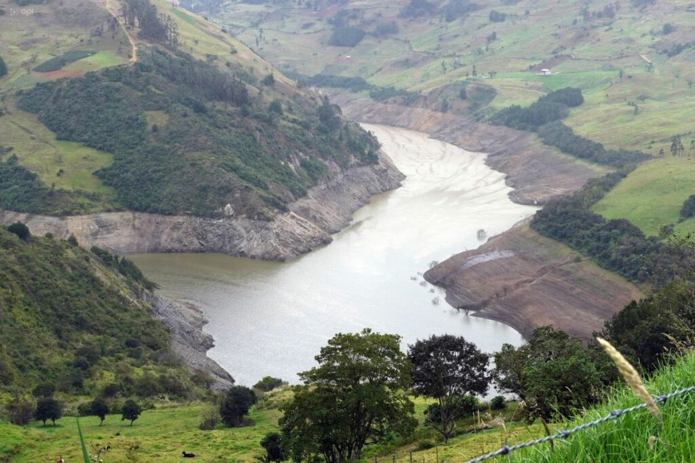
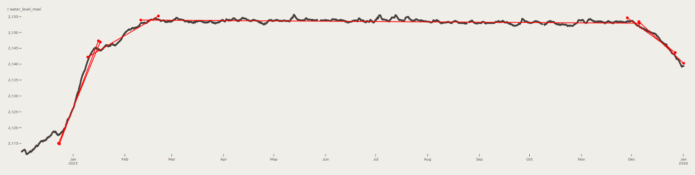
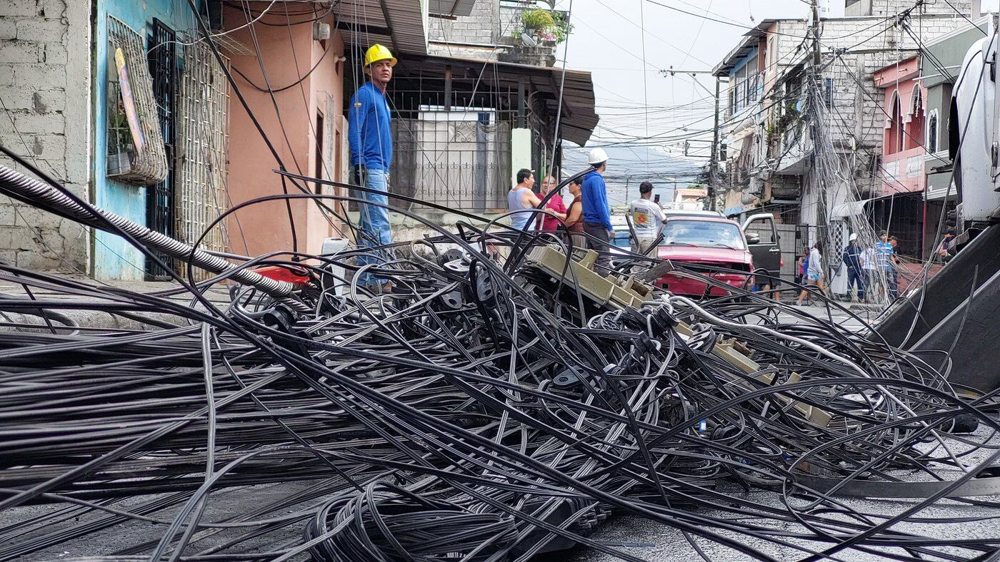
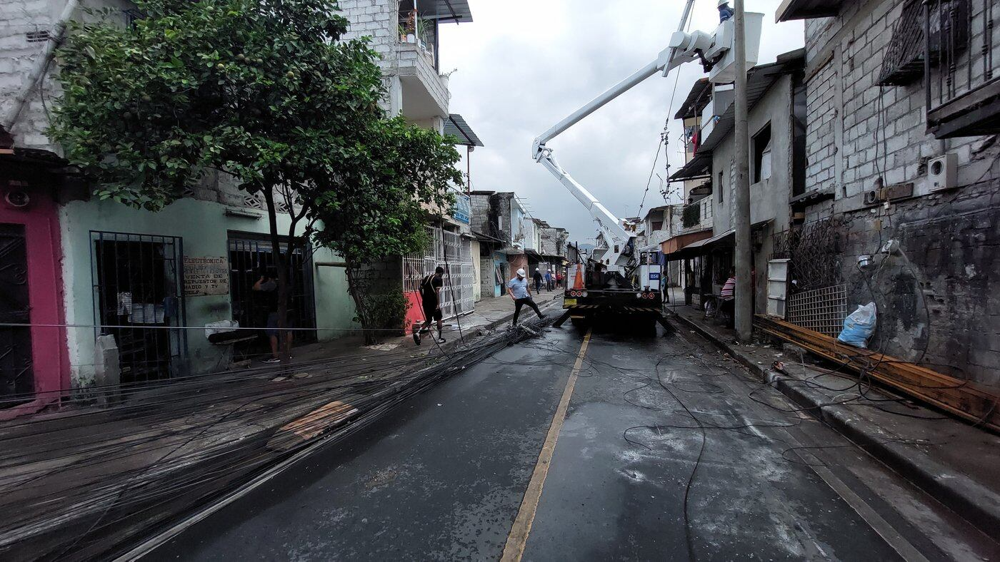

(This notebook is the companion to [this blog post](../..))

---

```js
import {
  data, 
  plot, plotWithLines, plotNaiveLinReg, plotWithAllRandomSamples, plotWithRandomPointsPicked,
  plotVotesDensityForParams, plotVotesPowerForParams, plotPointsOfPeakPower, plotEncompassedSpans,
  plotFinalSolutions,
  NUM_SAMPLINGS, randomChoices, numVotesForSample, votesInfoPerSample,
  peaksInfoNoOverlaps
} from './charts.js'

import { simpleSlider } from './components.js'
import { BUFFER_DISTANCE, PEAK_DETECTION_LOOKAROUND, PEAK_DETECTION_MIN_DENSITY } from './parameters.js'
```

(Future jreyesr says: While I was (slowly) writing this post, there were a few decent rain events that increased flow in the Paute river, which feeds the Mazar reservoir, so the water level over time stopped having the nice shape that it will have over this article. Just ignore that and pretend that 2026 hasn't started happening and we're still at about 60% water level and dropping; this post'll make more sense that way)

## Prologue

This is [the reservoir of the Mazar hydroelectric plant](https://en.wikipedia.org/wiki/Mazar_Dam):

<figure>

<figcaption>Photo taken on November 2024, when Mazar was essentially empty. Source: <a href="https://www.elcomercio.com/actualidad/negocios/como-esta-el-embalse-de-mazar-tras-lluvias-de-cuenca/">https://www.elcomercio.com/actualidad/negocios/como-esta-el-embalse-de-mazar-tras-lluvias-de-cuenca/</a></figcaption>
</figure>

Mazar is the happy home (in good times) of [almost 5.5 million cubic meters of water](https://www.celec.gob.ec/celecsur/informacion-tecnica/central-hidroelectrica-paute-mazar/), which directly and indirectly support about 1.2GW of electricity generation (for context, the entire country's peak electricity demand is maybe 4.5GW, at 6-7PM on weekdays). In other words, when Mazar dries, everyone worries. Two years ago, we had some pretty severe rolling blackouts, more or less from sept/2024 to dec/2024 (side note: losing power for eleven hours a day in three different power cuts from 3 to 4 hours each _sucks_. Try it sometime if you haven't, it's really fun). Last year (2025, that is), we had no such issues.

This is the water level in Mazar during the last 13 months or so:

```js
plot(width)
```

(By the way, that data was gathered over the entire year. There's [a little-known dashboard](https://generacioncsr.celec.gob.ec/graficasproduccion/) which shows the water level in the reservoirs of four hydroelectric plants, one of which is Mazar. That dashboard takes its data [from an even less-known JSON endpoint](https://generacioncsr.celec.gob.ec:8443/ords/csr/sardomcsr/pointValues?mrid=30031&fechaInicio=2026-01-14T06:00:00.000Z&fechaFin=2026-01-15T05:00:00.000Z&fecha=14/01/2026%2001:00:00) that shows the water level for each hour. It's a simple matter to periodically hit that endpoint, pull out the data and store it on a database. On [a TimescaleDB instance](https://github.com/timescale/timescaledb) with some cursory compression and columnar storage enabled, between 13 to 14 months of data take a bit over 5MB of disk space, at a 1.5x compression ratio)

The rolling blackouts stopped almost exactly one year ago, around the middle of December 2024. That's the point at which Mazar's level <span style="color: red">←started to recover→</span>. At around mid february/2025 it reached its top level (at which point, I assume, it started to spill and therefore lose a lot of water that wasn't used for power generation, since its generation capacity was capped out). It <span style="color: green">←stayed more or less constant→</span> until December 2025, at which point it <span style="color: orange">←started to go down→</span> again.

Theoretically, then, we could model the water level as three lines, something like this:

```js
plotWithLines([
  [new Date("2024-12-26"), 2118, new Date("2025-01-12"), 2145],
  [new Date("2025-02-20"), 2154, new Date("2025-11-30"), 2154],
  [new Date("2025-12-03"), 2153.5, new Date("2025-12-27"), 2144],
], width)
```

(perhaps with a fourth line to cover the area around February 2025, which is currently not covered by lines 1 nor 2)

Each of those lines is decently good at approximating the function _on a certain time interval_, but lousy elsewhere. This article's fun will be in finding those lines automatically (the ones above I drew by hand, manually shifting the start and end points around until the lines looked nice, but we can't have manually-done anythings)

## RANSAC

Just trying to model this dataset as a single line makes no sense, for there is no single line that would neatly fit the reservoir filling, staying full, and now draining. In fact, you _can_ try to fit a linear model to the data. A linear model will be found and it will minimize the square error (or whichever other metric is used), it just won't mean anything. Observe:

```js
plotNaiveLinReg(width)
```

The shaded area in the plot above is the 99.9999% confidence range for that dataset's true linear model (yes, [six nines](https://en.wikipedia.org/wiki/High_availability#%22Nines%22). For comparison, AWS S3 is [a measly three nines](https://aws.amazon.com/s3/sla/) availability, below which they'll reimburse 10% of that month's cost. And yes, I know I'm mixing metrics here, confidence != availability, but whatever). That indicates that there's a 99.9999% chance that the "true" linear model falls within that band. And, of course, that isn't true, for the simple reason that there's no "true" linear model that fits that data!

The output of a linear model is just two numbers, since the equation of a line is simply ${tex`y = mx + b`}. ${tex`m`} controls how steep the line is, while ${tex`b`} moves it vertically. Together, they define any possible straight line in any position in the plane. There are procedures to find the values for those parameters that "best" approximate a set of points, such as the least-squares method, but they won't work here because they assume that the set of points is somewhat like _a_ line, and in fact some methods break down when there are extreme outliers (in much the same way that averaging values will break down when there's an extreme outlier, because it drags the average away from its true value). In particular, the model in the chart above (the line and the confidence bands) was obtained via [least squares regression](https://observablehq.com/@toja/linear-regression-with-confidence-bands), in which the parameters for the slope and intercept are the values that minimize the sum of the squares of the Y distances between each source point and the model's line. This is usually a good first idea if you don't have a strong opinion on what to optimize for, because it matches Euclidean distance (the distance from one point to another is the square root of the sum of squared distances in each coordinate, or you can think of it as in the Pythagoras theorem, ${tex`c^2=a^2+b^2`}).

Another way of getting a line from a set of points is to just randomly sample the set of points, pick out two, and draw the line. There's no guarantees as to how "good" of a line that is, but hey, it's a line, and it's guaranteed to touch at least two points of the set (the two that were sampled to produce said line!). This procedure is called RANSAC, which means RANdom SAmple Consensus:

* Random Sample means just that: take a random sample of the source data (here, take two random points, because that's all that's needed to define a line, assuming the two points aren't coincident, AKA exactly in the same position)
* Consensus because the random sampling will be performed many times, with each sampling "voting" on its preferred parameters. The parameters that are most "voted for" are either the output, or then refined to obtain the output

RANSAC is used to model a set of data in the presence of outliers, even if very extreme. Here we use "model" as in "linear model", which means taking a set of points and trying to find the line that "best approximates" said points. The reason why RANSAC can be resistant to outliers is that it doesn't consider _all_ the points in the set when computing the model, it just looks at (for a linear regression problem) two points. So it doesn't matter if another point that isn't one of the two sampled is an absurd outlier, as it cannot affect the parameters. Even if we randomly pick an outlier as part of the sample, since the whole procedure is repeated many times, then the next time that same outlier is unlikely to be picked again, so it won't be able to affect that new round's parameters. In fact, there are variants of RANSAC that can work [even when less than 5% of the points in the set](http://wscg.zcu.cz/WSCG2013/!_2013_J_WSCG-1.pdf) belong to the "true" model, with the rest being noise or random data (see pages 29 and further in the link above). Least-squares fitting, by contrast, takes every point in the set into account when computing the model, and with 95% of the set being outliers, there's no guarantee as to what will come out of that (in the same way that, if you average 10 normal temperature measurements and one that, for whatever reason, is -273ºC (perhaps due to a mising data point being recorded as 0K), then the average will be inordinately skewed by that single wrong measurement). In our case there are no _outliers_ in the true sense of the word, e.g. there are no times when the water level gets erroneously reported as -32768 meters (as it could happen, for example, with a sensor that reports the water level in meters via a 16-bit signed integer, and which maybe reports a broken wire by using the smallest possible value in 16-bit two's complement ${tex`-2^{15}`}). However, there are _multiple_ linear models that we want to apply to the same dataset (one for each fragment of the year), and from the point of view of each model, the points of all other models are outliers, so it works out the same.

 A line is defined by just two points (in other words, any two points that aren't in exactly the same location will define one, and only one, line that passes through both). So we can sample the source set (that is, pick two points at random) and draw a line through them. Below are some examples; drag the slider to pick different pairs of random values. Notice how a line can be drawn for any pair of points, utterly disregarding for the moment whether or not that line is a good fit to the data. Right now, we just pick any two points, and draw the line between them:

```js
const randomIdxSlider = simpleSlider(NUM_SAMPLINGS - 1)
const randomIdx = view(randomIdxSlider)
const setRandomIdx = (x) => {
  randomIdxSlider.value = x;
  randomIdxSlider.dispatchEvent(new Event("input"))
}
```

```js
plotWithRandomPointsPicked(randomIdx, {inArea: false, timeSpan: false}, width)
```

Note that each line is accompanied by an shaded area around it, set up so when the line is completely horizontal it covers ${BUFFER_DISTANCE} meter(s) of water level above and below the line, and whatever the amount of time necessary so that the shaded area doesn't change width as the line tilts. You can't just say "± 2 units" because 2 Y units are 2 meters (which is a reasonable number of pixels; if your screen is similar to mine, then the Y ticks are separated by 5 meters each), whereas 2 X units are 2 milliseconds, which is utterly useless as a range (it's almost nothing). Using the same "2 axis units" in X and in Y would mean that as the line tilts towards vertical, the shaded area would become thinner and thinner. We'd much prefer the shaded area to remain the same width, visually, no matter the line's angle, so we apply an angle-dependent correction factor so as the line becomes more vertical, the area spanned widens to cover more "units" without changing its displayed width.

### Voting

Once we have _a_ line, the next step is to select all the points that are inside that line's shaded area. Those are the "votes" for that particular line. In other words, for any line (generated by picking two points at random from the dataset), any points in the dataset that are "close enough" to that line (that is, points that lie inside that line's companion shaded area) will cast a vote for it (because, from the point of view of those points, that line could be the correct model).

For example:

```js
Inputs.bind(simpleSlider(NUM_SAMPLINGS - 1), randomIdxSlider)
```

```js
plotWithRandomPointsPicked(randomIdx, {inArea: true, timeSpan: false}, width)
```

The particular line above has received **${numVotesForSample(randomIdx).voteCount} votes**. Use the slider above the plot to see other possible lines. You'll see that the most common solution, a line that covers the large interval in which the reservoir was full, should get maybe 6000 votes, which more or less matches the fact that this time of peace and plenty lasted from mid feb/2025 to the end of nov/2025, which is 8.5 months. At a sample per hour that's a total of 6100 points with the reservoir almost full.

Ideally, we'd (entirely randomly, of course) pick points that look like the examples below (there's three scenarios, click on the radio buttons to toggle between them):

```js
const mode = view(Inputs.radio([
  {label: "Filling up", offset: 3}, 
  {label: "Full", offset: 2}, 
  {label: "Draining", offset: 1}
], {value: 3, format: x => x.label, valueof: x => x.offset}));
```

```js
plotWithRandomPointsPicked(NUM_SAMPLINGS - mode, {inArea: true, timeSpan: false}, width)
```

Of course, we can't control ze randomness, for it's random. We just need to keep generating pairs of points until we randomly stumble onto all three scenarios. The second case, the horizontal line, is very easy to encounter, because there's a lot of possible pairs of points that would yield such a line, whereas the increasing and decreasing lines are less likely to appear, but they'll appear with enough random pairs picked.

We can get an idea of what RANSAC is doing by plotting the ${tex`m`} (slope) values corresponding to the random pairs, along with the number of votes granted to each of those parameters. Currently we're taking ${NUM_SAMPLINGS} random samples. Below, in the plot to the left, the X axis represents the ${tex`m`} (slope) value of each particular randomly-chosen line (pair of points), and the Y axis depicts what I call the "voter density", which is defined as the number of votes for that line (i.e. the number of points that lie within that line's shaded area, also highlighed in orange on the right-hand plot) divided by the time span of the votes (i.e. the latest time that voted for the line minus the earliest time that voted for it). The reasoning behind this metric is that we want to encourage solutions that cover a portion of the line well, but only a single consecutive portion, rather than a line that crosses from side to side of the graph, covering many points but also with large gaps. The "voter density" metric encourages solutions that cover a tightly packed portion of the line (those that cover as many points as possible with little or no gaps). For example, click on the points near the top on the plot below (the ones that have voter density about 45 in the Y axis); you'll see how, in the span that they cover, they cover almost everything, whereas the ones with low density (towards the bottom of the plot) have a large time span but cover few points inside said span, so their "voter density" is lower.

<div class="grid grid-cols-2">
    <div class="card">
        <p>Click on a point! <i>(You may need to click multiple times, points are small and sometimes don't register clicks. Sorry about that.)</i></p>
        ${resize((width) => plotVotesDensityForParams(randomIdx, setRandomIdx))}
    </div>
    <div class="card" style="overflow: hidden;">
        ${Inputs.bind(simpleSlider(NUM_SAMPLINGS - 1), randomIdxSlider)}
        ${resize((width, height) => plotWithRandomPointsPicked(randomIdx, {inArea: true, timeSpan: true}, width, height))}
    </div>
</div>

### Ranking

However, just using voter density to pick the "best" solutions has a drawback, in that it also rewards solutions that only cover a tiny portion of the line. For example, click ${html`<button onclick=${() => setRandomIdx(NUM_SAMPLINGS - 4)}>this button</button>`} (and yes, this one isn't random, I've hardcoded it to make a point!). That covers a very small region of the line, and _of course_ it'll have very good density in that area (in other words, the number of votes for that line is small, but so is its time span, and both numbers divide out to be a fairly good density, pretty much as good as it can be, since in its area of coverage that line covers every last point). This means that a high voter density isn't necessarily an indication of a good model.

We can do better by multiplying this density value by the number of votes for each line, that encourages solutions with good density and also with many votes. I have no good names for this metric, but it reminds me of the ${tex`P = V^2/R`} formula for power dissipation in electronics (this one is ${tex`\mathrm{mysterious\ unnamed\  metric} = N^2/\Delta t`}), so I decree it shall henceforth be named "voter power" (and no, that name isn't an advertisement for the Democratic Republic of Borduria).

Now using this new metric for the Y value, the plot becomes somewhat different:

```js
const annotations = [
  {m: -.007, power: 240000, title: "m≈0, the horizontal line that covers most of the time"},
  {m: .625, power: 35000, title: "Slower rise on Jan-Feb/2025"},
  {m: 2.75, power: 25000, title: "Initial rise once water started flowing again"},
  {m: -.75, power: 21000, title: "The fall!"}
]
```

<div class="grid grid-cols-2">
    <div class="card">
        <p>Click on points near the annotations!</p>
        ${resize((width) => plotVotesPowerForParams(randomIdx, setRandomIdx, annotations))}
    </div>
    <div class="card" style="overflow: hidden;">
        ${Inputs.bind(simpleSlider(NUM_SAMPLINGS - 1), randomIdxSlider)}
        ${resize((width, height) => plotWithRandomPointsPicked(randomIdx, {inArea: true, timeSpan: true}, width, height))}
    </div>
</div>

In the plot above, there's an additional metric, the voter density, displayed by each point's color (that is, the same thing that we were plotting before, except now it isn't encoded in the Y position but in the color instead). Dark red points (and yes, I know that color-blindness exists, but the color scheme used is Turbo, which [is supposed to work](https://research.google/blog/turbo-an-improved-rainbow-colormap-for-visualization/) for color-blind people too, except in the case of total color-blindness) have the highest possible density, which is 48. The X unit that is used for the time plots is 2 days, and the data has 1 sample per hour, so it all tracks. There's just no way for any line to match more than 48 points in any 2-day period.

Now let's do some very basic peak detection: we'll count a point as a "peak" only if there are no points with a higher voter power (Y axis) in a ${tex`\pm${PEAK_DETECTION_LOOKAROUND}`} slope (X axis) neighborhood around it. Furthermore, we'll only consider a point as a peak if it has a high enough voter density (over ${tex`${PEAK_DETECTION_MIN_DENSITY}`}), so as to filter some points that have wildly unreasonable slopes, but since they're isolated (far away from other points in ${tex`m`} space), they'd be counted as peaks otherwise. The peaks are marked in red and have their ${tex`\pm${PEAK_DETECTION_LOOKAROUND}`} neighborhood displayed (so you can see that they're the top values in their neighborhoods), with every other non-peak point in light blue:

```js
plotPointsOfPeakPower(PEAK_DETECTION_LOOKAROUND, PEAK_DETECTION_MIN_DENSITY)
```

> _Note that on the plot above, the ${tex`\pm${PEAK_DETECTION_LOOKAROUND}`} neighborhoods don't look symmetric, which is because the X axis itself isn't uniformly spaced. It's using [a symlog scale](https://matplotlib.org/stable/gallery/scales/symlog_demo.html) so points near X=0 are more spread out, and they compress as they get away from 0, which means that the neighborhoods also start squishing down. Also, the lower part of the diagram is cut off, and only points with voter power > 1k are shown._

The number of detected peaks varies (you can reload this page and you'll probably see different peaks) due to the random sampling that generates the points from which the peaks are chosen. But there's always a peak at ${tex`m \approx 0`}, one at ${tex`m \approx 0.6`}, one at ${tex`m \approx 2.5`} and one at ${tex`m \approx -0.8`}. These are the peaks that correspond to the main epochs (filling, filling but slower, stable, and dropping).

In addition to filtering low-density peaks, we could also supress peaks whose time span is entirely contained in another, higher peak. The reasoning for this is that if we have a possible model A (denoted by a point) that gets votes from a small time range and _also_ has a lower voter power than another model B, then A is worse on both counts than B and we should always prefer B. For example, let's say that we have a possible model supported by votes from January 10 to January 20, and with a voter power of 4000. If there's another model supported by votes from January 1 to January 31 (which entirely encompasses the time span of the other model) and with a voter power of 20,000, then the second model is better on both aspects than the first one: it covers a larger time range, which we want (we want to encourage models that explain as much of the time range as possible) and it has a larger voter power (which indicates a better voter density and/or more votes for it). So the second model should just eat the first one and supress it, even if the first model were to otherwise become a peak.

Below are the peaks (only the peaks, from the plot above), but now the X axis is the time spanned by each peak (that is, the min time to the max time of the points that voted for that solution). The Y axis is still the voter power of that solution. 

```js
plotEncompassedSpans()
```

Depending on how the random generation went (you can reload this page to see a new set of points), you may see one or several peaks that are completely encompassed by another (surrounded by both sides in time, and below the encompassing peak in the Y direction). Those encompassed points could be ignored because there's an altogether better alternative, with more voter power and covering a larger interval.

This procedure is somewhat similar to [non-maximum supression](https://naokishibuya.github.io/blog/2022-06-01-object-detection-non-maximum-suppression/) in computer vision (AI!) models, where a bunch of mostly-similar boxes that may or may not surround a detected object are coalesced into a single box, where sufficiently-overlapping boxes with a lower detection score for a certain object class are deleted. In this case we're very strict on the overlap required (one of the two areas must be entirely contained by another), and it's in 1D rather than the more common 2D case, but the main idea is also to supress redundant, smaller detections.

In the end, we have **${peaksInfoNoOverlaps.length} peaks** (this is ignoring the ones that were completely covered by a larger, higher-power peak). For each one, we know its parameters (${tex`m`} and ${tex`b`}), as well as its start and end time points (which determine the time range that supports that peak) and the density&power metrics, derived from the number of voters for that peak. We can plot those solutions against the original data, to see what they cover and how well they do. Recall that each "solution" (some of which are peaks, if there isn't a better solution nearby) represents a 2D line, with a slope and a Y offset, and we know from where to where it covers because of which points voted for it. We can plot those lines alongside the source data, and even include the line equation for each:

```js
plotFinalSolutions(width)
```

Not bad, eh?

Also, for those that read the source code: yes, I _have_ hard-coded three lines, which cover the three stages of filling. Technically this is cheating, because the RANSAC procedure no longer needs to randomly find those solutions, they're always included as if they were found. I have to do that so the plot above with the radio buttons, the one that displays the Filling up, Full and Draining scenarios, works as expected. However, at ${NUM_SAMPLINGS} random samples taken, that doesn't affect things anymore. I've run RANSAC multiple times _without_ the hardcoded samples, and it always finds those three scenarios on its own. Here's a screenshot (this time a static one, not an interactive plot) of one of those runs, without any help. Notice how the three scenarios are found anyways, even the two different filling speeds and the two draining speeds are detected:



Now we can finally make assertions about the rate of change of the reservoir's level. For example:

* The long almost-horizontal line is something like ${tex`y = -0.01x+2229.8`} (yours may vary, it's random after all). This indicates that during the time range covered by that line, the level almost didn't change with time, and in fact it held at about 2230 meters above sea level (that's what the intercept parameter ${tex`b`} indicates for a horizontal line)
* During the first fill-up stage, happening near the start of January 2025, the equation was something like ${tex`y = 2.96x-27604.0`}. Here the intercept doesn't have a clean interpretation, but the slope does: it's almost 3 meters per X interval, which is 2 days, so about +1.5 meters per day
* The second, slower fill-up stage has an equation like ${tex`y = 0.59x-3832.3`}, +0.3 meters per day
* Finally, near the end, the reservoir drained at two speeds: the first one, during the first half of December, is modeled by something like ${tex`y = -0.58x+8047.3`}, so -0.3 meters per day. Then it started draining faster, near ${tex`y = -1.34x+15888.5`}, so -0.7 meters per day at the end

In fact, with that last equation we could predict when the reservoir would be empty (assuming the rate of draining didn't increase, which is only true if a) demand doesn't change, which it does since we're entering winter and winter is hot, b) no other rivers increase or decrease flow, which they do, and c) Mazar's reservoir didn't change area as it drained and it were a perfectly vertically extruded solid, which it isn't since it has sediment at the bottom that reduces the usable volume at lower heights). If such pesky real-world constraints didn't exist, and kowing that Mazar must stop if the level ever goes below 2110 meters (I think?), we can solve for ${tex`x`} using the equation for the last stage, let's say ${tex`y = -1.34x+15888.5`}, and we find out that ${tex`x`} in that case would be about 10282. That must be multiplied by the number of milliseconds in two days, and it ends up as 1770996533333 millis, which is February 13, 2026.

Alternatively: we have records until January 1st. At that point the reservoir was at 2139.4 meters, so it had 29.4 meters left. It was draining at about .67 meters per day, so it'd take almost 44 days to lose all its height. 44 days after January 1st is February 13, which checks out. In other words, if that last linear model held up, we'd most likely start having blackouts in the middle of February. 

Around January 10, the Paute river (which feeds Mazar) started seeing some water again. During December it had been at maybe 20 cubic meters per second, and on January 13 it reached almost 60. You can see the current water level [on this link](https://generacioncsr.celec.gob.ec/graficasproduccion/) (set Tipo to Hidrología, Periodo to Mensual, and the date selector to something in January 2026). As I write this, we've gained almost two meters in three days, it has rained in Guayaquil for the first serious time since eight or nine months ago, and hopefully there won't be blackouts in the next few months...

...apart from those localized power cuts caused [by lampposts falling down due to the rain, that is](https://www.eluniverso.com/guayaquil/comunidad/caida-de-poste-deja-sin-servicio-de-energia-electrica-a-sector-del-suroeste-de-guayaquil-nota/).

<figure>
    
    
    <figcaption>Images by Carlos Barros. Source: <a href="https://www.eluniverso.com/guayaquil/comunidad/caida-de-poste-deja-sin-servicio-de-energia-electrica-a-sector-del-suroeste-de-guayaquil-nota/">https://www.eluniverso.com/guayaquil/comunidad/caida-de-poste-deja-sin-servicio-de-energia-electrica-a-sector-del-suroeste-de-guayaquil-nota/</a></figcaption>
</figure>
