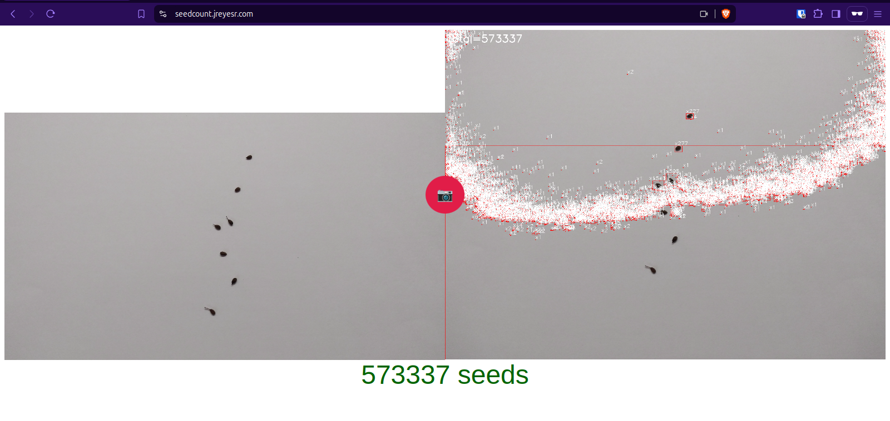
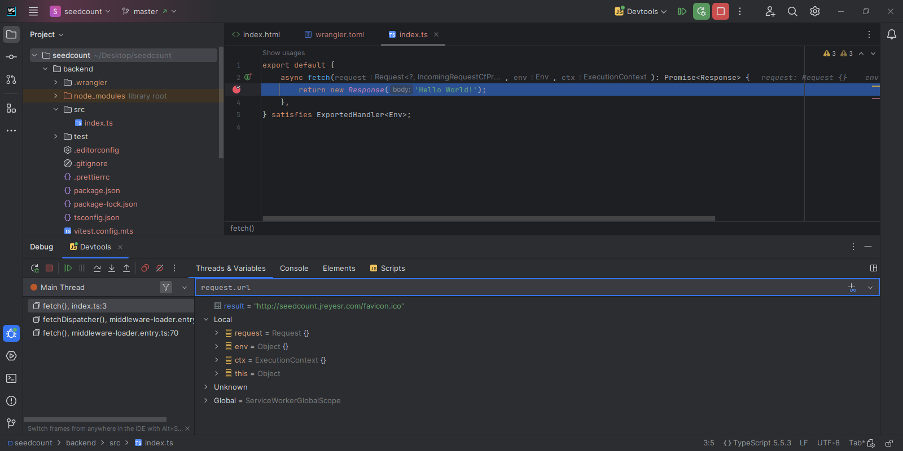
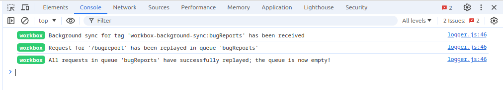
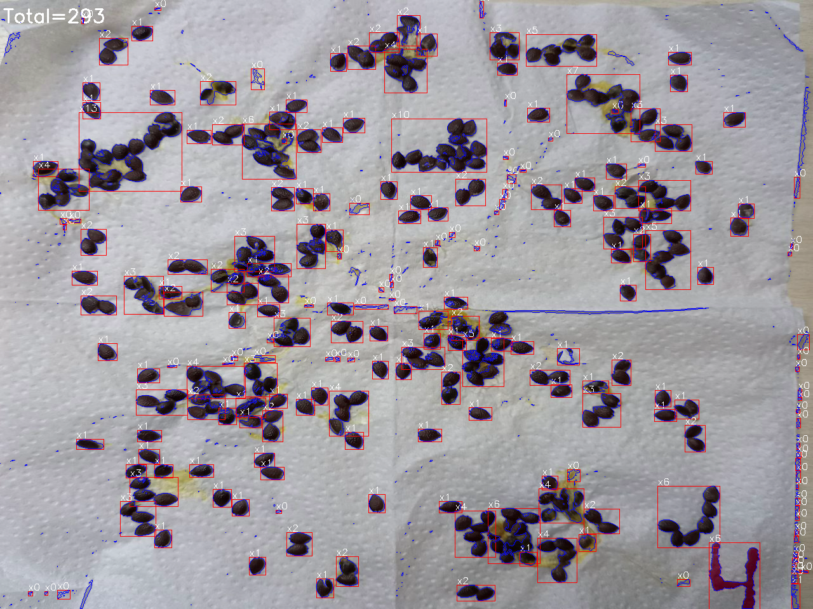

[](https://seedcount.jreyesr.com)

Welcome back! In this article we'll revisit [the seed counting application](https://seedcount.jreyesr.com/) that we presented on [the previous post](/posts/seedcounter/), and add several changes that were suggested after seeing the original application be used.

## Fixing a weird gradient issue

Here's a completely normal picture of some seeds (this time they're [balsa](https://en.wikipedia.org/wiki/Ochroma) seeds, and I've just learned that Ecuador provides ~95% of the world's balsa, per Wikipedia. Neat):


That picture looks perfectly normal, but after being processed it becomes horribly bad:



Yeah... there clearly _aren't_ 573337 seeds in that photo.

Let's load that image on [Glue](https://glueviz.org/), a really cool program for data exploration, and look around. In fact, sneak peek: I have an article cooking about Glue. It's been delayed due to days only having 24 hours and all that. It'll be published... eventually.

Glue allows you to load datasets, such as images (interpreted as two-dimensional matrices where each XY position contains three values, for the red, green and blue channels). Then, the datasets can be plotted in many different manners. For example, there are multiple ways of plotting an image: you could just plot it as an image, i.e. a rectangular set of pixels. You could plot something (say, the X position) against the gray value instead, in a XY scatter plot. You could plot the _histogram_ of gray values (i.e. the count of pixels that have each gray value from 0 to 255). Here we'll plot the raw image and also the histogram of red values:


The image displayed here to the left is only the red channel of the source image. Since the image is essentially grayscale, all three color channels are almost the same, so our discussion below doesn't change nearly at all if we choose another channel.

Then, to the right of the screen, there's a histogram. It counts the number of pixels in the image that have each red value, from 0 to 255. For example, we can see that the most common values are those between 150 and 190 or so.

We can then select that peak in the histogram, which will also select those pixels in the image. Notice how we drag in the histogram to select a certain region, and then _both_ the histogram and the image get those pixels highlighted in green:


As you can see when we zoom in on the image, that peak neatly covers everything _but_ the seeds: everything is lightly tinted green, _except_ for the seeds themselves.

So where _are_ the seeds then? The rest of the histogram seems entirely empty. In fact, it isn't: down at the bottom left corner, there's a _tiny_ peak. It's so tiny, in fact, that it doesn't show at all. But that's because the other peak, the background one, is way too tall. If we fiddle with the max Y value of the histogram (by setting it to 500, as opposed to its original value of maybe 500K), we see other things that were previously invisible:


Below is a still image. The foreground (here defined as values _below_ 100, i.e. dark-ish pixels, i.e. seeds) is marked in red, while the background (here defined as values from about 140 to 200, i.e. light-ish pixels, i.e. the sheet of paper in the background) is marked in green. You can see how much taller the background peaks in the histogram are: at this scale, they look almost vertical. They are, in fact, _just_ a thousand times taller: the tiny foreground red peak goes up to about 500, while the green background peak goes up to 500K.


And here's the histogram that was generated by the seedcounter application itself, along with the selected threshold:


I have absolutely no idea why the peak looks a lot more jagged. However, the main shape remains. And the application also provides the exact threshold used: 166.

When we manually select only the pixels with red values below 166 in Glue (which are those that the application took as being seeds), we can see the reason for the problem. Here, each pixel with a gray value below 166 is colored in blue. Notice how that includes the seeds (as expected, since they're very dark spots), but also parts of the background, particularly near the bottom:


166, the chosen threshold, lies more or less in the middle of the huge background peak. This means that a bit less than half the background is erroneously chosen to be part of the foreground.

Furthermore, the background seems to have a _tiny_ gradient: the bottom is generally darker that the top. We can see that by taking a vertical slice across the image, here marked in orange, and plotting it. The left of the plot corresponds to the bottom of the slice (i.e. as you move right in the plot, you move up in the image). The orange line in the plot is the actual red channel level. It starts at maybe 155 at the bottom of the image and goes up to about 190, steadily increasing as we move up in the image. And, of course, the threshold of 166 is right in the middle of those two values. That's why there are very large areas in the bottom half of the image that were (mistakenly) marked as very large groups of seeds: they're the part that fell below that 166 threshold.


This is due to the thresholding algorithm used. As discussed on [the original post](/posts/seedcounter/#binarizationthresholding-otsu-and-triangle-methods), we have several algorithms available. Apart from the very simple thresholding algorithms, which require that we set a threshold value beforehand (which we can't and don't want to do, because it'd make the application way more brittle, because changes in global illumination may make the entire image fall above or below the threshold), there are some algorithms that automatically determine a reasonable threshold. 

[Otsu's algorithm](https://hbyacademic.medium.com/mathematical-secrets-behind-image-binarization-otsu-thresholding-25edf8d7cb60), which we've been using until now, chooses a threshold that minimizes intra-class variance and maximizes inter-class variance (those two formulations appear to be the same, just restated). In other words, it picks the cutoff that best separates the data in two classes, foreground and background. This works well when the two classes (foreground and background) have a similar number of pixels. Here, however, nearly the entire image is background, and so Otsu's algorithm essentially ignores everything but the background: the very few seed pixels have nearly no influence on the final threshold. This is similar to the problem of using the average to represent a set of observations: if there are many more observations of one type than another, the average will essentially represent the value of the more-frequent observations. Here, since very few pixels are seeds, the algorithm more or less ignores them and just splits the background in two, with the seeds just happening to fall to one side.

Then there's the [triangle algorithm](https://www.mif.vu.lt/atpazinimas/dip/FIP/fip-Segmenta.html#Heading118), a really neat geometrical algorithm that draws a right-angled triangle between the top peak of the histogram and an edge. Then, it tries to find the point in the histogram that is farthest away from that diagonal line. That farthest point is taken to be the cutoff (there's a constant that is added, but the main idea is the same). Notice how the two main peaks in the histogram below have wildly different heights, but that doesn't affect the algorithm: the cutoff point is placed in an appropriate place that separates the two peaks:


It turns out to work well when the foreground peak is very small, which is the case here, because the fact that it's small doesn't really matter. The important point is the large peak, the background one. However, even it doesn't quite separate everything correctly:


There's a patch of white pixels at the bottom right corner, which is also identified as a cluster of seeds.

The main problem with all these algorithms is that they choose a single, image-wide threshold. However, here the background isn't one consistent level of white: it varies across the image, especially vertically (the background is darker at the bottom). 

That's why adaptive thresholding exists, which computes the threshold over smaller regions on the image, and thus avoids the issue of a single threshold not being globally optimal.

Adaptive thresholding works by sliding over regions of the image, like this:


For each region, it computes the "optimal" threshold looking only at that region (there are [two ways](https://docs.opencv.org/4.x/d7/d1b/group__imgproc__misc.html#ga72b913f352e4a1b1b397736707afcde3) of doing so, either computing the simple mean or using a "gaussian blur"-like method where the central pixels have a larger weight, where weights are assigned using a 2D normal distribution, AKA bell curve, AKA gaussian). The threshold can optionally be adjusted by a constant value (which can be either added or subtracted), and then simple binary thresholding is applied against that threshold: pixels that were higher are set to pure white, 255; while pixels that were darker are set to pure black, 0 (or, optionally, this can be inverted).

Essentially, adaptive thresholding computes an average gray value for each point in the image, and uses that as the cutoff for that point. If other regions in the image are illuminated differently, it doesn't matter: they'll get their own average gray values.

When using that algorithm, we no longer have those dark spots at the corners:


From there on, everything proceeds as normal and we obtain the correct result:


To recap: we found an issue when most of the image is background, such as when trying to count a few small seeds. Otsu's thresholding computes a wrong separation point because it's more optimal to place it inside the background. Adaptive thresholding can help by allowing the average intensity to vary across the image, such as when a corner is darker than another.

## Debug features

When preparing the application for public consumption, I removed all the `<canvas>` elements that displayed intermediate results, since those aren't likely to be of interest to users. However, they _are_ of interest to me, as the developer, and it also seems like a shame to lose them altogether. When things go wrong, you can see in which step the problem happened: was it on the thresholding? On the clustering? Somewhere else?

Therefore, the application now has a collapsible panel that displays arbitrary data, in a similar form to JS's `console.log` statements (namely, a sequential list). Unlike `console.log`, it can be passed images (which will be rendered), text (which will just be printed) and data (JS objects, which will be printed, but wrapped in a `<code>` element so they get a monospaced font). See a snippet of the logs below:


The code that records logs looks like this:

```js
const Log = {
	_logs: [],
	clear: function () {
		const panel = document.querySelector("#debugPanel dl");
		panel.textContent = "";
		Log._logs = []; // clear array
	},
	_addEntry(name, content) {
		const panel = document.querySelector("#debugPanel dl");
		const dt = document.createElement("dt");
		dt.textContent = name;
		const dd = document.createElement("dd");
		dd.appendChild(content)
		panel.append(dt, dd)
	},
	image: function (text, img) {
		const canvas = document.createElement("canvas");
		canvas.width = 1;
		canvas.height = 1;
		canvas.style = "border: 1px solid black; max-width: 100%;";

		Log._addEntry(text || "Image", canvas)

		cv.imshow(canvas, img); // Must be run once the canvas is already in the DOM

		Log._logs.push({ts: new Date().toISOString(), type: "image", label: text, image: canvas.toDataURL()});
	},
	log: function (text) {
		Log._addEntry("Text", document.createTextNode(text))
		Log._logs.push({ts: new Date().toISOString(), type: "text", text});
	},
	data: function (tag, d) {
		const json = document.createElement("code")
		json.textContent = JSON.stringify(d, null, 1)
		Log._addEntry("Data", json)
		Log._logs.push({ts: new Date().toISOString(), type: "data", tag, data: d});
	},
	error: function (tag, e) {
		Log._addEntry("Error", document.createTextNode(errString))
		panel.appendChild(document.createTextNode(errString));
		Log._logs.push({ts: new Date().toISOString(), type: "error", tag, data: errString});
	},
}
```

There are several functions, such as `Log.log("something")`, `Log.image("Caption", cvImg)`, `Log.error(err)` and `Log.data("some_tag", {foo: 1, "bar": "baz"})`. They all add an entry to [an HTML `<dl>` element](https://developer.mozilla.org/en-US/docs/Web/HTML/Element/dl), AKA a Definition List, AKA something like a key-value structure. While `<dl>` elements are normally used to hold pairs of words and their definitions, MDN [explicitly states](https://developer.mozilla.org/en-US/docs/Web/HTML/Element/dl#metadata), in the initial paragraph and in an example below, that another common use is "to display metadata (a list of key-value pairs)."

Here, we use, for example, the image's provided caption as the key, and an `img` element containing the image as the value. For plain text, "Text" is always the key, and the value is the passed text. Same for JS errors, except that "Error" is the key.

The logging facility is used like this:

```js
function processImage(src) {
	Log.image("Source", src)
	let dsize = new cv.Size(1280, 960);
	cv.resize(src, src, dsize, 0, 0, cv.INTER_AREA);

	let gray = new cv.Mat();
	cv.cvtColor(src, gray, cv.COLOR_BGR2GRAY, 0);
	Log.image("Grayscale", gray);

	let histSrc = new cv.MatVector();
	// much more OpenCV code
	
	Log.data("final_stats", {medianArea, totalSeeds})
	Log.image("Output", src);
	
	return totalSeeds;
}
```

The functions on the `Log` object can be called at any point, and they will add a new definition to the definition list. They'll also add the log to an internal array, `_logs`, which we'll use later.

Now there's a way to record the progress of the image processing function, adding entries at any point to a log. Those entries can be images, data or text. Images are especially useful, because you can just throw an image at the logger and it'll record how things looked at that point in the pipeline.

### Contact form

I also wanted to have a way for users to contact me (the application developer), and send images that were obviously wrong. I can then study the images and ideally come up with an adjustment to the algorithm that makes it work correctly for that image.

To do so, there's now a button at the bottom right corner of the application:


Clicking on that button pops up a dialog (literally. It uses [an HTML `<dialog>` element](https://developer.mozilla.org/en-US/docs/Web/HTML/Element/dialog), about which I learned on a conference talk about accessibility, of all things). A `<dialog>` element is a piece of HTML that is usually hidden and kept out of the document flow, until something else (usually a `<button>` with a JS handler) makes it appear. Dialogs already implement some common dialog-y features, such as a backdrop (a gray overlay that covers the rest of the page, to move focus to the dialog), animations on show and hide, state preservation between successive displays of the same dialog, good accessiblity support, binding the Escape key to the modal close action, and more.

The dialog looks like this:

```html
<dialog id="sendDebugModal">
    <button class="close">X</button>

    <h4>Send data to developer</h4>
    <p>
        Was your data wrongly processed? Did the application count 573421 seeds? If so, you can send the problematic
        image to me, so I can check the reason for the failure.
    </p>

    <p>
        If you decide to send the data, I (<a href="https://github.com/jreyesr/">@jreyesr</a>) will receive it. Only
        the data listed below will be sent, and it contains no personally identifiable information. I will only use the
        data to identify the reason for the problem and implement a solution.
    </p>

    <details id="debugPanel">
        <summary>Click to see the data that will be sent</summary>
        <dl></dl>
    </details>

    <p>
        If that data is safe to send, click the button below. Otherwise, just close this dialog.
    </p>

    <form method="dialog">
        <button type="submit">Send</button>
    </form>
</dialog>
```

The question-mark button that appears on the page has the following JS handler attached to its On Click event:

```js
const sidebar = document.getElementById("sendDebugModal");
document.getElementById("help").onclick = () => {
  sidebar.showModal();
  document.querySelector("#sendDebugModal .close").onclick = () => sidebar.close();
};
```

The `.showModal()` function will display the modal, while the `.close()` function dismisses it. The latter is attached to a button that appears _inside_ the modal.

[The `<details>` element](https://developer.mozilla.org/en-US/docs/Web/HTML/Element/details) inside the panel, meanwhile, implements what some UI toolkits (cases in point: [Bootstrap](https://getbootstrap.com/docs/5.3/components/collapse/), [Material Design](https://m3.material.io/components/lists/guidelines)) call an "accordion" or "collapse": an item that, when clicked, expands to show more elements. When collapsed, only a title is displayed. Again, this is a native HTML element that already implements whan many UI toolkits do, but natively, with no dependency on JS, automatic styling, and good accessibility support.

The logger that we explored [above](#debug-features) writes its elements inside this `<details>` element. Thus, over the course of processing an image, this accordion collects all the logs, and when a user wants to see them, they're already there.

There's also an explanation of how the data will be sent and used, plus everything that will be sent is displayed. Here, we don't really like the practice that is known in the industry as Surreptitious Data Collection For Product Enhancement And Ad Targeting Purposes, Especially Ad Targeting, But We Only Tell You The Bit About Product Enhancement And Only In Page 321 Of Our Mandatory Terms Of Service That You Just Accepted By Thinking About Them.

If you find that the data to be collected is acceptable, there's a button at the bottom to submit the data to me.

Of course, until now the application has been entirely client-side. The only responsiblity of the server is to host and provide a single HTML file, `index.html`, whenever someone issues a `GET` request to <https://seedcount.jreyesr.com>. In fact, the application's source code is hosted [on Github](https://github.com/jreyesr/seedcount) and serving is done by [Github Pages](https://pages.github.com/), which only serves static files and integrates very easily with Github-hosted projects. It even handles HTTPS for custom domains, via [Let's Encrypt](https://letsencrypt.org/), and it does all that for free.

Therefore, we need a way to receive user requests. A primitive idea would be for that button to download a ZIP file containing the debug log (to the user's device), and then the user sends that to me, out of band (say, via email or a contact form somewhere). This would work because, as of now, there's about 1.2 monthly users for the application. Or something. Only a _tiny_ amount of people even know about it, and they're all at most [two degrees of separation](https://en.wikipedia.org/wiki/Six_degrees_of_separation) away from me, as far as I know. In other words, either the user personally knows me, or he knows someone who personally knows me. Or the user _is_ me, I guess; that's zero degrees of separation. Passing around ZIP files is viable at that stage.

However, a purely online solution is neater. And it gives me a chance to play with another cool solution: [Cloudflare Workers](https://developers.cloudflare.com/workers/), i.e. Cloudflare's serverless/lambda functions offering.

### Cloudflare Workers for low-cost, low-maintenance endpoints

First off: I have no direct affiliation to Cloudflare. I just manage a couple of websites where Cloudflare is the domain registrar and sometimes the file server too. And I'm feeling too lazy to want to use yet another service when Cloudflare will do just as well.

[Cloudflare Workers](https://workers.cloudflare.com/) is a serverless platform, comparable to [AWS Lambda](https://aws.amazon.com/lambda/) or Google's [Cloud Functions](https://cloud.google.com/functions). The special gimmick of lambda/serverless is that, as its name hints to, there are no (visible!) servers to manage. There are, but you don't manage them. There's no OS to keep updated and on which you install packages, applications or Docker containers.

Instead, you as the developer of serverless solutions write short-ish functions (in the programming language sense of the word), that react to events. Said events are usually web requests that come in to the application. For example, you write a lambda function that will run whenever someone issues a `GET` to a certain URL. The function reads parameters from the URL or the request headers, perhaps contacts a database, and then sends back an HTML response as the function's return value. Or it can react to a `POST`, such as a file upload scenario. It'd then read the file from the request body, perhaps process it (say, resize an image so it takes up less space), store it somewhere (some sort of object storage, i.e. S3 or the platform's equivalent) and maybe return a success code.

Depending on the platform, serverless functions can react to other events too. For example, AWS has some services that can be configured to trigger Lambda functions. For instance, Lambda functions can run whenever [a file is uploaded to S3](https://docs.aws.amazon.com/lambda/latest/dg/with-s3-example.html), or [an EC2 instance changes state](https://docs.aws.amazon.com/lambda/latest/dg/services-ec2.html). Cloudflare integrates Workers, for example, with [Queues](https://developers.cloudflare.com/queues/configuration/javascript-apis/#consumer), such that a function can run whenever a message is received on a queue; and [Email Routing](https://developers.cloudflare.com/email-routing/email-workers/), which runs functions in response to an email being received on a Cloudflare-controlled domain.

Here, however, we just need a basic HTTP handler, the most basic kind. It'll handle a single route, and the domain will be assigned by Cloudflare. 

A Cloudflare Workers project is created using [an `npm` command](https://developers.cloudflare.com/workers/get-started/guide/), and managed via the `wrangler` CLI binary. When creating a project, it'll ask for some questions on a nifty interactive terminal UI:

```bash
❯ npm create cloudflare

> npx
> create-cloudflare


using create-cloudflare version 2.22.1

╭ Create an application with Cloudflare Step 1 of 3
│ 
├ In which directory do you want to create your application?
│ dir ./backend
│
├ What type of application do you want to create?
│ type "Hello World" Worker
│
├ Do you want to use TypeScript?
│ yes typescript
│
├ Copying template files 
│ files copied to project directory
│ 
├ Updating name in `package.json` 
│ updated `package.json`
│ 
├ Installing dependencies 
│ installed via `npm install`
│ 
╰ Application created 

╭ Configuring your application for Cloudflare Step 2 of 3
│ 
├ Installing @cloudflare/workers-types 
│ installed via npm
│ 
├ Adding latest types to `tsconfig.json` 
│ added @cloudflare/workers-types/2023-07-01
│ 
├ Retrieving current workerd compatibility date 
│ compatibility date 2024-07-18
│ 
╰ Application configured 

╭ Deploy with Cloudflare Step 3 of 3
│ 
├ Do you want to deploy your application?
│ yes deploy via `npm run deploy`
│
├ Logging into Cloudflare checking authentication status 
│ logged in
│ 
├ Deploying your application 
│ deployed via `npm run deploy`
│ 
├  SUCCESS  View your deployed application at https://seedcounter-backend.jreyesr.workers.dev
│ 
│ Navigate to the new directory cd backend
│ Run the development server npm run start
│ Deploy your application npm run deploy
│ Read the documentation https://developers.cloudflare.com/workers
│ Stuck? Join us at https://discord.cloudflare.com
│ 
├ Waiting for DNS to propagate 
│ DNS propagation complete.
│ 
├ Waiting for deployment to become available 
│ deployment is ready at: https://seedcounter-backend.jreyesr.workers.dev
│ 
├ Opening browser
│
╰ See you again soon! 
```

Workers "projects", which are called Applications, are scoped to your Cloudflare account. Each Project contains a main Worker function, which handles one URL or URL path. For example, for a simple endpoint such as the one we're using here, where only one URL is required, we can just configure that URL, and the function that handles calls can just run its code. In the Worker code, this is done [by exporting a function called `fetch()`](https://developers.cloudflare.com/workers/runtime-apis/handlers/fetch/), which will be called whenever a request comes in to the domain, subdomain or URL pattern associated with that Application. By default, Cloudflare assigns each Application a subdomain of `workers.dev`, with the form `https://{app-name}.{account-name}.workers.dev`. You can see that in the terminal output above, where the subdomain <https://seedcounter-backend.jreyesr.workers.dev> was allocated to this application.

However, let's say that we wanted to host a more complex web application. One that, for example, had the following endpoints (for a hypothetical instant-messaging application):

* `POST /login`, `POST /logout`, `POST /signup` for authentication
* `GET /messages` to retrieve a list of messages
* `POST /messages`, `PUT /messages/{id}`, `DELETE /messages/{id}` to create, update and delete messages
* `GET /contacts`, `POST /contacts`, `DELETE /contacts` to get, add and delete contacts (other people)

All of those would need to have _one single_ entry point. In practice, that means that the `fetch()` function will receive all requests, and will need to use some sort of router to determine the correct handler, usually based on the request's URL and method. This is a typical pattern in backend web applications, when using frameworks such as [Express](https://expressjs.com/en/guide/routing.html), [Django](https://docs.djangoproject.com/en/5.0/topics/http/urls/#how-django-processes-a-request), [Rails](https://guides.rubyonrails.org/routing.html#connecting-urls-to-code) and [the `httprouter` package that is used on Gin](https://github.com/julienschmidt/httprouter). There are even [dedicated packages to implement lightweight routing on Cloudflare Workers](https://github.com/tsndr/cloudflare-worker-router), and [an official example](https://github.com/cloudflare/workers-sdk/blob/main/templates/worker-router/index.js) that uses [the `itty-router` package](https://github.com/kwhitley/itty-router). Notice how, on that example, [the `fetch` name that is exported is just a call to `router.handle()`](https://github.com/cloudflare/workers-sdk/blob/5462ead9207459e7547ba571157159c8618d3583/templates/worker-router/index.js#L74-L76).

Thankfully, we won't need that here. Just a single function handling a single URL. In order to keep all calls inside of the same domain (browsers get slightly annoyed when you try to do cross-domain calls, requiring extra configuration), I used a URL that is also hosted under <https://seedcount.jreyesr.com>, where the application lives. That can be done because the entire subdomain is routed first through Cloudflare (which [they call "an orange-clouded DNS record", as an adjective](https://developers.cloudflare.com/workers/configuration/routing/routes/#set-up-a-route)). The subdomain for the application is indeed orange-clouded:


In practice, orange-clouding a record means that Cloudflare doesn't actually serve a CNAME record for that subdomain, despite what it says on the table. A CNAME record would just return the provided text, here `jreyesr.github.io`, whenever someone looked up the name, here `seedcount` (scoped, of course, to the domain, here `.jreyesr.com`). The DNS resolver in your device would then follow that link, this time asking the server that is responsible for `github.io` for `jreyesr.github.io`. That server (controlled by Github/Microsoft) would return an IP or set thereof that would point to the Github-controlled servers that host Github Pages.

Instead, Cloudflare's magical orange-clouded CNAME records are actually A records, normal A records that resolve to (Cloudflare-controlled) IPs. Observe:

```bash
❯ nslookup seedcount.jreyesr.com
Server:		127.0.2.2
Address:	127.0.2.2#53

Non-authoritative answer:
Name:	seedcount.jreyesr.com
Address: 104.21.40.5
Name:	seedcount.jreyesr.com
Address: 172.67.172.218
```

Those IP addresses [belong to Cloudflare](https://ipinfo.io/104.21.40.5). Thus, traffic is established initially from the user that wants to use the application to Cloudflare itself. Cloudflare handles the TLS certificate negotiation, which means that it can actually inspect the plain-text HTTP traffic (i.e. it isn't just a TCP-level passthrough to the remote server, which wouldn't be able to inspect the HTTP payload). This is why Cloudflare can selectively pick some URL routes, e.g. <https://seedcount.jreyesr.com/bugreport>, and keep only those requests inside Cloudflare to be handled by a Worker. Any other requests are passed through, after another TCP and TLS connection, to Github Pages. If Github Pages offered some sort of web logs where the client IPs could be seen (they don't, as far as I know), then those logs would only show connections as coming from Cloudflare IPs. Cloudflare helpfully adds [the `CF-Connecting-IP
` header](https://developers.cloudflare.com/fundamentals/reference/http-request-headers/) to forwarded messages, so that the backend service can inspect the original IP if it needs to. They also provide [extensive instructions](https://developers.cloudflare.com/support/troubleshooting/restoring-visitor-ips/restoring-original-visitor-ips/#web-server-instructions) for all kinds of web servers, since sometimes it's necessary to identify the IPs of users. We won't use that here.

The Workers CLI that created the project also created a file `src/index.ts`, where the code lives:

```ts
export default {
	async fetch(request, env, ctx): Promise<Response> {
		return new Response('Hello World!');
	},
} satisfies ExportedHandler<Env>;
```

Nothing special here, it just returns a hardcoded response without even inspecting the request. The Workers API specifies that the `fetch()` function should return a `Response`, where the status code, headers and body can be set.

To configure the URL in which the application will live, we set that value in the `wrangler.toml` file, which is the main configuration file for a Workers project.

```toml
routes = [
	{ pattern = "seedcount.jreyesr.com/bugreport", zone_name = "jreyesr.com" }
]
```

After that, the command `npx wrangler deploy` (or, if you're inside the project's main directory, `npm run deploy` works too) will push the code and configuration to Cloudflare. After doing so, we can see the new route listed in the Triggers section of the application's configuration:


From here on, visiting the <https://seedcount.jreyesr.com/bugreport> URL will trigger the function:


"Pushing an update to the application" means using the Wrangler CLI to deploy it again, via `npx wrangler deploy` or the equivalent NPM command. Internally, Wrangler compiles the code and any dependencies into [a bundle](https://developers.cloudflare.com/workers/wrangler/bundling/), a large JS file (at least for JS and TS workers) that contains the code of the application and any dependencies; which is probably (the docs are unclear) then placed into a ZIP file or similar and uploaded. This is the way that Cloudflare Workers (and, indeed, other similar serverless tools) can provide lightweight application versioning and rollbacks: they keep previous versions of the code around (for Cloudflare, it's the 10 previous versions) and in the event of a rollback they only need to swap the version of the code that is currently running.

### Developing on Workers

To run a Workers project locally, for development, we run the following NPM command:

```bash
npx wrangler dev
```

This boots a local server that runs the Workers function, and makes it available on <http://localhost:8787> by default. Furthermore (and this isn't covered on the quickstart tutorials but becomes extremely useful later), it _also_ starts a debug server, on port 9229. This is another service that can talk to debugger tools (e.g. [the Chrome DevTools](https://www.digitalocean.com/community/tutorials/how-to-debug-node-js-with-the-built-in-debugger-and-chrome-devtools), which you may be familiar with from F12 on Chromium derivatives). I'm quite partial to [the Jetbrains family of IDEs](https://www.jetbrains.com/) myself, so I'm using [WebStorm](https://www.jetbrains.com/webstorm/) for this project. [VS Code](https://blog.cloudflare.com/debugging-cloudflare-workers) works as well, and so should other IDEs that provide any level of NodeJS or JS debugging, since the DevTools protocol is the _de facto_ standard for JS debugging, much like the GDB protocol is for C and C-likes.

This means that we can now drop breakpoints in the handler function and have them trigger when the URL is visited. For example, after setting a breakpoint and visiting <http://localhost:8787/> in a browser, the IDE pops up showing that the breakpoint has been hit:



As usual in a debugging session, we have access to the local variables. Here, [as documented](https://developers.cloudflare.com/workers/runtime-apis/handlers/fetch/), there are a few variables that were passed as function arguments. We have `request`, which holds information about the request, such as the URL, headers, method, and body; and `env`, which contains both [environment variables](https://developers.cloudflare.com/workers/configuration/environment-variables/) (i.e. small strings or JSON objects that are passed to the function, useful to pass e.g. credentials to remote services) and [bindings](https://developers.cloudflare.com/workers/runtime-apis/bindings/). Bindings are connections to other services in the Cloudflare portfolio. For example, [R2](https://developers.cloudflare.com/r2/api/workers/workers-api-reference/) for file storage, [Queues](https://developers.cloudflare.com/queues/configuration/javascript-apis/) to read and write events to durable queues, [KV](https://developers.cloudflare.com/kv/api/) for simple key-value storage similar to a database, and [Emails](https://developers.cloudflare.com/email-routing/email-workers/send-email-workers/) to send emails from a Worker. Those are configured elsewhere, so their credentials aren't exposed on source code.

For example, the screenshot above shows that the current request is for [the favicon](https://en.wikipedia.org/wiki/Favicon). Another request, not shown, is for the root URL.

The `fetch()` handler must return [a `Response` object](https://developer.mozilla.org/en-US/docs/Web/API/Fetch_API), as defined in the standard for the Fetch API. This isn't a Cloudflare-specific thing, as it powers [the familiar `fetch()` API that all modern browsers use](https://developer.mozilla.org/en-US/docs/Web/API/Window/fetch). The response can have its own status code, headers, and content/body. Of course, between receiving the request and returning the response, the Workers function may have done many things: call remote APIs, store data somewhere else, or even perform some (light!) computation. There are [very strict limits on CPU time, 10 *milli*seconds on the free plan](https://developers.cloudflare.com/workers/platform/limits/#worker-limits), since serverless functions are expected to spend the vast majority of their execution time waiting for external systems to respond, rather than performing work themselves. In other words, they're supposed to be [I/O bound rather than CPU bound](https://www.baeldung.com/cs/cpu-io-bound). If you're doing CPU-bound work in serverless, you may be doing something wrong. And Cloudflare is probably slightly interested in _not_ having people run cryptominers on their infrastructure, especially since there's a free plan that doesn't even require a credit card to use.

Here we'll just receive the request, and (for now) send an email to me.

### Sending emails from a Cloudflare Worker

Cloudflare Workers has two-way integration with their email product, [Email Routing](https://developers.cloudflare.com/email-routing). This service allows Cloudflare to act as the email receiver for a domain. For example, `jreyesr.com` is registered on Cloudflare and configured for Email Routing, so any emails that come in to _any_ addresses `@jreyesr.com` are processed by Cloudflare. This [is public information](https://mxtoolbox.com/SuperTool.aspx?action=mx%3ajreyesr.com&run=toolpage), since any email servers need to know to route those emails to Cloudflare.

This is done by registering [some MX records](https://www.cloudflare.com/learning/dns/dns-records/dns-mx-record/) on the domain's DNS service, that [point to Cloudflare's mail servers](https://developers.cloudflare.com/email-routing/postmaster/#mx-spf-and-dkim-records). Then, the Email Routing product will currently [redirect all those emails](https://developers.cloudflare.com/email-routing/get-started/enable-email-routing/) to my personal email account. In this way, it's possible to give out email addresses as if they were candy; each website gets its own one. In a way, it's a more stable way of doing what [Gmail plus addresses](https://gmail.googleblog.com/2008/03/2-hidden-ways-to-get-more-from-your.html) or [iCloud aliases](https://support.apple.com/guide/icloud/add-and-manage-email-aliases-mm6b1a490a/icloud) work: they provide you with infinite email addresses, so that each site gets its own. This allows for more granular filters on the single (real) email account, such that you can, for example, auto-delete all emails that come from a site that just _won't stop_, or trace back spam that is coming from somewhere to the site that either sold/gave out/provided your email or was hacked.

From Cloudflare Workers, it's possible to:

* [Run the Worker function whenever an email is received by Email Routing](https://developers.cloudflare.com/email-routing/email-workers/). This would be useful, for example, to perform virus scanning or spam filtering, to power some sort of analytics, or perhaps to run automatic workflows (consider: you run a service that needs to kick off some logic in response to inbound emails. A Worker provides an execution environment that will trigger on each received email)
* [Send emails from a Worker function](https://developers.cloudflare.com/email-routing/email-workers/send-email-workers/), no matter its trigger (i.e. you aren't limited to just send emails _if_ the trigger was a received email. It could be a web request or a cron trigger or a message received on a queue. Emails, however, can only be freely sent to addresses that have been verified on Email Routing, i.e. that are valid real addresses for Email Routing to forward to. This is done to prevent spam, as otherwise it'd be possible to send emails to any email inbox, and emails would appear as coming from Cloudflare, thus inheriting its good reputation, and making it no longer be good. It's always possible to [reply to an incoming email](https://developers.cloudflare.com/email-routing/email-workers/reply-email-workers/), since that requires a direct action by someone else and thus can't really be unsolicited spam

We'll use the latter functionality, that of sending emails from a Worker. As with other Cloudflare services, this is accesed [from a Binding](https://developers.cloudflare.com/workers/runtime-apis/bindings/), though strangely it isn't documented on the list of Bindings, but rather on [the docs for Email Routing](https://developers.cloudflare.com/email-routing/email-workers/send-email-workers/).

To activate email sending, we register a new Binding on the `wrangler.toml` file:

```toml
send_email = [
	{ name = "EMAIL" },
]
```

According to [the docs](https://developers.cloudflare.com/email-routing/email-workers/send-email-workers/#types-of-bindings), this declares a permission for this Worker to send to _any_ registered addresses. Currently there's only one email address registered on the domain, which is my personal address, and I don't want to place it in the `wrangler.toml` file since that is version-controlled and would thus be public. We'll pass the address as [a Secret](https://developers.cloudflare.com/workers/configuration/secrets/) that will _not_ be version controlled.

After adding that, we can run `npm run cf-typegen`. This updates an autogenerated file, `worker-configuration.d.ts`. This file is [a Typescript declaration file](https://www.typescriptlang.org/docs/handbook/2/type-declarations.html#dts-files), which is functionally similar to [C and C++'s header files](https://gcc.gnu.org/onlinedocs/cpp/Header-Files.html): it contains only type declarations but no actual runnable code. It's intended to centralize the types for an application in a way that can be distributed separately and observed at a glance. Originally the file contained an empty declaration for an [interface](https://www.typescriptlang.org/docs/handbook/typescript-tooling-in-5-minutes.html#interfaces) (which is similar, though not equal, to interfaces in object-oriented languages like Java and C#: it defines a set of fields and functions, and anything that implements them [automatically](https://www.typescriptlang.org/docs/handbook/typescript-in-5-minutes-oop.html#erased-structural-types) is considered as implementing the interfaces). The original, empty file looks like this:

```ts
interface Env {
}
```

After running the command above, it's updated with some useful information:

```ts
// Generated by Wrangler on Sat Jul 20 2024 18:57:49 GMT-0500 (Ecuador Time)
// by running `wrangler types`

interface Env {
	EMAIL: SendEmail;
}
```

Once that is done, and thanks to some pregenerated type inference magic in the `fetch()` function, IDEs can now display accurate type information on `env`, such as the fact that the `EMAIL` property of `env` has a function called `send()` that takes a parameter of type `EmailMessage`:


From there on, and after also adding a TS type for the incoming request payload, we can just compose and send an email according to [the Email Routing example](https://developers.cloudflare.com/email-routing/email-workers/send-email-workers/#example-worker). The only change that I had to make (which [has been raised on the `mimetext` repository](https://github.com/muratgozel/MIMEText/issues/64), but not solved) is to not import `mimetext`, but rather `mimetext/browser`, a variant of the package that works on browsers (the plain `mimetext` package is for Node, which doesn't quite match the available packages on the Workers runtime):

```ts
import {EmailMessage} from "cloudflare:email";
import {createMimeMessage} from "mimetext/browser";

type PayloadItem = {
	ts: string
} & (
	| { type: "image", label: string, image: string }
	| { type: "text", text: string }
	| { type: "data", tag: string, data: any }
	| { type: "error", tag: string, data: string }
	)
type Payload = PayloadItem[]

export default {
	async fetch(request, env): Promise<Response> {
		const payload = await request.json<Payload>()

		const msg = createMimeMessage();
		msg.setSender({name: "Seedcount Bug Reports", addr: "seedcount-bugreports@jreyesr.com"});
		msg.setRecipient(env.DEST_EMAIL);
		msg.setSubject("A bug report was sent from Seedcount");
		msg.addMessage({
			contentType: 'text/plain',
			data: JSON.stringify(payload.filter(l => l.type !== "image"), null, 2),
		});
		let i = 1;
		for (const log of payload) {
			if (log.type === "image") {
				msg.addAttachment({
					filename: `${i}.png`,
					contentType: "image/png",
					// Images are sent like data:image/png;base64,iVBORw0KGgoAAAANSUhE...
					data: log.image.replace("data:image/png;base64,", "")
				})
				i++
			}
		}

		const message = new EmailMessage(
			"seedcount-bugreports@jreyesr.com",
			env.DEST_EMAIL,
			msg.asRaw()
		);
		try {
			await env.EMAIL.send(message);
		} catch (e) {
			let message
			if (e instanceof Error) message = e.message
			else message = String(e)
			return new Response(message, {status: 500})
		}

		return new Response('{"status":"OK"}');
	},
} satisfies ExportedHandler<Env>;
```

This code composes a plaintext email message that contains the JSON logs that aren't images as the text. Each image is added as an attachment. This is all sent via the `env.EMAIL` binding, which (as discussed above) has been configured on the `wrangler.toml` file to point to an Email Routing binding. Furthermore, the destination email (which is my personal email) is not included in the source code, but rather as [a Secret](https://developers.cloudflare.com/workers/configuration/secrets/), a type of binding that is set via the Wrangler CLI or the Cloudflare web dashboard and cannot be read directly, either via the CLI or the web UI. It can only be attached to Workers (which _can_ read it). In this way, my email isn't committed to Git.

The only missing piece is to configure the actual web application so it issues POST requests when the user confirms the submission of his data. This is done on the handler for the form submission, which is inside the `<dialog>` element that contains the debug information:

```js
const sidebar = document.getElementById("sendDebugModal");
document.getElementById("help").onclick = () => {
	sidebar.showModal();
	document.querySelector("#sendDebugModal .close").onclick = () => sidebar.close();
};
sidebar.querySelector("form").addEventListener("submit", e => {
	fetch("/bugreport", {
		method: "POST",
		body: JSON.stringify(Log._logs)
	})
})
```

Emails that are received look like this:


It's not too pretty, but it works. It gets me the information that I need to replicate an error. In particular, the first image is always the source image straight as it comes from the camera, and if loaded into the application via [the OBS virtual webcam](https://obsproject.com/kb/virtual-camera-guide) it should produce the same output. The rest of the images are different processing stages, and the JSON document contains important information on the pipeline, such as information on the camera and different parameters that were used.

## Better feedback when the button was clicked

Something that I experienced when using the application was that the button to take a picture didn't feel good. Processing an image may take two or three seconds on a smartphone, and during that time there was close to no feedback, apart from (maybe) the video feed freezing as OpenCV blocked the application's main thread (more on that later). That resulted in me pressing the button and then having to keep the phone steady for multiple seconds, while wondering all the time if it was working or not. And that doesn't feel nice.

Of course, simple HTML buttons solve this problem through feedback: whenever you click a button, it visually changes to signal that the button press has been received. Applications sometimes add a spinner or some other sort of progress feedback.

The application now has both of those: clicking the button causes it to grow and darken a bit, and when processing an image a spinner shows up inside of it, signaling that work is happening. Here's a static picture, because GIF animations have a fairly low framerate and I couldn't get a GIF that captured the spinner doing spinner things:


As a bonus, once a button press has been received, the button is disabled (by adding the `disabled` HTML attribute to the element) until processing is complete and the output image is shown. That didn't have any effect, due to the way the application registers input: pressing the button simply sets a boolean variable to `true`, indicating that, on its next loop, the application should serve the request:

```js
let mustProcess = false;

document.getElementById("snapshot").onclick = () => mustProcess = true;
```

Then, the actual loop that processes the image is stuck on an infinite loop, Arduino-style. It checks the variable `mustProcess` on every loop. If it was `false`, there's nothing to do, and the application just sleeps for a fifth of a second. If it was `true`, then there must have been a button press since the last check, and the application starts handling a new image. It unsets the variable, disables the button (which causes the spinner to appear, via CSS), takes a photo and processes it. At the end, it re-enables the button:

```js
while (true) {
	if (!mustProcess) {
		// Sleep for a bit
		await new Promise(r => setTimeout(r, 200));
		continue; // loop back to the start
	}

	mustProcess = false;
	Button.disable()
	
	// take picture from <video> element
	
	// process picture
	
	// display final results
	
	Button.enable()
}
```

This means that, if the button is double-pressed, it doesn't really matter: it'd just set `mustProcess` to `true` twice, and the second time would have no effect.

I can't really remember _why_ the application is set up to use that indirect communication via setting and resetting a boolean variable. It should be possible to just call the processing function from the button press handler. In any case, now that the button is disabled once it has been clicked, there's much less chance of double-clicking, unless you manage to click twice in less than 200 milliseconds, and even then the second click has no effect, as discussed above.

Also, for some reason, originally the loop that checks `mustProcess` wasn't 200 milliseconds between idle runs, but [rather 2000 milliseconds](https://github.com/jreyesr/seedcount/commit/86fd4852286fac52115c4b222f9722b44bebe0d3#diff-0eb547304658805aad788d320f10bf1f292797b5e6d745a3bf617584da017051L234). I must have put that for testing and then completely forgot to change that to something more reasonable. This meant that there were up to 2 full seconds between you pressing the button and the application reacting _at all_. This also probably contributed a lot to the application feeling weird. Even worse, the response time wasn't constant: depending on the exact moment the button was pressed, it could react quickly, if the interval was almost over, or 2 seconds later, if the interval had barely expired and started again. Now it reacts on at most 0.2 seconds, which is much faster. Not quite enough to be perceived as instantaneous ([the threshold for that is usually stated to be 100 milliseconds](https://stackoverflow.com/a/2547903)), but fairly close.

This all means that the application feels nicer to use: clicks or taps are quickly registered and a spinner provides visual confirmation that the picture is being processed.

## Offline use

Currently, the application requires an Internet connection to work. While the actual image processing _is_ performed locally and no data leaves the user's device (except for the very narrow and always user-initiated case of sending a bug report), a connection is still required in order to download the application's assets; in particular, the main HTML file, which contains the application's layout and the JS code, and also the OpenCV.js file, served from OpenCV's domain.

It'd be useful for the application to be available offline. In this way, it could be used from places with bad or no Internet connectivity... such as farms where many seeds wait to be counted, for example?

This is the main, if not only, scenario for which [Service Workers](https://developer.mozilla.org/en-US/docs/Web/API/Service_Worker_API/Using_Service_Workers) were designed:

> One overriding problem that web users have suffered with for years is loss of connectivity. The best web app in the world will provide a terrible user experience if you can't download it. There have been various attempts to create technologies to solve this problem, and some of the issues have been solved. But the overriding problem is that there wasn't a good overall control mechanism for asset caching and custom network requests.
>
> Service workers fix these issues. Using a service worker you can set an app up to use cached assets first, thus providing a default experience even when offline, before then getting more data from the network (commonly known as "offline first"). This is already available with native apps, which is one of the main reasons native apps are often chosen over web apps.
> 
> https://developer.mozilla.org/en-US/docs/Web/API/Service_Worker_API/Using_Service_Workers#the_premise_of_service_workers

In other word, a Service Worker is a _thing_ (actually some Javascript code, that works in concert with the web browser itself) that can provide a cache for requests. The way that they do so is that, once a site (e.g. <https://seedcount.jreyesr.com/>) has registered a Service Worker, then _every_ request that is made while using that site will go through the Service Worker. For instance, visiting <https://seedcount.jreyesr.com/> would send at least two requests, a GET to `https://seedcount.jreyesr.com/` and a GET to `https://seedcount.jreyesr.com/favicon.ico` (which is automatically performed by the browser to fetch the icon that appears on the tab, and for bookmarks and other similar uses). Moreover, if the HTML that happened to be returned by the GET to `https://seedcount.jreyesr.com/` contained, let's say, `<script src="https://cdn.somesite.com/js/libs/awesomelib/v1.2.3/awesomelib.min.js">` (i.e. a JS library), then that would trigger yet another GET request to that URL, which would also go through the Service Worker.

Thus, Service Workers are, by design, in a position where they can be informed of all outbound requests, as they happen. They can elect to not send the request to the remote server, but instead respond immediately to the application with some sort of cached data. Or they can allow the request to go through, but if it fails, then the application doesn't immediately see that error, and instead the Service Worker tries to replace that failed request with a (potentially older) version of that data (under the assumption that old data is preferable to no data at all). These are sometimes called [Strategies](https://developer.chrome.com/docs/workbox/modules/workbox-strategies#cache_first_cache_falling_back_to_network), and some of them are:

* [Cache First](https://jakearchibald.com/2014/offline-cookbook/#cache-falling-back-to-network): whenever a resource is requested, the Service Worker tries to first use its local cache. If not found, the request is allowed to go out to the network. When the response comes in, the Service Worker caches it, so subsequent requests can use the cache. This is useful for static data (that doesn't change or changes very slowly), since the cost of fetching it will only be paid once, on the first request (and it's also possible to precache even that, so the fetch happens before the resource is first requested)
* [Network First](https://jakearchibald.com/2014/offline-cookbook/#network-falling-back-to-cache): the reverse of the pattern above. The Service Worker first lets the request go out. If it succeeds, it grabs a copy of the data and caches it, for emergencies. If the real request fails, the Service Worker serves the last successful version, which it cached
* [Racing](https://jakearchibald.com/2014/offline-cookbook/#cache--network-race): the Service Worker runs both a network request and a cache lookup in parallel, and returns the data of whichever returns first. Normally, you'd expect a local cache lookup to be faster, but there may be some cases (e.g. slow disk+fast network) where the network request may finish first
* [Network only](https://jakearchibald.com/2014/offline-cookbook/#network-only), where the Service Worker never caches data. Good for data that changes quickly or things that aren't data fetches (e.g. anything that should write data _to_ the server)

Service Workers are [very well supported by all modern browsers](https://caniuse.com/serviceworkers) (except for IE. Like we said, all _modern_ browsers), so when using Service Workers there shouldn't be many concerns about helping a certain company whose name starts with *Goo* and ends with *gle* get more of a monopoly on the Web.

It's perfectly possible to write Service Workers using only the browser-provided APIs that are specified in the Service Workers standard. [The ever-useful MDN contains a nice writeup](https://developer.mozilla.org/en-US/docs/Web/API/Service_Worker_API/Using_Service_Workers#setting_up_to_play_with_service_workers). However, there's a certain amount of code that is required, and as with other things that work in the background, it's a bit more difficult to debug them than with the app's main JS code that does things that the user sees. Therefore, for this application we'll use [Workbox](https://developer.chrome.com/docs/workbox), a library from the Google Chrome team that provides useful abstractions and wrappers around the Service Workers API, reducing the amount of code that must be written.

Note that, despite being developed by Google, Workbox doesn't seem to be guilty of promoting vendor lock-in: even when there are APIs that only Google Chrome has implemented, [the library provides a fallback that works on other browsers](https://github.com/GoogleChrome/workbox/blob/604ff0ccb9db96c0defd6d285d645d283536092e/packages/workbox-background-sync/src/Queue.ts#L467-L470). So, again, the risk of helping Chrome ~~become~~ stay the dominant browser is low.

There are several ways of including Workbox on an application. The most common installation method assumes that the application is using `npm` and has a `package.json` file and is a normal JS application, perhaps using Vue or React or other similar JS framework. However, our application isn't managed by NPM, as it is just a static HTML file that is served by a static file server. For those cases, Workbox can be used [from a CDN](https://developer.chrome.com/docs/workbox/modules/workbox-sw), i.e. from a URL of the form `https://storage.googleapis.com/workbox-cdn/releases/X.Y.Z/workbox-sw.js`. This must be included on the Service Worker's script (a Service Worker needs its own Javascript file), like this:

```js
importScripts(
  'https://storage.googleapis.com/workbox-cdn/releases/X.Y.Z/workbox-sw.js'
);
```

Once that line runs, the Service Worker script will have access to a variable called `workbox`, which exposes the Workbox modules. Another way of using Workbox is by [downloading the required files to the application's directory](https://developer.chrome.com/docs/workbox/modules/workbox-sw), so that there isn't a dependency on a CDN. This time (assuming that the files have been downloaded to the directory `/workbox-vX.Y.Z`), the Service Worker script should look like this:

```js
importScripts('/workbox-vX.Y.Z/workbox-sw.js');

workbox.setConfig({
  modulePathPrefix: '/workbox-vX.Y.Z/',
});
```

As before, once those lines run the variable `workbox` will be available.

The seed counting application uses the latter method (local files that were downloaded), though I'm no longer sure that it's the best option. Originally I thought that it would be more robust than a CDN, because I wasn't sure if Workbox would cache _itself_ (i.e. what would happen if you tried to load `https://storage.googleapis.com/workbox-cdn/releases/X.Y.Z/workbox-sw.js` with no connection? Would Workbox serve itself from its own cache?). It appears that Workbox is capable of caching itself, and in any case bundling the files with the application would have the same issue (if there's no network connection, neither <https://storage.googleapis.com> nor <https://seedcount.jreyesr.com> would be reachable). I may change that in the future so the Workbox files don't have to live alongside the application.

In the main HTML file (`index.html`), we need to register the Service Worker like so:

```html
<script>
    if ('serviceWorker' in navigator) {
        window.addEventListener('load', () => {
            navigator.serviceWorker.register('./sw.js');
        });
    }
</script>
```

This simply asks the browser to load a Service Worker, whose behavior will be controlled by the file `sw.js`. It's OK to run that code every time the page is visited: the browser will either install the Service Worker (if it didn't exist), update it (if a different `sw.js` file was in use) or do nothing (if the Service Worker existed and contained the same code).

Then, on the Service Worker script (i.e. `sw.js`), we have something like this:

```js
importScripts('./workbox/workbox-v7.1.0/workbox-sw.js');

workbox.setConfig({
    modulePathPrefix: './workbox/workbox-v7.1.0/',
});

workbox.routing.registerRoute(
    ({request}) => {
        return request.url === "https://docs.opencv.org/4.x/opencv.js"
    },
    new workbox.strategies.NetworkFirst()
);
```

The first two statements are just installation. The important call is `workbox.routing.registerRoute`.

These "routes" get involved [when a `fetch` event happens](https://developer.mozilla.org/en-US/docs/Web/API/Service_Worker_API/Using_Service_Workers#custom_responses_to_requests), or in other words, whenever the browser is loading a resource for the site. Whenever a request is being made, the Service Worker has a chance to evaluate that request against all registered routes. Notice how the `registerRoute` call contains an arrow function that receives a request (that's the request that is being intercepted) and returns a boolean (the route in the code above will only return `true` if the request was for the OpenCV.js script). If that arrow function returns `true`, then the strategy that was provided will be executed. Here, it's the Network First strategy, which as discussed above will try to fetch the real resource first. If it fails (say, there's no Internet connection, or perhaps the OpenCV site is down), then it'll serve the most recent version that it has cached, if any.

That's all that is required to cache the OpenCV.js script! Workbox handles the event registration, caching the response somewhere, cache invalidation, and the lifecycle of the Service Worker. This considerably cleans up the Service Worker code.

However, just serving OpenCV.js isn't enough. We also need to serve the main page for the application. This can be done by configuring the route to also respond to requests whose destination is `document`, i.e. HTML files. Other destinations are scripts, CSS stylesheets, or images (all of which may also be caching candidates for other types of applications).

```js
workbox.routing.registerRoute(
    ({request}) => {
        return request.destination === 'document' || request.url === "https://docs.opencv.org/4.x/opencv.js"
    },
    new workbox.strategies.NetworkFirst()
);
```

The final code also contains another way of caching the main HTML file, this time by forcing the file to be precached on Service Worker installation. This uses [the precaching module](https://developer.chrome.com/docs/workbox/modules/workbox-precaching) of Workbox.

Once the Service Worker has been loaded, we can check if it's working. Normally, the application load timeline looks like this:


The first thing to load is the main document, an HTML file that, in this case, also embeds the JS code for the application. Then, there's [Cloudflare Analytics](https://www.cloudflare.com/web-analytics/), a reasonably private analytics solution that I installed to get some idea if someone is using the application. In third place comes the OpenCV.js file request, made to <https://docs.opencv.org/4.x/opencv.js>. It's a large file, though it only takes 3.2 MB on the network, because it's [compressed using Brotli](https://developer.mozilla.org/en-US/docs/Web/HTTP/Headers/Content-Encoding#br) and expands to 10.6 MB. Most of that is a huge WebAssembly binary blob, which contains the actual OpenCV code, compiled from the C++ codebase. The fourth request is some sort of internal load performed by OpenCV.js. It's a URL that starts with `data:application/octet-stream;base64,`, i.e. a hardcoded bit of data. It doesn't go over the network, but is instead fed with data that came in on the third response, the one that actually went out to OpenCV's site.

I've blurred the next requests only because they're Workbox-initiated preloads that mess up this explanation.

Once the Service Worker has been configured on the page (by including the call to `navigator.serviceWorker.register` that was shown above), the next page load downloads and prepares the Web Worker, but doesn't update it yet. The next refresh will activate the Service Worker, at which point all outbound requests made by the page (e.g. images, or scripts, or CSS files, or basic binary files) will pass _through_ the service worker, which may choose to intercept the request and serve it from a local cache. Or it may let most requests through, only serving from cache if the real request failed. Or whatever, really. Workbox already provides [several Strategies](https://developer.chrome.com/docs/workbox/modules/workbox-strategies) for common interception patterns, such as Cache First and Network First.

After a couple of normal reloads to ensure that all caches have been filled correctly, the timeline for a page load looks like this:


The first request, the one for the page's main HTML, no longer has a Size. Instead it says "Served from Service Worker". So does the request to OpenCV.js's script. The second request, that has a tiny cog icon (which denotes a Service Worker-triggered request) is the request that the SW performs, behind-the-scenes, to fetch the real HTML file. This is done because we've configured the Service Worker to use the Network First strategy, which means that if possible it'll fetch the fresh file.

Something similar happens for the OpenCV.js file, though this time there doesn't appear the subrequest made by the SW. I'm not sure why. They should behave in the same way.

Finally, if we completely disconnect the PC from the network, which previously would render the application unusable, now it keeps working just fine:


Notice how both the Wired network and Wi-Fi are disabled. The first request looks just like before: it doesn't have a size, but text indicating that it was served from the Service Worker. However, now the second request, with the tiny cog, has failed and is marked in red. Its error, as expected, is `net::ERR_NAME_NOT_RESOLVED`, Chromium's code for no DNS. Which is usually the first thing to fail when a device is offline. In other words, the Service Worker attempted, as usual, to connect to the real server to fetch a fresh copy of the page. That subrequest failed, so the SW served a cached version of the page, which it fetched when the page was last visited with a working connection.

The same thing happens with the OpenCV.js file: it still appears as Served from the SW. However, notice how now it's much faster: it took about 100 milliseconds to load, as opposed to the ~1.3 seconds that it takes normally. This is, of course, because now that there's no connection the script has to be served from local files, which are usually faster than a HTTP request. 

In fact, in a sense now the application runs faster with _no_ connection! Not by much, and when connected the OpenCV script may be served from the HTTP cache too, but it's still a fun fact.

Of course, we can also take the application offline with Chromium's own option, and it still works and counts seeds as normal. However, keep in mind that Service Workers don't respect the Chromium Offline toggle:


Now we have an application that, once it has been used a couple of times, should be able to resist loss of Internet connectivity. Such as, for example, being out on a farm. Which is probably handy for a seed-counting application.

### Bonus: saving error reports made while offline

Another thing that may be worth exploring is a way to queue the (outgoing) bug reports that users can send. Currently, they'll fail if there's no connection. Workbox [is capable of storing those requests](https://developer.chrome.com/docs/workbox/retrying-requests-when-back-online) for later, so they'll be retried once there's a connection:

> While this documentation has focused mostly on handling `GET` requests in a service worker, other methods such as `POST`, `PUT`, or `DELETE` may come into play. These methods are often used to communicate with backend APIs to provide data for a web app. When these requests fail in the absence of a service worker, they must be retried manually by the user when back online—and that's not something users may always remember to do.

This is made possible by another API, the [Background Synchronization API](https://developer.mozilla.org/en-US/docs/Web/API/Background_Synchronization_API#examples). This one [is very much Chrome only](https://caniuse.com/?search=Background%20Synchronization), but Workbox implements a fallback, as we'll see below.

In short, the Background Sync API, when available, allows Service Workers to register themselves to a new event, `sync`. This event is fired whenever the browser regains Internet connectivity, as long as an action was requested while connection was lost.

In other words, the main (non-Service Worker) application [requests a background sync](https://developer.mozilla.org/en-US/docs/Web/API/Background_Synchronization_API#requesting_a_background_sync) by sending a `registration.sync.register()` call to the Service Worker whenever something needs to be done. If the browser had Internet access when `register()` was called, then the next step will happen immediately. Otherwise, it'll happen once connectivity is regained.

On the Service Worker side, it must have registered to handle the `sync` event. This event will be called at random (from the Service Worker's point of view) points in time, which are actually the points at which the browser regains connectivity. Whenever that event is fired, the Service Worker should check its list of pending requests (which it should somehow keep), and try to send them all.

In this way, if the browser had connectivity, requests will be dispatched more-or-less instantly. However, if the network connection is lost, requests will start to queue up and be flushed out once connection is regained.

The Background Sync API does not specify _how_ requests must be kept while there's no connectivity. Workbox uses [IndexedDB](https://developer.mozilla.org/en-US/docs/Web/API/IndexedDB_API), another API that can store "significant amounts of structured data, including files/blobs". This is unlike Session storage or Local storage, which have [fairly strict size limits](https://developer.mozilla.org/en-US/docs/Web/API/Storage_API/Storage_quotas_and_eviction_criteria#web_storage), and only store strings (which, granted, could be JSON-formatted, but that's not enforced at the storage layer).

Workbox's plugin is called `workbox-background-sync`. It [registers itself with the `fetchDidFail` event](https://github.com/GoogleChrome/workbox/blob/604ff0ccb9db96c0defd6d285d645d283536092e/packages/workbox-background-sync/src/BackgroundSyncPlugin.ts#L38-L40), which is fired by Workbox itself when it can't perform a remote fetch. In those cases, the plugin pushes the request to a queue, which [uses IndexedDB](https://github.com/GoogleChrome/workbox/blob/v7/packages/workbox-background-sync/src/lib/QueueDb.ts#L57) as a persistent data store.

Furthermore, [just after it adds the request to the store](https://github.com/GoogleChrome/workbox/blob/604ff0ccb9db96c0defd6d285d645d283536092e/packages/workbox-background-sync/src/Queue.ts#L313), the plugin [registers itself to receive the `sync` event](https://github.com/GoogleChrome/workbox/blob/604ff0ccb9db96c0defd6d285d645d283536092e/packages/workbox-background-sync/src/Queue.ts#L397). It also has [declared a handler for said event](https://github.com/GoogleChrome/workbox/blob/604ff0ccb9db96c0defd6d285d645d283536092e/packages/workbox-background-sync/src/Queue.ts#L421), which [reads all the requests that are currently on the store](https://github.com/GoogleChrome/workbox/blob/604ff0ccb9db96c0defd6d285d645d283536092e/packages/workbox-background-sync/src/Queue.ts#L360) and [tries to perform them again](https://github.com/GoogleChrome/workbox/blob/604ff0ccb9db96c0defd6d285d645d283536092e/packages/workbox-background-sync/src/Queue.ts#L362). If that fails, [they're put back in the store](https://github.com/GoogleChrome/workbox/blob/604ff0ccb9db96c0defd6d285d645d283536092e/packages/workbox-background-sync/src/Queue.ts#L370-L380).

The overall result is transparent to the application, and even to the Service Worker code. From the point of view of the application, the request _did_ fail (but at some point in the future it'll be retried and the application won't know. This is why this pattern tends to be used for analytics pings and such, which are mostly fire-and-forget. However, it can also be used for actual content submission, such as an instant messaging application where new messages from the user are placed in the queue and sent once there is a connection)

To allow some outgoing requests to use the queue, we [add the `workbox-background-sync` module](https://developer.chrome.com/docs/workbox/modules/workbox-background-sync) to the Service Worker's script:

```js
const bgSyncPlugin = new workbox.backgroundSync.BackgroundSyncPlugin('bugReports', {
  maxRetentionTime: 3 * 24 * 60, // we'll keep requests for up to 3 days
});

workbox.routing.registerRoute(
  /\/bugreport/,
  new workbox.strategies.NetworkOnly({
    plugins: [bgSyncPlugin],
  }),
  'POST'
);
```

This code first declares a plugin, which contains the name of the queue that will be used and the maximum retention time for those requests. For example, you'd have a queue for analytics pings, or for outgoing messages. Here, we have one for the bug reports.

Then, we register a route that will be intercepted by the Service Worker, whenever a POST request is made to a URL that ends with `/bugreport` (this "ends with" condition is expressed with a regular expression). This is so that it works regardless of whether the application is served at the root path of a domain (e.g. as it is done in the real application, where it's served at <https://seedcount.jreyesr.com>) or on a subpath (say, if I decided to serve it at <https://apps.jreyesr.com/seedcount> or at <https://seedcount.com/app>).

If we now attempt to send a bug report when there's no connection, we can see that the request fails, as expected:


However, now the request has been saved. We can see that by going to the Application tab in the DevTools console, where now there's a Database in the IndexedDB section. To be precise, there's a Database called `workbox-background-sync`, and inside that Database there's a Object Store called `requests`. Inside there lives a request, with all the information that is necessary to resend that request: the URL, headers and body:


The request will stay there until the browser fires a Sync event to the Service Worker. For some reason, this can't be forced by enabling the computer's Internet connection again. However, it's possible to trigger it by going to the Service Worker's configuration on the Application tab and sending a Sync event with the payload `workbox-background-sync:bugReports`. This is the magic key that will signal Workbox to force a flush of the queue by sending all the requests stored there. In general, the magic key is always `workbox-background-sync:`, followed by the queue name. This queue name is the first parameter that was passed to the `workbox.backgroundSync.BackgroundSyncPlugin()` constructor call.




The replayed request even appears on the Network tab, having as its Initiator [the `Queue.js` file that is part of Workbox](https://github.com/GoogleChrome/workbox/blob/604ff0ccb9db96c0defd6d285d645d283536092e/packages/workbox-background-sync/src/Queue.ts#L362):


The Background Sync plugin for Workbox can work on non-Chromium browsers, i.e those that don't support real notifications that are really sent whenever Internet connectivity is regained. In such cases, [the plugin will simply try to send all requests whenever the Service Worker starts](https://developer.chrome.com/docs/workbox/modules/workbox-background-sync#testing_workbox_background_sync), which would roughly be whenever the first tab for the application is opened (if a second tab is opened without closing the first one, the Service Worker will be reused and won't thus start)

## Web Workers

By default, JS applications (at least those that run on the browser) [are single-threaded](https://developer.mozilla.org/en-US/docs/Glossary/Main_thread). Furthermore, that thread is shared with a) other JS that may be running at the time, and also b) actual browser work, such as painting content on the screen and processing user events such as button presses.

This means that it's entirely possible for long-running JS to block the entire tab, causing the page to freeze and become non-responsive. There are qualifications, for example [both Firefox and Chromium-derivatives are multi-processed and multi-threaded](https://gimhana-ds.medium.com/how-firefox-and-chrome-use-process-and-threads-f58f478561f0), but long-running JS still affects the UI. And, of course, OpenCV and computer vision in general _can_ consume a ton of resources, as you're iterating over relatively large memory spaces (images) and performing potentially expensive calculations on each pixel, such as windowing operations or floating-point multiplications (e.g. for gaussian weights).

In the specific case of the seed counting application, it _does_ freeze while processing an image. It's not like you're scrolling around on the application or videos are playing, which would make any stutter very jarring, but it's still noticeable. It even freezes the spinner. 

Enter [Web Workers](https://developer.mozilla.org/en-US/docs/Web/API/Web_Workers_API/Using_web_workers), "a simple means for web content to run scripts in background threads. The worker thread can perform tasks without interfering with the user interface." Web Workers are _not_ Service Workers, despite the similar names, and the fact that they use some similar APIs. Their job is different.

Whereas Service Workers receive all `fetch()` requests made by the application and can apply caching logic to them, Web Workers don't intercept anything by default. Instead, they sit quietly in the background, idling away. The main application can pass a message to them by [calling the `postMessage()` function](https://developer.mozilla.org/en-US/docs/Web/API/Worker/postMessage). On the other side, the worker should have registered a handler for [the `onmessage` event](https://developer.mozilla.org/en-US/docs/Web/API/Worker/message_event), which will be called whenever the other side posts a message. This is similar to Service Workers, where one side (namely, the main application) calls `fetch()` and the other side (the SW) will have the `fetch` event handler called.

However, Web Workers have bidirectional communication. They too can call `postMessage()`, and if the main JS code has registered the `onmessage` handler, the Web Worker can pass information back to the main application. This is allowed so Web Workers can do their primary job, which is offloading computations from the main thread. This usually requires a way for the worker to pass the results back to the main application.

To recap, the following would be a typical use of a main JS script + a Web Worker. See the numbered comments for the order of execution:

```js
// main.js

const w = new Worker("worker.js");

w.onmessage = (e) => {
	const result = e.data; // 4 triggered
};

w.postMessage({a, b, c}); // 1
```

And the Web Worker code:

```js
// worker.js

onmessage = (e) => {
	// 2 triggered
	const {a, b, c} = e.data;
	
	// do magic computations with a, b, c
	
	postMessage(workerResult); // 3
};
```

First, the main JS instantiates the Worker, by calling `new Worker()` and passing the URL to the worker's script, in much the same manner as is done for Service Workers (see [the section above](#offline-use)). This boots up a copy of the Worker. Then, the main application invokes `postMessage` on the Worker, which sends it a message.

On the Worker side, the `onmessage` handler is invoked, with whatever the main script passed as an argument to `postMessage`. The Web Worker can then perform computations, including [loading other JS scripts](https://developer.mozilla.org/en-US/docs/Web/API/Web_Workers_API/Using_web_workers#importing_scripts_and_libraries) and [making outgoing requests](https://developer.mozilla.org/en-US/docs/Web/API/Web_Workers_API/Using_web_workers#functions_and_interfaces_available_in_workers). They also have access to a subset of Web APIs, but not to the DOM (the HTML). In other words, they can't alter the page, or add new elements, or even read the elements that are currently present.

When the Worker has completed its computations, it calls `postMessage` again. Like before, this time the `onmessage` handler is called on the main JS, and it also receives whatever the Worker passed to its own `postMessage` call.

Something to note is that, by using the message-passing style, Web Workers become somewhat awkward to use if you wish to perform something like a traditional function call, in which you call a "function" passing some "values", wait until it finishes, and receive back some "results". The Worker (or rather, in general, the called part) doesn't have any issues: it can centralize all its code inside the `onmessage` handler.

However, the calling part (normally the main JS script) has its logic split into two parts, that have no clean way of communicating. On the one hand, the logic up to the `postMessage()` call may be, for example, on a `setInterval()` call (if it runs on a timer), on a button's `click` handler (if it runs on a user's action, as it does on the seed counting application), or after a `fetch()` call (if it processes the response of a server).

The response that the Web Worker sends back, however, is received on the `onmessage` handler, which is on a different top-level context. Absent some explicit form of communication between those two halves, the part that called `postMessage()` would not know when a response came back. Furthermore, _all_ the responses to _all_ the `postMessage()` calls come back via the same channel, the `onmessage` handler, and there's no built-in way to differentiate between concurrent calls.

A really good summary of the problem can be found [on this post](https://davidea.st/articles/comlink-simple-web-worker/#the-problem-with-workers-communication) by David East. Contains animations. Or, put another way, it's something like coding in [callback style](http://callbackhell.com/), except that the callbacks aren't nested, but located somewhere else, and there's only a single callback function that you must use every time.

[Comlink](https://www.npmjs.com/package/comlink) is a library by the Google Chrome team, much like Workbox, that can help with that: it allows the developer to think in terms of (async) function calls, hiding the fact that each one would require crossing the `postMessage()` barrier and then waiting until a response message is received on the corresponding `onmessage`. This means that our example above now looks like this:

```js
// main.js

const w = new Worker("worker.js");
const functions = Comlink.wrap(w);

const result = await functions.doSomething(a, b, c);
// result was computed by the Worker!
```

And, on the Worker side, we expose a function or a set of them:

```js
// worker.js

const functions = {
  doSomething(a, b, c) {
	  // do stuff with a, b, c
	  return 1.234
  }
};

Comlink.expose(functions);
};
```

The Worker `.expose()`s an object, which may contain plain properties or functions. Those functions just sit there and wait. On the main script side, we `.wrap()` the Web Worker on a Comlink object. Once that is done, the main script can call any functions that were available in the worker _as if_ they were just async-ified functions on the main script. For example, here the worker exposes a function `doSomething(...)` (note that the real function, in the worker, is not async). The main JS, once the Worker is wrapped in a Comlink object, can just call `await functions.doSomething(...)`. The `await` means that the function call will block until the other side happens to finish its computation and return a result. Only then will the main JS unblock and continue. Of course, blocking there isn't necessary: these are normal Promises and thus obtaining the real result could be deferred until later, if desired.

In our case, the `doSomething()` function contains the entirety of the OpenCV processing. We have to take care to keep that code pure (i.e. it should only be concerned with moving bytes around in memory and performing computations on them. It shouldn't try to output results to the DOM or such, since Web Workers can't do that). It receives the data of the captured picture (which is received as [an `ImageData` object](https://developer.mozilla.org/en-US/docs/Web/API/ImageData), a thin wrapper around [a `Uint8ClampedArray`](https://developer.mozilla.org/en-US/docs/Web/JavaScript/Reference/Global_Objects/Uint8ClampedArray) that can be passed to and from a Web Worker). After processing, the returned data is a number (the count of seeds) and another `ImageData`, containing the processed and annotated image that will be displayed on the right of the UI.

Since [the OpenCV code can send "debug"-style logs](#debug-logs), those are also correctly forwarded from the Web Worker back to the main script. This is necessary because those debug logs are ultimately displayed in the DOM, and so they need to be passed to the main thread, which is the only one that can update it. This is done by using [a Comlink proxy](https://www.npmjs.com/package/comlink#comlinktransfervalue-transferables-and-comlinkproxyvalue), where the Web Worker side gets a fake `Log` object. This object is really a tunnel (or proxy, hence the name) to the real `Log` object that lives on the main script and has functions `log()`, `image()`, `data()`, `error()` and `clear()`. The Web Worker can then call those functions and its side of the proxy will transparently intercept them, and pass the function parameters to the main JS side, where the real function will be invoked.

With this change, the application no longer freezes while an image is being processed. The spinner keeps spinning, and the camera feed doesn't freeze. This results in an application that hopefully feels more responsive.

## Support white seeds on black background

Up until now, the application has assumed that seeds are black, or close to black, and placed on a white background. Or, in other words, that the seeds are darker than the background and that there's sufficient contrast between them.

The contrast requirement is probably unavoidable, for the simple reason that if you were to place pure white seeds on a pure white background, with no shadows, the seeds would be invisible. And that's it. There would be zero visual information in that image. So we'll keep requiring that the background has a different color than the seeds to be counted.

However, let's say that we want to count seeds that are lighter in color. Consider white rice, sesame seeds, or orange seeds, all of which are white or at least quite light. Separating those seeds on a plain paper background may be more difficult than necessary. In such cases, it may be nice to use a sheet of black material, to enhance the contrast of the foreground.

However, the application doesn't currently work in such cases: it'll try to find "interesting" bits of dark pixels on a light background, which will cause it to get hopelessly lost. Consider the following image, which is actually a fake image obtained by inverting a real image on GIMP, and then fiddling with the contrast and saturation until a reasonable appearance is obtained. It works just as well for this demonstration:


The "detected" seeds are the following:


Not only is the count wrong, but no seeds have been detected. Indeed, by looking at the contours (the blue lines) of the detected blobs, we can see that it has detected _anything but_ seeds. This is entirely expected, since by convention OpenCV assumes that "the foreground" is white, and "the background" is black. This is used for all operations on binary images, such as topological operations; and most crucially, for image segmentation too.

So, we now want a way to automatically detect the background color on the image. If the background is lighter than the seeds, we need to invert the binarization (so the black seeds become white foreground blobs). This is what the application does now. If the background is darker than the seeds, we just binarize the data, and don't invert it. 

There may be several ways of doing so, the simplest one being to provide the user with a toggle switch that can be flipped between "white background" and "black background". Automatic methods need to _somehow_ identify what the background is without any knowledge of the image. And the simplest way that I could think of is to take the peak of the image, i.e. the gray value that has the most pixels, AKA [the mode](https://en.wikipedia.org/wiki/Mode_(statistics)) in statistics speak, and check if it's closest to the minimum value present in the image or to the maximum value. 

If the peak is closer to the maximum (brightest) value than to the minimum (darkest) value, then the background was white and the seeds black:


Otherwise, i.e. if the peak is close to the minimum/darkest/left side of the histogram, then the background was black and the seeds white:


This, of course, assumes that the background is the dominant factor in the image, in number of pixels. If there happened to be more seed pixels than background pixels, then something like [the Inversion (in the Dead Internet theory sense of the word)](https://en.wikipedia.org/wiki/Dead_Internet_theory#YouTube_%22The_Inversion%22) could happen, and the application may start classifying everything as its opposite. As long as there is more background than seeds, that shouldn't happen.

Depending on the detected side of the top peak (closer to the left edge or to the right edge), the code either sets or doesn't set [an OpenCV flag](https://docs.opencv.org/3.4/d7/d1b/group__imgproc__misc.html#gaa9e58d2860d4afa658ef70a9b1115576) that triggers the thresholding algorithms to invert their results. Sometimes that's just effectively running the same thresholding and then inverting the results, but for the Triangle algorithm, as far as I understand it, the actual operation performed changes (the triangle that gives its name to the algorithm is drawn from the peak to the max or the min value depending on that flag).

Now the application handles both kinds of images correctly, both when the background is lighter than the seeds:


And also when the background is darker and the background is lighter:


In both cases, the output binary image is black everywhere except for the seeds, which are white. This is what the latter algorithms expect and use.

And now, pictures of light seeds on a black background work correctly:


On our test image, 391 seeds are detected. For reference, the real picture that generated that one reports 392 seeds, so both approaches very close. I haven't counted the actual number of seeds in the image, but it's likely very close to that number:


## Bonus: A detour into ~~Wonder~~ ~~Horror~~ AI land

I got curious about whether or not it may be useful or even possible to use some sort of DNN (Deep Neural Network) to get the same results. OpenCV has such a module, and at least some parts of it [have been ported to OpenCV.js](https://docs.opencv.org/4.x/d0/db7/tutorial_js_table_of_contents_dnn.html). And this post is written in 2024, when probably every software project in the world has suddenly discovered that it's either Powered By AI, Useful For AI, or something with AI. Databases are For AI[^1]. Log aggregators are For AI. CRMs are AI Powered. Robots that install solar panels [are Powered by AI](https://www.aes.com/press-release/AES-Launches-First-AI-Enabled-Solar-Installation-Robot). Toothbrushes have AI.

No, not that last one. Phew.

[Oh](https://www.reddit.com/r/ProgrammerHumor/comments/waadjc/this_toothbrush_thats_right_toothbrush_claims_to). [Wait](https://oralb.com/en-us/products/electric-toothbrushes/genius-x-limited-electronic-toothbrush-white/).

_Anywayyys_. Let's try to put some AI in the seed counter application too, why don't we? Then we can sell it for... I don't know? Five billion dollars? Sounds about right.

First, like any self-respecting AI project, we need training data. While we could [scrape the web](https://decrypt.co/151662/chatgpt-web-crawler-openai-data-scraper-gptbot-gpt-5) for it, we'll just use our own data. We have a few images with seeds in them already.

Since we want a model that, given an image, can output bounding boxes around the detected objects in the image, we need to first provide examples of data in that form: images where each object of interest has been boxed.

To do so, for no reason whatsoever, I decided to use [Roboflow](https://roboflow.com/) (fair warning, that link doesn't work for me, I'm unsure if that's a worldwide thing or a quirk of my OS+router+DNS server+ISP+country setup, or something. It may not work for you, either. <https://docs.roboflow.com/> and <https://app.roboflow.com/> work just fine for me, though). Roboflow can be used to collect training data (it allows you to upload images and annotate them, even splitting the work among people), train models, and then deploy and use said models. Here we'll just use it as a convenient training UI, for reasons that we'll discuss later.

After creating an account, we create a Project, and set it up for Object Detection (bounding boxes). There are other kinds of projects, such as image classification (assigning a single label to an image), segmentation (drawing the actual outline of an object, rather than the rectangular box around it), and semantic segmentation (assigning a label to each pixel in the image):


The dialog to upload a "batch" of data is a pretty standard file picker:


Then, it's time to start drag-and-dropping bounding boxes around the seeds. One. By. One.


Yes, those annotations took several hours to perform. Once that is done, the images are marked as annotated, which promotes them into the Dataset, which is a separate tab.

From there, Roboflow wants you to Generate a Version. Versions are the actual training datasets that are fed to the models, but they don't correspond directly to the input data. Instead, there's a Generation process in the middle. This process augments the training data by performing some (fairly cheap) geometrical and image transformations, such as rescaling, rotating, changing the brightness, adding noise, randomly covering parts of the input with black rectangles, and so on. [Here's a Roboflow article on the topic](https://docs.roboflow.com/image-transformations/image-augmentation). Adding all these variations is a very cheap way to inflate the training data a lot (a single hand-annotated image could easily become tens of similar images–in fact, Roboflow's UI goes up to x50). In this case, I applied image rotations and brightness changes.


After Generating a Version, we could train it directly on Roboflow, if we wanted to use their own models. They offer a couple of models, one of their own and another open source one. However, those won't necessarily play nice later with OpenCV.js (in other words, there's no guarantee that we'd be able to export the results on a format that OpenCV.js could read and use to infer). Roboflow really wants you to use their [Inference API](https://docs.roboflow.com/inference), a REST API that can be [called with an image](https://docs.roboflow.com/deploy/hosted-api/custom-models/object-detection#using-the-inference-api) and returns (for the Object Detection usecase) the objects detected in that image, each with [its bounding box coordinates, type of object detected and confidence](https://docs.roboflow.com/deploy/hosted-api/custom-models/object-detection#response-format). However, this is an external product and it's also paid. We really want to retrieve the actual raw model and deploy it on end user's devices. Thus, we just used Roboflow as a nice web UI where images can be annotated. Nothing more.

Therefore, I opted for downloading the annotated images and training another model the hard way, via The Almighty Jupyter Notebooks. In particular, I used [this Medium post](https://medium.com/analytics-vidhya/how-to-retrain-an-object-detection-model-with-a-custom-training-set-c827aa3eb796) and associated notebook as a reference for nearly everything, with the ritual changes that are necessary because Tensorflow's API has changed like crazy since 2021. 

Initially I tried to run the notebook on Google Colab, because my PC is not set up for data science-y development and I really don't want to pollute it with all the dependencies that are necessary. However, it turns out that training a vision model on free Colab just... doesn't work. I couldn't even get the GPU to work, presumably because I had to pin Tensorflow to a fairly old (~2020) version because later the whole Object Detection thing was deprecated. And Colab kept aborting the runs, resetting the instance (which loses all state, including the files that were saved on the instance's disk) and asking me to upgrade to Colab Pro. So in the end I had to [connect Colab to a local runtime](https://research.google.com/colaboratory/local-runtimes.html), running on my PC via a Docker container which I'll erase from existence soon. Colab ended up as nothing more than a glorified Jupyter UI.

After training the model (which, again, took several hours), we have a trained model. In case that is comparable to other setups (I'm not sure), the model was trained for 1800 steps and the loss ended up at 0.46. No fine-tuning was performed _at all_.

Conveniently, the notebook that I used also had a section at the end to run inferences using the retrained model. Let's try it on a few images. First, a very simple one with just a few seeds:


Those results are... _meh_. At least detections only happen on the middle of the image, not on the white background, but that's not remarkable. The bounding boxes are quite a bit larger than necessary (and believe me, that's _not_ the fault of the training data. I labeled each and every seed personally and I know that the bounding boxes are very tight to the actual seeds, with neasly no gap at the borders). And there's even one box at the middle that covers half of two seeds. If we were using those boxes as a way to count the number of seeds, we'd have miscounted already.

Let's go for a picture with many more seeds:


Same verdict. The bounding boxes only cover... a third? a quarter of the seeds? The rest aren't detected at all. And even the bounding boxes that do exist are fairly bad: they don't correctly surround a seed, they surround several seeds, or whatever. Again, that isn't usable to count seeds.

And finally a fairly nasty picture, one of the original ones where the background is a textured and creased paper napkin, which makes it much less uniform:


Same issue here. The detections are at least placed roughly on top of the seeds, as opposed to in the background, but not every seed has a detection, nor does every detection correspond to a seed. That's not usable for counting seeds either.

Oh, and lest I be accused of being too picky, here's that same nasty image processed by simple computer vision operations:



There are still errors (in particular, it seems to undercount groups of seeds by one or two seeds each, and it counted the red 4 at the bottom right corner as a group of seeds), but they're much less than the other approach. And, of course, cleaner pictures are a lot nicer:


Sidenote: I also quickly tried [the Roboflow-hosted model](https://docs.roboflow.com/train/train), using the free training credits (they give you five training runs per month). That model performed much better, at the cost of being even more of a black box that _just shut up and pay for it_. The model is called Roboflow 3.0, and was set to the Accurate preset (there's also a Fast preset). It used the MS COCO model as a base, and the v8 checkpoints to start training from (both of those are the only available options). After training, Roboflow provides an UI where images can be tested directly, which is really nice. Two sliders are provided, for two different thresholds. After moving the confidence threshold all the way down, and the overlap threshold all the way up, we get the following images, in the same order as above:


Those detections look much better, but still not necessarily as reliable as I'd like. Of course, it may be possible to fiddle with the thresholds (in particular the overlap threshold, as it makes no sense for two seeds to overlap completely). But that's beyond the scope of this article.

As can be seen in the last two images above, Roboflow seems to cap at 300 objects detected in an image. That seems to be a default of YOLO. There's [this lone thread in their forum](https://discuss.roboflow.com/t/only-can-detect-300-objects/4266/3) where a solution is provided (by the way, ignore the first answer, it's the _de rigueur_ AI&trade;-powered chatbot, and provides no actionable information). If using Python to run a model, it's possible to increase the maximum number of detections. However, that doesn't seem to be possible when using the Roboflow models, as [the Object Detection API](https://docs.roboflow.com/deploy/hosted-api/custom-models/object-detection#query-parameters-1) receives no parameters that can control that.

Also, the fact that the Roboflow custom model can obtain nice-ish results isn't that useful for our application, since as far as I can tell, Roboflow models can't be taken _out of_ the Roboflow ecosystem and run on user's browsers via JS. They can run on user's devices [as long as said devices can run Python](https://inference.roboflow.com/#install), but that seems to be much more suited for trusted devices since using the model requires embedding a Roboflow API key. There's also [a Docker image](https://inference.roboflow.com/#inference-server), but that still points towards using it on a central server, which I don't have and don't want to have. Besides, using any sort of DNN, unless deployed to the end user's devices, would mean that I have to pay for that energy cost, which is much higher than a normal computer vision pipeline, which I don't pay for anyways thanks to OpenCV.js.

Thus concludes our short foray into The Promised Land of Artificial&trade; Intelligence&copy; (AI)&reg;, Savior of All In The Year 2024 and Beyond. In our non-exhaustive and completely anecdotical testing, we've found that it provides nothing over some old-fashioned boring OpenCV code.

Honorary mention, by the way, to Roboflow's UI. It's really sleek and easy to use. Especially when annotating images, which is by nature a very repetitive and boring process, you want as little in the way of repetitive operations as possible. With Roboflow's UI it's possible to choose a class (seeds here) and then start dragging boxes around items. No extraneous interactions necessary. And then the auxiliary UIs are really nice: for instance, when configuring the augmentations that will be applied to the images (e.g. the rotations and scalings), Roboflow shows you a live preview of each augmentation and what it will do to your images. The UI to test a trained model on an image without having to deploy an entire model, just by choosing and uploading a local file, is also a nice touch. And so on.

## Conclusions

In this (very long) article, we've reviewed a set of enhancements to [the seed counting application](https://seedcount.jreyesr.com/):

* We fixed an issue when the background isn't exactly the same color, by switching the thresholding algorithm so it computes the cutoff on the vicinity of each pixel, rather than computing a single threshold for the entire image. This caused suboptimal results because the threshold for a better lit-up part of the image may not be the best for a darker part of the image
* We added a way for users to see each step of the image processing pipeline, in a sequential form similar to text logs
* We added a way for users to contact me, which sends said image logs as an email to me. This uses Cloudflare Workers to host a simple piece of code that receives POST requests that come in from anywhere, and composes and sends an email
* We added a spinner to the button that takes an image, so users get feedback that the application is processing an image
* Since that spinner (and, actually, the entire application) freezes while OpenCV is doing OpenCV stuff, we moved the heavy processing into a Web Worker, which runs on a separate thread and doesn't block the application's JS and rendering
* We added a Service Worker to the application, which means that now, once the application has been visited a couple of times, it can work entirely offline, which may come in handy when using it from places that don't have a good Internet connection, such as farms and other seed-containing locations
* We changed the thresholding logic so now it detects whether the background is light and the seeds dark, or viceversa. This is done by checking whether the gray value that is most common (i.e. the peak in the histogram) is closer to the lowest gray value that appears in the image, or to the highest value. Depending on that, the thresholding algorithm is either inverted or not. This means that now it's possible to detect white or light-colored seeds, by using a black background for better contrast, and that fact is automatically detected
* Finally, we tried some AI&trade;&copy;&reg;-Powered Functionality, just for fun. Doing so required manually annotating all the images with the bounding boxes of each seed. After training, which we did both manually via Tensorflow and via Roboflow's magical black box model, we tried to identify seeds in the image. Our manually-trained model based on MobileNetV2 (which was recommended On The Internet and supposed to work with OpenCV) didn't perform well at all. The Roboflow-trained model worked mostly OK, but it had too many detections, so it isn't useful for counting as-is, would require fiddling with multiple parameters, and can't be used outside of Roboflow's walled garden, which goes counter to our idea of having all processing done locally on the users' devices

[^1]: Seriously. At the time of writing this, [the main page for Oracle's database](https://www.oracle.com/database/), the most boring and corporate relational DB in the world (or at least it ties for that title with Microsoft's SQL Server) mentions the magic word AI _nine times_ in the first screen. [Internet Archive snapshot here](https://web.archive.org/web/20240723162424/https://www.oracle.com/database/). And 27 in the whole page, not counting one final "What is AI?" that is on the general bottom navbar, or mentions to related terms such as "machine learning", "LLM" or "RAG". To be fair, at least half of those occur in the context of writing "23ai", the version number of the database (much in the same way that other programs would be on v1.2.3 or something, Oracle Database [can be on version Oracle Database 12c Release 2](https://en.wikipedia.org/wiki/Oracle_Database#Releases_and_versions)), but you can't convince me that the specific choice to use the characters "a" and "i" in the version wasn't deliberate.
