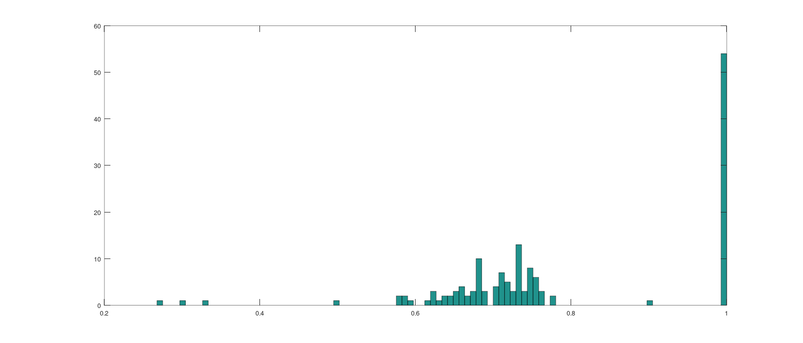

[](https://seedcount.jreyesr.com)

## Introduction

~~A few days ago~~ About a month ago, one of my brothers asked me whether it was possible to count fruit seeds automatically. Of course, I said "maybe, it depends". You know, the traditional software development response.

As it turns out, it _is_ mostly possible. This post is the tale of how fruit seeds can be counted:


The source code is [hosted on Github](https://github.com/jreyesr/seedcount), as usual, and the application can be used [from here](https://seedcount.jreyesr.com/). As we'll see later, it's fully client-side once the initial download is done, so you can use it without worry of anyone (i.e. me) siphoning off pictures of your private seeds for nefarious ad customization purposes or whatever.

The fruits from where the seeds come are _maracuyás_, known in English as [passion fruit](https://en.wikipedia.org/wiki/Passion_fruit_(fruit)). They have somewhat large seeds, slightly larger than an apple's, and fairly flat. Seeds are deep black, and also matte (i.e. not shiny), at least after they have dried. Combined with a white background, that's a very good setup for image processing. The darker the seeds are, the better contrast there would be against the background. The seeds being matte is also good because shiny materials run the risk of casting specular highlights, which would appear on pictures as very bright dots inside the seeds, and those may manifest as "holes" when separating the seeds from the background, as if each seed had a hole in the middle through which the background could be seen.

By the way, just as a teaser, here's a diagram of the entire flow, which we'll discuss in much more detail later:


## Basic operations

### Binarization/thresholding: Otsu and Triangle methods

A commonly required step is to convert a grayscale image into only black and white. This is sometimes called _binarization_, since it converts the image into a binary image where eack pixel can be represented with a single bit, either 0 (black) or 1 (white). However, sometimes binary images are instead represented as grayscale (using 8 bits per pixel), except that the only two values are 0 and 255. This lets us not have to deal with a whole different datatype.

Of course, there needs to be a _rule_ to stuff 256 possible grey values into only two pigeonholes. The simplest method is to settle on a cutoff, also called _threshold_, and then set every pixel below that threshold to 0 and every pixel above it to 255. However, the issue with that is that manually determining, and then hardcoding, the threshold is sometimes fragile: if the _entire_ image is darker or brighter, the threshold may no longer be good, and so it may happen that the entire image is set to 0 or to 255, respectively. 

There are a couple of methods that determine an "optimal" threshold value automatically. A common one is [the Otsu method](https://bioimagebook.github.io/chapters/2-processing/3-thresholding/thresholding.html#otsu-s-method), which "minimizes intra-class variance". In other words, it:

1. Chooses a threshold, between 0 and 255
2. Partitions the image into two classes (background and foreground, 0 and 255, black and white)
3. Computes the [variance](https://en.wikipedia.org/wiki/Variance) of each (in the statistical sense)
4. Sums the two variances
5. Repeats that for _every possible value_ of the threshold, recording the summed variance for each threshold. The threshold value that had the smallest sum-of-variances is chosen as the image's threshold

That is, the Otsu method finds a cutoff point where the two classes are "the most similar", i.e. have the smallest variance inside of them. Ideally, that results in a nice separation when the image has mostly two groups of gray values, one that is background-y and another that is foreground-y.

Other sources state the Otsu method in terms of "maximizing the inter-class variance", which probably comes out to be equivalent. [Here's another article discussing the Otsu method](https://www.futurelearn.com/info/courses/introduction-to-image-analysis-for-plant-phenotyping/0/steps/297744).

Then, there's the triangle method, which uses a different criteria to select the cutoff point. It involves computing the histogram of gray values of the image, drawing a line from the top peak to an edge, and then finding the point (on the histogram) that is furthest away from that line. You can see the triangle on the image below:


Intuitively, the triangle method tries to find the corner/elbow of the histogram, AKA the point where the "mountain" becomes a "valley". In theory, it'd be more robust than Otsu's method when the two classes (foreground and background) have wildly different amounts of pixels, i.e. their heights are very different. We'll see an example of that later.

### Connected component detection

Let's say that we have a binary image, one where evey pixel is either black or white. We now want to find out which groups of white pixels belong together. You may see this referred to as "blobs" of pixels. Intuitively, we'd want groups of connected white pixels to belong to the same blob, while pixels that aren't connected via other white pixels should belong to different blobs. For some reason, people on the Internet seem to like to state the fact that "blob" means Binary Large Object, which as far as I can tell is only true when [you're talking about databases, since the SQL standard defines the `BLOB` data type for binary strings](https://www.postgresql.org/docs/current/datatype-binary.html). The blobs that pop up in image processing are, AFAICT, just called so because they tend to be somewhat shapeless, [AKA the traditional usage of the word _blob_](https://www.merriam-webster.com/dictionary/blob). You're welcome.

This operation is called "connected component analysis". [Here's a nice summary](https://pyimagesearch.com/2021/02/22/opencv-connected-component-labeling-and-analysis). In short, it's a way to separate "blobs" of white pixels over a black background. The "connected components" name comes from the fact that two neighboring white pixels (AKA connected by a shared border) are considered part of the same component, while pixels that have no connection between them (i.e. those that are always, no matter the path that you take, separated by seas of black) are considered different components. Think of it as a set of islands: if you can _somehow_ walk from point A to point B, without crossing water, then A and B are on the same island. Otherwise, if you _have_ to cross water, then they're on different islands. The same thing is done here: points are pixels, islands are white blobs, and the sea between them is the back background.

As an example, consider the following (tiny) binary image. It's 7x5 pixels, and it has two connected components, one composed of two pixels and another of 13 pixels. Each region is annotated with a different color. A circle on each region indicates a "starting pixel", and arrows indicate all that can be reached from that starting point:


Every blob, AKA connected component, has some "stats" associated with it. Namely, the width and height of its bounding box (i.e. the smallest upright/non-tilted rectangle that can contain it), its top left corner (which is its "smallest" corner, when using the computer graphics convention of X increasing rightwards and Y increasing downwards), and its area (i.e. the count of white pixels, _not_ the area of the bounding box! You could compute that one easily anyways by multiplying the bounding box width and height. In fact, we'll do that later)

When we run the connected components algorithm over a binary image, we get back a (N+1)x5 matrix, with N being the number of (white) blobs. The +1 is because, by convention, OpenCV reserves connected component #0 for the background (i.e. everything else that isn't actually part of the foreground). The 5 columns for each blob (plus background) are the five stats that are computed for each: the bounding box's X start, Y start, width and height, plus the blob's area AKA count of white pixels in it.

## The code

This is the entirety of the code. We'll review it step by step later, but I wanted to have it here for future reference.

Also note that this is just the contents of a `<script>` tag contained inside a HTML page. We're using [OpenCV.js](https://docs.opencv.org/4.x/df/d0a/tutorial_js_intro.html) here, which is a port of (a subset of) [OpenCV](https://opencv.org/) so it can run on Javascript, AKA on your browser. Most OpenCV content out there on the web assumes that you're using Python, and many times Jupyter too, since OpenCV is very close to the "Data Science" galaxy, linked to it by Numpy, Matplotlib, a desire to use [CUDA](https://docs.nvidia.com/cuda/doc/index.html) whenever possible and the general closeness to AI-ish workflows such as image classification and segmentation. However, OpenCV.js requires no Python backend, just a HTML page that contains a script. Code is run entirely client-side.

```js
const SHOW_CONTOURS = true;

function median(arr) {
  const middle = Math.floor(arr.length / 2);
  const nums = [...arr].sort((a, b) => a - b);
  return arr.length % 2 !== 0 ? nums[middle] : (nums[middle - 1] + nums[middle]) / 2;
}

var Module = {
  // https://emscripten.org/docs/api_reference/module.html#Module.onRuntimeInitialized
  onRuntimeInitialized() {
    const img = new Image();
    img.addEventListener("load", () => {

    let src = cv.imread(img), out = new cv.Mat();
    cv.imshow("input", src);
    
    // 1. Convert image to grayscale
    let gray = new cv.Mat();
    cv.cvtColor(src, gray, cv.COLOR_BGR2GRAY, 0);
    cv.imshow("a", gray);
    
    // 2. Histogram (just for viz purposes)
    let histSrc = new cv.MatVector();
    histSrc.push_back(gray);
    let hist = new cv.Mat(), mask = new cv.Mat();
    cv.calcHist(histSrc, [0], mask, hist, [256], [0, 255], /*accumulate*/false);
    let max = cv.minMaxLoc(hist, mask).maxVal;
    const histScale = 3, histHeight = 300;
    let histFigure = new cv.Mat.zeros(histHeight, 256 * histScale, cv.CV_8UC3);
    // draw histogram
    for (let i = 0; i < 256; i++) {
      let binVal = hist.data32F[i] * histHeight / max;
      let point1 = new cv.Point(i * histScale, histHeight);
      let point2 = new cv.Point((i + 1) * histScale - 1, histHeight - binVal);
      cv.rectangle(histFigure, point1, point2, [255, 255, 255, 255], cv.FILLED);
    }
    
    // 3. Binarize image
    let binary = new cv.Mat();
    // three different threshold algs
    const cutoff = cv.threshold(gray, binary, 0, 255, cv.THRESH_BINARY_INV + cv.THRESH_OTSU);
    //const cutoff = cv.threshold(gray, binary, 0, 255, cv.THRESH_BINARY_INV + cv.THRESH_TRIANGLE);
    //cv.adaptiveThreshold(gray, binary, 255, cv.ADAPTIVE_THRESH_GAUSSIAN_C, cv.THRESH_BINARY, 301, 40); const cutoff = 0;
    
    cv.rectangle(histFigure, {x: cutoff*histScale, y: histHeight}, {x: cutoff*histScale+1, y: 0}, [255, 0, 0, 255], cv.FILLED);
    cv.imshow('b', histFigure);
    
    let opened = new cv.Mat(), seedsFg = new cv.Mat(), seedsBg = new cv.Mat(), distTrans = new cv.Mat();
    let unknown = new cv.Mat(), markers = new cv.Mat();

    // 4. (not done) Clean up binary image
    //cv.morphologyEx(binary, opened, cv.MORPH_CLOSE, M, anchor, 1, cv.BORDER_CONSTANT, cv.morphologyDefaultBorderValue());
    opened = binary.clone(); // Closing doesn't seem to work too well
    cv.imshow("c", opened);
    
    // 5. Compute connected components (AKA blobs)
    let blobLabels = new cv.Mat(), blobStats = new cv.Mat(), centroids = new cv.Mat();
    let seedData = [];
    const numBlobs = cv.connectedComponentsWithStats(opened, blobLabels, blobStats, centroids);
    for(let i=1; i<numBlobs; i++) {
      const blobStat = blobStats.intPtr(i);
      const x0 = blobStat[0], y0 = blobStat[1];
      const w = blobStat[2], h = blobStat[3];
      const area = blobStat[4];
      const fillRatio = area / (w*h);
      
      // 5a. Conditions to discard some non-seed blobs
      if(area<=70) continue; // speck of something
      if(fillRatio<0.3) continue; // too empty to be a seed
      if(w/h < 0.05 || w/h > 20) continue; // too skinny, very unlikely to be a row of 20 seeds in a perfect orthogonal row
      
      // 5b. Draw bounding boxes for each blob in red
      const PADDING=0;
      cv.rectangle(src, new cv.Point(x0-PADDING, y0-PADDING), new cv.Point(x0+w+PADDING, y0+h+PADDING), [255, 0, 0, 255], 1);
      
      // 5c. Preserve key data about each blob
      seedData.push({
        i, 
        corner: {x0, y0}, 
        center: {x: centroids.doubleAt(i, 0), y: centroids.doubleAt(i, 1)}, 
        size: {w, h}, 
        area: blobStat[4], 
        fillRatio
      });
    }
    const areas = seedData.map(x => x.area);
    const frs = seedData.map(x => x.fillRatio);
    const medianArea = median(areas);
    
    // 6. Draw the blobs and compute total count
    let finalImage = src.clone();
    let totalSeeds = 0;
    for(let seed of seedData) {
      const numSeeds = Math.round(seed.area / medianArea);
      totalSeeds += numSeeds;
      cv.putText(finalImage, "x"+numSeeds, {x:seed.corner.x0, y:seed.corner.y0-2}, cv.FONT_HERSHEY_SIMPLEX, 0.5, [255,255,255,255], 1)
    }
    
    // 7. Write total number of seeds on corner
    cv.putText(finalImage, "Total="+totalSeeds, {x: 5, y: 35}, cv.FONT_HERSHEY_SIMPLEX, 1.0, [255,255,255,255], 2)
        
    // 8. (optional) Draw the contours of blobs in blue
    if(SHOW_CONTOURS) {
      let contours = new cv.MatVector(), hierarchy = new cv.Mat();
      cv.findContours(binary, contours, hierarchy, cv.RETR_CCOMP, cv.CHAIN_APPROX_SIMPLE);
      cv.drawContours(finalImage, contours, -1, [0, 0, 255, 255], 1, cv.LINE_8, hierarchy, 100);
    }
    
    // 9. Display final (annotated) image
    cv.imshow("output", finalImage);
    });
    img.src = "/IMAGE.jpg";
  }
};
```

## Image 1

Here's the first image that I worked with:


The following snippet of code performs simultaneout binarization and inversion:

```js
// We assume that `src` contains an OpenCV Mat
// e.g. `let src = cv.imread(img);`

// 1. Convert image to grayscale
let gray = new cv.Mat();
cv.cvtColor(src, gray, cv.COLOR_BGR2GRAY, 0);

// 3. Binarize image
let binary = new cv.Mat();
const cutoff = cv.threshold(gray, binary, 0, 255, cv.THRESH_BINARY_INV + cv.THRESH_OTSU);
```

After binarization and inversion (both are done at the same time, using the [Otsu thresholding algorithm](https://bioimagebook.github.io/chapters/2-processing/3-thresholding/thresholding.html#otsu-s-method) to choose the ideal cutoff and the `cv.THRESH_BINARY_INV` OpenCV flag to invert the result), the image looks like this (this is called `binary` by this point): 


Notice how the seeds appear as nice white blobs, and almost nothing else does. This tells us that the selected threshold was appropriate. For more information, we can plot [the image histogram](https://www.cambridgeincolour.com/tutorials/histograms1.htm), which tells us how many pixels had each 8-bit grayscale value. To the left is 0, AKA pure black, to the right is 255, AKA pure white, and the taller a bar, the more pixels in the image had that gray value.

We use this code to render the histogram, which takes in the `gray` image:

```js
// 2. Histogram (just for viz purposes)
let histSrc = new cv.MatVector();
histSrc.push_back(gray);
let hist = new cv.Mat(), mask = new cv.Mat();
cv.calcHist(histSrc, [0], mask, hist, [256], [0, 255], /*accumulate*/false);
let max = cv.minMaxLoc(hist, mask).maxVal;
const histScale = 3, histHeight = 300;
let histFigure = new cv.Mat.zeros(histHeight, 256 * histScale, cv.CV_8UC3);
// draw histogram
for (let i = 0; i < 256; i++) {
  let binVal = hist.data32F[i] * histHeight / max;
  let point1 = new cv.Point(i * histScale, histHeight);
  let point2 = new cv.Point((i + 1) * histScale - 1, histHeight - binVal);
  cv.rectangle(histFigure, point1, point2, [255, 255, 255, 255], cv.FILLED);
}

// Here goes the binarization code above, since we need the `cutoff` variable to draw a red line

cv.rectangle(histFigure, {x: cutoff*histScale, y: histHeight}, {x: cutoff*histScale+1, y: 0}, [255, 0, 0, 255], cv.FILLED);
cv.imshow('b', histFigure);
```

Below is the histogram of the grayscale image above (_not_ the histogram of the binarized image! That one would just have two peaks, one at 0 and another at 255). In red is the Otsu-detected threshold: any pixel that was _below_ (i.e. to the left) of that bar, i.e. dark things, was turned into a white pixel (because we're also inverting the image, normally they'd all become pure black); while anything above that value (to the right), i.e. white(ish) things, becomes black (again, because of the inversion, normally it'd become pure white). The very large peak that is to the right of the red bar is the background, which is whitish but not pure white (hence why it's around the center of the histogram and not fully to the right). The seeds probably are on that tiny peak very close to the left edge, because they're nearly pure black:


With the binary image above (remember, the one that is only black and white, with no greys), we can [detect the connected components](#connected-component-detection) in the image. Once we get back the bounding boxes, we can draw rectangles over the original image, so we can see what was detected. We do that with this code:

```js
// 5. Compute connected components (AKA blobs)
let blobLabels = new cv.Mat(), blobStats = new cv.Mat(), centroids = new cv.Mat();
let seedData = [];
const numBlobs = cv.connectedComponentsWithStats(opened, blobLabels, blobStats, centroids);
for(let i=1; i<numBlobs; i++) {
  const blobStat = blobStats.intPtr(i);
  const x0 = blobStat[0], y0 = blobStat[1];
  const w = blobStat[2], h = blobStat[3];
  const area = blobStat[4];
  const fillRatio = area / (w*h);

  // 5a. See below for conditions!

  // 5b. Draw bounding boxes for each blob in red
  const PADDING=0;
  cv.rectangle(src, new cv.Point(x0-PADDING, y0-PADDING), new cv.Point(x0+w+PADDING, y0+h+PADDING), [255, 0, 0, 255], 1);

  // 5c. Preserve key data about each blob
  seedData.push({
	i, 
	corner: {x0, y0}, 
	center: {x: centroids.doubleAt(i, 0), y: centroids.doubleAt(i, 1)}, 
	size: {w, h}, 
	area: blobStat[4], 
	fillRatio
  });
}
```

We just have to take care to ignore component #0, since otherwise we'd be getting a huge rectangle covering the entire image, in addition to the real ones. This is done in the `for` loop; notice how the variable `i` starts on `let i=1`, as opposed to the `let i=0` that normal `for` loops would have. When we draw those boxes, in red so they show up nicely[^1], we get this:


Most of those boxes look pretty fine. There are a couple of problems: first, there are a bunch of scattered _tiny_ boxes, which appear mostly as red dots because of how small they are (see, for example, at the bottom of the left edge). These correspond to very small areas of white pixels in the binary image, that came from areas where the background was a bit darker than the rest. Second, the big red 1 at the bottom right corner, which was there to mark that set of seeds, is also detected. Which makes sense: it's yet another blob, and it isn't background. We need a way to discard some, or ideally all, of those things.

To do so, we can observe that those bad blobs are geometrically different than the seeds. The tiny areas are way too small to contain a seed. In fact, here's the distribution of the blob areas, in square pixels. It's a histogram, so you read the area on the X axis below, and the count of blobs that had an area close to that on the left Y axis:


We can see a _huge_ spike at the leftmost edge, corresponding to blobs that had between, maybe, 0 and 10 white pixels. The resolution of the histogram doesn't tell us more, but most of those are single-pixel blobs, hence 1px². We can safely discard those: if we were taking pictures from so far away that seeds were single-pixel dots, we have more serious problems. In fact, in these images seeds are composed of something like 700 pixels at least, so there's no problem discarding tiny blobs. We'll throw out any blob that is less than 10 square pixels in area (i.e. consists of less than 10 square pixels). The threshold of 10 is admittedly arbitrary, but it's very low and there's no seeds that come even _close_ to it, so it's fairly safe.

Another interesting metric to quantify blobs is what I'll call their "fill ratio", which is the ratio between the actual white pixels in the blob and the area of the bounding box. It's a measure of how much of the bounding box is actually filled.

A perfectly rectangular blob would have a fill ratio of 100%, since the bounding box would perfectly cover the white pixels, and no more. A circle would have something like 78% (imagine a circle of radius `R`. It would have about `3.14*R^2` white pixels, and would be enclosed in a square bounding box whose sides had length `2R`, hence the bounding box would have area `4*R^2`, and the ratio would be 0.78). Seeds are somewhat like circles, so we'd expect the blobs for isolated seeds to have fill ratios on the vicinity of 70 or 80%. A very bad fill ratio would be, for example, a diagonal line: most of its pixels would be black, but the bounding box would have to be large to surround the entire line (remember that bounding boxes are not rotated).

If we compute the fill ratio of every blob, and we plot that distribution, we get another histogram. This histogram hasn't discarded the tiny white areas yet, so keep that in mind:



We can see a huge spike at 1, which is a fill ratio of 100%, on the right edge. These are the single-pixel tiny regions: their bounding boxes are 1x1 pixels, hence the total area is 1, and that single pixel is white, so the fill ratio is 1/1=100%. We can discard those: our seeds are not square, so their bounding boxes should always have some background bits in them. Furthermore, we discard blobs with a fill ratio under 0.3: there's very few of those, none of them are seeds, and one of them is the big red 1 (which makes sense: most of the area inside the 1's bounding box is just background, since the number is a fairly thin line).

We also reject blobs that have an aspect ratio greater than 20 to 1, in either direction. In other words, we discard blobs that are at least 20 times as wide as they're tall, or viceversa. This is because those would be very thin boxes, and the only way that they'd occur is if you somehow had at least twenty seeds either perfectly horizontal or perfectly vertical, so that their bounding box was very thin. That seems very unlikely, so we discard those boxes too.

We can reject those suspicious blobs with a bit of code inside the `for` loop, where we test each blob as we're iterating over them before we draw it and preserve its data:

```js
// 5a. Conditions to discard some non-seed blobs
if(area<=70) continue; // speck of something
if(fillRatio<0.3) continue; // too empty to be a seed
if(w/h < 0.05 || w/h > 20) continue; // too skinny, very unlikely to be a row of 20 seeds in a perfect orthogonal row
```

After rejecting blobs under 70px² and/or fill ratios under 0.3, we get a nicer set of blobs. In this image, every detected blob has a small number, in white, over its top. That number is the _area_ of the blob, AKA the count of white pixels that make it up:


We can now plot the distribution of areas:


That's a much nicer plot. There's a large clump starting at, maybe, 600 pixels, and going up to 800 or so. Those are mostly the single-seed regions, which you can double-check with the previous image, which has the area of each region. Look at the single seeds: they tend to have numbers in the 700s or 800s, while pairs of seeds can have 1200s to 1400s and a clump of three seeds near the center of the image (slightly up and left from the center; look for the creases in the napkin to find the center) has an area of slightly over 2000, which would correspond to slightly less than 700 per seed.

In fact, the _median_ of the areas is 761. That specific number isn't of interest, but the general idea is. We use the median instead of the mean because it's more resistant to outliers, _as long as_ there are few outliers.

As a reminder, the mean is your standard average: sum all, divide by the count. This means that, if there were 100 single seeds with an area of 700 each and a single clump of 300 seeds (with an area of 300\*700=210000), the mean would be 2700 or so. In other words, if you have a large outlier, it pulls the mean towards it, even if it's a single outlier.

The median, on the other hand, is obtained by sorting all the numbers and then choosing the center one (or the average of the two center ones if there's an even number of elements). This means that, as long as there aren't that many outliers, then the actual _value_ of those outliers doesn't matter, since all that we care about is the value of a single element, the one that happens to land in the middle when sorted. Again, if we had 100 single seeds and a single huge blob of 300 seeds (101 in total), the 51st element (which is the middle one) would be one of the single seeds, and the median would still be 700. The existence of the outlier had no effect.

In practical terms, as long as more than _half_ of the clumps are of single, isolated seeds, then the median should be a nice representative value. In a sense, we're choosing "the most boring" seed as the indicator, the one that is neither too small nor too large.

I highly suspect that the mean could be used with not much trouble, since there aren't that many clumps and they aren't too large either, so our extreme example of a 300-seed cluster isn't realistic, but I started with the median, so I'll keep using it.

Knowing that the median area of a blob is 761 pixels (this isn't hardcoded, by the way; that value is just for this image. In the actual code, the median is computed for each image), we can compute an "equivalent seeds" number for each blob: a blob that is 1400 pixels in area is equivalent to a little bit less than "2 seeds". When plotting that over each box, instead of the raw pixel count, we see this:


Of course, "2.17 seeds" isn't all that useful. When rounding to the nearest integer, we get a count of seeds per region. This is the code that produces this image, complete with converting the raw pixel count of each blob to an equivalent seed number:

```js
// seedData comes from the for-loop over the connected components

const areas = seedData.map(x => x.area);
const frs = seedData.map(x => x.fillRatio);
const medianArea = median(areas);

// 6. Draw the blobs and compute total count
let finalImage = src.clone();
let totalSeeds = 0;
for(let seed of seedData) {
  const numSeeds = Math.round(seed.area / medianArea);
  totalSeeds += numSeeds;
  cv.putText(finalImage, "x"+numSeeds, {x:seed.corner.x0, y:seed.corner.y0-2}, cv.FONT_HERSHEY_SIMPLEX, 0.5, [255,255,255,255], 1)
}

// 7. Write total number of seeds on corner
cv.putText(finalImage, "Total="+totalSeeds, {x: 5, y: 35}, cv.FONT_HERSHEY_SIMPLEX, 1.0, [255,255,255,255], 2)
```

We're done at this point; all that was left was to sum all of those counts and produce a count for the entire image. That's written at the top left corner of the image below:


So, our magical seed counter says that there are 99 seeds in that picture. I was informed that there's supposed to be 100 seeds per napkin, so the 99 checks out. As a matter of fact, there's a single miscount that I can see: near the bottom right corner, close to the big red 1, there's two seeds stacked vertically, that have been labeled with "x1". A couple of images abve, we can see that the blob came up with an area of 1.49, so it was _just barely_ in the area where the rounding kicked them down to a single seed. In fact, you can see that they're slightly overlapped (the bottom seed slightly covers the top seed), so their total white area would be slightly lower, and that would explain why they have less white pixels than expected for two seeds (1136, where most two-seed groups values in the range of 1200 to 1400).

## Image 2

Of course, getting an algorithm tuned to run well on a single image isn't that important. The important bit is that it must work well with other similar images, with no per-image tuning. Let's check another napkin, this time labeled 2:


After binarizing, we get a fairly nice image again, with a few tiny white spots:


Here's the histogram of grayscale, and the automatically chosen binarization threshold in red:


After blob detection and rejection (too small, not filled enough), computing the median, and converting the area of each blob to a number of seeds, we get this:


This one counted 100 seeds. Whish is supposed to be correct, except that I _think_ that napkin actually had 101 seeds. The miscount is near the bottom left corner this time: there's a group of two seeds that was counted as "x1" again. Again, we could probably blame the fact that one of the seeds is actually _standing on its edge_, so it presents a smaller profile and thus fewer white pixels.

## Other images

Here's an evil image, where there are much larger clusters of seeds. There's also some yellowish spots on the paper, which are actually dried fruit pulp that stuck to the seeds. They are sometimes also counted as foreground, because their lightness is different enough from the background, so they cause problems because they falsely extend the white area, as if there were seeds there. The original image is this:


After binarization, we have this:


The detected clumps of seeds are below. Most of them are fine, at least the single seeds, but it loses track quite easily on larger clusters of, say six or seven seeds:


For this image, the process was average, not good.

An even eviler image (you'll see why). At first glance, it looks fine; there aren't that many huge clusters, and most seeds are nicely separated:


However, the binarization is _horrible_:


That _absolutely sucks_. Close to half of the image is completely blown out to white, and we can't see any seeds on that area. Checking the histogram tells us why:


It turns out that this image's background spans a much wider range of grays, and the Otsu thresholding chose a value that splits the background in two. Everything below/to the left of the red line is white, and that includes a large portion of the big peak. We'd need the red line to be much further to the left, outside of the big mountain. Of course, just proceeding with that huge white area is not good, we get completely nonsensical results:


Notice in particular the fun "843 seeds" counter at the top left. Almost all of those are courtesy of the huge white area, which is counted as 760-something seeds.

So the threshold isn't good, it's landing in the middle of the background peak. Instead we can try the triangle method, which is apparently better when the foreground and background peaks have vastly different counts. A nice, illustrated explanation of the triangle method is [here](https://bioimagebook.github.io/chapters/2-processing/3-thresholding/thresholding.html#triangle-method).

When using that method, the cutoff changes to a better place:


which in turn makes the binary image look reasonable:


which in turn makes the final image good:


(Apart from those "12 seeds" on the red 3, that is. Apparently that passes the fill area test)

## The importance of a nice background

Here's other three pictures that were provided to me later, with a nice spread of seeds (note the absence of large clumps) and a pure white background (standard printer paper, which is _so beautiful_ when compared to the napkins):


While I haven't hand-counted any of those pictures (despite what legends say, I _have_ a life, y'know), a cursory examination seems to point to most being fine. There's the occasional counting of two seeds as one, and it really likes to get lost when largish clumps (over five seeds or so) get involved, but single seeds and clumps of two are mostly fine.

And, honestly, seeing that "Total = 392" in the last image is kind of rewarding. How boring would it be to count them all by hand? That's several minutes, easy, _assuming_ you don't lose count and have to start again. That's the kind of task that would be thrown onto the poor lab intern that just started this week. It feels really nice to know that, now, this lab intern (despite him being entirely a figment of my imagination) will be able to point a smartphone at a tray and get a number.

As a bonus, here's the contours of one image. Contours are the border of a blob, i.e. a line, or boundary, that separates a region of white pixels from a region of black pixels. They're best computed from the binary image, but they can be drawn over the original image, since they correspond pixel for pixel. Contours can be analyzed too, such as getting the perimeter (length) of them, or getting their hierarchy (i.e. contours that are completely enclosed by other contours). However, here we have no use for them, so it's just a visualization thing. This is the code that generates the image below:

```js
// We assume that `src` and `binary` already exist
let finalImage = src.clone();
let contours = new cv.MatVector(), hierarchy = new cv.Mat();

cv.findContours(binary, contours, hierarchy, cv.RETR_CCOMP, cv.CHAIN_APPROX_SIMPLE);
cv.drawContours(finalImage, contours, -1, [0, 0, 255, 255], 1, cv.LINE_8, hierarchy, 100);
}

cv.imshow("output", finalImage);
```

Contours are the blue line that is inside each red square:


## Serving the application

Until now, the code has just been running on my local PC, via a static file server that provides an HTML file (which contains a bit of HTML scaffolding, mainly `<canvas>`es where images are output, and the huge `<script>` tag that contains the code), and also some JPEG files that are the source pictures.

Of course, that isn't all that useful for actual users of the application. They'd need some sort of stable, public URL that they can browse to, ideally from a smartphone, since they already have nice cameras that we could use to feed images into the entire pipeline.

This is where using OpenCV.js (as opposed to plain OpenCV on Python or C++) is really useful. If you want to deploy a Python+OpenCV application, you need to start messing around with one of several options, among which are:

* Get a VM (e.g. an EC2 instance on AWS), install Python, convert the OpenCV code into some sort of web application (e.g. using [Flask](https://flask.palletsprojects.com/en/3.0.x/) or [FastAPI](https://fastapi.tiangolo.com/)), then provide some sort of HTML frontend to the whole thing, and deploy that application on the VM
* The same, but with Docker: convert the application into a Docker image, upload to a registry (e.g. the Docker Hub or, perhaps, [the Github Container Registry](https://docs.github.com/en/packages/working-with-a-github-packages-registry/working-with-the-container-registry) if you're already using Github), and then pull and run the Docker image from the VM
* The same, but use a dedicated Docker-running platform such as [ECS on AWS](https://docs.aws.amazon.com/AmazonECS/latest/developerguide/Welcome.html) or [Cloud Run on Google Cloud](https://cloud.google.com/run/docs/overview/what-is-cloud-run). These remove some work from server maintenance (e.g. there's no OS to keep updated, apart from the Docker base image, and updating _that_ is much easier than updating a VM), and they are supposed to keep the service up
* Use a framework like [Streamsync](https://www.streamsync.cloud/) or [Reflex, prev. Pynecone](https://reflex.dev/) to provide the UI and frontend-to-backend communications. In this way, the backend code using OpenCV can be kept (mostly) the same, as long as it can be wrapped into a function that, say, receives an image and outputs an integer with the count of seeds. These can be hosted on a VM as discussed above, or maybe also on container-hosting services too
* Use a hosted service like [Streamlit, by Snowflake](https://streamlit.io/) or [Gradio, by HuggingFace](https://www.gradio.app/), to do the same. The advantage of these is that now the code is deployed _somewhere_ else, where we don't have to care about it

All of these have one thing in common: there's a _backend_. A server somewhere (or a Docker image that runs on a server somewhere) must run a bunch of Python code. Image processing happens there. If we wrote an application to prompt the user to choose an image and then return the count of seeds therein, the picture would be sent to the backend, processed there, and then either the count or some form of HTML page containing it would be sent back to the user for visualization. If we instead take the input images from a webcam or smartphone's camera, a stream of pictures would be sent to the backend somehow, perhaps via XHR, or via a WebSocket channel, or via WebRTC, or via the framework's magical front-to-backend transport if such a thing exists. Then, the processing happens on the backend, and the result is transported to the client again and displayed.

By contrast, OpenCV.js runs entirely in the user's browser (though it should also, at least theoretically, be usable on serverless workloads, AKA lambda functions, or Node.JS backends). Once the resources (namely the HTML and perhaps JS files, and then the OpenCV Javascript and WASM files) have been loaded, the whole thing runs on the device of the user that is visiting the application. This is really nice, for example, to ensure that no data leaves the user's device: all image processing happens client-side and no data ever touches a server. In fact, the server can be made so dumb that it couldn't be able, even in principle, to receive and store user data. For instance, our single HTML file could be hosted on a CDN or static file server (e.g. [Github Pages](https://pages.github.com/), an S3 bucket configured to serve files, or [Cloudflare Pages](https://pages.cloudflare.com/)), which merely serve files and don't handle incoming requests (Cloudflare Pages can, using Workers AKA Lambda functions, but we wouldn't need to use that).

Also, as long as the required processing isn't too intensive, it should be faster to do it client-side. Moving the image to a server for processing incurs non-zero latency, especially on not-that-good Internet connections. If the client device has reasonable processing resources (CPU and memory, mostly), it should be able to return results faster than the time it'd take to ferry the data to and from a server, _plus_ the time that it'd take the server itself to process the image.

We'll assume that the application will be used from a smartphone, since they have back-facing cameras and all. JS is plenty capable of capturing images and video from a device's cameras; after all, that's what gave us all the Web versions of videoconferencing applications (AKA Google Meet, Teams, Zoom, Webex, et al) that carried the world during a certain... ahem... _atypical event that took place worldwide approximately on 2020 and 2021 that we no longer mention_.

### Accessing cameras from JS

In particular, the JS API that interacts with image and video capture devices, AKA webcams and other cameras, is called the [User Media API](https://web.dev/articles/getusermedia-intro), particularly the `navigator.mediaDevices.getUserMedia()` function call. This can be called to acquire (after the requisite browser prompt so the user authorizes access to his camera and/or microphone) a reference to a media source, be it audio (from a microphone) or video (from a camera). It additionally supports several kinds of "constraints", such as requiring audio+video, or only audio, or video that is _at least_ 1280x720, or only a device's rear camera, or a lower framerate, or a certain aspect ratio, or audio that has had echo cancellation applied (or not), and more. [The official list is here](https://w3c.github.io/mediacapture-main/#webidl-1918094735).

Generally, the acquired "user media" are immediately attached to `<audio>` or `<video>` elements, at least that's what [all the examples](https://w3c.github.io/mediacapture-main/#examples) use. Traditionally, `<audio>` or `<video>` elements would get a  `src="..."` attribute, much like ``s (that's what you would use to display a video or audio track that are hosted somewhere). However, it's also possible to hook those elements to a media track, such as the audio that is being captured from a microphone, where they would perform "live playback" of whatever is being captured.

OpenCV.js is directly capable of handling video streams that come from a webcam, [and they even have a tutorial to do so](https://docs.opencv.org/4.x/dd/d00/tutorial_js_video_display.html). Up until now we've been using OpenCV to capture still images, but a video is after all a sequence of images, so most image-processing tasks can also be performed on a video, keeping in mind that for real-time processing there's now a hard time constraint (1/30th of a second for video that comes in at 30 frames per second, for example) in which all processing must be performed. Otherwise, the framerate must be lowered or processing time cut, or real-time processing won't be possible.

OpenCV.js's tutorial involves obtaining a video stream (audio isn't all that important for image processing), and hooking it as a `<video>` element's `src`. This is entirely handled by the browser, so no user code needs to, say, take every video frame and copy it to the `<video>` element. It's fire-and-forget.

Then, an isolated block of code runs at certain intervals (using the `setTimeout` API to schedule execution in the future), grabs the current content of the `<video>` element (i.e. whichever frame happens to be there at the time), and draws that frame onto a hidden `<canvas>`. OpenCV.js can then read the Canvas's content into an OpenCV image, and processing then happens as we've been doing on this entire article.

This JS code would do something like this:

```js
let video = document.getElementById("videoInput");
navigator.mediaDevices
  .getUserMedia({ 
    video: true, audio: false,
	  facingMode: 'environment', // so it prefers the back-facing camera
  })
  .then(function(stream) {
    video.srcObject = stream; // hook the <video> element to the webcam
    video.play();
  })
  .catch(function(err) {
    console.log("An error occurred! " + err);
  });

// At this point, we can always read the contents of the <video> element

let canvasFrame = document.getElementById("canvasFrame"); // canvasFrame is the id of <canvas>
let ctx = canvasFrame.getContext("2d");
 
const FPS = 30;
function processVideo() {
  let begin = Date.now();
  // draw the <video>'s current frame to a <canvas>
  ctx.drawImage(video, 0, 0, width, height);
	
  // grab that to a cv.Mat
  let imgData = ctx.getImageData(0, 0, canvasFrame.width, canvasFrame.height);
  let src = cv.matFromImageData(imgData);

  // PERFORM MAGICAL OPENCV CODE HERE!
  
  // schedule next execution
  let delay = 1000/FPS - (Date.now() - begin);
  setTimeout(processVideo, delay);
}
 
// schedule first one.
setTimeout(processVideo, 0);
```

The first part of the code is concerned with acquiring the media stream (that's where the browser will prompt the user for permission to use a webcam), and hooks it, once acquired, to a `<video>` element. That's it.

Then, the `processVideo()` function (which will run up to 30 times per second, assuming the device can keep up) will grab whatever is being displayed on the video element, copy it to a Canvas, and have OpenCV read it from there. The `src` variable inside the `processVideo()` function is an OpenCV-specific class, `cv.Mat`, which is the main class in which OpenCV represents images. From there, any OpenCV processing can be performed as usual.

While this works nicely for (continuous/streaming) video processing, for some usecases it may be better to have an interface like that of a point-and-shoot camera: have a live preview of the data, and a button to capture a picture. Once captured, that picture will be processed.

This has some advantages over a continuous video stream: for starters, processing can now take a lot longer, since it happens very infrequently and only after the user has taken an explicit action. Processing is no longer bound by the hard 30FPS limit. Also, capturing still images has several extra tuning knobs that aren't exposed for video streams, and a dedicated API, called [the Image Capture API](https://www.w3.org/TR/image-capture).

A word of caution (AKA, here starts your daily scheduled PSA about the importance of browser diversity): that API is [only widely available on Google Chrome and friends](https://caniuse.com/imagecapture), both on web and mobile. It's not available in Safari, and on Firefox it's behind a feature flag, and only a single method. This means that, _technically_, it's not professional to write something that depends on this API, and if you do so may also be also helping Google Chrome get even more of a monopoly on the browser market, by writing _yet another site_ that "only works on Chrome". Which then backfires horribly for all of us when, couched in their huge market share, Google starts doing things like [Web-Environment-Integrity](https://vivaldi.com/blog/googles-new-dangerous-web-environment-integrity-spec/) (AKA [Trusted Execution](https://www.gnu.org/philosophy/can-you-trust.en.html), but for websites, AKA DRM) and [new and innovative ad schemes](https://www.theregister.com/2023/01/18/google_topics_api/).

That being said, since this application is only intended to be used by one person in the entire world, who already uses Chrome on the Android device that would be used to capture the images, I deem the risk of helping Chrome become even more popular to be Low Enough&trade;. I thereby absolve myself of moral responsibility. So I speaketh.

Now, back to the Image Capture API. In addition to capturing whatever the current frame of a `<video>` element is, which can be done by dumping it into a `canvas` element via `ctx.drawImage(video, ...)` (where `ctx` is a 2D context of the canvas), it provides the ability to control properties of the captured image, in a manner that is much closer to a point-and-shoot digital camera (does anyone still use those? Or did smartphones eat them for lunch?). The entire list [is on the spec](https://www.w3.org/TR/image-capture/#constrainable-properties), though note that not every device will support every control (and you're supposed to check beforehand, and only attempt to manipulate controls that the camera of the device that you're running on actually exposes). The list of controls includes:

* [Points of interest](https://www.w3.org/TR/image-capture/#points-of-interest), AKA configurable focus points (e.g. you could command the camera to always be focused onto whatever is on the center of the image)
* [Exposure compensation](https://www.w3.org/TR/image-capture/#exposure-compensation), which globally darkens or brightens the image
* [Exposure time](https://www.w3.org/TR/image-capture/#exposure-time), measured in 0.1s of a millisecond (AKA 100s of microseconds), where 100=10ms exposure
* [Color temperature](https://www.w3.org/TR/image-capture/#color-temperature), in Kelvin, in case you want to fix the white balance so as to not let the auto-white-balancing mess with just _how_ white is represented
* [ISO setting](https://www.w3.org/TR/image-capture/#iso), in its magical dimensionless units
* [Brightness](https://www.w3.org/TR/image-capture/#brightness), [contrast](https://www.w3.org/TR/image-capture/#contrast), [saturation](https://www.w3.org/TR/image-capture/#saturation) and [sharpness](https://www.w3.org/TR/image-capture/#sharpness), however the manufacturer implemented those
* A fixed [focus distance](https://www.w3.org/TR/image-capture/#focus-distance), in meters (as opposed to focusing on a point of interest, which would lock onto a specific point on the sensor and then keep that focused even if whatever corresponds to that position changes distance)
* [Pan](https://www.w3.org/TR/image-capture/#pan), [tilt](https://www.w3.org/TR/image-capture/#tilt) and [zoom](https://www.w3.org/TR/image-capture/#zoom), for any cameras that support that. Pan and tilt I'd expect to be quite rare, since I've yet to see a smartphone with movable cameras (that'd be _really_ creepy too!). Zoom is probably more common, at least on smartphone back-facing cameras
* Whether or not the [fill light, or torch](https://www.w3.org/TR/image-capture/#torch), should be activated. Probably most common, again, on smartphone back-facing cameras which do have an LED there

These settings are configured when obtaining a video stream, i.e. at the point where `navigator.mediaDevices.getUserMedia(...)` is called. They use the same constraint system that is used, for example, to request a specific resolution, facing mode or a specific device ID (if you for some reason wanted your application to only work with one device _in the world_). 

The reasoning behind this seems (to me) to be that a single camera installed on a device can be thought of as offering many "imaginary" video streams, all at once: one option for each resolution that the camera sensor supports (i.e. its maximum/native resolution and any downsamplings thereof), one for each framerate (i.e. the fastest/native framerate and also any slower speeds, which could in principle be obtained by just running the camera at its top framerate and dropping some frames that aren't needed), one with and another without the torch enabled, one for each possible ISO setting, one for every possible focus distance (which is close-to-but-not-quite infinite, since focus distance is a floating-point number), one for every possible pan, tilt and zoom value, and so on. And the camera theoretically offers _every possible combination_ of those values. Like a restaurant menu: choose one of each category. Requesting a specific stream via `navigator.mediaDevices.getUserMedia(...)`, then, causes _one of those streams_ to come into existence. The others don't actually exist, but nobody cares since they're not being requested. If a certain constraint can't be satisfied but it isn't a "hard" constraint (i.e. one that must be satisfied exactly), the browser may respond with a video stream that is "close enough" to it. For example, if you requested a 1920x1079 stream (one pixel off 1920x1080 AKA Full HD), the browser may provide the actual Full HD stream coming out of the camera. Or maybe it just drops a row of pixels and returns a cropped stream. Who knows.

The Image Capture API adds a bunch of constraints that are more "photographic" in nature, as opposed to the more "tech-y" constraints that come with the base MediaCapture API. Observe the difference between [the base MediaCapture constraints](https://w3c.github.io/mediacapture-main/#dom-mediatrackconstraintset) (things like image width/height, aspect ratio, framerate, latency, number of channels, and such), and the new constraints added by [the Image Capture API](https://www.w3.org/TR/image-capture/#mediatrackconstraintset-section) (ISO, white balance, EV compensation, exposure time, focus, zoom, and so).

Also note that, despite the Image Capture constraints being applied _before_ the video stream is acquired (so you could think of the stream as being created with, say, that specific white balance), it's also possible to change constraints on the fly by calling `track.applyConstraints(...)`, without needing to reacquire the stream.

The Image Capture API also adds a few more controls that aren't applied to the incoming video stream, but instead only applied whenever a picture is taken of that stream. This is similar to those compact digital cameras where you get a continuous video feed, but a picture is only taken when you press the shutter button. In particular, the [following settings](https://www.w3.org/TR/image-capture/#photosettings-section) are only applie when taking the image:

* Whether or not to apply [red eye reduction](https://www.w3.org/TR/image-capture/#red-eye-reduction)
* If [the flash](https://www.w3.org/TR/image-capture/#fill-light-mode) is to be forced on, forced off, or left for the device to decide (AKA auto mode)

The Image Capture API is really simple to use. Once you have a stream, which can be acquired as discussed above, the next step is to acquire a video "track" from it (a stream could come, say, from a webcam, with audio and video tracks), create an `ImageCapture` object from that track, and then call the `takePhoto()` method on it

```js
// We assume that `stream` already exists

const [track] = stream.getVideoTracks();
const imageCapture = new ImageCapture(track);

// Maybe change some settings on the track
await track.applyConstraints({
  focusDistance: 1.2
});

// Take a picture!
const blob = await imageCapture.takePhoto({
	redEyeReduction: true // per-photo settings, if desired
});

const image = new Image();
image.src = URL.createObjectURL(blob);
```

[The `ImageCapture.takePhoto()` method](https://www.w3.org/TR/image-capture/#dom-imagecapture-takephoto) returns [a Blob object](https://developer.mozilla.org/en-US/docs/Web/API/Blob), which is a bunch of binary data. It can be set as the `src` attribute of an `Image`, which is [the JS equivalent](https://developer.mozilla.org/en-US/docs/Web/API/HTMLImageElement/Image) of an `` element in HTML, from where OpenCV can then read the image contents and perform magic as expected.

### Bonus: Virtual webcams!

I develop on a PC, not on a smartphone. And it's desirable to have the PC behave as if it had a camera attached, even though it does not. That way, we don't have to mess around with two different devices. Besides, I no longer have access to the actual seeds; they've already gone to the ~~happy hunting grounds~~ happy planting grounds, I believe. So I only have _pictures_ of the seeds.

There are many ways of simulating a webcam, but the one that I chose (because I already had OBS installed) is [the Virtual Camera feature](https://obsproject.com/kb/virtual-camera-guide) of [the OBS Studio project](https://obsproject.com/). Normally, OBS is used so the video from the screen and possibly a webcam too are directed _into_ OBS, and from there to a video file or streaming service. However, it's also possible to swap things around so whatever is being shown on OBS is instead presented on a "virtual" webcam that OBS causes to appear on the system. From there, many applications that expect a webcam can access it:


The next step, thus, is to show an image on that webcam. That is OBS configuration.

OBS has the concept of "Scenes", each of which has "Sources". OBS is on a single Scene at a time, and you can switch from a Scene to another. For example, the [OBS home page](https://obsproject.com/) contains a set of Scenes that would fit a game-streaming setup, such as those on Twitch or Youtube: "Starting Soon" to start the stream, "Be Right Back" for interruptions, "Just Chatting" for... just chatting, and "Game Only" for the meat of the stream, where the focus is on the game screen. Each of those would have a different set of sources: for example, Starting Soon may have the streamer's logo/background image, a welcome message, perhaps a counter, and maybe a webcam source with the streamer's face. Be Right Back may be just a static image and a message. Just Chatting may have the webcam feed in full screen, while Game Only would have screen capture in full screen, the webcam in a corner, and the stream chat or donation messages to a side.

In our case, we just want one Scene with one Source: a static Image. When adding the Source (1), OBS prompts us for the image's location (2), and we choose one of the images that we've been using throughout this article. Then we have to mess around with rotation and size, since the images are not on the traditional 16:9 format for a PC monitor, which is OBS's default canvas size. However, the image is static, and I really wanted to see how it behaved with "fake" video, i.e. moving images. This can be done by adding a Filter onto the Image (3), and choosing the Scroll effect with the Loop config enabled. This causes the image to scroll around, while the Loop setting ensures that it "wraps" around an edge instead of the entire image just moving out of sight:


With that, we now have a fake webcam that even moves around and all!

### The application

Now that we have a webcam, the actual web application is mostly a matter of mixing the OpenCV and the Media Capture code, so we can acquire a stream from a webcam, pass it to OpenCV, have it be processed, and then get back an image and display it.

As discussed above, I opted to have an always-running preview of the video stream, which is just a `<video>` element whose source is the webcam stream. In this way, we get the stream essentially for free, without our code having to ferry the data over, and presumably it's as efficient as possible too, since everything is taken care of by core browser code, not by JS code. We also have a button that, when clicked, takes a capture of whatever is on screen at that moment, and then passes it through the OpenCV pipeline.

The HTML consists of two `<canvas>`es, side by side, and a button that takes the current frame of the video and sends it through the processing pipeline:


Of course, since the actual image processing code is the same that we've been reviewing this entire post, the actual seed counts should behave as we've already explored. Add a text field below so we can prominently show the most recent count of seeds, and we're done:


Of course, since the entire application is client-side and is, in the end, just an HTML file, it can be hosted on any site that can serve static HTML. In my case, I used [Github Pages](https://pages.github.com/), because it's free if you are already publishing the page's source code on Github, as I'm doing. By default, it'd be hosted on `https://jreyesr.github.io/seedcount` (i.e. `<user>.github.io/<repo>`), but it's possible to give it a custom subdomain, which I did because I have other repos (e.g. this blog) on Github Pages and it was landing on a weird subdomain otherwise.

Right now, the application lives on <https://seedcount.jreyesr.com/>, and you can visit it there and use it as much as you wish. There's no account creation required, no ads, and no usage limits. After all, it's your own device doing the pixel crunching (thanks, OpenCV.js!), so I'm not even paying for the CPU cycles.

## Possible enhancement: Premade board

There are some enhancements that I really would love to add, but decided to drop because I really need to publish this post already. In particular, what if instead of a plain sheet of paper as the backdrop, we drew and printed something instead? Such a board could have:

* [ArUco/ChArUco markers](https://docs.opencv.org/4.x/d5/dae/tutorial_aruco_detection.html) on a couple of corners in the image. This would provide a very robust way of detecting the image's boundaries, since ArUco markers provide 3D information that can be used to correct for perspective
* Space to place a sample seed, or a few, in a corner
	* This would be used to place "reference seeds", from which we could, for example, extract the expected area, color or shape for a seed. This, plus or minus some tolerance, could then be applied over the entire image to find other things that look like the seeds in the sample area
	* For example, OpenCV has [histogram backprojection](https://theailearner.com/2019/04/18/histogram-backprojection/), which can be used to find regions of an image that have a similar color to a small (sample) region. We could take the sample from the sample area, and then search over the entire image
	* Alternatively, it may be possible to [pattern match](https://pyimagesearch.com/2021/03/22/opencv-template-matching-cv2-matchtemplate/) the sample seeds over the entire image, though the straightforward pattern matching algorithms find just _one_ instance of the pattern, which is not good, and then everyone seems to jump straight to DNN (e.g. convolutional neural networks and such), which is extremely overkill
* A place to write information (e.g. sample number, date, whatever), similar to [title blocks](https://www.aircraftsystemstech.com/2020/02/title-blocks-universal-numbering-system.html) on technical drawings
* With the ArUco markers, it'd be possible to perform [perspective/affine correction](https://pyimagesearch.com/2014/08/25/4-point-opencv-getperspective-transform-example/), for documenting each snapshot. If you've used an app to scan documents on your smartphone, it may have performed perspective correction to convert a potentially skewed page back into a rectangle. The same could be done here
* Use a known-unused space somewhere in the page to set the white level, such as for performing some sort of white balance
* Record each screenshot, display on a table below, and then download the entire dataset at the end (for example, a ZIP file containing a CSV/XLSX file with the seed count for all taken picture, the date and time of each, and the actual images with file names that can be correlated with the CSV/XLSX file). This would be useful if you have many samples to take, since now you don't have to stop after each one to write down the count of seeds

Something like this:


I may still get around to implementing some or all of those at a later date. Contributions are, as always, most welcome.

## Recap

Through this article, we've reviewed a web application that can count fruit seeds, by isolating dark blobs against a white background (ordinary printer paper), and then counting the number of blobs and their area to arrive at a number of seeds that are present in the image. 

We've seen the algorithms that make it all work, and the OpenCV code that uses said algorithms. We've also explored some situations in which the code fails more or less spectacularly, along with ways to avoid some of those failures.

Finally, we packaged it all into a web application that you can [access from any device](https://seedcount.jreyesr.com), preferably from an Android device running Chrome or other Chromium-based browsers. The app looks like this:


[^1]: With apologies to [the percentage of people](https://www.colourblindawareness.org/colour-blindness/types-of-colour-blindness/) that can't distinguish red, but they should still be able to see the boxes. I tested it on Chrome's [devtools](https://developer.chrome.com/blog/new-in-devtools-83), and the boxes still appear as something like dark green for both protanopia and deuteranopia
