Have you ever heard about [Semgrep](https://semgrep.dev/)? It's mostly a security tool that performs source code scanning and surfaces issues, by looking at the source code and finding patterns that look vulnerable.

> Semgrep is a fast, open-source, static analysis engine for finding bugs, detecting dependency vulnerabilities, and enforcing code standards.
>
> Semgrep analyzes code locally on your computer or in your build environment: code is never uploaded.
> 
> Its rules look like the code you already write; no abstract syntax trees, regex wrestling, or painful DSLs. 

Hence the name, it's a mix of _semantic_ and _grep_ AFAICT. This gives us a clue into what Semgrep's main differentiator is: it's a sort of superpowered Grep that understands source code at a higher level than Grep, which operates at the level of character strings with no understanding of programming constructs. However, it isn't a full code interpreter: that would be way too slow for a tool that wants to be run very frequently.

In this article, we'll explore some of the capabilities of Semgrep by using it to write a set of rules that style-check this very blog for common mistakes that I make when writing articles. Hopefully seeing the rules that can catch those mistakes gives you some ideas for your own projects. We'll also have a section at the end where we discuss other possible uses for Semgrep, apart from just scanning code for vulnerabilities (*boooring*).

## An introduction to Semgrep

Semgrep (at least the bit that we'll use here, which is called Semgrep OSS or just Semgrep) is [open source code](https://github.com/semgrep/semgrep) [under the LGPL-2.1 license](https://github.com/semgrep/semgrep?tab=LGPL-2.1-1-ov-file#readme). It's run as a CLI tool, either on a developer's machine or on a CI pipeline. Any issues are printed to the console. There's also [some integrations with IDEs](https://semgrep.dev/docs/extensions/overview/), namely Visual Studio Code, the entire family of IntelliJ IDEs, Emacs and Vim.

Semgrep comes with plenty of prebuilt rules, that are stored and distributed via [the Semgrep Registry](https://semgrep.dev/explore). It's also possible (and this is a potential benefit of Semgrep as compared to other code scanners, where the ruleset is fixed or at least only changeable by the vendor) to [write your own Semgrep rules](https://semgrep.dev/docs/writing-rules/overview/) that have the same power as the built-in rules. In fact, [the built-in rules are Commons Claused](https://github.com/semgrep/semgrep-rules) (which [isn't technically Open Source](https://www.finnegan.com/en/insights/articles/why-open-source-licenses-with-a-commons-clause-may-become-less-common.html) because it prohibits selling the software, but rather source-available), so you can see the built-in rules and learn from them.

As seems to be usual in this era, there's other (monetized) products around it that presumably keep the company (and, therefore, development on the core product) afloat: 

* The [Semgrep Cloud Platform](https://semgrep.dev/docs/semgrep-cloud-platform/getting-started/) is a centralized repository of issues that can be fed from people running Semgrep on their devices or from CI runners
* [Semgrep Supply Chain](https://semgrep.dev/docs/semgrep-supply-chain/getting-started/) seems similar to [Snyk](https://snyk.io/product/open-source-security-management/): it analyzes application dependencies by scanning requirements/package/lock files, then build a tree of dependencies (package+version pairs) and checks a database for vulnerabilities that affect dependencies of the application. It also comes with some [license compliance](https://semgrep.dev/docs/semgrep-supply-chain/license-compliance/) features, such as alerting when a dependency has a license that for some reason shouldn't be allowed.
* [Semgrep Secrets](https://semgrep.dev/docs/semgrep-secrets/conceptual-overview/) scans source code for things that look like secrets (using both known secret patterns and searching for high-entropy strings). It also tries to use those secrets to log into the service (for things such as AWS keys, Github tokens or Slack bot tokens) to further inform any efforts: a token that has been confirmed to no longer work is less urgent than one that does still work, and a token that couldn't be confirmed either way is probably in the middle

Semgrep's standard usage is [as a CLI tool](https://semgrep.dev/docs/getting-started/), using [the standard rules repository](https://semgrep.dev/registry). These have plenty of rules ready for you, that alert on common pitfalls. Scanning a folder with Semgrep [is quite easy](https://semgrep.dev/docs/getting-started/#installing-and-running-semgrep-locally):

```bash
semgrep scan --config=auto
```

Then, the same CLI tool is usually used in the CI pipeline, as another validation/linting step. If using the Semgrep Cloud, it's also possible to [make Semgrep leave comments on PRs](https://semgrep.dev/docs/semgrep-cloud-platform/github-pr-comments/), which appear as review comments (i.e. inline with the offending code). The Semgrep Cloud can also create tickets for detected issues, such as [here for Linear](https://semgrep.dev/docs/semgrep-cloud-platform/linear/#creating-tickets).

However, the aim of this article isn't using Semgrep as a plug-and-play Magic Code Security Scanner&trade;. Instead, we'll delve into Semgrep's internals by [creating custom rules](https://semgrep.dev/docs/writing-rules/overview/) (did I mention that Semgrep supports writing custom rules yet?). To have a nice, definite, real-world example to work on, I'll use this blog, and we'll see how you could implement a few non-trivial rules to alert on multiple errors, ranging from double periods at the end of sentences to links with no `href` to forgotten TODOs to wrong dates.

## Semgrep's superpowers

Up until now, we haven't seen anything that makes Semgrep special. So it's a code checker. There's [plenty](https://snyk.io/product/snyk-code/) [of those](https://www.npmjs.com/package/eslint-plugin-security) [on the market](https://spotbugs.github.io/) [already](https://www.sonarsource.com/products/sonarqube/). What's special?

Well, Semgrep really prides itself on its rules being very (and they mean _very_) easy to understand, and hence inspect, modify and extend. They look essentially like source code, although they throw the term [metavariables](https://semgrep.dev/docs/writing-rules/pattern-syntax/#metavariables) around just so you know that it won't be that easy. For example, the following are entirely legal Semgrep expressions that match potentially undesired code (in Python), each with a comment that explains what that rule would trigger on:

```py
# Detects print() statements, since you may only want 
# logger.debug() and friends
print(...) 

# Detects initialization of Boto3 (AWS S3) clients with
# hardcoded credentials
boto3.client(..., key_id="...", secret_key="...")

# On Python, strings shouldn't be compared using `is`, since
# it is unreliable (depends on string internment rules)
$SOMEVAR is "..."

# File was opened in read-mode and then written to
$FD = open($FILENAME, 'r', ...)
...
$FD.write(...)

# The Requests package is called with TLS verification disabled
requests.get(..., verify=False, ...)

# Detects calls to the subprocess Python module (which spawns system shells)
subprocess.call(...)

# Finds classes that inherit from a certain class
class $CLASS(InsecureBaseClass):
    ...
	
# Finds when a crypto library is initialized with a string,
# which indicates a hard-coded secret
crypto.set_secret_key("...")

# Ensures that, whenever make_transaction(x) is called, 
# verify_transaction() was also previously called 
# on the same object x
def $FUNC(...):
  ...
  verify_transaction($TXN);
  ...
  make_transaction($TXN);
  ...

# Detects usage of a certain module, e.g. 
# to promote switching off it
import re
```

As you can see, the scope of Semgre's rules is quite broad:

* "Good-practices" code, such as using logging frameworks instead of the easier function that prints to stdout
* Security, such as 
	* Detecting imports of known-vulnerable modules/packages
	* Dangerous function usage (e.g. disabling validations)
	* Hard-coded credentials on places that could also receive environment vars, configuration parameters or other more secure handles to their values.
	* A rule could trigger on all usage of bad, evil `strcpy` on C, and instead suggest using `strncpy`
	* Detecting when critical return values are not captured and checked (did you know that [`printf` returns a value](https://www.tutorialspoint.com/return-values-of-printf-and-scanf-in-c)?)
* Potential bugs, such as using the wrong operators for string comparisons (using `is` on Python or `==` in Java as opposed to `String.equals()`, for example)
* What Semgrep [calls "institutional knowledge"](https://semgrep.dev/docs/writing-rules/rule-ideas/#systematize-project-specific-coding-patterns), i.e. quirks of the code that people who are familiar with it know but others don't. 
	* Semgrep's example is when a certain object requires two functions to be called in order, so it is possible to write a rule that checks for that
	* Things that would have a new contributor scratching his head and breaking out the debugger are good candidates for this
* General code analysis (which projects actually use package X? Do we ever use this function? Which ports does this Dockerfile expose?)

All of these rules use patterns that look like the source code that they match. This is what gives Semgrep the _grep_ part of its name: like on Grep, you write an example of what you want to find.

Unlike Grep, Semgrep doesn't blindly match characters. Plain Grep would never find things like `$FD = open("...", "r"); ...; $FD.write(...)` (a rule that detects write operations to files that have been opened in read mode), because that needs context that isn't really expressible as regex or glob patterns, namely the fact that the _same_ variable is created and then written to.

Semgrep's understanding of source code means, for example, that [imports are understood at a deeper level than mere string matching](https://semgrep.dev/docs/writing-rules/pattern-syntax/#imports). For example, the Semgrep pattern `queue.Queue(maxsize=...)`, which [is a queue data type in Python](https://docs.python.org/3/library/queue.html), does match the following code:

```py
from queue import Queue as Q

Q(maxsize=10)  # MATCHED
```

Grep would never match that, because the exact characters used aren't the same. Semgrep, however, interprets the code as being an instance of the pattern because... well, it is! If you're speaking Python, that is.

Or, continuing with the queues example, let's say that there's a rule that no queues should be unbounded (i.e. they should all have a max size, over which any pushes will block until there's space). Python's `queue` module [uses a max size of 0 to signal unbounded (infinite size) queues](https://docs.python.org/3/library/queue.html). The pattern `queue.Queue(maxsize=0)` will work in many circumstances to detect this. For example:

```py
from queue import Queue

MY_MAX_SIZE = 0
q = Queue(maxsize=MY_MAX_SIZE)  # MATCHED
```

This particular bit of magic is [constant propagation](https://semgrep.dev/docs/writing-rules/pattern-syntax/#constants), and it works stably for simple constant assignment like the one above. For example, this code below won't be matched:

```py
import sys
from queue import Queue

q = Queue(maxsize=sys.environ["QUEUE_MAX_SIZE"])  # NOT MATCHED!
```

Semgrep won't match the code above to the pattern _even if the envvar is actually 0_. This is because Semgrep is _static_ code analysis: it never runs your code. It just looks at dead, inert source code.

So, to recap: Semgrep is a tool to write patterns that are then matched against source code. Patterns look very much like the source code that they match. Semgrep processes its input at a higher level of abstraction than Grep or regular expressions, which operate at the level of character strings. Semgrep, instead, operates at the level of programming language constructs, which lets it perform some quite cool matches that string-of-char tools would never be able to.

## Using custom rules on Semgrep

[Semgrep's main tutorial](https://semgrep.dev/docs/getting-started/) assumes that it'll be used with the standard rules, which have been lovingly developed by many people over the ages to catch all manners of bugs and bad code. However, it's also possible ([and quite extensively documented](https://semgrep.dev/docs/writing-rules/overview/)) to write custom rules, [and then run Semgrep only using those rules](https://semgrep.dev/docs/running-rules/#running-multiple-rules-simultaneously).

Semgrep custom rules are written in [YAML files](https://semgrep.dev/docs/writing-rules/rule-syntax/). It's possible to write several rules in the same YAML file, but writing only one rule per file gives a better experience when [writing unit tests](https://semgrep.dev/docs/writing-rules/testing-rules/) for those rules. Then, Semgrep can be invoked passing it the directory where the YAML rules reside, which will make Semgrep only use those rules:

```bash
semgrep scan --config rules .
```

As for unit testing, Semgrep rules can be tested by providing Semgrep with a sample code file with comments that mark lines that should be either matched or ignored by the rule. Running Semgrep with some more flags makes it run the rules against the test cases and report any discrepancies (either rules that should have matched but didn't, i.e. false negatives, or rules that shouldn't have matched but did, i.e. false positives). Sample files have the same name as the rules YAML files, but have the extension that corresponds to the language under test and live in a separate directory. For example, assuming that rules live in the `rules/` directory and tests live in the `tests/` directory, then this command runs the unit tests:

```bash
semgrep --test --config rules tests
```

Unit test files must use the folllowing two comments, expressed as the target language's standard comments (e.g. `//` or `/*  */+` for C-likes or JS, `#` for Python or Bash):

* `ruleid: <rule-id>` to express that the following line should be matched by that rule, i.e. it contains the mistake that the rule detects
* `ok: <rule-id>` to express that the following line should _not_ be matched by the rule, i.e. it's well written and has no mistakes as it is

Of course, it's possible to only use one of those two comments, or use them repeatedly.

## Blog style guide

You can review the final version of the rules that we'll talk about from now on [on the blog's repo, in the `semgrep_rules` folder](https://github.com/jreyesr/jreyesr.github.io/tree/master/semgrep_rules).

I've [been writing on this blog for the better part of a year now](/posts/hello/). A few dozens of articles later, I've come to find a few nuisances with the writing experience:

* I sometimes forget to paste links (I write the link text but then forget the actual link), which creates links that look OK but don't lead anywhere
* [Joplin](https://joplinapp.org/) (which is the note-taking application that I use to write the majority of the posts) has its own ideas about naming images that are inserted by Ctrl+V'ing from the clipboard (as is the case with screenshots): it inserts a hash of the image as the `alt`, which isn't good for accessibility nor a good practice to begin with
* When linking to previous articles, I want every link to be relative, so it works the same when I'm locally viewing the blog and when people read the published instance, but when visiting the actual article I tend to use the live blog, and links are inserted as absolute links pointing to <https://jreyesr.github.io>. I sometimes forget to relativize those links
* Articles in the blog can have a table of contents, but enabling it needs a flag to be set, which I sometimes forget and only remember after the article has been deployed
* I use TODO comments to mark points that I want to come back later, and (of course) all of those have to be gone before the article is published

None of these is horribly dangerous, but they make a decently varied set of challenges for a source code analyzer. Let's start writing rules!

### Images

No image should have an empty `alt` attribute. This is bad for accessibility (i.e. people who can't see the images rely on the description that is found in the alt title to have an idea of the contents of the image) and for general user experience, since the alt title is shown if the image can't be loaded, such as a flaky/slow Internet connection. In Markdown, alt titles are written inside square brackets, before the image's source link:

```md

```

The following Semgrep rule can be used to catch images that don't have an alt title:

```yaml
rules:
  - id: image-with-no-alt
    languages: [generic]
    paths:
      include: ["*.md"]
    message: This image should have alt text
    pattern: ""
    severity: ERROR
```

Sadly, Semgrep doesn't yet understand Markdown files natively (the focus is on programming languages and adjacent file formats, such as YAML for Kubernetes manifests and other similar uses, or Dockerfiles). However, Semgrep provides an escape hatch in the form of [the generic pattern matcher](https://semgrep.dev/docs/writing-rules/generic-pattern-matching/), which loses an amount of Semgrep's understanding in exchange for extending Semgrep's reach to unsupported formats.

The generic pattern matcher works best for structured text-based file formats, such as configuration formats. Indeed, the first example demonstrates matching on patterns from an Nginx config file. One can imagine writing a set of rules that catch Nginx misconfigurations, such as overly permissive proxies or a lack of logging or authentication.

It is also possible, of course, to apply the generic matcher to Markdown files. The `languages: [generic]` key in the YAML above does so, and as an added bonus the rule has a constraint on which files it even tries to apply to, using the `paths.include` key to only allow files with the Markdown extension.

Every Semgrep rule should have a `message`, which describes the issue that the rule found and provides pointers for a solution, if required. They also have a `severity`, which [must be INFO, WARNING or ERROR](https://semgrep.dev/docs/writing-rules/rule-syntax/#required), in ascending order of panic required. 

Finally, of course, every rule must contain the pattern that it will try to match against the source code. Using the key `pattern` is one of the ways to provide it (other keys are used, for example, when matching against several patterns using either AND or OR logic). The pattern here is quite simple: ``, which will match everything that is a Markdown image with an empty alt title, no matter the content of the link.

This gives us a reason to introduce [the ellipsis operator](https://semgrep.dev/docs/writing-rules/pattern-syntax/#ellipsis-operator) `...`, which is the way in which Semgrep rules gain generality, by expressing that whatever goes in that position doesn't really matter. For example, the ellipsis operator can be used to match on variable names, variable values, function names, code blocks, and much more:

```py
myfunction(param1=...)  # Catches any invocations of myfunction that pass param1, no matter the value

def ...(param={}):  # Catches any function declaration that declares a dict as the default for param
  ...  # Matches any function body
  
if ...:  # Matches any condition
  ...  # Matches any if block body
```

And, indeed, Semgrep's VS Code extension (after some configuration) shows the error message in an image with no alt:

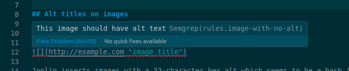

Or, equivalently, the same error message can be seen in the Semgrep CLI:

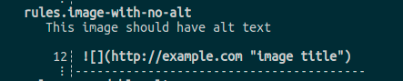

So now we have a rule that checks that images have an alt title. However, that's not enough: [Joplin](https://joplinapp.org/), the note-taking application that I use to write the bulk of these posts, by default pastes clipboard images by adding an alt that is some sort of hash of the file:

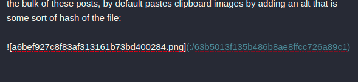

This won't do, but it's not empty so the rule above will be happy and not raise an error. For that, we turn to a fairly advanced feature of Semgrep: [entropy analysis](https://semgrep.dev/docs/writing-rules/metavariable-analysis/#entropy).

Entropy has a few different definitions (it doesn't help that it's used informally, on physics/thermodynamics, on information theory and on computer science), but here Semgrep is using [the information theory sense](https://web.archive.org/web/20131126063443/http://www.isi.edu/~vfossum/entropy.pdf) of the word: "the information content of language". Random sentences have high entropy because they're random and thus difficult to predict. Ordered sentences have low entropy because, to a degree, they can be predicted (and, thus, receiving the next word in the sentence doesn't tell you as much because you could have predicted it already or at least could have narrowed down the options to a few possible words).

Thus, entropy in this sense (and applied to any stream of information, not just to a natural language sentence) can be though of as "when I receive a new piece of information, how much does that narrow down my choices from the ones that I had just before receiving said piece of information?" Every halving of the choices represents one bit of information/entropy.

This is why you need eight bits to represent (both store and communicate) a number between 0 and 255. There are 256 possible choices, and every bit of information that you receive lets you cut the possible numbers in half (assuming that the number was chosen randomly). At the start, you have no information whatsoever, and hence all 256 choices are equally likely. Now, let's say that the bits are being transmitted most-significant-byte first, and you receive a 0. You now know that the number is between 0 and 127, which is 128 possibilities out of the original 256. That's half the options, therefore one bit. Or, if you were to receive the least significant bit first, and it's a 0, you know that the number must be even. Exactly half of all your previous options are even, so you've narrowed down the possible options to half of what they were before. Again, one bit of information.

The entropy of natural languages isn't quite as clean, because they aren't perfectly random. If I send "The", you can reduce the possible next words: it's _very_ unlikely that the next word will be "the", for example, since that would mean that the sentence read "The the ...". The amount of information in human languages can be experimentally measured ([this paper](https://web.archive.org/web/20131126063443/http://www.isi.edu/~vfossum/entropy.pdf) used a set of UN treaties, which are routinely translated to many languages; and the Bible, which has most likely been translated to all of them). 

In particular, Semgrep uses English frequencies [for every trigram](https://github.com/semgrep/semgrep/blob/develop/src/data/Entropy_data.ml) (i.e. every sequence of three characters) to identify things that are English-like and things that look more like sequences of random characters. Most source code looks English-ish: language keywords, variable names, classes, functions and comments are usually in English, and symbols/operators don't typically come in enough quantities to skew the probability distribution too far from English. ([Unless you're](https://dev-to-uploads.s3.amazonaws.com/i/bqz71hy5dxbmnmwbqgeh.jpg) [writing Perl](https://dev-to-uploads.s3.amazonaws.com/uploads/articles/bj2l55r03rxtrtu7hgt3.jpg), apparently)

By contrast, secrets that have a tendency to sneak into source code (e.g. API keys or AWS access keys or similar tokens) have very high entropy, usually near perfect randomness. This is because access keys are usually generated randomly and bound to the user, since there's no need for them to have a certain content: they just need to be as close to unguessable as their length allows. The best way to do so is to just make a random string. This isn't true, for example, for JWTs, which are Base64-encoded JSON, but they are far enough from English that they would probably trip entropy detectors as well.

This is a simplification; AWS access keys, for example, are composed of a keypair, which means that they aren't necessarily random with respect to each other. However, many API keys and access tokens are very random. Semgrep uses that to implement a secret detector that works for many different secrets, without having to have service-specific understanding such as [the fact that Github's Personal Access Tokens start with `ghp_`](https://github.blog/changelog/2021-03-31-authentication-token-format-updates-are-generally-available/) or that [Slack bot tokens start with `xoxb-`](https://api.slack.com/authentication/token-types#bot).

This rule implements detection of alt titles that look close enough to random strings:

```yaml
rules:
  - id: unreadable-alt
    languages: [generic]
    paths:
      include: ["*.md"]
    message: This image's alt attribute "$...ALT" isn't readable, write at least some words
    patterns:
      - pattern: ""
      - metavariable-analysis:
          analyzer: entropy
          metavariable: $...ALT
    fix: ""
    severity: ERROR
```

The main difference between this rule and the previous one (that detected empty alts) is that now the pattern is more complex. Instead of a single string inside a `pattern` key, it now has two patterns joined by a `patterns` key (notice the plural). This key `patterns` implements [logical ANDing](https://semgrep.dev/docs/writing-rules/rule-syntax/#patterns) (i.e. both of its children have to match in order for the entire rule to be satisfied).

The first child pattern filters down to images. The `$...ALT` and `$...ATTRS` bits [are called _metavariables_](https://semgrep.dev/docs/writing-rules/pattern-syntax/#metavariables), and they represent placeholders that are also accessible later. If you don't need access to them, you can just use `...`. However, here we want access to both positions in the Markdown image syntax: the alt title to express another condition later, still in the `patterns` field; and the image attributes (the URL and an optional title) to add them in the autofix (see later). Metavariables are compared to [regex's named capturing groups](https://developer.mozilla.org/en-US/docs/Web/JavaScript/Reference/Regular_expressions/Named_capturing_group), which simultaneously express a pattern and make whatever matched it accesible to further stages.

As an aside: normally metavariables are written like `$ALT` and `$ATTRS`, with no ellipsis between the dollar sign and the var name. However, in generic mode (which we have to use here since Semgrep has no Markdown-specific grammar), a metavariable with no ellipsis will only match a single word, and word boundaries are many: spaces and punctuation signs such as slashes or periods will end a word. Therefore, `$ALT` would not match `79054025255fb1a26e4basc422aef54eb4.png` (that would be treated as two words, `79054025255fb1a26e4basc422aef54eb4` and `png`, separated by a period). Similarly, a normal URL will have plenty of word separators (e.g. slashes) for the analyzer to get confused on. Therefore, we need both of the metavariables to have ellipsis (ellipsises? ellipsii?) so they match many "words".

The second pattern that must simultaneously match is [the `metavariable-analysis` analyzer](https://semgrep.dev/docs/writing-rules/metavariable-analysis/#entropy) set to `entropy` mode. We also provide it with the metavariable that it must check, which is `$ALT`. This analyzer will only report a match if the passed metavariable has a random enough value.

If both of those conditions match, the rule throws an ERROR. It also suggests a fix in the form of the `fix` key. The contents of this key can refer to the metavariables that were captured by the `patterns`, so the fix makes changes to the existing code as opposed to entirely replacing it.

VS Code detects violations of this rule and reports them as expected:

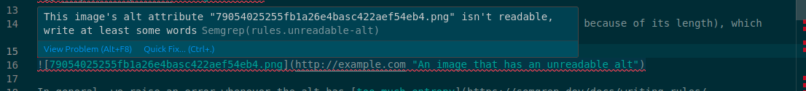

And now it also suggests a "Quick Fix", triggered by pressing `Ctrl+.`, or by clicking the yellow light bulb that VS Code likes to pop up: 

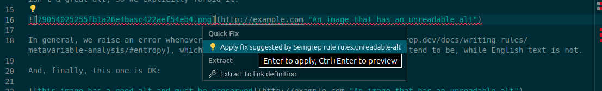

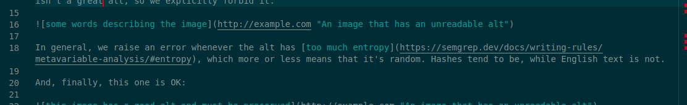

### Links

Sometimes I copy and paste links to already-published blog articles, and I tend to do it from the live (public) blog, since when I'm writing the new post I don't necessarily have a local Hugo server running. However, I want every link to be relative, so the local server also works when I've changed things, and also in case I at some point migrate the blog from the Github Pages subdomain to somewhere else. We can write a rule that detects Markdown links that point to either the local server (Hugo boots on port 1313), or to the actual live blog. For either of those, the rule can suggest an autofix that deletes the origin and leaves only the URL path.

This requires detecting links where the URL starts with either `http://localhost:1313/` (the local server) or `https://jreyesr.github.io/` (the public blog instance). 

```yaml
rules:
  - id: absolute-links-to-blog
    languages: [generic]
    paths:
      include: ["*.md"]
    message: Link $...FULL_LINK is absolute. Replace it with a relative link so it works the same locally and on the online blog
    patterns:
      - pattern: "[...]($...FULL_LINK)"
      - pattern-inside:
          pattern-either:
            - pattern: "[...](http://localhost:1313/$...LINK)"
            - pattern: "[...](https://jreyesr.github.io/$...LINK)"
      - focus-metavariable: $...FULL_LINK
    fix: "/$...LINK"
    severity: ERROR
```

We have a complex arrangement of nested patterns so we can capture the full link (the entire contents of the Markdown link's `()` part) and only the URL path, after the origin. We also capture the link's text, which appears before the actual link URL surrounded by square brackets `[]`.

The rule [uses `pattern-either`](https://semgrep.dev/docs/writing-rules/rule-syntax/#pattern-either) to OR two patterns together, as opposed to `patterns` which would AND them. The rule also offers an autofix, which is to replace the link with only the `$...LINK` metavariable, which has been captured above (in the `patterns` key) to be only the URL path, after the origin.

The new configuration here is `focus-metavariable`. This operator ["zooms in" to a specific section of a pattern](https://semgrep.dev/docs/writing-rules/rule-syntax/#focus-metavariable). Without this operator, the rule's findings would look like this:

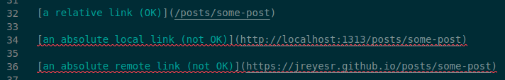

Notice that the entire line that contains the link is underlined in red. However, with the `focus-metavariable` operator, the scope of the rule finding is reduced to just the link:

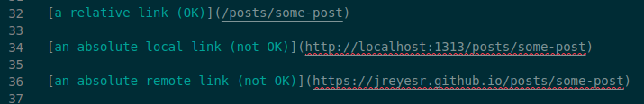

This is what lets the `fix` specify only `/$...LINK` as its contents, too: the focus operator also applies to the fix. Quick Fixes are available for absolute links now:

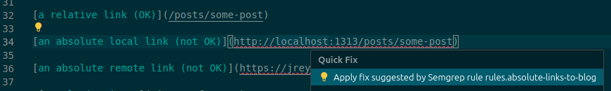

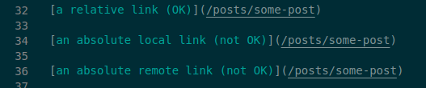

Also, sometimes I've forgotten to actually give an URL to a link. Markdown's syntax means that you first write the link text and then the link, and sometimes I write the link text, then go to copy the link and forget about it. These links look OK in the finished article, except that they don't lead anywhere. Until now, I've taken to hovering over every link in the post while I'm giving it the final read, before publication. However, it would be nice to have a rule that detects links that don't have a target:

```yaml
rules:
  - id: empty-links
    languages: [generic]
    paths:
      include: ["*.md"]
    message: Link doesn't have a target
    pattern: "[...]()"
    severity: ERROR
```

This one is quite simple, and it matches empty links and (since images share a similar syntax) also images with no source. These aren't as important because they're visible in the rendered article as broken images, but it's nice nonetheless:

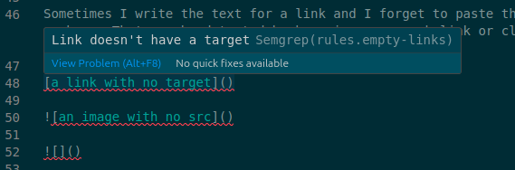

This rule doesn't have a fix because there's no good general link that could be inserted. Semgrep's fixes tend to favor changing parameters around (e.g. switching `verify=False` to `verify=True`), removing parameters (e.g. removing an `insecure=True)` keyword argument or adding static params (`verify=True`), but none of those are useful in this case.

### YAML frontmatter

Every article in a Hugo blog has [front matter](https://gohugo.io/content-management/front-matter/), which is a YAML file (or it can also be TOML or JSON) that contains metadata about the article. The most salient pieces of metadata are the article's title, description/blurb, date and categories/tags.

This blog additionally renders a [table of contents](https://gohugo.io/content-management/toc/) for articles (scroll back to the start of this article to see one), since I tend to write articles that are long enough for a table of contents to be of use. This is gated behind a front matter variable, `toc`, which should be set to `true` for the table of contents to be rendered. This is because I added ToC rendering after several articles already existed, and I didn't want to risk breaking the layout of old articles.

However, now I usually want every article to have a table of contents, and I have forgotten a few times to add the `toc: true` line to the front matter, so we can have a rule that ensures that this key is added (even if false, which means that I explicitly don't want a table of contents in the post):

```yaml
rules:
  - id: toc-unset
    languages: [generic]
    paths:
      include: ["*.md"]
    message: "This front matter doesn't contain `toc: true` or `toc: false`."
    patterns:
      - pattern: "---$...FRONTMATTER---"
      - pattern-not-regex: "^toc: (true|false)$"
    severity: ERROR
    fix: "---$...FRONTMATTER\ntoc: true\n---"
```

This rule uses two ANDed patterns, the first of which triggers on the YAML front matter (which is separated from the Markdown content proper by YAML by three dashes, which [separate directives in YAML](https://camel.readthedocs.io/en/latest/yamlref.html#general-syntax) and [render hrules in Markdown](https://roachhd.gitbooks.io/master-markdown/content/syntax/horizontal-rule.html)). The second pattern rejects lines that start with `toc: `, followed by either `true` or `false`. ANDing both of them means that only frontmatters that don't have such a line are flagged.

The fix, of course, is to spit out the entire front matter again, but append `toc: true` to it before closing the front matter and starting the Markdown content proper.

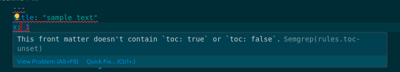

After applying the Quick Fix, a line containing `toc: true` is added. Ignore the red squiggly line on the `date`, we'll look at it next:

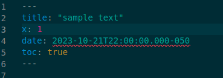

One of the fields that a Hugo article front matter should have is a `date`, in ISO 8601 format. This is used by Hugo to show the post date in the UI, and even to skip rendering future-dated posts.

When the date of a post isn't a proper ISO 8601 string, Hugo will not refuse to start nor display an error. It will jut silently skip that post. And that can be very confusing while it lasts. So let's add a rule that complains loudly instead!

```yaml
rules:
  - id: invalid-frontmatter-date
    languages: [generic]
    paths:
      include: ["*.md"]
    message: "Date $DATE on the front matter doesn't seem correct. Use plain ISO 8601 format"
    patterns:
      - pattern: "---...---"
      - pattern-regex: '^date: (?P<DATE>\N*)$'
      - pattern-not-regex: '\d{4}-\d{2}-\d{2}T\d{2}:\d{2}:\d{2}.\d{3}[+-]\d{2}:?\d{2}'
      - focus-metavariable: $DATE
    severity: ERROR
```

The rule uses a series of patterns ANDed together. The first one matches Markdown front matter, though not exclusively: since we're in generic mode, which has no understanding of Markdown syntax, this would also match Markdown sections that are surrounded by two horizontal rules. The second pattern matches lines that are like `date: ...`, and the third one discards lines that _do_ match the correct ISO 8601 format. Thus, up to this point the rule will trigger on `date` keys inside the front matter that don't have the correct ISO 8601 format.

The last pattern focuses only on the value, ignoring the `date: ` part. This is just for aesthetics, so only the actual date gets the red squiggle of shame. The `date: ` key doesn't deserve it.

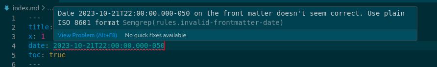

### Article content

Sometimes, when writing an article I have to leave a TODO, as is the time-honored tradition of developers everywhere. In Markdown there are no comments so it's necessary to write TODOs directly in the content.

In order to not raise alerts when the article is talking about TODOs, we'll limit the scope of the rule so it only triggers when the line starts with TODO, and we'll also support TODO titles because sometimes I use those to note down the general structure of the document or expand on some already-written content.

```yaml
rules:
  - id: todo
    languages: [generic]
    paths:
      include: ["*.md"]
    message: Clear this TODO before publishing
    pattern-either:
      - pattern-regex: '^TODO\N*$'
      - pattern-regex: '^#+ TODO\N*$'
    severity: ERROR
```

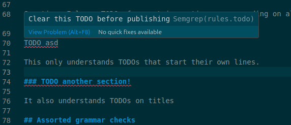

And, as expected, both lines that start with TODO and titles that start with TODO are correctly marked.

### Some grammar checks

Semgrep can be used (somewhat) for grammar/typo checking, as long as that check could be expressed as a regular expression that requires no actual knowledge of English grammar.

Admittedly, using Semgrep for these kinds of tasks is probably very much overkill, but hey. We're using it anyways, so we might as well throw some spell checking on the mix.

The true power of using Semgrep, as opposed to a normal spell checker, is that you can tweak it yourself. For example, let's say that your keyboard's period key is acting weird and sometimes types two periods when you press it. Many spell checkers would catch that, but now we _write that code ourselves!_.

```yaml
rules:
  - id: double-periods
    languages: [generic]
    paths:
      include: ["*.md"]
    message: Double periods aren't correct, delete one
    patterns:
      - pattern-regex: '[^.](?P<PERIODS>\.\.)(?!\.)'
      - focus-metavariable: $PERIODS
    severity: ERROR
    fix: "."
```

The regex pattern first tries to find the start of a run of periods (that's the `[^.]` part). Then, it matches two consecutive periods, and binds that to the `$PERIODS` metavariable. The `(?!\.)` part has the delightful name of [negative lookahead assertion](https://www.regular-expressions.info/lookaround.html), and it ensures that what follows is _not_ another period, since that would mean that the entire thing is an ellipsis... which is actually a valid set of characters.

This time, we can offer a fix (obviously, it's to replace the focused metavariable with just a single period).

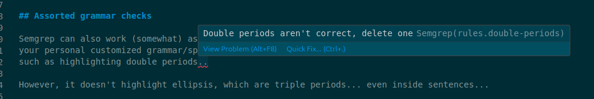

A similar rule can be used if you know that you tend to mistype a certain word, such as typing _yu_ instead of _you_:

```yaml
rules:
  - id: typos
    languages: [generic]
    paths:
      include: ["*.md"]
    message: This word looks like a typo
    pattern-regex: '\byu\b'
    severity: ERROR
    fix: you
```

The `pattern-regex` in this rule uses the [word boundary assertion `\b`](https://www.pcre.org/original/doc/html/pcrepattern.html), which matches when that position is a word boundary. "A word boundary is a position in the subject string where the current character and the previous character do not both match \w or \W (i.e. one matches \w and the other matches \W)". In other words, a word boundary happens when the "wordness" of the character stream changes. We use that to match on _yu_ as a whole word, as opposed to it being inside of a larger word.

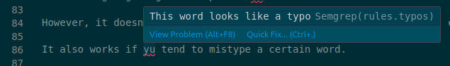

However, Semgrep is not a proper spell checking engine. It doesn't understand English grammar. Common mistakes such as _they're_ vs. _their_ or _your_ vs. _you're_ (which aren't proper typos since both words do exist) cannot be resolved by Semgrep, since they require looking around the word in question.

## Running Semgrep on CI

So now we have a set of rules that can be run on-demand against a certain folder. This is enough for spot checking the folder, but we probably want an automatic way of running Semgrep at certain points, such as when a commit is made (still on the device where the changes are being made) or on a CI pipeline (which will be executed on a runner somewhere, such as on Github Actions).

Semgrep [comes with docs](https://semgrep.dev/docs/extensions/overview/#pre-commit) that explain how to integrate Semgrep with [the `pre-commit` framework](https://pre-commit.com/), "A framework for managing and maintaining multi-language pre-commit hooks".

If you don't have `pre-commit` installed on your machine, you can install it by running `pip install --break-system-packages pre-commit` (the `--break-system-packages` flag is new, so you may not need it). [As outlined in `pre-commit`'s docs](https://pre-commit.com/#2-add-a-pre-commit-configuration), it is then necessary to add a file to the root of the repository under question, called `.pre-commit-config.yaml`. This file should contain information about which _hooks_ (i.e. small checks) should run before every commit.

The following contents can be used for that file:

```yaml
repos:
- repo: https://github.com/semgrep/semgrep
  rev: 'SEMGREP_VERSION_LATEST'
  hooks:
    - id: semgrep
      args: ['--config', 'semgrep_rules', '--error', '--skip-unknown-extensions']
```

Before committing that file and the folder with Semgrep's rules, it is necessary to register `pre-commit` with Git, which is done by running `pre-commit install`. Once this is done, the YAML file can be committed so the hook runs for the first time.

The first run of the hook will take longer since `pre-commit` will checkout (via Git) the repository for the hook. The hook will analyze only the files that have changed in the current commit, since any others shouldn't have changed since the last time that they were checked.

Then, it's time to run Semgrep once on all the current contents of the blog, fix a few issues just to prove that it works, and then submit them! You can see [the commit that fixed issues found in some files](https://github.com/jreyesr/jreyesr.github.io/commit/e2b9fe10ff8e28526080a9e49b7200e81811246e) (though not all of them, there's a bunch of content on the blog and Semgrep's rules aren't perfect. For example, the frontmatter `toc` rule seems to also be triggering on Markdown tables, since their syntax includes repeated dashes that satisfy the pattern `---$FRONTMATTER---`).

With this plumbing in place, Semgrep will run just before every commit and block it if any files that have been touched in this commit have errors, and also on Github's CI process.

## Conclusions

In this article, we've explored [Semgrep](https://semgrep.dev/), which is a static source code analyzer (i.e. it doesn't run the code, just analyzes its text) that can be used to find potential bugs, misconfigurations, use of dangerous/deprecated/pitfall-y APIs, and more. It does so by exposing a "pattern language" that is used to express what should be matched. Patterns are written in a way that usually looks a lot like the code that they match, which eases the task of understanding the rules and writing new ones.

Semgrep is typically used by leveraging the many built-in rules that have been contributed either by the company behind Semgrep or by the community, and running the Semgrep analyzer on source code as a live, Intellisense-like analyzer while developing or as a stage in a CI pipeline (ideally both, much like a linter). Semgrep is usually fast enough so it can be used while developing to get instant feedback, not just as an overnight step on some pipeline.

However, in this article we used only the finest hand-made rules, and we applied them to the problem of writing a sort of style guide for a tech/programming blog. We implemented and reviewed rules to:

* Check that all images have an alt title
* Check that said alt title isn't a bunch on random characters
* Checking that all links point somewhere
* Checking that intra-blog links are relative
* Ensuring that a certain field is set on every article's front matter
* Ensuring that the date in an article's front matter is a valid ISO 8601 string
* Checking that there are no TODOs still in the article
* Implementing a couple of grammar/spell checks

We then reviewed how to integrate Semgrep on a Git repo, both by running it locally, just before every commit; and also on Github's CI as a check step, like you may run unit tests or linters.
