## Introduction, Or, Why This?

In this article, we'll explore a time tracking and activity monitoring application, [TimeDoctor](https://timedoctor.com). It can be used for personal activity tracking or freelance work (i.e., billing for hours worked and having evidence of the same), but it's also geared towards corporate employee tracking. It offers a "Silent Install" mode that, once deployed, is always on and has no UI. Thus, the user of the device has no way of observing the data that is gathered about him. Therefore, we identify the need for a way to tap into the collected data and feed it back to the user who generated it in the first place, who the data is about, and who may be affected by the contents of said data.

To do so, we explore and arrive at a method of intercepting the data as it is written into an encrypted SQLite database that TimeDoctor uses as an intermediate/cache storage, before it's shipped to its cloud servers. We use [Frida](https://frida.re) for that purpose, since it can work with "black-box", compiled applications with no source code available, and lends itself well to iterative development.

This article hopes both to document parts of the TimeDoctor software (such as its web interface, as seen by a user with the highest privileges), its architecture and logs, the way of interfacing with SQLite from a plain-C application, and the usage of Frida in x86-64 environments (since there seems to be a lack of information in that space, as most material about Frida concerns itself with mobile reverse engineering). In the end, we'll have a script that logs every SQL statement that TimeDoctor executes into a separate file, for later analysis.

To make things more interesting, we'll set the following rules (or invariants, if you are into [Design By Contract](https://en.wikipedia.org/wiki/Design_by_contract)):

**Rule 0:** Thou shalt not interfere with the normal operation of the ~~spyware~~ time-tracking software.
Reasoning: Software such as this, when not installed voluntarily by the user, relies on... let's say "social enforcement" to work, not technical measures. As we'll see later, disabling TimeDoctor simply would involve commenting a crontab entry, which you can do if you could install it in the first place (both operations require `sudo`). Its persistence mechanisms are really primitive (which is good, more advanced mechanisms would scream "actual spyware!"). In other words, you can easily uninstall it, you'll just get in trouble with your boss and lose your job. ~~But, you know, no one is forcing you to install it.~~ Hence the importance of not altering anything about the... data-collection activities of the software.

**Rule 1:** Thou shalt only employ reputable, open source software.
Reasoning: We can't trade a spy application for another. We will spy on an application that in turn spies on a lot of data about your activities. Thus, we need to be able to verify that the code that spies on the spy isn't sending the double-spied data somewhere. At least, even if we don't verify every line of code ourselves, the fact that someone could verify them will probably deter some no-gooders, especially when coupled with only using popular projects.

**Rule 2:** All modifications shall be reversible.
Reasoning: A variation of Rule 0. No permanent changes should be made to the target application. That's risky.

In other words, **This Article Does Not Show You How To Disable TimeDoctor**. Nor does it show you how to sanitize, alter, tamper with or otherwise modify the data reported about you. Rule 0 ensures that normal data-collection processes will continue as normal.

This article was written when TimeDoctor was on version 3.6.43, using Ubuntu 22.04 as a victim machine. YMMV a lot, especially since we will be using some *seriously* undocumented functionality.

Also: why TimeDoctor, specifically? There are many companies that provide equivalent products. For way of illustration, according to a document from June 2020, discussed at the end of this article, there's (in alphabetical order) ActivTrak, CleverControl, DeskTime, Hubstaff, Interguard, StaffCop, Teramind, TimeDoctor, Work Examiner and WorkPuls. TimeDoctor was chosen because of a combination of the following circumstances:

* It can be installed on Ubuntu, which is a bonus for reverse engineering work. Reverse-engineering a Windows application would involve the Windows API, with which I'm not familiar.
* It has a 14-day trial, that requires no credit card and gives you access to the silent installation. The free plan only lets you install the app that has a GUI, and we want the silent version since it has a better payoff (it gives you less data by default, so we have more data to liberate). Also, the last thing I want is to accidentally let a trial expire and pay for an... activity tracker.
* It has all the creepy-stalky functionalities that warrant a deeper look: silent mode! Continuous tracking! Mouse, keyboard, and screenshot tracking! The only thing missing would be remote webcam and microphone activation.
* (This is a *post-facto* reason, sure) It lets itself be spied upon. If I hadn't been able to get any data, there wouldn't have been an article and we wouldn't even be talking about this. Or we would be talking about a different application, in which case this last reason would be the same.

## A peek inside the cockpit (AKA, what you won't see normally)

In this section, we'll take a whirlwind tour of TimeDoctor's web interface, as seen by an all-powerful Company Admin. In case you have never seen it, this will give you an idea of the type of data that is available to such a user. The help docs and tutorial videos do reveal a little bit of the UI, but not all of it.

First off, we need to create a TimeDoctor account:

1. Create a TimeDoctor account. There's a large link in their page that says "Free Trial". No credit card is required.
2. (IMPORTANT) Choose "Silent" when prompted, as that's the most obnoxious type of tracker.
3. Don't provide a credit card, the free trial (14 days) is more than enough.

Here's how the screen is displayed:

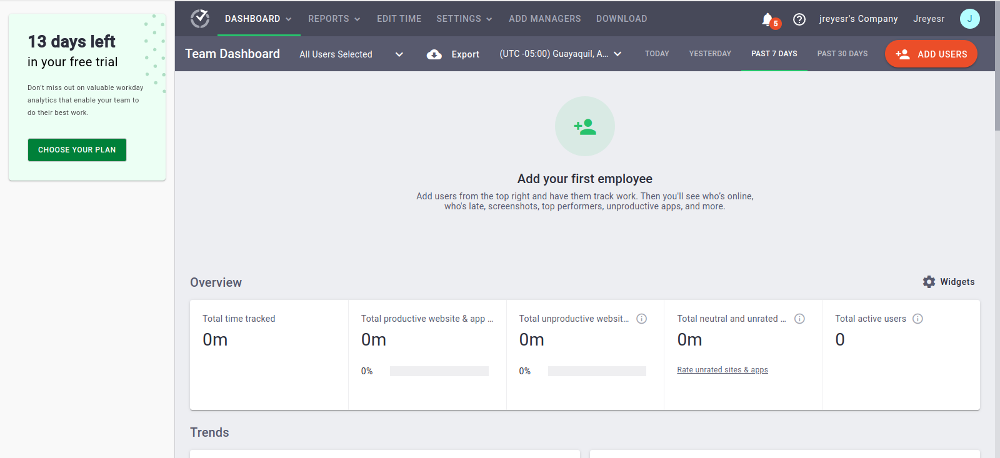

Then there's a bunch of dashboard-y panels, with names such as Hours Tracked (by user), Productivity Percentages, Users with Most work-life balance potential issues, Highest % time on unproductive websites and apps, users with Highest % of idle minutes, Top used websites & applications.

As an aside, there's this delightful bit of ~~double-standards~~ functionality (says I):

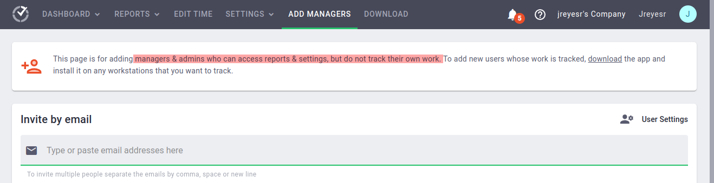

I'll say nothing more.

*Ahem.* As we were saying, you have a general dashboard, then dashboards by team and by user. There's also a bunch of reports: Attendance, Hours Tracked, Timeline, Web & App usage. There's a big button for editing time, then settings. The Company Settings are interesting. Let's take a look!

* Company Details: Boring data, such as company name, owner, timezone, whether it uses silent or interactive tracking
* Whether to blur screenshots (default is No)
* Whether Silent Tracking happens all the time (default is Yes)
* Who can see other people's screen recordings (multiselect with options Owners, Admins, Managers, by default all are checked)
* What's tracked in the Web & App Usage Reporting (default is Extended, AKA everything: URLs, page titles, app window titles, querystrings in URLs)
* Work-life balance settings
   * What's "too many hours worked per day" (default is 9)
   * What's "worked late hours" (default is after 8 PM)
   * What's "work outside shifts" (default is 1 hour)
   * Whether working on weekends counts as a balance issue (default is Yes)
* SSO config
* Who can access billing info

## The setup

That's it for the settings. Now, to add a ~~stalkee~~ application user.

An Ubuntu VM will be the spied machine in this experiment. After we're done, I'll delete it and salt the ground that it stood on.

A tip that tripped me for a portion of an hour: To enable espionage, the machine must NOT use Wayland. If you install a recent Ubuntu version, it will come with Wayland. I'll refer the interested reader to [The Internet](https://fostips.com/switch-back-xorg-ubuntu-21-04/) for instructions on switching the window manager.

There's a big orange button in the main dashboard, that says "Add Users". Clicking on it reveals a screen that lets you choose an OS and provides a download link.

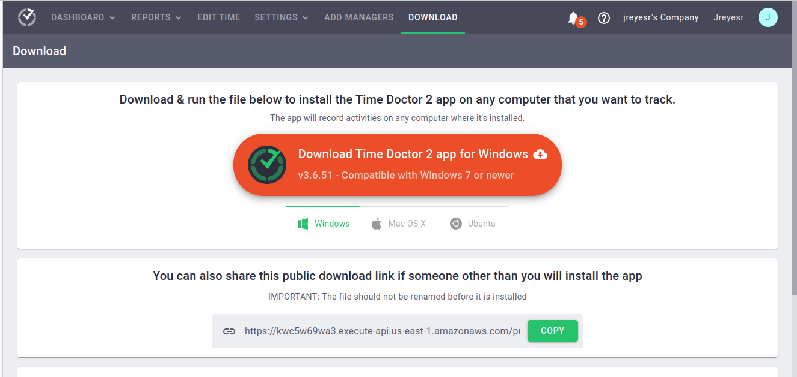

Our victim is a Ubuntu VM (because I do *not* want to be tracked in my main PC, even by myself!). Clicking that tab reveals a `wget` command:

```shell
wget -q -O - 'https://UNIQUE_CODE_1.execute-api.us-east-1.amazonaws.com/production/bash-install-generator?hostname=2.timedoctor.com&companyId=UNIQUE_CODE_2&version=3.6.43' | sudo /bin/bash
```

There's a tracking code in the querystring that links the installation back to your company. You're supposed to provide that to the user and tell him to run it. Since we're responsible users, we know that you never pipe a script from `wget` into `bash`, especially with `sudo`! Instead, we'll download it and take a peek.

```shell
#!/bin/bash

# Code to ensure it's running as root

wget -O /tmp/sfproc-$$.run "https://download.timedoctor.com/.../some_process.run"
if [ -e /tmp/sfproc-$$.run ] ; then 
    chmod a+x /tmp/sfproc-$$.run 
    /tmp/sfproc-$$.run --nox11 -- --company-id=UNIQUE_CODE_2_DECODED_FROM_BASE64_AND_ENCODED_INTO_HEX; retval=$?
    rm -fv /tmp/sfproc-$$.run
    exit $retval
fi
```

Well, that's boring. It's just a second-stage downloader, then it runs the downloaded file passing it your company ID as a flag. Let's follow that link again!

That second file is far bigger, and it contains a bunch of binary data. It clearly contains the actual executable. It starts by stating that it was generated by [Makeself](https://makeself.io/), and it fits the bill: a single executable file, `.run` extension, it's a shell script, then a TAR file. The beginning of the file is a bunch of variables, then Makeself's functions to printf, print a license, check disk usage, copy data, print progress and help, check the integrity of the archive (it uses MD5 and CRC). The help menu tells us what flags we have:

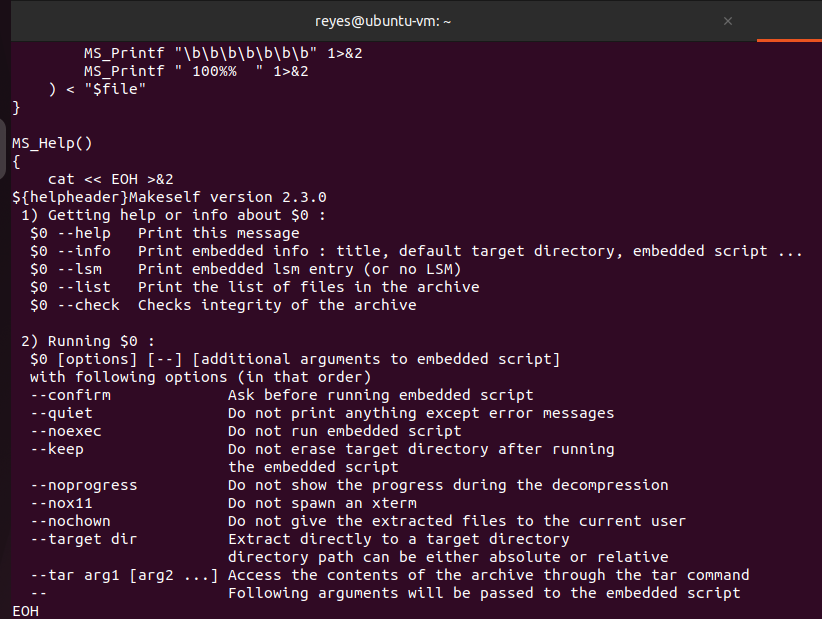

Hmmm. There's a `--noexec` flag! That's neat! By combining that with the `--target` flag, it will extract the file but not install it. Onward to the third-stage loader!

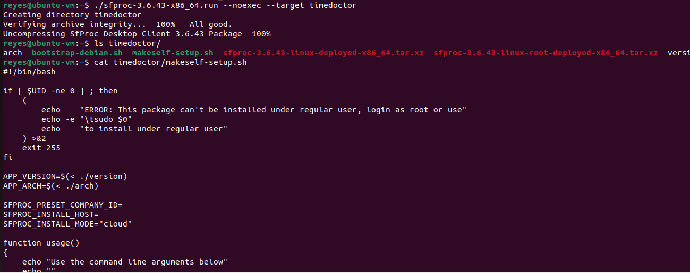

Finally, some actual TimeDoctor code! This script is also boring shell stuff, reading flags and running commands, then it does the good bits:

1. Create a directory `/etc/sfproc`

2. Create a INI file `config.ini` in that directory, which holds the company ID and install mode (presumably silent)

3. Run the `bootstrap-debian.sh` file, which in turn:

   * Installs `libappindicator3-1` and `libindicator3-7`

4. Ensure that `/opt` exists (it better!)

5. Create the directory `/var/log/sfproc`

6. Extract the `sfproc-X.Y.Z-linux-root-deployed-x86_64.tar.xz` file into `/`, which pokes into the following directories:

   * `/etc/cron.d`, where it drops two files: one with contents `0 * * * *   root    /opt/sfproc/updateschecker-wrapper` and another with contents `* * * * *   root    /opt/sfproc/start-for-all`. Thus, one that checks for updates every hour o'clock, another one that starts the program every minute. That's presumably its persistence method.

   * `/opt/sfproc`, where it drops a ton of stuff: all its executables, dependencies, config files, even an uninstaller.

7. Move the `sfproc-X.Y.Z-linux-deployed-x86_64.tar.xz` file (same name as above, without `-root` in the middle) into `/opt/sfproc`. I have no idea why.

8. `chown` the `/opt/sfproc` directory to root.

9. `chown` the created crontab files to root, and change the access permissions to 0644.

10. Wait for a bit, for some reason.

11. Run the update script.

In turn, the `/opt/sfproc/start-for-all`, which appears to be the main entrypoint, does the following:

1. Ensure that `/opt/sfproc/SF/logs` exists. That will be important later!
2. Check to see if the `/etc/sfproc/.td_developer` file exists. If it does, it sets the `TD_DEVELOPER` envvar. Hmmmmmm. What will happen if we press that button?
3. For each user, it checks if the `sfproc` binary is already running. If so, it doesn't run. That's why they can afford to run this script every minute. Otherwise, it sets a ton of envvars, then actually makes the `sfproc` binary run.

That's it for the passive reverse engineering. Installing it runs with no problem, then we reboot and wait for a few minutes until it pops up in the web UI. You check that by going to Settings > Users, a new user should be created with the username of the victim machine.

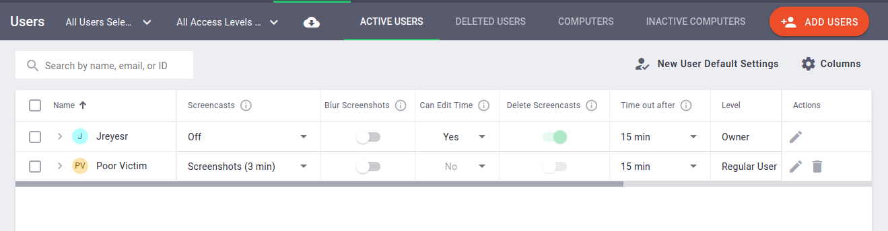

Welcome aboard, O Observed One. You'll be observed. A lot. And I'm not even enabling video recording, because I'm ~~not a micromanager~~ lazy.

## Step The First: Recon

First step is to find the process and see what files it's working with:

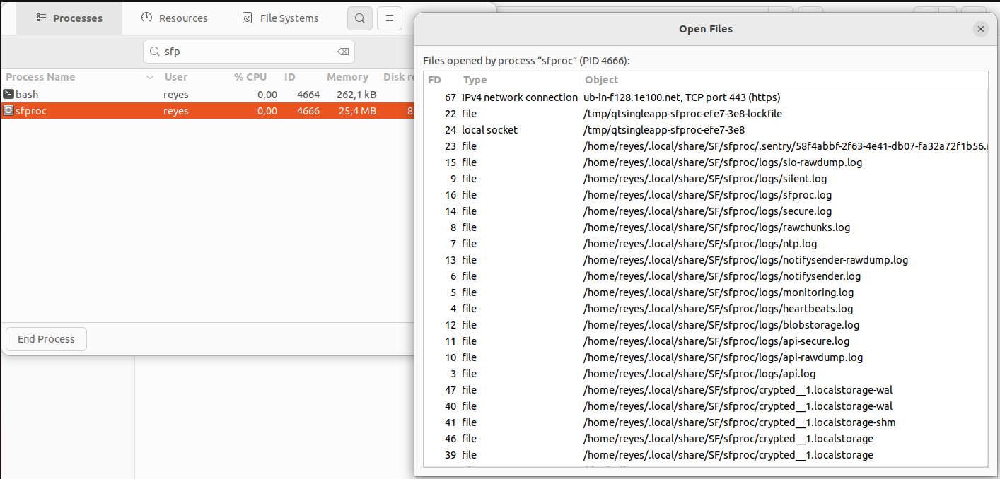

That's fun. A ton of log files. We'll keep that in mind, since they may have really interesting information. At the end, some files called `crypted__1.localstorage-[wal,shm]`. Let's Google that.

Looking for the literal file name `crypted__1.localstorage` returns a [single result](https://www.hybrid-analysis.com/sample/e71b9e64ef22e9a24f4663675e5f2b07247b7a67013cbc3dbc0af0f8c936f1d9?environmentId=100), from a VirusTotal-like platform that reports that the `sfproc.exe` binary reads that file. No luck there, we already know that. Perhaps the `crypted__1` part is variable? Searching for `wal shm` does indeed return something more promising:

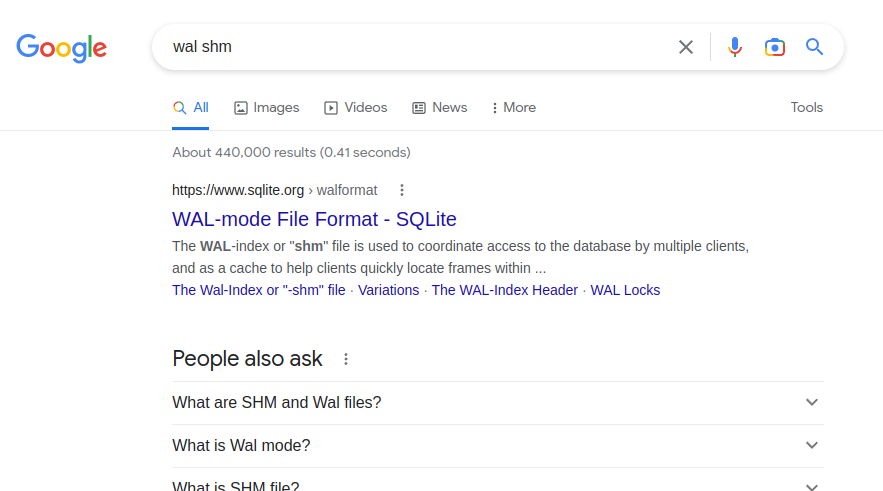

So, TimeDoctor uses SQLite for stuff. That's good to know. SQLite can operate in "WAL mode", which is a method by which SQLite can provide concurrency. SQLite normally works with a single file, normally with extension `.sqlite3`. However, in WAL mode, two other files exist, one with `-wal` appended and another with `-shm` appended. Thus, the `crypted__1.localstorage` must be a SQLite DB in disguise. We'll try to open it by copying the file, then renaming it to `db.sqlite3` and using the [DB Browser for SQLite](https://sqlitebrowser.org/).

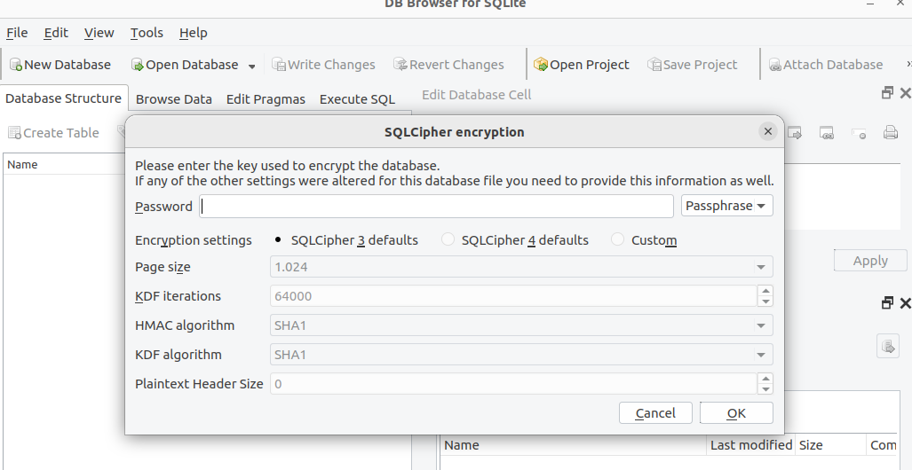

Nope. The DB Browser gets angry. Let's verify that with a hex viewer:


OK, so that is not a valid plaintext SQLite file. It's probably fully encrypted, hence why it appears random. Let's go back to the process inspector, and list its memory maps, in which you can also see the loaded shared libraries:

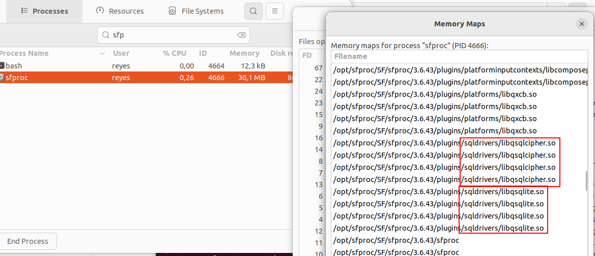

That's a confirmation. The target uses SQLite, and `libqsqlcipher.so`. Searching for that reveals that it's most likely a repackaging of [Zetetic's SQLCipher extension](https://www.zetetic.net/sqlcipher/) (which is [open source](https://github.com/sqlcipher/sqlcipher), BTW) for the Qt platform. That seems like something we can use. If we can somehow intercept the key functions or the functions that send queries to the DB, we'll intercept the data before it gets encrypted and written to disk.

## Interlude: How does Frida work

That sounds like just the job for the [Frida toolkit](https://frida.re/).

*The What toolkit?* It's a reverse engineering project, the purpose of which I find really difficult to explain. I'm probably a lousy teacher. You'll see it a lot in mobile application reverse engineering and security, less so in desktop environments. It works on Windows, Linux, MacOS, Android, iOS and a few other, more exotic systems. In their own words:

>  It lets you inject snippets of JavaScript or your own library into native apps

Or, as their homepage proudly states:

>  Inject your own scripts into black box processes. Hook any function, spy on crypto APIs or trace private application code, no source code needed. 

What does that sound like? Oh, yes, a certain ~~pesky little sh...py~~ time-tracking application. It's most definitely a black box, we want to spy on crypto APIs, and we don't have source code so it's good that we don't need it.

(Seasoned reverse-engineers, feel more than free to skip this section)

The code presented in the Interlude is published in [this repository](https://github.com/jreyesr/frida-sqlite-c), so that it doesn't mix with the TimeDoctor spy code that we'll work on after the Interlude.

### Using the SQLite library from C

Reading list: 
* https://zetcode.com/db/sqlitec/: A nice, step-by-step introduction to using SQLite in a C program.
* https://www.sqlite.org/c3ref/stmt.html: The authoritative resource on SQLite's API. It's fairly easy to follow.

This is a simple C application that uses the SQLite C library:

```c
#include <sqlite3.h>
#include <stdio.h>

#define HANDLE_SQLITE_ERROR(msg) do{ if (rc != SQLITE_OK ) { fprintf(stderr, (msg), sqlite3_errmsg(db)); sqlite3_close(db); return 1;}} while(0)

int callback_list_all(void *, int, char **, char **);

int main(int argc, char **argv) {
    printf("SQLITE VERSION: %s\n", sqlite3_libversion()); 
    
    sqlite3 *db;
    char *err_msg = 0;
    char *sql;
    sqlite3_stmt *res;

    int rc = sqlite3_open(argv[1], &db);
    HANDLE_SQLITE_ERROR("Cannot open database: %s\n");

    printf("LISTING ALL USERS!\n");
    sql = "SELECT * FROM users";
    rc = sqlite3_exec(db, sql, callback_list_all, 0, &err_msg);
    HANDLE_SQLITE_ERROR("Cannot select all users: %s\n");

    printf("GETTING SINGLE USER!\n");
    sql = "SELECT username, email, last_login FROM users WHERE username = ?"; 
    rc = sqlite3_prepare_v2(db, sql, -1, &res, 0);
    if (rc == SQLITE_OK) {
        sqlite3_bind_text(res, 1, argv[2], -1, SQLITE_STATIC);
    } else {
        fprintf(stderr, "Failed to execute statement: %s\n", sqlite3_errmsg(db));
    }
    int step = sqlite3_step(res);
    if (step == SQLITE_ROW) {
        printf("User %s has email %s and last logged in on %s\n\n", 
               sqlite3_column_text(res, 0), 
               sqlite3_column_text(res, 1),
               sqlite3_column_text(res, 2)
        );
    }

    printf("GETTING MESSAGES INVOLVING %s\n", argv[2]);
    sql = "SELECT \"from\", \"to\", content FROM messages WHERE \"from\" = ?1 OR \"to\" = ?1"; 
    
    rc = sqlite3_prepare_v2(db, sql, -1, &res, 0);
    if (rc == SQLITE_OK) {
        sqlite3_bind_text(res, 1, argv[2], -1, SQLITE_STATIC);
    } else {
        fprintf(stderr, "Failed to execute statement: %s\n", sqlite3_errmsg(db));
    }
    // Read all rows
    while(sqlite3_step(res) == SQLITE_ROW){
        printf("%10s -> %10s: %s\n", 
               sqlite3_column_text(res, 0), // from
               sqlite3_column_text(res, 1), // to
               sqlite3_column_text(res, 2) // content
        );
    }

    sqlite3_close(db);
    return 0;
}

int callback_list_all(void *NotUsed, int argc, char **argv, char **azColName) {
    NotUsed = 0;
    for (int i = 0; i < argc; i++) {
        printf("%s = %s\n", azColName[i], argv[i] ? argv[i] : "NULL");
    }
    printf("\n");
    return 0;
}
```

The DB that it accesses looks like this:

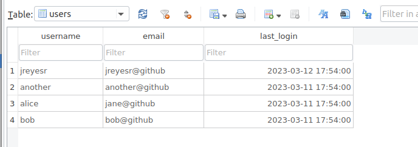

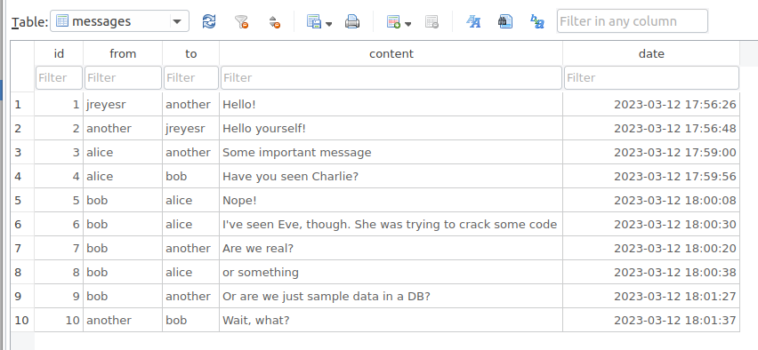

Imagine that as a simple chat app. It reads a DB name and specific username from command line arguments, then opens the database and runs a few commands on it, just to show off the SQLite API. When it's run, it outputs the following:

```
SQLITE VERSION: 3.37.2
LISTING ALL USERS!
username = jreyesr
email = jreyesr@github
last_login = 2023-03-12 17:54:00

username = another
email = another@github
last_login = 2023-03-11 17:54:00

username = alice
email = jane@github
last_login = 2023-03-11 17:54:00

username = bob
email = bob@github
last_login = 2023-03-11 17:54:00

GETTING SINGLE USER!
User bob has email bob@github and last logged in on 2023-03-11 17:54:00

GETTING MESSAGES INVOLVING bob
     alice ->        bob: Have you seen Charlie?
       bob ->      alice: Nope!
       bob ->      alice: I've seen Eve, though. She was trying to crack some code
       bob ->    another: Are we real?
       bob ->      alice: or something
       bob ->    another: Or are we just sample data in a DB?
   another ->        bob: Wait, what?
```

Nice. So long for the SQLite introduction. Now, on to hooking those calls.

By the way, the code as it looks here is in the `step1` tag in the repo. If you checkout that tag, you'll be able to compile and run the code and should see the same outputs.

### Hooking API calls

Reading list:

* https://www.cl.cam.ac.uk/teaching/1415/CandC++/lecture9.pdf
* https://code.visualstudio.com/docs/editor/debugging
* https://devblogs.microsoft.com/cppblog/c-tutorial-debugging-overview/

Let's assume you have access to the source code, and want to intercept SQL statements. You can set breakpoints on calls to `sqlite3_prepare_v2`, `sqlite3_bind_*` and `sqlite3_step`. Then, whenever those functions are called, you'll get a breakpoint hit and you can intercept the parameters.

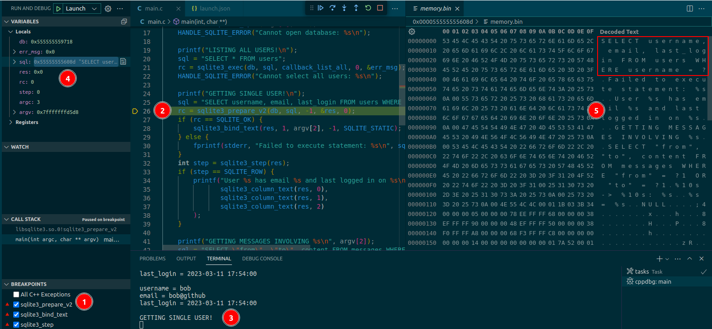

This screen may seem overwhelming if you don't do C debugging. These are the important bits:

1. Here you can see that we have set breakpoints to trigger whenever the three important functions are called.
2. Indeed, the program is halted on a line that calls one of the functions that we care about.
3. You can confirm that by the console output. Everything above the halted line has already been printed, everything below it hasn't been printed yet.
4. Here you can see the local variables at that time. In particular, the `sql` variable is a pointer to memory that, as expected, holds the string with the SQL statement.
5. This is the memory dump of the memory region that `sql` points to. Indeed, it holds the correct SQL statement.

So, with that breakpoint, we now know the SQL statement. Sure, since we have the source code we don't really need to know, but if we didn't have it we would just need to follow the pointer of the second argument to the function, where we would find the SQL statement.

Let's let it run, it will trigger when setting the bind parameter. We expect that to be the username.

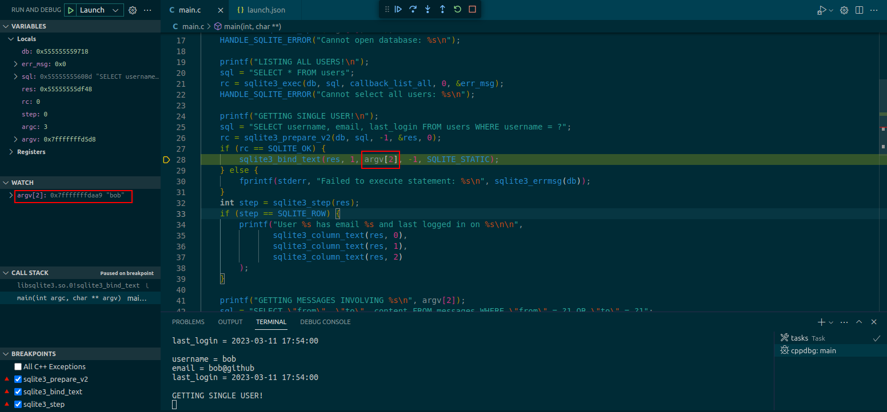

Yes, it's there. In this case we had to set a watch, since it's not a simple string. However, we could just again follow the pointer of the second argument to the function and find that information. The `sqlite3_step` is less interesting, since it takes no arguments.

Aside: it would be cleaner/neater to actually display the view from the next frame in the call stack, i.e., from the point of view of the actual SQLite function. However, I don't have the debug symbols for SQLite, and since this is just an example I didn't feel like compiling SQLite from source.

So, to recap: 

* When you write code that uses SQLite (at least on C-like languages), you'll probably use `libsqlite`, and call its functions in your application code
* Those functions are well-defined and documented, and so you can know what parameters they receive
* If you somehow manage to put a breakpoint or hook into their calls, you get free access to their parameters
* Similarly, by putting a breakpoint just after they return, you get free access to their return values
* Direct breakpoints are not so useful, since they require access to the source code (so you can know which lines call the functions that you are interested in). Also, breakpoints happen from the point of view of the caller (just before the function call), not just after entering it (unless you have debug symbols for the called library too).
* This neatly bypasses encryption at rest, since you are capturing values before they get encrypted and saved to disk and after they are read from disk and decrypted. The target binary does all the work for you!

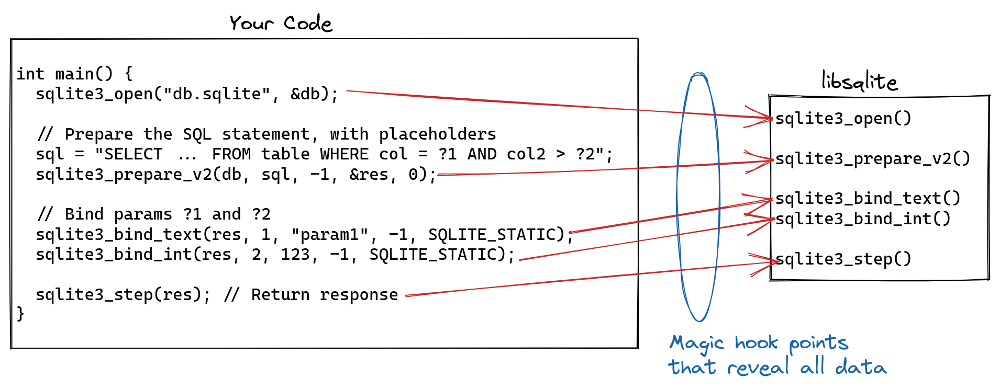

### Bringing Frida into the Fray

Reading list:

* https://frida.re/docs/quickstart/
* https://frida.re/docs/installation/
* https://frida.re/docs/functions/
* https://frida.re/docs/javascript-api/
* https://www.sqlite.org/c3ref/stmt.html

If you'll remember, Frida describes itself as such:

> Hook any function, spy on crypto APIs or trace private application code, no source code needed.

Frida provides the magic hook points that reveal all data. You load it "into" a target process, then somehow obtain the memory address of a function (probably by reading the debug symbols, if you are lucky) and set a hook in that function. Frida does Black Magic (TM) to replace that code location with its own code. Thus, anytime that function is called, Frida can react to that event. Then you get a nice callback argument, called `onEnter`, that (as its name implies) triggers every time the hooked function is called. You define the `onEnter` function on Javascript, which is really nice. In that callback you can do whatever you want with the function parameters: exfiltrate them, modify them, suppress the function's execution altogether, redirect it somewhere else... You can also request an `onLeave` callback, that triggers as the function is returning, where you can get access to the return value, and log it or modify it.

Frida's [Functions tutorial](https://frida.re/docs/functions/) is the primary resource here. It sets up a simple C program (that doesn't link in external libraries, by the way) and then intercepts a function call. However, that tutorial requires the collaboration of the inspected binary, to print the address that the hooked function is at. We have no such luck, thus we need to get the address in another way.

Let's deal with that when we get there. First off, we'll follow the [Installation tutorial](https://frida.re/docs/installation/) to install Frida. Then, instead of using a system binary, we'll use our own `main` binary (from the code above). Then, we'll copy the first Python script provided, that hooks into the process and just prints out a list of its Modules (which includes the linked in shared libraries, even the dynamically linked ones):

```python
import frida

def on_message(message, data):
    print("[on_message] message:", message, "data:", data)

pid = frida.spawn("main", ["main", "test.sqlite3", "bob"]) # Start the program, but paused
session = frida.attach(pid) # Hook into the program

script = session.create_script("""
rpc.exports.enumerateModules = () => {
  return Process.enumerateModules();
};
""")
script.on("message", on_message)
script.load()

print([m["name"] for m in script.exports_sync.enumerate_modules()])

frida.resume(pid) # Run the program
```

```
❯ sudo python3 captain_hook.py
['main', 'libsqlite3.so.0.8.6', 'libc.so.6', 'libm.so.6', 'ld-linux-x86-64.so.2', 'libpthread.so.0', 'frida-agent-64.so', 'libdl.so.2', 'librt.so.1']
SQLITE VERSION: 3.37.2
LISTING ALL USERS!
# ... more program output
```

This version of the code is available in the `step2` tag in Git.

The first line in the output is all the available modules. Among them, you can see the `libsqlite3.so.0.8.6` library. That's our victim. Next step is to list the symbols that the SQLite module exposes. To do so, we'll just change the JS script that is run by Frida (that's the bit between triple quotes in the Python script)

```python
# Everything before is the same

script = session.create_script("""
rpc.exports.enumerateModules = () => {
  return Process.getModuleByName("libsqlite3.so.0.8.6").enumerateExports();
};
""")

# Everything after that is the same
```

And the output:

```
❯ sudo python3 captain_hook.py
['sqlite3Fts3EvalPhraseCleanup', 'sqlite3Select', 'sqlite3WindowAttach', 'sqlite3MallocZero', ...]
# Then comes the program's output
```

So, we can list all the exports for that library. That includes all the functions. Indeed, searching by `sqlite3_prepare_v2` returns a hit (you'll remember we used that function in the C program we developed above). So do all the other functions. With that, it's really easy to get a handle to the function that we want to intercept:

```python
script = session.create_script("""
rpc.exports.enumerateModules = () => {
  return Module.getExportByName("libsqlite3.so.0.8.6", "sqlite3_prepare_v2");
};
""")

# And almost at the end
print(script.exports_sync.enumerate_modules())
```

```
❯ sudo python3 captain_hook.py
0x7ff2d6375070
SQLITE VERSION: 3.37.2
LISTING ALL USERS!
# more output
```

This is on `tag3`.

That definitely looks like a 64-bit pointer! That gives us the power to intercept everything, since Frida wants a memory address to hijack. Now we can go back to the Functions tutorial, since we now have the address to intercept. I'll present the entire script again, since it has changed a bit:

```python
import frida
import sys

def on_message(message, data):
    print("[on_message] message:", message, "data:", data)

pid = frida.spawn("main", ["main", "test.sqlite3", "nonexistent"]) # Start the program, but paused
session = frida.attach(pid) # Hook into the program

script = session.create_script("""
Interceptor.attach(Module.getExportByName("libsqlite3.so.0.8.6", "sqlite3_prepare_v2"), {
    onEnter(args) {
        send(args[1].readCString());
    }
});
""")
script.on("message", on_message)
script.load()

frida.resume(pid) # Run the program

sys.stdin.read()  # IMPORTANT: Otherwise the script terminates before the messages are received
```

Note that, at the end, we need to make the Python script pause. Otherwise, it just drops off the end and dies, before giving the hooked binary a change to do its work and make the hooked calls. You'll see that the monitored binary works, but you don't get your hooks to run. That can be quite confusing (ask me how I know!)

The new script now hooks into a function by name (the `sqlite3_prepare_v2` function of the `libsqlite3.so.0.8.6` module), then when it's received, it `send`s the second parameter (interpreted as a C string) to the inter-process communication channel. That's how Javascript code (which is running in the context of the instrumented/monitored/spied process, with full access to its memory) can communicate back and forth with your Python program, which is completely independent. See Frida's [Messages documentation](https://frida.re/docs/messages/) for more details. In short, if you `send()` something from Javascript, you can capture it using `script.on("message", callback)` in Python. The reverse direction is also possible: you `script.post({"type": "poke"})` from Python and set up a listener in JS with `recv("poke", function onMessage(msg) {...})`. We aren't using that, just the JS to Python messages.

Running that again outputs this:

```
❯ sudo python3 captain_hook.py
SQLITE VERSION: 3.37.2
LISTING ALL USERS!
# the app's logs, as usual
[on_message] message: {'type': 'send', 'payload': 'SELECT * FROM users'} data: None
[on_message] message: {'type': 'send', 'payload': 'SELECT*FROM"main".sqlite_master ORDER BY rowid'} data: None
[on_message] message: {'type': 'send', 'payload': 'SELECT username, email, last_login FROM users WHERE username = ?'} data: None
[on_message] message: {'type': 'send', 'payload': 'SELECT "from", "to", content FROM messages WHERE "from" = ?1 OR "to" = ?1'} data: None
```

After the app's logs, we can also see some `on_message` calls. Those mean that the `sqlite3_prepare_v2` function was called four times. We can recognize all but the second call, it may be some internal bookkeeping by SQLite. Whatever. It doesn't change what we have.

Also, just in case you didn't notice, now we have access to every SQL statement that the application ever executes! Sure, it doesn't have its parameters (we'll work on that soon), but we can already get a really good idea about the app's data structure (since we see its tables and columns, and even the types of queries that it makes), and its usage patterns (since we see how and when it accesses data, and what query goes after what query). This stage is saved under the tag `step4`.

Astute readers may be wondering: how did you know to hook the `sqlite3_prepare_v2` function, then look to its second argument (that's `args[1]`) and interpret it as a C string (`readCString`)? That's where the library's documentation comes in. In this case, [SQLite's docs](https://www.sqlite.org/c3ref/stmt.html) tell me the name of the function, right in their first numbered list. Clicking on that link shows me the function signature, from which I can see that the second parameter is a `char*`, which is a UTF-8 string. UTF-8 is backwards-compatible with ASCII: If a string only contains ASCII characters (such as the SQL statements above), its representation in ASCII and UTF-8 is the same. That's why we could use `readCString` here. There is a variant for UTF-16 too. Then, Frida's docs (in the [NativePointer docs](https://frida.re/docs/javascript-api/#nativepointer)) tell me that a NativePointer (which is the type of every element of the `args` array) has a `readCString` function that follows the pointer and reads that memory location as a C string (i.e., it reads until it encounters a null byte). That's all the information required to set the hook.

Next step is to hook the bind methods that "fill in" the data for the query. There are many of those, but you can usually get a pretty good idea of the ones that you need to hook by looking at the queries: `SELECT username, email, last_login FROM users WHERE username = ?` tells me that the only bound parameter is probably a string of some sort, so I'll hook the bind functions that pertain to strings. In this case, we know the exact function used since we built the target application, but we won't have that luxury in the real TimeDoctor app. There we'll have to hook many things and hope that the hooks catch everything of importance. Now, I only need to hook a string bind method, which I know is `sqlite3_bind_text`. This time, we need to take the function's third argument (the second one is the number of the bound parameter)

```python
script = session.create_script("""
Interceptor.attach(Module.getExportByName("libsqlite3.so.0.8.6", "sqlite3_prepare_v2"), {
    onEnter(args) { send(args[1].readCString()); }
});
Interceptor.attach(Module.getExportByName("libsqlite3.so.0.8.6", "sqlite3_bind_text"), {
    onEnter(args) { send(args[2].readCString()); }
});
""")
```

```
❯ sudo python3 captain_hook.py
[on_message] message: {'type': 'send', 'payload': 'SELECT username, email, last_login FROM users WHERE username = ?'} data: None
[on_message] message: {'type': 'send', 'payload': 'bob'} data: None
GETTING SINGLE USER!
User bob has email bob@github and last logged in on 2023-03-11 17:54:00

[on_message] message: {'type': 'send', 'payload': 'SELECT "from", "to", content FROM messages WHERE "from" = ?1 OR "to" = ?1'} data: None
[on_message] message: {'type': 'send', 'payload': 'bob'} data: None
GETTING MESSAGES INVOLVING bob
     alice ->        bob: Have you seen Charlie?
# more messages here
```

I've reordered the outputs so they match the sequence in which they were executed. Yours may vary. Classical distributed systems stuff: logs are never synchronized. Consider the following exchange:

```
[on_message] message: {'type': 'send', 'payload': 'SELECT username, email, last_login FROM users WHERE username = ?'} data: None
[on_message] message: {'type': 'send', 'payload': 'bob'} data: None
```

That must correspond to the C pseudo-code:

```c
sqlite3_prepare_v2(db, "SELECT username, email, last_login FROM users WHERE username = ?");
sqlite3_bind_text(stmt, ?, "bob", ...);
```

Then, we can just hook the `sqlite3_step` function. That means that we are done preparing the statement, and the app is now running it. We can use that as a signal that a SQL statement is complete.

```
[on_message] message: {'type': 'send', 'payload': 'SELECT "from", "to", content FROM messages WHERE "from" = ?1 OR "to" = ?1'} data: None
[on_message] message: {'type': 'send', 'payload': 'bob'} data: None
[on_message] message: {'type': 'send', 'payload': 'RUNNING STATEMENT!'} data: None
[on_message] message: {'type': 'send', 'payload': 'RUNNING STATEMENT!'} data: None
[on_message] message: {'type': 'send', 'payload': 'RUNNING STATEMENT!'} data: None
[on_message] message: {'type': 'send', 'payload': 'RUNNING STATEMENT!'} data: None
[on_message] message: {'type': 'send', 'payload': 'RUNNING STATEMENT!'} data: None
# more calls
GETTING MESSAGES INVOLVING bob
     alice ->        bob: Have you seen Charlie?
       bob ->      alice: Nope!
# more messages
```

There it is: the call that creates the prepared statement (that gives us the SQL statement), then the bind calls (those give us the query parameters) and then the repeated step calls (those tell us that the statement has been prepared and is now being run). We don't care about all the step calls, just the first one.

That code is at the `step5` tag.

And with that, we have all the tools that we'll need to stalk TimeDoctor. First, we get the module, ensure that it has the required symbols, then we hook everything. We can start with the `sqlite3_prepare_*` since that will tell us the types of parameters passed. Then we can hook the required bind functions, and the step function to signal that a statement is done. Then we'll send everything back to Python and, from there on, we'll see.

## End of Interlude

Thus concludes the Interlude, in which we developed a C application that linked in the SQLite library and executed some queries against a database. We used the application as a testbed to develop a Frida script that could intercept the queries.

## Step the Second: Fun with Frida

Reading List:

* https://www.zetetic.net/sqlcipher/sqlcipher-api/#sqlite3_key
* https://ackcent.com/recovering-sqlcipher-encrypted-data-with-frida/
* https://android.stackexchange.com/questions/229801/break-sqlcipher-by-modifying-libsqlcipher-so
* https://codeshare.frida.re/@Alkeraithe/monitorsql/
* https://gist.github.com/fs0c131y/a3dbf8db1f1ed79ea5dbc178463c430c

The code for this section (i.e., the Python script that drives Frida) is published in [this gist](https://gist.github.com/jreyesr/9a5c69956fdf1273956aedaeb81935e3). That's the code that you'll want if you wish to obtain insights about your own TimeDoctor installation.

The code developed during the [Interlude](#interlude-how-does-frida-work) should work with almost no modifications with TimeDoctor. There's a potential complication, since we worked with the SQLite library, yet TimeDoctor uses SQLCipher, as we confirmed above. However, as SQLCipher states in their [Design](https://www.zetetic.net/sqlcipher/design/) docs, "Applications use the standard SQLite API to manipulate tables using SQL". In other words, the API that the app uses is the same, you mostly just change the `#include`d library and add a [function call to set up the key](https://www.zetetic.net/sqlcipher/sqlcipher-api/#sqlite3_key). That's really good, since we'll just need to remember to hook the SQLCipher module, not the SQLite one. This depends on SQLCipher having been written as a (nearly) drop-in replacement to plain SQLite. Otherwise, we would have needed to build and use SQLCipher itself in our tests.

Let's first reuse the code of the [Interlude](#interlude-how-does-frida-work) to list all of TimeDoctor's modules, to ensure that SQLCipher is there, and then list all of its exports to check that our important functions are there. We'll use Frida's interactive console (yes, it has one!) so that we don't have to write Python scripts for everything.

```bash
frida sfproc
```

That opens an interactive/REPL-like console that communicates with the Frida agent that has been installed in the process.

```js
[Local::sfproc ]-> Process.enumerateModules()
[
    // many, many modules
        {
        "base": "0x7fefd2c00000",
        "name": "libqsqlcipher.so",
        "path": "/opt/sfproc/SF/sfproc/3.6.43/plugins/sqldrivers/libqsqlcipher.so",
        "size": 3043328
    },
    // a few other modules
]
```

So yes, the agent is there and working. We can now ensure that the library exports the necessary symbols:

```js
[Local::sfproc ]-> Process.findModuleByName("libqsqlcipher.so").enumerateExports().map(x => x.name)
[
    // many, many symbols
    "sqlite3_key",
    "sqlite3_key_v2",
    "sqlite3_prepare_v2",
    "sqlite3_step",
    // all the other nice functions
]
```

So the program was compiled without stripping symbols. That's really good; otherwise things get really difficult, since then you couldn't know the memory address that you need to hook. With that, we can now try the easy bit and hook the functions that set the database key. If we can get those, we're done, we can just open the DB on the DB explorer and poke at it as we want.

```python
import frida
import sys

def on_message(message, data):
    print("[on_message] message:", message, "data:", data)

session = frida.attach("sfproc") # Hook into the program

script = session.create_script("""
const mod = Process.findModuleByName("/opt/sfproc/SF/sfproc/3.6.43/plugins/sqldrivers/libqsqlcipher.so");
Interceptor.attach(mod.getExportByName("sqlite3_key"), {
    onEnter(args) { send("KEY WAS READ"); }
});
Interceptor.attach(mod.getExportByName("sqlite3_key_v2"), {
    onEnter(args) { send("KEY V2 WAS READ"); }
});
""")
script.on("message", on_message)
script.load()


sys.stdin.read()  # IMPORTANT: Otherwise the script terminates before the messages are received
```

One interesting bit: I had to specify the module by using its complete filesystem path. I have no idea why, but just setting its name makes it not find the named exports. There's [an issue](https://github.com/frida/frida/issues/445) in the Frida repo that seems similar, which involves repeated imports of the same module. The System Monitor did show four memory-mapped regions for the same library, so that may be the same problem.

Alas, this script obtains no results. I presume that's because the TimeDoctor application unlocks the database as it starts, but the Frida script attaches to an already running process. It's probably possible to mess with the crontab entry that launches the program so that it launches Frida instead, and Frida in turn launches the program, but that involves a change in the program's execution. According to Rule 0, we can't do that, it's *way* too risky if it at some point fails to work. We'll resort to hooking the functions that happen around a SQL statement execution, as demonstrated in the [Interlude](#interlude-how-does-frida-work).

That means hooking some more functions. The rest of the code stays the same:

```python
import json
import sys

import frida

def on_message(message, _data):
    payload = json.loads(message["payload"])
    print("[on_message] message:", payload)

session = frida.attach("sfproc") # Hook into the program

script = session.create_script("""
const mod = Process.findModuleByName("/opt/sfproc/SF/sfproc/3.6.43/plugins/sqldrivers/libqsqlcipher.so");
const msg = (data) => send(JSON.stringify(data));

Interceptor.attach(mod.getExportByName("sqlite3_prepare_v2"), {
    onEnter(args) { msg({func: "sqlite3_prepare16_v2", stmt: args[1].readUtf8String()}); }
});
Interceptor.attach(mod.getExportByName("sqlite3_prepare16_v2"), {
    onEnter(args) { msg({func: "sqlite3_prepare16_v2", stmt: args[1].readUtf16String()}); }
});
Interceptor.attach(mod.getExportByName("sqlite3_bind_int"), {
    onEnter(args) { msg({func: "sqlite3_bind_int", "index": args[1].toInt32(), value: args[2].toInt32()}); }
});
Interceptor.attach(mod.getExportByName("sqlite3_bind_text"), {
    onEnter(args) { msg({func: "sqlite3_bind_text", "index": args[1].toInt32(), value: args[2].readUtf8String()}); }
});
Interceptor.attach(mod.getExportByName("sqlite3_bind_text16"), {
    onEnter(args) { msg({func: "sqlite3_bind_text16", "index": args[1].toInt32(), value: args[2].readUtf16String()}); }
});
Interceptor.attach(mod.getExportByName("sqlite3_step"), {
    onEnter(args) { msg({func: "sqlite3_step"}); }
});
""")
script.on("message", on_message)
script.load()


sys.stdin.read()  # IMPORTANT: Otherwise the script terminates before the messages are received
```

```
reyes@ubuntu-vm:~$ sudo python3 spy.py 
[on_message] message: {'func': 'sqlite3_prepare16_v2', 'stmt': 'BEGIN'}
[on_message] message: {'func': 'sqlite3_step'}
[on_message] message: {'func': 'sqlite3_prepare16_v2', 'stmt': 'DELETE FROM "BlobStorageLasttrackedtimeblock" WHERE "key" = :key'}
[on_message] message: {'func': 'sqlite3_bind_text16', 'index': 1, 'value': '2023-03-13T23:27:00Z'}
[on_message] message: {'func': 'sqlite3_step'}
[on_message] message: {'func': 'sqlite3_prepare16_v2', 'stmt': 'COMMIT'}
[on_message] message: {'func': 'sqlite3_step'}

[on_message] message: {'func': 'sqlite3_prepare16_v2', 'stmt': 'SELECT "value" FROM "BlobStorageLasttrackedtimeblock" WHERE "key" = :key'}
[on_message] message: {'func': 'sqlite3_bind_text16', 'index': 1, 'value': '2023-03-13T23:27:00Z'}
[on_message] message: {'func': 'sqlite3_step'}

[on_message] message: {'func': 'sqlite3_prepare16_v2', 'stmt': 'SELECT count(*) AS "length" FROM "BlobStorageLasttrackedtimeblock"'}
[on_message] message: {'func': 'sqlite3_step'}

[on_message] message: {'func': 'sqlite3_prepare16_v2', 'stmt': 'SELECT "value" FROM "BlobStorageLasttrackedtimeblock" WHERE "key" = :key'}
[on_message] message: {'func': 'sqlite3_bind_text16', 'index': 1, 'value': '2023-03-13T23:27:00Z'}
[on_message] message: {'func': 'sqlite3_step'}

[on_message] message: {'func': 'sqlite3_prepare16_v2', 'stmt': 'BEGIN'}
[on_message] message: {'func': 'sqlite3_step'}
[on_message] message: {'func': 'sqlite3_prepare16_v2', 'stmt': 'INSERT OR REPLACE INTO "BlobStorageTimeblocks"("key","modifiedAt","value") VALUES (:key,:modifiedAt,:value)'}
[on_message] message: {'func': 'sqlite3_bind_text16', 'index': 1, 'value': '2023-03-13T23:27:00Z'}
[on_message] message: {'func': 'sqlite3_bind_text16', 'index': 2, 'value': '2023-03-13T23:30:00.109Z'}
[on_message] message: {'func': 'sqlite3_bind_text16', 'index': 3, 'value': '{\n    "clicks": 44,\n    "disconnectivity": {\n        "0": 0\n ... }'}
[on_message] message: {'func': 'sqlite3_step'}
[on_message] message: {'func': 'sqlite3_prepare16_v2', 'stmt': 'COMMIT'}
[on_message] message: {'func': 'sqlite3_step'}

[on_message] message: {'func': 'sqlite3_prepare16_v2', 'stmt': 'SELECT "key" FROM "BlobStorageTimeblocks" ORDER BY "modifiedAt" DESC LIMIT 1'}
[on_message] message: {'func': 'sqlite3_step'}

[on_message] message: {'func': 'sqlite3_prepare16_v2', 'stmt': 'SELECT "value" FROM "BlobStorageTimeblocks" WHERE "key" = :key'}
[on_message] message: {'func': 'sqlite3_bind_text16', 'index': 1, 'value': '2023-03-13T23:27:00Z'}
[on_message] message: {'func': 'sqlite3_step'}

[on_message] message: {'func': 'sqlite3_prepare16_v2', 'stmt': 'SELECT count(*) AS "length" FROM "BlobStorageTimeblocks"'}
[on_message] message: {'func': 'sqlite3_step'}
[on_message] message: {'func': 'sqlite3_prepare16_v2', 'stmt': 'BEGIN'}
[on_message] message: {'func': 'sqlite3_step'}
[on_message] message: {'func': 'sqlite3_prepare16_v2', 'stmt': 'INSERT OR REPLACE INTO "BlobStorageScreenshots"("key","modifiedAt","value") VALUES (:key,:modifiedAt,:value)'}
[on_message] message: {'func': 'sqlite3_bind_text16', 'index': 1, 'value': 'vWKEn7xMRfySlBiAItDqvg'}
[on_message] message: {'func': 'sqlite3_bind_text16', 'index': 2, 'value': '2023-03-13T23:30:30.130Z'}
[on_message] message: {'func': 'sqlite3_bind_text16', 'index': 3, 'value': '{\n    "image": "/9j/4AAQSkZJRgABAQEAYABgAAD/2wBDAA0J..."}'}
[on_message] message: {'func': 'sqlite3_step'}
[on_message] message: {'func': 'sqlite3_prepare16_v2', 'stmt': 'COMMIT'}
[on_message] message: {'func': 'sqlite3_step'}
```

Well, that's really promising. We can now see everything that TimeDoctor writes to its database. Presumably they use the database as a buffer in case connectivity problems happen, since we can see messages to the effect when poking into `~/.local/share/SF/sfproc/logs/silent.log`:

```
2023-03-13T23:36:53.117Z (*)2023-03-13T23:36:53.402Z [1644/Main] INFO sfproc.silent - Put content of screenshot report at "2023-03-13T23:36:50Z" on screen "0" to server side
2023-03-13T23:36:53.543Z (*)2023-03-13T23:36:53.832Z [1644/Main] INFO sfproc.silent - Remove screenshot report at "2023-03-13T23:36:50Z" on screen "0" from local cache
2023-03-13T23:36:53.544Z (*)2023-03-13T23:36:53.832Z [1644/Main] INFO sfproc.silent - [STAFF-68104] isCollectionHaveData data: length is: <<  0
2023-03-13T23:37:00.105Z (*)2023-03-13T23:37:00.392Z [1644/Main] INFO sfproc.silent - Send timeblock "2023-03-13T23:33:00Z" to server
2023-03-13T23:37:00.528Z (*)2023-03-13T23:37:00.812Z [1644/Main] INFO sfproc.silent - The time block "2023-03-13T23:33:00Z" was uploaded to server, remove it from cache
2023-03-13T23:37:00.531Z (*)2023-03-13T23:37:00.822Z [1644/Main] INFO sfproc.silent - [STAFF-68104] isCollectionHaveData data: length is: <<  0
```

It clearly mentions a "local cache". The two processes are probably decoupled: one spies and stashes the data on the DB, another one (which could be running on a different schedule) periodically sends everything that is on the DB to the TimeDoctor mothership and then deletes the sent data from the DB, presumably to save space and because it's no longer needed. Also, why is there what looks like a Jira ticket key in the logs?

In any case, that architecture works really well for counterespionage. Otherwise, we would need to monitor the (TLS-encrypted) API calls, which can also be done but is a bit more involved. *Stay tuned for that!*

Going back to the captured SQL statements, there are two which hold a veritable treasure trove of information:

### INSERT OR REPLACE INTO "BlobStorageTimeblocks"("key","modifiedAt","value") VALUES (:key,:modifiedAt,:value)'

This one holds the activity reports. While I've snipped it in the logs, it prints a really long string that holds a JSON object, which holds everything that then powers the activity dashboards that we've seen in the TimeDoctor web interface:

```json
{
   "clicks":19,
   "disconnectivity":{
      "0":0
   },
   "fakeActivities":0,
   "id":"2023-03-13T23:45:00Z",
   "keys":132,
   "movements":1068,
   "rawActivity":{
      "buttonClicks":"000000001000010000000000000010000000000000100000000100000000001000000100000000101001012000000000000000000000000000000000001000010100000000110010000000000000000000000000000000000000",
      "fakeActivities":"000000000000000000000000000000000000000000000000000000000000000000000000000000000000000000000000000000000000000000000000000000000000000000000000000000000000000000000000000000000000",
      "keystrokes":"000000000000000000000000000000000000000000000000000000000000020002010000000000100012010241062610003592100153466200143000000000130394656300200000000000000000000000000000000000000002",
      "mouseMovements":"199892119999910126999999409901999999999998445920255992334304217303414382069783128722036000000000000000000000000000000000225330284100000042242431000000000000000000000000000000000059"
   },
   "sign":"Nlhx8mY4DrNvIuzEql52kLmRfDBUp/xLwZTMgZZtkEY/V+wwTk2NiRyObB9cGIJMhwLGL4BqpEw4KqYQMmgH9/q1apPmNGv72bgn5FDBzUw3saDw9Meggd3u3GmFHyKTywioKYkwFGAPexWmc4HpuMKg/7O8PmkkiCMhnNayXVqOM1sBNotP/0/fbRn4iY0VLh5paXt332NjKXj6CjENTZbX39Q10otJT/CJ/PxoMwMYbycmJ6O2VqEf5a3gCuPnkEA8t9ASQC5ST85BexS6bQWekON4AFHS+a8McylWPL184XfGQk+9voBwpa5HEkU/Mc0AE2GVgYh3qc07MTsSvA",
   "timeuse":[
      {
         "ageOfData":-1,
         "app":"gnome-terminal-server",
         "end":63,
         "start":0,
         "title":"reyes@ubuntu-vm: ~",
         "url":""
      },
      {
         "ageOfData":-1,
         "app":"gedit",
         "end":67,
         "start":63,
         "title":"spy.py (~/) - gedit",
         "url":""
      },
      {
         "ageOfData":-1,
         "app":"gnome-terminal-server",
         "end":87,
         "start":67,
         "title":"reyes@ubuntu-vm: ~",
         "url":""
      },
      {
         "ageOfData":-1,
         "app":"gedit",
         "end":88,
         "start":87,
         "title":"spy.py (~/) - gedit",
         "url":""
      },
      {
         "ageOfData":-1,
         "app":"gnome-terminal-server",
         "end":130,
         "start":88,
         "title":"reyes@ubuntu-vm: ~",
         "url":""
      },
      {
         "ageOfData":-1,
         "app":"firefox",
         "end":180,
         "start":130,
         "title":"firefox",
         "url":""
      }
   ],
   "worklog":[
      {
         "end":180,
         "mode":"computer",
         "start":0
      }
   ]
}
```

There you have it. Counts of clicks, key presses, mouse movements and "fake activities", whatever that means. A signature, presumbly so you can't tamper with the reported data. The time intervals in which you had each app focused (in the `timeuse` field), with second-level start and end times. For suported web browsers, also the URL used. Apparently, Firefox is resistant to that particular brand of monitoring. Good to know.

The most interesting bit, for me, is the `rawActivity` field. It looks like a very long stream of numbers, and from experience, the runs of 0's match with inactivity. Also, each string has exactly 180 characters, and the timeblock monitors 3 minutes. That's probably not a coincidence. 

I postulate that every character in every string is the count of events for that second of the timeblock. For example, if `buttonClicks[124]` is 5 and the timeblock started on 18:03, that means that at the second 18:05:04 (i.e., 124 seconds after the start of the timeblock) you made 5 button clicks (which, incidentally, is a really fast rate!). From there, computing aggregate statistics is easy:
* Count of keypresses in those 3 minutes: split every char in the corresponding string, parse all as ints, add all
* % of inactive seconds: count all seconds in which all three activity streams had a 0 in that position

That report probably powers all the data provided by TimeDoctor, with the exception of screenshots.

### INSERT OR REPLACE INTO "BlobStorageScreenshots"("key","modifiedAt","value") VALUES (:key,:modifiedAt,:value)'

This one holds the screenshots. Again, the value is a JSON object, but this time it holds a screenshot.

```json
{
   "applicationName":"firefox",
   "blur":false,
   "chunkId":"2023-03-13T23:48:00Z",
   "clicks":29,
   "contentType":"image/jpeg",
   "createdAt":"2023-03-13T23:49:38Z",
   "h":649,
   "image":"/9j/4AAQSkZJRgABAQEAYABgAAD/2wBD...",
   "imageMd5":"113fa72116caafcfe3833207a4d260a4",
   "imageSign":"ktsQ63fyNs3CBsUn7shY36H3nH8tVyEO0nPFngdadLaCaQlLFTw...",
   "imageSize":68068,
   "keys":163,
   "movements":324,
   "period":196,
   "quality":60,
   "scale":90,
   "screenNumber":0,
   "sign":"It9kClH5ovEzsMW3qtRf/IVkPn1U7L0vysGbh5SzdpgWufLg7SRS5yAgAdj...",
   "thumbnail":{
      "h":68,
      "image":"/9j/4AAQSkZJRgABAQEAYABgAAD/2wBDABsSFBc...",
      "imageMd5":"79eba4aeac4d3a91192629c1b09b0885",
      "imageSign":"jvXeBgk5GjHNhNf8VjH3EiR/fEeL3khTv7WghJadQim1X5w1jsM...",
      "w":150
   },
   "w":1438,
   "windowTitle":"firefox"
}
```

I've trimmed the image values and signatures because they are really, *really* long.

So, that shows an application name, width and height of the screenshot, the timestamp, a quality number (resumably related to image compression, to save bandwidth and space), a screen number (to capture multi-monitor setups?), a MIME type, whether the image is blurred or not (not here! We only do quality monitoring!), image checksums, image signatures, signature signatures. Curiously, it repeats the aggregate information about the count of keypresses and clicks that is also sent by the other process. Presumably, this is used to power the special screenshots view, which displays two small bars at the bottom with precisely that information:

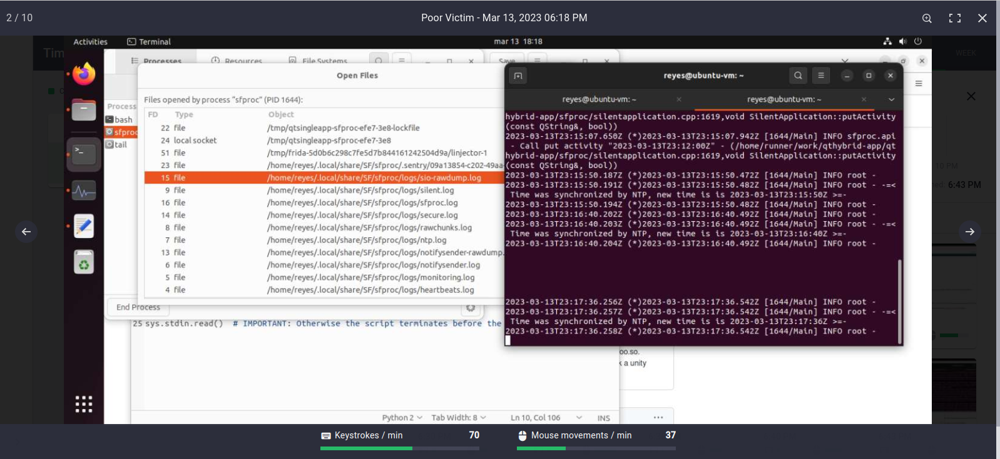

This is from my own TimeDoctor dashboard. In case you are wondering, the two green bars at the bottom treat 120 as the maximum (100% value). That's 2 activities per second, *sustained over the entire time*. Isn't that a bit too much, people? Or are you (as a monitored user) supposed to have fairly low fill percentages here, with 100% full bars acting as an indicator of possible synthetic activity (mouse jigglers, automatic key pressers)? I have no idea, and the TimeDoctor docs don't seem to explain that.

Going back to the JSON object, the final (and juiciest) fields are `image` and `thumbnail.image`. They are really long strings, long enough to hold a bunch of binary data. JSON can't transport binary data that well, and those fields smell like Base64, with the numbers, letters and slashes. Also, anecdotically (you can't see it) I saw that some of those strings end with one or two equals signs (=), which usually screams Base64 padding.

Furthermore, I happen to know that seeing a string that starts with `/9j/` is usually a dead giveaway of a Base64-encoded JPEG file. That just happens to be that the JPEG "magic number" encodes to. By the way, if you see `iVBORw0K`, that's a PNG file instead. Let's copy that huge string and paste it into [Cyberchef](https://gchq.github.io/CyberChef), see what it makes of it:

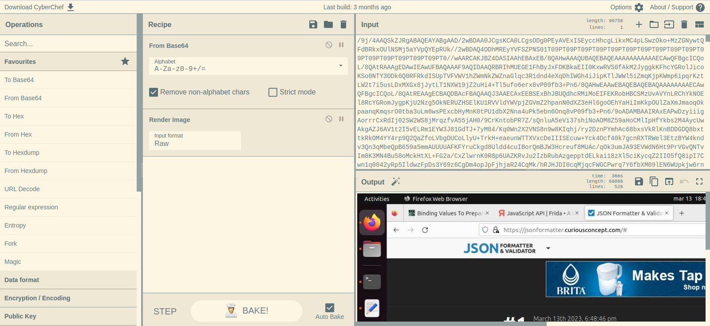

Well, the "magic wand" that sometimes pops up in the Output header did pop up. it correctly identified a Base64-encoded image, and now renders it. Also, that is definitely my screen. It's definitely not blurred.

Let's try that again with the thumbnail, just to see that happens:

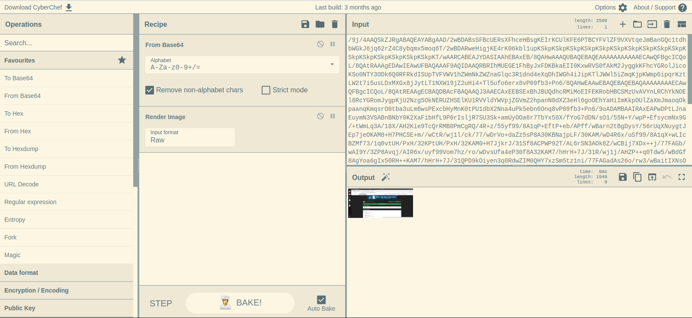

That's a tiny image. Everything checks out. All is well. That saves an image to the database directly into a table column, ready for another process to come and send it to the mothership.

## Step the Third: Logging the Lines

Now that we have access to all the information that TimeDoctor sends to its servers, we can modify the Python script to save them. This will enable us to later parse and consume the logs and create our own dashboards. We'll try to recreate TimeDoctor's own dashboards, with the advantage of not requiring access to the web UI. This will enable us to *identify areas of improvement* in our time management.

Doing so is quite easy. We'll start by logging everything more or less as it comes from the Frida script, as JSON objects, into a file. Later we'll see if that information is enough or if we should change its format. For example, we could make "transactions" out of data, that start when one of the `prepare` function calls happen, then collect information from the `bind` calls, and only emit a log record on the first `step` call. However, that now requires making the message processing stateful (since we now have a state machine like this):

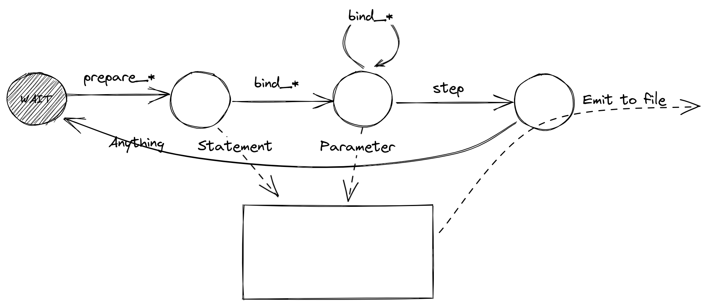

We would start on a WAIT state. On receiving a `prepare`-type message, we record the SQL statement into a temporary location. Then, for any received `bind` messages, we record the index of the parameter and its value. We keep doing that until we receive a `step` statement. When we do, we emit the temporary object as a log record, which would now hold both the SQL statement and its bound parameters. This would be really neat, but it adds complexity to the Python script, and anyways we also want to test the used log management tool to see how it copes with having to join multiple log entries into a single, coherent event.

That being said, here's the final Python script, that writes logs into a file as they come in from the Frida interceptors:

```python
import json
import sys
import logging
import time
from logging.handlers import RotatingFileHandler

import frida
from pythonjsonlogger import jsonlogger

logger = logging.getLogger()
logger.setLevel(logging.DEBUG)

stdout_handler = logging.StreamHandler()
file_handler = RotatingFileHandler('/var/log/spy.log', maxBytes=1*1024*1024, backupCount=3)
formatter = jsonlogger.JsonFormatter(timestamp=True)
stdout_handler.setFormatter(formatter)
file_handler.setFormatter(formatter)
logger.addHandler(stdout_handler)
logger.addHandler(file_handler)

def on_message(message, _data):
    payload = json.loads(message["payload"])
    # print("[on_message] message:", payload)
    logger.info("on_message", extra=payload)

session = frida.attach("sfproc") # Hook into the program

logger.debug("starting")
script = session.create_script("""
const mod = Process.findModuleByName("/opt/sfproc/SF/sfproc/3.6.43/plugins/sqldrivers/libqsqlcipher.so");
const msg = (data) => send(JSON.stringify(data));
Interceptor.attach(mod.getExportByName("sqlite3_prepare_v2"), {
    onEnter(args) { msg({func: "sqlite3_prepare16_v2", stmt: args[1].readUtf8String()}); }
});
Interceptor.attach(mod.getExportByName("sqlite3_prepare16_v2"), {
    onEnter(args) { msg({func: "sqlite3_prepare16_v2", stmt: args[1].readUtf16String()}); }
});
Interceptor.attach(mod.getExportByName("sqlite3_bind_int"), {
    onEnter(args) { msg({func: "sqlite3_bind_int", type: "bind_stmt", "index": args[1].toInt32(), value: args[2].toInt32()}); }
});
Interceptor.attach(mod.getExportByName("sqlite3_bind_text"), {
    onEnter(args) { msg({func: "sqlite3_bind_text", type: "bind_stmt", "index": args[1].toInt32(), value: args[2].readUtf8String()}); }
});
Interceptor.attach(mod.getExportByName("sqlite3_bind_text16"), {
    onEnter(args) { msg({func: "sqlite3_bind_text16", type: "bind_stmt", "index": args[1].toInt32(), value: args[2].readUtf16String()}); }
});
Interceptor.attach(mod.getExportByName("sqlite3_step"), {
    onEnter(args) { msg({func: "sqlite3_step"}); }
});
""")
script.on("message", on_message)
script.load()
logger.debug("script_loaded")

# IMPORTANT: Otherwise the script terminates before the messages are received
while True:
    time.sleep(1)
```

This writes to standard output and also to a file. The file is called `spy.log`, and it has size-based rotation. Any decent log ingestion tool should cope with the file being rotated.

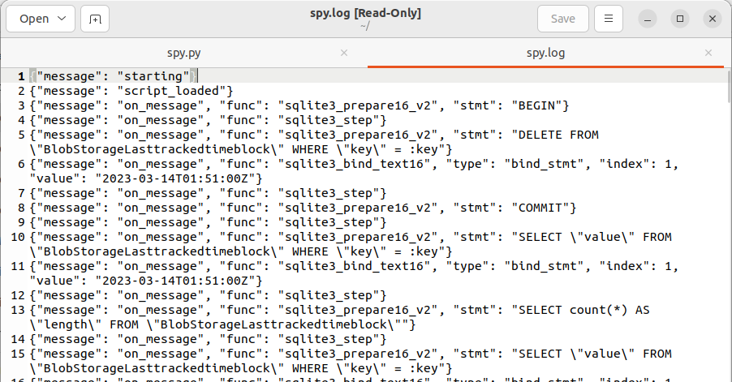

Yes, logs look fine. Time to ingest, parse and process them!

*Editor's note: The post continued here, but it has been split into a separate post because this one has already run far too long. Expect a new post in a few days. There, we'll cover ingesting the logs into a dedicated system, parsing them, analyzing them and building visualizations to mimic TimeDoctor's web UI.*

In case you missed the link, the code for this section (i.e., the Python script) is published in [this gist](https://gist.github.com/jreyesr/9a5c69956fdf1273956aedaeb81935e3).

## Discussion and insights

* TimeDoctor appears to capture data in two steps. First, activity reports and screenshots are put into a SQLite database, as an opaque string that contains a JSON-encoded object. Then (presumably) another thread or execution unit reads the saved reports, sends them to the TimeDoctor backend, and finally deletes them from the DB.
* TimeDoctor tracks activity and used apps in 3-minute chunks, which they call "timeblocks". The interval between screenshots is configured by the company admins.
* TimeDoctor has visibility in the URLs visited by the user, the application that had focus and its window title. This information is tracked and reported with second-level precision.
* TimeDoctor somehow tracks "fake activity". I haven't seen any indication of this metric in the web application. Maybe it's simply subtracted from the actual metrics before they are sent?
* Firefox seems immune to URL monitoring! That's a really weird thing. If true, and assuming the ~~spymaster~~ administrator has set not-too-frequent screenshots, that creates a really big blind spot in TimeDoctor's monitoring capabilities. In effect, while you are in Firefox and a screenshot is not taken, TimeDoctor sees nothing apart from "user was in Firefox". Bad spy!

## Recap

* We've taken a tour over TimeDoctor's web interface, probably used by Managers & Co. to monitor your performance, activity and app usage.
* We've seen how you can write a simple C application that links to the SQLite library and executes SELECT queries, as a prelude to the next part.
* We've reviewed Frida: what it is, how is it used, why would you want it.
* We've applied Frida to our previously-developed test app, and we've managed to successfully intercept every SQL statement that it makes. From them, we've obtained access to the raw SQL strings and, in the case of prepared statements, to their parameters too.
* We've used what we learned to monitor TimeDoctor's execution, this time in a hostile environment (i.e., zero knowledge about the application, no source code access, no way to get it, plus the constraint of not altering the normal execution of the program, since that could attract the fearsome Wrath from Above)
* We've obtained access to all of TimeDoctor's SQL statements too!

What's left?

* We'll do something with the logged data. Writing it to a file is not useful by itself. I started writing that section, but this article is already *really* long, and I have many things that I want to do. As a very quick summary, we'll explore [Gravwell](https://www.gravwell.io/) to analyze the logs.
* We'll intercept TimeDoctor's API calls. Snooping on what is writes to a DB is good and all, but it could send things to the mothership without ever writing them to a DB. In the next article, we'll review a way of [MITMing](https://en.wikipedia.org/wiki/Man-in-the-middle_attack) the connection, which is not so easy since it's protected with TLS.

## Addendum: Why you no like TimeDoctor?

_Author's/editor's/illustrator's/reviewer's/publisher's note: This section may be skipped with no detriment to the understanding of the rest of the covered material. Its purpose is (hopefully) to raise some awareness about activity monitoring tools such as the one covered in this article. As such, it will take a tone more befitting of an opinion article, rather than a writeup/tutorial/technical document._

An attentive reader may have noticed that I don't quite like TimeDoctor and its ilk. If you hadn't noticed, now you know.

As for the Why, I'll refer everyone interested to the EFF article [Inside the Invasive, Secretive "Bossware" Tracking Workers](https://www.eff.org/deeplinks/2020/06/inside-invasive-secretive-bossware-tracking-workers), dated June 2020 (at the height of the first wave of the COVID-19 pandemic, for the distracted historian). Go read it. All of it. Slowly. It's better than anything that I could write. Here are some choice quotes of it (also, biased quotes, since I chose them):

> While aimed at helping employers, bossware puts workers’ privacy and security at risk by logging every click and keystroke, covertly gathering information for lawsuits, and using other spying features that go far beyond what is necessary and proportionate to manage a workforce.

> In either case, it can often be unclear to the user what data, exactly, is being collected, without specific requests to their employer or careful scrutiny of the software itself.

> The majority of companies that build visible monitoring software also make products that try to hide themselves from the people they’re monitoring.

> At a technical level, these products are indistinguishable from [stalkerware](https://www.youtube.com/watch?v=xzWFrHHTrs8).

> [...] For some workers, the company laptop they use is their only computer, so company monitoring is ever-present. There is great potential for misuse of this software by employers, school officials, and intimate partners. And the victims may never know that they are subject to such monitoring.

>But an employer should not undertake any monitoring for such security purposes unless they can show it is necessary, proportionate, and specific to the problems it’s trying to solve.

> Perhaps the largest class of products we looked at are designed for “productivity monitoring” or enhanced time tracking—that is, recording everything that workers do to make sure they’re working hard enough.

> None of these use cases, even the less-disturbing ones discussed above, warrant the amount of information that bossware usually collects. And nothing justifies hiding the fact that the surveillance is happening at all.

> Let’s be clear: this software is specifically designed to help employers read workers’ private messages without their knowledge or consent. By any measure, this is unnecessary and unethical.

> Bossware often incentivizes the wrong kinds of productivity—for example, forcing people to jiggle their mouse and type every few minutes instead of reading or pausing to think.

> Constant monitoring can stifle creativity, diminish trust, and contribute to burnout. If employers are concerned about data security, they should consider tools that are specifically tailored to real threats, and which minimize the personal data caught up in the process.

These quotes are all [CC BY 3.0 US](https://creativecommons.org/licenses/by/3.0/us/).

Enough? No? Then go read the full article, there's a lot more where that came from. The best (actually, least bad) that the authors have to say about such products is that "Some use cases may be valid: for example, companies that deal with sensitive data often have legal obligations to make sure data isn’t leaked or stolen from company computers. For off-site workers, this may necessitate a certain level of on-device monitoring." And that's not even close to a glowing applause, more like a grumbling admission of necessity, under certain *very specific* cases. And in the conclusions, they recommend to find other ways to deal with *even* those cases.

This post (the page that you are on, not the EFF article that we're discussing) takes aim at the most pernicious variant of the family: the silent, unstoppable, ever-watching variant. With "interactive"/UI based tools, employees can at least (sometimes) get an idea of the data that is being reported. With silent tools, unless the employee is granted access to the web UI (and, as the EFF article states, sometimes even that interface provides a worker with less information *about themselves* than that a manager would see), he has no way of even knowing what the tool is saying. Until the quarterly performance review comes, that is. The line about "Constant monitoring can stifle creativity, diminish trust, and contribute to burnout" is doubly true for tools where you can't even see what is being said about you. That's eerily similar to the [panopticon concept](https://en.wikipedia.org/wiki/Panopticon). Read the second paragraph of that article, then compare with a silent installation of a time tracker. This post (again, this page) and its associated code effectively puts a mirror inside the spy telescope of the app, so that the spied-on subject can see what is being seen about him. For whatever that's worth.

So, to summarize:

* The EFF thinks that this kind of applications "puts workers’ privacy and security at risk by logging every click and keystroke, covertly gathering information for lawsuits, and using other spying features that go far beyond what is necessary and proportionate to manage a workforce."
* I happen to agree[^a]. Completely.
* Such tools are, at best, inefficient trackers of proxy metrics for productivity. At worst, for certain more "creative" tasks, they may diminish it due to the loss of trust (and, therefore, motivation) that may follow from knowing (or not-knowing) the extent of data collected. Bonus worseness points if the collected data is used for promotions and layoffs. We haven't even gone into the adversarial mindset that pervades such an app: "your workers are probably slacking, you need to install this so you know" is the subtext of at least half of the functionality. The other half is self-knowledge and self-optimization stuff, but a web browser that has "only" half of its executable dedicated to ransomware is still ransomware.
* On a more technical level: How can you ensure that the program is only capturing what it states it captures? You're essentially installing a spyware-capable app, and then trusting that what it shows you is all that it collects. If you set it to take screenshots every 15 minutes instead of 3, how can you ensure that it really reduces its capture rate, as opposed to keeping the capture rate equal, sending the same amount of screenshots, and then discarding 4 of every 5 screenshots at the server... or keeping them and only showing you 1 of every 5, perhaps with a custom "Advanced Data Reconstruction" package (for some extra $$$) that can reveal all the previously-hidden screenshots, retroactively, during a wrongful-termination suit? If you set it to not capture URLs, only window titles, how do you verify that it stops collecting them altogether, as opposed to dropping them before writing to the server's database... or not? How can you know that it doesn't collect every individual key pressed with its timestamp and sends that to the server, and you only see the counts grouped by 3-minute blocks? With this post's solution, you (sort-of) can. We'll get total visibility when we intercept its network calls, in the following (planned) post.
* Even if you are sure that right now it doesn't do anything nefarious, what if the next patch version does? Perhaps scoped to a specific company (yours)? It's not enough to statically analyze a binary and declare it clean. You need continuous analysis of such a tool. It doesn't even get the benefit of the doubt that would come from being open-source and from a well-reputed, well-meaning organization: these tools come straight from the gray area between clean, non-problematic task-management tools such as Trello, Asana or Jira, and straight-up stalkerware/RATs.

Got it? It reminds me of a similar pattern in car insurance: [usage-based insurance, AKA telematics](https://web.archive.org/web/20210309094132/https://www.forbes.com/advisor/car-insurance/telematics-data-privacy/)[^b], which trades access to your car's telemetry (geolocation, times of use, patterns of acceleration and braking) for (possibly) lower insurance rates. The idea is "trade some more data for this potential benefit" (respectively, evidence for a promotion and lower insurance rates), without mention of the expected rate of return nor the downsides (resp., layoffs and higher rates/data sold to marketers) nor acknowledgment of the fact that it's yet more monitoring... on top of Google's, Meta's, your ISP's, your government's, many websites that you visit, and everyone else, apparently.

So, in conclusion, such tools trade a benefit with no measurable rate of return against an actual, permanent, measurable, disproportionate loss of privacy. And the amount of data collected by these tools is such that I could understand opposing it in principle, without even looking at the potential upsides. While this post presents no solution to the data-collection (that's a problem with a social solution, not technical), it at least provides visibility into it. And when you're doing hidden data-collection things, visibility is spooky.

Bonus: While preparing this article for publishing, I came across [this delightful piece of satire](https://www.scu.edu/ethics/internet-ethics-blog/bossware-an-introduction/) (at least, I assume that it's satire). Read it too. It's really fun. It's a glorious exercise in the old technique of "Fine, we'll take it seriously, see how you like it". Is that *reductio ad absurdum*? Probably not exactly, since that ends in a logical absurdity, as opposed to just a gut reaction, but it's close.


[^a]: This should not be construed by an endorsement, by the author, of anything else the EFF says or supports. The scope of the author's agreement is limited to the article linked.
[^b]: This article is written from a US-centric point of view, as evidenced by the massive focus on lawsuits. Civil lawsuits, criminal lawsuits, all the lawsuits. About everything. I'm not sure how prevalent such "usage-based insurance" is in the other 95.8078% of the world (by population). That being said, many of the arguments are independent of location and, if anything, the lack of lawsuits to defend against should reduce the value proposition of activity monitoring tools.

