## Introduction

This post is a continuation of the post [Spying the Spy, Part Two: Exploring Logs](https://jreyesr.github.io/posts/spying-the-spy-part-two/). In that post, we used [Gravwell](https://www.gravwell.io/) to index the logs that our Frida script generates, and we performed several random tasks to see how well Gravwell handled them. TL;DR: Fairly good, some more exotic functionalities were not there, the processing model already does a lot and should be extendable into a very powerful system.  

We then intended to explore [MITMing](https://en.wikipedia.org/wiki/Man-in-the-middle_attack) the connection through which TimeDoctor exfiltrates all its reports back to The Cloud. The post had already run fairly long, so I made the editorial decision to cut it short and publish already. This post will contain that, plus an extra: intercepting a Qt library with Frida, since I couldn't find anything about that in the Internet and it has some interesting and useful parts that may be of use to other people attempting reverse engineering for desktop apps.  

We'll do the MITM part through a TLS-intercepting proxy ([PolarProxy](https://www.netresec.com/?page=PolarProxy)). This will give us some unparalleled visibility into the information that TimeDoctor transmits about our activities, as well as serve as a general instruction list on how to intercept TLS-protected communications, which is used by nearly every tool out there, even those that we really want to poke into, and [a growing amount of malware](https://nakedsecurity.sophos.com/2020/02/18/malware-and-https-a-growing-love-affair/). Then again, if your job is to analyze malware communications, I hope you're not taking advice from a random Github Pages-hosted blog out there in the Internet.

## Step the Fifth: Intercepting network calls

### PolarProxy

[PolarProxy](https://www.netresec.com/?page=PolarProxy), by [Netresec](https://www.netresec.com/), describes itself as "a transparent TLS proxy created for incident responders and malware researchers". When configured for one of its operation modes, called "Transparent Forward Proxy", PolarProxy splits your normal TLS connection in two, talks to the target application as if it were the server, and talks to the server as if it were the client. In the meantime, it forwards everything (decrypted) to a file or a Wireshark process, where you can analyze it to your heart's content.  

### Interlude: What is MITM?

Doing so does require that you somehow convince the client (target application) to accept PolarProxy's TLS certificate. Normal TLS protections still apply: the application will expect a certificate and try to verify it, PolarProxy won't be able to generate a valid certificate for that domain that chains back to a valid root of trust, and therefore (if the application properly validates certs) it won't accept it. This, by the way, is a very short description on the [Internet's PKI](https://www.enisa.europa.eu/topics/incident-response/glossary/public-key-infrastructure-pki), which (hopefully) prevents anyone from generating a valid HTTPS certificate for `google.com` and then listening as you access your Gmail account. Thus, you need to insert PolarProxy's root cert in your device's trust store, so that PolarProxy's certificates now check out as being signed by a valid CA. For desktop applications that are not Java, you can usually leverage the OS's trust store. For Java applications, you may need to edit Java's keystore or (if you aren't lucky) the application's dedicated keystore. For mobile applications, you can probably use the device's certificate store, but many mobile applications [employ certificate pinning](https://dzone.com/refcardz/securing-mobile-applications-with-cert-pinning) and thus you will have more trouble.  

See below for a valid, happy, normal HTTPS transaction:

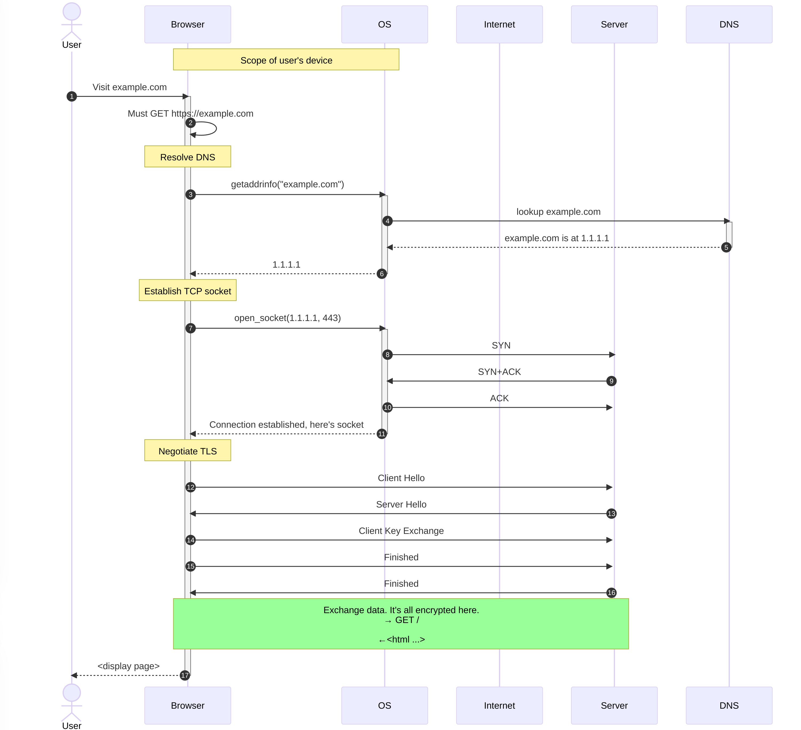

1. The user requests `example.com`  
2. The browser resolves the IP address used by `example.com`. It may defer to the OS, or several browsers now resolve DNS by themselves with a user-configurable server, and maybe [DoH](https://developers.cloudflare.com/1.1.1.1/encryption/dns-over-https/).  
3. The browser opens a TCP socket to the IP address and port 443, and performs the SYN/ACK dance.  
4. Then, TLS negotiation takes over.  
5. The browser and server exchange TLS messages with random numbers, the certificate, cipher specs, some keys and other assorted information.  
6. In the end, the browser and server agree on a shared key that is used to encrypt the rest of the connection.  
7. Standard HTTP communications occur, wrapped and cozy in the safety of TLS.  
8. Once the browser has the HTML and any resources, it displays the page to the user.  

Note that, if all goes well, no one at any point after the browser and before the TLS-terminating point (it may be the webserver itself, a reverse proxy right in front of it or a dedicated security appliance such as a Web Application Firewall or firewall with TLS ofloading) can inspect the contents of the HTTP requests. Not even an attacker with full packet-capture capabilities in the user's device. Granted, such an attacker may have root, which would enable him to replace the user's browser with a modified version that logs all requests that it makes, but that is beside the point. Since we want to analyze TimeDoctor's requests, we are in that position: we can log every packet that leaves the `sfproc` process, but by that point they are already encrypted. We need to cause a break in the encryption.  

That's what a TLS-intercepting proxy like PolarProxy does. If you manage to convince the application to talk to your proxy, the flow is now different:

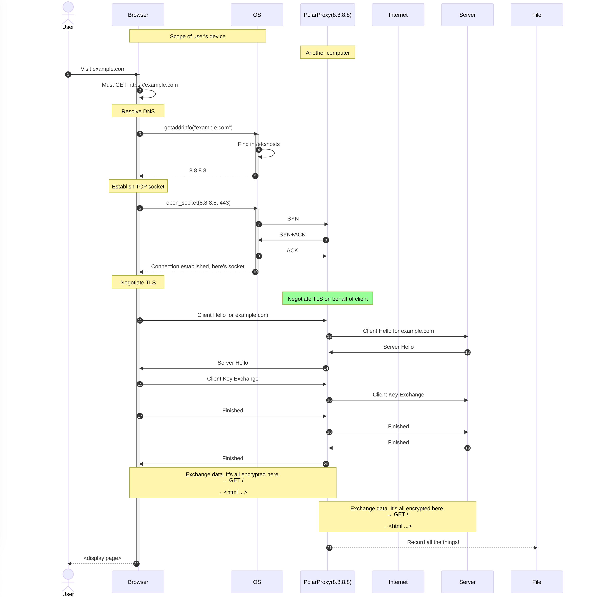

From the point of view of the target application (here, a browser), the only difference is that the CA for the website's certificate has changed. Now it chains back to the PolarProxy CA, which allows PolarProxy to decrypt the messages, and relay all communications between the application and the server, logging a copy of everything for itself in the meantime. Here's the updated flow:  

1. The user requests `example.com`  
2. The browser resolves the IP address used by `example.com`. We need the application to defer resolution to the OS, which means that web browsers may cause problems, but standard compiled applications shouldn't.  
3. However, here we have meddled with `/etc/hosts` (in Ubuntu) so the domain resolves to the IP of another computer in the same LAN, which is running PolarProxy.  
4. The browser opens a TCP socket to the interceptor's address and port 443, and performs the SYN/ACK dance.  
5. Then, TLS negotiation takes over.  
6. The browser and proxy exchange TLS messages with random numbers, the certificate, cipher specs, some keys and other assorted information.  
7. Simultaneously, the proxy and actual server exchange TLS messages with another set of random numbers, certificate and other information.  
8. In the end, the browser and proxy agree on a shared key that is used to encrypt the rest of the connection. At the same time, the proxy and actual server agree on a (different!) shared key.  
9. Standard HTTP communications occur, wrapped and cozy in the safety of TLS. They happen in two different steps, one between the client and proxy, and another between the proxy and server.  
10. Once the browser has the HTML and any resources, it displays the page to the user.  
11. While the proxy does the decrypt-reencrypt part, it simultaneously forwards every packet to another destination. It can be a `.pcap` file, or a Unix pipe that goes to a Wireshark process, or another packet database such as [Arkime](https://arkime.com/).  

Note that at step 6, the proxy can only present a bogus certificate. If it could present a true certificate for `example.com`, the entire Internet would be at risk. Step 7 will have a correct certificate, but that is not a problem, we control the proxy and could configure it to ignore invalid certificates. However, the client will see an invalid certificate and, if we're analyzing an application that we have no control over, we won't be able to configure it to accept an invalid certificate. Hence, as we'll see later, we need to mess with the CA store that the application refers to.

### Back to PolarProxy

You can install PolarProxy as a system service, but for casual use it's enough to download it and run it manually whenever it's needed:  

```bash
# INTERCEPTOR MACHINE
cd ~/PolarProxy/  
curl https://www.netresec.com/?download=PolarProxy | tar -xzf -  
sudo ./PolarProxy -v -p 443,80 --certhttp 10081 -w - | wireshark -k -i -
```

This will download PolarProxy to a directory, then start it and pipe its output to Wireshark, so that we can see the packets as they come in.  

Note that, if you close Wireshark, you'll lose your data. If you want to keep a session's data, make sure to save it in Wireshark (to a PCAP file) before quitting it or pressing `Ctrl+C` on the terminal session.  

We also pass a command line flag (`--certhttp`) to start the certificate server on port 10081. If you visit that address on a web browser (or using `curl`, `wget` or whatever), it will respond with a `.cer` file. That file is required so that the monitored machine will trust PolarProxy's certificates.

### Victim machine

First, we need to identiy the IP of the interceptor machine, as seen from the victim machine. Since I had TimeDoctor installed in a VirtualBox VM, I installed PolarProxy in my host machine. The VM had the standard networking setup, i.e. a single network adapter, configured for [NAT](https://www.virtualbox.org/manual/ch06.html#network_nat).  

NAT is good enough if the VM just needs to access the Internet, but not other VMs. In this mode, the VM is assigned an address in the network `10.0.2.0`, and any outgoing packets get intercepted at the hypervisor and rewritten so they look like they come from the host. Reply packets are intercepted again, rewritten so the VM isn't aware of any shenanigans and routed to the correct VM based on the port that the hypervisor assigned when the packet was coming out.  

Also, in NAT mode, the VM has acess to the host's loopback (`127.0.0.1`) address, which is presented as `10.0.2.2`. This means that, if in your normal, non-virtualized world, you can access a service in `127.0.0.1:8080`, the VM will also have access to it, in `10.0.2.2:8080`. This is only valid for the host machine, and not for any others that share the same LAN. Since we have PolarProxy running on the host, we can access it from the VM. This will be used below, to get the CA cert and modify the routes. If you were intercepting an application on a non-virtualized device, you would need two computers, and you'd use the LAN address of the interceptor machine in the victim machine any time that these instructions use `10.0.2.2`. At least with the `/etc/hosts` changes that we have made, you cannot run the proxy and victim application on the same device. PolarProxy still needs to reach out to the real server, and if you ran both applications in the same device it wouldn't be able to: it would try to loop back to itself, which is not good (obviously).

Then, on the client/victim machine (the one that has TimeDoctor installed), we run the following:

```bash
# VICTIM MACHINE
wget -O polarproxy.cer http://10.0.2.2:10081
sudo openssl x509 -inform der -outform pem -in polarproxy.cer -out polarproxy.crt
sudo mv polarproxy.crt /usr/local/share/ca-certificates
sudo update-ca-certificates
```

It should display "1 added". These commands fetch and install the root CA certificate of PolarProxy, essentially enabling PolarProxy to MITM any server on that machine (as long as the application doesn't use any form of certificate pinning or its own CA list, à la Java. TimeDoctor, thankfully, is vulnerable.  

The next step is to redirect some traffic for the victim machine through PolarProxy. The easiest way to do so is to add an entry to the HOSTS file of the victim, redirecting the desired domain(s) to the machine that is running PolarProxy. This presents a difficulty, though. What is the domain to which TimeDoctor sends its data?

### What domains does TD connect to?

There are multiple ways of finding the domains that an application connects to. Here we'll study a few.  

One way is to try to find it in the documentation. Some tools (especially those intended for more "corporate" use) have a page in their help docs that lists the IPs or domains that they connect to. This is because corporate firewalls may be heavily locked down, so that navigation to a specific domain requires approval. Thus, tools need to provide a stable list of Internet locations that are expected. TimeDoctor does. The magic Google search string (for me) was `timedoctor firewall rules`, but YMMV. Use your best Google-fu abilities if in a similar situation.


And, indeed, that's the first hit. That takes us to [this article](https://support2.timedoctor.com/knowledge/how-to-allow-time-doctor-through-your-corporate-firewall), which lists the domains for both interactive and silent versions of the app. That's weird, they need different resources. Whatever. Near the end, we find the magic domain: `td2-desktop-api.timedoctor.com`. That's required "To allow our app to communicate with our server", which seems promising. The other servers required for the silent version are several NTP servers (does TimeDoctor override your machine's clock? Maybe to ensure that you don't tamper with it, and log hours somewhen else?), a [Sentry](https://sentry.io/) endpoint (presumably for aggregating exceptions) and both the [AWS S3](https://aws.amazon.com/s3/) and [Google Cloud Storage](https://cloud.google.com/storage/) domains for updates, screenshots and videos. Why both? Do they load-balance? So many questions...  

Anyways, by a bit of Googling, we now are fairly certain that we need to intercept `td2-desktop-api.timedoctor.com`.  

Here's another method, in case the first one did not yield any results. Search the application's logs for things that look like URLs. If you are lucky, you'll find some API endpoints, from which you can extract the domain that hosts the API.  

In the case of TimeDoctor, simply looking through the logs didn't yield anything. In case you missed [the previous article](https://jreyesr.github.io/posts/spying-the-spy-part-two/), we can find where TimeDoctor stores its logs by looking for it in Ubuntu's System Monitor, then right-clicking the process named `sfproc`, and then choosing the `Open Files` option:

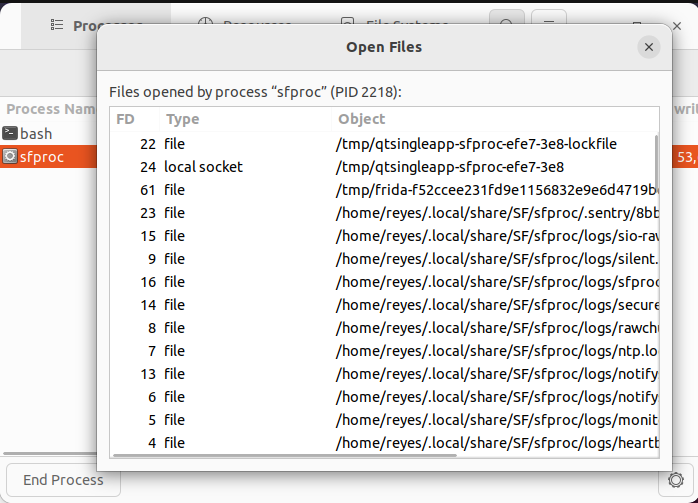

That tells us that TimeDoctor's logs are in `~/.local/share/SF/sfproc/logs`. There are about ten files there, but none that immediately list domains. I got tired of looking and then used the nuclear option:  

```bash
grep -R "https" ~/.local/share/SF/sfproc/logs/*
```

And that did return results! Some of them are from the URLs that TimeDoctor spies from the user (such as the Frida logs below), but others are indeed TimeDoctor's own logs:

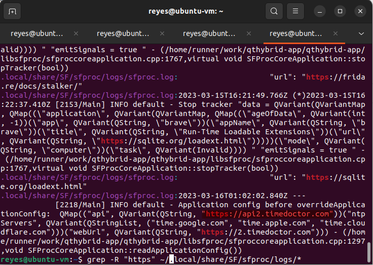

That last entry from `sfproc.log` tells us that the `api` URL is `https://api2.timedoctor.com`. Weird. That doesn't coincide with what we saw before. And those two domains don't resolve to the same IP, so they are not aliases. Let's keep that in mind. In case of doubts, we'll just intercept both.  

Finally, here's a more brute-force method, which should work even on non-cooperative apps. Install [Wireshark](https://www.wireshark.org/) on the victim machine, start it, start a capture on all interfaces (the VM only has one, so it's easy), and then trigger a DNS cache flush with `sudo resolvectl flush-caches` and wait. That should force the application to make all its DNS lookups again, at which point (since DNS is many times not encrypted, despite the valiant efforts of everyone working in [DNS encryption](https://blog.cloudflare.com/dns-encryption-explained/)) you'll be able to capture the queries. Here's what that looks like, on Wireshark with the `dns.flags.response == 0` filter (which only displays queries, not answers):

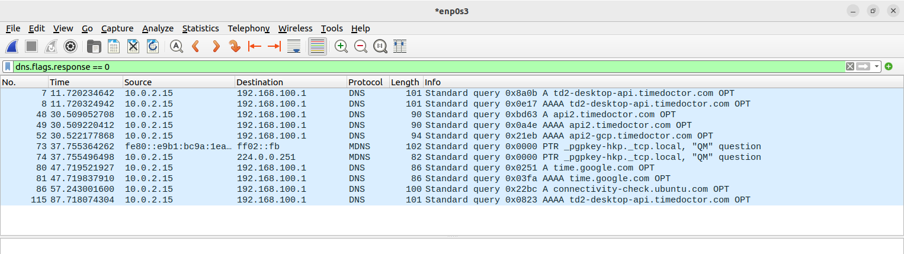

Well, that's interesting. It requests both! Also, it queries both for IPv4 and IPv6 records. That settles it. We'll just capture both domains. Better safe than sorry.  

In conclusion: by using three different methods, we have established that we should intercept the domains `td2-desktop-api.timedoctor.com` and `api2.timedoctor.com`. Now, back to configuring PolarProxy. We left at the point where you add an entry to the HOSTS file (in the victim machine) for each intercepted domain, so that you can redirect them to the proxy that waits with open arms.  

### Redirecting traffic

We'll run `sudo nano /etc/hosts`, and add the following lines:

```
10.0.2.2 td2-desktop-api.timedoctor.com
10.0.2.2 api2.timedoctor.com
```

Then, for good luck, we'll restart the VM. Why not?  

While the VM restarts, it's a good time to check that PolarProxy is running on the host. Once it does restart, it's time to check on the Terminal window from which PolarProxy was running, and see if it's seeing any activity:

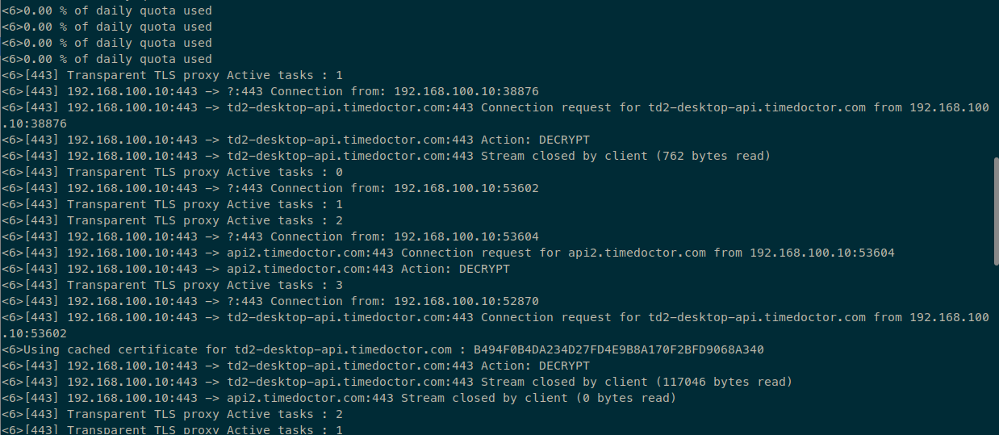

Yes! It's seeing activity, for both domains. What about the Wireshark window that is receiving all traffic?

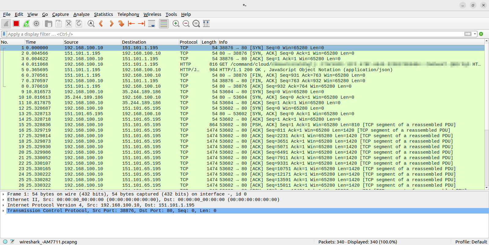

Again, there are captured packets. Interestingly, the packets are logged at the TCP-level, even with the [TCP handshake](https://developer.mozilla.org/en-US/docs/Glossary/TCP_handshake) (that's the three packets at the start, by the way). We aren't working at that layer, we're only concerned with HTTP messages, so we'll apply the `http` filter to Wireshark:

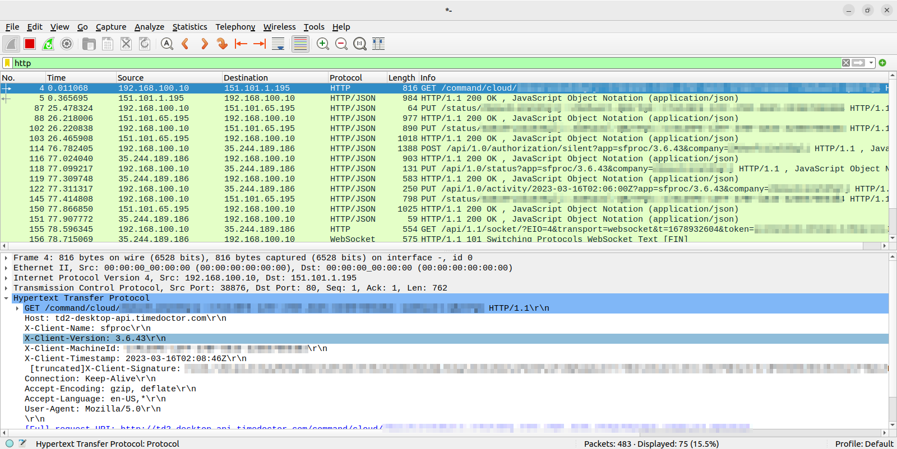

Much better. I've blurred the Company ID and Machine ID, since I0m not sure if those can be used for something nefarious. One would expect not, but who knows. Just in case, The Blur shall be applied.  

Now, what do we see?

* GET https://td2-desktop-api.timedoctor.com/command/cloud/COMPANYID::MACHINEID::AUTHID  
  * This call repeats every 60 seconds.  
  * In the URL, sends a company ID, machine ID and auth ID. No idea what the auth ID is, but it's referenced in several requests. It appears to be somewhat like an User ID, since a user can have multiple Machines.  
  * Headers contain the TimeDoctor version, machine ID (again), timestamp and a "client signature", which is a bunch of something that looks like Base64 but it doesn't decode to text. May be a binary signature... over something.  
  * It has no body (because it's a GET request)  
  * The response is a small JSON, with almost no information.
* PUT https://td2-desktop-api.timedoctor.com/status/COMPANYID::AUTHID::MACHINEID  
  * The request happens at irregular intervals.
  * In the URL, sends a company ID, auth ID and machine ID. The latter two are swapped from the previous request.
  * The headers are the same.
  * The body, this time, contains a ton of information:  
    * The user ID, machine ID and auth ID, again  
    * Arrays of the last logs, each with a file, line, logging level, timestamp and message. These are the same logs that can be seen in the logfiles, but they also ship them to the mothership. That's a lot of logs. There are multiple arrays, that roughly match the files that exist in the log directory.  
    * Several timestamps.
    * The juicy bits, under the `monitoringProperties` key:  
      * A "current chunk" field, with exactly the same structure as the data that is inserted in the `BlobStorageTimeblocks` table in the SQLite database. Go read the [first article in this series](https://jreyesr.github.io/posts/spying-the-spy-part-one/#insert-or-replace-into-blobstoragetimeblockskeymodifiedatvalue-values-keymodifiedatvalue) if you missed it. That holds counts of keypresses, mouse clicks and mouse movements for the most recent 3-minute period, plus counts of the same metrics *by second*, plus apps used with time of start and end in seconds, and a URL if possible. This is 50% of the spying, right here. The other 50% are the screenshots. 
      * Whether screenshots are currently being blurred or not.  
      * Whether screen video recording is enabled or not.  
      * The screenshotting interval, with value 180000. Interpreting that as milliseconds yields 3 minutes, which is indeed the screenshot frequency that I configured in the web UI.  
      * A "work check interval", with value 900000. Interpreting that as milliseconds yields 15 minutes.  
    * "Session information", including CPU and memory usage. Why? That's not surfaced in the web app. Maybe to detect bugs where TimeDoctor starts hogging resources?  
    * An array of screens, each with its resolution.
    * Your locale: country, preferred encoding, language and timezone.  
    * Information about the network adapters: an array that holds name (e.g. `eth0`), assigned IPs (both IPv4 and IPv6) and MAC address. All of this for each network interface. It doesn't include the loopback address.  
    * OS information: CPU architecture (x86-64), OS type, name and version  
    * "Silent config" info, which was mostly empty in my capture.
    * Your username, full name (the one that is shown in the UI) and user ID/UID (typically 1000, if using a standard Ubuntu Desktop install)  
  * The API response holds no information.
* POST https://api2.timedoctor.com/api/1.0/authorization/silent  
  * The request happens at irregular intervals.
  * It sends the company ID by means of the query string.
  * Headers are the same as above.
  * The body has mostly the same information as the second request (just above), except the last logs and the juicy bits.  
  * The response holds the auth ID, a JWT, and a *ton* of information about the user and company. It seems like the same information that powers the Settings dialogs in the web dashboard.  
* PUT https://api2.timedoctor.com/api/1.0/status  
  * The request happens at irregular intervals  
  * It sends the company ID by means of the query string  
  * Headers are the same as above  
  * The body has a date, project ID and task ID. Those seem to be linked to the Interactive app, where you can choose "I'm now working on X" and start and stop your own time tracking. They are empty here.  
  * The response has no data.  
* PUT https://api2.timedoctor.com/api/1.0/activity/TIMESTAMP 
  * I could find no pattern in the request times, although it should happen once every 3 minutes
  * It sends the company ID by means of the query string
  * Headers are the same as above
  * The body has the same structure as the data that is inserted in the `BlobStorageTimeblocks` table in the SQLite database. Again, refer to [the first article](https://jreyesr.github.io/posts/spying-the-spy-part-one/#insert-or-replace-into-blobstoragetimeblockskeymodifiedatvalue-values-keymodifiedatvalue) if you missed it. There are no additional fields that we haven't seen in the Frida interceptor.
  * The response contains an ID, `mqId` and queue name. `mq` presumably means "message queue". That ID looks like the one that is used in the SQL statements to identify a timeblock. A quick Google search couldn't find any message queue solutions that assign IDs that look like that.
* There's a WebSockets call, with nothing interesting inside.  
* GET https://api2.timedoctor.com/api/1.1/files/screenshot/signed-url/TIMESTAMP/0  
  * It passes the timestamp and 0 (maybe the screen index?) in the URL  
  * It sends the company ID by means of the query string  
  * Headers are the same as above  
  * It has no more data, since it's a GET request  
  * The response has two URLs, for the full-size and thumbnail screenshots. Both have the prefix https://storage.googleapis.com/td2-backend-files/screenshot, and the URLs also hold the company ID, auth ID, machine ID, timestamp, and a signature. The URLs employ [Google Cloud Storage Signed URLs](https://cloud.google.com/storage/docs/access-control/signed-urls).  
* PUT https://api2.timedoctor.com/api/1.0/files/screenshot/TIMESTAMP/0  
  * It passes the timestamp and 0 (maybe the screen index?) in the URL  
  * It sends the company ID by means of the query string, and also the MIME type of the image  
  * Headers are the same as above  
  * The body is almost the same as the JSON documents saved in the `BlobStorageScreenshots` table (again, refer to the [first article](https://jreyesr.github.io/posts/spying-the-spy-part-one/#insert-or-replace-into-blobstoragescreenshotskeymodifiedatvalue-values-keymodifiedatvalue)), except that they don't contain the actual images as Base64. Hmmm. Maybe those are uploaded separately to Google Cloud? The TimeDoctor docs did hint at that. We'll have to check that later, by intercepting Google too!  
  * The response contains no data

The only new thing that surfaced was that we aren't getting visibility into the Google Cloud Storage uploads. That's easy enough to fix, we just need to add that domain to the HOSTS file and redirect it to the proxy too.  

After doing so, rebooting the VM and waiting for a screenshot upload, we indeed see PUT requests to Google Cloud Storage:

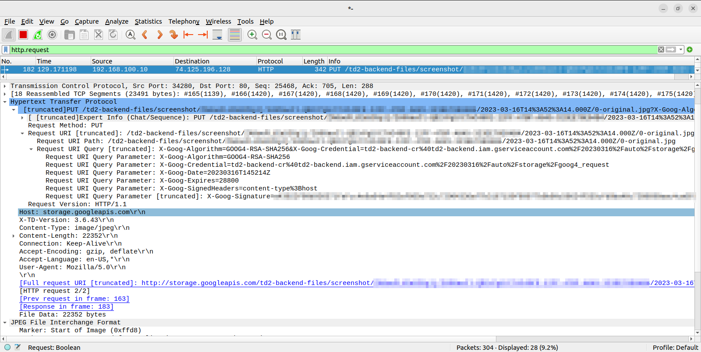

The blurred sections hold the company ID, auth ID and machine ID. That's a standard PUT request that uploads a file. Also, those requests come in pairs. The one shown is the "original" image, but just besides it there is another request that uploads the thumbnail. That tells us that the resize happens on the client, not on the server. The requests' bodies are valid JPEG images.  

All in all, we've seen the following data getting exported:  

* All the logs generated by TimeDoctor
* A bunch of device information: CPU data, OS data, current CPU and memory status, number and size of screens, network adapters, locale  
* User info: username, friendly name, UID  
* Activity tracking information: count and details of mouse and keyboard activity, with second-level granularity. App and URL that was focused, also second-level.  
* Screenshot info, which is directly uploaded to Google Cloud Storage, namespaced by company ID, user ID and machine ID.

Keep in mind that it may send information to other domains, which we haven't seen. The weakness of the proxy that we used is that it needs the monitored domains to be manually specified. There are ways to convince an entire device (or even an entire network) to redirect traffic to PolarProxy, but those are more complex to setup. That being said, what we have captured accounts for a very good percentage (if not all) of what is displayed to a Company Admin in TimeDoctor's web UI.  

Normally, at this point I'd attach a PCAP with a bunch of representative requests, so that anyone can download it and explore it. However, since it has data that looks like private-ish identifiers, I'll err on the side of caution and not do so. You'll have to make do with the descriptions and screenshots that have been provided above. I did look at tools to sanitize PCAP files up to L7 (HTTP), but sadly there appear to be none. There are several tools that only go up to L4 (TCP/UDP), and they replace MAC addresses, IP addresses and ports. That is already difficult enough, since you need to edit packets consistently, avoid introducing errors, remember the anonymized versions, and there's a lot ot fun involving special IP address ranges. The closest that I found is [TraceWrangler](https://www.tracewrangler.com/). If you have 45 minutes, go see [its presentation video](https://media.ccc.de/v/32c3-7294-sanitizing_pcaps) at Chaos Computer Congress 2015. It's a really instructive talk, and the author shows a lot of things that can (and will) go wrong whenever you attempt any sort of transformation. However, even that tool only suports DHCP as a L7 protocol. The author did say that he intended to support HTTP, but until now it's not available. In my case, HTTP sanitization is all that I need. MAC addresses are not even contained in the data, since they come from a machine-generated PCAP file and not from a real network capture. IP addresses are either public IPs or my machine's private IP address, which I'm honestly not concerned about. It *may* give away my ISP, if you know the ISPs that exist where I live and somehow know the LAN ranges that they assign. That's not risky. Any other IPs are public and not mine, so they don't matter. However, I found nothing, and I'm not about to start hand-editing the packets, especially after watching that talk and all the horrible traps that await you once you start messing with a L7 payload.

## Step the Sixth: Hook the TLS library used by the application

At this point we have visibility over all HTTPS requests made by the application, but only if we know the domain, since we have to add it to the `/etc/hosts` file to detour those requests into our proxy. What if the application communicates with unknown or dynamic domains? Sometimes it's better to intercept everything at once. We can do that by hooking whichever networking library the target application uses, since it will probably use it for all its networking needs. To do so, we'll bring out Frida again, since it worked so well [two articles ago](https://jreyesr.github.io/posts/spying-the-spy-part-one/).  

We know that TimeDoctor is a Qt-based application. We can list its modules (i.e., shared libraries) to find the networking library that it uses.

```js
$ sudo frida sfproc

[Local::sfproc ]-> Process.enumerateModules().map(x=>x.name)
[
    "sfproc",
    "libQt5Solutions_SingleApplication-head.so.1",
    "liblog4qt.so.1",
    "libcurl.so.4",
    ...,
    "libQt5Sql.so.5",
    "libQt5Network.so.5",
    "libQt5DBus.so.5",
    "libQt5Core.so.5",
    ...
]
```

There's the `libQt5Network.so.5` module. That sounds promising. Here is [its documentation page](https://doc.qt.io/qt-5/qtnetwork-index.html). From there, "Qt Network provides a set of APIs for programming applications that use TCP/IP. Operations such as requests, cookies, and sending data over HTTP are handled by various C++ classes." Also, that's a really, *really* sparse documentation site. It's barely more than a couple of links to guides and a link to the API reference, which while crucial for developing, is not of much help to someone new to Qt. Compare with, for example, its Python equivalent, `requests`: The second paragraph in [the documentation](https://requests.readthedocs.io/en/latest/) is already a code example. No idea if that is common across all of Qt.  

[This guide](https://doc.qt.io/qt-5/qtnetwork-programming.html#high-level-network-operations-for-http-and-ftp) is more useful. It links to the most important classes: `QNetworkRequest` and `QNetworkResponse` model the requests and responses, respectively. `QNetworkAccessManager` is the primary class, so that's our next stop. There, we finally find a code example:

```cpp
QNetworkAccessManager *manager = new QNetworkAccessManager(this);
connect(manager, &QNetworkAccessManager::finished,
        this, &MyClass::replyFinished);

manager->get(QNetworkRequest(QUrl("http://qt-project.org")));
```

So, apparently, you instantiate a `QNetworkAccessManager` and then call its `get()` method (or `post()`, or whatever) passing it a `QNetworkRequest`. Presumably, the return value is a `QNetworkResponse`. Let's try to match all that with our victim binary. Back to Frida!

```js
[Local::sfproc ]-> lib = Process.findModuleByName("libQt5Network.so.5")
{
    "base": "0x7f1d00c00000",
    "name": "libQt5Network.so.5",
    "path": "/opt/sfproc/SF/sfproc/3.6.43/lib/libQt5Network.so.5",
    "size": 3715072
}
[Local::sfproc ]-> lib.enumerateExports().map(x=>x.type+" "+x.name)
[
    "function _ZNK12QLocalSocket5stateEv",
    "function _ZN19QHttp2Configuration20setServerPushEnabledEb",
    "function _ZN15QNetworkRequest21setHttp2ConfigurationERK19QHttp2Configuration",
    "function _ZN14QHttpMultiPartD2Ev",
    "function _ZNK13QNetworkProxy12hasRawHeaderERK10QByteArray",
    ...
]
```

Well, that's interesting. The QtNetwork library does have a lot of exports, and their names are vaguely reminiscent of valid Qt functions, but they're surrounded in cruft. Why do they all start with `_ZN`? What's with the numbers? What does all that mean? In particular, let's take the third entry from the array above. It's a function called `_ZN15QNetworkRequest21setHttp2ConfigurationERK19QHttp2Configuration`. Nice name. That contains `QNetworkRequest` so hopefully it's related to that class. We'll use it as an example to understand everything else.

### Detour: How are C++ classes compiled down?

At this point, we've been working with TimeDoctor for three articles, and we're now quite sure that it has been built in C++. Not only does it use Qt, which is C++-focused, I also have found some log entries that do mention `.cpp` files. Those files are long gone, but they reveal the language of the original project.  

Now, C++ is a superset of C. That means that valid C code is also valid C++ code, but not the reverse. C++ introduces new constructs such as classes. Also, C code is fairly close to at least an "academic" assembler language (indeed, hand-translating C to assembler is as close to routine work as you'll ever get, and a common exercise in Computer Sciences degrees). Thus, the conceptual mapping between C and assembler is quite simple. For example, see below:

```c
#include <stdio.h>

typedef struct _Person { // 38 bytes each
    int  id_no; // assume 8 bytes on 64-bit arch
    char family[15]; // 15 bytes
    char given[15]; // 15 bytes
} Person;

void showPerson(Person *p)
{
    printf("%d ", p->id_no);
    printf("%s, %s\n", p->family, p->given);
}

void main()
{
    Person p = {.id_no = 123, .family = "Doe", .given = "John"};
    showPerson(&p);
}
```

The `p` object is allocated in the stack of the `main()` function, and initialized in-place. It occupies 38 bytes, assuming a 64-bit CPU, since an `int` will (probably) then take 8 bytes. When calling the `showPerson()` function, it receives a single parameter: a 8-byte pointer to `main`'s stack. Calling `p->id_no` means accessing 0 bytes past that pointer, since `id_no` is placed right at the start of the struct. Accessing `p->family` means accessing that pointer plus 8 bytes, since `family` goes after `id_no`. `given` is 23 bytes after the pointer, since we need to skip over `id_no` and `family`.  

Plain functions have no mysteries, since they simply receive arguments and return values. If the argument happens to be a pointer to a struct, with knowledge of the struct, the compiler can generate the correct offsets so that accessing struct fields will access the start of each field in memory.  

The takeaway is that, when code is compiled, there are no more structs with neatly defined fields. There's nothing. Just a block of memory. A pointer to a struct instance will point to the first byte of the first field of the struct. When in C you access struct fields, in compiled code there's only an access to a memory location offset from the pointer. The offset is the size of all fields before the one that you want to access. Passing a struct to a function passes the entire struct or (more commonly) a pointer to it. Returning a struct from a function is... weird. Returning a struct pointer just returns 4/8 bytes.

C++ is different. Here's a sample C++ program that uses a class (from [here](https://www.learncpp.com/cpp-tutorial/classes-and-class-members/)):

```cpp
#include <iostream>

class DateClass
{
public:
    int m_year {};
    int m_month {};
    int m_day {};

    void print()
    {
        std::cout << m_year << '/' << m_month << '/' << m_day;
    }
};

int main()
{
    DateClass today { 2020, 10, 14 };

    today.m_day = 16; // use member selection operator to select a member variable of the class
    today.print(); // use member selection operator to call a member function of the class

    return 0;
}
```

A class is somewhat like a struct. It has fields that can have values. However, unlike a struct, it can also have methods: functions that are run on an instance of the class and have access to that instance's fields. That, however, is farther away from compiled code. In compiled code, you don't have "objects" on which you call functions. There's only the function's compiled code, and data segments that hold the data of every instance of the class.  

[These lecture notes](https://courses.cs.washington.edu/courses/cse351/11wi/lectures/class-lect-notes.pdf) explain fairly well how classes look like when compiled. The data members form a plain, C-like struct. The methods become regular functions, with a new argument added: the first argument is a pointer to the object (i.e., the implicit `this`). It's like Python classes, if you know them, except that in Python the `self` argument is explicit. So, if you call `today.print()`, that calls `print(&today)` internally.  

Now, of course, that raises a question. What if you declare a `print()` method on two classes? Then there would be two print functions, `print(Class1 *this)` and `print(Class2 *this)`. Plain C wouldn't handle this. C++ applies *name mangling* so that two functions with the same name get assigned different names. From the lecture notes above, "the method `int read()` in class `Polynomial` has mangled name `_ZN10Polynomial4readEv`".  

Also, that last mangled name looks just like those we found in the TimeDoctor executable. The rules for name mangling are somewhat obscure and apparently vary by compiler, since they're an implementation detail that you should never, ever depend on. So, of course, we're going to depend on them. By using [this awesome repo](https://github.com/gchatelet/gcc_cpp_mangling_documentation#function-declaration), we can get the rules for function mangling. A function name gets mangled to `_Z <declaration> (<parameter>+ | v )`. `<parameter>` is defined as `([PR]K?)*(<basic_type>|<function>|<user_type>)` with:

* `P` for pointer  
* `R` for reference  
* `K` for const  
* `<basic_type>` for one of [C++ basic types](http://en.cppreference.com/w/cpp/language/types)  
* `<function>` are encoded between `F`..`E`, return type of the function is encoded before parameters  
* `<user_type>` are encoded between `N`..`E` when nested (TODO add definition) and describe the whole hierarchy of types.

eg. `void foo()` is mangled as `_Z3foov`:  

* `_Z` preambule is always here.  
* `3foo` function name, length encoded.  
* `v` no parameter is encoded as a single `void` parameter.  

So, back to our function call, `_ZN15QNetworkRequest21setHttp2ConfigurationERK19QHttp2Configuration`.  

* `_Z` is a constant prefix.  
* `N..E` is a user type:  
  * `15QNetworkRequest` is the class  
  * `21setHttp2Configuration` is the function  
* `R` means that it takes a reference...  
* `K` ... which is also const...  
* `19QHttp2Configuration` ... to a `QHttp2Configuration` object.

So, there should exist a function `setHttp2Configuration` on the `QNetworkRequest` class. It should take a single parameter of type `QHttp2Configuration`.

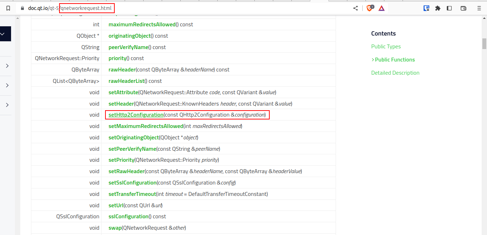

Well, there it is. All as expected. Armed with that knowledge, we should be able to predict how the important methods should be called, and intercept them.

### Intercepting method calls

Before we took a detour to explore C++ name mangling and compiler internals, we had this piece of code, which makes HTTP calls in Qt: 

```cpp
QNetworkAccessManager *manager = new QNetworkAccessManager(this);  
connect(manager, &QNetworkAccessManager::finished,  
 this, &MyClass::replyFinished);

manager->get(QNetworkRequest(QUrl("http://qt-project.org")));
```

The first important bit to hook is the `manager->get` part. In our case, we should also hook `->post` and `->put`, but let's go slowly.  

That function should be called... *consults name mangling reference*... `_ZN21QNetworkAccessManager3getERK15QNetworkRequest`. Does that exist?  

```js
[Local::sfproc ]-> lib.findExportByName("_ZN21QNetworkAccessManager3getERK15QNetworkRequest")  
"0x7f836663dec0"
```

Yes. Yes it does. With that, we can start tracing those functions. We'll do things differently now, and we'll use `frida-trace` for a change. That is another executable from the Frida suite. When you run it, you give it a pattern of function names. It analyzes the target binary, finds all exported functions that match that name, and generates handlers for them all. Perfect for ~~lazy~~ efficient reverse engineers!

```bash
$ sudo frida-trace -i _ZN21QNetworkAccessManager*ERK15QNetworkRequest* sfproc
Instrumenting...
_ZN21QNetworkAccessManager4postERK15QNetworkRequestRK10QByteArray: Auto-generated handler at "/home/reyes/__handlers__/libQt5Network.so.5/_ZN21QNetworkAccessManager4postE_207ec82a.js"
_ZN21QNetworkAccessManager17sendCustomRequestERK15QNetworkRequestRK10QByteArrayP14QHttpMultiPart: Auto-generated handler at "/home/reyes/__handlers__/libQt5Network.so.5/_ZN21QNetworkAccessManager17send_1445a362.js"
_ZN21QNetworkAccessManager3putERK15QNetworkRequestRK10QByteArray: Auto-generated handler at "/home/reyes/__handlers__/libQt5Network.so.5/_ZN21QNetworkAccessManager3putER_a895cb1f.js"
_ZN21QNetworkAccessManager3putERK15QNetworkRequestP14QHttpMultiPart: Auto-generated handler at "/home/reyes/__handlers__/libQt5Network.so.5/_ZN21QNetworkAccessManager3putER_a03d12b5.js"
_ZN21QNetworkAccessManager3getERK15QNetworkRequest: Loaded handler at "/home/reyes/__handlers__/libQt5Network.so.5/_ZN21QNetworkAccessManager3getER_70d83883.js"
_ZN21QNetworkAccessManager14deleteResourceERK15QNetworkRequest: Loaded handler at "/home/reyes/__handlers__/libQt5Network.so.5/_ZN21QNetworkAccessManager14dele_e73ae42c.js"
_ZN21QNetworkAccessManager17sendCustomRequestERK15QNetworkRequestRK10QByteArrayS5_: Auto-generated handler at "/home/reyes/__handlers__/libQt5Network.so.5/_ZN21QNetworkAccessManager17send_80a97582.js"
_ZN21QNetworkAccessManager4postERK15QNetworkRequestP9QIODevice: Auto-generated handler at "/home/reyes/__handlers__/libQt5Network.so.5/_ZN21QNetworkAccessManager4postE_21e75653.js"
_ZN21QNetworkAccessManager4headERK15QNetworkRequest: Loaded handler at "/home/reyes/__handlers__/libQt5Network.so.5/_ZN21QNetworkAccessManager4headE_6859e22c.js"
_ZN21QNetworkAccessManager3putERK15QNetworkRequestP9QIODevice: Auto-generated handler at "/home/reyes/__handlers__/libQt5Network.so.5/_ZN21QNetworkAccessManager3putER_4c7c1032.js"
_ZN21QNetworkAccessManager17sendCustomRequestERK15QNetworkRequestRK10QByteArrayP9QIODevice: Auto-generated handler at "/home/reyes/__handlers__/libQt5Network.so.5/_ZN21QNetworkAccessManager17send_3555c1a6.js"
_ZN21QNetworkAccessManager13createRequestENS_9OperationERK15QNetworkRequestP9QIODevice: Auto-generated handler at "/home/reyes/__handlers__/libQt5Network.so.5/_ZN21QNetworkAccessManager13crea_51b76bfe.js"
_ZN21QNetworkAccessManager4postERK15QNetworkRequestP14QHttpMultiPart: Auto-generated handler at "/home/reyes/__handlers__/libQt5Network.so.5/_ZN21QNetworkAccessManager4postE_9e685d75.js"
Started tracing 13 functions. Press Ctrl+C to stop.
           /* TID 0x8c2 */
 29028 ms  _ZN21QNetworkAccessManager3getERK15QNetworkRequest()
 29028 ms     | _ZN21QNetworkAccessManager13createRequestENS_9OperationERK15QNetworkRequestP9QIODevice()
 34031 ms  _ZN21QNetworkAccessManager3putERK15QNetworkRequestP9QIODevice()
 34031 ms     | _ZN21QNetworkAccessManager13createRequestENS_9OperationERK15QNetworkRequestP9QIODevice()
```

Well, that's really neat! It detected all functions of the `QNetworkAccessManager` class that take a `QNetworkRequest` as a parameter, generated a "handler file" for each one (at the `__handlers__` directory under the current working directory), and then started tracing. By default, the implementations just send a log message on function enter and do nothing on function exit. It also appears to understand when a function is called as part of the execution of another (see the first two logs above, the second one is indented and has a pipe).  

After letting the default handlers work for a while, so we can get an idea of which functions are called, we get the following:

* `get(QNetworkRequest)`  

* `put(QNetworkRequest, QIODevice)`  

* `put(QNetworkRequest, QByteArray)`

After cross-referencing that with the information extracted from PolarProxy, it appears to cover all of it, with the exception of a single POST call. I have no idea why. I did find that it was sent at irregular intervals, so perhaps it wasn't sent while I was looking?  

Let's start with the GET function. We know that it only takes one parameter, a `QNetworkRequest`. We can get a pointer to that object inside the Frida handler. From there, we could theoretically read its fields by computing the offset, but that gets... involved. Take a look at [its source code](https://codebrowser.dev/qt5/qtbase/src/network/access/qnetworkrequest.h.html#QNetworkRequest): the code has preprocessor flags, and all the actual data is held in a private, [friend class](https://codebrowser.dev/qt5/qtbase/src/network/access/qnetworkrequest.cpp.html#QNetworkRequestPrivate) called `QNetworkRequestPrivate`. That class, in turn, inherits from two other classes, and from there it all turns into a mess. For example, the URL isn't simply a `char *` in the Request class. It's an instance of a `QUrl` class, which would require repeating all the exercise for a new class. Not fun.  

Let's try from another angle. There must be a function `_ZN12QNetworkRequest3urlEv`, which corresponds to `QUrl QNetworkRequest::url()`. This function will take a single parameter, a pointer to a `QNetworkRequest`, and return a pointer to a `QUrl`. Then, there should also be a `_ZN4QUrl8toStringEv` function, corresponding to `QString QUrl::toString()`, which will return a pointer to a QString, and another function `_ZN7QString5utf16Ev`, corresponding to `const unsigned short * QString::utf16()`. If we can chain those functions together, we'll get a pointer to a section of memory containing UTF-16 encoded data, in 16-bit code units. Frida can interpret that. Now, we just need a way to call the program's functions from the interceptor.  

Enter [the Frida Handbook](https://learnfrida.info/). It goes far beyond what the docs do. In the [Intermediate Frida](https://learnfrida.info/intermediate_usage/#creating-nativefunctions) page, there's a section about "Creating NativeFunctions". "This is useful in case that we want to call exports for our own sake or use the process's functions at will." That sounds like what we want!

In a nutshell, here's what you have to do:  

1. Obtain a pointer to the function that you want to call  
2. Create a `NativeFunction` in JS by providing the pointer, the type of the returned value, and the types of the arguments.  
3. Call the NativeFunction with whatever values it requires.

```js
// __handlers__/libQt5Network.so.5/_ZN21QNetworkAccessManager3getER_70d83883.js

{
  /**
   * Called synchronously when about to call _ZN21QNetworkAccessManager3getERK15QNetworkRequest.
   *
   * @this {object} - Object allowing you to store state for use in onLeave.
   * @param {function} log - Call this function with a string to be presented to the user.
   * @param {array} args - Function arguments represented as an array of NativePointer objects.
   * For example use args[0].readUtf8String() if the first argument is a pointer to a C string encoded as UTF-8.
   * It is also possible to modify arguments by assigning a NativePointer object to an element of this array.
   * @param {object} state - Object allowing you to keep state across function calls.
   * Only one JavaScript function will execute at a time, so do not worry about race-conditions.
   * However, do not use this to store function arguments across onEnter/onLeave, but instead
   * use "this" which is an object for keeping state local to an invocation.
   */
  onEnter(log, args, state) {
    log('_ZN21QNetworkAccessManager3getERK15QNetworkRequest()');

    // Get a pointer to the real function
    const maximumRedirectsAllowed = Module.getExportByName("libQt5Network.so.5", "_ZNK15QNetworkRequest23maximumRedirectsAllowedEv");
    // Make a NativeFunction object
    const frida_maximumRedirectsAllowed = new NativeFunction(maximumRedirectsAllowed, 'int', ["pointer"]);
    // Call the NativeFunction. args[1] is the parameter to ->get() (remember that args[0] is the QNetworkAccessManager "this" pointer)
    log(frida_maximumRedirectsAllowed(args[1]))
  }
}
```

We've started with a function that returns a value directly, so we don't have to jump through more hoops. `QNetworkRequest::maximumRedirectsAllowed()` returns an `int`. [Qt docs](https://doc.qt.io/qt-5/qnetworkreply.html) suggest that this value is set to 50 by default. If we get a 50, then we know that everything works.  

And, indeed, going back to the `frida-trace` terminal, we see that it works!

```
613619 ms  _ZN21QNetworkAccessManager3getERK15QNetworkRequest()
613619 ms  50
613619 ms     | _ZN21QNetworkAccessManager13createRequestENS_9OperationERK15QNetworkRequestP9QIODevice()
```

Now we're ready to get serious and chain three `NativeFunction`s together! As a reminder, we want to get the URL that was related to that request.

```js
// __handlers__/libQt5Network.so.5/_ZN21QNetworkAccessManager3getER_70d83883.js

{
  onEnter(log, args, state) {
    // PART 0
    log('_ZN21QNetworkAccessManager3getERK15QNetworkRequest()');
    const qnetworkrequest_ptr = args[1];
    log("QNETWORKREQUEST_PTR", qnetworkrequest_ptr);

    // PART 1
    const QNetworkRequest_url = new NativeFunction(Module.getExportByName("libQt5Network.so.5", "_ZNK15QNetworkRequest3urlEv"), "void", ["pointer", "pointer"]);
    const qUrl = Memory.alloc(Process.pageSize);
    QNetworkRequest_url(qUrl, qnetworkrequest_ptr);
    log("QURL_PTR", qUrl);

    // PART 2
    const QUrl_toString = new NativeFunction(Module.getExportByName("libQt5Core.so.5", "_ZNK4QUrl8toStringE12QUrlTwoFlagsINS_19UrlFormattingOptionENS_25ComponentFormattingOptionEE"), 'void', ["pointer", "pointer", "int"]);
    const qString = Memory.alloc(Process.pageSize);
    QUrl_toString(qString, qUrl, 0);
    log("QSTRING_PTR", qString);

    // From here on down, taken from https://github.com/frida/frida/issues/675#issuecomment-790948742
    // PART 3
    const QString_toUtf8 = new NativeFunction(Module.findExportByName("libQt5Core.so.5", "_ZNK7QString6toUtf8Ev"), 'void', ['pointer', 'pointer']);
    const allocUtf8 = Memory.alloc(Process.pageSize);
    QString_toUtf8(allocUtf8, qString);
    const qByteArray = Memory.readPointer(allocUtf8);
    log("QBYTEARRAY_PTR", qByteArray);

    // PART 4
    const QVariant_constData = new NativeFunction(Module.findExportByName("libQt5Core.so.5", "_ZNK8QVariant9constDataEv"), 'pointer', ['pointer']);
    const cStr = QVariant_constData(qByteArray);
    const string = cStr.add(3 * Process.pointerSize).readUtf8String();

    log(string)
  }
}
```

And here are the logs that appear in `frida-trace`:

```
43964327 ms  _ZN21QNetworkAccessManager3getERK15QNetworkRequest()
43964327 ms  QNETWORKREQUEST_PTR 0x7ffd7bc524c8
43964327 ms  QURL_PTR 0x7f5e2ab1b7b0
43964327 ms  QSTRING_PTR 0x7f5e315cb2e0
43964327 ms  QBYTEARRAY_PTR 0x7f5df4073740
43964327 ms  https://td2-desktop-api.timedoctor.com/command/cloud/SANITIZED::SANITIZED::SANITIZED
43964328 ms     | _ZN21QNetworkAccessManager13createRequestENS_9OperationERK15QNetworkRequestP9QIODevice()
```

Also, that was nasty! It took me several hours to get it working. The main issue is that, until every piece of the puzzle works, you see nothing. Frida just complains about you trying to access invalid pointers and such. So you're just walking blind, changing pieces of the code and hoping that a combination leads you to the final string.

### Professional grade interception: Qt objects

The code above is fairly complex and does 4 function calls in a chain. Let's unpack them to see how they work.

* PART 0: We're working in the interceptor for `QNetworkAccessManager::get(QNetworkRequest)`. As we covered before, `args[0]` is a pointer to the `QNetworkAccessManager` instance itself (i.e., `this` in the C++ code). We won't use it anymore. `args[1]` is the first parameter to the call, i.e. a pointer to a `QNetworkRequest`. That gets saved into the `qnetworkrequest_ptr` constant.  
* PART 1: `QNetworkRequest` has a function `QUrl QNetworkRequest::url() const`. We need to call that, to extract the URL that this request is all about. We can obtain the function's mangled name according to the rules: `_Z` is constant, `N..E` because it's namespaced, inside the `N..E` we put `K` because it's `const`, `15QNetworkRequest` for the namespace and `3url` for the name, and it takes no arguments (`void`) so it gets a `v`. In total, that's `_ZNK15QNetworkRequest3urlEv`. So far, so good.  
* However, then strikes a difference. Since the function takes no values (well, apart from its implicit `this` pointer) and returns a `QUrl`, we may expect it to be instantiated as `new NativeFunction(..., "pointer", ["pointer"])` in Frida. As a reminder, second arg is the return value, third arg is a list with the parameters. However, in the code we don't have that. We have `new NativeFunction(..., "void", ["pointer", "pointer"])`. What gives?  
* I got this information from [this Github answer](https://github.com/frida/frida/issues/675#issuecomment-790948742) in the Frida repo and, once I knew where to look, somewhat buried in [Frida's docs for NativeFunction](https://frida.re/docs/javascript-api/#nativefunction). There, it says that "For C++ scenarios involving a return value that is larger than `Process.pointerSize`, a typical ABI may expect that a `NativePointer` to preallocated space must be passed in as the first parameter.".  
* That short text holds the key. The `QUrl QNetworkRequest::url() const` function doesn't return a pointer to a `QUrl`, but a `QUrl` itself. By value, not by reference, if you know the distinction. That means that, indeed, "the return value is larger than `Process.pointerSize`". Thus, the first parameter must be a `NativePointer` to preallocated space. In other words, when you return large structs, the return type becomes `void`, and instead you pass a pointer to heap memory as the first argument to the function (even before the `this` pointer!). The function will write its struct in that memory region. Since you hold a pointer to that memory, you can do whatever you want with it afterwards.  
* So, we know that we need to pass the `QUrl QNetworkRequest::url() const` function some memory so that it can put its returned struct (a `QUrl`). Thats why, in PART 1, we allocate one page of memory with `Memory.alloc(Process.pageSize)`. I chose an entire page to be sure, since I don't know how large a `QUrl` struct is. If we allocated less space, it may trample over other data that is also in the heap, which may cause program instability. Not fun. Even now, I'm unsure if one page is enough.  
* Finally, still in PART 1, we can call the `QNetworkRequest_url` method. We pass it two args: first, the recently allocated memory where it will write its `QUrl`, second, the `this` pointer (which is `args[1]` for the entire interceptor, by the way)  
* After `QNetworkRequest_url` returns, that page of memory will hold a `QUrl`. The pointer to it, returned by `Memory.alloc`, will help us in the next part.  
* PART 2: We repeat the entire exercise of PART 1, now with the function `QString QUrl::toString(QUrl::FormattingOptions) const`. Now, this function has an added complication since it receives an extra argument, which is an enum. Thankfully, enums compile down to ints. The Qt docs also have a handy table, from which we discover that 0 is a perfectly valid value that doesn't change anything on the string. Other values remove parts of the URL such as the scheme, Basic Auth information, the path, the querystring or the fragment, normalize the URL or remove trailing slashes. We'll use 0 for simplicity.  
* Therefore, we declare that that `NativeFunction` returns `void`, and takes two `pointer`s and one `int`.  
* We need to allocate another page of memory for the returned `QString`. That is the same procedure as above.  
* Then, we call the `NativeFunction`, passing it: first, the pointer to the new page of memory for it to put its return `QString`; second, the pointer to `this` (i.e., the `QUrl` pointer that we obtained in PART 1); third, the enum value, which is a plain 0.  
* When the function returns, we have a `QString` written in the memory page that we just allocated.  
* PART 3, PART 4: These two steps were taken verbatim from [Github](https://github.com/frida/frida/issues/675#issuecomment-790948742). That question assumes that the interceptor receives a pointer to a `QString` (it's intercepting a `QString` method). Thus, we can chain that after STEP 2, since there we finally obtain a pointer to a `QString`.  
* The only change that I made was to allocate an entire page of memory, instead of just `Process.pointerSize` bytes. It may have worked as it was, but I am not sure, and it's better to allocate too much memory. It should get released anyways, once the interceptor returns, since at that point all references to it will be destroyed.  
* In PART 4 there is a final bit of magic: to get the `char *` that holds the actual string as UTF-8, you must hop over 3 pointer sizes. I have no idea why, nor does the person who wrote the code. At any rate, the magic offset 3 does work.

### Visited URLs

After modifying the code so that it only prints the method + the URL, applying the same code to the other handlers, and letting it run for a while to capture information, here's what it found:

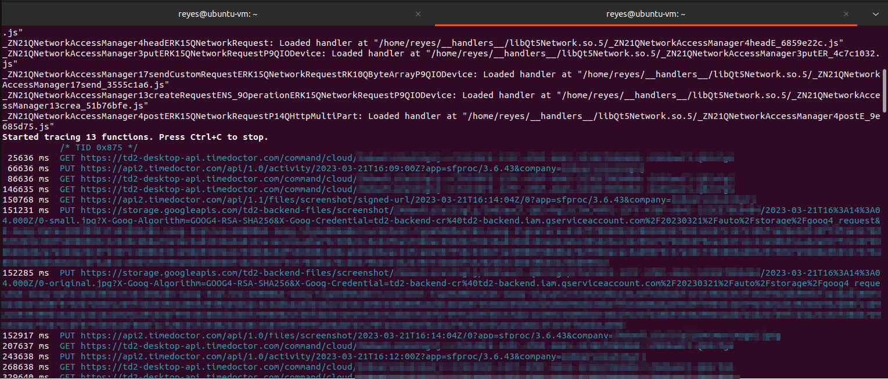

I've let it run for about an hour. After checking all requests, we see the following:  

* `GET https://td2-desktop-api.timedoctor.com/command/cloud/`  
* `PUT https://api2.timedoctor.com/api/1.0/activity`  
* `GET https://api2.timedoctor.com/api/1.1/files/screenshot/signed-url`  
* `PUT https://storage.googleapis.com/td2-backend-files/screenshot`  
* `PUT https://api2.timedoctor.com/api/1.0/files/screenshot`  
* `PUT https://td2-desktop-api.timedoctor.com/status`  
* A call to Sentry's ingestion endpoint, but I couldn't capture the exact URL.  

All those calls, except the Sentry one, go to domains that we intercepted with PolarProxy. Thus, we can be confident that, at this point in time, we can see everything that TimeDoctor reports about the spied-on user. A proper counterespionage strategy would involve monitoring the URLs that the application contacts with Frida, the request bodies with PolarProxy, ingesting both into a common log repository, and then cross-checking. If there ever happened a request whose URL was not monitored by PolarProxy, that would be an indication of a gap in monitoring that should be addressed by adding a new override to `/etc/hosts`. Once applied, those requests would now be seen by PolarProxy.

### Discussion

We've managed to intercept the binary's execution to such a level that we get notified every time that it makes a network request. We obtained access to the URL and method of the call, though not to the body nor the response.  

I originally intended to extract the request bodies too, and the response bodies. However, after seeing what is required to extract the URL, I'm no longer going to do so. The issue is that request bodies come as `QIODevice` and `QHttpRequestMultipart` instances. These are abstractions that can be very difficult to obtain data from. It would be different if the functions simply took a `char *` or some thin abstraction over it. As it is, a `QIODevice` may never even have a `char *` where all its data can be found! It may be a file that is read on-demand, in chunks. Also, interacting with a `QIODevice` involves signals, which introduce an entire new layer of complexity in the form of callbacks. The responses are even worse: it's not guaranteed that when the `->post()` function returns, the response will have completed. Instead, you register a signal with the Qt framework, which will call a function of your choice when the response is complete. Again, callbacks are complex enough in code, let alone when reverse engineering a compiled binary and crossing several memory and language boundaries.  

Thus, I decided to limit the Qt reverse engineering to a cross-checker for PolarProxy. Hence its use as a warning to be sounded when a request happens to some URL that we aren't monitoring. That was, as you'll remember, the downside of PolarProxy: if the application made requests to a domain that was not intercepted, we wouldn't even get notice of it. With Frida, on the other hand, we can be fairly certain that we are seeing everything, unless the developers of TimeDoctor took the time to write code that sent requests without using Qt's networking library.  

Thus, the Frida script will limit itself to collecting URLs and ensuring that PolarProxy is capturing the entirety of the data.

### Materials checked

* [Intermediate Frida - Frida HandBook](https://learnfrida.info/intermediate_usage/#creating-nativefunctions) for a detailed description on how to create and use `NativeFunction`s.  
* [QNetworkAccessManager Class | Qt Network 5.15.13](https://doc.qt.io/qt-5/qnetworkaccessmanager.html) and other pages. This one is the entry point.  
* [qnetworkaccessmanager.h source code [qtbase/src/network/access/qnetworkaccessmanager.h] - Codebrowser](https://codebrowser.dev/qt5/qtbase/src/network/access/qnetworkaccessmanager.h.html) if you ever need access to Qt's source code.  
* [JavaScript API | Frida * A world-class dynamic instrumentation toolkit](https://frida.re/docs/javascript-api/#nativefunction): The ultimate reference.  
* [how to read a method argument with a class type `QString` in frida-trace · Issue #675 · frida/frida · GitHub](https://github.com/frida/frida/issues/675#issuecomment-790948742). Without this code, I would never have made it work.

## Recap

* If you have an application from which you wish to intercept HTTPS communications, you can use [PolarProxy](https://www.netresec.com/?page=PolarProxy). It's free (up to 10 GB per day). Once you set it up, you fiddle with the [HOSTS file](https://en.wikipedia.org/wiki/Hosts_(file)) of the victim device, which swaps the DNS resolution for the domains that you want to monitor to your proxy. From there on, you can pipe the data to Wireshark or your analyzer of choice, or just dump it to files for later analysis.  
* PolarProxy can (in theory, according to its FAQ) also be used to intercept other TLS-encapsulated protocols. For example, [DNS over TLS](https://www.cloudflare.com/learning/dns/dns-over-tls/), the [MongoDB line protocol](https://www.mongodb.com/docs/manual/core/security-transport-encryption/), [PostgreSQL](https://www.postgresql.org/docs/current/ssl-tcp.html), [IMAPS](https://datatracker.ietf.org/doc/html/rfc8314#section-3.2), [SMTPS](https://datatracker.ietf.org/doc/html/rfc8314#section-3.3) and many other. This is really important to keep in mind, since these protocols are usually black boxes and if (when!) anything fails, you are left with very few resources when you can't boot up Wireshark.  
* From the analysis of HTTPS communications performed by TimeDoctor, it doesn't appear to be up to anything extra-nefarious (that is, anything *besides* the whole "silent functionally-equivalent-to-stalkerware app" business). It communicates with two first-party domains to send activity data and receive commands, and with Google Cloud Storage to upload screenshots. The data transmitted appears to be (mostly) limited to what is shown in the administration UI.  
* We haven't been able to analyze the available "commands". All the intercepted requests returned an empty response (i.e., the server telling the client that it had no commands at the moment). It would be interesting to know the extent of this functionality. Does TimeDoctor have [RAT (Remote Access Trojan)](https://www.malwarebytes.com/blog/threats/remote-access-trojan-rat) functionality? I haven't seen such functionality. If not, could it have it? It certainly has the infrastructure to do so: hidden, always-on client, running as root, server that accepts incoming connections, manages to convince sysadmins to allow outbound communications to the aforementioned server, a periodic connection back to the mothership that asks "Are there any commands for me?"...
* A cursory analysis of the GCS storage location didn't reveal any glaring misconfigurations (i.e., no world-readable buckets). That's a consolation.  
* Frida can be used (with effort) to intercept the Qt library that implements networking. This can be used to get a notification every time the application does an HTTP request.  
* After resolving several layers of pointers, it is possible to extract the URL that every network call involves.  
* These URLs can be used to verify that PolarProxy is getting visibility into the entirety of the monitored application's network traffic, since PolarProxy requires explicitly redirecting each domain and thus, if a domain escaped detection, calls made to it wouldn't be included in PolarProxy's data.  
* The author does NOT recommend attempting to extract request or response data from the Qt Network library calls via Frida. It's probably horrifying.

## Conclusion

Thus ends our foray into the world of time trackers and reverse engineering. We've managed to expose all communications made by TimeDoctor, and we've provided the unfortunate user that has to install TimeDoctor's silent version with a way of knowing what is being said about him. This, in turn, will enable him to make more informed decisions taking into account the data reported, thus letting [Goodhart's Law](https://en.wikipedia.org/wiki/Goodhart%27s_law) apply: "When a measure becomes a target, it ceases to be a good measure". An alternative, apparently older formulation is [Campbell's Law](https://en.wikipedia.org/wiki/Campbell%27s_law): "The more any quantitative social indicator is used for social decision-making, the more subject it will be to corruption pressures and the more apt it will be to distort and corrupt the social processes it is intended to monitor." Both can be aplied here. You're welcome.

I've run out of ideas for more reverse engineering tasks. Also, my free trial of TimeDoctor is coming to an end. And so are my vacations. Thus, this is an appropiate point to end this series.  

And now, finally, I can perform the most important step:

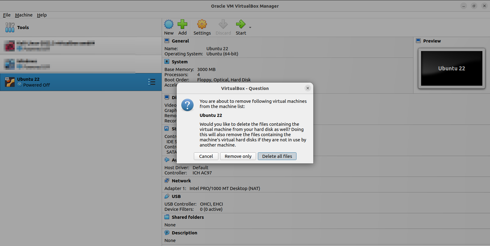

Be lost in the void of deleted inodes, freaky time tracker. You won't be missed.
