## Introduction

This post is a continuation of the post [Spying the spy: Frida vs. Time Tracker, Part One](https://jreyesr.github.io/posts/spying-the-spy-part-one/). In that post, we set up the required infrastructure to intercept a time tracker application, TimeDoctor. When the post finished, we had the logs being written to a file, as JSON objects. I originally intended to continue that post, but it had already gotten several times larger than what The Internet recommends as an ideal "blog post length". Thus, the remainder of the work got pushed into a new post.

This post picks up after the logs are written to disk. Now, we'll index them into a permanent storage solution ([Gravwell](https://www.gravwell.io/)), and then start attempting to perform some random tasks. This will gauge how well Gravwell handles a new user trying to throw preconceived notions at it (in particular, my preconceived notions come from Grafana, for the charts and dashboards; and Splunk, for the search queries).

Sidenote: This post was written when Gravwell was on version 5.1.4. Many things may have changed since then. In particular, anything that I say here "does not work" may have been implemented. Also, if at times it looks like I'm bashing Gravwell, I'm not. It's a small, young company, and the extent of what they have accomplished is amazing. Gravwell is a platform with some really powerful tools, and the processing model that they've chosen shows potential for even very complex requirements.

~~Later in the post, we'll completely change tack and start [MITMing](https://en.wikipedia.org/wiki/Man-in-the-middle_attack) the connection through which TimeDoctor exfiltrates all its reports back to The Cloud.~~ The original idea was to continue this post with some TLS interception, but this post got quite long in itself. TLS interception and intercepting the HTTPS communications by using Frida have been pushed into yet another post.

## Step the Fourth: Dashboards, Dashboards Everywhere!

We'll use [Gravwell](https://www.gravwell.io/) to analyze the logs. This log analyzer was chosen after a very careful, scientific process known as "why not?":

* The [ELK stack](https://www.elastic.co/what-is/elk-stack) (Elastic+Kibana) is free, but deploying it is notoriously difficult and resource-intensive.
* [Splunk](https://www.splunk.com/) is fine and all, but it has a 500 MB ingest limit per day. We won't reach it with these logs, but 13.9 GB (the daily limit for Gravwell's Community/free plan) is better than 500 MB. Plus, I already know Splunk, it's more fun to try something new.
* Humio (now [Falcon LogScale](https://www.crowdstrike.com/products/observability/falcon-logscale/)) is mostly cloud-only (self-hosted is only a trial, then you pay)
* [Graylog](https://www.graylog.org/) also has complexities around cloud/self-hosted models.

Installing Gravwell is quite easy. You go to their page, then click the big "Community Edition" button at the top navbar. Since everything is running in a VM that will be disposed of soon, we'll just use the prebuilt Debian package. Otherwise, I'd probably use Docker to keep it more or less isolated from the rest of the system.

The instructions are quite easy to follow. Once installed, Gravwell insists on getting an email to mail you a license. Oh well. After giving it an email, you get a license file, which you upload to the web UI (Gravwell starts up on `localhost`, port 80). Then you can log in to the application (username `admin`, password `changeme`).

The first hurdle was getting the log file into Gravwell. I was expecting an option in the web UI, but the only thing there related to data ingestion is an option to upload a file. That is good for one-off uploads, but it won't keep monitoring the file for changes. Their [quickstart guide](https://docs.gravwell.io/quickstart/quickstart.html#feeding-data-into-gravwell) outlines the installation of the File Follow ingester, which turns out to be what is used to monitor files. It comes as another Debian package, which you install with `sudo apt install gravwell-file-follow`. Then, you need to edit the file `/opt/gravwell/etc/file_follow.conf`. Near the end, it has a list of monitored files/directories, and we'll add our own file. Doing so will require some reading of [the docs for that ingester](https://docs.gravwell.io/ingesters/file_follow.html). In particular, we need to know how to specify that a single file needs to be monitored, not a directory.

```ini
[Global]
Ingester-UUID="ABCDE"
Ingest-Secret = "QWERTY"
Connection-Timeout = 0
Insecure-Skip-TLS-Verify=false
Pipe-Backend-Target=/opt/gravwell/comms/pipe #a named pipe connection, this should be used when ingester is on the same machine as a backend
State-Store-Location=/opt/gravwell/etc/file_follow.state
Log-Level=INFO #options are OFF INFO WARN ERROR
Log-File=/opt/gravwell/log/file_follow.log

Max-Files-Watched=64 # Maximum number of files to watch before rotating out old ones, this can be bumped but will need sysctl flags adjusted

#basic default logger, all entries will go to the default tag
#no Tag-Name means use the default tag
[Follower "auth"]
	Base-Directory="/var/log/"
	File-Filter="auth.log,auth.log.[0-9]" #we are looking for all authorization log files
	Tag-Name=auth
	Assume-Local-Timezone=true #Default for assume localtime is false

# Some other watched directories...

# THIS IS NEW!
[Follower "spy"]
	Base-Directory="/var/log"
	File-Filter="spy.log"
	Tag-Name=timedoctor
```

Then, we run `sudo service gravwell_file_follow restart` so that the changes are picked up. On the Ingesters monitoring page, we can verify that the new ingester is working:

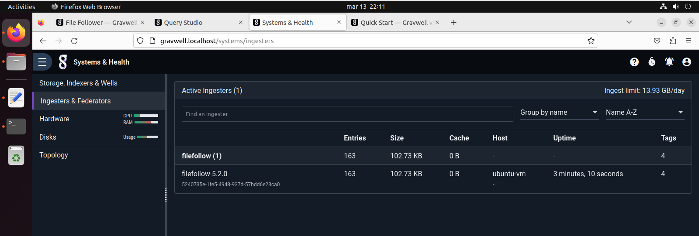

Then, we go to the Query Studio. That is the main search page, it contains a search field and results are displayed below it. Pretty standard; Kibana, Splunk and Grafana do the same. We'll start by searching for all the data, just to verify that it's there. We enter `tag=timedoctor` (this tag will be added to all data that comes from the `/var/log/spy.log` file, as we specified in the File Follow ingester configuration), then press `Shift+Enter` to search:

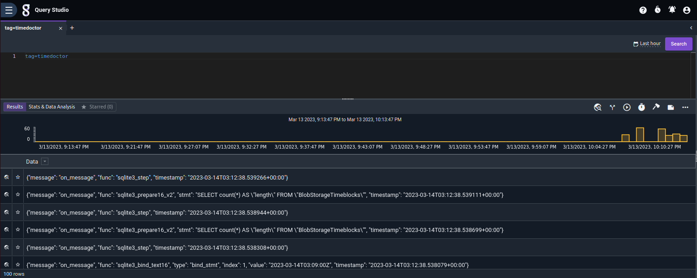

The data is there, but there's nothing fun happening. Clicking on the first button to the left of each result (the one like a globe with a magnifying glass) reveals a more promising dialog:

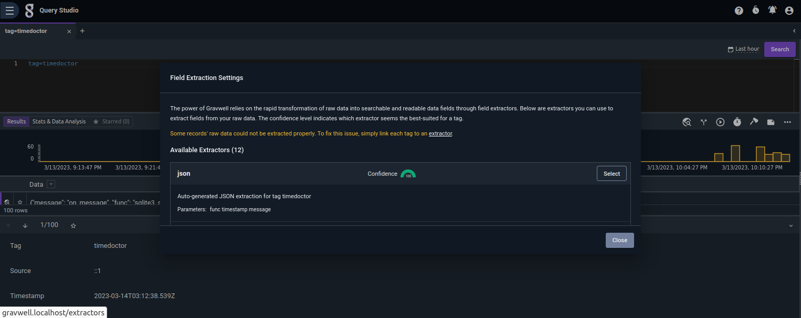

So, we need to link an extractor to the tag. Gravwell has correctly determined that the `json` extractor seems appropriate for this data. Let's accept that and see what happens.

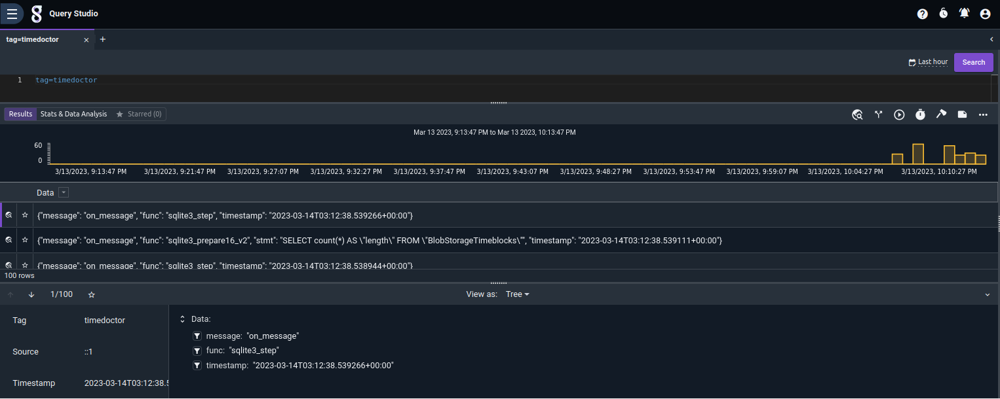

Now it can understand the data. Something interesting is that we configured the extractor *after* ingesting the data. This is unlike Elastic, where once the data is ingested you cannot apply almost any transforms to it; and also unlike Splunk, that has many powerful extractions that are only available at ingest time. I don't know what "setting an extractor" implies, but in theory it gives you more freedom, since you can ingest data and then specify how it has to be parsed. We'll see if that same philosophy pops up again in other parts of the system.

### Simple Filtering

Now that we have the logs, let's start simple: obtain all the SQL statements that TimeDoctor issues. We won't bother with the bound parameters, just the plain SQL strings.

```
tag=timedoctor json timestamp func=="sqlite3_prepare16_v2" stmt
| unescape stmt
| table timestamp, stmt
```

This statement means "look on all data with the tag `timedoctor`, then treat it as JSON. Preserve only the `timestamp`, `func` and `stmt` fields, and by the way, only keep the entries where `func` has the value `sqlite3_prepare16_v2`. Then, on each result, replace the `stmt` field with a JSON-unescaped version of itself. Finally, make a table that only has the `timestamp` and `stmt` fields from each entry". 

All these commands run on a pipeline, where the results of each command are passed to the next. The pipe character `|` separates the pipeline stages. Understanding (and mentally visualizing) the data that flows across stages is vital in composing a search query.

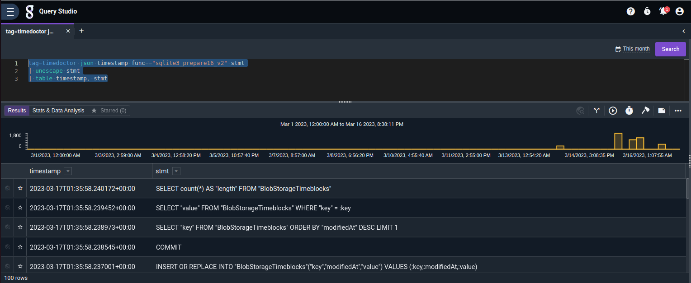

Yes, the results are there. The `unescape` stage is because otherwise the quotes were escaped (since they come from a doubly-encoded JSON string), and they looked ugly.

Aside: This "pipeline" concept is found again in log archival tools such as [LogScale](https://library.humio.com/falcon-logscale/writing-queries-operations.html#writing-queries-operations-combine), [Splunk](https://docs.splunk.com/Documentation/SplunkCloud/9.0.2208/SearchTutorial/Startsearching) and [Loki](https://grafana.com/docs/loki/latest/logql/query_examples/). Elasticsearch/Kibana, on the other hand mostly lets you [specify a filter](https://www.elastic.co/guide/en/kibana/master/kuery-query.html) (there are ways of [specifying aggregations](https://www.elastic.co/guide/en/elasticsearch/reference/current/search-aggregations.html), but those can happen only once at the end of the query, and they use the API). Graylog does [have pipelines](https://go2docs.graylog.org/5-0/making_sense_of_your_log_data/pipelines.html), but they only work while data is being ingested, and being based on ElasticSearch, it inherits the same data and query model. SQL could theoretically also do the same, through the power of massively nested subqueries, one for each pipeline stage. Gravwell's processing model most strongly reminds me of Splunk, which is probably not a coincidence, considering how they have a [dedicated page](https://www.gravwell.io/gravwell-vs-splunk) titled "Gravwell vs. Splunk", offer dedicated migration support called [Replacement Program](https://www.gravwell.io/gravwell-swap-and-switch-program) by which you can get free Gravwell for the remainder of your (current!) Splunk license[^2] and all-around seem to focus on Splunk as a primary competitor. It'd make sense for them to match Splunk's functionality, in order to ease migration.

End of Aside.

Conclusions: Doable, easy and clean.

That was nearly the simplest query that we could do. It's barely more than a filtering condition. Kibana could do that too. So could every other log analysis solution that we have mentioned. Time to step things up a notch.

### Transactions

For the purposes of this article, a "transaction" is a set of logs that corresponds to a specific event. See [here](https://www.datadoghq.com/blog/logs-transactions-queries/) for an example geared towards application monitoring. Roughly, a transaction starts with an event (for example, "user login") and ends with an event ("purchase made"). Any intermediate events are collected in the transaction. Normally, transactions also require an identifier field, since you can have multiple transactions active at the same time. Thus, a better example would be "user X logged in" to "purchase made by X", and any intermediate events that also involve user X get collected in the transaction too. A different event would be VPN logs: you'll probably have events from your VPN server that say "user X, connecting from IP Y, has just logged in and been assigned IP Z", and also events like "user X has logged out". Those can be the boundary conditions for a transaction. Now, you can join that with any other logs that only contain the VPN IP, and since you can look at the first event of the transaction (which will be a login event) you can now attribute network activity to a user. That's neat!

For the TimeDoctor logs, let's say that we now want to group complete SQL statements. If you'll remember from [the previous article](https://jreyesr.github.io/posts/spying-the-spy-part-one/), back then we explicitly forwent (yes, that's a word, I looked it up!) handling transactions in the Python script, since it's complex and introduces state into what is otherwise a nice, clean, stateless function. This means that we now have separate logs that together make up a SQL transaction:

1. A log that contains the SQL statement string, with placeholders for prepared parameters.
2. Zero or more logs that hold a prepared statement parameter each, with its index (or position in the SQL statement) and value.
3. One or more logs that indicate execution of the query. At this point we can't edit the parameters anymore.

That's a transaction! The initiator condition is the `sqlite3_prepare` log (the one that contains the SQL string). Then, the `sqlite3_bind*` logs are the inner part of the transaction, and it ends with a `sqlite3_step` call. Further simplifying things, we'll assume that there can only be one transaction in flight at once (unlike a real system, where different users' transactions will probably interleave). I haven't seen an instance of interleaved logs (which could come from multiple threads simultaneously accessing the SQLite DB). If we found them, we'd have to edit the Frida script to include the thread ID on the logs, so that we could undo the interleaving. We won't bother with that for now, unless we need it.

Here's the [magic call](https://docs.gravwell.io/search/transaction/transaction.html). After reading the docs, it doesn't appear to work out-of-the-box. At least for this usecase in particular, in which we don't have a "transaction ID" already. We'll have to work for it. The docs state that you need to provide a field that should be the same for all events in the same transaction and different for all other events. Kibana does provide something of the sort, in the form of the [Event Query Language](https://www.elastic.co/guide/en/elasticsearch/reference/current/eql.html), which lets you state "first X, then one or more Ys, then one Z". So does Splunk, with the `startswith` and `endswith` options for the [transaction command](https://docs.splunk.com/Documentation/SplunkCloud/latest/SearchReference/Transaction#6._Transactions_with_the_same_session_ID_and_IP_address). In our logs, however, we don't have an identifier that we can use.

Here's an idea. We'll only keep the `prepare` and `bind` logs (we don't need the `step` logs, as they would only be used for signaling the end of a transaction, which we can't use). We'll generate a field, out of thin air. It shall start with the value 0. On each `prepare` event, we'll increase its value by 1. `bind` events will keep the previous value. Thus, we'll generate our own transaction ID, by increasing the counter whenever a start event happens.

There's no way that I could find of creating a "running total" or something similar. We'll have to reach for the Almighty Tool: [Anko, the Scripting Language](https://docs.gravwell.io/search/anko/anko.html).

I hadn't heard of it before. It's an embedded interpreter/scripting language that runs on Go, has a fairly similar API and can interoperate with Go packages. Anko scripts read as a weird mix of Python and Go[^1]. There are two ways of using it: the simple way and the complicated way. The simple way processes one event per execution. You receive the event, set fields on it or do whatever you need, then release the event and let it go on its merry way. For the complicated way, you must handle the entire flow: you read all events as you please and emit events as you please. We need the complicated way here, or at least it's the easiest.

```go
// Transactioner.anko

func Main() {
	tx_id = 0
	for i = 0; i != -1; i++ {
		ent, err = readEntry()
		if err != nil {
			return
		}

		fn, err = getEntryEnum(ent, "func")
		if fn == "sqlite3_prepare16_v2" {
			tx_id = tx_id + 1
		}
		
		setEntryEnum(ent, "tx_id", tx_id)
		writeEntry(ent)
	}
}
```

The script is quite simple. We declare a counter, `tx_id`, then enter a loop. In the loop, we extract an event with `readEntry`, retrieve its `func` field with `getEntryEnum` and, if it's a start event, increment the counter by 1. Then, no matter what, we add the current counter as a new field on the event (`setEntryEnum`), and then reinject it on the pipeline with `writeEntry` so the data keeps flowing.

After saving the script as `Transactioner`, we can then run a search:

```
tag=timedoctor json timestamp func stmt index value
| anko Transactioner
| table timestamp func tx_id
```

How does it look?

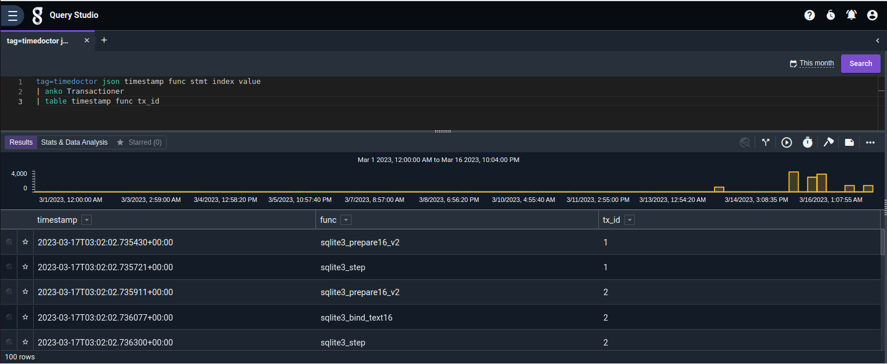

Good enough! The counter increments only when a new `prepare` log happens, otherwise it stays constant. That's just what we need. Now we can apply Gravwell's `transaction` command.

```
tag=timedoctor json timestamp func stmt index value
| anko Transactioner
| transaction tx_id 
| table tx_id transaction
```

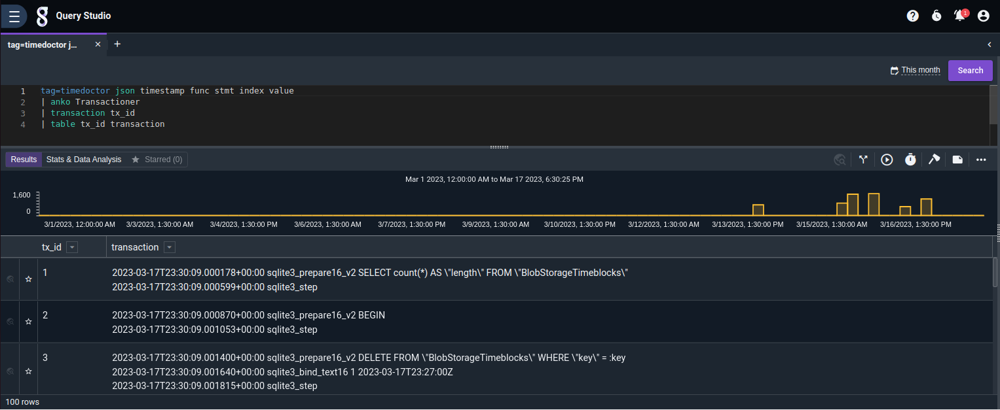

It does work, though not so cleanly. It groups events by `tx_id`, then groups any other fields in each event with a space (this generates a string per event), and then groups all the newly-generated strings with a newline (this generates a string per transaction). This string goes in a field called `transaction`. The generated events (one per transaction) have the field that was used to group events together (`tx_id`), plus the new fied `transaction` that somehow "summarizes" all the events that compose the transaction.

See, for example, the transaction with ID 3. You can see the SQL statement involved, and the values of all the parameters required. However, the new text is cluttered. We can try to fix that, and while we're at it, we'll remove the `step` events, we don't need them and they clutter our transactions.

```
tag=timedoctor json timestamp func stmt index value
| eval (func~"prepare" ||  func~"bind")
| eval (if(func~"prepare"){txt=stmt} else {txt="?"+index+" = "+value})
| anko Transactioner
| transaction -e txt tx_id 
| table tx_id transaction
```

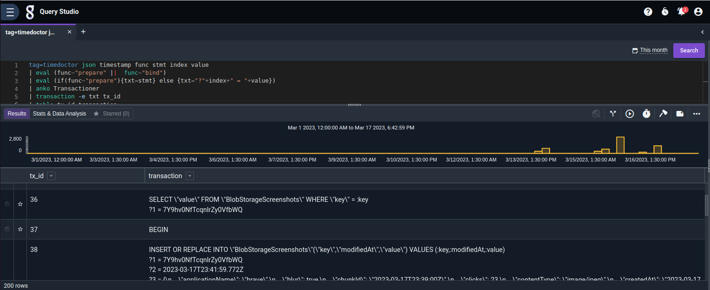

That's cleaner. Now every transaction has its SQL statement on the first line, and any subsequent lines hold the parameters, if they exist. Actually, the screenshot above is perfect, since it has examples for 0, 1 and N parameters.

That being said, that's mostly everything that can be done with a transaction in Gravwell. The core problem is that it loses a *ton* of information by generating the `transaction` field as a string. The original events could be modeled as JSON objects/hashmaps/dicts/however you call them, with keys (Enumerated Values or EVs in Gravwell) and values. By compressing all of that into a string, we lose nearly all power to keep manipulating the data. I think that the root cause is that Enumerated Values cannot have an array type (at least, as hinted by [this piece of the docs](https://docs.gravwell.io/search/eval/eval.html#variables-and-types)). If you can't have an array, you need to cast it to a string. If you cast it to a string, you lose much power. A side effect is that Gravwell cannot handle events with multiple values. For example, the [docs for the json extractor](https://docs.gravwell.io/search/json/json.html#arrays) offer you two options: you either preserve one value of the array (say, the first one) or you denormalize the data by repeating the same event multiple times, just changing the value that comes from the array. Both of those options are valid in some usecases, but it would be really useful to be able to have one event that holds all the values in some sort of array EV. It's sort of reminiscent of how, in "pure" SQL databases, you can't have an array in a table. The "proper" way is to have an extra table. However, on PostgreSQL, you can have [array columns](https://www.postgresql.org/docs/current/arrays.html) that can hold more than one value and (crucially!) are not opaque blobs of data: you can still index into the array, get its length, slice it, combine it with another (or, therefore, append a value to it) and, if required, you can "explode" the record by [unnesting it into a set of records](https://www.postgresqltutorial.com/postgresql-tutorial/postgresql-array/) (search for the "Expand Arrays" section). This is all lost if you have to cast the array into a string.

Conclusions: Can be done, requires some scripting, unclear exit plan if you need anything more than a string for human consumption. You may be able to stash a JSON-serialized object in that string, but you'll need to create transactions yourself and keep parsing them whenever you need to access that data.

### Aggregations

Another fairly common usecase is to compute some aggregations over the events. The term *aggregation* here is used [in the SQL sense](https://www.integrate.io/glossary/what-is-sql-aggregation/), that is:

1. You group your data (here, events) by a key (here, a field). This is optional. If not, there will be only one mega-group, that holds all data, and the rest proceeds as normal.
2. You apply one or more "aggregation functions" to each group, *separately*. Aggregation functions are typically statistical: count, minimum, maximum, standard deviation, mean (AKA average), whatever.
3. You summarize each group (or, if no key was provided, you summarize the entire dataset) by the results of the functions.

Here's the sample usecase: "compute the user's average activity, by day". That requires obtaining the activity for each 3-minute timeblock (it's in the monstruous JSON that holds the activity reports, in the `rawActivity` fields, we can count the number of 0's and that's the seconds that the user was not active. Subtracting that from 180 will give us the number of active seconds in that specific 3-minute block). Then we can average those activities to obtain an average "number of seconds active in 3 minutes", then dividing that by 180 will give us an average "fraction of seconds active". Easy! Riiight?

```
tag=timedoctor json timestamp func=="sqlite3_bind_text16" index==3 value~"rawActivity"
| unescape value
| json -s -e value rawActivity.buttonClicks as clicks rawActivity.keystrokes as keys rawActivity.mouseMovements as mouse id as timestamp
| anko CountAllZero clicks keys mouse
| eval secs_active=180-count 
| eval pct_active=secs_active/1.80
| stats mean(pct_active) over 1h
| chart mean
```

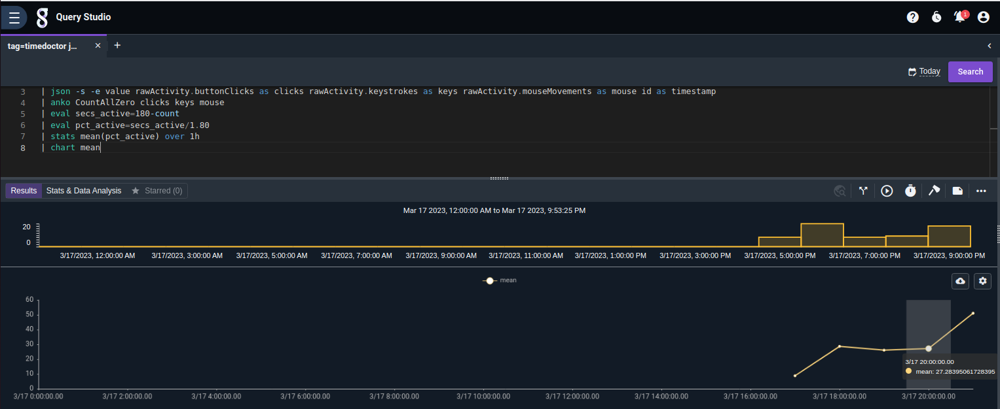

Not so easy, in the end. The main complication is the calculation of the "seconds active" metric. Here's the issue:

* We have three strings of 180 chars each. They have a count of events per second, for mouse movements, clicks and key presses.
* A second is considered "inactive" if all three strings have a 0 in that position.
* Otherwise, the second is active.

The bit about checking the three strings in tandem is what complicates stuff. That's why we had to (again!) invoke the power of Anko, the Great Scriptor.

```go
// CountAllZero.anko

fields = []

func Parse(args) {
	errstr = "usage: anko CountAllZero <field1> <field2> ..."
	fields = args
	for f in fields {
		consumesEnum(f)
	}
	producesEnum("count")
}

func Process() {
	vals = make([]string, len(fields))
	for i in range(len(fields)) {
		val, err = getEnum(fields[i])
		vals[i] = val
	}
	count = 0
	for i in range(len(vals[0])) {
		found = true
		for v in vals {
			found = found && (v[i] == "0")
		}
		if found {
			count += 1
		}
	}
	setEnum("count", count)
	return true
}
```

This script is fairly simple. The `Parse` function grabs the parameters (the part that you pass after the script name when you make the query, as in `| anko CountAllZero field1 field2`). It's similar to ARGV in C and associates. Also, as a courtesy to the user, it declares that it requires that whichever events are passed to it, they must have Enumerated Values (that is, fields) with every name in the args. Then, it also declares that it will produce a new EV called `count`, to make downstream processors happy.

Then, the `Process` function is run once for each event that comes in. It grabs the values from all the fields requested by the user, and then iterates over them in parallel. Python users may recognize the [zip function](https://www.programiz.com/python-programming/methods/built-in/zip). For each second, if all the fields have a 0 for that second, it increments a counter by 1. Finally, it sets the new field on the event and lets it go. The end result is that each event now has a new EV, `count`, that has the count of times where all fields monitored were 0. That's the count of "inactive seconds". That's why the query then subtracts that from 180, to get the count of "active seconds". The main query then transforms that to a percentage (by dividing it by 1.8, so that 180 becomes 100) and computes stats on it, by hour. Hence, you can see your activity by hour.

Conclusions: Doable, some scripting required, forgivable since the specific usecase is really evil (zip three strings, count the amount of times where all three are zero? Really?)

### Dashboards, simple

A key functionality of a log analyzer is the presentation of pretty dashboards. The pimary function of such dashboards is to calm nervous stakeholders. Hence, it's vital that the charting capabilities of the tool are up to par, to ensure that no lack-of-calmness incidents happen.

For this task, we'll want:

* An "activity timeline", where we can see when in the day the user was active and inactive.
* A table of apps that were used today, with percentages
* A table with the top 5 most visited domains (not URLs, but domains!)

*(cracks knuckles)* OK, let's start!

We'll present that timeline with a 3-minute granularity, since that's what TimeDoctor reports. A 3-minute block is inactive if all its counts (i.e. mouse moves, clicks, keypresses) are 0, and active otherwise. The fun part will be finding an appropriate visualization.

```
tag=timedoctor json timestamp func=="sqlite3_bind_text16" index==3 value~"rawActivity"
| unescape value
| json -s -e value clicks keys movements as mouse id as timestamp
| eval if(clicks>0||keys>0||mouse>0){active=1}else{active=0}
| table timestamp active
```

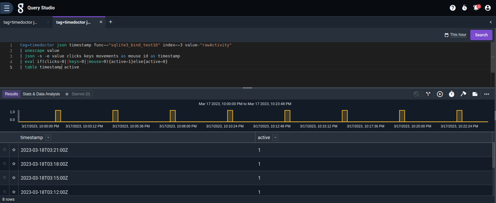

The data works. We get one entry per 3-minute block, with a 1 if there was any activity and a 0 otherwise. The visualization, however, does not seem to exist. Nor could I find a "plugin hub" where people can publish custom "content packs", such as new chart types. There's Kits, but there are very few of them, most by Gravwell themselves, and are mostly aimed at providing saved searches, ingestion configurations and dashboards, but not new visualizations. Compare with, say, Grafana, which has a vibrant Plugin ecosystem in which you can find, among other things, [new Panel types](https://grafana.com/grafana/plugins/?type=panel). That's a very big part of what makes Grafana so popular and powerful. And even if there weren't many plugins, the mere fact that there is a provision for extending the system makes it easier for you to create your own. Gravwell doesn't seem to have the extension points to load new visualizations.

I wanted to display something like Grafana's [State timeline panel](https://grafana.com/docs/grafana/latest/panels-visualizations/visualizations/state-timeline/), with "WORKING" and "NOT WORKING" states. Looks like we'll have to settle for a line chart which plotts the average activity per hour or so.

Next up, we had "a table of apps that were used today, with percentages". That will require poking into a different field of the same JSON records: `timeuse`, which contains the process name, window title (we won't use that, since it can vary for the same app) and seconds where the app started and stopped being used. We can group all records by process name, and then sum the differences between the stop and start times.

```
tag=timedoctor json timestamp func=="sqlite3_bind_text16" index==3 value~"rawActivity"
| unescape value
| json -e value -s -x timeuse timeuse
| json -e timeuse app!="" start end
| eval secs_used=(end+0-start) /* +0 to coerce all the eval into numeric mode, otherwise numbers are treated as strings */
| stats sum(secs_used) by app
| chart sum by app
```

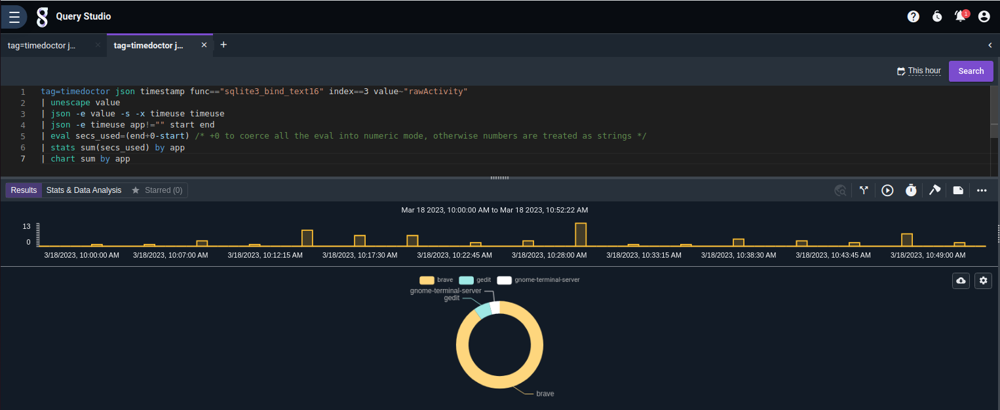

That didn't pose any problems. The only gotcha was that, for some reason, double-extracting JSON caused numeric fields to be converted into strings. Thus, subtracting them didn't work. That can be fixed by forcing Gravwell to operate on numeric mode: for example, by adding 0 to `end` before subtracting `start`, `end` is interpreted as a number. Then `end+0`, which is a number, in turn forces `start` to be interpreted as a number. After that, it's just a matter of picking an appropriate visualization, and I'm partial to donut charts over pie charts.

The final task is a table with the top 5 most visited domains, also for today. This will test the ability to extract a domain from a URL. This requires using a vulnerable browser, since as we discovered in the previous article, Firefox seems immune to URL capturing, for some reason. Not that I'm complaining. The URLs visited reside in the same `timeuse` field from which we extracted app usage.

A simple version can be made with just a regex that extracts the domain, defined as the bit after `://` and before the next `/`. This would also pull basic auth info and port, but those are quite uncommon.

```
tag=timedoctor json timestamp func=="sqlite3_bind_text16" index==3 value~"rawActivity"
| unescape value
| json -e value -s -x timeuse timeuse
| json -e timeuse url!="" start end
| regex -e url "[^:]://(?P<domain>[^/]+)/"
| eval secs_used=(end+0-start) /* +0 to coerce all the eval into numeric mode, otherwise numbers are treated as strings */
| stats sum(secs_used) by domain
| chart sum by domain
```

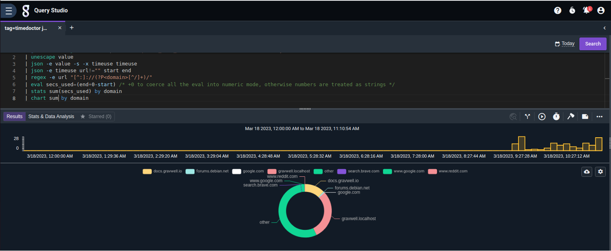

Not bad, but we want more. As it is, the query distinguishes different subdomains of the same primary domain:

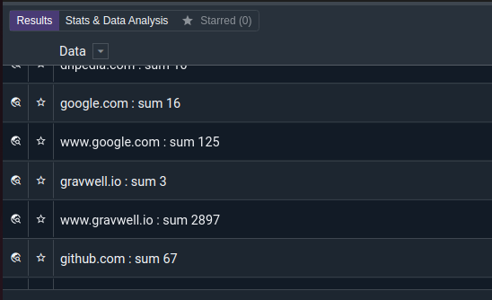

It treats `google.com` and `www.google.com` as different. Now, in some cases that may be desirable: Slack, for example, gives a different subdomain for every community. If we collapsed by primary domain, there would be no distinction between different Slack communities. For this article we'll assume that you want to simplify by domain, so that we can demonstrate more functionality.

That being said, what identifies a "primary domain"? A first-order approximation is "the two last sections of the hostname, when split on periods". That means that the primary domain of `docs.gravwell.io` is `gravwell.io`, while the domain of `config.mail.google.com` is `google.com`. That, however, doesn't work on some domains: for an example, see `.co.uk`. That's the "commercial" second-level domain for the United Kingdom. You can have `mycompany.co.uk`, but that is NOT the same as `competitorcompany.co.uk`. Our simple approximation, however, would treat them as equivalent. Sadly, there's no rule to determine those. You need a list.

Enter Mozilla's (and friends') [Public Suffix List](https://publicsuffix.org/). It's one of those weird bits of infrastructure that hold the entire Internet together, yet no one knows about. Its original purpose was to limit the scope of cookies: you are not allowed to set a cookie for `.com`, as you would be able to track users across all `.com` domains. The widest that a cookie can be set is `SOMETHING.com`. Same for `.co.uk`: you can only set cookies one level below that. Firefox also uses it to highlight the "actual domain", as an aid agains phishing: a common tactic is to register, say `mail.google.com.SOMEVERYLONGRANDOMSTRING.myshadydomain.com`. A not-careful-enough user will look at the start, see `mail.google.com` and happily provide his credentials[^3]. Firefox attempts to help by highlighting the actual domain name: the public suffix and the single part before that.

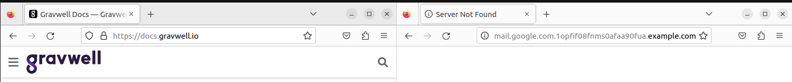

Here you can see the PSL in action. `.io` is in the PSL, so the left tab highlights `gravwell.io`. `.com` is also in the PSL, so the right tab highlights `example.com`, hopefully helping a user not look at the `mail.google.com` bit at the start. Let's replicate that!

First we need to get the PSL into Gravwell. We'll use a [Flow](https://docs.gravwell.io/flows/flows.html) for that, since we haven't checked them out and it seems like an important part of Gravwell's offering. A simple Flow is enough, as we just need to query a URL, then lightly preprocess the data (to remove empty lines and comments) and then update a resource with that information.

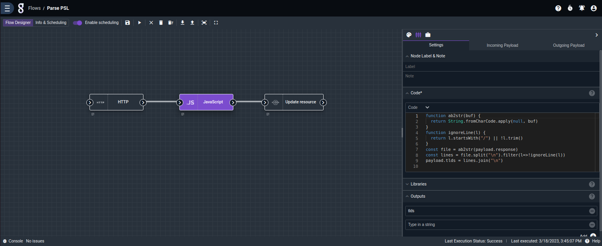

This is the configuration for the preprocessing node, which is the most complex. `payload.response` comes from the previous step. After much messing about, I figured out that, while in the Debug view it appears as a Base64 encoded string, the `response` from an HTTP node is actually a `UInt8Array`. Thus, we first need to convert it to a string. Then we split it on newlines, remove those that are blank or start with a slash, and then rejoin all lines with newlines again. That comes out of the node in the `payload.tlds` field (note that we need to explicitly declare that we are setting that field in the Outputs dropdown). That large string can be passed to an Update Resource node, which saves it in the Gravwell resource storage. From there, it can be used in a `lookup`.

```
tag=timedoctor json timestamp func=="sqlite3_bind_text16" index==3 value~"rawActivity"
| unescape value
| json -e value -s -x timeuse timeuse id as timestamp
| json -e timeuse url!="" start end
| regex -e url "[^:]://(?P<domain>[^/]+)/"
| eval secs_used=(end+0-start) /* +0 to coerce all the eval into numeric mode, otherwise numbers are treated as strings */
| anko FindMainDomain
| table timestamp, domain, true_domain
```

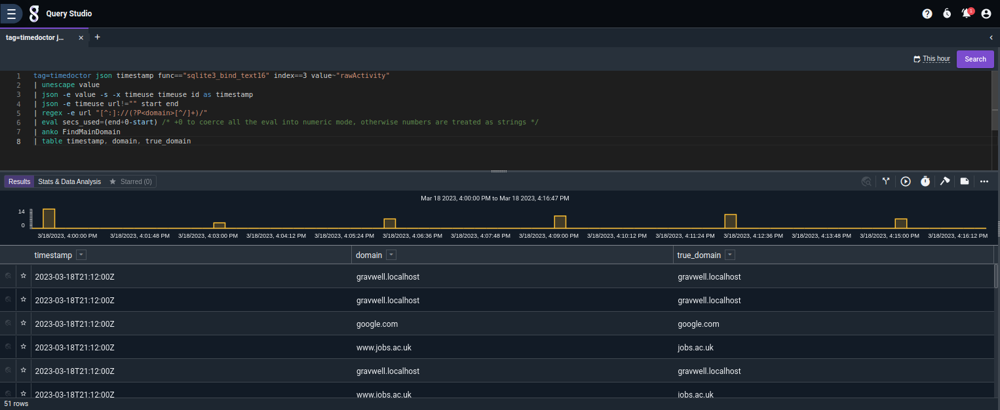

Much better. I even visited a `.co.uk` page, just to check that it worked. It also handles `.localhost`, which is NOT in the PSL. This is the Anko script that was required:

```go
// FindMainDomain.anko

var strings = import("strings")

var psl = []

func Parse() {
	data, _ = getResource("psl")
	psl = strings.Split(data, "\n")
	consumesEnum("domain")
	producesEnum("true_domain")

	return nil
}

func Process() {
	matches = []
	for i = 0; i < len(psl); i++ {
		if strings.HasSuffix(domain, "." + psl[i]) {
			matches += [psl[i]]
		}
	}
	# now find the longest match
	longest_match = -1
	for i = 0; i < len(matches); i++ {
		if len(matches[i]) > longest_match {
			longest_match = len(matches[i])
			pieces = strings.Split(strings.TrimSuffix(domain, "." + matches[i]), ".")
			setEnum("true_domain", pieces[len(pieces)-1] + "." + matches[i])
		}
	}
	if len(matches) == 0 {
		setEnum("true_domain", domain)
	}
	return true
}
```

There's probably far cleaner ways of doing this, but I was getting tired and wanted to get it done. Like someone said (I can't remember who), "if I'd had more time, I'd had written a shorter script". At present, it brute-forces things by running over the entire PSL every time, finding all the entries that are suffixes of the current event's domain, and then choosing the longest one as the correct public suffix. This is because the list includes, for example, `.uk` and `.co.uk`, so we need to handle the case where more than one entry matches the domain. Finally, it returns the "true domain", which is the publix suffix determined before, prepended with whatever went before it in the domain name, up to the first period, running backwards. For instance, if we receive `sub.domain.co.uk`, it'll match `.uk` and `.co.uk`. We'll choose `.co.uk` as its public suffix, because it's longer, and then we'll return `domain.co.uk` (the public suffix prepended with what went before up to a period).

```
tag=timedoctor json timestamp func=="sqlite3_bind_text16" index==3 value~"rawActivity"
| unescape value
| json -e value -s -x timeuse timeuse id as timestamp
| json -e timeuse url!="" start end
| regex -e url "[^:]://(?P<domain>[^/]+)/"
| eval secs_used=(end+0-start) /* +0 to coerce all the eval into numeric mode, otherwise numbers are treated as strings */
| anko FindMainDomain
| stats sum(secs_used) by true_domain
| chart sum by true_domain
```

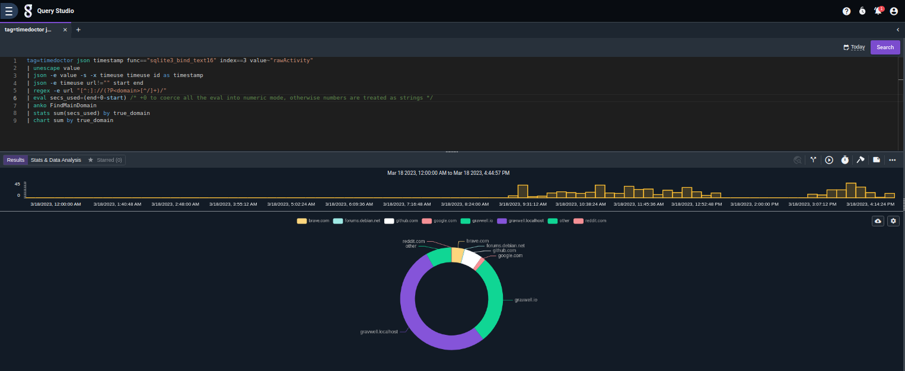

And this is the final query, ready to include in the dashboard.

How does the dashboard look now?

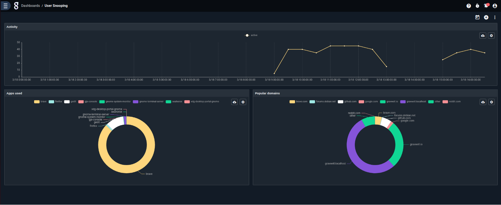

Quite neat! It does contain the three panels, though the first one isn't how I wanted it. The two lower panels provide the information required, without any caveats.

Conclusions: Simple usecases are OK. More exotic visualizations aren't supported. Even the built-in visualizations suffer from a lack of configuration options: how can I specify that I only want to see apps that were used over 5% of the time, and [lump all others in an Other category](https://grafana.com/docs/grafana/latest/panels-visualizations/visualizations/pie-chart/#limit)? How can I change [the color of an option](https://community.grafana.com/t/advanced-graphing-part1-style-overrides/207#color-point-overrides-2)? How can I add [thresholds](https://grafana.com/docs/grafana/latest/panels-visualizations/visualizations/time-series/#from-thresholds) in the line graph, so that everything below 10% signals "too quiet, simulate some more activity or you'll get in trouble"? What if I want to control the appearance of the legend? All those things end up requiring the developer to open up (more or less) complete access to the underlying charting API, and that is a lot of work. Grafana has that more or less under control due to the massive amount of time and people that have worked on it; Gravwell (a much smaller and less popular product) has far less configuration options.

More conclusions: There appears to be no way to add new visualization types. That's a bummer.

### Dashboard interaction

Another usecase that standard "exploratory dashboards" provide is an ability to both a) set a value on a "filter field", that typically appears at the top, and have it affect multiple panels, and b) make it so that clicking on a datapoint updates the aforementioned filter, so that the entire dashboard is "focused" on a certain subset of the data. Such tools are the backbone of BI tools such as [Metabase](https://www.metabase.com/docs/latest/dashboards/interactive), where they're typically called "drilldown". Let's test how well Gravwell supports both of those usecases.

In order to have a configurable field in the dashboard, a query must be built that uses variables. These specific queries [are called Templates](https://docs.gravwell.io/gui/templates/templates.html) and handled separately. 

```
tag=timedoctor json timestamp func=="sqlite3_bind_text16" index==3 value~"rawActivity"
| eval value~"%%DOMAIN%%"
| unescape value
| json -s -e value clicks keys movements as mouse id as timestamp
| eval if(clicks>0||keys>0||mouse>0){active=1}else{active=0}
| stats sum(active) as active over 15m
| eval if(active>0){active=1}else{active=0}
| chart active
```

When editing the variable's configurations, I also added a default value of `none` and ensured that its value was not required, since otherwise the dashboard started asking for a value every time it was displayed, and that gets old fast. Here's the view when creating the Template:

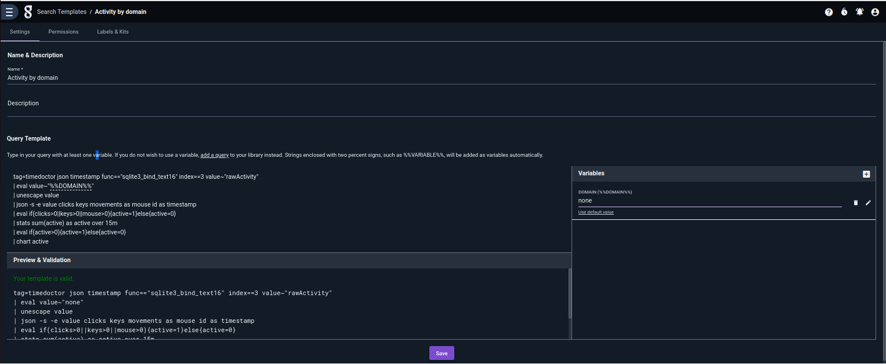

In a Template, anything that is between double percent signs (such as `%%DOMAIN%%` here) will be a variable. if the Template is run manually, like a saved search, the user will be prompted for a value before the search actually runs. If a dashboard Tile is added from that Template, the Dashboard itself will now start asking for the variable.

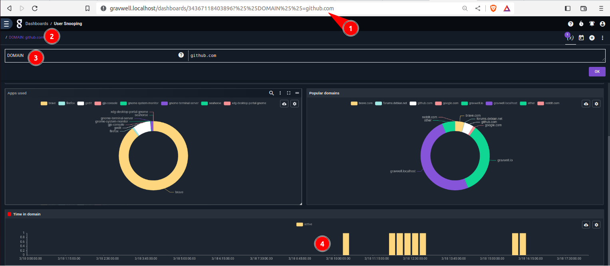

For example, here, the `DOMAIN` variable is now part of the querystring (1). It appears in the dashboard's breadcrumbs (2), and there is a special button that displays all variables (3). Finally, the new Tile (4) uses the created Template. Indeed, if I now switch to a new domain, it will be clear at which point in the day the user visited it:

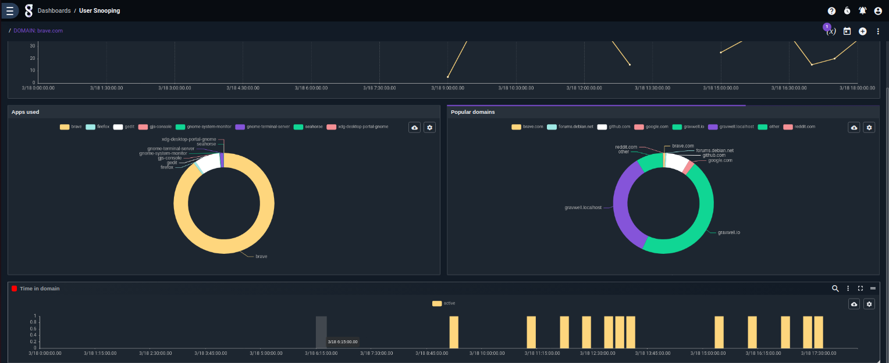

Unfortunately, that's about the extent of what I could do. The next step would be to automatically update the variable whenever the user clicks on a section in the right-hand side donut chart, which displays the top domains visited today. Sadly, that does not seem to be possible. Gravwell has [Actionables](https://docs.gravwell.io/gui/actionables/actionables.html), but they only work on certain patterns in raw searches. They're handy to launch a dashboard from the Search Studio, not so much to navigate between dashboards or dashboard views from a chart. Grafana has [Data Links](https://grafana.com/docs/grafana/latest/panels-visualizations/configure-data-links/), which let you specify that "when I click on a section of the donut chart, grab its key (not the value, since that would be the metric!), then compose a URL that includes that key and navigate to it. See for example [here](https://play.grafana.org/d/ZvPm55mWk/7-new-features-in-v6-3?orgId=1&viewPanel=27): depending on which webserver you click, you'll be sent to a new dashboard with a variable prepopulated for that webserver. I couldn't find such functionality in Gravwell.

Conclusions: Basic functionality is in place, works well for fully "investigative" dashboards (i.e., dashboards where ALL Tiles require a variable to be set), not so much when you want a general view and other panels that fill up with detailed information. Furthermore, interactions cannot happen from charts, only search results.

### Dashboards, custom

To round up this exploration of Gravwell, I intended to see how easy it was to create a new visualization. The usecase was to display the taken screenshots, in a "carousel"-type view. We can extract the raw, Base64-encoded images from the logs, we just need a way to display them.

Grafana seems to be able to do so, as hinted in [this forum post](https://community.grafana.com/t/how-to-use-base64-encoded-images-in-datatable/39003/2). Even if it couldn't, we could write a plugin that decoded and rendered a Base64 image (open plugin architecture FTW!). At present, you can use a dedicated panel or even coerce the humble table view to do your bidding, and render that entry as [raw HTML with an inline image](https://www.tutorialspoint.com/how-to-embed-base64-images-in-html). Or use [this plugin](https://github.com/ryantxu/image-viewer-panel), which produces [this amazing result](https://global.discourse-cdn.com/grafana/original/2X/f/f1ab58bcf471205ae1e57f2ec2304e68e09f9150.jpeg): images are "stacked" side by side, like books in a bookcase, and hovering over an image reveals it completely.

Alas, we can't do anything like that in Gravwell, at least not that I could find. There is no such visualization type, nor provision to display raw HTML in the table renderer, nor a way to create new renderer types. We have bumped into this before, when trying to create an activity timeline. This is another instance of the same functionality not being present: lacking a way to extend the renderers means that you'll simply be tied to whatever there is. While "whatever there is" is perfectly serviceable for dashboard-y requirements, it would be nicer to know that, if you needed something extra, you could escape into the world of arbitrary code and do whatever you wanted. In Grafana, for instance, you build a Javascript package that (if I remember correctly) should expose an Angular component. Within that component, you're mostly free to generate whatever DOM you want: [plotting libraries](https://grafana.com/grafana/plugins/barchart/), [mapping libraries](https://grafana.com/grafana/plugins/grafana-worldmap-panel/), [arbitrary SVGs](https://grafana.com/grafana/plugins/aceiot-svg-panel/), [images](https://grafana.com/grafana/plugins/volkovlabs-image-panel/), [calendars](https://grafana.com/grafana/plugins/marcusolsson-calendar-panel/), whatever.

Conclusion: Nothing at all (at the time of writing this, obviously)

## Recap

* [Gravwell](https://www.gravwell.io/) is a data platform (in their own words) that lets you ingest logs (application logs, server logs, security logs, network logs, beer brewery logs, IoT logs, all the logs), stores them and lets you query them. Its query model seems to be more flexible than that of ElasticSearch (when using the Kibana Query Language) or Grafana Loki, and in the spirit of Splunk's Search Processing Language, albeit less powerful than the latter.
* Gravwell has all the basic log filters, transformations and aggregations (i.e., the [magic triad of functional programming: filter, map and reduce](https://dev.to/mlevkov/the-holy-trinity-map-filter-and-reduce-381e)).
* In case of emergencies, one can always take the escape hatch into actual scripts with [the Anko module](https://docs.gravwell.io/scripting/anko.html). I'm unsure about how much it's a normal, expected task to write an Anko script while developing a query, and how much is my developer brain finding code easiest for solving many problems that could be solved otherwise.
* It has other goodies, such as a built-in Flow editor in the style of NodeRED, that can be used to implement some tasks without requiring yet another system to be set up and connected to the data.
* However, it lacks some extension points that would make it truly powerful. For instance, custom visualizations. This may be especially bad for it given that, judging from its webpage, Gravwell's primary competitor is Splunk (which is understandable, as even their pricing model apears like an attempt to destroy Splunk). However, Splunk does have [custom visualizations](https://splunkbase.splunk.com/app/3112). I found the same situation with other assorted shortcomings: Splunk tends to have the associated functionalities. Again, understandable: they seem to be a much, *much* smaller and younger company than Splunk. As an example, in LinkedIn, Gravwell has "11-15 employees", while Splunk has "5001-10000 employees". You just can't compete with that. These shortcomings, though, may deter people from migrating to Gravwell. Which is bad (for them).

In the next article (already being written), we'll snoop on TimeDoctor's HTTPS communications. Simple Wireshark won't do, since it's encrypted. We'll explore both intercepting the connection with a proxy and intercepting the calls before they get made, with Frida (again!). Stay tuned!

[^1]: Indeed, I'm using Go syntax highlighting in all Anko scripts, and it appears to work quite well.
[^2]: Terms and conditions apply, see fine print, yadda yadda
[^3]: A careless user will provide his credentials without looking at the URL bar, by the way
