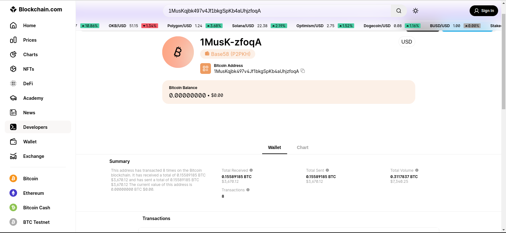
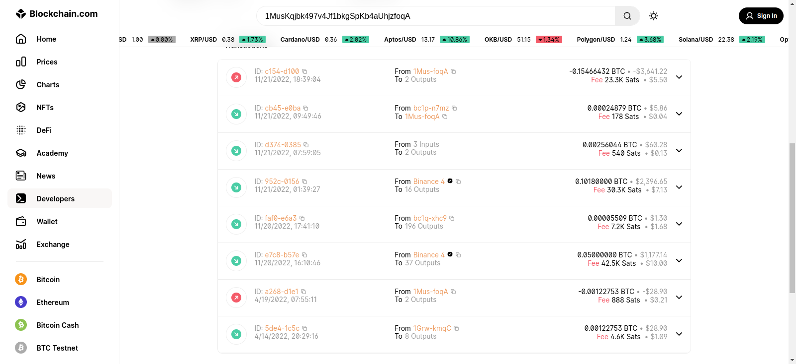
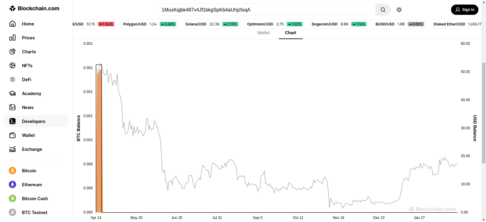
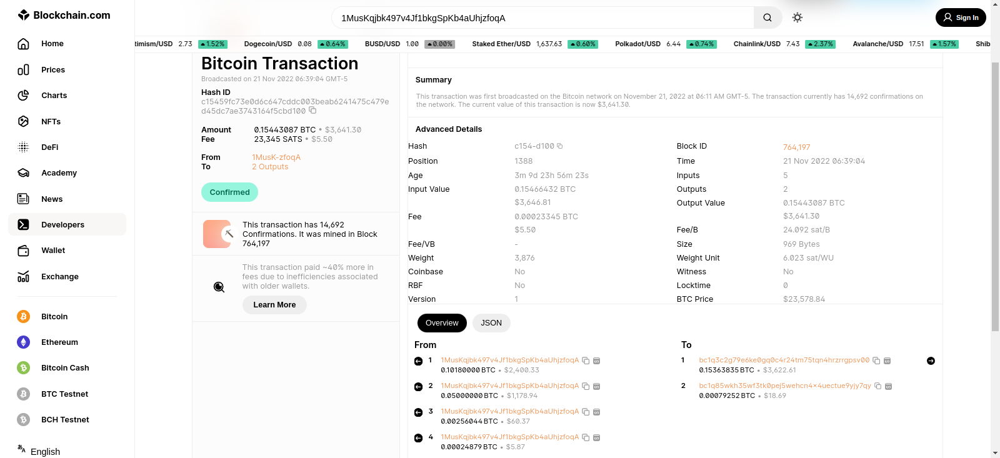
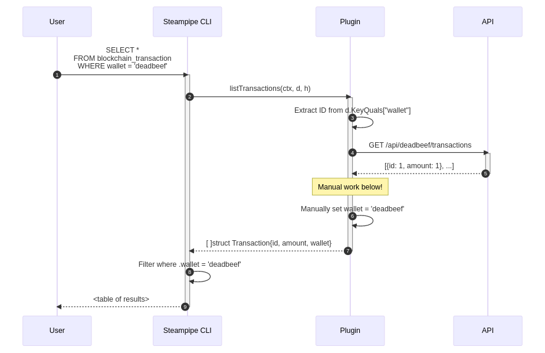
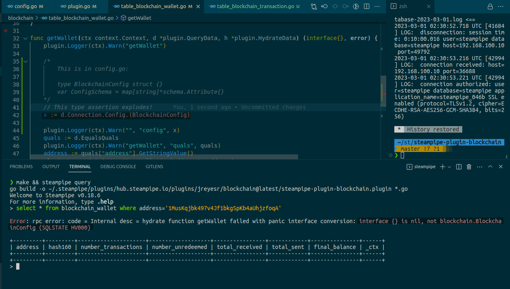

In this post, we'll cover the development of a [Steampipe](https://steampipe.io) plugin that provides information about Bitcoin wallets and transactions. For a wallet, you'll be able to get its current balance, the number of transactions that it has participated in, and its total cash flow (both incoming and outgoing). You'll additionally be able to list all transactions that involved a specific wallet. For a specific transaction, you'll be able to see its date, amount, fee and the wallets that participated in it.

> **UPDATE, 2023-03-13:** This is not all! The plugin now features automatic retries in case of API rate limits, a bunch of automated checks that can be run on demand, and a dashboard that can be used to get some information about a Bitcoin wallet. For more information, see [the next post](https://jreyesr.github.io/posts/steampipe-part-int-pi-mods/).

Some possible uses of this plugin may be:

* Monitor your own wallet, and get alerts when its balance goes down (an unauthorized withdrawal alert, yay!)
* If you have a business that accepts Bitcoin, ~~snoop on~~ inspect every wallet with which you do business.
* If you have a list of known-bad wallets, alert when they are seen anywhere near your logs.
* Observe transactions in which you have been involved, to trace backwards and forwards to other wallets that were involved in the same transactions as you.
* Ensure that a certain wallet never goes below a threshold, to prevent Critical Business Processes from stopping due to lack of funds.

And also, the most important use (for me):

* Learn more about Steampipe plugins, this time with a real-world objective. My [first plugin](https://jreyesr.github.io/posts/steampipe-part-one/) wasn't constrained by such mundane considerations as "does it solve a problem?". That's good for learning, but nothing beats having to accommodate a real target.

## The problem

We desire to have a way of getting data about Bitcoin wallets. Something like [Blockchain.com's Explorer, previously Blockchain.info](https://www.blockchain.com/explorer). This webpage provides a way of searching for a particular bitcoin wallet, and obtaining interesting data about it: its current balance, the number of transactions in which it has been involved (as a sender or receiver of funds), the total amount of funds sent and received by the wallet, and the transactions in which it was involved:



This is the main screen for a wallet. It displays the wallet's balance and total flows (in and out), also converted to dollars at the current exchange rate. When you scroll down, you see the transactions in which this wallet participated:



It also shows a neat chart displaying the wallet's balance against the Bitcoin price at that time, which translates into the wallet's worth in dollars at every point in time.



This particular wallet is a really poor example, since it just received money and then sent it away. That's the orange bit at the start of the graph. On a more active wallet, you may see the solid black line moving up and down, and the orange area too, depending on the wallet's balance and the exchange rate for Bitcoin at that time.

Clicking on a transaction's ID takes you to the transaction detail page:



This screen shows the amount involved in the transaction, the fees, a bunch of technical information about the block position, version, size and locktime, and the wallets that provided and received the money that was involved in this transaction.

OK, that's all fine. However, we want to move that into Steampipe. 

## Prior art

As far as I could see, there is no way of obtaining that information in Steampipe. There's the [Finance](https://hub.steampipe.io/plugins/turbot/finance) plugin (written by Turbot), which does support Bitcoin, but that only returns information about Bitcoin as a currency, mostly its trading volume, yearly highs/lows and current exchange rate to real-world currencies. That's nothing about individual wallets. There's also the [Bitfinex](https://hub.steampipe.io/plugins/kaggrwal/bitfinex) plugin (third-party), but that one also shows only currency-level information, this time also with exchange rates to other cryptocurrencies.

As for sites to explore wallets and transactions, there's multiple of them:

* https://www.blockchain.com/explorer
* https://www.blockonomics.co/
* https://explorer.btc.com/
* https://blockchair.com/ (may be down?)

These all work the same way: you input a wallet ID or transaction hash, and they show you the details about that object. Some of them also offer REST APIs for the same purpose (in fact, their web apps probably feed from their respective APIs). However, that's an isolated API, and if you ever need to mix its data with anything else, you'll probably find yourself hacking together a script to do so. That's the exact problem that Steampipe aims to solve, so let's give it the knowledge of Bitcoin wallets and transactions too!

## The plugin

### Wallets table

| Address | Hash160 | # of transactions | # unredeemed | Total received | Total sent | Balance |
| - | - | - | - | - | - | - |
| Base58Check-encoded address of the wallet | Hex-encoded hash of the public key for the wallet | Total amount of transactions that this wallet has been involved on (as a sender or receiver) | Transactions that have not been spent | Total funds that have come into the wallet, in satoshis | Total funds that have come out of the wallet, in satoshis | Received - Sent, in satoshis |
| 1MusK... | e5622... | 8 | 0 | 15589185 | 15588185 | 1000  |

This table is implemented in the `blockchain/table_blockchain/wallet.go` file. It has no List function, since there is no reasonable way to list all the wallets in existence, nor is there a way to filter them, except by address, which is precisely the Get function.

To that end, the address column is marked as a `KeyColumn`, which means that you must provide it (in the `WHERE` clause) for the Get function to be called. Otherwise, the List function would be called, and since this plugin doesn't implement it, it would raise an error. The function is quite simple, since it just needs to call an API endpoint and parse the response:

```go
func (c BlockchainClient) GetWalletInfo(address string) (WalletInfo, error) {
	url := fmt.Sprintf("%s/address/%s", API_BASE_URL, address)

	res, err := http.Get(url)
	if err != nil {
		return WalletInfo{}, err
	}
	defer res.Body.Close()
	if res.StatusCode != 200 {
		return WalletInfo{}, fmt.Errorf("GetWalletInfo - %s", res.Status)
	}
	body, _ := io.ReadAll(res.Body) // Read the response into a []byte

	var data ApiWrapper[WalletInfo] // The data will be populated here
	if err := json.Unmarshal(body, &data); err != nil { // Trigger the JSON unmarshal
		return WalletInfo{}, err
	}
	if data.Status != "success" {
		return WalletInfo{}, fmt.Errorf("%s", data.Message)
	}
	data.Data.FillHash160() // This populates the Hash160 column, since the API doesn't provide it

	return data.Data, nil
}

func getWallet(ctx context.Context, d *plugin.QueryData, h *plugin.HydrateData) (interface{}, error) {
	plugin.Logger(ctx).Warn("getWallet")

	quals := d.EqualsQuals
	plugin.Logger(ctx).Warn("getWallet", "quals", quals)
	address := quals["address"].GetStringValue() // Grab the address from the EqualsQuals
	plugin.Logger(ctx).Warn("getWallet", "address", address)

	client := BlockchainClient{}

	walletInfo, err := client.GetWalletInfo(address) // Call the API passing it the wallet address
	plugin.Logger(ctx).Debug("getWallet", "res", walletInfo, "err", err) // walletInfo contains the API response as a struct
	if err != nil {
		return nil, err
	}

	return walletInfo, nil // We return the struct directly, Steampipe will take the correct fields out
}
```

That's mostly it for the Wallet table. It's made simpler by the fact that you Shall Not list all Bitcoin wallets, so that's half of the code removed before we even start.

### Transactions table

| Hash                                                         | Time                                                  | # of inputs                                                  | # of outputs                                                 | Input value                                         | Output value                                             | Fee                                  |
| ------------------------------------------------------------ | ----------------------------------------------------- | ------------------------------------------------------------ | ------------------------------------------------------------ | --------------------------------------------------- | -------------------------------------------------------- | ------------------------------------ |
| The hash of the transaction                                  | Timestamp of the block that included this transaction | Count of wallets that sent the funds included in this transaction | Count of wallets that received the funds included in this transaction | Sum of satoshis that were sent by the input wallets | Sum of satoshis that were received by the output wallets | Satoshis that were paid to the miner |
| c154... | 2022-11-21T18:41:18-05:00                             | 5                                                            | 2                                                            | 15466432                                            | 15443087                                                 | 23345                                |

The Transactions table *does* have a List function... sort of. You can list transactions, but only if they involved a single wallet. Otherwise, you're basically asking to stream the entire blockchain, and good luck with that (at least if you want to do interactive queries with SQL). Also, you can get the details of a single transaction, as specified by its hash.

To implement searching by wallet, we'll use the approach explored in the [previous post](https://jreyesr.github.io/posts/steampipe-part-one/#attempt-3-a-dedicated-_search-table-with-a-stringjson-query):

1. Declare a search column on the table (in this case, it's called `wallet`). It will be a string.
2. Declare that column as a `KeyColumn` in the `ListConfig` struct, mark it as required.
3. In the List hydrate function, get the wallet address from the `d.EqualsQuals` field, and then provide it to the client.
4. (IMPORTANT) Make sure that the returned objects include the `wallet` field set to the provided wallet, since Steampipe filters the results after your plugin returns. If you don't fill that field, Steampipe will discard all results. See below:



If Step 6 didn't happen, the data returned by the plugin to Steampipe would not include the `wallet` column. Then, Steampipe would apply the SQL conditions in the original query to it, and it would drop all results. In effect, you would see that your plugin does return data, but the Steampipe CLI displays an empty column.

Also, this warning is not at all based on real-world experience by the author. Anyone saying otherwise is kindly reminded that they have no proof to the effect.

In this plugin, that was originally implemented internally in the `client.go` file, so that the `table_blockchain_transaction` file was not cluttered:

```go
// client.go

func (c BlockchainClient) GetTransactionsForWallet(address string, page int) ([]TransactionInfo, error) {
	// Lots of error checking deleted!
	url := fmt.Sprintf("%s/address/%s/tx?page=%d", API_BASE_URL, address, page)
	res, err := http.Get(url)
	body, _ := io.ReadAll(res.Body)
	var data ApiWrapper[PaginatedWrapper[TransactionInfo]]
	json.Unmarshal(body, &data)

	// Manually set the .Wallet field to the searched value
	// NOTE Don't iterate over the value! range creates a copy of it, and we need the original
	for i := range data.Data.Items {
		data.Data.Items[i].Wallet = address
		data.Data.Items[i].FillTime() // The time is returned as an int, we need it as a time.Time object so that Postgres can work with it
	}

	return data.Data.Items, nil
}
```

Just before returning the transactions, the code iterated over all of them, and it filled the `Wallet` and `Time` fields. The `Wallet` field took the value of the input to the function, and the `Time` field was the `time.Time` object corresponding to the timestamp (in seconds) stored in the `OriginalTime` field.

Also, another warning that is not at all based on personal experience, and that may bite you if you are not a regular Go programmer. **The** **`range`** **keyword returns a copy of every item, not a pointer to it**. This is covered in the [Go wiki](https://github.com/golang/go/wiki/Range#gotchas), but that's not exactly the first document that you'll read. That's why, even though it's shorter and arguably clearer, the loop is not:

```go
// WARNING: This won't work, item will be a copy of the original data!
for _, item := range.Data.Items {
	item.Wallet = address
	item.FillTime()
}
```

That will discard the changes made to each item as soon as the iteration completes. Instead, you need to iterate over the indices, and index into the slice every time. That *does* access the original data.

Later, I reviewed the [Github plugin for Steampipe](https://hub.steampipe.io/plugins/turbot/github), that also implements a [search for repositories](https://hub.steampipe.io/plugins/turbot/github/tables/github_search_repository). It exposes a table called `github_search_repository`, in which you can fill a `query` column. That column is [defined in the code](https://github.com/turbot/steampipe-plugin-github/blob/9026c38849ddf598f2655176d80574ce8d5e3d3a/github/table_github_search_repository.go#L23) with `Transform: transform.FromQual("query")`, which takes its value from the incoming query and reflects it back on the result table. That's a really clean way of handling precisely that requirement, and I assume that the developers added it just for that. It's not mentioned in the docs (at least, not that I could find it, nor Google), but some example repositories (or the code autocompletion, if using an IDE that supports it) will reveal to you the hidden secret of the `FromQual` transform. Thus, when you review the plugin code, you'll see that there is no `Wallet` field in the response struct, since it's not required: the plugin scaffolding will add it. 

The `FromQual` transform also appears to behave correctly when calling the Get function: it sets its value to `null`, which is correct since when getting a single transaction you'll use the transaction's hash as a unique ID, not the wallet as a search term.

This function call also requires pagination, since the API returns a maximum amount of transactions in a single API call. This plugin does the same as some others: it keeps sending requests until one of them returns 0 results. At that point, it assumes that we've hit the end of the data, and terminates. This is a really neat way to do pagination without having to fetch a total count of items first and then compute the number of pages, which sounds like a recipe for off-by-one errors. That strategy is also reminiscent of reading files in C, where you can read with the `fread()` function until you reach EOF, as signaled by a return value of 0[^1]. 

```go
func listTransactions(ctx context.Context, d *plugin.QueryData, h *plugin.HydrateData) (interface{}, error) {
	wallet := d.EqualsQuals["wallet"].GetStringValue()
	client := BlockchainClient{logger: plugin.Logger(ctx)}

	page := 1 // Pagination for this API starts at 1!
	for {     // Run over all pages until we get an empty one, that means we're done
		transactions, err := client.GetTransactionsForWallet(wallet, page)

		for _, tx := range transactions { // Send all items one by one to Steampipe
			d.StreamListItem(ctx, tx)
		}

		if len(transactions) == 0 {
			break
		}

		page++
	}
	return nil, nil // No need to return anything, all itemas have been streamed already
}
```

The List function initializes the page number to 1, and then enters an infinite loop. The client gets the records corresponding to that page, they get streamed back to Steampipe, and then the loop is broken if this page returned 0 results. Otherwise, the page number is incremented and the loop cycles. In that way, we keep calling the API as long as it keep returning results, and we terminate as soon as it returns a single empty page.

Note that this method is slightly inefficient, since it will always send one more request that strictly required. For example, for 14 records paginated in groups of 10, the client will send 3 requests, that will return 10, 4 and 0 results. If the API provided an endpoint that returned a count of resources, it would still require 3 requests: the count request, then 10 and 4 results. The optimal way would be to inspect the "total_results" parameter of the first response (or its equivalent), if provided. Most/all APIs that paginate results also include a field that lists the total number of items, so that client-side tables can compute the number of pages. However, that complicates the code, since it now needs to treat the first request especially. Doing that would only send 2 requests with 10 and 4 results.

The GetSingle function is a lot simpler, since it doesn't require pagination. It simply takes a transaction hash and returns the details of that transaction:

```go
func getTransaction(ctx context.Context, d *plugin.QueryData, h *plugin.HydrateData) (interface{}, error) {
	hash := d.EqualsQuals["hash"].GetStringValue()
	client := BlockchainClient{logger: plugin.Logger(ctx)}

	txInfo, err := client.GetTransaction(hash)
	return txInfo, nil
}
```

This function does not fill the `wallet` field in the response, since a Bitcoin transaction is not actually tied to a single wallet, but a series of them. In the List endpoint we treat the wallet that the user queried especially and we say, in essence, "the following transactions involved that wallet you are interested in", but when getting a single transaction there's no such wallet. Thus, the `wallet` field stays empty and, with it, the `wallet_balance` field, which says "the wallet that you are interested in collaborated in this transaction with X satoshis". When listing a single transaction, there's no indication of which wallet you are interested in.

### The code!

The code is at https://github.com/jreyesr/steampipe-plugin-blockchain. Any enhancements and pull requests are welcome.

## Lessons learned

### How to provide config when no config is required

Most plugins that are currently offered by Steampipe do require some form of configuration, including (but not limited to) usernames, passwords or account IDs. On the other hand, this plugin requires no configuration, since the API used requires no authentication and there are no other tweakable knobs. However, simply using the sample plugin at https://github.com/jreyesr/steampipe-plugin-samplerest and deleting all configuration params causes an error with the text `hydrate function getWallet failed with panic interface conversion: interface {} is nil, not blockchain.BlockchainConfig (SQLSTATE HV000)`:



Apparently, when you specify a Config object that has no fields, Steampipe sets `d.Connection.Config` to a `nil` value. That is (obviously) not castable to `BlockchainConfig`, and therefore it causes the error.

You can simply not access the `d.Connection.Config` field (you shouldn't need to anyways), but a cleaner solution (as exemplified by the [Bitfinex](https://github.com/kaggrwal/steampipe-plugin-bitfinex), [Code](https://github.com/turbot/steampipe-plugin-code) and [crt.sh](https://github.com/turbot/steampipe-plugin-crtsh) plugins) is to delete all code that interacts with connections. Something interesting is that the [chaos plugin](https://github.com/turbot/steampipe-plugin-chaos) (with an awesome name and function, by the way) does leave the config code in, but it refrains from using it in the table files.

We'll take the route of deleting it. Doing so will mean that if, in the future, we need to add some configuration, adding it back will be more complicated, since we'll need to add an entire file and edit another, as opposed to simply adding fields to a struct and a map. That has been deemed Low-Risk Enough (TM) by the Great Project Manager (me), and so it shall be done. To do so, the config file (`config/blockchain.spc`), will only need to provide the plugin key (that one is required)

```hcl
connection "blockchain" {
  plugin = "hub.steampipe.io/plugins/jreyesr/blockchain"
}
```

In the `blockchain/plugin.go` file, remove the `ConnectionConfigSchema` field and its value:

```go
func Plugin(ctx context.Context) *plugin.Plugin {
	p := &plugin.Plugin{
		Name:             "steampipe-plugin-blockchain",
		DefaultTransform: transform.FromGo().NullIfZero(),
		// START DELETING FROM HERE!
		ConnectionConfigSchema: &plugin.ConnectionConfigSchema{
			NewInstance: ConfigInstance,
			Schema:      ConfigSchema,
		},
		// STOP DELETING HERE!
		TableMap: map[string]*plugin.Table{
			"blockchain_wallet":      tableBlockchainWallet(),
			"blockchain_transaction": tableBlockchainTransaction(),
		},
	}
	return p
}
```

Delete the `blockchain/config.go` file, we won't need it anymore.

From there on, you cannot use `d.Connection` in the hydrate functions. However, if you are not providing any configuration options, it must be because your target service doesn't need them, so you shouldn't need to use them anyways.

### Write an API client, if one does not exist

Most of the plugins written by Turbot (the Steampipe authors) use already existing SDKs or client libraries to interface with their respective backend APIs: https://github.com/nukosuke/go-zendesk for Zendesk, https://github.com/andygrunwald/go-jira for Jira, https://github.com/aws/aws-sdk-go-v2 for AWS. This libraries provide structs that model the API request parameters and responses, so that everything is nicely packaged and you only need to find, instantiate and pass the correct structs to the correct functions.

Consider, for example, this excerpt from the [go-jira](https://github.com/andygrunwald/go-jira) library linked above:

```go
jiraClient, _ := jira.NewClient(nil, "https://issues.apache.org/jira/")

// Retrieve data about an issue
issue, _, _ := jiraClient.Issue.Get("MESOS-3325", nil)
fmt.Printf("%s: %+v\n", issue.Key, issue.Fields.Summary)
fmt.Printf("Type: %s\n", issue.Fields.Type.Name)
fmt.Printf("Priority: %s\n", issue.Fields.Priority.Name)

// Now create an issue
i := jira.Issue{
	Fields: &jira.IssueFields{
		Assignee: &jira.User{
			Name: "myuser",
		},
		Reporter: &jira.User{
			Name: "youruser",
		},
		Description: "Test Issue",
		Type: jira.IssueType{
			Name: "Bug",
		},
		Project: jira.Project{
			Key: "MESOS",
		},
		Summary: "Just a demo issue",
	},
}
issue, _, err := jiraClient.Issue.Create(&i)
```

This library moves most interaction from the domain of JSON (unstructured objects, which would correspond to [maps](https://gobyexample.com/maps) in Go) to the domain of well-specified structs. People from Javaland will no doubt recognize this and be ecstatic at the idea of modeling everything into POJOs as soon as possible. People from Pythonland may recognize the ideas behind [dataclasses](https://docs.python.org/3/library/dataclasses.html) and [Pydantic](https://docs.pydantic.dev/). In general, moving stuff from maps into typed structs provides typechecking, autocompletion and all-around goodness.

For this plugin, there is no Go package that interfaces with the BTC.com API (or, at least, I didn't even check for it). However, to preserve the advantages of an SDK, we'll need to implement it ourselves. The client/package/SDK is in the `blockchain/client.go` file, and it's quite simple:

* A `BlockchainClient` struct that holds the methods.
* Structs for each request/response model, with `` `json:"fieldname"` `` annotations to help deserialize them.
* Methods linked to the `BlockchainClient` struct that call the different API endpoints, as required.

```go
//client.go

package blockchain

import (
	// any imports here...
)

const API_BASE_URL = "https://chain.api.btc.com/v3"

// 1. The main client, it hold no data since this API requires no parameters
type BlockchainClient struct{}

// 2. This API wraps responses in a common structure, so we define it here
type ApiWrapper[T any] struct {
	Data      T      `json:"data"`
	Status    string `json:"status"` // Can be "success" or "fail"
	Message   string `json:"msg"`
	ErrorCode int    `json:"err_code"` // 0 if request was successful
}
type PaginatedWrapper[T any] struct {
	Items    []T `json:"list"`
	Page     int `json:"page"`
	PageSize int `json:"pagesize"`
	NumPages int `json:"page_total"`
	NumItems int `json:"total_count"`
}

// 3. This is the structure of the data returned by the GetWalletInfo method!
type WalletInfo struct {
	Address            string `json:"address"`
	NumberTransactions int    `json:"tx_count"`
	NumberUnredeemed   int    `json:"unspent_tx_count"`
	TotalReceived      int    `json:"received"`
	TotalSent          int    `json:"sent"`
	FinalBalance       int    `json:"balance"`
}

// 4. It's probably a good idea to implement the Stringer interface for the types, so they can be printed
func (i WalletInfo) String() string {
	return fmt.Sprintf(
		"WalletInfo{address=%s/%s,txns=%d total/%d unred,funds=%d in/%d out,balance=%d}",
		i.Address, i.Hash160, i.NumberTransactions, i.NumberUnredeemed, i.TotalReceived, i.TotalSent, i.FinalBalance,
	)
}

// 5. Returns information about a single wallet, identified by its Base58 address
func (c BlockchainClient) GetWalletInfo(address string) (WalletInfo, error) {
	url := fmt.Sprintf("%s/address/%s", API_BASE_URL, address)

	res, err := http.Get(url)
	// some error checking here...
	defer res.Body.Close()
	body, _ := io.ReadAll(res.Body)
	// The returned data looks like {"data": {"address": "...", "tx_count": 0, ...}}

	var data ApiWrapper[WalletInfo]
	// 6. All the magic hapens here! The json.Unmarshal call fills &data with the contents of body
	json.Unmarshal(body, &data)
	// more error checking here...

	return data.Data, nil
}

// 3. This is the structure of the data returned by the GetTransactionsForWallet and GetTransaction methods
type TransactionInfo struct {
	Hash         string    `json:"hash"`
	Fee          int       `json:"fee"`
	OriginalTime int       `json:"block_time"`
	InputsCount  int       `json:"inputs_count"`
	InputsValue  int       `json:"inputs_value"`
	OutputsCount int       `json:"outputs_count"`
	OutputsValue int       `json:"outputs_value"`
	Balance      int       `json:"balance_diff"`
	Inputs  []map[string]any `json:"inputs"`
	Outputs []map[string]any `json:"outputs"`
}

// 4. Another implementation of the Stringer interface
func (i TransactionInfo) String() string {
	return fmt.Sprintf(
		"TransactionInfo{hash=%s,value=%d fee/%d balance,time=%s,wallet=%s}",
		i.Hash, i.Fee, i.Balance, i.Time, i.Wallet,
	)
}

// 5. Returns a page of results for transactions that involve a certain wallet, identified by its Base58 address
func (c BlockchainClient) GetTransactionsForWallet(address string, page int) ([]TransactionInfo, error) {
	url := fmt.Sprintf("%s/address/%s/tx?page=%d", API_BASE_URL, address, page)

	res, err := http.Get(url)
	// some error checking here...
	body, _ := io.ReadAll(res.Body)

	// 7. This declares the JSON structure
	var data ApiWrapper[PaginatedWrapper[TransactionInfo]]
	json.Unmarshal(body, &data)
	// more error checking here...

	return data.Data.Items, nil
}

// 5. Returns data about a single transaction, identified by its hash
func (c BlockchainClient) GetTransaction(hash string) (TransactionInfo, error) {
	url := fmt.Sprintf("%s/tx/%s", API_BASE_URL, hash)

	res, err := http.Get(url)
	// some error checking here...
	body, _ := io.ReadAll(res.Body)

	var data ApiWrapper[TransactionInfo]
	json.Unmarshal(body, &data)// more error checking here...

	return data.Data, nil
}
```

1. The `BlockchainClient` struct has no fields, since it doesn't require them. Normally, this struct holds the configuration values such as username and password, so that you only initialize them once and then reuse the client through an entire plugin call. In this case, it's simply a location from which the methods can hang.

2. The structs defined here are generic "structural" pieces. The BTC.com API always returns values wrapped in some common data. For example, a single resource (such as a wallet or transaction) will look like this: 
   ```go
   {
     "data": {
       "field1": "foo",
       "field2": 0
     },
     "status": "success",
     "msg": "success",
     "err_code": 0,
     "status_code": 0
   }
   ```
   On the other hand, a list of values (such as the list of all transactions in which a wallet was involved) may look like this: 
   ```go
   {
     "data": {
       "list": [
         {
           "field1": "foo",
           "field2": 0
         },
         {
           "field1": "bar",
           "field2": 42
         }
       ],
       "page":1,
       "page_total":3,
       "pagesize":2,
       "total_count":5
     },
     "status": "success",
     "msg": "success",
     "err_code": 0,
     "status_code": 0
   }
   ```
   All responses, thus, are wrapped in common fields that are not of interest to the consumer of the API. [Go generics](https://gobyexample.com/generics) provide a really elegant solution to this problem: we can declare an `ApiWrapper` struct that holds the first level of nesting for the responses, i.e., the `data`, `status`, `msg` and other fields. However, while the types of `status`, `msg` and friends are fixed, the type of `data` is not: since we intend to use it for all responses, it must be allowed to vary. That's where generics come in: we declare the type as `type ApiWrapper[T any] struct`, thus letting `data` take any type. On the `GetWalletInfo()` method, we can say that the API response must be unmarshalled to a `ApiWrapper[WalletInfo]`, which locks the type of `data` to a `WalletInfo` and lets the JSON unmarshaller do its magic. On other methods, we can simply vary the `T` parameter  and have other types be deserialized from JSON, as long as they share the same first-level structure.
     The `PaginatedWrapper` generic struct does the same, except that it declares that `list` is of type `[]T`.
     For additional fun, the `GetTransactionsForWallet()` method unmarshals its response into a `ApiWrapper[PaginatedWrapper[T]]`, since that specific endpoint returns both structures nested: first (outermost) an `ApiWrapper`, which contains a `PaginatedWrapper`, which contains the actual data. This is handled by the preexisting generic types with no fuss.

3. Then, we declare the structure of the data that we are interested in. The [json package](https://go.dev/blog/json) of Go lets you specify the field names as seen in the JSON document (that's what the ``json:"fieldname"`` bits are, they are called [tags](https://www.digitalocean.com/community/tutorials/how-to-use-struct-tags-in-go) and they can carry arbitrary strings). When converting a string into a struct, the package will search every field in the struct, look for its tag, look in the JSON document for a field with that key, and copy its value to the struct field. We aren't converting structs to JSON strings, so we won't cover that, but it works in the same way, in reverse.
4. It's probably a good idea to implement the `String()` method for all your custom structs. By implementing this method, your type satisfies the [Stringer interface](https://go.dev/tour/methods/17), which is used when printing an instance of the object. This lets you control the data that you will print.
5. Then, we are ready to implement the actual methods. They are implemented on the `BlockchainClient` struct, to provide a common entry point. In this case, since the request parameters required are quite simple, we can just pass them as function params. More complex APIs will probably provide dedicated structs which you will instantiate and populate previously, and then pass to the method as a single argument. 
6. After calling the API, we can unmarshal its response (which comes in as a byte slice) to a struct. This uses the structs that were declared previously, and lets the `json` package do its magic to autodetect classes, tags and field names. The package also recursively unmarshals, if required.
7. This variable uses nested generic structs to express the fact that the API response has the standard wrapper, then the pagination/list wrapper, and then the data.

So, how is all this used? Did all that code pay off?

```go
// assume that the wallet address is already declared somehow...

address := "someaddress"

client := BlockchainClient{}
walletInfo, err := client.GetWalletInfo(address)

fmt.Printf(
	"Wallet %s\n  %d transactions, %d unredeemed\n  %d sat received\n  %d sat send\n-------\n  BALANCE: %d sat",
	walletInfo.Address,
	walletInfo.NumberTransactions, walletInfo.NumberUnredeemed,
	walletInfo.TotalReceived, walletInfo.TotalSent,
	walletInfo.FinalBalance,
)
```

Well, now the interface to the client is fully typed and any IDE more complex that gedit (on Ubuntu) will provide code completion on the return value. Being able to navigate the fields is really, *really* useful. Also, while it's not its primay goal, it provides a thin layer of validation, since if the remote API starts returning malformed data, the unmarshalling call will fail and complain loudly.

Also, Steampipe likes getting structs as responses. It can also take arbitrary maps, but structs are cooler.

### Pass a Logger to your client code, if you wrote it

If you write the API client yourself, as opposed to just installing a package, you'll likely need to write logs from the client's code. Logging in plugin code is achieved by extracting a logger from the context.Context passed to your hydrate functions:

```go
func getTransaction(ctx context.Context, d *plugin.QueryData, h *plugin.HydrateData) (interface{}, error) {
	plugin.Logger(ctx).Warn("getTransaction") //  plugin.Logger(ctx) returns a hclog.Logger instance

	quals := d.EqualsQuals
	plugin.Logger(ctx).Warn("getTransaction", "quals", quals)
	
	// More code...
}
```

However, that won't work for any functions that you call from there, since you won't get access to a context, unless you manually pass it. Passing it as a function parameter is really verbose and it clutters the function signature. Instead, I ended up storing a reference to the `Logger` in the `BlockchainClient` struct, which originally had no fields:

```go
// client.go
type BlockchainClient struct {
	logger hclog.Logger // This is a new field
}

func (c BlockchainClient) GetWalletInfo(address string) (WalletInfo, error) {
	url := fmt.Sprintf("%s/address/%s", API_BASE_URL, address)
	c.logger.Debug("getWallet", "url", url) // This calls the hclog.Logger stored in the struct

	res, err := http.Get(url) // NOTE: Error-handling code has been elided here for clarity
	body, _ := io.ReadAll(res.Body)
	c.logger.Debug("getWallet", "statusCode", res.StatusCode, "response", string(body))

	// Unmarshal into a Go struct, return data
}

// table_blockchain_wallet.go

func getWallet(ctx context.Context, d *plugin.QueryData, h *plugin.HydrateData) (interface{}, error) {
	plugin.Logger(ctx).Warn("getWallet") // Normal logging can happen here

	address := quals["address"].GetStringValue()
	plugin.Logger(ctx).Warn("getWallet", "address", address)

	client := BlockchainClient{logger: plugin.Logger(ctx)} // Get a reference to the hclog.Logger and store it on the struct

	walletInfo, err := client.GetWalletInfo(address)
	// Handle returned value and postprocess it
}
```

I'm not sure if this is the correct approach, but it seems to work, and it dumps client logs into the same destination as you plugin's logs.

However, this only works if you control the client's code. What would happen if you imported a package to interface with the API? I'm not sure. Since I don't use Go that much, I'm not sure if the `hclog` package is commonly used or not. For example, in Python, nearly everything uses the [logging](https://docs.python.org/3/howto/logging.html) package provided by the standard library. If `hclog` was very popular, there would be a good chance that the library accepted a reference to a `Logger` instance, in which case you could just do the same as this plugin to ensure that the library logs are routed correctly. Otherwise, client logs may go somewhere else or not have the same format as your plugin's logs (for example, `hclog` expects a message string and then pairs of key-values, while most logging libraries just log a string)

## Recap and conclusion

In this post, we covered the following topics:

* Why would we want a Steampipe plugin to query Bitcoin transaction data?
* The structure of the tables exposed by such a plugin
* We reviewed the correct way of implementing server-side search for Bitcoin transactions by its wallet, complete with the first description (as far as Google knows) of the `Transform: transform.FromQual("query")` configuration, that automatically echoes your search query into the output table.
* We saw what happens when you don't echo your search query into the output table (namely, you get no data returned), why it happens and how to prevent it (namely, use `transform.FromQual` or do it manually, but the built-in mechanism promotes laziness, which is good)
* We reviewed the laziest way of implementing pagination, by querying the API forever until it returns an empty list, which signals that we have reached the end of the data.
* We've seen what changes are required when your plugin requires no configuration.
* We've seen what you can do when there is no Go package that interfaces with your required API.
* We've seen a (definitely non-approved) way of passing a logger to your API client code from the plugin, so that the client's logs are routed to the same place as plugin logs.

I still have some things to review with this plugin, but this post has already run over 4K words of text and 1.5K words including code. Soon™ I'll publish a continuation post, where I'll address a few loose ends and enhancements:

* Retrying requests if they fail, by using Steampipe's builtin retry. This is somewhat required in this plugin, since the API that I used has low, unreliable and undocumented rate limits, with no way of increasing them.

* Creating [controls](https://steampipe.io/docs/mods/writing-controls), which are prewritten queries that you can run on-demand. They appear to have been designed for compliance checks on cloud infrastructure (such as "no EC2 servers should have a network attached that has all ports open to the Internet"), but we can make them work for Bitcoin stuff.
* Creating a [simple dashboard](https://steampipe.io/docs/dashboard/overview) with which you can interact to get information about a wallet.

That's all for this post. Thank you for reading!

[^1]: Granted, that can also signal an error, but that's a a minor detail that we shall pretend does not even exist.
