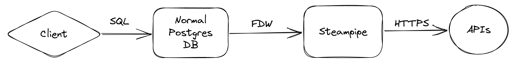
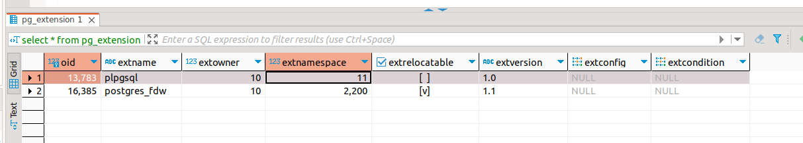
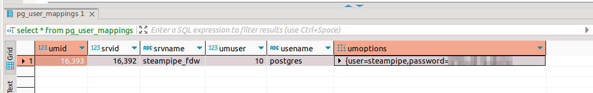
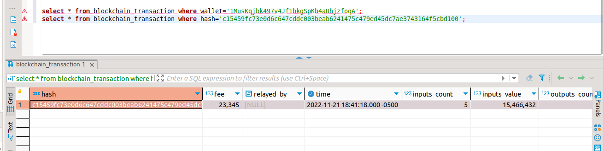
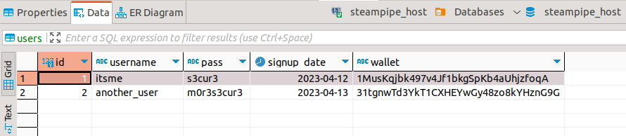
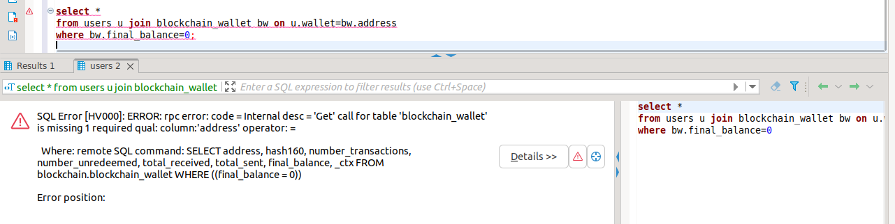
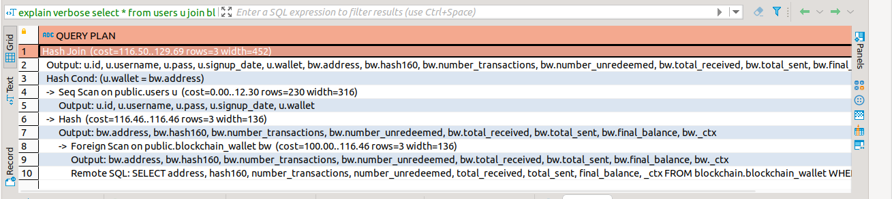
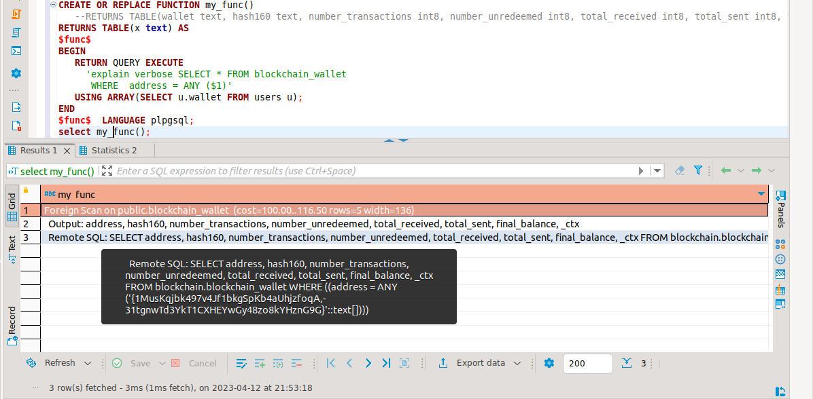
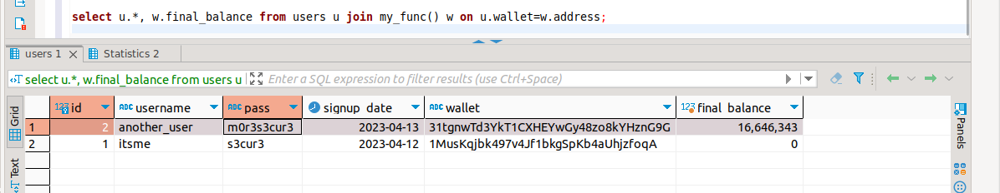

This article explores some advanced integration usecases in which Steampipe can be used, such as placing another Postgres instance in fron of it for greater control and more data sources.

<!--more-->

## Adding Steampipe to another database

All the Steampipe docs assume that you'll query Steampipe directly. That will probably be the case most of the time, but sometimes you may want to proxy queries to Steampipe through another, fully-featured Postgres DB. Some usecases:  

* Tighter authentication/authorization controls. Steampipe has a single username/password, so you can't, say, share it across apps and provide them with different levels of access. Anyone who needs access to any Steampipe data will get access to all Steampipe data. By adding another DB in front, you can declare users at will and limit the tables that they can access. It may also work with [Row-Level Security](https://satoricyber.com/postgres-security/postgres-row-level-security/), but I haven't tested it.
* More controlled caching? You may be able to intercept the requests and responses by using something like [Gallium Data](https://www.galliumdata.com/), and thus get more control over caching:  
  * Save all returned data into a dedicated DB table, so that, in effect, you build a database over time (which will contain all data that has ever been queried of the database)
  * Apply different caching policies inside the same Steampipe plugin (by default, you can control the cache expiration date per plugin, but you may wish to expire data in some tables sooner than in others)  
  * Gather stats about cache hits/misses  
* As a drop-in data source for your application database. Say you save domains in a certain column of a certain table. Now obtaining information about the TLS certificate served by a domain (such as its expiration date) is as easy as making a JOIN to the [`net_certificate` table](https://hub.steampipe.io/plugins/turbot/net/tables/net_certificate). No need to add TLS-cert parsing logic into your application.  
* To add further data sources that are better served as vanilla relational tables. Steampipe does provide the [csv](https://hub.steampipe.io/plugins/turbot/csv) and [config](https://hub.steampipe.io/plugins/turbot/config) plugins, which together let you expose quite a lot of static-ish information, but you may have information already in relational form. Consider: a list of employees, along with their departments (okay, that may also be in an LDAP or AD source, but whatever). Also consider: a list of servers, each with its function, expected open ports, location, and more. Sure, you may convert these into CSV files and expose them through Steampipe, but what if the data changes somewhat frequently? For each change, you'd need to recompose the file, upload it to the Steampipe server, and (possibly) restart Steampipe. A plain DB is easier: just `UPDATE` a record and `COMMIT`.  

Here's a proposed architecture:  



Instead of connecting directly to Steampipe, we'll add a plain Postgres server in front. Said server will use the [Postgres FDW](https://www.postgresql.org/docs/current/postgres-fdw.html) to delegate some (probably most of its) queries to Steampipe. Other data may be served directly from it (such as the static-ish data of the last bullet point above).  

As an interesting tidbit, the FDW functionality is precisely what Steampipe uses to communicate with its plugins. So this will have a FDW connection passed into another FDW connection! Fun!  

You'll need to deploy a normal, garden variety Postgres server. That has been covered many times in the Internet, so I won't repeat it here. At any rate, once you have a server, you'll need to run the following commands on it (*not* on Steampipe!):  

```sql
CREATE EXTENSION IF NOT EXISTS postgres_fdw;  
select * from pg_extension; -- Verify that it appears  

CREATE SERVER steampipe_fdw FOREIGN DATA WRAPPER postgres_fdw OPTIONS (host '127.0.0.1', port '9131', dbname 'steampipe');  
-- NOTE: On the command below, provide your own Steampipe password. Obtain it with steampipe service status --show-password  
CREATE USER MAPPING FOR postgres SERVER steampipe_fdw OPTIONS (user 'steampipe', password '***');  
select * from pg_user_mappings; -- Verify that it appears  

GRANT USAGE ON FOREIGN SERVER steampipe_fdw TO postgres;  
```



When creating the user mapping, the `FOR ...` part is the local user (usually the same user that your app/DB client will use). The remote user is always `steampipe`, the remote password can be obtained by running `steampipe service status --show-password`. In essence, the user mapping controls the fact that, when you connect with the local user, all remote queries will use the remote user.



Then, you'll need to import the schemas that you require (as a reminder, Steampipe creates a *schema* for each *connection*, which uses a *plugin*. You can have multiple connections that use the same plugin, and they'll each have a different schema. There are also *aggregators*, which join results from multiple connections and also have their own schema)  

```sql
IMPORT FOREIGN SCHEMA blockchain FROM SERVER steampipe_fdw INTO public;
```

Repeat the command above for each Steampipe schema that you want to expose (maybe all of them?). You can import them into separate schemas in the Postgres DB, keeping the original separations, or smush them together in the `public` schema as I did above. Note that if you mix them all in a single schema, you can't have multiple connections for the same plugin (such as multiple Github connections, eah with its own credential), since you'd then have collisions in the table names.  

Then, we can finally run requests!



Note that we are now running on our very own DB. Said DB may have more tables, apart from whatever magically comes from Steampipe. That means, for example, that you can create tables that have FKs to that data, if you so please.  

## Joining with your own data

Say that your business allows people to register a Bitcoin wallet as a payment method. We'll keep things simple and add a `wallet` column to the `users` table, where you'd normally hold all user info.  

Note: this table exists in your own DB! Not on Steampipe! Indeed, you can't even create tables in Steampipe, let alone add data.  

```sql
CREATE TABLE users (  
    id integer PRIMARY KEY,  
    username varchar(40) NOT null unique,  
    pass varchar(80) NOT NULL,  
    signup_date date,  
    wallet text -- This _cannot_ be a FK, as you can't create FKs to FDW-backed tables, apparently  
    -- It doesn't really matter, you can still JOIN across non-FK fields
);
```

Then, let's add some users to our shiny new table:  



Let's say that we now want to get the balance of each user's wallet, so that we can show an alert message (or ~~bother~~ send an email) to users whose wallets have a balance of 0.  

```sql
select *  
from   
    users u   
    join blockchain_wallet bw on u.wallet=bw.address  
where bw.final_balance=0;
```



Waiiit. That's not good. Steampipe complains that the call for the `blockchain_wallet` table is missing its required qual. Indeed, the remote SQL command (included in the error message) doesn't make any mention of wallet addresses. For some reason, the Postgres query optimizer has decided that the best thing is to fetch the entire `blockchain_wallet` table (well, only the wallets that have a balance of 0, which doesn't help *at all*) and then join that data locally with the users. Normally that's all good and fine, but it doesn't work here since we can never list all Bitcoin wallets. Let's dig deeper there:  

```sql
explain verbose select *  
from users u join blockchain_wallet bw on u.wallet=bw.address  
where bw.final_balance=0;
```



If you hadn't met the `EXPLAIN VERBOSE` command before, now you have. I have found it to be really, *really* handy when working with the Postgres FDW (and, by extension, with Steampipe). It provides you with a detailed execution plan. When your query involves remote tables, it additionally shows the SQL statement that will be shipped to the remote server for execution.  

In this case, we can see that it will perform a join (row 1) on two data sources (rows 4 and 6). The first one (row 4) is the local table `users`. The second one (line 6) will come from a foreign scan (row 8) which will run the remote SQL that we saw above: just a `SELECT * FROM blockchain_wallet WHERE final_balance=0`. Those two data sources will be joined on a condition (row 3).  

We'd instead want something like this:  

1. Scan the `users` table, extract the `wallet` column values.  
2. Send those values to the remote server, in something like `SELECT * FROM blockchain_wallet WHERE address IN ('value1', 'value2', ...) and final_balance=0`  
3. Get *only the wallets required* back.  
4. Join that data with the local table.

There are some [rumors around StackOverflow](https://stackoverflow.com/questions/51970227/postgres-fdw-possible-to-push-data-to-foreign-server-for-join) that appear to say that you cannot do that. [This other question](https://stackoverflow.com/questions/61492561/how-to-force-evaluation-of-subquery-before-joining-pushing-down-to-foreign-ser/61493138) is essentially the same as our problem. Sadly, there are no straightforward solutions in the answers. [The accepted answer](https://stackoverflow.com/questions/61492561/how-to-force-evaluation-of-subquery-before-joining-pushing-down-to-foreign-ser/61493138#61493138) uses dynamic SQL to interpolate the IDs in the remote query, just as we did.  

In our case, that looks like this:  

```sql
CREATE OR REPLACE FUNCTION my_func()  
   RETURNS TABLE(wallet text, hash160 text, number_transactions int8, number_unredeemed int8, total_received int8, total_sent int8, final_balance int8, _ctx jsonb) AS  
$func$  
BEGIN  
   RETURN QUERY EXECUTE  
     'SELECT * FROM blockchain_wallet  
      WHERE address = ANY ($1)'  
   USING ARRAY(SELECT u.wallet FROM users u);  
END  
$func$ LANGUAGE plpgsql;  
select my_func();
```

After messing with the declared function so that it runs the `EXPLAIN VERBOSE` command, we can see what is executed now:  



```sql
select u.*, w.final_balance from users u join my_func() w on u.wallet=w.address;
```



Finally, we can see the pesky users who have empty wallets. That took some work, and it seems quite fragile. Also, you'd need to create those custom functions for each set of data that you'll need to join with Steampipe data.

## Any other fixes?

And now, for a small story. While browsing the Interwebs for solutions to this problem, I found [this thread in the Postgres mailing list](https://www.postgresql.org/message-id/flat/2391646.1611761247%40sss.pgh.pa.us#d3768408ada78bae5d2539f0e79cd3d0). The title seems promising: "the results of a nested query/join not being passed as qual to the outer query". That's precisely our problem. The first post starts with "I am developing an FDW which allows various data sources to act as virtual tables, allowing various different APIs to be queried using a consistent SQL interface." "We often have virtual tables where a list operation is not viable/possible without providing quals." "The problem we have is that the results of nested subqueries/joins are not being passed as quals to the outer query." That's a direct description of the problem.  

Waiiit. That sounds familiar. Rewind to the top of the post, to see the author. Who's there? It's `Kai Daguerre <kai(at)turbot(dot)com>`. Oh. Hi!  

That was really neat. Finding that the authors of Steampipe have found the same problem and gone for solutions straight to The Oraculum of Postgres is really cool. Here's Kai's example (excerpted from the mailing list thread linked above):  

```
So for example  
select * from whois_domain where domain in ('google.com', 'yahoo.co.uk')  
works fine, and a qual is passed to the fdw with a value of ['google.com', 'yahoo.co.uk']  

However the following (assuming a 'domains' table containing required   
domains) does not work:  
select * from whois_domain where domain in (select domain from domains)  

In this case, no quals are passed to the fdw, so the *select * from   
whois_domain* query therefore fails. What we would like is to ensure the  
subquery runs first, and for the results to be available to the outer query.
```

Yes, that's it. The example uses a `domains` table instead of our `users` table, but the idea is the same. We both want the IDs to be shipped to the Steampipe DB, so that it can fetch just the domains (or, in our case, wallets) that it will need, instead of fetching everything and then joining locally, which is not viable.  

Alas, that thread ends with no solution. Another author suggests the usage of Set Returning Functions. That is precisely what we did at the end of the last section above (remember the `CREATE FUNCTION RETURNS TABLE(...)`? That's essentially a set-returning function, as you can see [here](https://www.postgresql.org/docs/current/xfunc-sql.html#XFUNC-SQL-FUNCTIONS-RETURNING-TABLE): "There is another way to declare a function as returning a set, which is to use the syntax RETURNS TABLE...").

There's also [this issue](https://github.com/turbot/steampipe-postgres-fdw/issues/8) in the steampipe-postgres-fdw repo. Also by Kai Daguerre, raised a few days after the mailing list posts referenced above, presumably during the same code sprint or whatever. The title is "Nested queries do not pass quals to outer query", the example matches the problematic usecase, and it has a note about "using array returning functions instead". It is closed by a commit, but it doesn't appear to be really closed, since I still see the problem about two years later. Either I'm doing things wrong, or it wasn't really fixed. Which is sad.  

## Conclusions

* You can connect Steampipe to another Postgres DB, using the FDW functionality in said DB. That will add tables in it, backed by the magic of Steampipe.  
* Once you have a full Postgres DB providing a middle layer to Steampipe, you can apply more fine-grained authorization policies, and also host real data in it, which could be queried just like Steampipe's API-provided data.
* While you may be tempted to try to enrich application data with Steampipe's goodies, beware of inefficiencies. Postgres' FDW doesn't like to transfer ID lists across joins, which results in Steampipe fetching entire tables when you try to `JOIN` one of your own tables with Steampipe's data. That will at best be really inefficient, and at worst impossible if the Steampipe table that you want to join with cannot list its entire contents.
* At present, the limitation above seems to not have a solution. A workaround involves a set-returning function that dynamically composes a SQL command, in which the IDs that you need are manually specified. Such a solution feels clunky, but may be your only hope if you really need to JOIN across databases and you can't afford to return the entire Steampipe table to your local server for joining.

This article was shorter than the previous ones. I've had far less time, but I wanted to put something out already. 

I'm currently unsure about the subject of the next article. A few days ago, [Gallium Data](https://www.galliumdata.com/) caught my eye (Shiny new tech! Must read about!). In short, it's a "Programmable Database Proxy". It's Nginx, but for databases. It's a [Web Application Firewall](https://www.cloudflare.com/learning/ddos/glossary/web-application-firewall-waf/), but for databases. It's [FastAPI middleware](https://fastapi.tiangolo.com/tutorial/middleware/), but for databases. It lets you write Javascript code that gets access to every SQL statement, and then to every row of results that said statement returns. Then, your imagination is the limit. Log every statement? Check. Disallow writes on weekends? Check. Delete certain columns on the returned data? Check. Monitor long queries? Check. Only allow certain queries (firewall whitelist style)? Check. Some of these things (such as limiting the returned data) could (and probably should) be implemented in a more *official* manner, such as using [Row Level Security](https://supabase.com/docs/guides/auth/row-level-security) in Postgres, but others, such as statement logging and auditing, are much better served by a dedicated middleman such as Gallium, in much the same way that similar concerns in web applications are better delegated to a reverse proxy, security appliance or (at least) an application middleware, instead of being mixed with your business logic.

Until later!
