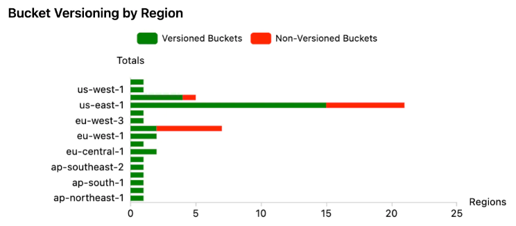

Hello again! In the [previous post](https://jreyesr.github.io/posts/steampipe-part-dos-bitcoin/), we built a Steampipe plugin to interface with a Bitcoin information API, which exposed data about wallets (balance, flows in/out, number of transactions) and transactions (amount, wallets involved, time, fee). We covered how to implement search by delegating it to the remote server, how to navigate paginated APIs by repeatedly calling them until they stop returning data, and tips for creating your own API client in Go when no such package exists.

In this article, we'll address a few loose ends that I didn't take care of before because the post was already long enough[^1]:

* A way of retrying requests, as recommended by Steampipe in their [Plugin Release Checklist](https://steampipe.io/docs/develop/plugin-release-checklist). Currently, the API that the plugin uses gets cranky if you send requests too quickly to it (as in 2 requests right one after another), so it's quite important to prevent that (as far as possible) from bubbling up to the user.
* Writing one or two [controls](https://steampipe.io/docs/mods/writing-controls), which are prewritten queries. See the corresponding section below for a short primer on controls.
* Writing a [dashboard](https://steampipe.io/docs/dashboard/overview), to see how easy to build they are and how interactive they can be. That should be fun, since Steampipe uses the [HCL language](https://github.com/hashicorp/hcl#information-model-and-syntax), which is... well... plaintext, while dashboards in many services are configured visually, to match how they will be used.

The code that is presented in this post will be published in the repo[ for the Blockchain plugin](https://github.com/jreyesr/steampipe-plugin-blockchain).

## Automatically retrying requests

Steampipe has a [Plugin Release Checklist](https://steampipe.io/docs/develop/plugin-release-checklist), which you should follow if you intend to publish a plugin to the [Steampipe Hub](https://hub.steampipe.io/). About halfway through it, under the "Data Ingestion" section, you can read the following:

> If the API SDK doesn't automate backoff and retry, the plugin leverages capabilities of the Steampipe plugin SDK's [RetryHydrate function](https://pkg.go.dev/github.com/turbot/steampipe-plugin-sdk/plugin#RetryHydrate). For instance, the `github_issue` table uses this function when [listing issues](https://github.com/turbot/steampipe-plugin-github/blob/d0a70b72e125c75940006ee6c66072c8bfa2e210/github/table_github_issue.go#L142) due to the strict throttling of the GitHub API.

Well, our API SDK doesn't automate backoff and retry. As a matter of fact, it automates nothing because it doesn't exist. Therefore, we need to implement retries in the plugin code. There is zero information in the Steampipe docs about such a function, as evidenced by Google finding just that result when searching for `inurl:steampipe.io "retryhydrate"`. Luckily, the checklist item does link to the Go docs for the function (which you can also find by using any reasonable IDE and hovering over the function to trigger popup docs or its equivalent). There's also a link to the [Github plugin](https://github.com/turbot/steampipe-plugin-github), which does use retries. That's mostly all that you need to reconstruct everything, and I'll try to give a more detailed account of the function here, for future reference.

### Steampipe's RetryHydrate function

The `RetryHydrate` function is imported from `github.com/turbot/steampipe-plugin-sdk/v3/plugin`. You'll most likely have that package already available, since it exposes some very important symbols such as `plugin.Table` and `plugin.Column`. 

It wraps a function that must have the signature `func(context.Context, *QueryData, *HydrateData) (interface{}, error)`, and it has the same return type `(interface{}, error)`. Internally, it calls the wrapped function a number of times (configurable, as we'll see below). If the function returns proper data (in its first return value, typed as `interface{}`), the `RetryHydrate` function returns that data. Otherwise (i.e., the wrapped function returns `(nil, SOME_ERROR)`), `RetryHydrate` waits for a bit before calling it. Again, the number of attempts, type of backoff (Exponential, Fibonacci, Constant), first backoff interval and max interval are configurable.

This is all dependent on Go's error convention: Unlike Java, where you throw an exception; unlike Python, where you may return `None`; unlike C, where you probably return -1 or `NULL` and set a global variable `ERRNO`; in Go functions that may fail return a tuple of values `(actual_return_type, error)`. See [here](https://gobyexample.com/errors) and [here](https://go.dev/blog/error-handling-and-go) for explanations of the convention. If you encountered no errors, you return `(your_value, nil)`. If you did encounter errors, you return `(nil, your_error)`. 

This is fairly typical Go code:

```go
f, err := os.Open("filename.ext")
if err != nil {
    log.Fatal(err)
}
// do something with the open *File f
```

Steampipe follows this convention extensively. All your hydrate functions (i.e., the ones that are called to return a series of table rows or a single row) have to return two values: an `interface{}` and an `error`. The `interface{}` bit is required because your plugin can return values of any type. Thus, the `RetryHydrate` function can capture the two values and determine if it should retry or return. If the maximum amount of retries is reached, it gives up and returns the most recent error.

```go
// BEFORE
// inside your hydrate function, e.g. getWallet(ctx, d, h)
walletInfo, err := client.GetWalletInfo(address)
if err != nil {
	return nil, err
}
return walletInfo, nil

// AFTER
// inside your hydrate function, e.g. getWallet(ctx, d, h)
getInfo := func(ctx context.Context, d *plugin.QueryData, h *plugin.HydrateData) (interface{}, error) {
	return client.GetWalletInfo(address) // This captures the address variable into the closure
}
walletInfo, err := plugin.RetryHydrate(ctx, d, h, getInfo, &plugin.RetryConfig{ShouldRetryErrorFunc: shouldRetryError})
if err != nil {
	return nil, err
}
return walletInfo, nil
```

It mostly moves some code around. Instead of calling your client directly, you wrap the call into a function with the signature `func(context.Context, *QueryData, *HydrateData) (interface{}, error)`, in which you call your client and return data and an error. Then, in your main plugin code, you call `plugin.RetryHydrate(ctx, d, h, your_wrapped_function, &plugin.RetryConfig{...})`. That has the same return type, so the rest of your code should keep working as usual. If the function returns data, you just use it. If it returns an error, you know that it has exhausted its retries or that the error was not retryable. In effect, using the `plugin.RetryHydrate` function should just reduce the amount of errors seen by your users, at the cost of some increased query execution time due to the retries. Queries that succeed in the first try should experiment no effects at all.

The `plugin.RetryConfig` instance that is passed to the `plugin.RetryHydrate` function also holds some magic. The [Go docs](https://pkg.go.dev/github.com/turbot/steampipe-plugin-sdk/plugin#RetryConfig) that are linked by the Plugin Release Checklist don't show all its fields, you need to check its declaration or use an IDE to do so. Alternatively, visit [the docs for a higher version](https://pkg.go.dev/github.com/turbot/steampipe-plugin-sdk/v5/plugin#RetryConfig) of the SDK. At the time of writing, that struct has the following fields:

* `ShouldRetryErrorFunc`: `func(context.Context, *QueryData, *HydrateData, error) bool`: Takes some context data and an error, and it determines if the error is retryable or not. For example, a `403 Forbidden` error should probably not be retried, since it states that the account used doesn't have the appropriate permissions. All you will achieve if you retry will be to make some security alerts in the server nervous. On the other hand, a rate limit may be retried, though the interval to wait depends on the service. This is a required property, it's your responsibility to determine which errors can be retried.
* `MaxAttempts`: `int64`: How many times will the function be called, at most? Default is 10.
* `BackoffAlgorithm`: `string`: May be Fibonacci (the default), Exponential or Constant. While no more information is provided about the algorithms, the Steampipe SDK uses `github.com/sethvargo/go-retry` for retries, and you can indeed find those algorithms [in its documentation](https://pkg.go.dev/github.com/sethvargo/go-retry#readme-backoffs). 
   * `Constant` simply waits for the same amount of time between retries (as specified by the parameter `RetryInterval`, see below)
   * `Fibonacci` follows the [Fibonacci sequence](https://mathworld.wolfram.com/FibonacciNumber.html), seeded with 0 and `RetryInterval`. Thus, the values are multiples of `RetryInterval`, as given by the most common Fibonacci sequence, [OEIS A000045](https://oeis.org/A000045). For 5 retries, they will be 1, 1, 2, 3, 5, multiplied by `RetryInterval`.
   * `Exponential` starts at `RetryInterval` and doubles every time. For 5 retries, they will be 1, 2, 4, 8, 16, multiplied by `RetryInterval`.
* `RetryInterval` is used to multiply the (integer) factors returned by the backoff algorithm. Default is 100 ms.
* `CappedDuration` is a maximum limit on a single wait. For example, if `RetryInterval` was 100 ms (the default), with exponential backoff, 5 retries and `CappedDuration` set to 1 second, the last retry would be 1 second long instead of 1.6 seconds, as it should normally be.
* `MaxDuration` is a maximum limit on the sum of all waits. If reached, the function gives up and returns `nil`.

Most of those parameters are farily straightforward. The most mysterious one is `ShouldRetryErrorFunc`. This is a function that you should declare. It will receive (along with context data) any `error` that is thrown by your client code. Its only job is to somehow analyze the `error` object[^2] and return a boolean value. By default, you would only be able to access the string message of the error and determine if an error is retryable or not based on it. For some cases, this may be plenty. Indeed, the Steampipe Github plugin does exactly that, though for another similar function, not for `ShouldRetryErrorFunc`: it states that errors whose string representation contains the string "404" should be ignored, assuming that any such errors are HTTP `404 Not Found` errors. See [here](https://github.com/turbot/steampipe-plugin-github/blob/d0a70b72e125c75940006ee6c66072c8bfa2e210/github/table_github_issue.go#L71) for the declaration of the error function, and [here](https://github.com/turbot/steampipe-plugin-github/blob/d0a70b72e125c75940006ee6c66072c8bfa2e210/github/errors.go#L20-L31) for its implementation: it checks if `error.Error()` contains the substring "404", and if so it returns `true` to signal that the error should be ignored.

As long as you constrain yourself to the basic `error` interface, that's all you can do: look at the error string and make assumptions about its format. For more control, you need to create a custom `error` implementation and type-assert the received object to it. If you can do so, then you can access more info, since you can declare a struct with whatever fields you desire and a successful type assertion gives you an object with your custom type. The Github plugin does that [for the retry config](https://github.com/turbot/steampipe-plugin-github/blob/d0a70b72e125c75940006ee6c66072c8bfa2e210/github/errors.go#L11-L17): it attempts to cast the error into a RateLimitError and, if successful, signals Steampipe to retry. Any other errors are treated as non-retryable.

So, for the Blockchain plugin, we want to handle rate limits especially, by returning instances of a custom type. Then, the ShouldRetryErrorFunc can type-assert any errors that it receives. If the casting succeeds, then the error was retryable. Otherwise, everything proceeds as before. However, for the specific API used (i.e., BTC.com's API), rate limits are not signaled as HTTP 429 Rate Limit Exceeded status code, as most RESTful APIs do (or should do, at least!). Instead, rate limits return a HTTP 200 OK status code as normal, but the body is not JSON. Instead, it's an `octet-stream` with the words "Don't abuse the API. Please contact support@btcm.group", with a newline at the end. That's it. That complicates things, since we now have to hardcode a response message that is not guaranteed to be stable.


Fiiine. We'll inspect the response body. I've implemented it as a strict comparison, but it may be better to, say, only check for the words "Don't abuse the API" or something. If the body matches the condition, we return an instance of the new `RateLimitError` struct, which simply holds a `string` for the guilty URL. Also, in order to make the `RateLimitError` type comply with the `error` interface, we need to implement the `Error()` method on it. That's all for the API client.

```go
// blockchain/errors.go
type RateLimitError struct {
	url string
}
func (e RateLimitError) Error() string { return fmt.Sprintf("Rate Limit %s", e.url) }

func (c BlockchainClient) GetWalletInfo(address string) (WalletInfo, error) {
	url := fmt.Sprintf("%s/address/%s", API_BASE_URL, address)
	res, err := http.Get(url)
	// ... error handling...
	body, _ := io.ReadAll(res.Body)

	// NEW: Check if the API returned angry message
	if string(body) == "Don't abuse the API. Please contact support@btcm.group\n" {
		c.logger.Debug("getWalletRateLimit", "url", url)
		return WalletInfo{}, RateLimitError{url}
	}

	// JSON unmarshaling and more logic go here
}
```

On the plugin side, we now need to capture the error (which will be of the generic type `error`) and try to cast it to our struct. If it does cast, then it was a `RateLimitError` originally, we can access its URL (not that we need it) and we can retry.

```go
// blockchain/errors.go
func ShouldRetryBlockchainError(ctx context.Context, d *plugin.QueryData, h *plugin.HydrateData, err error) bool {
	if _, ok := err.(RateLimitError); ok {
		return true
	}
	return false
}

// blockchain/table_blockchain_X.go

// BEFORE
txInfo, err := client.GetTransaction(hash)
plugin.Logger(ctx).Debug("getTransaction", "res", txInfo, "err", err)
// More code here...

// AFTER
getTransaction := func(ctx context.Context, d *plugin.QueryData, h *plugin.HydrateData) (interface{}, error) {
	return client.GetTransaction(hash) // Move the actual invocation here...
}
// Then actually call plugin.RetryHydrate, passing it a reference to the wrapped function
txInfo, err := plugin.RetryHydrate(ctx, d, h, getTransaction, &plugin.RetryConfig{
	ShouldRetryErrorFunc: ShouldRetryBlockchainError,
})
plugin.Logger(ctx).Debug("getTransaction", "res", txInfo, "err", err)
// More code here...
```

Once again, the changes are mostly mechanical: move the actual invocation of the client package into a closure/nested function, then replace the main invocation with a call to `plugin.RetryHydrate`. The return values of both functions are the same, so most of the code that comes after this part should work as expected. The only difference is that the client will probably return domain-specific types (for example, `([]TransactionInfo, error)`, while the `RetryHydrate` function returns `(interface{}, error)`. If you actually need the correct type (see, for example, the `listTransactions` function in the `table_blockchain_transaction.go` file), you can cast it directly to the expected type as long as you take care to do it after you check the error, just to ensure that nothing breaks because of `(nil, some_error)` returns.

## Controls

The name "controls" probably means nothing to you unless you have met the Great and Terrifying [CIS Benchmarks](https://aws.amazon.com/what-is/cis-benchmarks/) and others of its kin. To put it shortly, in that context, a control is a short statement that should be true in your cloud infrastructure (or on-premises too, I guess, but you see it more on cloud environments[^3]). For example, AWS has the control [EC2.13](https://docs.aws.amazon.com/securityhub/latest/userguide/ec2-controls.html#ec2-13), which states "Security groups should not allow ingress from 0.0.0.0/0 to port 22". It may help to think of them as commandments: "Thou shalt not allow ingress from 0.0.0.0/0 to port 3389", "Thous shalt encrypt your Elasticsearch data at rest", "Thy IAM passwords shalt expire every 90 days or less". Unlike the actual Commandments, these ones allow for some rule-breaking, depending on your organization and context, and whether or not you can justify the rule-breaking.

Steampipe, coming from the land of cloud infrastructure monitoring, has first-class support for such controls. Their approach to implementing them is as follows: you write SQL queries that monitor something, whether it be servers, networks, users, or (maybe) Bitcoin wallets. For each monitored object, you express a condition: for servers, if they have full-disk encryption enabled. For networks, if they have a certain policy that exposes them to the whole Internet. For users, whether they have 2FA enabled if they have a certain privileged role. For Bitcoin wallets, whether they have some funds left. Items that pass the check don't cause alarms. Items that don't pass the check are shown in bright red everywhere.

For instance, this is the query that ensures that Zoom meeting rooms have a passcode with some minimum length:

```sql
select
  -- Required Columns
  account_id as resource,
  case
    when (meeting_security -> 'meeting_password_requirement' -> 'length')::int >= 6 then 'ok'
    else 'alarm'
  end as status,
  format('Minimum passcode length set to %s.', meeting_security -> 'meeting_password_requirement' ->> 'length') as reason
from
  zoom_account_settings
```

Control queries must return a table with the following structure:

| resource                                                     | status                | reason                                                | extra_field_1                                                | extra_field_2           |
| ------------------------------------------------------------ | --------------------- | ----------------------------------------------------- | ------------------------------------------------------------ | ----------------------- |
| Name of the object in question: Github repo, user's name, EC2 server unique ID | 'ok', 'alarm', 'info' | Text that describes the non-compliance, if it happens | Whatever you want to return. For example, for Zoom, room_creation_date | For example, room_owner |
| My Zoom Meeting                                              | ok                    | Minimum passcode length set to 8                      | 2020-03-01T00:00:00Z                                         | jreyesr                 |
| Unsafe Room                                                  | alarm                 | Minimum passcode length set to 2                      | 2020-04-01T00:00:00Z                                         | unsafe_bill             |

The fields `resource`, `status` and `reason` are mandatory. Anything else is considered metadata about the resource in that row.

The `status` info is used for things that can't be checked automatically. They are not alarms, but they are included in reports.

Benchmarks are collections of controls. For example, the [AWS Compliance mod](https://hub.steampipe.io/mods/turbot/aws_compliance) has benchmarks for CIS (many versions!), FedRAMP, HIPAA, the GDPR, multiple NIST standards, PCI and SOC 2. You declare a benchmark in the same or another file as the one that holds your controls, in the following format:

```hcl
benchmark "benchmark_key" {
  title = "Main Benchmark"
  children = [
    benchmark.sub_benchmark_key,
    control.one_control_key,
    control.another_control_key,
  ]
}
```

Benchmarks can reference sub-benchmarks. That is used by first-party mods to create folder-like structures.

Something that I couldn't find in the Steampipe docs is the logic that Steampipe uses to determine which benchmarks are shown in the Dashboards view. For example, check the code in the `mod/benchmark.sp` file: it declares three benchmarks, `blockchain_audit`, `btc_wallets` and `btc_txs`. The latter two are referenced as `children` of the first one. There's no flag that you set on a benchmark to say "hide this one from the dashboard list". However, Steampipe only shows the `blockchain_audit` benchmark!

As far as I can tell, Steampipe somehow ignores benchmarks that are included in other benchmarks. Alternatively (it means the same, just stated differently), it only shows benchmarks that are not included in others. That is, it detects "top-level" benchmarks and only shows those. Indeed, if I remove one of the sub-benchmarks from the `children` list in the top-level one, it appears in the Dashboards list!

This is how a benchmark is displayed. After it runs, it displays all its controls (ordered hierarchically), along with a nice green/red breakdown for passes and fails. Hovering over a "metadata"/extra field (remember those? They are any extra columns that come from the SQL query, that are not `resource`, `status` and `reason`) will display its tag (or column name) and its value (see to the far right of the image, at the height of the first alarmed check. While you can't see the mouse pointer in the screenshot, it was over the first number, which appears in purple)


### Setting variables on controls

Most of the Steampipe controls need no extra configuration to run. For example, the AWS plugin has a really easy notion of "monitoring scope": it's just everything that its API key is allowed to see. Thus, everything that comes from `aws_ec2_instance` is fair game for the controls that apply to servers. Similarly, the Github plugin can simply SELECT everything in `github_my_repository` and run checks on it. However, other plugins (okay, just one plugin that I can see) have more trouble. How do you tell the [Net Insights mod](https://hub.steampipe.io/mods/turbot/net_insights) what domains it should monitor? You can't just tell it "monitor every domain". Same goes for the Blockchain plugin, you can't monitor every wallet. You need a way to tell it what wallets it should focus on.

To do so, you provide a `steampipe.spvars` file. In that file, you set the scope of your monitoring: in our case, one or multiple Bitcoin wallets. You also need to declare a [variable](https://steampipe.io/docs/mods/mod-variables), in Steampipe parlance. Then, every check that needs to run over wallets can declare a dependency on those variables and run over a configurable set of wallets, since every user that installs the Bitcoin mod will probably be interested in different wallets.

Variables can be read from multiple places, in order:

1. Environment vars, prefixed with `SP_VAR_`
2. `steampipe.spvars`
3. Other `.spvars` files
4. `--var` files
5. Defaults set in the variable definition
6. User's answers, in response to Steampipe prompting

The interested reader is referred to [Steampipe's documentation on the subject](https://steampipe.io/docs/mods/mod-variables#passing-input-variables).

```hcl
// steampipe.spvars

monitored_wallets = ["address1", "address2", ...]

// controls.sp

variable "monitored_wallets" { // This takes its value from the resolution chain explained above
    type = list(string)
    description = "A list of wallets to monitor"   
}

control "nonempty_wallet" {
    title = "Wallet must have funds"
    sql = <<EOT
        select
            address as resource,
            case when final_balance = 0 then 'alarm' else 'ok' end as status,
            case when final_balance = 0 then format('Wallet %s is empty', address) else format('Wallet %s has funds', address) end as reason,
            total_received, total_sent,
            final_balance
        from blockchain_wallet
        where address = any($1); // This gets the "addresses" param
        EOT
    param "addresses" { // This will be the first parameter provided to the query
        default = var.monitored_wallets
    }
}
```

Dashboards can also take variables. See the next section.

### Controls summary

* Controls are pre-saved queries that return PASS or FAIL for each row
* They are used to, for example, monitor cloud computing resources such as servers or DBs for compliance with best-practices
* Controls can take parameters, thus allowing them to be configured by the user without changing the actual query
* Controls can be run individually, all at once, or grouped in benchmarks
* Benchmarks are groups of controls, that run all at once

Controls can be used for:

* Ensuring that all your AWS EBS volumes have full-disk encryption enabled
* Checking that no S3 buckets have write public access
* Alerting on Github org users that don't have 2FA enabled
* Checking that all WWW records on the monitored domains point to public IPs
* Ensuring that the monitored Bitcoin wallets have a balance greater than 0

## Dashboards

Steampipe creates automatic dashboards for benchmarks. It also allows you to create custom dashboards.

People familiar with tools that have dashboards such as [Grafana](https://grafana.com/), [Kibana](https://www.elastic.co/kibana/), [Splunk](https://www.splunk.com/) or [Gravwell](https://www.gravwell.io/) will know the flow for creating a dashboard:

1. Write a query, in whatever language the tool supports, that shows you the information that you want
2. Select a chart type: gauges or numbers for a single number, line charts for timeseries data, bar/column charts for category+number data, heatmaps, actual maps, tables for whatever doesn't fit the charts.
3. The query + chart type create a "panel", or something similar. Gravwell calls them "tiles" instead.
4. Arrange the panel in the dashboard: set its position and size, give it a title, change other styles (for example, the color palette, or switching between horizontal and vertical for bar charts)
5. (Optional) Provide "pivot" or "drilldown" links that send you to another, more detailed dashboard. Grafana calls them [Data Links](https://grafana.com/docs/grafana/latest/panels-visualizations/configure-data-links/#data-links), for example. In general, they run when you click some part of your chart, and they take its value to populate another dashboard or an external link.
6. (Optional) Provide dashboard-wide "variables" that usually filter the results. For example, in Grafana it's common to be able to filter server metrics by region or server name. These variables can be free-text fields, or they may be a dropdown with fixed fields. Bonus points if the values in the dropdown can be populated dynamically, with another query that runs when the dashboard loads.

Notably, all of the tools enumerated above have a GUI (web-based) for configuring dashboards. Steampipe doesn't. It uses text files, ~~like a grown-up~~ since it fits the rest of the mod system. How will that affect the design? Designing a dashboard in text is somewhat like designing a mobile app's GUI in code: it's possible, but it may spiral out of control easily. Let's see how Steampipe does it.

Dashboards are another type of resource, like `control`s and `benchmark`s. They also have a `title`, and any further child elements become display items. Display items can be included directly, or embedded inside arbitrary levels of `container`s:

* [table](https://steampipe.io/docs/reference/mod-resources/table): Displays raw data, as it comes from a SQL query.
* [card](https://steampipe.io/docs/reference/mod-resources/card): Shows a single value. The color can be controlled (e.g., color it in green when no Bad Events are happening, in yellow if 1-5 events are happening, or in red if more than 5 events are happening)
* [chart](https://steampipe.io/docs/reference/mod-resources/chart): The catch-all "statistical chart" visualization. It has line charts, bar charts (horizontal and vertical), pie and donut charts. Not a large selection, when compared with Grafana or Kibana, but it works. If you need more, consider a BI tool (which you *can connect to Steampipe*, by the way, since it's "just Postgres"!).
* [image](https://steampipe.io/docs/reference/mod-resources/image): Displays... well... an image. The URL can be taken from SQL.
* Some more exotic visualizations, such as [flow](https://steampipe.io/docs/reference/mod-resources/flow) (Sankey charts), [graph](https://steampipe.io/docs/reference/mod-resources/graph) (graphs in the sense of Graph Theory) or [hierarchy](https://steampipe.io/docs/reference/mod-resources/hierarchy) (Graph Theory's trees) 

You can also declare [inputs](https://steampipe.io/docs/reference/mod-resources/input), which present themselves as input widgets and can be used as parameters in other queries. There's your plain text field, dropdown selectors (single or multiple) and combo fields (dropdowns in which you can also enter a value like a normal input). In the Blockchain example dashboard, there's a combo field in which you can choose one of the monitored wallets specified in the `steampipe.spvars` file, or enter your own.

Let's try to use everything in a simple dashboard. It will feature an input (a combobox), prefilled with the monitored wallets that we set when creating the benchmarks. The chosen wallet will be used to fill a few key metrics, a table with all its transactions, and a simple chart showing its not-cash[^4] flow over time. Something like this:


In a hurry? Open the `mod/dashboard.sp` file and help yourself.

### The combobox input

All the widgets in the dashboard will be driven from a single input, in which you enter a wallet ID.

```hcl
input "wallet" {
  title = "Wallet ID:"
  width = 4
  type  = "combo"
  placeholder = "enter a wallet id in the base58 format"

  sql = <<-EOQ
    with wallets as (select unnest($1::text[]) as id)
    select id as value, id as label from wallets; 
  EOQ

  args = [var.monitored_wallets]
}
```


This is a pretty standard combobox[^5]. However, this combobox cannot have fixed values (since those will be configured by the plugin's user) nor can it take values directly from SQL (as it could if, for example, this were a dashboard that is monitoring your Github repos, in which case there would be a clean notion of "all possible values"). Thus, we fiddle around with the data (which exists as a variable): we pass it from the variable storage into a SQL query as a prepared parameter (that's the `args` block and the `$1` bit in SQL), and then we just "reflect" it into the query's output. We need to explode it first, since the variable is passed as an array to SQL, but the input widget needs one option per row. Much like controls, this needs two columns: `value` and `label`. `label` is shown to the user, `value` will be passed to whatever charts or queries read this input. They are the same here.

### Cards

After the input widget, we have three cards. They show primary stats about the wallet selected above: its current balance (it turns red when the balance is zero), and the total funds received and sent (these don't change color!). They are quite similar, so I'll only show the first one, which is the most complex:

```hcl
card {
  sql = <<EOQ
    select
      case when final_balance = 0 then 'alert' else 'ok' end as type,
      'Current Balance' as label,
      final_balance as value,
      address
    from blockchain_wallet
    where address = $1;
    EOQ

  icon  = "currency_bitcoin"
  width = 4
  href  = "https://www.blockchain.com/explorer/addresses/btc/{{.address}}"
  args =  [self.input.wallet.value]
}
```

The block specifies an `icon`, `width` (dashboards have a width of 12, like almost every design system in existence except [IBM Carbon](https://carbondesignsystem.com/), for some reason) and `link`. The `link` can refer to columns that come from the query's output, as explained [here](https://steampipe.io/docs/reference/mod-resources/card#jq-templates). This is used so that clicking on the card will open a new tab that displays that wallet's information in the Blockchain.com Explorer.
Then there's the `sql` query and its associated parameters, in the `args` array. Note that the argument passed is the dashboard's `input`, not the `var.monitored_wallets` variable. The latter is fixed, the former is interactively set by the user. The query must return at least the columns `label`, `value` and `type`. `label` and `value` are displayed in the card, `type` is used to set the color. It can be `plain` (gray), `alert` (red), `info` (blue) or `ok` (green). This query uses the wallet's balance to select between `alert` or `ok`.
The other two cards are the same, but with less logic and no link, thus they are not shown.

### A raw table

```hcl
table {
  sql = <<EOQ
    select
      'Click here' as "Link",
      hash as "Hash",
      inputs_value as "Inputs",
      outputs_value as "Outputs",
      fee as "Fee",
      time as "Time",
      wallet_balance as "Wallet Involvement"
    from blockchain_transaction
    where wallet = $1
    order by time desc;
  EOQ

  width = 12
  args =  [self.input.wallet.value]

  column "Hash" {
    display = "none"
  }
  column "Link" {
    href = "https://www.blockchain.com/explorer/transactions/btc/{{.'Hash'}}"
  }
}
```

Tables simply display whatever their associated SQL query returns. You can override some column's settings by declaring a `column` block with the same name as the column, and then setting some configurations. For example, this table hides the Hash column, since it's really long, and creates a new Link column instead that dynamically links to that transaction (ussing the hidden hash!) in the Blockchain.com Explorer.

Columns are displayed in the chart in the same order that they appear in the `SELECT` clause.

### A chart

To round it off, we want a chart of not-cash flows into and out of the wallet. We have that information in the `blockchain_transaction` table: when you search by a wallet, all the returned transactions have the `wallet_balance` column set, which corresponds to the part of the transaction that the wallet participated with. As a reminder, Bitcoin transactions can have multiple inputs and outputs. As long as the wallet is an input, the wallet_balance is negative, since the wallet provided money. If the wallet is an output, the wallet is positive since it received funds from the transaction. A wallet can be both an input and an output in the same transaction, in that case the highest value wins.

Here's a chart declaration that does that. It lists all transactions involving a wallet, groups them by day, adds the incomes and losses separately (so that each day can have both a total income and a total loss) and plots them. Steampipe automatically chooses a column chart, which is OK.

```hcl
chart {
  sql = <<EOQ
    select
      to_char(date_trunc('day', time::date), 'YYYY-MM-DD'),
      sum(case when wallet_balance > 0 then wallet_balance else 0 end) / 1e8 as "Received",
      sum(case when wallet_balance < 0 then wallet_balance else 0 end) / 1e8 as "Sent"
    from blockchain_transaction
    where wallet = $1
    group by 1;
  EOQ

  width = 12
  args =  [self.input.wallet.value]

  series "Received" {
    color = "green"
  }
  series "Sent" {
    color = "red"
  }
}
```


Hmmm. That doesn't really work. The data is OK, but the X axis is not. It's plotted weird, you can't see the days, and all columns are uniformly spaced. While you can't see it (because the labels are truncated), the last datapoint of 2022 is in October, and the first datapoint of 2023 is in January. There should be a nice space between them.

The answer to that lies in the [documentation for the chart element](https://steampipe.io/docs/reference/mod-resources/chart), and the source code thereto. It's written to expect the X axis (or Y axis, if you do bar plots) to be a categorical axis. In other words, its values are assumed to not be continuous values, but discrete "labels" with no implicit order. Indeed, all the examples given use AWS region names as an independent variable. Region names are categories: they are discrete (i.e., there's nothing "between" us-east-1 and ap-south-1), non-ordered (there's no natural ordering of regions, maybe alphabetic but you can reorder that without issues) and they are strings.



That's what's happening in our query: it's treating every day as a new category and plotting them one by one. While it's true that the data is being presented to the charting component as ISO8601 strings, it should have awareness of time, parse the time strings and respect the spacing between rows.

Time to dive into the chart's source code! Yay!

The actual dashboard panels live in a nested folder in the main Steampipe repo: https://github.com/turbot/steampipe/tree/main/ui/dashboard. That's a React project, that pulls [Apache Echarts](https://echarts.apache.org/) for the visualizations. Thus, if Echarts supports a proper time axis, that will be great.

Aaand [it does](https://echarts.apache.org/examples/en/editor.html?c=dynamic-data2). The trick is to actually specify that `xAxis.type` is `time`, otherwise it defaults to `category`, as specified in [this link](https://echarts.apache.org/en/option.html#xAxis.type). Steampipe [explicitly specifies it](https://github.com/turbot/steampipe/blob/a532120526dc9ee29a08634e03d612f6d7d7a622/ui/dashboard/src/components/dashboards/charts/Chart/index.tsx#L215) to be `category`, which matches with its expected usecase and what we see in the charts. Currently, there's no way to override the type of the X axis. However, it seems like it would be easy to implement, and contribute back to Steampipe. Let's try that!

The user should specifiy that the X axis must be treated as a time value, in the `dashboard.sp` file. That would go nicely in the `chart.axes.x` block, as `type`. Let's add it and see what happens.

```
chart {
  # other data
  # ADD THIS
  axes {
    x {
      type = "time"
    }
  }
}
```


Nope. Apparently the structure of an HCL file is strictly checked, and extraneous parameters are not ignored, but rejected. Time to edit the backend's code!

I had to clone the https://github.com/turbot/steampipe repo, then you can run `go build` to generate the `steampipe` binary in the root folder. The README recommends running `make` instead, which creates the binary in `/usr/local/bin`, but I had permissions trouble with that and I got tired. It should work the same, as long as I never commit it. Then, I can run `/my/steampipe/dir/steampipe dashboard` to start a server that does understand the new parameter.

We should only need to add that new parameter. Where, though? I don't know Steampipe's source code, so I went with the caveman approach. A Linux caveman, though, we're not savages here. We'll search for the string `axes` in the backend source code, that seems unique enough to not trigger many extraneous results:


Well, there it is. It must be the first result. The others are examples or test fixtures. That points to `DashboardChartAxes`, which is in the file `dashboard_chart_axes.go`, which in turn points to `DashboardChartAxesX`, which is on the same file, which finally shows this struct:

```go
type DashboardChartAxesX struct {
	Title  *DashboardChartAxisTitle `cty:"title" hcl:"title,block" json:"title,omitempty"`
	Labels *DashboardChartLabels    `cty:"labels" hcl:"labels,block" json:"labels,omitempty"`
	Min    *int                     `cty:"min" hcl:"min" json:"min,omitempty"`
	Max    *int                     `cty:"max" hcl:"max" json:"max,omitempty"`
}
```


Yep, that's it. That's where the `chart.axes.x` block defines its data. The `cty:` annotation is used by the HCL parser. I assume the `hcl:` annotation is used by it too. The `json:` annotation controls what is sent to the React frontend. For ease of use, let's just add a new fields, and give it a simple name:

```go
type DashboardChartAxesX struct {
	// Same as above...
	Type   *string                  `cty:"type" hcl:"type" json:"type,omitempty"`
}
```

Then, after recompiling Steampipe, the error is gone. To verify that the frontend is receiving the new parameter, we can open the Developer Tools, then look for the panel's information. The only thing that looks like it can hold panel information is a WebSockets call, the rest are the app's compiled JS and CSS files. In turn, inside the WS connection, the message with action `execution_started` holds the panel's configuration. There, you can read `panels.blockchain.chart.UNIQUE_CHART_ID.properties.axes.x`, which now does hold the `type` field.


Now, all work needs to happen on the frontend. In particular, in the `ui/dashboard/src/components/dashboards/charts/Chart/index.tsx` file. I found that again by the patented Grep Approach:


In particular, the `getOptionOverridesForChartType` function reads the chart's properties and does stuff with it. For example, it overrides the chart's name (if set by the user in HCL), axes names (same condition), min-max ranges, some legend configurations... That's the proper place to add the override for the `xAxis.type` property.

```tsx
const getOptionOverridesForChartType = (
  type: ChartType = "column",
  properties: ChartProperties | undefined
) => {
  // ... existing code
  if (properties.axes) {
    if (properties.axes.x) {
      // ... existing code
      
      // X Axis type setting (for timeseries plots)
      // Valid chart types: column, area, line (bar, donut and pie make no sense)
      if (["column", "area", "line"].includes(type) && has(properties, "axes.x.type") && properties.axes.x.type === "time") {
        // Enable interpreting the X axis as time: its values can be epoch ints, ISO8601 prefixes
        // See https://echarts.apache.org/en/option.html#series-line.data for the correct formats
        overrides = set(overrides, "xAxis.type", "time");
        // Always use axis trigger, since item trigger doesn't show the timestamp
        overrides = set(overrides, "tooltip.trigger", "axis");
        // X axis min setting (for timeseries)
        if (has(properties, "axes.x.min")) {
          // ECharts wants millis since epoch, not seconds
          overrides = set(overrides, "xAxis.min", properties.axes.x.min * 1000); 
        }
        // Y axis max setting (for timeseries)
        if (has(properties, "axes.x.max")) {
          // ECharts wants millis since epoch, not seconds
          overrides = set(overrides, "xAxis.max", properties.axes.x.max * 1000);
        }
      }
    }
  }
}
```


TypeScript gets angry, because the `ChartXAxisOptions.type` property does not exist. That's an easy fix, just add it to the `ui/dashboard/src/components/dashboards/charts/types.tsx` file. It can be a [string literal type](https://www.typescriptlang.org/docs/handbook/2/everyday-types.html#literal-types), which nicely expresses the fact that it can only have two values, and makes autocompletion smarter.

```tsx
type ChartXAxisOptions = {
  // ... already existing code
  type: "category" | "time"
};
```

Then the type checker is pacified and everything works. When the user opts in to time-series functionality, that code overrides the X axis to be a time axis. That, in turn, enables a bunch of functionality on Echarts that parses the X axis values as potential time (they can be millis since epoch or time strings). It also switches the way in which X axis labels are displayed, and respects gaps in time.

As a bonus, we can repurpose the `chart.axes.x.min` and `chart.axes.x.max` blocks in HCL to set the X bounds. By default, Echarts bounds the axis with the min and max of the data passed, but you may want more control. For example, consider charting data for a year, by month. If you plotted that chart in March, there would be no data for any subsequent months, but you may want the chart to show the entire year, even it it's partially empty. To do that, you would set limits. Currently, those limits are only used in bar (horizontal) plots, where they set the range of the values.

Then, you can run `yarn install` and `yarn start`. If you have the modified `steampipe` binary running, they should automagically talk to each other and display your shiny new chart.

Now you can finally add the parameter to the dashboard's HCL. Its new form is as follows:

```hcl
chart {
  sql = # SAME AS ABOVE

  # THIS IS NEW
  axes {
    x {
      type = "time"
    }
  }
}
```

Then, we let the dashboard run. This is what appears:


We're done! The chart is now a proper time chart, with gaps and eveything. The X labels are a lot less cluttered too. Echarts handles the label granularity (for example, if the data spanned a few days instead of about six months, it would have labels for, say, every 6 hours, instead of a label per month like in the picture).

Some more fiddling was required to get tooltips to play nicely. They now work correctly.

All that code has been contributed back to Steampipe, in [PR 3214](https://github.com/turbot/steampipe/pull/3214). Hopefully, it will get merged soon! Once it does, you too can enjoy time series charts, in the three flavors `column`, `line` and `area`.

### The entire dashboard


## Conclusions

This post has become *really* long. It's time to close it. Here are my corresponding closing thoughts:

* Implement retries if they aren't already implemented. It's quite easy, since the retry function has the same signature as what you'll probably already have implemented. Therefore, there's very little work involved in swapping your function with a more robust one. The whole retry business is handled behind the scenes, so your code doesn't get more complex.
* Controls are really neat, if/when you need them. They make a ton of sense in cloud infrastructure monitoring, which is the primary market of Steampipe. They aren't that complex to implement, if you can't find one that does what you need. They'll save you time if you need to periodically ensure that Some Data (TM) is in a specific configuration, or that No Data is in a specific state. I can see applications of that in monitoring and cybersecurity.
* Dashboards _feel_ fairly easy to implement too. This is completely subjective, I realize, but I have worked with dashboards in Grafana, Kibana and Splunk, along with a couple of BI tools. All of them are GUI-based. Steampipe's HCL approach didn't feel much more cumbersome, since the available configurations are logically organized and the hierarchical, "block" structure of HCL already mirrors the configuration interface of the other tools: in them, you'll probably find a "X axis" section in which you set all thing related to the X axis, and Steampipe's HCL already does the same.
* Dashboard charts do suffer from a lack of variety, as compared to a full-fledged charting solution. You have no tridimensional bubble charts with color (that's 5 dimensions for you!). That's probably OK, since adding full support for Echart's API would be a monstruous task. If you need more, grab your BI tool of choice and plug it into Steampipe. That, I believe, is the secret superpower of Steampipe: by making a true PostgreSQL server, you inherit the entire SQL ecosystem. 

That's it for this post! I'll probably take a break from Steampipe for a while, since I've explored a decent part of it, judging by the percentage of the docs that I've had to read. In the next post, assuming all goes as planned, we'll spy a spy with [Frida](https://frida.re).

[^1]: Narrator's voice: And, of course, this post is even longer.
[^2]: Which, as a reminder, is an interface that only has a single function `Error() string`. See [this link](https://go.dev/blog/error-handling-and-go) for the internals of the `error` interface.
[^3]: AKA other-people's on-premises.
[^4]: Since, you know, Bitcoin is emphatically not-cash.
[^5]: A combobox is like a dropdown/select, but you can also enter your own value, unlike a select in which you can only choose one of the offered values. Google's search form is probably the most famous combobox in existence, since you can enter a query or select one from the autocompletion magic.
