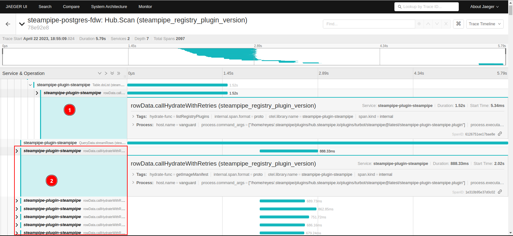

In this article, we'll cover the ~~ancient~~new forgotten knowledge of [distributed tracing](https://medium.com/jaegertracing/jaeger-tracing-a-friendly-guide-for-beginners-7b53a4a568ca) and [metrics](https://opentelemetry.io/docs/concepts/signals/metrics/), as applied to [Steampipe](https://steampipe.io/). We'll see the kinds of data that is natively exposed by a Steampipe instance, how to collect and view it and why you'd want to collect it. Then, we'll expose our own data from plugins. This latter part has never before seen the light of day and Internet exposure, as far as I could find.

This is another article in the [Steampipe series](/tags/steampipe/). See the previous articles for an introduction to Steampipe, why you'd want to use it, and more!

## Introduction, with a primer on distributed tracing and all-around observability

To set the stage, we need to present the concept of [distributed tracing](https://medium.com/jaegertracing/jaeger-tracing-a-friendly-guide-for-beginners-7b53a4a568ca), and other associated concepts that together form Observability.

I'll refer you to The Great Search Engine of your choice for that. There are many articles that present observability, the three pillars, why you'd want it, how can you achieve it, and whatnot. Briefly, having an observable system means being able to peek into it to, maybe, detect slow or dead services, find inter-service communication paths, or optimize database queries.

I'll also point interested readers to [this article series by Thomas Stringer](https://trstringer.com/otel-part1-intro/).

**Logs** are probably the oldest method of gaining some observability. In a monolithic web application, they're an easy way to give you a lot of information. They are emitted in the same order that the code is executed, and if you have multiple threads, you can just add a thread ID to demultiplex the intermingled logs.

They somewhat break down on a microservices-based application. Sure, you can still log things, but joining log entries across microservices gets... weird. Say you receive two web requests from the client application, and you forward them both to a backend service. One of them fails, the other one succeeds. How do you know which is which? All you see is two GET requests in the webserver logs, and one success and one fail log in the backend. To join them, you'd need some sort of "request ID" or "transaction ID" that can be carried across microservices, emitted in all logs, and later used to merge logs back.

**Metrics** are numbers. Counters for requests. Queue lengths. Process memory usage. Number of rows returned by the DB. Response times. The works. [Prometheus](https://prometheus.io/) is probably the undisputed leader in this area. Metrics are useful for both Ops (i.e., the people that manage the servers, deploy the applications, and get pestered in the middle of the night when the service is down) and Business (i.e., the people that stare at dashboards, can be heard muttering "KPIs, KPIs" under their breaths, dream of high conversion rates and have nightmares of high churn rates).

They are useful in microservice architectures to detect stuck/failed/slow services. For instance, say you have a job queue and several instances of a worker microservice that take items out of the queue. You can set up a metric that tracks the queue length, and state that it should be low enough and not grow steadily, as it would indicate that the worker services are down or otherwise not servicing the queue.

**Traces** are the coolest and probably most technically complex of the three. They're like call stack traces, but across processes. Every "transaction" (which may be, say, an API request that comes from the frontend) gets its own Trace ID, and as it involves different microservices, they all report their own pieces of the transaction, all with the trace ID. Thus, you get a unified view of all operations involved: API calls across your own services, API calls to external services (which look like black boxes, as they won't cooperate and send you partial traces), database calls, messages that went through message queues, everything.

That's it for a primer. I may do another post in the future (like, in the *far* future) with far more information in the subject.

### What's with the multiple options?

The telemetry space seems to suffer from a slight [case of "15 competing standards"](https://xkcd.com/927/). There are so many to choose from!

Case in point, distributed tracing:

* [OpenCensus](https://opencensus.io/)

* [OpenTracing](https://opentracing.io/)

* [Jaeger](https://www.jaegertracing.io/)

* [Zipkin](https://zipkin.io/)

* [OpenTelemetry](https://opentelemetry.io/)

* Custom vendor agents/libraries, one for each APM solution under the sun.

To be fair, the first two ~~are already dead~~ have transcended their limitations and merged into OpenTelemetry. Jaeger and Zipkin are still going strong, judging by their commit history.

So, which one should you use? This author says OpenTelemetry, no excuses. It has [the blessing of the CNCF](https://www.cncf.io/projects/) (maybe? It's an Incubating project, and to be fair, Jaeger is Graduated, hence more blessed). It does traces, metrics and logs. It's supported by many programming languages and frameworks. Its auto-instrumentation feature is _amazing_ (at least on Python). Many cloud vendors can ingest it.

As for its downsides, it's fairly new. The logs API isn't even stable yet (the traces and metrics APIs are). It may not be as integrated as a paid vendor's Super Special Library, but you trade that cost for no lock-in and a completely free tool, should you want it. That's honestly all I can think of. Assuming the project doesn't die, it should pay off to choose it. And it has been alive for a few years as of now.

## Steampipe's observability features

In ye olde days of June, 2022, Turbot [launched Steampipe v0.15](https://steampipe.io/blog/release-0-15-0). Alongside other enhancements, it included support for OpenTelemetry, whereby you can inspect distributed traces from queries. This could be really nice to debug slow queries, weird API consumption cases, and verifying that the correct hydration functions are being called.

See the screenshot below (taken from the launch post) for an example. It comes from the query `select * from aws_s3_bucket`:


Now, 83.013% of a year later, there's no material on its usage apart from the announcement blog post. See for yourself:


After the first two results, all hits come from either Steampipe plugins' dependency files (which all pull OpenTelemetry's libraries as an indirect dependency), or spurious hits from articles that happen to talk about Steampipe and mention OpenTelemetry as a suggested article, or viceversa.

This article aims to provide some light in this subject.

## Configuring Steampipe for OpenTelemetry exports

### First: Some sort of OpenTelemetry collector

This is covered by [the OpenTelemetry collector's docs](https://opentelemetry.io/docs/collector/getting-started/#demo). The "Demo" section is enough: it starts the OpenTelemetry collector, a Prometheus database for metrics, Jaeger and Zipkin servers for traces (one of them would be enough), and two sample apps to generate data.

**Note:** I had to delete the sample client and server apps. They were failing on compilation, and I had no wish to debug them. If the `demo-client` or `demo-server` apps give you any grief at all, you may just eradicate them from the `docker-compose.yml` file.

The demo Compose file spins up the Observability cluster section in the diagram below, except for Grafana.


If you wish to, you can check that the observability cluster is running by visiting their web ports:

* Jaeger on <http://localhost:16686>
* Prometheus on <http://localhost:9090>
* Zipkin on <http://localhost:9411>

### Bonus: ready-made collectors!

Don't use this section as buying advice. The author received no compensation whatsoever for adding or excluding any options from this list.

* Cloud/hosted services: I have used none of the above, due to a certain unwillingness to both pay for and send data to cloud services.
  
  * [Splunk APM](https://www.splunk.com/en_us/products/apm-application-performance-monitoring.html) seems to promise full OpenTelemetry compatibility, but I couldn't find any docs or videos showing the trace UI. That *should* mean that both traces and metrics are supported.
  
  * [Google Cloud's Cloud Trace](https://cloud.google.com/trace/docs/setup) can definitely ingest traces, though metric suport is unclear.
  
  * [Honeycomb](https://www.honeycomb.io/) is more focused on APM (i.e., measuring user-perceivable metrics such as time, which tie into the "eBay expert says that every extra 100ms delay in the checkout procedure causes a revenue drop of over 7%" factoids that I vaguely remember reading), but they do ingest data from OpenTelemetry. Traces are confirmed, metrics should also be supported as they are critical for APM stuff.
  
  * There are many others, which I don't know nor have used.

* Self-hosted services:
  
  * The Grafana fan stack: [Mimir](https://grafana.com/oss/mimir/) for metrics, [Tempo](https://grafana.com/oss/tempo/) for traces, [Grafana](https://grafana.com/grafana/) itself for the frontend. Note that both Mimir and Tempo are fairly new, Mimir especially so.
  
  * The mature stack: [Jaeger](https://www.jaegertracing.io/) for traces, [Prometheus](https://prometheus.io/) for metrics, maybe Grafana for the frontend.
  
  * [Signoz](https://signoz.io/) as a more integrated solution, which supports both traces and metrics (and logs!), plus a frontend, query UI, dashboards and alerts. The last time I checked it, it was still fairly new and in beta, but it looked really promising.

### Configuring Steampipe to export observability data

As covered in the launch post for the feature and also on [Steampipe's docs](https://steampipe.io/docs/reference/env-vars/steampipe_otel_level), to enable OpenTelemetry exports you have to set the `STEAMPIPE_OTEL_LEVEL` to `TRACE`, `METRICS` or `ALL` (which is equivalent to `TRACE`+`METRICS`).

As a piece of probably useless trivia, this `TRACE` option is not conceptually the same as the severity `TRACE` that is usually provided as the lowest, chattiest log level in many logging frameworks. Logging `TRACE` is below `DEBUG`, `INFO`, `WARNING`, `ERROR` and `CRITICAL`, while the telemetry `TRACE` means "export distributed traces". It could also have been called `TRACES`, to better match the other option `METRICS`. End of trivia.

The easiest way to enable telemetry is to start the Steampipe server with a temporary environment variable. This requires that Steampipe is not running yet, as otherwise the command will connect to the existing server and not take the envvar value:

```bash
STEAMPIPE_OTEL_LEVEL=ALL steampipe query
```

This will connect to the default OpenTelemetry collector, which is on `http://localhost:4317`. If you started the OpenTelemetry cluster from the demo, as covered in the previous section, you already have it. Otherwise, use the standard `OTEL_EXPORTER_OTLP_ENDPOINT` environment variable to point to your collector.

Then, inside Steampipe's CLI, you can run any query. They will export metrics and traces to the OpenTelemetry collector, which will in turn forward traces to Jaeger and Zipkin (in the demo) and metrics to Prometheus.

```bash
$ STEAMPIPE_OTEL_LEVEL=ALL steampipe query
Welcome to Steampipe v0.18.6
For more information, type .help
> select * from steampipe_registry_plugin where create_time >= '2022-01-01'
+----------------------------+---------------------------+--------------------->
| name                       | create_time               | update_time         >
+----------------------------+---------------------------+--------------------->
| ellisvalentiner/confluence | 2022-01-11T22:41:02-05:00 | 2022-10-14T11:20:59->
| ellisvalentiner/weatherkit | 2022-08-29T16:47:24-05:00 | 2022-10-14T11:18:33->
| francois2metz/baleen       | 2022-06-15T04:59:37-05:00 | 2022-09-01T10:38:47->
| turbot/openapi             | 2023-03-31T12:06:05-05:00 | 2023-04-04T05:42:38->
| francois2metz/freshping    | 2023-01-25T15:26:48-05:00 | 2023-01-25T15:28:15->
| turbot/pagerduty           | 2022-01-05T17:42:27-05:00 | 2023-03-22T03:16:37->
| francois2metz/gandi        | 2022-05-17T09:10:38-05:00 | 2022-11-10T08:53:10->
| turbot/supabase            | 2023-03-21T13:32:25-05:00 | 2023-03-21T13:33:40->
| turbot/panos               | 2022-05-18T06:42:28-05:00 | 2023-03-22T03:37:07->
| francois2metz/gitguardian  | 2022-10-20T12:31:06-05:00 | 2022-11-04T15:10:32->
| turbot/tailscale           | 2022-09-21T21:50:07-05:00 | 2023-04-05T10:59:41->
| turbot/planetscale         | 2022-02-16T08:15:33-05:00 | 2023-04-10T09:53:44->
| francois2metz/ovh          | 2022-05-16T07:32:03-05:00 | 2023-03-15T11:25:22->
| turbot/prometheus          | 2022-01-11T17:18:56-05:00 | 2023-03-21T14:43:23->
| kaggrwal/bitfinex          | 2022-11-02T14:22:15-05:00 | 2022-11-02T14:23:28->
| turbot/reddit              | 2022-06-09T01:39:39-05:00 | 2023-03-22T14:09:36->
| marekjalovec/make          | 2023-01-19T08:55:19-05:00 | 2023-04-20T20:33:19->
>
```

## Interpreting the results: traces

With the OpenTelemetry collector demo, two different trace backends are used in parallel: [Jaeger](https://www.jaegertracing.io/) and [Zipkin](https://zipkin.io/).

Let's look at Jaeger first.

### Jaeger

Let's visit the Jaeger web UI, available (if using the OpenTelemetry collector demo) at <http://localhost:16686>.


Not much information, is there? That's because you need to make a search first. On the left panel, choose `steampipe-postgres-fdw` on the Service dropdown, then click the blue `Find Traces` button at the bottom. That will populate the right side. Then, click on a trace to open its detail view.


That's a representation of all operations performed by the SQL query. Since this was a fairly simple query (no extra hydrate calls, no JOINs, no pagination APIs), the trace looks nearly sequential.

Now for some terminology. The entire operation (triggered by our `SELECT` query above) is called a _trace_. Each of its suboperations is called a _span_. Spans are nested in a tree structure (i.e., each one has a parent span, except one which is called the _root span_). There are no loops (for you Data Structures students, it's a tree, not a graph). Every span can have _tags_, which are arbitrary key-value pairs. Every span belongs to a _service_, which roughly translates to a process or microservice. Spans and the entire trace have beginning and end times.

This trace involves two services (as seen almost at the top of the UI): `steampipe-postgres-fdw` in yellow and `steampipe-plugin-steampipe` in blue. The former is the Postgres core that is properly called Steampipe, the latter is the plugin. The first service only owns the root span, which just calls the plugin. The plugin spans tell us the entire story of the execution: here, it's just a List call, which matches the fact that we did a `SELECT` without a primary key.

What can we deduce from this? Mostly, that nearly all the time is due to the API call. We know that because the long blue bar that drags out the entire execution is the hydrate call. Clicking on that span (the one called `rowData.callHydrateWithRetries`) reveals that the function that was being called is `listRegistryPlugins`, as seen in the `hydrate-func` tag. If you were debugging an abnormally slow query, that would point you right to the code that was responsible.

I can't run those awesomely complex queries that Steampipe's team demonstrate on their blog posts, as I have no cloud computing accounts filled with all sorts of resources. Instead, have a query that accesses the open Steampipe Hub API:

```sql
select 
    * 
from
    steampipe_registry_plugin p 
    join steampipe_registry_plugin_version pv on p.name=pv.name
```



That query took a lot longer to return data. Over five seconds, actually. You may want to discover why. The traces tell you stuff: there is a first span (marked 1) that calls the `listRegistryPlugins` function. Then, there are several hundreds (maybe a thousand?) of calls to the `getImageManifest` hydrate function. Apparently that's a separate API call, and while Steamipe parallelizes it, it still takes some time. Armed with that knowledge, you can decide to exclude manifest-related columns from the query (above we ran `SELECT *`, which Steampipe discourages for _precisely this reason_) and enjoy a faster-running query.

### Zipkin

This will be a short section, as Zipkin provides essentially the same functionality. The UI is slightly different. It follows the [Material Design system, somewhat like version 2](https://m2.material.io/).

The Zipkin server is on <http://localhost:9411/>. Like Jaeger, it opens to an empty screen, and you can just click the big blue `Run Query` button at the top right, then click on an interesting trace to go to its detail view.


Much as Jaeger, there is the first call (1) that lists all plugins, and then the repeated calls (2) to the `getImageManifest` hydrate function. The tags for the currently selected span open to the right (3).

## Does it work on third-party plugins?

```sql
select * 
from blockchain_transaction 
where wallet='1MusKqjbk497v4Jf1bkgSpKb4aUhjzfoqA'
```


Yes, it does.

That's the [steampipe-plugin-blockchain](https://github.com/jreyesr/steampipe-plugin-blockchain) plugin, written by yours truly. I chose it because I know that I did nothing to enable tracing. And yet, it works. The plugin SDK does all the magic and the plugin author does not need to care. That should mean that most, if not all, plugins are trace-enabled[^1].

Indeed, I can see that an API call was retried there. I know that the remote API used by the plugin is particularly fond of rate limiting you. That's probably what's happening here. That may guide us (as a user) to write more optimized queries, limit the data accessed, or even (as a developer) to limit concurrency or use other similar tricks to avoid hitting the rate limits.

## Impressions

* As advertised, Steampipe can do distributed tracing on plugins.

* Said tracing works without any work required on the plugins.

* The traces provide insights into the operations and API calls performed by the plugins, thus letting users and developers optimize their queries.

* All in all, it works exactly as advertised. 10/10, would recommend.

## Built-in metrics

While it's not mentioned at all in [the launch post](https://steampipe.io/blog/release-0-15-0#telemetry), and only hinted at in the envvar docs and high-verbosity logs, Steampipe also exports metrics in the OpenTelemetry standard. In other words: you can also get numbers to fill dashboards or do whatever you want.

To see them, you need to have:

* An OpenTelemetry collector with the metrics pipeline enabled. The OpenTelemetry collector demo already has it.

* A metrics backend storage, such as [Prometheus](https://prometheus.io). Again, the OpenTelemetry collector demo already has it.

* A way to visualize the metrics. Prometheus has a web UI that works well to verify that things are working, but [Grafana](https://grafana.com/grafana/) is a much more powerful tool.

I already have a Grafana installation as part of a Raspberry Pi-based weather monitor. Adding the Prometheus database to it has no mysteries: you just provide an IP, port (it's 9090), and then save the data source. Then, you can start exploring your data, by using the Explore tab in Grafana's left navigation bar.

The Metric dropdown exposes many metrics. Some, prefixed with `otelcol_`, are OpenTelemetry metrics; others are internal Prometheus metrics (such as scrape timings) and there is a single Steampipe-themed metric: `steampipe_postgres_fdw_hydrate_calls_total`.

That metric, as its name implies, holds information about the amount of hydrate calls, broken down by:

* Connection name (not just plugin, but specific connection, since you can have more that one connection for the same plugin)

* Plugin.

* Table involved. It's unclear what happens when you issue a SQL query that involves more than one table. From a cursory investigation with Steampipe's Steampipe plugin (no, no typos there!), it doesn't seem to count both tables' hydrate functions.


That could be useful for tracking runway queries that make far too many hydrate calls. You don't seem to be able to isolate specific queries, though.

## Hackity hack: adding new metrics and spans

Up until now, we've been upstanding citizens. We've only used what the good folks at Steampipe have seen fit to provide to responsible plugin authors that don't overstep their bounds.

And now, we'll start poking into undocumented bits of Steampipe. As one does. In particular, we want to expose new metrics and (if possible) mess with traces.

* We can expose a new metric to track API calls made by our plugins, should we desire precise API consumption tracking. Good for corporate-type environments where someone is paying a ton of money for an API plan and they get really nervous at the thought of letting anyone call SQL that could consume the monthly quota faster than can be seen.

* In the same vein, assuming the remote API always reports the remaining quota ([as Github does](https://docs.github.com/en/rest/overview/resources-in-the-rest-api?apiVersion=2022-11-28#rate-limit-headers)), you can expose a gauge that presents that information. Github even recommends doing so, instead of calling a dedicated API endpoint when you want to get the remaining API quota, "to decrease load on the API".

* You can provide granular information about returned rows, to measure if your users are making queries that return a lot of data or just a few rows.

* Same goes for response timings. You can monitor the API's performance by using the real user's requests, instead of calling the API separately at intervals.

* You could track the columns that your users are querying on. For example, the [LDAP plugin](https://hub.steampipe.io/plugins/turbot/ldap) lets you query on several fields. You may be interested on knowing which fields are used more for user selection.

* Finally, don't forget the basics: measuring simple usage by time of the day, day of the week, or whatever. The built-in `steampipe_postgres_fdw_hydrate_calls_total` metric can help, but it doesn't measure request count.

As for traces:

* You could inject custom tags, such as whether or not you are serving results from your [custom secret cache](https://jreyesr.github.io/posts/steampipe-part-five-caching/#cache-the-second-plugin-cache).

* If you retry a request, you can set a tag that indicates the reason for the retry.

* You can [inject events](https://opentelemetry.io/docs/concepts/signals/traces/#span-events) in the traces, to (say) indicate the exact point in time at which the plugin started streaming data back.

* If your plugin does some sort of CPU-intensive processing, you could measure that as a separate span.

### Custom, handmade plugin metrics

Every Steampipe plugin, by virtue of depending on the `steampipe-plugin-sdk` Go package, also depends on the official [Go implementation of OpenTelemetry](https://pkg.go.dev/go.opentelemetry.io/otel). You get best-in-class[^2] telemetry support without needing to install anything extra.

As is tradition, I'll use the Blockchain plugin for tests. The following changes are required to create new metrics:

```go
// New file, blockchain/metrics.go

package blockchain

import (
    "go.opentelemetry.io/otel/metric/global"
    "go.opentelemetry.io/otel/metric/instrument"
    "go.opentelemetry.io/otel/metric/instrument/syncint64"
    "go.opentelemetry.io/otel/metric/unit"
)

var requestCounter syncint64.Counter
var rowsCounter syncint64.Counter

func InitMetrics() {
    meter := global.Meter("steampipe_plugin_blockchain")
    requestCounter, _ = meter.SyncInt64().Counter(
        "steampipe_plugin_blockchain.requests.count",
        instrument.WithDescription("A counter of requests made to the Blockchain API"),
        instrument.WithUnit(unit.Dimensionless))
    rowsCounter, _ = meter.SyncInt64().Counter(
        "steampipe_plugin_blockchain.rows.count",
        instrument.WithDescription("A counter of rows returned across all API calls"),
        instrument.WithUnit(unit.Dimensionless))
}
```

```go
// main.go
package main

import (
    "github.com/jreyesr/steampipe-plugin-blockchain/blockchain"
    "github.com/turbot/steampipe-plugin-sdk/v5/plugin"
)

func main() {
    // THIS IS NEW
    blockchain.InitMetrics()

    plugin.Serve(&plugin.ServeOpts{
        PluginFunc: blockchain.Plugin})
}
```

```go
// blockchain/table_blockchain_transaction.go

package blockchain

import (
    ...
    "go.opentelemetry.io/otel/attribute"
)


// Table definition as normal

func hydrateFunc(ctx context.Context, d *plugin.QueryData, h *plugin.HydrateData) (interface{}, error) {
    requestCounter.Add(ctx, 1, attribute.String("op", "listTransactions"))

    // REST OF THE CODE AS NORMAL

    // THIS IS THE BIT THAT STREAMS BACK THE RESULTS
    for _, tx := range transactions {
        d.StreamListItem(ctx, tx)
        // NEXT LINE IS NEW
        rowsCounter.Add(ctx, 1, attribute.String("op", "listTransactions")) // THIS LINE IS NEW
    }
}
```

What was all that?

* We created a new file to hold the metrics declarations. We creatively named it `metrics.go` and placed it in the `blockchain` package, where the main plugin code can access it.

* In said file, we registered some metrics with the global metric provider. That provider is set up by the plugin SDK and reports metrics back to the main Steampipe process, where they are exported to the OpenTelemetry collector.

* In the `main` function, we call the function that creates and registers the metrics.

* Then, in the actual plugin code, we can (at any point) access the metrics and set their values.

The example sets two counters: one for requests, and one for returned rows. The former is incremented once for each hydrate function call. The latter is incremented once for each returned row.

In the example, there are only counters. These are metrics that only go up, never down (except for process restarts). Counting stuff that goes up and down (e.g., API quotas, which can reset; or memory usage) requires a gauge in Prometheus parlance. There are also histograms, useful for request times, as they not only expose an average, but also some percentiles. They are declared in the same manner, in the `metrics.go` file, and they have different methods: the counters that we declared can only `Add(int)`, while gauges can also decrease and histograms have a `Record(int)` method that adds a new datapoint to the distribution.

The new code that adds custom metrics has already been published to the [steampipe-plugin-blockchain repository](https://github.com/jreyesr/steampipe-plugin-blockchain): see [commit 2f51597](https://github.com/jreyesr/steampipe-plugin-blockchain/commit/2f51597d64eac6f52a9b3efe3f9f9d9f6b577fe3).

### Testing the new metrics

After recompiling and installing the plugin, we can run a simple query to check that the custom metrics are recorded correctly.

```sql
select * 
from blockchain_transaction 
where wallet='1MusKqjbk497v4Jf1bkgSpKb4aUhjzfoqA'
```

Then, after waiting for a bit (to give Prometheus time to scrape the new metrics) we can go to Grafana and query for the new metrics. They're called `steampipe_plugin_blockchain_requests_count` and `steampipe_plugin_blockchain_rows_count`. Apparently the plugin SDK, or maybe Prometheus, converts periods in metric names to underscores.


And there they are. I first ran a valid query, which returned 8 rows. That's what Prometheus sees for the first time: `steampipe_plugin_blockchain_requests_count` set to 1 and `steampipe_plugin_blockchain_rows_count` set to 8. Then, I ran two more queries with invalid wallets. They can be seen in the first metric (since the request was made), but not in the second (since no rows were returned).

So, we have verified that custom metrics are supported by the Steampipe SDK. You can register new metrics, and they will be exported to the OpenTelemetry collector.

This should open up huge opportunities for custom plugin monitoring. With no changes required to the Steampipe core, any plugin author can expose whatever metrics make sense for the specific plugin, usecases and remote service that the plugin interfaces with.

### Histograms

Histograms are [another type of metric](https://prometheus.io/docs/concepts/metric_types/#histogram). They're more complex, both to implement and to understand, but they can expose more information than a simple counter.

A histogram is typically used to record response sizes or response times. Let's take the example of response times, since that's what we'll do here. If you are writing a web server, your clients will see a certain distribution of response times: some will see fast responses, some will see slow responses. Taking an average gives you (the developer) some information about user experience, but it's not enough. If only 1% of your users experience really slow responses, they may get masked by the other 99% of users: your average will stay happily low, while some unfortunate users get to wait for a few minutes per page navigation. You sometimes need more granularity, and a way of asking "what percentage of requests are we serving in under a second?" or "how much time are we taking to serve 95% of all requests?"

These kinds of questions are linked to the [Apdex score](https://en.wikipedia.org/wiki/Apdex), used when measuring user satisfaction and application responsiveness.

OpenTelemetry can record histograms. We have added a histogram to report query times (or, to be precise, the times taken by hydrate functions). Then, we can monitor slow queries and alert on them or follow them up for more debugging, perhaps using traces.

```go
// metrics.go
timeTaken, _ = meter.SyncInt64().Histogram(
    "steampipe_plugin_blockchain.requests.time",
    instrument.WithDescription("A histogram of the times taken for each hydrate function"),
    instrument.WithUnit(unit.Milliseconds))

// table_something.go
func hydrateFunc(ctx context.Context, d *plugin.QueryData, h *plugin.HydrateData) (interface{}, error) {
    start := time.Now()

    // RUN ALL CODE HERE

    end := time.Now()
    timeTaken.Record(
        ctx, end.Sub(start).Milliseconds(),
        attribute.String("op", "hydrateFunc"))
}
```

We declare a metric, of type Histogram, and we provide it with a description. Then, we wrap the actual code whose execution we want to time with calls to `time.Now()`, and we submit that measurement to the histogram. From there on, the OpenTelemetry library takes over, computes the quantiles and exports that data.

Then, we can [visualize the histogram in Grafana](https://grafana.com/blog/2020/06/23/how-to-visualize-prometheus-histograms-in-grafana/#show-me-the-buckets-distribution). Setting up the histogram so that it is displayed correctly is somewhat complex, so follow the link for detailed instructions.

This is the result, after running a few queries. Note that there are two panels, one for the time distribution of successful queries and another for failed queries. This is possible because when calling `timeTaken.Record()`, you can provide arbitrary labels, such as whether or not the measured query failed or not.


It may be nice to tweak the quantile limits. By default, the library seems to put the first cutoff point at 5000 milliseconds, which is far too high: we'll record everything under 5 seconds in the first bucket. The cutoff points may have been tailored for response times measured in microseconds, or perhaps for file sizes in bytes. I tried to find out how to configure histogram boundaries, but came up with no information, so we'll say it's left as an exercise to the reader.

If you want to check out the code, it was added on [commit de2bd08](https://github.com/jreyesr/steampipe-plugin-blockchain/commit/de2bd080b1072226762cd2a33e16f8d16c3385bc).

Sadly, the OpenTelemetry SDK does not appear to support exemplars yet. [Exemplars](https://grafana.com/docs/grafana/latest/fundamentals/exemplars/) are a really cool way to jump from a metric to a trace. For example, for the histogram above, if there were exemplars, you could do something like "show me a trace that failed in less than 5000 milliseconds" (i.e., the leftmost bar of the right histogram), and the metrics DB would give you a trace ID that fell in that bucket. From there on, you could go to that trace and see what's the deal with it. That is _incredibly_ useful when debugging, say, abnormally long requests: you can just click on the datapoint that shows you a spike in response times, and get taken to a transaction that had "the problem", whatever that problem is.

### Custom, handmade plugin traces

Armed with the knowledge of how to create new metrics, we now turn to the problem of customized traces.

We'll consider ourselves successful if we can:

* Add new tags to the current span, inside our code.

* Create new sub-spans, perhaps to mark distinct sections of code.

* Insert [span events](https://www.honeycomb.io/blog/uniting-tracing-logs-open-telemetry-span-events) at specific points of the execution.

* Mark spans as failed or errored.

We'll heavily reference the [OpenTelemetry docs on Manual Instrumentation](https://opentelemetry.io/docs/instrumentation/go/manual/) for this part. There is also automatic instrumentation, which depends on third-party libraries (e.g., HTTP libraries, database connectors, and such) to add seamless instrumentation. We don't have that here, so we'll manually create and edit spans.

To start, we'd need to acquire a reference to the currently active trace and span. Without that, we can't do any of the three bullet points above.

There is [a section in the docs](https://opentelemetry.io/docs/instrumentation/go/manual/#get-the-current-span) that explains just that:

```go
import (
    "go.opentelemetry.io/otel/trace"
)

span := trace.SpanFromContext(ctx)
```

After that, we can mess with the current span: add tags, add events, mark it as errored, create subspans, whatever.

For instance, we'll use the List hydrate function for the `blockchain_transaction` table. You trigger that function by requesting Bitcoin transactions that involved a wallet.

```udiff
--- a/blockchain/table_blockchain_transaction.go
+++ b/blockchain/table_blockchain_transaction.go
@@ -8,6 +8,8 @@ import (
        "github.com/turbot/steampipe-plugin-sdk/v5/plugin"
        "github.com/turbot/steampipe-plugin-sdk/v5/plugin/transform"
        "go.opentelemetry.io/otel/attribute"
+       "go.opentelemetry.io/otel/codes"
+       "go.opentelemetry.io/otel/trace"
 )

 func tableBlockchainTransaction() *plugin.Table {
@@ -57,7 +59,22 @@ func listTransactions(ctx context.Context, d *plugin.QueryData, h *plugin.Hydrat

        page := 1 // Pagination for this API starts at 1!
        getTransactionsPage := func(ctx context.Context, d *plugin.QueryData, h *plugin.HydrateData) (interface{}, error) {
-               return client.GetTransactionsForWallet(wallet, page)
+               data, err := client.GetTransactionsForWallet(wallet, page)
+               if err != nil {
+                       span := trace.SpanFromContext(ctx)
+                       // DEMO 1: Mark a span as failed (shows up in the traces UI)
+                       span.SetStatus(codes.Error, err.Error())
+
+                       // DEMO 2: Adds a point-in-time event, with a message and attributes
+                       span.AddEvent(
+                               "error",
+                               trace.WithAttributes(
+                                       attribute.String("wallet", wallet),
+                                       attribute.Int("page", page),
+                               ),
+                       )
+               }
+               return data, err
        }
        retryConfig := &plugin.RetryConfig{
                ShouldRetryErrorFunc: ShouldRetryBlockchainError,
@@ -65,12 +82,19 @@ func listTransactions(ctx context.Context, d *plugin.QueryData, h *plugin.Hydrat
                RetryInterval:        1000,
                BackoffAlgorithm:     "Constant",
        }
+       span := trace.SpanFromContext(ctx)
+       // DEMO 3: Sets arbitrary attributes in the current span
+       span.SetAttributes(attribute.Int64("limit", d.QueryContext.GetLimit()))

        for { // Run over all pages until we get an empty one, that means we're done
                transactionsGeneric, err := plugin.RetryHydrate(ctx, d, h, getTransactionsPage, retryConfig)
                plugin.Logger(ctx).Debug("listTransactions", "res", transactionsGeneric, "err", err)

                if err != nil {
+                       span := trace.SpanFromContext(ctx)
+                       // DEMO 4: Marks the span as failed, and records the error as a span event of a special kind
+                       span.SetStatus(codes.Error, err.Error())
+                       span.RecordError(err)
                        plugin.Logger(ctx).Error(fmt.Sprintf(
                                "Unable to fetch transactions for wallet %s at offset %d: %s",
                                wallet, page, err),
--- a/blockchain/errors.go
+++ b/blockchain/errors.go
@@ -5,6 +5,7 @@ import (
        "fmt"

        "github.com/turbot/steampipe-plugin-sdk/v5/plugin"
+       "go.opentelemetry.io/otel/trace"
 )

 type RateLimitError struct {
@@ -14,6 +15,8 @@ type RateLimitError struct {
 func (e RateLimitError) Error() string { return fmt.Sprintf("Rate Limit %s", e.url) }

 func ShouldRetryBlockchainError(ctx context.Context, d *plugin.QueryData, h *plugin.HydrateData, err error) bool {
+       span := trace.SpanFromContext(ctx)
+       span.RecordError(err)
        if err, ok := err.(RateLimitError); ok {
                plugin.Logger(ctx).Warn("ShouldRetryBlockchainError", "err", err)
                return true
```

We get a reference to the current span by calling `trace.SpanFromContext(ctx)` whenever we need it, and then we can perform many actions:

1. At the start (DEMO 1), we mark the span as failed with `span.SetStatus(codes.Error)` if the hydrate function returns an error. This is the internal hydration function, the one that is called by the `RetryHydrate` SDK helper. As we'll see later, this marks the span with a nice red warning sign.

2. There (DEMO 2), we also add an [event](https://www.honeycomb.io/blog/uniting-tracing-logs-open-telemetry-span-events) for the error. Such events show as point-in-time logs (i.e., they only have a single timestamp, as opposed to spans that have start and end timestamps). Here, we log the wallet that caused the problems, and the page of results that we were looking at. This may be invaluable in debugging certain intermittent problems.

3. Below (DEMO 3), we also demonstrate setting an attribute on the current span. I had no good candidates to add, so I settled for adding an attribute that holds the limit of rows, as provided by the `LIMIT` query. You can add anything of interest here.

4. Finally (DEMO 4), if the entire wrapped hydrate function fails (i.e., it runs out of retry attempts or it hits an error that is not retryable), we mark the outer span as failed too (like in DEMO 1) and record the error. This is somewhat similar to DEMO 2, in that it adds an event, but it has some special attributes as we'll see below.

I also added some code in the `ShouldRetryBlockchainError` function, which runs to determine whether the error is retryable or not. This lets me record the error at the point at which it is available, since otherwise the `RetryHydrate` helper wouldn't let me access each retry, only the set of retries as a whole.

### Testing the new traces

We'll first test the changes with a successful query:

```sql
select * from blockchain_transaction where wallet='1MusKqjbk497v4Jf1bkgSpKb4aUhjzfoqA'
```


There we can see a nearly unchanged trace. However, on one of the spans, there is now a new Tag: it's called `limit` and has the value -1. This is expected, since we didn't set a limit to the query in SQL. This demonstrates that we can add custom tags (Attributes in OpenTelemetry parlance) to spans.

What about a failed query? Here we just changed the last character of the wallet, to create an invalid wallet ID.

```sql
select * from blockchain_transaction where wallet='1MusKqjbk497v4Jf1bkgSpKb4aUhjzfoqB'
```


This has more interesting stuff. Two of the spans are marked as errors, as can be seen from the red alert icons to the left of the span names. By the way, the same alert icons appear in the main Jaeger UI when searching. This indicates that those two spans encountered an error. The inner one (the bottom one) is the wrapped function, the one that may be retried. The outer (top) span is the span for the main hydrate function, since we can see the new `limit` tag there too.

Both failed spans also have a Log (or Event) that shows the error message that was involved. The inner span also has the event set in DEMO 2, which surfaces the guilty wallet. This may be useful when tracking down some parameters that cause errors.

### Adding new subtraces

Finally, let's say that we now want to add new spans. This effectively lets us control the shape of the span tree, by adding new branches to it.

This ability may be useful if you need to perform some time-consuming operations in your plugin code. For instance, the [Code plugin](https://hub.steampipe.io/plugins/turbot/code), which scans source code (or any string, really) for secrets (such as AWS keys, Github tokens, JWTs and Stripe API keys), uses [Yelp's detect-secrets package](https://github.com/Yelp/detect-secrets), which sounds like it may take some time, and applies different regexes to the input string. Furthermore, for some secret types, it attempts to log in with them, to check if they are still valid (since an exposed secret that can still be used to log in is far, _far_ more critical than one that does not work anymore). All this may take time.

Thus, we can envision the Code plugin wrapping every secret checker and authentication tester in its own span, to help users diagnose abnormally slow queries. Which regex is taking too much time? With which input data? Or is it a login call to a remote API? Is the remote service silently throttling login attempts, since they are being made too frequently and with already-expired keys?

Adding new spans is quite easy, by leveraging the already-existing SDK functions that do that:

```go
import (
    "github.com/turbot/steampipe-plugin-sdk/v5/telemetry"
)


func hydrateFunc(ctx context.Context, d *plugin.QueryData, h *plugin.HydrateData) (interface{}, error) {
    _, parentSpan := telemetry.StartSpan(ctx, d.Table.Plugin.Name, "Custom Work")
    time.Sleep(1100 * time.Millisecond)
    parentSpan.End()
}
```

The `telemetry.StartSpan` function needs a context, service name (which should **always** be set to the plugin name, as otherwise it will appear as coming from another microservice), a span name and (though not displayed in the example above) optional extra arguments, which will be formatted into the span name.

That is, the span name (`"Custom Work"` above) is secretly a format string of the type passed to `fmt.Printf`. It can have placeholders such as `%s` and `%d`, and any arguments beyond the third will be interpolated. That is used by the plugin SDK.

Something to keep in mind is that spans should always be closed. In the example above, we close it after doing "some work", represented by a `Sleep`. 

Alternatively, if the lengthy work is contained in a separate function, you can use `defer parentSpan.end()`. `defer` is [a Go innovation](https://gobyexample.com/defer) that is used to implement "cleanup" such as closing a file, even if an exception happens in the meantime. It's especially useful since it places the cleanup code next to the code that opens the resource, making it easier to remember to write it in the first place, and then maintain it. The fact that `defer` runs even if an error happens means that resources won't be left open, helping prevent resource leaks, without needing to wrap the entire code in a new indentation level as you would need to do in a language with `try...finally`.

For a longer explanation on the `defer` keyword, you may refer (heh) to [this DigitalOcean article](https://www.digitalocean.com/community/tutorials/understanding-defer-in-go).

After compiling the plugin and running a successful query, here's what we see:


As expected, there's a new span called Custom Work. It runs before the RetryHydrate spans, which is where I placed the code to create the span, sleep for 1.1 seconds, and then close the span. 

You can also combine all of the code demonstrated above: nothing prevents you from setting custom attributes on your shiny new span, or saving log events on it, or marking it as an error.

## Recap and closing thoughts

* Observability is the property of a system that exposes information about its internal workings, so that problems, performance issues and execution paths can be inspected.
* Observability has seen a surge in popularity with the rise of microservices-based systems, where parts of the system can fail and be quite difficult to debug.
* Observability rests on three pillars: traces, metrics and logs. Traces are like call stacks, but across services. Metrics are numbers. Logs are lines of text. All three signals should be correlatable with each other.
* OpenTelemetry is a CNCF-supported standard that supports all three classes of signals (logs are still in development, though)
* Steampipe supports traces and metrics since v0.15.
* In addition to the built-in traces and metrics, it's possible for plugin authors to expose their own metrics, and also to modify the traces.
* Custom metrics can be registered and modified at any point in the plugin's hydrate functions, to monitor metrics such as request counts, response times, API consumption and average response size or number of rows.
* Plugin authors can add new attributes (expressed as key-value pairs) to trace spans.
* Plugin authors can also add events (somewhat like log lines, plus a timestamp, plus the span that generated them) to spans.
* Plugin authors can further add entirely new spans, to monitor long-running operations that are not currently differentiated by Steampipe's default span structure.
* All of this is available right now, without changes required to the Steampipe core, and with fairly minimal changes required to the plugin that wishes to enhance its metrics and traces.

Finally, the caveat: all of this is Not Official. There's no telling how supported this is. It may crash your Steampipe instance. Use with care.

Steampipe's developers are of course more than welcome to chime in with any ideas, suggestions, pointers, best practices, or whatever. For everyone else, I hope that this helps you trace and monitor everything that goes on inside the tool that helps you monitor everything.

[^1]: There's a minimum SDK version, though. I can't say how many plugins are on older versions of the SDK. Can Steampipe tell me that? It doesn't look like the plugin that lists plugins surfaces information about the specific SDK version in use for each plugin version. Sad.

[^2]: Indeed, the Go package for OpenTelemetry appears to be the reference implementation, the one used in the examples and all-around the most cared for. Not surprising, since the cloud-native community is probably the biggest user of Go.
