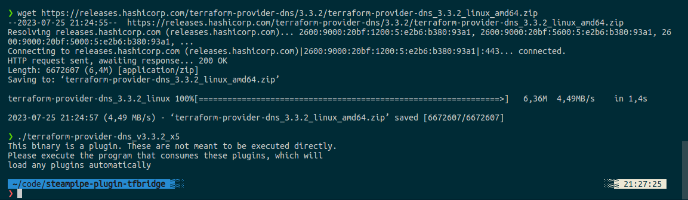
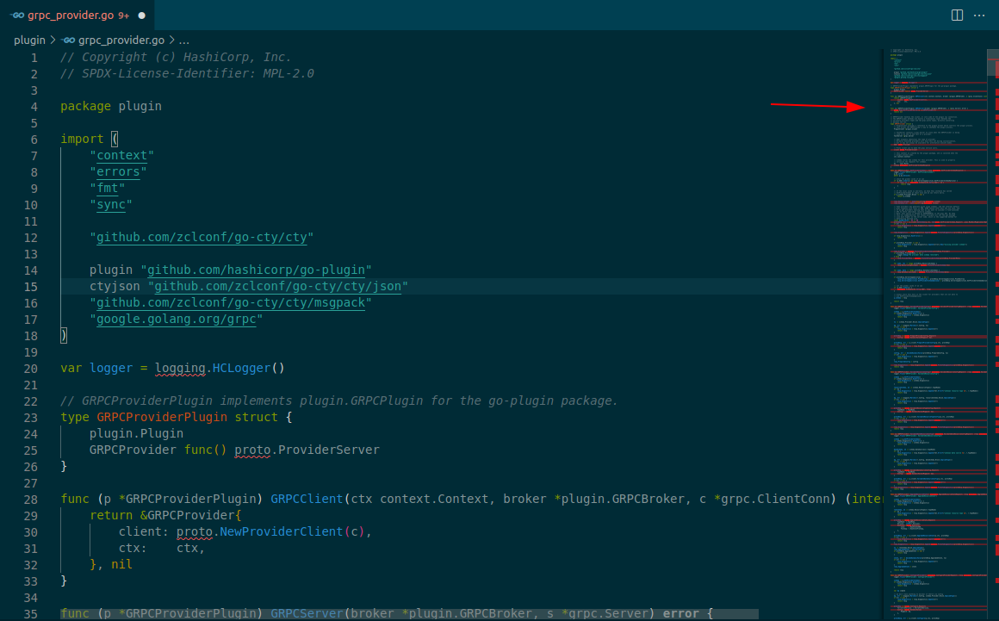
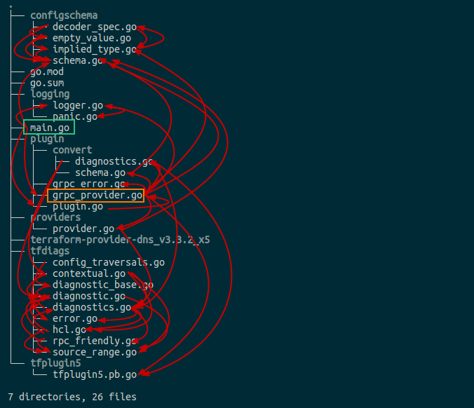
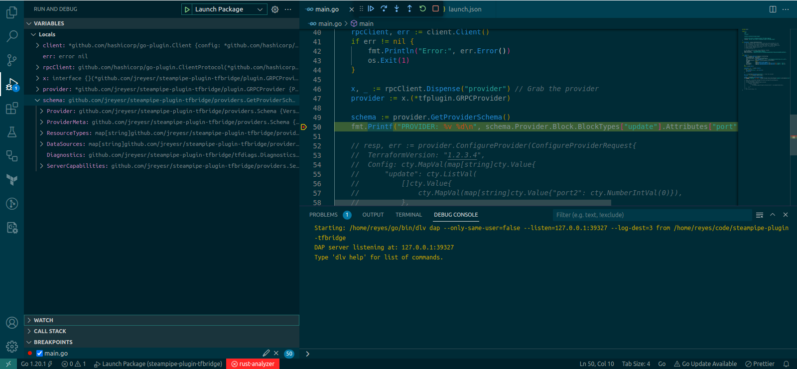
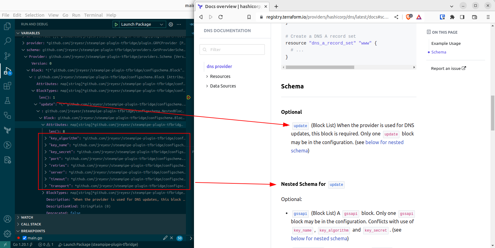
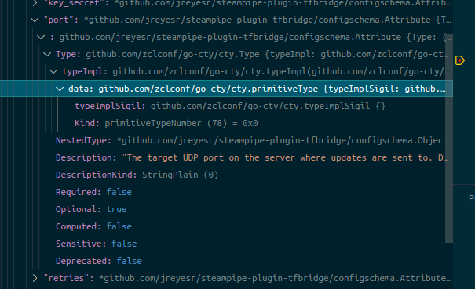
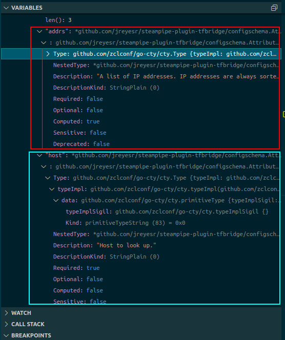

A word of caution: this article talks a lot about [Remote Procedure Calls (RPCs)](https://en.wikipedia.org/wiki/Remote_procedure_call). This abbreviation is subject to some pretty severe [RAS syndrome](https://www.rd.com/list/ras-syndrome/). I've tried to avoid it, but results are uncertain. You've been warned.

## Intro: choosing a test subject

We'll start by getting our hands on a Terraform plugin/provider. We'll take the [DNS provider](https://registry.terraform.io/providers/hashicorp/dns/latest/docs), because it has data sources (e.g. [A records](https://registry.terraform.io/providers/hashicorp/dns/latest/docs/data-sources/a_record_set)) but it doesn't need you to have accounts on cloud providers, or somesuch.

For now, assume that the URL below was magically granted to us. Later we'll explore the [discovery protocol](https://developer.hashicorp.com/terraform/internals/remote-service-discovery) that will take us from `hashicorp/dns`, which is what you'd write in a Terraform file, to the full plugin URL:

```bash
wget https://releases.hashicorp.com/terraform-provider-dns/3.3.2/terraform-provider-dns_3.3.2_linux_amd64.zip
```

We then unzip the file, then try to run the provider (it's the only file inside the ZIP archive, and it's a normal, executable Linux binary):



Interesting. So, if you run a Terraform plugin stand-alone, it just explodes with an error:

```
This binary is a plugin. These are not meant to be executed directly.
Please execute the program that consumes these plugins, which will
load any plugins automatically
```

Searching for that message in Google will, after much searching, eventually take you to [the `go-plugin` Go package, by Hashicorp](https://github.com/hashicorp/go-plugin). Here's [the exact lines](https://github.com/hashicorp/go-plugin/blob/a88a423a8813d0b26c8e3219f71b0f30447b5d2e/server.go#L252-L255) that print that message. 

Combining the facts that those are the exact words that Terraform plugins use, that the `go-plugin` package is built by Hashicorp, that the README states that it is currently used in Terraform, and (finally) that [Terraform providers have an indirect dependency on `go-plugin`](https://github.com/hashicorp/terraform-provider-dns/blob/main/go.mod#L33), [via `terraform-plugin-go`](https://github.com/hashicorp/terraform-plugin-go/blob/main/go.mod#L8), we can be very certain that `go-plugin` underpins every Terraform provider.

So that's our first quest: we need to understand how `go-plugin` works and why.

## `go-plugin`

Visit the repository in <https://github.com/hashicorp/go-plugin> for all the information you could ever want, and maybe more.

The repo's description is "Golang plugin system over RPC". Neat. That's what we need, yes.

> The HashiCorp plugin system works by launching subprocesses and communicating over RPC (using standard net/rpc or gRPC). A single connection is made between any plugin and the host process. For net/rpc-based plugins, we use a connection multiplexing library to multiplex any other connections on top. For gRPC-based plugins, the HTTP2 protocol handles multiplexing.

Okay. So:

* The plugin (here, the Terraform provider) is spawned as a subprocess by the "host application" (usually Terraform, but here it would be our Steampipe plugin)
* It spins up a gRPC server, bound only to localhost [^2]
* The host application will connect to said gRPC server and make calls
* This is what enables plugins to provide "pluggable" functionality: they just have to be programmed to react to certain commands that come in via gRPC. As for the host application, it'll invoke the same commands on all plugins that are added to it, hence the extensibility

So now we know that we want a host application. Not a plugin, those are already written. Not a server, those live on the plugins. We want a gRPC client.

### An example

The [`grpc` example](https://github.com/hashicorp/go-plugin/blob/main/examples/grpc/main.go) in the `go-plugin` repo was invaluable while writing this. Roughly, there are two halves: the plugin and the host. Let's see the plugin first, since that must exist beforehand. By the way, the complete file is [here](https://github.com/hashicorp/go-plugin/blob/main/examples/grpc/plugin-go-grpc/main.go):

```go
// plugin.go

type KV struct{}

func (KV) Put(key string, value []byte) error {
	value = []byte(fmt.Sprintf("%s\n\nWritten from plugin-go-grpc", string(value)))
	return ioutil.WriteFile("kv_"+key, value, 0644)
}

func (KV) Get(key string) ([]byte, error) {
	return ioutil.ReadFile("kv_" + key)
}


func main() {
	plugin.Serve(&plugin.ServeConfig{
		HandshakeConfig: shared.Handshake,
		Plugins: map[string]plugin.Plugin{
			"kv": &shared.KVGRPCPlugin{Impl: &KV{}},
		},

		GRPCServer: plugin.DefaultGRPCServer,
	})
}
```

This plugin gets compiled to a normal binary, let's say `./plugin`. If you tried to run it, you'd get the same error message that we found on a Terraform plugin. That's because it's intended to be run by the host ([here](https://github.com/hashicorp/go-plugin/blob/main/examples/grpc/main.go)):

```go
// host.go

func main() {
	client := plugin.NewClient(&plugin.ClientConfig{
		HandshakeConfig: shared.Handshake,
		Plugins:         shared.PluginMap,
		Cmd:             exec.Command("sh", "-c", "./plugin"),
		AllowedProtocols: []plugin.Protocol{plugin.ProtocolGRPC},
	})
	defer client.Kill()

	// Connect via RPC
	rpcClient, err := client.Client()

	// Request the plugin
	raw, err := rpcClient.Dispense("kv_grpc")

	kv := raw.(shared.KV)
	
	// NOW WE HAVE A USABLE PLUGIN INSTANCE!
	val, err := kv.Get("mykey")
	err := kv.Put("mykey", "123")
}
```

The [shared file]() contains some extra code, which we'll meet again soon:

```go
// shared.go

var Handshake = plugin.HandshakeConfig{
	ProtocolVersion:  1,
	MagicCookieKey:   "BASIC_PLUGIN",
	MagicCookieValue: "hello",
}

// PluginMap is the map of plugins we can Dispense.
var PluginMap = map[string]plugin.Plugin{
	"kv_grpc": &KVGRPCPlugin{},
}

type KV interface {
	Put(key string, value []byte) error
	Get(key string) ([]byte, error)
}
```

Okay. Let's recap up to here:

* Plugin
	* Has a function `main()`
	* Is compiled down to a binary
	* If said binary is called directly, it'll exit with an error and request to be run as part of a host application
	* `main()` calls `plugin.Serve`, with some config and a pointer to a struct with methods (`KV` in the example)
	* These methods will be called when the host application (below) calls a function. They implement the plugin's secret sauce, whatever that means
* Host
	* Has a function `main()`
	* Doesn't need to exist as a binary (it will, anyways, once you `go run` it)
	* `main()` calls `plugin.NewClient` with some config and a `Cmd`, which is the shell command that spawns the plugin (the one that, if run directly, would refuse to do anything)
	* Then, we call `client.Client()` to establish the connection
	* Then, we call `Dispense()` and request a certain plugin, by name
	* The result of that function can be casted to an interface, which we can then call methods on

### Applied knowledge

Applying that to Terraform:

* The plugins are the Terraform providers. They already exist, nothing to do there. We just have to go from a provider name+version tuple to a binary. We'll take care of that in a (very long) while
* The host is us. We need to create a plugin client, then `Dispense()` a plugin, cast it to an interface and then we can call methods
* The host would normally be the `terraform` application, so now we have to behave like it, as far as the plugin can see

So the questions are:

* What's the `HandshakeConfig`? If that isn't correct, the plugin won't accept us. In the example code that is easy because we control both sides (the plugin and the host), so they just import a `shared.Handshake` and that's it. We don't have such luxuries
* What's in the `pluginMap`? We need to get the correct keys, otherwise we'll ask for a capability that the plugin doesn't have
* The `Cmd` should be easy, it should just be `sh -c ./<plugin_binary>`
* The `AllowedProtocols` should probably be gRPC only, so no problem there
* What do we do on the `Dispense()`? Which key do we pass? This goes hand in hand with the `pluginMap`: you ask for one of its keys on `Dispense()`
* What do we do with the return value of `Dispense()`? We need to cast it to something more specific than `interface{}` if we want to do anything with it. What does Terraform allow you to do? Which functions can you call?

So let's do what people do and ~~steal~~ reuse Terraform's code.

## Peeking at Terraform's code

We need a foothold on Terraform's code. Let's search for that `HandshakeConfig`, the name should be very distinctive. In particular, let's search for mentions of the word `MagicCookieKey` [using Github's new and enhanced search](https://github.com/search?q=repo%3Ahashicorp%2Fterraform%20MagicCookieKey&type=code) (which is amazing, BTW, even if it forces you to be logged in).

That gives us two important results, on folders called `plugin` and `plugin6`. Now, I happen to know that Terraform has two main plugin versions, 5 and 6[^1], so presumably `plugin` is V5, back when it was just "the version". In particular, [here's the handshake config](https://github.com/hashicorp/terraform/blob/088b5724e17f316525d16100ae9dc2590fc3f1b4/internal/plugin/serve.go#L26-L37):

```go
var Handshake = plugin.HandshakeConfig{
	// The ProtocolVersion is the version that must match between TF core
	// and TF plugins. This should be bumped whenever a change happens in
	// one or the other that makes it so that they can't safely communicate.
	// This could be adding a new interface value, it could be how
	// helper/schema computes diffs, etc.
	ProtocolVersion: DefaultProtocolVersion,

	// The magic cookie values should NEVER be changed.
	MagicCookieKey:   "TF_PLUGIN_MAGIC_COOKIE",
	MagicCookieValue: "d602bf8f470bc67ca7faa0386276bbdd4330efaf76d1a219cb4d6991ca9872b2",
}
```

Great. Somewhere in the code, near a mention to `Handshake` is a call to `plugin.NewClient`, which is the entrypoint for everything. And, sure enough, [here it is](https://github.com/hashicorp/terraform/blob/088b5724e17f316525d16100ae9dc2590fc3f1b4/internal/command/meta_providers.go#L357-L366):

```go
config := &plugin.ClientConfig{
	HandshakeConfig:  tfplugin.Handshake,
	Logger:           logging.NewProviderLogger(""),
	AllowedProtocols: []plugin.Protocol{plugin.ProtocolGRPC},
	Managed:          true,
	Cmd:              exec.Command(execFile),
	AutoMTLS:         enableProviderAutoMTLS,
	VersionedPlugins: tfplugin.VersionedPlugins,
	SyncStdout:       logging.PluginOutputMonitor(fmt.Sprintf("%s:stdout", meta.Provider)),
	SyncStderr:       logging.PluginOutputMonitor(fmt.Sprintf("%s:stderr", meta.Provider)),
}

client := plugin.NewClient(config)
rpcClient, err := client.Client()


raw, err := rpcClient.Dispense(tfplugin.ProviderPluginName)

protoVer := client.NegotiatedVersion()
switch protoVer {
	case 5:
		p := raw.(*tfplugin.GRPCProvider)
		p.PluginClient = client
		p.Addr = meta.Provider
		return p, nil
	case 6:
		p := raw.(*tfplugin6.GRPCProvider)
		p.PluginClient = client
		p.Addr = meta.Provider
		return p, nil
	default:
		panic("unsupported protocol version")
}
```

Well, that looks remarkably similar to our `host.go` in the example above! We have a `plugin.ClientConfig`, with its handshake, and it only allows gRPC, and it messes with the std(out|err) streams, and some more tidbits. Then, we see a call to `plugin.NewClient` passing the config. So far, so good.

Then there's a call to `client.Client()`, just as expected. And then, on the result of that call we call `Dispense()`. By the way, `tfplugin.ProviderPluginName` is declared somewhere else to be the constant string `"provider"`, so we know what we have to ask `Dispense()` for: `Dispense("provider")`.

Then there's a `switch` statement, for the two versions (5 and 6) that we reviewed above. Depending on that, the return value of `Dispense()` is cast to one of two interfaces, and that is returned. For now, we'll start with V5, since I presume (with absolutely zero data to back this up) that many providers still use V5 and haven't migrated to V6. At least the DNS provider hasn't.

The return value (not shown in the code above) is typed to be of [this massive interface](https://github.com/hashicorp/terraform/blob/088b5724e17f316525d16100ae9dc2590fc3f1b4/internal/providers/provider.go#L16-L75). That finally provides us with what we should call on the plugin, as seen from the host:

* `GetProviderSchema`
* `ValidateProviderConfig`
* `ValidateDataResourceConfig`
* `ConfigureProvider`
* `ReadDataSource`

I've ignored the methods that pertain to resources, since in the end we'll only care for data sources (and providers, since they are required for data sources to work)

From there, without reading any further Terraform docs, we can start to imagine what the sequence would be:

* We'd need to call `GetProviderSchema` first, and that should return... well, the provider's schema. For example:
	* The provider is called `dns`
	* It needs some config: field A of type String, and field B of type String, which is [sensitive](https://developer.hashicorp.com/terraform/plugin/framework/handling-data/schemas#sensitive)
	* The provider has data sources `datasourceA` and `dataSourceB`
	* `dataSourceA` exposes fields A, B and C. A is [required](https://developer.hashicorp.com/terraform/plugin/framework/handling-data/schemas#required) (maybe it's an ID), B and C are [computed](https://developer.hashicorp.com/terraform/plugin/framework/handling-data/schemas#computed) and therefore cannot be set by the user (think of the data that comes from the service, which you can't use to search)
* We'd probably call `ValidateProviderConfig` to ask the provider if a certain configuration is valid. If it wasn't, we'd have to warn the user, instead of trying to configure the provider with such invalid config
* If the configuration was approved, we'd then call `ConfigureProvider`, which would (for example) initialize the provider with API keys or secret tokens
* Then, we'd call `ValidateDataResourceConfig` to verify the configuration of a specific data source
* Finally, we'd call `ReadDataSource`, grab the response from that call and return it back to the user

Can we confirm that sequence? Are there any official docs on the sequence of RPCs that Terraform issues to a provider?

Well... yes, sort of. Two of them, to be precise. They're very concise, but they work.

[Here's the first page](https://developer.hashicorp.com/terraform/plugin/terraform-plugin-protocol#protocol-rpcs). It lists all the RPCs that Terraform issues, for both V5 and V6, along with a description. Further below there is a list of RPCs that are called for specific Terraform commands: [here's the graph for `terraform apply`](https://developer.hashicorp.com/terraform/plugin/terraform-plugin-protocol#terraform-apply):


That matches our intuition above: `GetProviderSchema` first, so Terraform meets the provider for the first time. Then the `Validate...Config` calls, which are probably similar to programming language syntax checks. Then `ConfigureProvider`, where the provider gets seeded with whatever credentials it needs. Finally, there are the `Read`, `PlanResourceChange` and `ApplyResourceChange` calls, as needed (this depends on the contents of the Terraform files that you are `apply`ing)

Calls to `terraform validate` and `terraform plan` result in subsets of those calls, since they won't ever `ApplyResourceChange`s.

The second source is [specific to the Framework, AKA V6](https://developer.hashicorp.com/terraform/plugin/framework/internals/rpcs). It lets you see which functions (in your Framework-backed plugin) will be called when Terraform Core issues a specific RPC to it. Plus [very nice graphs!](https://developer.hashicorp.com/terraform/plugin/framework/internals/rpcs#getproviderschema-rpc) For example, here's the flow for the `GetProviderSchema` RPC:


Okay. So now we know what we can call, since plugins (by virtue of being Terraform plugins) must implement those RPCs. If we call them using the proper incantations, the provider will happily respond to us and be convinced that it's being used for good, inside of a `terraform` call.

## Recursive creative code reuse

Back to our code. This is, more or less, what Terraform does to call a provider:

```go
client := plugin.NewClient(&plugin.ClientConfig{
	HandshakeConfig:  Handshake,
	VersionedPlugins: tfplugin.VersionedPlugins,
	Cmd:              exec.Command("sh", "-c", "./terraform-provider-dns_v3.3.2_x5"),
	AllowedProtocols: []plugin.Protocol{plugin.ProtocolGRPC},
	Managed:          true,
	Logger:           logging.NewProviderLogger(""),
	SyncStdout:       logging.PluginOutputMonitor(fmt.Sprintf("%s:stdout", "dns")),
	SyncStderr:       logging.PluginOutputMonitor(fmt.Sprintf("%s:stderr", "dns")),
})
defer client.Kill()

rpcClient, err := client.Client()
if err != nil {
	fmt.Println("Error:", err.Error())
	os.Exit(1)
}

x, _ := rpcClient.Dispense("provider") // Grab the provider
provider := x.(*tfplugin.GRPCProvider)
```

The `NewClient` call is easy, we only need to copy the `Handshake` from Terraform's code. The `client.Client()` call needs no further dependencies. Same for the `Dispense()` call.

All semblance of ease goes out the window on the last line, the cast to `GRPCProvider`. We _need_ that cast, as we've seen above, since that defines [the methods that we can call](https://github.com/hashicorp/terraform/blob/088b5724e17f316525d16100ae9dc2590fc3f1b4/internal/providers/provider.go#L16-L75) on the plugin (as seen by the host application, namely Terraform/our Steampipe plugin).

In Terraform, there are actually two different casts (for V5 and V6). We're starting with V5, hence only one cast. On Terraform, [this is the struct that the provider is cast to](https://github.com/hashicorp/terraform/blob/main/internal/plugin/grpc_provider.go#L49). As you can see, it implements methods called `GetProviderSchema`, `ValidateProviderConfig`, `ConfigureProvider`, `ReadDataSource` and more. Those match exactly with the RPCs.

Let's copy [that file](https://github.com/hashicorp/terraform/blob/main/internal/plugin/grpc_provider.go) to our code and see what happens! (Look to the right, by the way)



Oh. Yeah, that may be a problem. VS Code kindly stops at "9+" errors, but there are more. Many more. Like, _many_ more.

All of those red marks are undefined names, due to missing dependencies. The killer here is that, on Terraform, all these files have been saved under [an `internal` subpackage](https://go.dev/doc/go1.4#internalpackages), which (as it says on the tin) is not for reuse. You can [find the docs for those internal packages](https://pkg.go.dev/github.com/hashicorp/terraform-plugin-go/tfprotov6/internal/tfplugin6), but you can't depend on them from elsewhere.

In particular, [a package at `github.com/hashicorp/terraform-plugin-go/tfprotov6/internal/tfplugin6` can only be imported from code in the directory tree rooted at `github.com/hashicorp/terraform-plugin-go/tfprotov6`](https://dave.cheney.net/2019/10/06/use-internal-packages-to-reduce-your-public-api-surface). That means the actual plugin, but Not Us. We're pariahs.

That leaves us with only one option: starting to pull more and more files in. Until the red lines all disappear.

And you have to pull in... a _respectable_ amount of files:



Yes, I added all those arrows manually. You're welcome.

We started on the green file, `main.go`. That led us to pulling the orange file, `plugin/grpc_provider.go`. And from there it spiraled out of control until 22 files had been copied from Terraform's repo, from all manners of internal directories.

And I also had to delete small parts of those files, such as provider caching. Those require the entire Terraform machinery, which we don't have. I also had to change the imports so they point to the current repo, not to Terraform.

## Driving a provider

Okay. That took some time. And you can't test it as you go, just Keep. Adding. Code.

That being said, all red lines are gone, and we can now go back to the `main.go` file:

```go
client := plugin.NewClient(&plugin.ClientConfig{
	// Same as above...
})
defer client.Kill()

rpcClient, err := client.Client()

x, _ := rpcClient.Dispense("provider") // Grab the provider
provider := x.(*tfplugin.GRPCProvider)

schema := provider.GetProviderSchema()

// provider.ConfigureProvider(...)
// provider.ReadDataSource(...)
// provider.MoreFunMethods()
```

So, we have `provider`, an instance of [this `GRPCProvider`	type](https://pkg.go.dev/github.com/hashicorp/terraform@v1.5.4/internal/plugin#GRPCProvider). Neat methods are available, such as [`ConfigureProvider`](https://pkg.go.dev/github.com/hashicorp/terraform@v1.5.4/internal/plugin#GRPCProvider.ConfigureProvider) and [`ReadDataSource`](https://pkg.go.dev/github.com/hashicorp/terraform@v1.5.4/internal/plugin#GRPCProvider.ReadDataSource). So now we only have to call those methods with the appropriate args and receive data back. Right?

Remember Terraform's sequence of RPCs?


The first thing that we have to do is to `GetProviderSchema`. We expect that to return several main datapoints:

* Information about the provider: name, version, maybe URL? Assorted metadata like that
* Information about the provider's config: for example, for the AWS provider, [this should list that the provider can receive a `region`, `access_key` and `secret_key`](https://registry.terraform.io/providers/hashicorp/aws/latest/docs#provider-configuration), among [many other settings](https://registry.terraform.io/providers/hashicorp/aws/latest/docs#argument-reference)
	* Furthermore, the schema should tell us the datatype of each setting, whether it is optional or required, if it is sensitive or not, and its description (though we don't really care about that one)
* Information about the resources that the provider exposes: for example, [the official 1Password provider](https://registry.terraform.io/providers/1Password/onepassword/latest/docs/resources/item) should state that it supports the `onepassword_item` resource
	* Furthermore, for each resource, it should say [its schema](https://registry.terraform.io/providers/1Password/onepassword/latest/docs/resources/item#schema): which fields can it have, which are required, which are optional and which are computed; the datatype, and a description
	* We don't care about resources here
* Information about the resources that the provider exposes: for example, [the official 1Password provider](https://registry.terraform.io/providers/1Password/onepassword/latest/docs/data-sources/item) should state that it supports the `onepassword_item` data source
	* Note that, even though a data source may share a name with a resource, they have nothing in common (well, apart from the fact that they probably refer to the same concept)
	* Furthermore, for each data source, it should say [its schema](https://registry.terraform.io/providers/1Password/onepassword/latest/docs/data-sources/item#schema): which fields can it have, which are required, which are optional and which are computed; the datatype, and a description
	* We absolutely care about data sources: they'll feed our Steampipe tables!

## `GetProviderSchema`, or obtaining information about a provider

The first thing that we should do is to ask the provider for its schema. In Go:

```go
schema := provider.GetProviderSchema()
```

`schema` has type [`GetProviderSchemaResponse`](https://pkg.go.dev/github.com/hashicorp/terraform@v1.5.4/internal/providers#GetProviderSchemaResponse). Let's get a debugger on that code and poke around:



In particular, let's compare whatever we find there with [the provider's schema, as found in the Terraform registry](https://registry.terraform.io/providers/hashicorp/dns/latest/docs#schema):



So, it appears that poking into `schema.Provider.Block.BlockTypes["update"].Block.Attributes` will get us to a map of strings to attributes. Now, that's just because of the specifics of the DNS provider, which can be configured (in Terraform) as follows:

```hcl
provider "dns" {
  update {
    server = "ns.example.com" # Using the hostname is important in order for an SPN to match
    gssapi {
      realm    = "EXAMPLE.COM"
      username = "user"
      keytab   = "/path/to/keytab"
    }
  }
}
```

That's why we have to index into the `["update"]` key: everything is nested in there. Let's look at a leaf config (i.e. one that just ends there and has no more nested properties), the `port` config inside the `update` block:



So we see that `port` is a number. Its nested type is `nil`, as expected, because it's not a container type (such as [lists](https://developer.hashicorp.com/terraform/plugin/framework/handling-data/attributes#list) or sets, which have a property `ElementType` which denotes the type of the children,such as "this is a list of strings"). The description has the value that we expect. It's a plain-text description (as opposed to Markdown). It's not required, computed, sensitive or deprecated.

We can repeat that for every other field and verify that, indeed, they express the [schema of the provider's config](https://registry.terraform.io/providers/hashicorp/dns/latest/docs#schema).

Progress has been made! Now, with only a Terraform provider's binary file, we can make it run, talk to it as if we were the Terraform Core, and extract information about the configuration values that it needs to run!

### Small aside: obtaining schema information for Data Sources

Before moving on, let's use that same debugger session to look at Data Sources, which will feed Steampipe tables once we're done.

For example, the [`dns_a_record_set` data source](https://registry.terraform.io/providers/hashicorp/dns/latest/docs/data-sources/a_record_set), which "get[s] DNS A records of the host":

```hcl
data "dns_a_record_set" "google" {
  host = "google.com"
}
```



As expected, the `addrs` are not required (they can't be, since they are what you're interested in, and you aren't supposed to know them!), they are [computed](https://developer.hashicorp.com/terraform/plugin/framework/handling-data/schemas#computed), since they come from the server (as opposed to from the user, or "practitioner" in Terraform parlance), and they're not sensitive.

The `host`, on the other hand, is required. This is expected, since it's the "search term" that you will use when requesting `dns_a_record_set` data. Want some A records? Okay, for what domain? That's the idea behind Required records on data sources. They're what you need to specify so the data source knows what to query for.

Note that not all data sources will have required fields. For example, consider [the `aws_availability_zones` data source](https://registry.terraform.io/providers/hashicorp/aws/latest/docs/data-sources/availability_zones) (note the plural Zones!). You can invoke that data source as follows:

```hcl
data "aws_availability_zones" "all" {}
```

You can also filter the AZs down, but you don't have to. This is expressed by [all the arguments](https://registry.terraform.io/providers/hashicorp/aws/latest/docs/data-sources/availability_zones#argument-reference) being Optional.

From another angle, if this were SQL, the `dns_a_record_set` would _have_ to be queried as `SELECT * FROM dns_a_record_set WHERE host='google.com';`, while for the AZs source, you could query it just as `SELECT * FROM aws_availability_zones;`

That's enough of data sources for now. Later we'll come back to those. For now, let's move on to the next RPC: the `ConfigureProvider` call, in which you send actual configuration parameters to the provider. That will be harder, since we have to provide input data to that RPC: in the `GetProviderSchema` call we just had to call it and inspect the response; we didn't have to build input data.

## Time for a break!

I've decided to put a breakpoint here. I'm already working on the `ConfigureProvider` RPC, but I want to publish already, and the article has a reasonable length.

Let's recap what we have until now:

* We have written a Go program
* that, when provided with the binary file that results from compiling a [Terraform provider](https://developer.hashicorp.com/terraform/language/providers#where-providers-come-from)
* can run said binary file, as if it (our new Go program) were Terraform
* and extract information from the Terraform provider, and also make it perform operations such as validating configurations and querying whatever remote service the provider communicates with (such as the AWS API for the AWS provider).
* As of now, we've only extracted the provider's schema, which has some interesting fields:
	* The [provider's configuration values](https://developer.hashicorp.com/terraform/language/providers/configuration), where you'd normally provide credentials or the cloud region that resources will be created on. We can see which fields are required, of what type they are, and which are sensitive (credentials)
	* The schema of any [data sources](https://developer.hashicorp.com/terraform/language/data-sources) exposed by the provider: their names, arguments (i.e. fields that you have to provide _to_ the data source, typically [IDs](https://registry.terraform.io/providers/integrations/github/latest/docs/data-sources/repository#argument-reference) or [filter parameters](https://registry.terraform.io/providers/integrations/github/latest/docs/data-sources/repositories#query)) and attributes (i.e. fields that are come _from_ the data source, or anything that you're interested on that is not a filter criteria, such as [all these](https://registry.terraform.io/providers/integrations/github/latest/docs/data-sources/repository#attributes-reference) for a Github repo)
* We have a clear path to [configure a provider](https://developer.hashicorp.com/terraform/plugin/framework/internals/rpcs#configureprovider-rpc), which is the step in which Terraform feeds a specific provider instance with credentials and other configuration values
* All of this is done via [RPCs](https://developer.hashicorp.com/terraform/plugin/terraform-plugin-protocol#protocol-rpcs), in which a host application (usually Terraform, here it's us) drives a Terraform provider plugin. Thus, we had to replicate a part of Terraform's functionality
	* which we have achieved by liberal use of the [two most common keyboard shortcuts used by programmers](https://stackoverflow.blog/2021/03/31/the-key-copy-paste/)


[^2]: Or maybe via [Unix sockets](https://en.wikipedia.org/wiki/Unix_domain_socket), since I've seen mentions of that when watching debug logs on a Terraform provider
[^1]: There are mentions to V4, but that's really old (pre-Terraform 0.12) and I seem to have read that you can safely ignore it
