Before we start: the source code as it exists at the end of this post is [now published on Github, at the `poc` tag](https://github.com/jreyesr/steampipe-plugin-tfbridge/tree/poc). It's not a Steampipe plugin yet, but code detailing how to drive a Terraform provider in isolation may be useful in itself, especially since untangling all the Terraform code that is required is quite a chore.

---

Welcome back! In case you have missed the [previous articles](/series/tfbridge/), here's the summary. We're building a [Steampipe](https://steampipe.io/) plugin that can reuse (hopefully) any [Terraform provider's](https://developer.hashicorp.com/terraform/language/providers) [data sources](https://developer.hashicorp.com/terraform/language/data-sources) and present them as SQL tables, so you can query them. This should greatly extend the range of what can be queried by Steampipe, by complementing its [~130 plugins](https://hub.steampipe.io/plugins) with however many data sources are there in the >3K Terraform providers that exist in the [Terraform Registry](https://registry.terraform.io/). It should also let you unify code in case you need to both query for resources and manage them: you'd just write the Terraform provider, with its Resources and Data Sources, and then you'd plug it in to Steampipe, where you can reuse the Data Sources via SQL queries.

The [first article](/posts/steampipe-tfbridge-1/) was an introduction, in which we established the problem, we presented the players (namely, Terraform and Steampipe), we discussed why you'd want to reuse Terraform providers on Steampipe, and we explored possible avenues to achieve that. In the [second article](/posts/steampipe-tfbridge-2/), we found a way to execute Terraform providers _outside_ of Terraform (usually you just get a message stating that it's a plugin, and would you kindly stop messing around and just use it as intended). When we ended that article, we had managed to [extract the schema for the provider](/posts/steampipe-tfbridge-2/#getproviderschema-or-obtaining-information-about-a-provider) (i.e. which configuration values it takes, each with its name, description and data type), along with [the schema for each data source](/posts/steampipe-tfbridge-2/#small-aside-obtaining-schema-information-for-data-sources) (i.e. which arguments you must pass to it, and which fields it returns, each with its data type). We viewed those schemas in a debugger session, by just drilling into struct fields until we found things that looked like schemas.

The next step was to configure the provider with actual credentials (and other configuration values), so later we can start calling its data sources. This will be harder because we need to send data _to_ the provider, as opposed to the schema where we just asked for it and then could analyze it back in our host program as we wished.

## `ConfigureProvider`, or passing credentials to a provider

Let's refresh our memory of the sequence of RPCs that Terraform Core (which we're impersonating) will issue to a provider while executing `terraform apply`:


Let's ignore the `Validate` calls for now and assume that our users will pass valid configuration. We'll jump right into the `ConfigureProvider` RPC.

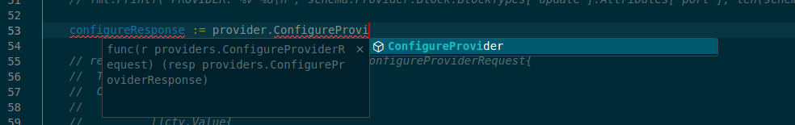

We need to provide a `ConfigureProviderRequest` instance to the call. [Its documentation is here](https://pkg.go.dev/github.com/hashicorp/terraform@v1.5.4/internal/providers#ConfigureProviderRequest) (we copied the source code, but it's the same code so the docs are still valid):

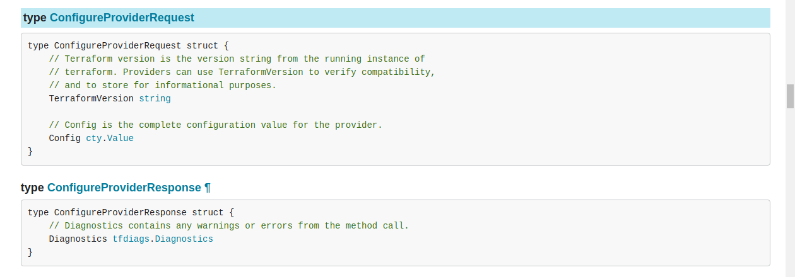

Well, that doesn't look so bad. We need a `TerraformVersion` string, which we'll fake because why not, and a `Config` of type `cty.Value`.

Wait, what even _is_ that `cty` package? If you read my [original article about Steampipe](/posts/steampipe-part-one/#config-file), you'll have met the `cty` package:

> ```go
>  type SOMETHINGConfig struct {
>      Email *string `cty:"email"`
>      Password *string `cty:"password"`
>      OtherConfig *bool `cty:"other_config"`
>  }
>  ```
> For now, note that the actual configuration is declared as a struct with arbitrary members, each one with a tag `cty:"field_name_in_config"`. Steampipe uses [the `go-cty` package](https://github.com/zclconf/go-cty/) for this. This is similar to [the `json` package](https://gobyexample.com/json), which uses `json:"field_name"` tags to express the mapping between JSON fields and struct members

So that gives us a point of comparison: the Go `json` package. That gives you a way of converting strings to and from Go structs, by declaring a Go struct where fields are annotated with `` `json:"field_name_in_json"` ``.

### `go-cty`-powered config

[The `go-cty` package](https://github.com/zclconf/go-cty/) implements `cty`,

> a dynamic type system for applications written in Go that need to represent user-supplied values without losing type information. The primary intended use is for implementing configuration languages, but other uses may be possible too.

In particular, see [the docs about converting to and from Go structs](https://github.com/zclconf/go-cty/blob/main/docs/gocty.md#converting-to-and-from-structs): 

```go
type Example struct {
    Name string `cty:"name"`
    Age  int    `cty:"age"`
}

myExample := Example{
	Name: "itsme",
	Age: -1,
}
```

You can create instances of the `Example` type as normal, and they behave exactly like structs. That's what they are, after all. However, you can also [convert them to `cty.Value` instances](https://pkg.go.dev/github.com/zclconf/go-cty@v1.13.2/cty/gocty#ToCtyValue).

You'll need a `cty.Type` for that, though. `cty` separates the "types" from the "values": the type holds information about the fields, their datatypes, and so on; while the values are specific incarnations of types. Somewhat like a `type MyObject struct` and a `example := MyObject{...}`. Thankfully, [the same package lets you automatically infer a type from a struct instance](https://pkg.go.dev/github.com/zclconf/go-cty@v1.13.2/cty/gocty#ImpliedType), assuming that it has been annotated with `` `cty:"field_name"` `` tags:

So, in other words, there are two ways of getting a `cty.Type`:

```go
thingTypeManual := cty.Object(map[string]cty.Type{
    "name": cty.String,
    "age": cty.Number,
})

// OR

type Thing struct {
    Name string `cty:"name"`
    Age  int    `cty:"age"`
}

thing := Thing{Name: "thingy", Age: 0}
thingTypeInferred, _ := gocty.ImpliedType(myThing)
```

You can either write a call to `cty.Object`, passing it a bunch of `cty.Type` instances, nesting them as required; _or_ you can [let `cty` infer the type](https://github.com/zclconf/go-cty/blob/main/docs/gocty.md#implied-cty-type-of-a-go-value) by giving it an "example":

> The mapping is as follows:
> 
> * Go's int, uint and float types all map to `cty.Number`.
> * Go's bool type maps to `cty.Bool`
> * Go's string type maps to `cty.String`
> * Go slice types map to `cty` lists with the element type mapped per these rules.
> * Go maps with string keys map to `cty` maps with the element type mapped per these rules.
> * Go struct types are converted to `cty` object types using the struct tag convention described above and these mapping rules for each tagged field.
> * A Go value of type `cty.Value` maps to `cty.DynamicPseudoType`, allowing for values whose precise type isn't known statically.

In particular, we're interested in the second-to-last rule: "Go struct types are converted to `cty` object types using the struct tag convention described above and these mapping rules for each tagged field." In other words, as long as we tag all our struct fields, we should be able to create types. It even works recursively! In other words, you can nest structs inside structs, and as long as every field is tagged with `` `cty:"myfield"` ``, it should work OK.

In any case, now we have a type (either inferred or manually written), plus a struct instance. Converting it to a `cty.Value` is then easy:

```go
type Thing struct {
    Name string `cty:"name"`
    Age  int    `cty:"age"`
}

myThing := Thing{Name: "thingy", Age: 0}
myThingType, _ := gocty.ImpliedType(myThing)

// Convert the struct instance to a cty.Value
var myThingVal cty.Value
myThingVal, _ = gocty.ToCtyValue(myThing, myThingType)
```

Well, that's what we wanted! A `cty.Value` to pass to the `ConfigureProvider` RPC.

### Back to provider configuration

So now we can try to configure the provider! Let's send it a dummy config first and see what happens:

```go
type ProviderConfig struct {
	Foo string `cty:"foo"`
}
cfg := ProviderConfig{Foo: "bar"}
configType, _ := gocty.ImpliedType(cfg)
cfgVal, _ := gocty.ToCtyValue(cfg, configType)

configureResponse := provider.ConfigureProvider(providers.ConfigureProviderRequest{
	TerraformVersion: "999.0.0",
	Config:           cfgVal,
})
```

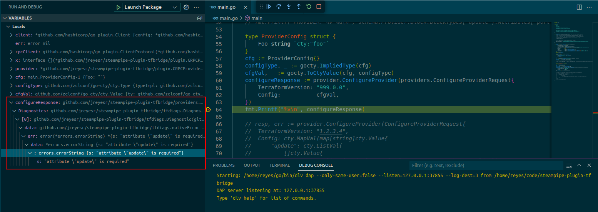

Well, it gets angry. However, that's good! That means that it went to the provider and presented it with our `{"foo": "bar"}`[^1] configuration, and the provider rejected it. So let's now give the provider [a real configuration, taken from its docs](https://registry.terraform.io/providers/hashicorp/dns/latest/docs#schema):

```go
type UpdateBlock struct {
	GSSAPI []struct {
		Keytab   string `cty:"keytab"`
		Password string `cty:"password"`
		Realm    string `cty:"realm"`
		Username string `cty:"username"`
	} `cty:"gssapi"`
	KeyAlgorithm string `cty:"key_algorithm"`
	KeyName      string `cty:"key_name"`
	KeySecret    string `cty:"key_secret"`
	Port         int    `cty:"port"`
	Retries      int    `cty:"retries"`
	Server       string `cty:"server"`
	Timeout      string `cty:"timeout"`
	Transport    string `cty:"transport"`
}
type ProviderConfig struct {
	Update []UpdateBlock `cty:"update"`
}

cfg := ProviderConfig{Update: []UpdateBlock{
	{Port: 123},
}}
```

Aaand... it doesn't work:

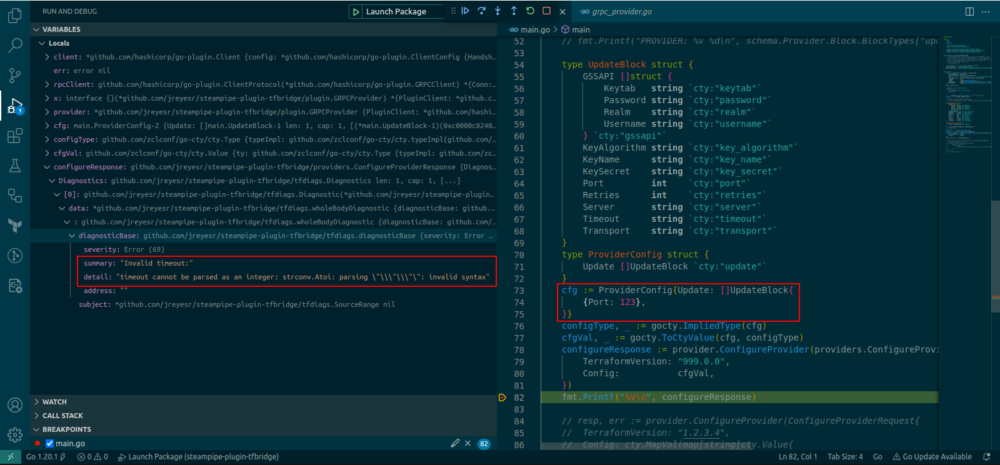

> timeout cannot be parsed as an integer: strconv.Atoi: parsing "\\"\\"": invalid syntax

Well, that's fun. It appears that it's grabbing the timeout (which is specified [in the docs](https://registry.terraform.io/providers/hashicorp/dns/latest/docs#timeout) to be a string) and just feeding it to the conversion function from string to int. No wonder it doesn't work. Whose fault is that?

[Searching for issues that mention "timeout"](https://github.com/hashicorp/terraform-provider-dns/issues?q=is%3Aissue+timeout) does reveal [an issue](https://github.com/hashicorp/terraform-provider-dns/issues/298). And then a member of Hashicorp [responds](https://github.com/hashicorp/terraform-provider-dns/issues/298#issuecomment-1529934084):

> It does appear that there is an issue in the provider configuration handling introduced with version 3.3.0 and later. We'll ensure there is covering testing for this type of configuration and resolve the issue shortly. Thanks again.

And later:

> The fix for this has been merged and will release with version 3.3.3

Which version do we have? We downloaded the plugin binary in [the previous article](/posts/steampipe-tfbridge-2/#intro-choosing-a-test-subject):

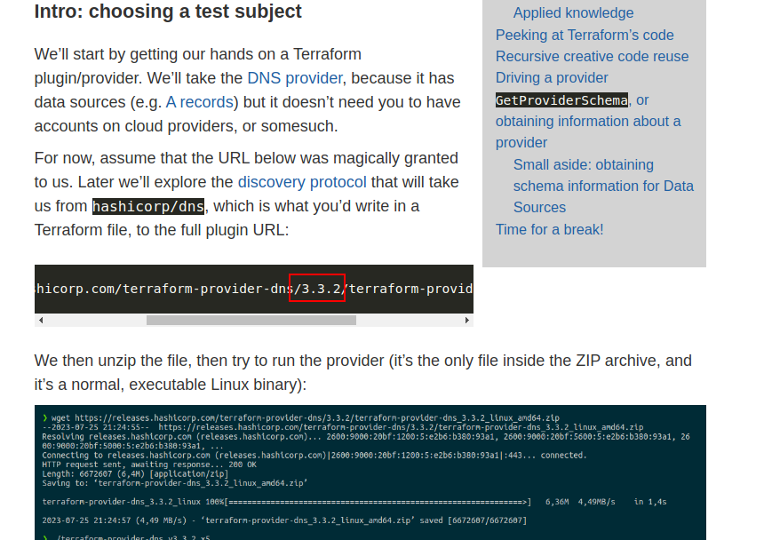

Oh. Yeah, that'd do it. And that (3.3.2) is, as of writing this, the latest version in [the Terraform Registry](https://registry.terraform.io/providers/hashicorp/dns/3.3.2) and on [Github Releases](https://github.com/hashicorp/terraform-provider-dns/releases). So time for a rollback to version 3.2.4. Thankfully, that's easy: we just take the URL that we used before, manually change the versions and hope that the URL does exist:

```bash
wget https://releases.hashicorp.com/terraform-provider-dns/3.2.4/terraform-provider-dns_3.2.4_linux_amd64.zip
```

It does, by the way. Then, in our code, we change the `plugin.NewClient` so it spawns a different binary:

```go
client := plugin.NewClient(&plugin.ClientConfig{
	HandshakeConfig:  Handshake,
	VersionedPlugins: tfplugin.VersionedPlugins,
	
	// THIS IS CHANGED!
	Cmd:              exec.Command("sh", "-c", "./terraform-provider-dns_v3.2.4_x5"),
	
	AllowedProtocols: []plugin.Protocol{plugin.ProtocolGRPC},
	Managed:          true,
	Logger:           logging.NewProviderLogger(""),
	SyncStdout:       logging.PluginOutputMonitor(fmt.Sprintf("%s:stdout", "dns")),
	SyncStderr:       logging.PluginOutputMonitor(fmt.Sprintf("%s:stderr", "dns")),
})
```

We then run again, and...

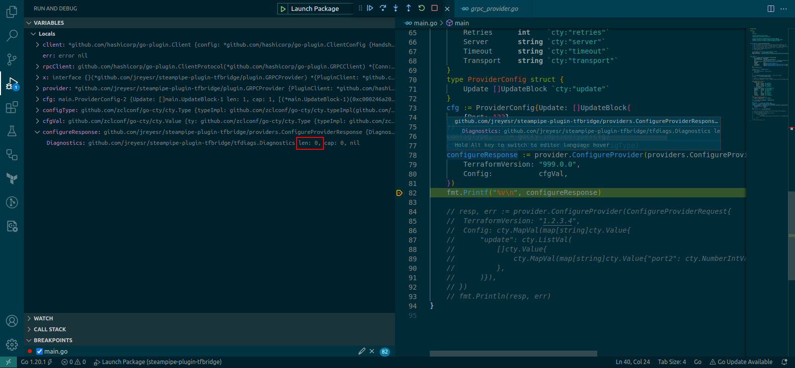

Success! There are zero Diagnostics, which are the way in which Terraform plugins communicate errors back to the Core. Hopefully, that means that the plugin is configured.

### Actually testing that configuration was applied

Sadly, the DNS provider can't be tested easily. The main problem is that its `Update` config block, which is the only configuration available, is only used when actually writing DNS zones back to the DNS[^2]. Since we don't do that (we only read info from the DNS), we can't ensure that the provider is actually being configured.

In fact, the provider should fetch data just as well without being configured. So we need another way of testing that.

The ~~laziest~~ most efficient way of doing so is to just pull some provider that needs auth, even if you don't have any keys, and try to find differences in its behavior with and without the `ConfigureProvider` call. I chose to use the [Terraform Enterprise](https://registry.terraform.io/providers/hashicorp/tfe/latest/docs) provider, even though I don't have an account there. We should be able to make it complain in different ways.

Taking a look at [its arguments](https://registry.terraform.io/providers/hashicorp/tfe/latest/docs#argument-reference), we see that it has a `hostname` attribute, for their [Enterprise tier](https://www.hashicorp.com/products/terraform/pricing), i.e. the super-duper-eye-wateringly-expensive "Contact Sales" tier, in which you get your very own instance of Terraform Cloud, but on your own hardware. That's why they need to provide a way of switching the server to which all calls will be made. So, we can expect two different behaviors:

* If we just call a data source without configuring the provider, it should either fail with a "not configured" error or just go to the Terraform Cloud and fail with an "unauthorized" error
* If we first configure the provider with a nonexistent hostname, it should go there and complain that there is no Terraform service running in that host

Thus, we can verify that, indeed, the `ConfigureProvider` call is working as expected: it's mutating internal data structures in the provider so it behaves differently.

Downloading the TFE provider is old news by now, so I won't rehash it. Then, it's a matter of changing the `Cmd` and then writing new structs for the TFE provider's config and for a data source that it exposes:

```go
type TFEConfig struct {
	Hostname      string `cty:"hostname"`
	Token         string `cty:"token"`
	SSLSkipVerify bool   `cty:"ssl_skip_verify"`
	Organization  string `cty:"organization"`
}
cfg := TFEConfig{Hostname: "localhost"}
// code to convert to cty.Value...
// EITHER COMMENT OR UNCOMMENT THIS LINE
configureResponse := provider.ConfigureProvider(providers.ConfigureProviderRequest{
	TerraformVersion: "999.0.0",
	Config:           cfgVal,
})

type TFEProject struct {
	Name         string   `cty:"name"`
	Organization string   `cty:"organization"`
	ID           string   `cty:"id"`
	WorkspaceIDs []string `cty:"workspace_ids"`
}
readConfig := TFEProject{Name: "my-project-name", Organization: "my-org-name"}
// code to convert to cty.Value...

// THIS SHOULD FAIL, WE'RE JUST INTERESTED IN THE WAY IN WHICH IT FAILS
readResponse := provider.ReadDataSource(providers.ReadDataSourceRequest{
	TypeName:     "tfe_project",
	Config:       readConfigVal,
	ProviderMeta: cty.EmptyObjectVal,
})
```

Here's what happens when you attempt an operation with the provider pointed to the default Terraform Cloud and an invalid token:

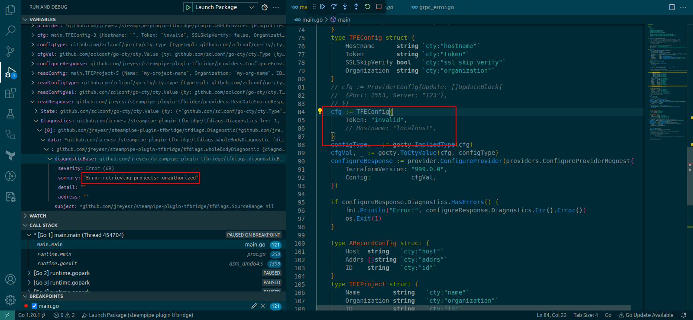

As expected, we get an Unauthorized error (while running the `GetDataSource` RPC). What if we instead point the provider to `localhost`?

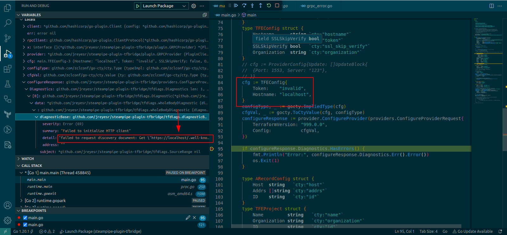

We get an error much before. Indeed, now we get an error in the `ConfigureProvider` RPC itself, where before it passed that call with no errors and only failed later. The error message tells us why:

> failed to request discovery document: Get "https://localhost/.well-known/terraform.json": dial tcp 127.0.0.1:443: connect: connection refused

As it should, it's trying to connect to `localhost` on port 443 (and failing, since that doesn't exist in my computer). This proves that the `ConfigureProvider` call does indeed configure the provider: if it didn't, the provider would still be pointing to the default Terraform Cloud, and it wouldn't be trying to connect to my `localhost`. 

Changing the `Hostname` in the struct instance does cause the error message to change (I pointed it at my router), so that's further confirmation that we're manipulating the provider's config.

So now we're certain that the `ConfigureProvider` RPC does what it should. This one was especially important to test because it returns no data. For the `GetProviderSchema` RPC, we didn't care about that because the return data _was_ all the proof that we needed: if it returned information about the provider, then it must be working. This call, however, could be failing silently and we wouldn't know... until we tried to use it. Now, however, we're certain that it _is_ working. And we did that without using real credentials!

### Recap

So now we can configure providers. Let's recap:

* You need to configure Terraform providers before you start sending them commands to read data sources or manage resources
* When configuring a provider, you pass it whatever credentials or other configs it needs to run
* If the provider takes no mandatory configuration, you still have to configure it!
* This is done via an RPC, `ConfigureProvider`
* That RPC takes a `cty.Value`
* `cty` is a Go package that implements a "dynamic type system"
* For now, we have created our `cty.Value`s from Go struct instances, by letting `cty` auto-infer the types. 
* Later (when actually using Steampipe) we may mess around with HCL, since that's how [Steampipe connections are configured](https://steampipe.io/docs/managing/connections#syntax)
* Once a provider has been configured, we can start using its implemented functionality. For this project, we don't care at all about resources, only about data sources. Data sources only have one RPC: `ReadDataSource`, since the only thing that you can do with them is to... well, read them

## `ReadDataSource`, or... reading a data source

Let's now (finally!) try to read a data source. [The `dns_a_record_set` data source](https://registry.terraform.io/providers/hashicorp/dns/3.2.4/docs/data-sources/dns_a_record_set) seems like a good candidate. You normally use it like this:

```hcl
provider "dns" {}

data "dns_a_record_set" "google" {
  host = "google.com"
}
```

The [`ReadDataSource` RPC](https://pkg.go.dev/github.com/hashicorp/terraform@v1.5.4/internal/plugin#GRPCProvider.ReadDataSource) takes an argument [of type `ReadDataSourceRequest`](https://pkg.go.dev/github.com/hashicorp/terraform@v1.5.4/internal/providers#ReadDataSourceRequest):

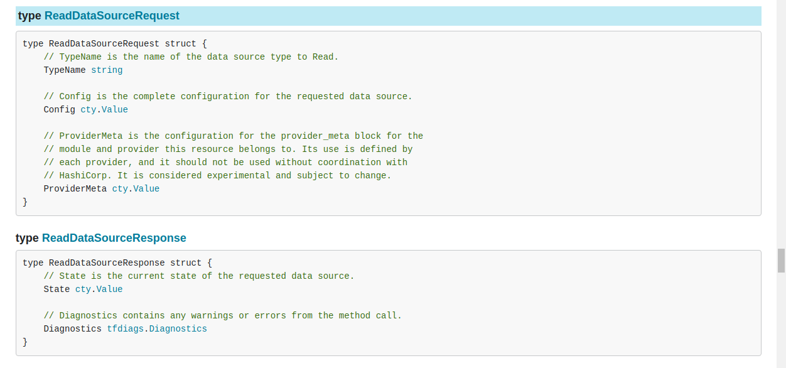

So, we need a `TypeName` (the name of the data source, since a provider can have multiple data sources), a `Config` which is a `cty.Value`, and a `ProviderMeta`. The latter says that it's experimental and shouldn't be used without coordination with Hashicorp, which we most definitely _don't_ have. Some further documentation about "Provider Metadata" can be found [on this link](https://developer.hashicorp.com/terraform/internals/provider-meta), complete with the same warnings about experimentalness and coordinating with Hashicorp beforehand. "Provider Metadata is intended primarily for the situation where an official module is developed by the same vendor that produced the provider it is intended to work with, to allow the vendor to indirectly obtain usage statistics for each module via the provider." That metadata is specifically aimed at using providers [with modules](https://developer.hashicorp.com/terraform/language/modules), in the case that both the provider and the module are developed by the same vendor. Nothing to do with us, we aren't developing either providers or modules, and we aren't vendors of anything. We'll try to leave that one blank (or `nil`, or undefined, or however `cty` expresses that concept).

So the main problem is the `Config`. Presumably, that's a `cty`-encoded version of the data source's HCL:

```hcl
data "dns_a_record_set" "terraform" {
  host = "terraform.io"
}
```

So that should probably be something like `{"host": "terraform.io"}`. Again, let's express [the data source's schema](https://registry.terraform.io/providers/hashicorp/dns/3.2.4/docs/data-sources/dns_a_record_set#argument-reference) as a struct, and send it. At least the `dns_a_record_set` source's argument list is short (only the `host` argument).

```go
// Prepare the provider's config
cfg := ProviderConfig{}
configType, _ := gocty.ImpliedType(cfg)
cfgVal, _ := gocty.ToCtyValue(cfg, configType)
configureResponse := provider.ConfigureProvider(providers.ConfigureProviderRequest{
	// wow so advanced terraform :)
	TerraformVersion: "999.0.0",
	Config:           cfgVal,
})

// Now prepare the Read request's config
type ARecordConfig struct {
	Host string `cty:"host"`
	Addrs []string `cty:"addrs"`
	ID    string   `cty:"id"`
}
// We'll ask for terraform.io's A records
readConfig := ARecordConfig{Host: "terraform.io"}
readConfigType, _ := gocty.ImpliedType(readConfig)
readConfigVal, _ := gocty.ToCtyValue(readConfig, readConfigType)
// Send it!
readResponse := provider.ReadDataSource(providers.ReadDataSourceRequest{
	TypeName: "dns_a_record_set",
	Config:   readConfigVal,
	ProviderMeta: cty.EmptyObjectVal,
})
```

A couple of things to note:

The `Config` that you must pass to `ReadDataSource` MUST contain the entire config. You may be tempted to just pass [the arguments](https://registry.terraform.io/providers/hashicorp/dns/3.2.4/docs/data-sources/dns_a_record_set#argument-reference), which here is just the `host`. However, that won't work:

> attributes "addrs" and "id" are required

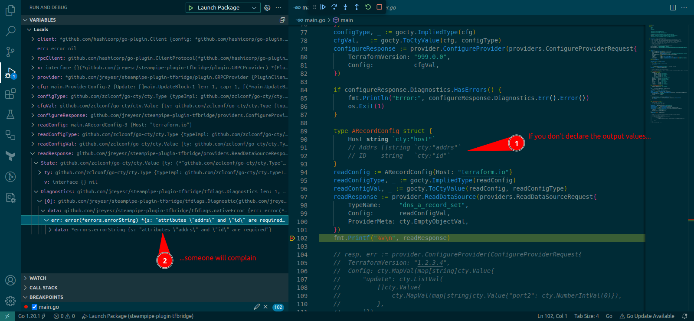

You must pass a `struct` that has all fields declared, inputs and outputs, doesn't matter.

Also, remember that `ProviderMeta` that we said we wouldn't care about, because it's experimental? Well, turns out that you have to provide something, merely not specifying the value causes... A Panic!

> "runtime error: invalid memory address or nil pointer dereference"

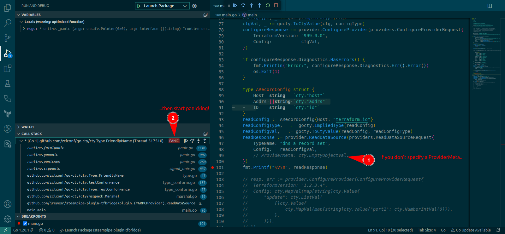

You must pass something. I tried several `nil`-ish values, some of them cause a panic anyways. In the end, `cty.EmptyObjectVal` seems to satisfy everything.

So, with those stumbling blocks removed, we can run and see:

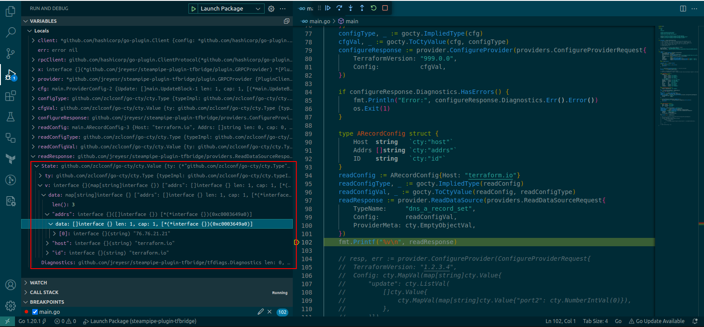

Empty `Diagnostics`, that's good. There is a `data` field, which is a plain Go map. Inside of it, we find our much-expected data:

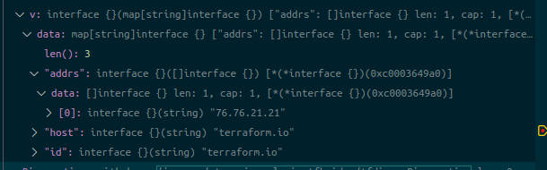

Yes, it's all there. The ID and host are set to `terraform.io`, as expected. The `addrs` is a slice of strings, which here has only one value: `"76.76.21.21"`. Is that correct?

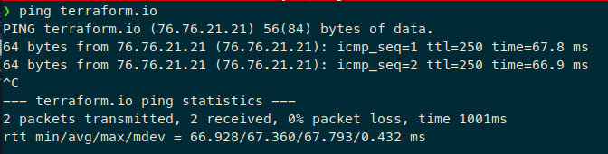

Yes, it is. Let's try again, this time with a subdomain of [traefik.me](https://traefik.me/), which is 

> a magic domain name that provides wildcard DNS for any IP address. Say your LAN IP address is 10.0.0.1. Using traefik.me, 10.0.0.1.traefik.me resolves to 10.0.0.1

If you, for some reason, need domain names that point to LAN IP addresses (for example, to assign HTTPS certs to them), then [traefik.me](https://traefik.me/) is your friend. Give it a try. You're welcome.

So, if we ask for the A records of `192.168.1.1.traefik.me`, we should get `192.168.1.1` back in the `hosts` field.

Doing that is easy, as we just have to change the `Host` in the `ARecordConfig`:

```go
// HOST CHANGED HERE
readConfig := ARecordConfig{Host: "192.168.1.1.traefik.me"}

// EVERYTHING ELSE STAYS THE SAME
readConfigType, _ := gocty.ImpliedType(readConfig)
readConfigVal, _ := gocty.ToCtyValue(readConfig, readConfigType)
readResponse := provider.ReadDataSource(providers.ReadDataSourceRequest{
	TypeName:     "dns_a_record_set",
	Config:       readConfigVal,
	ProviderMeta: cty.EmptyObjectVal,
})

// Parse the results of the data source back into a struct
var results ARecordConfig
gocty.FromCtyValue(readResponse.State, &results)
```

And then we can read the `results` variable. Here we've introduced another innovation: we parse the `State` that is returned by the `ReadDataSource` RPC, which is where any data that comes out of the data source will live. If you'll remember, we had to provide the output fields to the `readConfig` object that went _into_ the provider, so it's only fair that we reuse said output fields on what the provider returns to us.

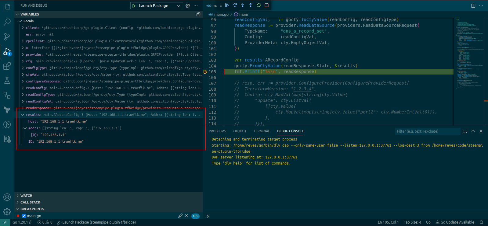

And, as can be seen above, it works with no problems. The outputs (`id` and `addrs`) are correctly populated in the struct instance, as fields `ID` and `Addrs` respectively. From here, we can do whatever we want with those values: they're plain Go structs, after all.

### Recap

* Once you have configured a provider, by passing it whatever credentials it needs, you're ready to read data sources on it
* You read a data source by providing:
	* the name of the data source, as you'd provide it in the `data "THIS_NAME" "mydata" {...}` block in the Terraform file
	* and a `cty.Value` which corresponds to the data source's [arguments](https://developer.hashicorp.com/terraform/language/data-sources#data-source-arguments), i.e. the contents inside of the braces in Terraform: `data "provider_datasource" "mydata" { THIS_PART }`
* The RPC that executes a read on a data source is `ReadDataSource`
* The output of a data source read operation contains some diagnostics, which will be empty if all went well or contain any errors that were encountered by the provider...
* ...and a `State` field, which is a `cty.Value` value that can be converted back into a Go struct, of the same structure of that which you provided _to_ the data source
* Once you have that data, you've effectively used the provider's data source to query something (usually a remote API) on your behalf

## Schema introspection

So, as of now we've been able to:

* Query the provider for its schema (which configuration fields it requires, the data sources that it supports, and the fields that each data source requires and returns)
* Actually configure the provider with a set of credentials, or similar configuration values (which vary by provider)
* Query the provider for a data source that it implements
	* We need to pass some arguments to a data source (which ones depend on the actual data source, but it's usually some sort of ID for the resource that we want to read)
	* and we receive more data back, such as the data that is actually tied to that ID

However, bullet points 2 and 3 have an issue: they require structs to carry the data. And those structs have been hand-coded to match the data that is expected at that point: the provider's config for the `ConfigureProvider` calls, and the data source's schema for the `ReadDataSource` calls. That won't work forever, though: we need the code of our Steampipe plugin to be agnostic to the data structure of the actual Terraform provider that it drives. 

The provider's configuration will come from our user, in the form of [connection arguments](https://steampipe.io/docs/managing/connections#syntax). There may be a problem there, since normal Steampipe plugins can exhaustively list the configuration values that they expect: for example, the [1Password Steampipe plugin](https://hub.steampipe.io/plugins/turbot/onepassword#configuration) (again, chosen only because it appears first on the list) requires a token and a URL:

```hcl
# onepassword.spc

connection "onepassword" {
  plugin = "onepassword"

  # Token is required for requests. Required.
  # See instructions at https://developer.1password.com/docs/connect/manage-secrets-automation#issue-revoke-or-rename-an-access-token
  # This can also be set via the `OP_CONNECT_TOKEN` environment variable.
  token = "eyJhbGciOiJFUzI1NiIsImtpZCI6InFuN3JwcmZhbnJqZ2V1bWU2eTNidGpjdHN5IiwidHlwIjoiSldUIn0.eyIxcGFzc3dvcmQuY29tL2F1dWlkIjoiVEpGVzVZTlRJSkMzSkNXRFgzQ0dWTUpCSDQiLCIxcGFzc3dvcmQuY29tL3Rva2VuIjoib2tnZGZJWHpEaDhWWkNkRHVNRjZNSUplRUlwN3ZrYUQiLCIxcGFzc3dvcmQuY29tL2Z0cyI6WyJ2YXVsdGFjY2VzcyJdLCIxcGFzc3dvcmQuY29tL3Z0cyI6W3sidSI6ImZwZDR1dW00bHJicTMycG8ybXR2ZGo0c3hpI"

  # The host URL set to default http://localhost:8080. Optional.
  # This can also be set via the `OP_CONNECT_HOST` environment variable.
  url = "http://localhost:8080"
}
```

Thus, the 1Password Steampipe plugin can just specify that it requires a `token`, of type String, required; and a `url`, of type String, optional. We can't do that for all fields: we can write down fields for the TF provider's name and version, but we can't go further and specify the actual provider's config fields. And we want that: in [the first article for this series](/posts/steampipe-tfbridge-1/#general-idea) I outlined what I envisioned the Steampipe config files for this plugin would look like:

```hcl
# tfbridge_1password.spc

connection "1password" {
  plugin = "tfbridge"
  
  terraformProvider = "milosbackonja/1password"
  terraformVersion = "1.1.0"
  
  providerConfig {
    email      = "john.smith@example.com"
    password   = "super secret master password"
    secret_key = "A3-XXXXXX-XXXXXXX-XXXXX-XXXXX-XXXXX-XXXXX"
    subdomain  = "company"
  }
}
```

The `providerConfig` would have to be some sort of "generic container" that accepted anything. That's the cleanest way to achieve integration between Steampipe and Terraform, especially since, if we can make Steampipe accept such generic blocks, we could just copy-paste the contents of the block from the Terraform docs for the provider.

If we can't, we'll have to resort to hacks such as having a single String field that accepts some sort of key-value store, such as JSON or [URL querystrings](https://en.wikipedia.org/wiki/Query_string), or even [heredoc strings](https://developer.hashicorp.com/terraform/language/expressions/strings#heredoc-strings) if supported by the parser:

```hcl
# tfbridge_1password.spc

connection "1password" {
  plugin = "tfbridge"
  
  terraformProvider = "milosbackonja/1password"
  terraformVersion = "1.1.0"
  
  providerConfigJson = "{\"email\": \"john.smith@example.com\", \"password\": \"super secret master password\", \"secret_key\": \"A3-XXXXXX-XXXXXXX-XXXXX-XXXXX-XXXXX-XXXXX\", \"subdomain\": \"company\"}"
  
  providerConfigURL = "user=john.smith%40example.com&password=super%20secret%20master%20password&secret_key=A3-XXXXXX-XXXXXXX-XXXXX-XXXXX-XXXXX-XXXXX&subdomain=company"
  
  providerConfigHeredoc = <<EOT
	email      = "john.smith@example.com"
	password   = "super secret master password"
	secret_key = "A3-XXXXXX-XXXXXXX-XXXXX-XXXXX-XXXXX-XXXXX"
	subdomain  = "company"
EOT
}
```

Ugh. All of those are nastier, especially since now you have to fiddle with encodings and escape sequences and more. However, they let you smuggle arbitrary data across String-only interfaces, at the cost of losing the structured language. For example, this would now be valid from Steampipe's point of view:

```hcl
# tfbridge_1password.spc

connection "1password" {
  plugin = "tfbridge"
  
  terraformProvider = "milosbackonja/1password"
  terraformVersion = "1.1.0"
  
  providerConfigJson = "{\"email\": \"john.smith@example.com\", \"password: \"super secret master password\", \"secret_key\": \"A3-XXXXXX-XXXXXXX-XXXXX-XXXXX-XXXXX-XXXXX\", \"subdomain\": \"company\"}"
}
```

Quick! What's the error?

There's a missing end quote on the `password` key. But you wouldn't know it by just looking at the `.spc` file, and neither would Steampipe. You can start trying to parse the JSON string and throwing errors if it isn't valid, but it's not as clean and elegant as just embedding HCL data.

## The provider's schema

This is where things start to come together, finally. [Some time ago](/posts/steampipe-tfbridge-2/#getproviderschema-or-obtaining-information-about-a-provider), we extracted the provider's schema, i.e. the configuration values that it needs. Back then, we just looked at the pretty fields in a debugger session and stopped at that:


However, now we can go further: we can use that provider schema to specify the format of the incoming data. We know, because of our poking-around business, that the `Provider.Block` property of the provider schema holds the fields that the provider needs:

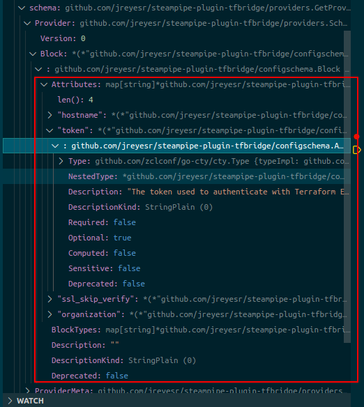

That `Provider.Block` property has [type `Block`](https://pkg.go.dev/github.com/hashicorp/terraform@v1.5.4/internal/configs/configschema#Block) (it's one of the files that we had to pull in from Terraform's internal packages). One of its methods [is called `DecoderSpec`](https://pkg.go.dev/github.com/hashicorp/terraform@v1.5.4/internal/configs/configschema#Block.DecoderSpec), and it

> returns a `hcldec.Spec` that can be used to decode a HCL Body using the facilities in the `hcldec` package.

Okay, neat. So, from a `Block`, we can get a spec that can be used to decode a HCL body. What can we do with a `hcldec.Spec`?

For that, we need to get acquainted with [the `hcl2` package](https://pkg.go.dev/github.com/hashicorp/hcl/v2), where `hcldec` resides. That package holds everything related to the HCL language itself: a parser, a writer, tools to marshal and unmarshal [from HCL to Go structs and viceversa](https://pkg.go.dev/github.com/hashicorp/hcl/v2@v2.17.0/gohcl), a converter between the [HCL and JSON representations](https://github.com/hashicorp/hcl#information-model-and-syntax), [editor integrations](https://pkg.go.dev/github.com/hashicorp/hcl/v2@v2.17.0/hcled), [user functions](https://pkg.go.dev/github.com/hashicorp/hcl/v2@v2.17.0/ext/userfunc), [HCL transforms](https://pkg.go.dev/github.com/hashicorp/hcl/v2@v2.17.0/ext/transform), [dynamic blocks](https://pkg.go.dev/github.com/hashicorp/hcl/v2@v2.17.0/ext/dynblock) and more. `hcldec` is the part that concerns itself with converting the actual contents of an HCL file to `cty.Type` and `cty.Value` objects. In particular, for [the `Spec` type](https://pkg.go.dev/github.com/hashicorp/hcl/v2@v2.17.0/hcldec#Spec):

> A Spec is a description of how to decode a hcl.Body to a cty.Value.

So, given a Spec + a `hcl.Body`, we can create a `cty.Value`. Furthermore, [the function `hcldec.ImpliedType(spec) cty.Type`](https://pkg.go.dev/github.com/hashicorp/hcl/v2@v2.17.0/hcldec#ImpliedType) implements the other half: given a spec, get a `cty.Type`. If you'll remember, near the start of this same article we saw that, with a `cty.Type` and a `cty.Value`, we can call the `ConfigureProvider` RPC. Back then we manually wrote a Go struct and extracted a `cty.Type` and a `cty.Value` from it, but now we have a path to automatic generation:

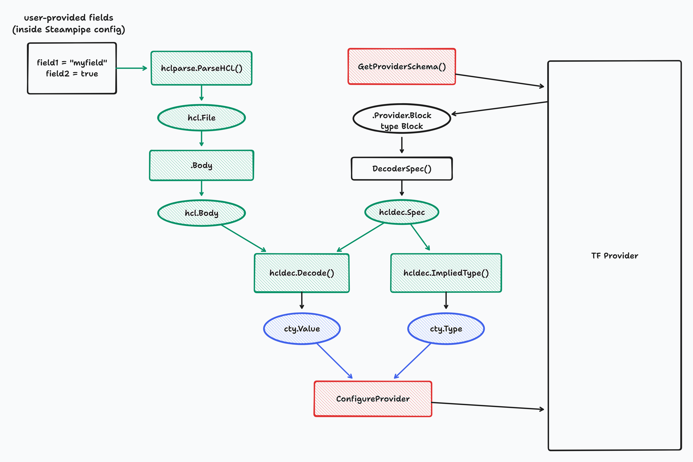

Green boxes involve [the `hcl` package](https://pkg.go.dev/github.com/hashicorp/hcl/v2), blue boxes are in [the `go-cty` package](https://pkg.go.dev/github.com/zclconf/go-cty), and red boxes are [Terraform RPCs](https://developer.hashicorp.com/terraform/plugin/framework/internals/rpcs#rpcs-and-framework-functionality).

In code, that looks like this (assuming that we have a HCL-formatted string, i.e. what would normally go _inside_ of a [Terraform provider's configuration](https://developer.hashicorp.com/terraform/language/providers/configuration#provider-configuration-1), sans the `provider "prov_name"` bit, AKA only what is inside the curly braces):

```go
schema := provider.GetProviderSchema()
spec := schema.Provider.Block.DecoderSpec()

// This is a plain string, nothing magic here (yet)
// The backticks just mean that the string can have newlines
config := `
	organization      = "my-org"
	# hostname   = "localhost"
	token = "secret-token"
	ssl_skip_verify  = true
`
parser := hclparse.NewParser()
f, _ := parser.ParseHCL([]byte(config), "config.hcl")
// We assume that the config just above complies with the spec that the provider gave us
cfgVal, _ := hcldec.Decode(f.Body, spec, &hcl.EvalContext{})

configureResponse := provider.ConfigureProvider(providers.ConfigureProviderRequest{
	TerraformVersion: "999.0.0",
	Config:           cfgVal,
})
```

After that, the provider has been configured and works as expected. For example, the `hostname` shenanigans on the Terraform Enterprise provider (that we used before to prove that the provider is getting configured) still work as expected: uncommenting the `hostname = "localhost"` line still causes the provider to complain that `localhost` doesn't have a Terraform Cloud server. Good.

### Recap

* We now have a path to parse a random (well, not really, it should be well-formed) string into a `cty.Value`, which is what the `ConfigureProvider` RPC needs
* The schema of the data (i.e. how it will be interpreted) comes from the Terraform provider itself, via the `GetProviderSchema` RPC
* So now we can ask our user (the Steampipe user) to fill a string field with something that was copied directly from Terraform docs, and then parse it and give it to the Terraform provider
* This will be used to "forward" configuration values from the Steampipe connection file to the Terraform provider: from the point of view of Steampipe, the plugin will have three config fields (namely, the provider's name and version, and a catch-all "provider config"). It is this last field that will be parsed and passed on to the provider

## Starting Steampipe integration

Now we can drive at least some Terraform providers in isolation, via Go code. This in itself would probably be useful to some people (I hope), since it opens new ways to test-drive providers, without having to stand up an entire Terraform installation, which sometimes gets in the way. For example, say you're developing a provider, and you're writing [the `Create` method](https://developer.hashicorp.com/terraform/plugin/framework/resources/create) for a resource. Usually, every time you ran the function on a resource you'd then have to `terraform destroy` it, or delete it manually on the remote service (if, for example, you hadn't worked on the `Delete` method yet). Sometimes it's just better to have a direct way of calling functions on the provider, without Terraform's graph algorithms and state management.

That being said, we want more. We started this project so Steampipe could have access to data sources exposed by Terraform providers, so that's the next step: [writing a Steampipe plugin](https://steampipe.io/docs/develop/overview).

Funnily enough, Steampipe plugins are very similar architecturally to Terraform providers. And even [the code is similar](/posts/terraform-declarative-api-management-1/#a-simple-data-source): you have a schema, a struct that matches the schema, and the `Get` function somehow returns instances of the schema. Besides, both use `go-plugin` as the backing framework: try to run a Steampipe plugin binary, and you'll get the same error message to the effect of "this binary is a plugin, please run it via the containing application".

The following picture may explain (or not!) all the moving pieces that should work in the end:

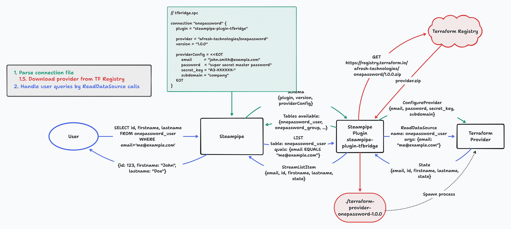

1. The green arrows are the initial (config) flow, in which a Steampipe user wants to use a Terraform provider. This requires specifying the provider's name and its version (as you'd do in a Terraform file), plus whatever configuration the actual provider requires.
	* This will cause Steampipe to load the `steampipe-plugin-tfbridge` Steampipe plugin, passing it (as config) the provider name+version that it should use, and the provider's config
2. In red: Upon being loaded, the `steampipe-plugin-tfbridge` Steampipe plugin should contact the Terraform registry, download the requested binary (for that provider+version combo) and store it somewhere. Where exactly, I don't know yet. I'll probably take inspiration from the existing Steampipe plugins that can download data from URLs, such as [the CSV plugin](https://hub.steampipe.io/plugins/turbot/csv#configuration) or [the Config](https://hub.steampipe.io/plugins/turbot/config) plugin: I know that they can download files from remote URLs, and they must store them somewhere (right? Or do they just download, parse into memory and then delete the files?)
3. Back to green: once the provider binary exists and can be used by the Steampipe plugin, it should boot up the provider through the gRPC interface and invoke `GetProviderSchema`, which will return (among other things) the data sources that the provider presents. This should be returned by the Steampipe plugin to Steampipe proper, but in the form of SQL tables, which is the language that Steampipe understands
	* This will require the use of [dynamic tables](https://steampipe.io/docs/develop/writing-plugins#dynamic-tables), as the CSV plugin does: its gimmick is that you configure the provider with a directory on disk, it scans the directory for CSV files, and each one is exposed as a SQL table, with its schema (i.e. which columns it has, and the datatypes of each) determined by _the contents_ of the CSV file that caused the table to exist. Similarly, here we (as the Steampipe plugin) will have to declare that we support one SQL table per data source in the provider, the schema of which will come from the data source's schema
4. With that information, Steampipe will present a certain set of SQL tables in its (virtual) Postgres DB
5. In blue: When a user wants to query a data source, he'll make a SQL `SELECT` query to one of the dynamic tables defined above. Steampipe will translate that into [a `List` or `Get` call to the provider's hydrate functions](https://steampipe.io/docs/develop/writing-plugins#hydrate-functions), possibly with [qualifiers](/posts/steampipe-part-dos-bitcoin/#transactions-table). The `steampipe-plugin-tfbrige` plugin will make a call to the `ReadDataSource` RPC on the provider, passing it the quals that came in from Steampipe, this time as arguments. The provider will return "state", which is the response of the data source. The Steampipe plugin will convert that back into SQL records (only one all the time, AFAICT), and stream it/them back to Steampipe proper. Steampipe, in turn, will present that back to the user as the results of his query.

Again, this is a natural break point, since this article is even longer than the previous one. See you in the next one! Then we'll start converting our messy huge `main()` function into a proper Steampipe plugin, complete with dynamic tables, dynamic config parsing, dynamic key columns for each table, automatic descriptions from the Terraform schema, automatic plugin download from the Terraform registry, and more.

[^1]: I'm presenting the `cty` configurations as JSON because it's widely known and easy to write inside a paragraph, even if that's not the form in which it's being serialized on the wire
[^2]: "The DNS" is valid, because it macro-expands to "the Domain Name System". [RAS Syndrome](https://www.rd.com/list/ras-syndrome/) again, yay!
