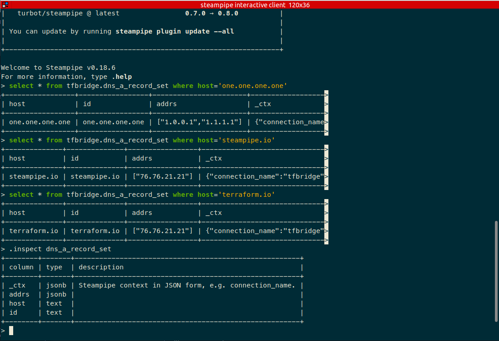
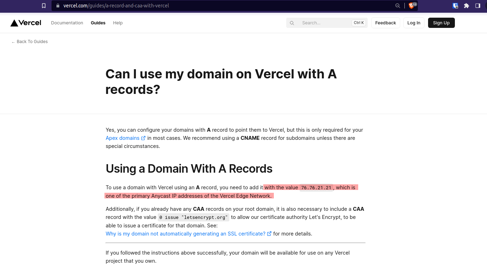
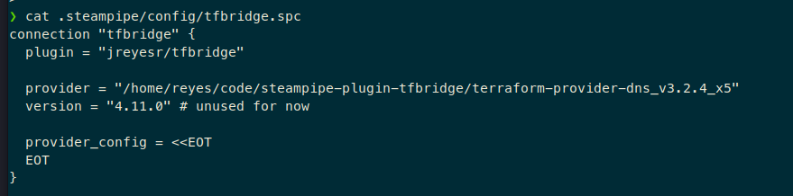
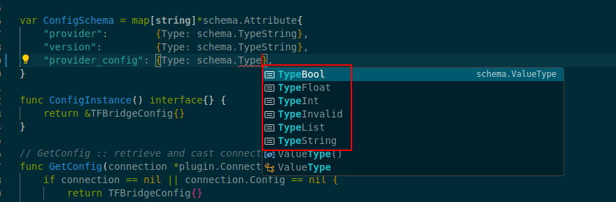
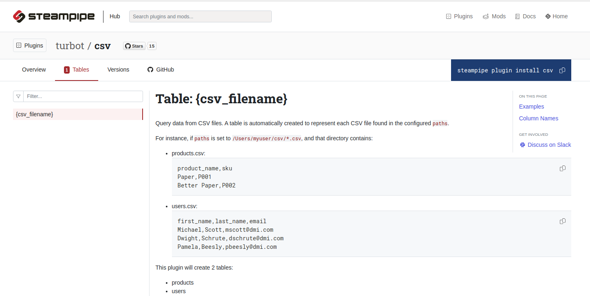
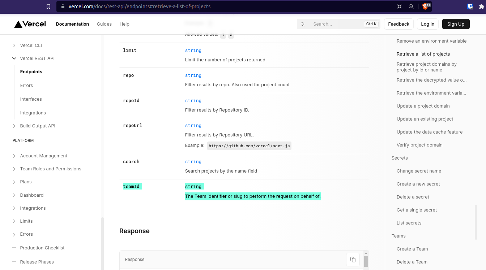
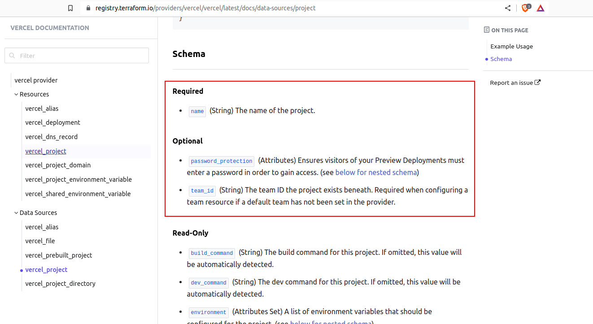
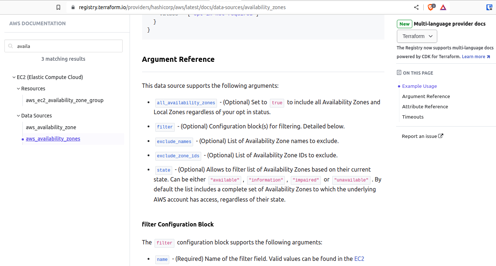
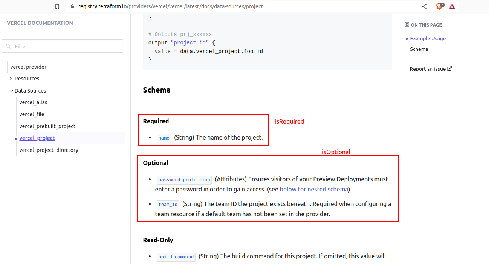
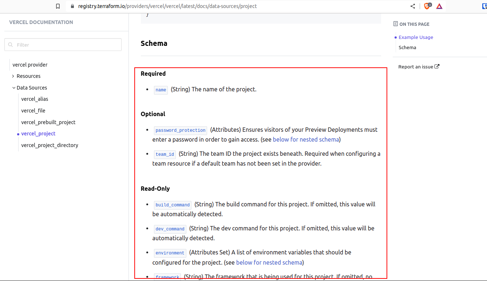

TL;DR: It's alive! It finally works. I've tested the plugin with the Terraform DNS provider, which can query DNS servers for records. Sure, this example isn't so exciting, as there already exists [a perfectly nice `net` plugin for Steampipe](https://hub.steampipe.io/plugins/turbot/net), with [a table for making DNS lookups](https://hub.steampipe.io/plugins/turbot/net/tables/net_dns_record), but the DNS Terraform provider was a nice test subject.



Also, I've just discovered that Steampipe's and Terraform's domains resolve to the same IP. What are they hiding? Must be a conspiracy...

Actually, they use Vercel, which uses `76.76.21.21` as an _anycast IP address_, whaveter that means. So no conspiracy:



The queries that you saw above use the following connection config:



Many more tests are required. We also need to make the plugin automatically download the requested Terraform provider (as you may see in the `.spc` file, now we have to set an absolute path to a Terraform provider binary, which isn't good UX by any means). Furthermore, we have to make the plugin work with Terraform SDK-backed plugins, which use V6 of the RPC interface.

But hey, _it works!_

---

Hello again! In case you have missed the [previous articles](/series/tfbridge/), here's the summary. We're building a [Steampipe](https://steampipe.io/) plugin that can reuse (hopefully) any [Terraform provider's](https://developer.hashicorp.com/terraform/language/providers) [data sources](https://developer.hashicorp.com/terraform/language/data-sources) and present them as SQL tables, so you can query them. This should greatly extend the range of what can be queried by Steampipe, by complementing its [~130 plugins](https://hub.steampipe.io/plugins) with however many data sources are there in the >3K Terraform providers that exist in the [Terraform Registry](https://registry.terraform.io/). It should also let you unify code in case you need to both query for resources and manage them: you'd just write the Terraform provider, with its Resources and Data Sources, and then you'd plug it in to Steampipe, where you can reuse the Data Sources via SQL queries.

The [first article](/posts/steampipe-tfbridge-1/) was an introduction, in which we established the problem, we presented the players (namely, Terraform and Steampipe), we discussed why you'd want to reuse Terraform providers on Steampipe, and we explored possible avenues to achieve that. In the [second article](/posts/steampipe-tfbridge-2/), we found a way to execute Terraform providers _outside_ of Terraform, and we extracted schemas (for the provider, which defines which configuration values it needs; as well as for the datasources, which define  which arguments you must pass to them, and which fields they returns, each with its data type). Then, in [the third article](/posts/steampipe-tfbridge-3/), we made RPC calls to our backing Terraform provider, such as `ConfigureProvider` and `ReadDataSource`. The first one gives the provider a set of credentials, and the second one actually queries a data source and returns whatever the data source normally returns.

Up until the last article, everything was done in a random Go file that was compiled and run normally, with `go run main.go`. See the code at that point [on Github, at the `poc` tag](https://github.com/jreyesr/steampipe-plugin-tfbridge/tree/poc) (it may be of use as a reference on how to use Terraform providers outside of Terraform). Now we need to wrap it all in a Steampipe plugin, so querying the data source is done via `SELECT` SQL statements.

## Writing a Steampipe plugin

I've already covered the development of Steampipe plugins in a few articles: see [this article covering the essentials (with bonus template repo for your own plugin-making endeavors)](/posts/steampipe-part-one/), [this one covering the development of a Bitcoin blockchain explorer plugin](/posts/steampipe-part-dos-bitcoin/), [this one in which we add distributed tracing and metrics to our plugin](/posts/steampipe-part-six-metrics/), and more [in the Steampipe category](/tags/steampipe/). So I won't repeat it here.

Also, by the way: here's the `main.go` file on your standard Steampipe plugin:

```go
package main

import (
	"github.com/jreyesr/steampipe-plugin-tfbridge/tfbridge"
	"github.com/turbot/steampipe-plugin-sdk/v5/plugin"
)

func main() {
	plugin.Serve(&plugin.ServeOpts{
		PluginFunc: tfbridge.Plugin})
}
```

And here's the contents of that `plugin.Serve` function call (okay, one level deeper than that, actually):

```go
import (
	"github.com/hashicorp/go-plugin"
)

plugin.Serve(&plugin.ServeConfig{
	Plugins:    pluginMap,
	GRPCServer: plugin.DefaultGRPCServer,
	// A non-nil value here enables gRPC serving for this plugin...
	HandshakeConfig: pluginshared.Handshake,
})
```

That's right! Steampipe plugins also use `go-plugin`, like Terraform providers do! In their case, the "host application" is Steampipe, the plugin is... well, the plugin, and the RPC interface is what calls the `List` and `Get` hydrate functions, plus passing schemas and config values back and forth.

With that bit of trivia out of the way, back to the plugin. Let's compare things with [the template repo](https://github.com/jreyesr/steampipe-plugin-samplerest), since that is a more-or-less working repo that serves as a good baseline.

The `main.go` function has essentially no changes, it's just a `plugin.Serve` call. Nothing too surprising there.

## The provider's config

On Terraform, you'd use a provider like this:

```hcl
terraform {
  required_providers {
    vercel = {
      source  = "vercel/vercel"
      version = "0.15.0"
    }
  }
}

# The "vercel" name below must match the vercel = {...} above
provider "vercel" {
  # these credentials are passed to the provider
  api_token = "YwbeYCAYfpdPKSj9yd18JUXX"
  team      = "mycompany"
}
```

Then you can declare resources and data sources that will use that specific provider instance (either as the default, "ambient" provider if there's only one of that type, or [by setting `provider` on the resource/datasource if there's more than one provider instance](https://developer.hashicorp.com/terraform/language/meta-arguments/resource-provider)).

Steampipe's way of providing credentials is as [connection files](https://steampipe.io/docs/managing/connections), which specify which plugin you're using (which in turn determines the tables that will be available) and any credentials that the plugin needs (an access key for AWS, an API token for Github and Vercel, and so on):

```hcl
connection "myvercel" {
  plugin    = "vercel"
  
  api_token = "YwbeYCAYfpdPKSj9yd18JUXX"
  team      = "mycompany"
}
```

This will cause any tables exposed by the Vercel plugin to appear in the `myvercel` schema in Postgres, so you'd do `SELECT * FROM myvercel.vercel_project WHERE ...`. So, the connection's _name_ will be turned into a Postgres schema, while the `plugin = "..."` key actually denotes the plugin. In this way you can have multiple instances of the same plugin, say, for monitoring different AWS accounts that have distinct credentials.

If Terraform's and Steampipe's way of providing config seems similar... that's because it is! They are conceptually similar, so they solve the problem in a similar way. Let's see if we can exploit that.

Our plugin (the Terraform bridge for Steampipe) will need to know which Terraform provider it should use, at which version (in much the same way that you'd specify the `required_providers` block on Terraform), and any configuration values that the Terraform provider needs:

```hcl
connection "vercelfromtf" {
  # this is required so Steampipe loads our plugin
  plugin    = "tfbridge"
  
  # this is similar to what you'd use on Terraform proper
  provider_source  = "vercel/vercel"
  provider_version = "0.15.0"
  provider_config {
    # this is what you'd pass to the provider {...} block on TF
    api_token = "YwbeYCAYfpdPKSj9yd18JUXX"
    team      = "mycompany"
  }
}
```

This is done in the plugin's code in the `config.go` file:

```go
type TFBridgeConfig struct {
	Provider       *string `cty:"provider"`
	Version        *string `cty:"version"`
	ProviderConfig *string `cty:"provider_config"`
}

var ConfigSchema = map[string]*schema.Attribute{
	"provider":        {Type: schema.TypeString},
	"version":         {Type: schema.TypeString},
	"provider_config": {Type: schema.TypeString},
}
```

I wanted the `provider_config` to be a generic "container" object, so we could just nest arbitrary data inside (which would come from whatever the Terraform provider requires). Alas, AFAICT you can't do that on Steampipe: you only have a few types, and none of them are suitable for arbitrarily nested, complex data:



As you can see, the values in a connection config can be strings, numbers (ints or floats), bools and lists (presumably of strings). The `TypeInvalid` type will cause errors later. There's no `TypeMap` or `TypeObject` or `TypeAny`, so we can't just pass the TF provider's config inline.

Instead, we have to pass it as a string. We covered that in [the last article](/posts/steampipe-tfbridge-3/#schema-introspection), since I feared that it wouldn't be possible to pass actual HCL as the `provider_config`. There we covered three possible alternatives: passing the config as [a URL querystring](https://en.wikipedia.org/wiki/Query_string), as a JSON-serialized string, or [a heredoc string](https://developer.hashicorp.com/terraform/language/expressions/strings#heredoc-strings):

```hcl
connection "1passwordFromTF" {
  plugin = "tfbridge"
  
  provider = "milosbackonja/1password"
  version = "1.1.0"
  
  provider_config_json = "{\"email\": \"john.smith@example.com\", \"password\": \"super secret master password\", \"secret_key\": \"A3-XXXXXX-XXXXXXX-XXXXX-XXXXX-XXXXX-XXXXX\", \"subdomain\": \"company\"}"
  
  provider_config_url = "user=john.smith%40example.com&password=super%20secret%20master%20password&secret_key=A3-XXXXXX-XXXXXXX-XXXXX-XXXXX-XXXXX-XXXXX&subdomain=company"
  
  provider_config_heredoc = <<EOT
	email      = "john.smith@example.com"
	password   = "super secret master password"
	secret_key = "A3-XXXXXX-XXXXXXX-XXXXX-XXXXX-XXXXX-XXXXX"
	subdomain  = "company"
EOT
}
```

Of those three, I personally prefer the last, mostly because:

* it's easier on the eyes: the JSON form has some really ugly escaped quotes and the URL querystring form has those percent-escaped entities
* it should be easier to find typos, which is especially important as we don't have the parser's help (as we are throwing everything inside a string, from the point of view of Steampipe it's all an amorphous blob of characters with no structure)
* you can copy-paste it directly from Terraform's docs, which was the main selling point of passing the config values directly as a nested HCL object

So, the Steampipe plugin requires three fields: a provider name, version and config. The `provider_config` is a HCL object, but wrapped inside a string because Steampipe can't express nested objects. The provider name and version will be used (eventually) to automatically download the Terraform provider's binary file from whichever Registry it resides in. For now, I'm having the user download the binary by hand and place the absolute path to it in the `provider` field. The `version` field is ignored.

## Plugins with dynamic tables

The `plugin.go` file hosts the `Plugin` function, which returns a `*plugin.Plugin`. Here comes the first difference: on a normal plugin you'd have something like this:

```go
// normalplugin/plugin.go

p := &plugin.Plugin{
	Name:             "steampipe-plugin-blockchain",
	DefaultTransform: transform.FromGo().NullIfZero(),
	TableMap: map[string]*plugin.Table{
		"blockchain_wallet":      tableBlockchainWallet(),
		"blockchain_transaction": tableBlockchainTransaction(),
	},
}
```

Note the list of tables that each map to a function (which returns a `*plugin.Table`). This is the normal way of doing things: you know which tables you want to expose. Our Terraform plugin, on the other hand, has this:

```go
// tfbridge/plugin.go

p := &plugin.Plugin{
	Name:             "steampipe-plugin-tfbridge",
	DefaultTransform: transform.FromGo().NullIfZero(),
	ConnectionConfigSchema: &plugin.ConnectionConfigSchema{
		NewInstance: ConfigInstance,
		Schema:      ConfigSchema,
	},
	SchemaMode:   plugin.SchemaModeDynamic,
	TableMapFunc: PluginTables,
}
```

There is no `TableMap` property. Instead, there is `SchemaMode: plugin.SchemaModeDynamic` (this is always the same for plugins with dynamic tables) and `TableMapFunc` is set to another function. What gives?

This is covered on [Steampipe's docs](https://steampipe.io/docs/develop/writing-plugins#dynamic-tables), under the "Dynamic Tables" heading. As is usual on Steampipe, a very good source of inspiration (and source code) resides in the Turbot-developed plugins that already do what you want. In our case, we want [the CSV plugin](https://hub.steampipe.io/plugins/turbot/csv) ([repo here](https://github.com/turbot/steampipe-plugin-csv)).

### The `csv` plugin as a case study

This plugin is fairly special in that it doesn't define the tables that it will expose:



See how there's a single table (on the left sidebar), and it's called `{csv_filename}`? That's because dynamic-table plugins generate their tables depending on external factors. In the CSV plugin's case, that's governed by its configuration and a set of files that you provide.

Say that you have two files, `/etc/users.csv` and `/etc/products.csv`, that live on the same server that hosts Steampipe. Then, let's say that you provide Steampipe with this plugin connection file:

```hcl
# csv.spc

connection "csv" {
  plugin = "csv"

  # Defaults to CWD
  paths = [ "/etc/*.csv" ]
}
```

Then, when you list the tables that the Steampipe server has, you'll see two tables: `users` and `products`. Say that `users.csv` has the following contents:

```txt
first_name,last_name,email
Michael,Scott,mscott@dmi.com
Dwight,Schrute,dschrute@dmi.com
Pamela,Beesly,pbeesly@dmi.com
```

Then the `users` table shown by Steampipe will have the following schema:

|Column|Data type|Description|
|---|---|---|
|first_name|text|Field 0.|
|last_name|text|Field 1.|
|email|text|Field 2.|

and executing `SELECT * FROM users;` will return this data:

|first_name|last_name|email|
|---|---|---|
|Michael|Scott|mscott@dmi.com|
|Dwight|Schrute|dschrute@dmi.com|
|Pamela|Beesly|pbeesly@dmi.com|

So, nothing too special (well, there's header autodetection logic and column naming in the case of missing headers, plus CSV files can come from remote URLs too, not just from local files). It takes CSV files and makes them queryable via Postgres, and you can `JOIN` that data with other data sources too! The part that we're interested in is the fact that tables appear and disappear, depending on what's on your filesystem. We need that, except that we won't scan directories for files that smell like CSVs. We'll ask the Terraform provider for its schema instead and report that we offer one table per datasource that the provider announces.

### Back to our plugin

So, that's the first task: we need to write a function that returns a variable set of Steampipe tables, instead of the hardcoded map of strings to functions that return a `*plugin.Table`, as [you'd have in an ordinary plugin](https://github.com/jreyesr/steampipe-plugin-blockchain/blob/de2bd080b1072226762cd2a33e16f8d16c3385bc/blockchain/table_blockchain_wallet.go#L14-L34). That's what the `TableMapFunc` field is for in the `plugin.Plugin` instantiation.

In our case, the source of truth about which tables exist is the actual Terraform provider that the user configured, so to know which tables the plugin exposes we'll have to make a `GetProviderSchema` RPC:

```go
// tfbridge/plugin.go

func PluginTables(ctx context.Context, d *plugin.TableMapData) (map[string]*plugin.Table, error) {
	// Initialize tables
	tables := map[string]*plugin.Table{}

	config := GetConfig(d.Connection)
	conn, err := getPluginConnection(*config.Provider)
	if err != nil {
		plugin.Logger(ctx).Error("tfbridge.PluginTables", "get_connection_error", err, "provider", *config.Provider)
		return nil, err
	}

	dataSources, err := getDataSources(conn)
	if err != nil {
		plugin.Logger(ctx).Error("tfbridge.PluginTables", "get_data_sources_error", err)
		return nil, err
	}
	for k, i := range dataSources {
		// Nested WithValue: set two keys on the same context
		tableCtx := context.WithValue(context.WithValue(ctx, keyDataSource, k), keySchema, i)
		// ctx will have the data source's name and its schema
		
		table, err := tableTFBridge(tableCtx, d.Connection)
		if err != nil {
			plugin.Logger(ctx).Error("tfbridge.PluginTables", "create_table_error", err, "datasource", k)
			return nil, err
		}

		tables[k] = table
	}

	return tables, nil
}
```

We need a map of strings to `*plugin.Table`s, as in the static declaration, but now it's wrapped inside a function whose execution can be deferred. So that's the first thing: creating an empty map that will be returned at the end.

Then, we need to establish a connection to the Terraform provider. Recall from [our previous articles](/posts/steampipe-tfbridge-2/#driving-a-provider) that Terraform plugins (and Steampipe plugins too, BTW) are executed by running them as a subprocess of the host application, then performing a secret dance via stdin/stdout (the technical term is "handshake"), and then opening a gRPC connection via a Unix domain socket (think of it as a TCP socket, except that it appears as a file on the filesystem instead, so it's just described by a filename). Then messages flow in both directions via that gRPC connection. This is done by the `go-plugin` package for you: you just give it the name of the executable that it must run, and the handshake parameters, and it goes and does it. The output of the boot process (for Terraform) is a `*tfplugin.GRPCProvider`, on which you can call several methods, such as `GetProviderSchema`, `ConfigureProvider` and `ReadDataSource`.

So that's all wrapped inside the `getPluginConnection` function, which essentially wraps [a part of the old `main.go` file](https://github.com/jreyesr/steampipe-plugin-tfbridge/blob/48d1649e8ec3e883bd5a49f4f3b595eaaf91de36/main.go#L34-L54). It takes the provider name, so it knows which binary file to run.

Once we have a `*tfplugin.GRPCProvider`, we get its data sources with the `getDataSources` call. This returns a map of strings to `providers.Schema`, which encode [information about each data source](/posts/steampipe-tfbridge-2/#getproviderschema-or-obtaining-information-about-a-provider); namely, the fields that it has and whether said fields are required, optional, read-only (i.e. only outputs from the datasource, not usable as filter criteria), the data type of each and a description (sometimes). That's what we need to declare our tables, since each table must declare its columns, the datatype of each, and a description. So that's the next step.

This is done in the big `for` loop: for each datasource name+schema combo, we translate that to a `*plugin.Table` and add it to our map of Steampipe tables. This is done by the `tableTFBridge` function call.

A word before we review that function: As you can see, we call `tableTFBridge` with a modified [context](https://www.digitalocean.com/community/tutorials/how-to-use-contexts-in-go) (we call `WithValue` on our parent context, twice). The CSV plugin [does it](https://github.com/turbot/steampipe-plugin-csv/blob/main/csv/plugin.go#L46), and I'm trying to stay close to it, since it's the _de facto_ reference plugin for dynamic tables. They use it to pass the CSV's filepath, and I pass the datasource's name and its schema.

Normally you'd pass such parameters as normal function parameters, especially since there is [advice out there](https://betterprogramming.pub/how-and-when-to-use-context-in-go-b365ddf42ae2#f845) against passing function parameters in the context, even if you can (it's a generic key-value store, after all). Just in case there's some deep mysterious reason, I'll just pass params in the context as well.

### Building a single table

Now for the `tableTFBrige` function, which constructs a `*plugin.Table` from a table name (which is the same as the backing data source's name) and a Terraform schema for the datasource:

```go
func tableTFBridge(ctx context.Context, connection *plugin.Connection) (*plugin.Table, error) {
	// Grab params out of context
	name := ctx.Value(keyDataSource).(string)
	schema := ctx.Value(keySchema).(providers.Schema)

	// Compose the table
	return &plugin.Table{
		Name:        name,
		Description: fmt.Sprintf("%s: %s", name, schema.Block.Description),
		List: &plugin.ListConfig{
			Hydrate:    ListDataSource(name),
			KeyColumns: makeKeyColumns(ctx, schema),
		},
		Columns: makeColumns(ctx, schema),
	}, nil
}
```

We build and return a `*plugin.Table` instance. The table's name and description are easy: they come from a parameter and the data source's schema, respectively. The list of columns of the table (`Columns`) and the qualifiers for the List call are more difficult.

## Inferring the table's columns

### All the columns

Let's start with the `Columns` (i.e. a list of all the columns of the table, each with a name, data type and description).

On [a normal plugin](https://github.com/jreyesr/steampipe-plugin-blockchain), that looks like this:

```go
Columns: []*plugin.Column{
	{Name: "address", Type: proto.ColumnType_STRING, Transform: transform.FromField("Address"), Description: "Wallet address, in the Base58 format"},
	{Name: "hash160", Type: proto.ColumnType_STRING, Transform: transform.FromField("Hash160"), Description: "Wallet address, as a 160-character hash"},
	{Name: "number_transactions", Type: proto.ColumnType_INT, Transform: transform.FromField("NumberTransactions"), Description: "Number of transactions involving this account"},
	{Name: "number_unredeemed", Type: proto.ColumnType_INT, Transform: transform.FromField("NumberUnredeemed"), Description: "Number of unredeemed transactions involving this account"},
	{Name: "total_received", Type: proto.ColumnType_INT, Transform: transform.FromField("TotalReceived"), Description: "Total funds sent TO this wallet, in satoshis (1e-8 BTC)"},
	{Name: "total_sent", Type: proto.ColumnType_INT, Transform: transform.FromField("TotalSent"), Description: "Total funds sent FROM this wallet, in satoshis (1e-8 BTC)"},
	{Name: "final_balance", Type: proto.ColumnType_INT, Transform: transform.FromField("FinalBalance"), Description: "Final balance of the wallet, in satoshis (1e-8 BTC)"},
},
```

Here, however, we need to build that slice of `*plugin.Column`s at runtime. That's what the `makeColumns` function does:

```go
func makeColumns(ctx context.Context, schema providers.Schema) []*plugin.Column {
	columns := []*plugin.Column{}

	// First the attributes (atomic/leaf params, with no nested business)
	for k, i := range schema.Block.Attributes {
		columns = append(columns, &plugin.Column{
			Name:        k,
			Type:        attrTypeToColumnType(ctx, i.Type),
			Description: i.Description,
			Transform:   FromCtyMapKey(k),
		})
	}

	// Now the nested blocks, they will be JSON no questions asked
	for k, i := range schema.Block.BlockTypes {
		columns = append(columns, &plugin.Column{
			Name:        k,
			Type:        proto.ColumnType_JSON,
			Description: i.Description,
			Transform:   FromCtyMapKey(k),
		})
	}

	return columns
}
```

We create an empty slice of `*plugin.Column`, which is returned at the end. In the middle, we fill it with data taken from the data source's schema:

* Each attribute in the data source becomes a column, with its name taken directly from the Terraform attribute, and its type is inferred from the attribute's data type. More on that soon
  * Attributes are things like `team_id = "mycompany"` or `ami_id = "ami123"` in the Terraform data source's declaration: things that have noncomposite types such as strings or booleans
* Each "block type" (which are nested blocks, if the data source has any) becomes a column. Again, the name comes directly from Terraform. However, now the data type is always JSON (JSONB on Postgres), since nested blocks will never be representable as other column types (such as strings, numbers, booleans or IP addresses)
  * Blocks are things that, in the Terraform data source's declaration, appear as nested or repeated entities.

Inferring the data type of columns is a matter of inspecting the attribute's [`go-cty` type](https://github.com/zclconf/go-cty/blob/main/docs/types.md), and acting accordingly:

```go
func attrTypeToColumnType(ctx context.Context, attrType cty.Type) proto.ColumnType {
	switch attrType {
	case cty.Number:
		return proto.ColumnType_DOUBLE
	case cty.String:
		return proto.ColumnType_STRING
	case cty.Bool:
		return proto.ColumnType_BOOL
	default:
		return proto.ColumnType_JSON
	}
}
```

We take the values that have a direct correspondence between [the `go-cty` type system](https://github.com/zclconf/go-cty/blob/main/docs/types.md) and [Steampipe's supported column types](https://steampipe.io/docs/develop/writing-plugins#column-data-types), and we map them directly. Anything else will get saved into a column of our lord and savior JSON, Representer of All Data, and [serialized killer](https://www.reddit.com/r/ProgrammerHumor/comments/aw2nu0/so_we_making_json_memes_now/?rdt=54584) in its spare time.

### Key columns

Now we need to also cover the `KeyColumns` of the `List` config. These "key columns", otherwise known as quals or qualifiers, are what enables Steampipe to not query the remote API for _all_ its data on every SQL query. Imagine querying a busy AWS account with a few thousand EC2 instances: you'd need to paginate over all the instances every time someone executed `SELECT * FROM aws_ec2_instance WHERE instance_id='myinstance'`. Not good.

Steampipe solves that with quals. You can mark one or more columns of your table as "key columns", by mentioning them on the `KeyColumns` field. Steampipe also offers two main modes of operation: `List` and `Get`. As their names imply, `List` can return several results, while `Get` can only ever return one result.

For example, in the AWS plugin, `SELECT * FROM aws_ec2_instance` will invoke `List`, while `SELECT * FROM aws_ec2_instance WHERE instance_id='myinstance'` will invoke `Get`, since that query has enough information to identify the exact EC2 instance that must be looked up, and thus it won't ever return more than one result. This is because `instance_id` is configured as a `KeyColumn` for `Get`, and since the second SQL query fulfills all the qualifiers for `Get`, Steampipe prefers it to `List`.

This is called [predicate pushdown](/posts/steampipe-part-one/#predicate-pushdown-the-art-of-delegating-filtering-to-remote-servers) and can go a very long way in making Steampipe efficient. For example, [the Github plugin for Steampipe](https://hub.steampipe.io/plugins/turbot/github/tables/github_search_repository) has a column called `query`, which implements a magical Github-developed query language based on strings (such as `user:myuser forks:>100`). This `query` is marked as a required qual in the `List` call, while the `Get` call requires the repo ID `repo_id`. This means that the following SQL queries will behave differently:

|Query|`List` possible?|`Get` possible?|Decision|
|---|---|---|---|
|`SELECT * FROM github_repo`|No, because `query` is required|No, because `repo_id` is required|Throws an error to the user|
|`SELECT * FROM github_repo WHERE query='forks:>100'`|Yes, because `query` is satisfied|No, because `repo_id` is required|Runs `List` and returns zero or more repos|
|`SELECT * FROM github_repo WHERE repo_id='turbot/steampipe'`|No, because `query` is required|Yes, because `repo_id` is satisfied|Runs `Get` and returns zero or one repo|
|`SELECT * FROM github_repo WHERE query='forks:>100' AND repo_id='turbot/steampipe'`|Yes, because `query` is satisfied|Yes, because `repo_id` is satisfied|Runs `Get` because it's probably more efficient|

Normally, you manually decide which columns are good quals. The qual for the `Get` call is usually very easy: it's whatever unique ID defines the resource, normally an autoincrementing number or a UUID. You mark it as the single, required qual, and call it a day. However, the `List` call's qualifiers are more nuanced, since they depend on the remote API.

If all the remote API provides is a `GET /foobars` endpoint with no filtering capabilities, then you're out of luck and can't add any quals to the `List` call. However, sometimes APIs let you filter the results server-side. For example, see [the Vercel API for listing projects](https://vercel.com/docs/rest-api/endpoints#retrieve-a-list-of-projects): it has a query param that lets you filter Projects that belong to a specific team:



That'd be a candidate for an (optional) qual, which (if provided) would be forwarded to Vercel's API by the Steampipe plugin. It must be optional because, on Vercel's API, you can omit it, in which case it will just return every Project that your credentials have permission to see, no matter its team. Required quals on the `List` call are also possible: for example, Github won't let you query for every repo in existence. You need to either say "give me all the repos for my org" or "give me all the repos that match filter X" or "give me all the repos for user Y", but not simply "give me all the repos". Or, for another example, see [my blockchain plugin](/posts/steampipe-part-dos-bitcoin/#transactions-table): there's no way in the world that you'll just list every transaction ever registered in the Bitcoin blockchain, and you _must_ provide a wallet ID whose transactions you'll list. The wallet ID is a required qual on the `List` call for transactions.

Terraform's data sources have encountered the same problem (being able to filter data server-side) and have solved it with "required" and "optional" fields. Again, see the `vercel_project` data source on the official Vercel provider:



The Vercel provider may actually a bad example, since it has the `name` field, which is Required. I'm unsure if projects on different teams can have the same `name`. If that is possible, then the `team_id` can be used to disambiguate projects on different teams that have the same name. If, however, project names are unique across all of Vercel, then using the `team_id` is never necessary and it's possibly due to code reuse between the Project resource and the corresponding data source. The [`aws_availability_zones` data source](https://registry.terraform.io/providers/hashicorp/aws/latest/docs/data-sources/availability_zones) is a better example, since it lets you filter "only available AZs", for example:



Ideally, we'd want all of those Arguments to become quals for the `List` call. We can do that for fields that are marked in Terraform's schema as either Required or Optional, but not for Computed fields (since those are read-only in the context of data sources, or in other words, they come _from_ the server, and you as a Terraform practitioner can only read them). We do that in the `makeKeyColumns` function, which receives the data source's schema:

```go
func makeKeyColumns(ctx context.Context, schema providers.Schema) plugin.KeyColumnSlice {
	mandatoryKeyColumns := []string{}
	optionalKeyColumns := []string{}

	for k, i := range schema.Block.Attributes {
		if childAttributeIsRequired(i) {
			mandatoryKeyColumns = append(mandatoryKeyColumns, k)
		} else if childAttributeIsOptional(i) {
			optionalKeyColumns = append(optionalKeyColumns, k)
		}
	}

	// Remember that all nested blocks become JSONB columns on Steampipe, no matter what
	for k, i := range schema.Block.BlockTypes {
		if childBlockIsRequired(i) {
			mandatoryKeyColumns = append(mandatoryKeyColumns, k)
		} else if childBlockIsOptional(i) {
			optionalKeyColumns = append(optionalKeyColumns, k)
		}
	}

	var all = make([]*plugin.KeyColumn, 0, len(mandatoryKeyColumns)+len(optionalKeyColumns))
	for _, c := range mandatoryKeyColumns {
		all = append(all, &plugin.KeyColumn{
			Name:      c,
			Operators: []string{"="},
			Require:   plugin.Required, // Magic is here
		})
	}
	for _, c := range optionalKeyColumns {
		all = append(all, &plugin.KeyColumn{
			Name:      c,
			Operators: []string{"="},
			Require:   plugin.Optional, // Magic is here
		})
	}

	return all
}
```

Note the helper functions that determine if an attribute or nested block is required or optional. Those functions come from [Hashicorp's `terraform-plugin-docs` package](https://github.com/hashicorp/terraform-plugin-docs/blob/main/schemamd/behaviors.go), which is the Go package that generates the Terraform docs that you see in the registry. Those same helper functions are used to determine whether an attribute or blok should go into the Required, Optional or Read-Only sections in the Schema of the data source:



We just copied the entire file into our repo, changed some types (since by default it works on types of [the `tfjson` package](https://pkg.go.dev/github.com/hashicorp/terraform-json#section-readme) and then we can use the `child(Attribute|Block)Is(Required|Optional)` functions. Depending on that, we add the attributes and nested fields to (maybe) one of two slices, one for mandatory quals and one for optional quals. Those attributes that would go into the Read-Only section on Terraform docs are just ignored. Then, we create `*plugin.KeyColumn` instances that state to Steampipe, for example, "column `name` is required, and must use the = operator" and "column `team_id` is optional, but if it exists _and_ uses the = operator, then forward it to the plugin".

Note that, for optional quals, the user may make a SQL query that has the correct column but not the correct operator. For example, consider `SELECT * from vercel_project WHERE team_id LIKE 'acme%'`. In this case, our Steampipe plugin won't see that qual: from its point of view, the user didn't even specify a qual for `team_id`. Thus, our plugin will have to return every project, no matter its team ID. Then, the Steampipe core (which is a Postgres DB, after all) will apply the `team_id LIKE 'acme%'` condition, and only show to the user what he expects: projects that belong to teams whose IDs start with `acme`. In other words, the `team_id LIKE 'acme%'` predicate can't be pushed down, since the Vercel API doesn't let you specify such kinds of conditions, so you have to query for everything and then filter it yourself (the plugin just returns everything, and the Steampipe core does the filtering, but the point is that the filtering is done by us and not by the API itself).

By this point, Steampipe will know all the tables that we (as a plugin) offer, along with the columns and data types of each, and which of those columns can be used to filter results server-side. This is enough to get Steampipe to boot up. Now we need those tables to actually return data on query.

## The `List` function

This is the bit of code that defined a dynamic table (one for each data source of the provider). We covered it [above](#building-a-single-table):

```go
return &plugin.Table{
	Name:        name,
	Description: fmt.Sprintf("%s: %s", name, schema.Block.Description),
	List: &plugin.ListConfig{
		Hydrate:    ListDataSource(name),
		KeyColumns: makeKeyColumns(ctx, schema),
	},
	Columns: makeColumns(ctx, schema),
}, nil
```

We've covered everything except the `ListConfig.Hydrate` function, called `ListDataSource`. This is the function that will be called whenever a user executes a SQL query that is determined (by the Steampipe engine) to be satisfiable using the quals in the `List` config (but not by those in the `Get` config, since then it'd prefer `Get`, since it's guaranteed to only return one element). On [a normal plugin](/posts/steampipe-part-dos-bitcoin/#transactions-table), that may look like this:

```go
func listTransactions(ctx context.Context, d *plugin.QueryData, h *plugin.HydrateData) (interface{}, error) {
	wallet := d.EqualsQuals["wallet"].GetStringValue()
	client := BlockchainClient{logger: plugin.Logger(ctx)}

	page := 1 // Pagination for this API starts at 1!
	for {     // Run over all pages until we get an empty one, that means we're done
		transactions, err := client.GetTransactionsForWallet(wallet, page)

		for _, tx := range transactions {
			d.StreamListItem(ctx, tx) // this sends the current item out back to Steampipe
		}

		if len(transactions) == 0 {
			break
		}

		page++
	}
	return nil, nil // No need to return anything, all itemas have been streamed already
}
```

This handles pagination too: the `page` starts at 1, then hits the remote API for page 1, streams every result that it returned back to Steampipe, then checks if the page was empty. If it is, it means that we've hit the end of the results, and it returns. Otherwise, it moves to the next page and loops. This is an easy, albeit slightly suboptimal, way of consuming paginated APIs: you blindly go ahead until you reach one page after the last page of results, and then stop.

Note that the `List` hydrate function has this signature:

```go
func(context.Context, *QueryData, *HydrateData) (interface{}, error)
```

It takes a context, a [`*plugin.QueryData` argument](https://pkg.go.dev/github.com/turbot/steampipe-plugin-sdk/v5@v5.5.1/plugin#QueryData) and a [`*plugin.HydrateData` argument](https://pkg.go.dev/github.com/turbot/steampipe-plugin-sdk/v5@v5.5.1/plugin#HydrateData). The latter isn't commonly used, AFAIK, since it's more useful on [additional hydrate functions](https://steampipe.io/docs/develop/writing-plugins#hydrate-dependencies) (i.e. not `List` or `Get`). The context can be used to obtain a reference to the logger. The `QueryData` argument is where you obtain the plugin's config, the quals (if any exist) and it lets you stream back the results to Steampipe's engine.

For our plugin, the hydrate function looks like this:

```go
func ListDataSource(name string) func(ctx context.Context, d *plugin.QueryData, h *plugin.HydrateData) (interface{}, error) {
	return func(ctx context.Context, d *plugin.QueryData, h *plugin.HydrateData) (interface{}, error) {
		config := GetConfig(d.Connection)

		conn, err := getPluginConnection(*config.Provider)
		if err != nil {
			return nil, err
		}

		response, err := readDataSource(ctx, conn, name, d.EqualsQuals)
		if err != nil {
			return nil, err
		}
		responseMap := response.AsValueMap()
		d.StreamListItem(ctx, responseMap)

		return nil, nil
	}
}
```

What's with the nested function-inside-a-function? What's with returning a `func()` from another function?

We have seen that before, namely [in the way that Steampipe can retry calls](/posts/steampipe-part-int-pi-mods/#steampipes-retryhydrate-function). In short, that's [a closure](https://go.dev/tour/moretypes/25): "a function value that references variables from outside its body". The inner function is the closure, and it references the `name` variable, that isn't a parameter to it. [More explanation here](https://gobyexample.com/closures). [Even more explanation, with examples, here](https://www.calhoun.io/5-useful-ways-to-use-closures-in-go/). In that way we can create a function that behaves slightly different: each time it'd have a different `name` value, which would cause the function to refer to a different data source.

On the inner function, we retrieve the data source's schema from the Terraform provider (via the gRPC interface that we've discussed on previous posts), and we issue a Read command via the `ReadDataSource` RPC. To that RPC, we have to pass any quals that the query has, since those will become arguments to the data source. The data source's output is streamed back to Steampipe, where it's converted back into Postgres-friendly datatypes and displayed to the user.

## Reading a data source

We covered that [in the last post](/posts/steampipe-tfbridge-3/#readdatasource-or-reading-a-data-source): to read a data source you issue the `ReadDataSource` RPC to an already-configured provider, passing it the data source's name and a `cty.Value` that represents what you'd normally pass as a `data {...}` block in Terraform. For example, this Terraform code:

```hcl
data "dns_a_record_set" "terraform" {
  host = "terraform.io"
}
```

may become this Go code:

```go
type ARecordConfig struct {
	Host  string   `cty:"host"`
	Addrs []string `cty:"addrs"`
	ID    string   `cty:"id"`
}

readConfig := ARecordConfig{Host: "terraform.io"}
readConfigType, _ := gocty.ImpliedType(readConfig)
readConfigVal, _ := gocty.ToCtyValue(readConfig, readConfigType)
// Send it!
readResponse := provider.ReadDataSource(providers.ReadDataSourceRequest{
	TypeName: "dns_a_record_set",
	Config:   readConfigVal,
	ProviderMeta: cty.EmptyObjectVal,
})

var results ARecordConfig
gocty.FromCtyValue(readResponse.State, &results)

// results.Host
// results.Addrs
// results.ID
```

Of course, that assumes that you can write Go code that manually builds the config object and calls the `ReadDataSource` RPC passing it a certain string for the data source name. However, we don't have that: we can just write code that builds _some config object_ and calls _some data source_. The config object we have to build depending on the quals that we receive.

This is what the `readDataSource` function does: it receives the data source's name and the quals, converts the quals into a `cty.Value` (like `readConfigVal` in the last code block above) and finally calls the `ReadDataSource` RPC:

```go
import (
	"encoding/json"
	ctyjson "github.com/zclconf/go-cty/cty/json"
)

func readDataSource(ctx context.Context, provider *tfplugin.GRPCProvider, dataSourceName string, quals map[string]*proto.QualValue) (*cty.Value, error) {
	dsSchema, err := getDataSourceSchema(provider, dataSourceName)
	if err != nil {
		return nil, err
	}
	dsSchemaType := dsSchema.Block.ImpliedType()

	simpleQuals := make(map[string]any)
	for k, v := range quals {
		if attr, ok := dsSchema.Block.Attributes[k]; ok {
			// qual must match a primitive type, get it out
			switch attr.Type {
			case cty.Number:
				simpleQuals[k] = v.GetDoubleValue()
			case cty.String:
				simpleQuals[k] = v.GetStringValue()
			case cty.Bool:
				simpleQuals[k] = v.GetBoolValue()
			default:
				errmsg := fmt.Errorf("type %v can't be handled by quals", attr.Type)
				return nil, errmsg
			}
		}
		if _, ok := dsSchema.Block.BlockTypes[k]; ok {
			// if qual matches a nested block, it must have come packed in a JSONB field
			var d map[string]any
			err := json.Unmarshal([]byte(v.GetJsonbValue()), &d)
			if err != nil {
				return nil, err
			}
			simpleQuals[k] = d
		}
	}
	// do the dance: marshal quals into JSON string...
	qualsString, err := json.Marshal(simpleQuals)
	if err != nil {
		return nil, err
	}
	// ... and then deserialize into cty.Value, using the expected type as a guide
	dsSchemaVal, err := ctyjson.Unmarshal(qualsString, dsSchemaType)
	if err != nil {
		return nil, err
	}

	// now provide the cty.Value to the RPC interface
	readResponse := provider.ReadDataSource(providers.ReadDataSourceRequest{
		TypeName:     dataSourceName,
		Config:       dsSchemaVal,
		ProviderMeta: cty.EmptyObjectVal,
	})
	if readResponse.Diagnostics.HasErrors() {
		return nil, readResponse.Diagnostics.Err()
	}

	return &readResponse.State, nil
}
```

The bulk of that function is occupied by code that converts quals into a half-filled `cty.Value`. It's half-filled because, [as we noted in the previous post](/posts/steampipe-tfbridge-3/#readdatasource-or-reading-a-data-source):

> The Config that you must pass to ReadDataSource MUST contain the entire config. You may be tempted to just pass the arguments, which here is just the host. However, that won’t work.
> You must pass a struct that has all fields declared, inputs and outputs, doesn’t matter.

So, if the data source MUST receive a `team_id`, MAY receive a `status`, and has read-only fields `name` and `last_updated`, then you must pass to `ReadDataSource` an object that has all of those fields, even those that you can't set and must read back from the provider. Those read-only fields can be empty (or, to be precise, be set to [their corresponding zero values](https://www.scaler.com/topics/golang/golang-zero-values/)). We do that by switching over the type of each qual: quals [have type `proto.QualValue`](https://pkg.go.dev/github.com/turbot/steampipe-plugin-sdk/v5@v5.5.1/grpc/proto#QualValue), which has several functions that get out the values that it may be: `GetBoolValue`, `GetDoubleValue`, `GetStringValue` and so on. However, you don't know _a priori_ which of those methods you'd have to call. We thus use the data source's schema to guide us.

Recall that the data source's schema comes from Terraform, and we use it to guide us. The schema of a data source contains a list of all the fields that the data source can have, along with the data type of each, a description and whether it's required, optional or computed (AKA read-only):



We can use that to select a method to extract the value from the qual: if the schema says that field `team_id` is a string, then we call `GetStringValue` on the qual, which returns a Go string. In theory, the string variant of the qual should be filled (quals behave sometimes like strings, sometimes like ints, sometimes like JSON, and so on; depending on the actual type of the column that caused the qual to exist). We group all the quals in a plain map of strings to `any`, one of the most generic data structures in Go.

For example, at that point the quals could look like this:

```go
simpleQuals := map[string]any {
	"team_id": "myteam",
	"name": "myproject",
}
```

We then need to convert that into a `cty.Value`, which is what the Terraform plugin RPC needs. To that end, we force a conversion from Go map to JSON string to `cty.Value`, using the data source's schema as a guide. Normally, [conversion from JSON to `cty.Value` is unsafe/risky/lossy](https://github.com/zclconf/go-cty/blob/main/docs/json.md), since `cty`'s type system is a superset of JSON (in other words, some information may not be recoverable when converting from JSON to `cty.Value`: for example, there's just no way to determine whether a JSON array should be [a `List`](https://github.com/zclconf/go-cty/blob/main/docs/types.md#ctylist-types), [a `Tuple`](https://github.com/zclconf/go-cty/blob/main/docs/types.md#ctytuple-types) or [a `Set`](https://github.com/zclconf/go-cty/blob/main/docs/types.md#ctyset-types)). The schema can guide us in that, so we use it.

That's why we convert our `simpleQuals` map into a byte array, by marshaling it as JSON using Go's standard JSON library, and then we use [`go-cty`'s JSON unmarshaling](https://github.com/zclconf/go-cty/blob/main/docs/json.md#type-preserving-json-serialization) to convert that byte array into a `cty.Value`. Then, we're ready to call the RPC, and we return the `State` field on the RPC response, since that's where the output data lives. That state is another `cty.Value`, which we convert to a map of strings to `cty.Value`s in the hydrate function.

## Transform functions

The `List` hydrate function returns a raw map of strings to `cty.Value`s. That is passed to the `StreamListItem` method in `QueryData`, which is the way in which `List` functions return data (you can't use the `return` statement, since you may want to return more than one element). As a final step, just before streaming results back to Steampipe core, the Steampipe plugin SDK runs [Transform functions](https://steampipe.io/docs/develop/writing-plugins#transform-functions) for each column. A transform function (at least those that start transform chains) receives the entire item passed to `StreamListItem` (or returned directly, in the case of a `Get`) and must do _something_ with it. Normally, you return Go structs from the hydrate function, and the transform picks out one field of the struct. For this plugin, however, we need to a) pick out a value from a map, and b) convert that value, which is a `cty.Value` holding one of many types of data, into a format that is acceptable for Steampipe: raw Go primitives, slices or maps.

That was configured back in the `makeColumns` call, where we defined the columns that are contained in the table:

```go
// part of makeColumns

columns = append(columns, &plugin.Column{
	Name:        k,
	Type:        attrTypeToColumnType(ctx, i.Type),
	Description: i.Description,
	Transform:   FromCtyMapKey(k), // THIS HERE
})
```

The `FromCtyMapKey` function will pick out the value from the map, convert it into the appropriate primitive type, and return it.

```go
func FromCtyMapKey(key string) *transform.ColumnTransforms {
	return &transform.ColumnTransforms{Transforms: []*transform.TransformCall{
		{Transform: ctyValToSteampipeVal, Param: key},
	}}
}

func ctyValToSteampipeVal(ctx context.Context, tf *transform.TransformData) (interface{}, error) {
	entireItem := tf.HydrateItem.(map[string]cty.Value)
	key := tf.Param.(string)

	val, ok := entireItem[key]
	if !ok {
		return nil, fmt.Errorf("cty.ValueAsMap %v has no field %s", entireItem, key)
	}

	// in this switch, the primary thing that changes is the type of x
	// then gocty.FromCtyValue saves into x and x is returned
	switch {
	// primitive types are easy
	case val.Type() == cty.Number:
		var x float64
		gocty.FromCtyValue(val, &x)
		return x, nil
	case val.Type() == cty.String:
		var x string
		gocty.FromCtyValue(val, &x)
		return x, nil
	case val.Type() == cty.Bool:
		var x bool
		gocty.FromCtyValue(val, &x)
		return x, nil
	// array-like types, save into generic-est slice
	case val.Type().IsListType() || val.Type().IsSetType() || val.Type().IsTupleType():
		asJsonList, err := ctyJson.SimpleJSONValue{Value: val}.MarshalJSON()
		if err != nil {
			return nil, err
		}

		var x []any
		json.Unmarshal(asJsonList, &x)
		return x, nil
	// map-like types, save into generic-est map
	case val.Type().IsMapType() || val.Type().IsTupleType():
		asJson, err := ctyJson.SimpleJSONValue{Value: val}.MarshalJSON()
		if err != nil {
			return nil, err
		}

		var x map[string]any
		json.Unmarshal(asJson, &x)
		plugin.Logger(ctx).Info("ctyValToSteampipeVal.json", "asJson", asJson, "x", x)
		return x, nil
	default:
		return nil, fmt.Errorf("value %v with type %v is not recognized", val, val.Type())
	}
}
```

The actual `FromCtyMapKey` function has little more than a pointer to another function, `ctyValToSteampipeVal`.

This function receives the entire row of data (in the `tf.HydrateItem` property, then accessed as `entireItem`), and an arbitrary parameter (the column name) in the `tf.Param` property, accessed as `key`. It first indexes the row data, which was a map, using the column name as a key. The value is a `cty.Value`, the variable called `val`.

Then, we switch over the type of said `cty.Value`. These objects carry inside themselves both the actual value and which type it is.

If the type is a primitive, we just convert it to a Go primitive [as outlined in the docs](https://github.com/zclconf/go-cty/blob/main/docs/gocty.md#from-cty-to-go): you declare a variable of the correct target type, then call `gocty.FromCtyValue` passing it the `cty.Value` and a pointer to the newly-declared variable, in that order. After the function returns, your variable will have been filled with the contents of the `cty.Value` instance. Incidentally, that's why you must pass a pointer: otherwise any modifications that `FromCtyValue` made to it wouldn't persist outside the call, and you wouldn't see any changes. We do this for strings, numbers and booleans.

For array-like types (lists, tuples and sets), we use the [`SimpleJSONValue` struct](https://github.com/zclconf/go-cty/blob/main/docs/json.md#type-lossy-json-serialization) because we can't just deserialize a `cty.Value` to a slice of `any`. Instead, we convert into a byte string that represents the `cty.Value` as a JSON string, then we marshal it with the stdlib's JSON library into a slice. This is the inverse operation of what we did with the quals above: we use the JSON byte-array representation as a middle ground to convert from A to B, when A and B can't be converted directly to each other. Here we _definitely_ lose some types, such as the difference between a Set and a List, but we don't care: to Go and Steampipe they're all slices.

For map-like types (maps and objects) we do the same `cty.Value`->byte array->Go value dance, except that the final object isn't a slice but a map.

These types are understood by Steampipe: primitives are preserved, and slices and maps can be packed into JSONB columns.

And now, finally, our data's journey is over. It has been obtained by the data source, passed through the gRPC interface, received and massaged by the hydrate function, streamed to Steampipe, transformed with Transform functions, and finally returned to the user who issued a SQL query, hopefully not too long ago.

## Conclusions

In this post, we applied what we discovered in [the two](/posts/steampipe-tfbridge-2/) [previous posts](/posts/steampipe-tfbridge-3/) to create a Steampipe plugin that executes and drives a Terraform provider, as if the Steampipe plugin was Terraform itself.

* We extract the provider's schema and use it to inform Steampipe of which tables we offer
	* We do this using dynamic tables, since we don't know at compile time what tables we'll offer: this depends on that Terraform provider the user wants to use
	* To do that, we took some inspiration from the CSV plugin, since that plugin also exposes tables based on the CSV files that exist on disk
* We also use the schema to register columns on each table that we expose
* We also use the schema to configure the Terraform provider with config values that come from the user
* When the user issues a `SELECT` against one of our tables, we convert that `SELECT` (along with any `WHERE` conditions that the user may have specified) to a call to the appropriate data source
* Whatever the data source responds with is transformed to Postgres-friendly data types and streamed back to the Steampipe core, where it's shown to the user

We still have some work left:

* Testing the plugin with more providers, perhaps with nastier schemas (nested blocks, mostly)
* Testing the plugin with RPC V6 providers, such as those built using the Terraform Plugin Framework
* Implementing a client for the Terraform Registry API, so we can autodownload providers. In this way, the user could just specify a provider name+version, and the Steampipe plugin would discover the provider binary's URL, download and save it, and then invoke it
* Did I mention more tests?
* Maybe getting the plugin published in the Steampipe Hub?

See you soon! Next I'll probably work on the Registry client, since that's a large UX enhancement.
