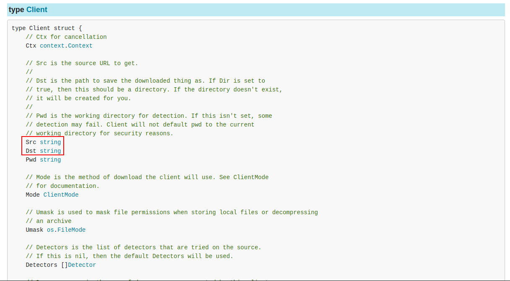

Hello again! In case you have missed the [previous articles](/series/tfbridge/), here's the summary. We're building a [Steampipe](https://steampipe.io/) plugin that can reuse (hopefully) any [Terraform provider's](https://developer.hashicorp.com/terraform/language/providers) [data sources](https://developer.hashicorp.com/terraform/language/data-sources) and present them as SQL tables, so you can query them. This should greatly extend the range of what can be queried by Steampipe, by complementing its [~130 plugins](https://hub.steampipe.io/plugins) with however many data sources are there in the >3K Terraform providers that exist in the [Terraform Registry](https://registry.terraform.io/). It should also let you unify code in case you need to both query for resources and manage them: you'd just write the Terraform provider, with its Resources and Data Sources, and then you'd plug it in to Steampipe, where you can reuse the Data Sources via SQL queries.

In the [first](/posts/steampipe-tfbridge-1/) [few](/posts/steampipe-tfbridge-2/) [articles](/posts/steampipe-tfbridge-3/), we explored the problem, and wrote [a Go program](https://github.com/jreyesr/steampipe-plugin-tfbridge/tree/poc) that could make a Terraform provider tick... without Terraform itself being present. It could ask the provider for its schema (such as which data sources it exposes), configure the provider (pass it some credentials, for example) and query the provider for a specific data source.

Then, in [the last article](/posts/steampipe-tfbridge-4/), we converted that program into a Steampipe plugin. It dynamically declared which tables it exposed (since normal Steampipe plugins have a fixed set of tables, but we can't do that, since which tables we expose depends on which Terraform provider the user wants to use). It used the data source's schema (which fields a data source has; which are required, optional or read-only) to generate qualifiers for the table. Then, it translated `SELECT ...` statements into data source Read operations, and translated the result, usually intended for Terraform's consumption, into Steampipe-friendly columns (through liberal use of JSON columns in case of emergencies).

Now we need to enhance the plugin. In particular, we need to implement an easier way of specifying the Terraform provider that we want to use. Right now, the Steampipe config looks like this:

```hcl
# ~/.steampipe/config/tfbridge.spc

connection "tfbridge" {
  plugin = "jreyesr/tfbridge"

  provider = "/home/reyes/code/steampipe-plugin-tfbridge/terraform-provider-dns_v3.2.4_x5"
  version = "4.11.0" # unused for now
  
  provider_config = <<EOT
  EOT
}
```

As you can see, the `provider` field holds an absolute path to a Terraform provider binary. So you have to download it manually beforehand, which is somewhat awkward. The version is unused. We want the user to specify just the provider's name, as you'd do on Terraform:

```hcl
terraform {
  required_providers {
    dns = {
      source = "hashicorp/dns" # <-- this
      version = "3.3.2"        # <-- and this
    }
  }
}
```

And that should somehow discover the URL where the plugin binary is kept, download it, extract it (plugin binaries sometimes come wrapped in a `.zip` file) and save it to a stable location. Then we can use it, and the user never had to specify a URL or download the binary himself.

## The Registry API

Terraform runs [a Registry](https://registry.terraform.io/) where most providers live, and which is used by default when you don't specify a hostname as part of the `source` key in the `required_providers` block. However, that's not all: Terraform can also operate from [private Registries](https://developer.hashicorp.com/terraform/registry/private), because "many organizations use modules, providers, or Sentinel policies that cannot or do not need to be publicly available".

> You can load private modules directly from version control and other sources, but those methods do not support version constraints or a browsable marketplace, both of which are important for enabling a producers-and-consumers content model in a large organization. You will benefit from a private registry if your teams need access to a common set of providers, modules, or policies.

So, you can't just assume that things live on `registry.terraform.io`. Nor does Terraform do so. Instead, there's a fairly complex protocol that takes you from a `source`+`version` to a URL, and from there to a `.zip` file, and from there to a provider binary.

The entire API of Terraform Registries (plural, since we've just seen that private Registries can also exist) is [documented here, as part of Terraform's docs](https://developer.hashicorp.com/terraform/registry/api-docs). It's a set of URL endpoints that every Registry implements, and which together let you discover and download provider binaries.

Let's take a quick stroll through the parts of the Registry API that we need, just to understand them. Let's assume that the user has said `source = "hashicorp/dns"` and `version = "3.3.2"`.

### Data extraction

We extract a bunch of data from the `source`. Here, since there's no hostname at the start of the source, it defaults to `registry.terraform.io`. If you hosted a private Registry at `registry.acme.com`, you'd say `source = "registry.acme.com/acme/myprov"`, and the hostname would be (surprise) `registry.acme.com`.

The host is extracted by:

1. Splitting the `source` on forward slashes `/`, then taking the first one
2. That first part is passed through [a massive regex](https://github.com/hashicorp/terraform/blob/c9a7b7f082551da9ea2b18a326009573487d60d0/internal/registry/regsrc/friendly_host.go#L13-L58), which to the best of my abilities (i.e. copying the code linked above, pasting it into [the Go Playground](https://go.dev/play/) and printing it) is this:
   ```
   ^(?:[0-9A-Za-z]|[^[:ascii:]])(?:(?:[0-9A-Za-z-]|[^[:ascii:]]){0,61}(?:[0-9A-Za-z]|[^[:ascii:]]))?(?:\.(?:[0-9A-Za-z]|[^[:ascii:]])(?:(?:[0-9A-Za-z-]|[^[:ascii:]]){0,61}(?:[0-9A-Za-z]|[^[:ascii:]]))?)+(?::\d+)?$
   ```
   Don't worry if you don't understand that: it's a regular expression, after all. What's important is that it matches `registry.terraform.io` or `privreg.acme.com`, but not `hashicorp`. So it can distinguish between `source`s that start with a hostname (e.g. `registry.acme.com/acme/myprov`) and `source`s that don't (e.g. `acme/myprov`), which will be assumed to live on the public Registry
3. If the regex matched, it's further validated by, for example, trying to convert it to [Punycode](https://en.wikipedia.org/wiki/Punycode) (which is a way of encoding non-ASCII characters, i.e. what everyone in the world but English people use, into ASCII for domain names: for example, taken from Wikipedia, the domain `ουτοπία.δπθ.gr` is encoded as `xn--kxae4bafwg.xn--pxaix.gr`). If that conversion fails, the entire validation errors. Furthermore, [Github and Bitbucket are explicitly forbidden, as they're handled in different ways](https://github.com/hashicorp/terraform/blob/69f9f12bf9a46256ada8e9ef9b97e76cc5d3ee09/registry/regsrc/module.go#L48-L51).
4. The rest of the `source` (which could be the entirety of it, in case the user didn't specify a host) gets matched by [the following regex](https://github.com/hashicorp/terraform/blob/69f9f12bf9a46256ada8e9ef9b97e76cc5d3ee09/registry/regsrc/module.go#L23-L36):
   ```
    ^([0-9A-Za-z](?:[0-9A-Za-z-_]{0,62}[0-9A-Za-z])?)\/([0-9A-Za-z](?:[0-9A-Za-z-_]{0,62}[0-9A-Za-z])?)\/([0-9a-z]{1,64})(?:\/\/(.*))?$
   ```
   Again, that's a lot of characters. It "matches the basic namespace/name/provider\[//...\] format for registry sources". From there, it extracts a namespace, name and provider. The namespace is usually the organization that creates the provider: in `hashicorp/dns`, it'd be `hashicorp`. The name would be empty, and the provider would be `dns`. Note that the second part (the name) is the optional one: at least the namespace and the provider must exist.
5. At this point, we have a host (which may be `registry.terraform.io`), namespace, name (which may be empty) and provider.

### Service discovery

First, we need to [do "service discovery"](https://developer.hashicorp.com/terraform/internals/remote-service-discovery#discovery-process), AKA check if the host actually implements a Terraform registry.

We do that by calling the URL `https://<hostname>/.well-known/terraform.json`. It should return a HTTP 200 OK response, of type `application/json`, with the following structure (taken from the public Provider discovery URL, `https://registry.terraform.io/.well-known/terraform.json`):

```json
{
    "modules.v1": "/v1/modules/",
    "providers.v1": "/v1/providers/"
}
```

That means that `https://registry.terraform.io/v1/providers/` is the base URL for the entire provider registry. If any of the conditions aren't fulfilled, then that URL does _not_ host a Terraform registry, and you should warn your user and exit. Terraform does that on `terraform init`, we'll have to do that on plugin load.

Thus concludes service discovery, with a base URL for all subsequent API calls.

## Acquiring provider files from a name + version

Now we have a base URL for the Registry, plus a namespace and provider name, and a version. We need to download a provider binary now.

While it may look like it, that operation is _not_ documented in [the API docs for "Download Source Code for a Specific Module Version"](https://developer.hashicorp.com/terraform/registry/api-docs#download-source-code-for-a-specific-module-version). That's for [modules](https://developer.hashicorp.com/terraform/language/modules), not for [actual providers](https://developer.hashicorp.com/terraform/language/providers). The documentation for provider download URLs lives [here](https://developer.hashicorp.com/terraform/internals/provider-registry-protocol#find-a-provider-package), which is more hidden.

This is the magic URL:

```
<base_url>/:namespace/:type/:version/download/:os/:arch
```

For example, for `hashicorp/dns` and `3.3.2`, the URL (for my Ubuntu-running computer) would be

```
https://registry.terraform.io/v1/providers/hashicorp/dns/3.3.2/download/linux/amd64
```

That returns a JSON document with this format:

```json
{
    "arch": "amd64",
    "download_url": "https://releases.hashicorp.com/terraform-provider-dns/3.3.2/terraform-provider-dns_3.3.2_linux_amd64.zip",
    "filename": "terraform-provider-dns_3.3.2_linux_amd64.zip",
    "os": "linux",
    "protocols": [
        "5.0"
    ],
    "shasum": "55a4f13d20f73534515a6b05701abdbfc54f4e375ba25b2dffa12afdad20e49d",
    "shasums_signature_url": "https://releases.hashicorp.com/terraform-provider-dns/3.3.2/terraform-provider-dns_3.3.2_SHA256SUMS.72D7468F.sig",
    "shasums_url": "https://releases.hashicorp.com/terraform-provider-dns/3.3.2/terraform-provider-dns_3.3.2_SHA256SUMS",
    "signing_keys": {
        "gpg_public_keys": [
            {
                "ascii_armor": "-----BEGIN PGP PUBLIC KEY BLOCK-----\n\nmQINBGB9+xkBE...-----END PGP PUBLIC KEY BLOCK-----",
                "key_id": "34365D9472D7468F",
                "source": "HashiCorp",
                "source_url": "https://www.hashicorp.com/security.html",
                "trust_signature": ""
            }
        ]
    }
}
```

There's a bunch of information there, chief among which is the `download_url`. That's where we have to go to download the package.

~~However, that's not necessarily a plain download URL. That can be seen more clearly in [the docs to download a module](https://developer.hashicorp.com/terraform/registry/api-docs#download-source-code-for-a-specific-module-version): "A successful response has no body, and includes the location from which the module version's source can be downloaded in the `X-Terraform-Get` header. Note that this string may contain special syntax interpreted by Terraform via [`go-getter`](https://github.com/hashicorp/go-getter). See [the `go-getter` documentation](https://github.com/hashicorp/go-getter#url-format) for details." Now, for providers the URL isn't in a header, but on the actual body, but the same idea remains: the URL may have non-URL syntax that is interpreted by `go-getter`.~~

**NOTE** While the download URL for modules may be in `go-getter` syntax, AFAICT providers don't behave in the same way, and provider download URLs appear to be perfectly normal URLs that can be downloaded normally.

## The `go-getter` package

**NOTE** This section was originally written when I thought that providers' download URLs could be in `go-getter` syntax. AFAICT they can't, but nearly all this section could still be useful as a general intro to `go-getter`, so I've left it in. **END NOTE**

What's [that `go-getter` package](https://github.com/hashicorp/go-getter) anyways? It's a "Package for downloading things from a string URL using a variety of protocols". Nice generic description: downloads "things" using "a variety" of protocols.

In particular, it can download said things, by default, from:

* Local files
* Git
* Mercurial
* HTTP
* Amazon S3
* Google GCP

Then, there's some added fun: 

* Protocol override: e.g., `http://github.com/mitchellh/vagrant.git` could be an HTTP URL (because it starts with `http://`) or a Git URL (because the host is `github.com`, which has hand-coded recognition as a Git provider). You can override the protocol by doing `git::http://github.com/mitchellh/vagrant.git`, which forces Git.
* Protocol-specific options, passed as querystring: for example, for Git, you can download a specific branch/tag by passing the URL `github.com/hashicorp/go-getter?ref=testbranch`
* Downloading only a subdirectory from the remote store
* Checksum verification, if you have an available checksum, with `./foo.txt?checksum=md5:b7d96c89d09d9e204f5fedc4d5d55b21`
* Automatic extraction of compressed files, if you pass `./some/other/path?archive=zip`

`go-getter`'s docs say that "To get started, see Client." Fine, we'll go check out [the `go-getter.Client` type](https://pkg.go.dev/github.com/hashicorp/go-getter#Client):



Those `Src` and `Dst` fields look important. The `Src` field gets filled with the download URL that we found in the last section, the one that "could have special `go-getter` syntax". The `Dst` is a local file path: assuming you're downloading a single file, it should be a file name (the corresponding file may exist, in which case I assume it gets overwritten, or it may not, in which case it'll surely get created). If you're downloading an entire directory, `Dst` should be a directory path.

~~In our case, we'll download a single file, which I've found to be compressed on my tests. We'll want to decompress it, which `go-getter` can do by itself, and extract a single file (the provider binary itself).~~

So, to recap: the `go-getter` package can download things, based on strings that are loosely based on URLs, to configurable locations on disk. It also has extra goodies. It is what Terraform itself uses to download binaries, by the way. ~~And we have to use it, since Terraform's API may return download URLs that are in `go-getter`'s own not-quite-URL format.~~

## Actually downloading a provider binary

The [`registry` package on the Terraform repo](https://pkg.go.dev/github.com/hashicorp/terraform/registry) implements the download functionality on Terraform proper.

Sadly, ever since Terraform v0.15.3, back on May 2021, that package is no longer published separately. Instead, it's a part of Terraform, but [it was moved to `internal/`](https://github.com/hashicorp/terraform/commit/4c5b866deaf3ea78d09584d2381af3504e02fca8) and thus it can't be imported anymore. So sad. Here's the goodbye commit message:

> **Move registry/ to internal/registry/**
> 
> This is part of a general effort to move all of Terraform's non-library
package surface under internal in order to reinforce that these are for
internal use within Terraform only.
> 
> If you were previously importing packages under this prefix into an
external codebase, you could pin to an earlier release tag as an interim
solution until you've make a plan to achieve the same functionality some
other way.

Initially, I tried to [do this the hard way, again](https://jreyesr.github.io/posts/steampipe-tfbridge-2/#recursive-creative-code-reuse). However, that code is fairly coupled with the rest of Terraform, it's not a generic API client for the Registry API that is just bundled with the main Terraform code. It's an integral part of Terraform's code and pulling it out... well, it's ugly. There are tons of internal data structures with fields that make perfect sense when running as a part of Terraform, but not so much when running in isolation. For example, the Registry code is intertwined with the local caching mechanism that Terraform uses to not download plugins multiple times, with workspaces, with the version resolution logic (in Terraform you can [specify version constraints](https://developer.hashicorp.com/terraform/language/expressions/version-constraints) which Terraform itself will resolve), and more.

In the end, I went with a hand-rolled implementation that relies on two independent packages: [`terraform-registry-address`](https://github.com/hashicorp/terraform-registry-address) and [`terraform-svchost`](https://github.com/hashicorp/terraform-svchost). These are properly published in the Go repositories, so they're safe to depend on.

See [commit `3e07b4e`](https://github.com/jreyesr/steampipe-plugin-tfbridge/commit/3e07b4eb3aa122e9ec99ccb143197b6524e6aab4) for the code. It's basically a new file, `tfbridge/downloader.go`, plus changes in `tfbridge/plugin.go` so the plugin is actually downloaded. Let's look at that first, since it calls `downloader.go`:

```go
// tfbridge/plugin.go

func PluginTables(ctx context.Context, d *plugin.TableMapData) (map[string]*plugin.Table, error) {
	config := GetConfig(d.Connection)
	
	// OLD CODE
	conn, err := getPluginConnection(*config.Provider)
	// NEW CODE
	pluginBinaryPath, err := DownloadProvider(ctx, *config.Provider, *config.Version, d)
	if err != nil {
		return nil, err
	}
	
	// everything else stays mostly the same
```

Previously, we just [used the `provider` key in the `.spc` file as an absolute file path to the provider](https://jreyesr.github.io/posts/steampipe-tfbridge-4/#the-providers-config). Now we can actually use it as it should be used: `provider` is just the provider name, just as you'd write it on a `required_providers` block in Terraform, and the same goes for `version`. The Steampipe plugin now must resolve that to a URL, download and save it somewhere, and then call that absolute path. That is done by the `DownloadProvider` function, which lives in `downloader.go`:

```go
// tfbridge/downloader.go

import (
	tfaddr "github.com/hashicorp/terraform-registry-address"
	"github.com/hashicorp/terraform-svchost/disco"
	"github.com/turbot/steampipe-plugin-sdk/v5/plugin"
)


/*
DownloadProvider uses the Terraform Registry API to download a provider binary into the temp directory.
*/
func DownloadProvider(ctx context.Context, name, version string, d *plugin.TableMapData) (path string, err error) {
	// 1. Split name into (hostname, namespace, name)
	// if you pass a plugin w/ no hostname, defaults to registry.terraform.io
	provider, err := tfaddr.ParseProviderSource(name)
	if err != nil {
		return
	}
	// must use HTTPS
	hostnameUrl, err := url.Parse(fmt.Sprintf("https://%s", provider.Hostname.String()))
	if err != nil {
		return
	}

	// 2. Run discovery on hostname, grab Providers URL
	providerUrl, err := disco.New().DiscoverServiceURL(provider.Hostname, "providers.v1")
	if err != nil {
		return
	}
	// 3. Mess with the providerUrl so it's referenced to the hostname
	providerUrl = hostnameUrl.ResolveReference(providerUrl)
	plugin.Logger(ctx).Info("resolveService", "hostnameUrl", hostnameUrl, "providerUrl", providerUrl)

	// 4. Build the URL that will return the download URL
	pluginVersionInfoLocation := fmt.Sprintf("%s%s/%s/%s/download/%s/%s",
		providerUrl,
		provider.Namespace,
		provider.Type,
		version,
		runtime.GOOS, // dynamic!
		runtime.GOARCH, // dynamic!
	)
	pluginVersionInfoUrl, _ := url.Parse(pluginVersionInfoLocation)
	// 5. Grab the JSON that contains the download URL
	resp, err := http.Get(pluginVersionInfoLocation)
	if err != nil {
		return
	}
	// extra-friendly error message for 404, since that one should be most common
	if resp.StatusCode == 404 {
		err = fmt.Errorf("download: Terraform provider %s, version %s does not exist! Please check that it is available for your OS and arch", provider.ForDisplay(), version)
		return
	}
	if resp.StatusCode != 200 || resp.Header.Get("content-type") != "application/json" {
		err = fmt.Errorf("get version response invalid: code %d, contenttype %s", resp.StatusCode, resp.Header.Get("content-type"))
		return
	}
	defer resp.Body.Close()

	// 6. Parse response, we only care about download_url
	var pluginVersion pluginVersionResponse
	err = json.NewDecoder(resp.Body).Decode(&pluginVersion)
	if err != nil {
		return
	}
	plugin.Logger(ctx).Info("getVersionInfo", "sourceUrl", pluginVersionInfoLocation, "downloadUrl", pluginVersion.DownloadURL)

	pluginDownloadUrl, err := url.Parse(pluginVersion.DownloadURL)
	if err != nil {
		return
	}
	// "If this [i.e. download_url] is a relative URL then it will be resolved relative to the URL that returned the containing JSON object."
	pluginDownloadUrl = pluginVersionInfoUrl.ResolveReference(pluginDownloadUrl)

	// 7. Steampipe helper that downloads a file (or many) to a /tmp/... path and returns the actual download location(s)
	paths, err := d.GetSourceFiles(pluginDownloadUrl.String())
	if err != nil {
		return
	}
	// 8. Some error checking, we only expect 1 file (the provider binary)
	if len(paths) != 1 {
		err = fmt.Errorf("unexpected number of files: %d %v, expected 1 file", len(paths), paths)
		return
	}

	// 9. Return that path, it's something like /tmp/steampipe-plugin-tfbridge/tfbridge/2023-08-08T02:28:35Z/terraform-provider-dns_3.2.4_linux_amd64.zip/terraform-provider-dns_v3.2.4_x5
	path = paths[0]
	return
}
```

That's a long function, so let's unpack it:

1. We start by using [the function `ParseProviderSource`](https://pkg.go.dev/github.com/hashicorp/terraform-registry-address#ParseProviderSource) to convert a string into [a `Provider`](https://pkg.go.dev/github.com/hashicorp/terraform-registry-address#Provider). This struct holds a `Hostname`, a `Namespace` and a `Name`. The namespace is usually the provider's vendor/developer, the hostname tends to be `registry.terraform.io`, and the name is the actual name of the provider
2. We use [the `disco` package](https://pkg.go.dev/github.com/hashicorp/terraform-svchost@v0.1.1/disco) to run discovery on that hostname. Specifically, by using [the `DiscoverServiceURL` method](https://pkg.go.dev/github.com/hashicorp/terraform-svchost@v0.1.1/disco#Disco.DiscoverServiceURL), we look for the base URL of providers. Other base URLs would point, for example, to modules, which we don't care about. This implicitly ensures that the Registry we're pointing to does actually serve providers, not only modules
3. Now that we have the base URL for providers, we have to convert it to an absolute URL. Sometimes (such as the public Terraform registry), the service URLs that you discover (in the previous step) are relative URLs. You convert them to absolute URLs with `ResolveReference`, which is part [of Go's standard library](https://pkg.go.dev/net/url#URL.ResolveReference)
4. As outlined in [Terraform's API docs](https://developer.hashicorp.com/terraform/internals/provider-registry-protocol#find-a-provider-package), we build up a URL that will return "the download URL of and associated metadata about the distribution package for a particular version of a provider for a particular operating system and architecture". Building up that URL requires the provider name+version, and also the OS and CPU architecture of the machine that will run the provider, since Terraform can run on multiple platforms. We use Go's standard library for that too
5. We actually fire off that GET request
6. We parse the JSON response, after some sanity checks. Since we only care about the `download_url` field (though we should probably also care at least about `shasum`), that's the only field in the `pluginVersionResponse` type
7. And now we can (finally!) download the actual provider binary. We use a super-secret Steampipe function for that: [`plugin.TableMapData.GetSourceFiles()`](https://pkg.go.dev/github.com/turbot/steampipe-plugin-sdk/v5/plugin#TableMapData.GetSourceFiles). It has [a similar function](https://pkg.go.dev/github.com/turbot/steampipe-plugin-sdk/v5/plugin#QueryData.GetSourceFiles) on the `plugin.QueryData` type.
   From the docs, "GetSourceFiles accept a source path downloads files if necessary, and returns a list of local file paths". It's used in the CSV plugin, which can download files from S3 buckets or Git repos, and also use globs. Globs are the reason why it returns "a list of" local file paths, since a glob can expand to multiple files. Here we don't use that.
   Another goodie of the `GetSourceFiles` function is that [it automatically saves whatever it downloads into a managed temp dir](https://github.com/turbot/steampipe-plugin-sdk/blob/042cc373012196bbc551192b4a6d34a80e5fb26a/plugin/table_map_data.go#L13C1-L13C1). See that `d.tempDir` param? That's set [when the plugin is being initialized](https://github.com/turbot/steampipe-plugin-sdk/blob/main/plugin/plugin.go#L172), to be a subdir of the OS's temp dir (`/tmp` on Ubuntu, at least, and probably most other UNIXes). Furthermore, [that tempdir is deleted on plugin shutdown](https://github.com/turbot/steampipe-plugin-sdk/blob/d3a966495012ea007e5cdd18018590d14b946455/plugin/plugin.go#L187), which Steampipe performs when shutting down the server, I think. Hence, there shouldn't be an ever-growing pile of plugin binaries. Besides, some OSs clean up the `/tmp` dir on reboot anyways.
   That's what the CSV plugin uses to store its CSV files: it downloads them to the tempdir and then [reads them when a query comes in](https://github.com/turbot/steampipe-plugin-csv/blob/9502c43e1b080afc1bfe15b74c810bfda40a53f9/csv/table_code_csv.go#L67). We can do the same, except that we'll spawn a process when a query comes in, instead of reading and parsing a text file
8. We ensure that we downloaded one file, and just one file. I'm unsure if the release packages (which I've seen as `.zip` files) could ever contain more files apart from the provider binary. If that happens, I'll have to relax that check
9. We return the path that `GetSourceFiles` gave us. As an example, I've seen `/tmp/steampipe-plugin-tfbridge/tfbridge/2023-08-08T02:28:35Z/terraform-provider-dns_3.2.4_linux_amd64.zip/terraform-provider-dns_v3.2.4_x5`: it's a subdir of `/tmp`, named as the plugin

And with that, the plugin works as before. However, now it automatically downloads its backing Terraform provider! No more manual downloading. It's also much easier to switch provider versions: a change on the `.spc` file, a reboot of Steampipe, and that's it.

I do feel a slight slowdown while Steampipe is loading, which is normal since now we have to download a file on Steampipe boot. However, AFAICT Steampipe is intended to be a long-running server (so download should happen infrequently), and there are other perfectly normal usecases [that cause Steampipe to take several seconds/minutes to start](https://steampipe.io/blog/release-0-20-0#faster-startup), so we should be in the clear.

So now you can have a `.spc` file like this:

```hcl
connection "tfbridge" {
  plugin = "jreyesr/tfbridge"

  provider = "hashicorp/dns"
  version = "3.2.4"
  
  provider_config = <<EOT
  EOT
}
```

and it'll work as expected: when Steampipe boots, that provider version will be downloaded, saved on a subdir of `/tmp`, and then used for all operations (schema definition, i.e. which tables the plugin will dynamically expose; and also actual queries, i.e. `SELECT`s to those tables)

## Recap

* Terraform hosts metadata about its providers on Terraform Registries
* The [public Terraform Registry](https://registry.terraform.io/) is the most common one, but there are others: see [here](https://github.com/MatthewJohn/terrareg), [here](https://github.com/philips-labs/terraform-registry), [here](https://github.com/nrkno/terraform-registry) or [here](https://github.com/robburger/terraform-registry), but there [are more](https://github.com/topics/terraform-registry)
* Every Registry must comply with [the Registry API](https://developer.hashicorp.com/terraform/registry/api-docs), which lets Terraform consume content from every registry in the same way
* The Registry API provides facilities for users to [explore modules](https://developer.hashicorp.com/terraform/registry/api-docs#list-modules), [search them](https://developer.hashicorp.com/terraform/registry/api-docs#search-modules), [list the versions of a provider](https://developer.hashicorp.com/terraform/internals/provider-registry-protocol#list-available-versions), [obtain information about a specific provider version](https://developer.hashicorp.com/terraform/internals/provider-registry-protocol#find-a-provider-package) and more. Other user-facing facilities such as a UI to list providers or view their documentation aren't specced
* By following [the Service Discovery protocol](https://developer.hashicorp.com/terraform/internals/remote-service-discovery), you can obtain the URLs in which the API resides
* Querying the Registry API for the information of a provider version returns, among other things, a download URL in which the actual provider binary resides
* At load time, our Steampipe plugin uses the Registry API to convert the name+version of a Terraform plugin, specified by the user in the `.spc` file, into a download URL. It then downloads the plugin and places it into a temporary directory
* All further operations that require the plugin will then use that binary
