**UPDATE 2024-06-30:** Recently I went to check Streamsync's repo, to see what they were up to, and it turns out that they've been acquihired by [Writer](https://writer.com/), an AI/LLM/GPT company that offers a platform to do... _stuff_ with generative AI. (It's 2024, after all...) [Acquisition announcement here](https://writer.com/blog/ai-studio-developers/), dated 2024-06-05. Streamsync became [Writer Framework](https://github.com/writer/writer-framework). As of writing this update, it appears to still be very similar to old Streamsync, except that now its examples contain many more chatbot apps and "we'll now write an app that receives a user prompt and generates the outline of a blog post in your company's tone". As far as I can tell, everything that is said in this post about Streamsync's capabilities is still valid. This post has nothing to say about the rest of Writer's products, nor about the phenomenon of generative AI as a whole. We'll focus on Streamsync/Writer Framework _qua_ Python library that can be used to create web applications in a drag-and-drop fashion that is different to monolithic/server side apps, that use templated HTML rendered server-side; and to client-side apps/SPAs, that use a framework such as Vue/React/Angular and pure client-side rendering.

---

## Introduction

A few months ago, I wrote [an article about Streamsync](/posts/streamsync-review/), a very neat framework that lets you create interactive web applications, mixing UI design (via a drag-and-drop visual editor) and backend code (Python, backed by FastAPI). [Here's the project's repo](https://www.streamsync.cloud/).

Streamsync was (and still is) a very young project (the current most recent version is v0.2.7). Since I reviewed it, several things have changed, the most important one (to me, at least, and the reason that prompted this new post) is [the ability to develop custom FE components in Vue](https://www.streamsync.cloud/custom-components.html). This is an _extremely_ powerful feature that lets you create highly customized components, that then play nicely with the rest of the ecosystem.

By way of comparison, [Retool also has custom components](https://docs.retool.com/apps/web/guides/components/custom). I haven't used them, but they seem straightforward-ish (they use React in examples, but you can choose). However, Retool [isn't open source](https://retool.com/en/pricing), which makes us sad. Other (similar) tools that are opensourcer-er are [Tooljet](https://www.tooljet.com/) and [Appsmith](https://www.appsmith.com/). The former [does definitely support React custom components](https://docs.tooljet.com/docs/widgets/custom-component/), while the latter [doesn't seem to, at least not without some `<iframe>` shenaniganry](https://community.appsmith.com/solution/how-do-i-create-custom-widget-appsmith).

Then there's [Streamlit](https://streamlit.io/), Streamsync's own inspiration. [It's also possible to create React (or not) components](https://docs.streamlit.io/library/components/components-api#create-a-bi-directional-component). 

All these tools have the same general idea: providing users with an escape hatch to build more complex UIs than what the built-in components provide. Components have their own internal state (here _state_ is used in the FE sense, as private data that is used only by the component), can receive data from the broader application, and can return data back to it. Since they're HTML components, they can react to events, and usually inform the entire application of said events, either by explicitly triggering an event or by updating its output data, which forces an update of the app.

In this post, we'll explore custom components in Streamsync. I'm particularly interested in the feedback loop between the development of a custom component and of an application that uses it. While you're developing a custom component, you'll need a Streamsync application to serve as a testbed. How quickly can you swap between both? FE frameworks have gone very far with regards to hot-reloading, so it'll be interesting to see if the development loop is slowed at all.

## Star rating component

A simple component is a five-star rating input. [Streamlit has one](https://discuss.streamlit.io/t/new-component-star-ratings/36829) (third-party). [So does Retool](https://retool.com/components/rating). Let's try to build one.

The common knobs for such a component are the current value and the maximum value. The maximum value could easily default to 5, but we probably shouldn't force a default on the current value. Then, to fit with Streamsync's event model, we probably want an event that fires whenever the rating changes. For consistency with Streamsync's built-in Number input (since that is, in the end, what a rating component is), we'll call that event `ss-number-change`.

[These docs](https://www.streamsync.cloud/custom-components.html) cover the subject of developing custom components. 

1. Clone the entire Streamsync repo, then `cd` to `ui`
2. Run `npm install`
3. You'll need a Streamsync backend server, so run `streamsync create customtester && streamsync edit customtester --port 5000`. This can be done in the same `ui` directory, so you can start both the FE and the BE from the same directory
4. Run `npm run custom.dev`. This starts a hot-reloading Vite server that serves the Streamsync edit UI, now with new components. By default, Streamsync comes with two custom components: Bubble Message and Bubble Message (Advanced):

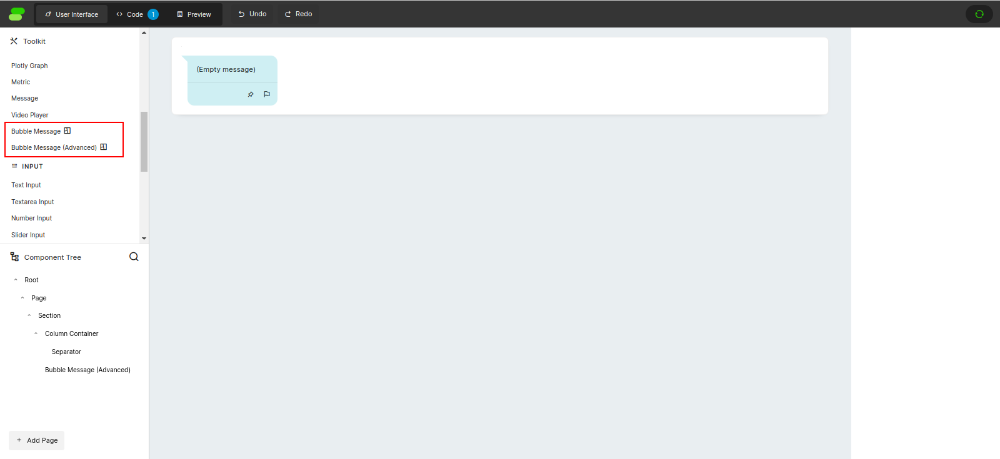

Streamsync Custom Components are perfectly normal [Vue Single File Components](https://vuejs.org/guide/scaling-up/sfc.html), which are a really cool way of separating-yet-keeping-together the three main elements of a component: the HTML-ish code (markup), the CSS code (styling) and the JS code (behavior).

React [does something similar](https://react.dev/learn/writing-markup-with-jsx) with JSX, where the HTML code is actually interleaved in the JS code. This usually works and lends itself quite naturally [to looping](https://react.dev/learn/rendering-lists), but sometimes it gets ugly and can encourage too much logic in your templates. Angular takes the exact opposite approach, [forcing you to work on three separate files per component](https://angular.io/guide/component-overview). This forces you to keep those concerns separate, but in return you better have a really wide monitor when working on more than a couple of components at a time. 

Vue takes a middle approach between those. The three main parts of a component are colocated in the same file (a `.vue` file), yet they're separated via tags (the HTML will be in a `<template>` block, while JS will be on `<script>` blocks). They even have [a section in the docs](https://vuejs.org/guide/scaling-up/sfc.html#what-about-separation-of-concerns) defending the use of colocated programming languages, the main thrust of the argument being that "separation of concerns is not equal to the separation of file types". In other words, worry about building nice, clean, decoupled, reusable components, not about file type splitting. If you're building clean components, it shouldn't matter that JS and HTML coexist in a single file. Which is enforced by the aforementioned tags too, so in effect you have three separate files, except you can just scroll up and down or, if you're lucky, even see both code bases at once, instead of tab-switching.

Then there's [Svelte](https://svelte.dev/), an _extremely_ cool framework that tries to do as much work as possible at build time and compiles down to vanilla JS, which results in very fast applications with tiny bundle sizes. Go give it a peek if you don't know what it's all about, you may find it interesting. Svelte [takes essentially the same approach as Vue](https://svelte.dev/docs/svelte-components), i.e. keeping the three main parts of any single component in the same file, with the difference that the HTML isn't wrapped in a `<template>`. Instead, everything _but_ scripts and CSS is the HTML. This is closer to plain old HTML files, where HTML is the default language, and you switch "into" JS or CSS via `<script>` and `style` tags, respectively.

As in a normal Vue component, for Streamsync you have to think about the HTML code (the component's layout), the JS/TS code (the behavior), and the CSS (styling). Additionally, much like in Vue you need to define the [props](https://vuejs.org/guide/essentials/component-basics.html#passing-props) and [events](https://vuejs.org/guide/essentials/component-basics.html#listening-to-events) that the component supports (which conform its external-facing API, AKA what other components can use), here you need to define the component's _fields_ (which correspond roughly to props) and _events_ (you can guess this one).

Fields [are surfaced in the Streamsync editor](https://www.streamsync.cloud/builder-basics.html#properties), when you click on a component. They're called Properties there. You can set them either to constant values (like you'd probably do for a text field's Label) or to state bindings (like you'd do for said text field's Content). Events also appear on the component settings sidebar, but they link to functions in Python-land. [Once linked, a function will be invoked every time the component fires its event](https://www.streamsync.cloud/event-handlers.html). For example, Buttons have a `ss-click` event, which simply runs a Python function. Other events, such as the `ss-file-change` event on the File Input component, additionally [have a _payload_](https://www.streamsync.cloud/event-handlers.html#receiving-a-payload) where interesting data about the event is contained. For the File Input component, that'd be the file that the user just selected.

So, to summarize:

* HTML
	* A variable amount of stars, since we want the user to be able to choose the amount (5 stars is probably the most common, but you may want 3 stars or 10 stars or something. Or maybe even 1 star for some sort of "starred" component!)
	* A variable number of stars, starting from the left, should be filled. This is tied to the component's main output (an integer). The rest should be empty
* JS
	* The usual interactivity: when you click on a star, that number is set as the component's main output
* CSS
	* We may want to add some sort of "preview", so that when you hover over a star it becomes bigger or something
	* Consider making the color of the whole component configurable (some sort of yellow is usually the default, but maybe you want purple stars so it better fits with the rest of your application)
* Streamsync-specific
	* Much like the Number Input component, the component should emit a `ss-number-change` event when clicked
	* The total number of stars and the currently-selected number of stars should both be configurable, like for a Slider you can provide the Maximum and the current value. Indeed, a star rating component is just a fancier Slider with step=1 (or 0.5 if you allow half-stars), and min=0
	* If we make the color configurable, that should also be exposed to Streamsync

### The code

```vue
<template>
    <div class="container" ref="rootEl">
        <div class="stars-container">
            <!-- NOTE: the v-for is intentionally misspelled as v_for, since the proper value breaks syntax highlighting really badly -->
            <span class="star" v_for="i in Array(fields.numStars.value).keys()" @mouseenter="hovered = i + 1"
                @mouseleave="hovered = 0" @click="() => emitChangeEvent(i + 1)">
                {{ starFor(i) }}
            </span>
        </div>
    </div>
</template>

<script lang="ts">
export default {
    streamsync: {
        name: "Star Rating",
        description: "Shows a rating component that uses stars to collect a number.",
        category: "Input",

        fields: {
            numStars: {
                name: "Number of stars",
                type: FieldType.Number,
                default: "5",
            },
            currentStars: {
                name: "Stars",
                type: FieldType.Number,
                desc: "The current value. Bind to state if desired"
            }
        },

        events: {
            "ss-number-change": {
                desc: "Emitted when a different number of stars is selected.",
                stub: `def onchange_handler(state, payload):\n	print(payload)\n	state["num_stars"] = payload`
            },
        },
    },
};

</script>

<script setup lang="ts">
import { FieldType } from "../streamsyncTypes";
import injectionKeys from "../injectionKeys";
import { Ref, inject } from "vue";
import { ref } from "vue";

const fields = inject(injectionKeys.evaluatedFields);
const rootEl: Ref<HTMLElement> = ref(null); // Root element is used to fire events

const hovered = ref(0);

function starFor(i) {
    // If `hovered` is set, takes priority over the `currentStars` prop
    // Otherwise, just consider the `currentStars` prop, which probably comes from state
    if (i < (hovered.value || fields.currentStars.value)) {
        return "★"; // Filled
    } else {
        return "☆"; // Hollow
    }
}

function emitChangeEvent(i: Number) {
    console.log(i)
    const event = new CustomEvent("ss-number-change", {
        detail: {
            payload: i,
        },
    });
    rootEl.value.dispatchEvent(event);
}
</script>

<style scoped>
.container {
    width: fit-content;
}

.stars-container {
    min-height: 40px;
    display: flex;
    align-items: center;
}

.star {
    font-size: x-large;
    color: gold;
    cursor: pointer;
}

.star:hover {
    font-size: xx-large;
}
</style>
```

By the way, the `<script setup>` component [is part of Vue's syntactic sugar for the Composition API](https://vuejs.org/api/sfc-script-setup.html). The contents of that script block become [the component's `setup()` function](https://vuejs.org/api/composition-api-setup.html), and will run every time an instance of the component is instantiated. The [Composition API](https://vuejs.org/guide/introduction.html#composition-api) is Vue's new way of declaring components, and it looks like [React Hooks](https://react.dev/reference/react) somewhat.

Here, the rating components have one internal state variable, `hovered`. This is an integer that is updated whenever the user hovers _into_ a star, and reset to 0 when hovering _out_ of the stars. This is used to "preview" the rating: normally the stars filled are controlled by the actual component's property, but while hovering the user probably expects the filled stars to follow the cursor:

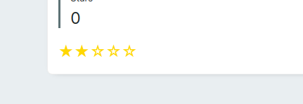

This, however, should only last until the cursor leaves the component, at which point it should revert to the actual value.

The CSS for this component is really simple. The only fun part is that every star has a `:hover` pseudoclass that increases its font size. This is what makes the hover effect work: when you place the mouse cursor over a star, it'll grow slightly larger.

As for the filled vs. hollow stars, that's controlled by the `starFor` computed property. This function takes a number (the index of the star in the component) and returns either an empty star or a filled one. By the way, the stars used are simple Unicode characters, there's no need to use fancy fonts. The characters used are U+2606 White Star (☆) for the inactive stars, and U+2605 Black Star (★) for the active stars.

As for the decision to leave a star filled or empty, that's done by checking the `hovered` state variable. If it's 0 (which means that we're _not_ hovering over any stars), it'll instead use `fields.currentStars`. More on `fields` later, but (very quickly) that's how you get access to what the user has set on the component settings sidebar to the right. That's how we get access to the current number of stars and to the desired (total) number of stars, whether those are hard-coded in the component, or bound to state variables.

### Streamsync-specific interactions

Some parts of the code above (namely the hover interaction that uses the `@mouseenter` and `@mouseleave` events, plus the `hovered = ref(0)` state variable) are plain Vue code. So is the `v-for` loop that renders a specific amount of stars.

The `emitChangeEvent` function that triggers when you click a star, on the other hand, isn't even Vue code. It's plain JS code that uses standard [Web synthetic events](https://developer.mozilla.org/en-US/docs/Web/Events/Creating_and_triggering_events). When you want your custom component to emit an event that the entire Streamsync framework can react to (by running a backend function), you need the root element of your component to emit a synthetic event. That's the purpose of the `rootEl = ref(null)` line in the `<script setup>`: it's [Vue's way of escaping the entire Vue system to get access to a raw DOM element](https://vuejs.org/guide/essentials/template-refs.html). You declare a variable such as `yourRefVarName = ref(null)`, and then link it to a specific HTML element via the `ref="yourRefVarName"` attribute. From there on, you can access [a plain `Element`](https://developer.mozilla.org/en-US/docs/Web/API/Element), on which you [can call `dispatchEvent()`](https://developer.mozilla.org/en-US/docs/Web/API/EventTarget/dispatchEvent).

There are two main parts that are Streamsync-specific: the default export of the `<script>` block, and the `fields` variable.

The default export is, as is usual for Vue, a plain object that describes the component. It may have, for example, `props`. However, for Streamsync, it should have a key `streamsync` whose value [conforms to type `StreamsyncComponentDefinition`](https://github.com/streamsync-cloud/streamsync/blob/0205e4ccc7329d2f55384921a4c8ede941561705/ui/src/streamsyncTypes.ts#L42) (especially if you're using Typescript). That's the only thing that Streamsync looks at. There you define the name of the component, its description, on which category it should appear on the Component Palette, which events it fires, and any configurable parameters.

For the star rating component, we need two configurable params (the total number of stars and the current number of stars, both Numbers) and one event, `ss-number-change`. That's all that Streamsync requires to auto-configure its UI.

### Registering the component

At this point, you can run `npm run custom.dev` [as outlined in the docs](https://www.streamsync.cloud/custom-components.html#developing-templates), alongside with the standalone backend server. However, you won't see your shiny new component yet. You need to register it.

That is done on the `ui/src/custom_components/index.ts` file: import your new component and add it to the default export:

```ts
// ... other imports
import StarRating from './StarRating.vue'

export default {
  // ... other components
  "starrating": StarRating,
}
```

Then, it'll appear in the appropriate section of the component palette. You can now start trying the component out in the context of a Streamsync application.

### Building

Once you're done, you can compile all your custom components [as outlined in the docs](https://www.streamsync.cloud/custom-components.html#bundling-templates) by running `npm run custom.build`. This generates a new folder `ui/custom_components_dist`, inside which there are two files: `templates.umd.js` and `style.css`.

Note that there will _only_ ever be two files, no matter the number of custom components that you're building. In other words, if you're amassing custom components in the same folder, you may want to comment some of them in the `index.ts` file before building. Otherwise, every custom component in that folder, including the example `ChatMessage` components, will be bundled.

To distribute custom components, you'd take those two generated files and drop them in the directory where a Streamsync app lives, inside a directory named `extensions`. From there on, whenever you run `streamsync edit mydirname`, any extensions that live on `mydirname/extensions/*.js` will be loaded and available to the Streamsync editor. Of course, whenever [you run the app](https://www.streamsync.cloud/getting-started.html#run-an-app) (without the editor), it'll also work as expected.

### Testing the rating component

When running a Streamsync editor that has the rating component registered (either by `npm run custom.dev` or by running `streamsync edit` with the compiled JS and CSS files in the correct place), you can add and configure instances of the star rating component:

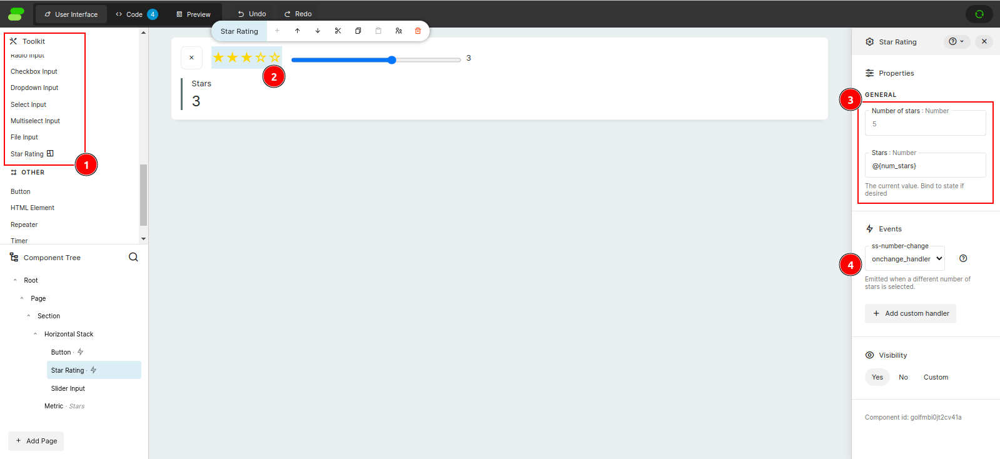

1. At the top left, there's the component in the Toolkit. It's along the other input fields because we specified that it was on the Input category
2. The component behaves just like any other component: you can place it alongisde other components, or even nest it _inside_ other components  (here it's inside a Horizontal Stack)
3. These are the configurable parameters for the component. The total number of stars is unset, so it defaults to 5 (you can see that the number is gray instead of black, indicating a placeholder). The Stars parameter is instead bound to state, since you usually want it to vary (setting a plain number here would cause a read-only component, probably useful for displaying, say, product ratings, as long as you don't want the user to specify his own rating for the product using that same component)
4. Finally, here's the single event that this component emits. It's bound to the `onchange_handler` function, which is on Python

And here's the Python script that powers that application:

```py
import streamsync as ss

def onchange_handler(state, payload):
    print(payload)
    state["num_stars"] = payload
def clear_rating(state):
    state["num_stars"] = 0

initial_state = ss.init_state({
    "num_stars": 1
})
```

It's a fairly simple script, but it demonstrates the main workings: the component renders itself based on the state (since its current value is set to `@{num_stars}`). When one of the stars is clicked, this triggers the `ss-number-change` event on Streamsync. Since that event is bound to the `onchange_handler` Python function, said function is run (on the backend). Since, in turn, that function mutates the state, that causes a component rerender. That approach is similar to [React controlled components](https://legacy.reactjs.org/docs/forms.html#controlled-components), where the component itself doesn't set its own value. Instead, it displays a value that comes From The Outside World (usually from the parent component, here from Streamsync app state), and when it wants to change it fires off an event Towards The Outside World. Someone out there will pick up the event, update the state, and that in turn will trigger a component rerender with the new state.

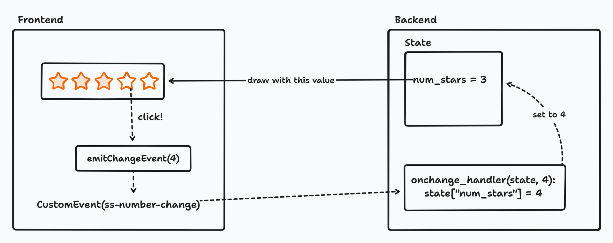

Since we're linking to Streamsync's state, we get inter-component linking for free. In the sample, you may have seen a small button to the left of the star rating component. That button's `ss-click` event is bound to the `clear_rating` Python function, which resets the rating to 0, thereby clearing all stars. Furthermore, the Slider that is at the right of the component also has its value bound to the same `num_stars` state variable, so it updates in sync with the stars. So does the Metric below:

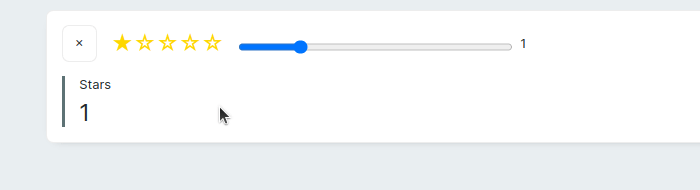

Again, we did nothing special in the rating component to enable such interactions. All we did was to provide a way for the Streamsync application to set the component's value, and a way for the component to notify Streamsync of changes in its value.

Some built-in Streamsync components, particularly the ones that are Inputs (e.g. the text inputs and the number/slider inputs) have a Binding configuration that automatically does the two-way binding that we implemented manually:

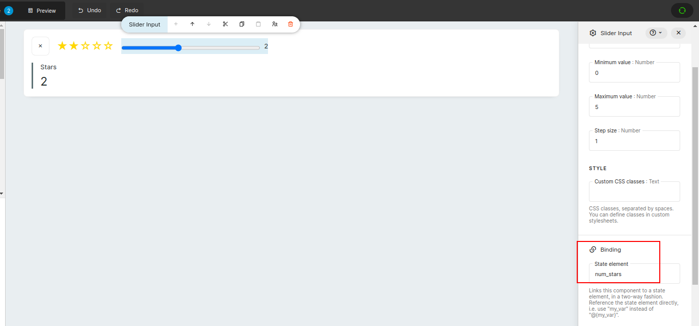

This seems to be in the spirit of Vue, where you're encouraged to use [the `v-model` directive](https://vuejs.org/guide/components/v-model.html) instead of the prop+event model that is common (and encouraged) on React. When you use a Binding, you get both functionalities automatically: when you set the state from somewhere (typically via `state["mystatevar"] = someval` in the BE code), the component will update. And when you make the component change its state, it'll force a state update in the BE, as if you had run `state["mystatevar"] = someval`. However, I couldn't find a way of doing that for custom components, and the way of declaring Bindings for the core components (i.e. those that come with Streamsync) seems to assume that the core element is a plain `<input>` element, which is the case for text inputs, number inputs, sliders and so, but not for our Rating component. That's a minor issue, though.

## Letting the user configure styles

Now, let's say that we want the user to configure styles (CSS) in our custom component. Here, we'll let the user set the color of the stars, perhaps so they blend in better with the rest of the application theme.

That's demonstrated [in the `BubbleMessageAdvanced` custom component](https://github.com/streamsync-cloud/streamsync/blob/master/ui/src/custom_components/BubbleMessageAdvanced.vue), which comes with Streamsync and serves as an example. The following pieces need to be in place for a custom component to accept CSS configurations:

* Style fields must live in the `streamsync.fields` key on the default export, in the same place as the configurable properties live
* You can reuse standard style fields (that map to commonly used CSS properties, such as `background-color` or `text-color`) by importing them from `../renderer/sharedStyleFields`. We'll see an example of that. These properties come preconfigured with a proper name, type and all the configurations that are required so they appear in the correct section in the sidebar
* Alternatively, if you need your own custom properties (that don't map to common CSS properties) you can declare them manually. When doing so, be sure to set the property `category` to `FieldCategory.Style` (this is what places this specific config value in the Style section in the sidebar) and `applyStyleVariable` to `true`. This will cause Streamsync to create a [CSS custom property, AKA variable](https://developer.mozilla.org/en-US/docs/Web/CSS/Using_CSS_custom_properties) and expose it to your component's CSS. There, you can access said variable via `some-prop: var(--yourVarName)`
* Also, in case you need it, you can still access style variables as normal fields, via `fields.someFieldName.value`

```vue
<template>
    <div class="container" ref="rootEl">
        <div class="stars-container">
            <!-- NOTE: the v-for is intentionally misspelled as v_for, since the proper value breaks syntax highlighting really badly -->
            <span class="star" v_for="i in Array(fields.numStars.value).keys()" @mouseenter="hovered = i + 1" @mouseleave="hovered = 0" @click="() => emitChangeEvent(i + 1)">
                {{ starFor(i) }}
            </span>
        </div>
        <!-- THIS IS NEW: Debug so we can demonstrate that style vars are still accessible as normal fields -->
        <small>{{ fields.normalSize.value }} -> {{ fields.hoverSize.value }}</small>
    </div>
</template>

<script lang="ts">
export default {
    streamsync: {
        // ...

        fields: {
            // original two fields stay the same

            // Styles
            accentColor: { ...accentColor, default: "gold" },
            normalSize: {
                name: "Normal size",
                type: FieldType.Text,
                category: FieldCategory.Style,
                applyStyleVariable: true,
                options: { "small": "Small", "normal": "Medium", "large": "Large", "x-large": "Larger", "xx-large": "Largest" },
                default: "x-large",
            },
            hoverSize: {
                name: "Hover size",
                type: FieldType.Text,
                category: FieldCategory.Style,
                applyStyleVariable: true,
                options: { "small": "small", "normal": "normal", "large": "large", "x-large": "x-large", "xx-large": "xx-large" },
                default: "xx-large",
            },
        },

        events: {
            // this stays the same too
        },
    },
};
</script>

<script setup lang="ts">
import { FieldCategory, FieldType } from "../streamsyncTypes";
import injectionKeys from "../injectionKeys";
import { Ref, inject } from "vue";
import { ref } from "vue";

// THIS IS NEW!
import {
    accentColor,
} from "../renderer/sharedStyleFields";


const fields = inject(injectionKeys.evaluatedFields);
const rootEl: Ref<HTMLElement> = ref(null); // Root element is used to fire events
const hovered = ref(0);
function starFor(i) {
    // still the same
}
function emitChangeEvent(i: Number) {
    // still the same
}
</script>

<style scoped>
/* some styles elided */

.star {
    font-size: var(--normalSize);
    color: var(--accentColor);
    cursor: pointer;
}

.star:hover {
    font-size: var(--hoverSize);
}
</style>
```

This code causes our component to look like this:

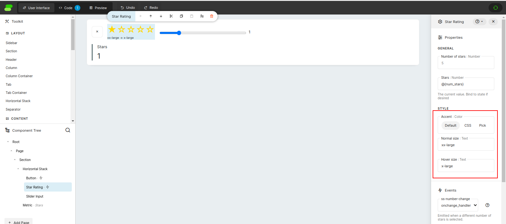

I've highlighted the new configuration values. The Accent, which we use to control the color of the stars, is a built-in Streamsync-provided config. We import it via `import { accentColor } from "../renderer/sharedStyleFields"`, and we then use it in `streamsync.fields`. The only change is that we override its default value (it doesn't provide one by default, so the stars are created as black, and we want the nice gold color). That's done on the `accentColor: { ...accentColor, default: "gold" }` bit, which employs [object spread syntax](https://developer.mozilla.org/en-US/docs/Web/JavaScript/Reference/Operators/Spread_syntax#overriding_properties) to reuse the entire object and override (or, in this case, simply add) a property.

The two properties that control the size of unhovered and hovered stars are manually constructed, since Streamsync doesn't bundle a style property for font sizes. That's done like this (again, inside the `streamsync.fields` property of the component's default export):

```ts
normalSize: {
  name: "Normal size",
  type: FieldType.Text,
  category: FieldCategory.Style,
  applyStyleVariable: true,
  options: { "small": "Small", "normal": "Medium", "large": "Large", "x-large": "Larger", "xx-large": "Largest" },
  default: "x-large",
}
```

The important parts are `category: FieldCategory.Style` and `applyStyleVariable: true`. The `options` can also be used on a plain (non-style) property.

Then, since all of our new style properties inject CSS vars (the `accentColor` property does it by default, as do all the prebuilt properties that can be imported from `../renderer/sharedStyleFields`), we can read them on the CSS rules:

```css
.star {
    font-size: var(--normalSize);
    color: var(--accentColor);
    cursor: pointer;
}

.star:hover {
    font-size: var(--hoverSize);
}
```

From what I understand, the CSS vars have the exact same name as the property names in the `streamsync.fields` object (i.e. the keys).

And now, when you change one of those style variables, the component instantly changes as expected!

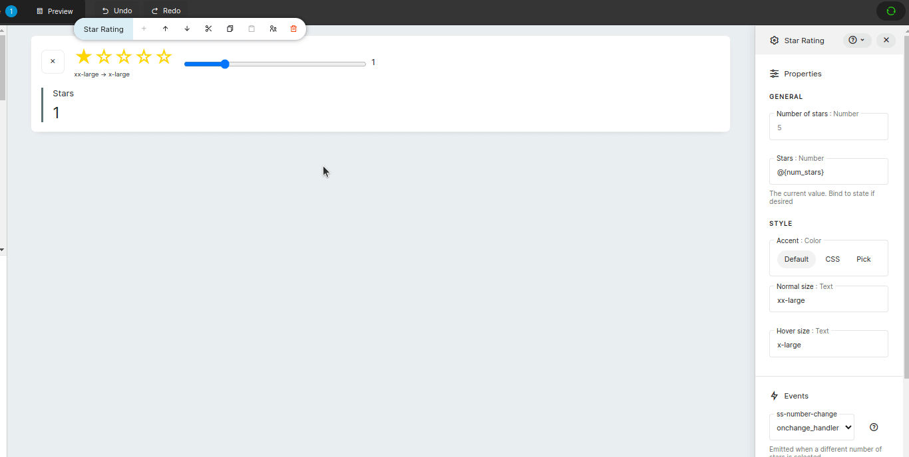

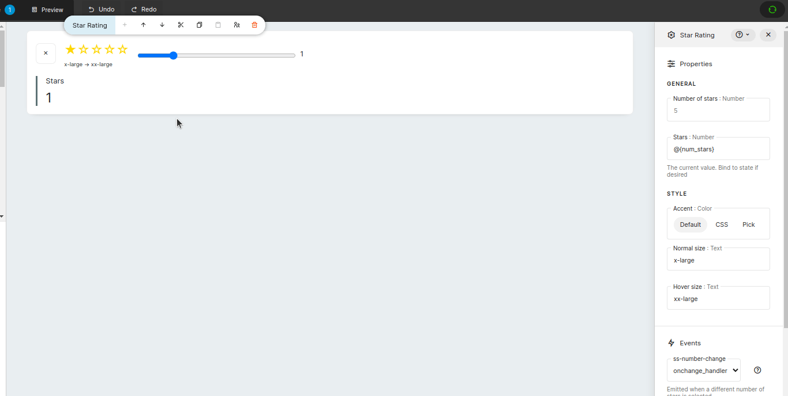

Furthermore, should you also need programmatic (i.e. JS or HTML) access to those style variables, you can still do so via `fields.X.value`, as you do for normal properties. In the last animation we demonstrate that: below the stars there is a `<small>` element which displays the normal size and the hover size. This lets you completely turn off the small grow on hover, by setting both to the same value, or even shrink the hovered star if you wish. It also (colaterally) lets you control the size of the whole component: you could use Small → Medium for a smaller control, or XLarge → XXLarge for a larger control.

## Container custom components

Streamsync also supports building custom components that can act as containers for other components. For example, the Column Container built-in component can have Columns inside, while Columns can contain many other components.

Let's build a simple container. It'll let you place anything inside of it, and it'll let you overlay everything with a layer that prevents interaction and blurs what is below. This is sometimes called a "Loading overlay" and is used when... something is loading. See [some examples](https://gasparesganga.com/labs/jquery-loading-overlay/) [here](https://mantine.dev/core/loading-overlay/).

There are no custom components that demonstrate this, but there are several built-in components that do so. Here we'll use [the Tab container](https://github.com/streamsync-cloud/streamsync/blob/master/ui/src/core_components/CoreTab.vue) as an example, because it's simple enough (the Repeater component would work as well, but it also has to handle repeated rendering, which confuses things). There are a few main changes that must be done to a custom component so it can handle rendering children:

* Use a [Vue default slot](https://vuejs.org/guide/components/slots.html) (i.e. the unnamed `<slot>`) somewhere in the component's template
* Said slot must be wrapped in a `<div>` that has the `data-streamsync-container` attribute
* On the component's config (the `streamsync` field on the default export), you should also set the `allowedChildrenTypes` field, which should contain the names of the (builtin or custom) components that can be inserted inside this one
	* For example, if your component is a generic container that can contain anything, just set that field to `["*"]`
	* Otherwise (for example, a Columns Container can only have... well, columns), specify the keys of the allowed components. For example, Streamsync bundles a custom component called `BubbleMessage`, which represents a single chat-ish message. You could build a `ChatWindow` custom component which only accepted `BubbleMessage`s as children
	* The elements of this array must be, for custom components, keys of the default export in `ui/src/custom_components/index.ts`; or, for built-in components, keys of the `templateMap` variable [in the `ui/src/core/templateMap.ts` file](https://github.com/streamsync-cloud/streamsync/blob/0205e4ccc7329d2f55384921a4c8ede941561705/ui/src/core/templateMap.ts#L43)

That's it. As long as you follow those easy rules, Streamsync should work as expected:

* When you drag an instance of your new container, Streamsync will render it with a gray background that says "Empty &lt;Component Name&gt;"
* Inside that component, you'll be able to add "children" components. They'll appear in the Outline (lower left of the Editor UI) as descendants of the container
* If you've specified a set of components that can be added as children, that'll also appear as help text, in the same way that adding a Tab Container component tells you that "You can add Tab and Repeater components"
* Whatever you drag inside the container will be rendered in place of the `<slot>`, wherever that is placed
* Indeed, you could even completely ignore the default slot and take complete control of what your component renders. The Repeater component does that, since it can't just render its children: it needs to repeatedly generate copies of its children and return all of them. That's a more advanced example, though

Here's the code for a simple loading overlay:

```vue
<template>
    <div data-streamsync-container class="container">
        <!-- NOTE: the v-if is intentionally misspelled as v_if, since the proper value breaks syntax highlighting really badly -->
        <div v_if="fields.loading.value === 'true'" class="overlay">
            <div class="lds-dual-ring center"></div>
        </div>
        <slot></slot>
    </div>
</template>

<script lang="ts">
export default {
    streamsync: {
        name: "Loading Overlay",
        description: "Renders a semi-transparent overlay over other components, and blocks interaction with them.",
        category: "Layout",
        allowedChildrenTypes: ["image"],

        fields: {
            loading: {
                name: "Loading",
                desc: "Whether the overlay will be displayed",
                type: FieldType.Text,
                options: {
                    true: "true",
                    false: "false",
                },
                default: "false"
            },

            // Styling
            containerBackgroundColor: { ...containerBackgroundColor, default: "#a0a0a060" },
            accentColor: { ...accentColor, default: "white" },
            spinnerSize: {
                name: "Spinner size",
                type: FieldType.Text,
                category: FieldCategory.Style,
                applyStyleVariable: true,
                default: "32px",
            }
        },
    },
};
</script>

<script setup lang="ts">
import { FieldCategory, FieldType } from "../streamsyncTypes";
import injectionKeys from "../injectionKeys";
import { inject } from "vue";

import {
    containerBackgroundColor,
    accentColor,
} from "../renderer/sharedStyleFields";


const fields = inject(injectionKeys.evaluatedFields);
</script>

<style scoped>
div.container {
    position: relative;
}

div.overlay {
    position: absolute;
    width: 100%;
    height: 100%;
    background-color: var(--containerBackgroundColor);
}

.center {
    position: absolute;
    top: 50%;
    left: 50%;
    transform: translate(-50%, -50%);
}

/* From here onwards, code comes from https://loading.io/css/ */
/* Code is under CC0, AKA public domain */
.lds-dual-ring {
    --margin: calc(var(--spinnerSize) * 0.125);

    display: inline-block;
    width: calc(var(--spinnerSize) + 2 * var(--margin));
    height: calc(var(--spinnerSize) + 2 * var(--margin));
}

.lds-dual-ring:after {
    content: " ";
    display: block;
    width: var(--spinnerSize);
    height: var(--spinnerSize);
    margin: var(--margin);
    border-radius: 50%;
    border-width: calc(var(--margin) * 0.75);
    border-style: solid;
    border-color: var(--accentColor);
    border-color: var(--accentColor) transparent var(--accentColor) transparent;
    animation: lds-dual-ring 1.2s linear infinite;
}

@keyframes lds-dual-ring {
    0% {
        transform: rotate(0deg);
    }

    100% {
        transform: rotate(360deg);
    }
}
</style>
```

The main `<div>` has two children: another `<div>` that only renders when the overlay must be active (as controlled by a property, which will probably be bound to a state variable) and then the `<slot>` where the children elements will appear. A bit of CSS magic causes the cover `<div>` to be positioned _above_ the children elements, thereby blocking clicks and similar interactions from reaching them.

Then, there's a loading spinner that I found [on Loading.io](https://loading.io/css/). That page provides very simple, CSS-only spinner animations that can be more or less dropped in any HTML code. They're [CC0](https://wiki.creativecommons.org/wiki/CC0) (which means public domain), so no attribution required, but it's still good form to mention the author, probably.

The loader (with some Rating components to fill it) looks like this:

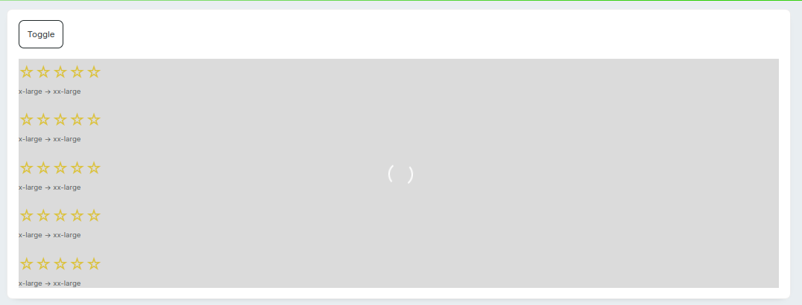

And it spins, exactly as you'd expect it to:

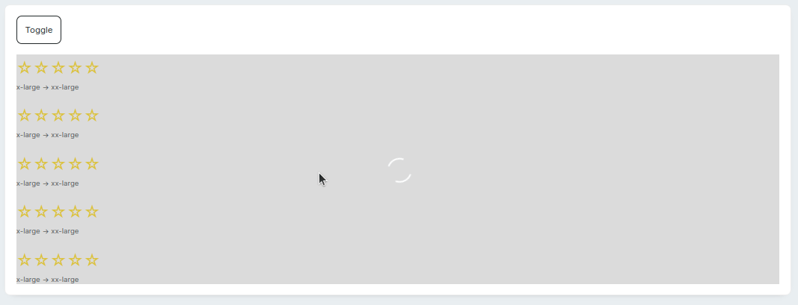

Since we exposed some style variables and we hooked them to the component's CSS, we can also alter its appearance:

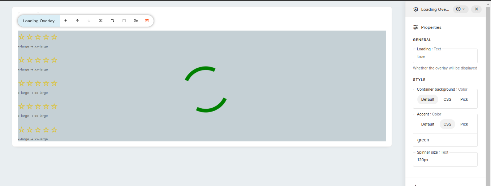

Here I changed the size and the Accent color. Those are passed through to the Loading.io spinner code, and [appropriate `calc()` calls](https://developer.mozilla.org/en-US/docs/Web/CSS/calc) are used so all the dimensions scale appropriately. The default spinner is 64px in size with 8px margin at all sides, thus being 80px in size. I replaced those values with X (configurable) for the size and 0.125\*X for the margin, and now you can scale the entire spinner using a single knob. You can also change the overlay color, though for that you should probably use the CSS option (the Pick option isn't all that useful since it doesn't let you pick semi-transparent colors, only fully opaque ones that don't let you see what is behind the loader).

A tiny bit of extra CSS causes the overlay to blur everything that is behind it, to further reinforce the "loading" idea. Vue also has [built-in support for transitions](https://vuejs.org/guide/built-ins/transition.html), which we can use to make the overlay fade in and out, and also to apply the blur progressively:

```vue
<template>
    <div data-streamsync-container class="container">
        <Transition>
            <div v-if="isLoading" class="overlay">
                <div class="lds-dual-ring center"></div>
            </div>
        </Transition>

        <slot></slot>
    </div>
</template>

<style scoped>
div.overlay {
    backdrop-filter: blur(2px);
}

.v-enter-active {
    transition: opacity 0.5s, backdrop-filter 0.5s;
}

.v-leave-active {
    transition: opacity 0.2s, backdrop-filter 0.2s;
}

.v-enter-from,
.v-leave-to {
    opacity: 0;
    backdrop-filter: blur(0px);
}
</style>
```

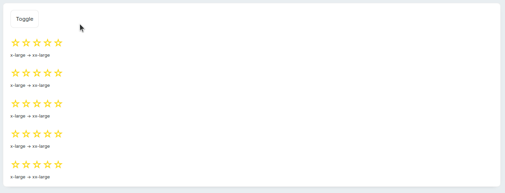

## Components that reuse third-party Vue packages

Now let's see if it's possible to leverage prebuilt Vue packages. You don't see that on Streamsync's built-in components because Streamsync's author [tends to favor not using pre-built UI components](https://github.com/streamsync-cloud/streamsync/discussions/8#discussioncomment-5770991), so as to keep Streamsync lightweight and more cohesive. However, since we're (lazy) third-party users, we'll see how easy it is to include NPM packages.

A component that seems reasonably complex to hand-roll is a "signature pad", on which you can draw a signature using your mouse cursor. [Retool has one](https://retool.com/components/signature-pad). They seem to be used for "PDF signature" apps or somesuch. Does a digital hand-drawn signature hold any value at all? Or are they just for show? I don't really know. In any case, let's add one to Streamsync.

There are a couple of packages that implement a signature pad as a Vue component, one of which is [`vue3-signature`](https://github.com/WangShayne/vue3-signature), which in turn wraps [the `signature_pad` package](https://github.com/szimek/signature_pad). See [a demo here](https://szimek.github.io/signature_pad/). I initially tried to use the Vue component, but it doesn't expose events when the drawn signature changes. The only way to obtain the signature's data is to imperatively call a `save()` method. However, that doesn't really play well with Streamsync: there you expect components to always be up-to-date, instead of imperatively calling a function to extract their current data whenever you're going to, say, save the form. Thus, I had to switch to using the upstream `signature_pad` package, which [does expose events](https://github.com/szimek/signature_pad#events).

To add the package as a dependency, you can run `npm install signature_pad` as normal (in the Streamsync repo's `ui` directory, which is a Javascript project with a `package.json` file). This will add it to Streamsync's dependencies, along with Vue and literally everything that Streamsync's UI requires. This isn't _that_ much code, though, since (as discussed before) Streamsync favors low dependency counts, so we don't have one full dependency for every single built-in component. We'll trust Vite's [tree-shaking](https://www.smashingmagazine.com/2021/05/tree-shaking-reference-guide/) prowess so it only bundles the `signature_pad` code in the final custom component, instead of including every Streamsync dependency.

After verifying on the `package.json` file that the new dependency has indeed been added, we can start building our custom Streamsync component. To do that, we'll reuse [parts of the Vue package](https://github.com/WangShayne/vue3-signature/blob/main/src/components/Vue3Signature.vue) that we found above but couldn't use, taking care to (hopefully) preserve the MIT license that the original code came with. We remove a few parts that we won't use, namely the background image, ability to disable the entire component, and watermarking features, and we also expose [the `endStroke` event](https://github.com/szimek/signature_pad#events), which fires every time the mouse button is released (on PCs) or the user lifts his finger (on mobile). That's a slower-firing event than reporting _every_ stroke update with the `afterUpdateStroke` event, which will probably fire at 60FPS when the user is drawing a signature.

Whenever that event is triggered, we send a Streamsync event which contains a Base64-encoded PNG image. This image can be then saved on a DB, or processed in some way, or just displayed back to the user using an Image component.

```vue
<!-- Parts of this file are Copyright 2023 (?) WangShayne

Permission is hereby granted, free of charge, to any person obtaining a copy of this software and associated documentation files (the “Software”), to deal in the Software without restriction, including without limitation the rights to use, copy, modify, merge, publish, distribute, sublicense, and/or sell copies of the Software, and to permit persons to whom the Software is furnished to do so, subject to the following conditions:

The above copyright notice and this permission notice shall be included in all copies or substantial portions of the Software.

THE SOFTWARE IS PROVIDED “AS IS”, WITHOUT WARRANTY OF ANY KIND, EXPRESS OR IMPLIED, INCLUDING BUT NOT LIMITED TO THE WARRANTIES OF MERCHANTABILITY, FITNESS FOR A PARTICULAR PURPOSE AND NONINFRINGEMENT. IN NO EVENT SHALL THE AUTHORS OR COPYRIGHT HOLDERS BE LIABLE FOR ANY CLAIM, DAMAGES OR OTHER LIABILITY, WHETHER IN AN ACTION OF CONTRACT, TORT OR OTHERWISE, ARISING FROM, OUT OF OR IN CONNECTION WITH THE SOFTWARE OR THE USE OR OTHER DEALINGS IN THE SOFTWARE.

See https://github.com/WangShayne/vue3-signature/blob/main/src/components/Vue3Signature.vue
-->

<template>
    <div class="container" ref="rootEl">
        <div :style="{ width: '100%', height: fields.height.value }" @touchmove.prevent>
            <canvas :id="state.uid" class="canvas" :data-uid="state.uid"></canvas>
            <button title="Clear" class="floating-right clear-button" @click="clear">Clear</button>
        </div>
    </div>
</template>

<script lang="ts">
export default {
    streamsync: {
        name: "Signature Pad",
        description: "Provides a space to hand-draw a signature.",
        category: "Input",

        fields: {
            height: {
                name: "Height",
                desc: "Height of the component",
                type: FieldType.Text,
                default: "400px",
            },

            // Styles
            accentColor: { ...accentColor, default: "black" },
            containerBackgroundColor: { ...containerBackgroundColor, default: "#f8f8f8" },
        },

        events: {
            "signature-change": {
                desc: "Emitted when the drawn signature is changed.",
                stub: `def onchange_handler(state, payload):\n	print(payload)\n	state["current_sig"] = payload`
            },
        },
    },
};

</script>

<script setup lang="ts">
import { FieldCategory, FieldType } from "../streamsyncTypes";
import injectionKeys from "../injectionKeys";
import { Ref, inject, computed, ref, reactive } from "vue";

import SignaturePad from "signature_pad";

import {
    accentColor,
    containerBackgroundColor
} from "../renderer/sharedStyleFields";
import { onMounted } from "vue";


const fields = inject(injectionKeys.evaluatedFields);
const rootEl: Ref<HTMLElement> = ref(null); // Root element is used to fire events

function emitChangeEvent(dataURL: string) {
    const event = new CustomEvent("signature-change", {
        detail: {
            payload: dataURL.replace(/^(data:image\/png;base64,)/, ""),
        },
    });
    rootEl.value.dispatchEvent(event);
}


const options = computed(() => ({ penColor: fields.accentColor.value, backgroundColor: fields.containerBackgroundColor.value }))
let state = reactive({
    sig: null,
    option: options,
    uid: "",
});
state.uid = "canvas" + Math.random();

const draw = () => {
    let canvas = document.getElementById(state.uid) as HTMLCanvasElement;
    state.sig = new SignaturePad(canvas, state.option);

    function resizeCanvas(c: HTMLCanvasElement) {
        // if there were any contents, preserve them before resizing (resizing nukes the Canvas)
        let url;
        if (!state.sig.isEmpty()) {
            url = state.sig.toDataURL();
        }

        // Compute new canvas size and force resize everything
        let ratio = Math.max(window.devicePixelRatio || 1, 1);
        c.width = c.offsetWidth * ratio;
        c.height = fields.height.value.replace(/px/g, "") * ratio;
        c.getContext("2d").scale(ratio, ratio);

        // clear and restore the previous contents, if they existed
        state.sig.clear();
        if (url !== undefined) {
            state.sig.fromDataURL(url);
        };
    }

    window.addEventListener("resize", () => resizeCanvas(canvas));
    resizeCanvas(canvas);

    // Turn on event listeners
    state.sig.addEventListener("endStroke", () => {
        emitChangeEvent(state.sig.toDataURL());
    });
    // hand-emit first event so we get informed of an empty canvas
    emitChangeEvent(state.sig.toDataURL());

    state.sig.on();
};
onMounted(() => draw());

function clear() {
    state.sig?.clear();
    emitChangeEvent(state.sig.toDataURL())
}
</script>

<style scoped>
.container {
    position: relative;
}

.floating-right {
    position: absolute;
    top: 10px;
    right: 10px;
}

.clear-button {
    padding: 5px;
    border-radius: 5px;
    border-width: 0px;
    background-color: transparent;
}

canvas {
    width: 100%;
    height: 100%;
}
</style>
```

The template is quite simple, just a `<div>` with a `<canvas>` and a floating button, anchored to the top right, that lets you clear the signature pad. The canvas is where the signature lives.

We expose configuration parameters for the height of the pad (the width isn't necessary, since you can control it via the parent's width), and two colors: the background and the accent (AKA stroke). We also declare an event `signature-change`, which is the way in which the component can notify Streamsync of a changed signature.

Then, on the TS code, after setting up several variables, we prepare a function `draw()` that will set up the canvas as a signature pad. This comes half from [the `vue3-signature` package](https://github.com/WangShayne/vue3-signature) and half from [the upstream `signature_pad` package](https://github.com/szimek/signature_pad). For example, there we need to handle canvas resizes, which can happen if the user is accessing the page via mobile and rotates the screen. There, we also attach the `endStroke` listener so we can be notified of every finished stroke. Finally, we call that function on component mount.

Here's a test of the component. The first gray box is the actual Signature Pad. As you can see on the Settings sidebar to the right, we've connected the `signature-change` event to a handler function:

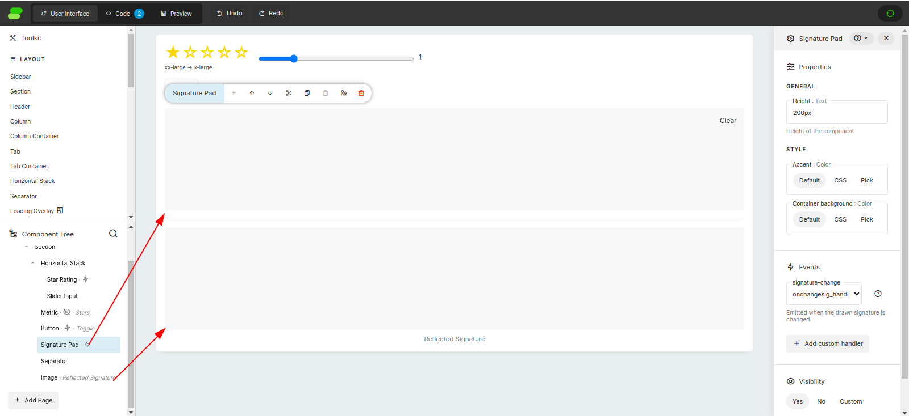

We're using this Python code:

```py
import streamsync as ss

def onchangesig_handler(state, payload):
	print(payload)
	state["sig"] = payload

initial_state = ss.init_state({
    "sig": ""
})
```

As you can see, we're just setting a state variable. This state variable is used by the Image component as its source:

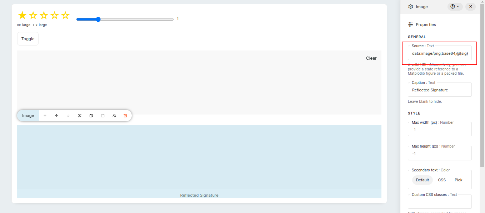

Thus, whenever we finish a stroke, we'll update the `sig` state variable in the Streamsync app, which in turn will cause the Image to update itself. Thus, the Image below will always track the signature pad above, but it won't live-update while we're drawing. It'll only update when we release the mouse button:

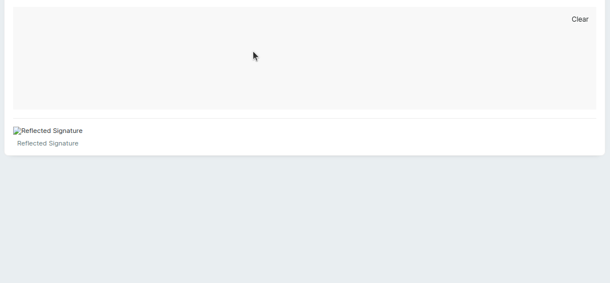

## Components with repeated/variable children

Something that I've required a couple of times is a component that lets you reorder items by dragging-and-dropping them. Something like a Kanban board, but maybe vertically (like the typical To Do application where you can write tasks, check them off and drag them around to reorder them). Retool doesn't have such an item, apparently.

Vue, however, does have several. One that appears to be quite popular is [`SortableJS`'s multi-framework code](https://sortablejs.github.io/Sortable/). Their official Vue port  [is `Vue.Draggable`](https://sortablejs.github.io/Vue.Draggable/#/simple) and [`vue-draggable-next`](https://github.com/SortableJS/vue.draggable.next/) for Vue 3, but the Vue 3 version appears to not be maintained. Other wrappers around SortableJS's implementation are [`SortableJS-vue3`](https://sortablejs-vue3.maxleiter.com/) and [`vue-draggable-plus`](https://github.com/Alfred-Skyblue/vue-draggable-plus). They all provide nice feedback and handles that prompt the user to drag stuff around. We'll use [`SortableJS-vue3`](https://sortablejs-vue3.maxleiter.com/) here.

You use `SortableJS-vue3` like this, sans Streamsync:

```vue
<Sortable
  :list="list"
  :itemKey="itemKey"
  :options="options"
  @choose="(event) => console.log(event)"
  @end="(event) => console.log(event)">
      <template #item="{element, index}">
        <div class="draggable" :key="element.id">
          {{ element.name }}
        </div>
      </template>
</Sortable>
```

You provide a list of elements to iterate over by binding the `:list` prop. Then, as is customary on Vue, you control _how_ each element will be rendered by using the `#item` [named scoped slot](https://vuejs.org/guide/components/slots.html#scoped-slots). Whatever goes inside the `<template #item>` will be repeated as many times as is required to render the draggable list. Inside of that template, you have access to `element` and `index`, which vary for each iteration.

You may have recognized a similar pattern to [Streamsync's Repeater component](https://www.streamsync.cloud/repeater.html). This one takes an object, not a list, but the main idea is the same: you feed it the list of objects and the template for _a single object_, and the component in question takes on the responsibility of rendering your provided template repeatedly, passing it different values each time. In place of the `element` and `index` variables, on a Repeater you have the `itemId` and `item` context variables. Thus, we can use the [Repeater source code](https://github.com/streamsync-cloud/streamsync/blob/master/ui/src/core_components/CoreRepeater.vue) as guidance. This one is more complex than your average node: instead of the `<template>` block of a normal Vue SFC, it uses [the raw `h()` render function](https://vuejs.org/guide/extras/render-function.html#creating-vnodes) to create VNodes. It manually generates the VNodes for every iteration of the Repeater's contents, mashes them all together, and returns a `<div>` that holds all of them.

Our Sortable component is similar, except that I found a way to not use the `h()` function, which was more difficult here because we don't really control the render loop (i.e., we never generate all the child items' HTML). Instead, the `<Sortable>` component does that, and we merely provide a template.

*(NOTE)* This won't work by itself. If you want to test this, be sure to read the final part of this section: you need to make a change on Streamsync's internal code.

```vue
<!-- This file contains code that was adapted from /ui/src/core_components/CoreRepeater.vue
in the Streamsync repo: https://github.com/streamsync-cloud/streamsync/blob/master/ui/src/core_components/CoreRepeater.vue,
which is under the Apache-2.0 license -->

<template>
    <div data-streamsync-container class="container" ref="rootEl">
        <!-- NOTE: the v-if is intentionally misspelled as v_if, since the proper value breaks syntax highlighting really badly -->
        <Sortable v_if="children.length > 0" ref="sortableRef" :list="sortableList" itemKey="__key" :options="options"
            @update="onUpdate" class="container">
            <template #item="{ element, index, key }">
                <div :key="key" class="elem" :data-id="key">
                    <i class="ri-draggable handle"></i>
                    <component :is="() => renderChild(index)" />
                </div>
            </template>
        </Sortable>
        <slot v-else></slot> <!-- This is used when the Repeater has no child elements -->
    </div>
</template>

<script lang="ts">
// Sample object, copied from the Repeater component
const defaultRepeaterObject = {
    a: { desc: "Option A" },
    b: { desc: "Option B" },
};

// Options for the SortableJS component
// https://github.com/SortableJS/Sortable#options
const options = {
    animation: 200,
    handle: ".handle"
}

export default {
    streamsync: {
        name: "Sortable List",
        description: "Renders a list where elements can be drag-and-dropped to reorder them.",
        category: "Layout",
        allowedChildrenTypes: ["inherit"],
        fields: {
            // These three fields MUST have these exact names
            repeaterObject: {
                name: "Repeater object",
                default: JSON.stringify(defaultRepeaterObject, null, 2),
                type: FieldType.Object,
                desc: "Include a state reference to the dictionary used for repeating the child components. Alternatively, specify a JSON object.",
            },
            keyVariable: {
                name: "Key variable name",
                default: "itemId",
                init: "itemId",
                type: FieldType.Text,
                desc: "Set the name of the variable that will store the key of the current repeater object entry.",
            },
            valueVariable: {
                name: "Value variable name",
                default: "item",
                init: "item",
                type: FieldType.Text,
                desc: "Set the name of the variable that will store the value of the current repeater object entry.",
            },
        },
        events: {
            "list-reorder": {
                desc: "Emitted when the list is reordered.",
                stub: `def onreorder_handler(state, payload):\n	print(payload)\n	state["list"] = payload`
            }
        }
    },
};
</script>

<script setup lang="ts">
import { FieldType } from "../streamsyncTypes";
import injectionKeys from "../injectionKeys";
import { inject, computed, ref } from "vue";

import { Sortable } from "sortablejs-vue3"

const sortableRef = ref(null);
const rootEl = ref(null);

// this bit comes directly from the Repeater component's code
const fields = inject(injectionKeys.evaluatedFields);
const ss = inject(injectionKeys.core);
const componentId = inject(injectionKeys.componentId);
const renderProxiedComponent = inject(
    injectionKeys.renderProxiedComponent
);

// Converts the {k: {item}, k: {item}} form into [{__key: k, ...item}, {__key: k, ...item}]
// SortableJS wants an array of items, not an object as the Repeater component does
// We use __k as a magic, hopefully-never-used field name for the key
const sortableList = computed(() => Object.entries(fields.repeaterObject.value).map(([k, v]: [string, any]) => ({ ...v, __key: k })))

// These are all the children of a SINGLE iteration
const children = computed(() => ss.getComponents(componentId, true));

// Returns an array of VNodes, for the i-th iteration of the loop
function renderChild(itemIndex) {
    return children.value.map((childComponent) =>
        renderProxiedComponent(childComponent.id, itemIndex)
    )
}

// Called whenever the Sortable's items change order
function onUpdate() {
    // Returns ['key1', 'key2', ...]
    const newIDs = sortableRef.value.sortable.toArray(); 
	
    // Rebuilds the object in Streamsync's format {key1: {item}, key2: {item}}
    const newObject = Object.fromEntries(newIDs.map(id => [id, fields.repeaterObject.value[id]]))

    // Prepare and emit event
    const event = new CustomEvent("list-reorder", {
        detail: {
            payload: newObject,
        },
    });
    rootEl.value.dispatchEvent(event);
}
</script>

<style scoped>
.container:not(.childless) {
    display: contents;
}

[data-streamsync-container].horizontal .container.childless {
    flex: 1 0 auto;
}

.handle {
    cursor: move;
}

.elem {
    display: flex;
    flex-direction: row;
    column-gap: 10px;
}
</style>
```

As you can see, the `<template>` is fairly similar to the SortableJS example, except that now we can't just hardcode elements inside of the `<template #item>` slot.

Instead, we have to perform tricks with `<component>`s [in order to render VNodes in a template](https://stackoverflow.com/questions/49352525/can-you-render-vnodes-in-a-vue-template). What we render for each element (apart from a small dragging handle) is determined by the `renderChild(itemIndex)` function, which takes an integer (the index of the item) and returns an array of VNodes, which are the result of rendering each child component of the sortable list against that specific index in the list. This replaces every mention of the `@{itemId}` and `@{item}` context vars with their respective values.

There's also an event, `list-reorder`, which is fired by the Streamsync component whenever the list gets rearranged. This is the way in which Streamsync's backend would notice the user's actions.

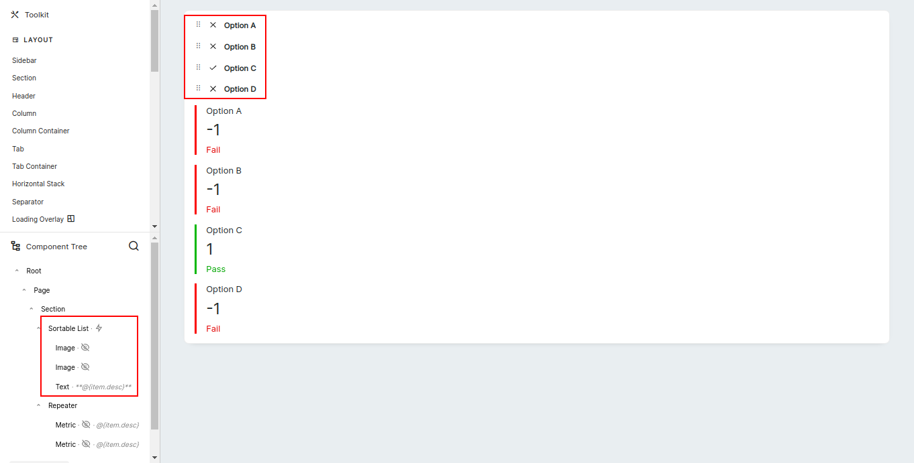

Here's a Sortable List component; it's feeding from a list of to-dos that looks like this:

```json
{
    "a": {"desc": "Option A", "done": false, "notDone": true}, 
    "b": {"desc": "Option B", "done": false, "notDone": true}, 
    "c": {"desc": "Option C", "done": true, "notDone": false}, 
    "d": {"desc": "Option D", "done": false, "notDone": true}
}
```

Notice the `done` and `notDone` boolean vars; they are required so we can display the checks and crosses. This is because Streamsync's templating system, which uses the `@{var}` syntax, has (AFAIK) absolutely zero logic capabilities, so you can't do, for example, `@{!item.done}`. Thus, the Image that contains the check mark has its visibility conditionally bound to `@{item.done}`, while the Image that contains the X only shows when `@{item.notDone}`.

Below the sortable list, there's a plain Repeater component that uses Metrics. It's bound to the same state var as the Sortable List, so they're always kept in sync. It uses the same trick (two similar Metrics, with their visibility bound to `item.done` and `item.notDone`) to show red Metric cards for not-done items, and green Metric cards for done items.

In action, the Sortable List component looks like this:

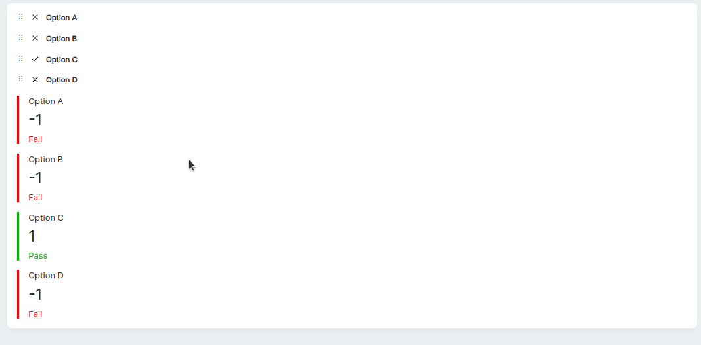

Notice how the Metric cards are always kept in sync with the dragged items. This is because the Sortable List component has its `list-reorder` event bound to this function:

```py
def onreorder_handler(state, payload):
	state["todos"] = payload
```

and the Repeater component hooks to `@{todos}`.

A word of caution: If you copy the component's code and use it in your own Streamsync instance, you'll find that it doesn't work. It'll render the (repeatd) child components alright, but you won't be able to use the `@{itemId}` and `@{item}` context vars.

I eventually traced the problem down to [the `useTemplateEvaluator` function](https://github.com/streamsync-cloud/streamsync/blob/0205e4ccc7329d2f55384921a4c8ede941561705/ui/src/renderer/useTemplateEvaluator.ts#L4) deep inside Steampipe's code. As you can see, [shortly after starting it explicitly checks for `repeater` components](https://github.com/streamsync-cloud/streamsync/blob/0205e4ccc7329d2f55384921a4c8ede941561705/ui/src/renderer/useTemplateEvaluator.ts#L14), exiting otherwise. Only if the component is a Repeater does it provide the `itemId` and `item` variables to the context, which is what causes the error. I solved it the brute-force way, by adding another condition for my own custom component:

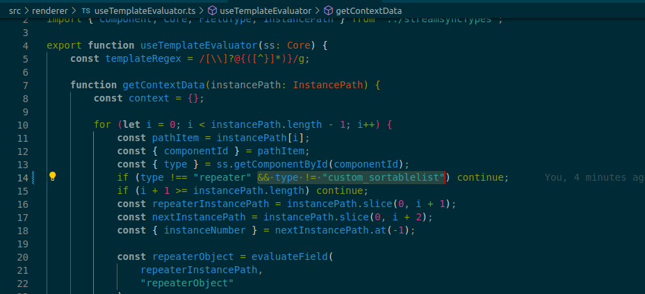

But I'm completely aware that that is not a proper solution. Perhaps the correct solution would lie on treating every component that has the `repeaterObject` field as a Repeater-like component that must also have its context populated? I don't know. Besides, this is presumably a fairly niche use-case, so...

## Recap

* Streamsync is a Python+Vue framework to visually develop web applications. It's less configurable than rolling everything yourself, but in return you may get a very large boost in ease of use, since a lot of scaffolding and piping is already done for you, not to mention an event system, a drag-and-drop editor, and many useful components that you can use as building blocks
* Recently, Streamsync added support for custom components, which are Vue components that can implement additional UI elements. These custom components, once installed, are first-class citizens that behave exactly as Streamsync's built-in components: they can be placed in UIs, they can be hooked up to state, and they emit events
* A Streamsync custom component is conceptually similar to (and implemented in terms of) a Vue component. The main differences are:
	* You need to provide a `streamsync` field in the default export of the Vue component (when using the Composition API). That field will hold all Streamsync-specific config, such as the component's name, description, where it should go on the component palette, which fields can be configured on the Streamsync editor and which events it'll emit
	* You won't use [props](https://vuejs.org/guide/components/props.html#props-declaration) to provide data input to the component, but the `fields` [injected property](https://vuejs.org/guide/components/provide-inject.html). It's an object with reactive values that behaves just as an object with [reactive `ref()` state variables](https://vuejs.org/guide/essentials/reactivity-fundamentals.html#declaring-reactive-state-1) as values
	* You won't emit events using Vue's [`$emit` system](https://vuejs.org/guide/components/events.html). Instead, you'll emit [plain DOM `CustomEvent`s](https://developer.mozilla.org/en-US/docs/Web/Events/Creating_and_triggering_events#adding_custom_data_%E2%80%93_customevent) from the component's root element, for which you'll need to have [a `ref` to it](https://vuejs.org/guide/essentials/template-refs.html#template-refs)
* I've found the feedback loop to be plenty good enough when developing Streamsync components: Vite's hot reloading is very good, and normally it'll reload the components in the time that it takes you to Alt-tab to the browser window. You don't lose component state when doing so, either. This all results in a very fast feedback loop. Streamsync also makes it very easy to stand up a "test harness" app that you can fill with whatever components you need, so you don't have to perform gymnastics to test your component. Once you're done, you can compile it and copy the files to the Streamsync applications that need said component
* It's possible to use third-party NPM packages, such as prebuilt Vue components. Doing so is a matter of just `npm install`ing the required packages and using them in your own custom components. I've verified that Vite only includes what is required in the compiled components
* Streamsync custom components get access to many of Streamsync's internals, such as the ability to declare _inside of which_ other components they can exist (such as Column components that only exist inside of Column Container components).
* It's possible to declare "container" components that can accept other components inside of them. For example, Streamsync bundles a Tabs container that can have several Tab components, each of which can in turn have arbitrary UI inside of it. The same goes for layout components such as Sections and Columns. This same functionality is available to custom components
* Building Repeater-like components (i.e. components where you get to repeatedly render Streamsync components, using the `@{item}` context variable) isn't currently possible, since there's a hard-coded check for the Repeater component type, so no other component types will get the `itemId` and `item` context vars populated
* While to develop custom components you need to have the entire Streamsync UI repo available, you can compile your custom components to a distributable form composed of a CSS file and a JS file. Those two files can be dropped into a Streamsync project created by `streamsync create`, in the `extensions/` directory, where they'll be picked up and served. This lets you build self-contained applications that bundle their code and any non-first-party components
