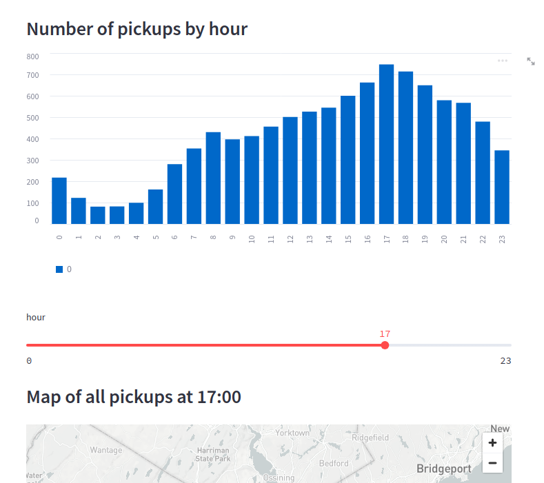

In this article, we'll review [Streamsync](https://www.streamsync.cloud/), a (young) framework that lets you create interactive web applications backed by Python code. We'll compare it with some desktop UI frameworks, and also with Streamlit, which has been [specifically called out by Streamsync's author](https://www.reddit.com/r/Python/comments/135i584/streamsync_ui_editor_python/) as both an inspiration and a... competitor? alternative? Whatever, it's all in good fun.

## Introduction

The tool's catchphrase is "No-code in the front, Python in the back". Their one-line description is "An open-source framework for creating data apps". Indeed, that's what they do: you declare the UI by drag-and-dropping widgets (called [Components](https://www.streamsync.cloud/component-list.html)), such as containers (sidebar, tabs, horizontal/vertical layouts), text, images, stat charts, input fields (for text, numbers, dates, slider, files), buttons and more. This is similar to web development.

Then, for the backend, you get a Python script. Said script will have functions that can be called when events happen in the FE, such as a button being clicked or a textfield's content changing. In this respect, it's similar to your average SPA's `onClick`/`onChange` handlers, except that the latter only run in the FE, and you'd need to, say, make an AJAX call to the BE to report that the action happened. Here, the communication is transparent and events that happen in the FE cause BE handlers to run, no questions asked or further JSON serialization+deserialization required (on your part!)

Now, once you have BE code running on user actions, you can do whatever you wish. Save data to a DB? Send an email? Call external APIs? Save the user's uploaded file to disk? It's all fair game.

To close the circle, every _session_ (i.e., roughly every browser tab that is open to the server) has _state_. This is reminiscent of state management libraries for SPAs, such as [Redux](https://react-redux.js.org/) or [Vue's Pinia](https://pinia.vuejs.org/). Unlike your garden-variety component-scoped state, these libraries (and Streamsync) hold "global" state, which is accessed and mutated from everywhere. This reduces complexity, since you only have to think about one state store, at the cost of some code potentially changing all of your state. Don't do that.

This state can be mutated by event handlers (which, remember, run as Python code in the context of the BE). The FE, meanwhile, holds references to pieces of the state (such as a text label declaring that its contents are `Hello, @{name}`). Whenever the `name` state field changes, Streamsync triggers a rerender (in much the same way as React would) which changes the displayed text, or other properties (color, visibility, and so on)

Confused yet? Consider a simple web form that takes some input from the user and then sends it to a remote system (think of some sort of "survey system" à la Google Forms, where anyone can submit a response):


The FE will have two text fields, plus a Submit button. Also, just to demonstrate state, we'll include a header that greets the user (as a variable!)

Observe the green arrows. Whenever the user types something in the text fields, a handler will trigger (we'll have to configure it beforehand on each text field, otherwise it'd just change its input and do nothing of interest). This handler will be set up so it mutates the _state_, which is shared across the FE and BE (but, crucially, is isolated across sessions, which are different users or browser tabs). Mutating the state will, in turn, cause the FE to rerender its contents, thus making the greeting reflect whatever is set in the Username text field.

Now, observe the red arrows for the "submit form" flow. The Submit button should have been configured so it invokes the `onClick` function when it's clicked (obviously). At that point, we can read the state (which is available on every handler function that runs in the BE), extract whatever state we want, and perform whatever action we want with it, such as saving it on a DB or making an API call to an external service (such as a REST API). Maybe we'd want to reset the state, so that the form fields are cleared, ready for another form submission.

And that's it! We have a functional form.

## Origin story

The tool's author, [Ramiro Medina](https://github.com/ramedina86), has published [a Medium article where he presents the tool](https://medium.com/@ramiromedina/streamsync-like-streamlit-but-faster-and-with-a-visual-ui-editor-9f98ad17adf). Go read it, it's not long at all.

I'll extract some important snippets from the article below:

> Streamsync is a new open-source framework for creating data apps. It allows you to build the user interface using a visual editor, while retaining the power of Python in the backend.
>
> Why a visual user interface editor?
> There are many advantages, if executed well.
> * A visual editor lets you focus on the logic of your application — keeping things neat and the codebase small.
> * Complex layouts become trivial to build and maintain, while remaining independent from the logic.
> * Instant visual feedback allows you to create better interfaces

So, it came to life as a faster alternative to Streamlit, along with a completely different model for designing the UI. It's confirmed to borrow concepts from modern frontend frameworks, of which The Big Three use state to define the UI.

## Discussion

What have we gained by using Streamsync, as opposed to, say, a normal SPA built in React + a backend built in Python too?

As far as I can tell, the main selling point is that it's *much* more integrated. Communications across the network boundary are invisible to you, which is no small feat. Instead of having to make API calls, waiting for the response and parsing it, you rely on The Magical State Store, which is always up to date. You use that state store to render the UI, both for content  (i.e. the contents of labels, tables and images) and configuration (i.e. whether or not a certain element is active or visible).

This is the "declarative" part: the UI is defined in terms of a state, so you only think in terms of "how does the UI look when the state is X?" If the state changes, the entire UI is rerendered (at least conceptually, Streamsync may make optimizations). This approach was pioneered by React and is also used by Vue and [Svelte](https://svelte.dev/docs#template-syntax), at least.

Again, any FE framework will have some sort of global state library: [Redux](https://redux.js.org/) works for React, [Vuex now Pinia](https://pinia.vuejs.org/) is used in Vue, and [NgRx](https://ngrx.io/) is used on Angular. And that's only the official(ish) libraries. However, the difference with Streamsync's state is that these libraries only work in-browser, and it's still your job to sync them with the backend. And whenever you need your backend to do anything, you'll still need to send an API call with the parameters, which most likely come from state. Sreamsync, by contrast, doesn't need it: the state is already available to the BE!

## Comparison with desktop GUI toolkits

### Windows Forms applications

I have no idea how many people have worked with [Windows Forms](https://learn.microsoft.com/en-us/visualstudio/ide/create-csharp-winform-visual-studio) applications. I know I have (in fact, that's how I started programming... with Visual Basic. Don't judge). Apparently it hasn't died yet, and the tutorial's screenshots have the telltale Windows 11 rounded corners (those of Visual Studio, not those of the developed application, which really screams Windows 7 to me, for some reason).

Windows Forms is a really old way of developing GUI applications for Windows. There' also WinUI, WPF and UWP, all of which are (AFAIK) more modern, yet Windows Forms lives on.

Basically, here's how you develop a Windows Forms application:

You open the visual editor, where you'll be greeted by a blank screen:


You select a Button and drag it to the window:


You double-click the button so that it generates a handler (now in C# code):


Inside that handler, you can do operations. For example, here the click handler imperatively sets a Label's text.

So, the jumping between a visual editor for defining the UI, and code for the event handlers, is quite similar between Streamsync and Windows Forms. However, the similarities end there. Windows Forms is imperative, and thus any changes to the UI are explicitly performed by getting a handle to the specific widget (UI control) and changing its properties: `lblHelloWorld.Text = "Hello " + txtUsername.Text`, for example.

### The big one: Qt

#### Widget-based Qt

[Qt](https://www.qt.io/) is a really popular, multi-OS GUI toolkit (among other things). It's also cross-language: though its main language is C++, it has bindings for [Python](https://riverbankcomputing.com/software/pyqt/intro), [Java](https://wiki.qt.io/Qt_Jambi), [(maybe) C#](https://doc.qt.io/qt-6/activeqt-dotnet.html), and probably more.

Writing a Qt program that is based on widgets is quite similar to doing so in Windows Forms:

You start from an empty window, and you drag-and-drop components:


You select the button, choose its `clicked()` signal (i.e. the event), and create a _slot_ (i.e. a function, otherwise known as an event handler). From now on, whenever the signal is triggered, the slot gets called.

However, much like Windows Forms, the handler functions are imperative. There's no state from which the UI pulls its data. Instead, to change something, you go directly to the appropriate widget, and set its properties.

#### QML

QML is another way of developing Qt-based applications. Instead of visually designing the UI, you use a text-based language:

```
ApplicationWindow {
    id: window
    width: 400
    height: 500
    visible: true
	
    ListView {
        id: alarmListView
        anchors.fill: parent
        model: AlarmModel {}
        delegate: AlarmDelegate {}
    }
	
    RoundButton {
        id: addAlarmButton
        text: "+"
        anchors.bottom: alarmListView.bottom
        anchors.bottomMargin: 8
        anchors.horizontalCenter: parent.horizontalCenter
        onClicked: alarmListView.model.append({
            "hour": 6,
            "minute": 0,
        })
    }
}
```


So, the UI declaration is different here: you use text to instantiate UI widgets. However, the state management is different here: the part of the UI that lists the alarms (the `ListView` item) simply references a `model` property, which is the state. The `RoundButton` below, which adds a new alarm (here on a specific time, for ease of explanation) accesses that state and adds a new element to it. Nowhere in the code is there a `alarmListView.addChildren(new SingleAlarm(...))` or something similar (in other words, nothing explicitly adds a new Widget to the alarm list). Instead, the handler code changes the model/state, and the list view rerenders in response.

So, this is similar to Streamsync in the other way: the UI design is different, but the "declarative" approach is similar.

## Comparison with other "low-code" app designers

There's a certain flourishing market for ["low-code"/"no-code" tools](https://www.computerworld.com/article/3658908/how-low-code-tools-are-filling-a-void-caused-by-the-great-resignation.html), which can (at least in theory) enable more people to create apps, without requiring a full developer (or a team thereof). 

Inside the entire low-code umbrella, there's a sector dedicated to UIs for internal tools. See [this article](https://uibakery.io/retool-alternatives) for a list of tools and nice screenshots of each. They all look similar: the center of the screen is a view of your app, where you can click on widgets, drag them around and resize them. On a side, there's a Properties window where you can configure the selected widget (set the text for a label, the text and color for a button, the data for a table, and so on). They also have ways of fetching data from remote APIs and of reacting to events triggered by the widgets (clicks on buttons, changes on form fields, selecting a row in a table, ...)

This is Retool:


This is Tooljet:


Both have the under-development UI in the center, and the Properties dialog to the right.

Streamsync is similar to such tools, in that it gives you an interactive UI editor on which you can drop widgets, a Properties dialog to configure the widgets, and a templating language for dynamic data interpolation.

However, no low-code tools that I know (with the possible exception of [Windmill](https://www.windmill.dev/), which I haven't explored yet) let you directly declare a backend in Python, from where you can call other services which may not be available to the user.

Consider, for example, accessing a SQL DB. You probably don't want the raw SQL port to be exposed to the world, so you need to wrap it in something. Probably a REST API, where you can implement access control, pagination, filtering and more. 

* A standard server-side framework (Django? Laravel? Rails? Spring Web? .NET Core?) would solve this by defining views (in HTML + whatever templating language the framework uses) and controllers (code in whichever backend language the framework uses). The controllers would connect to the DB, and thus you'd only establish connections from the trusted application server, subject to whichever access controls and business logic you deem appropriate
* If developing an SPA (with Vue, React or Angular), you'd need to implement a REST API (which is somewhat like a server-side framework but with only controllers, no views). These controllers would again connect to the DB
* Then there's server-side-rendered applications, which are a mix of both. Take [NextJS](https://nextjs.org/) for an example, which [I've been using lately](https://jreyesr.github.io/categories/nextjs/). Using the App Router, you may use [Server Actions](https://nextjs.org/docs/app/building-your-application/data-fetching/server-actions), which encapsulate API calls. Some functions would run in the context of the client, while others (marked with `use server`) would run in the backend Node server. Only the latter functions would be able to access the database

Streamsync's handlers are similar to [NextJS's Server Actions](https://nextjs.org/docs/app/building-your-application/data-fetching/server-actions), in that they happen automatically. You simply write some code and know that it will run on the server, not on the client. This code can access locked-down servers (where the origin IP has nbeem firewalled so only the application server can initiate a connection), refer to secret API keys and more, since it'll never be exposed to the client. Furthermore, if you implement data validation/sanitization, rate limits, access control, audit/logging or similar concerns in the server-side handlers, they can't be bypassed by a malicious client.

## Potential problems, downsides, missing stuff

Now let's talk about the cons of Streamsync:

* It's missing many UI widgets, which you may need. Compare [Streamsync's component list](https://www.streamsync.cloud/component-list.html) (34 elements) with [Retool's library](https://retool.com/components/) (95 components). For instance, Streamsync doesn't have a Password field. Or a multi-select dropdown. Or a color picker. Or a collapse/accordion. Or a progress bar (neither linear nor circular). And so on.
* The provided widgets lack many properties. Again, this means that fine-grained configuration may not be possible. For example, consider the humble text field:
	* In Streamsync, it has two configurable properties: `Label` and `Placeholder`.
	* In Retool, it has _over thirty_ properties: see [this page](https://retool.com/components/text-input), and search for the Properties header. Autocompletion. Enabled/disabled. Readonly. Icons (both before and after the content). Label, and its alignment. Hint/help text. Loading indicator. Min/max length. A regex pattern. Placeholder. A count of characters (à la Twitter). A Clear button. Spellchecking. Prefix/suffix text. Tooltips. Custom validation text
* There's no authentication UI. It may be possible, as [you can read cookies](https://www.streamsync.cloud/sessions.html), and you may be able to set them, thus (hopefully) letting you set a cookie after authenticating the user. However, Streamsync doesn't help you there. You're on your own, and the whole point of using a framework is that it reduces work

## Comparison with Streamlit

I suspect some relation between [Streamlit](https://streamlit.io/) and Streamsync, and not only because their names have a Levenshtein distance of 4:

* They both describe themselves as a way to create "data apps"
* They're both written in Python
* They both _love_ to include Pandas and AI-type stuff in their docs and examples
* Their conceptual model is quite similar, with Python functions working as event handlers and a per-session state

Read [this article](https://towardsdatascience.com/coding-ml-tools-like-you-code-ml-models-ddba3357eace) for an explanation of how Streamlit came to be:

> In my experience, every nontrivial machine learning project is eventually stitched together with bug-ridden and unmaintainable internal tools. These tools — often a patchwork of Jupyter Notebooks and Flask apps — are difficult to deploy, require reasoning about client-server architecture, and don’t integrate well with machine learning constructs like Tensorflow GPU sessions.

The main point is that, for anything where people usually employ Jupyter notebooks, there's no clear path from that to a usable tool (something that non-Jupyter people can interact with). Rerunning a notebook after changing a variable is _not_ a production way of running a neural-network predictor. You need to have a nice text field where someone inputs a string and, boom, you get a category out. No Jupyter.

This is what Streamlit (and also Streamsync) can do. The `onChange` handler (or `onClick` for a button, if the operation is expensive) can just&trade; have Python code that calls whatever magic AI model you have. The user sees his nice text field, where once he types text, he waits for a bit and then sees a result below.

Unlike Streamsync, Streamlit [defines its UI in code too](https://docs.streamlit.io/library/get-started/create-an-app). Some function calls translate to widgets, and they appear in the page in the order that they were called in the script. This is easier, but also less flexible.

## Comparison with NiceGUI

[NiceGUI](https://nicegui.io/) is another tool, which I found mentioned as a potential alternative to `/Stream(sync|lit)/`.

It seems to come from the IoT world, where you usually have a Raspberry Pi running Python scripts, connected to temperature sensors, relays and such fun stuff. You want to have a dashboard where you can see the state of sensors and execute actions. And you want to do that from your smartphone, so no connecting a mouse, keyboard and display to the Raspberry.

NiceGUI gives you that dashboard.

For example, consider [this example](https://nicegui.io/#common_ui_elements):


It's a bunch of controls, defined in code, along with their respective event handlers. For example, when the Button is clicked, a lambda function is called, which pops up a toast-like notification. When the checkbox is toggled, a standalone function is called. And so on.

NiceGUI is similar to Streamlit in that the layout of the UI is defined purely in code. Even nested layouts (e.g. main container holds a Columns container which holds three Rows, the first of which holds a Label) is handled in code, via [Python's context managers](https://realpython.com/python-with-statement/), which is a _seriously elegant_ way of handling things: context managers are inherently hierarchical, since they open a new scope, and layouts are usually hierarchical too (if in doubt, see HTML).

Unlike Streamlit, the mental model doesn't emphasize rerunning the entire script on changes. You can instead think of the Python file as running once (to generate the UI) and then staying alive so that event handlers can be called when required. In this respect, it is similar to Streamsync (which we'll explore in detail below), which also declares event handlers in code. However, Streamsync _doesn't_ declare its UI in code, instead using a [graphical builder](https://www.streamsync.cloud/builder-basics.html). This is a different approach, so choose the one that fits you better.

## Demo

We'll now run a few tests with Streamsync, taken from other, similar tools that we have reviewed above. Trying to replicate other tools' functionality will give us a (hopefully) neutral comparison.

### The expected usecase, a "data app"

Streamlit has a step-by-step tutorial on [creating a small webapp to explore a Uber dataset](https://docs.streamlit.io/library/get-started/create-an-app), where you can see rides in NY, each with a timestamp. From there, the app plots a count grouped by hour of day, and a map of all rides requested in a specific hour of the day. The hour used on the map is configured by the user, using a slider:



Not too difficult, but it will help us get acquainted with Streamsync's workflow.

By default, Streamsync creates this UI:


1. This is the "widget palette", from where you can drag-and-drop new UI controls, such as text fields, buttons, layout helpers (horizontal or vertical containers, for example) and more
2. This is the "Component Tree", a hierarchical representation of the app's components. The DOM, if you will. Here we can see every container, down to the leaf items. Perfect for hoisting an item outside of a container
3. This is the actual page. As you can see on the tree (2), we have the Metric element selected, which is the Counter with a value of 26
4. These are the settings for the currently selected component (the Metric). For instance, for a metric you can set its title, value, subtitle, some colors and visibility (this one you can't see, it's beyond the scrollport)
5. These buttons let you switch views. We are on the User Interface view, where you edit the UI. There's a Code view, which pops up a [Monaco-based](https://microsoft.github.io/monaco-editor/) code editor (the same one that powers VS Code, so you're in good company there), on which you can edit the "backend" code. You also get a Log window, on which you can monitor the application logs (i.e. anything passed to `print()` calls). Finally, the Preview view hides all edit UI and gives you a read-only view, the same one that final users will use and interact with

Okay, now time to add the actual UI: a barchart plotting the amount of rides, bucketed by hour of the day, a slider to choose a single hour, and a map that displays the location of rides requested in that specific hour.

First, here's the UI:


There's almost no configuration required: the Slider is configured so its range is 0 to 23, with a step of 1; it's bound to the state element `hod` and its `ss-number-change` event is bound to the `recalculate` listener. The first plot (the bar chart) is bound to the `@{plotly_bars}` state element (the map), while the second is bound to `@{plotly_map}`

This code then implements the backend functionality:

```py
import streamsync as ss
import pandas as pd
import numpy as np
from matplotlib import pyplot as plt

import datetime

DATE_COLUMN = 'date/time'
DATA_URL = ('https://s3-us-west-2.amazonaws.com/'
            'streamlit-demo-data/uber-raw-data-sep14.csv.gz')

def _load_data(nrows):
    data = pd.read_csv(DATA_URL, nrows=nrows)
    lowercase = lambda x: str(x).lower()
    data.rename(lowercase, axis='columns', inplace=True)
    data[DATE_COLUMN] = pd.to_datetime(data[DATE_COLUMN])#.map(datetime.datetime.isoformat)
    return data

data = _load_data(10000)

def data_for_hour(hr):
    import plotly.express as px

    filtered_data = data[data[DATE_COLUMN].dt.hour == hr]
    fig = px.density_mapbox(filtered_data, lat="lat", lon="lon",
        zoom=8, height=300,
        radius=10,
        mapbox_style="open-street-map")
    fig.update_layout(margin={"r":0,"t":0,"l":0,"b":0})
    return fig

def bars_for_hour(hr):
    import plotly.express as px

    new_data = data.copy()
    new_data[DATE_COLUMN] = new_data[DATE_COLUMN].map(lambda x: x.hour)

    # manually set a different color on the current hour
    color_discrete_sequence = ['#ec7c34']*24
    color_discrete_sequence[int(hr)] = '#609cd4'

    hist = pd.DataFrame(data={"x": np.arange(24), "count": np.histogram(new_data[DATE_COLUMN], bins=np.arange(25))[0]})
    
    fig = px.bar(hist, x="x", y="count",
        color=hist.x.map(str),
        color_discrete_sequence=color_discrete_sequence,
    )
    fig.update_layout(showlegend=False, autosize=True)
    return fig

# Event handler on change of the slider
def recalculate(state):
    state["plotly_map"] = data_for_hour(state["hod"])
    state["plotly_bars"] = bars_for_hour(state["hod"])

initial_state = ss.init_state({
    "hod": 17,
    "plotly_map": data_for_hour(17),
    "plotly_bars": bars_for_hour(17),
})
```

Some highlights of the code above:

* The `_load_data` function is perfectly normal Pandas code that reads the dataset
*  `data_for_hour` and `bars_for_hour` are plain Python functions that, accessing the `data` global variable (not ideal, but it could be refactored easily), prepare [Plotly](https://plotly.com/python/) figures
	*  `data_for_hour` prepares a [heatmap](https://plotly.com/python/mapbox-density-heatmaps/), only taking into account a certain hour of the day (that's the `filtered_data` declaration at the start of the function)
	*  `bars_for_hour` prepares your perfectly standard [bar chart](https://plotly.com/python/bar-charts/), but it fiddles with the color declaration to ensure that the currently selected hour is highlighted in a different color
*  Then there's the `recalculate` function, which we declared in the UI as an event handler for the Slider's change event.
	*  This function is called whenever the Slider gets... well, slid
	*  It receives the new state of the application (_after_ the change has been applied!)
	*  It also can receive the _payload_ (the new slider value), but we don't use it here since we don't need it: since we have also bound the slider's value to state, we can just read the state
	*  The function simply reads the hour of day from state, calls the two functions that generate figures, and saves those figures in other state keys
	*  Internally, Streamsync has support for serializing Plotly figure objects (which are normal, albeit complex, Python objects) into Plotly's [JSON representation](https://plotly.com/chart-studio-help/json-chart-schema/). Plotly is special among plotting/chart libraries in that it defines a JSON representation for every chart. This lets you, say, generate charts with the Python library and plot them in the JS library (indeed, that is _exactly_ what is done here!)
*  Finally, there's the initial state

With that, we have a fully interactive chart:


Nice, huh?

Remarks, comparing to Streamlit's code:

* UI declaration is definitely different. In Streamlit, you can only generate widgets in sequence, and they are presumably laid down vertically, one after the other. Streamsync does have the ability to create complex layouts, with nested horizontal and vertical containers, dividers, collapsible columns (with relative weights), sidebars, tab containers and more
* Caching is invisible: if you use a global variable, it's implicitly cached _inside a single session!_. In Streamlit, on the other hand, you use explicit `@st.cache_data` decorators (this is a consequence of Streamlit rerunning the entire script whenever an event is received: you need to mark some functions as memoizable). I haven't explored caching across sessions: for example, here, it's perfectly fine for the raw dataset to be shared across users
* Matplotlib is not too fun, since it gets rendered to a PNG file and therefore you lose interactivity. Plotly is better (see GIF above!). I haven't tested Vega
* Big plus for [two-way bindings](https://www.streamsync.cloud/handling-inputs.html#two-way-bindings). The alternative would be having to wire boring onChange events for every input control, which [React recommends](https://blog.logrocket.com/controlled-vs-uncontrolled-components-in-react/), but it's boilerplate and I don't like it
* Overall, very good first impressions. It's fairly similar to Streamlit, and where it differs it offers a better experience (UI layout, easier caching)

### A form to collect user feedback

Now we start getting away from the common "data app" scenario (something that reads an online dataset with Pandas and then starts slicing, aggregating and displaying different views of said data). We now want a form where we can collect user feedback after something (maybe an online course, and you finish it with a slide that says "go here to rate the course!")

The feedback form will ask for:

* Input fields for the user's name (required) and email (optional)
* A checkbox to ask whether "we can contact you with further questions", which only shows up if the user has provided an email
* A text box where the user can provide his feedback, in multiple lines (no HTML though!)
* A button to submit the form

This will let us test several things:

* How much support is there for [HTML form elements](https://developer.mozilla.org/en-US/docs/Web/HTML/Element/input)?
* Can fields be marked as required and conditionally shown? This could be the foundation for nicely dynamic forms
* Can text fields be validated? (see the email field)
* What can we do on submit? Can we notify the user that his submission was successful? Can we clear the form? Can we send a REST request to some external system, from the safety of the backend?
* What about failures? Can we disable the Submit button when some validations are failing? Can we notify the user if the form submission failed? Can we highlight the fields that had errors?

Here's my final result:


And here's the code:

```py
import streamsync as ss

# Called when the Submit button clicked
def handle_button_click(state):
    if state["name_not_exists"] or state["is_invalid_email"]:
        state.add_notification("error", "Can't submit", "Please correct the errors before submitting")
    else:
        state.add_notification("success", "Success!", "Your feedback was submitted successfully")
        print(state)

        # now reset the state
        state["name"] = ""
        onchange_name(state, "")
        state["email"] = ""
        onchange_email(state, "")
        state["further_contact"] = []
        state["feedback"] = ""

# Called when the Name field changes
def onchange_name(state, payload):
    state["name_not_exists"] = not payload
    
# Called when the Email field changes
def onchange_email(state, payload):
    state["show_further_contact"] = bool(payload)
    
    # Naive email validation, just for show
    # Empty email is considered valid, so the error msg does not appear
    import re
    state["is_invalid_email"] = payload and not re.fullmatch(r"[^@]+@[^@]+\.[^@]+", payload)

initial_state = ss.init_state({
    "name": "",
    "email": "",
    "further_contact": [],
    "feedback": "",

    # Computed properties
    "show_further_contact": False,
    "is_invalid_email": False,
    "name_not_exists": True
})
```

The main data fields (name, email, the checkbox for further contact, the comment box) are bound to state variables. Validation rules are implemented as boolean state variables which cause error messages to appear. These validation flags are recomputed whenever their source data changes, which is implemented via change event listeners on those fields.

For instance, there is an error message that pops up whenever you haven't provided a name. This error message's visibility is controlled by the `name_not_exists` state variable, and is true by default, since an empty form does _not_ have a name. A listener on the Name input field updates that flag by setting it to `not payload` (truthiness rules in Python state that, for strings, an empty string is falsy and anything else is... true-y? This means that only the empty string will cause the error message to be displayed)

Finally, `handle_button_click` is called on form submission. This checks the validation flags and, if any of them is set, displays an error message and aborts. Otherwise, we can read the form's contents from `state` (here we print them, but you can absolutely imagine saving them to a DB or making an API call), then we reset the form by manually clearing the state and calling the on-change event handlers (since they are what keeps the computed properties up-to-date). The form is thus reset and ready for another round of feedback.

Finally, here's the form in action:


There's a successful submission and a failed submission in that GIF.

Observations:

* Simple forms are easy: you just create the fields, bind them to state, and then add a Submit button where you read out that state
* However, anything beyond the simplest forms starts getting complicated:
	* Conditional visibility requires creating a "computed variable" in state that is True or False. While Streamsync does provide [a way to dynamically change the visibility of an element](https://www.streamsync.cloud/builder-basics.html#visibility), AFAICT it only supports direct state variables. This means that you can't, say, condition the visibility of an error message on `@{email == ""}`: you need to condition it on `@{emailEmpty}` and keep that variable synced in your Python code. This is what the `onChange` listeners do: they keep boolean visibility flags synced with the main form state. This smells like it would lead to a _lot_ of boilerplate
	* There's no direct way to mark form fields as required. You need to treat it as another validation rule and thus get into the problems mentioned just above
	* There's no way to disable a button and thus prevent the user from submitting an invalid form. Sure, your BE must also apply validation rules (you _never_ rely on the FE!), but still. I solved it here by using notifications, but that's an after-the-fact thing
* While we didn't test it, it's absolutely possible to dynamically fill dropdowns. The [dropdown input](https://www.streamsync.cloud/component-list.html#Input) can take a JSON input which can come from state, and which you can fill with anything: DB entries? The currently-active items taken from whatever API you are using? The contents of a file? That's some extra points there, in the quest for dynamic forms
* You can upload files, thus enabling workflows where a user submits a file (or many!) for background processing
* The available form fields are quite sparse, compared with [Retool's offer](https://retool.com/components/editable-text). For example, there isn't a Rating component, multiselect (though you can use checkbox groups instead), time/hour picker (though there is a date picker, just no time), color picker, file dropzone (though there is the plain file picker), microphone input (though there is a webcam, just no audio), signature area (though I am not sure of how useful that is on desktop). That's what I see from scrolling down Retool's list of input widgets. Sure, Retool is a much, _much_ larger player, so the comparison is not fair, but that's the competition in the form-builder space
* The [push-like notifications](https://www.streamsync.cloud/backend-initiated-actions.html#adding-a-notification) are quite nice, giving you a way to provide feedback to the user whenever backend actions succeed (or fail). While we didn't explore it, you an also initiate navigation, either to [an entirely different site, in a new tab](https://www.streamsync.cloud/backend-initiated-actions.html#opening-a-url), or to [another page of the same application](https://www.streamsync.cloud/page-routes.html#backend-triggered-page-changes) (yes, there are multi-page apps in Streamsync!)

All in all, Streamsync is quite serviceable, albeit sometimes verbose, for building forms for data-entry or workflow-triggering purposes.

### User management

Finally, we'll copy (parts of) [Retool's starter tutorial](https://docs.retool.com/docs/retool-fundamentals), where you build "a web app that allows you to perform common user management actions. These actions include editing user information, like name and email addresses, and blocking and unblocking users." Try their demo [here](https://docs.retool.com/docs/retool-fundamentals#what-youll-build).

Note that, despite that description, it's not possible to edit user information, AFAICT.

Retool provides [a way to generate dummy APIs](https://retool.com/api-generator/), where you can generate a perfectly boring "Users API", which lets you list all users, get details of a user, create a new user, edit or delete a user. We'll just use the List and Update endpoints, the former to populate the table, and the latter to activate/deactivate them.

Then, we need to create a table that displays all users. Retool's [Table component](https://retool.com/components/table-new) is _extremely_ capable, probably since their target usecase is building internal apps, many of which would require access to DBs or similar data sources, which can be displayed very clearly on tables. Streamsync's table, on the other hand, is quite barebones: Streamsync being mostly a "data apps" framework, you'd mostly use tables to display a sample of a Pandas dataframe, just to spot-check the data, so it hasn't been prioritized as much. We see the same in Streamlit.

Anyways, since we don't have a Pandas dataframe but a list of JSON objects that come from the mock Retool API, we need to first transform it to the appropriate format, so the Streamsync UI can display it (as if it were a Pandas DF):


```py
import os
from typing import Any

import streamsync as ss
from dotenv import load_dotenv
import httpx # This is sometimes pulled in by FastAPI

load_dotenv()  # now the contents of .env are available on os.environ/os.getenv
client = httpx.Client(base_url=os.environ["API_URL"]) # Could also add auth details here, if they existed!

def to_df_json(d: list[dict[str, Any]], id_col: str):
    """
    Converts a standard list-of-dicts into the same format as a JSONified Pandas DF,
    so that the Streamsync DataFrame widget can display it
    
    >>> to_df_json([{"id": 1, "name": "jane"}, {"id": 2, "name": "john"}])
    {"data": {"name": {"1": "jane", "2": "john"}}, "metadata": {}}
    """
    cols = d[0].keys()
    return {
        "data": {c: {
            str(el[id_col]): el[c] for el in d
        } for c in cols if c != id_col},
        "metadata": {},
    }

def get_all_users() -> list[dict[str, Any]]:
    """Fetches all users from the remote API"""
    return client.get("/").json()

# Initial state
ss.init_state({
    "users": to_df_json(get_all_users(), "id")
})
```

The state only contains a `users` key, which is filled with the results of a call to the Retool API, transformed so it matches the format of [Pandas's `DataFrame.to_dict()` function call](https://pandas.pydata.org/docs/reference/api/pandas.DataFrame.to_dict.html), to be precise in the (default) `orient="dict"` orientation, [as can be seen by the lack of an explicit parameter here](https://github.com/streamsync-cloud/streamsync/blob/da90bf7cd72e0c08176b8a3029a284a34137f021/src/streamsync/core.py#L119-L123). In other words, this set of users:

```json
[
   {
      "id":1,
      "name":"jane"
   },
   {
      "id":2,
      "name":"john"
   }
]
```

becomes the following Pandas-like document:

```json
{
   "data":{
      "name":{
         "1":"jane",
         "2":"john"
      }
   },
   "metadata":{}
}
```

It pivots the data so that every column is displayed in a different object, indexed by ID.

Once we have satisfied the demands of the DataFrame UI widget, we can display the data, as we saw in the screenshot above, by binding its contents to the state variable `users`.

And sadly, that's as far as we can go with the DataFrame/table UI widget. It's a from-scratch component, recently added, mostly as a starting point, and it just doesn't support all the functions that a fully-fledged data grid would: sorting. Pagination (server-side and client-side). Filtering (ditto). Rearranging columns by dragging them. Computed columns. Fancy displays ("this column contains an image/five-star-based rating/chips/clickable links"). Row selection (single- and multi-row). Action buttons that act upon the selected records. Frozen/pinned rows/columns. All of that is just not implemented. Again, not an issue for data apps where you probably want to focus on plots and other visualizations, not on the raw data, but now we're testing some sort of "internal tool", AKA backoffice management, AKA what every customer support person has open in his computer when you call the company's support line, so they can see your data, previous purchases, and from where they can activate your product that for some reason wasn't activated previously and is the reason you had to call in the first place. For such internal tools, we really want powerful data tables, and as of right now that is not available.

Note, however, that [the author is aware of that](https://github.com/streamsync-cloud/streamsync/discussions/8). A Github discussion is open where a contributor provides some alternatives of prebuilt data grid libraries, and Streamsync's author replies:

> Regarding next steps, I'll be working on a custom data grid as I also want to support sorting, interactions (e.g. select a row, trigger event) and edition. I want it to be light and highly coupled to Streamsync (events, styles, etc) so I'm not considering external libraries for this purpose. This is a priority and I expect to be part of 0.2.

Okay, nice. Sorting, row selection, events when a row is selected, edition (resumaby inline?). Cool. Put that in the watchlist.

And during all of that, we don't have a way of implementing our user (de-)activation tutorial from Retool. We'll have to work harder for it.

Streamsync also provides a [Repeater component](https://www.streamsync.cloud/repeater.html) which is "similar to a `for each` construct.". That means that you design how a single item will look, and then you provide the repeater with a list of items, and _then_ every item is used to render a copy of whatever component was a child of the Repeater.

Web application developers will no doubt recognize this pattern. In particular, in Vue (which is what Streamsync uses for its FE), here's [how you render a list](https://vuejs.org/guide/essentials/list.html):

```vue
<template>
  <li v-for="item in items">
    {{ item.message }}
  </li>
</template>

<script>
  const items = ref([{ message: 'Foo' }, { message: 'Bar' }])
</script>
```

So, the `items` in the script are the list that will be iterated over, the `li` element with a `v-for` attribute is the Repeater, and the `li` element with all its contents will be repeated as many times as there are elements in the `items` array.

In the case of Streamsync, the following code:

```py
import os
from typing import Any

import streamsync as ss
from dotenv import load_dotenv
import httpx # This is sometimes pulled in by FastAPI

load_dotenv()  # now the contents of .env are available on os.environ/os.getenv
client = httpx.Client(base_url=os.environ["API_URL"]) # Could also add auth details here, if they existed!

def get_all_users() -> list[dict[str, Any]]:
    """Fetches all users from the remote API"""
    return client.get("/").json()

# Initial state
ss.init_state({
    "users": {str(u["id"]): u for u in get_all_users()}
})
```

can create the following UI:


There's a Repeater component (see the component tree at the bottom left) which contains a HTML Element, which in turn contains a Text component. The HTML element is there just to add the light red background to each element, you can ignore it.

The Repeater is configured so that:

* It takes its data from the `@{users}` state variable
* The key of each item is available as `@{itemId}` inside the repeater
* The value of each item is available as `@{item}`

Then, as you can see in the blue and green boxes respectively, the Text component has value `@{itemId} -> @{item}`, which renders the text that you see on the light red boxes.

Something that I found different between Streamsync and every other tool that I have used that provides element repetition: Streamsync expects the data source to be **a JSON object (dictionary in Python)**, not an array/list. Everyone else expects an array instead and iteration is a simple matter of running over the array. Streamsync's approach is... slightly odd. This is because, in general, objects/dicts don't have their order guaranteed, and sometimes you may want objects to preserve their order when shown. On Python 3.7+, [dictionaries are ordered according to insertion order](https://docs.python.org/3/whatsnew/3.7.html#other-language-changes), as per [a ruling from Python's Benevolent Dictator For Life](https://mail.python.org/pipermail/python-dev/2017-December/151283.html). On JS, meanwhile, [iteration order for objects is also fixed](https://developer.mozilla.org/en-US/docs/Web/JavaScript/Reference/Statements/for...in#description): "string keys [will be traversed] in ascending chronological order of property creation" (AFAICT, olders keys first, which matches Python). In other words, if you use modern versions of Python and JS, you should be able to control order by inserting keys in the Python dict in a certain order, which will cause them to be serialized in the JSON string in the same order, which in turn will mean that the JSON will be deserialized (in JS) in that same order, which _in turn_ will cause the JS object's keys to be created in the same order, which will mean that JS iteration will also respect that order. You'll just have to remember to convert every array into a dictionary first.

Absent official docs on the matter, I may have an idea on why Streamsync's author decided to require Repeaters to receive a dict. For optimization reasons (especially when rendering large lists with stateful child components) [Vue requires every object to have a unique key](https://vuejs.org/guide/essentials/list.html#maintaining-state-with-key). Other FE frameworks, such as React, [require the same](https://react.dev/learn/rendering-lists#keeping-list-items-in-order-with-key).

However, a plain array doesn't really have keys to use:

```json
[
   {"id":1, "name":"jane"},
   {"id":2, "name":"john"}
]
```

Sure, we can see that `id` is probably a stable, unique DB key, hence a good candidate for a FE key, but the code cannot know that. Here, however, there _is_ a unique key:

```json
{
   "1": {"id":1, "name":"jane"},
   "2": {"id":2, "name":"john"}
}
```

So I suspect that's why Streamsync requires you to provide a dictionary: keys are guaranteed to exist. 

Now, having resolved that small matter, we can try to display the data that would normally go in a table: the user's name, email, blocked/unblocked status, and (since we can't rely on the selected item on a table to block/unblock the currently selected user) an action button for every user:


```py
import os
from typing import Any

import streamsync as ss
from dotenv import load_dotenv
import httpx # This is sometimes pulled in by FastAPI

load_dotenv()  # now the contents of .env are available on os.environ/os.getenv
client = httpx.Client(base_url=os.environ["API_URL"]) # Could also add auth details here, if they existed!

def action_clicked(state, payload, context):
    current_user = context["item"]
    print(current_user)
    print("Toggling user", current_user["id"])
    # Call the REST API
    
    get_all_users() # Refresh the users, if the REST API worked...

def get_all_users() -> list[dict[str, Any]]:
    """Fetches all users from the remote API"""
    return client.get("/").json()

def prepare_users(users: list[dict[str, Any]]) -> dict[str, dict[str, Any]]:
    return {str(u["id"]): u | {"action": "Unblock" if u["blocked"] else "Block"} for u in users}


# Initial state
ss.init_state({
    "users": prepare_users(get_all_users())
})
```

The header is a manually-created Column, which is outside the Repeater. The action button has text which depends on whether the user is blocked (it says Unblock) or unblocked (it says Block). We need to do it this way, since (as covered above) Streamsync's expression language can't do conditions (such as `item.blocked ? "Unblock" : "Block"`): we need the text to come from the BE. That's done in the `prepare_users` function in the BE.

A couple of things to note:

* I tried to make the user's status be a nice icon, instead of just `true`/`false`, by adding two Image components to the second-to-last column, and setting [conditional visibility](https://www.streamsync.cloud/builder-basics.html#visibility) on them. However, that didn't work, and I'm not really sure why. Setting breakpoints on the (compiled) Vue code points to a bug, since the context is `undefined`... which it shouldn't be
* **No longer valid, see just below** ~~The buttons don't work. We can hook up a handler function to them alright, and link it to the `click` event, but click events on buttons have no payload and thus there is no way of detecting (in the BE) which of the buttons was clicked, hence no way of detecting which user's status should be toggled, and to what (active or inactive). And I'm not sure what could be changed to make it work. We would need a way to provide arbitrary parameters to event handlers, which could access the current context (to work inside Repeaters). Ideally, the handler function should get access to the `@{item}` variable, since that's where the user's data is.~~
* **UPDATE 2023-07-25**: Initially I didn't find a way to access the per-iteration context, so as to make the buttons block/unblock the user to which they belong. Turns out I'm blind. [Event handlers that run from a Repeater get access to a `context` parameter which holds the item that existed in that iteration of the Repeater](https://www.streamsync.cloud/repeater.html#event-context). This means that you can make all the Buttons point to the same `action_clicked` handler, and inside of the handler you know:
    * that you're toggling a user's state, because you are in that specific function handler
    * the user for whom you're toggling the state, by reading it from `context["item"]`
    
    That should be enough for you to perform whatever action you need to perform on that specific item. This is very good, since it lets Streamsync implement those typical CRUD-y UIs where you have several records on which you want to perform actions. For example, a typical Retool example is a table with user orders (assume you have an e-commerce site), and the application would let a service representative refund an order, by clicking a "Refund" button beside that order. By leveraging the `context` parameter, Streamsync can suport those kinds of UI.

Observations: ~~For this specific usecase, Streamsync has been found quite lacking. Repeaters are a really nice idea, but accessing the per-item context is simply not possible in the BE, hence there's no way to perform actions on a single item.~~ Streamsync is capable of passing the iterator variable to event handlers that are triggered from components that are wrapped in Repeaters, which lets you perform actions (such as button clicks) that are scoped to a single resource in the repeater. The really basic table component I'm not counting as a negative, since the author is aware of it and working to add more functionality to it.

## Recap

If you find yourself having to constantly develop small(ish) UIs, consider giving Streamsync a try. Especially if, for example:

* Those UIs are mostly CRUD-y interfaces, which are usually not fun or challenging to write, yet take a lot of time
* Those UIs are internal tools, where it's OK if the buttons' corner radius doesn't follow your strict brand guidelines. ~~However, in this case, give it a really careful look before committing to using Streamsync, since you could then find yourself needing to do something which just isn't possible (see my last example above: there's no way to display a list of users, taken from an API, each with an action button that performs an action on _that specific_ user)~~
* Those UIs are for data apps (the canonical example is anything to do with [Pandas](https://pandas.pydata.org/), [Matplotlib](https://matplotlib.org/) or AI libraries like [Tensorflow](https://www.tensorflow.org/)). If you usually work with Jupyter notebooks, you know that they don't work well to present results in a simple-to-use web application. Consider using Streamsync or [Streamlit](https://streamlit.io/)
* You have an already-working process in Python, which (say) runs on a schedule via Cron. Now (because of course they would) someone asks you for a way of triggering the automatic process on-demand, perhaps supplying some parameters. Kind of [FaaS/Lambda Functions](https://www.cloudflare.com/learning/serverless/glossary/function-as-a-service-faas/), AKA "microservices where the micro- part has been taken to the extreme", except instead of being triggered via POST calls, people want a nice UI to do it. Streamsync should be quite capable of providing you with a simple form with text fields and a Start button that calls a Python function, from which you can trigger whatever you'd usually do on script startup.

Don't use Streamsync if:

* Your BE is not written in Python (duh)
* You require absolute control over the UI. Animations? CSS levels of styling? Nested layouts (like [those that NextJS affords](https://nextjs.org/docs/app/building-your-application/routing/pages-and-layouts#nesting-layouts))? Forget about it, just go for a standard REST API with a SPA. However, then you're on the hook for connecting those two pieces
* Your application is not primarily a REST API + a UI to access said API: for example, it's a message-queue based system, or it's mostly triggered by webhooks sent by external systems or DB changes, or it's a batch-processing script that runs unsupervised
	* Note that you may still find use for Streamsync in these examples:
	* Message-queue- or webhook-based systems can benefit from a read-only UI where you can check messages as they are received
	* Scheduled/unsupervised scripts may also benefit from a UI to trigger them out-of-schedule, view the results of the last executions or download generated files)
* You need forms with very complex, interdependent fields

## Alternatives

Just for the sake of completeness, here are some alternatives that I have found while reading Streamsync material:

* For "data apps", i.e. interactive visualizations of data, probably using Pandas and some sort of plotting library (Matplotlib, Seaborn, Plotly, Vega, whatever)
	* [Streamlit](https://streamlit.io/), the OG library
	* [Plotly Dash](https://dash.plotly.com/). This one I haven't used at all, it's absolutely aimed at dataviz. I have read some comments to the effect that it gets really nasty really quickly (once you start needing anything more than a list of plots)
* For simple web applications, what Retool calls "internal tools":
	* For reference, here "internal tools" is used in the sense of (in the words of Appsmith): "Organizations build internal applications (also known as admin tools or internal tools) such as dashboards, database GUIs, admin panels, approval apps, customer support tools, and more to help their teams perform specific tasks"
	* [Retool](https://retool.com/), of course. Chock-full of features, has an open source version but some functions (such as isolated Editor and Viewer UIs, for goodness sake) are paywalled, so...
	* [Tooljet](https://www.tooljet.com/) is, AFAICS from their docs, _extremely_ similar to Retool with regards to the mental model used: there's Queries, Components, you use a very similar language to bind query data to Component properties, there are event handlers on Components, and so on. A quick perusal of [their available components](https://docs.tooljet.com/docs/widgets/overview) points to their component offer being quite similar to Retool's
	* [Appsmith](https://www.appsmith.com/) also looks very similar to Retool (and, by transitivity, to Tooljet). Ditto for the available components
	* [Windmill](https://www.windmill.dev/) is multi-language (TS, Python, Go, Bash). Beware differences in languages. It's supposed to be fully open-source (all other tools above are open-core with some features gated behind subscription plans, usually per-user and per-month). Unlike the three tools above, it heavily emphasizes the idea of "giving a UI to a script" (our usecase of "making a Cron-triggered script now be triggerable on-demand, with user-provided args" above). Consider using it for that usecase, though it also seems to work plenty fine for "internal apps" where you access disparate APIs to pull data, then select some of it to view details, or execute actions over that data. It also sports a low-code [workflow editor](https://docs.windmill.dev/docs/flows/editor_components) in the spirit of [Zapier](https://zapier.com/) and [N8N](https://n8n.io/) (more like the latter, because it allows for branches, unlike Zapier's more linear Zap structure). Take a read at [their usecases](https://docs.windmill.dev/docs/misc/note_of_intent#use-cases) if you want to see if they think they could solve your specific problem
	* [Pynecone](https://pynecone.io/) is more like Streamlit/Streamsync, in that it emphasizes "writing your entire app in Python", both FE and BE. The tools above use visual editors for the FE and there's no defined BE, just scattered configuration (Windmill is somewhat different, as it tends to coalesce bits of functionality into [Scripts](https://docs.windmill.dev/docs/getting_started/scripts_quickstart/python), but it's still not a single file for the BE). Unlike Streamsync (like Streamlit), the UI is also defined in code, which is... a departure from all other tools, and perhaps not as intuitive. Like Streamsync, the State is explicitly named, rather than being composed of all variables in scope of the script. Similarly, event handlers are explicitly named. It's [mentioned by Streamsync's author](https://www.reddit.com/r/Python/comments/135i584/comment/jir8wf4/) as an alternative "if you're a backend developer working alone, you can't be bothered learning TypeScript and you have an obscure idea that cannot be implemented using out-of-the-box components". You are suposed to be able to [wrap React components](https://pynecone.io/docs/advanced-guide/wrapping-react), in case you need an escape hatch into custom UI interactions. I see a lot of promise in this tool
	* [NiceGUI](https://nicegui.io) comes from the IoT dashboard-y world, plus switches to turn on your smart house's lights (you _do_ have a smart house, right?) UI is also defined in code, as with Pynecone, but using context managers instead of nested function calls (potentially neater). I'm unsure of its applicability to general "internal apps" workloads, so do your own research before committing to it. The Streamsync author [warns against it for complex usecases](https://www.reddit.com/r/Python/comments/135i584/comment/jim3a70), since "layout, style and logic [are] all mushed together". And I can see where that comes from, looking at some NiceGUI demos
	* All of these (except _maybe_ Windmill) support multi-page apps, in case you need it (think of a page that lists all Users and another that displays details of a single user, plus an additional page with a form to create a new user)
