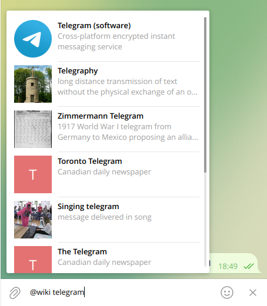

In this post, we'll take a look at Telegram and its bot capabilities, with special attention to the different interaction patterns that it supports. We'll start basic, with unidirectional bots that merely send data, and by the end of the article we'll have built (somewhat) arbitrary web apps that can communicate back and forth with a proper server-side application, all in the context of Telegram.

This entire article assumes that you're building an application, perhaps a web application, though (say) headless server-side applications, embedded/IoT programs, random scripts and other application patterns may also benefit from the described capabilities.

Oh, and also, Merry Christmas! This article should come out very close to it.

## Introduction

Telegram (<https://telegram.org/>) is a messaging application, both for person-to-person communication and for group chats. It's similar in features and purpose to WhatsApp, which is the current world leader by _a lot_. You may have heard of it, though [its user base seems to be quite a bit smaller than that of WhatsApp](https://engage.sinch.com/blog/most-popular-messaging-apps-in-the-world) (800 million users vs. 2K million users, respectively).

While it isn't more popular than WhatsApp in almost any country in the world, Telegram seems to be quite popular [in the IoT/home automation space](https://www.hackster.io/news/how-to-set-up-home-automation-through-the-telegram-messenger-app-8551d6f493a1), or at least that's where I've seen it used a lot. That may be because, unlike WhatsApp (where API usage is gated behind [WhatsApp for Business](https://business.whatsapp.com/products/business-platform)), Telegram's API [is fully open](https://core.telegram.org/api) and free to use, with only rate limits in place presumably to protect against abuse. This, combined with the fact that creating a Telegram account is also free and very easy to do (unlike, say, hosting a Slack workspace), means that many open source projects (again, I've seen this a lot in IoT/domotics) like to add Telegram integration whenever a notification/alerting/user interaction solution is needed. It's very low effort (comparatively) and the API is really powerful.

Telegram's UI is plenty similar to that of other apps such as WhatsApp and Signal: a list of chats, every chat has a list of messages rendered as sequential chat bubbles (most recent at the bottom), a short (usually single-line unless expanded) text field at the bottom to type a new message. It has stickers, emoji, typing indicators, voice messages, Stories (like Snapchat and Instagram Stories, and Whatsapp's Status), file uploads, and all the usual stuff. It [employs a homemade cryptography protocol](https://core.telegram.org/techfaq#q-why-did-you-go-for-a-custom-protocol), called MTProto, which has (AFAICT) separate encryption schemes for a) normal person-to-person chats and group chats, which are encrypted against external observers (e.g. ISPs and governments), but not necessarily against Telegram itself; and b) Secret Chats, which are end-to-end encrypted.

Today we'll take a look specifically at Telegram's [Bot API](https://core.telegram.org/api#bot-api), which is used to build... well, bots, exactly as you would expect. There's an entirely separate API, [TDLib](https://core.telegram.org/api#tdlib--build-your-own-telegram), which you could use (and [others have already used, indeed](https://github.com/UnigramDev/Unigram)) to build entirely new and customized Telegram clients. Like, _whole applications_. Want to access Telegram [from the Linux shell](https://github.com/paul-nameless/tg)? There's a CLI program for that. [Web apps](https://evgeny-nadymov.github.io/telegram-react/)? The same.  Want to [dump all of your messages into a CSV or JSON file](https://github.com/Kosat/telegram-messages-dump), unlike WhatsApp's [weird exports](https://mobiletrans.wondershare.com/whatsapp/export-whatsapp-chats-to-pc.html)[^1]? Go for it. There are [bots that can do moderation tasks, like on Twitch or Discord](https://chatkeeper.app/). And so on, for all sorts of potentially useful scenarios. Today we'll only look at the Bot API, through which applications can a) control bots so they perform actions (e.g. post messages) and b) receive updates that the bot can see (e.g. a message in a group where the bot has been added, a direct message from a user to the bot, or maybe a user clicked on a button that the bot presented).

## Telegram's Bot API

Telegram [has first-class Bots](https://core.telegram.org/bots), "small applications that run entirely within the Telegram app". They are free, both for developers and users ([looking at you, WhatsApp!](https://business.whatsapp.com/products/platform-pricing)). 

Telegram bots are separate accounts, much like users. Like users, they have a chat ID, a username, a profile name, maybe a description and a profile picture. Unlike users, they don't have a phone number (of course), their usernames (almost) always end in `bot`, they have some limitations in what they can do (for example, they can't initiate conversations), and they always "belong to" a real user, who is the only one who can perform some operations, such as rotating the bot's token or changing its settings. However, anyone with the bot's token can control the bot's operation, by (say) sending messages via it and receiving updates, and anyone in the world can use the bot by sending messages to it or adding it to a group.

Bots are created, interestingly, [by messaging another bot](https://core.telegram.org/bots#how-do-i-create-a-bot), called [@Botfather](https://t.me/botfather) (references to _The Godfather_ seem very much intentional). This is one of the bots whose username doesn't end with `bot`, probably because it's handled by Telegram themselves and is thus trusted more. When creating a bot, you have to provide a name and username for the bot. @Botfather will then reply with the bot's token, which is a random-looking string that acts both as the bot's identifier in the API and its credentials at the same time. Any applications that integrate with Telegram's bots (see for example [Home Assistant](https://www.home-assistant.io/integrations/telegram/) or [Node-RED](https://flows.nodered.org/node/node-red-contrib-telegrambot)) will require this token in order to act as the bot.

Once you have a bot, and have generated its token, you can start making it do things!

## A hierarchy of bot capabilities

The entire array of bot capabilities [is listed in Telegram's docs](https://core.telegram.org/bots/api#available-methods), though getting a full picture requires reading every last parameter, not only the method names. Here's a totally scientific and very serious taxonomy of possible ways of using Telegram bots, starting from the most basic at the top:


Or, in text form:

* The most basic usage of Telegram bots is to [just send messages](https://core.telegram.org/bots/api#sendmessage) to a person or group. These messages can be formatted [using (a subset of) Markdown and HTML](https://core.telegram.org/bots/api#formatting-options), such as bold, italic, underline, spoilers (which hides the text with a shimmery effect and requires a click to reveal it), links and code blocks. These are good enough for, say, home automation alerts on doors being opened or a water level sensor going below a certain threshold
* One of the easiest ways of adding interactivity is for bots to [respond to commands](https://core.telegram.org/bots/features#commands). Commands look like `/hello`, much like [Slack's slash commands](https://slack.com/help/articles/360057554553-Use-shortcuts-to-take-actions-in-Slack) or [Twitch commands](https://docs.nightbot.tv/control-panel/commands). This requires a listening application, much like a web server, since it must be always on and listening to Telegram updates
* Then, it's possible for a bot to further customize its UI, for example by [using Inline Keyboards](https://core.telegram.org/bots/features#inline-keyboards), which appear as small buttons below a chat message. Reply keyboards are also available, so you can built conversational(ish) flows in which the bot, for example, asks a question that should be answered with either "Yes" or "No", and immediately causes a keyboard with only those two options to appear
* Finally (and this is a fairly recent feature), it's possible to [create small applications using Javascript](https://core.telegram.org/bots/webapps), which can be launched by a bot and run in a pop-up window, but still inside Telegram's UI. Telegram's showcase is a food-ordering app where you can view a restaurant's menu, add several items to a cart, then view the order and finally pay for it. Hopefully, some other system will then take over and actually deliver your food

We'll review each of these stages in turn. We'll ignore other orthogonal features that aren't required, such as [games](https://core.telegram.org/bots/api#games), [Telegram Passport](https://telegram.org/blog/passport) (which is supposed to hold real-world identifications such as passports, ID cards or driver's licenses), and [the Payments API](https://telegram.org/blog/payments-2-0-scheduled-voice-chats#payments-2-0), which enables bots to take payments from [a variety of payment providers](https://core.telegram.org/bots/payments#supported-payment-providers), up to and including Stripe, with neither Telegram nor the bot's owner getting access to sensitive information (e.g. credit card data).

## Stage 1: A bot that sends messages

Perhaps the simplest use of a Telegram bot is to simply send messages with it. It's far easier, and arguably more secure too, than using a real user account (which requires you to [create an Application](https://docs.telethon.dev/en/stable/basic/signing-in.html) and is more aimed towards fully-fledged alternate clients and such). 

This is useful for simple, one-directional alerts or reports. For example, this is all that a tool such as [Prometheus](https://velenux.wordpress.com/2022/09/12/how-to-configure-prometheus-alertmanager-to-send-alerts-to-telegram/) or [Home Assistant](https://siytek.com/home-assistant-telegram-bot/) would need, as long as you only need the system in question to send messages out (for example, whenever an alert fires in Prometheus, or a sensor's value changes in Home Assistant). In other words, as long as you're merely using Telegram as a convenient, always-available alert outlet.

The workhorse of Telegram's bot messages is [the `sendMessage` method](https://core.telegram.org/bots/api#sendmessage), and its close relatives `sendPhoto`, `sendDocument`, `sendAudio`, `sendVideo`, `sendLocation`, `sendPoll`, `sendDice` and several more.

As you'd expect, the `sendMessage` method sends a simple (or not so much) text message. It can be pointed to a personal chat (i.e. a single user), a group chat, a [supergroup](https://telegram.org/blog/supergroups) or a [channel](https://telegram.org/tour/channels). The content of the message may be plain text, [Markdown](https://core.telegram.org/bots/api#markdownv2-style) or [HTML](https://core.telegram.org/bots/api#html-style). 

Markdown and HTML are supposed to have the same functionality, except for different escaping schemes (for example, square brackets `[]` must be escaped in Markdown, since otherwise they'd become links, while on HTML angle brackets `<>` must be escaped instead, as well as the ampersand `&`). It's possible to specify that the message must be sent silently, which will make it so "users will receive a notification with no sound".

That's mostly all that can be configured for a text message, apart from reply markup, which we'll see in the next section since it warrants a deeper exploration.

To send a message, an application must make a POST request (though GET is also supported, but params would need to be passed in the query string, which gets weird fast) to a URL like `https://api.telegram.org/bot<token>/METHOD_NAME`, as outlined [here](https://core.telegram.org/bots/api#making-requests). For example, to send a simple text message:

```http
POST https://api.telegram.org/bot123456:ABC-DEF1234ghIkl-zyx57W2v1u123ew11/sendMessage
Content-Type: application/json

{
  "chat_id": "1234567",
  "text": "*Hello!* This is a sample message _in Markdown_",
  "parse_mode": "MarkdownV2",
  "disable_notification": true,
  "protect_content": true
}
```

Sending files, such as [with the `sendDocument` method](https://core.telegram.org/bots/api#senddocument), is more complicated since it's also necessary to provide the actual file. This is achieved by [sending a `multipart/form-data` request](https://core.telegram.org/bots/api#senddocument), which contains the file in the `document` key. It's also possible to provide a custom thumbnail for the file, as well as a "caption", which is shown as the text part of the message.

There are other, more specialized methods that send different types of content, such as:

* `sendVoice`, which sends an audio file that is rendered as a playable voice message
* `sendVideoMessage`, which [is similar but for short videos](https://telegram.org/blog/video-messages-and-telescope)
* `sendLocation`, which sends a map with a pinned location by specifying a latitude, longitude and optional precision, which shows as the radius of a circle centered on the provided coordinates. It's even possible to [send live locations](https://telegram.org/blog/live-locations), which may be used for the aforementioned food store, so you can view the location of your order, for example
* `sendContact`, which sends a contact card
* `sendPoll`, which creates [a poll](https://www.guidingtech.com/how-to-create-a-poll-on-telegram/) that users of the channel can answer. Probably near-useless on single-person chats
* `sendDice`, which [sends an animated dice emoji](https://telegram.org/blog/folders#and-one-more-thing) that resolves to a random (presumably guaranteed by Telegram) number
* `sendChatAction`, which controls the bot so it appears as "Typing..." (the actual message displayed can be controlled). The bot can display, for example, that it's typing, choosing a sticker, sending a photo, or recording a voice message, much like people do. It's useful so users feel like the bot is responding faster

All that is required to use these methods is some sort of HTTP client library, which your application may already be using. For example, for JS/TS, [Axios](https://axios-http.com/) or [Fetch](https://developer.mozilla.org/en-US/docs/Web/API/Fetch_API) (if your application stack of choice has a polyfill). [`net/http`](https://pkg.go.dev/net/http) in Go. [Requests](https://requests.readthedocs.io/en/latest/) in Python. Even `curl`, if necessary. As long as it can send a POST request with a JSON body, it'll do. Whenever it's necessary to send a Telegram message, the application should build and send a HTTP request to the appropriate endpoint. 

The application should also provide a way for its user to provide a bot token and destination chat. The best way to do so will probably depend on the exact application. If only a single bot will be used for the entire application instance, it should be enough to use an environment variable (if using something like [the Twelve-Factor App methodology](https://12factor.net/config)) or maybe a file (if running on [Kubernetes](https://kubernetes.io/docs/concepts/configuration/secret/), via Secrets). Otherwise, if more than one bot+destination chat combination will be required for the application (think Grafana, where there can be multiple users who may want alerts to be forwarded to different locations), it'll probably be necessary for the application to provide a web UI where users can submit those credentials. For instance, [Grafana lets you add "Notification Channels"](https://gist.github.com/ilap/cb6d512694c3e4f2427f85e4caec8ad7#config-telegram-in-grafana), which (for the Telegram channel) require a bot token and Chat ID, and even feature a Test button that sends a simple notification to that chat using that bot token. Once created, notification channels can be used when setting up alerts.

So, to recap: if all you need is to export some messages whenever events happen in the application, then the application needs to:

* Have a way to receive a bot token + chat ID, either as application config or provided by the user
* Send a POST request to `https://api.telegram.org/bot.../sendMessage`, varying the `sendMessage` part if other types of media are desired
* Profit!

## Stage 2: Bot commands

Once an application grows beyond simple unidirectional messages that go from the application to the user's Telegram chat, it may start to require messages to flow in the opposite direction (i.e. from the user back to the application, but still within the confines of Telegram, without requiring the user to log in to the application proper). In such cases, Telegram bots can receive user input back, up to the point of fully-fledged chatbots that can drive, say, customer support scenarios (as companies like to do in order to field common questions. For example, a bank may have such a bot to handle account statement requests from users, which could identify the user, then ask some questions about the account and the date range for the statement, and then send a message which contains the requested statement as an attachment).

This is a step-up in complexity (from the point of view of the application), since now it is no longer possible for the application to merely make an outbound connection to Telegram's server whenever it needs to send a message, and then tear down the connection and forget about it. Instead, now the application must have some sort of always-on polling loop which can react whenever a new message is seen by the bot, in much the same way that a web application has at its core (usually hidden by the web framework used) a loop that waits until a connection comes in, handles the HTTP request, returns some data as a response, and then goes back to waiting[^2].

In other words, the application can no longer be a simple, fire-and-forget process such as a simple shell/Perl/Python script, that runs, does something and then exits. Applications that react to user action in Telegram instead look a lot more like web servers or databases: a long-running process that can just sit there doing a whole lot of nothing, unless an external stimulus is received, at which point they wake up, perform some actions and then go back to sleep. Indeed, as we'll see soon, one of the ways of building an application that reacts to Telegram events is _precisely_ a web application, to which Telegram's servers connect to deliver events (a webhook).

The simplest way for a bot to react to user action is to simply receive raw messages from a user. This is done by having the bot subscribe to the `message` update, which (according to [Telegram's docs](https://core.telegram.org/bots/api#update)) indicates a "new incoming message of any kind - text, photo, sticker, etc". Once the application is properly listening to events, any new messages that appear in the bot's "field of view" will be notified to the application. Said messages can be:

* Messages that were sent directly to the bot, by a user (since, if you're directly messaging a bot, it's assumed that you want the bot to see that message)
* Messages that were sent to a channel where the bot is a member (since channels are supposed to be mostly-public, announcement-heavy areas)
* Messages that were directly addressed to the bot in a group, e.g. `/start@nameofbot` (since, again, this signals that a user explicitly wants the bot to receive the message)
* Replies to messages sent by the bot
* If the bot _does not_ have [Privacy Mode activated](https://core.telegram.org/bots/features#privacy-mode) (which is enabled by default), all messages in groups where the bot is a member
* A couple of extra cases, outlined in the link just above, such as "service messages", whatever those are

That's all fine, but just _how_ would an application receive Telegram events? There are two main approaches: webhooks (i.e. a push-based system where Telegram's servers are requested to connect to the application whenever a change happens) and long-polling (a pull-based system where the application connects to Telegram and asks for recent changes). There's a variant of webhooks that uses a local server, which is useful when the application can't or shouldn't be exposed to the Internet directly.

### The two ways: webhooks and polling


The distintion between webhooks and polling is one that [has been described perfectly well elsewhere](https://hookdeck.com/webhooks/guides/when-to-use-webhooks#webhooks-or-polling), so I won't repeat much here. Suffice it to say that webhooks are a push approach where the system where the events happen (here, Telegram) actively establishes a connection to the system that must be informed of the event (here, our application), while polling reverses the flow by making the target application (the one that is interested in changes) continuously establish connections to the source system (where the events happen) and asking for changes. Telegram supports both, which gives applications that want to integrate with Telegram a lot more leeway in terms of implementation and deployment options.

Telegram's webhooks are probably (though I can't find an authoritative quote on the matter) expected to be the proper, robust, production-ready option, with polling only being used when webhooks won't work. [A guide](https://core.telegram.org/bots/webhooks) points out the following two advantages to webhooks:

> There are some advantages of using a webhook over getUpdates. As soon as an update arrives, we’ll kindly deliver it to your bot for processing.
> 
> This:
> 
> 1. Avoids your bot having to ask for updates frequently.
> 2. Avoids the need for some kind of polling mechanism in your code.

In exchange, using webhooks requires the application to be exposed to the Internet, or at least to (currently) subnets `149.154.160.0/20` and `91.108.4.0/22`. It's possible to employ, for example, [AWS Security Group ingress rules](https://docs.aws.amazon.com/AWSEC2/latest/UserGuide/security-group-rules.html) or [third-party applications](https://hookdeck.com/) to further lock down things. However, this is difficult to use from, say, a home lab. You may be able to port forward the application's port on the router... if the ISP hasn't locked it down *and* isn't using CGNAT (a second level of NAT, similar to that which lets many home networks use `192.168.1.0/24`), which [according to a 2016 research paper](https://www.prichter.com/imc176-richterA.pdf) is used in maybe 20% of all ISPs and over 90% of all cellular networks. [Even using public IPv4 addresses on Amazon will cost about $3.6 per month per address on AWS, starting quite soon](https://aws.amazon.com/blogs/aws/new-aws-public-ipv4-address-charge-public-ip-insights/). However, if your deployment topology allows it, using webhooks is most responsive way of receiving events.

Both approaches (webhooks and polling) seem to be limited to a single listener per bot. In other words, you can't configure Telegram so it sends updates to two webhook URLs for the same bot (for webhooks) nor simultaneously ask for updates from two different TCP streams (for polling). For webhooks, this limitation [has been discussed elsewhere](https://community.n8n.io/t/several-workflows-with-telegram-trigger/9259/2), and I haven't been able to find official docs on the matter. For polling, if you try to make two polling calls at roughly the same time, the first one [will fail with a 409 Conflict error](https://github.com/yagop/node-telegram-bot-api/issues/550), so the second one will take over and rudely shove the first one aside. Similarly, there's talk that it isn't possible for the same URL to be used as a webhook destination for several bots, though that would be easy enough to solve by allocating (in the web application) not a single URL as a handler but rather a whole pattern, such as `POST /telegram/updates/<random_id>`, and binding each bot to a different, randomly-generated URL.

### Integrating with the application

Receiving updates by using webhooks would require you to either create a web application or allocate a new route handler. This is doable in every web framework in existence. I'll use Express here as an example, since it's quite concise and all details can be written in a single file:

```js
var express = require('express')
var bodyParser = require('body-parser')

var app = express()
app.use(bodyParser.json())

app.post('/telegram/updates', (req, res) => {
	console.debug(req.body); // THIS IS THE TELEGRAM UPDATE MESSAGE

  res.send('OK')
})

app.listen(8000, () => {

})
```

Once run with `node app.js` (for the dead simple Express app shown above), this will spin up a listener on `http://localhost:8000/telegram/updates`, which can be called with Telegram updates. If running locally, it would also be necessary to use a service such [as Ngrok](https://ngrok.com/) to expose the web server globally, so Telegram will be able to call it, and also (incidentally) to add TLS termination, which Telegram requires. If deploying to, say, AWS, you'd be responsible for those details yourself.

Once the listener is running, it's necessary to register the webhook with Telegram, so it starts sending updates to that URL. This is done [by calling the `setWebhook` method](https://core.telegram.org/bots/api#setwebhook) with the requisite bot token, giving it at least the URL where the updates should be sent (for example, if using Ngrok, the URL will be printed in the console where the Ngrok tunnel is running). It's possible to also control which events will be sent to that URL (examples of valid values are `message`, `edited_channel_post` and `callback_query`).Furthermore, if a `secret_token` parameter is provided in the `setWebhook` body, Telegram will include the value of that field on every webhook call, as the `X-Telegram-Bot-Api-Secret-Token` header. Since Telegram will also only establish TLS sessions, using a single static secret is probably good enough. This secret token is intended to be used by the service that receives the webhook events, which is presumably the same one (or at least controlled by the same people) that made the `setWebhook` call. By checking that the incoming header has the expected value, the service can ensure that the updates are indeed coming from Telegram and not from a rando somewhere in the Internet who is calling the URL with bogus events.

That's it for webhooks! Once they're working, any further processing is now the responsibility of the application, and will depend on its actual needs. From here until the end of the article, everything that we'll see depends on Telegram being able to send events to the application that also sends messages to the user (compare with the previous section, in which the application blindly sent messages to Telegram and didn't receive any updates _from_ Telegram). Both webhooks and polling will work.

Before going back to commands (that's the section that we're in, after all), we'll briefly explore polling. Or, as Telegram calls it, [the `getUpdates` method](https://core.telegram.org/bots/api#getupdates).

When called by an application, this method will wait for a bit (configurable), until either the timeout is reached or a certain number of events are received by the Telegram backend. Once either of those limits are reached, the request will return with an array of events. The application would then process those events, and then call `getUpdates` again, indicating a new start offset that must be 1 greater than the largest ID of the returned events (this is to prevent the same event from being returned on several `getUpdates` calls).

Note that the `getUpdates` calls won't necessarily return immediately with "whatever has happened since the last time we called". That may be inefficient if updates happen relatively slowly. Imagine that the bot only needs to report an update every 30 seconds. If Telegram returned "no results!" immediately if it had nothing to report, the application would make (say) 30 calls that returned no data (assuming that each call takes a second to resolve) before a call returning a new event.

Instead, in [long polling](https://en.wikipedia.org/wiki/Push_technology#Long_polling) fashion, Telegram will hold open the connection for a while, instead of responding immediately. It'll buffer events for a while, thereby batching them and ideally making better use of an already open connection. For example, let's say that now the `getUpdates` call had a 40 second timeout. When the application called the `getUpdates` method, Telegram wouldn't respond. At t=30s, an event would be received by Telegram, which would buffer it and not deliver it yet. At t=40s, the timeout would be reached, and Telegram would deliver the entire buffer at once to the application as the response to the `getUpdates` HTTP request. In this case, it's a single event. And a single connection was used, as opposed to the 40 that would have been established by polling every second.

Getting bot updates via polling has the advantage that it can be used from inside nasty network topologies, such as CGNAT, since it isn't Telegram that initiates the connection. Instead, the application itself does so, thus reversing the direction of connections to be outbound rather than inbound. These connections are thus essentially the same as `sendMessage` calls from the point of view of the network, and thus far easier to achieve, and more secure to boot, since no services need to be exposed to the Internet.

Thus, this method is favored when the application may be deployed on home networks with no ability to open ports. See for examples [the Node-RED Telegram bot package](https://github.com/windkh/node-red-contrib-telegrambot?tab=readme-ov-file#polling-mode), and [a N8N node](https://github.com/bergi9/n8n-nodes-telegram-polling), both of which may be installed, say, on a Raspberry Pi on a home network.

For an application to receive Telegram updates via polling, it essentially needs the same that is used for sending messages: an ability to make HTTP requests to the Telegram API. This would need to run continuously, in parallel with the main application. For example, if using Express, this may be a good candidate for [a process manager](https://expressjs.com/en/advanced/pm.html) that automatically starts, daemonizes and keeps alive a process whose only job is to call the `getUpdates` method in a loop. The results of those calls may be processed directly, or enqueued using something [like Redis](https://redis.com/glossary/redis-queue/) so other _worker_ processes can pick them up and process them as required. This is probably more in keeping with [the Twelve-Factor App structure](https://12factor.net/concurrency).

### Running a local bot server

Something that is explicitly supported by Telegram is [to run your own Bot API server](https://core.telegram.org/bots/api#using-a-local-bot-api-server), instead of sending all API calls to `https://api.telegram.org`.

From what I can see (I haven't used this, though), Telegram's Bot API server [is a C++ application](https://github.com/tdlib/telegram-bot-api). You can compile and run it, after [obtaining some credentials](https://core.telegram.org/api/obtaining_api_id). Then, bots may be [moved into that local server](https://github.com/tdlib/telegram-bot-api?tab=readme-ov-file#moving-a-bot-to-a-local-server) (a bot can't be on the main Telegram server and a local server at the same time, nor on several local servers).

Despite local servers being different from "the main" Telegram server, this doesn't mean that they're isolated from each other. Once a bot has been moved to a local server, commands that are sent to that local server will _still_ cause effects to happen in the actual, live Telegram network. For example, `sendMessage` calls will cause real users to receive real messages. In this sense, it's not like [Stripe's test mode](https://stripe.com/docs/test-mode) or [the testnets of probably every cryptocurrency in the universe](https://en.wikipedia.org/wiki/Testnet), which are entirely separate environments that can't (by design, and for very good reasons) interact with each other. Telegram's local API servers are more like little enclaves that extend the reach of Telegram into places that they couldn't otherwise reach, not like separate parallel universes.

Running a local bot server gives you the ability to have webhooks without exposing an application to the Internet, at the cost of some added work (i.e. keeping the bot API server alive, well fed and happy). It also allows bots to register HTTP (not HTTPS) URLs as webhook handlers, and also to use any port (not just 443, 80, 88, or 8443).

### Back to commands

So now we've explored the two ways in which an application can receive events from Telegram, such as a user sending a message either _to_ the bot directly, or to a group where the bot can see messages. What could a bot do with those messages?

Very simple bots could just text match on the received messages:

```js
// we assume that event contains the Update payload

switch(event.message?.text) {
  case "lightson":
    // turn lights on, however that's done
    break;
  case "lightsoff":
    // ditto
    break;
  // more possible received messages...
  default:
    axios.post(`https://api.telegram.org/bot${BOT_TOKEN}/sendMessage`, {
      json: {text: "Unknown command!"}
	});
    break;
}
```

While this would work, there's no help for users of the bot here. They need to know that the magic words are `lightson` and `lightsoff`. Sure, the error message could maybe list all the correct words, but there's an easier way: commands.

[Commands](https://core.telegram.org/bots/features#commands) are keywords that start with a slash sign, such as `/start`. Indeed, `/start` is [a Global Command](https://core.telegram.org/bots/features#global-commands) that all bots are supposed to support, so interaction with bots is more uniform (the others are `/help` and `/settings`, which opens per-user settings if applicable). If registered with @Botfather, commands will be suggested by Telegram via a Menu item to the left of the message text box, and also as suggestions when you type a slash sign on a chat with a bot:


The help that Telegram provides to the user (as to which commands are valid) extends only to a) the names of the commands, and b) a help text for each one. That is to say, there's no concept of "command parameters" in the same way as a CLI utility may have flags, or a function would have arguments. From the point of view of an application that is receiving updates, a command is a completely normal text message, and the only payload that is received is the entire text of the message, which will just so happen to start with a slash.

Indeed, Telegram [even recommends](https://core.telegram.org/bots/features#commands) that:

> Commands should be as specific as possible – for example `/newlocation` or `/newrule` is better than a `/new` command that then requires an additional parameter from the user like "location“ or ”rule".

You can see another example in the screenshot above, where rather than `/forecast 5` (i.e. a `/forecast` command with an argument of `5`) there's a `/forecast5` command, which embeds its parameter in the actual command name.

Commands (and, indeed, even text messages that aren't commands) are received either via the webhook listener or in response to `getUpdates` calls made by the application. Received messages can be discovered because the `message` key in the received JSON document will be set to something. Other events will have other keys (for example, the `poll_answer` key will be set on events that are triggered when someone answers a poll that the bot sent, and `edited_message` will be set when a message that the bot can see was edited).

Either way, upon receiving a JSON document that has the `message` key set, the application should parse that subdocument, which [is a `Message` on Telegram's API docs](https://core.telegram.org/bots/api#message). It has, for example, a `text`  property that contains the actual text of the message, a `from` property that contains information about the user that sent the message, and the `date` when the message was sent.

For example, if the bot accepts commands, it may receive a value of `text` that is `"/remind @user to do something in 2 days at 9AM"`. This is for a hypothetical long-term reminder bot, similar to [Slack's reminder bot](https://slack.com/help/articles/208423427-Set-a-reminder). Again, the message received has no guarantee of structure, it's just a string. The received command isn't necessarily one that the bot understands, since Telegram's popup menu with the available commands is just a suggestion.

Commands are enough for one-shot interactions such as the reminders mentioned above, or even `/lightson` and `/lightsoff` command for a smart-home setup. Such a bot could even support `/lightson living room` for some sort of parameter passing. Code to do one-shot interactions is easy enough:

```js
// we assume that event contains the Update payload

switch(event.message?.text.split(" ")[0]) {
  case "/lightson":
    // turn lights on, however that's done
    // if using parameters (e.g. "/lightson living room"),
    // use event.message.text's second-until-last words
    // to deduce the target room

    // now report that lights have been turned on
    axios.post(`https://api.telegram.org/bot${BOT_TOKEN}/sendMessage`, {
      json: {
        text: `Lights have been turned on!`,
        chat_id: event.message.chat.id,
        reply_to_message_id: event.message.message_id,
      }
	});
    break;
  case "/lightsoff":
    // ditto
    break;
  // more possible received messages...
  default:
    axios.post(`https://api.telegram.org/bot${BOT_TOKEN}/sendMessage`, {
      json: {text: `Unknown command ${event.message.text}!`}
	});
    break;
}
```

This will react to user commands, perform actions, and even provide some feedback in the form of a message that becomes a reply to the original command. This could be especially useful if a) the command takes a long time to execute (turning lights on should be only an API call away, but maybe you want to [trigger an application deployment](https://www.pagerduty.com/blog/what-is-chatops/), which may take multiple minutes), or b) the bot is on a group where multiple people may issue commands at once, which may cause feedback to become interleaved with commands. Of course, the actual processing of the command (apart from determining, from its first word, which actual command it is) is left to the application. It may have a hard-coded list of valid values (e.g. only "living room", "kitchen" and "hall" are valid targets for the `/lightson` and `/lightsoff` commands), or maybe (as Slack reminders seem to do) perform some sort of natural-language analysis so the following commands are all valid (taken from [a Slack article on reminders](https://slack.com/resources/using-slack/how-to-use-reminders-in-slack)):

* /remind me to ping @karl about the Xanadu project in three hours
* /remind me to file expenses on the 1st of every month
* /remind #nyc-office to clean out the fridge every Friday at 3pm
* /remind me to check my Asana tasks at 9:15am every weekday

Notice how, for example, the time target for the reminders varies wildly: "in three hours", "on the 1st of every month", "every Friday at 3pm". Some of these are one-shot reminders, while others are recurring reminders. Slack probably has some sort of magical NLP process behind that (they don't say), which receives that free-form text and converts it into a timestamp or recurring interval. Since I don't really use Slack much, I can't say what the limits of the magical detector are, but I'm quite sure that "/remind me when the cows come home" or "/remind me when it's time to remind me" aren't supported intervals... for obvious reasons.

Things that can't be cleanly expressed as single commands + maybe a couple of parameters, but would instead benefit from multi-stage conversations, will most likely involve a bot framework.

### Conversational bot frameworks

There are two main approaches that I've seen to expressing multi-step conversations with bots: code-based solutions and UI builders. Open-source, DIY, self-hostable approaches seem to favor the former, while commercial SaaS solutions lean towards the latter. This isn't a hard rule, though: there are several open source graphical tools that can react to Telegram events, such as [RedBot](https://github.com/guidone/node-red-contrib-chatbot), which builds on top of Node-RED, or [Botpress](https://github.com/botpress/v12), a standalone product that even bundles natural-language understanding capabilities.

As for code-based solutions, there's probably one for every major programming language. For example, JS has [Telegraf](https://github.com/telegraf/telegraf), which seems inspired by Express in the way that it declares handlers. Sadly, their docs seem sparse in guides (they jump directly to API reference, which while very useful when you know how to do things, isn't that good for learning from scratch). [This Medium article](https://arsen1c.medium.com/writing-a-telegram-bot-using-telegraf-js-part-1-1508bbb7d3b9) provides a nicer starting point. For example:

```js
import { Telegraf } from 'telegraf'
import { message } from 'telegraf/filters'

const bot = new Telegraf(process.env.BOT_TOKEN)

bot.command('lightson', ctx => {
	const message = ctx.message.text.split(' ');
	message.shift(); // pop first element
	const zone = message.join(' '); // e.g. "living room"
	
	// do stuff with the zone
	ctx.reply(`Lights were turned on in ${zone}`);
});

bot.launch()
process.once('SIGINT', () => bot.stop('SIGINT'))
process.once('SIGTERM', () => bot.stop('SIGTERM'))
```

This bit of code would react to the `/lightson` command, take whatever comes after the first word, use it to determine which lights to turn on, and then reply to the user. Telegraf already handles [both polling and webhook modes](https://telegrafjs.org/#/?id=launch) (long polling is the default option if you don't pass any parameters to `bot.launch()`).

Telegraf is also capable of multi-step conversations, though the best docs about that seem to be [a comment in an issue](https://github.com/telegraf/telegraf/issues/705#issuecomment-549056045), by [@IMalyugin](https://github.com/IMalyugin). Telegraf uses `Scene`s. A Scene "is like a namespace, an abstract isolated room that user can be pushed into by means of code. When inside one, all the outer noise, such as global commands or message handlers, stop reacting on user actions.
Scenes can be entered, or left from, scenes can have their own hooks (command/message listeners), that only work while user is inside."

In other words, Scenes behave much like [Finite State Machines](https://statecharts.dev/what-is-a-state-machine.html) (like a single state, to be precise). When in a state/Scene, only some events cause actions. In particular, Telegraf's `WizardScene` is specifically intended for multi-step conversations, much like those install wizards that we all know and love from Windows (y'know which ones, the ones where you click Next until complete, and then discover that you have two new browsers installed and your homepage has been changed to a creepy page whose business model is to spy on your every search term). But anyways, I digress. Let's get back to `WizardScene`s.

When [creating a `WizardScene`](https://telegraf.js.org/classes/Scenes.WizardScene.html), you need to provide a series of "steps" as constructor varargs. The first step will probably send a question (via `ctx.reply()`), then call `ctx.wizard.next()` to jump to the next step and yield control back to the Telegraf framework. Now, when the user's response comes in, the next step will run, and it will have the user's response available [as the `ctx` parameter](https://telegraf.js.org/classes/Context.html). The application should read anything it requires from that object, perform actions, or whatever. `return`ing from a step won't advance it, you need to explicitly call `ctx.wizard.next()` for that. This means that a step can refuse to advance if the received data doesn't match what it expects, which is probably very useful on wizard-like workflows to implement validations.

Any data that must be preserved between steps (say, you ask for the user's desired location where lights will be turned on on the first step, and receive that message in the second step) must be set into `ctx.wizard.state.someKey`. This is passed along steps, and on the final one you'll have everything available that was set on any previous steps (as long as it wasn't overwritten in the meantime).

For example, for our lights-on example, but if now we wanted to ask for the location on a separate step:

```js
const wizard = new Scenes.WizardScene(
  'LIGHTS_ON_SCENE',
  (ctx) => {
    ctx.reply('Where should the lights be turned on?');
    return ctx.wizard.next();
  },
  (ctx) => {
    if(!["living room", "hall", "kitchen"].includes(ctx.message.text)) {
      ctx.reply('Only the living room, hall and kitchen are supported!');
      return; 
    }
    ctx.wizard.state.location = ctx.message.text;
    ctx.reply('Working on it...');
    return ctx.wizard.next();
  },
  (ctx) => {
    // we separate the actual action into its own step, but that's not required

    // TODO: turn on the lights, however that's done
    // access ctx.wizard.state.location for the target location

    return ctx.wizard.next(); // unconditional jump to next state
  },
  (ctx) => {
    ctx.reply('Lights were turned on successfully!');
    return ctx.scene.leave(); // end it
  },
);

import { Scenes } from 'telegraf';

const stage = new Scenes.Stage([wizard]);
bot.use(session());
bot.use(stage.middleware());

bot.command('lightson', Stage.enter('LIGHTS_ON_SCENE'));
```

That's all. When the `/lightson` command is called, Telegraf will start the wizard that was declared above, which will ask for a location, turn on the corresponding lights and then exit.

If you prefer Python instead, there's [the `python-telegram-bot` package](https://github.com/python-telegram-bot), and possibly others too. This package also provides multi-step conversations, and saves data across steps in a context, from where it can be retrieved later.

```py
from telegram import ReplyKeyboardMarkup, ReplyKeyboardRemove, Update
from telegram.ext import (
    Application,
    CommandHandler,
    ContextTypes,
    ConversationHandler,
    MessageHandler,
    filters,
)

LOCATION = 0 # magic key for the state

async def start(update: Update, context: ContextTypes.DEFAULT_TYPE) -> int:
    await update.message.reply_text(
        "Where should the lights be turned on?",
    )

    return LOCATION

async def location(update: Update, context: ContextTypes.DEFAULT_TYPE) -> int:
    location = update.message.text
    context.user_data["location"] = location
	
    if location not in ("living room", "kitchen", "hall"):
      await update.message.reply_text("Only the living room, hall and kitchen are supported!")
      return
	
    await update.message.reply_text(f"Turning on the lights on {location}")
	
    # TODO actually turn on the lights on <location>

    await update.message.reply_text("Lights were turned on successfully!")

    # clean up
    # here it wasn't actually necessary to use context.user_data, but whatever
    context.user_data.clear()
    return ConversationHandler.END


def main() -> None:
    application = Application.builder().token("TOKEN").build()

    conv_handler = ConversationHandler(
        entry_points=[CommandHandler("lightson", start)],
        states={
            LOCATION: [
                MessageHandler(filters.TEXT, location),
            ],
        },
    )

    application.add_handler(conv_handler)

    application.run_polling(allowed_updates=Update.MESSAGE)
```

Again, it's pretty simple: the `ConversationHandler` contains the routing, and every state is its own function. States may induce transitions to new states by returning the key of the new state (see the `return LOCATION` line on the `start()` function). I couldn't see a clean way to force state transitions without a message being received from the user, so that's why the `LOCATION` step has all the important stuff: we _need_ to perform all actions there, since the user won't send another message after the location and thus any steps beyond that one won't ever trigger.

To recap, commands are good for simple imperative actions that need little or no user input apart from the action that must be performed. Telegram recommends, if possible, embedding a parameter inside the command (e.g. preferring the three commands `/lightsonhall`, `/lightsonlivingroom` and `/lightsonkitchen` to a single command `/lightson` that also requires a parameter for the location). Bots can provide real-time feedback as they perform actions, which can be really useful in commands that take a while to run (such as an application deployment, where the bot can report on every step).

Whenever more advanced data collection is required, there are libraries that can model multi-step conversations, typically as state machines. These command-based bots will usually end up looking somewhat like this:


State machines happen to be a really good concept to model multistage conversations, so that's why libraries tend to gravitate towards a state machine-based representation. Transitions between states are driven by events received from Telegram, typically user messages, at least for simple command-based bots. We'll explore more advanced interactions in the next section.

## Stage 3: Reply markup, data callbacks

### Reply keyboards

For a better user experience, let's say that we now want the bot to provide buttons that can be clicked, as possible responses. This would guide users, by giving them clear indications as to which values are correct, not to mention that clicking a button is probably faster than typing something and less prone to errors.

It's important to note that providing users with buttons doesn't prevent them from typing other, invalid values. It's just guidance, much like Telegram's command popup menu.

Telegram calls those buttons "custom keyboards" or "reply keyboards". These keyboards are exclusive to bots (i.e. you as a user can't, at least easily, send messages with those buttons. There may be a way using the raw API, but certainly not on the official apps). Reply keyboards are [described here](https://core.telegram.org/bots/features#keyboards) and may look like this, for some sort of customer support bot:


The buttons below the input box are the reply keyboard. They were sent in the same `sendMessage` call that send the "Welcome to Support Bot!" message above, and they force the buttons to appear instead of the standard system keyboard (for smartphones where such software keyboards exist). On desktop and web interfaces, the buttons just appear.

Buttons in a reply keyboard are arranged in rows and columns. This lets you, for example, make a (very impractical) number keypad, since it could only send _a single_ digit: pressing one button in the reply keyboard sends a message immediately:


Keyboards are represented as an array of arrays of buttons. The first level corresponds to rows, the second/inner level is for columns. This would represent the buttons as follows:

```json
{
	"keyboard": [
		["7", "8", "9"],
		["4", "5", "6"],
		["1", "2", "3"],
		["0", "."]
	]
}
```

When sending a message [via `sendMessage` with the `reply_markup` option configured](https://core.telegram.org/bots/api#sendmessage) to that array of arrays, it renders the keyboard like this:


Notice how the 0 isn't quite as wide as expected. Telegram doesn't provide a way to specify that a button should be twice as wide as another, like [CSS does with the `flex-grow` property](https://developer.mozilla.org/en-US/docs/Web/CSS/flex-grow). This means that, if a row has 2 buttons, they'll take half the width each. There's no way to say that a button should take up two thirds of the space and the other should take up the remaining third.

Apart from that, the keyboard works just as advertised. Pressing one of the buttons sends a message to the chat, with that button's content as the message's text. For example, when pressing 0:


Notice that now there's a new message, that was sent _as me_ (i.e. as the user who pressed the key). Again, reply keyboards (in their basic, text-only form) are just a way to send a pre-baked text with a single button press. You're still able to send arbitrary text, by simply typing it as usual:


Of course, this being an instant messaging application, emojis are supported everywhere. For example, this is the same keyboard with the text-based numbers replaced with [the keycap emoji set](https://yaytext.com/emoji/keycaps/):


There are [a few extra fun features](https://core.telegram.org/bots/api#replykeyboardmarkup) that can be enabled on reply keyboards:

* The `one_time_keyboard` flag (`false` by default) will make the keyboard appear only once, and it'll dismiss itself forever once a button is pressed. Good for navigational menus or options where you don't want the keyboard to persist once a choice has been made
* By setting `input_field_placeholder`, it's possible to change the hint text that appears on the input field
* `selective` (again, `false` by default) will limit the users that can see the reply keyboard to only a) users that are directly mentioned in the message's body and b) the sender of the replied-to message, if the bot message that carries the custom keyboard is a reply to another message

All these configurations help fine-tune the interactions with the keyboard.

Button clicks for text-based buttons don't receive any special handling by Telegram. Since a button press causes the button's content to be sent as a message, your webhook or `getUpdates()` call will see it as a new incoming message, just as if the user had manually typed it. This is in keeping with the spirit that keyboards are merely a convenience rather than a strong guarantee, so it's still necessary to assume that whatever message comes in as a user response won't necessarily match one of the options.

However, text buttons aren't the only options for custom keyboards! There are [several other button types](https://core.telegram.org/bots/api#keyboardbutton):

* A button that pops up a UI element that asks the user to _choose another user_ (Telegram calls it a "Request User button"). This user will be chosen from the calling user's contacts. [There's more information about this pattern here](https://core.telegram.org/bots/features#chat-and-user-selection). This would be useful to cause a bot to perform an action on a user, such as sending that user a message. It is possible to limit the available users [using criteria](https://core.telegram.org/bots/api#keyboardbuttonrequestuser). The two available options are `user_is_bot` (yes or no) and `user_is_premium` (again, yes or no)
* The same as above, but for groups. There are [multiple available criteria](https://core.telegram.org/bots/api#keyboardbuttonrequestchat), such as only showing channels or non-channels, chats where the user who is talking with the bot is the chat's owner, chats where the bot has at least a certain set of privileges, or just chats where the bot is a member
* A button that, when pressed, sends the user's phone number to the bot
* A button that, when pressed, sends the user's current location to the bot
* A button that launches a Web App when pressed. This is the subject of the last section, we'll get to that later

These buttons are used for specialized data collection in a single button press.

To summarize: Reply Keyboards cause a customizable keyboard to pop up. They're attached to a bot-sent message (i.e. first the bot sends a message, and then the keyboard appears for the users who see that message). Upon pressing a button, that button's text is sent to the chat as a message, but it is possible to configure a button so it instead, say, sends the user's current location or phone number when pressed. keyboards can be configured so they only appear for a certain user, or so they dissappear after being used once, to unclutter Telegram's UI.

### Inline keyboards

Another style of keyboards are what Telegram [calls Inline Keyboards](https://core.telegram.org/bots/features#inline-keyboards). Unlike Reply Keyboards, Inline Keyboards don't cause messages to be sent to the chat when their buttons are pressed. Instead, they generate _callback messages_ (we'll look at those next) that can be received by an application that is listening to bot updates (via webhooks or polling). The application can then take action on the fact that a certain button was pressed.

Inline Keyboards also look slightly different. Rather than being pinned to the bottom of the screen, they're actually attached to the message that caused them to show:


Notice how the keyboard is now narrower (it conforms itself to the width of the chat bubble), has a different color and is also located above the reply text field, rather than below. It's properly attached to that _specific_ message, rather than to the entire chat. 

Inline keyboards are also configured in the context of a `sendMessage()` method call. The keyboard above requires the following content in the JSON body of the request:

```json
{
	"inline_keyboard": [
		[
			{"text": "7", "callback_data": "7"},
			{"text": "8", "callback_data": "8"},
			{"text": "9", "callback_data": "9"}
		],
		[
			{"text": "4", "callback_data": "4"},
			{"text": "5", "callback_data": "5"},
			{"text": "6", "callback_data": "6"}
		],
		[
			{"text": "1", "callback_data": "1"},
			{"text": "2", "callback_data": "2"},
			{"text": "3", "callback_data": "3"}
		],
		[
			{"text": "0", "callback_data": "0"},
			{"text": ".", "callback_data": "."}
		],
	]
}
```

The structure is the same (it's a doubly-nested array that represents rows and columns), except that now buttons not only need a text, but also a `callback_data`. Also, while a screenshot can't show this, clicking on a button doesn't send a message to the chat. Instead, a small clock icon appears at the button's corner, and then disappears after several seconds. What's with that?

It turns out that click events on inline keyboards are handled in a different way than reply keyboards. Reply Keyboards could be handled as normal messages, since they generate messages after all. Inline Keyboards don't, so they're handled as another event type: `callback_query` events.

Recall from the previous section (the one on commands) that commands (and, in general, any text messages that are sent to the bot) are received as updates that have the `message` key set. That key contains a document where, for example, the `text` field contains the message's text, while `chat` and `from` hold information about the chat where the message exists and the user who sent it (which are the same on personal/one-on-one chats and different on group chats).

It's also possible to receive updates that don't have the `message` key set, but instead have another one, `callback_query`. These events are sent whenever an inline button is clicked, and said inline button has the `callback_data` property set. Hence, when we press one of the number buttons, an update is emitted for the bot. Instead of having the message's text and sender, as it would happen for "new message" events, now the application will have access to the user who caused the event to be sent (i.e. whoever clicked the button), as well as the `callback_data`  of that button. Here we set the callback data to be the same as the button text, but there's no requirement that they match. Callback data is an arbitrary string of up to 64 characters/bytes.

This decouples the data presented to the user to the data sent to the application whenever the user clicks a button. Frontend developers will probably recognize that [this is the same thing that HTML's `<select>` options do](https://developer.mozilla.org/en-US/docs/Web/HTML/Element/select): on an element like `<option value="dog">Dog</option>`, the user will see "Dog", with an upper case D, but the server will receive "dog", all lowercased.

The received callback data must be sufficient for the application to uniquely identy the clicked button, so it can act accordingly.

Inline keyboards, powered by callbacks, can also be used for navigational/menu-style interfaces. Consider the following example, taken from Telegram's docs:


This is some sort of bot that provides a Telegram-y interface over email. Presumably, when you talk to it, it gives you a list of emails, and prompts you to choose one. Upon choosing an email, it shows that email's details, and changes the keyboard (which previously listed the emails) to instead offer actions that can be performed on the email: namely, reply, forward, mark as read, archive and trash the message. However, notice the first button (from the left) on the second row: it's a left-pointing arrow that presumably navigates "back" to the main menu. Clicking that button would trigger another edit of the message and keyboard, to return them to their "list all messages" state.

In other words, inline keyboards can dynamically shift to mimic hierarchical or path-based menus. Telegram even explicitly endorses inline keyboards that change in response to users clicking on their buttons:

> To provide a better user experience, consider [editing your keyboard](https://core.telegram.org/bots/api#editmessagereplymarkup) when the user toggles a setting button or navigates to a new page – this is both faster and smoother than sending a whole new message and deleting the previous one.

Telegram also has screenshots of a bot that plays music, where inline buttons are the usual forward, rewind, play/pause, and so. I can't find a reference to that bot, but I'd expect it to dynamically change too: when a song ends, it'd edit the message so it displays the new song. When pausing the song, it'd edit the inline keyboard so the button now displays the Play button, and also edit the message so it indicated that the song is paused.

Apart from buttons that cause an event to be generated when clicked, inline keyboards can have URL buttons, which are simple links. They're displayed differently, and when clicked they open a link in the user's default browser.

There are other button types that can, for example, "login the user via Telegram", or prompt for a payment, or launch a small game. We won't look at those any further.

It's also possible to launch a Web App from an inline button. Again, that's coming in the final section.

In summary: inline keyboard are tied to a single message, as opposed to reply keyboards that always appear at the bottom of the chat, until dismissed. They are created, as reply keyboards are, by the bot sending a normal message via the `sendMessage()` method, and also setting the `inline_keyboard` property in the request's JSON. They are displayed as grids of buttons. They don't cause normal messages to be sent when their buttons are clicked, instead (usually) generating `callback_query` events that can be received by the application, either via a webhook or via polling. Inside that event, there'll be a certain `callback_data`, which is an arbitrary string of up to 64 bytes that was attached to each button when the inline keyboard was created (i.e. when the bot sent the message to which the inline keyboard is attached). The application can use this key to determine which button was pressed and proceed as required.

## Stage 3.5: Inline queries

We'll now take a detour and review inline bots. They're quite niche in their applications, but can be quite useful at times.

[Inline bots](https://core.telegram.org/bots/features#inline-requests) are a specific form of bots, whose main purpose in life is to send messages "on behalf of" users, as opposed to sending messages themselves. They're triggered by a user invoking them.

As such, inline bots don't need to be added to chats to function, unlike normal bots. For example, [the @wiki bot](https://t.me/wiki) will search Wikipedia for articles that match the provided query, and then show them to the user as selectable options. If the user chooses one, that Wikipedia article will be posted to the chat, as a message _from_ the user _via_ the bot. There's also [the @gif bot](https://telegram.me/gif), which posts GIFs based on a description.

For example, let's say that a user starts writing `@wiki telegram` on a chat (could be a one-on-one chat with another person, or a group chat or channel). After a short delay, this will be displayed:



After clicking one of those results, it'll be sent on the chat, as a normal message. @wiki simply posts the link of the chosen article, which Telegram expands into a preview. However, all that the bot sent was the URL.


At the top of the sent message, there's a small "via @wiki" text that indicates that this message wasn't sent by a user directly, but using a bot. This [is intended to make people aware of the bot's existence, so they'll start using it too](https://core.telegram.org/bots/inline#spreading-virally).

Therefore, inline bots are simple request-response bots that receive a search term from the user (a string), look it up _somewhere_ (that's where all the fun is) and then return a set of results. The user may choose a result. This result will be posted as a message: inline bots may post plain text, audio, images, video, links to web pages, files, locations, contacts, and a couple other media types. For example, the @gif bot looks up a GIF animation based on the provided description, and then sends it to the chat as a picture.

To use an inline bot, it's necessary to [enable inline mode for that bot](https://core.telegram.org/bots/api#inline-mode) via @Botfather. This is done by sending the command `/setinline` to it, then choosing a bot (this uses a reply keyboard, by the way!). Otherwise, Telegram will refuse to show that bot as a suggestion in inline mode, and the bot won't receive the requisite events.

Once the bot has opted in to receive inline events, whenever a user invokes it in a chat (say, a user writes `@wiki telegram`), the bot will receive, by whatever means it had configured (i.e. either webhooks or polling), an event with [the `inline_query` field](https://core.telegram.org/bots/api#inlinequery) set. This indicates a request to the bot's application, so it searches whatever data it uses for the user's query, and returns results that match it. 

`inline_query` events contain, as payload:

* A unique ID for this specific query, which will be used later
* Information about the user that is making the request
* `query`, the text of the query (e.g. `telegram` in our running example)
* An `offset`, since the bot may wish to display a different page of results. We'll see below that the application can't return more than 50 results at the same time, so if the user scrolls to the end of the first 50 results Telegram will fire off another `inline_query` event, this time with the `offset` set to 50, which tells the bot to fetch and return some more results, starting from the fiftieth one

Probably the most important piece of information is `query`, which is the actual text. Between that and (optionally) the user, the application should make a search and find results. The @wiki bot doesn't need to take into account the user, since Wikipedia is public to begin with. However, imagine a @todo bot that can search per-user reminder lists: it should definitely also take into account the user that is making the request, since nobody wants the bot to present _their_ todos to other people when they happen to make the correct search. In other words, some results should be scoped to a single user, while others (especially those that search publicly accessible data) don't need such isolation.

Once the application has a list of results ([up to 50](https://core.telegram.org/bots/api#answerinlinequery)), it should [call the `answerInlineQuery()` method](https://core.telegram.org/bots/api#answerinlinequery), in much the same way that it would call `sendMessage()`. This method requires:

* The unique query ID: since multiple people maybe using the same bot at the same time in different chats with different queries, there needs to be a way for the application to indicate to Telegram the specific person to which this results will be shown. This should be just copied directly from the incoming `inline_query` event
* The amount of time for which this set of results may be cached. Defaults to 5 minutes. This decreases load on the application, since repeated calls with the same query (and, maybe, the same user, see below) will just be answered by Telegram directly, without emitting a new event that the application must handle
* `is_personal`, whether the returned results may be cached globally or only for the specific user that made the query. See above for examples in which either should be used
* A `next_offset` that will be remembered by Telegram. If the user scrolls to the end of the provided results, another `inline_query` event will be fired with this value as its `offset`. Note that this would work equally for [offset-based pagination](https://developer.box.com/guides/api-calls/pagination/offset-based/) (i.e. where pages are `?page=0`, `?page=1`, `?page=2` and so on) and [cursor-based pagination](https://medium.com/swlh/how-to-implement-cursor-pagination-like-a-pro-513140b65f32) (i.e. where the application holds onto a pointer, usually opaque, to the next unseen record or the last seen one, and a new page is requested by asking for the next elements after the last one known)
* An array of [inline query results](https://core.telegram.org/bots/api#inlinequeryresult), which may be different types of media, documents or text. Each one _must_ have an `id`, the format of which is not specified, though [they must not exceed 64 bytes](https://core.telegram.org/bots/api#inlinequeryresultarticle). The ID must be enough for the application to uniquely identify that result later. For example, if the bot were to show per-user to-do items, a DB primary key for each todo would be a good candidate: when the application wanted to identify which todo matches that ID, it'd just run `SELECT * FROM todos WHERE id=...`. Note that this ID doesn't need to be globally unique (i.e. other bots may be using the same), just unique from this bot's point of view

Once the application returns all that data, Telegram will populate and display a list with the elements. When the user selects one, Telegram will insert it directly in the chat. Note that the application isn't involved with the user selecting an option: it isn't like that causes a new event `inline_option_chosen` that contains the ID of the chosen option, and then the application must call, say, `sendMessage()` to insert the appropriate message.

The application _can_ be notified whenever a user picks a result, albeit in a purely informative fashion. If the bot's owner has [enabled inline feedback](https://core.telegram.org/bots/inline#collecting-feedback) by sending the `/setinlinefeedback` message to @Botfather, the application will receive events with the `chosen_inline_result` key set. These indicate that a user, somewhere, has picked an option offered by the bot. These events [contain information about the query and the chosen option](https://core.telegram.org/bots/api#answerinlinequery):

* The user that was involved
* The query that was sent
* An ID that identifies the chosen result (see above: every inline option must have an ID that the application can use to identify back that result)

This can be used by the application for analytics-type stuff, such as identifying popular queries or popular suggested items, or maybe messing with the algorithm to prioritize certain results. Again, the `inline_option_chosen` event can't interfere with the shown results, since it's emitted after a user has already chosen a result.

To recap: inline bots can be used from any chat, even if the bot itself hasn't been added to that group. They receive a short text query (e.g. `@wiki telegram`), and they must generate (somehow) a list of results that match said query. Then, those results are shown to the user, who can choose one. The chosen result is added to the chat, _in the name of_ the user (not the bot), though the bot that generated the result is attributed at the top of the generated message.

Inline bots are good for simple query-response or lookup-type workflows, and they can generate fairly complex messages that will be added directly to the chat. Telegram, for example, has a @gif bot which searches a GIF database for animations that match a certain description, and then adds one to the chat as a picture.

## Stage 4: Telegram Web Apps

This is fairly new functionality, [since it only was released on April 2022](https://telegram.org/blog/notifications-bots#bot-revolution). This is what Telegram has to say:

> With Mini Apps developers can use JavaScript to create infinitely flexible interfaces that can be launched right inside Telegram — and can completely replace any website.
>
> Like bots, Mini Apps support seamless authorization, integrated payments via 20 payment providers (with Google Pay and Apple Pay out of the box), delivering tailored push notifications to users, and much more.

That "can completely replace any website" sounds quite ambitious, so let's take a look. Telegram's opening example, when presenting Web Apps, is a fast-food-ordering application for a food chain called Durger King, which is most definitely not based on any real-world companies at all. There, you could see a menu with different food items, add different amounts of each item to a cart, then review the entire order and pay, all via Telegram. Another (briefly shown) example is cinema ticket reservations, which displays a small seating chart where users could choose specific seats. Those two examples have something in common: custom UIs which enable special interactions: adding and removing items to the cart, or choosing specific seats in a chart, with support for seeing (live) which seats are already taken.

Web Apps are triggered by the user clicking on a special button, which could be on a Reply Keyboard or an Inline Keyboard (see above for a discussion on both). Web Apps can also be triggered via links [from a couple of other places](https://core.telegram.org/bots/webapps#implementing-mini-apps), but for now let's look at buttons only.

Web App buttons have a special look, so users can see that clicking that button will do something special:


Clicking on that button pops up a message that states that `<bot name> would like to open its web app to proceed. It will be able to access your IP address and basic device info`. As far as I can tell, that's standard for GET requests: they'll get your (public) IP address no matter what, and the basic device info may be OS, user agent, perhaps some versions and such, that would be sent via HTTP headers.

Also, for some unknown reason, Telegram's Linux app didn't load web apps for me. Telegram Web did. Absolutely no idea why.

No matter the way in which you trigger the app, you'll have to specify its link (a completely normal, HTTPS URL). That URL may be hosted anywhere, maybe on an AWS S3 bucket set to serve files (or a compatible service, I'm quite fond of [Cloudflare's R2](https://developers.cloudflare.com/r2/) myself because free plans good), or even [Github Pages](https://pages.github.com/) for extra ease of use. No matter the server, that URL should serve a normal HTML file, perhaps with links to other JS and CSS files (i.e. it can be a SPA that has been compiled down to static files). It should also be possible to serve a traditional web app with an actual server behind it, or a serverless-based application, or something else.

The HTML that is served when loading the app should contain the following script, as high up as possible:

```html
<script src="https://telegram.org/js/telegram-web-app.js"></script>
```

After this script runs, the `window.Telegram.WebApp` property will be set, which [has several variables that are related with the way in which the application was launched](https://core.telegram.org/bots/webapps#initializing-mini-apps). For example, the application _may_ receive information about the user who launched it. That same property also has some functions, such as `showPopup()` and `close()`, which can be used from other parts of the page's JavaScript to cause the webapp to perform some actions.

Depending on the way it was launched, the Web App may:

* If launched from a Keyboard Button, send a single message back to the bot's controlling application, which will be received as an event of type `message` that has the `web_app_data` field set inside `message`. This is called a "Service Message", and should be handled by the app as required. The Web App will be dismissed too, so only one message can be sent per session, typically once whatever data input is complete
* If launched from an Inline Button, send as many messages as it wishes, _as the user_, in the chat in which the web app was triggered. In other words, sending a message does not close the Web App's popup. Communication between the web app itself (i.e. the frontend that runs in the user's device) and the server that is running the bot's code is left for the developer to implement

Note that these two schemes somewhat mirror the differences between a reply keyboard and an inline keyboard: a reply keyboard's function is to provide the user with an UI so he can choose one option, which is then fed to the bot's backend as a normal message. Conversely, an inline bot may send messages _as the user_, which is also granted to Web Apps triggered from inline keyboards.

Now, let's write a simple web application that can be called from Telegram. For ease of use, it'll be just a HTML file with a bit of Vue, since that's one of the stacks that requires less tooling. It'll be served from my local machine, using [Ngrok as a tunnel](https://ngrok.com/), for no other reason than it also requires very little setup to have a HTTPs (sub)domain where updates are really easy. The actual web server will be [Express.JS](https://expressjs.com/). [Socket.IO](https://socket.io/) will be used for cross-user messaging.

The easiest thing to do would be a simple web app that, say, provides two buttons and a counter that starts at 0. The buttons would increment and decrement the counter. Another button would send the counter's current value to the backend and close the web app. This is a reasonably common starting example for SPA frameworks (see for example [Vue](https://vuejs.org/guide/essentials/reactivity-fundamentals.html#declaring-reactive-state-1), [Svelte](https://learn.svelte.dev/tutorial/reactive-assignments) and [Elm](https://guide.elm-lang.org/)). However, since the web application is a fully-fledged HTML+JS application, which can be backed by a proper web server, it's capable of doing anything that a web application can, such as:

* Reading a database
* Establishing a user session, after verifying the user's information
* Saving data on said database
* Communicating across users
* Directly (and safely) sending Telegram messages to the user

Just to test cross-user realtime communications, we'll use [Socket.IO](https://socket.io/), a library that implements "Bidirectional and low-latency communication". Their example is a chat application, so we'll run with that. A chat application inside Telegram... nice.

The application's HTML file (which is the single file that composes it) contains the UI: a list of chat messages, then a small form with a text field where messages can be typed, and a button that sends the typed message to the chat. This is [the same example that is on Socket.IO's tutorial](https://socket.io/docs/v4/tutorial/step-2).

```html
<!DOCTYPE html>
<html>
<head>
<script src="https://telegram.org/js/telegram-web-app.js"></script>
<script src="https://unpkg.com/vue@3/dist/vue.global.js"></script>

<meta name="viewport" content="width=device-width,initial-scale=1.0">
<title>Sample chat</title>
<style>
  /* a bunch of styles */
</style>
</head>

<body>
<div id="app">
  <!-- This will be used to display other people in the room -->
  <div id="other-people">{{ otherPeople }}</div>

  <ul id="messages" v-if="messages.length > 0">
    <li v-for="message of messages">{{message}}</li>
  </ul>
  <p v-else id="no-msgs">No messages yet!</p>
  
  <form id="form" action="" @submit.prevent="onSubmit">
    <input id="input" v-model="input" autocomplete="off"/><button>Send</button>
  </form>
</div>

</body>

<script src="/socket.io/socket.io.js"></script>
<script>
  const socket = io()
  
  // Introduce this user
  // initData will be validated by the server, so it's not blindly trusted
  socket.emit("hello", window.Telegram.WebApp.initData)
  
  // If this message is ever received, close the web app
  socket.on("kick out", () => {
    window.Telegram.WebApp.showAlert("Invalid data. Prepare to be kicked out!", window.Telegram.WebApp.close)  
  })
</script>

<script>
  const { createApp, ref } = Vue
  
  createApp({
    setup() {
      // reactive vars
      const messages = ref([])
      const input = ref("")
      const otherPeople = ref([])
      
      // called on form submit
      function onSubmit(e) {
        if (input.value) {
          socket.emit('chat message', input.value);
          input.value = '';
        }
      }
      
      // called on message received
      socket.on('chat message', (msg) => {
        messages.value.push(msg);
        window.scrollTo(0, document.body.scrollHeight);
      });
      
      // called when other user comes in
      socket.on('new user', (msg) => {
        messages.value.push("[NEW USER JOINED] " + msg.username)
        window.scrollTo(0, document.body.scrollHeight);
      })
      
      // called when current members are updated
      socket.on('current status', (msg) => {
        otherPeople.value = msg
      })
      
      return {
        messages,
        input,
        otherPeople,
        
        onSubmit,
      }
    }
  }).mount('#app')
</script>
</html>
```

As you can see, a large portion of the code (apart from Vue's code, which is fairly small) involves Socket.IO messaging code. This is the server code that would back that web application:

```js
import express from 'express'
import { createServer } from 'node:http'
import { fileURLToPath } from 'node:url'
import { dirname, join } from 'node:path'
import crypto from 'crypto'
import querystring from 'node:querystring' 

import { Server } from 'socket.io'

const app = express()
const server = createServer(app)
const io = new Server(server)

const botToken = process.env.BOT_TOKEN

let usersOnChat = new Set() // everyone currently online
let sockets = {} // maps sockets to TG usernames (so chat messages can be tagged with the user that made them)

// Serve the HTML file above
app.get('/', (req, res) => {
  const __dirname = dirname(fileURLToPath(import.meta.url))
  res.sendFile(join(__dirname, 'index.html'))
})

// Get the server running
server.listen(3000, () => {
  console.log('server running at http://localhost:3000')
})

io.on('connection', (socket) => {
  socket.on("hello", (msg) => {
    // BEGIN Telegram signature verification
    // Skip if desired
    // https://core.telegram.org/bots/webapps#validating-data-received-via-the-mini-app
    const secret_key = crypto.createHmac('sha256', "WebAppData").update(botToken).digest();

    const info = querystring.parse(msg)
    let toVerify = [];
    for(const k in info) {
      if(k == "hash") continue; // The hash isn't included in the hash, since it was computed afterwards!
      toVerify.push(k + "=" + info[k])
    }
    toVerify.sort()
    toVerify = toVerify.join("\n")
    const signature = crypto.createHmac('sha256', secret_key).update(toVerify).digest("hex")
    // END Telegram signature verification
    
    console.assert(info.hash === signature)
    if(info.hash === signature) { // userInfo was valid, we can trust it
      const userInfo = JSON.parse(info.user)
      socket.broadcast.emit("new user", userInfo)

      sockets[socket] = userInfo.username // now we know the user for this socket
		
      usersOnChat.add(userInfo.username)
      // notify everyone of every person currently online
      // (this list includes the newly-added user)
      io.emit("current status", Array.from(usersOnChat))
    } else {
      console.error("User attempted to tamper with data, kicking out!")
      socket.emit("kick out")
      socket.disconnect()
    }
  })
  
  // someone wrote a message, broadcast to EVERY user
  socket.on('chat message', (msg) => {
    io.emit('chat message', sockets[socket] + ": " + msg)
  })
})
```

Nearly all of this server is concerned with emitting and handling Socket.IO messages, and a good part of it (the part wrapped with "BEGIN/END Telegram signature verification") is Telegram-specific code that you can safely gloss over. The data flow is as follows:

```mermaid
sequenceDiagram
    
    autonumber
    actor User A
    participant Server
    actor User B

    User A->>+Server: hello, &lt;TG initData&gt;
    Server->>Server: validate
    Server->>Server: add to socket->username mapping
    Server-->>-User A: current status: [@user_a]

    User B->>+Server: hello, &lt;TG initData&gt;
    Server->>Server: validate
    Server-->>User A: new user, @user_b
    note over User A: 💡 [NEW USER JOINED]: @user_b
    Server->>Server: add to socket->username mapping
    Server-->>User A: current status: [@user_a, @user_b]
    Server-->>-User B: current status: [@user_a, @user_b]

    User B->>+Server: chat message: Hello there!
    Server-->>User A: chat message: @user_b: Hello there!
    Server-->>-User B: chat message: @user_b: Hello there!
    
    note over User A: 💬 @user_b: Hello there!
    note over User B: 💬 @user_b: Hello there!
```

1. The first user (User A) joins the server, and transmits a field that is called `initData`. This contains some information about the user (e.g. the user's ID, username and provided human name, or whether the user has allowed direct/private messages from the bot). This data must be [validated on the server](https://core.telegram.org/bots/webapps#validating-data-received-via-the-mini-app), since otherwise someone could tamper with it to look like someone else
2. Once the user's data has been validated as coming from Telegram and therefore trustworthy, the application may establish a proper user session. Then, the application pushes back, to that user (well, technically it broadcasts, but there's a single user), the list of currently-connected users. This just contains User A
3. On receiving that list, User A's UI is updated to contain the list of current users
4. User B joins the server, and provides _his own_ `initData`. It is validated too, and then the user is accepted. Everyone _except_ for User B gets a message indicating that User B has joined the chat. Then, everyone receives a message with the list of everyone, which is now A and B
5. On receiving that list, Users A and B's UIs are updated to contain the list of current users
6. Finally, User B sends a message
7. Upon receiving it, the server rebroadcasts that message to every client (this includes B)
8. Upon receiving that message from the server, Users A and B's UIs are updated to add that new message to the list

As you can see, we have achieved cross-user communication: when B joins the chat, A is informed by the server. And B also learns of A's existence when it receives the message with the current list of members. Also, whenever anyone sends a message, everyone receives it (the server broadcasts the message).

Once you have achieved real-time communications, all manners of collaborative applications suddenly pop up. Telegram has animations that showcase a collaborative whiteboard, _inside of Telegram itself!_ Or maybe you just want to provide a small web app that lists information that is private to a user (think of to-dos, reminders, a Gmail account that is accessible from inside Telegram, or even some sort of internal corporate application). All those are possible, as long as you have a way to associate a Telegram chat ID to a real-world user, if required. For example, if saving reminders, all you need to know is that Telegram account 12345 has reminders X, Y and Z. In other words, the Telegram chat ID could be your main user identifier. However, if accessing Gmail accounts, you'd need to know that Telegram account 12345 has proven possession of account myaccount@gmail.com. Similarly, if accessing a corporate app, you'd need to know that Telegram account 12345 belongs to user john.doe in your Active Directory or whatever.

Finally, a few screenshots. This is the first user, who has just joined the chat:


Then, another user (another session with my same account) also opens the application, and sees the same UI:


However, if we go back to the first user, we now see that there's another message, announcing that someone else joined:


Finally, if now the second user sends a message, both of them will see it. Here's the first user's UI:


and the second user's UI:


Currently the server has no persistence (i.e. all chat messages are lost on server restart, and you need to be online when they're sent to receive them). However, it should demonstrate the basic concepts.

### Authenticating users

Something that we've skipped over is the small matter of authenticating users. In other words, a Web App is just a client-side application, and clients are not to be trusted. Whatever the backend receives could have been tampered with. If the backend receives a message that says that Telegram account 12345 sends it, how can it be sure? If someone messed with that data, it'd give an attacker access to data that is associated to other people's accounts, if such data is stored by the application.

Telegram solves this by having [a signature over the user data](https://core.telegram.org/bots/webapps#validating-data-received-via-the-mini-app), which needs the bot token to be computed. As the bot token is (by design) intended to only be known by Telegram and the app's owner, a third-party attacker that only has access to the web application cannot generate and sign other messages. In other words, if the application's backend receives a properly signed message that states that this is Telegram account 12345, then it _is_ Telegram account 12345. The server may, for example, issue a cookie or other token to that channel, which now encodes that fact in a manner that the server itself can verify. Or, as we do in the example, just bind the communication channel _itself_ (a Socket.IO socket, which usually corresponds to a WebSocket, but that's handled by Socket.IO in the background) to the user.

Once that identity has been established, the server can access the user's identity whenever needed:

* If it was stored on a cookie, it'd be accessible on every request. For example, [Express sessions](https://expressjs.com/en/resources/middleware/session.html#user-login) can be read on any request handlers, once set up, by reading `req.session.someKey`
* If [a JWT](https://jwt.io/) was issued, the web application should include it on every request, traditionally on the `Authorization` header. The server could read it out, verify the token's signature, and then use it to pick out relevant user info
* In our example application, the server adds an entry to an object, which maps Socket.IO sockets (communication channels) to usernames

## Conclusions

In this article, we've covered several interaction patterns that are enabled by Telegram bots. We were particularly interested in using Telegram bots on web (or similar) applications. We started with a short description of Telegram and its bots, and then moved on to several capabilities, roughly ordered from simple to complex:

* First, a bot can be used in a strictly unidirectional fashion, by simply sending messages via the bot. This is doable by anyone who possesses the bot's token, which is its credential and is used on any operations that involve the bot. It can also be done very easily, since the only thing that is required on the application's side is a way to send HTTP(S) requests, which is fairly common
    * Bots can send any message types that a user can: simple text messages, styled text, images, videos, audio, voice messages (though what voice a bot would have is unclear), documents/files, polls, contact cards, stickers, locations (even with live updating), dice, and more
* Then, we covered the two ways in which an application can receive Telegram-sent updates, such as when a user sends a message that the bot can see:
	* Webhooks are more robust and recommended for production usage. They involve providing Telegram with a (Internet-accessible) URL, which Telegram itself will call, via a POST request, whenever a subscribed event happens. In this way, the application will have near-real-time information about events. However, this requires provisioning a publicly-accessible web application, which may not be feasible, for example in home-lab setups that don't have a static IP address and can't open ports, perhaps because of CGNAT
	* Polling involves the application establishing an outbound connection to Telegram, and asking for updates since the last time. Telegram will batch updates, up to a timeout that is application-controlled, and then deliver them all at once. The application should then process all those events and then connect back to Telegram to get the next batch of events. At the cost of some extra delay, this method is usable in more network topologies and requires much less upfront setup
	* We also briefly covered a variant on webhooks, in which a local Telegram server is deployed near the application. This Telegram server acts as a local extension of Telegram's cloud, and could thus send webhook calls to a server that can't be reached from the Internet. It also doesn't enforce a few security measures that aren't as necessary on a local (presumably trusted) network, such as HTTPS everywhere
* No matter the method used (webhooks or polling), the application can get a steady stream of fairly-recent events, which it can then process
* Telegram bots support commands, which are like Slack commands in that they are prefixed with slashes (e.g. `/start`). Whenever a command is sent on a chat where a bot can see it, said bot will receive a "message received" event, which has as its payload (apart from information about the user and chat of the new message) the message's text
    * The bot could then parse that command, perform some actions, and perhaps provide feedback by sending messages as replies to the user's command
    * We explored some limitations of bot commands: for instance, they don't really support extra parameters, and multi-step commands require further work, usually in the form of a bot framework that simplifies the work of chaining together several interactions and remembering state from one to the next
    * We reviewed two examples of conversational bot frameworks, one in JS and one in Python. We saw that they are modeled loosely as Finite State Machines (FSMs), with user-generated events (typically messages) being used to transition from one state to the next
* Bot-sent messages may have special buttons, which trigger bot events when clicked. Such events are called _callbacks_ and are handled in the same way as the bot receiving a user message. Bots can use them to provide some actions (for example, a message that asks for an authorization may have two buttons, that approve or deny the request)
* Inline Bots can run on every chat (they don't need to be added to it beforehand) and they are used to search for some text and generate a message that is posted to the chat on behalf of the user that is calling the bot. For example, the @gif bot receives a string that is the description of the GIF animation, and then posts it to the chat
* Finally, Web Apps are simple (or not so much) proper web applications that can be triggered from a button. They can have access to the user's Telegram identity, can post messages as the user, and can use essentially any sort of Web-based technology. For example, databases and websockets are possible. Thus, Web Apps can interact with external systems and provide a safe way to bind identities on other systems to a Telegram account

All of these integration methods have the same aim: to provide users with a way of performing actions that doesn't require them to leave the Telegram UI. In the context of DevOps, this is called [ChatOps](https://www.pagerduty.com/blog/what-is-chatops/), which is a style of work that tries to centralize as many operations as possible in a chat system (typically Slack, for some reason). It's supposed to make operations easier, faster, and also better documented (every operation leaves its own trail in the form of messages, and other people can easily see what has already happened).

Hopefully, one of the examples that we've worked through gives you some ideas for your own Telegram integrations.

[^1]: Disclaimer: I don't really use WhatsApp, so it's entirely possible that they have a really beautiful whole-history export that interoperates perfectly well with all their competitors, so you can easily leave WhatsApp and take all your messages with you. Yeah, right
[^2]: Of course, probably every web framework ever doesn't wait until a request is handled until the next one can be processed. They'll instead have a main loop that just `accept()`s connections, thereby establishing the TCP session, and then delegates the actual HTTP-level stuff (i.e. parsing the request, routing to discover a request handler, running the request handler, maybe serializing the response and writing out the response through the socket) to a separate thread/process/coroutine/goroutine/whatever else unit of execution is available
