Hello again! Today we'll review Typst ("[Ty like in Typesetting and pst like in hipster](https://github.com/typst/typst?tab=readme-ov-file#pronunciation-and-spelling)"), a language and tool to write text documents, usually PDF documents. This will be a very long article; it started small but then kept growing and growing.

Typst is similar in spirit and aims to LaTeX: it's a typesetting tool that can be used to write and generate documents, usually PDF files. It intends to be used in academic/scientific environments, much like LaTeX is nowadays. 

> Typst is a good choice for writing any long form text such as essays, articles, scientific papers, books, reports, and homework assignments. Moreover, Typst is a great fit for any documents containing mathematical notation, such as papers in the math, physics, and engineering fields. Finally, due to its strong styling and automation features, it is an excellent choice for any set of documents that share a common style, such as a book series.
> 
> https://typst.app/docs/tutorial/

Since this is the internet, we'll first start with The People's Source of Truth, Reddit&trade;. [Here's a thread on `/r/LaTeX`](https://www.reddit.com/r/LaTeX/comments/zyuyfc/has_anyone_tried_typst/), which you'd expect to be biased, if anything, towards LaTeX. And _holy cow isn't that the nicest, most civil Reddit thread in all of the universe_. Seriously. In the LaTeX community, talking about a LaTeX alternative. There's just one (1) rude comment. That's two years old, so some shortcomings mentioned there (e.g. introspection for counters, and the compiler not being open source) have already been solved.

In this article, we'll review Typst's syntax and compare it to LaTeX and Markdown. We'll see the manner in which Typst is normally used, and then we'll explore its applicability to a scenario that isn't mentioned in their docs: using Typst as a way to generate PDF reports, invoices and other similar documents that follow a template that must be filled with variable data.

A word: throughout this article I'll mention LaTeX as the comparison for Typst, even though LaTeX [is a collection of macros that uses TeX](https://tex.stackexchange.com/questions/49/what-is-the-difference-between-tex-and-latex) under the hood, and some properties (e.g. the layout algorithms used) are more properly predicated of TeX than of LaTeX. Yet other properties (e.g. the UI pattern of having the raw LaTeX file at the left of the screen and the rendered PDF at the right) are actually properties of the editing programs that handle LaTeX documents, not of LaTeX. In short, whenever you see LaTeX in this document, it may actually mean "something on the constellation of tools and programs in the vicinity of LaTeX", not necessarily LaTeX itself, because making all those distinctions may become confusing and provides no additional clarity for the purposes of this post.

## Showcase

Before starting, let's showcase some documents made in Typst. They may look similar to those that could be made in LaTeX, but that's the point: if it can come close to The Great LaTeX, that's a win! LaTeX has had several decades and tons of very smart people pouring tons of very smart work into it.


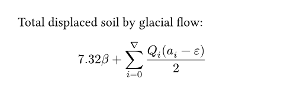

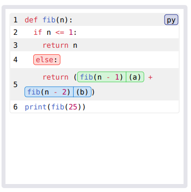


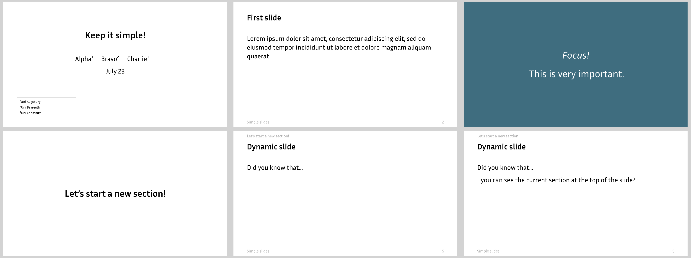


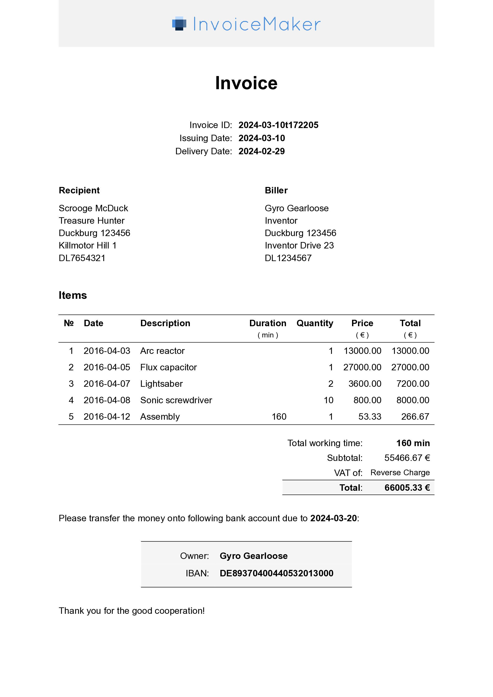


## Introduction to Typst

Typst intends to be similar to LaTeX: it "[is designed to be as powerful as LaTeX while being much easier to learn and use](https://github.com/typst/typst?tab=readme-ov-file)". The constructs that it supports are the traditional ones in markup/typesetting systems, which are also similar to those of HTML and languages that compile to HTML, like Markdown: paragraphs of text, [headings in several levels](https://typst.app/docs/reference/model/heading/), [ordered](https://typst.app/docs/reference/model/enum/) and [unordered](https://typst.app/docs/reference/model/list/) lists, [bold](https://typst.app/docs/reference/model/strong/) and [italics](https://typst.app/docs/reference/model/emph/), [images](https://typst.app/docs/reference/visualize/image/), [tables](https://typst.app/docs/reference/model/table/), [footnotes](https://typst.app/docs/reference/model/footnote/), [hyperlinks](https://typst.app/docs/reference/model/link/), and such. 

It also has other elements that aren't too common in Web content (e.g. HTML and Markdown), yet very common in academic documents (i.e. LaTeX, and to a degree MS Word): [numbered images and tables](https://typst.app/docs/reference/model/figure/), [automatic cross-references](https://typst.app/docs/reference/model/ref/) to said numbered images, tables and headings; [bibliography](https://typst.app/docs/reference/model/bibliography/) and [citations](https://typst.app/docs/reference/model/cite/), a [table of contents](https://typst.app/docs/reference/model/outline/) that is automatically kept up-to-date, [tables of tables, images, equations or code blocks](https://typst.app/docs/reference/model/outline/#parameters-target), [different page sizes](https://typst.app/docs/reference/layout/page/#parameters-paper), [large amounts of math/equations symbols](https://typst.app/docs/reference/math/), the concept of a document's [author](https://typst.app/docs/reference/model/document/#parameters-author) and [creation date](https://typst.app/docs/reference/model/document/#parameters-date), and [a package ecosystem](https://typst.app/universe/) for things like [drawing stuff](https://typst.app/universe/package/cetz/) (the equivalent of [TikZ](https://www.overleaf.com/learn/latex/TikZ_package)) or [building presentation slides](https://typst.app/universe/package/polylux/) (the equivalent of [Beamer](https://www.overleaf.com/learn/latex/Beamer)).

In short, Typst intends to provide more or less the same elements as those provided by LaTeX. Many already exist, those that don't may be added later, since Typst is still a very young project.

## Typst, LaTeX and Markdown

The syntax of the Typst language is way closer to Markdown than it is to LaTeX. Compare Markdown:

```markdown
# A Sample Document

## Introduction

This is an introduction.

## Section One

* A
* B
* C

Figure 1 shows a figure. As can be seen, 
the figure depicts an image of a picture.


[This is a link](https://example.com)
```

Here's LaTeX:

```latex
\documentclass[12pt, a4paper]{article}

\usepackage{graphicx}
\usepackage{hyperref}

\title{A Sample Document}
\author{My Name}
\date{\today}

\begin{document}
\maketitle

\section{Introduction}
This is an introduction.

\section{Section One}
\begin{itemize}
	\item{A}
	\item{B}
	\item{C}
\end{itemize}

Figure \ref{fig:figure} shows a figure. As can be seen, 
the figure depicts an image of a picture.

\begin{figure}[h]
    \centering
    \includegraphics[width=0.7\textwidth]{image}
    \caption{Observe the image in the picture}
    \label{fig:figure}
\end{figure}

\href{https://example.com}{This is a link}
\end{document}
```

And Typst:

```typst
= Introduction

This is an introduction.

= Section One

- A
- B
- C

@figure shows a figure. As can be seen, the figure depicts
an image of a picture.

#figure(
  image("image.jpg", width: 70%),
  caption: [
    Observe the image in the picture
  ],
) <figure>

#link("https://example.com")[This is a link]
```

Let's now compare Typst individually with LaTeX, Markdown and Word and similar editors.

### vs. LaTeX

As can be seen, Typst is much less verbose than LaTeX. For example, a heading isn't `\section{Title}`, but rather `= Title`, in the spirit of Markdown's `# Title`. Links aren't `\usepackage{hyperref}` and then `\href{https://example.com}{This is a link}`, but just `#link("https://example.com")[This is a link]`, again quite similar to Markdown. And so on. Typst relies much less on backslash-prefixed macros to write special elements, instead using dedicated syntax for the most common operations (for example, unordered lists, AKA bullet lists, use `-` for every entry. Numbered lists, on the other hand, use `+`. Headings use `=`s, one per level of the heading. Citations use `<tag>` to create the reference and `@tag` to refer to it. Bold and italics use `*content*` and `_content_`. Code uses `` `backticks` ``). 

Anything that doesn't have dedicated syntax uses "function calls", which are quite similar to a programming language's function calls. For example, to add a strikethrough:

```text
This is #strike[not] relevant.
```

whereas for LaTeX:

```latex
\usepackage{soul}

This is \st{relevant}
```

The function call syntax is much closer to LaTeX's macros, except that LaTeX backslashes are replaced by number/pound signs `#`, and arguments aren't provided inside curly braces, but inside regular parentheses and square brackets.

More complicated syntax, such as tables, also looks similar:

```text
#table(
  columns: 4,
  [], [Exam 1], [Exam 2], [Exam 3],

  [John],   N/A, A, N/A,
  [Mary],   N/A, A, A,
  [Robert], B,   A, B,
)
```

which generates something like this (after applying some styling that I don't show here for clarity):

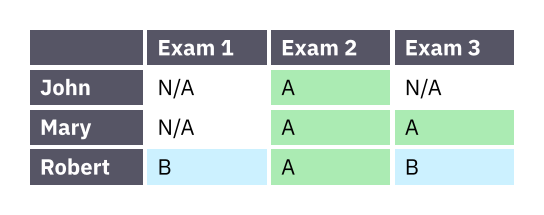

In LaTeX, said table may look like this:

```latex
\begin{tabular}{|l|l|l|l|}
	\hline
	& Exam 1 & Exam 2 & Exam 3 \\
	\hline
	John & N/A & A & N/A \\
	\hline
	Mary & N/A & A & A \\
	\hline
	Robert & B & A & B \\
	\hline
\end{tabular}
```

Again, slightly similar. LaTeX's table may be slightly less clean, such as in the explicit newlines and column separators, and in the way in which presentation (namely, the `\hline`s) is mixed with the data (the actual content of the cells).

Typst can also read bibliographies [in BibLaTeX format](https://typst.app/docs/reference/model/bibliography/), which is nice because many tools (e.g. Google Scholar or Mendeley) can export references in that format. It can also use [Hayagriva](https://github.com/typst/hayagriva/blob/main/docs/file-format.md), another format (also developed by Typst themselves) based on YAML:

```yaml
harry:
    type: Book
    title: Harry Potter and the Order of the Phoenix
    author: Rowling, J. K.
    volume: 5
    page-total: 768
    date: 2003-06-21

electronic:
    type: Web
    title: Ishkur's Guide to Electronic Music
    serial-number: v2.5
    author: Ishkur
    url: http://www.techno.org/electronic-music-guide/
```

Citing references is done like this:

```text
@electronic states that electronic music is made by electrons.
```

Again, quite similar to LaTeX's `\cite{electronic}`. Unlike LaTeX, the exact same syntax is also used to insert cross-references: if you have, say, a table with a label `<table_label>`, you can also insert a reference to the table with `@table_label`. LaTeX uses distinct commands, `\cite{}` for citations and `\ref{}` for cross-references. Another difference is that LaTeX's references only insert the number (e.g. you'd write `Figure~\ref{fig:something} shows that ...`, and LaTeX would only substitute the number), while Typst references insert the entire name+number (i.e. you'd write `@fig_something shows that ...`, and the `@fig_something` reference would be replaced by `Figure 1` or something similar)

Equations are also supported (as you would expect of anything that even tries to play in the same league as LaTeX). Both inline equations (i.e. those that are typeset inside a paragraph, inside the normal flow of text) and block-mode (equations that are set in their own paragraph) are available:

```text
#set math.equation(numbering: "(1)")

It has always been known that, for physicists, $pi = 3$.

Proof:

$ 
  & pi = 3.14 \
  & 3.14 = 3 \
  therefore & pi = 3
$
```

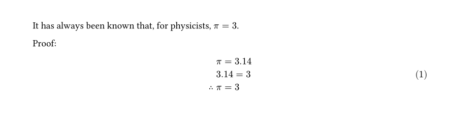

For LaTeX:

```latex
\usepackage{amssymb}
\usepackage{amsmath}

It has always been known that, for physicists, $\pi = 3$.

Proof:

\begin{equation}
\begin{split}
	& \pi = 3.14 \\
	& 3.14 = 3 \\
	\therefore & \pi = 3
\end{split}
\end{equation}
```

generates this:

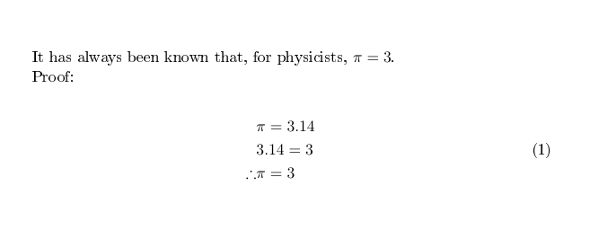

Probably the biggest difference with equations is that, in Typst, symbols are inserted via normal words. Observe, for example, the `$pi = 3$` inline equation: `pi` is converted to the actual π symbol. (The dollar sign at the start isn't part of the `pi` symbol, it's the delimiter of the entire inline equation, much like in LaTeX). In LaTeX, symbols always require the backslash. The same thing happens with the three dots in a triangle that make up ∴ the _therefore_ symbol: LaTeX requires a backslash, while Typst doesn't. Just writing `pi` with no backslash in LaTeX would interpret it as the two variables `p` and `i`, which are typeset in italics. Typst only does that for single-letter words. Anything longer than that is interpreted [as a symbol](https://typst.app/docs/reference/symbols/sym/). To write actual sequences of variables (such as `ab > 0`, where `a` and `b` are multiplied), you leave a space between them: `a b > 0`. To write actual text, which shouldn't be composed of sequences of italicized letters, you wrap it in double quotes: `{ x | x "is positive" }`

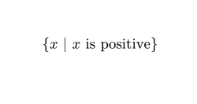

LaTeX would do it like this:

```latex
\{ x \mid x \textrm{ is positive} \}
```

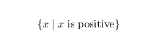

### vs. Markdown

As we've seen, the most common syntax constructs in Typst look fairly close to Markdown. In particular, headings, bold&italics, links and lists (both ordered and unordered) use very minimal special characters, which aren't those of Markdown but fulfill the same purpose.

Nonetheless, Markdown and Typst are quite different in their aims. Markdown's intended destination is typically either Markdown itself (e.g. when you use Markdown to take notes, as is done in the [Obsidian](https://help.obsidian.md/Editing+and+formatting/Basic+formatting+syntax) and [Joplin](https://joplinapp.org/) note-taking applications, which store notes in Markdown) or HTML (as is done, for example, on [the READMEs that are included on Github repositories](https://docs.github.com/en/repositories/managing-your-repositorys-settings-and-features/customizing-your-repository/about-readmes), or on some website generators [such as Hugo](https://gohugo.io/), in which this very blog is written, at least currently). Markdown's data model is therefore a restricted subset of HTML's available elements, with far less syntax (for example, a level 1 heading, `# Title`, is translated into `<h1>Title</h1>`. Images `` are translated into ``, [with no native control over sizes](https://www.markdownguide.org/hacks/#image-size)).

In other words, Markdown is a product of the age of the Web and works with and for the Web. Things that don't appear normally on web pages won't appear on Markdown either. This means things like [a table of contents](https://www.markdownguide.org/hacks/#table-of-contents), [underlined text](https://www.markdownguide.org/hacks/#underline) (which in the Web means almost exclusively a hyperlink, and so shouldn't be exposed for people to use on things that aren't hyperlinks), equations, citations, the concept of a "document author", or cross-references to other parts of the document (though most Markdown processors do support [cross-linking](https://www.markdownguide.org/extended-syntax/#heading-ids), just not automatically inserting text like "Section 2.1" where the number is the correct one for the link's destination).

Being Web-focused, Markdown's documents also like to live on a single vertically-infinite page (web pages don't usually have page breaks).

Typst and LaTeX, by contrast, operate on the world of PDF documents composed of a certain number of rectangular pages, perhaps numbered. In Markdown you'll never find a setting to set the page size to A4... because on the Web that makes no sense! Same goes for margins, page numbers, adding the current section at "the top of each page", per-page headers and footers, anything to do with odd vs. even pages (e.g. aligning the page number to the right or to the left, or having asymmetric margins for bookbinding at the left edge), leaving blank pages as necessary so chapters always start on the right side when a book is printed, or prevention of [widows and orphans](https://en.wikipedia.org/wiki/Widows_and_orphans) (i.e. very short one-or-two-lines paragraphs that are left at the top and bottom of a page, respectively).

All of those, however, are provided by LaTeX and Typst. In short: if your document will become a PDF with separate pages, and it isn't just a cascade of text and images (which could just be dumped to pages as they come, breaking when the page runs out of space), Markdown isn't as useful, since it doesn't provide page-aware features.

Furthermore, Markdown doesn't have built-in support for some features that are used (and arguably vital) in academic/scientific documents:

* Citations and bibliography
* Cross-references (e.g. referring to Table 1, Figure 2, or Section 3.4 in other parts of the text)
* Equations (some tools, such as Hugo, do [support equations](https://gohugo.io/content-management/mathematics/), but that is not Markdown's concern: it's handled [elsewhere](https://www.mathjax.org/), with Markdown just ignoring all that content)
* Captioned images. Markdown's images, ``, are just rendered as `` elements. That can again [be added](https://adityanaik.dev/blog/2022/04/23/links-images-captions-quotes-and-iframes-in-a-hugo-blog/#image-handling-and-adding-a-caption), but it's beyond Markdown itself
* Captioned tables, necessary for cross-referencing said tables
* [Any way of styling content](https://www.markdownguide.org/hacks/#color), at least directly on Markdown. For instance, it isn't possible to have a certain word colored red. If converting the Markdown document to HTML, it is sometimes possible to use the Markdown rendering tool to [provide a CSS file](https://pandoc.org/MANUAL.html#option--css) that will style the resulting output. In particular, Markdown provides no facilities to have all section titles be in Arial 12 point bold _al dente_ typeface, which may be required by the journal to which you want to submit your awesome paper

Note that all of these could be manually added. For example, a citation can be typed out literally, such as `See [2] for a review of available methods...` (like, the _literal_ 2 surrounded in literal brackets), and then at the end a `# Bibliography` section could be added, where each reference is manually written, including the number that it was assigned, the authors, the title, the journal, and whatever else. Of course, the minute another reference is added it may be necessary to reshuffle all existing references (since some reference styles mandate that references be sorted on the first author's last name or something), and all citations to reshuffled references need to be updated too. Image captions can be added, for example, by wrapping the image in a two-row table, where the top row contains the image and the bottom row says literally `Figure 1: A Title For The Image`. That can't be done for tables, but it would be possible to just insert the table caption as a lone paragraph just above or below the table. And then "cross-references" can be the literal words `Figure 1 shows that ...`. Of course, once again, if another figure or table needs to be inserted between two others, it'd cause the numbering of all later entries to change, thereby requiring that all references to those elements be changed too.

Equations and content styling are simply outside of Markdown's purview. They can be handled elsewhere, in the surrouding application that parses the Markdown document and renders something else, typically HTML, or PDF with HTML as an intermediate step (converting an HTML document to PDF is fairly mechanical, by using an HTML rendering engine such [as those found in browsers](https://help.syncfusion.com/document-processing/pdf/conversions/html-to-pdf/net/blink) or [Qt's WebKit engine](https://wkhtmltopdf.org/))

In general, the issue (which is only an issue when trying to use it as a LaTeX replacement. Markdown is plenty good for what it does) with Markdown is that it doesn't operate at the abstraction level (and, therefore, with the concepts) of "research paper". It operates at the level of "text document". In the land of text documents, the important entities are paragraphs, sentences, headings, images, lists, tables, hyperlinks and such. The land of research papers is also concerned with references, figures, tables of contents, and more. Note that the higher-level concepts that are found in scientific papers are actually composed of lower-level concepts: a citation is actually just a hyperlink, that displays a bit of text, but it embodies some additional ideas, such a specific format (e.g. `[1]` for IEEE-style citations), the fact that its hyperlink goes to another location in the document (namely, the corresponding entry in the references list), and the ability to change automatically when its corresponding reference is reordered. 

In a similar way, a paper's figures are a raw image (a rectangle filled with colored pixels) + some text (the caption), but there are additional constraints placed upon it: the image and the text are part of the same entity, such that they move as a unit (i.e. no decent typesetting system will place the image at the end of a page and its caption at the start of the next one, but instead place both elements together on one page or the other), the fact that the provided caption will be automatically prefixed with something like `Figure 1: `, the automatically-increasing counter for images (which, by the way, is separate from similar counters that may be used for section names, tables, code blocks and other enumerated elements), and the ability to create references to that element that automatically get replaced with the figure's current number. 

A table of contents is similarly composed of lines of text, but they aren't any random lines of text: a table of contents gets its data from the headings/section names that are defined elsewhere in a document, and presents them in order, maybe preserving their hierarchy (e.g. subsections are presented indented relative to their parent section), where each entry may have its page number (which, again, is a PDF-specific concept that makes no sense in the Web, where each page is on an infinitely tall container) displayed at the right side, with a character (e.g. dots `.`) filling the space between the end of the title and the page number. All of these features could be manually typed from text lines, but the higher-level concept of a table of contents implies all those constraints already, freeing the author from the work of keeping the table well-formed. This is arguably one of the biggest reasons for the existence of tools that focus on papers and similar documents: they provide higher-level concepts directly in the language.

### vs. Word, Google Docs and text processors

Of course, whoever doesn't write papers in LaTeX most likely writes them in Word or other equivalent text processor[[citation needed]](https://xkcd.com/285/). Word has the advantage that it's probably one of the most well-known pieces of (desktop) software in the world (surprisingly, there appears to be no easily-found chart of the most common applications in a desktop environment!). It now has multi-user simultaneous editing too, via Office's cloud subscription plans (which is called Office 365, I think?), which is useful for collaborative editing.

There's also [Google Docs](https://docs.google.com/), part of Google's suite of "office tools". It links everything to your Google account, whereas Word does so to your Microsoft account (if you want to. Word also works with no connection to the mothership... _for now_. Looking at you, [Windows 11](https://www.tomshardware.com/how-to/install-windows-11-without-microsoft-account)!). As a web-first application (as opposed to Word, which was born when the Web wasn't a thing, and is therefore a child of the desktop age), Google Docs is exclusively accessed through a browser (ignoring browsers-in-disguise such as PWAs, which I couldn't verify are used by Google Docs). Features such as cloud saving and collaboration come built-in with Google Docs. The interface is also different to that of Word: Word uses [the ribbon](https://support.microsoft.com/en-us/office/customize-the-ribbon-in-word-c4b6051a-7a70-43c8-a527-932917dec682), whereas Google Docs uses the more traditional [menu bar](https://edu.gcfglobal.org/en/googledocuments/getting-started-with-your-document/1/) with dropdown menus, plus right-click contextual menus. Google Docs therefore allocates more screen space to the document itself.

And then there's everyone else: [LibreOffice](https://www.libreoffice.org/) (bundled with Ubuntu), [OpenOffice](https://www.openoffice.org/) ([from which LibreOffice was forked](https://en.wikipedia.org/wiki/LibreOffice#History), way back in 2010), [OnlyOffice](https://www.onlyoffice.com/), [WPS Office](https://www.wps.com/), [Apple Pages](https://support.apple.com/pages), and probably a bazillion more.

All of these apps have something in common: they're [WYSIWYG](https://en.wikipedia.org/wiki/WYSIWYG) text/word processors, AKA "awhat you see is what you get", AKA you edit a document that has the same appearance as the final document:

> WYSIWYG was a great advance over earlier interactions, in which users specified their goals more abstractly and didn't see the results until far later. To make text bold in a WYSIWYG interface, for example, you highlight the text with the mouse and choose the "Bold" command from a formatting menu. Easy. And, even more important, as soon as you choose the formatting command, the document's screen appearance changes to reflect the new formatting. At any given time, what you see on the screen is what you've built and what you'll get if you print it.
> 
> Jakob Nielsen, https://www.nngroup.com/articles/rip-wysiwyg/

This is as opposed to LaTeX, where, say, bolding text is done by surrounding it with `\textbf{...}` in the source (plaintext) document, and then observing the change in the rendered PDF; Typst and Markdown, where it is done by surrounding it with `*...*`; or HTML, where it's done by surrounding it with `<b>...</b>`. In all of those cases, formatting of the text is performed by adding more text around it: formatting isn't a magical property, but more text near (usually around) the "target" text. On the other hand, on Word, Google Docs and such, formatting lives on a different realm, "superimposed over" the content as it were, rather than alongside it.

This means that WYSIWYG editors are easier for people to grasp, since the performed operations are immediately reflected in-place, rather than being instructions to a build process that generates another document.

On the other hand, since styling is applied on top of the content, it's usually more difficult to globally apply styles, absent a way to declare "styles" that are later applied to the "content". To be fair, [Word](https://support.microsoft.com/en-us/office/customize-or-create-new-styles-d38d6e47-f6fc-48eb-a607-1eb120dec563), [Google Docs](https://support.google.com/docs/thread/29527841/creating-a-new-style?hl=en), [LibreOffice](https://books.libreoffice.org/en/GS73/GS7303-StylesAndTemplates.html#toc6) and everyone else do support styles, i.e. a set of properties (such as font size, color, line spacing, whether or not the content is numbered, indentation, alignment, and more) that can then be applied to multiple parts of the content at once. For example, in a Word document, most content would probably be in the Normal style, which is the standard boring text. Section titles may be in Heading 1, subsections in Heading 2, the title of the whole document in Title, and so on. In fact, you can usually spot a Word document because section titles are in the traditional light blue of Heading 1 (or 2, or 3):


However, the fact that those styles are optional means that you are free to ignore them and apply changes to pieces of the document itself. Need some more spacing between lines? Rather than editing the Normal style, most people will likely Ctrl+A to select the entire document (or, more likely, go to the start of the document, click there, and then drag to the bottom), then change the spacing. This will apply the new setting to everything that exists already, and then Word will keep applying the same style to any new paragraphs that are inserted by pressing Enter...

Until it doesn't, that is, and for some reason one paragraph picks up the original line spacing again. Or you paste some content from a web page and it carries over its own formatting, and you click the Clear Formatting button to delete it, and your custom spacing gets lost too.

And there's also the issue that a style applied via... well, a Style, is indistinguishable from one applied manually, by virtue of these applications being WYSIWYG. That's the whole point! In other words, these two lines look the same:

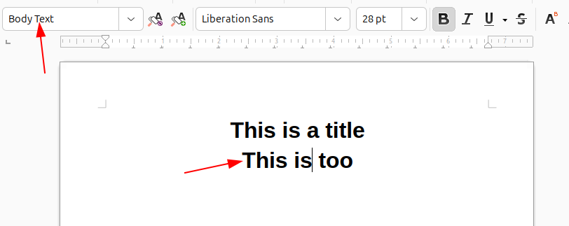

The second line was manually styled to match the Title style. But it doesn't _have_ the Title style, it's just a Body Text. And if we changed the Title style, that second line wouldn't have the changes applied: as far as the editor is concerned, it's a piece of normal text. And there's no way to detect that except for clicking on each piece of text that looks like it has the style applied, and checking if it actually does. 

Also, there are the minor annoyances with graphical tools: ever tried to enter thirty references in Word? At least back when I used to write papers, it was a very boring task: open the References dialog, click New, choose a type of reference, then manually click and fill several text fields, then click Save, then repeat it all over for the other twenty-nine references. The root cause of that is that point-and-clicking is slower than copy-pasting text, and Word doesn't have something like a textual representation of a template. By contrast, Google Scholar (and probably other sites that produce bibliography) can very easily provide a way to import a reference into LaTeX:

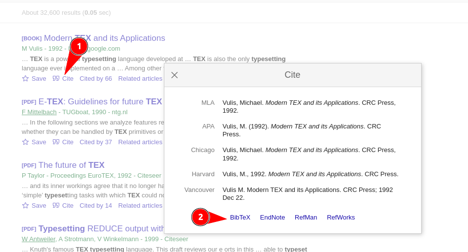

The actual reference is a piece of plain text that can be copied into a clipboard, passed around through an email or text message, and pasted into a file. Try doing that with a Word reference:

```
@book{vulis1992modern,
  title={Modern TEX and its Applications},
  author={Vulis, Michael},
  year={1992},
  publisher={CRC Press}
}
```

Or have you ever found a numbered list that is composed of literal numbers at the start? Word tries very hard to identify things that look like the start of a numbered list and turns them into actual numbered lists, but it may fail if someone uses a non-recognized format. Such lists would look mostly like real numbered lists, except that they have none of the list-specific features: no auto-incrementing number, no automatic indentation, no adding child lists that use a different numbering style (e.g. the main list using 1., 2., 3. and the sublist using a., b., c.). Have you found a section heading that was manually styled? Or an image that was manually captioned? Or (_shudder_) a manually written reference list? Or a manually written and painstakingly maintained table of contents? Or one that, while automatically created, is out of sync with the actual document? All of these are things that can happen with a general-purpose text processor that isn't operating at the abstraction level of "this is the heading of a section", but just at "this is a line of text". 

And let's not forget that, not being typesetting systems, Word and company don't usually have the fancier typesetting features. Have you ever had to go to the start of a paragraph and manually press Enter a couple of times, just to make that paragraph start at the start of the next page (or, if you were really fancy, Ctrl+Enter to insert a page break)? That's Word not trying to prevent widows and orphans. Ever had one of those justified paragraphs [where a line has huge spaces between words](https://www.datanumen.com/blogs/5-ways-not-stretch-last-line-justified-paragraph/), for some reason? That's a less-than-ideal justification algorithm being used. [Ligatures (e.g. between the _f_ and the _i_ in the word "official")](https://en.wikipedia.org/wiki/Ligature_(writing)#Computer_typesetting) aren't used in Word by default, as far as I'm aware. [A large list of differences, written from the perspective of a LaTeX enjoyer, is here](https://nitens.org/w/latex/) (though keep in mind that it's fairly old, circa 2008, and Word especially is liable to have changed a lot in the meantime. LaTeX is more stable and should have changed less). To be sure, most of those are very small changes, probably only perceivable if you _really_ like fonts or when seeing them side-by-side, but still.

Text processors typically use an opaque-ish data format as the backing store for the document (for example, Word's DOCX documents [are actually ZIP files in disguise](https://docs.fileformat.com/word-processing/docx/#docx-file-format-specifications---more-information), filled with XML documents). This means that they aren't really amenable to automation, or in other words, automatically generating documents with variable information, in the style of a template (for example, an automatic letter that always starts with "Dear &lt;name&gt;"). There are tools to do so, to be sure, [many](https://carbone.io/) [of](https://docxtemplater.com/) [them](https://jsreport.net/learn/docx) [in](https://www.docmosis.com/how-it-works/) [fact](https://templater.info/), but they all have to fight _against_ the DOCX data model. For example, consider [this tool](https://templater.info/), which lets you insert variable data in a document by surrounding it with double square brackets, `[[variable]]`:


In [their documentation](https://templater.info/user-manual) they have the following paragraphs:

> On surface Templater looks just like a mail merge solution. You can put tags on specific places in the document and replace them later with actual values. One could wonder why a library would even be required for that, as OOXML is just a ZIP file with an XML files which can be easily edited/manipulated.
> 
> But even in such a simple use case there are obstacles, as Word tends to split text into paragraphs so even a simple text such as [[TAG]] often looks like
> 
> ```xml
> <w:r w:rsidRPr="00A42204">
>   <w:rPr>
>     <w:lang w:val="en-US"/>
>   </w:rPr>
>   <w:t>[[</w:t>
> </w:r>
> <w:proofErr w:type="spellStart"/>
> <w:r w:rsidRPr="00A42204">
>   <w:rPr>
>     <w:lang w:val="en-US"/>
>   </w:rPr>
>   <w:t>TAG</w:t>
> </w:r>
> <w:proofErr w:type="spellEnd"/>
> <w:r w:rsidRPr="00A42204">
>   <w:rPr>
>     <w:lang w:val="en-US"/>
>   </w:rPr>
>   <w:t xml:space="preserve">]] </w:t>
> </w:r>
>```
>
> which contains various "useless" Word specific information not really relevant for the original [[TAG]] text. There are also various Word specific rules such as **xml:space="preserve"** which must be respected during processing.
> 
> Once tables and lists start to get used, replacing a tag is no longer: *"just locate and replace tag value in XML"*. With the addition of images, special Word objects, such as charts which are implemented as an embedded Excel file within the Word zip changing tags requires extensive knowledge of the Word behavior, format and rules. Therefore, a library which copes with those adjustments can be of quite a big help to the developer, even if his is quite familiar with the OOXML format.

Oof. When even simple words aren't preserved in the source XML document, things get really nasty. Naïve text replacement or the traditional text templating engines that are used, for example, on server-side HTML frameworks (e.g. [Jinja](https://jinja.palletsprojects.com/en/3.1.x/templates/#synopsis) or [Go's `text/template`](https://pkg.go.dev/text/template)) don't work on those XML documents, because they rely on special markers (typically `{{ some_var }}` or something to that effect), which, as we've seen above, Word breaks into different XML elements so the literal content `{{ ... }}` doesn't appear anywhere in the XML. And that's before we start with repetitions (say you want to render a list of items into a bullet list), conditional formatting (e.g. coloring some items in the list red or conditionally bold them), tables (where you may want to [repeat a row](https://carbone.io/documentation.html#repetitions) several times), inserting images or charts (which involve an entire embedded Excel document which contains the data that feeds the table), trying to add data (e.g. today's date) in a header, adding variable data as a watermark, or other more advanced replacements, then things get ugly fast.

By contrast, tools like LaTeX or Typst, where the source data is a plain text file, play very nicely with templating tools. There's no mysterious syntax that is added behind the scenes. Therefore, including automatic data in a document is fairly easy to do: we could just use any text templating engine to insert the requisite tags and/or directives in the LaTeX/Typst document, then render with the engine to generate a LaTeX/Typst document, then render _that_ document with TeX or Typst respectively to generate a PDF document. The key here is that since the source documents are plain text, there are many tools that can process them, unlike the weird XML documents of Word.

We'll see more examples of templating documents with Typst in a later section.

Generating reports or other automatic documents starting from a Typst or LaTeX template has the issue that they render into PDF. This means that the output is already set in stone, more or less. There are ways of editing PDF documents ([Word can](https://edu.gcfglobal.org/en/word2013/editing-pdf-files/1/), at the possible cost of some formatting; and there's also [Adobe Acrobat](https://www.adobe.com/acrobat.html), not the Reader version, which can do so starting at the low cost of $12.99 per month, about $150 per year), but they're unwieldy and/or paid. Thus, there's no easy way to pre-render most of the document, perhaps the boring parts that are always the same or can be filled directly from some data source, and then present the half-filled document to a person for the final touches to be added or corrections to be made. Tools that template Word documents [can usually take a Word document and output another Word document](https://carbone.io/documentation.html#quickstart-carbone-js), which is much easier for people to edit afterwards; they don't freeze their output in a difficult-to-edit PDF.

To recap: text/word processors like Word or Google Docs are a different kind of beast to typesetting systems like LaTeX or Typst. They're much more general, yet operate at a lower level of abstraction (by need of being more general). The mixing of styling and content, which is natural to WYSIWYG editors, means that there are more opportunities for styles or content patterns to drift out of sync across a document or across several documents. LaTeX and Typst (and HTML, for that matter) have a level of "semantic" annotation, meaning that it's not "this line is Arial 14, bolded, left-justified, with two levels of numbering"; but instead "this line has whatever styling is applied to subsection headings", which is a higher-level concept. Furthermore, since DOCX documents carry the document's raw information in XML files, it's fairly difficult to use them as templates from which documents are rendered with variable information, unlike plain-text-based formats such as Markdown, HTML, LaTeX and Typst where such templating is fairly easy to perform.

Finally, can Word [do this](https://github.com/liantze/AltaCV) (showing little circles for the competency level of several languages in a CV)?

```latex
\cvsection{Languages}
\cvskill{English}{5}
\divider
\cvskill{Spanish}{4}
\divider
\cvskill{German}{3.5}
```


Or [this](https://www.ctan.org/pkg/menukeys) (displaying key presses, such as in a software manual, in little boxes)?

```latex
This is some more or less blind text, 
to demonstrate how the sequence looks 
in text. This \keys{\ctrl+\alt+Q} is 
the result of a style which name...
```

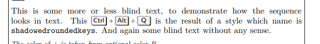

Or [this](https://www.baeldung.com/cs/latex-drawing-graphs) (drawing graphs directly in the document)?

```latex
\begin{tikzpicture}[node distance={15mm}, thick, main/.style = {draw, circle}] 
\node[main] (1) {$x_1$}; 
\node[main] (2) [above right of=1] {$x_2$}; 
\node[main] (3) [below right of=1] {$x_3$}; 
\node[main] (4) [above right of=3] {$x_4$}; 
\node[main] (5) [above right of=4] {$x_5$}; 
\node[main] (6) [below right of=4] {$x_6$}; 
\draw[->] (1) -- (2); 
\draw[->] (1) -- (3); 
\draw (1) to [out=135,in=90,looseness=1.5] (5); 
\draw (1) to [out=180,in=270,looseness=5] (1); 
\draw (2) -- (4); 
\draw (3) -- (4); 
\draw (5) -- (4); 
\draw[->] (5) to [out=315, in=315, looseness=2.5] (3); 
\draw[->] (6) -- node[midway, above right, sloped, pos=1] {+1} (4); 
\end{tikzpicture} 
```


Or, my personal favorite, [this](https://www.ctan.org/pkg/songbook)? It's a package to write songbooks, with lyrics and chords, complete with such fancy tools as [replaying a verse's sequence of chords on the next verses](https://songs.sourceforge.net/songsdoc/songs.html#sec5.4), showing [parts that should be echoed](https://songs.sourceforge.net/songsdoc/songs.html#sec5.6), [notes to the musicians](https://songs.sourceforge.net/songsdoc/songs.html#sec5.8) that don't appear on the singer's books, [guitar tablatures](https://songs.sourceforge.net/songsdoc/songs.html#sec6), [automatic transposition](https://songs.sourceforge.net/songsdoc/songs.html#sec7), [smart enharmonics](https://songs.sourceforge.net/songsdoc/songs.html#sec7.0.0.1) (i.e. whether a certain chord should be displayed as B♭ or A♯, which are technically the same sound. Which one to choose depends on the song's key, usually dictated by the song's first chord), [quotations from the Bible](https://songs.sourceforge.net/songsdoc/songs.html#sec8.2), [automatic indices](https://songs.sourceforge.net/songsdoc/songs.html#sec10) (by title, by author, by Bible reference, by notable lyrics such as the first line), and [the ability to create books with and without chords](https://songs.sourceforge.net/songsdoc/songs.html#sec4.0.0.1) (for the musicians and for the singers respectively) from the same source document.

```latex
\songsection{Worship Songs}

\begin{songs}{}
\beginsong{Doxology}[by={Louis Bourgeois and Thomas Ken},
                     sr={Revelation 5:13},
                     cr={Public domain.},
                     index={Praise God, from Whom all blessings flow}]
\transpose{2}
\beginverse
\[G]Praise God, \[D]from \[Em]Whom \[Bm]all \[Em]bless\[D]ings \[G]flow;
\[G]Praise Him, all \[D]crea\[Em]tures \[C]here \[G]be\[D]low;
\[Em]Praise \[D]Him \[G]a\[D]bove, \[G]ye \[C]heav'n\[D]ly \[Em]host;
\[G]Praise Fa\[Em]ther, \[D]Son, \[Am]and \[G/B G/C]Ho\[D]ly \[G]Ghost.
\[C]A\[G]men.
\endverse
\endsong
\end{songs}
```

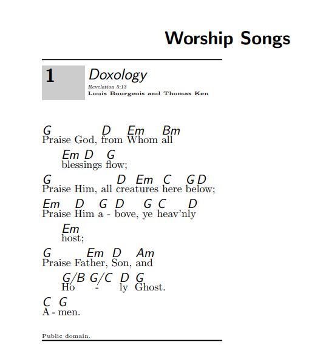

Or, finally, can Word do [ducks](https://ctan.org/pkg/tikzducks)? [Many ducks](https://github.com/samcarter/tikzducks?tab=readme-ov-file#examples)? Tons of ducks?

```latex
\begin{tikzpicture}[scale=0.6]
\duck
\duck[xshift=90pt, scale=.3, yshift=150pt]
\duck[xshift=60pt, scale=.3, yshift=100pt]
\duck[body=gray!50!white, head=gray!50!white,
xshift=80pt, scale=.3, yshift=50pt]
\end{tikzpicture}
```


To be fair, all of these were done in LaTeX, not in Typst, but the point was to compare to Word. Word doesn't do any of those (maybe with macros, but hopefully we've agreed, as a species, on the fact that [macros are evil](https://en.wikipedia.org/wiki/Macro_virus)). Typst, being similar to LaTeX in capabilities, should at least in theory be able to do all of that. For example, all the graphical examples (namely, the circles for the language competency, the fancy keystrokes, the graph with arrows, and the ducks) use [TikZ](https://en.wikipedia.org/wiki/PGF/TikZ) in LaTeX. Typst already has [`cetz`](https://typst.app/universe/package/cetz), "a library for drawing with Typst with an API inspired by TikZ". It should allow users to do similar things (otherwise, contributions are probably welcome). For the songbook, [there's already `conchord`](https://typst.app/universe/package/conchord) [and `chordx`](https://github.com/ljgago/typst-chords?tab=readme-ov-file#single-chords), both of which already typeset chords over lyrics. There's also Typst packages [for drawing diagrams made of nodes and arrows](https://typst.app/universe/package/fletcher) à la [Graphviz](https://graphviz.org/)/[DOT](https://graphviz.org/doc/info/lang.html), [timing/signal diagrams](https://typst.app/universe/package/physica), [quantum circuits](https://typst.app/universe/package/quill), [slides](https://typst.app/universe/package/polylux) à la [Beamer](https://www.overleaf.com/learn/latex/Beamer), [Gantt charts](https://typst.app/universe/package/timeliney), [units for physical quantities](https://typst.app/universe/package/unify), [chess boards](https://typst.app/universe/package/board-n-pieces) (including Forsyth–Edwards Notation), [chemical formulae](https://github.com/jamesrswift/typst-chem-par), [calendars with events](https://typst.app/universe/package/cineca), [TODOs or editor's notes or comments at the sides of the content](https://typst.app/universe/package/dashy-todo), [fractals](https://typst.app/universe/package/fractusist), [genealogical trees](https://typst.app/universe/package/genealotree), [color-matched parentheses](https://typst.app/universe/package/iridis), [Karnaugh maps](https://typst.app/universe/package/k-mapper), [Tetris screens](https://typst.app/universe/package/mino), [multiple types of diagrams](https://typst.app/universe/package/pintorita), [Riemann sums](https://typst.app/universe/package/riesketcher), [chip pinout diagrams](https://typst.app/universe/package/salsa-dip), [exams](https://typst.app/universe/package/tutor), [truth tables](https://typst.app/universe/package/truthfy) (automatically filled!), [more timing diagrams](https://typst.app/universe/package/wavy), and more.

## Styling documents

Styling in Typst uses an approach that I hadn't seen before, which they call [set rules and show rules](https://typst.app/docs/reference/styling/). Set rules behave somewhat like CSS, in that a set rule specifies a certain type of element that will be affected by it, and some parameters (e.g. that element's color, size, position or alignment) can be controlled. However, unlike CSS, set rules can be applied in the middle of a document (they only take effect from the point that they're encountered). Their "selector" capability is also much less powerful than that of CSS, as a set rule only targets one type of element (then again, different elements have entirely different settings, so being able to target multiple elements at once isn't that useful).

Set and show rules are what Typst packages use to control the appearance of documents. They're what differentiates an IEEE-style paper from a book from a leaflet from a 16th-century-style book. They control the appearance of headings (font family and size, indentation, numbering style), paragraphs (font family and size, spacing), tables (the style of headings, cells, borders and more), pages (size, margins, columns, binding style, numbering, header, footer), figures (the numbering style and naming convention), and more. All those very detailed conventions that a certain conference, journal or book may want your document to follow are converted to set rules.

A simple set rule looks like this:

```typst
= Unstyled introduction
This title hasn't had the new style applied yet

#set heading(numbering: "1.")

= Introduction
The set rule above was applied to the title
```

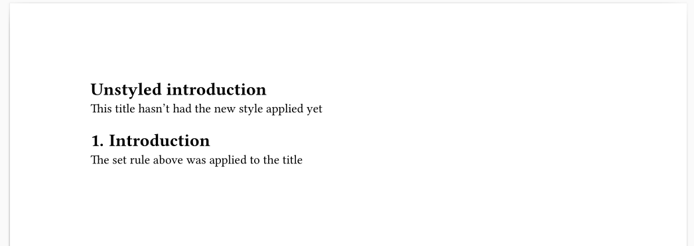

As discussed above, set rules take effect from the moment they're declared until the end of the document (or containing block, if they're declared inside some sort of block). Here we [configured the `numbering` parameter of the `heading(...)` function](https://typst.app/docs/reference/model/heading/#parameters-numbering), which is what `= Title` headings end up as. We specified that headings should be numbered with arabic numberals, and the second heading had that new style applied.

In general, set rules can modify anything that the element in question exposes as a parameter. Recall that, in Typst, every element (yes, including plain text) is actually a function call. For example, `= Title` is secretly a `heading(level: 1, "Title")`. `- Element` (in the context of an unordered list) is [an element inside an `enum`'s last variadic argument](https://typst.app/docs/reference/model/enum/). A citation, inserted with `@citation_key`, is actually [a call to `cite(label("citation_key"))`](https://typst.app/docs/reference/model/cite/).

Therefore, since every part of the text is a function, and every function has some configurable parameters, set rules can control aspects of each element. For example, [headings can have their numbering style controlled, as well as whether or not they appear in the table of contents](https://typst.app/docs/reference/model/heading/#parameters). Other functions have other parameters, such as [the `text(...)` function](https://typst.app/docs/reference/text/text/), which has [a ton of parameters](https://typst.app/docs/reference/text/text/#parameters) that control the appearance of that bit of text: the font, weight, size, fill color, stroke color, spacing (between characters, words and lines), language, direction (left-to-right or right-to-left), whether to request the character that adds a slash across the zero, and more.

For an example, observe [the `charged-ieee` template](https://typst.app/universe/package/charged-ieee), which implements styling to conform to the IEEE conferences and journals guidelines. The template [is open source](https://github.com/typst/templates/tree/main/charged-ieee), under a variant of the MIT license that requires no attribution. As can be seen in the template's source code, [the largest amount of the template's code](https://github.com/typst/templates/blob/fd8fd73a825bef6e7fbc85f0dc9eac43b67c5715/charged-ieee/lib.typ#L31-L183) is devoted to set rules that configure various aspects of the document: there's [font family and size](https://github.com/typst/templates/blob/fd8fd73a825bef6e7fbc85f0dc9eac43b67c5715/charged-ieee/lib.typ#L34), the [styles for numbered lists](https://github.com/typst/templates/blob/fd8fd73a825bef6e7fbc85f0dc9eac43b67c5715/charged-ieee/lib.typ#L37) (first level is "1)", second level is "a)" and third level is "i)"), [styling for table's captions](https://github.com/typst/templates/blob/fd8fd73a825bef6e7fbc85f0dc9eac43b67c5715/charged-ieee/lib.typ#L41-L44), [styling for images](https://github.com/typst/templates/blob/fd8fd73a825bef6e7fbc85f0dc9eac43b67c5715/charged-ieee/lib.typ#L469), [margins and page size](https://github.com/typst/templates/blob/fd8fd73a825bef6e7fbc85f0dc9eac43b67c5715/charged-ieee/lib.typ#L53-L65), [equation numbering](https://github.com/typst/templates/blob/fd8fd73a825bef6e7fbc85f0dc9eac43b67c5715/charged-ieee/lib.typ#L68-L69), [heading numbering](https://github.com/typst/templates/blob/fd8fd73a825bef6e7fbc85f0dc9eac43b67c5715/charged-ieee/lib.typ#L90) (sections are "I.", subsections are "A.", and sub-sub-sections are "a."), [font size for the bibliography](https://github.com/typst/templates/blob/fd8fd73a825bef6e7fbc85f0dc9eac43b67c5715/charged-ieee/lib.typ#L137), [two-column mode](https://github.com/typst/templates/blob/fd8fd73a825bef6e7fbc85f0dc9eac43b67c5715/charged-ieee/lib.typ#L181), and finally [the content](https://github.com/typst/templates/blob/fd8fd73a825bef6e7fbc85f0dc9eac43b67c5715/charged-ieee/lib.typ#L197). While it's been a while since I've had to write a paper in IEEE format, I'm fairly sure that all those set rules have a more-or-less direct correspondence with the IEEE guidelines.

Typst's set rules can also target with more granularity than entire functions, by [using `where(...)` to compose more precise selectors](https://typst.app/docs/reference/foundations/selector/). For example, let's say that we wanted to target only second-level headings (i.e. `== Title` but not `= Title` or `=== Title`). This would be expressed in a show-set rule as:

```typst
#show heading.where(level: 2): set heading(numbering: "1.")
```

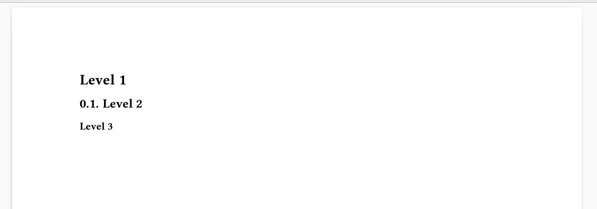

Only the second-level heading gets the numbering applied.

The last rule was an example of a show-set rule: rather than being applied to each instance of the `heading(...)` function, i.e. all headings, this one applies only to level 2 headings, via the `.where(level: 2)` part. This capability is not available to set rules, only to show rules. These are much closer to CSS selectors: where a set rule can do something like `a {...}` (i.e. matching all `<a>` elements), a show rule can be much closer to `button[type='submit'] {...}` (i.e. match only `<button type="submit" ...>`). Show rules can match only function calls that have a certain parameter, or a certain element, as long as it has a label.

Show rules aren't limited either to only presetting the arguments that the specific function has available. Instead, a show rule can declare a function that receives the raw element that is being formatted. The function should return some content, but it is not limited to modifying the element that it received; it can build one from scratch instead. For example, we could write a Typst document where it isn't possible to bold content:

```typst
*Normal Bold*

#show strong: it => emph(it.body.text)

*Still Bold?*
```

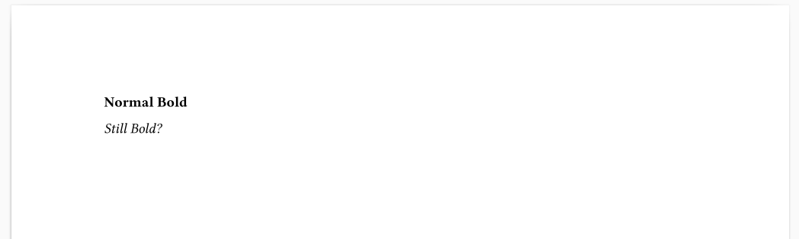

As can be seen above, once the show rule has been declared, any further attempts to print bolded text actually print italicized text. This is because, whenever [a call to `strong(...)`](https://typst.app/docs/reference/model/strong/) is encountered, Typst instead invokes the function that was passed to the show rule. `it` contains the entire bold element, which happens to contain its raw text in `it.body.text`. Thus, we wrap it [with a call to `emph(...)`](https://typst.app/docs/reference/model/emph/), which italicizes its argument, and return it. No more bold text.

In effect, when used in this way, show rules are capable of completely intercepting calls to a certain content function, and the actual return value of that function is completely under the control of the show rule, which can decide to return an entirely different element. 

To recap: Styling in Typst is achieved via _set rules_, which target a class of elements (e.g. headings, or text blocks, or code blocks, or unordered lists) and can preset configuration values for that class of elements. There are also _show rules_, which can target elements with more precision, and can also completely override the presentation of an element by providing a custom function that will be called whenever a certain class of element is encountered. Said custom functions can completely drop the element, change some arguments, or replace it entirely.

## Scripting in Typst

Typst, much like LaTeX, embeds [something that acts like a programming language](https://typst.app/docs/reference/scripting/), though I'm unsure if it's Turing complete. Typst's scripting language is a bit like [JSX](https://react.dev/learn/writing-markup-with-jsx) (React's language, that allows Javascript to manipulate HTML elements) in that functions written in the scripting language can directly return Typst elements (e.g. headings, tables, or images), in the same way that in JSX it's valid to write `return <h1>Hello!</h1>`, i.e. returning (from Javascript) an HTML element. Similarly, in Typst:

```typst
#let name = "jreyesr"
#let titlify(text) = heading(level: 1, text)

#titlify("Written by " + name)
```

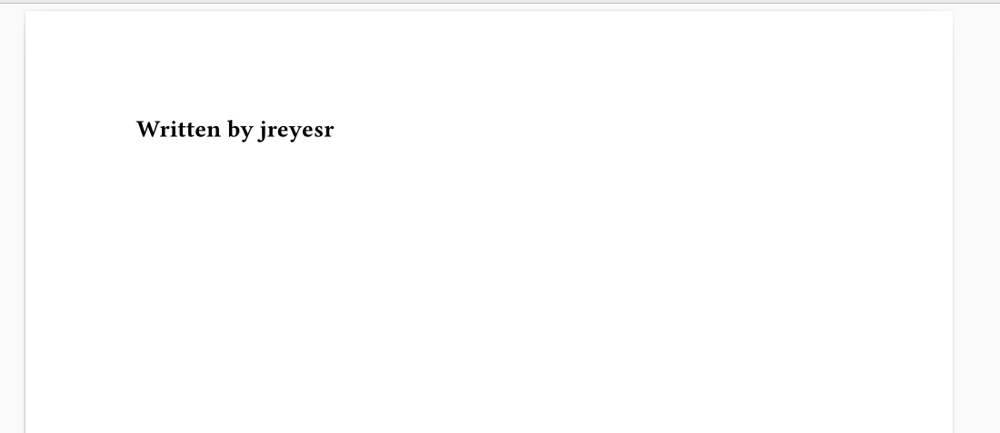

The first line declares a variable, `name`, with a value, in the same way as any mainstream programming language would (though, in the spirit of JS and Python, types are inferred rather than stated). This variable will be available to the rest of the document. By the way, a line that starts with `#` belongs to the scripting realm, rather than the standard Typst "content" realm. In the scripting realm, scripting lines are executed, and what appears back in the content realm is the _return value_ of each line. A `let` binding, which assigns a name to something, returns nothing. Not even a blank line. Therefore, the first line causes nothing to appear on the output document.

The second line is more of the same: it binds the name `titlify`, but this time _to a function_ rather than to a static value. This function, when called, will return (Typst functions have an implicit return of their last statement, like Rust's [implicit returns](https://users.rust-lang.org/t/explicit-and-implicit-return-in-functions/17089)) [a heading element](https://typst.app/docs/reference/model/heading/), which is itself composed by calling the `heading(level: N, content)` function that is built-in to the language. In fact, this function is called internally when you write a heading in normal Typst content, e.g. `== Something` would call `heading(level: 2, "Something")`. After the second line, we have a function available that takes some text (as a normal string) and returns a content block that is a heading of level 1 whose text content is the provided text.

Again, since the entire line is actually a `let` binding, and `let` bindings return nothing, this line doesn't output anything to the document either.

And then, on the third line (actually fourth), we call/invoke that `titlify` function. We pass it an expression (joining two strings, a fixed one and the variable `name` that was declared before). This concatenates the strings first, then passes them to `titlify`, which in turn calls `heading(level: 1, ...)` with that value. `heading(...)` returns a piece of content, which is in turn returned by `titlify(...)` because its last line was the call to `heading(...)`. Therefore, the fourth line is replaced by a piece of content that contains a heading. This _is_ printed to the output document, and causes the heading to appear in the PDF.

Script snippets can be interspersed with text content:

```typst
#let name = "jreyesr"

This was *written by #name!*
```

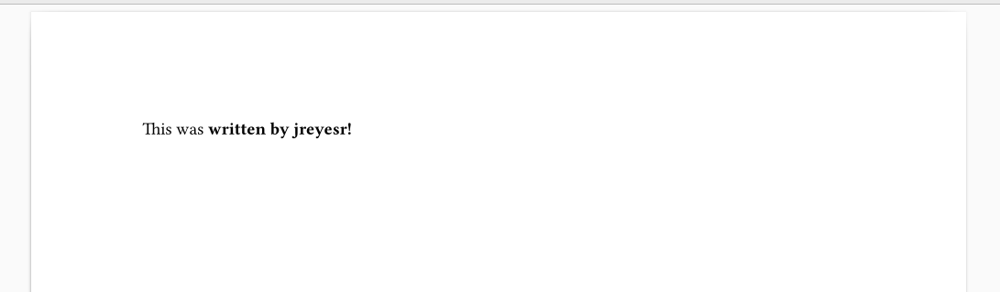

This is similar to [template literals](https://developer.mozilla.org/en-US/docs/Web/JavaScript/Reference/Template_literals) in Javascript, where it's possible to embed variables in a string. The working principle in this example is the same as above: the first line, which declares the `name` variable via `let`, returns nothing and therefore prints nothing on the document. The second (actually third) line enters the scripting realm when `#name` is encountered, which when evaluated actually returns a string, which is therefore printed on the content realm.

Expressions can be more complex than just a variable name, i.e. `We've found #(items.len()) results`, which uses `#()` to delimit the expression `items.len()`raw, and also [calls a method on the `items` array](https://typst.app/docs/reference/foundations/array/#definitions-len). Again, this is similar to the capabilities of [Swift](https://www.hackingwithswift.com/articles/178/super-powered-string-interpolation-in-swift-5-0), [Dart](https://www.hackingwithswift.com/articles/178/super-powered-string-interpolation-in-swift-5-0) or JS, where full expressions (not just variable names) are allowed inside strings.

We've seen that Typst documents alternate between two modes: normal "content" mode, in which text is output to the PDF document; and code/scripting mode, in which a different syntax is used. There's also math mode, in which equations are typeset, but that's not used here. You enter code mode by typing `#`. In code mode, Typst behaves more like a traditional programming language in which variables can be defined and [logic (e.g. if-else expressions)](https://typst.app/docs/reference/scripting/#conditionals) can be expressed. There are values (e.g. strings, numbers, arrays/lists, and dictionaries/hashmaps), which can be passed to functions, have methods called on them, and otherwise manipulated. Each expression (roughly a line) in code mode has a "return value". For example, `let x = "abc"` returns nothing (it's a variable assignment, and the interesting part of variable assignments is the fact that they assign a variable, not their return value as if they were a mathematical operation), whereas `"abc".len()` would return 3 (the length of the string `"abc"`). Whenever a line in code mode returns something, that return value is transported back into the content mode and placed there. This is the way in which code mode can have an effect on the output: if it couldn't communicate back to content mode, nothing that happened in code mode would change the PDF output, and at that point, why have it at all?

Of course, once code mode can produce content that is output to the document, it's possible to build a document, at least in part, from code. For example, [code mode supports for-each and do-while loops](https://typst.app/docs/reference/scripting/#loops). Each iteration of the loop can output some content, which is useful, for example, to write variable-length bullet lists:

```typst
#let vowels = "aeiou".clusters()
#let consonants = "bcdfghjklmnpqrstvwxyz".clusters()

#let word = "Hello!"

= Word of the day: "#word" (#word.len() characters)

#for c in word [
    - #c #sym.triangle.filled.small.r #if vowels.contains(lower(c)) [Vowel] else if consonants.contains(lower(c)) [Consonant] else [Symbol]
]
```

This would evaluate to something like this (still in Typst format, but now with all scripting content already evaluated and therefore removed):

```typst
= Word of the day: "Hello!" (6 characters)

- H #sym.triangle.filled.small.r Consonant
- e #sym.triangle.filled.small.r Vowel
- l #sym.triangle.filled.small.r Consonant
- l #sym.triangle.filled.small.r Consonant
- o #sym.triangle.filled.small.r Vowel
- ! #sym.triangle.filled.small.r Symbol
```

which in turn renders into this PDF:

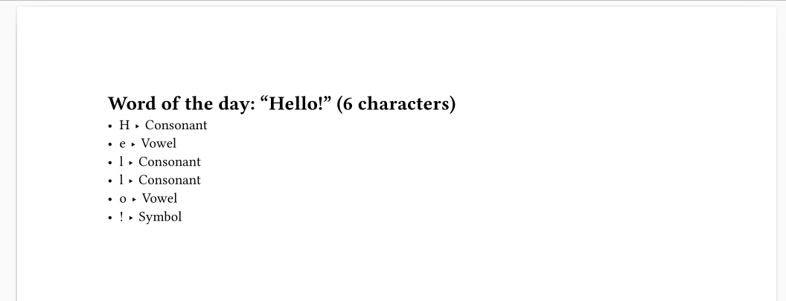

Notice how the entire content of the document (the title, the character count in the title, how many bullet points there are, and the content of each one) is controlled by a single variable, `word`. If we just change the word, the entire document changes to match:

```typst
#let vowels = "aeiou".clusters()
#let consonants = "bcdfghjklmnpqrstvwxyz".clusters()

#let word = "test"

= Word of the day: "#word" (#word.len() characters)

#for c in word [
    - #c #sym.triangle.filled.small.r #if vowels.contains(lower(c)) [Vowel] else if consonants.contains(lower(c)) [Consonant] else [Symbol]
]
```

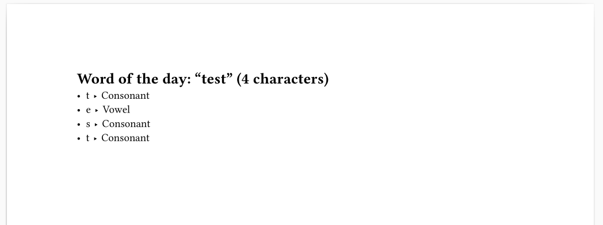

Tables can also be filled with this approach, albeit with a bit more syntax:

```typst
#let vowels = "aeiou".clusters()
#let consonants = "bcdfghjklmnpqrstvwxyz".clusters()
#let descr(c) = if vowels.contains(lower(c)) {"Vowel"} else if consonants.contains(lower(c)) {"Consonant"} else {"Symbol"}

#let word = "Hello!"

= Advanced analysis of the word "#word"

#table(
  columns: (auto, auto),
  inset: 10pt,
  align: horizon,
  table.header(
    [*Letter*], [*Type*],
  ),
  ..for c in word {
    (c, descr(c))
  }
)
```

The first part is the same as above. The `table()` call, [which is always used to create tables](https://typst.app/docs/reference/model/table/), happens to [take the cells as its last arguments](https://typst.app/docs/reference/model/table/#parameters-children). In other words, it's always called like this: `#table(arg1: val1, arg2: val2, cell1, cell2, cell3, cell4, ...)`. The first arguments, which have a name and a value, are configuration/formatting arguments for the table, such as the number and width of the columns, alignment, padding, row heights, colors for the lines and cell backgrounds, and similar. Then, anything else is collected and treated as cells: the final argument argument is variadic, meaning that it can take an unspecified number of arguments, acting as a catch-all that eats everything that isn't a formatting parameter for the table. In our case, we use a for-each loop to run over each character and, for each one, create [an array](https://typst.app/docs/reference/foundations/array/) with two values: the character itself and a description of the character, e.g. "Vowel" or "Consonant". Therefore, the for-each loop itself can be thought of as being replaced by an array of arrays: for each character in the word, there's an array with two values. 

Then, [the `..` operator](https://typst.app/docs/reference/foundations/arguments/#spreading) is used to "spread" that array of arrays into the variadic argument of the `table(...)` function. [That pattern is discussed here](https://github.com/typst/typst/discussions/3365), and is explicitly endorsed by Typst's authors. The table rendering code then takes over, having received a bunch of cells, and renders this:

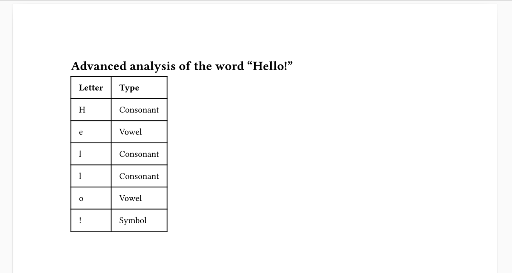

This demonstrates that tables can be created programmatically, by generating their cells in code and then passing them to the `#table(...)` function. Of course, we can then apply traditional programming techniques, such as extracting the code which generates a single row to another function:

```typst
#let vowels = "aeiou".clusters()
#let consonants = "bcdfghjklmnpqrstvwxyz".clusters()
#let descr(c) = if vowels.contains(lower(c)) {"Vowel"} else if consonants.contains(lower(c)) {"Consonant"} else {"Symbol"}

#let word = "Hello!"

= Advanced analysis of the word "#word"

#let row(letter) = (strong(letter), descr(letter))

#table(
  columns: (auto, auto),
  inset: 10pt,
  align: horizon,
  table.header(
    [*Letter*], [*Type*],
  ),
  ..for c in word {
    row(c)
  }
)
```

This is nearly the same as the previous example, except that now we have a new function, `row(letter)`. It receives a single character and returns the row that corresponds to that character. Here it's just two cells: the first (leftmost) cell displays the character itself, bolded; and the second (rightmost) cell contains its description, either "Vowel", "Consonant" or "Symbol". Then, the table merely calls `row(letter)` inside the for-each loop. Of course, since this is a trivial table, doing this is unnecessary, but for more complex tables it may be useful since now the `row(letter)` function is just concerned with _a single row_ of the table. 

People familiar with React may recognize this as similar to [React's components](https://react.dev/learn/your-first-component#components-ui-building-blocks), AKA new-style or function components (not [class components](https://www.twilio.com/en-us/blog/react-choose-functional-components), which are older). Of course, all concepts related to interactivity (event handlers, hooks, lifecycle functions) don't apply to Typst. But the idea of ["a JavaScript function that you can sprinkle with markup"](https://react.dev/learn/your-first-component#defining-a-component) can be carried over to Typst. For example, our `row(c)` function in the example above would be similar to a `function Row({character})` component in React, called like this: `<Row character={c}>`:

```jsx
function descr(c) {
  if("aeiou".includes(c.toLowerCase())) {
    return "Vowel"
  } else if("bcdfghjklmnpqrstvwxyz".includes(c.toLowerCase())) {
    return "Consonant"
  }
  return "Symbol"
}

function Row({character}) {
  return (
    <tr>
      <td>{character}</td>
      <td>{descr(character)}</td>
    </tr>
  )
}

function Table({word}) {
  return (
    <table>
      <thead>
        <tr>
          <th>Letter</th>
          <th>Type</th>
        </tr>
      </thead>
      <tbody>
        {[...word].map((c, i) => (<Row character={c} key={i}/>))}
      </tbody>
    </table>
  )
}

export function App(props) {
  return (
    <Table word="Hello!"/>
  );
}
```

In both cases (React and Typst), it's possible (and, in the case of React, it's the official way too) to write functions that receive some parameters and return a piece of visual content (a bit of HTML code in React, and something that gets printed to the PDF in Typst). Those functions can compose neatly, since they can be called by other functions, even repeatedly, which is actually React's core idea of [the UI being a tree](https://react.dev/learn/understanding-your-ui-as-a-tree) where components are nested inside other components. In the case of Typst, that model (that of nested elements) may not be as useful since the final destination of the content is a PDF, where things are a lot more "linear" in nature, but it may still be of use.

Images can also be inserted automatically, even from a string. Let's say that you have a Base64-encoded string that contains an image. [The `based` package](https://typst.app/universe/package/based/) (third party, open source, available [on Github](https://github.com/EpicEricEE/typst-based)) can decode that Base64 string to a raw byte array (Typst [does have a native Bytes type](https://typst.app/docs/reference/foundations/bytes/) which can represent arbitrary sequences of bytes, so there's no need to transport them as strings, where special characters may cause issues). At this point, we have a byte array with the raw image data. Then, there's [the `image.decode(...)` function](https://typst.app/docs/reference/visualize/image/#definitions-decode), which can read said byte array and generate an image. Normally, images are loaded by providing a file path, e.g. `image("path.png")`, but it's also possible to load them from a bytes object, which doesn't require that any files on disk are read.

```typst
#import "@preview/based:0.1.0": base64

#let data = base64.decode("")

#figure(
    image.decode(data),
    caption: "Very important image"
)
```

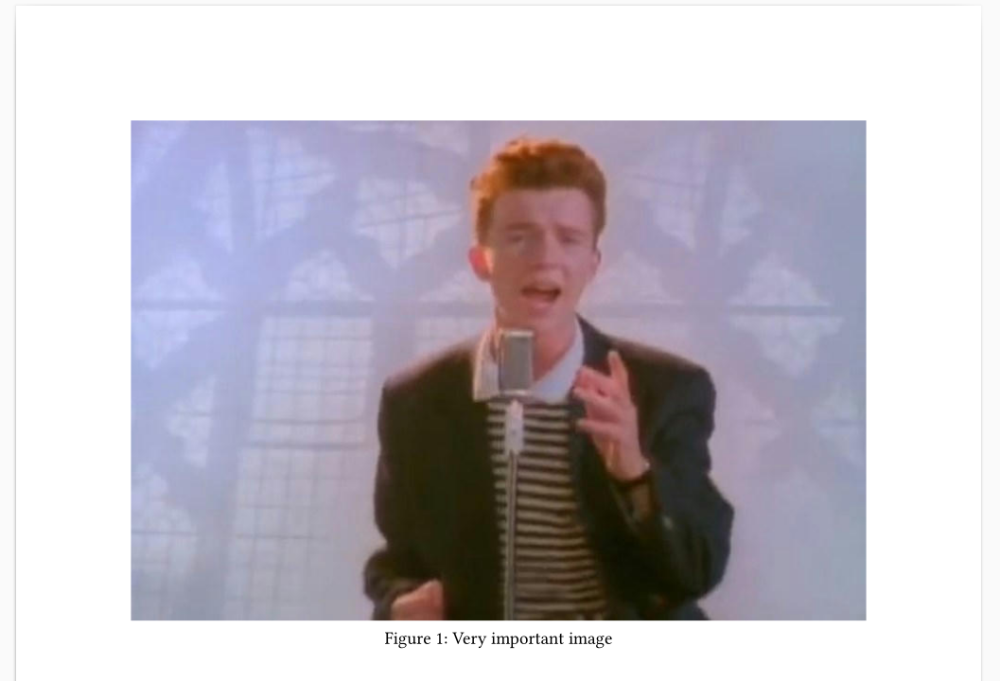

You're welcome.

And, finally, Typst scripts are capable of intepreting and running _other_ Typst scripts that come in as a string, which therefore grants Typst scripts the same power as Typst itself. This is done [by using the `eval(...)` function](https://typst.app/docs/reference/foundations/eval/), which takes a string (i.e. a sequence of characters) and interprets it as Typst code, in one of three contexts: markup/content mode, scripting mode, or math mode:

```typst
Code: #eval("1 + 1") // outputs 2, code mode is the default

Markup: #eval("= Title", mode: "markup") // Outputs a level-1 heading

Math: #eval("1 + 1", mode: "math") // Outputs 1+1, typeset as an equation

#table(
    columns: (auto, auto, auto),
    table.header([*Mode*], [*Result*], [*Type*]),
    [Code (default)], repr(eval("1+1")), repr(type(eval("1+1"))),
    [Markup], eval("1+1", mode: "markup"), repr(type(eval("1+1", mode: "markup"))),
    [Math], eval("1+1", mode: "math"), repr(type(eval("1+1", mode: "math")))
)
```

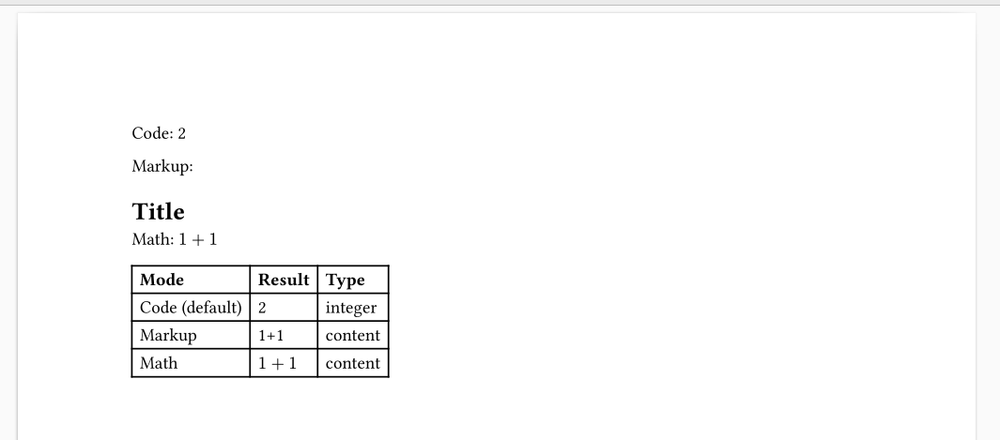

In theory, `eval(...)` would allow Typst code to dynamically generate _more_ Typst code. It could also be used to, say, [read other Typst files from disk](https://typst.app/docs/reference/data-loading/read/), and then pass them to Typst's engine for evaluation, with their results (be them the result of code being run, or markdown) being included in the main document that called `eval`. This isn't quite LISP levels of code inception, but it's fairly close without the code-is-data philosophy of LISPs.

Use of `eval` isn't recommended, as is the case with similar functions in other programming languages that offer similar functionality. For references, see [Javascript's dire warnings](https://developer.mozilla.org/en-US/docs/Web/JavaScript/Reference/Global_Objects/eval#never_use_direct_eval!) and [an article on Python's `eval`](https://www.udacity.com/blog/2023/03/pythons-eval-the-most-powerful-function-you-should-never-use.html).

> This function should only be used as a last resort.

However, it's still there, in case you need it.

To conclude this part: Typst's documents have [a fairly powerful scripting language](https://typst.app/docs/reference/scripting/) that can perform various operations, such as logical and arithmetical operations, string manipulations, reading data from disk, and more. Furthermore, the scripts that exist inside a Typst document can build and output content to the PDF that is being generated. This means that Typst documents can have parts that are generated dynamically, such as a bullet list whose elements are read from a file, images that vary, or tables with a variable number of rows. This means that Typst can be used as a tool to build dynamic "reports" or other similar documents, that have a fixed structure and some parts but where other parts vary per document.

### Bonus: plugins!

While we're on the topic of Typst's scripting language, let's briefly mention Typst's plugins, since they're very useful in extending Typst's capabilities.

Typst natively supports plugins, pieces of third-party code that extend the functionality of Typst's scripting language. Plugins are used to implement templates (e.g. a certain journal's style guidelines), visualizations, pure logic (such as the base-64 package that we've just used) and other features that aren't feasible to include with the Typst core.

As we've discussed before, there's a repository where plugins can be published, called [Universe](https://typst.app/universe/). It's where most plugins live (though note that it's not required, as you could publish a package just on Github or elsewhere and direct people to [download the code and place it in the appropriate directory](https://github.com/typst/packages#local-packages)). The Universe provides discoverability (it has a really nice web UI with a search bar and a preview of each package's README, much like NPM, Pip, Cargo or other package managers), and it also eases installation (if a package is published in the Universe, users can just import it in their Typst files. There's no need to run any commands or install things). Some LaTeX distributions, such as MiKTeX, also [have the ability to autoinstall packages](https://docs.miktex.org/manual/autoinstall.html) when they're imported and aren't installed in the computer.

To use a package in a document, you use [the `import` function](https://typst.app/docs/reference/scripting/#modules):

```typst
#import "@preview/based:0.1.0"

#str(based.base64.decode("SGVsbG8h"))

OR

#import "@preview/based:0.1.0": base64

#str(base64.decode("SGVsbG8h"))
```

The first form imports the entire package, here `based`, [a package that implements conversions to and from base-16, base-32 and base-64](https://typst.app/universe/package/based). That package has a `base64` variable that contains a `decode(...)` function.

In the second form, we specify which elements from the package should be imported, here only `base64`. The rest of the code is the same.

Some packages are pure Typst code, such [as the `based` package above](https://github.com/EpicEricEE/typst-based/tree/master/src). They may just contain logic that can be expressed in Typst code. Or they may not need anything else: consider templates for a certain journal, where everything can in principle be written in Typst itself (it's just a lot of settings for a lot of elements, and set rules, and show rules, and other Typst constructs). Or they may be providing a higher-level API over lower-level functions that already exist on Typst, such as [the `cetz` package](https://github.com/cetz-package/cetz), which eventually resolves its shapes to [raw visualization calls](https://typst.app/docs/reference/visualize/), in terms of lines, ellipses and polygons. 

However, Typst also supports plugins written in other programming languages. This is done [via WebAssembly plugins](https://typst.app/docs/reference/foundations/plugin/). WebAssembly is a fairly modern technology, [originally designed, as its name implies, for web browsers](https://developer.mozilla.org/en-US/docs/WebAssembly). It's fairly low level code (similar to assembly in that it operates on primitive instructions such as addition or loading to a register, along with a very simple linear memory model), which can be executed in a browser in a very performant manner, close to that of native (compiled) code. Of course, much like with traditional assembly language, you most likely won't write programs directly in it. Instead, other higher-level programming languages (e.g. Rust, C# or Python) can be compiled into WebAssembly and used in browsers, as long as they obey the calling conventions, which are standardized.

WebAssembly, being a web technology that would be used on browsers, is _very_ concerned with safety. Safety [as in memory-safe](https://www.embedded.com/memory-safety-in-rust/), AKA preventing null-pointers from doing null-pointery things; and also safety as in sandboxing, AKA very strong guarantees (that can be enforced by the host application, typically the browser) on what can be done by the WebAssembly programs that run inside of it. This is, of course, because browsers need to treat all their inputs (usually Javascript code, and now WASM too) as potentially untrusted, since the user may have visited a malicious page. In practice, this means that a lot of care has been taken to prevent WASM programs from being able to compromise their host application/interpreter/VM. In a browser, such compromises (such as being able to read arbitrary process memory) would allow a malicious page to extract user data, such as what other tabs are open and what is displayed on them, or the user's credentials that are saved in the browser password manager, or cookies, or (if writes are possible) to modify said data. Hence the memory safety.

That being said, WASM has also found some popularity in other, [non-Web environments](https://webassembly.org/docs/non-web/). Its emphasis in memory safety means that it's much more difficult for a plugin written in WASM to crash its entire host entire application, because traditional bad reads and writes that are possible in, say, C are a lot more difficult (ideally impossible). The sandboxing capabilities mean that the host application can provide good guarantees on what the plugin is and isn't allowed to do, which is nice when you may be running not-necessarily-trusted code. Since WASM was defined for browsers, which are by necessity cross-OS, WASM's semantics are the same across OSs and processor architectures, which means that (as long as there's a compliant interpreter for your processor+OS+whatever else combo) WASM programs should run in the same way for everyone. WASM programs aren't tied to, say, the Windows API, or the Linux API, or the Mac OS API.

For example, WebAssembly programs [can run in Deno](https://docs.deno.com/runtime/reference/wasm/), a Javascript runtime (think "replacement for Node.JS") with [very nice security guarantees](https://docs.deno.com/runtime/fundamentals/security/) (e.g. "no programs can read the file system or make network calls unless explicitly allowed"). WASM is used [by Spin](https://developer.fermyon.com/spin/v2/), a serverless platform (similar to AWS Lambda or Cloudflare Workers) where event handlers can be written in one of many programming languages (they're then all compiled to WASM before they're loaded on Spin). Istio (a service mesh that is fairly common in Kubernetes ecosytems) [can load and use WASM plugins](https://istio.io/latest/docs/reference/config/proxy_extensions/wasm-plugin/) at various points when a request is being processed. Fluent Bit, which is a program that collects, processes and forwards observability data (i.e. logs, metrics and traces) from applications to monitoring applications, [supports WASM plugins](https://docs.fluentbit.io/manual/development/wasm-filter-plugins) for inputs (i.e. sources of data) and filters (i.e. stages that receive some data, transform it in some way and then output the new data). The Open Policy Agent, OPA, which is a tool where authorization policies can be expressed (e.g. "users who are in the Customer Service group can see the accounts of other users who are in their same region, for troubleshooting purposes") and evaluated (e.g. given a certain user X who wants to see the account of another user Y, should that be allowed?) can [dynamically generate and return small WASM programs](https://www.openpolicyagent.org/docs/latest/wasm/) that implement the authorization policy. For example, OPA would be able to generate a WASM program that, when called with the data of two users, returns either `true` or `false`, depending on whether the first input user is allowed to access the account of the second input user. In effect, that's the authorization policy, embodied in an executable form. In this way, the application that needs to enforce that policy can do so itself (it asks OPA for the decision program, then loads it locally using a WASM runtime in the app's language, and then calls it repeatedly whenever it needs to authorize an operation). Otherwise, the application would have to call OPA, which is a separate component, whenever an authorization decision needs to be made, which adds latency (because of the network hop) into _every_ request, because most requests probably need authorization.

There are probably many more examples. WASM provides a nice way for programs to load and run small pieces of code that need to run fast and should be isolated, perhaps because they may not be trusted. It's also useful to provide cross-language compatibility (by using yet another language, WASM). And it's supposed to be fast.

Typst can also load and invoke WASM plugins. They're completely isolated:

> Plugins run in isolation from your system, which means that printing, reading files, or anything like that will not be supported for security reasons.

This means that WASM plugins in Typst are limited to "pure" computations, i.e. take an input, crunch the data, spit out an output. No reading files, calling servers, or other environmental interactions.

While it's not explicitly stated in the docs, one of the points of providing WASM plugins is to allow people to write plugins in other programming languages, not necessarily on Typst's scripting language. As long as it can compile into WASM (and most mainstream programming languages can), it should be possible to use many languages to express the logic of the plugin, and then have the WASM compiler translate it into something that Typst can load and use.

Since WASM is a very low-level language, there's [a protocol that all plugins must adhere to](https://typst.app/docs/reference/foundations/plugin/#protocol). It involves a bunch of byte arrays (the equivalent of `char*` in C), into which the input arguments are read. Once it has its arguments, the WASM function can do whatever it wants with them (subject to the constraints of the sandbox), and it'll then place its output in another byte array, from which Typst code will read it. Typst provides [an example repo](https://github.com/astrale-sharp/wasm-minimal-protocol) with Rust, Zig and C examples, all of which can compile into WASM.

## Typst as a dynamic document generator

Now that we've seen that Typst embeds a scripting engine that has many of the capabilities of a programming language, we will see how Typst could be used as a report generator or templating engine. 

### Alternatives

There are many tools that can take a Word document with some special markup (a "template"), plus some variable "data" (typically a JSON document) and generate either Word or PDF documents where the variable data has been merged into the template document. A non-exhaustive list, in alphabetical order, is as follows (each one links to a page with demos):

* [Carbone](https://carbone.io/templates-examples.html)
* [Docmosis](https://www.docmosis.com/how-it-works/document-gallery/)
* [Docxtemplater](https://docxtemplater.com/demo/#/view/energy-performance-certificate)
* [JSReport](https://playground.jsreport.net/w/admin/d7o0nIWc) (note: click the Run button at the top left to generate the output report)
* [Plumsail](https://plumsail.com/docs/documents/v1.x/document-generation/docx/demos.html)
* [Templater](https://templater.info/demo)

They all use the same ideas: you design (typically in Word, which is what people are familiar with) something that looks like this:


This is the template, from which many documents will be rendered. To render a document, the templating engine is called with that template and a set of data to replace into the template, typically a JSON document, which may look like this:

```json
{
	"title": "Miss",
	"firstName": "Victoria",
	"lastName": "Barton",
	...
}
```

The result is either a Word or PDF document that may look like this:


Another example, this time of an invoice:

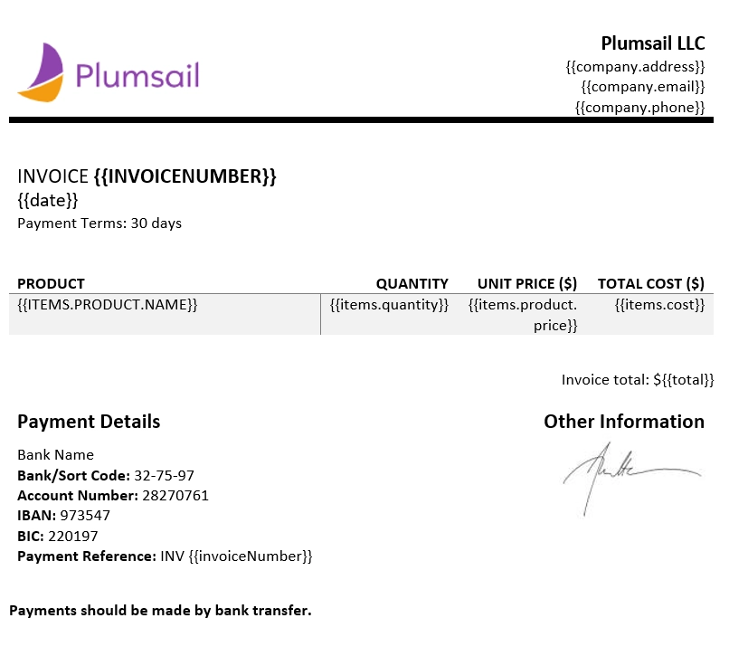

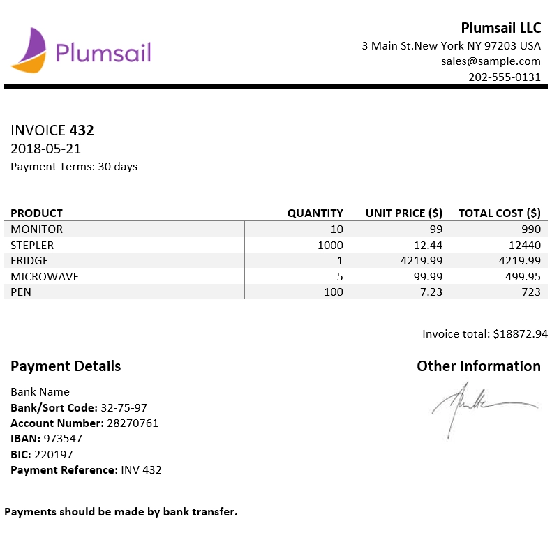

Of course, all these templating engines aren't just capable of replacing `<<var>>`, `[[var]]` or `{{var}}` placeholders (the exact syntax depends on the engine). They can also run loops to repeat elements. Some of them do it automatically, such as in the Plumsail invoice just above. Observe how the table has a single row in the template, which represents a single line item in the invoice. However, once rendered the row has four items, one for each of the elements in the `items` array. Other engines, such as Carbone, have explicit markers for the start and end of the loop. 

They can also conditionally show or hide parts of the document, depending on conditions that are checked against the input data. Most of them can include images in the document, though for most of the listed projects the ability to do so is paid (and, in some, the entire engine is paid). Some even allow for conditional formatting (say, only bold some text if a certain condition is fulfilled).

### Uses

Engines such as these are useful whenever you have an application that needs to generate PDF documents, e.g. invoices, certificates, or other documents that have a fixed skeleton but variable contents. For example, my bank can generate account statements that certify that person X with national ID document N has account M in the bank with a balance of between A and B. Somewhere in the bank's applications is a templating engine. Our tax authority also generates PDF certificates whenever you submit a tax declaration, displaying the amount that you declared, any paid money, and the date. If you have an online course service (à la Coursera/edX/whatever), the PDF certificates of completion/passing are generated from a template. Most if not all e-commerce sites can generate PDF invoices. Our traffic department (called [DMV](https://en.wikipedia.org/wiki/Department_of_motor_vehicles) in the US) generates PDFs that contain the date, time and license plate of your car for your annual car revision appointments, which you must present when taking the car there. SaaS applications may be interested in generating, say, a report of user accounts, each with its active/inactive status, time of last activity and granted privileges. My university, if I ask nicely and pay a certain amount of dobloons, will probably generate a transcript with the courses that I took and the grades that I got on each. There's [a government dependency](https://www.senescyt.gob.ec/) which validates all university-and-higher degrees, without which your title isn't valid in Ecuador, and you can also check the degrees that a certain person has. They can generate, on demand, a PDF with a list of all said degrees. And so on.

Some of those applications (e.g. a bank that emits the account certificates, the DMV generating appointment PDFs, or a university that can generate course grade transcripts) have fixed templates, that just need to be filled with variable data. They can be thought of as having empty "slots" that should be filled by data to generate a complete document. For example, a bank account certificate may contain:

* The date the certificate was generated
* A "certificate number"
* A validity date, which when I generated one was 15 days after generation
* A name to which the entire certificate, which is in the form of a letter, is addressed to 
* The name of the account holder who requested the certificate
* The identity number of the account holder
* A table with all the "financial products" that the account holder has on the bank (e.g. accounts), each with the product name (e.g. checking or savings account), the account number, opening date, and status (active/inactive)

Of that data, some comes from the bank's app database (e.g. the user's name and ID number, which were collected when opening the online banking account, and the contents of the table with the user's accounts), some comes from the web application and is collected when the report generation is commanded (namely, the name of whoever the certificate is addressed to), some comes from internal logic (the certificate number), some is a property of the universe at that time (the date of generation), and some could be computed just-in-time from other properties (the validity date, which is the generation date, plus 15 days).

For other use cases (e.g. an e-learning platform where people or organizations can submit courses, and other users can take them), the templates _themselves_ aren't part of the platform itself, but are instead part of the user-submitted data that the application manages. Much like course creators provide a course name, description and image when submitting a new course (along, of course, with the course's actual content), they may also have the ability to control the appearance of the certificates that they emit. Not all e-learning platforms have this, presumably due to the difficulty of implementing it: Udemy [only allows coursemakers to request that their organization's logo be added to certificates](https://business-support.udemy.com/hc/en-us/articles/4421577903383-How-to-Add-Your-Company-s-Logo-to-Certificates-of-Completion-for-Custom-Courses), while edX [only seems to support customization of the HTML templates that generate certificates](https://edx.readthedocs.io/projects/edx-installing-configuring-and-running/en/latest/configuration/enable_certificates.html#customize-certificate-templates-for-your-organization) in the self-hosted Open edX platform (I couldn't find any such information for course makers in the official edX site).

Same goes for e-commerce sites: the platform that implements the e-commerce stuff is usually separate from the products themselves that are sold there. The application is just "an e-commerce platform" that then a company deploys and fills with the things that they actually sell. If the "e-commerce platform" wants to provide the people that deploy it with a way to send customized PDF invoices on every order, then they need a way to render arbitrary user-submitted templates. Or consider Amazon, which (ignoring Amazon-sold products) is supposed to be just a channel between sellers and buyers. If Amazon allowed sellers to generate custom invoices (I couldn't find any evidence that they do), they'd need a way for sellers to upload a template that would then be filled, by Amazon, with each purchase's information; and mailed, by Amazon, to the purchaser. Same goes for PayPal, where payments can be made and invoices sent: they'll always, as far as I could see, use [this same payment template](https://www.paypal.com/us/invoice/invoice-template-generator). In fact, that's a really good example because it neatly highlights the variable fields (pointed to below by red arrows) and the fields that, while not static, can be computed from others (pointed to by green arrows):

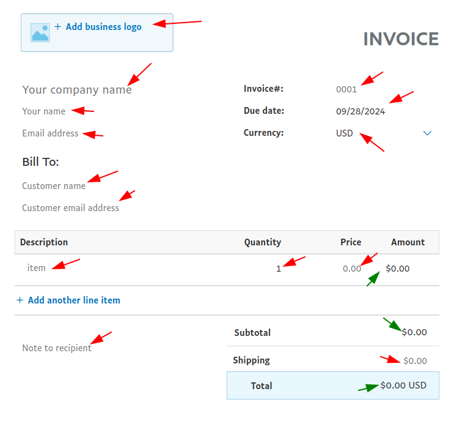

### Typst's applicability

As we've seen, Typst is mainly intended to be used to generate static documents (i.e. ones where the source `.typ` file, plus any resources such as images that need to be displayed, will generate the same PDF every time). This is much in the spirit of LaTeX, where the source `.tex` file is the source of truth for the output PDF, another representation of the same content. The source files (`.typ` or `.tex`, respectively) would have been lovingly typed, character by character, by whoever is authoring the document.

However, Typst (and LaTeX too, for that matter, since it also embeds a programming language) can also be used to dynamically replace content into the document, thereby allowing them to be used to implement templates. These documents would be generated automatically, outside of anyone's direct supervision, and embedded in automatic processes such as invoicing or reporting, where the first time that someone would see the document is when it's already generated and sent to someone, such as via a monthly email or on every purchase.

### Feeding variable data

The first need of templating engines is to have a way to pass variable data into the template, so it can be referred to. The way of doing so varies per engine, but it typically involves providing a JSON document that will then be accessible in the template, either directly or under a magic name. For example, [Carbone](https://carbone.io/documentation.html#substitutions) exposes all the input data under the `d` variable:

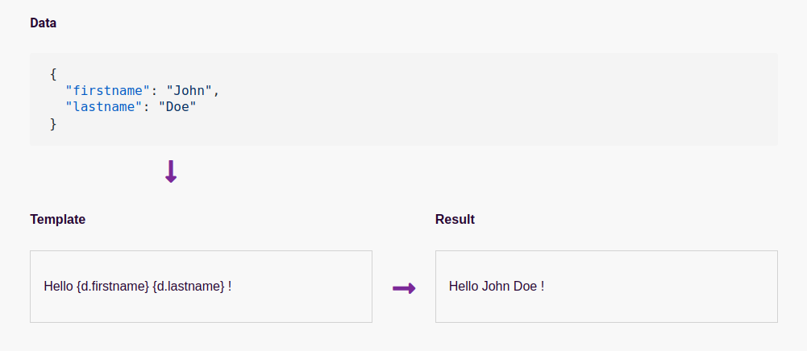

whereas [Plumsail](https://plumsail.com/docs/documents/v1.x/document-generation/docx/how-it-works.html) puts each key of the input JSON document into the topmost context, much as if they were global variables:


In Typst, there are two (that I could see) main ways of passing data _into_ the template. The first one would be to [read a file and parse it as JSON](https://typst.app/docs/reference/data-loading/json/), after which point the data will be available as a native Typst value, probably a [dictionary](https://typst.app/docs/reference/foundations/dictionary/) or an [array](https://typst.app/docs/reference/foundations/array/):

```typst
#let d = json("invoice_data.json")

= Invoice #sym.hash #d.number

/ Due date: #d.due_date
/ Bill to: #d.buyer_name (#link("mailto:" + d.buyer_email)[d.buyer_email])

TODO table here!
```

If we place a file named `invoice_data.json` right besides the `.typ` file and then run the Typst compiler, we get a PDF like this:

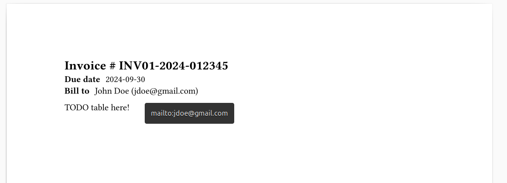

In practice, a web application that wanted to use this approach would do something like this:

1. The Typst template should already exist, either hardcoded as part of the application (if it's controlled by the application's developers and changes aren't frequent, as happens for example with password reset emails, whose templates are typically included in the app's code), provided by the application's users (as in the case of e-learning with custom certificates) or read from some sort of object storage (which would allow changes to the template without the need to deploy a new version of the application)
2. When a PDF needs to be generated (say, a sale is made and an invoice should be sent, or the user of the banking application clicks the button to download his account certificate), the application copies the master template into a new, empty directory (probably on the system's temp directory, e.g. `/tmp` on Linux)
3. The application prepares the data that should be rendered into the template, as a JSON-equivalent document, and saves it as a JSON-encoded file in the same directory
4. The application invokes the Typst compiler on that directory
	* The easiest way is to shell out and call the `typst` command. This approach [is taken by the `typst.js` Javascript package](https://github.com/typst-community/typst.js/tree/main) ([here](https://github.com/typst-community/typst.js/blob/cebc5e31651d1f0c5180bf7320136d10de836bff/src/compile.ts#L44-L46) you can see how it dynamically builds the CLI arguments for Typst and then calls something equivalent to `typst compile --flag1 val1 --flag2 val2 input_file.typ`) 
	* It's also possible to call Typst directly from the programming language used, for some programming languages: Typst is [a Rust library](https://crates.io/crates/typst), and by depending on that crate it's possible (from a Rust program) to call [the top-level `compile` function](https://docs.rs/typst/0.11.1/typst/fn.compile.html), which wraps the entire compilation process. There is also [a Python package, `typst-py`](https://github.com/messense/typst-py), which embeds Rust code and thus includes Typst's crate directly: [here's](https://github.com/messense/typst-py/blob/4492759b5a06f820a0c026852022275f25bc69c4/src/lib.rs#L193) the calls to Rust code, which is then wrapped and presented as a Pythonic library
5. Whatever the approach, the result is either a new document written to the same directory (such as when using the Typst CLI) or a binary string that contains the PDF's bytes (the Typst crate and Python library, for example, support that)
6. The new document can be served to the user, e.g. by returning it as a HTTP response [with the `Content-Disposition` header set to `inline`](https://developer.mozilla.org/en-US/docs/Web/HTTP/Headers/Content-Disposition), which triggers the browser to display the image in the built-in PDF viewer, or to `attachment` to trigger the browser to download the PDF directly
7. Alternatively, the PDF can be sent via email, stored in object storage to be presented to the user later, or whatever else needs to be done

The main idea is therefore to write templates assuming that there's a magical JSON file that will always exist and have data _for the current rendering of the template_. It's then the application's responsibility to ensure that the template is always rendered with the proper data, hence the whole process of copying the template to a temp directory for each render. Otherwise, it wouldn't be possible to render the same template multiple times simultaneously, since they all would try to point to the same JSON file

There's an alternative, provided by Typst's [`sys.inputs` dictionary](https://typst.app/docs/reference/foundations/sys/). This "makes external inputs available to the project", and they're provided on the CLI by using `--input key=value`, which will then be available on the template as `#sys.inputs.key`, of value `"value"` (always a string). For the use case of rendering templates, where it's very likely that things more complex than a single string are required, [the `json.decode` function](https://typst.app/docs/reference/data-loading/json/#definitions-decode) can be used to convert that string into a Typst dictionary, which can then be used just like the result of `json("path.json")`.

The advantage of this method is that it keeps data flow explicit and it's purer (in [the functional programming sense of the word](https://wiki.haskell.org/Pure)), whereas dropping the JSON data into a file and then having the Typst compiler read it relies on side-effects: one part of the program writes a file, later another part reads that same path, and they expect the same contents to be read from that path as were written there. This is why we had to have the temp directory and copy the template there. By contrast, using `sys.inputs` passes the data straight from the compiler to the Typst template. It also incurs in no I/O, which may be nice in certain situations and plays well with the stateless nature of containers (which, to be fair, could also use `/tmp`), since all the data is passed around in memory only.

```typst
#let d = json.decode(sys.inputs.data)

// NOTE: Below is the same, d contains the same data as in the example above

= Invoice #sym.hash #d.number

/ Due date: #d.due_date
/ Bill to: #d.buyer_name (#link("mailto:" + d.buyer_email, d.buyer_email))

TODO table here!
```

This needs to be compiled like this (in Bash. Other shells may need a different syntax for quote escapement, since it's necessary that the inner quotes, which are provided to Typst, are double quotes. JSON needs those):

```bash
typst compile --input data='{"number": "INV01-2024-012345","due_date": "2024-09-30","buyer_name": "John Doe","buyer_email": "jdoe@gmail.com"}'
```

Or, if using the Python library, where `sys.inputs` can be provided:

```py
import json
import typst

# Read from DB, compose dynamically, or whatever
context = {
  "number": "INV01-2024-012345",
  "due_date": "2024-09-30",
  "buyer_name": "John Doe",
  "buyer_email": "jdoe@gmail.com",
}

# Rendr template into PDF
pdf_bytes = typst.compile(
              "template.typ", # Should refer to sys.inputs.data
              sys_inputs={"data": json.dumps(context)})

# Now pdf_bytes can be written to a file, sent via email, stored on object storage, or whatever
```

This compiles into exactly the same PDF as in the example above, where we read the JSON document from a file in the filesystem.

Of course, since `sys.inputs` is a built-in feature of Typst, it can be used on [the Rust crate](https://docs.rs/typst/0.11.1/typst/foundations/sys/fn.module.html) or any other bindings that use it (e.g. [Python's binding](https://github.com/messense/typst-py/blob/4492759b5a06f820a0c026852022275f25bc69c4/python/typst/__init__.pyi#L108)). In this way, applications can compile Typst documents without ever shelling out (to call the Typst CLI) or performing disk operations (to read the template and/or data files, nor to write out the PDF), purely in memory and as close as it's possible to get to pure computation.

It's unclear how much of Typst's incremental compilation (yes, [they do have incremental compilation](https://github.com/typst/comemo/), which is useful to speed up PDF generation) would be used in such cases. Then again, how much is shared in the case of templates with variable data? When writing a paper, most of the time you'll be recompiling documents that have almost the same content as the last time, usually with some more added. Therefore, a large portion of work (say, each paragraph that wasn't touched. I'm uncertain on how Typst handles it) could be reused. Not so in document generation, where the changes happen all at once and across the entire document.

A possible middle point (between reading actual files from disk using `json("filename.json")` and using `sys.inputs` for direct-to-engine injection of values) would be, if using a library that supports it, to intercept file reads and, if they refer to files that end in `.json`, not to read them from disk but to return the template data. In such cases, it would be possible to provide "virtual files", i.e. files that don't actually exist, but to the template they do exist, and contain data (which is transparently switched on each invocation, but the template doesn't need to know that).

For example, the Python library [reads all files from disk](https://github.com/messense/typst-py/blob/4492759b5a06f820a0c026852022275f25bc69c4/src/world.rs#L317-L324) directly, whenever a file read is requested. However, it could, in theory, provide a hook for Python code to intercept the read request and decide how it wants to proceed. The code could decide to read an actual file from disk, or maybe just return some data directly, in the case of the template's context. Such read-file hooks may also be useful to implement a level of sandboxing, since all reads requested by the template would go through developer-controlled code that could, for example, return a "file not found" error if a file that isn't in a whitelist of approved files is read by the template. Typst itself isn't that concerned with that[^1], since it's assumed that you'll write and compile your own templates, and therefore no shenaniganry should be afoot. But in the context of a multi-user web application where people may upload templates, some more care may be necessary.

### Variable interpolation

We've already seen the simple case of variable interpolation, i.e. taking something from the input data and "filling in" the template. This is normally done by `{{field}}` or `[[field]]` or something to the effect, a marker sequence that wraps the name of the field that should be read and replaced.

In Typst, since we have a variable (declared in scripting context) that holds the template's data, we can just switch to scripting mode and print out the value, like this:

```typst
// Assume that "data" contains the input data

Greetings, #data.first_name #data.last_name!

...
```

While on scripting mode, some more complex expressions that are based on the input data can be inserted in exactly the same way:

```typst
To be paid to: #upper(data.name)

Details (#data.items.len() items)
```

We can call functions (e.g. `upper(somestring)`) or methods (e.g. `somearray.len()`), and those values can be inserted too. This may be useful to perform some lightweight calculations on the input data.

### Conditionals and loops

Templates may need to conditionally show and/or hide content. An easy example would be to display "You've bought the following product" vs. "You've bought the following 4 products", depending on whether a single product or several were bought.

Some of the projects that we've been comparing to Typst work by wrapping the content that should either appear or not in a special block, where the condition is specified. For example, [DOCXTemplater does that](https://docxtemplater.com/docs/tag-types/#conditions):

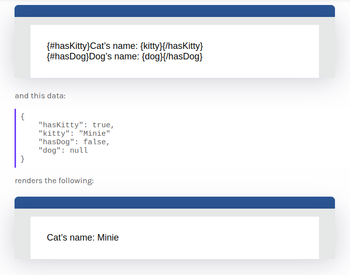

whereas [Plumsail](https://plumsail.com/docs/documents/v1.x/document-generation/docx/conditionally-hide-blocks.html#hide-arbitrary-block) uses a magical `hide-block-if` tag that, when found and true, causes its containing block (e.g. a table cell, which can have invisible borders) to disappear:


Typst [supports `if-else` blocks](https://typst.app/docs/reference/scripting/#conditionals) natively, so it can already show or hide content:

```typst
#let d = json("invoice_data.json")
#repr(d)

= Invoice #d.number

/ Bill to: #d.buyer_name #if(d.at("buyer_email", default: none) != none)[(#d.buyer_email)]
```

When we try to render a document with a `buyer_email`, the if block renders, as expected:

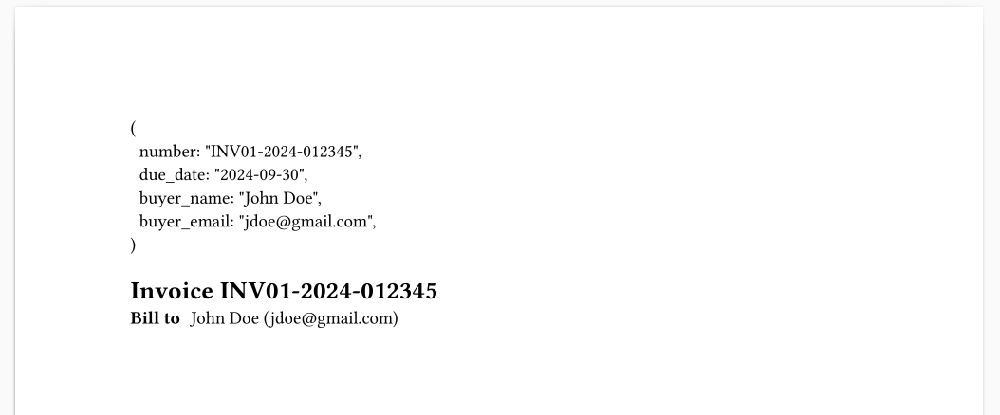

However, if we don't have a `buyer_email` in `d`, then the key lookup [returns the `none` value](https://typst.app/docs/reference/foundations/none/), and the block isn't displayed, and neither are its parentheses:

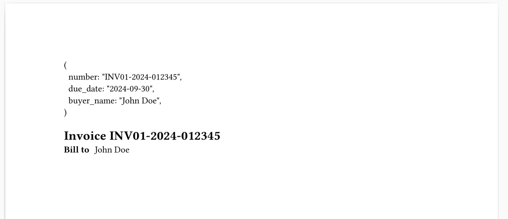

In general, it should always be possible to make Typst completely hide content, because [of the existence of `none`](https://typst.app/docs/reference/foundations/none/). This is the equivalent of `null`/`nil`/`None` in other programming languages, and it represents, as usual, the absence of a value. However, in Typst this value has another use: if it is inserted into the document, it generates nothing, not even an empty space. As we've seen, scripting lines that shouldn't generate output (e.g `let var = val`) _actually_ output a `none`. Therefore, if at any point it is necessary to not output something, it's always possible to emit a `none`. It'll be safely non-printed on the document.

As for loops, some tools (e.g. [Carbone](https://carbone.io/documentation.html#repetitions)) employ some sort of marker for the start and end of the loop. Carbone, as an example, uses the reserved variables `i` and `i+1`, much as you'd use if you were writing a classical `for` loop in C. Whenever a "repeatable section" (e.g. a bullet point, or a table's row, or a paragraph) is found that mentions the `i` variable, it will be repeated until `i+1` is found:

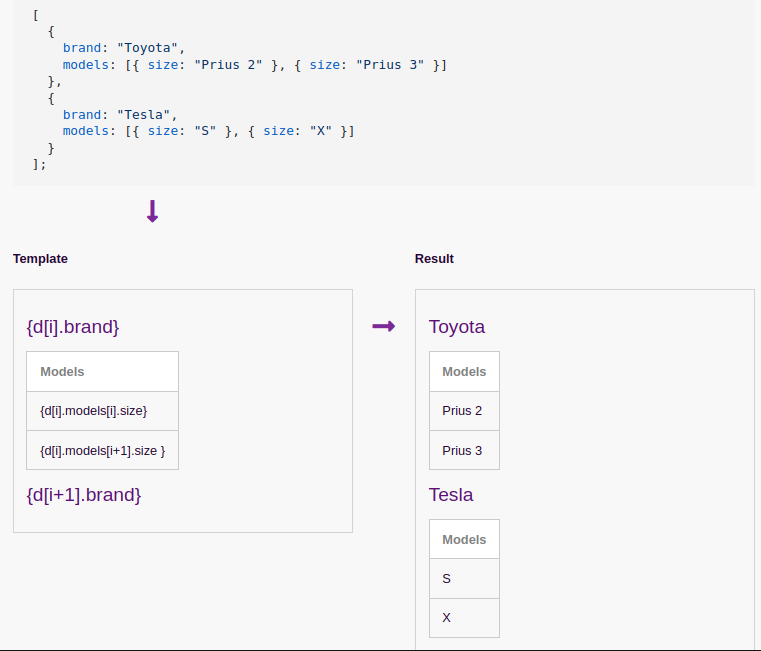

As can be seen in the example above, it's typically possible to perform nested repeats. Above we want to repeat sections of the document, one for each brand of car, where each brand has _itself_ a table that is composed of repeated car models. For the top level, Carbone repeats everything between the `{d[i].brand}` and `{d[i+1].brand}` markers, and for the inner repeat, it uses `{d[i].models[i].size}` and `{d[i].models[i+1].size}` as endpoints.

There are other engines, e.g. [Plumsail](https://plumsail.com/docs/documents/v1.x/document-generation/docx/loops-and-nesting.html), where repetition is implicit (i.e. it has no start and end markers. Instead, it's inferred when the template contains a reference to a key that is _inside_ an array). For example, if you had the following data:

```json
[
    {
        "firstName": "Efren",
        "lastName": "Gaskill"
    }, {
        "firstName": "Sanly",
        "lastName": "Keyme"
    }, {
        "firstName": "Mark",
        "lastName": "Nigma"
    }
]
```

the following template, by referring to the properties `firstName` and `lastName`, which are properties of objects that are inside an array, trigger a repetition (in this case, of bullet points):

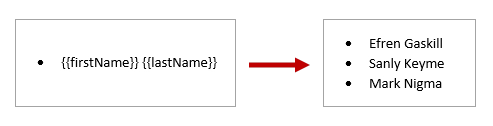

The issue with this approach is that, since there is no end marker, there must be some rules as to what elements are "repeatable". For example, in Plumsail only table rows, bullet lists (and numbered list) and chapters (sections, as defined by using one of the Heading styles) can be repeated.

> If you need to repeat some content that is not a table, bullet list or chapter, just create a single table cell with transparent borders and put content that you want to repeat inside.
> 
> https://plumsail.com/docs/documents/v1.x/document-generation/docx/loops-and-nesting.html

In Typst, looping is achieved by generating an array of `content` elements (which can be anything, such as paragraphs, tables, table cells, images, or whatever. Everything that is output to the PDF is a `content` in Typst.) Arrays of `content` elements are displayed one after the other.

For example, if you wanted to write a set of bullet points, you'd write [a `for` loop](https://typst.app/docs/reference/scripting/#loops) that generated one bullet point (which is internally represented by [a call to `list.item(...)`](https://typst.app/docs/reference/model/list/#definitions-item)) per item in the array:

```json
[
    {
        "firstName": "Efren",
        "lastName": "Gaskill"
    }, {
        "firstName": "Sanly",
        "lastName": "Keyme"
    }, {
        "firstName": "Mark",
        "lastName": "Nigma"
    }
]
```

```typst
#let d = json("invoice_data.json")

#repr(d)

= List of customers (#d.len() total)

#for person in d [- #person.firstName #person.lastName]
```

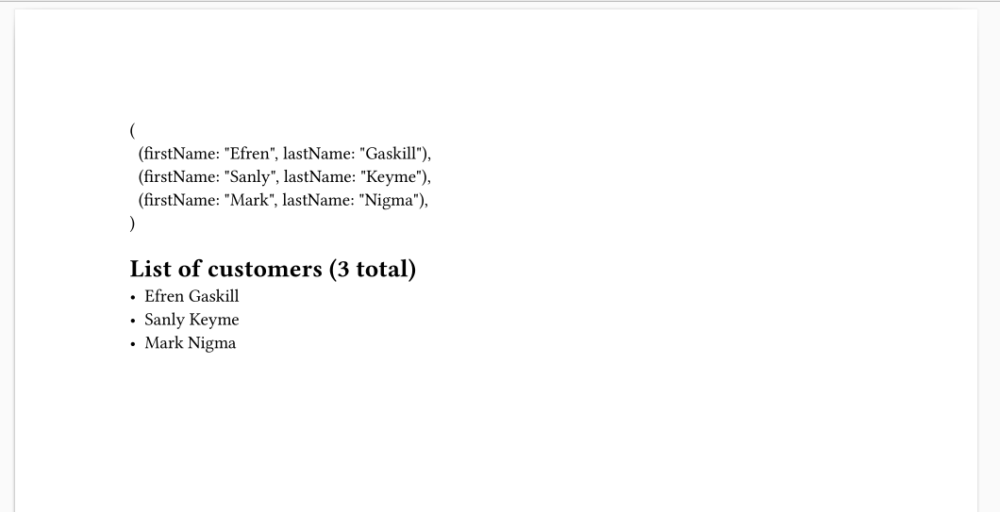

A similar construct, albeit with more nested loops, can be used to repeat things that themselves have repetitions, such as sections where each section has a table where rows repeat:

```json
[
  {
    "brand": "Toyota",
    "models": [{ "size": "Prius 2" }, { "size": "Prius 3" }]
  },
  {
    "brand": "Tesla",
    "models": [{ "size": "S" }, { "size": "X" }]
  }
]
```

```typst
#let brands = json("invoice_data.json")

#repr(brands)

#for brand in brands {
  heading(level: 1, brand.brand)
  table(
    columns: (auto),
    table.header([*Models*]),
    ..brand.models.map(model => model.size)
  )
}
```

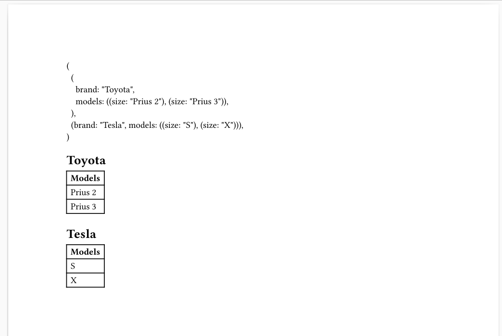

Here we use [the `array.map()` function](https://typst.app/docs/reference/foundations/array/#definitions-map). This function is "the map function", one of the three of the holy triad [in functional programming](https://dev.to/mlevkov/the-holy-trinity-map-filter-and-reduce-381e): it's invoked on an array (here, `brand.models`), it takes a function that describes how each element of the array should be transformed (here, we receive the entire model and pick out the `size` property, which happens to be the only one), and it returns another array, of the same size as the original one, where each element has been transformed as indicated by the provided function. We then [spread](https://typst.app/docs/reference/foundations/arguments/#spreading) that array into the call to `table(...)`, so each model becomes a cell (and, since the table has only one column, each cell in turn becomes a separate row).

Of course, nothing prevents us from nesting _even more_ loops inside them. Perhaps having bullet lists inside the cells that are inside the table that is inside the repeated sections. At that point, it probably makes sense to separate parts of the code (for example, the table) to a separate "component function", which receives a single brand/manufacturer and renders that manufacturer's table.

### Formatting

All of the tools that we've been reviewing respect the formatting of the source document. In other words, if a certain template tag (e.g. `{{some_var}}`) is in a certain font, size or color, then when that tag gets replaced with its actual value, the value will also have that font, size or color. For example, observe the following Word template:

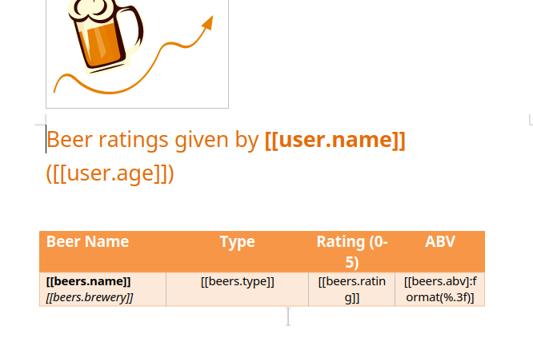

Once compiled, the user's name and age are in large orange font, as expected, since they're part of the title. Similarly, each beer's name is bolded, and the brewery is italicized:

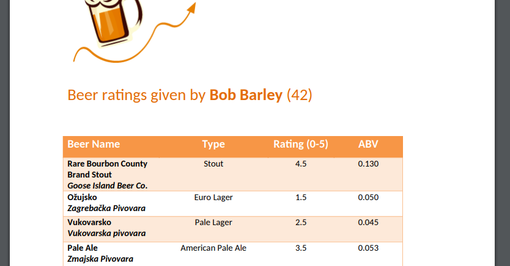

This is nice because formatting can be performed in the usual Word/WYSIWYG way, while editing the template, by selecting a bit of content and applying a format to it. Technically, what was styled isn't actually _the content_, but rather _the placeholder for the content_, but all engines handle that properly.

Typst also works well with that, because interpolating content is a first-class citizen of the language (i.e. switching between markup mode and scripting mode is a normal thing to do in the middle of, for example, a heading or a bolded block). Formatting is therefore preserved:

```typst
#let d = json("invoice_data.json")

#show emph: it => {
  text(red, it.body)
}

= Invoice #d.number

_ Hello, #d.buyer_name _
```

Here we place the invoice number within a level 1 heading, and the buyer's name inside an italics block:

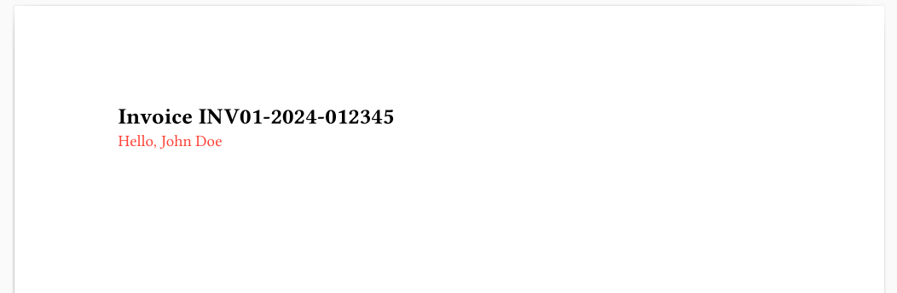

We've switched italics so they render in red, so you can see that the `d.buyer_name` variable is also colored (as it should be, since it's _inside_ the underscores that mark the borders of the `emph` block).

Then there's the issue of _conditional formatting_, such as coloring some table cells (those that indicate errors) in red, or perhaps specifying a color as a variable that comes in as template data (consider, for example, rendering reports in the user's preferred color, perhaps as part of a B2B application where companies can provide their logo and company color).

[In JSReport](https://jsreport.net/learn/docx#docxstyle) that can be done by [using the `docxStyle` tag](https://playground.jsreport.net/w/admin/Mc2Pdcyo):

```handlebars
{{#docxStyle textColor=user.theme.mainColor}}{{companyName}}'s Report{{/docxStyle}}
```

This can be rendered with the following JSON data:

```json
{
    "user": {
        "theme": {
            "mainColor": "green"
        }
    },
    "companyName": "ACME Co."
}
```

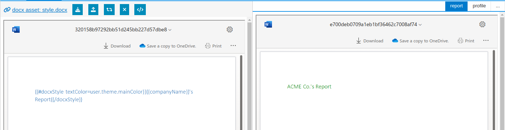

[Carbone](https://carbone.io/documentation.html#-color) also has a `:color` formatter that, when applied to a paragraph, table cell or table row, can change either the element's text or background color. For example, assume that the input JSON data has a key `error` with value `#FF0000`, the hexadecimal color for pure red. The following text will take that color and apply it to the entire paragraph where the tag appears:

```
The assessment did not passed {d.error:color(p)}
```

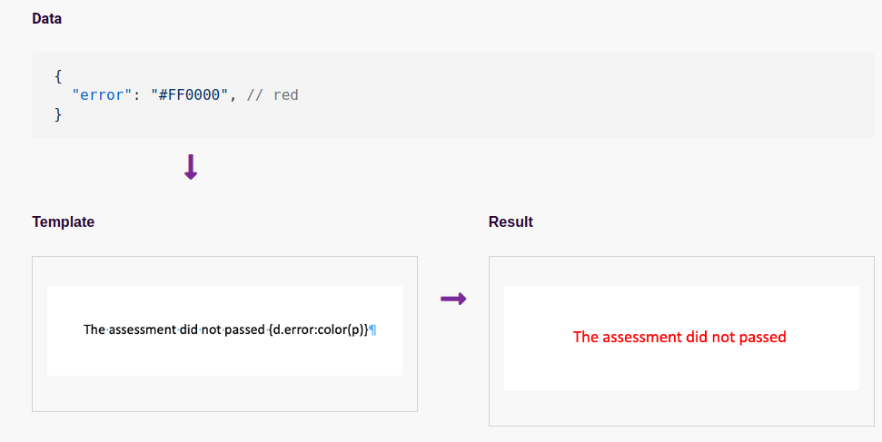

This also works neatly to conditionally color table rows, since the `:color` formatter can alter the colors of the table row in which it appears. For example, below we have some sort of cybersecurity assessment report, where each failed test should be highlighted in red:

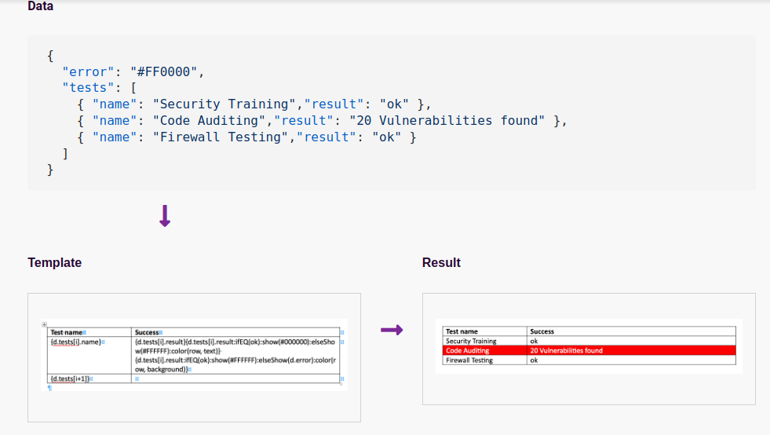

Typst can also do that by directly using [the `text(...)` function](https://typst.app/docs/reference/text/text/), which "Customizes the look and layout of text in a variety of ways". This function can receive [many parameters](https://typst.app/docs/reference/text/text/#parameters), and (at the end, or optionally after the call, in square brackets) a content element. This element will be displayed just as it would normally be, except that whatever parameters were provided to `text(...)` will be overridden. For example, consider the Typst document below:

```typst
#let d = json("invoice_data.json")

#text(fill: rgb(d.user.theme.mainColor))[= #d.companyName's Invoice]
```

After the line that reads the data from a JSON file, we have a call of the form `text(fill: <color>)[= A heading]`. This is syntactic sugar for a call of the form `text(fill: <color>, <content>)`, where `<color>` is in turn a call to `rgb(d.user.theme.mainColor)` (which is itself a constructor of [the `color` type](https://typst.app/docs/reference/visualize/color/), a way of initializing a `color` value from a hexadecimal string), and `<content>` contains a level 1 heading, `= #d.companyName's Invoice`, which _in turn_ interpolates a variable, `#d.companyName`. In this way, the entire document jumps three or four times between markup mode and scripting mode:

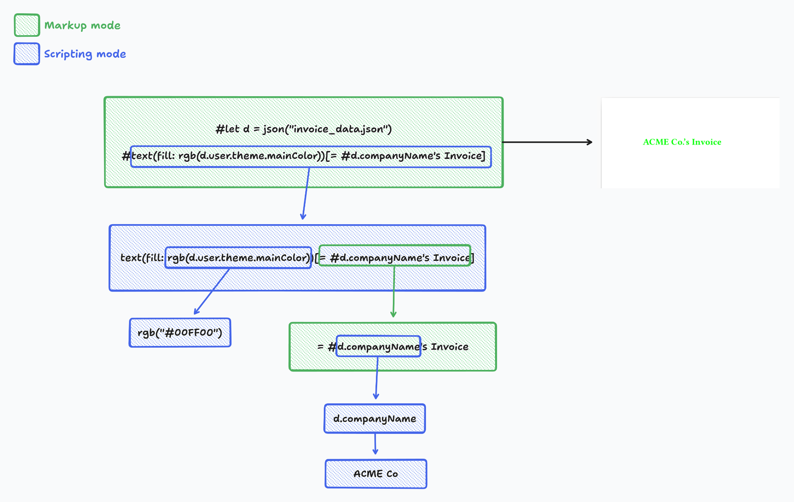

The example that controls the background of a table's color is also possible, because [Typst allows for a cell's properties, such as the background color, to be manually specified](https://typst.app/docs/reference/model/table/#definitions-cell):

```typst
#let d = json("invoice_data.json")

#repr(d)

#let row(test) = {
  let fillColor = if test.result == "ok" {white} else {red}
  let textColor = if test.result == "ok" {black} else {white}
  let textWeight = if test.result == "ok" {"regular"} else {"semibold"}
  let cell(content) = table.cell(fill: fillColor, text(fill: textColor, weight: textWeight, content))
  
  (cell(test.name), cell(test.result))
}

#table(
  columns: (auto, 1fr),
  align: horizon,
  table.header(
    [*Test name*], [*Success*]
  ),
  ..for t in d.tests {
    row(t)
  }
)
```

In the document above, we create a `row(test)` function, which receives a dictionary with the keys `name` and `result`, and returns all the cells (two in this case) that would make up the row in the table that corresponds to that test. It uses the test's `result` to decide whether that row should have black test on white background (in the case of passed tests, where `result = "ok"`), or white text on red background (otherwise, which are failed tests). The background color is applied to the `table.cell(...)` call, while the text color is applied to the `text(...)` call, not to `table.cell(...)`. As far as this last function is concerned, it just receives _some content_. The fact that this content happens to be colored text isn't its business. This is useful because text color is controlled in just one place, in `text(...)` calls; there's no separate "table cell text color" setting. 

`row(test)` returns an array of two cells. Since it's called in a `for...in` loop, which is then [spread](https://typst.app/docs/reference/foundations/arguments/#spreading) into the table call, it generates two cells per test (there are three tests in the sample JSON, so six cells in total, not counting the two heading cells).

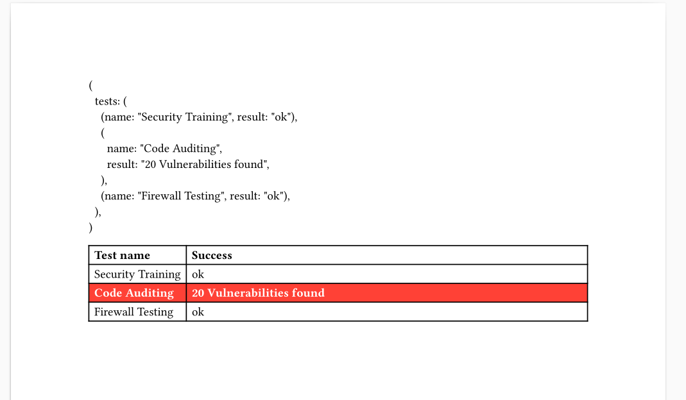

This example also highlights a point where Typst seems more powerful than the other templating engines that we've been comparing it to: conditional formatting can be applied to any property, not just color. Notice how the text in the failed test in the table above is bolded, it hasn't just had its text color changed to white. And the same thing could be done for the text's font family, size or alignment. By contrast, in [Carbone](https://carbone.io/documentation.html#-color) and [JSReport](https://jsreport.net/learn/docx#docxstyle) (to take two examples), setting the color is a dedicated operation, with no equivalent operation for bolding, switching the font size, or other similar operations. In Typst, however, they're all handled in exactly the same way: as arguments to the `text(...)` call.

### Images

Inserting static images in a templated document (say, your company's logo, if you're generating invoices) is trivial: they can just be inserted in the template and they'll appear on each output document.

Inserting _dynamic_ images, on the other hand, is much more difficult. Say that you're a university and want to generate student transcripts, and you want the student's picture to appear in a corner of the document. Somewhere in a web application there's a file for each student, which let's imagine they had to submit when they enrolled, or that picture was taken when they were issued their university ID card. The issue is: how can that (variable per-user) picture be inserted in the template?

This is typically done (see [Plumsail](https://plumsail.com/docs/documents/v1.x/document-generation/docx/pictures.html), [Carbone](https://carbone.io/documentation.html#pictures), [JSReport](https://jsreport.net/learn/docx#docximage)) by inserting a "placeholder image" in the template document, perhaps a blank image. Then, that [picture's Alt Text](https://support.microsoft.com/en-us/office/add-alternative-text-to-a-shape-picture-chart-smartart-graphic-or-other-object-44989b2a-903c-4d9a-b742-6a75b451c669) is used to provide the tag that indicates from where in the context the image data will be read:

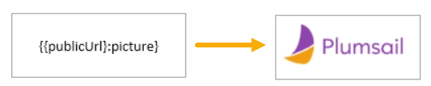

Other tools (namely [Plumsail](https://plumsail.com/docs/documents/v1.x/document-generation/docx/pictures.html#insert-picture-using-text-token)) can use pure text tags, without requiring the template to have a placeholder image:

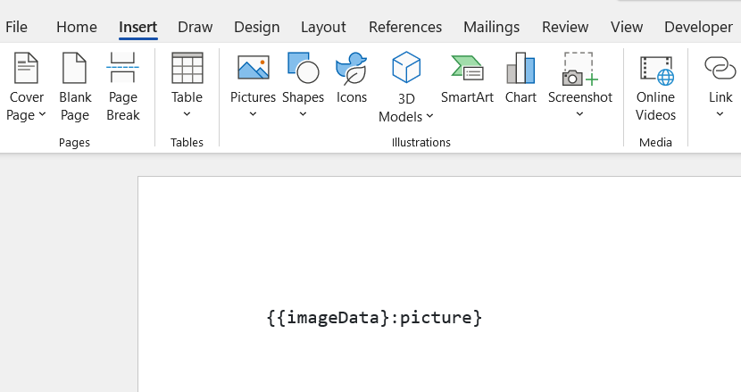

As for the actual _data_ of the image, two options are commonly offered: either the variable that is mentioned in the alt text contains a URL:

```json
{
    "publicUrl": "https://plumsail.com/docs/documents/v1.x/_images/plumsail-logo.png"
}
```

or it contains the raw image data, encoded in Base64 so it can be transported on a JSON string:

```json
{
  "imageData": ""
}
```

If a URL is provided, the templating engine fetches the image that lives at that URL internally while rendering the document. If a Base64 string is provided instead, it can be processed directly, since it contains the image's pixels already.

In Typst, images (just like everything else) are content that is generated via function calls. Images are typically specified by a file path on disk, from where the Typst engine reads them, but it's also possible to pass the raw image data, [by using the built-in `image.decode(...)` function](https://typst.app/docs/reference/visualize/image/#definitions-decode):

```typst
#import "@preview/based:0.1.0": base64
#let d = json("invoice_data.json")
#let imgBytes = base64.decode(d.imageData.split(",").at(1))

#image.decode(imgBytes)
```

The input JSON, truncated, looks like this:

```json
{
  "imageData": "data:image/jpeg;base64,/9j/4AAQSkZJRgABAQABLAEsAAD/4QGERXhpZgAATU0AKgAAAAgACQEPAAIAAAAGAAAAegEQAAIAAAANAAAAgAESAAMAAAABAAEAAAEaAAUAAAABAAAAjgEbAAUAAAABAAAAlgEo..."
}
```

We need to first clean up the image data, because it starts with the `data:image/jpeg;base64,` preamble, which isn't actually part of the data. This is only there because I copied this example directly from Carbone's docs. If we were in control of the application that is generating the data, it would be possible to avoid generating that preamble.

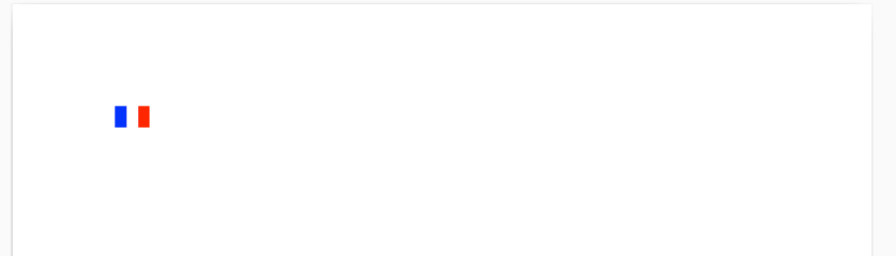

The issue with Typst is that [it isn't possible, by design, to use web URLs for dynamic images](https://github.com/typst/typst/discussions/1219). This is because compilation of Typst documents is sandboxed _very tightly_ to prevent anything from accessing "the outside world". The Typst compiler itself can pierce the sandbox (as it does, for example, when loading images by path, when it reaches out to the local disk), but there's no functionality to read files from URLs. And, based on [this very long and detailed discussion](https://github.com/typst/typst/issues/1056), there's not much interest in adding so: adding that would, for example, expose anyone who receives Typst documents from other sources (e.g. editors in journals, reviewers) to very nasty attacks or data exfiltration. The recommended way is to have an external application (which, in the case of automatic document generation, would be whatever application wants to have the documents generated) predownload any files that are needed and place them next to the Typst source file. Or, as we discussed above in the case of reading JSON data from disk, it may be possible, if using the Rust crate or any other libraries that embed it, to intercept file reads so it's not necessary to actually write the files to disk.

In fact, there's [a package that helps with that, `prequery`](https://typst.app/universe/package/prequery/):

> Typst compilations are sandboxed: it is not possible for Typst packages, or even just a Typst document itself, to access the “ouside world”. The only inputs that a Typst document can read are files within the compilation root, and strings given on the command line via `--input`. For example, if you want to embed an image from the internet in your document, you need to download the image using its URL, save the image in your Typst project, and then show that file using the `image()` function. Within your document, the image is not linked to its URL; that step was something *you* had to do, and have to do for every image you want to use from the internet.
> 
> This sandboxing of Typst has good reasons. Yet, it is often convenient to trade a bit of security for convenience by weakening it. Prequery helps with that by providing some simple scaffolding for supporting preprocessing of documents. The process is roughly like that:
> 1. You start authoring a document without all the external data ready, but specify in the document which data you will need. (With an image for example, you’d use Prequery’s `image()` instead of the built-in one to specify not only the file path but also the URL.)
> 2. Using `typst query`, you extract a list of everything that’s necessary from the document. (For images, the command is given in `image()`’s documentation.)
> . You run an external tool (a preprocessor) that is not subject to Typst’s sandboxing to gather all the data into the expected places. (There is a *not very well implemented* Python script for image download in the gallery. For now, treat it as an example and not part of this package’s feature set!)
> 4. Now that the external data is available, you compile the document.

It works like this:

```typst
#import "@preview/prequery:0.1.0"

#prequery.image(
  "https://en.wikipedia.org/static/images/icons/wikipedia.png",
  "assets/wikipedia.png")
```

When the following command is run:

```bash
typst query --input prequery-fallback=true --field value \
    main.typ '<web-resource>'
```

it outputs a JSON document like this:

```json
[{"url": "https://en.wikipedia.org/static/images/icons/wikipedia.png", "path": "assets/wikipedia.png"}]
```

This JSON document is an array that contains one item per `prequery.image(...)` call that appears in the Typst document, and holds the `url` and `path` for each one. With this, an external tool can fetch the file that lives in `url`, then write it to the local path indicated in `path`. It can then run the render command for the Typst document (either `typst compile` directly by shelling out or, if using a library, whatever function call is used on that library to render a document).

By the way, the magical `typst query` command that generated the JSON file is [a built-in Typst utility](https://typst.app/docs/reference/introspection/query/#command-line-queries). The main idea is that, at any point in a Typst document, [the `metadata(...)` function](https://typst.app/docs/reference/introspection/metadata/) can be called. This function generates no visible output in the document, but it registers a bit of data. What that data means is left to the user, Typst just records it as it appears. Then, the `typst query` CLI command (or, from within a Typst document itself, [the `query(...)` function](https://typst.app/docs/reference/introspection/query)) can be used to ask for, for example, "all the `figure`s in the document", or "the element with tag `ref1`" (as indicated by writing `<fig1>` somewhere in the Typst document). In this case, each image that is inserted with a URL, via `prequery.image(...)`, is tagged with `<web-resource>` (multiple elements can have the same tag, or in other words, tags aren't necessarily unique identifiers of an element in the document). Therefore, when `typst query` is invoked with that tag as the selector, it fetches each instance of those images. Each image carries two pieces of metadata: a URL and a path, both of which were provided by the user. Those are output as a JSON document, which can be read by other systems.

In this way, Typst is kept pure and calm in its nice isolated side-effect-free world. Typst can assume that it'll have whatever resources it needs whenever it needs them. The wrapper application handles that.

Furthermore, if using a library that bundles the Cargo library, it's not necessary to run the `typst query` step in a shell either. For example, [the Python library](https://github.com/messense/typst-py) (which, as we've seen, actually wraps the Rust library via inter-language calls) can [run something equivalent to the `typst query` command directly](https://github.com/messense/typst-py/blob/4492759b5a06f820a0c026852022275f25bc69c4/python/typst/__init__.pyi#L100-L122):

```py
import json

import typst

imgs = json.loads(
  typst.query(
    "main.typ", 
    selector="<web-resource>", 
    field="value", 
    sys_inputs={"prequery-fallback": "true"}))

# imgs will be something like: 
# [
#   {"url": "https://en.wikipedia.org/static/images/icons/wikipedia.png", "path": "assets/wikipedia.png"}
# ]
```

From there on, the application would be able to fetch the URLs in that list, save them to the requested directory, and then run the `typst.compile` function in the same package to generate the actual PDF.

Otherwise, if the language in which the application is written doesn't embed the Cargo library directly, there's always the option of shelling out and running the `typst` CLI manually.

To recap: when generating documents from templates, it may be necessary to insert images that vary per document, such as photos, profile pictures, charts, logos, or even QR codes that are tied to the document. In Typst, this can be done by passing the image data as Base64 strings in the input JSON document. These strings can be read directly by a sibling of the `image` function that is used normally to insert static images that are read from disk, except that now, since the actual image data is passed to the template, it can vary per render. 

If the images are instead provided as (public, non-authenticated) URLs, then Typst doesn't support downloading them as part of the render process, by design, since rendering is supposed to be a sandboxed, self-contained process that involves as little from the external world as possible. However, there's [the `prequery` package](https://typst.app/universe/package/prequery), whose main example usecase is precisely to download images from URLs. It works by adding a pre-processing step in which `typst query` is run, which collects all the appearances of Web-hosted images and outputs a JSON document which contains the URL from which each image should be downloaded, and the path in which the downloaded file should be placed. An external system (here, whichever application needs a PDF rendered) should parse that JSON document, download the URLs, place them in the appropriate locations, and then re-render the Typst document, at which point it'll pick up the (now local) images and render them as normal.

### Charts

To round up the feature recap, let's look at charts. Statistical charts, to be precise, such as bar plots or pie charts.

Word [supports charts](https://support.microsoft.com/en-us/office/add-a-chart-to-your-document-in-word-ff48e3eb-5e04-4368-a39e-20df7c798932), which are internally implemented as embedded Excel documents _inside_ the Word document. Therefore, the raw data that feeds a chart is an Excel sheet. The rendering engine is also shared, or at least looks the same.

Templating engines support charts via several methods. [DOCXTemplater](https://docxtemplater.com/modules/chart/), for example, detects a chart if the title of the chart or a paragraph just before it mentions the chart's data, starting with a dollar sign:

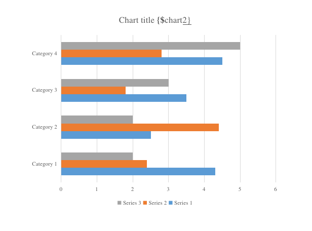

Since that is a bar chart, it has "categories" (each clump of bars) and "series" (each color of bar), each combination of which has a "value" (which determines the width of that clump+color combination). This is passed as part of the JSON context:

```json
{
	  "chart2": {
        "categories": ["5th Qtr", "6th Qtr", "7th Qtr", "8th Qtr"],
        "series": [{ "data": [130, 20, 40, 10] }],
    }
}
```

This renders into a four-category, single-series (hence single-color) plot:


Therefore, the only connection between the input data (in JSON form) and the chart is the `{$chart}` tag that should appear near the chart.

Other tools, such as [Plumsail](https://plumsail.com/docs/documents/v1.x/document-generation/docx/charts.html) or [Carbone](https://carbone.io/documentation.html#native-charts), prefer to make the relationship between input (JSON) data and chart (Excel) data explicit. They allow you to edit the internal XLSX file, in the same way as if you were manually inserting data for the chart. Inside that Excel file, it's possible to use the same template tags, loops and whatever else the templater can use, so the Excel file will also be filled dynamically. Observe the image below, and notice how the Excel file that feeds the chart has been filled with a loop (this is Carbone, hence the two rows with `{d.temps[i]}` and `d.temps[i+1]`, which acts as the end marker):

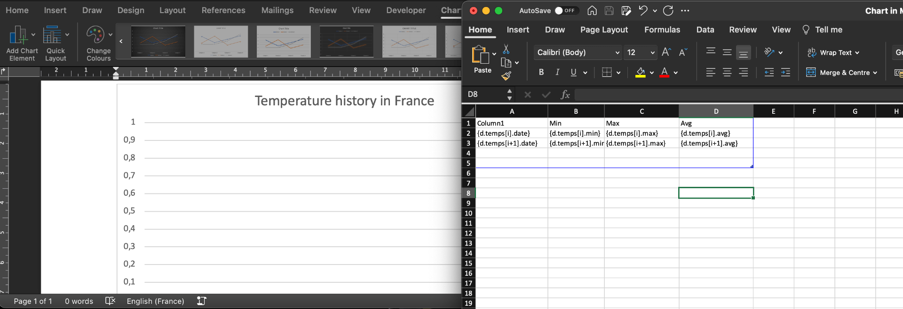

This is rendered as normal with a JSON context that looks like this:

```json
{
  "temps": [
    {
      "date": "01/07/2022",
      "min": 13,
      "max": 28,
      "avg": 20.5
    },
    ...
  ]
}
```

This generates the following PDF, as expected:

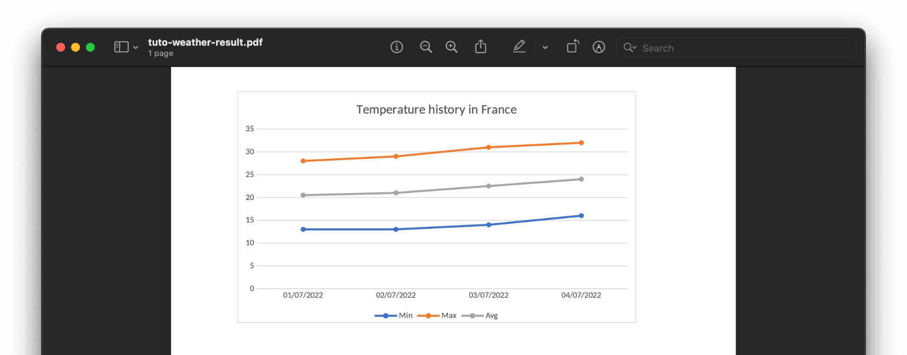

In effect, these tools extend the templating abilities of the tool into embedded Excel documents too. When a chart is encountered, its backing Excel sheet is also templated, just as if it were part of the main document. This generates a filled sheet. This newly-generated data is then used to render the chart.

In Typst, charts could be generated [with `cetz-plot`](https://github.com/cetz-package/cetz-plot), a library that adds statistical plots to `cetz`, Typst's equivalent to TikZ in LaTeX. This library, which is still very new, supports bar, column and pie charts (no scatter plots or line charts yet)


There's also [`typst-plotting`](https://github.com/Pegacraft/typst-plotting), which [can draw](https://github.com/Pegacraft/typst-plotting/blob/master/example/Plotting.pdf) scatter, line, histogram, pie and bar charts, plus some more exotic chart types such as radar charts and box-and-whiskers:


And [`neoplot`](https://typst.app/universe/package/neoplot), which provides a way to embed [Gnuplot](http://www.gnuplot.info/) (which, despite its name, is _not_ related to the GNU project), a very robust plotting framework used, among others, by [GNU Octave](https://octave.org/), the open-source alternative (not necessarily replacement, though) to Matlab. Gnuplot is more aimed at function plotting (i.e. 2D `y=f(x)` and 3D `z=f(x, y)` functions), so it can be used in that case. It can, however, also be used for stats charts (which I know because Octave can render them, so Gnuplot must be able to).

There's also [`nulite`](https://typst.app/universe/package/nulite/), which embeds [Vega-Lite](https://vega.github.io/vega-lite/). Vega-Lite is a language, based on JSON, that can specify the data and the visualization, in a similar manner to [Plotly's JSON syntax](https://plotly.com/javascript/reference/index/). Since `nulite` is mostly a pass-through to Vega-Lite, it follows that it can render whatever Vega-Lite supports, [which is a lot](https://vega.github.io/vega-lite/examples/#single-view-plots).

`nulite` uses [the `ctxjs` package](https://typst.app/universe/package/ctxjs/) under the hood. This is "A Typst plugin to evaluate javascript code". It can load JS modules directly on Typst and run them. `nulite` uses it because Vega-Lite is developed and distributed as a JS library, which is then brought into Typst's plugin environment. In particular, `ctxjs` is a Rust plugin that uses [the `rquickjs` Rust bindings](https://github.com/DelSkayn/rquickjs) to [the QuickJS Javascript engine](https://bellard.org/quickjs/), which is what actually interprets and runs the JS code. This is an alternative implementation of a Javascript interpreter, different to that used by browsers (for example, Chromium uses [V8](https://v8.dev/), Firefox uses [SpiderMonkey](https://spidermonkey.dev/), Safari uses... something?) and server/other environments (for example, Node.js, Electron and Deno all use V8). They're all supposed to perform the same tasks (take in Javascript files, text files, and run them performing whatever steps the files contain) in the same way (which is defined in the [ECMAScript specification](https://tc39.github.io/ecma262/) and its [accompanying Conformance Test Suite](https://github.com/tc39/test262), which "covers every observable behavior specified in the ECMA-414 Standards Suite")

Thus, `nulite`, via `ctxjs`, via `rquickjs`, via QuickJS, embeds an actual Javascript interpreter. This interpreter is then used to load and run the (unmodified, as far as I can see) Vega-Lite visualization library. All of this is done out of view of the user of `nulite`. The user just feeds JSON documents (AKA Vega-Lite specs) that are used by Vega-Lite to lay out and render a chart, such as a bar chart or scatter plot. The result of this call to Vega-Lite is [a Vega spec](https://vega.github.io/vega/), another JSON document that is fed to Vega, a related project that actually generates the visualizations (in this sense, Vega-Lite is just a higher-level library that abstracts away the chore of specifying each aspect of the charts, using sensible defaults, and [hides the lower-level Vega (sans -Lite) syntax](https://vega.github.io/vega-lite/usage/compile.html)). Vega (which is also included and run in the QuickJS Javascript interpreter that is bundled with `nulite`) [renders the chart to SVG](https://vega.github.io/vega/docs/api/view/#view_toSVG), which Typst [natively supports](https://typst.app/docs/reference/visualize/image/#parameters-format), and is included into the document just as if it were imported from disk.

As you can see, even in Typst's fairly early stage of life, there's already several packages for rendering charts, including at least two (`neoplot`, which calls Gnuplot; and `nulite`, which embeds Vega) that make use of very robust, external plotting libraries, thus giving Typst very mature plotting capabilities. In other words, Typst already has, through those libraries, charts comparable to those of Matplotlib or Octave, in terms of capabilities and aesthetics. In fact, it could be argued that, just by having Gnuplot or Vega available, Typst is _already_ better than Word, which is not a dedicated statistical plotting program. Word charts are nice and useful and all, but still... Compare this:

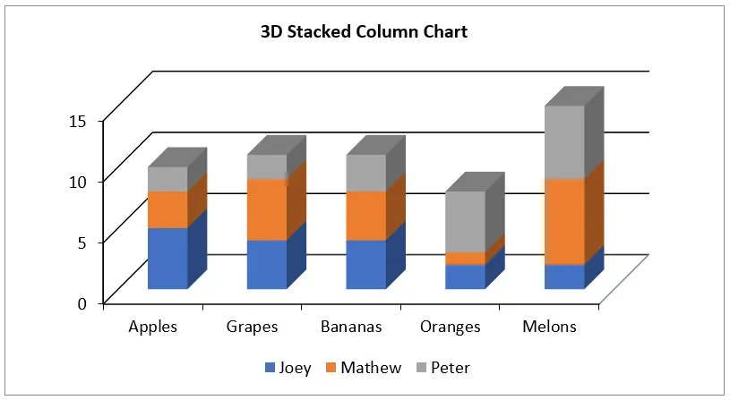

with this:

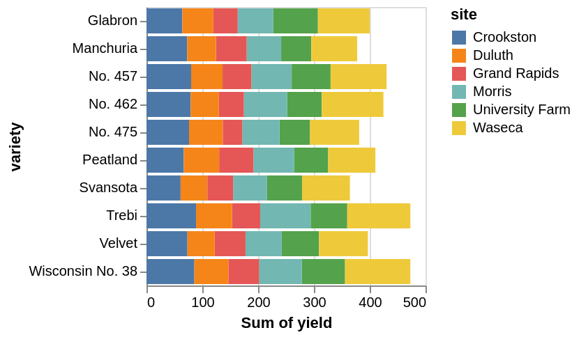

(Okay, I'm intentionally using one of the worst Excel visualization types, a 3D bar chart. You get the point, though)

Let's replicate [an example from DOCXTemplater](https://docxtemplater.com/modules/chart/#viewport) in Typst, using `nulite`, which uses Vega. As a reminder, the original chart (made in Word) looks like this:

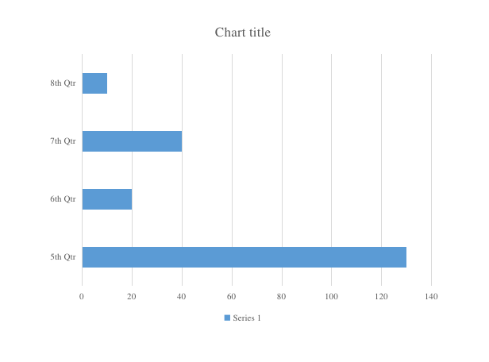

The Typst document is as follows:

```typst
#import "@preview/nulite:0.1.0" as nulite
#let d = json("invoice_data.json")

#repr(d)

#nulite.render(
  width: 50%,
  height: 20%,
  zoom: 1,
  (
    data: (values: d),
    mark: "bar",
    encoding: (
      x: (field: "val", type: "quantitative"),
      y: (field: "qtr", type: "nominal"),
    )
  )
)
```

This is rendered with the following JSON data:

```json
[
  {"qtr": "5th Qtr", "val": 130},
  {"qtr": "6th Qtr", "val": 20},
  {"qtr": "7th Qtr", "val": 40},
  {"qtr": "8th Qtr", "val": 10}
]
```

and generates the following PDF:

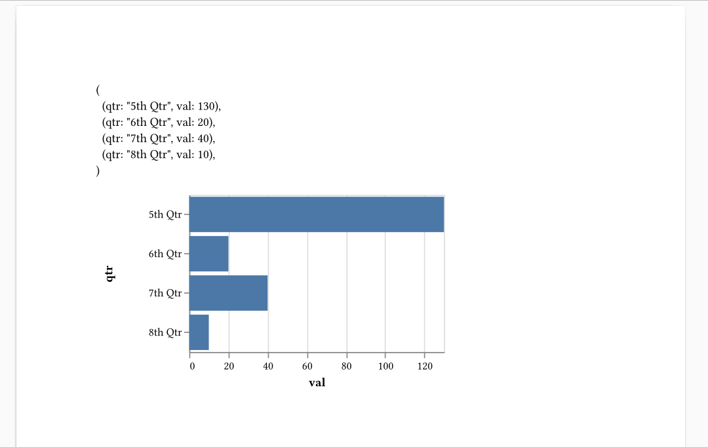

Of course, anything that is possible with Vega should also possible here, absent any weird bugs in the QuickJS interpreter or the magical bundling into a Typst plugin.

To recap: Word templating engines (e.g. Carbone, Plumsail, DOCXTemplater, and so) typically offer a way to render those statistical charts that can be inserted natively in Word (that is, not image, but actual charts that are backed by an actual Excel spreadsheet that is embedded in the Word document). This is sometimes done by extending the templating logic of the engine (e.g. the fact that writing `{{some_var}}` or something to that effect looks up `some_var` in the JSON context and inserts its value at that point, or a way to perform loops) into Excel too, such that it's possible to use data that is passed via the JSON context (say, an array of records, each with a label and a number) to "fill up" the Excel sheet that will then render, say, a pie chart. In this way, rendered documents can include charts whose values change with each render, according to the JSON context passed to each render.

Typst doesn't support that natively (it's a typesetting system, after all, not a plotting library), but there are plenty of packages already that do so. For example, `cetz-plot` is a part of CetZ, Typst's _de facto_ standard graphing library, which supports several types of charts. There are some more independent graphing libraries. There's also `neoplot`, which leverages Gnuplot, a third-party, very mature graphing library (also used, among other things, in GNU Octave). And finally (and my personal favorite), there's `nulite`, which allows the use of Vega and Vega-Lite specs to render very configurable and fairly modern-looking charts, of [all sorts of different types](https://vega.github.io/vega-lite/examples/). Charts are typically inserted as SVG documents, vector images, not PNG or JPEG raster images, which is nice when zooming in.

## Conclusions

In this (very long) article, we've reviewed Typst, a very young (at least when compared to LaTeX and Word) typesetting system that is similar in spirit and intended usage to LaTeX. It was conceived by two German academics, and its main audience is academia, where papers are written, containing Sections, an Abstract, several authors, each with his own affiliation, Figure 1s, Equation 2s, and IEEE citations.

The name Typst is applied to both the _compiler_ (i.e. an application that takes in a Typst file and generates a PDF document) and to the _language_ itself (i.e. the syntax that should be obeyed in those files that will be passed to the compiler). Typst is also a web application, similar to Overleaf and other online  collaborative LaTeX editors, which has paid plans. The compiler and the language, however, [are all properly open sourced](https://github.com/typst/typst?tab=Apache-2.0-1-ov-file#readme) ([like LaTeX](https://www.latex-project.org/publications/2011-FMi-TUB-tb100mittbach-lppl-history.pdf)), so hopefully there's no drama lurking there.

Like LaTeX and Markdown, and unlike Word, Typst's source documents are plain text that can be read and edited in any ultra-basic text editor. Also unlike Word, to see the modifications you need to recompile the source document and generate the output PDF, i.e. you don't edit the preview of the document, as is done in Word, where selecting a word and bolding it instantly changes _the same word_ that was selected. Typst's compilation times are supposed to be faster than LaTeX's (I've seen on the order of tens of *milli*seconds when rerendering a document where not much has changed), and it has incremental compilation (i.e. it can reuse parts of the previous compilation, maybe things like entirely skipping a paragraph if it hasn't changed since the previous time). Typst can therefore provide a live preview of changes (i.e. you type and the PDF at the side changes in near-real-time), which LaTeX tools like Overleaf don['t typically support](https://www.reddit.com/r/LaTeX/comments/17dw2r4/is_there_latex_editor_that_compilesrenders_as_you/), because it may be slightly not-fast-enough.

Typst's syntax is, at least in the common cases, fairly more lightweight than that of LaTeX. The syntax overhead for common cases (i.e. the amount of characters that must be used to mark common formatting constructs such as headings or bold letters) is on par with Markdown (e.g. `= Title` for titles, `*bold*` for bolding, as opposed to `\section{Title}` and `\textbf{bold}` respectively).

Typst, like LaTeX, embeds a "scripting engine" (equivalent to LaTeX's macros), which can be interleaved with the actual content (called _markup_) and is able to generate content itself. For example, a script can insert the content of a variable (which has been declared beforehand in script-land) into the document. Or it can use a loop to generate a set of bullet points or table rows, such that it's not necessary to type them all out by hand, or several representations of the same data can always be kept up-to-date.

Then, we explored the applicability of Typst to the job of generating, not hand-written papers, but instead machine-generated documents (e.g. invoices, reports, certificates, and such) where _a template_ is hand-designed and provided with placeholders, and then that template is repeatedly _rendered_ with different data in each invocation. These are normally driven from a larger application: e.g. an e-learning site may wish to issue certificates of course completion to students, normally subject to the payment of a modically exorbitant sum of galactic credits. Or a bank that offers a button where account holders can generate and download a letter that certifies, To Whom It May Concern, that person Such-And-Such has account #Something open in this bank.

An alternative for generating such automated documents can be found in Word-based templating engines, such as Carbone, Plumsail, DOCXTemplater, JSReport, Docmosis and Templater. These use a normal Word document, filled with magical syntax, as the template. The advantage of such systems is that everyone (who uses Windows, that is) will most likely already have the template editor installed (it's Word, after all), and that, at least for simple cases such as replacing a variable (e.g. "Dear X Y"), the template looks very similar to the documents that it will generate. For more complex constructs, such as paragraphs that should only be shown when a certain condition is true, things may get weirder (some engines, for example, require that you wrap the paragraph in question in a single-row, single-column table with invisible borders, so it can be hidden or shown as a block).

Typst, since it has a scripting engine, is also capable of expressing the conditions that typical templating engines use. Inserting a variable value into the document is done by just switching to scripting mode and inserting that variable. Loops (such as repeating bullet points, table rows, figures or entire sections) are also possible. Conditional display of content (i.e. content that appears and disappears depending on some condition) is possible since Typst has the concept of a "null" value, actually the absence of a value, that can be used at any point and generates no output. Therefore, it's possible to make content appear or disappear by switching in either the actual content or the null value. Finally, since content can also be styled (e.g. the text color can be set) and all Typst syntax ultimately resolves to function calls (e.g. the title `== Heading` is internally interpreted as a function call similar to `heading(level: 2, "Heading")`), it's possible to dynamically style content by using the raw function calls instead of the syntactic sugar and using the appropriate styling parameters, which can now be controlled by the input values for _this particular_ rendering of the template.

Dynamic images can also be inserted by passing them as Base-64 encoded strings, which can then be interpreted by Typst just as if they had just been read from disk, which is "the normal" way of using images when writing papers. Word templating engines also tend to support this. In Typst, however, it's not possible, by design, to use a URL as the source for an image, since Typst wants to treat compilation as an isolated, sandboxed process. There are some workarounds for it that involve a pre-processing step where an external system (which, in the case of automated document generation, could very well be the external application that is driving the process) retrieves information about which URLs are mentioned in the document, then downloads them and places them on local files, and then the Typst document can be rendered as normal, reading the images from disk as necessary.

Finally, Word templating engines also tend to support Word's native charts, which are backed by an internal Excel sheet. This is usually done by allowing said Excel sheet to be templated like the Word document, thereby allowing variable data to be inserted into the sheet, which then causes the chart to change (e.g. bar lengths change, pie sections are added and their angles change, scatter points are added, and so on). In Typst, charts can be added via several packages. Some internally use CetZ, which is used to render arbitrary graphics, in terms of basic graphical elements such as lines, arrows, points, rectangles, circles and polygons. At least one package delegates the chart generation to Gnuplot, which receives commands in [its own special language](https://lwn.net/Articles/628537/). And another embeds and delegates to Vega, a Javascript library that is used to generate plots, one of Javascript's equivalents to Python's Matplotlib or Seaborn (another fairly common one is Plotly). By using Vega, Typst inherits all kinds of charts, which can be rendered from a JSON document, which Typst handles just fine.

In conclusion, we've seen how Typst can be used as a general-purpose document typesetting system, in the same areas as LaTeX (i.e. academic papers and such), and also in other areas. In particular, we reviewed the case of automatically generating documents from templates, in which the structure is fixed (more or less, since pieces may be repeated, or appear and disappear) but the content changes per document (such as reports or certificates that must be emitted with different content each time, but keeping the same style and general structure). We saw how, combining Typst's basic markup constructs (e.g. titles, lists, images, tables) with Typst's scripting engine (which adds the ability to read data as part of the document render, insert that data into the document as-is, or use the data to control the rendering of the document, such as repeating a table row for each item in an array), it's possible to write Typst documents that change themselves based on input data. This is all done without any reliance on text templating systems such as those typically used to generate HTML in server-side frameworks (e.g. Handlebars or Mustache, or Jinja or Django's templates, or Go's templating language, or Twig). Instead of such text-replacement systems, which don't take into account the specific syntax of the file that is being templated (i.e. if we used one of those systems here, it wouldn't be aware of Typst's syntax and could therefore introduce nonsensical syntax), we use Typst's native facilities to keep all processing Typst-aware. Things that aren't available in Typst proper, such as charting, can be handled (and, indeed, have been handled already!) by plugins that, thanks to WebAssembly, can have some very powerful abilities, up to and including embedding an entire Javascript interpreter in which third-party Javascript libraries, that know nothing about the Typst project, can be loaded and used.

Overall, Typst seems like a very nice project. It's a joy to work with, and very powerful if you want it to. The scripting system can be made to work in fairly advanced ways, it's not just a gimmick. Since it's very new, it can get inspiration from all sorts of modern ideas (observe: functions as first-class values, lambda expressions, a modern syntax for the language, Markdown's lightweight markup syntax, JSON as an interchange format, WebAssembly for plugins, a first-class web application, which also causes an insistence on live reloading). If you're in academia or in any other environment (if there are any) where LaTeX is popular, consider giving Typst a whirl.

[^1]: Though it should be noted that even the Typst CLI, a single-user application, doesn't allow arbitrary file reads. In particular, only files within the _project root_, which by default is the directory where the `.typ` file that is being compiled resides, can be read. So no `read("/etc/passwd")`, unless the user were to explicitly switch the project root to `/` or `/etc`
