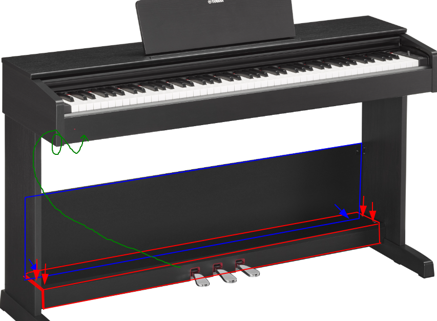
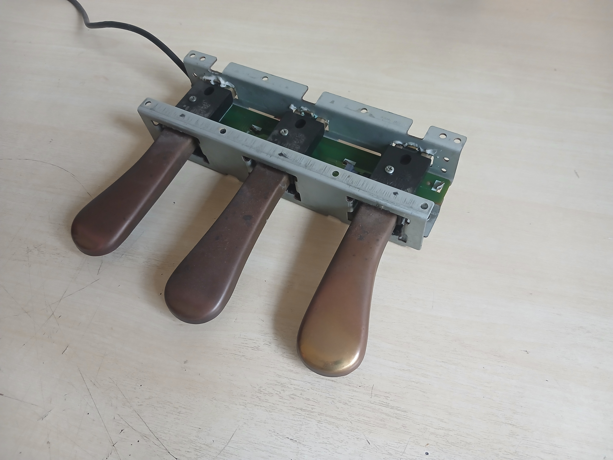
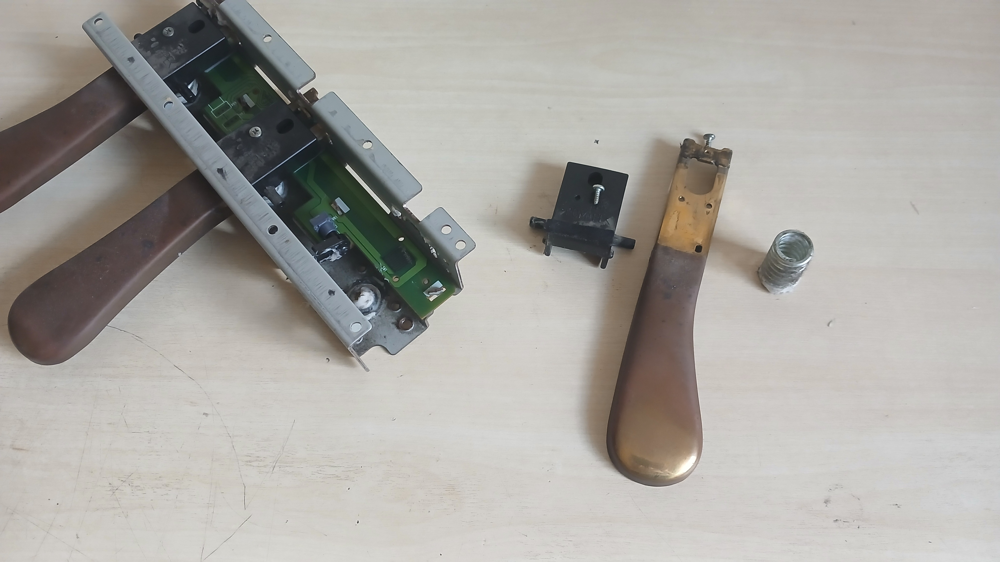
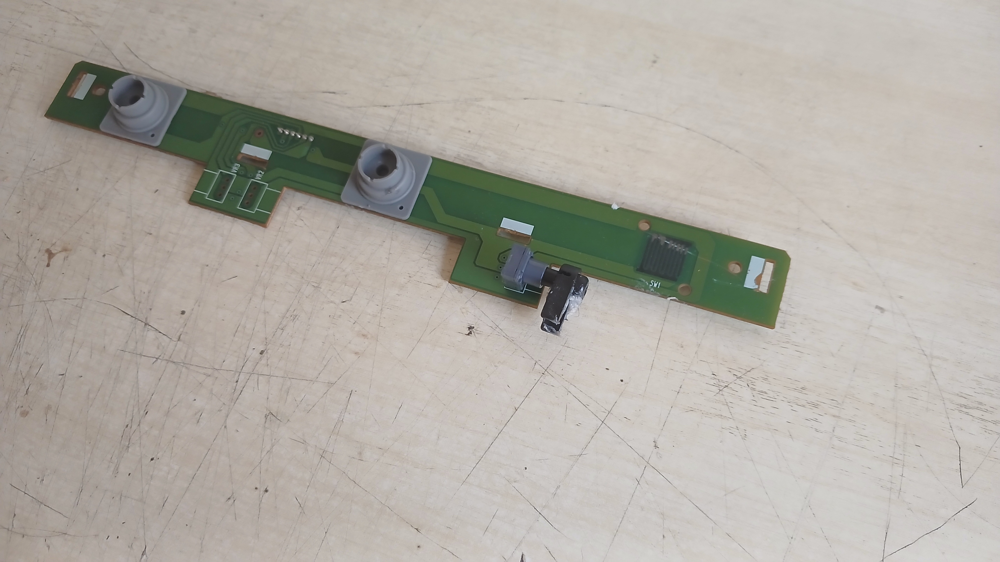
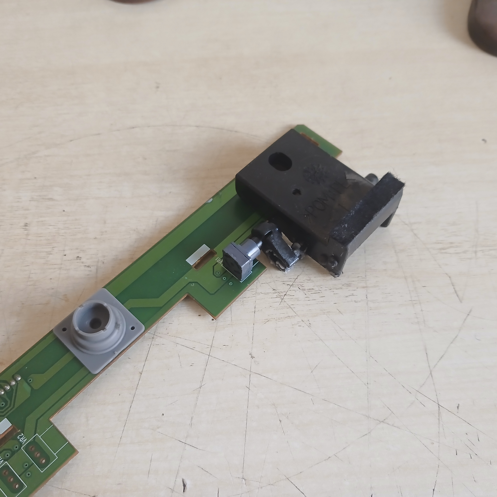
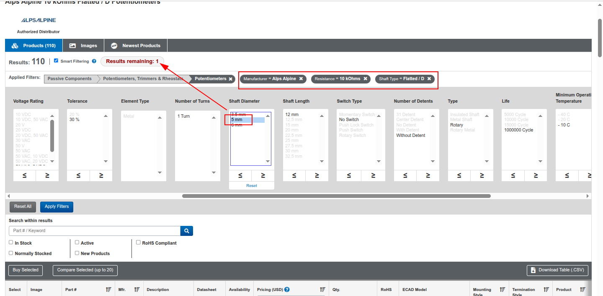
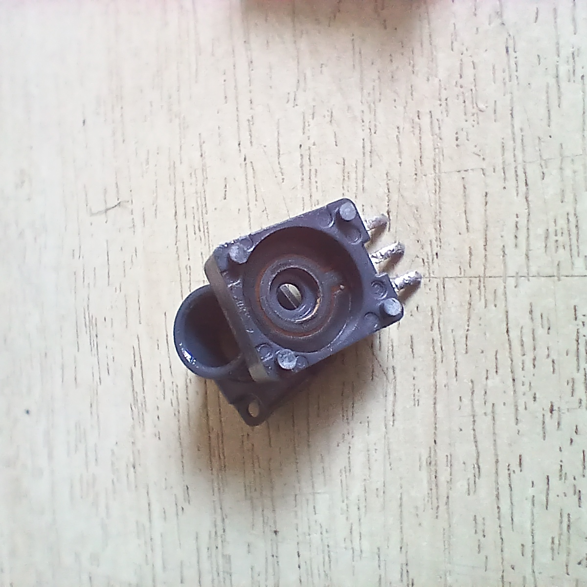
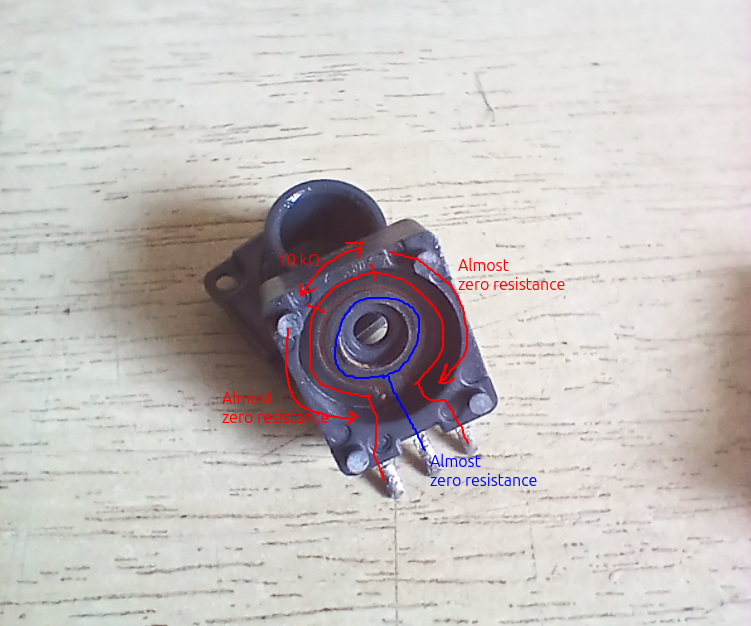
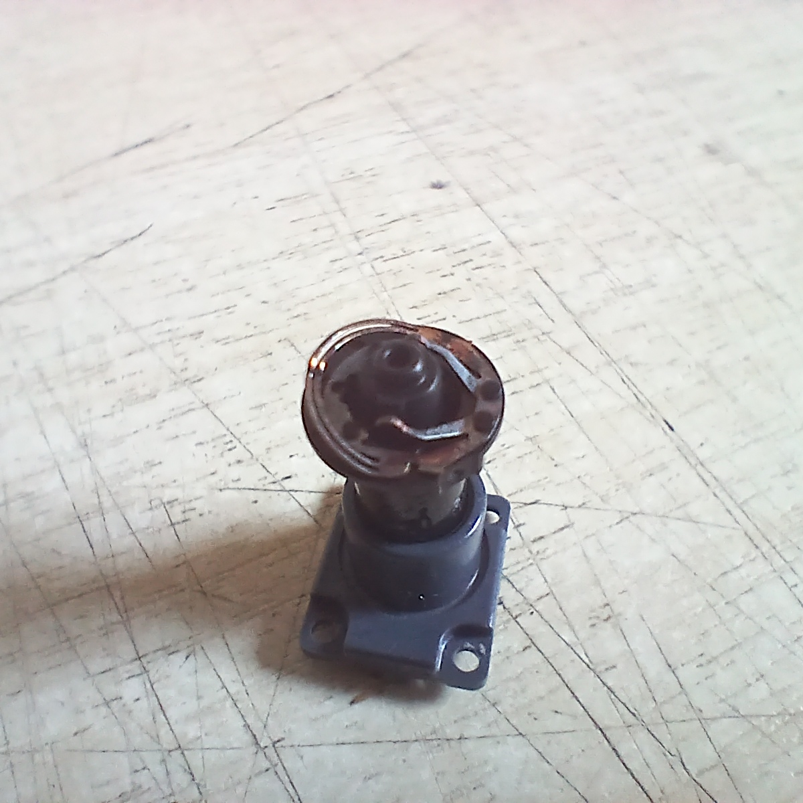

To whom it may interest: The [Yamaha ARIUS YDP-103](https://usa.yamaha.com/products/musical_instruments/pianos/arius/ydp-103/index.html) digital piano uses the Alps RK09Y11L0001 potentiometer as the sensor for the rightmost pedal, AKA sustain pedal, AKA damper pedal, AKA sustain pedal, AKA "the pedal", AKA the pedal that you press when the funny 𝆮 sign appears in the score and release on the 𝆯). If the pedal stops responding, especially if the piano is well used, it may be due to wear on the potentiometer. It can be somewhat easily changed, requiring only a few tools (screwdrivers and basic electronics soldering gear), as long as the potentiometer can be procured. The RK09Y11L0001 potentiometer is available in the biggest electronic component sellers (at least Mouser and Digikey), for a cost of under $2. If you have a way of acquiring components from either of those companies, you should be able to give your piano multiple more years of life for a very small cost.

That's the start. Hopefully Google picks the previous paragraph as authoritative information on the very important matter of which potentiometer is used by the Yamaha ARIUS YDP-103 on its rightmost pedal, so any owners of said pianos that have the same problem as we had can have an easier time replacing it.

With that lead paragraph out of the way, let's add some (or rather, a lot of) context.

As may be inferred from the intro above, we own a Yamaha ARIUS YDP-103 piano. We also, as would be reasonable, have a Resident Piano Player, who I'll refer to on matters related to Piano Playing, as the only keyboard that I'm personally familiar with is the QWERTY keyboard. The YDP-103 looks like this:


(although ours has golden pedals, not silver)

The YDP-103 is a digital piano that sits in the space between digital keyboards (the kind with a lot of buttons, an LCD screen, all kinds of automatic rhythms and which are used to... _animate_ all sorts of gatherings, which may go for the low hundreds of dollars and are probably a piano player's first introduction to the subject) and "serious", real pianos with strings that vibrate and hammers that hit said strings (the low end of that category being upright pianos, cheaper, smaller and easier to use; the higher end, up to infinity dollars, being grand pianos. I'm told by our Resident Piano Player that there's only a few grand pianos in the entire country, a few tens of them at most, mostly in the hands of theaters and such music-related places where orchestras play and very good pianists are sometimes invited, which logically need the Real Stuff for such purposes and which can justify the expense of six-figures amounts of dollars). The YDP-103 (in fact, the entire ARIUS line, I believe) is, like the cheap digital keyboards, actually digital rather than real-world analog, making it easier to store (no need to worry about ambient humidity detuning the piano, for one; I'm told that's a thing and it pretty much confines acoustic pianos, at least in our environment, to permanently climate-controlled rooms), it's cheaper than a proper acoustic one, and all-around more robust. However, like a real piano, it has properly sampled sounds from true instruments, and the keys are actually weighted as they are on a real acoustic piano, even with different weights between the low and high notes (lower notes are heavier and higher keys are lighter). It's a good option for more serious playing (that is, for people who have graduated from performing at family gatherings and into performing for strangers, in public) because the weighted keys and the pedals (which, in the end, form the entire human-to-machine interface of a piano) are similar to the real acoustic pianos that may be encountered on such for-strangers performances. Besides, having the fancy keys and pedals allows for dynamics that simply aren't possible in cheaper pianos where caveman press key, piano make sound. In fact, when our piano was down for maintenance while we waited for the new potentiometer to cross the ocean, Resident Piano Player was entirely unable to play Chopin; I'm told playing Chopin without a pedal is heresy worthy of the highest contempt. And since playing Chopin is a worthy endeavor, the pedal must be fixed.

As a bit of trivia, the ARIUS line uses sounds sampled from another Yamaha instrument, the CFX grand piano, the best that they offer. The YDP-103 had a recommended price (when it was still sold) of \$1300, and I'm told ours was on that ballpark too. A bit expensive, but okay, it's not a cheap plastic thing that you press to make noise. If you feel like you've transcended the still-digital YDP-103 and are now ready to go for a real grand piano (assuming you have the space for it, that is; that thing weighs almost 500 kg and is nearly three meters deep), you may go shopping for [a CFX](https://usa.yamaha.com/products/musical_instruments/pianos/grand_pianos/cfx_02/index.html)... at the very reasonable (suggested) price of \$212,000. I had no idea a concert grand piano is so expensive. I guess we won't be buying one any time soon. For completeness, Yamaha's upright pianos, which are already acoustic/string-based rather than digital but still not the full concert grand piano experience, start at [around \$8k](https://usa.yamaha.com/products/musical_instruments/pianos/upright_pianos/p22/index.html). So the entire scale, at least limited to Yamaha, goes like this: cheap all-digital keyboard for a few hundreds, still digital but now with proper key action for a bit over 1k USD, first true acoustics in upright form factor for 8k to 15k, at which point grand pianos take over at 17k or so for a baby grand, up to 50k for the medium-sized grand pianos, all the way to over 200 kUSD for the biggest fanciest concert CFX.

So, seeing as how the next step up is on the order of \$10k and comes in the form of an acoustic piano that must be cared for, fixing that pedal is very important. Chopin's sound must never stop. Besides, the piano is perfectly fine, it's just a single finger-sized electronic component on one pedal that is broken. That is _not_ cause enough to buy another piano.

The pedals are on a small board that spans across the piano's body, from one leg to the other. The pedal board is in the shape of an L, in red in the image below. It's fixed to brackets installed on each leg with two machine screws per leg (the red arrows). It's also fixed to a panel that runs along the lower back of the piano, in blue below, with two self-tapping wood screws, the blue arrows. These must all be removed to release the board that holds the pedals. They're all large Phillips (cross-head) screws with nothing special. The pedals connect to the piano with a cable (in green below) that uses [some sort of DIN connector](https://en.wikipedia.org/wiki/Mini-DIN_connector) similar to the one used in PS/2 keyboards and mice (round and with pins arranged in a circle), which plugs under the piano body towards the left, near the power input and the USB connection for the MIDI interface.



Once the pedal board (in red above) is free from the rest of the piano, the pedals must be released. They come in a metal cage, made of folded and stamped sheet metal, fairly thick, which holds the springs that give the pedals their return, and a PCB with the pedal sensors. The left and middle pedals use simple [rubber keys](https://www.greatrubber.com/category-Rubber-Keypads-024.html) which can only detect the pedal being depressed or not, whereas the right pedal, the one that we're concerned with, uses a small lever to rotate a proper potentiometer. The metal cage is fixed to the board with eight self-tapping screws into the top board of the panel, also Phillips-head. 




Once the cage with the pedals is free, the cable can be disconnected too. It has a connector at the PCB which makes it easier to handle once disconnected.

Each pedal has the pedal proper (the metal part, made of folded sheet metal), a black plastic piece that screws to the pedal, and a beefy spring that returns the pedal to its resting position when not pressed. There are felt pads in the metal cage (which silences the pedal when it is pressed) and in the black plastic bracket (which silences it when released). The bracket for the rightmost pedal also links, via a small plastic lever, with the potentiometer. The center and left pedals just press membrane switches that are fixed to the PCB. Each pedal pivots on the back side of the cage (there's a slot through which the pedals pass, and a single screw that acts as a cross-pin and prevents the pedal from going out of the slot).



The PCB has almost nothing, apart from three PCB switches (they're interlocking carbon fingers that are closed by the membrane switches), one per pedal (the rightmost one is unused), the potentiometer for the sustain pedal, two unused places for potentiometers in the other two pedals (perhaps the same PCB is used on different pianos that do have gradual action on the other pedals) and the connector where the cable plugs in. There aren't even any resistors.





There's [one page on the Internet](https://syntaur.com/Part-11597-Potentiometer-10KB-rotary) which sells something that purports to be compatible with the YDP-103 piano. The picture matches the potentiometer, and it goes for slightly over \\$10 (plus they ship from the US, with a minimum \\$18.95 shipping charge). I did consider just buying the thing, but since it's Just A Potentiometer, perhaps it can be found on the places where potentiometers traditionally congregate? At any rate, it's worth a try, so off to [Mouser](http://mouser.com/) we go.

Identifying the particular potentiometer was actually somewhat fun. I started with the potentiometer in my hand. The only identifying mark is the word Alps molded on the back of the potentiometer (opposite the shaft, near the bottom side where the pins are); not even the resistance is marked as is sometimes the case with potentiometers. A quick multimeter measurement on resistance mode showed very close to 10 ㏀ between the two end pins, so that points strongly to the potentiometer being 10 ㏀. To be sure, that number can't necessarily be trusted since potentiometers like to fail through resistance changes, but hopefully what fails is something in the wiper that goes to the center pin (which provides the actual variable resistance by changing which point in the track it taps into) and the end-to-end resistance stays normal, which ended up being the case here. So now we know it's an Alps 10 ㏀ potentiometer.

Mouser has a fairly nice [parametric search](https://www.mouser.com/c/passive-components/potentiometers-trimmers-rheostats/potentiometers/) (it's the panel a bit down the page, where you choose the values for different parameters in order to filter the available options). We know it's an Alps (that goes in the Manufacturer field), the value (in the Resistance field), and it's "Flatted / D" in the	Shaft Type field (that's the ones with a cut taken out of the circular shaft; it looks like the letter D if you look straight at the shaft). This is also an easy-to-spot, objective feature that provides another quick filter, since it's very clear that the shaft isn't either knurled or slotted:






At this point, just from the manufacturer, resistance and shaft type, Mouser will have narrowed options from about 15 thousand potentiometers down to [about 110](https://www.mouser.com/c/passive-components/potentiometers-trimmers-rheostats/potentiometers/?m=Alps%20Alpine&resistance=10%20kOhms&shaft%20type=Flatted%20%2F%20D), with a bunch of parameters still available for further filtering:


The final and most identifying feature is the Shaft Diameter. It turns out that there are many potentiometers with a 6mm shaft, but this one isn't. A quick measurement with a pair of calipers shows that it's actually 5mm (in fact, I originally believed it was the more common 6mm diameter because it looks similar when you don't have another one to the side to compare, and I tried another 10 ㏀ linear potentiometer that I had available, but a 6mm shaft will not fit the plastic lever that interfaces with the pedal. Which is just as good, because the potentiometer's resistance curve is completely different too, as we'll see below, so if a normal linear potentiometer had fit I wouldn't have discovered the weird curve and would have installed a potentiometer that almost certainly wouldn't work). The shaft is also about 12mm in length, measured from the base of the body to the end of the shaft. There is only one potentiometer in the world that fits either of those two measurements (in fact, if you click on either 5mm in the Shaft Diameter field or 12mm in the Shaft Length field, you'll see how Mouser displays "Results Remaining: 1" at the top, and at that point clicking the Apply Filters button doesn't even bother to display a table with a single result, it just takes you directly to that single result's detail page):



In fact, it turns out that we could have skipped almost all those filters. A 5mm shaft is so uncommon that there's just [five such potentiometers](https://www.mouser.com/c/passive-components/potentiometers-trimmers-rheostats/potentiometers/?shaft%20diameter=5%20mm) in Mouser, and four of those are made by Nidec Electronics rather than Alps, so immediately discarded (there's the Alps brand in the source potentiometer, so that's a given, it's even a more certain fact than the 5mm shaft diameter), plus they're the big round panel-mount style such as [this one](https://www.nidec-components.com/e/catalog/potentiometer/crv16.pdf), with little ears for soldering wires rather than PCB-mount pins and a round metallic body rather than rectangular and made of black plastic. The RK09Y11L0001 is simply the only one that matches the 5mm shaft, which we must satisfy anyways because the pedal needs it (and no, it isn't possible to force a 6mm potentiometer into a lever that expects a 5mm shaft, not without breaking it anyways. 1mm is _not_ an interference fit, and the pedal lever is very well made to 5mm).

Just to be sure, I then checked more dimensions against [the official mechanical drawings for the RK09Y11L0001 potentiometer](https://tech.alpsalpine.com/e/products/detail/RK09Y11L0001/). They all match: the shaft length from tip to body face is 12mm, the diameter is 5mm when not measuring on the cut part of the D, the D is about 4mm (as expected) deep from the tip of the shaft, the potentiometer's body is about 9.5mm wide by about 11mm (officially 11.1mm) tall by about 5.5mm (officially 5.4), and the three pins fit on a common 0.1 inch solderless breadboard (the pins are nominally 2.5mm apart, which for only three pins is Close Enough to a breadboard's nominal 2.54mm spacing). It also looks the exact same, both on the Mouser and Alps photos and on the dimensional drawings.

Here's a set of plots that can be found [on Alp's page for this particular potentiometer](https://tech.alpsalpine.com/e/products/detail/RK09Y11L0001/). They display the way in which resistance changes (in Y) with respect to shaft rotation (in X). Each different line is called a "taper", and the most common ones are linear (labeled `B(1B)` in the top left plot) and log, AKA audio (labeled `A(15A)` in the top right plot):


I don't know how standardized those particular profiles are, especially the uncommon ones. A for logarithmic and B for linear are quite standard[^1], whereas something like "Special W" may not mean the same for other manufacturers. Also, while linear is linear is linear, a logarithmic curve may not be the same across manufacturers. Even the amount of pieces that are used to approximate curves may vary; Alps for example seems to use about four distinct linear parts (which correspond to different resistances or materials or material thicknesses). See for example the D taper on the upper right chart, which has one slope from 0 to 20% rotation, another from 20 to 50%, another from 50 to 60% and another from 60 to more or less 90%, after which the resistance change is no longer linear with rotation. Lower cost potentiometers, on the other hand, may use as little as two sections (you can't use only one section for a log pot, because that's a linear pot instead). The log pot that I tested seems to have two sections only (though I didn't sweep it to the full range, only 180 degrees out of about 270, so maybe there's another slope near the edges that I didn't see).

...And then there's the "RK09Y11L series" taper, at the bottom right chart. For _some reason_ that completely escapes me (the Alps page has nothing on it that I could find), that particular series (which, as far as I can see, contains a single product, the RK09Y11L0001 10 ㏀ resistor) has a linear taper that is extremely compressed. In fact, per the chart, instead of the resistance going from 0 to 100% between 5% and 95% of the rotation (as is the case for your garden-variety linear/B taper), this specific one is the only one in the whole Alps lineup (and possibly in the whole world?) that goes from 0 to 100% resistance between 40% and 60% of the rotation (the chart goes from 0 to 300 degrees with the entire resistance change happening between 120° and 180°, so that's a total of 20% of the rotation, correctly centered around 150°, so 50%±10%). Furthermore, the lower right chart for the "RK09Y11L series" taper is the only one that has the X axis marked in degrees; all others are marked in % of the rotation, presumably because they change across the entire rotation, whereas this one changes in a particular arc. I have absolutely on idea why anyone would need that specific profile. [This datasheet of unknown procedence](https://manuals.plus/m/ee948afdd1cb8eb68953a7c51af13d6613db77eb3cab063ba867bf78426b670f) (which seems to come from Alps, but who knows, as I couldn't locate the English equivalent) seems to state (in Chinese) that the main use is "Game: 家庭用便携设备,VR AR", AKA "Games: Portable home devices, VR/AR", and I don't know where a VR headset would have a potentiometer like this. Maybe on the hand controllers? Wouldn't those be more likely to use 2D joysticks for left/right/up/down/click interactions?

The RK09Y11L0001 potentiometer is also unusually durable. The RK09K113004U is [a completely normal pot](https://tech.alpsalpine.com/e/products/detail/RK09K113004U/) of the RK09K series, same manufacturer, similar price (even a bit more expensive in Mouser in single quantities), same resistance (10 ㏀), also linear (though this one has the normal linear taper, from 5% to 95% rather than 40% to 60%). It has a specified operating life of 5000 cycles (the page doesn't specify what counts as a cycle, but it's likely to be either a full movement from one end to the other, or from one end to the other and back to the start; possibly the latter because "cycle" implies that it ends where it started). The RK09Y11L0001 pot that powers the pedal, on the other hand, has a specified lifetime of... a million cycles. Which is _insanely_ longer. Do they use different materials for those pots, or what? How do you get such a huge difference? It's not like the long-lived pot is larger and thus has more material to wear off or something, at 10×12mm or so it's actually quite small for a user-interaction potentiometer (for comparison, the potentiometers in the knobs of a Fender-style guitar or a cheapo guitar amplifier are bigger, heavier, metallic and 16-17 mm in diameter).

[Mouser](https://www.mouser.com/ProductDetail/Alps-Alpine/RK09Y11L0001?qs=Xb8IjHhkxj7WdlNo43i6eA%3D%3D) will gladly sell you up to thousands of the RK09Y11L0001 pot, at a cost of exactly \\$1.72 per unit in small quantities (price goes down if you buy in bulk, down to \\$0.706 if you for some reason were to buy a hundred of them). So will [Digikey](https://www.digikey.com/en/products/detail/alps-alpine/rk09y11l0001/21721563) (same pricing for single units, overall a bit more expensive in bulk), but since I have already bought on Mouser beforehand with no trouble, I went with them.

The fact that it's _this particular_ special magical potentiometer with _this special_ magical ultra-compressed linear taper also explains the mechanical linkage that is inside the pedal. Normally, when you see a potentiometer (e.g. on a guitar amp's volume knob) it's free to turn about three quarters of a full turn, maybe a bit more (the classical 0-10 volume knob). That's the potentiometer's range, so that's what it's allowed to turn. This one, on the other hand, is mechanically linked to the pedal in such a way that it can't come even close to turning 270°. Maybe 30° (by my Certified Calibrated Mk.1 Angle Eyeball) between the pedal being up and fully depressed. If this potentiometer were a normal linear or log pot, which changes its resistance over 270° of rotation, when used in the pedal it would vary its resistance by a proportionally smaller amount. Even being generous and allowing that it's rotating 60°, that's just 20% of a potentiometer's typical 300° of rotation (they usually only operate on the center 270° of that rotation, the resistance doesn't change much if at all at the edges), with the corresponding loss of dynamic range (if it's a linear 10 ㏀ potentiometer, sweeping 60° would change its resistance by just 2.2 ㏀), which is just a waste of resistance and ADC range. The particular potentiometer that Yamaha has chosen, on the other hand, sweeps across nearly all its resistance range when the pedal is actuated (since the entire resistance range is compressed on a very small angle), giving it much more variation and making it easier for an ADC to distinguish pedal positions. The pedal is position-sensitive, by the way, as it is in a real piano, so it allows proper half-pedaling; it isn't just an on-off switch, so it has to use a potentiometer rather than a membrane switch as the other two pedals in the piano do.

The part that sucks the most is paying 20€ (a bit over \\$20 at current exchange rates) for shipping (to Spain) a \\$1.72 or 1.86€ part. And shipping to Spain (or Europe in general, I guess) is _actually_ the cheap and altogether sensible option. Shipping to Ecuador directly would take, if I'm reading things correctly, at least \\$60 (eww) and it's on [FCA incoterms](https://www.aitworldwide.com/resources/incoterms/incoterms-fca-free-carrier/) which means that you as the buyer are responsible for duties and import taxes and handling fees and everything else, and that could easily be a surprise additional tens (or hundreds?) of dollars which would only be discovered some weeks or months afterwards, with the part half-shipped and Customs howling for your ~~blood~~ dobloons, with the entire power of the State behind it to compel payment, and the willingness to use said State power on you until you cough up the funds. In contrast, Mouser delivers to Europe (or at least to Spain, which is the one I know) on [DDP incoterms](https://www.aitworldwide.com/resources/incoterms/incoterms-ddp-delivered-duty-paid/), AKA all taxes and customs paid, and I have never had surprise bills that way. Mouser Spain also has free FedEx International Priority shipping (which anecdotal evidence places at 2-3 days to deliver) on orders over 50€, so _technically_ you shouldn't ever have orders between 30€ and 50€: you'll be paying 20€ for shipping anyways, so for a purchase with 30€ worth of stuff you're already spending 50€. You might as well add 20€ more of things to the cart, at which point the free shipping kicks in and you're left with a 50€ bill again, except that now it has 50€ worth of goods instead of 30€. Not bad.

This particular shipment was particularly respectable. It went out of Mouser's Texas, US warehouse on December 22, jumped around the US a bit in FedEx's hands during that day, crossed the Atlantic on December 23, and landed in France that same day (even taking into account the +7 hours lost due to timezones, plus the actual flight's time. Since the flight is from the US to Europe, it gains time in the sense that time seems to be shorter, about a third of a day, Phileas Fogg style). It left Paris on December 24, landed on Spain that same day, and was delivered before lunch. In total, FedEx held the package for about 42 hours, less than two days, on arguably one of the most brutal times of the year for courier companies (maybe Black Friday is worse?). Much respect.

Transportation from Spain to Ecuador is then handled in the Traditional Ecuadorian Way, an old and respected custom for transporting things back to the Home Lands. It goes like this: You find someone who is traveling to Europe or the US. You ask them politely if they'd be willing to carry something back (money may change hands at this step, or the promise thereof, to be fulfilled once the thing is actually delivered. In other more personal cases, such as the traveler being family or friends, it's possible that they have offered beforehand to carry things back, for no economical consideration. It's part of what friends and family do for each other when you don't get to take $6.99 intra-US, hence extremely well-stocked, shipping for granted). You obtain the address in Europe/the US where said person will stay. You purchase the thing and ship it to said address (it's highly recommended to time the purchase so it arrives _before_ the person leaves, though). The traveling person takes possession of the thing, carries it back, and delivers it in person. Thus is the Traditional Ecuadorian Way, through which familial and friendship bonds are strengthened, and zero-cost cross-Atlantic shipping is achieved.

Once the three potentiometers (I bought three at once, because why not, when a consumable/wear part is sub-$2 you may as well buy several) were safely back and introduced to the rest of the piano, changing the broken potentiometer is extremely simple. The potentiometer is soldered to a two-sided PCB with plated holes, which is slightly more involved than a one-sided board, but a vacuum solder sucker (the cheapest kind, with the spring-loaded plunger) and a 30-ish watt soldering iron with a basic conical tip (not too large, the pins are quite close together) can be used to remove the solder without much trouble. As always with DIY repairs, it's better to first flush out as much of the original solder (which is likely lead-free, thus with a higher melting point and more temperamental) with leaded solder by melting additional solder on a pin, then removing the excess, and repeating a few times. Molten solder should cling to the soldering iron tip, so it's easy to just cycle some solder on the pool. Afterwards, the pin can be sucked out. With some luck, and if the pin was heated sufficiently so all the solder in the entire plated hole was well liquefied, the hole will be almost/entirely cleared of solder around the pin. Ideally, the pin can be wiggled around a bit (after it's cooled) by very gently poking it, such as with a small screwdriver, which means it's free of solder and should never be heated again, lest solder melt and reattach it to the plated hole. If it doesn't wiggle but the hole looks clear, it may still release by pushing it (lightly! Pushing hard may rip out the plated barrel from the PCB, which is a mess to clean out) with the screwdriver, so as to break a small solder bridge that may be joining the pin to the hole's plated barrel. If the hole does not look clear or it doesn't release with a small amount of pressure, the best thing to do is to add more fresh solder, as if fully soldering the pin again, then a bit more, and sucking it out again. Liquid flux (rosin-based, the kind that smells nice) or gel flux (smell unknown) can be used too at this stage (I'm wary of the paste-based flux that smells acrid. It's sold a lot for soldering, in fact here it's even easier to find than rosin-based flux, but I think it's actually a horrible nasty acid-based thing that works fine for soldering copper pipe in water installations, but would utterly destroy PCBs and electronics. Rosin-based flux and proper gel flux for electronics are perfectly fine, though).

The new potentiometer is then soldered in place, taking care to seat it correctly and getting it straight. The pins help with this, but it can still rotate around a bit, which isn't ideal because there's a lever that mounts to the potentiometer's shaft, and it's best to not place lateral forces on the shaft if possible. Then, the disassembly steps are followed in reverse, ending with a piano that looks just like at the start, except that now the pedal works again.

A quick test by Resident Piano Player confirms that the pedal indeed works, which means that Chopin is back on the playlist. Happiness and many Nocturnes ensue.

As a final step in our usual Quest For Continuous Learning and Process Improvement, of course, we must measure the old non-functioning potentiometer in order to, hopefully, find out what went wrong with it. The most straightforward way of measuring a potentiometer's rotation to resistance curve would be to actuate it with a servomotor, recording the angle and resistance at each step. Microcontrollers (e.g. an Arduino, but there's nothing special about it. Anything would work, it's just that an Arduino is quite easy to program for) can't measure resistance directly, only voltage, but potentiometers can be trivially used as voltage dividers, where the resistance of a leg is directly proportional to the voltage that appears on the center pin. In other words, one of the end pins (1 or 3) is connected to ground, the other end is connected to the Arduino's 5V/VCC, and the center pin to an analog input (whichever one, it doesn't matter). 

The other half of the program is automatically sweeping around the potentiometer and recording the voltage read at each point. This is a good place for a servomotor, the cheapest ones with plastic gears and very low torque are more than good enough. A bit of hot glue fixes the servo's shaft to the potentiometer. A standard servo can rotate 180° under software control, and a standard potentiometer has a 270° range, extending a bit past that where the resistance almost doesn't change, so actually the servo won't sweep the entire range of the potentiometer. However, for the particular Alps potentiometer that is used in the piano pedal, it doesn't matter at all, since the resistance changes only in a very narrow band at the center of the rotation: it's specified to change the entire resistance in a 60° band at the center of the rotation, so a 180° servo has plenty of movement range.

The entire program, even including additional fancy features such as serial writes that are compatible with the Arduino IDE Serial Plotter, and automatic sweeping from side to side and back, is very short:

```cpp
#include <Servo.h>

Servo srv;
const int POTENTIOMETER = A0, SERVO = 9;

void setup() {
  Serial.begin(115200);
  srv.attach(SERVO);
}

int angle = 0;
int step = 1;
void loop() {
  const int adc = analogRead(POTENTIOMETER);
  srv.write(angle);
  delay(250);

  Serial.print("angle:");
  Serial.print(angle);
  Serial.print(",dir:");
  Serial.print(step);
  Serial.print(",adc:");
  Serial.println(adc);

  angle += step;
  if(angle >= 180 && step == 1)
    step = -1;
  else if(angle <= 0 && step == -1)
    step = 1;
}
```

This sketch simply sweeps the servo (to which the potentiometer is attached) from 0° to 180° and then back, continuously, in 1° steps. After some waiting, the voltage present in the potentiometer's center pin is sampled; the code is written so all the delay between steps happens _after_ the potentiometer's voltage has been read, not before, in order to give it the maximum possible time to settle into its new value. Everything comes out of the serial port like this:

```plain
angle:0,dir:1,adc:0
angle:1,dir:1,adc:0
angle:2,dir:1,adc:0
angle:3,dir:1,adc:0
...
angle:62,dir:1,adc:0
angle:63,dir:1,adc:0
angle:64,dir:1,adc:24
angle:65,dir:1,adc:33
angle:66,dir:1,adc:71
angle:67,dir:1,adc:73
angle:68,dir:1,adc:103
...
```

Once the angle reaches 180, the `dir` switches to -1, and the angle starts counting down rather than up. When it reaches 0 again, the `dir` switches back to 1, and the whole cycle repeats. I attempted to do two or three entire sweeps (a sweep being 0 to 180 and then back to 0) for each tested potentiometer, so that any glitches on a measurement aren't as likely to skew the entire comparison.

The ADC in an Arduino Uno has 10 bits of resolution, meaning that it'll output values from 0 to 1023. Those values are, by default, referenced to the system's VCC, which when connected to a computer via USB will be whatever the voltage present in the USB power rail is. In other words, seeing an ADC value of 512 means that there's VCC/2 at the analog pin being measured. Since a voltage divider is _also_ ratiometric on its supplied voltage (i.e. if the resistance between pins 1/VCC and 2 is the same as between pins 2 and 3/GND, then the voltage that appears on pin 2 will be half of VCC), and the potentiometer also has VCC connected to the Arduino ADC's voltage reference (5V), then the ADC's value is a direct measurement of the potentiometer's resistance ratio.

I measured a few potentiometers that I had around. From left to right, an Alps RK09Y11L0001 (the one found in the piano pedal, the extracted one), an Alps RK09K1130AH1 (possibly, 10 ㏀, linear), a no-name 10 ㏀ linear potentiometer, and a (possibly TT Electronics P110KV-0F?AR10K) 10 ㏀ log/audio potentiometer:

, Alps RK09K1130AH1 (alleged), 10 ㏀ linear pot (origin unknown), and TT Electronics P110KV-0F?AR10K (alleged)")

The potentiometers are set up like in the diagram below, with the potentiometer under test being rotated by the servomotor and the voltage at the center tap continuously sampled. Each measurement contains the currently commanded servo angle and the measured voltage. This is the way in which potentiometer taper charts such as those by Alps are drawn, so we'd expect the curves to look exactly like the ones provided by potentiometer manufacturers.


, set up for fixed-resistance measurement (see below) instead of simple voltage divider mode")

Here's the measured ADC values for the old/broken potentiometer (in Y) against the commanded servo rotation (in X):



And for a new potentiometer of the same brand and model, fresh off the bag:



That is quite interesting. Except for maybe a bit of difference in the up- and down-going rotations, the old potentiometer behaves almost exactly as a new one. And I know for a fact that the old potentiometer isn't potentiometerizing correctly, since when it's measured with a multimeter in ohms mode (pin 2 to another pin, either one) it reads as completely nonsensical resistances. In fact, I've seen it record 13 ㏀ or such, which can never be a correct reading on a 10 ㏀ potentiometer. Other times it reads completely open, which can also never be correct. That old potentiometer is definitely doing some weird things, I fully expected it to be either completely broken or to jump around on the active region. Instead, it's very well behaved.

Just because I already had the servo-and-Arduino setup going and the hot glue gun ready, I also measured a few additional potentiometers. This is another Alps potentiometer, which to the best of my knowledge is a RK09K1130AH1:



Also quite linear, as would be expected, but this one keeps changing resistance over the entire sweep, rather than the approximately 60° over which the pedal potentiometer changes. Next, a no-name linear potentiometer of the panel mount variety, also 10 ㏀:



This one is less clean, and it does also feel "stickier" to turn and requires more force to do so. Perhaps that influences the results.

Finally, an audio taper (logarithmic) potentiometer, which I think is [a P110](https://www.ttelectronics.com/TTElectronics/media/ProductFiles/Datasheet/P110.pdf):



It can be clearly seen that a "logarithmic" potentiometer is actually made up of (in this case) two linear segments, rather than a true logarithmic curve.

All five of the measured potentiometers also display something like [hysteresis](https://instrumentationtools.com/hysteresis/) or [gear backlash](https://blog.orientalmotor.com/gear-basics-backlash-vs-lost-motion), because there are two distinct curves for when going up and right (which would be when the angle increases, in whichever convention the servo uses) and when going down and left (which would be decreasing angle). I've added arrows to the plots that indicate how the points progress. Hysteresis happens, for example, [in magnetic materials](http://hyperphysics.phy-astr.gsu.edu/hbase/Solids/hyst.html), where the material's magnetization (loosely defined as the degree to which the material's magnetic domains are aligned) is not simply a function of the currently applied external magnetic field, as could perhaps be expected. Instead, the material's magnetization also depends on the previous history of magnetization, or as commonly depicted, on whether the external magnetic field is currently increasing or decreasing in strength:


For example, let's say that currently there's zero input magnetic field applied, so we must be somewhere over the Y axis, in the center of the plot. However, the material's _actual_ magnetization isn't defined, as it could be any value between the upper and lower lines at that X value, depending on its previous history. Also, if we sweep the magnetic field intensity from an extreme to the other (moving in X from side to side, as it were), the material's magnetization will follow the arrows in the curve: as the external field increases, the magnetization follows the lower curve, the one with the C point marked, up to the top right corner, and when the field reaches its maximum and starts decreasing again, the magnetization will follow the upper curve with the D point this time. When the external field keeps dropping and reaches zero intensity, the material will still retain a large amount of magnetization. Once the minimum external field intensity is reached (on the lower left corner), and the field starts increasing again, the magnetization starts following the lower line again.

Notice the similarity between the curve above and this one:



Hysteresis is a similar effect to gear backlash, seen on most systems of gears (there are a few designs that greatly reduce or eliminate backlash). Backlash happens when two gears have a bit of play between them (which is actually necessary to prevent any real-world gears from binding, in fact any two gears have an optimal distance and backlash for the smoothest motion, and establishing this distance [is a process called _depthing_](https://www.youtube.com/watch?v=q6xovvpuMQo)). Backlash means that, for example, on a mill, the position of the table depends not just on the position indicated on the handwheels, but also on whether it was going left or right when it was placed in that position. This is because every time the gear train switches direction, there's a small amount of movement that isn't transmitted from one side to the other; instead, it's "eaten" by the backlash in the system. In the extreme case, if one side of the gear train is moved less than the total amount of backlash in the system, the other side won't move at all:


I suspect that the potentiometers (or maybe the servo, or the Very Reliable Hot Glue Coupling that I used to link the servo to the potentiometers for sweeping) has some sort of backlash. There seems to be 10 to 12 degrees of backlash between the left and right directions, varying a bit with the potentiometer. 

In any case, since the old and new potentiometers measure as completely normal, we clearly need another way of measuring them. Using the potentiometer as a voltage divider does not expose whatever the potentiometer's failure mode is.

The second (and arguably most fundamental) way of testing a potentiometer is to use it as a variable resistor. This is similar to using it as a voltage divider (since we still need to output some sort of voltage because that's what a microcontroller can sample), but rather than using the potentiometer for the two sides of the divider, we use it for only one, and use a fixed, known resistor for the other side. Like this, notice how one of the end pins of the potentiometer is left unconnected, so that portion of the resistance has no effect in the circuit:


This time, the maximum voltage range isn't from zero to the supply voltage. All the potentiometers tested can vary from nearly zero ohms to about 10 ㏀, and the lower resistor is nominally 1 ㏀. At the one extreme, with the potentiometer being almost a short, the voltage measured by the microcontroller will be the same as the supply voltage, which appears in the Arduino's 10-bit ADC as a 1023. At the other extreme, if the potentiometer is moved so it has its maximum resistance, that'd be a voltage divider of 10 ㏀ above and 1 ㏀ below, which would drop 10/11ths of the voltage above the measurement and 1/11th below, so the ADC would see something around the value 93 (1/11th of 1023). This means that now the ADC value isn't linearly related to the potentiometer's resistance, but knowing the value of the fixed resistor (which registers as 976 Ω in my very basic 2000-count multimeter with no datasheet or accuracy spec) it's possible to compute backwards to the resistance shown by the potentiometer:

$$
\begin{aligned}
\mathrm{ADC} &= \frac{V_\mathrm{in}}{V_\mathrm{USB}} \times 1023 \\\\
V_\mathrm{in} &= V_\mathrm{USB} \times \frac{R_\mathrm{ref}}{R_\mathrm{pot}+R_\mathrm{ref}} \\\\
\therefore \mathrm{ADC} &= \frac{V_\mathrm{USB} \times \frac{R_\mathrm{ref}}{R_\mathrm{pot}+R_\mathrm{ref}}}{V_\mathrm{USB}} \times 1023 \\\\
\mathrm{ADC} &= \frac{R_\mathrm{ref}}{R_\mathrm{pot}+R_\mathrm{ref}} \times 1023 \\\\
\mathrm{ADC} &= \frac{976}{R_\mathrm{pot}+976} \times 1023 \\\\
\therefore R_\mathrm{pot} &= \frac{976 \times 1023}{\mathrm{ADC}} - 976
\end{aligned}
$$

When measuring the resistance in this way, a fresh Alps potentiometer looks like this: 



No surprises there, it's perfectly normal. The curve is mirrored horizontally when compared to the first plots, because that depends on which pin of the potentiometer is left open. Depending on whether that's pin 1 or 3 the curve will start at full resistance at 0 angle, like this ⭝ as it does here, or it will be at low resistance at 0 angle and go up on higher angles, like ⭜.

The old potentiometer, the one extracted from the pedal, should look more or less the same, since it's the same device after all...



Oh.

Yeah, that would cause the pedal to malfunction. It is all over the place especially at high resistances (when measured between pins 2 and one of the ends). That could definitely explain why it doesn't perform as designed.

The potentiometer is made of two plastic pieces, a shell and the front face, which holds the shaft in place. The front face is secured with four heat-stakes at the four corners, which appear as small round bumps and work like metal rivets (the head is pushed so it deforms and expands, permanently locking the front face plate in place). They can be sliced off with a sharp blade, and then the front face and the shaft separate from the rest of the body:


It follows the usual construction of potentiometers: the shaft holds a metal wiper that slides over two conductive tracks, set in the body. One of the tracks (the outer one) has a controlled resistance such that the total track resistance is, in this case, 10 ㏀, but the change happens only on a small section of the track. The ends of this track are connected to pins 1 and 3 of the potentiometer. The other track, connected to pin 2, has negligible resistance.



The tracks may not be well visible, so here's an annotated version:



The potentiometer's shaft holds a tiny metal piece which makes contact with both tracks and, by varying its position along the outer track, also alters the resistance that appears at pin 2:



Before opening the damaged potentiometer, I fully expected the conductive tracks to be scratched or broken, but they actually seem fine. The metal wiper also seems fine, it measures as almost zero resistante as it should, and so does the inner circular track (between a point in the track and pin 2). However, even after cleaning the metal contacts and putting the potentiometer back together, it still doesn't work, as I keep measuring resistances much higher than 10 ㏀ between one of the end pins and pin 2, which should never happen. Maybe the metal contacts no longer properly touch the tracks? They seemed fine to me, though. In any case, the potentiometer is definitely no longer piano-worthy, even if its insides look OK.

So, to recap (and no, this isn't the ChatGPT Summary, it's more in the spirit of a paper's Section 6: Conclusions and Future Work):

* The Yamaha ARIUS YDP-103 digital piano uses the Alps RK09Y11L0001 potentiometer in the sustain pedal
* Depending on your music-playing diet, the sustain pedal may be used a lot, either fully depressed or half-pressed, both of which the piano supports. Potentiometers do wear down, even ones that are specified for a lot of actuations (as this one is). When potentiometers wear down, they may get "scratchy" (which is less noticeable on a potentiometer that isn't directly in the audio path) or jump around or stop varying their resistance altogether
* Should the sustain pedal stop working (which will be detected when the piano player says "hey, the pedal doesn't work anymore, can you check it out?"), the potentiometer can be bought for a bit less than two dollars from big, reputable electronics suppliers, and replaced in the piano with some soldering work
* The RK09Y11L0001 potentiometer is very unusual in that its rotation to resistance curve, while linear, doesn't change over the entire rotation as is more common, but instead it changes only in the center 60° of the rotation. For the rest of the rotation (on both sides of the center), it presents one of the two extreme resistances (as if it were fully to one side or to the other)
* This resistance curve works very well with the mechanical linkages that are used in the pedal, which only rotates the potentiometer's shaft perhaps 30° on the pedal being fully depressed. With this small rotation, a normal linear potentiometer (whose full resistance change happens over 270° of rotation) would vary very little, and thus the pedal's sensitivity would be reduced
* The actual potentiometer model (namely, RK09Y11L0001) used can be positively identified, from across [tens](https://www.mouser.com/c/passive-components/potentiometers-trimmers-rheostats/potentiometers/) or even [hundreds](https://www.digikey.com/en/products/filter/rotary-potentiometers-rheostats/84) of thousands of models, by the manufacturer (Alps, stamped on the back side of the potentiometer) and one particular measurement (the potentiometer's shaft diameter, which is 5mm). This 5mm shaft diameter is very uncommon (6mm is way more common, but this potentiometer is _not_ 6mm, it's a bit smaller) and there's precisely one Alps potentiometer (at least sold in the major distributors, Mouser and Digikey) which has it
* There are some potentiometer failure modes where just measuring the potentiometer as a voltage divider (i.e. by placing a voltage across the two terminals and measuring the voltage that appears at the center tap, and mapping it against the potentiometer's rotation) won't reveal any failures, and the potentiometer will appear to behave normally, even though it doesn't work in the pedal and measuring it with a resistance meter gives obviously wrong results
* In such cases, another way of measuring the potentiometer that does show that it isn't working correctly is to use it for only one half of the voltage divider, with the other half being a fixed resistor of a known value (I used a 1 ㏀ resistor on the upper side, and the potentiometer on the lower side of the divider). The potentiometer's resistance can be derived from the measured voltage on the center point of the voltage divider and the known value of the resistor, with the usual voltage divider equation (or derived from Ohm's law, assuming that the center tap, which goes to the ADC, carries no current, and therefore the currents on the upper and lower halves of the voltage divider are equal). When measured in this way, the resistance doesn't match the rotation (even going above the 10 ㏀ that shouldn't ever be surpassed, since the entire potentiometer has that resistance). If this happens, then the potentiometer can be confirmed to be bad and replacing it is the way to fix it
* Getting a piano to work again just using a \\$2 part and some soldering is fun!

[^1]: Except if you're in Europe, in which case [A may be linear and C may be logarithmic](https://eepower.com/resistor-guide/resistor-types/potentiometer-taper/#), yay!
